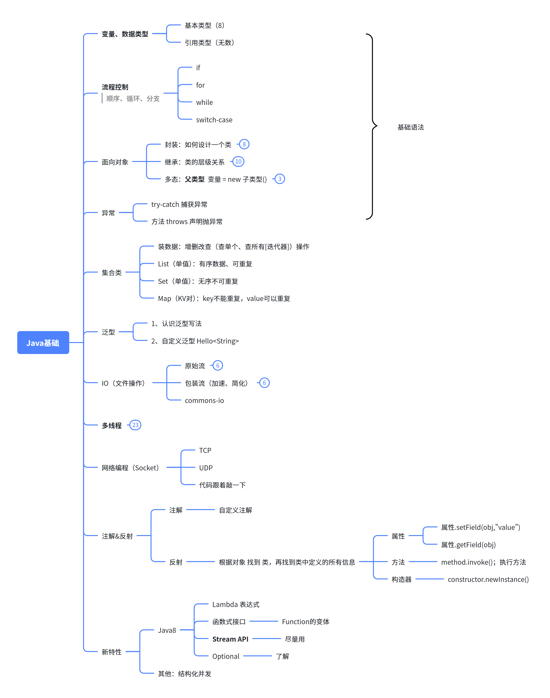

# 14. 综合小练习

以后如何才能写出自己想要的效果的代码？



如何写出一个**好代码**？【**熟练工**】

1. 代码具有**可读性**； 变量/类/方法命名，** 见名知意；**
2. 代码具有**可扩展性**；class USB { //所有功能 } ; 习惯多态用法；用抽象，切换实现； 设计模式
3. 代码具有**健壮性**；
4. 代码具有**逻辑能力**（自己说清楚整个代码的逻辑）；
  1. 梳理你的思路； 画图（流程图）
  2. 按照思路顺序编码； 
  3. 用上一些优化技巧；
    1. 数据结构的选取：（Map《String，Person》、List）
    2. 架构上的优化；
      1. 操作网络/磁盘（异步）
      2. 读到的数据，能不能再保存到离我更近的地方（缓存）
      3. 代码顺序的优化。
        1. 1,**2**,3,4,5;    先做一个能**快速返回**的操作；
        2. .... 业务逻辑顺序的设计

> 1. 注意类的设计、方法的抽取与定义
> 2. 阅读《**阿里巴巴-Java 开发手册**》
> 3. 安装 Alibaba Java Code Guidelines 插件，辅助编码好习惯

[📎 Java开发手册（泰山版）.pdf](<files/Java开发手册（泰山版）.pdf>)

# 题目 1：简易学生管理系统 

【面向对象 + 集合 + I/O】综合练习；

> 题目描述：​ 编写一个命令行程序，模拟简易学生管理系统。包含以下功能：
> 
> 1. 添加**学生**信息 (**学号、姓名、年龄、班级**)。学号是唯一；经常按照学号查询
> 2. 根据学号查询学生信息。
> 3. 根据学号修改学生信息。
> 4. 根据学号删除学生信息。
> 5. 显示所有学生信息。
> 6. 将学生信息保存到本地文件 `students.txt`。
> 7. 程序启动时自动从 `students.txt` 加载已有学生信息。

> 技术点：
> 
> 1. 类设计 (`Student`类)
> 2. 集合框架 (`ArrayList`/`HashMap` 管理学生对象)
> 3. 输入输出 (`Scanner`, `FileReader`/`FileWriter`/`BufferedReader`/`BufferedWriter` 或 `ObjectInputStream`/`ObjectOutputStream`)
> 4. 循环控制 (`while`, `for-each`)
> 5. 条件判断 (`if-else`, `switch`)
> 6. 异常处理 (`try-catch-finally`，处理文件不存在、格式错误等)

```java
import java.io.*;
import java.util.*;

class Student implements Serializable {
    private String studentId;
    private String name;
    private int age;
    private String className;

    public Student(String studentId, String name, int age, String className) {
        this.studentId = studentId;
        this.name = name;
        this.age = age;
        this.className = className;
    }

    // Getters
    public String getStudentId() { return studentId; }
    public String getName() { return name; }
    public int getAge() { return age; }
    public String getClassName() { return className; }

    // Setters
    public void setName(String name) { this.name = name; }
    public void setAge(int age) { this.age = age; }
    public void setClassName(String className) { this.className = className; }

    @Override
    public String toString() {
        return "学号: " + studentId + ", 姓名: " + name + ", 年龄: " + age + ", 班级: " + className;
    }
}

public class StudentManagementSystem {
    private static final String FILE_NAME = "students.txt";
    private static Map<String, Student> students = new HashMap<>();
    private static Scanner scanner = new Scanner(System.in);

    public static void main(String[] args) {
        loadStudentsFromFile();
        
        while (true) {
            System.out.println("\n===== 学生管理系统 =====");
            System.out.println("1. 添加学生");
            System.out.println("2. 查询学生");
            System.out.println("3. 修改学生信息");
            System.out.println("4. 删除学生");
            System.out.println("5. 显示所有学生");
            System.out.println("6. 保存并退出");
            System.out.print("请选择操作: ");
            
            int choice;
            try {
                choice = scanner.nextInt();
                scanner.nextLine(); // 清除换行符
            } catch (InputMismatchException e) {
                System.out.println("请输入有效的数字选项！");
                scanner.nextLine(); // 清除无效输入
                continue;
            }

            switch (choice) {
                case 1:
                    addStudent();
                    break;
                case 2:
                    searchStudent();
                    break;
                case 3:
                    updateStudent();
                    break;
                case 4:
                    deleteStudent();
                    break;
                case 5:
                    displayAllStudents();
                    break;
                case 6:
                    saveStudentsToFile();
                    System.out.println("数据已保存，程序退出!");
                    return;
                default:
                    System.out.println("无效选项，请重新选择!");
            }
        }
    }

    private static void addStudent() {
        System.out.print("输入学号: ");
        String studentId = scanner.nextLine();
        
        if (students.containsKey(studentId)) {
            System.out.println("该学号已存在!");
            return;
        }
        
        System.out.print("输入姓名: ");
        String name = scanner.nextLine();
        
        int age;
        try {
            System.out.print("输入年龄: ");
            age = scanner.nextInt();
            scanner.nextLine(); // 清除换行符
        } catch (InputMismatchException e) {
            System.out.println("请输入有效的年龄数字!");
            scanner.nextLine(); // 清除无效输入
            return;
        }
        
        System.out.print("输入班级: ");
        String className = scanner.nextLine();
        
        students.put(studentId, new Student(studentId, name, age, className));
        System.out.println("学生添加成功!");
    }

    private static void searchStudent() {
        System.out.print("输入要查询的学号: ");
        String studentId = scanner.nextLine();
        
        Student student = students.get(studentId);
        if (student == null) {
            System.out.println("未找到该学生!");
        } else {
            System.out.println("学生信息: " + student);
        }
    }

    private static void updateStudent() {
        System.out.print("输入要修改的学号: ");
        String studentId = scanner.nextLine();
        
        Student student = students.get(studentId);
        if (student == null) {
            System.out.println("未找到该学生!");
            return;
        }
        
        System.out.println("当前信息: " + student);
        System.out.println("输入新的信息(留空保持不变):");
        
        System.out.print("姓名[" + student.getName() + "]: ");
        String name = scanner.nextLine();
        if (!name.isEmpty()) student.setName(name);
        
        System.out.print("年龄[" + student.getAge() + "]: ");
        String ageInput = scanner.nextLine();
        if (!ageInput.isEmpty()) {
            try {
                student.setAge(Integer.parseInt(ageInput));
            } catch (NumberFormatException e) {
                System.out.println("无效的年龄格式!");
            }
        }
        
        System.out.print("班级[" + student.getClassName() + "]: ");
        String className = scanner.nextLine();
        if (!className.isEmpty()) student.setClassName(className);
        
        System.out.println("学生信息已更新!");
    }

    private static void deleteStudent() {
        System.out.print("输入要删除的学号: ");
        String studentId = scanner.nextLine();
        
        if (students.remove(studentId) != null) {
            System.out.println("学生已删除!");
        } else {
            System.out.println("未找到该学生!");
        }
    }

    private static void displayAllStudents() {
        if (students.isEmpty()) {
            System.out.println("没有学生记录!");
            return;
        }
        
        System.out.println("\n===== 所有学生信息 =====");
        for (Student student : students.values()) {
            System.out.println(student);
        }
    }

    private static void saveStudentsToFile() {
        try (ObjectOutputStream oos = new ObjectOutputStream(new FileOutputStream(FILE_NAME))) {
            oos.writeObject(students);
        } catch (IOException e) {
            System.err.println("保存数据出错: " + e.getMessage());
        }
    }

    @SuppressWarnings("unchecked")
    private static void loadStudentsFromFile() {
        File file = new File(FILE_NAME);
        if (!file.exists()) return;
        
        try (ObjectInputStream ois = new ObjectInputStream(new FileInputStream(file))) {
            Object obj = ois.readObject();
            if (obj instanceof Map) {
                students = (Map<String, Student>) obj;
                System.out.println("已加载 " + students.size() + " 名学生数据");
            }
        } catch (IOException | ClassNotFoundException e) {
            System.err.println("加载数据出错: " + e.getMessage());
        }
    }
}
```

# 题目 2：模拟银行账户操作 

【封装 + 继承 + 多态】综合练习；

> 题目描述：​ 设计一个账户类 `Account` (包含账户号、户名、余额)。
> 
> 1. 设计 `SavingsAccount`(储蓄账户) 和 `CreditAccount`(信用卡账户) 继承 `Account`。
> 2. `SavingsAccount` 支持存款、取款（限制每次最小取款额和账户最低余额）、查询余额。
> 3. `CreditAccount` 支持消费（透支额度）、存款（优先还透支部分）、查询余额和可用额度。
> 4. 编写测试类，创建不同类型的账户对象，演示存款、取款/消费操作，并展示多态性（如将`Account`引用指向子类对象）。

> 技术点：​
> 
> - 封装 (`private`属性，`getter/setter`)
> - 继承 (`extends`)
> - 方法重写 (`@Override`)
> - 多态 (父类引用指向子类对象)
> - 类的构造方法
> - 基本的数值计算和状态管理

> 参考代码

```java
import java.util.*;

class Account {
    private String accountNumber;
    private String accountName;
    protected double balance;

    public Account(String accountNumber, String accountName) {
        this.accountNumber = accountNumber;
        this.accountName = accountName;
        this.balance = 0.0;
    }

    // Getters
    public String getAccountNumber() { return accountNumber; }
    public String getAccountName() { return accountName; }
    public double getBalance() { return balance; }

    public void deposit(double amount) {
        if (amount > 0) {
            balance += amount;
            System.out.println("成功存入: " + amount);
        } else {
            System.out.println("存款金额必须大于0");
        }
    }

    public void withdraw(double amount) {
        if (amount <= 0) {
            System.out.println("取款金额必须大于0");
        } else if (balance >= amount) {
            balance -= amount;
            System.out.println("成功取出: " + amount);
        } else {
            System.out.println("余额不足!");
        }
    }

    public void displayBalance() {
        System.out.println("账户余额: " + balance);
    }
}

class SavingsAccount extends Account {
    private static final double MIN_BALANCE = 100.0;
    private static final double MIN_WITHDRAWAL = 10.0;

    public SavingsAccount(String accountNumber, String accountName) {
        super(accountNumber, accountName);
    }

    @Override
    public void withdraw(double amount) {
        if (amount < MIN_WITHDRAWAL) {
            System.out.println("最低取款金额为 " + MIN_WITHDRAWAL);
        } else if (getBalance() - amount < MIN_BALANCE) {
            System.out.println("取款后余额不得低于 " + MIN_BALANCE);
        } else {
            super.withdraw(amount);
        }
    }
}

class CreditAccount extends Account {
    private double creditLimit;
    private double creditUsed;

    public CreditAccount(String accountNumber, String accountName, double creditLimit) {
        super(accountNumber, accountName);
        this.creditLimit = creditLimit;
        this.creditUsed = 0.0;
    }

    @Override
    public void deposit(double amount) {
        if (amount > 0) {
            // 优先偿还透支部分
            if (creditUsed > 0) {
                double repayAmount = Math.min(amount, creditUsed);
                creditUsed -= repayAmount;
                amount -= repayAmount;
                System.out.println("偿还了 " + repayAmount + " 透支额");
            }
            
            if (amount > 0) {
                balance += amount;
                System.out.println("存入余额: " + amount);
            }
        } else {
            System.out.println("存款金额必须大于0");
        }
    }

    public void consume(double amount) {
        if (amount <= 0) {
            System.out.println("金额必须大于0");
            return;
        }
        
        double availableCredit = creditLimit - creditUsed;
        if (balance >= amount) {
            balance -= amount;
            System.out.println("使用余额支付: " + amount);
        } else if (balance + availableCredit >= amount) {
            // 先使用余额，不足部分使用信用额度
            double needCredit = amount - balance;
            creditUsed += needCredit;
            balance = 0;
            System.out.println("消费了: " + amount + " (其中使用信用额度: " + needCredit + ")");
        } else {
            System.out.println("额度不足! 可用额度: " + (balance + availableCredit));
        }
    }
    
    public void displayCreditInfo() {
        double availableCredit = creditLimit - creditUsed;
        System.out.println("信用额度: " + creditLimit + ", 已用额度: " + creditUsed + ", 可用额度: " + availableCredit);
    }

    @Override
    public void displayBalance() {
        System.out.println("账户余额: " + balance);
        displayCreditInfo();
    }
}

public class BankingSystem {
    private static Map<String, Account> accounts = new HashMap<>();
    private static Scanner scanner = new Scanner(System.in);

    public static void main(String[] args) {
        System.out.println("===== 银行账户管理系统 =====");
        
        while (true) {
            System.out.println("\n===== 主菜单 =====");
            System.out.println("1. 创建储蓄账户");
            System.out.println("2. 创建信用卡账户");
            System.out.println("3. 账户存款");
            System.out.println("4. 账户取款/消费");
            System.out.println("5. 查询账户信息");
            System.out.println("6. 退出");
            System.out.print("请选择操作: ");
            
            int choice;
            try {
                choice = scanner.nextInt();
                scanner.nextLine(); // 清除换行符
            } catch (InputMismatchException e) {
                System.out.println("请输入有效的数字选项！");
                scanner.nextLine(); // 清除无效输入
                continue;
            }

            switch (choice) {
                case 1:
                    createSavingsAccount();
                    break;
                case 2:
                    createCreditAccount();
                    break;
                case 3:
                    deposit();
                    break;
                case 4:
                    withdrawOrConsume();
                    break;
                case 5:
                    displayAccountInfo();
                    break;
                case 6:
                    System.out.println("感谢使用，再见！");
                    return;
                default:
                    System.out.println("无效选项，请重新选择!");
            }
        }
    }

    private static void createSavingsAccount() {
        System.out.print("输入账户号: ");
        String accountNumber = scanner.nextLine();
        
        if (accounts.containsKey(accountNumber)) {
            System.out.println("该账户号已存在!");
            return;
        }
        
        System.out.print("输入账户名: ");
        String accountName = scanner.nextLine();
        
        SavingsAccount account = new SavingsAccount(accountNumber, accountName);
        accounts.put(accountNumber, account);
        System.out.println("储蓄账户创建成功!");
    }

    private static void createCreditAccount() {
        System.out.print("输入账户号: ");
        String accountNumber = scanner.nextLine();
        
        if (accounts.containsKey(accountNumber)) {
            System.out.println("该账户号已存在!");
            return;
        }
        
        System.out.print("输入账户名: ");
        String accountName = scanner.nextLine();
        
        System.out.print("输入信用额度: ");
        double creditLimit;
        try {
            creditLimit = scanner.nextDouble();
            scanner.nextLine(); // 清除换行符
        } catch (InputMismatchException e) {
            System.out.println("请输入有效的数字!");
            scanner.nextLine(); // 清除无效输入
            return;
        }
        
        CreditAccount account = new CreditAccount(accountNumber, accountName, creditLimit);
        accounts.put(accountNumber, account);
        System.out.println("信用卡账户创建成功!");
    }

    private static void deposit() {
        System.out.print("输入账户号: ");
        String accountNumber = scanner.nextLine();
        
        Account account = accounts.get(accountNumber);
        if (account == null) {
            System.out.println("账户不存在!");
            return;
        }
        
        System.out.print("输入存款金额: ");
        double amount;
        try {
            amount = scanner.nextDouble();
            scanner.nextLine(); // 清除换行符
        } catch (InputMismatchException e) {
            System.out.println("请输入有效的数字!");
            scanner.nextLine(); // 清除无效输入
            return;
        }
        
        account.deposit(amount);
        account.displayBalance();
    }

    private static void withdrawOrConsume() {
        System.out.print("输入账户号: ");
        String accountNumber = scanner.nextLine();
        
        Account account = accounts.get(accountNumber);
        if (account == null) {
            System.out.println("账户不存在!");
            return;
        }
        
        System.out.print("输入金额: ");
        double amount;
        try {
            amount = scanner.nextDouble();
            scanner.nextLine(); // 清除换行符
        } catch (InputMismatchException e) {
            System.out.println("请输入有效的数字!");
            scanner.nextLine(); // 清除无效输入
            return;
        }
        
        if (account instanceof CreditAccount) {
            ((CreditAccount) account).consume(amount);
        } else {
            account.withdraw(amount);
        }
        
        account.displayBalance();
    }

    private static void displayAccountInfo() {
        System.out.print("输入账户号: ");
        String accountNumber = scanner.nextLine();
        
        Account account = accounts.get(accountNumber);
        if (account == null) {
            System.out.println("账户不存在!");
            return;
        }
        
        System.out.println("\n===== 账户信息 =====");
        account.displayBalance();
    }
}
```

# 题目 3：简易购物车 

(集合 + 泛型 + 接口)【综合小练习】

> 题目描述：​ 设计一个商品类 `Product` (商品ID、名称、单价)。设计一个购物车类 `ShoppingCart`：
> 
> 1. 使用 `Map<Product, Integer>` 存储商品和对应的数量。
> 2. 实现添加商品（商品、数量）、移除商品（全部移除）、修改商品数量、清空购物车方法。
> 3. 实现计算购物车总金额的方法。
> 4. 定义一个接口 `Discountable`，包含方法 `double applyDiscount(double originalPrice);`。
> 5. 创建一种 `Product` 的子类 `DiscountedProduct` 实现 `Discountable` 接口，带有折扣率，并重写 `applyDiscount` 方法。
> 6. 在计算总金额时，对于 `DiscountedProduct` 类型的商品，应用折扣计算。

> 考察点：​
> 
> 1. 集合框架 (`Map<K, V>` 的使用，遍历 `entrySet()`)
> 2. 泛型 (集合中存储特定类型的对象)
> 3. 接口 (`interface`, `implements`)
> 4. 方法重写 (实现接口方法)
> 5. `instanceof` 操作符 (在遍历时判断商品类型)
> 6. 计算逻辑 (`BigDecimal` 更佳，避免浮点数精度问题)

```java
import java.math.BigDecimal;
import java.util.*;

interface Discountable {
    BigDecimal applyDiscount(BigDecimal originalPrice);
}

class Product {
    private String productId;
    private String name;
    private BigDecimal price;

    public Product(String productId, String name, double price) {
        this.productId = productId;
        this.name = name;
        this.price = new BigDecimal(price).setScale(2, BigDecimal.ROUND_HALF_UP);
    }

    public String getProductId() { return productId; }
    public String getName() { return name; }
    public BigDecimal getPrice() { return price; }
    
    @Override
    public String toString() {
        return String.format("%s: %s - ¥%.2f", productId, name, price);
    }
}

class DiscountedProduct extends Product implements Discountable {
    private double discountRate; // 折扣率 0-1之间

    public DiscountedProduct(String productId, String name, double price, double discountRate) {
        super(productId, name, price);
        this.discountRate = discountRate;
    }

    @Override
    public BigDecimal applyDiscount(BigDecimal originalPrice) {
        BigDecimal discountMultiplier = new BigDecimal(1 - discountRate);
        return originalPrice.multiply(discountMultiplier).setScale(2, BigDecimal.ROUND_HALF_UP);
    }
    
    @Override
    public String toString() {
        return super.toString() + String.format(" (%.0f%%折扣)", discountRate * 100);
    }
}

class ShoppingCart {
    private Map<Product, Integer> items = new HashMap<>();

    public void addItem(Product product, int quantity) {
        if (quantity <= 0) {
            System.out.println("数量必须大于0");
            return;
        }
        
        items.merge(product, quantity, Integer::sum);
        System.out.println("添加了 " + product.getName() + " x " + quantity);
    }
    
    public void removeItem(Product product) {
        if (items.remove(product) != null) {
            System.out.println("移除了商品: " + product.getName());
        } else {
            System.out.println("购物车中无此商品");
        }
    }
    
    public void updateQuantity(Product product, int quantity) {
        if (quantity <= 0) {
            removeItem(product);
            return;
        }
        
        if (items.containsKey(product)) {
            items.put(product, quantity);
            System.out.println("更新了商品数量: " + product.getName() + " -> " + quantity);
        } else {
            System.out.println("购物车中无此商品");
        }
    }
    
    public void clearCart() {
        items.clear();
        System.out.println("购物车已清空");
    }
    
    public BigDecimal calculateTotal() {
        BigDecimal total = BigDecimal.ZERO;
        
        for (Map.Entry<Product, Integer> entry : items.entrySet()) {
            Product product = entry.getKey();
            int quantity = entry.getValue();
            BigDecimal price = product.getPrice();
            
            // 如果是折扣商品，应用折扣
            if (product instanceof Discountable) {
                price = ((Discountable) product).applyDiscount(price);
            }
            
            total = total.add(price.multiply(new BigDecimal(quantity)));
        }
        
        return total;
    }
    
    public void displayCart() {
        if (items.isEmpty()) {
            System.out.println("购物车为空");
            return;
        }
        
        System.out.println("\n===== 购物车内容 =====");
        for (Map.Entry<Product, Integer> entry : items.entrySet()) {
            Product product = entry.getKey();
            int quantity = entry.getValue();
            
            String discountInfo = "";
            BigDecimal finalPrice = product.getPrice();
            
            if (product instanceof Discountable) {
                DiscountedProduct dp = (DiscountedProduct) product;
                finalPrice = dp.applyDiscount(finalPrice);
                discountInfo = String.format(" (%.0f%%折扣，单价: ¥%.2f)", 
                                            dp.discountRate * 100, finalPrice);
            }
            
            System.out.printf("商品: %-15s 数量: %-3d 总价: ¥%-8.2f%s%n", 
                             product.getName(), quantity, 
                             finalPrice.multiply(new BigDecimal(quantity)), 
                             discountInfo);
        }
        
        System.out.printf("\n购物车总计: ¥%.2f%n", calculateTotal());
    }
}

public class ShoppingSystem {
    private static List<Product> products = new ArrayList<>();
    private static ShoppingCart cart = new ShoppingCart();
    private static Scanner scanner = new Scanner(System.in);

    public static void main(String[] args) {
        // 初始化商品
        initProducts();
        
        System.out.println("===== 购物系统 =====");
        
        while (true) {
            System.out.println("\n===== 主菜单 =====");
            System.out.println("1. 显示所有商品");
            System.out.println("2. 添加商品到购物车");
            System.out.println("3. 查看购物车");
            System.out.println("4. 更新购物车商品数量");
            System.out.println("5. 从购物车移除商品");
            System.out.println("6. 清空购物车");
            System.out.println("7. 结算");
            System.out.println("8. 退出");
            System.out.print("请选择操作: ");
            
            int choice;
            try {
                choice = scanner.nextInt();
                scanner.nextLine(); // 清除换行符
            } catch (InputMismatchException e) {
                System.out.println("请输入有效的数字选项！");
                scanner.nextLine(); // 清除无效输入
                continue;
            }

            switch (choice) {
                case 1:
                    displayProducts();
                    break;
                case 2:
                    addToCart();
                    break;
                case 3:
                    cart.displayCart();
                    break;
                case 4:
                    updateQuantity();
                    break;
                case 5:
                    removeFromCart();
                    break;
                case 6:
                    cart.clearCart();
                    break;
                case 7:
                    checkout();
                    break;
                case 8:
                    System.out.println("感谢使用，再见！");
                    return;
                default:
                    System.out.println("无效选项，请重新选择!");
            }
        }
    }
    
    private static void initProducts() {
        products.add(new Product("P001", "苹果", 5.5));
        products.add(new DiscountedProduct("P002", "牛奶", 15.0, 0.2)); // 20%折扣
        products.add(new DiscountedProduct("P003", "图书", 100.0, 0.5)); // 50%折扣
        products.add(new Product("P004", "面包", 10.0));
        products.add(new Product("P005", "鸡蛋", 12.0));
        products.add(new DiscountedProduct("P006", "巧克力", 25.0, 0.15)); // 15%折扣
    }
    
    private static void displayProducts() {
        System.out.println("\n===== 商品列表 =====");
        for (Product product : products) {
            System.out.println(product);
        }
    }
    
    private static Product findProductById(String id) {
        for (Product product : products) {
            if (product.getProductId().equals(id)) {
                return product;
            }
        }
        return null;
    }
    
    private static void addToCart() {
        System.out.print("输入商品ID: ");
        String productId = scanner.nextLine();
        
        Product product = findProductById(productId);
        if (product == null) {
            System.out.println("商品不存在!");
            return;
        }
        
        System.out.print("输入数量: ");
        int quantity;
        try {
            quantity = scanner.nextInt();
            scanner.nextLine(); // 清除换行符
        } catch (InputMismatchException e) {
            System.out.println("请输入有效的数字!");
            scanner.nextLine(); // 清除无效输入
            return;
        }
        
        cart.addItem(product, quantity);
    }
    
    private static void updateQuantity() {
        if (cart.calculateTotal().equals(BigDecimal.ZERO)) {
            System.out.println("购物车为空，无法更新数量!");
            return;
        }
        
        System.out.print("输入要修改的商品ID: ");
        String productId = scanner.nextLine();
        
        Product product = findProductById(productId);
        if (product == null) {
            System.out.println("商品不存在!");
            return;
        }
        
        System.out.print("输入新的数量: ");
        int newQuantity;
        try {
            newQuantity = scanner.nextInt();
            scanner.nextLine(); // 清除换行符
        } catch (InputMismatchException e) {
            System.out.println("请输入有效的数字!");
            scanner.nextLine(); // 清除无效输入
            return;
        }
        
        cart.updateQuantity(product, newQuantity);
    }
    
    private static void removeFromCart() {
        if (cart.calculateTotal().equals(BigDecimal.ZERO)) {
            System.out.println("购物车为空，无法移除商品!");
            return;
        }
        
        System.out.print("输入要移除的商品ID: ");
        String productId = scanner.nextLine();
        
        Product product = findProductById(productId);
        if (product == null) {
            System.out.println("商品不存在!");
            return;
        }
        
        cart.removeItem(product);
    }
    
    private static void checkout() {
        BigDecimal total = cart.calculateTotal();
        if (total.equals(BigDecimal.ZERO)) {
            System.out.println("购物车为空，无法结算!");
            return;
        }
        
        cart.displayCart();
        System.out.printf("\n结算总额: ¥%.2f%n", total);
        
        // 模拟支付过程
        System.out.print("请输入支付金额: ");
        double payment;
        try {
            payment = scanner.nextDouble();
            scanner.nextLine(); // 清除换行符
        } catch (InputMismatchException e) {
            System.out.println("请输入有效的支付金额!");
            scanner.nextLine(); // 清除无效输入
            return;
        }
        
        BigDecimal paymentAmount = new BigDecimal(payment).setScale(2, BigDecimal.ROUND_HALF_UP);
        if (paymentAmount.compareTo(total) < 0) {
            System.out.println("支付金额不足，交易失败!");
            return;
        }
        
        BigDecimal change = paymentAmount.subtract(total);
        System.out.printf("支付成功! 找零: ¥%.2f%n", change);
        cart.clearCart();
        System.out.println("感谢您的购物!");
    }
}
```