# 0. AI时代工具链配置

> 本节课涉及到 充钱 买 API_KEY

# 国产AI问答

豆包、元宝、DeepSeek

豆包：https://www.doubao.com/

元宝：https://yuanbao.tencent.com/

DeepSeek：https://www.deepseek.com/

# AI聚合平台

> 是一个大模型代理平台，工作原理如下：

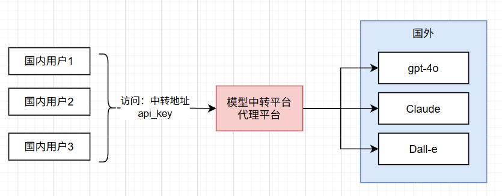

**AI网站**：https://ai.xty.app/auth?type=register&invite=MjM2

**API_KEY**：https://api.xty.app/register?aff=PuZD

我们创建一个超级厉害的API_KEY：

1. 访问 https://api.xty.app/register?aff=PuZD
2. 注册账号
3. 控制台 -> API令牌 -> 添加令牌
4. 复制令牌
5. 以后配置 api的域名是： https://api.xty.app 。 令牌是你复制的

> 了解API_KEY 原理

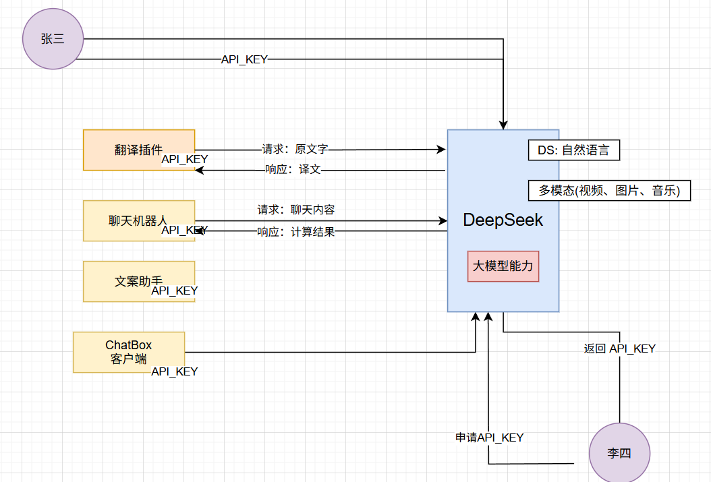

# Chatbox

https://chatboxai.app/zh

## 聊天

配置DeepSeek

## 生图

配置 Dall-e-3

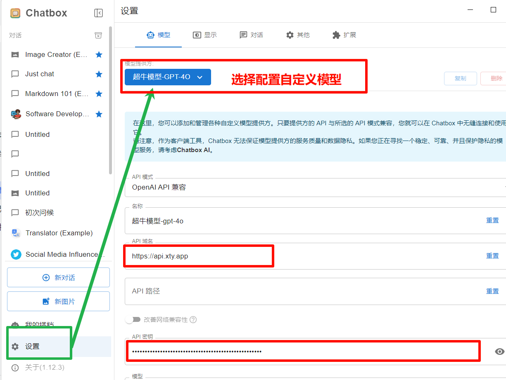

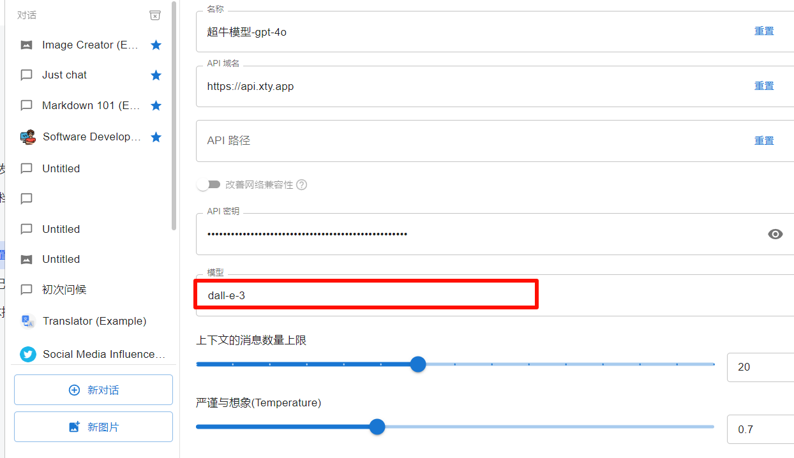

# 沉浸式翻译

## 安装插件

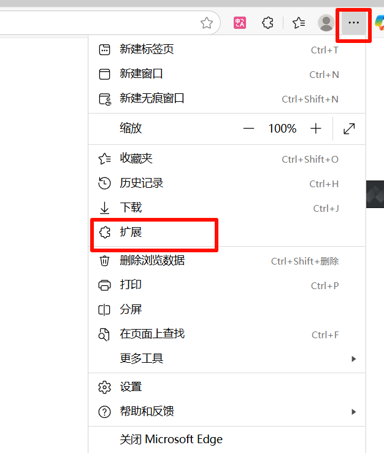

获取扩展 -- 搜索“沉浸式翻译”

## 配置

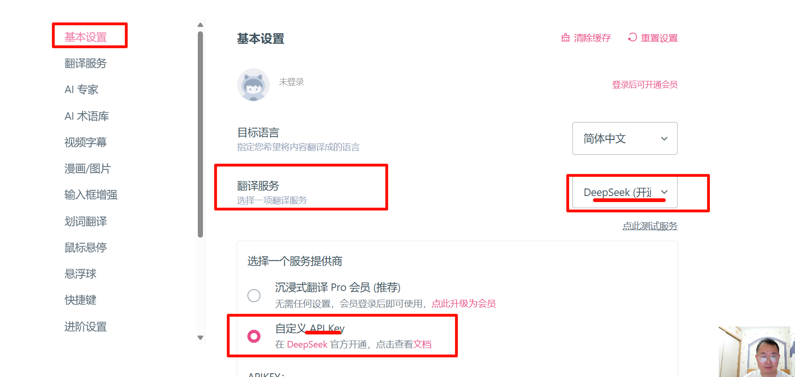

## 易用性设置

# Idea 智能插件

## 翻译插件

File -》 Settings -》Plugins -》搜索 trans

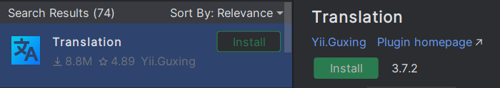

> 可以用免费的翻译，也可以按照下面配置 AI 翻译

## 配置翻译插件

File -》 Settings -》Tools -》 Translation

配置翻译引擎

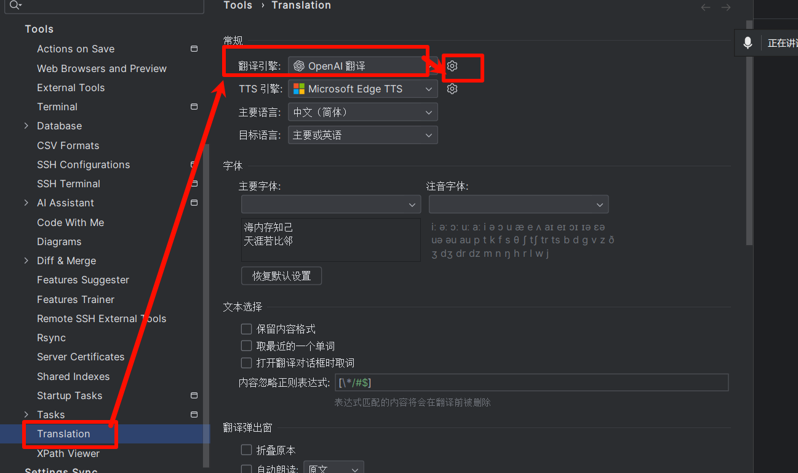

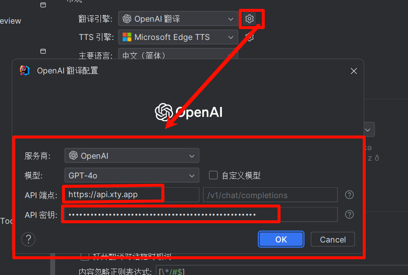

## AI对话插件

> 下面的选一个装，目前都是免费的

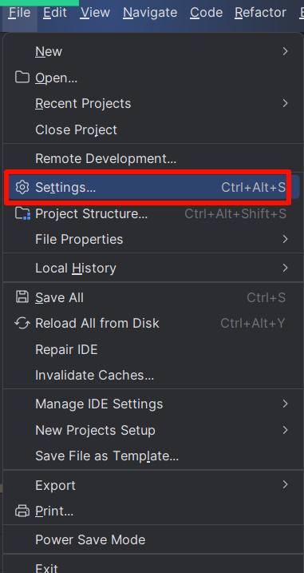

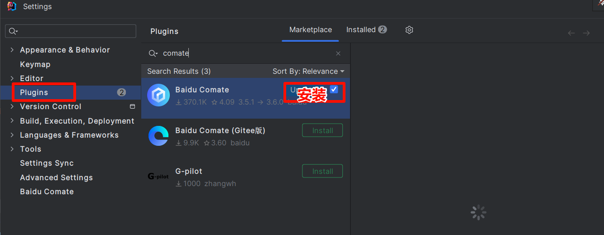

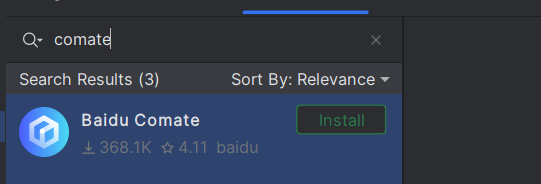

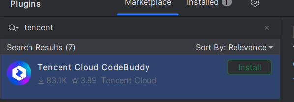

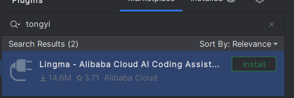

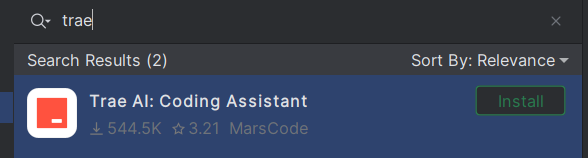