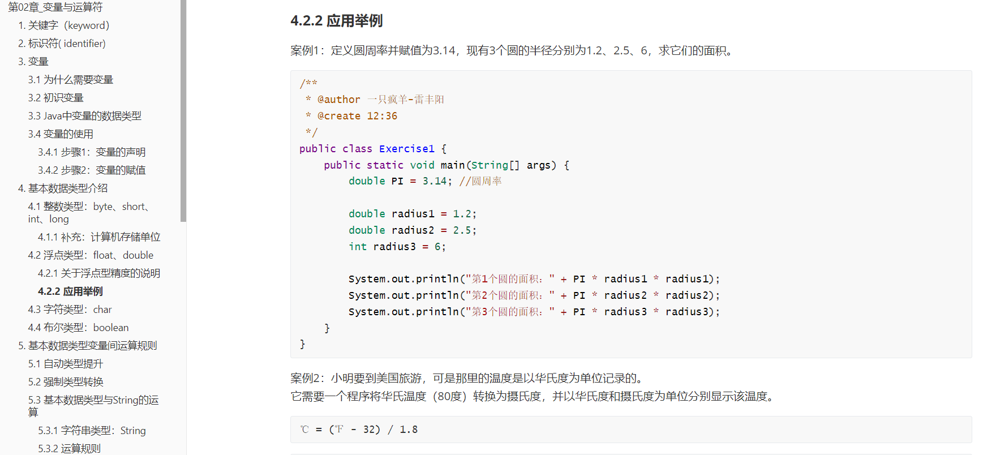
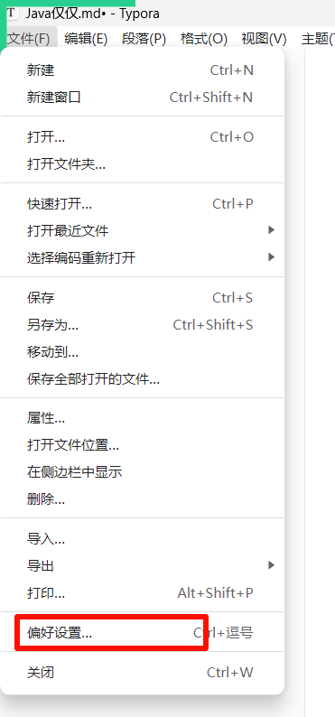
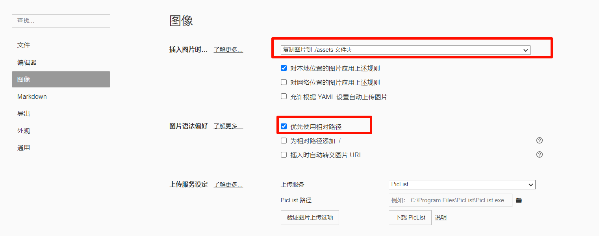

# 1. Markdown - 笔记新方式

> 以前方式：word、记事本、飞书

## 为什么用Markdown                                            

> 效果：高亮代码，清晰目录



> Markdown 是一种 **轻量级****标记语言**，由约翰·格鲁伯（John Gruber）与亚伦·斯沃茨（Aaron Swartz）于2004年共同创建。其核心设计理念是以纯文本格式编写内容，通过简单的符号标记实现排版，并可转换为HTML、PDF等结构化文档格式

优点：

1. **简洁易学，专注内容**；Markdown 语法仅需少量符号（如 `#` 表示标题、`*` 表示列表），无需复杂排版工具，用户可专注于文字创作而非格式调整。例如，加粗用 `文本`，链接用 `[文字](URL)`，代码块用三个反引号包裹。这种设计**大幅降低学习成本**，尤其适合快速记录灵感或撰写技术文档
2. **跨平台兼容性强**；Markdown 文件是纯文本格式，可在任何设备（Windows、Mac、Linux）和编辑器（如 Typora、VS Code）中打开和编辑，且格式保持一致。主流平台如 GitHub、WordPress 均原生支持 Markdown，文档可无缝迁移
3. **支持多样化扩展功能**；
  1. **图表与公式：**通过 Mermaid 语法生成**流程图**、**甘特图**，或嵌入 LaTeX 公式
  2. **复杂排版：**表格、脚注、任务清单等高级功能可通过 CommonMark、GFM 等方言实现
  3. **多格式输出**：借助工具（如 Pandoc）可一键转换为 PDF、PPT、电子书等
4. **广泛应用场景**：
  1. **技术领域**：编写代码文档（如 GitHub 的 README.md）、学术论文
  2. **内容创作**：博客（Ghost、Typecho）、电子书、邮件排版
  3. **效率工具**：笔记软件（如 Typora）、项目管理（任务列表和甘特图）

## 软件安装

> - 首选推荐 Typora

## 速查表

### 基本语法

| 元素 | Markdown 语法 |
| --- | --- |
| 标题（Heading） | # H1 ## H2 ### H3 |
| 粗体（Bold） | **bold text** |
| 斜体（Italic） | *italicized text* |
| 引用块（Blockquote） | > blockquote |
| 有序列表（Ordered List） | 1. First item 2. Second item 3. Third item |
| 无序列表（Unordered List） | - First item - Second item - Third item |
| 代码（Code） | `code` |
| 分隔线（Horizontal Rule） | --- |
| 链接（Link） | [title]([https://www.example.com](https://www.example.com)) |
| 图片（Image） |  |

### 扩展语法

> 这些元素通过添加额外的功能扩展了基本语法。但是，并非所有 Markdown 应用程序都支持这些元素。

| 元素 | Markdown 语法 |
| --- | --- |
| 表格（Table） | \| Syntax \| Description \| \| ----------- \| ----------- \| \| Header \| Title \| \| Paragraph \| Text \| |
| 代码块（Fenced Code Block） | ``` {  "firstName": "John",  "lastName": "Smith",  "age": 25 } ``` |
| 脚注（Footnote） | Here's a sentence with a footnote. [^1] [^1]: This is the footnote. |
| 标题编号（Heading ID） | ### My Great Heading {#custom-id} |
| 定义列表（Definition List） | term : definition |
| 删除线（Strikethrough） | ~~The world is flat.~~ |
| 任务列表（Task List） | - [x] Write the press release - [ ] Update the website - [ ] Contact the media |

## 最佳实战

- 图片保存设置（图片跟笔记放在一起）
- 笔记文件夹（整个笔记放到一个文件夹里面）

设置：



设置重点



## Mermaid (了解)

官网：https://mermaid.js.org/config/directives.html