# 2. Git - 分布式版本控制

# 版本控制

## 什么是Git

Git是一个**分布式****版本控制系统**。这听起来可能有点复杂，但让我们分解一下：

1. **版本控制**：就像给你的代码装上了时光机器。它会跟踪你做的所有更改。
2. **分布式**：它允许多个人在同一项目上工作，而不会相互干扰。

**以前：**

> 手动维护多版本，杂乱无章

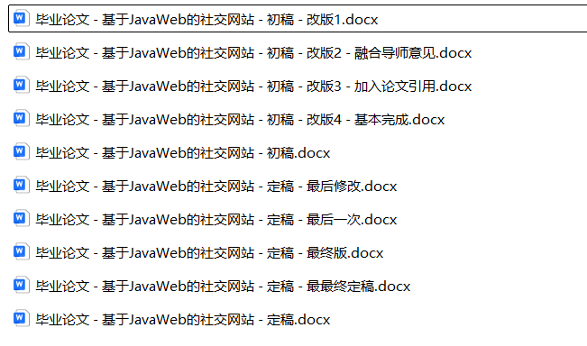

**现在：**

> 自动维护版本修改记录，随时可以回到以前

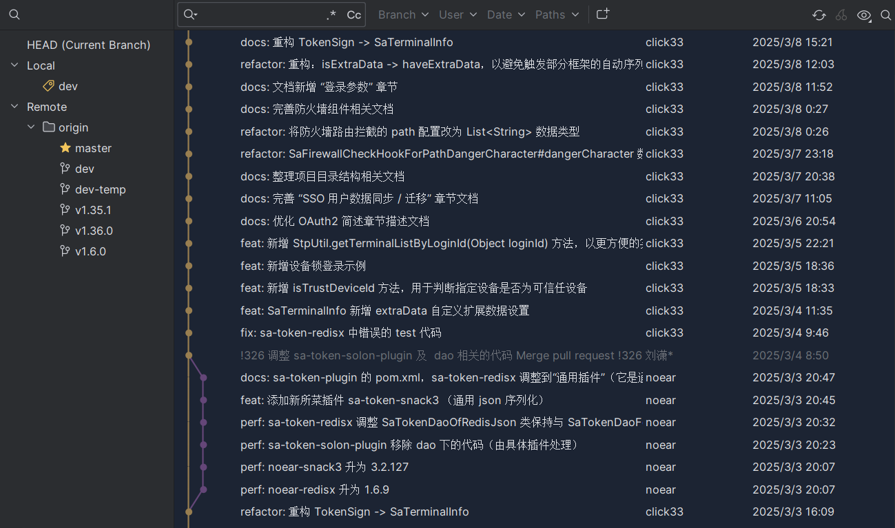

## 分布式与集中式

**集中式：**

> **集中化的版本控制系统 （Centralized ****Version Control Systems****，简称 C****VCS****）**
> 
> SVN：权限控制；比较安全； 开源系统
> 
> 协同工作的人们都通过客户端 连到这台服务器，取出最新的文件或者提交更新。

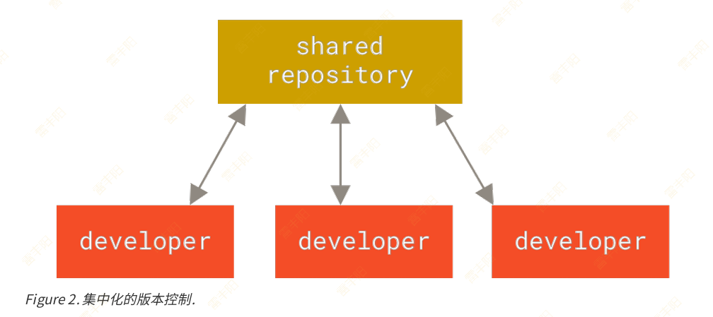

> 这么做最显而易见的缺点是**中央服务器的单点故障**。 如果宕机一小时，那么在这一小时 内，谁都无法提交更新，也就无法协同工作。 如果**中心数据库所在的磁盘发生损坏**，又没有做恰当备份，毫无 疑问你将丢失所有数据——包括项目的整个变更历史，只剩下人们在各自机器上保留的单独快照。

> 如果中央服务器挖单。每个客户端回不到之前的版本了

**分布式：**

> 分布式**版本控制系统（****D****istributed ****Version Control System****，简称 ****DVCS****）**。
> 
> **客户端并不只提取最新版本的文件快照， 而是把代****码仓库完整地镜像下来****，包括完整的历史记录**。 这么一来，任何一处协同工作用的服务器发生故障，事后都可以用任何一个镜像出来的本 地仓库恢复。 因为每一次的克隆操作，实际上都是一次对代码仓库的完整备份。

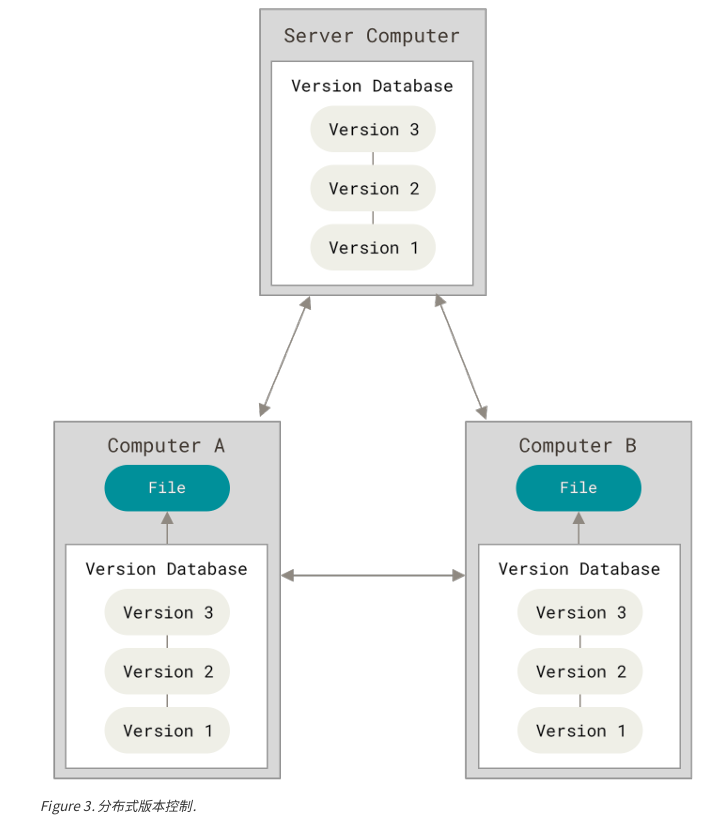

## Git发展史

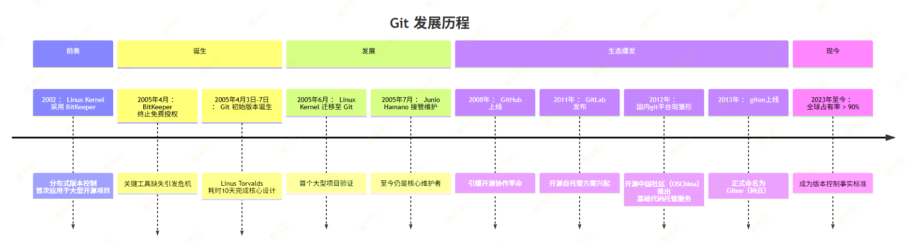

## Git工作机制

> **传统版本控制系统**，是记录一组基本文件和每个文件随**时间逐步累积的差异** （它们通常称作 **基于差异（delta-based） 的版本控制**）

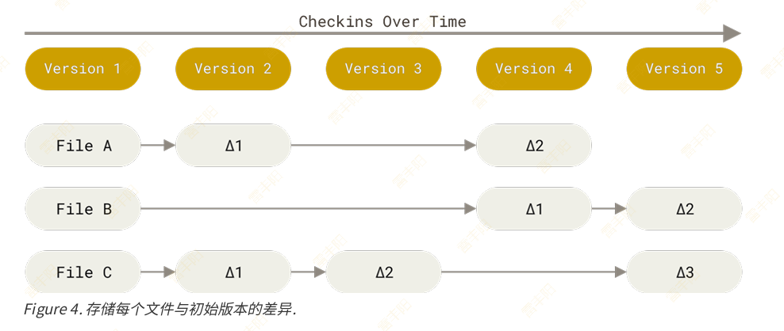

> **Git**** 不按照以上方式对待或保存数据**。反之，Git 更像是把**数据看作是对小型**`文件系统`**的一系列快照**。 在 Git 中，每当你提交更新或保存项目状态时，它基本上就会对**当时的全部文件创建一个快照并保存这个快照的索引**。 为了效率，如果文件没有修改，Git 不再重新存储该文件，而是只保留一个链接指向之前存储的文件。 Git 对待 数据更像是一个 **快照流**。

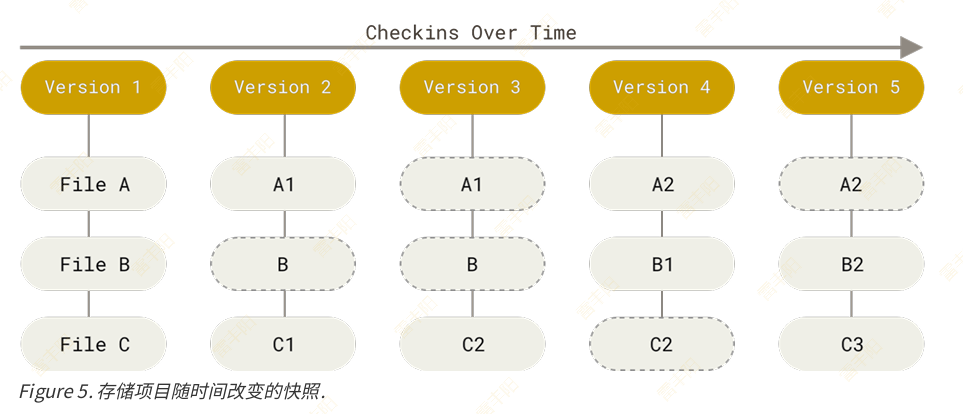

> 文件变了就存完整内容，没变就存快捷方式

# Git

> 官网：https://git-scm.com/

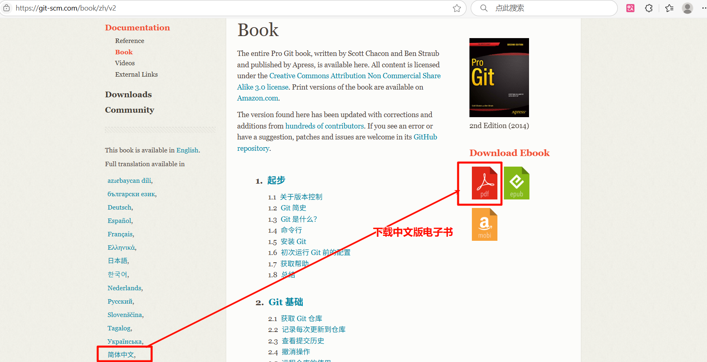

## 起步

### 安装

> 访问下载页，https://git-scm.com/downloads
> 
> 选择对应的操作系统安装即可
> 
> 一路next

### 配置

```shell
# 查看默认配置
git config --list --show-origin

# 配置用户信息； 这样每次是谁修改的文件，git就有标记
git config --global user.name "leifengyang"
git config --global user.email "534096094@qq.com"

# 检查配置
git config --list
```

## 概念

### 三种状态

Git 管理的文件有三种状态：**已提交（committed）**、**已修改（modified）** 和**已暂存（staged）**

- **已修改**表示修改了文件，但还没保存到**数据库**中（也就是git本地仓库中）。
- **已暂存**表示对一个已修改文件的当前版本做了标记，使之包含在下次提交的快照中
- **已提交**表示数据**已经安全地保存在本地数据库**中。 只有提交了的东西才是永久保存。其余都是临时状态，临时的东西一不小心就丢了

**好习惯**：改好的东西，赶紧提交；

### 三个分区

**工作区**、**暂存区**以及 **版本库**。

- **工作区：**就是你在电脑里能看到的目录。
- **暂存区：**英文叫 stage 或 index。一般存放在 **.git** 目录下的 index 文件（.git/index）中，所以我们把暂存区有时也叫作索引（index）。
- **版本库：**工作区有一个隐藏目录 **.git**，这个不算工作区，而是 Git 的版本库。
- 注意：暂存区和版本库都在.git文件夹中，由git统一维护

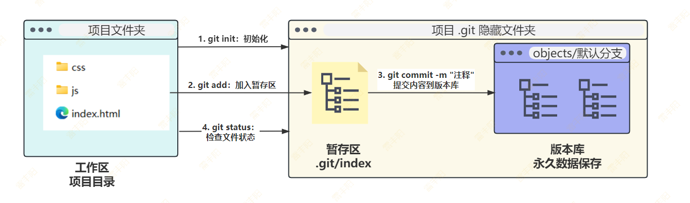

### 两类文件

工作目录下的每一个文件都不外乎这两种状态：**已跟踪（tracked） **或 **未跟踪（untracked）**。

1. **已跟踪的文件**是指那些被纳入了 版本控制的文件，也就是 Git 已经知道的文件
2. **未跟踪的文件**就是除了已跟踪的剩下所有文件；

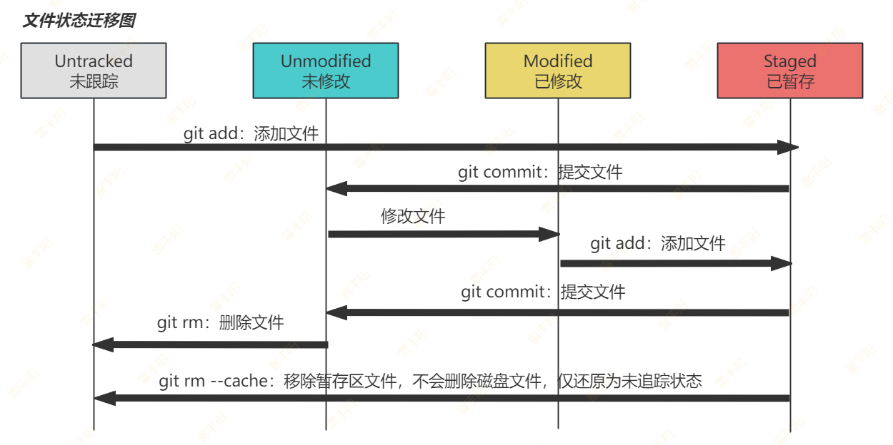

## 基本用法

### 实验1：初始化一个仓库，修改文件并多次提交

```shell
# 1. 提前创建好文件夹；如：html-demo

# 2. 初始化 git 仓库
git init .

## 自己创建一些文件

# 3. 添加文件到暂存区
git add .           # 添加当前文件夹下所有文件
git add index.html  # 添加指定文件

# 4. 提交文件到本地库
git commit -m "第一次修改"

# 5. 继续修改文件

# 6. 查看文件状态
git status

# 7. 添加到暂存区
git add .

# 8. 提交文件到本地库
git commit -m "第二次修改"

# 循环 5-8 步骤多次： 修改、暂存、提交

# 9. 查看提交日志
git log
# 10. 一行显示提交日志
git log --pretty=oneline
```

> 每次提交记录；都对应一个唯一id


### 理解暂存区变化

1. `git add `两个文件：

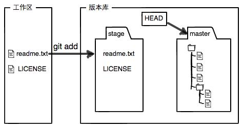

1. `git commit `提交内容

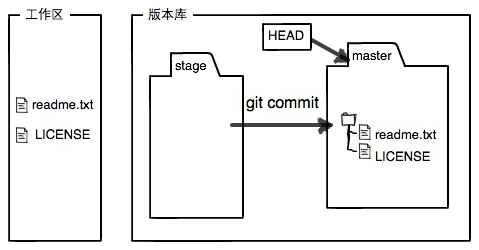

### 实验2：时光机

> 1. 利用实验1的知识，模拟产生多次提交记录
> 2. 时光机任意穿梭，试试效果

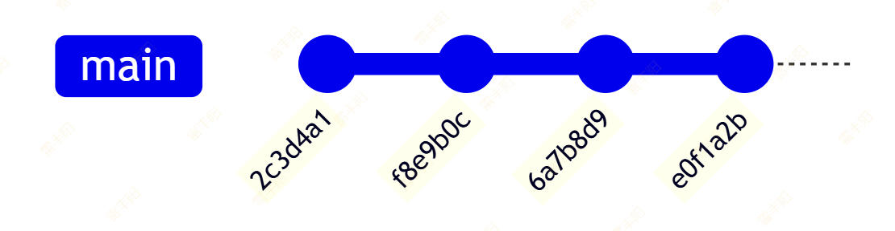

```shell
# 1. 创建一个 hello.txt 并修改
git add hello.txt
git commit -m "第一次修改"

# 2. 继续修改
git add hello.txt
git commit -m "第二次修改"

# 3. 继续修改
git add hello.txt
git commit -m "第三次修改"

# 4. 继续修改
git add hello.txt
git commit -m "第四次修改"

# 5. 查看提交日志
git log
```

> 看到的一大串类似`1094adb...`的是`commit id`（版本号），和SVN不一样，Git的`commit id`不是1，2，3……递增的数字，而是一个SHA1计算出来的一个非常大的数字，用十六进制表示

#### 版本回退

> **时光机准备：**
> 
> Git必须知道当前版本是哪个版本，在Git中，用`HEAD`表示当前版本，也就是最新的提交`1094adb...`（注意我的提交ID和你的肯定不一样）
> 
> 1. 上一个版本就是`HEAD^`，
> 2. 上上一个版本就是`HEAD^^`，
> 3. 当然往上100个版本写100个`^`比较容易数不过来，所以写成`HEAD~100`。

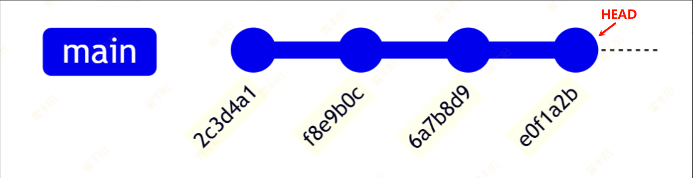

```shell
# 1. 回退到上个版本
git reset --hard HEAD^

# 2. 查看文件内容确认是否正确

```

`--hard`参数

1. `--hard`会回退到上个版本的已提交状态
2. `--soft`会回退到上个版本的未提交状态
3. `--mixed`会回退到上个版本已添加但未提交的状态。

现在，先放心使用`--hard`。

#### 穿梭未来

> 我们刚才回到过去，此时检查git仓库提交记录

```shell
# 1. 你会发现，居然没有了第四次提交； 21世纪回到19世纪，来的时候好好的！然后回不去了！
git log

# 2. 所幸 reflog 记录了我们所有的操作
git reflog

# 3. 传到未来 1094a: 未来的版本号。（5位以上）
git reset --hard 1094a
```

> 万金油命令： `git reset --hard 版本号`
> 
> 查看完整操作历史：`git reflog`

### 实验3：远程仓库

> 代码只在本地，即使有历史记录，有数据。哪天本地电脑坏了。硬盘炸了。数据将不可恢复。
> 
> 我们可以把本地的数据，给远程保存一份

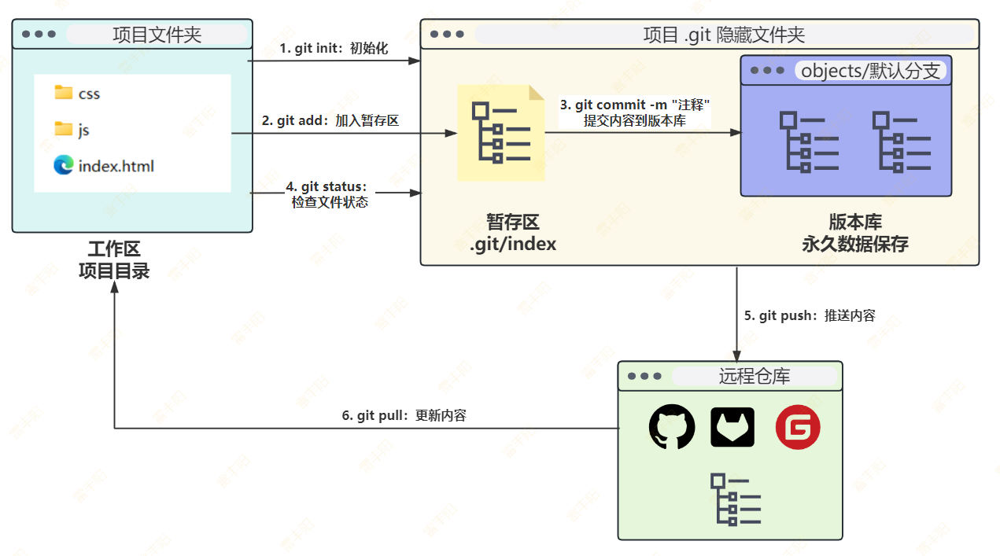

#### 创建远程仓库

> 此操作只需要做一次

1. 国内用户，可以使用gitee：https://gitee.com/； 注册一个码云账号；
2. 登录进码云，创建一个自己的仓库
  1. **私有仓库**：仅自己可以访问的
  2. **公有仓库**：大家都可以访问的
3. 拿到仓库的访问地址，比如：https://gitee.com/leifengyang/mygit-demo1.git

#### 关联远程仓库

> 此操作只需要做一次； 
> 
> 注意：必须有一个本地仓库，才可以关联远程，没有的话就去创建一个。

本地仓库和远程仓库进行了关联。git才知道：

- 本地的数据应该推送给远程哪个地方。
- 本地的数据应该从远程哪个地方进行同步。

```shell
# 添加远程仓库地址
git remote add origin https://gitee.com/leifengyang/mygit-demo1.git

# 展示远程仓库信息
git remote -v

# 展示某个具体的远程仓库信息
git remote show origin
```

- `git remote add`：添加一个远程库
- `origin`：给远程仓库地址添加一个别名。 一般规范默认叫法：origin，代表源位置；也可以用别的名字
- `https://gitee.com/leifengyang/mygit-demo1.git`： 你自己刚才创建的仓库地址。

#### 推送数据给远程

> 第一次推送使用 -u 参数；会把所有数据都推送上去并且本地master分支和远程master分支进行绑定

```shell
git push -u origin master

# origin：远程仓库名字
# master：分支名字
```

第一次提交会要求输入账号密码

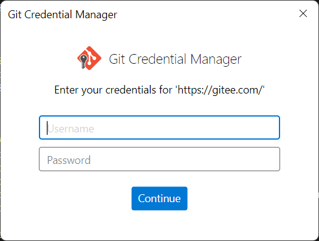

> 第一次需要：以后就不用输入了。

#### 以后每次推送

> 以后仓库中累积一些提交后，可以推送给远程

```shell
git push origin master
```

#### 更新最新数据

> 企业的代码仓库会被多人共同开发。一段时间后，有同事会提交新的代码上去，你可以更新仓库，就能看到别人提交的新内容

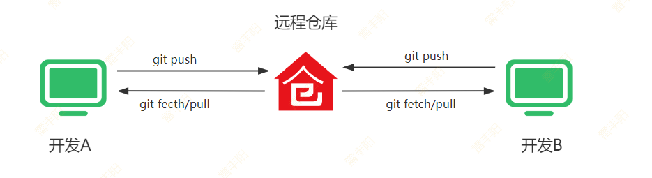

```shell
# 从远程读取数据
git fetch origin

# 从远程下载数据 + 更新合并到本地
git pull origin
```

#### 克隆仓库

> 某一天，换电脑了，换系统了，或者换硬盘了，或者要回家加班写代码了。

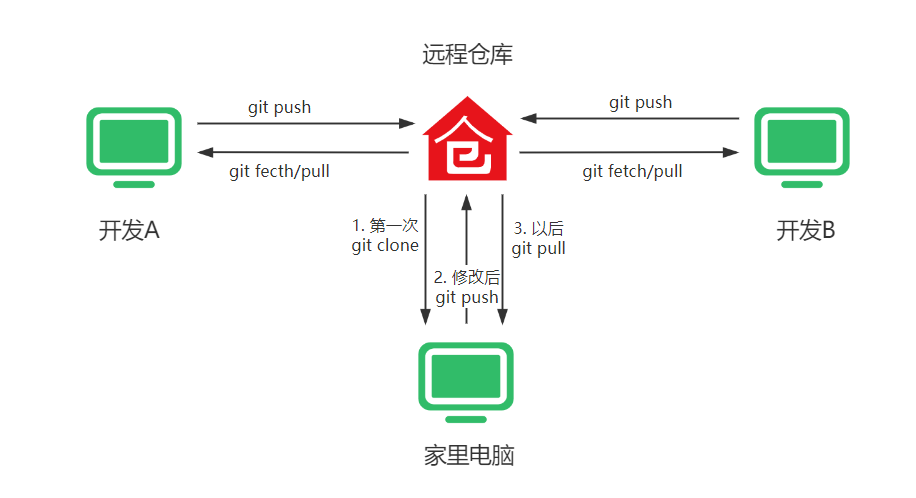

```shell
# 克隆仓库
git clone https://gitee.com/leifengyang/mygit-demo1.git

# 继续愉快的玩耍吧
```

## 小技巧

### 实验1：跳过暂存区

> 每次必须先 git add  然后才能 git commit，太麻烦了

```shell
# 跳过暂存区，直接提交
git commit -a -m "第5次提交"
```

### 实验2：文件重命名

```shell
# 将 README.md 改名为 README
git mv README.md README

# 检查状态
git status 
```

上面命令相当于以下三合一：

```shell
mv README.md README  # 重命名文件
git rm README.md     # 移除旧记录
git add README       # 暂存新文件
```

### 实验3：修正提交

> 有时候我们**提交完**了才**发现漏掉了几个文件没有添加**，或者**提交信息写错了**。

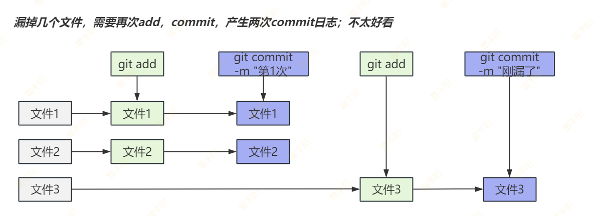

> **漏提交文件**修复

```shell
# 1. 创建 1.txt 和 2.txt 文件

# 2. 第一次操作
git add 1.txt
# 3. 提交
git commit -m "提交1文件"
# 4. 第二次操作
git add 2.txt
# 5. 如果是普通提交，git commit 则会出现两次提交记录，我们使用 --amend 修复提交的方式
git commit --amend -m "提交1,2文件"

```

> 提交日志写错，修复

```shell
# 1. 创建 1.txt 和 2.txt 文件

# 2. 第一次操作
git add .
# 3. 提交
git commit -m "提交了文件"

# 4. 修复上次提交
git commit --amend -m "提交1,2文件"
```

> 修补提交**最明显的价值**是可以稍微改进你最后的提交，而不会让“啊，忘了添加一个文件”或者 “小修补，修正笔误”这种提交信息弄乱你的仓库历史

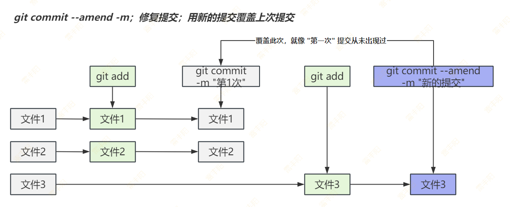

### 实验4：撤销修改

> **修改了内容，但还未添加到暂存区**；想要撤销：

```shell
# 1. 给 hello.txt 中添加了新内容
git status  # 检查状态，应该为 Modified，此时还没有 git add

# 2. git checkout -- file可以丢弃工作区的修改；
# 真实原理：让这个文件回到最近一次 git commit 或 git add 时的状态。
git checkout -- hello.txt  # 或者使用 git restore hello.txt
```

> 修改了内容，但已经添加到暂存区；想要撤销：

```shell
# 1. 给 hello.txt 中添加了新内容
git status  # 检查状态，应该为 Modified
git add hello.txt # 将文件添加到暂存区


# 2. 撤销暂存区中的更改，分为两步
# 1）、先取消添加暂存区操作: 使用 git reset HEAD hello.txt 或者下面
git restore --staged hello.txt
# 2）、再取消修改
git restore hello.txt
```

### 特别注意

> 记住，在 Git 中任何 **已提交** 的东西几乎总是可以恢复的。 甚至那些被删除的分支中的提交或使用 `--amend` 选项覆盖的提交也可以恢复 （阅读 [数据恢复](https://git-scm.com/book/zh/v2/ch00/_data_recovery) 了解数据恢复）。 然而，任何你未提交的东西丢失后很可能再也找不到了。

## 分支基础操作

> 分支在现实生活中非常常见；
> 
> 1. 打游戏的时候，有主线任务，有支线任务。支线任务结束后的收益还可以带到主线任务
> 2. 分支也像平行宇宙，每个宇宙发生自己的事情，某一天还可以合并起来


### 分支管理

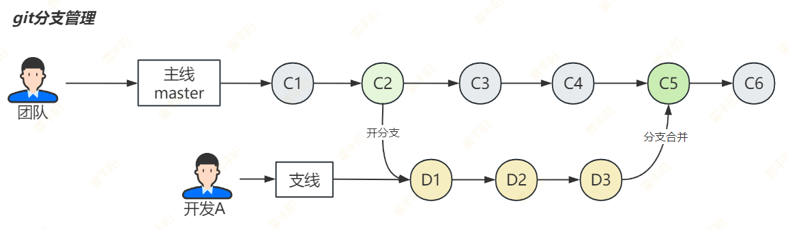

仅需掌握以下命令即可：

1. git branch：创建/查看分支
2. git checkout： 切换分支
  1. git checkout -b testing: 创建 + 切换
3. git commit：提交数据 

### 创建分支

```shell
# 1. 创建 名为 testing 的分支
git branch testing

# 2. 查看当前所在分支
git branch
# 输出如下： * 标记当前所在分支
#   testing
# * master

# 3. git branch -v: 查看每一个分支的最后一次提交
```

### 切换分支

```shell

# 3. 切换到 testing 分支
git checkout testing
```

> 可以使用：`git checkout -b  testing`；综合写法； 先创建分支，再切换到分支

### 数据提交

> 给分支里面也提交点东西吧
> 
> HEAD 指针移动到新的提交

```shell
# 1. 创建 test.txt 文件，输入内容

# 2. 添加暂存
git add test.txt

# 3. 提交数据
git commit -m "新增test.txt"

# 4. 查看日志
git log
```

### 切回master

> HEAD 指针移动到 master

```shell
git checkout master
```

### 数据提交

> 给master分支里面也提交点东西吧
> 
> HEAD 指针移动到新的提交

```shell
# 1. 创建 master.txt 文件，输入内容

# 2. 添加暂存
git add master.txt

# 3. 提交数据
git commit -m "新增master.txt"

# 4. 查看日志
git log
```

### 推送数据

```shell
git push -u origin testing
```

### 分支合并

> 把 A 合并到 B。必须先来到 B(checkout)， 然后，在B里面merge A

> 把 testing 分支的内容，合并到master

```shell
# 1. 先来到master
git checkout master

# 2. 把内容合并； ff模式： 尽可能使用 fast forward 模式；（只需要移动master指针即可）
git merge testing -m "合并了"

# 禁用 fast forward 模式 
git merge --no-ff testing -m "合并了"
```

> git会自动判断
> 
> 1. 如果 两个合并分支，没有出现分叉，则使用 ff 模式
> 2. 如果 两个合并分支，有出现分叉。（从a创建出b分支后，a，b各自进行了提交），则使用no-ff模式

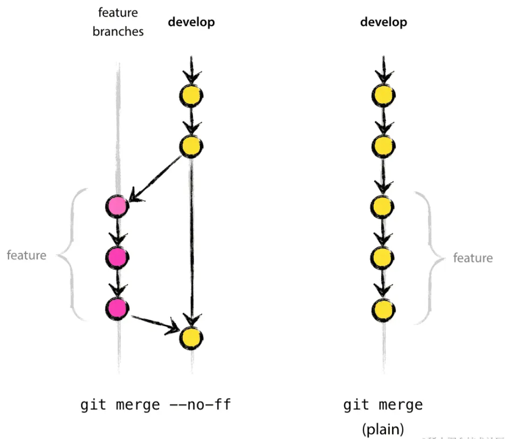

### 删除分支

```shell
git branch -d testing
```

## 分支进阶操作

### git工作流

> 参考（[Vincent Driessen](https://nvie.com/about/)）：https://nvie.com/posts/a-successful-git-branching-model/


> 启示：
> 
> 开发一个新功能，最好新建一个分支；
> 
> 如果要丢弃一个没有被合并过的分支，可以通过`git branch -D <name>`强行删除。

创建git项目的时候。网站提示

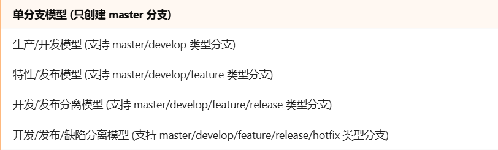

### 实验1：`git stash`：保留现场

> 想象如下场景：
> 
> 1. 你正在 **dev  分支干活**，这个活还需要3小时干完。
> 2. 现在临时出现一个**紧急任务**，需要修复**线上某个bug**
> 3. 你**准备开一个分支，去修复bug**。不过等等，你dev分支的任务**还没提交**；此时你有两种办法
>   - **提交这个任务**，等修复完了，再回来继续改，改完再提交（产生两个提交记录，很难受）
>   - **暂时只保留现场不提交**，等修复完了，再回来继续改，改完再统一提交（提交记录很清爽）

1. 当你工作一半，需要切换出去，又没法提交，就可以使用 stash（储藏）操作，保留现场

```shell
# 赶紧先暂存当前 dev 分支的活
git stash
```

1. 确定需要在哪个分支上修复bug，就从哪个分支上新建分支

```shell
# 1. 切换到主分支
git checkout master

# 2. 从主分支新建临时  fix01 分支
git checkout -b fix01

# 3. 模拟修复bug开始，创建一个 readme.txt ，输入内容
git add readme.txt 
git commit -m "fix bug 01"

# 4. 回到主分支，准备把修复的内容进行合并
git checkout master
# 5. 合并 fix01 分支内容
git merge --no-ff -m "merged bug fix 101" fix01
# 6. 删除 fix01 分支
git branch -d fix01

```

1. 修复完bug，回到dev分支继续开心干活

```shell
# 1. 切回dev分支
git checkout dev

# 2. 查看工作区
git status  # 工作区应该是干净的

# 3. 查看存储的现场数据
git stash list

# 4. 恢复现场；
# 一是用git stash apply恢复，但是恢复后，stash内容并不删除，你需要用git stash drop来删除；
# 另一种方式是用git stash pop，恢复的同时把stash内容也删了
git stash pop

# 5. 确认stash list
git stash list

# 扩展：如果有多个stash，可以使用 git stash apply stash@{0}  来恢复指定的stash
```

### 实验2：打标签

> tag 中文我们可以称它为 **标签**。一般被用来做版本标记
> 
> 简单的理解，tag 就是 对某次 commit 的一个标识，相当于起了一个别名。
> 
> 在项目发布某个版本的时候，对某次commit 起一个 v1.0.1 这样的标签来标识里程碑的意义。

```shell
# 1. 打标签: 给当前提交打标签；   git tag -v1.0 提交id：给指定提交打标签   
git tag -v1.0

# 2. 查看标签
git tag

# 3. 附注标签 -a annotated: 表示会有一个附注文本； 用-m指定文本
git tag -a v2.0 -m "里程碑版本 1.0 正式发布，诸多特性，欢迎体验"

# 4. 带标签推送到远程
git push origin 标签名称 #将指定的标签上传到远程仓库
git push origin --tags #将所有不在远程仓库中的标签上传到远程仓库; 【归档】
```

### 版本号命名规则

**x.y.z**.xxxxx-Release（英文标识）：

x：大版本（数字）：整个设计发生变化，规则变化，架构变化。大变化的发布大版本

y：中版本（数字）：增减功能，改动代码

z：小版本（数字）：修复bug（不应该出现功能上的增减）

xxxx：细节分支（时间日期做标志）；

1. **snapshot**（快照），也即开发版，我们创建maven项目时，编辑器会自动给我们填入 1.0-SNAPSHOT版本，也就是1.0开发版，这个版本不能使用，因为该版本处于开发的过程，所以运行时会不时地更新，导致功能变化，正式环境中不得使用snapshot版本的库。
2. **alpha：**内部测试版，来源于字母α，是比较早的版本，主要是给开发人员和测试人员测试和找BUG用的，不建议使用。
3. **beta：**公开测试版，来源于字母β，这是比alpha进一步的版本，面向公众测试，但是不建议使用。
4. **pre：预览版**，这个和alpha版本类似，有时还会细分为M1,M2版本，不建议使用；
5. **RC**：(Release Candidate) 顾名思义么 ! 用在软件上就是候选版本。系统平台上就是发行候选版本。
6. **GA**(General Availability)**正式发布**的版本，在国外都是用**GA**来说明**release**版本的；
7. **release****：**发行版，这是release的中文意思，也就是**官方推荐使用的版本**。
8. **stable****：**稳定版，这个版本相比于测。试版更加稳定，去除了测试版许多的bug，完善了一些功能，建议使用（也就是我们经常下载的版本）。
9. **current**或者**lastest**（更常见的表示），最新版,但是不一定是稳定版本，需要看一下是否还有release或者stable等版本，可能存在坑，但是你不知道，只有产生了BUG，你才知道，建议技术比较过硬的开发者使用。
10. eval，评估版。可能会有一个月或者固定时间的使用期限，通常在使用收费软件的时候，该词较常见。
11. **LTS**：**Long Term Support (LTS)；长期支持版**

### 实验3：rebase变基

> 合并分支的另一种操作; **把劈了叉的分支可以捋成一条直线**；
> 
> 也就是 默认 merge 用不了的 no-ff 模式，转化为 ff 模式进行合并

#### 变基前

> **rebase会把你当前分支的 commit 放到最后面, 将rebase后的目标分支的commit当作基点放在前面；**
> 
> 这里的「**基**」就是一个「基点」、「**起点**」的意思。**「变基」就是改变当前分支的起点**。注意，是当前分支！ `rebase` 命令后面紧接着的就是「基分支」

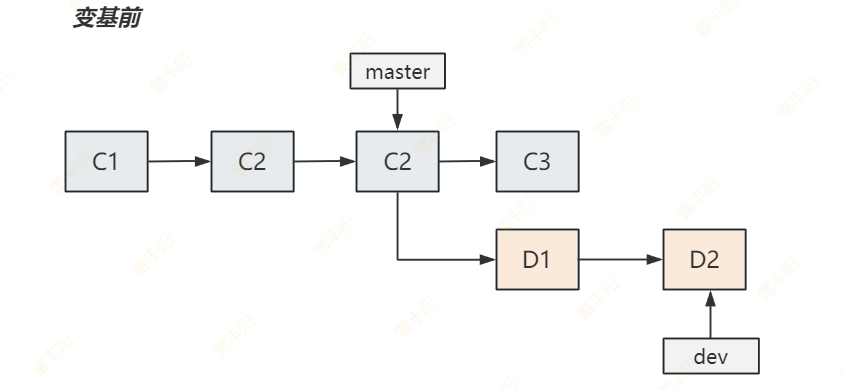

#### 变基

> 在 master 分支的最新节点（C3[`77aba7`]）后面多了 2 个提交（生成了新的提交记录，仅仅提交信息保持一致），而这两个提交内容就是来自变基前 dev 分支，dev 分支的提交历史发生了改变。

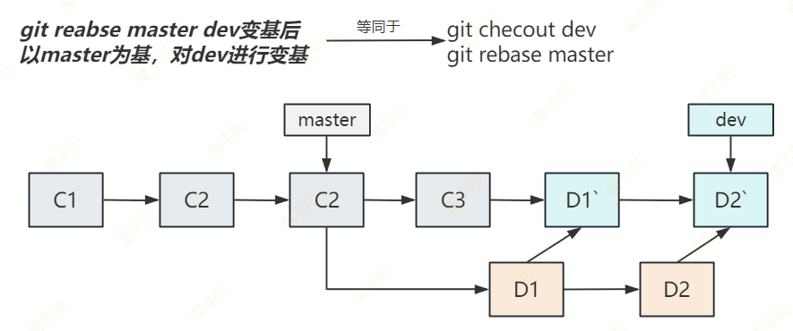

#### 合并

> 变基后，改变的只是 dev 分支，基分支（master 分支）的 HEAD 指针依然在之前的 commit （`77aba7`）处。这时候要将 dev 分支合入到 master 分支上，就满足 `fast-forward` 的条件了，`master` 分支执行快速合并，将 HEAD 指针指向刚刚最新合入的提交点

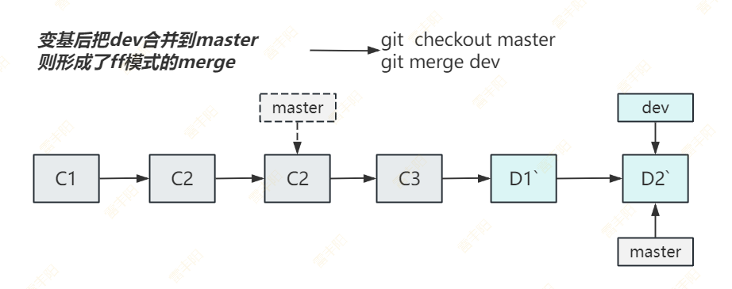

```shell
git checkout master
git merge dev
```

> `rebase` 命令其实关键在于理解「基」，`git rebase <基分支>`，就是将**当前基分支**与**当前分支的差异提交获取到**，然后在「**基分支」最新提交点后面将差异提交逐个再次提交**，最后将当前分支的 HEAD 指针指向最新的提交点。「基分支」的 HEAD 位置是不变的。要想完成分支合并，完成变基之后，需要再进行分支间的合并等操作。

### 实验4：cherry-pick

> 比如：你想把dev分支的某个提交应用到 master等其他分支；可以**猴子偷桃**

```shell
# 1. 切换到master
git checkout master
# 2. 猴子偷桃
git cherry-pick 提交id（dev分支的某次提交的id）
```

# Github

> 和 gitee 使用基本一样；

## 基本使用

> 1. 熟悉界面
> 2. 创建仓库并提交
> 3. 了解readme.md作用
> 4. 提issue
> 5. 删除仓库

## SSH免密登录

**第1步：**创建SSH Key：在用户主目录里找到`.ssh`目录，里面有`id_rsa`和`id_rsa.pub`两个文件；

`id_rsa`是私钥，不能泄露出去，`id_rsa.pub`是公钥，可以放心地告诉任何人

```plain text
ssh-keygen -t rsa -C "534096094@qq.com"
```

**第2步：**登陆GitHub，打开“Account settings”，“SSH Keys”页面；然后，点“Add SSH Key”，填上任意Title，在Key文本框里粘贴`id_rsa.pub`文件的内容：

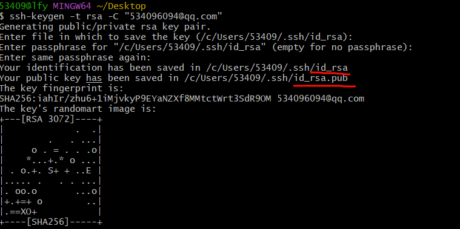

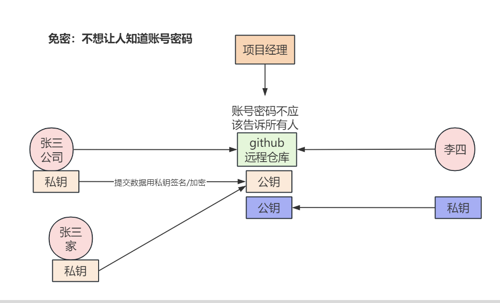

> 项目经理：

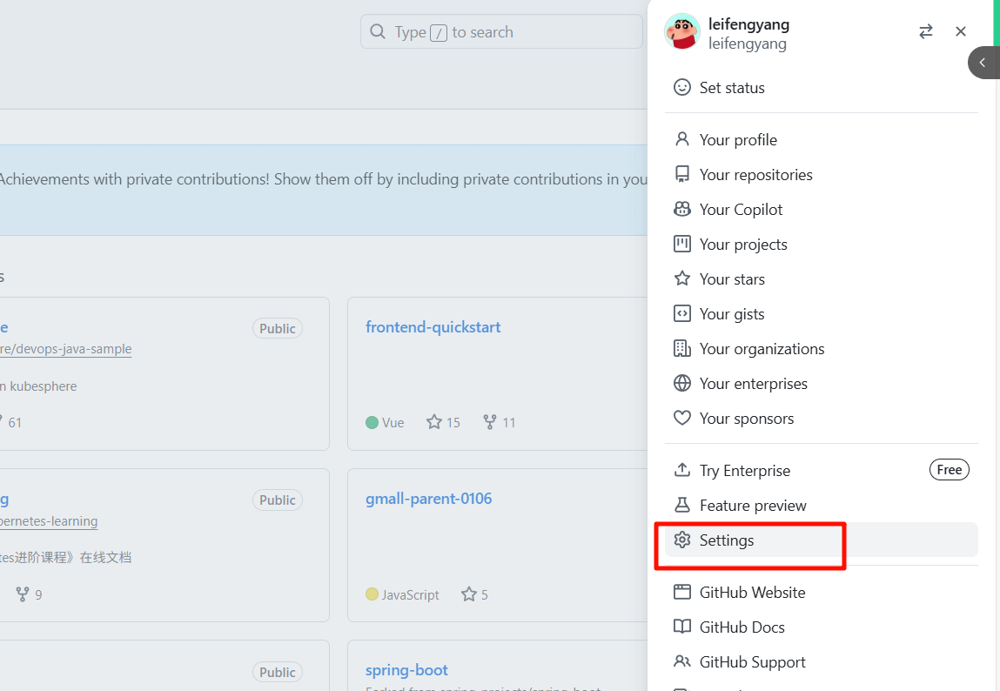

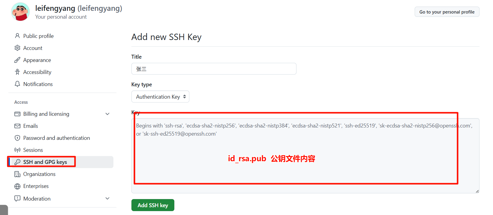

# Idea可视化

## 创建git仓库

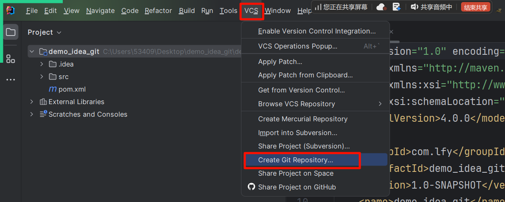

## .gitignore

> git提交时忽略的内容。这些都是垃圾

一般只需要提交项目的源代码，编译后的文件都不应该提交，因为每个电脑自己会编译。

```shell
# 忽略所有的 .a 文件
*.a

# 但跟踪所有的 lib.a，即便你在前面忽略了 .a 文件
!lib.a

# 只忽略当前目录下的 TODO 文件，而不忽略 subdir/TODO
/TODO

# 忽略任何目录下名为 build 的文件夹
build/

# 忽略 doc/notes.txt，但不忽略 doc/server/arch.txt
doc/*.txt

# 忽略 doc/ 目录及其所有子目录下的 .pdf 文件
doc/**/*.pdf
```

## 添加暂存区

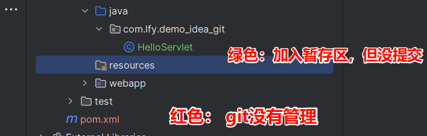

## 提交文件

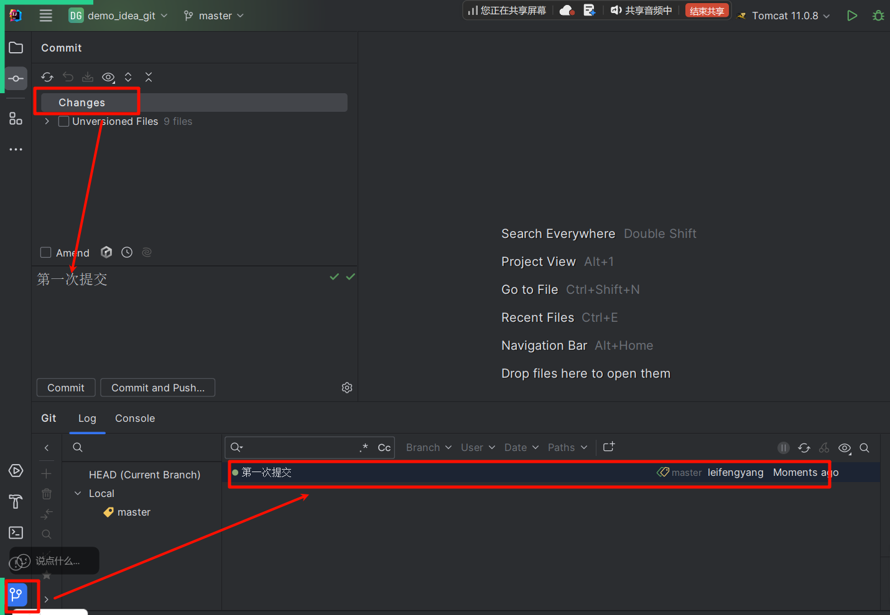

## 推送内容

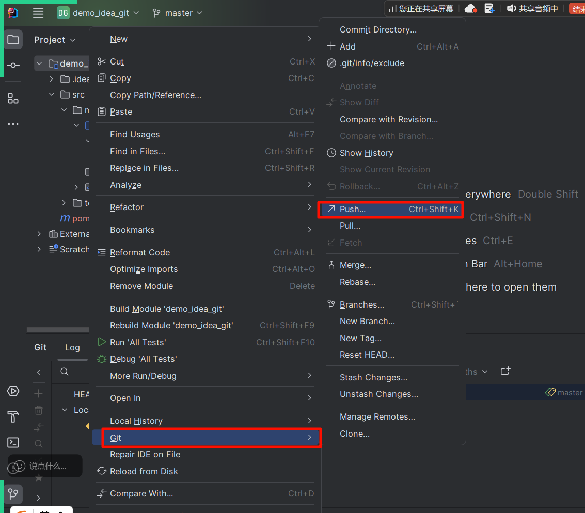

> 定义远程仓库：

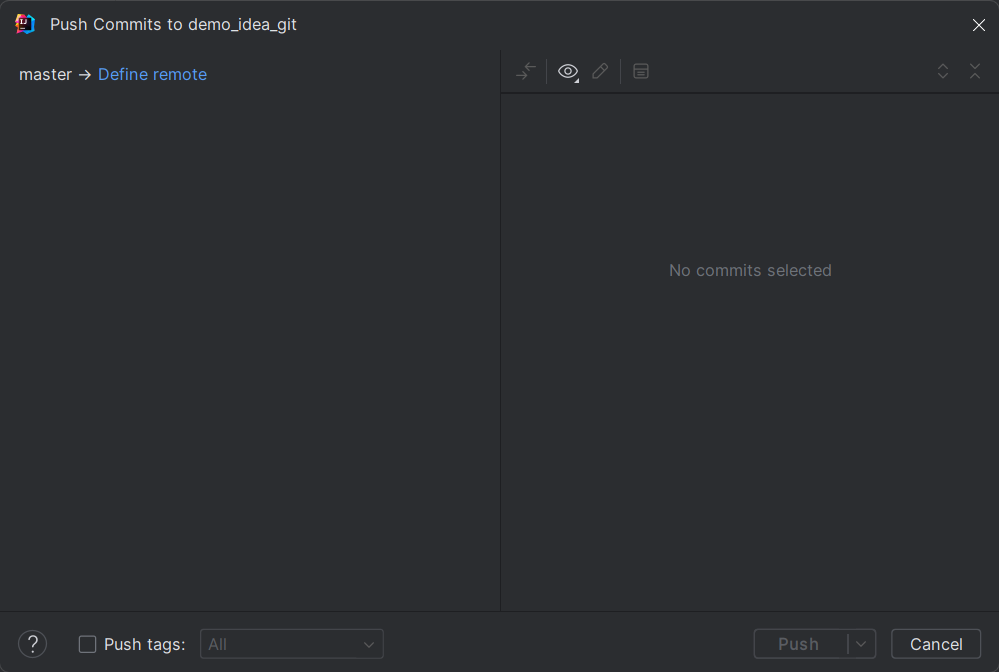

> 项目身上右键 git - push 就可以，第一写远程仓库的账号密码

## 更新数据

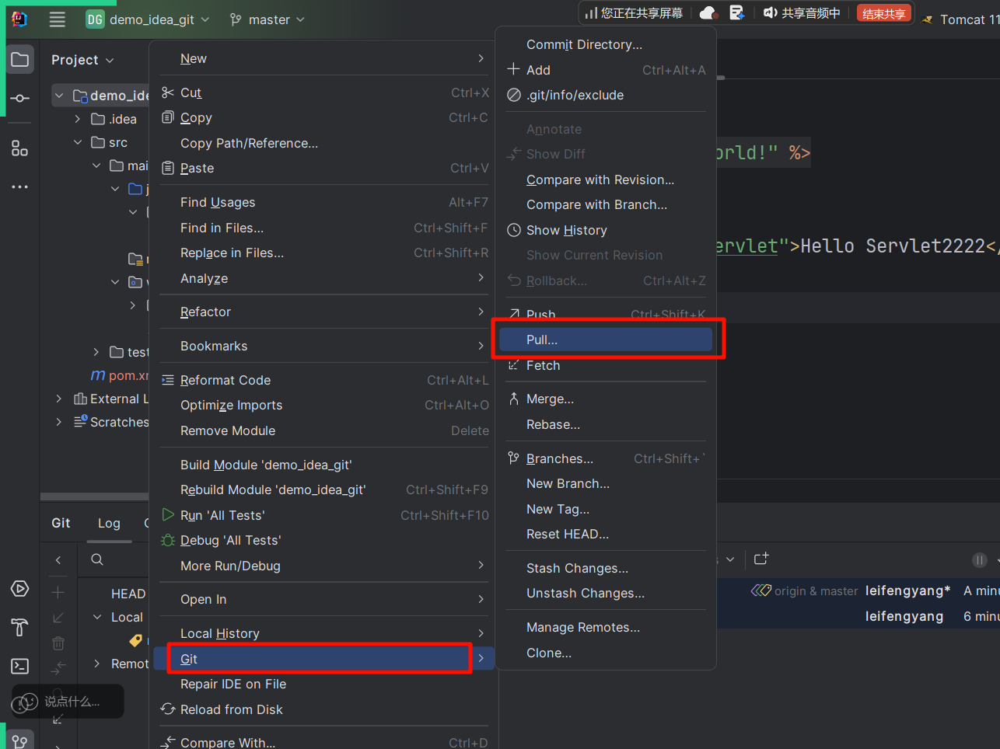

## 分支合并

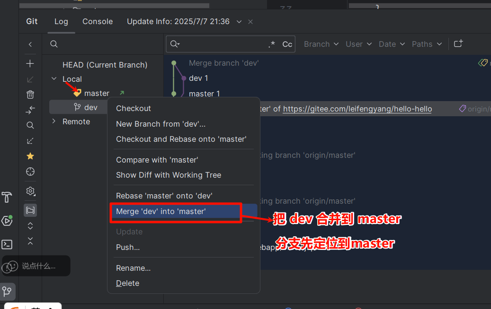

## 变基

- `Rebase feature onto main` = 将 `feature` 的提交移动到 `main` 的最新提交之后​，等同于命令：`git checkout feature && git rebase main`。

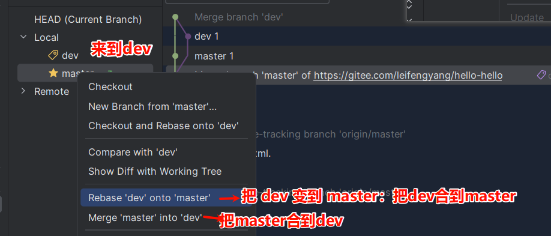

假设你有两个分支：

- `master`：主分支。
- `feature`：从 `master` 创建的一个特性分支。

**你现在在 **`feature`** 分支上**，并且想要将 `feature` 分支上的提交重新应用到 `master` 分支的最新提交之上（这样可以使 `feature` 分支的历史看起来像是基于最新的 `master` 创建的）。

你会执行：

`git rebase master`

或者，更明确地：

`git rebase master feature`

但通常你在 `feature` 分支上，所以第一个命令即可。在执行过程中，Git 可能会显示：`Rebasing feature onto master`。

## 冲突解决

如果发生了文件内容合并，且对同一行记录产生了不同修改，就需要解决冲突

1. dev分支合并到master分支，有相同位置的代码修改不一样，就需要解决冲突
2. 从远程git pull，远程的文件和本地文件不一样，需要解决冲突
3. 给远程git push，远程的文件和本地文件不一样，需要解决冲突

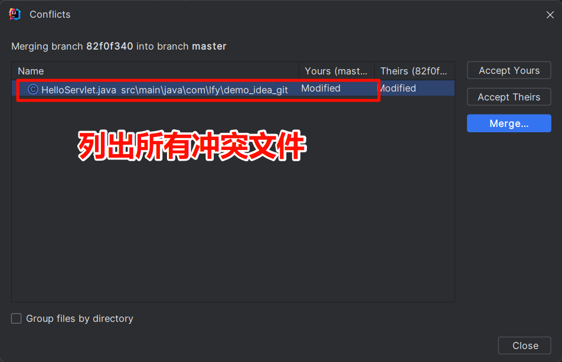

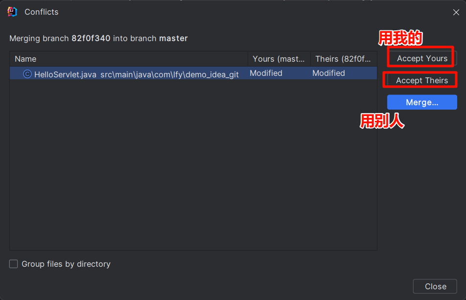

> **三联屏**； 冲突后无论点击 rebase、merge 都会来冲突三联屏

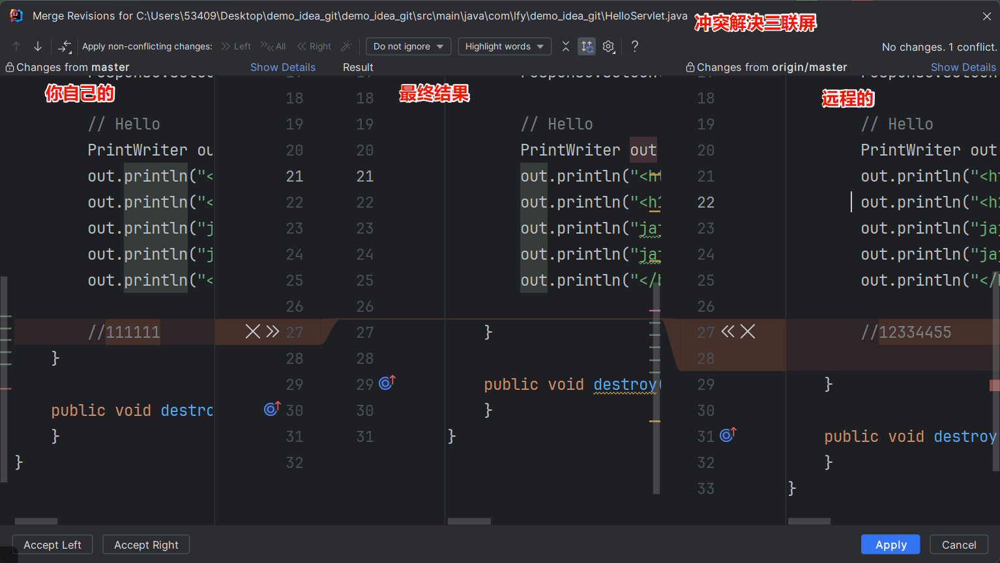

> - 多分支合并
> - 远程更新、推送
> - 多人共同开发
> 
> 以上情况都可能出现冲突；只要冲突，无论你用rebase还是merge合并最终的代码，都要来到冲突解决的屏幕；
> 
> 不要在一个类中处理所有业务； 订单功能；OrderFunction；
> 
> 订单创建：OrderCreateService
> 
> 订单支付：OrderPayService
> 
> 订单取消：OrderCancleService

# 未来

fork、pr、代码审核、git ci

# 一张图

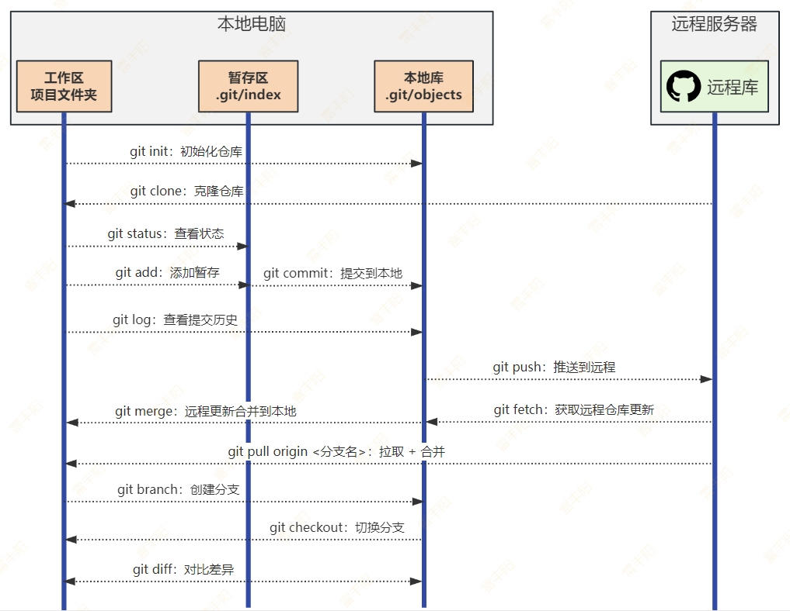