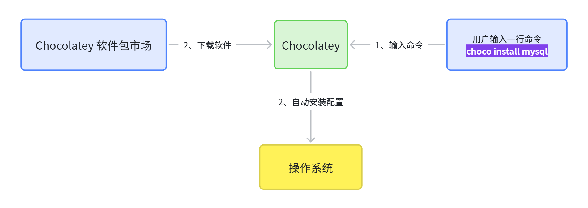

# 3. Chocolatey: Windows 命令行软件管理器

> 1. 你是否在为安装各种版本的Java环境烦恼？装完还得**配置环境变量**
> 2. 你是否为安装各种其他软件烦恼，**不知道哪里下载**？（360软件市场）？
> 3. **开发者的一些专用软件**（Nginx、VMWare、MySQL、Redis）到底从哪里下载？
> 
> **Chocolatey **帮你一行命令搞定: https://chocolatey.org/



# 安装

- 访问：https://chocolatey.org/install#individual
- 复制命令

```powershell
Set-ExecutionPolicy Bypass -Scope Process -Force; [System.Net.ServicePointManager]::SecurityProtocol = [System.Net.ServicePointManager]::SecurityProtocol -bor 3072; iex ((New-Object System.Net.WebClient).DownloadString('https://community.chocolatey.org/install.ps1'))
```

# 软件市场

https://community.chocolatey.org/packages

# 使用

## 常用命令

- `choco search xxx`，查找 xxx 安装包
- `choco info xxx`，查看 xxx 安装包信息
- `choco install xxx`，安装 xxx 软件
- `choco upgrade xxx`，升级 xxx 软件
- `choco uninstall xxx`， 卸载 xxx 软件

## 安装JDK

## 安装Git

```powershell
choco install git.install
```

## 安装Node.js

```powershell
choco install nodejs.install
```

## 安装Filezilla

```powershell
choco install filezilla
```