# 2. SQL核心

# DQL（Data Query  Language）

> 商品信息表

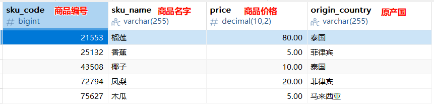

> 订单明细表

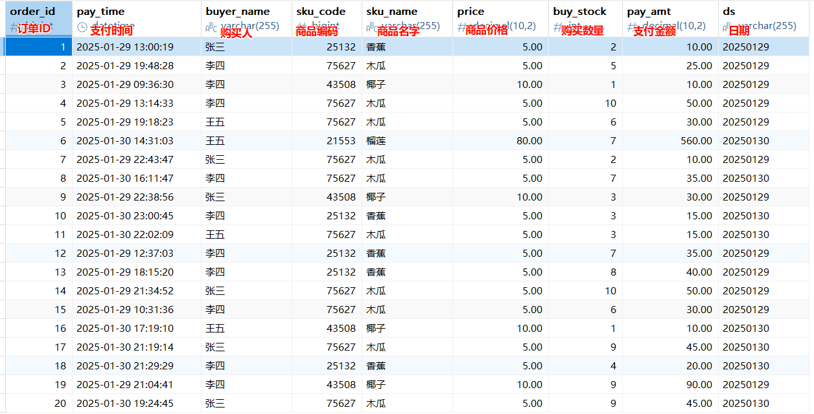

> **如何写出一个****查询SQL****；**
> 
> 先**认识表**，才能写出查询
> 
> 1. **观察表****中的所有列**（字段），都代表什么意思，对整体数据有一个把握
>   - **观察字段内容**，来确认从这张表查询能否满足查询需求。有可能一张表的数据不够，那就需要拉上多张表一起查询
>   - **订单明细表**是一张记录了买家、商品、价格、金额等订单信息的事实表，我们可以基于其中的字段筛选交易记录。
>   - **商品信息表**是记录了每个商品的价格、原产国等属性。
> 2. 了解表中数据
>   - 看下有多少行记录，如果**数据量大**，需要考虑**优化查询性能（MySQL高级部分）**；
>   - 看下是否存在需要清洗的脏数据

## 语法结构

> 手写顺序，机读顺序

**如下是查询SQL的手写方式，标上的序号表示他们在底层机器执行的顺序；**

```sql
(9)  SELECT
        (10) DISTINCT column,
        (6)  AGG FUNC(column or expression), ...
(1)  FROM left tab1
        (3)  JOIN right tab2
        (2)  ON tab1.column = tab2.column
(4)  WHERE constraint_expression
(5)  GROUP BY column
(7)  WITH CUBE|ROLLUP
(8)  HAVING constraint_expression
(11) ORDER BY column ASC|DESC
(12) LIMIT count OFFSET count;
(13) [FOR UPDATE | LOCK IN SHARE MODE]]

-- 面试题：机器执行顺序小口诀： FOJWGHSDOL: 佛叫我干活，速度online（上线）
```

1. **FROM**：首先执行的是FROM子句，它从指定的表中获取数据，并执行笛卡尔积（交叉连接），生成**虚拟表VT1**。
2. **ON**：接下来对**虚拟表VT1**应用ON筛选器，筛选出满足ON条件的行，生成**虚拟表VT2**。
3. **JOIN**：如果指定了OUTER JOIN，会将未匹配的行添加到**虚拟表VT2**中，生成**虚拟表VT3**。
4. **WHERE**：对**虚拟表VT3**应用WHERE筛选器，筛选出满足条件的行，生成**虚拟表VT4**。
5. **GROUP BY**：将**虚拟表VT4**中的行按GROUP BY子句中的列进行分组，生成**虚拟表VT5**。
6. **AGG_FUNC**：对**虚拟表VT5**计算聚合函数（如SUM、AVG等）。**生成虚拟表 VT6**
7. ~~**WITH CUBE|ROLLUP**~~~~：~~~~对~~~~**虚拟表 VT5**~~~~应用ROLLUP或CUBE选项，~~~~**生成虚拟表 VT6**~~~~。~~
  1. ~~注意：MySQL只支持 ~~~~**WITH ROLLUP语法； 很少使用，一般忽略**~~
8. **HAVING**：对**虚拟表VT6**应用HAVING筛选器，筛选出满足条件的行，生成**虚拟表VT7**。
9. **SELECT**：从**虚拟表VT7**中选出指定的列，生成**虚拟表VT8**。
10. **DISTINCT**：去除**虚拟表VT8**中的重复行，生成**虚拟表VT9**。
11. **ORDER BY**：将**虚拟表VT9**中的行按ORDER BY子句中的列进行排序，生成游标**VC10**。
12. **LIMIT/OFFSET**：从**VC10**中选择指定数量的行，生成**虚拟表VT11**，并**返回给调用者**
13. **FOR UPDATE**：锁定符合条件的行；
  1. **FOR UPDATE** 是排他锁（所有情况都有锁）
  2. **LOCK IN SHARE MODE** 是共享锁（读读模式相当于无锁，其他情况有锁）

> **简单结构**：[] 代表可选
> 
> SELECT         需要的列
> 
> FROM           被查询的表
> 
> [WHERE]       查询条件
> 
> [GROUP BY]   聚合维度 
> 
> [ORDER BY]   排序维度
> 
> [HAVING]      结果过滤
> 
> [LIMIT]         返回行数限制

## 单表查询 

### 查询所有购买香蕉的订单

```sql
-- 基础查询
SELECT * FROM order_detail
WHERE sku_name='香蕉'

-- 字段别名；  注意每个字段之间用 逗号 分割； 别名只是显示效果，查询还是用原来名字
SELECT `pay_time` AS `支付时间`,
  buyer_name AS 买家,
  pay_amt AS `支付金额`
  FROM order_detail
WHERE sku_name='香蕉';
```

### where条件

- **单个条件中**，
  - 可以用=、>、<、>=、!=等条件判断字段内容与给定值的关系
  - <>代表不等于，和!=同义
  - 如果是多个可枚举值，也可以用ln（枚举值1′，枚举值2＇)这样的格式
  - like可以用于做模糊匹配，例如buyer_name like ’李%‘，即可筛选出姓名首字为李的交易记录
- **多条件间**
  - 与条件用AND链接； A and B，表示并且的关系
  - 或条件用OR链接； A or B，表示或者的关系
  - 使用OR的复杂场景时，最好配合小括号；比如： `id>10 OR (age=15 and name like '李%')`

```sql
SELECT order_id,
  `pay_time` AS `支付时间`,
  buyer_name AS `买家`,
  pay_amt AS `支付金额`,
  sku_name AS 商品名称
  FROM order_detail
WHERE sku_name IN ('香蕉','椰子')
AND pay_amt >= 80
AND buyer_name != '张三';


--思考： or 前后小括号位置的不同对查询结果有影响吗？
SELECT order_id,
  `pay_time` AS `支付时间`,
  buyer_name AS `买家`,
  pay_amt AS `支付金额`,
  sku_name AS 商品名称
  FROM order_detail
WHERE (sku_name IN ('香蕉','椰子')
OR pay_amt >= 80)
AND buyer_name != '张三';

-- 这个查询由于没有括号，按照SQL的运算优先级，AND会先于OR执行，所以实际逻辑是：
-- 先计算pay_amt >= 80 AND buyer_name != '张三'
-- 然后将sku_name IN ('香蕉','椰子')与上述结果进行OR运算
-- 相当于：条件A OR (条件B AND 条件C)
SELECT order_id,
  `pay_time` AS `支付时间`,
  buyer_name AS `买家`,
  pay_amt AS `支付金额`,
  sku_name AS 商品名称
  FROM order_detail
WHERE sku_name IN ('香蕉','椰子')
OR pay_amt >= 80
AND buyer_name != '张三';
```

### 运算符

#### 算术运算符

#### 比较运算符

#### 逻辑运算符

#### 位运算符（对数字的二进制位进行操作）

#### 其他运算符

#### 小练习

> 订单表
> 
> **提示词：**
> 
> 根据这个数据表的定义：
> 
> CREATE TABLE `order_detail`  (
> 
>   `order_id` bigint PRIMARY KEY NOT NULL AUTO_INCREMENT,
> 
>   `pay_time` datetime,
> 
>   `buyer_name` varchar(255),
> 
>   `sku_code` bigint,
> 
>   `sku_name` varchar(255),
> 
>   `price` decimal(10, 2),
> 
>   `buy_stock` int,
> 
>   `pay_amt` decimal(10, 2),
> 
>   `ds` varchar(255)
> 
> );
> 
> 给我出10道仅仅是单表查询的题目，where条件可以设计的复杂一点

```sql
-- 1. 查询 2025 年 1 月 1 日之后支付，且买家姓名以 "张" 开头、支付金额超过 20 元的订单：
select * from order_detail
where ds >= '2025-01-01' 
    and buyer_name LIKE "张%"  -- 张%(%模糊匹配)  -- %张
    and pay_amt>20
    
-- 2. 查询商品代码在 10000-50000 之间（不含边界），但购买数量小于 3 或大于 10 的订单：
select * from order_detail
where (sku_code > 10000 and sku_code < 50000)
and (buy_stock>10 or buy_stock<3)

-- 3. 查询支付金额低于 price * buy_stock * 0.8（享受 8 折以下优惠），且商品代码末位是奇数的订单：
select * from order_detail 
where pay_amt < price*buy_stock*0.8 and sku_code%2=1
```

### 排序、分页等

> 排序 order by 

> 分页

```sql
-- 演示limit子句
/*
limit子句是用于分页显示结果。
limit m,n
n：表示最多该页显示几行
m：表示从第几行开始取记录，第一个行的索引是0
m = (page-1)*n  page表示第几页

每页最多显示5条，n=5
第1页，page=1，m = (1-1)*5 = 0;  limit 0,5
第2页，page=2，m = (2-1)*5 = 5;  limit 5,5
第3页，page=3，m = (3-1)*5 = 10;  limit 10,5
*/
#查询订单表的数据，分页显示，每页显示5条记录
#第1页
SELECT * FROM order_detail LIMIT 0,5;
#第2页
SELECT * FROM order_detail LIMIT 5,5;
#第3页
SELECT * FROM order_detail LIMIT 10,5;
#第4页
SELECT * FROM order_detail LIMIT 15,5;
#第5页
SELECT * FROM order_detail LIMIT 20,5;
#第6页
SELECT * FROM order_detail  LIMIT 25,5;
```

### 子查询

1. 在SQL语句中，一句被括号包住的完整查询语句可以视为一个**虚拟的表**，这个表的内容是这句SQL的查询

结果，别人可以基于这张虚拟表继续查询，这种查询语句被称为一个**子查询**

1. 子查询中的语句不需要写英文分号，
2. 子查询内部如果进行了使用AS的字段重命名，则在外层查询的SELECT或者WHERE条件中，需要写重命名后的字段

语法：

- **写在FROM后**：
  -  `select 列名1,列名n from`` ``( select 列名1,列名n from A表 where 条件 ) as`` B表 ``where 条件`
- **写在WHERE后**：
  - `select 列名1,列名n from A 表 where 列 ``运算符`` (子查询) `
- 可以写在更多位置（后面练习）
  - SELECT 子句​（标量子查询）
  - FROM 子句​（派生表/内联视图）
  - WHERE 子句​（比较、IN、EXISTS等）
  - HAVING 子句​（聚合后的过滤）
  - JOIN 条件​（作为连接的一部分）
  - INSERT 语句​（子查询作为数据源）
  - UPDATE 语句​（子查询用于 SET 或 WHERE）
  - DELETE 语句​（子查询用于 WHERE）
  - EXISTS/NOT EXISTS 条件​（WHERE 或 HAVING）
  - IN/NOT IN 条件​（WHERE 或 HAVING）
  - ANY/SOME/ALL 比较​（WHERE 或 HAVING）
  - WITH 子句（CTE）​​（公用表表达式，MySQL 8.0+）

```sql
-- from 后子查询
SELECT * FROM (
  SELECT order_id,
    `pay_time` AS `支付时间`,
    buyer_name AS `买家`,
    pay_amt AS `支付金额`,
    sku_name AS 商品名称
    FROM order_detail
  WHERE sku_name IN ('香蕉','椰子')
) AS tmp_order WHERE 支付时间 > '2025-01-30'
```

```sql

-- where 后子查询
-- 查询比 12号订单金额高的所有订单
SELECT * FROM order_detail 
  WHERE pay_amt > (SELECT pay_amt FROM order_detail WHERE order_id=12)
```

### 练习

> **查询出没有被张三购买过的商品，其商品编码、商品名称、商品价格和原产国**
> 
> 思路：
> 
> 1. **明确要查询的表和字段**。根据描述，我们要查询商品
> 2. **明确递进的查询条件**。根据描述，我们先要去订单明细表中，找到张三购买的所有商品
> 3. **组合查询层次**；递进条件为子查询内容，外层查询为最终的目标数据

```sql
SELECT * FROM sku_info 
WHERE sku_code NOT IN 
  (SELECT sku_code FROM order_detail WHERE buyer_name = '张三')
```

## 聚合查询

> 聚合查询对一组值执行**聚集**和**统计**，并返回**统计结果**。类似EXCEL中的求和、计数等。一般用来做数据汇总计算

问题1：订单表中一共多少笔订单？交易总额是多少？

问题2：订单表中每种商品有几笔订单？交易额是多少？


### 不分组聚合与常用函数

**问题1：**订单表中一共多少笔订单？交易总额是多少？

```sql
SELECT COUNT(order_id) AS 订单数量,
       SUM(pay_amt) 订单总额
FROM order_detail
```

**常用聚合函数：**

计数：count(字段)

去重计数：count(distinct 字段)

求和：sum(字段)

平均：avg(字段)

最大：max(字段)

最小：min(字段)

> 综合案例

```sql
SELECT COUNT(order_id) AS 订单数量,
       SUM(pay_amt) 订单总额,
       COUNT(distinct buyer_name) 客户数,
       AVG(pay_amt) 平均支付额,
       MAX(buy_stock) 最大购买数量,
       MIN(price) 最小商品价格
FROM order_detail;
```

> 结果


> 小提示：**MySQL 8 中 COUNT(*) vs COUNT(列) vs COUNT(1) 的区别**
> 
> - **COUNT(*)**：**统计表中所有行的数量**，​包括 NULL 值
> - **COUNT(列名)**：**统计指定列中****非 NULL 值****的数量**；如果该列允许 NULL 值，结果可能与 COUNT(*) 不同
> - **COUNT(1)：**统计表中所有行的数量，​包括 NULL 值，性能与 COUNT(*) 几乎相同（在 MySQL 8.0 中优化后），1 在这里只是一个常量值，MySQL 不会实际检查它

### 分组聚合

> 按不同的分组进行聚合操作

**问题2：**订单表中每种商品有几笔订单？交易额是多少？

```sql
-- 注意： SELECT sku_name 要和 GROUP BY sku_name; 一一对应
-- group by 使用原始字段名，而不是别名
-- 默认规定：分组的属性必须出现在查询列上
SELECT sku_name AS 商品名称,
 COUNT(pay_amt) AS 订单数,
 SUM(pay_amt) AS 交易总额
FROM order_detail
GROUP BY sku_name;
```

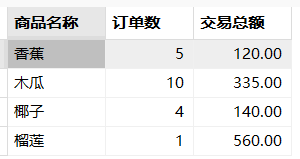

---

**问题3**：订单表中每件商品、每天有几笔订单？交易额是多少？【多分组聚合案例】

```sql
-- group by后面的字段包含select中所有不带聚合函数的字段
SELECT ds AS 交易日期,
 sku_name AS 商品名称,
 COUNT(pay_amt) AS 订单数,
 SUM(pay_amt) AS 交易总额
FROM order_detail
GROUP BY sku_name,ds;
```

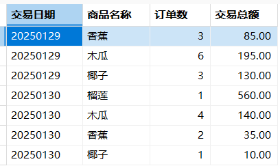

---

### HAVING 

`HAVING` 子句在 SQL 查询中用于对分组后的结果进行筛选​，类似于 `WHERE` 子句，但作用的对象不同。

#### 使用场景

**1）、与 GROUP BY 一起使用**

- 当需要对分组后的结果进行条件过滤时使用
- `WHERE` 在分组前过滤行，`HAVING` 在分组后过滤组

```sql
-- 找出订单数超过5个的客户
SELECT customer_id, COUNT(*) as order_count
FROM orders
GROUP BY customer_id
HAVING COUNT(*) > 5;
```

**2）、对聚合函数结果进行筛选**

- 当筛选条件包含聚合函数(如 SUM, AVG, COUNT 等)时必须使用 HAVING

```sql
-- 找出平均成绩大于85分的学生
SELECT student_id, AVG(score) as avg_score
FROM exam_results
GROUP BY student_id
HAVING AVG(score) > 85;
```

3）、**对分组后的列进行筛选**

- 即使不使用聚合函数，如果要对 GROUP BY 后的列进行筛选，也需要用 HAVING

```sql
-- 找出按部门分组后部门编号大于10的组
SELECT department_id, COUNT(*)
FROM employees
GROUP BY department_id
HAVING department_id > 10;
```

#### 案例测试

**问题4**：找到每天交易额大于50的商品

思路：

1. 找到每个商品每天的交易额
2. 从已有结果中过滤出数据（**使用子查询、使用having**、不能使用where）

```sql
-- 使用子查询
SELECT * FROM (
  SELECT ds AS 交易日期,
   sku_name AS 商品名称,
   COUNT(pay_amt) AS 订单数,
   SUM(pay_amt) AS 交易总额
  FROM order_detail
  GROUP BY sku_name,ds
) as a WHERE 交易总额>50


-- 使用 having
SELECT ds AS 交易日期,
 sku_name AS 商品名称,
 COUNT(pay_amt) AS 订单数,
 SUM(pay_amt) AS 交易总额
FROM order_detail
GROUP BY sku_name,ds
HAVING SUM(pay_amt)>50
```

### 练习

> **特别注意：分组字段一定保证上下一一对应**

**问题1**：**统计出每个用户每天木瓜的购买金额**

```sql
  SELECT ds AS 交易日期,
   buyer_name AS 用户名称,
   SUM(pay_amt) AS 交易总额
  FROM order_detail
  where sku_name='木瓜'
  GROUP BY buyer_name,ds
```

## 关联查询（JOIN）

> **需要联合多张表一起查询**； JOIN 会把多张表拼接在一起；** from 后面直接写两个表也能连接（隐式连接）**
> 
> - 由于显式 JOIN 语法更清晰，并且支持多种连接方式，因此强烈建议使用**显式JOIN**（如INNER JOIN, LEFT JOIN等）而不是逗号分隔的隐式连接。
> 
> 连接分为如下几种：
> 
> 1. **左/右连接**：单边保留
> 2. **内/全连接**：交集/并集
> 3. **交叉连接**：笛卡尔积
> 
> 下面七种join则是对应的变体

准备数据

```sql
CREATE TABLE `t_dept` (
 `id` INT NOT NULL AUTO_INCREMENT,
 `deptName` VARCHAR(30) DEFAULT NULL,
 `address` VARCHAR(40) DEFAULT NULL,
 PRIMARY KEY (`id`)
);
 
CREATE TABLE `t_emp` (
 `id` INT NOT NULL AUTO_INCREMENT,
 `name` VARCHAR(20) DEFAULT NULL,
 `age` INT DEFAULT NULL,
 `deptId` INT DEFAULT NULL,
`empno` INT NOT NULL,
 PRIMARY KEY (`id`),
 KEY `idx_dept_id` (`deptId`)
 #CONSTRAINT `fk_dept_id` FOREIGN KEY (`deptId`) REFERENCES `t_dept` (`id`)
);

INSERT INTO t_dept(id,deptName,address) VALUES(1,'华山','华山');
INSERT INTO t_dept(id,deptName,address) VALUES(2,'丐帮','洛阳');
INSERT INTO t_dept(id,deptName,address) VALUES(3,'峨眉','峨眉山');
INSERT INTO t_dept(id,deptName,address) VALUES(4,'武当','武当山');
INSERT INTO t_dept(id,deptName,address) VALUES(5,'明教','光明顶');
INSERT INTO t_dept(id,deptName,address) VALUES(6,'少林','少林寺');

INSERT INTO t_emp(id,NAME,age,deptId,empno) VALUES(1,'风清扬',90,1,100001);
INSERT INTO t_emp(id,NAME,age,deptId,empno) VALUES(2,'岳不群',50,1,100002);
INSERT INTO t_emp(id,NAME,age,deptId,empno) VALUES(3,'令狐冲',24,1,100003);

INSERT INTO t_emp(id,NAME,age,deptId,empno) VALUES(4,'洪七公',70,2,100004);
INSERT INTO t_emp(id,NAME,age,deptId,empno) VALUES(5,'乔峰',35,2,100005);

INSERT INTO t_emp(id,NAME,age,deptId,empno) VALUES(6,'灭绝师太',70,3,100006);
INSERT INTO t_emp(id,NAME,age,deptId,empno) VALUES(7,'周芷若',20,3,100007);

INSERT INTO t_emp(id,NAME,age,deptId,empno) VALUES(8,'张三丰',100,4,100008);
INSERT INTO t_emp(id,NAME,age,deptId,empno) VALUES(9,'张无忌',25,5,100009);
INSERT INTO t_emp(id,NAME,age,deptId,empno) VALUES(10,'韦小宝',18,NULL,100010);
```

### 7种JOIN

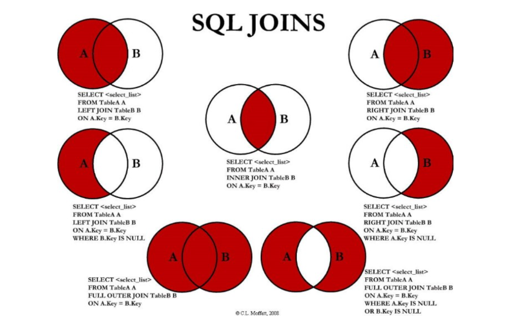

#### CROSS JOIN：笛卡尔积

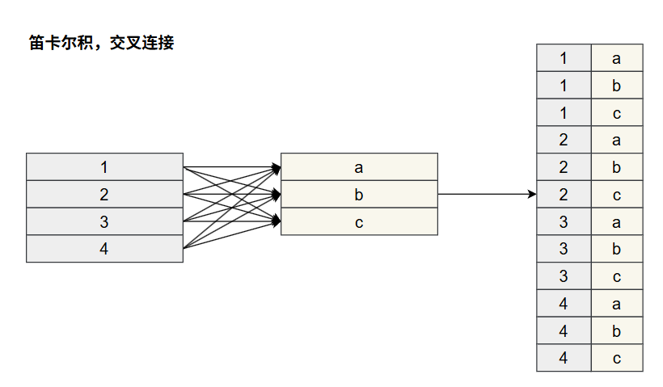

```sql
select * from t_emp,t_dept;
-- 等同于
select * from t_emp 
cross join t_dept;
```

#### LEFT JOIN：左连接

**需求1**：查询`所有用户`，并显示其部门信息（如果员工没有所在部门，也会被列出） => `查询A的全集`

```sql
SELECT * FROM t_emp a 
LEFT JOIN t_dept b ON a.deptid = b.id;
```

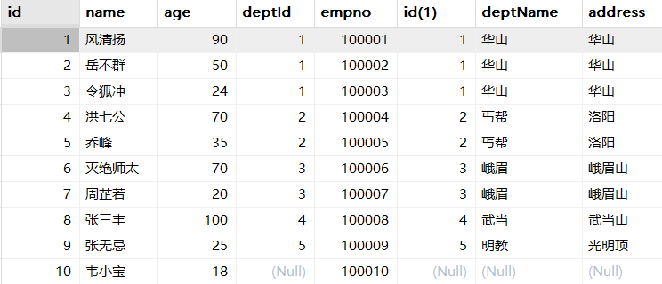

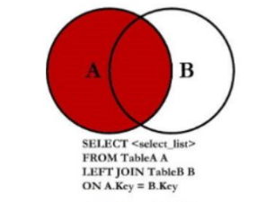

**需求2**：查询`没有加入任何部门的员工`（先查询所有员工，再过滤掉包含部门的数据） => `查询A且不包含B`

```sql
SELECT * FROM t_emp a 
LEFT JOIN t_dept b ON a.deptid = b.id 
WHERE b.id IS NULL;
```

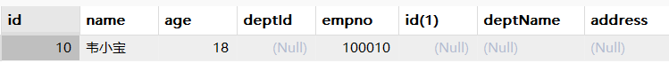

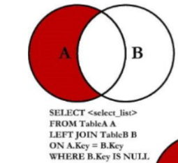

#### RIGHT JOIN：右连接

**需求1：**列出`所有部门`，并显示其部门的员工信息（如果部门没有员工，也会被列出）=> `查询B的全集`

```sql
SELECT b.*,a.*
FROM t_emp a 
RIGHT JOIN t_dept b ON a.deptid = b.id;
```

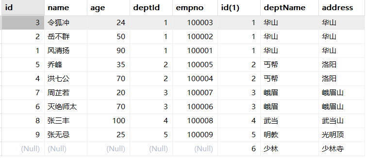

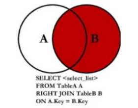

**需求2：**查询`没有任何员工的部门` => `查询B且不包含A`

```sql
SELECT * FROM t_emp a 
RIGHT JOIN t_dept b ON a.deptid = b.id 
WHERE a.id IS NULL;
```

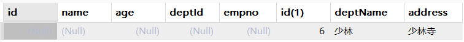


#### INNER JOIN：内连接

**需求：**查询`所有有部门的员工`信息以及他所在的部门信息

```sql
SELECT * FROM t_emp a INNER JOIN t_dept b ON a.deptid = b.id;
```

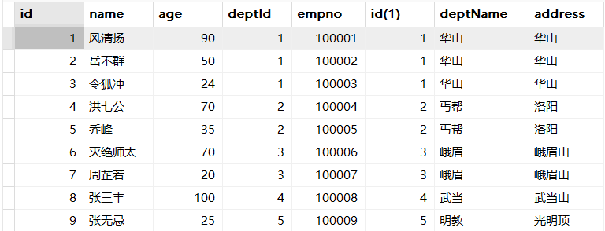


#### ~~FULL JOIN：全连接~~

> 由于MySQL 不支持 FULL JOIN。需要使用 `UNION` 、`UNION ALL`   实现

**需求1：**查询`所有员工和所有部门` => `AB全有`

```sql
SELECT * 
FROM t_emp a 
LEFT JOIN t_dept b ON a.deptid = b.id 
UNION 
SELECT * 
FROM t_emp a 
RIGHT JOIN t_dept b ON a.deptid = b.id;
```

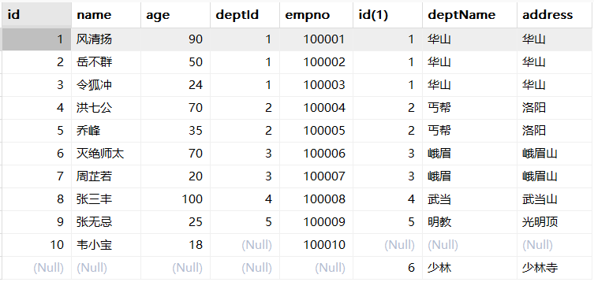


---

**需求2**：查询`没有加入任何部门的员工`，以及查询出部门下`没有任何员工的部门` => `A的独有+B的独有`

```sql
SELECT * 
FROM t_emp a 
LEFT JOIN t_dept b ON a.deptid = b.id 
WHERE b.id IS NULL 

UNION ALL

SELECT * 
FROM t_emp a 
RIGHT JOIN t_dept b ON a.deptid = b.id 
WHERE a.id IS NULL;
```

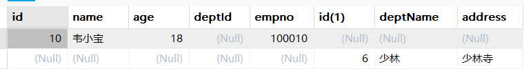

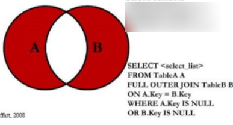

### 过滤与关联：

> ON 指定 **关联条件**
> 
> WHERE 指定 **过滤条件**
> 
> 条件放哪里合适？可以使用商品表进行测试

#### 先过滤，再关联，写在ON里

在LEFT JOIN中，对右表的过滤条件可以写在ON条件中，起到的效果是先从右表筛选出符合条件的记录，再去和左表关联，**关联不上右表的左表记录会被保留**，同时右表字段会填充为空。

```sql
SELECT a.order_id As 订单编码,
    a.sku_code As 商品编码,
    a.sku_name As 商品名称,
    a.pay_amt As 支付金额,
    b.origin_country As 原产国
FROM order_detail a
LEFT JOIN sku_info b
    ON a.sku_code=b.sku_code  -- 关联条件
    AND b.origin_country = '泰国' -- 对b的关联条件过滤
WHERE a.buyer_name = '王五' -- 对结果的过滤
```

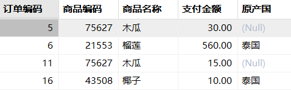

#### 先关联、再过滤，写在where里

在WHERE语句中可以限制左表和右表字段作为过滤条件。注意，当在使用LEFT/RIGHT JOIN这样的不对称查询时，从表的条件写在 WHERE 中，则实际返回的是类似于 JOIN 的结果，因为右表为空的记录会被写在AND条件中的条件过滤掉。

```sql
SELECT a.order_id As 订单编码,
    a.sku_code As 商品编码,
    a.sku_name As 商品名称,
    a.pay_amt As 支付金额,
    b.origin_country As 原产国
FROM order_detail a
LEFT JOIN sku_info b
    ON a.sku_code=b.sku_code
WHERE a.buyer_name = '王五'
    AND b.origin_country = '泰国'
```

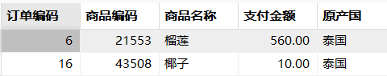

**注意：右表为null的记录被过滤，导致左表也不是完全显示了**

### 数据膨胀

> 如果**关联键不唯一**，就会产生数据膨胀风险

演示：

```sql
-- 查询 1-30 香蕉和木瓜的订单数据; 6条记录
SELECT a.*
FROM order_detail a
WHERE sku_name IN ('香蕉','木瓜')
AND ds = 20250130
```

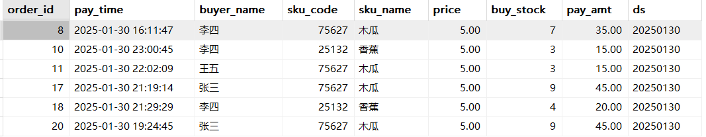

进行关联

```sql
SELECT a.*,b.price,b.sku_name
FROM order_detail a
LEFT JOIN sku_info b
ON a.price = b.price
WHERE a.sku_name IN ('香蕉','木瓜')
AND a.ds=20250130
ORDER BY order_id;

-- 执行效果：左表出现数据重复，12条记录
```

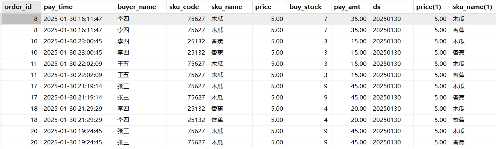

**原因：关联键**选择的不对。价格为5的可能有多个。

**解决：**用业务关联性字段做关联

### 练习

**问题1：**每个原产国，在每天的成交水果种类数目和成交金额

```sql
SELECT b.origin_country As 原产国,
    a.ds AS 成交日期,
    COUNT(DISTINCT a.sku_code)AS 成交水果种类,
    SUM(a.pay_amt) As 成交金额
FROM order_detail a
LEFT JOIN sku_info b
    ON a.sku_code = b.sku_code
GROUP BY b.origin_country,a.ds;
```

## 常用函数

> 分为单行函数、多行函数、窗口函数
> 
> 1. **单行函数**：对查询结果中的每行单独处理，**每行返回一个结果**。例如：字符串函数、数值函数、日期函数等。
> 2. **多行函数**：对一组行进行操作，返回**一个汇总结果**。例如：SUM(), AVG(), COUNT()等。
> 3. **窗口函数**：多行函数的一种，但不会像聚合函数那样将多行合并为一行，而是基于每行和它相关的一组行（窗口）计算一个结果。

函数以后在使用的过程中**边查边用**，无需一次性全部都用一遍

所有函数：https://dev.mysql.com/doc/refman/8.4/en/functions.html

> 导入如下数据

```sql
CREATE DATABASE emp_db;
USE emp_db;
SET NAMES utf8mb4;
SET FOREIGN_KEY_CHECKS = 0;

-- ----------------------------
-- Table structure for t_department
-- ----------------------------
DROP TABLE IF EXISTS `t_department`;
CREATE TABLE `t_department`  (
  `did` int NOT NULL AUTO_INCREMENT COMMENT '部门编号',
  `dname` varchar(20) CHARACTER SET utf8mb4 COLLATE utf8mb4_0900_ai_ci NOT NULL COMMENT '员工名称',
  `description` varchar(200) CHARACTER SET utf8mb4 COLLATE utf8mb4_0900_ai_ci NULL DEFAULT NULL COMMENT '员工简介',
  PRIMARY KEY (`did`) USING BTREE,
  UNIQUE INDEX `dname`(`dname` ASC) USING BTREE
) ENGINE = InnoDB AUTO_INCREMENT = 7 CHARACTER SET = utf8mb4 COLLATE = utf8mb4_0900_ai_ci ROW_FORMAT = DYNAMIC;

-- ----------------------------
-- Records of t_department
-- ----------------------------
INSERT INTO `t_department` VALUES (1, '研发部', '研发工作');
INSERT INTO `t_department` VALUES (2, '人事部', '人事管理工作');
INSERT INTO `t_department` VALUES (3, '市场部', '市场推广工作');
INSERT INTO `t_department` VALUES (4, '财务部', '财务管理工作');
INSERT INTO `t_department` VALUES (5, '后勤部', '后勤保障工作');
INSERT INTO `t_department` VALUES (6, '测试部', '测试工作');

-- ----------------------------
-- Table structure for t_employee
-- ----------------------------
DROP TABLE IF EXISTS `t_employee`;
CREATE TABLE `t_employee`  (
  `eid` int NOT NULL AUTO_INCREMENT COMMENT '员工编号',
  `ename` varchar(20) CHARACTER SET utf8mb4 COLLATE utf8mb4_0900_ai_ci NOT NULL COMMENT '员工姓名',
  `salary` double NOT NULL COMMENT '薪资',
  `commission_pct` decimal(3, 2) NULL DEFAULT NULL COMMENT '奖金比例',
  `birthday` date NOT NULL COMMENT '出生日期',
  `gender` enum('男','女') CHARACTER SET utf8mb4 COLLATE utf8mb4_0900_ai_ci NOT NULL DEFAULT '男' COMMENT '性别',
  `tel` char(11) CHARACTER SET utf8mb4 COLLATE utf8mb4_0900_ai_ci NOT NULL COMMENT '手机号码',
  `hiredate` date NOT NULL COMMENT '入职日期',
  `job_id` int NULL DEFAULT NULL COMMENT '职位编号',
  `mid` int NULL DEFAULT NULL COMMENT '领导编号',
  `did` int NULL DEFAULT NULL COMMENT '部门编号',
  PRIMARY KEY (`eid`) USING BTREE,
  INDEX `job_id`(`job_id` ASC) USING BTREE,
  INDEX `did`(`did` ASC) USING BTREE,
  INDEX `mid`(`mid` ASC) USING BTREE,
  CONSTRAINT `t_employee_ibfk_1` FOREIGN KEY (`job_id`) REFERENCES `t_job` (`jid`) ON DELETE SET NULL ON UPDATE CASCADE,
  CONSTRAINT `t_employee_ibfk_2` FOREIGN KEY (`did`) REFERENCES `t_department` (`did`) ON DELETE SET NULL ON UPDATE CASCADE,
  CONSTRAINT `t_employee_ibfk_3` FOREIGN KEY (`mid`) REFERENCES `t_employee` (`eid`) ON DELETE SET NULL ON UPDATE CASCADE,
  CONSTRAINT `t_employee_chk_1` CHECK (`salary` > 0),
  CONSTRAINT `t_employee_chk_2` CHECK (`hiredate` > `birthday`)
) ENGINE = InnoDB AUTO_INCREMENT = 28 CHARACTER SET = utf8mb4 COLLATE = utf8mb4_0900_ai_ci ROW_FORMAT = DYNAMIC;

-- ----------------------------
-- Records of t_employee
-- ----------------------------
INSERT INTO `t_employee` VALUES (1, '张三1', 28000, 0.65, '1980-10-08', '男', '18000000001', '2011-07-28', 1, 1, 1);
INSERT INTO `t_employee` VALUES (2, '张三2', 7001, 0.10, '1984-08-03', '男', '18000000001', '2015-07-03', 2, 1, 1);
INSERT INTO `t_employee` VALUES (3, '张三3', 8000, NULL, '1985-04-09', '男', '18000000001', '2014-07-01', 3, 7, 1);
INSERT INTO `t_employee` VALUES (4, '张三4', 9456, NULL, '1986-09-07', '女', '18000000001', '2015-08-08', 8, 22, 3);
INSERT INTO `t_employee` VALUES (5, '张三5', 8567, NULL, '1978-08-02', '男', '18000000001', '2015-01-01', 3, 7, 1);
INSERT INTO `t_employee` VALUES (6, '张三6', 12000, NULL, '1985-04-03', '男', '18000000001', '2015-02-02', 3, 2, 1);
INSERT INTO `t_employee` VALUES (7, '张三7', 15700, 0.24, '1982-08-02', '男', '18000000001', '2015-03-03', 2, 1, 1);
INSERT INTO `t_employee` VALUES (8, '张三8', 9000, 0.40, '1983-03-02', '女', '18000000001', '2015-01-06', 4, 1, 1);
INSERT INTO `t_employee` VALUES (9, '张三9', 7897, NULL, '1984-09-01', '男', '18000000001', '2015-04-01', 3, 7, 1);
INSERT INTO `t_employee` VALUES (10, '张三10', 8789, NULL, '1989-04-02', '男', '18000000001', '2014-09-03', 2, 1, 1);
INSERT INTO `t_employee` VALUES (11, '张三11', 15678, NULL, '1983-05-07', '女', '18000000001', '2014-04-04', 4, 1, 1);
INSERT INTO `t_employee` VALUES (12, '张三12', 9000, NULL, '1986-04-02', '女', '18000000001', '2014-02-08', 3, 7, 1);
INSERT INTO `t_employee` VALUES (13, '张三13', 18760, NULL, '1987-04-09', '女', '18000000001', '2015-06-07', 3, 2, 1);
INSERT INTO `t_employee` VALUES (14, '张三14', 18978, 0.25, '1990-01-01', '女', '18000000001', '2015-09-05', 5, 14, 2);
INSERT INTO `t_employee` VALUES (15, '张三15', 8978, NULL, '1987-05-05', '男', '18000000001', '2015-08-04', 6, 14, 2);
INSERT INTO `t_employee` VALUES (16, '张三16', 9878, NULL, '1988-03-06', '男', '18000000001', '2015-03-06', 8, 22, 3);
INSERT INTO `t_employee` VALUES (17, '张三17', 9000, NULL, '1990-08-09', '女', '18000000001', '2013-06-09', 8, 22, 3);
INSERT INTO `t_employee` VALUES (18, '张三18', 16788, 0.10, '1978-09-04', '女', '18000000001', '2013-04-05', 9, 18, 4);
INSERT INTO `t_employee` VALUES (19, '张三19', 7876, NULL, '1988-06-13', '女', '18000000001', '2014-04-07', 10, 18, 4);
INSERT INTO `t_employee` VALUES (20, '张三20', 15099, 0.10, '1989-12-11', '女', '18000000001', '2015-08-04', 11, 20, 5);
INSERT INTO `t_employee` VALUES (21, '张三21', 9787, NULL, '1989-09-04', '女', '18000000001', '2014-06-05', 12, 20, 5);
INSERT INTO `t_employee` VALUES (22, '张三22', 13099, 0.32, '1990-11-09', '男', '18000000001', '2016-08-09', 7, 22, 3);
INSERT INTO `t_employee` VALUES (23, '张三23', 13090, NULL, '1990-02-04', '男', '18000000001', '2016-05-09', 3, 2, 1);
INSERT INTO `t_employee` VALUES (24, '张三24', 10289, NULL, '1990-04-01', '男', '18000000001', '2017-02-06', 12, 20, 5);
INSERT INTO `t_employee` VALUES (25, '张三25', 9087, NULL, '1989-08-01', '女', '18000000001', '2017-09-01', 3, 2, 1);
INSERT INTO `t_employee` VALUES (26, '张三26', 5000, NULL, '1995-02-15', '女', '18000000001', '2021-09-01', NULL, NULL, NULL);
INSERT INTO `t_employee` VALUES (27, '张三27', 8000, NULL, '1990-01-01', '男', '18000000001', '2020-08-15', 3, 2, NULL);

-- ----------------------------
-- Table structure for t_job
-- ----------------------------
DROP TABLE IF EXISTS `t_job`;
CREATE TABLE `t_job`  (
  `jid` int NOT NULL AUTO_INCREMENT COMMENT '职位编号',
  `jname` varchar(20) CHARACTER SET utf8mb4 COLLATE utf8mb4_0900_ai_ci NOT NULL COMMENT '职位名称',
  `description` varchar(200) CHARACTER SET utf8mb4 COLLATE utf8mb4_0900_ai_ci NULL DEFAULT NULL COMMENT '职位简介',
  PRIMARY KEY (`jid`) USING BTREE,
  UNIQUE INDEX `jname`(`jname` ASC) USING BTREE
) ENGINE = InnoDB AUTO_INCREMENT = 13 CHARACTER SET = utf8mb4 COLLATE = utf8mb4_0900_ai_ci ROW_FORMAT = DYNAMIC;

-- ----------------------------
-- Records of t_job
-- ----------------------------
INSERT INTO `t_job` VALUES (1, '技术总监', '负责技术指导工作');
INSERT INTO `t_job` VALUES (2, '项目经理', '负责项目管理工作');
INSERT INTO `t_job` VALUES (3, '程序员', '负责开发工作');
INSERT INTO `t_job` VALUES (4, '测试员', '负责测试工作');
INSERT INTO `t_job` VALUES (5, '人事主管', '负责人事管理管理');
INSERT INTO `t_job` VALUES (6, '人事专员', '负责人事招聘工作');
INSERT INTO `t_job` VALUES (7, '运营主管', '负责市场运营管理工作');
INSERT INTO `t_job` VALUES (8, '市场员', '负责市场推广工作');
INSERT INTO `t_job` VALUES (9, '财务主管', '负责财务工作');
INSERT INTO `t_job` VALUES (10, '出纳', '负责出纳工作');
INSERT INTO `t_job` VALUES (11, '后勤主管', '负责后勤管理工作');
INSERT INTO `t_job` VALUES (12, '网络管理员', '负责网络管理');

SET FOREIGN_KEY_CHECKS = 1;
```

### 数值处理函数

```sql
-- 单行函数 - 演示数学函数
-- 1、在“t_employee”表中查询员工无故旷工一天扣多少钱，
-- 分别用CEIL、FLOOR、ROUND、TRUNCATE函数。
-- 假设本月工作日总天数是22天，
-- 旷工一天扣的钱=salary/22。
SELECT ename,salary/22,CEIL(salary/22),
FLOOR(salary/22),ROUND(salary/22,2),
TRUNCATE(salary/22,2) FROM t_employee; 


-- 查询公司平均薪资，并对平均薪资分别
-- 使用CEIL、FLOOR、ROUND、TRUNCATE函数
SELECT AVG(salary),CEIL(AVG(salary)),
FLOOR(AVG(salary)),ROUND(AVG(salary)),
TRUNCATE(AVG(salary),2) FROM t_employee;
```

### 日期时间函数

```sql
-- 获取系统日期。CURDATE（）和CURRENT_DATE（）,NOW()函数都可以获取当前系统日期。
SELECT CURDATE(),CURRENT_DATE(),NOW();

-- 1、查询今天距离员工入职的日期间隔天数； DATEDIFF计算间隔
SELECT ename,DATEDIFF(CURDATE(),hiredate) FROM t_employee;

-- 2. 在“t_employee”表中查询本月生日的员工姓名、生日。 使用MONTH()获取当前月份
SELECT ename,birthday
FROM t_employee
WHERE MONTH(CURDATE()) = MONTH(birthday);

-- 3. 查询入职时间超过5年的
SELECT ename,hiredate,DATEDIFF(CURDATE(),hiredate) 
FROM t_employee
WHERE DATEDIFF(CURDATE(),hiredate)  > 365*5;
```

### 字符串处理函数

```sql
-- 1. 字符串链接： CONCAT_WS：字符串拼接指定（word sperate）单词分割符号
SELECT CONCAT(ename,tel),CONCAT_WS('-',ename,tel) FROM t_employee;
```

### 条件判断函数

```sql
-- 条件判断函数: 这个函数不是筛选记录的函数，根据条件不同显示不同的结果的函数。

-- 1、如果薪资大于20000，显示高薪，否则显示正常
SELECT ename,salary,IF(salary>20000,'高薪','正常')
FROM t_employee;

-- 2、计算实发工资；实发工资 = 薪资 + 薪资 * 奖金比例
SELECT ename,salary,commission_pct,
salary + salary * commission_pct
FROM t_employee;
-- 如果commission_pct是，计算完结果是NULL，

SELECT ename,salary,commission_pct,
salary + salary * IFNULL(commission_pct,0) AS 实发工资
FROM t_employee;


-- 3、查询员工编号，姓名，薪资，等级，等级根据薪资判断，
-- 如果薪资大于20000，显示“大牛”，
-- 如果薪资15000-20000，显示“高级”，
-- 如果薪资10000-15000，显示“中级”
-- 如果薪资10000以下，显示“初级”
-- mysql中没有if...elseif函数，有case 函数。等价于if...elseif 

SELECT eid,ename,salary,
CASE WHEN salary>20000 THEN '大牛'
     WHEN salary>15000 THEN '高级'
     WHEN salary>10000 THEN '中级'
     ELSE '初级'
END AS "等级"
FROM t_employee;  


 
-- 4、类似于Java中switch...case
SELECT ename, 
    CASE (FLOOR(DATEDIFF(NOW(),hiredate)/365 / 3))
      WHEN 2 THEN '3档工龄-老手员工'
      WHEN 1 THEN '2档工龄-熟手员工'
      WHEN 0 THEN '3档工龄-新手员工'
      ELSE '无敌' 
    END 
    AS "工龄档位"
FROM t_employee
```

### 聚合函数（用于GROUP BY）

> 分组情况下，把一组的数据，汇总计算成一行结果

### 数学计算函数

### 窗口函数

> MySQL **窗口函数**（Window Functions）是一种在**结果集的指定"窗口"上执行计算的函数**，它不改变查询结果的行数，而是为**每一行**提供基于其**分组内数据的计算值**。窗口函数是SQL中处理**排名**、**累计**和**移动平均**等复杂分析的强大工具。

#### 语法

```sql
函数名([参数]) OVER (
  [PARTITION BY 分区字段]
  [ORDER BY 排序字段 [ASC|DESC]]
  [ROWS|RANGE 窗口框架]
)
```

**窗口函数执行流程**：

1. **FROM & JOIN** - 获取基础数据集
2. **WHERE** - 过滤基础数据
3. **GROUP BY** - 分组（可选，影响分区）
4. **窗口处理**​：
  - 根据PARTITION BY将数据分组
  - 在每组内根据ORDER BY排序
  - 为每组每行应用窗口计算
5. **SELECT** - 返回结果

> 注意：窗口函数的执行是在WHERE、GROUP BY、HAVING之后，ORDER BY之前

FOJW**GH** （窗口统计[分组对他有影响]）  **S**DOL

#### 区别

#### 案例

```sql
-- 1、在“t_employee”表中查询薪资在[8000,10000]之间的员工姓名和薪资并给每一行记录编序号
SELECT ROW_NUMBER() OVER() AS "row_num",ename,salary
FROM t_employee WHERE salary BETWEEN 8000 AND 10000;

-- 2、计算全公司的平均薪资，以及每个员工和他所在部门的平均工资差值。
SELECT  eid,ename,salary,did,AVG(salary) OVER() AS avg_all,
AVG(salary) OVER(PARTITION BY did) AS avg_did,
ROUND(salary-AVG(salary) OVER(PARTITION BY did),2) AS deviation
FROM  t_employee;

-- 3、在“t_employee”表中查询全公司薪资排名前3的员工姓名，部门编号，薪资值。
SELECT temp.*
FROM(SELECT ename,did,salary,
DENSE_RANK() OVER w AS "ds_rank_num" 
FROM t_employee
WINDOW w AS (ORDER BY salary DESC))temp 
WHERE temp.ds_rank_num<=3; -- 也可以用limit

-- 4、在“t_employee”表中查询每个部门薪资排名前3的员工姓名，部门编号，薪资值。
SELECT temp.*
FROM(SELECT ename,did,salary,
DENSE_RANK() OVER w AS ds_rank_num
FROM t_employee
WINDOW w AS (PARTITION BY did ORDER BY salary DESC))temp 
WHERE temp.ds_rank_num<=3;
```

# TCL - Transaction Control Language

## 事务

**事务（Transaction）** 是数据库操作的核心概念，指作为**单个逻辑单元****执行的****一系列数据库****操作**。这些操作要么**全部成功执行**，要么**全部不执行**，保证数据从一种**一致性状态**转换到**另一种一致性状态**。

实验数据：

```sql
CREATE TABLE accounts(
  id INT PRIMARY KEY AUTO_INCREMENT,
  user_id INT COMMENT '用户id',
  user_name VARCHAR(50) COMMENT '用户姓名',
  balance DECIMAL(10,2) COMMENT '余额'
) COMMENT '账户表';

CREATE TABLE logs(
  id INT PRIMARY KEY AUTO_INCREMENT,
  user_id INT COMMENT '用户id',
  opt_type VARCHAR(20) COMMENT '操作类型-（转入、转出）',
  amount DECIMAL(10,2) COMMENT '发生金额'
) COMMENT '日志表';

INSERT INTO accounts(user_id,user_name,balance)
VALUES (1,'张三',10000),
       (2,'李四',10000);
```

## 核心特性-ACID

## TCL

> 事务全景流程
> 
> **重点**：
> 
> 1. **提交**和**回滚**都会导致事务结束。事务结束状态只能二选一； rollback to 不代表结束，只代表中间状态；
> 2. 只要事务结束，下次要继续使用事务，必须新开事务
> 3. 支持**保存点**； 
>   1. **回滚**到哪个**保存点**，如果**提交**了，保存点之前的会被保存。
>   2. **回滚**到哪个**保存点**，如果**回滚**了，所有数据都会被撤销。

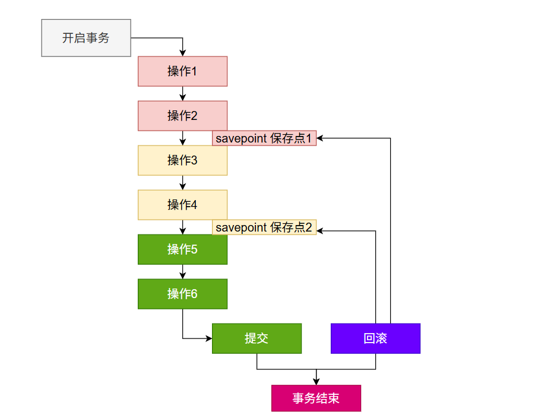

### 开启事务

Ctrl + C：中断命令；

选中+右键 = 复制； 直接右键 = 粘贴

#### 会话级别（整个会话期）

> 我们和数据库的**一次连接，称为一个会话**。一个会话期间可能会有很多操作。`set autocommit = false`对整个会话进行修改。

```sql
-- 开启手动提交事务模式
set autocommit = false;
-- 或  
set autocommit = 0;

-- 上面语句执行之后，它之后的所有sql，都需要手动提交才能生效，直到恢复自动提交模式。

-- 恢复自动提交模式
set autocommit = true;
-- 或  
set autocommit = 1;
```

修改数据后需要手动 **COMMIT**

```sql
-- 设置当前连接为手动提交模式
SET autocommit = FALSE;

UPDATE accounts SET balance = 15000 
WHERE user_id = 1;

-- 提交； 数据会永久保存； 如果不写 COMMIT; 则相当于上面的操作没有做
COMMIT;

-- 以后再执行新的SQL，会隐式开启一个新事务。
```

#### 事务级别（仅本次）

```sql
-- #开始事务
START TRANSACTION; 
UPDATE accounts SET balance = 15000 
WHERE user_id = 2;
-- 下面没有写commit;那么上面这句update语句没有正式生效。
commit;

START TRANSACTION;
DELETE FROM accounts WHERE user_id = 1;
-- #回滚
ROLLBACK;
```

### 基础事务

```sql
START TRANSACTION;
UPDATE accounts SET balance = balance - 500 WHERE id = 1; -- 扣款
UPDATE accounts SET balance = balance + 500 WHERE id = 2; -- 存款
COMMIT; -- 提交（或 ROLLBACK 回滚）
```

### 保存点

```sql
START TRANSACTION;
INSERT INTO accounts (user_id, balance) VALUES (666, 100);
SAVEPOINT accounts_666; -- 设置保存点

INSERT INTO accounts (user_id, balance) VALUES (667, 100);
INSERT INTO accounts (user_id, balance) VALUES (668, 100);
INSERT INTO accounts (user_id, balance) VALUES (669, 100);
ROLLBACK TO accounts_666; -- 回滚到666数据插入时

INSERT INTO accounts (user_id, balance) VALUES (670, 100);
INSERT INTO accounts (user_id, balance) VALUES (671, 100);

COMMIT;
```

## 隔离级别

> 事务四大： ACID； 隔离读；
> 
> 事务有隔离性；数据库为了保证并发事务执行，事务和事务之间是隔离；
> 
> **隔离性**：A做了什么，B不知道；
> 
> - A改数据
> - B读数据

### 定义

SQL标准（ANSI/ISO SQL-92）定义了四个隔离级别，用来解决三大并发问题：

1. **读未提交（Read Uncommitted）**：
  - 允许读取其他事务尚未提交的修改。
  - 可能发生：**脏读（Dirty Read）**、**不可重复读（Non-repeatable Read）**、**幻读（Phantom Read）**。
2. **读已提交（Read Committed）**：
  - 只能读取已提交的数据。
  - 避免脏读，但仍可能发生不可重复读和幻读。
3. **可重复读（Repeatable Read）**：
  - 保证在同一事务中多次读取同一数据的结果相同。
  - 避免脏读和不可重复读，但可能发生幻读（在SQL标准中是这样，但某些数据库如MySQL的InnoDB通过**并发控制机制**也**避免了幻读**）。
4. **串行化（Serializable）**：
  - 最高隔离级别，事务串行执行。
  - 避免所有并发问题：脏读、不可重复读、幻读。

**很多业务（****READ COMMITTED****）；就是 落盘的数据**，就是应该能**查出来**的。

近实时的感知数据变化**READ COMMITTED**，就用 转账、保险单。

### 演示

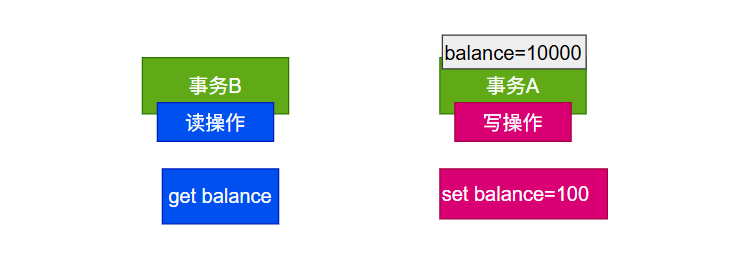

#### 设置隔离级别

```sql
SELECT @@transaction_isolation;
SHOW VARIABLES LIKE 'transaction_isolation';
-- 设置当前会话隔离级别 TRANSACTION ISOLATION LEVEL 
SET SESSION TRANSACTION ISOLATION LEVEL READ COMMITTED;
```

#### 验证隔离级别效果

> - 如果**多个写事务**操作**同一个数据**，则**会排队**
> - **一个写事务**和**多个读事务**会**并发执行**

自己手动实验一下效果！！！！

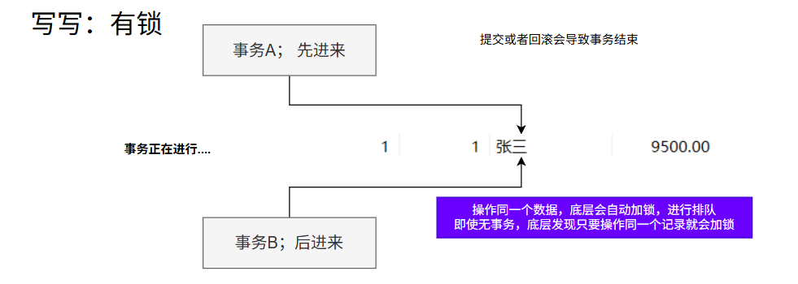

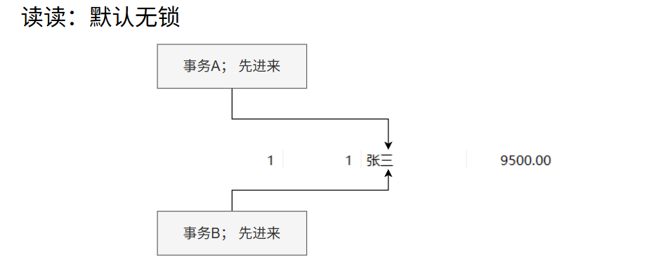

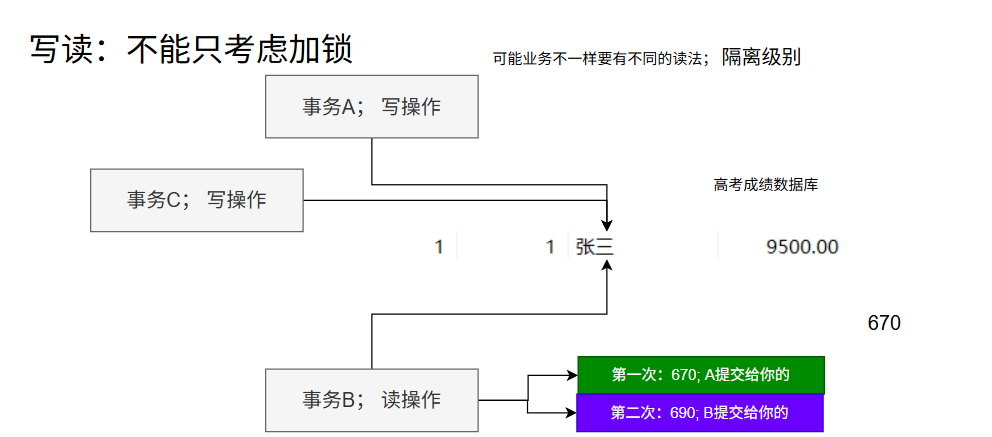

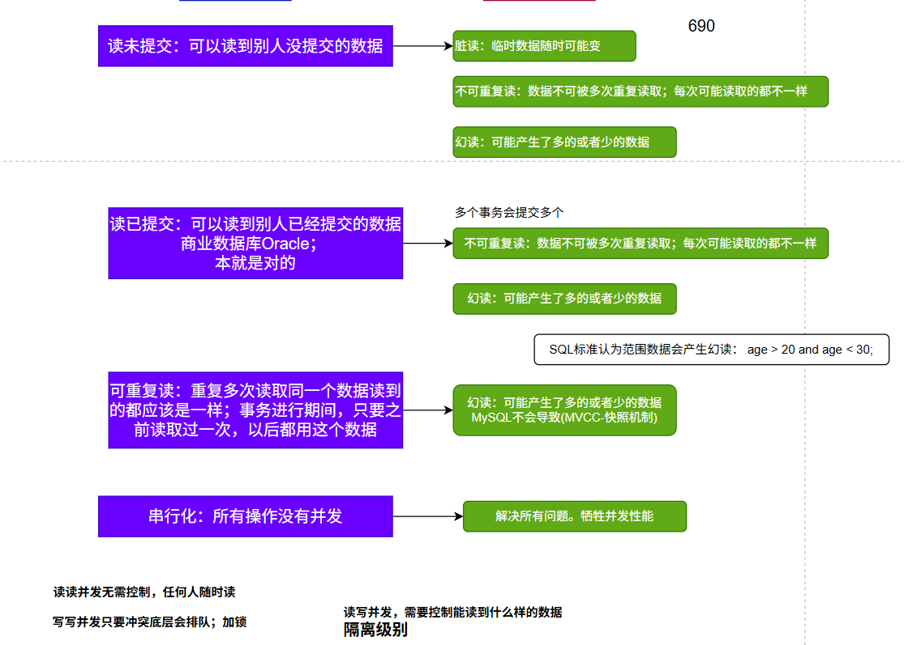

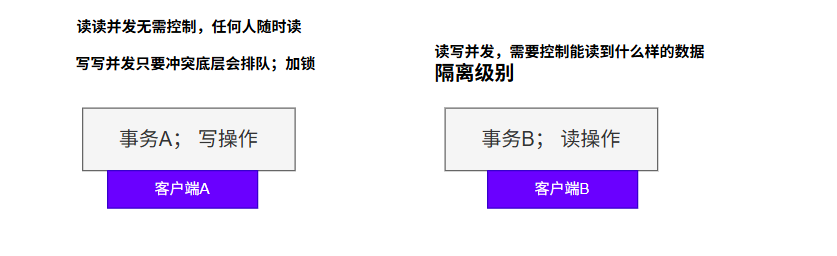