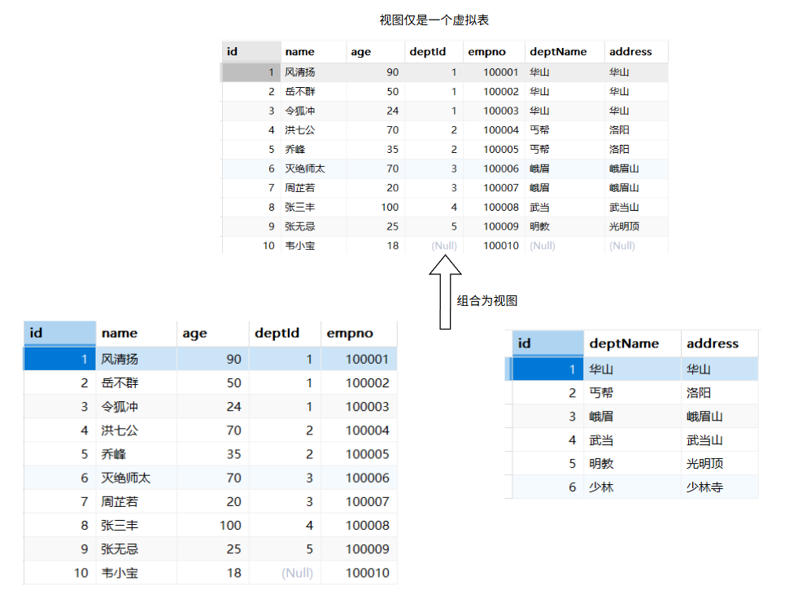
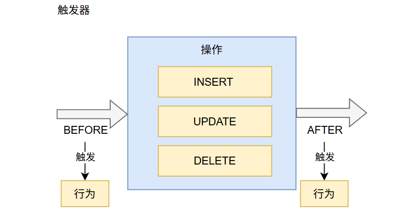
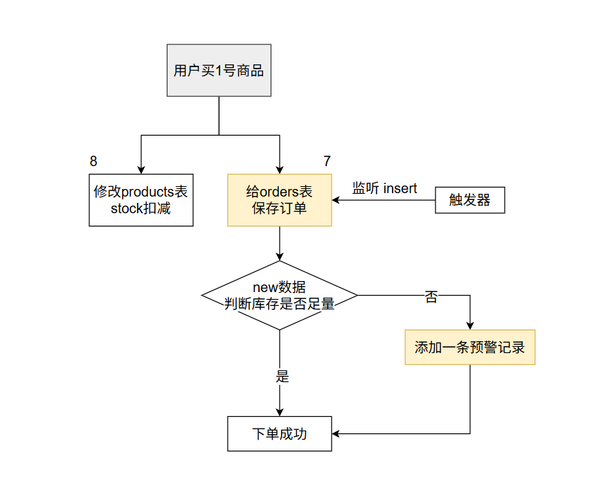

# 3. 扩展用法

# 约束

> 在 MySQL 中创建表时，可以**为字段指定****多种约束**来**保证数据的完整性和一致性**。以下是 MySQL 支持的主要字段约束类型

## 基本约束

### PRIMARY KEY：主键约束

**每张表都创建一个名**叫 `id`  的列，是主键列

- **如果用 int**，能表示： 4,294,967,296； 每天产生100w日志； 用11年
- **如果用 long**，能表示：18,446,744,073,709,551,616； 每天1000000w，用 50,539,02/2 年
- 用主键查询速度极快

```sql
-- 每一行记录都用自增主键  1++
CREATE TABLE users (
    user_id BIGINT PRIMARY KEY,  -- 列级约束  BIGINT 8字节； INT 4字节
    username VARCHAR(50)
);

-- 或者表级约束
CREATE TABLE orders (
    order_id INT,
    user_id INT,
    PRIMARY KEY (o rder_id),  -- 表级约束
    CONSTRAINT pk_orders PRIMARY KEY (order_id)  -- 带名称的主键约束
);
```

```javascript
class Users {
    private Long user_id;  // 8字节
    private String username;
}
```

### UNIQUE：唯一约束

可以有很多

```sql
CREATE TABLE employees (
    emp_id INT PRIMARY KEY,
    email VARCHAR(100) UNIQUE ,  -- 列级约束
    phone VARCHAR(20)
    -- CONSTRAINT uk_email UNIQUE (email )
);

-- 表级约束
CREATE TABLE products (
    product_id INT,
    product_code VARCHAR(20),
    CONSTRAINT uk_product_code UNIQUE (product_code)
);

-- 复合唯一约束
CREATE TABLE order_items (
    order_id INT,
    product_id INT,
    quantity INT,
    CONSTRAINT uk_order_product UNIQUE (order_id, product_id)
);
```

> 唯一字段，查询速度极快
> 
> 1. 查询性能
> 2. 数据完整性、一致性

### NOT NULL：非空约束

```sql
CREATE TABLE customers (
    customer_id INT PRIMARY KEY,
    customer_name VARCHAR(100) NOT NULL,
    email VARCHAR(100) NOT NULL,
    phone VARCHAR(20)  -- 允许NULL
);
```

### DEFAULT：默认值约束

```sql
CREATE TABLE articles (
    article_id INT PRIMARY KEY,
    title VARCHAR(200) NOT NULL,
    content TEXT,
    view_count INT DEFAULT 0,  -- 默认值0
    created_at TIMESTAMP DEFAULT CURRENT_TIMESTAMP,  -- 默认当前时间
    is_published BOOLEAN DEFAULT FALSE
);
```

### CHECK：检查约束 （MySQL 8.0.16+）

- 商城：**秒杀**；**扣库存**（stock：int = 2）；数据库底层：check约束（stock >=0）
- **违反约束就会报错**。

```sql
CREATE TABLE products (
    product_id INT PRIMARY KEY,
    product_name VARCHAR(100) NOT NULL,
    price DECIMAL(10,2) CHECK (price > 0),  -- 列级检查
    stock_quantity INT CHECK (stock_quantity >= 0),
    discount DECIMAL(3,2),
    CONSTRAINT chk_discount CHECK (discount BETWEEN 0 AND 1)  -- 表级检查
);
```

### 外键约束

> - 没有外键，员工表的部门id。和部门表的id。虽然在业务上代表同一个意思，但是，没有给数据库明确说明他们的关系。删除、修改等数据库就不管了。
> - 明确的说有关系；互联网搞并发项目，为了性能，都不用外键。银行用外键
>   - 不靠数据库保证完整性、一致性，靠业务代码
> - 优点：保证数据完整性、一致性
> - 缺点：浪费数据库性能；（多维护关系）

```sql
CREATE TABLE departments (
    dept_id INT PRIMARY KEY,
    dept_name VARCHAR(50) NOT NULL
);

CREATE TABLE employees (
    emp_id INT PRIMARY KEY,
    emp_name VARCHAR(100) NOT NULL,
    dept_id INT,
    manager_id INT,
    CONSTRAINT fk_dept FOREIGN KEY (dept_id) 
        REFERENCES departments(dept_id),
    CONSTRAINT fk_manager FOREIGN KEY (manager_id) 
        REFERENCES employees(emp_id)
);

-- 带操作的外键约束
CREATE TABLE orders (
    order_id INT PRIMARY KEY,
    customer_id INT NOT NULL,
    order_date DATE,
    CONSTRAINT fk_customer FOREIGN KEY (customer_id)
        REFERENCES customers(customer_id)
        ON DELETE CASCADE  -- 级联删除
        ON UPDATE SET NULL  -- 更新时设为NULL
);
```

## 高级约束

### AUTO_INCREMENT：自增约束

```sql
CREATE TABLE products (
    product_id INT PRIMARY KEY AUTO_INCREMENT,
    product_name VARCHAR(100) NOT NULL,
    price DECIMAL(10,2)
);

-- 设置自增起始值
CREATE TABLE logs (
    log_id INT PRIMARY KEY AUTO_INCREMENT,
    message TEXT
) AUTO_INCREMENT = 1000;
```

### ~~GENERATED COLUMN：生成列约束~~

```sql
-- 虚拟生成列(不存储)
CREATE TABLE triangles (
    side_a DOUBLE,
    side_b DOUBLE,
    side_c DOUBLE AS (SQRT(side_a * side_a + side_b * side_b))  -- 计算列
);

-- 存储生成列
CREATE TABLE invoices (
    subtotal DECIMAL(10,2),
    tax_rate DECIMAL(5,4),
    tax_amount DECIMAL(10,2) AS (subtotal * tax_rate) STORED,
    total DECIMAL(10,2) AS (subtotal + tax_amount) STORED
);
```

### ENUM：枚举约束

```sql
CREATE TABLE tasks (
    task_id INT PRIMARY KEY,
    task_name VARCHAR(100),
    status ENUM('pending', 'in_progress', 'completed') NOT NULL
);

insert into tasks  values(1,'汇总账单','pending')  -- String
```

### SET：集合约束

```sql
CREATE TABLE users (
    user_id INT PRIMARY KEY,
    username VARCHAR(50),
    permissions SET('read', 'write', 'delete', 'admin')
);
```

## 约束管理

### 添加约束到已有表

```sql
-- 添加主键
ALTER TABLE customers ADD PRIMARY KEY (customer_id);

-- 添加外键
ALTER TABLE orders 
ADD CONSTRAINT fk_customer FOREIGN KEY (customer_id)
REFERENCES customers(customer_id);

-- 添加检查约束
ALTER TABLE products
ADD CONSTRAINT chk_price CHECK (price > 0);
```

### 删除约束

```sql
-- 删除主键
ALTER TABLE customers DROP PRIMARY KEY;

-- 删除外键
ALTER TABLE orders DROP FOREIGN KEY fk_customer;

-- 删除检查约束(MySQL 8.0.16+)
ALTER TABLE products DROP CHECK chk_price;
```

### 修改约束

```sql
-- MySQL中通常需要先删除再添加
ALTER TABLE orders DROP FOREIGN KEY fk_customer;


ALTER TABLE orders 
ADD CONSTRAINT fk_customer_new FOREIGN KEY (customer_id)
REFERENCES customers(customer_id)
ON DELETE CASCADE;
```

> 数据库的设计不太会频繁变动。

## 约束命名规范

良好的约束命名习惯：

- 主键​：`pk_表名` 或 `pk_表名_字段名`
- 外键​：`fk_从表名_主表名` 或 `fk_字段名`
- 唯一约束​：`uk_表名_字段名`
- 检查约束​：`chk_表名_字段名`

```sql
CREATE TABLE order_details (
    detail_id INT,
    order_id INT,
    product_id INT,
    quantity INT,
    CONSTRAINT pk_order_details PRIMARY KEY (detail_id),
    CONSTRAINT fk_order_details_orders FOREIGN KEY (order_id)
        REFERENCES orders(order_id),
    CONSTRAINT fk_order_details_products FOREIGN KEY (product_id)
        REFERENCES products(product_id),
    CONSTRAINT uk_order_product UNIQUE (order_id, product_id),
    CONSTRAINT chk_quantity CHECK (quantity > 0)
);
```

## 索引(Index)

在MySQL中键约束会自动创建**索引**，提高查询效率。索引的详细讲解在高级部分。

MySQL高级会给大家讲解**索引**、存储引擎等，因为高级要给大家分析SQL性能。而基础阶段先不管效率，只要能查出来就行。

> 如果经常需要查询的字段，建议创建索引以提升性能。

# 视图

假表

> - 将一段查询sql封装为一个虚拟的表。 
> - 这个虚拟表只保存了sql逻辑，不会保存任何查询结果。



```sql
-- 创建视图
CREATE VIEW view_name 
AS 你的SQL

-- 视图查询：利用视图查询就像以前查询某张表一样，所有的写法都能用
SELECT * FROM view_name

-- 删除视图
DROP VIEW view_name;
```

# 函数

> MySQL 自定义函数（User-Defined Function，UDF）是用 SQL 或 C++ 编写的可重用代码块，**必须有返回值**（与存储过程不同），常用于**封装复杂逻辑**。
> 
> MySQL **自定义函数有明确的限制**：**不能执行插入、更新、删除等数据修改操作。**

```sql
DELIMITER //  -- 修改分隔符防止冲突

CREATE FUNCTION 函数名(参数 数据类型)  --varchar
RETURNS 返回值类型 -- varchar
[DETERMINISTIC]  -- 是否确定性函数; 
BEGIN -- {
    -- 函数逻辑
    RETURN 值;
END //  -- }

DELIMITER ;   -- 恢复分隔符
```

案例：

> 创建函数
> 
> 1. 检查权限

```sql
-- 查看 mysql 是否允许创建函数：
SHOW VARIABLES LIKE 'log_bin_trust_function_creators';
-- 命令开启：允许创建函数设置：（global-所有session都生效）
SET GLOBAL log_bin_trust_function_creators=1; 
```

> 一个生成随机串的函数

```sql
-- 随机产生字符串
DELIMITER $$
CREATE FUNCTION rand_string(n INT) RETURNS VARCHAR(255)
BEGIN    
        DECLARE chars_str VARCHAR(100) DEFAULT 'abcdefghijklmnopqrstuvwxyzABCDEFJHIJKLMNOPQRSTUVWXYZ';
        DECLARE return_str VARCHAR(255) DEFAULT '';
        DECLARE i INT DEFAULT 0;
        WHILE i < n DO  
                SET return_str =CONCAT(return_str,SUBSTRING(chars_str,FLOOR(1+RAND()*52),1));  
                SET i = i + 1;
        END WHILE;
        RETURN return_str;
END $$

-- 恢复 ; 结束符
DELIMITER ;
-- 假如要删除
-- drop function rand_string;
```

> 一个生成随机数的函数

```sql
-- 用于随机产生区间数字
DELIMITER $$
CREATE FUNCTION rand_num (from_num INT ,to_num INT) RETURNS INT(11)
BEGIN   
 DECLARE i INT DEFAULT 0;  
 SET i = FLOOR(from_num +RAND()*(to_num -from_num+1));
RETURN i;  
END$$

-- 假如要删除
-- drop function rand_num;
```

> 函数调用

```sql
SELECT rand_num(0,100);
```

**存储过程**：不用记；

- **多返回值**
- **支持事务、增删改**

**存储过程**和**触发器**相当于把**业务逻辑给封装到数据库层面**； call sumbitOrder(数据...)；

- 业务逻辑应该交给 【**Java代码**层面】，而不是交给SQL；
  - 一口气添加8张表
  - **//**1、创建订单
  - **//**2、扣减库存

# 存储过程

> 存储过程是MySQL中**预编译的SQL语句集合**，用于执行复杂的数据操作。它们比自定义函数更强大，因为可以执行DML（数据操作语言）语句、支持事务控制，并能返回多个结果集。

> 创建语法

```sql
DELIMITER //  -- 修改分隔符防止冲突

CREATE PROCEDURE 过程名(
    [IN | OUT | INOUT] 参数名 数据类型 [, ...]
)
[特性]  -- COMMENT、DETERMINISTIC等
BEGIN
    -- SQL语句集合
END //

DELIMITER ;  -- 恢复分隔符
```

> 批量插入员工

```sql
-- 插入员工数据
DELIMITER $$
CREATE PROCEDURE  insert_emp(START INT, max_num INT)
BEGIN  
        DECLARE i INT DEFAULT 0;
        SET autocommit = 0;    
        REPEAT  
                SET i = i + 1;  
                INSERT INTO emp (empno, NAME, age, deptid ) VALUES ((START+i) ,rand_string(6), rand_num(30,50), rand_num(1,10000));  
                UNTIL i = max_num  
        END REPEAT;  
        COMMIT;  
END$$

-- 恢复分隔符  
DELIMITER ;
-- 删除

-- drop PROCEDURE insert_emp;
```

> 批量插入部门

```sql

-- 插入部门数据
DELIMITER $$
CREATE PROCEDURE insert_dept(max_num INT)
BEGIN  
        DECLARE i INT DEFAULT 0;   
        SET autocommit = 0;    
        REPEAT  
                SET i = i + 1;  
                INSERT INTO dept ( deptname,address) VALUES (rand_string(8),rand_string(10));  
                UNTIL i = max_num  
        END REPEAT;  
        COMMIT;  
END$$

DELIMITER ;
-- 删除
-- drop PROCEDURE insert_dept;
```

```sql
-- 执行存储过程，往dept表添加1万条数据
CALL insert_dept(10000);

-- 执行存储过程，往emp表添加50万条数据，编号从100000开始
CALL insert_emp(100000,500000);
```

# 触发器

> MySQL 触发器是数据库中的一种**特殊对象**，它在**特定事件发生**时**自动执行预定操作**。触发器主要用于增强数据完整性、实现业务规则自动化，以及在数据变更时执行特定操作。

## 基本概念

1. **触发时机**
  - **BEFORE**​：在操作执行前触发
  - **AFTER**​：在操作执行后触发
2. **触发事件**
  - **INSERT**​：数据插入时触发
  - **UPDATE**​：数据更新时触发
  - **DELETE**​：数据删除时触发
3. 核心特点
  - 自动执行​：数据库自动调用； 
    - **回调（Callback）：只要到了某个时机，程序自己调用某个方法（某段逻辑）**
  - 事件驱动​：与特定表操作绑定
  - 无参数​：不接受参数输入
  - 无返回值​：不直接返回结果



## 语法

```sql
CREATE TRIGGER trigger_name
{BEFORE | AFTER} {INSERT | UPDATE | DELETE}
ON table_name FOR EACH ROW  -- 触发器监控表里面的每一行记录
BEGIN
    -- 触发器逻辑
    -- 可使用 NEW 和 OLD 关键字；
END;
```

| 事件类型 | NEW 关键字 | OLD 关键字 |
| --- | --- | --- |
| INSERT | 新插入的行数据 | NULL (不可用) |
| UPDATE | 更新后的新行数据 | 更新前的原始行数据 |
| DELETE | NULL (不可用) | 被删除的行数据 |

## 案例：自动库存管理与预警

```sql
-- 创建库存表
CREATE TABLE products (
    id INT PRIMARY KEY AUTO_INCREMENT,
    name VARCHAR(100),
    stock INT
);

-- 创建订单表
CREATE TABLE orders (
    id INT PRIMARY KEY AUTO_INCREMENT,
    product_id INT,
    quantity INT
);

-- 创建预警表
CREATE TABLE stock_alerts (
    id INT PRIMARY KEY AUTO_INCREMENT,
    product_id INT,
    message VARCHAR(100)
);

-- 创建下单触发器
DELIMITER $$
CREATE TRIGGER after_order_insert
AFTER INSERT ON orders FOR EACH ROW
BEGIN
    -- 减少库存； NEW
    UPDATE products 
        SET stock = stock - NEW.quantity
        WHERE id = NEW.product_id;
    
    -- 检查库存下限
    IF (SELECT stock FROM products WHERE id = NEW.product_id) < 3 THEN
        -- 记录预警日志
        INSERT INTO stock_alerts (product_id, message)
        VALUES (NEW.product_id, '库存低于警戒线!请及时补货');
    END IF;
END
$$
DELIMITER ;

-- 测试：插入订单自动减少库存
INSERT INTO orders (product_id, quantity) VALUES (101, 3);
```

