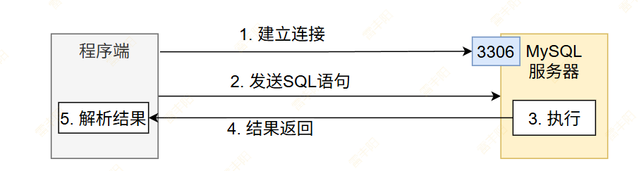
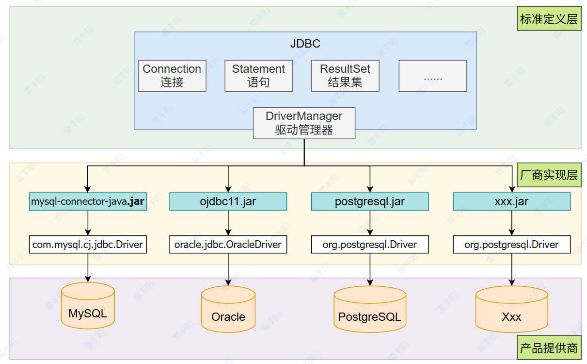

# 4. JDBC-API 操作数据库

# JDBC设计之美

**Java DataBase Connectivity（Java数据库连接）**：`java.sql`包定义了数据库操作接口

## 程序如何操作数据库



1. **建立连接**：程序要和数据库建立TCP连接，方便后续互相发送数据
  1. 数据库ip地址/域名，端口，账号，密码； **TCP连接**
2. **发送SQL语句**：程序将需要执行的SQL语句交给MySQL数据库。SQL语句必须为可执行的完整SQL
  1. 程序员需自己编写的业务SQL
3. **执行**：数据库收到需要执行的SQL，则按照要求进行操作。
  1. **增删改**：执行完成会有成功或失败。 返回影响多少行，>0；说明有影响； =0(没影响)；  报错
  2. **查询**：查询的所有数据， 返回null，报错（列字段不对）
4. **返回结果**：如果是查询，将会返回所有查询到的数据。如果是增删改等其它SQL，将返回成功或者失败结果
5. **解析结果**：解析数据库返回的结果，特别是查询，可能需要遍历。
  1. **增删改**的**结果**是一个大于等于0的整数。 或者异常；
  2. **查询**的结果，是一个集合； 程序自己去解析结果。

回顾**网络**分层模型


## JDBC 如何适配多种数据库

### 架构关系



### 常见驱动

| 数据库 | JDBC 驱动类名 (常用版本) | Maven/Gradle 依赖坐标 | JDBC URL 示例 |
| --- | --- | --- | --- |
| ​​MySQL​​ | com.mysql.cj.jdbc.Driver | mysql:mysql-connector-java:8.0.33 com.mysql:mysql-connector-j:8.3.0 | jdbc:mysql://host:3306/db |
| ​​Oracle​​ | oracle.jdbc.OracleDriver | com.oracle.database.jdbc:ojdbc11:21.11.0.0 | jdbc:oracle:thin:@host:1521:SID |
| ​​SQL Server​​ | com.microsoft.sqlserver.jdbc.SQLServerDriver | com.microsoft.sqlserver:mssql-jdbc:12.6.1.jre11 | jdbc:sqlserver://host:1433;databaseName=db |
| ​​PostgreSQL​​ | org.postgresql.Driver | org.postgresql:postgresql:42.7.1 | jdbc:postgresql://host:5432/db |
| ​​MariaDB​​ | org.mariadb.jdbc.Driver | org.mariadb.jdbc:mariadb-java-client:3.3.2 | jdbc:mariadb://host:3306/db |
| ​​SQLite​​ | org.sqlite.JDBC | org.xerial:sqlite-jdbc:3.44.1.0 | jdbc:sqlite:/path/to/db.sqlite |
| ​​DB2​​ | com.ibm.db2.jcc.DB2Driver | com.ibm.db2:jcc:11.5.9.0 | jdbc:db2://host:50000/db |
| ​​HSQLDB​​ | org.hsqldb.jdbc.JDBCDriver | org.hsqldb:hsqldb:2.7.2 | jdbc:hsqldb:mem:testdb |
| ​​H2 Database​​ | org.h2.Driver | com.h2database:h2:2.2.224 | jdbc:h2:mem:test;DB_CLOSE_DELAY=-1 |

# 数据库操作

```java
import java.sql.Connection;
import java.sql.DriverManager;
import java.sql.PreparedStatement;
import java.sql.ResultSet;
import java.sql.SQLException;

public class JDBCDemo {

    public static void main(String[] args) {
        // 1. 配置数据库连接信息（通常放在配置文件中）
        String url = "jdbc:mysql://localhost:3306/your_database_name";
        String username = "your_username";
        String password = "your_password";
        String sql = "SELECT id, name, email FROM users WHERE age > ?"; // 使用 ? 作为参数占位符

        // 2. 加载并注册 JDBC 驱动 (现代驱动通常能自动注册，但显式加载更明确)
        try {
            Class.forName("com.mysql.cj.jdbc.Driver"); // MySQL 8.0+ 驱动类名
        } catch (ClassNotFoundException e) {
            e.printStackTrace();
            return; // 处理驱动未找到的情况
        }

        // 3. 获取数据库连接 (使用 try-with-resources 确保资源自动关闭)
        try (Connection connection = DriverManager.getConnection(url, username, password);
             PreparedStatement statement = connection.prepareStatement(sql)) {

            // 4. 设置 PreparedStatement 参数
            statement.setInt(1, 25); // 设置第一个占位符 (?) 的值为 25

            // 5. 执行 SQL 查询
            try (ResultSet resultSet = statement.executeQuery()) {

                // 6. 处理查询结果集
                while (resultSet.next()) { // 遍历结果集的每一行
                    int id = resultSet.getInt("id"); // 根据列名获取整数
                    String name = resultSet.getString("name"); // 根据列名获取字符串
                    String email = resultSet.getString("email");
                    System.out.println("ID: " + id + ", Name: " + name + ", Email: " + email);
                }
            } // ResultSet 会自动关闭

            // 如果要执行 UPDATE/INSERT/DELETE，使用 statement.executeUpdate()，返回受影响行数
            // int rowsAffected = statement.executeUpdate();
            // System.out.println(rowsAffected + " row(s) affected.");

        } catch (SQLException e) { // 7. 捕获并处理可能发生的 SQL 异常
            System.err.println("Database error:");
            e.printStackTrace();
        } // Connection 和 Statement 会自动关闭
    }
}
```

```java
import com.lfy.Person;
import org.junit.Test;

import java.sql.*;
import java.util.ArrayList;
import java.util.List;

/**
 * 操作数据库：【导入 对应数据库的 驱动包；】
 * 1、Connection：和数据库建立连接
 *      DriverManager.getConnection(url, "root", "123456")
 * 2、准备SQL 的 String： 手写SQL的方式
 *      String sql = "insert into t_emp(name,age,deptId,empno) values('李四',18,5,'1001')";
 * 3、Statement：执行SQL执行器：
 *      Statement statement = connection.createStatement();
 * 4、执行：
 *      statement.executeUpdate(sql); // 执行增删改;
 *      statement.executeQuery(); //执行查询;
 *             //拿到结果集，进行遍历
 *             while (resultSet.next()){
 *                 //查看数据； columnIndex：列索引； 从1开始； 或者列名
 *             }
 *      statement.execute(sql); //执行存储过程
 *
 *      Statement/PreparedStatement/CallableStatement
 *      【Statement】：执行静态SQL语句; SQL全部写死； 字符串拼串
 *      【PreparedStatement】：执行动态SQL语句； [参数位置待定，用?占位]； 安全； 防止SQL注入攻击
 *      CallableStatement：执行存储过程
 * 5、释放资源：
 *      statement.close();
 *      connection.close();
 */
public class JDBCAllTest {

    @Test
    public void testQuery2(){
        //1、获取连接，用完自动关闭
        String url = "jdbc:mysql://localhost:3306/fruits?useSSL=false";

        //3、准备SQL语句
        String sql = "select * from t_emp where age > ? and age < ?";

        //2、获取连接 & SQL 执行器； 资源自动释放
        try( Connection connection = DriverManager.getConnection(url, "root", "123456");
             PreparedStatement prepared = connection.prepareStatement(sql);
        ) {


            //设置参数: parameterIndex先从1开始；
            //预编译参数
            prepared.setInt(1, 18);
            prepared.setInt(2, 50);

            //4、执行SQL； 因为查到的东西很多，返回一个结果集： 预编译的不用传递sql语句
            ResultSet resultSet = prepared.executeQuery();

            List<Person> list = new ArrayList<>();
            // 像极了 集合的 迭代器  itr.hasNext(); itr.next();
            // resultSet.next()：二合一操作，移动到下一行，且返回当前行是否有数据
            while (resultSet.next()){ // 游标移动到下一行； 拿到数据表的一行记录。默认指向第一行
                //查看数据； columnIndex：列索引； 从1开始
                int id = resultSet.getInt(1);
                String name = resultSet.getString(2);
                int age = resultSet.getInt("age");
                int deptId = resultSet.getInt("deptId");
                String empno = resultSet.getString(5);

//                Person person = new Person(id, name, age, deptId, empno);
                System.out.println(id + " " + name + " " + age + " " + deptId + " " + empno);
                //封装数据到对象
                Person person = new Person(id, name, age, deptId, empno);

                //把对象统一放到集合中
                list.add(person);
            }


            //5、关闭资源
            resultSet.close();

            System.out.println(list);


        } catch (SQLException e) {
            throw new RuntimeException(e);
        }
    }


    @Test
    public void testQuery(){
        //1、获取连接，用完自动关闭
        String url = "jdbc:mysql://localhost:3306/fruits?useSSL=false";

        //2、获取连接 & SQL 执行器； 资源自动释放
        try( Connection connection = DriverManager.getConnection(url, "root", "123456");
             Statement statement = connection.createStatement(); ) {

            //3、准备SQL语句
            String sql = "select * from t_emp";

            //4、执行SQL； 因为查到的东西很多，返回一个结果集：
            ResultSet resultSet = statement.executeQuery(sql);

            List<Person> list = new ArrayList<>();
            // 像极了 集合的 迭代器  itr.hasNext(); itr.next();
            // resultSet.next()：二合一操作，移动到下一行，且返回当前行是否有数据
            while (resultSet.next()){ // 游标移动到下一行； 拿到数据表的一行记录。默认指向第一行
                //查看数据； columnIndex：列索引； 从1开始
                int id = resultSet.getInt(1);
                String name = resultSet.getString(2);
                int age = resultSet.getInt("age");
                int deptId = resultSet.getInt("deptId");
                String empno = resultSet.getString(5);

//                Person person = new Person(id, name, age, deptId, empno);
                System.out.println(id + " " + name + " " + age + " " + deptId + " " + empno);
                //封装数据到对象
                Person person = new Person(id, name, age, deptId, empno);

                //把对象统一放到集合中
                list.add(person);
            }


            //5、关闭资源
            resultSet.close();

            System.out.println(list);


        } catch (SQLException e) {
            throw new RuntimeException(e);
        }

    }


    @Test
    public void testInsert(){
        //1、获取连接，用完自动关闭
        String url = "jdbc:mysql://localhost:3306/fruits?useSSL=false";
        // 新版语法，自动关闭资源
        try(Connection connection = DriverManager.getConnection(url, "root", "123456");
            Statement statement = connection.createStatement();
            ) {

            System.out.println("自动提交："+connection.getAutoCommit());
            //2、准备SQL语句
            String sql = "insert into t_emp(name,age,deptId,empno) " +
                    "values('李四',18,5,'1001')";

            //3、Statement 代表一个执行SQL语句的对象


            //4、执行SQL语句； 把sql发给数据库让数据库执行
//
//            System.out.println("数据库执行结果：" + execute);
            int i = statement.executeUpdate(sql);//执行增删改； 自动事务
//            statement.executeQuery(); //执行查询
            System.out.println("影响的行数：" + i);

            // 关闭资源
            statement.close();

        } catch (Exception e) {
            e.printStackTrace();
            System.out.println("数据库连接失败！");
        }
    }


    @Test
    public void testConnection() throws SQLException {
        //目前没有导入MySQL的所有东西  SSL: 安全套接层协议【网络发送的数据都是加密的】
        //1、JDBC 接口; 一个 Connection 对象代表和数据库的一条连接；一次会话
        // [https协议名]://www.baidu.com[域名]:[443端口]/s[路径]?wd=aa[参数]
        // jdbc:mysql://localhost:3306/fruits[数据库名]?useSSL=false[参数]
        // 协议名://域名:端口/数据库名?参数=val1&参数2=val2&参数3=val3
        String url = "jdbc:mysql://localhost:3306/fruits?useSSL=false";

        // jdbc:oracle:thin:@localhost:1521:SID
        // jdbc:postgresql://localhost:5432/db?useSSL=false
        // 驱动管理器，根据你的url就知道你要连接哪个数据库，用哪个驱动
        // java1.6+ 驱动管理器自动加载驱动，不需要手动加载
//        Class.forName("com.mysql.cj.jdbc.Driver"); //加载驱动
        Connection connection = DriverManager
                .getConnection(url,"root","123456");


        System.out.println(connection);


//        connection.close();
    }
}
```