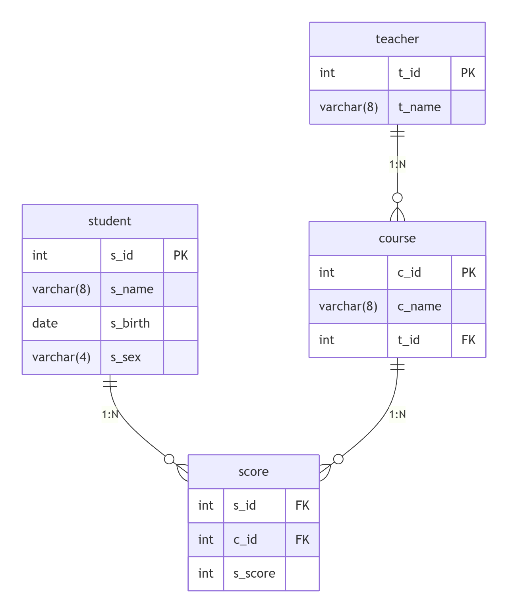

# 扩展：SQL经典50题

## 数据准备

```sql
-- 创建库
drop database if exists mysql_exam;
create database mysql_exam;
use mysql_exam;

-- 创建学生表
create table student (
        s_id int,
        s_name varchar(8),
        s_birth date,
        s_sex varchar(4)
);

-- 创建课程表
create table course (
        c_id int,
        c_name varchar(8),
        t_id int
);

-- 创建老师表
create table teacher (
        t_id int,
        t_name varchar(8)
);

-- 创建成绩表
create table score (
        s_id int,
        c_id int,
        s_score int
);


-- 插入数据
insert into student values
(1,'赵雷','1990-01-01','男'),
(2,'钱电','1990-12-21','男'),
(3,'孙风','1990-05-20','男'),
(4,'李云','1990-08-06','男'),
(5,'周梅','1991-12-01','女'),
(6,'吴兰','1992-03-01','女'),
(7,'郑竹','1989-07-01','女'),
(8,'王菊','1990-01-20','女');

insert into course values
(1,'语文',2),
(2,'数学',1),
(3,'英语',3);

insert into teacher values
(1,'张三'),
(2,'李四'),
(3,'王五');

insert into score values
(1,1,80),
(1,2,90),
(1,3,99),
(2,1,70),
(2,2,60),
(2,3,65),
(3,1,80),
(3,2,80),
(3,3,80),
(4,1,50),
(4,2,30),
(4,3,40),
(5,1,76),
(5,2,87),
(6,1,31),
(6,3,34),
(7,2,89),
(7,3,98);

```



**表关系：**

1. 学生表 → 成绩表​（1:N）
  - 一个学生可以有多个成绩记录
  - `student.s_id` 作为外键连接到 `score.s_id`
2. 课程表 → 成绩表​（1:N）
  - 一门课程可以有多个学生的成绩
  - `course.c_id` 作为外键连接到 `score.c_id`
3. 教师表 → 课程表​（1:N）
  - 一个老师可以教授多门课程
  - `teacher.t_id` 作为外键连接到 `course.t_id`

## 练习题：

### 查询"01"课程比"02"课程成绩高的学生的信息及课程分数

#### 网络答案

```sql
select s.*,sc1.s_score as score_01,sc2.s_score as score_02
from student s
inner join (
        select * from score where c_id = 1
) sc1
on s.s_id = sc1.s_id
inner join (
        select * from score where c_id = 2
) sc2
on s.s_id = sc2.s_id
where sc1.s_score > sc2.s_score;

```

```sql
+------+--------+------------+-------+----------+----------+
| s_id | s_name | s_birth    | s_sex | score_01 | score_02 |
+------+--------+------------+-------+----------+----------+
|    2 | 钱电   | 1990-12-21 | 男    |       70 |       60 |
|    4 | 李云   | 1990-08-06 | 男    |       50 |       30 |
+------+--------+------------+-------+----------+----------+
```

 

#### 我们讲解

```sql
-- 写法1：
SELECT * FROM 
        (SELECT a.*,sc2.s_score score_02 FROM 
            (SELECT s.*,sc.s_score score_01 FROM student s
              INNER JOIN score sc ON s.s_id=sc.s_id
            WHERE sc.c_id=1) a
            INNER JOIN score sc2 ON a.s_id = sc2.s_id
      WHERE sc2.c_id=2 ) b
WHERE b.score_01 > b.score_02

-- 写法2：
SELECT s.*,sc.s_score score_01,sc2.s_score score_02 FROM student s
INNER JOIN (SELECT * FROM score WHERE c_id=1) sc ON s.s_id=sc.s_id
INNER JOIN (SELECT * FROM score WHERE c_id=2) sc2 ON s.s_id=sc2.s_id
WHERE sc.s_score  < sc2.s_score
```

### 查询"01"课程比"02"课程成绩低的学生的信息及课程分数

#### 网络答案

```sql
select s.*,sc1.s_score as score_01,sc2.s_score as score_02
from student s
inner join (
        select * from score where c_id = 1
) sc1
on s.s_id = sc1.s_id
inner join (
        select * from score where c_id = 2
) sc2
on s.s_id = sc2.s_id
where sc1.s_score < sc2.s_score;
```

```sql
+------+--------+------------+-------+----------+----------+
| s_id | s_name | s_birth    | s_sex | score_01 | score_02 |
+------+--------+------------+-------+----------+----------+
|    1 | 赵雷   | 1990-01-01 | 男    |       80 |       90 |
|    5 | 周梅   | 1991-12-01 | 女    |       76 |       87 |
+------+--------+------------+-------+----------+----------+
```

#### 我们讲解

```sql
SELECT s.*,sc.s_score score_01,sc2.s_score score_02 FROM student s
INNER JOIN (SELECT * FROM score WHERE c_id=1) sc ON s.s_id=sc.s_id
INNER JOIN (SELECT * FROM score WHERE c_id=2) sc2 ON s.s_id=sc2.s_id
WHERE sc.s_score  < sc2.s_score
```

### 查询平均成绩大于等于60分的同学的学生编号和学生姓名和平均成绩

#### 网络答案

```sql
select s.s_id,s.s_name,round(avg_score, 2) as avg_score
from student s
inner join (
        select s_id,avg(s_score) as avg_score
        from score
        group by s_id
        having avg_score >= 60
) t1
on s.s_id = t1.s_id;

```

```sql
+------+--------+-----------+
| s_id | s_name | avg_score |
+------+--------+-----------+
|    1 | 赵雷   | 89.67     |
|    2 | 钱电   | 65.00     |
|    3 | 孙风   | 80.00     |
|    5 | 周梅   | 81.50     |
|    7 | 郑竹   | 93.50     |
+------+--------+-----------+
```

#### 我们讲解

```sql
-- 写法1：连接查询
SELECT s.s_id,s.s_name,avg(sc.s_score) FROM student s
INNER JOIN score sc ON s.s_id = sc.s_id
GROUP BY s.s_id,s.s_name
HAVING avg(sc.s_score) >= 60
-- 写法2：子查询 + 连接查询
SELECT a.*,s1.s_name FROM (SELECT s.s_id,avg(sc.s_score) FROM student s
INNER JOIN score sc ON s.s_id = sc.s_id
GROUP BY s.s_id) a
LEFT JOIN student s1 ON a.s_id=s1.s_id
```

### 查询平均成绩小于60分的同学的学生编号和学生姓名和平均成绩(包括有成绩的和无成绩的)

#### 网络答案

```sql
select s.s_id,s.s_name,ifnull(round(avg_score, 2), 0) as avg_score
from student s
left join (
        select s_id,avg(s_score) as avg_score
        from score
        group by s_id
) t1
on s.s_id = t1.s_id
where avg_score is null or avg_score < 60;

```

```sql
+------+--------+-----------+
| s_id | s_name | avg_score |
+------+--------+-----------+
|    4 | 李云   | 40.00     |
|    6 | 吴兰   | 32.50     |
|    8 | 王菊   | 0.00      |
+------+--------+-----------+
```

#### 我们讲解

```sql
SELECT s.s_id,s.s_name,sc02.avg_score FROM student s
LEFT JOIN (SELECT sc.s_id,ROUND(avg(s_score),2) avg_score FROM score sc 
GROUP BY sc.s_id) sc02 ON s.s_id = sc02.s_id
WHERE sc02.avg_score <60 or sc02.avg_score is NULL

```

### 查询所有同学的学生编号、学生姓名、选课总数、所有课程的总成绩

#### 网络答案

```sql
select s.s_id,s.s_name,ifnull(cnt_course, 0) as cnt_course,ifnull(sum_score, 0) as sum_score
from student s
left join (
        select s_id,count(*) as cnt_course,sum(s_score) as sum_score
        from score
        group by s_id
) t1
on s.s_id = t1.s_id;

```

```sql
+------+--------+------------+-----------+
| s_id | s_name | cnt_course | sum_score |
+------+--------+------------+-----------+
|    1 | 赵雷   |          3 | 269       |
|    2 | 钱电   |          3 | 195       |
|    3 | 孙风   |          3 | 240       |
|    4 | 李云   |          3 | 120       |
|    5 | 周梅   |          2 | 163       |
|    6 | 吴兰   |          2 | 65        |
|    7 | 郑竹   |          2 | 187       |
|    8 | 王菊   |          0 | 0         |
+------+--------+------------+-----------+

```

#### 我们讲解

```sql
SELECT s.s_id,s.s_name,IFNULL(sc.cnt_course,0) cnt_c ,IFNULL(sc.sum_score,0) sum_s
FROM student s
LEFT JOIN (SELECT s_id,COUNT(c_id) cnt_course,SUM(s_score) sum_score FROM score 
GROUP BY s_id) sc ON s.s_id = sc.s_id
```

### 查询"李"姓老师的数量

#### 网络答案

```sql
select count(*) as cnt_name_li
from teacher
where t_name like '李%';

```

```sql
+-------------+
| cnt_name_li |
+-------------+
|           1 |
+-------------+

```

#### 我们讲解

```shell
SELECT COUNT(*) teacher_li FROM teacher WHERE t_name LIKE "李%"
```

### 查询学过"张三"老师授课的同学的信息

#### 网络答案

```sql
select s.*
from student s
where s_id in (
        select distinct s_id
        from score sc
        inner join (
                select c_id
                from course c
                inner join teacher t on c.t_id = t.t_id
                where t_name = '张三'
        ) t1
        on sc.c_id = t1.c_id
);

```

```sql
+------+--------+------------+-------+
| s_id | s_name | s_birth    | s_sex |
+------+--------+------------+-------+
|    1 | 赵雷   | 1990-01-01 | 男    |
|    2 | 钱电   | 1990-12-21 | 男    |
|    3 | 孙风   | 1990-05-20 | 男    |
|    4 | 李云   | 1990-08-06 | 男    |
|    5 | 周梅   | 1991-12-01 | 女    |
|    7 | 郑竹   | 1989-07-01 | 女    |
+------+--------+------------+-------+

```

#### 我们讲解

```sql
-- 写法1
SELECT * FROM student WHERE s_id IN (
  SELECT s_id FROM score sc WHERE sc.c_id IN (
    SELECT DISTINCT c.c_id FROM teacher t
    INNER JOIN course c ON c.t_id = t.t_id
    WHERE t.t_name = '张三'
  )
)

-- 写法2：关联查询方式 t.*,c.c_id,c.c_name,sc.s_score,sc.s_id,； FOJWGHSDOL
SELECT s.*
FROM teacher t 
INNER JOIN course c ON t.t_id = c.t_id
INNER JOIN score sc ON sc.c_id = c.c_id
LEFT JOIN student s ON sc.s_id=s.s_id
WHERE t.t_name="张三"
```

### 查询没学过"张三"老师授课的同学的信息

#### 网络答案

```sql
select s.*
from student s
where s_id not in (
        select distinct s_id
        from score sc
        inner join (
                select c_id
                from course c
                inner join teacher t on c.t_id = t.t_id
                where t_name = '张三'
        ) t1
        on sc.c_id = t1.c_id
);

```

```sql
+------+--------+------------+-------+
| s_id | s_name | s_birth    | s_sex |
+------+--------+------------+-------+
|    6 | 吴兰   | 1992-03-01 | 女    |
|    8 | 王菊   | 1990-01-20 | 女    |
+------+--------+------------+-------+
```

#### 我们讲解

```sql
-- 写法1
SELECT * FROM student WHERE s_id NOT IN (
  SELECT s_id FROM score sc WHERE sc.c_id IN (
    SELECT DISTINCT c.c_id FROM teacher t
    INNER JOIN course c ON c.t_id = t.t_id
    WHERE t.t_name = '张三'
  )
)

-- 写法2
SELECT * FROM student WHERE s_id NOT IN (
  SELECT sc.s_id
  FROM teacher t 
  INNER JOIN course c ON t.t_id = c.t_id
  INNER JOIN score sc ON sc.c_id = c.c_id
  WHERE t.t_name="张三"
)

```

### 查询学过编号为"01"并且也学过编号为"02"的课程的同学的信息

#### 网络答案

```sql
select s.*
from student s
where s_id in (
        select s_id
        from score
        where c_id in (1,2)
        group by s_id
        having count(*) = 2
);

```

```sql
+------+--------+------------+-------+
| s_id | s_name | s_birth    | s_sex |
+------+--------+------------+-------+
|    1 | 赵雷   | 1990-01-01 | 男    |
|    2 | 钱电   | 1990-12-21 | 男    |
|    3 | 孙风   | 1990-05-20 | 男    |
|    4 | 李云   | 1990-08-06 | 男    |
|    5 | 周梅   | 1991-12-01 | 女    |
+------+--------+------------+-------+

```

#### 我们讲解

```sql
-- 1）、分别查询，在连接
SELECT s.* FROM (SELECT * FROM score WHERE c_id=1) c1
INNER JOIN (SELECT * FROM score WHERE c_id=2) c2 ON c1.s_id = c2.s_id
LEFT JOIN student s ON c1.s_id=s.s_id

-- 2）、子查询 + 链接 FOJWGH SDOL
SELECT s.* FROM 
  (SELECT s_id FROM score WHERE c_id IN (1,2)
  GROUP BY s_id
  HAVING COUNT(c_id) = 2) s1
LEFT JOIN student s ON s1.s_id = s.s_id

-- 3）、子查询
SELECT * FROM student WHERE s_id IN(
  SELECT s_id FROM score WHERE c_id IN (1,2)
    GROUP BY s_id
    HAVING COUNT(c_id) = 2
)

```

### 查询学过编号为"01"但是没有学过编号为"02"的课程的同学的信息

#### 网络答案

```sql
select s.*
from student s
where s_id in (
        select s_id
        from score
        where c_id = 1
        and s_id not in (
                select s_id from score where c_id = 2
        )
);

```

```sql
+------+--------+------------+-------+
| s_id | s_name | s_birth    | s_sex |
+------+--------+------------+-------+
|    6 | 吴兰   | 1992-03-01 | 女    |
+------+--------+------------+-------+

```

#### 我们讲解

```sql
-- 第一步
SELECT s_id FROM score WHERE c_id=1
AND  s_id NOT IN(
 SELECT s_id FROM score WHERE c_id=2
)
-- 第二步
SELECT s.* FROM (SELECT s_id FROM score WHERE c_id=1
AND  s_id NOT IN(
 SELECT s_id FROM score WHERE c_id=2
)) a 
INNER JOIN student s ON a.s_id = s.s_id


-- 其他写法
SELECT * FROM student WHERE s_id IN (
  SELECT s_id FROM score WHERE c_id=1
  AND  s_id NOT IN(
   SELECT s_id FROM score WHERE c_id=2
  )
)
```

### 查询没有学全所有课程的同学的信息

#### 网络答案

```sql
select *
from student
where s_id not in (
        select s_id
        from score
        group by s_id
        having count(*) = (
                select count(*) from course
        )
);

```

```sql
+------+--------+------------+-------+
| s_id | s_name | s_birth    | s_sex |
+------+--------+------------+-------+
|    5 | 周梅   | 1991-12-01 | 女    |
|    6 | 吴兰   | 1992-03-01 | 女    |
|    7 | 郑竹   | 1989-07-01 | 女    |
|    8 | 王菊   | 1990-01-20 | 女    |
+------+--------+------------+-------+

```

#### 我们讲解

```sql
SELECT * FROM student WHERE s_id IN (
  SELECT s_id FROM score WHERE c_id IN (
    SELECT c_id FROM course
  )
  GROUP BY s_id
  HAVING COUNT(c_id) = (SELECT COUNT(*) FROM course)
)

```

### 查询至少有一门课与学号为"01"的同学所学相同的同学的信息

#### 网络答案

```sql
select *
from student
where s_id in (
        select distinct s_id
        from score s
        inner join (
                select c_id from score where s_id = 1
        ) t1
        on s.c_id = t1.c_id
);

```

```yaml
+------+--------+------------+-------+
| s_id | s_name | s_birth    | s_sex |
+------+--------+------------+-------+
|    1 | 赵雷   | 1990-01-01 | 男    |
|    2 | 钱电   | 1990-12-21 | 男    |
|    3 | 孙风   | 1990-05-20 | 男    |
|    4 | 李云   | 1990-08-06 | 男    |
|    5 | 周梅   | 1991-12-01 | 女    |
|    6 | 吴兰   | 1992-03-01 | 女    |
|    7 | 郑竹   | 1989-07-01 | 女    |
+------+--------+------------+-------+

```

#### 我们讲解

```sql
-- 写法1
SELECT s.* FROM student s
INNER JOIN (
  SELECT DISTINCT s_id FROM score sc1 
  INNER JOIN (SELECT c_id FROM score WHERE s_id = 1) sc2
  ON sc1.c_id = sc2.c_id
) a ON s.s_id=a.s_id

-- 写法2：
SELECT * FROM student WHERE s_id IN
(
  SELECT DISTINCT s_id FROM score sc1 
  INNER JOIN (SELECT c_id FROM score WHERE s_id = 6) sc2
  ON sc1.c_id = sc2.c_id
)
```

### 查询和"01"号的同学学习的课程完全相同的其他同学的信息

#### 网络答案

```sql
select *
from student
where s_id in (
         select s_id
         from score s
         inner join (
                select c_id from score where s_id = 1
         ) t1
         on s.c_id = t1.c_id
         where s_id != 1
         group by s_id having count(*) = (
                select count(*) from score where s_id = 1
         )
);

```

```sql
+------+--------+------------+-------+
| s_id | s_name | s_birth    | s_sex |
+------+--------+------------+-------+
|    2 | 钱电   | 1990-12-21 | 男    |
|    3 | 孙风   | 1990-05-20 | 男    |
|    4 | 李云   | 1990-08-06 | 男    |
+------+--------+------------+-------+

```

#### 我们讲解

```sql
SELECT * FROM student WHERE s_id IN (
  SELECT s_id FROM score WHERE c_id IN (
  SELECT c_id FROM score WHERE s_id=1
  ) AND s_id!=1
  GROUP BY s_id
  HAVING COUNT(c_id) = (SELECT COUNT(c_id) FROM score WHERE s_id=1)
)
```

### 查询没学过"张三"老师讲授的任一门课程的学生姓名

#### 网络答案

```sql
select s_name
from student
where s_id not in (
        select s_id
        from score sc
        inner join (
                select c_id
                from course c
                inner join teacher t on c.t_id = t.t_id
                where t_name = '张三'
        ) t1
        on sc.c_id = t1.c_id
);

```

```sql
+--------+
| s_name |
+--------+
| 吴兰   |
| 王菊   |
+--------+

```

#### 我们讲解

```sql
-- 第一步：张三老师交过的课程
SELECT c_id FROM  course c
LEFT JOIN teacher t ON c.t_id = t.t_id
WHERE t.t_name = "张三"

-- 第二步：没学过指定课程的学生； 先找到学过这个课程的学生，然后把他们过滤掉
SELECT * FROM student WHERE s_id IN (
  SELECT s_id FROM score WHERE s_id NOT IN (
  SELECT s_id FROM score WHERE c_id = (SELECT c_id FROM  course c
  LEFT JOIN teacher t ON c.t_id = t.t_id
  WHERE t.t_name = "张三")
  )
)
```

### 查询两门及其以上不及格课程的同学的学号，姓名及其平均成绩

#### 网络答案

```sql
select s.s_id,s.s_name,round(avg(s_score), 2) as avg_score
from student s
inner join (
        select s_id
        from score
        where s_score < 60
        group by s_id
        having count(*) >= 2
) t1
on s.s_id = t1.s_id
inner join score sc on s.s_id = sc.s_id
group by s.s_id,s_name;

```

```sql
+------+--------+-----------+
| s_id | s_name | avg_score |
+------+--------+-----------+
|    4 | 李云   | 40.00     |
|    6 | 吴兰   | 32.50     |
+------+--------+-----------+

```

#### 我们讲解

```sql
-- 写法1：
SELECT s1.s_id,s1.s_name,avg(sc.s_score) FROM student s1
INNER JOIN (
   SELECT s_id FROM score 
    WHERE s_score<60
    GROUP BY s_id
) s2 ON s1.s_id = s2.s_id
INNER JOIN score sc ON s1.s_id = sc.s_id
GROUP BY s1.s_id,s1.s_name


-- 写法2：窗口函数
SELECT s1.*,sc.c_id,sc.s_score,
AVG(sc.s_score) OVER(PARTITION BY s1.s_id) as 平均成绩 FROM student s1
INNER JOIN (
   SELECT s_id FROM score 
    WHERE s_score<60
    GROUP BY s_id
) s2 ON s1.s_id = s2.s_id
INNER JOIN score sc ON s1.s_id = sc.s_id
```

### 检索"01"课程分数小于60，按分数降序排列的学生信息

#### 网络答案

```sql
select s.*,s_score as score_01
from student s
inner join (
        select s_id,s_score
        from score
        where c_id = 1
        and s_score < 60
) t1
on s.s_id = t1.s_id
order by score_01 desc;

```

```sql
+------+--------+------------+-------+----------+
| s_id | s_name | s_birth    | s_sex | score_01 |
+------+--------+------------+-------+----------+
|    4 | 李云   | 1990-08-06 | 男    |       50 |
|    6 | 吴兰   | 1992-03-01 | 女    |       31 |
+------+--------+------------+-------+----------+
```

#### 我们讲解

```sql
-- FOJWGH SDOL  1w ==join== 1w
SELECT s.*,sc.s_score FROM score  sc
LEFT JOIN student s ON sc.s_id = s.s_id
WHERE sc.s_score < 60 and sc.c_id=1
ORDER BY sc.s_score DESC


-- 1w ==join== 200
SELECT s.*,sc.s_score FROM student s
INNER JOIN (select * from score where s_score < 60 and c_id=1) sc
on s.s_id = sc.s_id
ORDER BY sc.s_score  DESC
```

### 按平均成绩从高到低显示所有学生的所有课程的成绩以及平均成绩

#### 网络答案

```sql
select
        s.s_id as 学号,s.s_name as 姓名,
        sum(case c_id when 1 then s_score else 0 end) as 语文,
        sum(case c_id when 2 then s_score else 0 end) as 数学,
        sum(case c_id when 3 then s_score else 0 end) as 英语,
        ifnull(round(avg(s_score), 2), 0) as 平均成绩
from student s
left join score sc on s.s_id = sc.s_id
group by s.s_id,s.s_name
order by 平均成绩 desc;

```

```sql
+------+------+------+------+------+----------+
| 学号 | 姓名 | 语文 | 数学 | 英语 | 平均成绩 |
+------+------+------+------+------+----------+
|    7 | 郑竹 | 0    | 89   | 98   | 93.50    |
|    1 | 赵雷 | 80   | 90   | 99   | 89.67    |
|    5 | 周梅 | 76   | 87   | 0    | 81.50    |
|    3 | 孙风 | 80   | 80   | 80   | 80.00    |
|    2 | 钱电 | 70   | 60   | 65   | 65.00    |
|    4 | 李云 | 50   | 30   | 40   | 40.00    |
|    6 | 吴兰 | 31   | 0    | 34   | 32.50    |
|    8 | 王菊 | 0    | 0    | 0    | 0.00     |
+------+------+------+------+------+----------+

```

#### 我们讲解

```sql
-- 行转列
SELECT s.s_id,s.s_name,
  SUM(case c_id when 2 then s_score else 0 end)  as 语文,
  SUM(case c_id when 1 then s_score else 0 end) as '数学',
  SUM(case c_id when 3 then s_score else 0 end) as '英语', 
  IFNULL(ROUND(AVG(s_score),2),0)  as '平均成绩'
 FROM score sc
RIGHT JOIN student s ON sc.s_id=s.s_id
GROUP BY s.s_id,s.s_name
ORDER BY '平均成绩' DESC
```

### 查询各科成绩最高分、最低分和平均分，以如下形式显示：

课程ID，课程name，最高分，最低分，平均分，及格率，中等率，优良率，优秀率
– 及格为>=60，中等为：70-80，优良为：80-90，优秀为：>=90

#### 网络答案

```sql
select
    c.c_id as 课程ID,c.c_name as 课程name,
        max(s_score) as 最高分,
        min(s_score) as 最低分,
        round(avg(s_score), 2) as 平均分,
        concat(round(sum(case when s_score >= 60 then 1 else 0 end) / count(*) * 100, 2), '%') as 及格率,
        concat(round(sum(case when s_score between 70 and 80 then 1 else 0 end) / count(*) * 100, 2), '%') as 中等率,
        concat(round(sum(case when s_score between 80 and 90 then 1 else 0 end) / count(*) * 100, 2), '%') as 优良率,
        concat(round(sum(case when s_score >= 90 then 1 else 0 end) / count(*) * 100, 2), '%') as 优秀率
from course c
inner join score s on c.c_id = s.c_id
group by c.c_id,c.c_name;

```

```sql
+--------+----------+--------+--------+--------+--------+--------+--------+--------+
| 课程ID | 课程name | 最高分 | 最低分 | 平均分 | 及格率 | 中等率 | 优良率 | 优秀率 |
+--------+----------+--------+--------+--------+--------+--------+--------+--------+
|      1 | 语文     |     80 |     31 | 64.50  | 66.67% | 66.67% | 33.33% | 0.00%  |
|      2 | 数学     |     90 |     30 | 72.67  | 83.33% | 16.67% | 66.67% | 16.67% |
|      3 | 英语     |     99 |     34 | 69.33  | 66.67% | 16.67% | 16.67% | 33.33% |
+--------+----------+--------+--------+--------+--------+--------+--------+--------+

```

#### 我们讲解

```sql
-- 每一组学生数量 count(s_id)
-- 及格学生的数量：SUM(case when s_score>=60 then 1 else 0) / count(s_id)
-- 中等学生的数量: SUM(case when s_score between 70 and 80 then 1 else 0)
-- 
SELECT c.c_id,c.c_name,
    MAX(s_score) 最高分,
    MIN(s_score) 最低分,
    AVG(s_score) 平均分,
    COUNT(s_id) 总人数,
    CONCAT(ROUND(SUM(case when s_score>=60 then 1 else 0 end)/COUNT(s_id)*100,2),'%') 及格率,
    CONCAT(ROUND(SUM(case when s_score BETWEEN 70 and 80 then 1 else 0 end)/COUNT(s_id)*100,2),'%') 中等率,
    CONCAT(ROUND(SUM(case when s_score BETWEEN 80 and 90 then 1 else 0 end)/COUNT(s_id)*100,2),'%') 优良率,
    CONCAT(ROUND(SUM(case when s_score>=90 then 1 else 0 end)/COUNT(s_id)*100,2),'%') 优秀率
FROM course c
LEFT JOIN score sc ON c.c_id = sc.c_id
GROUP BY c.c_id,c.c_name
```

### 按各科成绩进行排序，并显示排名

#### 网络答案

```sql
select
        (@i := case when @pre_group_id = c_id then @i + 1 else 1 end) as rank,
        (@pre_group_id := c_id) as c_id,
        c_name,s_id,s_name,s_score
from (select @i := 0, @pre_group_id := 1) var
cross join (
        select c.c_id,c.c_name,s.s_id,s.s_name,s_score
        from score sc
        inner join student s on sc.s_id = s.s_id
        inner join course c on sc.c_id = c.c_id
        group by c.c_id,s.s_id
        order by c.c_id,s_score desc
) t1;

```

```sql
+------+------+--------+------+--------+---------+
| rank | c_id | c_name | s_id | s_name | s_score |
+------+------+--------+------+--------+---------+
|    1 |    1 | 语文   |    1 | 赵雷   |      80 |
|    2 |    1 | 语文   |    3 | 孙风   |      80 |
|    3 |    1 | 语文   |    5 | 周梅   |      76 |
|    4 |    1 | 语文   |    2 | 钱电   |      70 |
|    5 |    1 | 语文   |    4 | 李云   |      50 |
|    6 |    1 | 语文   |    6 | 吴兰   |      31 |
|    1 |    2 | 数学   |    1 | 赵雷   |      90 |
|    2 |    2 | 数学   |    7 | 郑竹   |      89 |
|    3 |    2 | 数学   |    5 | 周梅   |      87 |
|    4 |    2 | 数学   |    3 | 孙风   |      80 |
|    5 |    2 | 数学   |    2 | 钱电   |      60 |
|    6 |    2 | 数学   |    4 | 李云   |      30 |
|    1 |    3 | 英语   |    1 | 赵雷   |      99 |
|    2 |    3 | 英语   |    7 | 郑竹   |      98 |
|    3 |    3 | 英语   |    3 | 孙风   |      80 |
|    4 |    3 | 英语   |    2 | 钱电   |      65 |
|    5 |    3 | 英语   |    4 | 李云   |      40 |
|    6 |    3 | 英语   |    6 | 吴兰   |      34 |
+------+------+--------+------+--------+---------+

```

#### 我们讲解

```sql
SELECT c.c_id,c.c_name,sc.s_id,s.s_name,sc.s_score,
    RANK() OVER(PARTITION BY c.c_id ORDER BY sc.s_score)  as 名次 
FROM course c
INNER JOIN score sc ON c.c_id = sc.c_id
INNER JOIN student s ON sc.s_id = s.s_id
ORDER BY c.c_id
```

### 查询学生的总成绩并进行排名

#### 我们答案

```sql
select (@i := @i + 1) as rank,t2.*
from (select  @i := 0) var
cross join (
        select s.s_id,s.s_name,sum_score
        from student s
        inner join (
                select s_id,sum(s_score) as sum_score
                from score
                group by s_id
        ) t1
        on s.s_id = t1.s_id
        order by sum_score desc
) t2;

```

```sql
+------+------+--------+-----------+
| rank | s_id | s_name | sum_score |
+------+------+--------+-----------+
|    1 |    1 | 赵雷   | 269       |
|    2 |    3 | 孙风   | 240       |
|    3 |    2 | 钱电   | 195       |
|    4 |    7 | 郑竹   | 187       |
|    5 |    5 | 周梅   | 163       |
|    6 |    4 | 李云   | 120       |
|    7 |    6 | 吴兰   | 65        |
+------+------+--------+-----------+

```

#### 我们讲解

```sql
SELECT a.*, rank() over(order by sum_score) as 名次 FROM (
  SELECT s.s_id,s.s_name,IFNULL(SUM(sc.s_score) ,0) sum_score
  FROM student s
  LEFT JOIN score sc ON s.s_id = sc.s_id
  GROUP BY s.s_id,s.s_name
) a


SELECT s.s_id,s.s_name,
  IFNULL(SUM(sc.s_score) ,0) sum_score,
  rank() over(order by IFNULL(SUM(sc.s_score) ,0)) as '名次'
FROM student s
LEFT JOIN score sc ON s.s_id = sc.s_id
GROUP BY s.s_id,s.s_name
```

### 查询不同老师所教不同课程平均分从高到低显示

#### 网络答案

```sql
select t.t_id,t.t_name,c.c_id,c.c_name,round(avg(s_score), 2) as avg_score
from score sc
inner join course c on sc.c_id = c.c_id
inner join teacher t on t.t_id = c.t_id
group by t.t_id,c.c_id
order by t.t_id,avg_score desc;

```

```sql
+------+--------+------+--------+-----------+
| t_id | t_name | c_id | c_name | avg_score |
+------+--------+------+--------+-----------+
|    1 | 张三   |    2 | 数学   | 72.67     |
|    2 | 李四   |    1 | 语文   | 64.50     |
|    3 | 王五   |    3 | 英语   | 69.33     |
+------+--------+------+--------+-----------+

```

#### 我们讲解

```sql
-- 窗口函数
SELECT t.t_id,t.t_name,c.c_id,c.c_name,
    ROUND(AVG(sc.s_score),2) avg_score,
    rank() over(order by AVG(sc.s_score) DESC) 名次
FROM teacher t
LEFT JOIN course c ON t.t_id = c.t_id
LEFT JOIN score sc ON c.c_id = sc.c_id
GROUP BY t.t_id,t.t_name,c.c_id,c.c_name
```

### 查询所有课程的成绩第2名到第3名的学生信息及该课程成绩

#### 网络答案

```sql
select *
from (
        select
                (@i := case when @pre_group_id = c_id then @i + 1 else 1 end) as rank,
                (@pre_group_id := c_id) as c_id,
                c_name,s_id,s_name,s_birth,s_sex,s_score
        from (select @i := 0, @pre_group_id := 1) var
        cross join (
                select c.c_id,c.c_name,s.*,s_score
                from score sc
                inner join student s on sc.s_id = s.s_id
                inner join course c on sc.c_id = c.c_id
                group by c.c_id,s.s_id
                order by c.c_id,s_score desc
        ) t1
) t2
where rank in (2,3);

```

```sql
+------+------+--------+------+--------+------------+-------+---------+
| rank | c_id | c_name | s_id | s_name | s_birth    | s_sex | s_score |
+------+------+--------+------+--------+------------+-------+---------+
|    2 |    1 | 语文   |    3 | 孙风   | 1990-05-20 | 男    |      80 |
|    3 |    1 | 语文   |    5 | 周梅   | 1991-12-01 | 女    |      76 |
|    2 |    2 | 数学   |    7 | 郑竹   | 1989-07-01 | 女    |      89 |
|    3 |    2 | 数学   |    5 | 周梅   | 1991-12-01 | 女    |      87 |
|    2 |    3 | 英语   |    7 | 郑竹   | 1989-07-01 | 女    |      98 |
|    3 |    3 | 英语   |    3 | 孙风   | 1990-05-20 | 男    |      80 |
+------+------+--------+------+--------+------------+-------+---------+

```

#### 我们讲解

```sql
SELECT * FROM (
  SELECT c.c_id,c.c_name,s.s_id,s.s_name,sc.s_score,
  ROW_NUMBER() OVER(PARTITION BY c.c_id ORDER BY sc.s_score DESC) as rank_score
  FROM course c
  LEFT JOIN score sc ON c.c_id = sc.c_id
  LEFT JOIN student s ON sc.s_id = s.s_id
) a 
WHERE a.rank_score IN(2,3)
```

### 统计各科成绩各分数段人数：课程编号,课程名称,[100-85],[85-70],[70-60],[0-60]及所占百分比

#### 网络答案

```sql
select
        c.c_id as 课程编号,c.c_name as 课程名称,
        sum(case when s_score between 85 and 100 then 1 else 0 end) as '[100-85]',
        concat(round(sum(case when s_score between 85 and 100 then 1 else 0 end) / count(*) * 100, 2), '%') as 百分比,
        sum(case when s_score between 70 and 85 then 1 else 0 end) as '[85-70]',
        concat(round(sum(case when s_score between 70 and 85 then 1 else 0 end) / count(*) * 100, 2), '%') as 百分比,
        sum(case when s_score between 60 and 70 then 1 else 0 end) as '[70-60]',
        concat(round(sum(case when s_score between 60 and 70 then 1 else 0 end) / count(*) * 100, 2), '%') as 百分比,
        sum(case when s_score between 0 and 60 then 1 else 0 end) as '[0-60]',
        concat(round(sum(case when s_score between 0 and 60 then 1 else 0 end) / count(*) * 100, 2), '%') as 百分比
from course c
inner join score sc
on c.c_id = sc.c_id
group by c.c_id;

```

```sql
+----------+----------+----------+--------+---------+--------+---------+--------+--------+--------+
| 课程编号 | 课程名称 | [100-85] | 百分比 | [85-70] | 百分比 | [70-60] | 百分比 | [0-60] | 百分比 |
+----------+----------+----------+--------+---------+--------+---------+--------+--------+--------+
|        1 | 语文     | 0        | 0.00%  | 4       | 66.67% | 1       | 16.67% | 2      | 33.33% |
|        2 | 数学     | 3        | 50.00% | 1       | 16.67% | 1       | 16.67% | 2      | 33.33% |
|        3 | 英语     | 2        | 33.33% | 1       | 16.67% | 1       | 16.67% | 2      | 33.33% |
+----------+----------+----------+--------+---------+--------+---------+--------+--------+--------+
```

#### 我们讲解

```sql
SELECT c.c_id,c.c_name,
SUM((case when sc.s_score BETWEEN 85 and 100 then 1 else 0 end)) as '100-85', 
CONCAT(ROUND(SUM((case when sc.s_score BETWEEN 85 and 100 then 1 else 0 end))/COUNT(sc.s_id)*100,2),'%') as '百分比',
SUM((case when sc.s_score BETWEEN 70 and 85 then 1 else 0 end)) as '85-70', 
CONCAT(ROUND(SUM((case when sc.s_score BETWEEN 70 and 85 then 1 else 0 end))/COUNT(sc.s_id)*100,2),'%') as '百分比',
SUM((case when sc.s_score BETWEEN 60 and 70 then 1 else 0 end)) as '60-70', 
CONCAT(ROUND(SUM((case when sc.s_score BETWEEN 60 and 70 then 1 else 0 end))/COUNT(sc.s_id)*100,2),'%') as '百分比',
SUM((case when sc.s_score<=60 then 1 else 0 end)) as '0-60', 
CONCAT(ROUND(SUM((case when sc.s_score<=60 then 1 else 0 end))/COUNT(sc.s_id)*100,2),'%') as '百分比'
FROM course c
LEFT JOIN score sc ON c.c_id = sc.c_id
GROUP BY  c.c_id,c.c_name
```

### 查询学生平均成绩及其名次

#### 网络答案

```sql
select (@i := @i + 1) as rank,t2.*
from (select  @i := 0) var
cross join (
        select s.s_id,s.s_name,avg_score
        from student s
        inner join (
                select s_id,round(avg(s_score), 2) as avg_score
                from score
                group by s_id
        ) t1
        on s.s_id = t1.s_id
        order by avg_score desc
) t2;

```

```sql
+------+------+--------+-----------+
| rank | s_id | s_name | avg_score |
+------+------+--------+-----------+
|    1 |    7 | 郑竹   | 93.50     |
|    2 |    1 | 赵雷   | 89.67     |
|    3 |    5 | 周梅   | 81.50     |
|    4 |    3 | 孙风   | 80.00     |
|    5 |    2 | 钱电   | 65.00     |
|    6 |    4 | 李云   | 40.00     |
|    7 |    6 | 吴兰   | 32.50     |
+------+------+--------+-----------+

```

#### 我们讲解

```sql
-- 遇见排名，就选窗口函数，没错！
SELECT *,RANK() OVER(ORDER BY avg_score DESC) as rank_score FROM (
  SELECT s.s_id,s.s_name,ROUND(IFNULL(AVG(sc.s_score),0),2) avg_score FROM student s
  LEFT JOIN score sc ON s.s_id = sc.s_id
  GROUP BY s.s_id,s.s_name
) a

```

### 查询各科成绩前三名的记录

#### 网络答案

内外关联

```sql
select c.c_id,c.c_name,s.s_id,s.s_name,s_score
from (
        select *
        from score sc
        where (
                select count(*)
                from score sc1
                where sc.c_id = sc1.c_id
                and sc.s_score < sc1.s_score
        ) < 3
)
t1
inner join student s on t1.s_id = s.s_id 
inner join course c on t1.c_id = c.c_id 
order by c.c_id,s_score desc;

```

```sql
+------+--------+------+--------+---------+
| c_id | c_name | s_id | s_name | s_score |
+------+--------+------+--------+---------+
|    1 | 语文   |    1 | 赵雷   |      80 |
|    1 | 语文   |    3 | 孙风   |      80 |
|    1 | 语文   |    5 | 周梅   |      76 |
|    2 | 数学   |    1 | 赵雷   |      90 |
|    2 | 数学   |    7 | 郑竹   |      89 |
|    2 | 数学   |    5 | 周梅   |      87 |
|    3 | 英语   |    1 | 赵雷   |      99 |
|    3 | 英语   |    7 | 郑竹   |      98 |
|    3 | 英语   |    3 | 孙风   |      80 |
+------+--------+------+--------+---------+

```

序号筛选

```sql
select *
from (
        select
                (@i := case when @pre_group_id = c_id then @i + 1 else 1 end) as rank,
                (@pre_group_id := c_id) as c_id,
                c_name,s_id,s_name,s_score
        from (select @i := 0, @pre_group_id := 1) var
        cross join (
                select c.c_id,c.c_name,s.s_id,s.s_name,s_score
                from score sc
                inner join student s on sc.s_id = s.s_id
                inner join course c on sc.c_id = c.c_id
                group by c.c_id,s.s_id
                order by c.c_id,s_score desc
        ) t1
) t2
where rank <= 3;

```

```sql
+------+------+--------+------+--------+---------+
| rank | c_id | c_name | s_id | s_name | s_score |
+------+------+--------+------+--------+---------+
|    1 |    1 | 语文   |    1 | 赵雷   |      80 |
|    2 |    1 | 语文   |    3 | 孙风   |      80 |
|    3 |    1 | 语文   |    5 | 周梅   |      76 |
|    1 |    2 | 数学   |    1 | 赵雷   |      90 |
|    2 |    2 | 数学   |    7 | 郑竹   |      89 |
|    3 |    2 | 数学   |    5 | 周梅   |      87 |
|    1 |    3 | 英语   |    1 | 赵雷   |      99 |
|    2 |    3 | 英语   |    7 | 郑竹   |      98 |
|    3 |    3 | 英语   |    3 | 孙风   |      80 |
+------+------+--------+------+--------+---------+

```

#### 我们讲解

```sql
SELECT * FROM (
  SELECT c.*,sc.s_score,sc.s_id,s.s_name,
  ROW_NUMBER() OVER(PARTITION BY c.c_id ORDER BY sc.s_score DESC)  rank_score 
  FROM course c
  LEFT JOIN score sc ON sc.c_id = c.c_id
  LEFT JOIN student s ON sc.s_id = s.s_id
)a
WHERE a.rank_score <=3
```

### 查询每门课程被选修的学生数

#### 网络答案

```sql
select c.c_id,c.c_name,cnt_student
from course c
inner join (
        select c_id,count(*) as cnt_student
        from score
        group by c_id
) t1
on c.c_id = t1.c_id;

```

```sql
+------+--------+-------------+
| c_id | c_name | cnt_student |
+------+--------+-------------+
|    1 | 语文   |           6 |
|    2 | 数学   |           6 |
|    3 | 英语   |           6 |
+------+--------+-------------+

```

#### 我们讲解

```sql
SELECT c.c_id,c.c_name,COUNT(sc.s_id) cnt_student FROM course c
LEFT JOIN score sc ON c.c_id = sc.c_id
GROUP BY c.c_id, c.c_name
```

### 查询出只有两门课程的全部学生的学号和姓名

#### 网络答案

```sql
select s_id,s_name
from student
where s_id in (
        select s_id
        from score
        group by s_id
        having count(*) = 2
);

```

```sql
+------+--------+
| s_id | s_name |
+------+--------+
|    5 | 周梅   |
|    6 | 吴兰   |
|    7 | 郑竹   |
+------+--------+

```

#### 我们讲解

```sql
-- 写法1：基本查询
SELECT sc.s_id,s.s_name,COUNT(sc.c_id) cnt_course FROM score sc
LEFT JOIN student s ON sc.s_id = s.s_id
GROUP BY sc.s_id,s.s_name
HAVING COUNT(sc.c_id)=2

-- 额外扩展： 查询出只有两门课程的全部学生的学号和姓名以及所学习的课程;  语文,数学
SELECT s.s_id,s.s_name,COUNT(c.c_id) cnt_course,
GROUP_CONCAT(c.c_name SEPARATOR ';') c_names FROM score sc
LEFT JOIN student s On sc.s_id = s.s_id
LEFT JOIN course c ON sc.c_id = c.c_id
GROUP BY s.s_id,s.s_name
HAVING COUNT(c.c_id) = 2
```

### 查询男生、女生人数

#### 网络答案

```sql
select s_sex,count(*) as cnt_sex
from student
group by s_sex;

```

```sql
+-------+---------+
| s_sex | cnt_sex |
+-------+---------+
| 女    |       4 |
| 男    |       4 |
+-------+---------+

```

#### 我们讲解

```sql
SELECT s_sex,COUNT(s_id) FROM student
GROUP BY s_sex
```

### 查询名字中含有"风"字的学生信息

```sql
select *
from student
where s_name like '%风%';

```

```sql
+------+--------+------------+-------+
| s_id | s_name | s_birth    | s_sex |
+------+--------+------------+-------+
|    3 | 孙风   | 1990-05-20 | 男    |
+------+--------+------------+-------+

```

### 查询同名同性别学生名单，并统计同名人数

```sql
select *,count(*) as cnt_student
from student
group by s_name,s_sex
having cnt_student > 1;

```

```sql
+-----------+
| Empty set |
+-----------+

```

### 查询1990年出生的学生名单

```sql
select *
from student
where year(s_birth) = '1990';

```

```sql
+------+--------+------------+-------+
| s_id | s_name | s_birth    | s_sex |
+------+--------+------------+-------+
|    1 | 赵雷   | 1990-01-01 | 男    |
|    2 | 钱电   | 1990-12-21 | 男    |
|    3 | 孙风   | 1990-05-20 | 男    |
|    4 | 李云   | 1990-08-06 | 男    |
|    8 | 王菊   | 1990-01-20 | 女    |
+------+--------+------------+-------+

```

### 查询每门课程的平均成绩，结果按平均成绩降序排列，平均成绩相同时，按课程编号升序排列

#### 网络答案

```sql
select c.c_id,c.c_name,avg_score
from course c
inner join (
        select c_id,round(avg(s_score), 2) as avg_score
        from score
        group by c_id
) t1
on c.c_id = t1.c_id
order by avg_score desc,c.c_id;

```

```sql
+------+--------+-----------+
| c_id | c_name | avg_score |
+------+--------+-----------+
|    2 | 数学   | 72.67     |
|    3 | 英语   | 69.33     |
|    1 | 语文   | 64.50     |
+------+--------+-----------+

```

#### 我们讲解

```sql
SELECT c.c_id,c.c_name,IFNULL(AVG(sc.s_score),0) avg_score FROM course c
LEFT  JOIN score sc ON c.c_id = sc.c_id
GROUP BY c.c_id,c.c_name
ORDER BY avg_score,c.c_id
```

### 查询平均成绩大于等于85的所有学生的学号、姓名和平均成绩

#### 网络答案

```sql
select s.s_id,s.s_name,avg_score
from student s
inner join (
        select s_id,round(avg(s_score), 2) as avg_score
        from score
        group by s_id
        having avg_score >= 85
) t1
on s.s_id = t1.s_id;

```

```sql
+------+--------+-----------+
| s_id | s_name | avg_score |
+------+--------+-----------+
|    1 | 赵雷   | 89.67     |
|    7 | 郑竹   | 93.50     |
+------+--------+-----------+

```

#### 我们讲解

```sql
SELECT s.s_id,s.s_name,AVG(sc.s_score) avg_score FROM student s 
LEFT JOIN score sc ON s.s_id = sc.s_id
GROUP BY s.s_id,s.s_name
HAVING avg_score >=85
```

### 查询课程名称为"数学"，且分数低于60的学生姓名和分数

#### 网络答案

```sql
select s_name,s_score
from student s
inner join (
        select s_id,s_score
        from score sc
        inner join course c on sc.c_id = c.c_id
        where c_name = '数学'
        and s_score < 60
) t1
on s.s_id = t1.s_id;

```

```sql
+--------+---------+
| s_name | s_score |
+--------+---------+
| 李云   |      30 |
+--------+---------+

```

#### 我们讲解

```sql
SELECT s.s_name,sc.s_score FROM score sc
LEFT JOIN course c ON sc.c_id = c.c_id
LEFT JOIN student s ON sc.s_id = s.s_id
WHERE c.c_name='数学' and sc.s_score <60
```

### 查询所有学生的课程及分数情况

#### 网络答案

```sql
select
        s.s_id,s.s_name,
        sum(case c_id when 1 then s_score else 0 end) as 语文,
        sum(case c_id when 2 then s_score else 0 end) as 数学,
        sum(case c_id when 3 then s_score else 0 end) as 英语
from student s
left join score sc on s.s_id = sc.s_id
group by s.s_id;

```

```sql
+------+--------+------+------+------+
| s_id | s_name | 语文 | 数学 | 英语 |
+------+--------+------+------+------+
|    1 | 赵雷   | 80   | 90   | 99   |
|    2 | 钱电   | 70   | 60   | 65   |
|    3 | 孙风   | 80   | 80   | 80   |
|    4 | 李云   | 50   | 30   | 40   |
|    5 | 周梅   | 76   | 87   | 0    |
|    6 | 吴兰   | 31   | 0    | 34   |
|    7 | 郑竹   | 0    | 89   | 98   |
|    8 | 王菊   | 0    | 0    | 0    |
+------+--------+------+------+------+

```

#### 我们讲解

```sql
SELECT s.s_id,s.s_name,
SUM(CASE WHEN c.c_id=1 THEN sc.s_score ELSE 0 end)  as 语文,
SUM(CASE WHEN c.c_id=2 THEN sc.s_score ELSE 0 end) as 数学,
SUM(CASE WHEN c.c_id=3 THEN sc.s_score ELSE 0 end) as 英语
FROM student s
LEFT JOIN score sc ON s.s_id = sc.s_id
LEFT JOIN course c ON sc.c_id = c.c_id
GROUP BY s.s_id,s.s_name
```

### 查询任何一门课程成绩在70分以上的学生姓名、课程名称和分数

#### 网络答案

```sql
select s_name,c_name,s_score
from score sc
inner join student s on sc.s_id =  s.s_id
inner join course c on sc.c_id = c.c_id
where s_score > 70
group by s.s_id;

```

```sql
+--------+--------+---------+
| s_name | c_name | s_score |
+--------+--------+---------+
| 赵雷   | 语文   |      80 |
| 孙风   | 语文   |      80 |
| 周梅   | 语文   |      76 |
| 郑竹   | 数学   |      89 |
+--------+--------+---------+

```

#### 我们讲解

```sql
SELECT s.s_id,s.s_name,c.c_name,sc.s_score
FROM student s
LEFT JOIN score sc ON s.s_id = sc.s_id
LEFT JOIN course c ON sc.c_id = c.c_id
WHERE sc.s_score > 70
```

### 查询课程不及格的学生

#### 网络答案

```sql
select s.s_id,s.s_name,c.c_id,c.c_name,s_score
from score sc
inner join student s on sc.s_id =  s.s_id
inner join course c on sc.c_id = c.c_id
where s_score < 60;

```

```sql
+------+--------+------+--------+---------+
| s_id | s_name | c_id | c_name | s_score |
+------+--------+------+--------+---------+
|    4 | 李云   |    1 | 语文   |      50 |
|    4 | 李云   |    2 | 数学   |      30 |
|    4 | 李云   |    3 | 英语   |      40 |
|    6 | 吴兰   |    1 | 语文   |      31 |
|    6 | 吴兰   |    3 | 英语   |      34 |
+------+--------+------+--------+---------+

```

#### 我们讲解

```sql
SELECT s.s_id,s.s_name,c.c_name,sc.s_score
FROM student s
LEFT JOIN score sc ON s.s_id = sc.s_id
LEFT JOIN course c ON sc.c_id = c.c_id
WHERE sc.s_score < 60
```

### 查询课程编号为01且课程成绩在80分以上的学生的学号和姓名

#### 网络答案

```sql
select s.s_id,s.s_name
from student s
where s_id in (
        select s_id
        from score
        where c_id = 1
        and s_score >= 80
);

```

```sql
+------+--------+
| s_id | s_name |
+------+--------+
|    1 | 赵雷   |
|    3 | 孙风   |
+------+--------+
```

#### 我们讲解

```sql
SELECT s.s_id,s.s_name,sc.s_score FROM score sc
LEFT JOIN student s ON sc.s_id = s.s_id
WHERE sc.c_id = 1 and sc.s_score > 80
```

### 求每门课程的学生人数

#### 网络答案

```sql
select c.c_id,c.c_name,cnt_student
from course c
inner join (
        select c_id,count(*) as cnt_student
        from score
        group by c_id
) t1
on c.c_id = t1.c_id;

```

```sql
+------+--------+-------------+
| c_id | c_name | cnt_student |
+------+--------+-------------+
|    1 | 语文   |           6 |
|    2 | 数学   |           6 |
|    3 | 英语   |           6 |
+------+--------+-------------+

```

#### 我们讲解

```sql
SELECT c.c_id,c.c_name,COUNT(sc.s_id) cnt_student FROM course c
LEFT JOIN score sc ON c.c_id = sc.c_id
GROUP BY c.c_id,c.c_name
```

### 查询选修"张三"老师所授课程的学生中，成绩最高的学生信息及其成绩

#### 网络答案

```sql
select s.*,s_score as max_score
from student s
inner join (
        select s_id,s_score
        from score sc
        inner join (
                select c_id
                from course c
                inner join teacher t on c.t_id = t.t_id
                where t_name = '张三'
        ) t1
        on sc.c_id = t1.c_id
        order by s_score desc
        limit 1
) t2
on s.s_id = t2.s_id;

```

```sql
+------+--------+------------+-------+-----------+
| s_id | s_name | s_birth    | s_sex | max_score |
+------+--------+------------+-------+-----------+
|    1 | 赵雷   | 1990-01-01 | 男    |        90 |
+------+--------+------------+-------+-----------+

```

#### 我们讲解

```sql
SELECT s.s_id,s.s_name,a.s_score FROM (
  SELECT * FROM  score sc 
  WHERE sc.c_id = (SELECT c.c_id FROM course c 
  LEFT JOIN teacher t ON c.t_id = t.t_id
  WHERE t.t_name= "张三")
  ORDER BY sc.s_score DESC
  LIMIT 1
)a
LEFT JOIN student s  ON s.s_id = a.s_id
```

### 查询不同课程成绩相同的学生的学生编号、课程编号、学生成绩

#### 网络答案

```sql
select *
from score
where s_score in (
        select s_score
        from score
        group by s_score
        having count(*) > 1
);

```

```sql
+------+------+---------+
| s_id | c_id | s_score |
+------+------+---------+
|    1 |    1 |      80 |
|    3 |    1 |      80 |
|    3 |    2 |      80 |
|    3 |    3 |      80 |
+------+------+---------+

```

#### 我们讲解

```sql
SELECT * FROM score WHERE s_score IN (
  SELECT s_score FROM score 
  GROUP BY s_score
  HAVING COUNT(c_id)>1
  ORDER BY s_score DESC
)

```

### 查询每门课程成绩最好的前三名

#### 网络答案

```sql
select c.c_id,c.c_name,s.s_id,s.s_name,s_score
from (
        select *
        from score sc
        where (
                select count(*)
                from score sc1
                where sc.c_id = sc1.c_id
                and sc.s_score < sc1.s_score
        ) < 3
) t1
inner join student s on t1.s_id = s.s_id
inner join course c on t1.c_id = c.c_id
order by c.c_id,s_score desc;

```

```sql
+------+--------+------+--------+---------+
| c_id | c_name | s_id | s_name | s_score |
+------+--------+------+--------+---------+
|    1 | 语文   |    1 | 赵雷   |      80 |
|    1 | 语文   |    3 | 孙风   |      80 |
|    1 | 语文   |    5 | 周梅   |      76 |
|    2 | 数学   |    1 | 赵雷   |      90 |
|    2 | 数学   |    7 | 郑竹   |      89 |
|    2 | 数学   |    5 | 周梅   |      87 |
|    3 | 英语   |    1 | 赵雷   |      99 |
|    3 | 英语   |    7 | 郑竹   |      98 |
|    3 | 英语   |    3 | 孙风   |      80 |
+------+--------+------+--------+---------+

```

#### 我们讲解

```sql
-- 用好窗口函数
SELECT a.c_id,c.c_name,s.s_id,s.s_name,a.s_score,a.score_rank
FROM (
  SELECT *,ROW_NUMBER() OVER(PARTITION BY c_id ORDER BY s_score DESC) score_rank
  FROM score 
)a 
LEFT JOIN student s ON a.s_id=s.s_id
LEFT JOIN course c ON a.c_id=c.c_id
WHERE a.score_rank<=3
```

### 统计每门课程的学生选修人数（超过5人的课程才统计）

#### 网络答案

– 要求输出课程号和选修人数，查询结果按人数降序排列，若人数相同，按课程号升序排列

```sql
select c.c_id,cnt_student
from course c
inner join (
        select c_id,count(*) as cnt_student
        from score
        group by c_id
        having cnt_student > 5
) t1
on c.c_id = t1.c_id
order by cnt_student desc,c.c_id;

```

```sql
+------+-------------+
| c_id | cnt_student |
+------+-------------+
|    1 |           6 |
|    2 |           6 |
|    3 |           6 |
+------+-------------+

```

#### 我们讲解

```sql
SELECT c.c_id,c.c_name,COUNT(sc.s_id) FROM course c
LEFT JOIN score sc ON c.c_id = sc.c_id
GROUP BY c.c_id,c.c_name
HAVING COUNT(sc.s_id)>5
```

### 检索至少选修两门课程的学生学号

```sql
select s_id
from score
group by s_id
having count(*) >= 2;
```

```sql
+------+
| s_id |
+------+
|    1 |
|    2 |
|    3 |
|    4 |
|    5 |
|    6 |
|    7 |
+------+
```

### 查询选修了全部课程的学生信息

#### 网络答案

```sql
select *
from student
where s_id in (
        select s_id
        from score
        group by s_id
        having count(*) = (
                select count(*) from course
        )
);

```

```sql
+------+--------+------------+-------+
| s_id | s_name | s_birth    | s_sex |
+------+--------+------------+-------+
|    1 | 赵雷   | 1990-01-01 | 男    |
|    2 | 钱电   | 1990-12-21 | 男    |
|    3 | 孙风   | 1990-05-20 | 男    |
|    4 | 李云   | 1990-08-06 | 男    |
+------+--------+------------+-------+
```

#### 我们讲解

```sql
SELECT * FROM student WHERE s_id IN (
  SELECT s_id FROM score
  GROUP BY s_id
  HAVING COUNT(c_id) = (SELECT count(*) FROM course)
)
```

### 查询各学生的年龄(周岁)

#### 网络答案

– 按照出生日期来算，当前月日 < 出生年月的月日则，年龄减一

```sql
select
        s_id,s_name,s_birth,
        if (
                month(current_date()) < month(s_birth) or (month(current_date()) = month(s_birth) and day(current_date()) < day(s_birth)),
                year(current_date()) - year(s_birth) -1,
                year(current_date()) - year(s_birth)
        )
        as s_age
from student;

```

#### 我们讲解

```sql
SELECT *,FLOOR(DATEDIFF(CURRENT_DATE,s_birth)/365) as 周岁 FROM student
```

### 查询本周过生日的学生

#### 网络答案

```sql
select *
from student
where
        datediff(concat(year(current_date()), date_format(s_birth, '-%m-%d')), current_date())
        between 0 and 7
or
        datediff(concat(year(current_date()) + 1, date_format(s_birth, '-%m-%d')), current_date())
        between 0 and 7;
```

#### 我们讲解

```sql
-- 第一步： 当前是周几： DAYOFWEEK: date (1 = Sunday, 2 = Monday, 3,4,5,6, 7 = Saturday)
SELECT CURRENT_DATE

-- 第二步： 计算整周的时间范围
SELECT DAYOFWEEK(CURRENT_DATE),DATE_SUB(CURRENT_DATE,INTERVAL DAYOFWEEK(CURRENT_DATE)-1 DAY),
DATE_ADD(CURRENT_DATE,INTERVAL 7-DAYOFWEEK(CURRENT_DATE) DAY)

-- 第三步： 生日在范围内
-- 最终查询
SELECT * FROM student
WHERE s_birth BETWEEN DATE_SUB(CURRENT_DATE,INTERVAL DAYOFWEEK(CURRENT_DATE)-1 DAY) AND 
DATE_ADD(CURRENT_DATE,INTERVAL 7-DAYOFWEEK(CURRENT_DATE) DAY)
```

### 查询下周过生日的学生

#### 网络答案

```sql
select *
from student
where
        datediff(concat(year(current_date()), date_format(s_birth, '-%m-%d')), current_date())
        between 7 and 14
or
        datediff(concat(year(current_date()) + 1, date_format(s_birth, '-%m-%d')), current_date())
        between 7 and 14;

```

#### 我们讲解

```sql
-- 1.计算下周的起点和终点
SELECT DAYOFWEEK(CURRENT_DATE),
DATE_ADD(DATE_SUB(CURRENT_DATE,INTERVAL DAYOFWEEK(CURRENT_DATE)-1 DAY), INTERVAL 7 DAY),
DATE_ADD(DATE_ADD(CURRENT_DATE,INTERVAL 7-DAYOFWEEK(CURRENT_DATE) DAY), INTERVAL 7 DAY)

-- 最终查询
SELECT * FROM student
WHERE s_birth BETWEEN 
DATE_ADD(DATE_SUB(CURRENT_DATE,INTERVAL DAYOFWEEK(CURRENT_DATE)-1 DAY), INTERVAL 7 DAY)
AND 
DATE_ADD(DATE_ADD(CURRENT_DATE,INTERVAL 7-DAYOFWEEK(CURRENT_DATE) DAY), INTERVAL 7 DAY)
```

### 查询本月过生日的学生

#### 网络答案

```sql
select *
from student
where month(s_birth) = month(current_date());
```

#### 我们讲解

```sql
-- 1. 先计算得到当前的月份，和每个学生的月份
SELECT *,MONTH(s_birth),MONTH(CURRENT_DATE) FROM student
-- 2. 查询本月过生日的学生
SELECT * FROM student
WHERE MONTH(s_birth) =  MONTH(CURRENT_DATE)
```

### 查询12月份过生日的学生

```sql
select *
from student
where month(s_birth) = 12;
```

```sql
+------+--------+------------+-------+
| s_id | s_name | s_birth    | s_sex |
+------+--------+------------+-------+
|    2 | 钱电   | 1990-12-21 | 男    |
|    5 | 周梅   | 1991-12-01 | 女    |
+------+--------+------------+-------+
```