# 1. HTML & CSS & JavaScript：网页三剑客

> [<u>**HTML**</u>](https://developer.mozilla.org/zh-CN/docs/Web/HTML)**、**[<u>**CSS**</u>](https://developer.mozilla.org/zh-CN/docs/Web/CSS)** 和 **[<u>**JavaScript**</u>](https://developer.mozilla.org/zh-CN/docs/Web/JavaScript)** 是你用来建立网站的三种主要技术**

> **超文本****标记语言（HTML—HyperText Markup Language）**是一种**标记/****标签****语言**，由可以包装（标记）内容以赋予其含义（语义）和结构的各种元素组成。简单的 HTML 看起来像这样：

```html
<h1>这是一个顶级标题</h1>
<p>这是一个文本段落</p>

```

> **层叠样式表（CSS-Cascading Style Sheets）**是一种基于**规则**的语言，用于将样式应用于 HTML，例如，设置**文本**和**背景**的**颜色**、添加**边框**、设置**动画效果**或以某种方式对页面进行**布局**。作为一个简单的示例，以下代码会将我们的 HTML 段落变为红色：

```css
p {
  color: red;
}
```

> **JavaScript**（JS）是一种具有[<u>函数优先</u>](https://developer.mozilla.org/zh-CN/docs/Glossary/First-class_Function)特性的轻量级、**解释型**或者说[<u>**即时编译型**</u>](https://zh.wikipedia.org/wiki/%E5%8D%B3%E6%99%82%E7%B7%A8%E8%AD%AF)的编程语言，弱类型语言；从动态样式切换到从服务器获取更新，再到复杂的 3D 图形，JavaScript 是我们用来向网站添加交互性的。以下简单的 JavaScript 将在内存中存储一个对我们段落的引用，并更改其中的文本：

```javascript
let pElem = document.querySelector("p");
pElem.textContent = "我们改变了文本！";
```

**JavaScript：7天；**

**Java **& **JavaScript；**

# HTML

## 网页构成

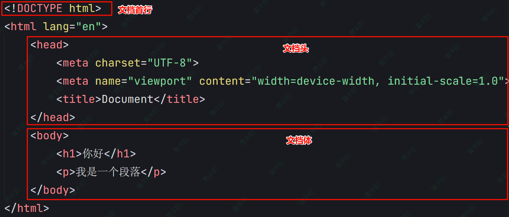

```xml
<!DOCTYPE html>
<html>
  <head>
    <!-- 元数据：标题、字符编码、CSS/JS 链接 -->
    <meta charset="UTF-8">
    <title>页面标题</title>
  </head>
  <body>
    <!-- 可见内容 -->
    <h1>主标题</h1>
    <p>段落文本</p>
  </body>
</html>
```

- `<!doctype html>`——[<u>文档类型</u>](https://developer.mozilla.org/zh-CN/docs/Glossary/Doctype)。**这是必不可少的开头**。混沌初分，HTML 尚在襁褓（大约是 1991/92 年）之时，这个元素用来关联 HTML 编写规范，以供自动查错等功能所用。而在当今，它作用有限，可以说仅用于保证文档正常读取。现在知道这些就足够了。
- `<html></html>`——`<html>` 元素。该元素包含整个页面的所有内容，有时候也称作根元素。它还包含 `lang` 属性，设置页面的主要语种。
- `<head></head>`——`<head>` 元素。该元素作为想在 HTML 页面中包含但不想向用户显示的内容的容器。包括想在搜索结果中显示的[<u>关键字</u>](https://developer.mozilla.org/zh-CN/docs/Glossary/Keyword)和页面描述、用于设置页面样式的 CSS、字符集声明等等。
- `<meta charset="utf-8">`——该元素指明你的文档使用 UTF-8 字符编码，UTF-8 包括世界绝大多数书写语言的字符。它基本上可以处理任何文本内容。以它为编码还可以避免以后出现某些问题，没有理由再选用其他编码。
- `<meta name="viewport" content="width=device-width">`——[<u>视口元素</u>](https://developer.mozilla.org/zh-CN/docs/Web/CSS/CSSOM_view/Viewport_concepts#%E7%A7%BB%E5%8A%A8%E8%AE%BE%E5%A4%87%E7%9A%84%E8%A7%86%E5%8F%A3)可以确保页面以视口宽度进行渲染，避免移动端浏览器以比视口更宽的宽度渲染内容，导致内容缩小。
- `<title></title>`——`<title>` 元素。该元素设置页面的标题，显示在浏览器标签页上，也作为收藏网页的描述文字。
- `<body></body>`——`<body>` 元素。该元素包含期望让用户在访问页面时看到的*全部*内容，包括文本、图像、视频、游戏、可播放的音轨或其他内容。

## 标签

### 语法

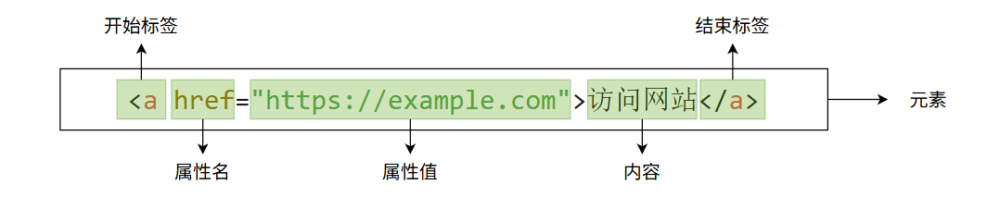

- 标签由在`<`和`>`中包裹的元素名组成
- HTML 标签里的元素名不区分大小写。也就是说，它们可以用大写，小写或混合形式书写。例如，`<title>` 标签可以写成 `<Title>`，`<TITLE>` 或以任何其他方式。
- 习惯上与实践上都推荐将标签名全部小写。
- 两种标签
  - **成对标签**：有标签体；开始标签 + 结束标签；` <h1> </h1>`
  - **自结束标签**：无标签体； `<br />`

### 嵌套元素

```html
<p>My cat is <strong>very</strong> grumpy.</p>
```

必须保证元素的嵌套次序正确：在上面的例子中，首先使用 `<p>` 标签，然后是 `<strong>` 标签，因此要先结束 `<strong>` 标签，最后再结束 `<p>` 标签。这样是不对的：

```html

<p>My cat is <strong>very grumpy.</p></strong>
```

> **元素嵌套关系，也反应了元素的父子层级；**
> 
> 上级是下级的父标签

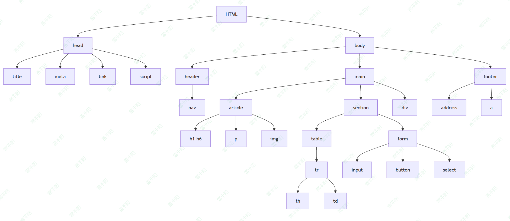

### 空元素

**不包含任何内容**的元素称为[<u>空元素</u>](https://developer.mozilla.org/zh-CN/docs/Glossary/Void_element)。我们以 HTML 页面中已有的 `` 元素为例：

```html

```

### 属性

每个标签可以有很多属性。有些属性是HTML规定的（预定义属性），有些是我们自己写的（自定义属性）

常见预定义属性：

- **id：**每个标签的唯一区分；
- **class：**标签分组归类，方便后面批量设置样式、动画等。

### 全部标签

> 按功能划分，边用边查；

https://developer.mozilla.org/zh-CN/docs/Web/HTML/Reference/Elements#%E4%B8%BB%E6%A0%B9%E5%85%83%E7%B4%A0

## 常用标签

### <h1>：标题（Heading）

**标题元素**可用于指定内容的标题和子标题。就像一本书的书名、每章的大标题、小标题，等。HTML 文档也是一样。HTML 包括六个级别的标题，[<u><h1> - <h6></u>](https://developer.mozilla.org/zh-CN/docs/Web/HTML/Reference/Elements/Heading_Elements)，一般最多用到 3-4 级标题。

```xml
<!-- 4 个级别的标题 -->
<h1>主标题</h1>
<h2>顶层标题</h2>
<h3>子标题</h3>
<h4>次子标题</h4>
```

> 备注： 在 HTML 中，`<!--` 和 `-->` 之间的任何内容都是 **HTML 注释**。浏览器在渲染代码时，会忽略掉注释。换句话说，注释在页面上不可见——仅停留在代码中。HTML 注释是一种让你写下关于你的代码或逻辑的有用注解的方式。

### <p>：段落

```html
<p>这是一个段落</p>
```

### <ul>：无序列表

```html
<ul>
    <li>technologists</li>
    <li>thinkers</li>
    <li>builders</li>
</ul>
```

### <ol>：有序列表

```xml
<ol>
    <li>technologists</li>
    <li>thinkers</li>
    <li>builders</li>
</ol>
```

### ：图片

```html

```

### <a>：超链接

```html
<a href="https://www.baidu.com">
  去百度
</a>

<a href="b.html">
  去其他页面
</a>
```

### <table>：表格

```xml
 <table border="1">
    <!-- 表格 -->
    <caption>示例表格</caption>
    <!-- 表格标题 -->
    <thead>
        <!-- 表头 -->
        <tr>
            <!-- 表格行 -->
            <th>姓名</th>
            <!-- 表头单元格 -->
            <th>年龄</th>
        </tr>
    </thead>
    <tbody>
        <!-- 表格主体 -->
        <tr>
            <td>张三</td>
            <!-- 表格数据单元格 -->
            <td>25</td>
        </tr>
        <tr>
            <td>李四</td>
            <td>30</td>
        </tr>
    </tbody>
</table>
```

### <form>：表单

```xml
<form action="#" method="post">
    <!-- 表单 -->
    <label for="name">姓名:</label>
    <!-- 表单标签 -->
    <input type="text" id="name" name="name" required>
    <!-- 文本输入框 -->
    <br>
    <!-- 换行 -->
    <label for="email">邮箱:</label>
    <input type="email" id="email" name="email" required>
    <br>
    <label for="password">密码:</label>
    <input type="password" id="password" name="password" required>
    <br>
    <button type="submit">提交</button>
    <!-- 按钮 -->
</form>
```

## 元素类型

> 后面CSS样式中会再说；此处简单了解即可

> **浏览器如何显示每一个元素？**
> 
> 默认逐行扫描，按照标签解析到对应效果进行展示。
> 
> 元素按照布局效果，划分为三类：
> 
> 1. **块级元素**（display：block）：独占一整行
> 2. **行级元素**（display：inline）：在一行内，并排防止
> 3. **内联块**（display：inline-block）：混合特性
>   1. 水平排列​：类似行内元素
>   2. 支持宽高​：类似块级元素
>   3. 完整盒模型​：支持所有边距和边框

*📊 在线表格（无数据）*

```html
    <h1>你好</h1>
    <p>我是一个段落</p>
    <div>a</div>
    <div>b</div>
    <div>c</div>
    <span>呵呵</span>
    <span>哈哈</span>
    <span>嘿嘿</span>
    <div>d</div>
```

## 作业

> 让AI帮你用HTML编写一个漂亮的 Java工程师 简历模板。

# CSS

> **层叠样式表（CSS-Cascading Style Sheets）是为 web 内容添加****样式****的代码。**
> 
> 和 HTML 类似，CSS 不是编程语言。它也不是标记语言，而是一门样式表语言。CSS 用于选择性地为 HTML 元素添加样式。例如，下列的 CSS 代码选择了所有的段落文本，并将它们设置为红色。

## 基础语法

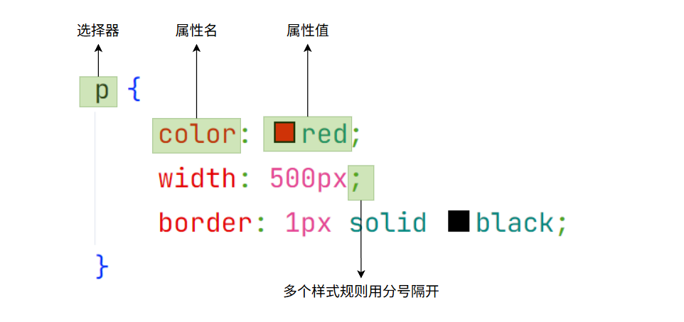

## CSS三处位置

CSS可以在三个位置去设置样式；

```html
<h1>你好</h1>
<p>我是一个段落</p>
<div>a</div>
<div>b</div>
<div>c</div>
<span>呵呵</span>
<span>哈哈</span>
<span>嘿嘿</span>
<div>d</div>
<p>我是一个段落</p>
```

### 标签 style 属性： 内联样式

```html
  <p style="color: red; font-size: 20px">我是一个段落</p>
```

### 网页 <style> 标签

> 一般放在 <head> 标签内

```xml
    <style>
        p {
            color: green;
        }
    </style>
```

### 外部文件

1. 创建` styles.css` 文件； 文件名随意
2. 文件内容如下：

```html
span {
    color: blue;
}
```

1. 引入样式

```html
<link rel="stylesheet" href="styles.css">
```

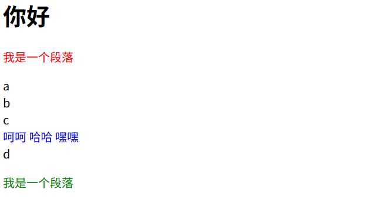

> 优先级：
> **内联样式（最高优先级）** > **其他位置**（最后声明覆盖前面声明）
> 
> **完整顺序（从高到低）​​**：
> 
> **!important** > **内联样式** > **ID选择器** > **类/属性/伪类选择器** > **元素/伪元素选择器** > **通配选择器**

## 选择器

选择器有许多不同的类型。上面只介绍了元素选择器，用来选择所有指定类型的元素。但是选择操作可以更加具体。下面是一些更常用的选择器类型：

| 选择器名称 | 选择的内容 | 示例 |
| --- | --- | --- |
| 元素选择器 （也叫标签选择器） | 所有指定类型的 HTML 元素 | p 选择 <p> |
| ID 选择器 | 具有特定 ID 的元素。单一 HTML 页面中，每个 ID 只对应一个元素，一个元素只对应一个 ID | #my-id 选择 <p id="my-id"> 或 <a id="my-id"> |
| 类选择器 | 具有特定类的元素。单一页面中，一个类可以有多个实例 | .my-class 选择 <p class="my-class"> 和 <a class="my-class"> |
| 属性选择器 | 拥有特定属性的元素 | img[src] 选择  但不是  |
| 伪类选择器 | 特定状态下的特定元素（比如鼠标指针悬停在链接上时） | a:hover 选择仅在鼠标指针悬停在链接上时的 <a> 元素 |

## 常用样式

> 全部样式：
> 
> https://developer.mozilla.org/zh-CN/docs/Web/CSS/Reference#%E7%B4%A2%E5%BC%95

大小、背景、边框、字体、颜色、间距

```html
<div id="css_div">Java是世界上第二好的语言，因为PHP是第一</div>
<style>
        #css_div {
            width: 300px;
            height: 200px;
            /* background-color: burlywood; */
            font-size: 30px;
            color: white;
            text-align: center;
            border: 5px solid black;
            border-radius: 10px;
            /* 让AI写下面的 */
            /* 渐变背景 */
            background: linear-gradient(45deg, #ff6b6b, #ffb86c);
            /* 水平居中 */
            margin: 0 auto;
        }

         #css_div:hover {
            background: linear-gradient(45deg, #ff3312, #ffb86c);
         }
</style>
```

## 盒子模型

在 CSS 中，所有的元素都被一个个的“盒子”包围着，理解这些“盒子”的基本原理，是我们使用 CSS 实现准确布局、处理元素排列的关键。


### 盒子的各个部分

CSS 中组成一个区块盒子需要：

- **内容盒子：**显示内容的区域；使用 `inline-size` 和 `block-size` 或 `width` 和 `height` 等属性确定其大小。
- **内边距盒子：**填充位于内容周围的空白处；使用 `padding` 和相关属性确定其大小。
- **边框盒子：**边框盒子包住内容和任何填充；使用 `border` 和相关属性确定其大小。
- **外边距盒子：**外边距是最外层，其包裹内容、内边距和边框，作为该盒子与其他元素之间的空白；使用 `margin` 和相关属性确定其大小。

```css
.box {
  width: 350px;
  height: 150px;
  margin: 10px;
  padding: 25px;
  border: 5px solid black;
}
```

> **方框*****实际*****占用的空间****宽**为 410px（350 + 25 + 25 + 5 + 5），**高**为 210px（150 + 25 + 25 + 5 + 5）。

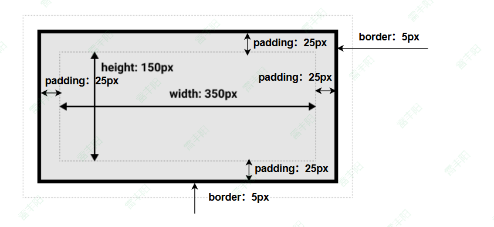

### 区块盒子和行内盒子

> 1. 在 CSS 中，我们有几种类型的盒子，一般分为**区块盒子（block boxes）**和**行内盒子（inline boxes）**。
> 2. 盒子有**内部显示（inner display type）**和**外部显示（outer display type）**两种类型。（类型指的是盒子在页面流中的行为方式以及与页面上其他盒子的关系）

#### 外部显示类型

> **一个拥有 **`block`** 外部显示类型的盒子会表现出以下行为：**
> 
> - **盒子会产生换行**。
> - `width`** 和 **`height`** 属性可以发挥作用。**
> - 内边距、外边距和边框会将其他元素从当前盒子周围“推开”。
> - 如果未指定 `width`，方框将沿行向扩展，以填充其容器中的可用空间。在大多数情况下，盒子会变得与其容器一样宽，占据可用空间的 100%。
> 
> 某些 HTML 元素，如 `<h1>` 和 `<p>`，默认使用 `block` 作为外部显示类型。

> **一个拥有 **`inline`** 外部显示类型的盒子会表现出以下行为：**
> 
> - **盒子不会产生换行**。
> - `width`** 和 **`height`** 属性将不起作用。**
> - 垂直方向的内边距、外边距以及边框会被应用但是不会把其他处于 `inline` 状态的盒子推开。
> - 水平方向的内边距、外边距以及边框会被应用且会把其他处于 `inline` 状态的盒子推开。
> 
> 某些 HTML 元素，如 `<a>`、 `<span>`、 `<em>` 以及 `<strong>`，默认使用 `inline` 作为外部显示类型。

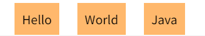

```html
<div class="inline_div">Hello</div>
<div class="inline_div">World</div>
<div class="inline_div">Java</div>
<style>
    .inline_div {
        display: inline;
        width: 300px;
        height: 200px;
        margin-left: 20px;
        padding: 10px;
        background-color: #ffb86c;
    }
</style>
```

#### 内部显示类型

盒子还有***内部*****显示类型**，它决定了**盒子内元素的布局方式**。

区块和行内布局是网络上的默认行为方式。默认情况下，在没有任何其他指令的情况下，方框内的元素也会以[<u>标准流</u>](https://developer.mozilla.org/zh-CN/docs/Learn_web_development/Core/CSS_layout/Introduction)的方式布局，并表现为区块或行内盒子。

> 例如，可以通过设置 `display: flex;` 来更改内部显示类型。该元素仍将使用外部显示类型 `block` 但内部显示类型将变为 `flex`。该方框的任何直接子代都将成为弹性（flex）项，并按照[<u>弹性盒子</u>](https://developer.mozilla.org/zh-CN/docs/Learn_web_development/Core/CSS_layout/Flexbox)规范执行。

## 布局

### 浮动

> 元素还在文档流内，指定浮动到某个位置。和word的图片环绕功能一样

```html
<h1>Simple float example</h1>

<div class="box">Float</div>

<p class="special">
  Lorem ipsum dolor sit amet, consectetur adipiscing elit. Nulla luctus aliquam
  dolor, eu lacinia lorem placerat vulputate. Duis felis orci, pulvinar id metus
  ut, rutrum luctus orci. Cras porttitor imperdiet nunc, at ultricies tellus
  laoreet sit amet.
</p>

<p>
  Sed auctor cursus massa at porta. Integer ligula ipsum, tristique sit amet
  orci vel, viverra egestas ligula. Curabitur vehicula tellus neque, ac ornare
  ex malesuada et. In vitae convallis lacus. Aliquam erat volutpat. Suspendisse
  ac imperdiet turpis. Aenean finibus sollicitudin eros pharetra congue. Duis
  ornare egestas augue ut luctus. Proin blandit quam nec lacus varius commodo et
  a urna. Ut id ornare felis, eget fermentum sapien.
</p>

<p>
  Nam vulputate diam nec tempor bibendum. Donec luctus augue eget malesuada
  ultrices. Phasellus turpis est, posuere sit amet dapibus ut, facilisis sed
  est. Nam id risus quis ante semper consectetur eget aliquam lorem. Vivamus
  tristique elit dolor, sed pretium metus suscipit vel. Mauris ultricies lectus
  sed lobortis finibus. Vivamus eu urna eget velit cursus viverra quis
  vestibulum sem. Aliquam tincidunt eget purus in interdum. Cum sociis natoque
  penatibus et magnis dis parturient montes, nascetur ridiculus mus.
</p>

```

```yaml
body {
  width: 90%;
  max-width: 900px;
  margin: 0 auto;
  font:
    0.9em/1.2 Arial,
    Helvetica,
    sans-serif;
}

.box {
  margin-right: 15px;
  margin-top: 5px;
  width: 150px;
  height: 100px;
  border-radius: 5px;
  background-color: rgb(207, 232, 220);
  padding: 1em;
}

.special {
  background-color: rgb(79, 185, 227);
  padding: 10px;
  color: #fff;
}

```

### 定位

> 定位允许你从**正常的文档流布局中取出元素**（脱离文档流），并使它们具有不同的行为，例如放在另一个元素的上面，或者始终保持在浏览器视窗内的同一位置。

```xml
<!DOCTYPE html>
<html lang="en-US">
  <head>
    <meta charset="utf-8">
    <meta name="viewport" content="width=device-width">
    <title>Basic document flow</title>

    <style>
      body {
        width: 500px;
        margin: 0 auto;
      }

      p {
        background: aqua;
        border: 3px solid blue;
        padding: 10px;
        margin: 10px;
      }

      span {
        background: red;
        border: 1px solid black;
      }
    </style>
  </head>
  <body>
    <h1>Basic document flow</h1>
    <p>I am a basic block level element. My adjacent block level elements sit on new lines below me.</p>
    <p class="positioned">By default we span 100% of the width of our parent element, and our height is as tall as our child content. Our total width and height is our content + padding + border width/height.</p>
    <p>We are separated by our margins. Because of margin collapsing, we are separated by the width of one of our margins, not both.</p>
    <p>inline elements <span>like this one</span> and <span>this one</span> sit on the same line as one another, and adjacent text nodes, if there is space on the same line. Overflowing inline elements <span>wrap onto a new line if possible — like this one containing text</span>, or just go on to a new line if not, much like this image will do: </p>
  </body>
</html>

```

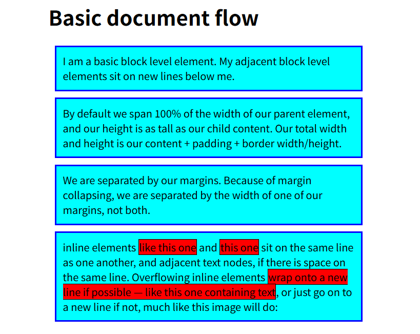

> 我们将调整第二段话（class="positioned"）的位置来演示定位； 

#### 相对定位

```css
.positioned {
  position: relative;
  background: yellow;
}
```

修改元素位置，需要使用`top`，`bottom`，`left`和`right`属性；

```css

.positioned {
  position: relative;
  background: yellow;
  top: 30px;
  left: 30px;
}
```

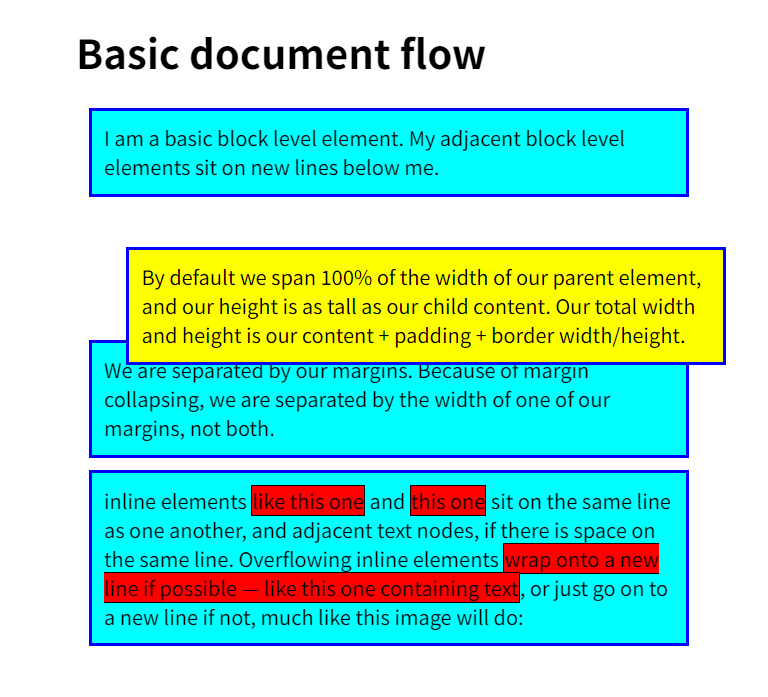

> 效果：相对于他原来的位置，有所偏移。自身原来位置还被占用。其他后面元素顶不上来

#### 绝对定位

> 效果：直接从文档流的起始开始算位置，脱离自身位置，其他后面元素顶上来

```css
.positioned {
  position: absolute;
  background: yellow;
  top: 30px;
  left: 30px;
}
```

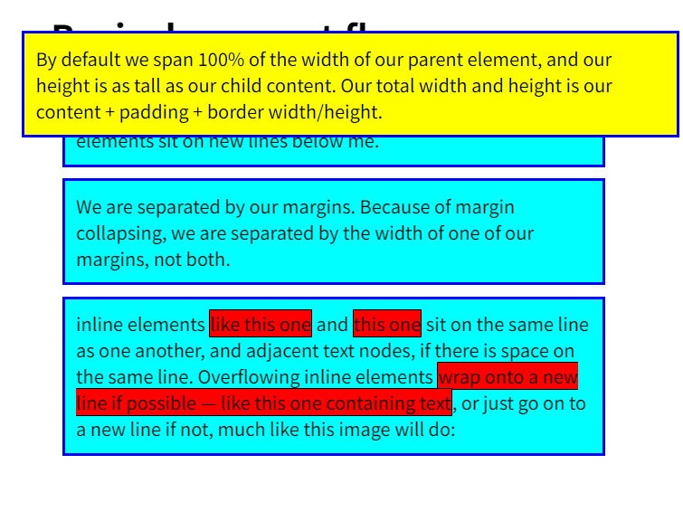

### 弹性盒子（flex）

> https://developer.mozilla.org/zh-CN/docs/Learn_web_development/Core/CSS_layout/Flexbox
> 
> [<u>弹性盒子</u>](https://developer.mozilla.org/zh-CN/docs/Web/CSS/CSS_flexible_box_layout)是一种用于**按行**或**按列**布局元素的**一维布局方法**。元素可以膨胀以填充额外的空间，收缩以适应更小的空间。**这是现代互联网web页面，最喜欢的布局方式**！！！可以通过几个简单设置，快速调整出常用布局

#### 弹性盒子模型

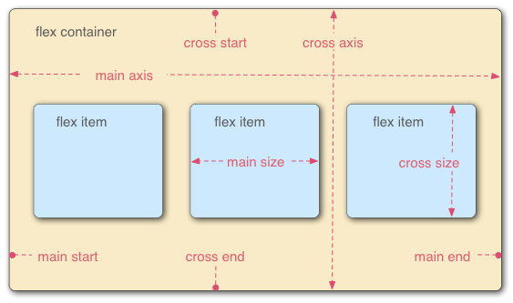

- **主轴（main axis）：**是沿着 flex 元素放置的方向延伸的轴（比如页面上的横向的行、纵向的列）。该轴的开始和结束被称为 main start 和 main end。
- **交叉轴（cross axis）**：是垂直于 flex 元素放置方向的轴。该轴的开始和结束被称为 cross start 和 cross end。
- **flex 容器（flex container）**：设置了 `display: flex` 的父元素被称之为 flex 容器（flex container）。
- **flex 项（flex item）**：在 flex 容器中表现为弹性的盒子的元素被称之为 flex 项（flex item）

```xml
<div class="container">
    <div id="d01" class="item">1</div>
    <div id="d02" class="item">2</div>
    <div id="d03" class="item">3</div>
    <div id="d04" class="item">4</div>
    <div id="d05" class="item">5</div>
</div>
```

#### 父容器【container】6大设置项

1. **flex-direction**：
  - 决定主轴的方向(即项目的排列方向)
  - 可取值：
    - row：行；默认值
    - row-reverse
    - column 
    - column-reverse
2. **flex-wrap：**
  1. 决定容器内项目是否可换行
  2. 可取值：
    - nowrap：不换行，默认值；即当主轴尺寸固定时，当空间不足时，项目尺寸会随之调整而并不会挤到下一行。
    - wrap：项目主轴总尺寸超出容器时换行，第一行在上方
    - wrap-reverse（换行，第一行在下方）;
3. **flex-flow：**
  - flex-direction 和 flex-wrap 的简写形式；如 flex-flow: row wrap; 建议老老实实写，不要简写
4. **justify-content**：
  - 定义了**项目在主轴的对齐方式**。建立在主轴为水平方向时测试，即 flex-direction: row
  - 可取值
    - flex-start：左对齐；默认值
    - flex-end：右对齐
    - center：居中
    - space-between：两端对齐，项目之间的间隔相等，即剩余空间等分成间隙
    - space-around：每个项目两侧的间隔相等，所以项目之间的间隔比项目与边缘的间隔大一倍
5. **align-items**
  - 定义了项目在**交叉轴上的对齐方式； 建立在主轴为水平方向时测试，即 flex-direction: row**
  - 可取值
    - stretch：拉伸；默认值；如果项目未设置高度或者设为 auto，将占满整个容器的高度。假设容器高度设置为 100px，而项目都没有设置高度的情况下，则项目的高度也为 100px
    - flex-start：交叉轴的起点对齐；假设容器高度设置为 100px，而项目分别为 20px, 40px, 60px, 80px, 100px, 可以明显观测到效果
    - flex-end：交叉轴的终点对齐；
    - center：交叉轴的中点对齐
    - baseline: 项目的第一行文字的基线对齐；以文字底部为主，调整文字大小不一，测试才有明显效果。
6. **align-content**
  - 定义了**多根轴线的对齐方式**，如果项目只有一根轴线，那么该属性将不起作用；当你 flex-wrap 设置为 nowrap 的时候，容器仅存在一根轴线，因为项目不会换行，就不会产生多条轴线。当你 flex-wrap 设置为 wrap 的时候，容器可能会出现多条轴线，这时候你就需要去设置多条轴线之间的对齐方式了。建议在主轴为水平方向时测试，即 `flex-direction: row, flex-wrap: wrap`
  - 可取值
    - stretch：拉伸；默认值
    - flex-start：轴线全部在交叉轴上的起点对齐
    - flex-end：轴线全部在交叉轴上的终点对齐
    - center：轴线全部在交叉轴上的中间对齐
    - space-between：轴线两端对齐，之间的间隔相等，即剩余空间等分成间隙
    - space-around：每个轴线两侧的间隔相等，所以轴线之间的间隔比轴线与边缘的间隔大一倍

#### 项目【item】6种设置

有六种属性可运用在 item 项目上：

1. **order**：定义项目在容器中的排列顺序，数值越小，排列越靠前，默认值为 0

```css
.item {
    order: 1;
}
```

1. **flex-basis：基本占用；**定义了在分配多余空间之前，**项目占据的主轴空间**，浏览器根据这个属性，**计算主轴是否有多余空间**

```css
.item {flex-basis: <length> | auto;}
```

- 默认值：auto，即项目本来的大小, 这时候 item 的宽高取决于 width 或 height 的值。
- **当****主轴为水平****方向的时候，当设置了**** flex-basis****，项目的****宽度设置值会失效****，flex-basis 需要跟 flex-grow 和 flex-shrink 配合使用才能发挥效果。**
  - 当 flex-basis 值为 0 % 时，是把该项目视为零尺寸的，故即使声明该尺寸为 140px，也并没有什么用。
  - 当 flex-basis 值为 auto 时，则跟根据尺寸的设定值(假如为 100px)，则这 100px 不会纳入剩余空间。

1. **flex-grow：**定义项目的**放大比例**；

```css
.item {flex-grow: <number>;}
```

- 默认值为 0，即如果存在剩余空间，也不放大
- 当所有的项目都以 flex-basis 的值进行排列后，仍有剩余空间，那么这时候 flex-grow 就会发挥作用了。
- 如果所有项目的 flex-grow 属性都为 1，则它们将等分剩余空间。(如果有的话)
- 如果一个项目的 flex-grow 属性为 2，其他项目都为 1，则前者占据的剩余空间将比其他项多一倍。
- 当然如果当所有项目以 flex-basis 的值排列完后发现**空间不够了**，且 flex-wrap：nowrap 时，此时 flex-grow 则不起作用了，这时候就需要接下来的这个属性，**f****lex-shrink**。

1. **flex-shrink：定义了项目的缩小比例**

```css
.item {flex-shrink: <number>;}
```

- 默认值: 1，即如果空间不足，该项目将缩小，负值对该属性无效。
- 如果所有项目的 flex-shrink 属性都为 1，当空间不足时，都将等比例缩小。
- 如果一个项目的 flex-shrink 属性为 0，其他项目都为 1，则空间不足时，前者不缩小。

1. **flex：flex-grow, flex-shrink 和 flex-basis的简写**

```css
.item{flex: none | [ <'flex-grow'> <'flex-shrink'>? || <'flex-basis'> ]} 
```

flex 的默认值是以上三个属性值的组合。假设以上三个属性同样取默认值，则 flex 的默认值是 **0 1 auto**。

1. **align-self：**允许单个项目有与其他项目不一样的对齐方式

```css
.item {align-self: auto | flex-start | flex-end | center | baseline | stretch;}
```

这个跟 align-items 属性是一样的，只不过 align-self 是对单个项目生效的，而 align-items 则是对容器下的所有项目生效的。

## 练习

**使用flex布局，写一个 导航条；**

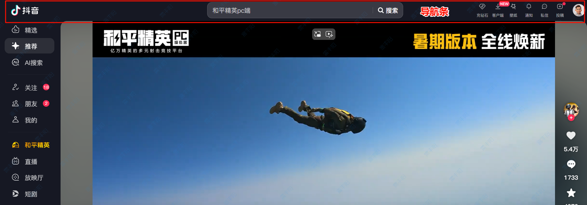

# Bootstrap

> 流行的**UI框架**： https://getbootstrap.com/

只需要导入 bootstrap 提供的现成的 css样式，就可以快捷的拥有漂亮的页面效果

https://tdesign.tencent.com/：腾讯

https://ant-design.antgroup.com/components/overview-cn：阿里

https://arco.design/：字节

https://element.eleme.cn/#/：饿了么