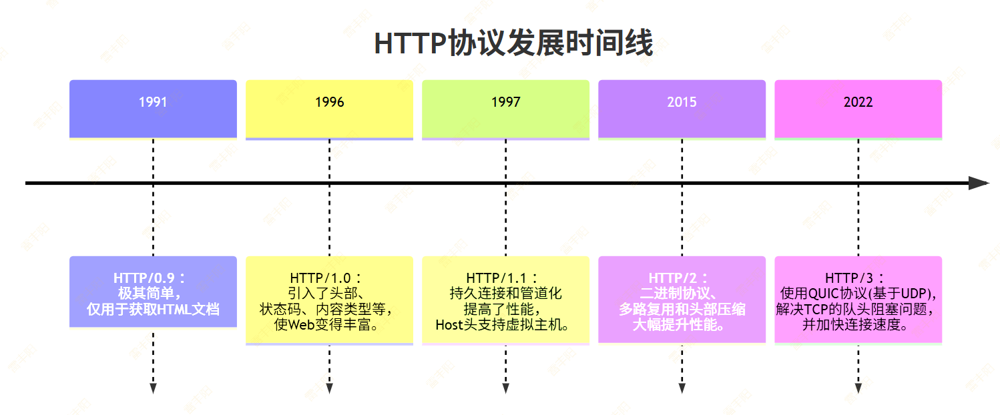
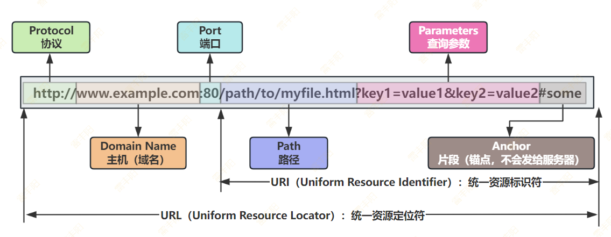
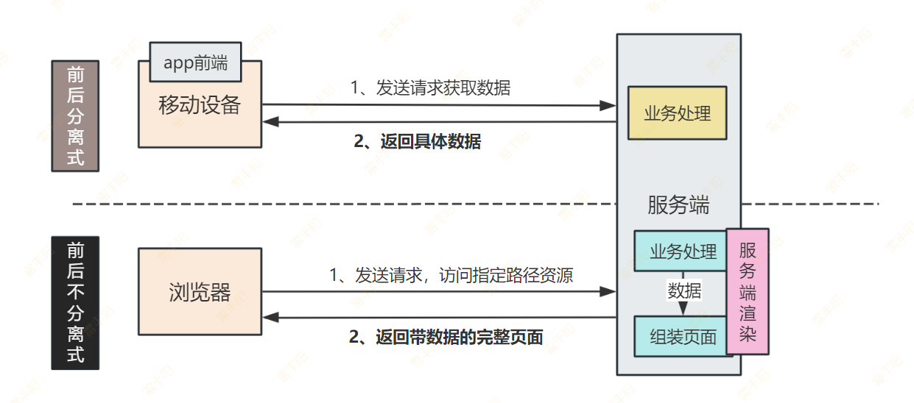
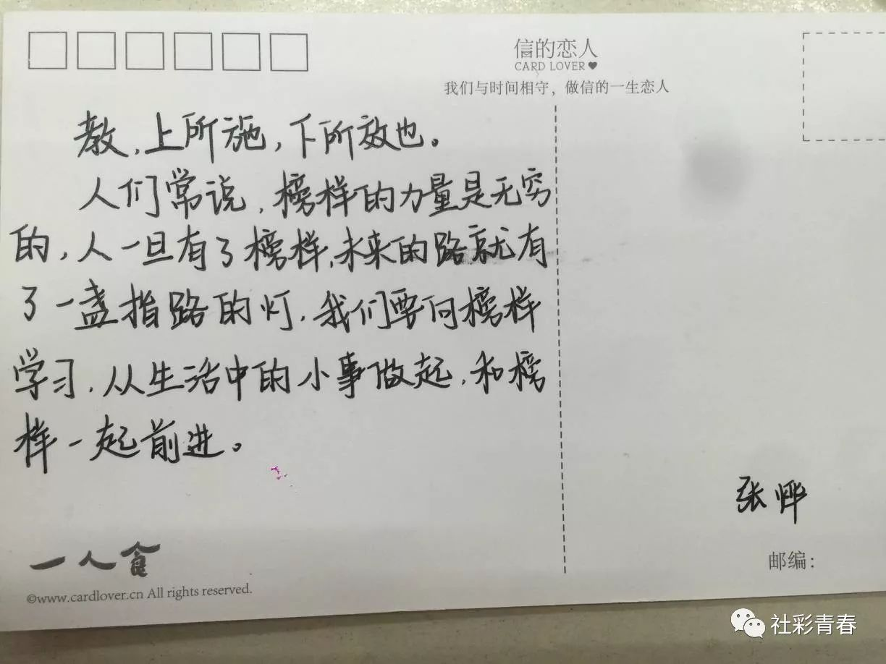
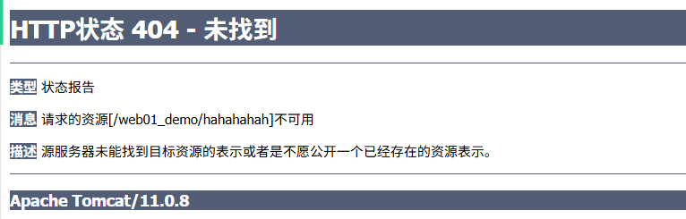
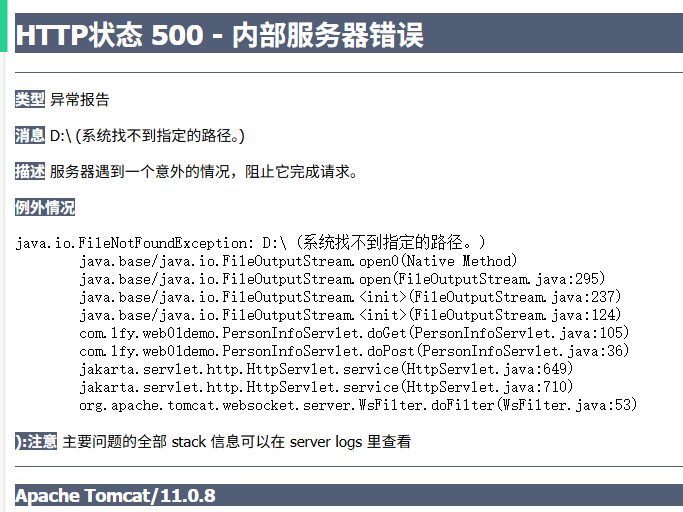
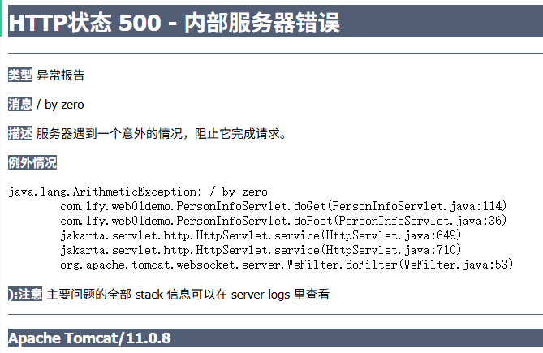
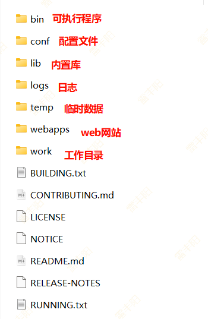

# 3. XML & HTTP & Tomcat

# XML

HT**ML**（HyperText Markup Language）：浏览器能解析的，里面的标签都是规定好的；

X**ML**（eXtend Markup Language）: 可扩展的标记语言；任意人都能用，里面的标签都是自己定义的；

> **XML**（**可扩展标记语言**）是一种用于存储和传输数据的标记语言
> 
> 其核心设计目标是**保存数据**、**传输数据**而**非显示数据**（这与HTML不同）。
> 
> - **保存数据：**某些程序当成**配置文件**；程序代码不写死的部分。
> - **传输数据：**json一样，顺着网络传输

## 基础语法

一个XML文档必须包含根元素​，所有其他元素都包含在根元素内。示例：

```xml
<?xml version="1.0" encoding="UTF-8"?> <!-- XML声明 -->
<root> <!-- 根元素 -->
 <!-- dom4j xpath sax -->
  <child>Content</child>
</root>
```

| 规则 | 正确示例 | 错误示例 |
| --- | --- | --- |
| ​​区分大小写​​ | <Title> ≠ <title> | 混用大小写 |
| ​​必须有根元素​​ | 整个文档只有一个顶层元素 | 多个根元素 |
| ​​正确关闭所有标签​​ | <tag></tag> 或 <tag/> | 未关闭标签 |
| ​​属性值必须加引号​​ | id="1001" | id=1001 |
| ​​属性不能重复​​ | <book id="1"> | <book id="1" id="2"> |
| ​​特殊字符转义​​ | &lt; = < | 直接使用 < |

**注释（Comment）**

- 格式：`<!-- This is a comment -->`
- 禁止嵌套注释​（如 `<!-- <!-- --> -->` 错误）

## 转义字符

| 字符 | 替代写法 | 说明 |
| --- | --- | --- |
| < | &lt; | 小于号 |
| > | &gt; | 大于号 |
| & | &amp; | 和号 |
| " | &quot; | 双引号 |
| ' | &apos; | 单引号 |

## CDATA

```xml
<jscode>
    <![CDATA[
      if (x < 10 && y > 20) {
        alert("Hello");
      }
    ]]>
</jscode>
```

## 案例

对比看看，用 **JSON **和 **XML** 分别表示一个Java对象，哪个更好？

```java
public class Person {
    // 基本属性
    private String name;
    private int age;
    // 爱好集合
    private List<String> hobbys;
    // 朋友列表
    private List<Friend> friends;
    // 静态内部类：朋友对象
    public static class Friend {
        private String name;
        private int age;
        private String relationship;
        private List<String> hobbys; // 可选属性
        // 其他方法省略...
    }
}
```

```json
{
  "name": "张晓明",
  "age": 28,
  "hobbys": ["摄影", "登山", "爵士乐"],
  "friends": [
    {
      "name": "李思雨",
      "age": 26,
      "relationship": "大学室友"
    },
    {
      "name": "王建国",
      "age": 30,
      "relationship": "工作伙伴",
      "hobbys": ["篮球", "编程"]
    }
  ]
}
```

```xml
<?xml version="1.0" encoding="UTF-8"?>
<person>
  <name>张晓明</name>
  <age>28</age>
  <hobbys>
    <hobby>摄影</hobby>
    <hobby>登山</hobby>
    <hobby>爵士乐</hobby>
  </hobbys>
  
  <friends>
    <friend>
      <name>李思雨</name>
      <age>26</age>
      <relationship>大学室友</relationship>
    </friend>
    <friend>
      <name>王建国</name>
      <age>30</age>
      <relationship>工作伙伴</relationship>
      <!-- 可选的扩展属性 -->
      <hobbys>
        <hobby>篮球</hobby>
        <hobby>编程</hobby>
      </hobbys>
    </friend>
  </friends>
</person>
```

# HTTP

HT(HyperText)   ML

**协议：约定一系列的规则，大家遵守规则，后来好配合。**

客户端：`{"name":"张三","age":18}`

服务器：解析json内容。

直播视频：自定义的视频传输协议；1s 30帧；  30个图片（规定如何传输，数据格式（png，jpeg）） 010101010101010010101

> **HTTP**（**HyperText **Transfer Protocol）**超文本**传输【**协议】**； 用文本在网络间进行数据传输的协议
> 
> 是应用**最广泛**的**客户端-服务器**通信**协议**，是万维网（WWW）的基础。
> 
> **协议：**双方约定好的**数据传输方式**、**数据格式**、**数据安全保障**等一系列规则；
> HTTP3以前是基于TCP的。发送HTTP数据包之前，必须建立连接（慢）。**HTTP3** - UDP速度

- **类型​**：**应用层协议**（基于TCP/IP协议栈）
- **特点​**：**无状态**、**明文传输**（HTTP）或**加密（HTTPS）**



## 报文格式

报文：**数据报**（网络编程；A == B发送数据； 100G； 每次传输一点数据）

报文：**电报**；（电路开断(0101001) ==》 英文 ==》 语言内容）

- 摩斯电码； 格式  4个一组（._._  ..__）
- HTTP报文：客户端和服务器（
  - **客户端**给**服务器**发送的数据：**请求报文**
  - 服务器给客户端回的数据：**响应报文**

首行：请求首行、响应首行

头：请求头、响应头

空行

体（真正交换的数据）：请求体、响应体； 


### 请求报文

> 元数据：**使用说明书**； 

使用代码截货到数据; 

```http
-- 在Http协议中。 host的值 + 请求首行路径名 = 浏览器访问的完整地址（URL地址）
GET /abc HTTP/1.1          //请求首行：  请求方式 请求路径 HTTP版本
Host: localhost:8080        //请求头：  K: v 的时候
Connection: keep-alive
sec-ch-ua: "Microsoft Edge";v="137", "Chromium";v="137", "Not/A)Brand";v="24"
sec-ch-ua-mobile: ?0
sec-ch-ua-platform: "Windows"
Upgrade-Insecure-Requests: 1
User-Agent: Mozilla/5.0 (Windows NT 10.0; Win64; x64) AppleWebKit/537.36 (KHTML, like Gecko) Chrome/137.0.0.0 Safari/537.36 Edg/137.0.0.0
Accept: text/html,application/xhtml+xml,application/xml;q=0.9,image/avif,image/webp,image/apng,*/*;q=0.8,application/signed-exchange;v=b3;q=0.7
Sec-Fetch-Site: none
Sec-Fetch-Mode: navigate
Sec-Fetch-User: ?1
Sec-Fetch-Dest: document
Accept-Encoding: gzip, deflate, br, zstd
Accept-Language: zh-CN,zh;q=0.9,en;q=0.8,en-GB;q=0.7,en-US;q=0.6
Cookie: rl_anonymous_id=RudderEncrypt%3AU2FsdGVkX1%2FFQliJxJasdQXmBKDmciKz973NF4KCkXOsQFk%2F5WEw74GA%2BBsG1dOEox0upaBc7nOGASwTackdng%3D%3D; rl_page_init_referrer=RudderEncrypt%3AU2FsdGVkX1%2BnR7opN%2B4%2FjG0dV0ND8HAPaWGsR1TP45M%3D; rl_page_init_referring_domain=RudderEncrypt%3AU2FsdGVkX19wt6WCot4A1pCNTxgwQXjh5BQp5OSeGSY%3D; rl_user_id=RudderEncrypt%3AU2FsdGVkX1%2B%2B7cIqlxmT7i9GJipkGngeCX8sJH9KbfNYV1IrKd07dgcGXZUx%2BQbCDMX8dq%2BwmLLEJGNrdfOPrEzrEHdJYguRyk1kNIGHI0qZ9uJZK%2Fzpp6SV9SMhcI5m1UVzFm8Rti%2Frz6msLxICJrmLl4EHwoCq4rQM9H6lz3w%3D; rl_trait=RudderEncrypt%3AU2FsdGVkX1%2Bz1pRYSj%2F1Bf8HpPYgCeYmReY%2F%2Fh6eFZ%2BThzcSXlBYlHieAwy389uSzbpuib1O4391GOmutycM4FWIyWx88zmKtwu9IalF632EC56t8QWh8fj186MzIXurcjcZv3uF%2FftAa6s3lpe6tA%3D%3D; rl_session=RudderEncrypt%3AU2FsdGVkX19aLEdqtbkVrzEmjoyi9y9olkhj41at3PW9vESr%2BLYwghv9C9awCB8YNv79XvyMwuBLCL7QrQKr%2FuzsX2Gsg5jL7PjHbJqnoEviXmx1SfhstYDVh8lRClhbmYOX0CGVzcdPds9RtppSIA%3D%3D; ph_phc_4URIAm1uYfJO7j8kWSe0J8lc8IqnstRLS7Jx8NcakHo_posthog=%7B%22distinct_id%22%3A%22299e10a9c526592a8300d2390cbaeda8fb9ffa1ee734d56581a0e1ad18ea27ef%2367233cbf-79e3-4431-98a9-a9a75f3f15f1%22%2C%22%24sesid%22%3A%5B1748334817172%2C%22019710da-1955-71b5-93eb-1947aeb1d93d%22%2C1748334418261%5D%2C%22%24epp%22%3Atrue%2C%22%24initial_person_info%22%3A%7B%22r%22%3A%22%24direct%22%2C%22u%22%3A%22http%3A%2F%2Flocalhost%3A5678%2Fsetup%22%7D%7D
        //空行
        //体
```

> 如下是一个请求报文的案例；观察不难得出他的语法格式

```http
GET /api/users?id=123 HTTP/1.1       <-- 请求首行       （请求方式 URI）
Host: api.example.com                 <-- 请求头开始     (请求头名: 请求头值)
Authorization: Bearer xyz123
Content-Type: application/json
User-Agent: Mozilla/5.0               <-- 请求头结束
                                                        (空行)
{"name":"update"}                    <-- 请求体（可选）   (携带给服务的数据)
```

> **扩展：URL与URI**
> 
> 浏览器需要写全URL地址，才**可以访问网络上的资源**



### 响应报文

元数据

```http
HTTP/1.1 200 OK                       <-- 状态行          (HTTP协议版本 状态码 状态信息)
Date: Mon, 15 May 2023 09:00:00 GMT    <-- 响应头开始     (响应头名: 响应头值)
Content-Type: application/json
ETag: "5d8c72a2"
Cache-Control: max-age=3600           <-- 响应头结束
                                                        （空行）
{"id":123,"name":"张三"}             <-- 响应体           (服务器交给客户端的数据)
```

> 页面的**局部更新**，一般让服务器只返回布局的json数据就行
> 
> 整个页面的刷新，要让服务器返回整个页面

> **不同开发方式**，服务器交给客户端的数据也可能不同；



## 请求方式

> 以下是常见请求方式（约定俗称）；
> 
> HTTP协议中规定；
> 
> 幂等性：**做一次**和**做无数次**是一样的； 
> 
> - 查询**1号员工**；**查询幂等性**；
> - **新增员工**；业务没写好，直接把浏览器发来的数据直接保存数据库； **不是幂等的**；
>   - 业务代码一旦没写好，不幂等；
>   - 业务代码，**除了查询数据的请求**。剩下的**增删改**都应该判定**幂等**；
>   - 原来20：id=1，age=18 （**A****B****A**）
>     - id=1，age = 90
>   - 100次： id=1，age=18
> - 表格中的**安全性**代表不安全的操作有可能导致服务器数据混乱/数据被删除丢失等；而不是数据泄露！

> 幂等与安全不是绝对的，以下仅作为参考比较

| 方法 | 幂等性 | 安全性 | 作用 |
| --- | --- | --- | --- |
| GET | 是 | 是 | 获取资源 |
| POST | 否 | 否 | 创建资源 |
| PUT | 是 | 否 | 替换整个资源 |
| PATCH | 否 | 否 | 部分更新资源 |
| DELETE | 是 | 否 | 删除资源 |
| HEAD | 是 | 是 | 仅获取响应头 |
| OPTIONS | 是 | 是 | 获取支持的通信选项 |

> 1. HTML 的 form 表单标签，仅支持两种请求方式：GET、POST
> 2. a链接点击跳转，其实是GET请求。

### GET 请求

> 以表单登录为例，演示GET请求； （AI提示词：编写一个GET类型的form登录表单）

```xml
<!DOCTYPE html>
<html>
<head>
    <title>登录示例 (GET请求)</title>
    <style>
        body { font-family: Arial, sans-serif; margin: 20px; }
        .container { max-width: 400px; margin: 0 auto; }
        .form-group { margin-bottom: 15px; }
        label { display: block; margin-bottom: 5px; font-weight: bold; }
        input[type="text"], 
        input[type="password"] {
            width: 100%;
            padding: 8px;
            border: 1px solid #ccc;
            border-radius: 4px;
        }
        button {
            background-color: #4CAF50;
            color: white;
            padding: 10px 15px;
            border: none;
            border-radius: 4px;
            cursor: pointer;
        }
        button:hover { background-color: #45a049; }
        .note {
            background-color: #ffe6e6;
            padding: 10px;
            border-left: 4px solid #f44336;
            margin-top: 20px;
        }
    </style>
</head>
<body>
    <div class="container">
        <h2>用户登录 (GET方法)</h2>
        
        <!-- 登录表单 -->
        <form action="/login" method="get">
            <div class="form-group">
                <label for="username">用户名:</label>
                <input type="text" id="username" name="username" required>
            </div>
            
            <div class="form-group">
                <label for="password">密码:</label>
                <input type="password" id="password" name="password" required>
            </div>
            
            <button type="submit">登录</button>
        </form>
        
        <!-- 安全警告 -->
        <div class="note">
            <strong>安全提醒：</strong> 实际开发中<u>不应使用GET请求进行登录</u>。原因：
            <ul>
                <li>密码会以明文形式暴露在URL中</li>
                <li>浏览器历史记录会保存敏感信息</li>
                <li>服务器日志可能记录完整URL</li>
                <li>容易被网络嗅探或他人查看</li>
            </ul>
            <p>✔️ <strong>正确做法</strong>：使用 <code>method="post"</code></p>
        </div>
    </div>
</body>
</html>
```



### POST 请求

> 修改为POST查看效果

```xml
<!DOCTYPE html>
<html>
<head>
    <title>登录示例 (GET请求)</title>
    <style>
        body { font-family: Arial, sans-serif; margin: 20px; }
        .container { max-width: 400px; margin: 0 auto; }
        .form-group { margin-bottom: 15px; }
        label { display: block; margin-bottom: 5px; font-weight: bold; }
        input[type="text"], 
        input[type="password"] {
            width: 100%;
            padding: 8px;
            border: 1px solid #ccc;
            border-radius: 4px;
        }
        button {
            background-color: #4CAF50;
            color: white;
            padding: 10px 15px;
            border: none;
            border-radius: 4px;
            cursor: pointer;
        }
        button:hover { background-color: #45a049; }
        .note {
            background-color: #ffe6e6;
            padding: 10px;
            border-left: 4px solid #f44336;
            margin-top: 20px;
        }
    </style>
</head>
<body>
    <div class="container">
        <h2>用户登录 (GET方法)</h2>
        
        <!-- 登录表单 -->
        <form action="/login" method="post">
            <div class="form-group">
                <label for="username">用户名:</label>
                <input type="text" id="username" name="username" required>
            </div>
            
            <div class="form-group">
                <label for="password">密码:</label>
                <input type="password" id="password" name="password" required>
            </div>
            
            <button type="submit">登录</button>
        </form>
        
        <!-- 安全警告 -->
        <div class="note">
            <strong>安全提醒：</strong> 实际开发中<u>不应使用GET请求进行登录</u>。原因：
            <ul>
                <li>密码会以明文形式暴露在URL中</li>
                <li>浏览器历史记录会保存敏感信息</li>
                <li>服务器日志可能记录完整URL</li>
                <li>容易被网络嗅探或他人查看</li>
            </ul>
            <p>✔️ <strong>正确做法</strong>：使用 <code>method="post"</code></p>
        </div>
    </div>
</body>
</html>
```


> 文件上传表单，必须用POST

```xml
<!DOCTYPE html>
<html lang="en">
<head>
    <meta charset="UTF-8">
    <meta name="viewport" content="width=device-width, initial-scale=1.0">
    <title>Document</title>
</head>
<body>
    <h1>照片网盘</h1>
    <!-- 默认是 k=v&k=v字符串编码 -->
     <!-- enctype: 指定表单的编码类型； multipart/form-data  多部件/表单数据 -->
    <form action="http://localhost:8888/abc/aaa" method="post" enctype="multipart/form-data">
        <input type="text" name="title"/>
        <input type="file" name="photo"/>
        <button>提交</button>
    </form>
</body>
</html>
```

> **超链接**：<a href="aaa"> 哈哈</a> ：** GET**请求；
> 
> **form表单**：<form method="GET"> ： **GET**请求；
> 
> **form表单**：<form method="POST"> ： **POST**请求；

> 总结：**GET和POST（页面默认发的）**； 其他请求只能用js发
> 
> 1. **可以给服务器携带数据**
>   1. **GET**：把数据放到 url ? 后面，也就是**查询字符串**； 只能是文本，做不了**文件内容提交**
>     1. GET 刷新无所谓
>   2. **POST**：把数据放到 请求体里面。 url看不见，假装安全。
>     1. **POST **请求刷新会有幂等性提示
>     2. POST 在请求体中可以直接携带文件的二进制流
> 2. **无论什么请求**。表单的一堆数据。都被**格式化**成 **k=v&k=v **这样的样子
> 3. 如果js发请求，不遵循以上规则；

- GET 请求一般用来查询比较好：即使数据暴露也无所谓
- POST 请求一般用来做非查询操作：数据不在URL，有一定安全。
  - 有好多企业直接全POST；
- 两种请求性能没有任何差异，规则和设计思想不一样；

- 什么时候必须POST：文件上传

真正安全得用 **HTTPS**；

## 常见HTTP头

### 请求头（Request Header）

> 浏览器给服务器传输数据会放在URL或请求体
> 
> 请求头是浏览器告诉服务器，**数据的规则**；

| 头字段 | 说明 | 示例值 |
| --- | --- | --- |
| Accept | 指定客户端可处理的响应内容类型（MIME 类型） | text/html, application/json |
| Accept-Encoding | 声明客户端支持的压缩算法 | gzip, deflate, br |
| Accept-Language | 声明客户端的首选语言 | zh-CN, en-US;q=0.9 |
| Authorization | 包含认证凭据（如 JWT、Basic Auth） | Bearer xxxxx.yyyyy.zzzzz |
| Cookie | 发送服务器设置的 Cookie 数据 | sessionId=abc123; username=john |
| Content-Type | 请求体的媒体类型（仅用于 POST/PUT 等） | application/json |
| Content-Length | 请求体的字节长度 | 348 |
| Host | 目标服务器的域名和端口（HTTP/1.1 必需） | [www.example.com:8080](http://www.example.com:8080) |
| Referer | 当前请求页面的来源 URL | [https://www.google.com/](https://www.google.com/) |
| User-Agent | 标识客户端（浏览器/操作系统） | Mozilla/5.0 (Windows NT 10.0; Win64; x64) |
| Cache-Control | 控制缓存行为（如 no-cache, max-age=3600） | no-store |
| If-Modified-Since | 缓存验证：资源在此时间后修改过才返回新数据 | Wed, 21 Oct 2023 07:28:00 GMT |

### 响应头（ResponseHeader）

> 服务器给浏览器的真正内容在响应体中的；
> 
> 但是这个内容怎么用的**说明书**；就是响应头；

| 头字段 | 说明 | 示例值 |
| --- | --- | --- |
| Content-Type | 响应体的媒体类型 | text/html; charset=UTF-8 |
| Content-Length | 响应体的字节长度 | 1245 |
| Content-Encoding | 响应体的压缩算法（与请求头 Accept-Encoding 对应） | gzip |
| Cache-Control | 指导客户端/代理如何缓存响应 | max-age=3600, public |
| Set-Cookie | 服务器向客户端设置 Cookie | sessionId=def456; Path=/; Secure; HttpOnly |
| Location | 重定向目标 URL（状态码 3xx 时使用） | [https://new.example.com/login](https://new.example.com/login) |
| Server | 服务器软件名称 | nginx/1.18.0 |
| ETag | 资源的唯一标识符，用于缓存验证 | "33a64df551425fcc55e4d42a148795d9" |

## MIME类型

MIME (Multipurpose Internet Mail Extensions) 是描述消息内容类型的标准，用来表示文档、文件或字节流的性质和格式

https://developer.mozilla.org/zh-CN/docs/Web/HTTP/Guides/MIME_types/Common_types

> 数据格式的完整表示法： 大类型/小类型
> 
> 数据交换的双方。必须告诉对方，自己给的数据是什么**类型**的；方便对方用对应的算法解析数据；

| 扩展名 | 文档类型 | MIME 类型 |
| --- | --- | --- |
| .aac | AAC 音频 | audio/aac |
| .abw | [AbiWord](https://zh.wikipedia.org/wiki/AbiWord) 文档 | application/x-abiword |
| .apng | 动态可移植网络图形（APNG）图像 | image/apng |
| .arc | 归档文件（嵌入多个文件） | application/x-freearc |
| .avif | AVIF 图像 | image/avif |
| .avi | AVI：音频视频交织文件格式（Audio Video Interleave） | video/x-msvideo |
| .azw | Amazon Kindle 电子书格式 | application/vnd.amazon.ebook |
| .bin | 任何二进制数据类型 | application/octet-stream |
| .bmp | Windows OS/2 位图 | image/bmp |
| .bz | BZip 归档 | application/x-bzip |
| .bz2 | BZip2 归档 | application/x-bzip2 |
| .cda | CD 音频 | application/x-cdf |
| .csh | C-Shell 脚本 | application/x-csh |
| .css | 层叠样式表（CSS） | text/css |

## 响应状态码

> 4xx： 客户端错误：客户端乱写一个路径，资源不存在



> 5xx：服务器错误；服务器内部代码出错





## 梳理一个网站的展示流程

> jd.com

1. 从第一个网页开始，把网页的html本身内容，以及网页中需要的所有数据 src，href 引用资源** 都要来**；浏览器展示
2. 用户继续点击超链接，按钮：继续访问新的位置（路径）；回到第一步

# Tomcat

**官网**：https://tomcat.apache.org/

Web容器；

## 目录结构



Tomcat启动默认展示是 ROOT 目录下 的 index.jsp/index.html

## webapps

### 部署第一个网站

**文件夹名**：网站的访问目录；

**里面的html**：网站的页面；

**访问规则**：目录/页面位置.html  

**默认首页**：index.html

### 静态网站

> 都是一些纯页面（html、css、js、img、音视频）； 没有动态程序
> 
> **HTML开发静态页面**【页面中的所有内容，都用标签、js、css 写死的。不需要后台动态生成内容】
> 
> - 不用联动后台服务器处理请求的网站；静态网站
> 

部署一个静态网站：

1. 在 webapps 下，创建文件夹
2. 把静态网页、css、js 复制进去
3. 访问 http://localhost:8080/你的网站文件夹名
  1. 默认会访问 文件夹 中的 index.html/jsp

### 动态网站

> 有动态程序的叫**动态网站**：
> 
> **JSP开发动态页面**【页面的内容，是服务器启动一段代码程序处理得到的】
> 
> - 访问 http://www.shebao.com/zhangsan： 需要启动一段程序代码来处理（去数据库查数据）
> - 联动后台服务器处理请求的网站：动态网站