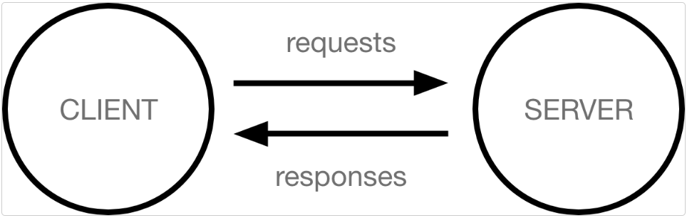
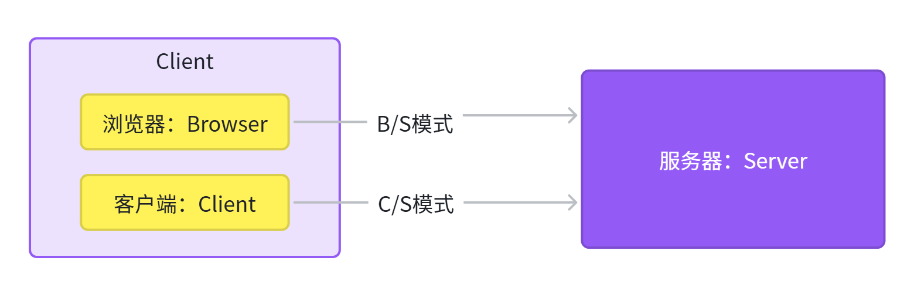
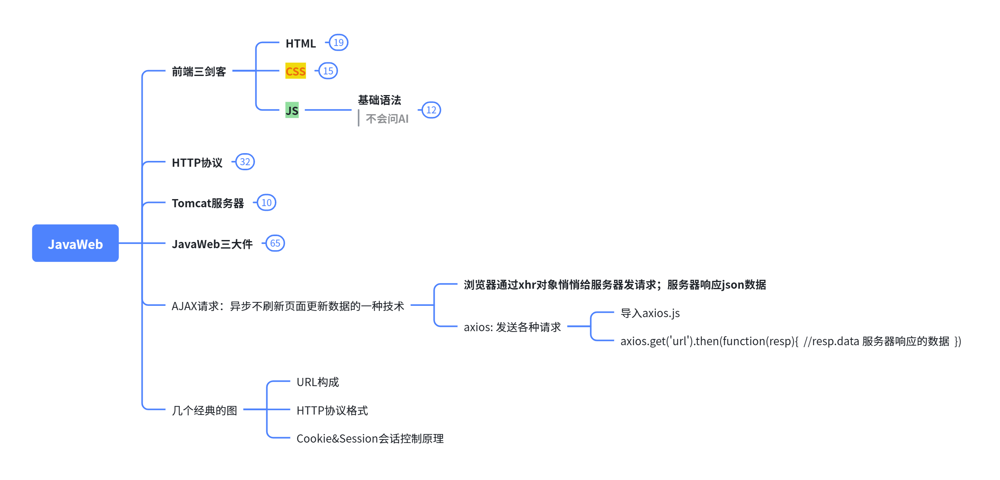
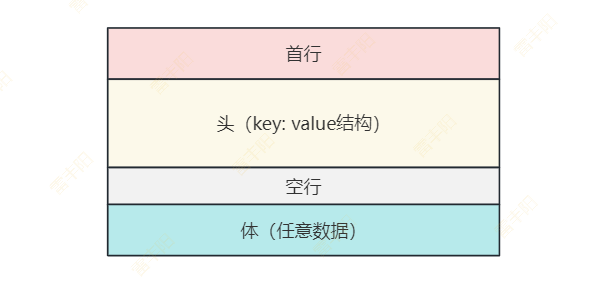

# 04. Web开发入门

官网：https://developer.mozilla.org/zh-CN/docs/Learn_web_development

w3c：https://www.w3school.com.cn/

# 基本概念

> **Web开发 **到底是在干什么！

## 客户端和服务器

连接到互联网的计算机被称作**客户端**和**服务器**。

**客户端：****入网设备**（电脑、手机、Pad等） + **安装软件**（浏览器、美团App、抖音等）

**服务器**：**服务设备**（性能高的电脑） + 存储网页、**服务程序**、数据等。

客户端和服务器来回交换数据；

客户端负责展示数据，服务器负责给客户端返回数据；

## 应用的架构

分为`B/S`和`C/S`两种

- **服务器（Server）**总是为客户端提供服务的；
  - 比如（客户端找服务器获取所有订单数据、获取当下流行音乐/视频等）
- **客户端（Client）**是用户直接接触到的软件；我们一般归纳为两大类
  - **浏览器**（**Browser**）【Firefox、Google Chrome、Microsoft Edge等】
  - **其他App**（**Client**）【电脑的**软件**、手机的**App**等】
- Java开发服务器就行
  - 客户端找服务器要什么数据就返回什么数据
  - **服务端**和**客户端**（网络IO）
    - 字符流：文本
    - 字节流：图片/音视频

**浏览器：**服务器把页面代码都泄露；

**客户端**：开发App；（客户端代码有一定安全性）

安全性保证：

- 数据安全：数据加密/解密机制；数据不泄露
- 权限安全：控制合法用户进行使用；

# 将要学习的技术

**客户端**（熟悉技术&能看懂代码）：

- **HTML**
- **CSS**
- **JavaScript**

**服务端**（了解技术&理解机制）：

- XML & HTTP
- Tomcat
- Servlet
- Filter
- Listener
- 会话控制：
  - Cookie
  - Session

# 开发工具

## VS Code

开源、免费：https://code.visualstudio.com/

## WebStorm

**付费**、和**Idea同公司产品**：https://www.jetbrains.com/webstorm/

## Trae【推荐】

字节出品、国产新星、用VSCode改的。自带**免费无限量 DeepSeek/豆包 AI**；

https://www.trae.cn/

# 总结

## HTTP报文格式

## URL构成

> web中 URL的构成

## 会话控制原理

## Ajax

1. 发送请求
2. 获取数据
3. 解析json对象

> **用进废退**；