# 4. JavaWeb

Java用来开发动态Web的一系列技术（JavaWeb）；

**数据库技术标准**：JDBC

**Servlet标准(JavaEE)**：Servlet 2.0/5/6/7  

Java Standard Eidition（Java标准版本）、Java Enterpise E（开发Web应用。Java企业级版本）

**JavaWeb的三大组件（接口）【Servlet、Filter、Listener】**

- **Servlet****：处理请求的一段服务器小程序；**
  - 继承HttpServlet；处理**请求**，给浏览器响应**数据**
  - 重写 doXxx()：doGet、doPost
  - **HttpServletRequest**：封装HTTP请求报文数据
    - req.getParameter()：获取**请求参数**（报文：首行url?、请求体）
    - req.getHeader()：获取请求头
  - **HttpServletResponse**：封装HTTP响应报文数据；
    - 响应首行：响应状态码，响应消息
      - 200：ok；成功
      - 302：重定向； 响应头 Location：指向新位置
      - 404：未找到； 路径不对，服务器处理不了
      - 500：服务器内部异常； 程序内部出错
    - resp.setHeader()：设置响应头
    - resp.getWriter().write()：给响应体写数据；
  - **转发和重定向：前后不分离，服务端渲染页面**
    - 转发：req
    - 重定向：resp
  - **JSP**：动态页面技术
    - **${}**：去域对象中取值
      - 给域中保存值； 域.setAtrribute()；
        - request，request.getSession()，request.getServletContext()
      - request域：同一次请求共享数据
      - session域：同一次会话（浏览打开到关闭）
      - application域：Tomcat从打开到关闭
    - **常用标签**：c:foreach、c:if
- **Filter：过滤器**
  - 过滤请求和响应：请求过来拦截一次，响应出去再拦截一次
  - 继承HttpFilter
    - 重写 doFilter 方法
    - chain.doFilter(req,resp)：放行
- **Listener**
- **Cookie&Session**：会话控制技术

# Servlet

> Servlet 是 Java 提供的一套用于**扩展 Web 服务器功能**、**动态生成 Web 内容**的 API（接口规范）和实现。
> 
> **Serv**er（服务器） + App**let**（小程序：Java的代码）：** 服务器小程序**； **专门处理****客户端****发来的请求**
> 
> Servlet 是Web应用的动态资源；

## 动态/静态资源

**静态资源****：**无需通过程序运行生成的资源,运行前固定的资源。例如: html、css、js、img、音频、视频文件；

**动态资源****：**需要启动一段程序（业务逻辑），**动态计算后得到的资源**。例如：**用户订单数据**、**商品秒杀库存**

> Web应用中，万物皆资源；

## Servlet 作用

> - **Servlet **运行是在 Web 服务器​（如 Tomcat, Jetty, WildFly, GlassFish）上运行的一段程序（更准确地说，是在支持 **Servlet 规范的 Servlet 容器内**）。
> - 它负责处理 **客户端**（通常是浏览器）**发来的 HTTP 请求**（`HttpServletRequest`）​​，并根据请求逻辑动态生成内容（HTML, JSON, XML 等），然后将这些内容封装在 **HTTP 响应**（`HttpServletResponse`）​ 中**返回给客户端。**
> - 它是 Java EE / Jakarta EE 平台的核心基础技术之一，也是绝大多数 **Java Web 框架**（如 Spring MVC, JSF, Struts）的底层基石。

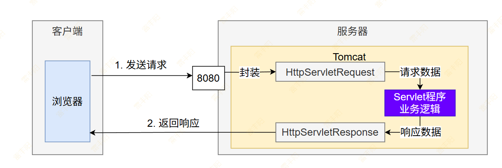

1. **浏览器发送一个请求**：Tomcat 收到把HTTP请求报文的**所有内容**（HTTP 三大部分（首行、头、体））封装成 **HttpServletRequest** 对象。方便后续从 request对象 中获取当前请求的所有内容
2. 自己写一个 Servlet **处理业务逻辑**；
3. **服务器给浏览器返回响应**：Tomcat 把返回的数据 封装给** HttpServletResponse**；服务器会把 response对象自己转为** HTTP 响应数据报文**，返回给浏览器

**请求**： **HTTP请求报文**（超文本传输协议：文本数据） ==反序列化==>  **Request 对象**

**响应：** **Response对象** ==序列化==> **HTTP响应报文**（超文本传输协议：文本数据）

HTTP报文到对象之间的转换，由Tomcat来做；

Web**中间件**（Apache Tomcat（JavaWeb）、JBoss、Apache（PHP）、Nginx）

> 所有的Web开发，无外乎就是三步：想清楚数据从哪里来，经过什么处理、到哪儿去！
> 
> 1. **接收请求：**  从请求中能获取到当时浏览器发送的所有数据
> 2. **业务处理：**  **对数据进行加工、校验、处理等... 【千人千面】**
> 3. **返回响应**：  把要交给浏览器的数据，直接返回

## 第一个Web项目

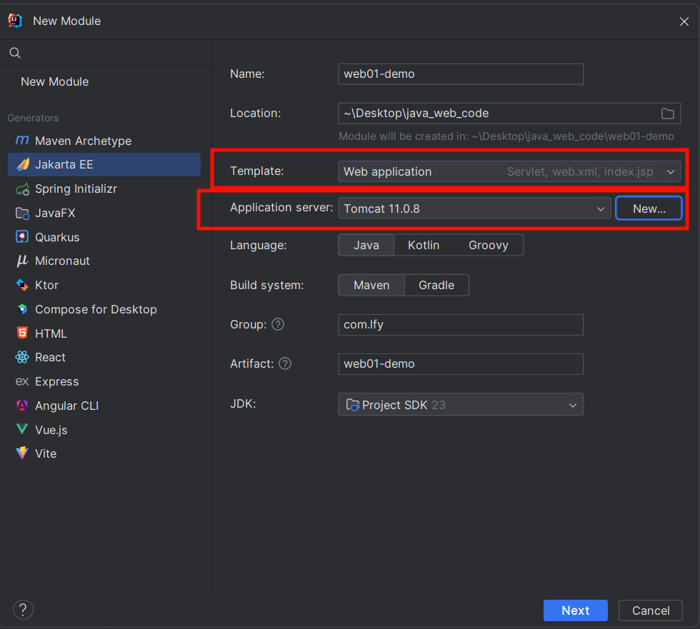

### 项目结构：

- **src**：源代码文件夹
  - **main**：主程序文件夹
    - **java**：java程序代码
    - **resources**：资源文件夹（一般保存配置文件）
    - **webapp**：web页面文件夹
      - **WEB-INF**：受保护资源文件夹；不可以直接访问
      - **index.jsp**：项目默认首页
      - **......**：可以直接访问的页面
  - **test**：测试程序文件夹
- **pom.xml**：项目依赖文件（后面会学习maven）

修改项目访问路径

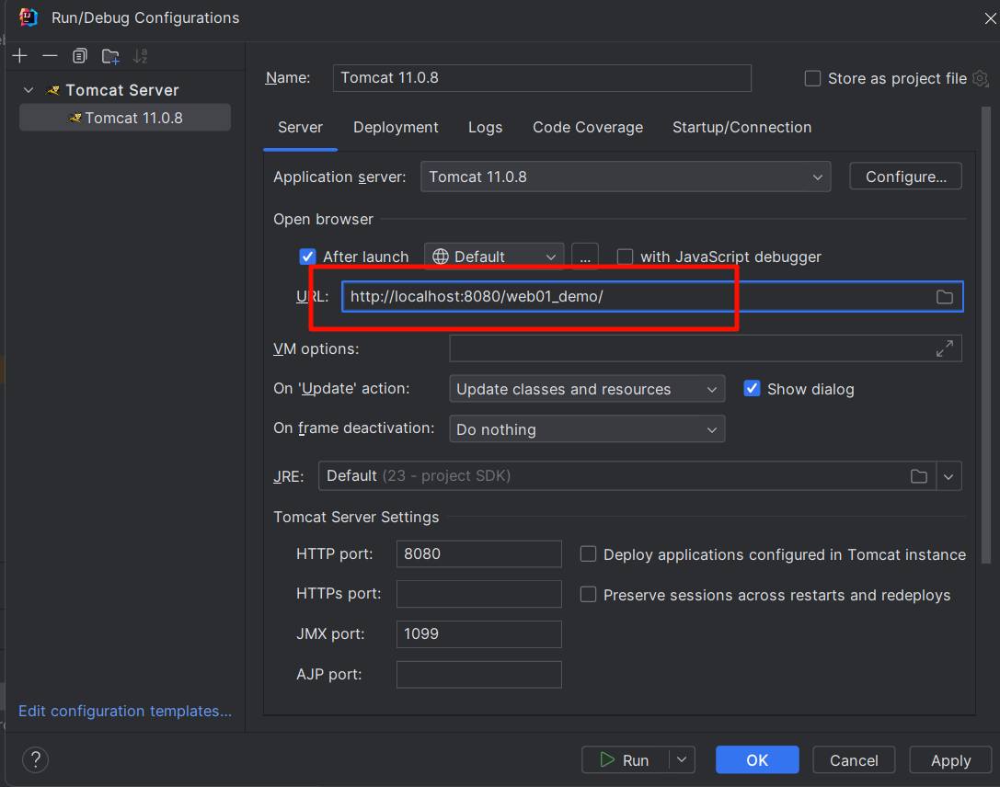

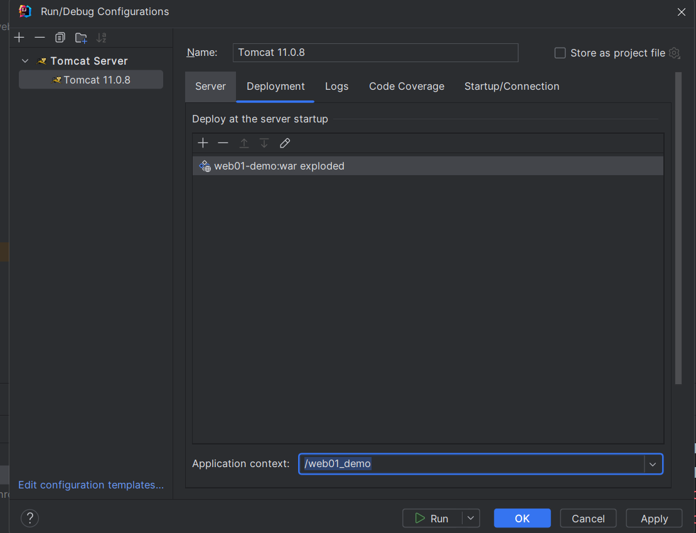

## 第一个Servlet程序

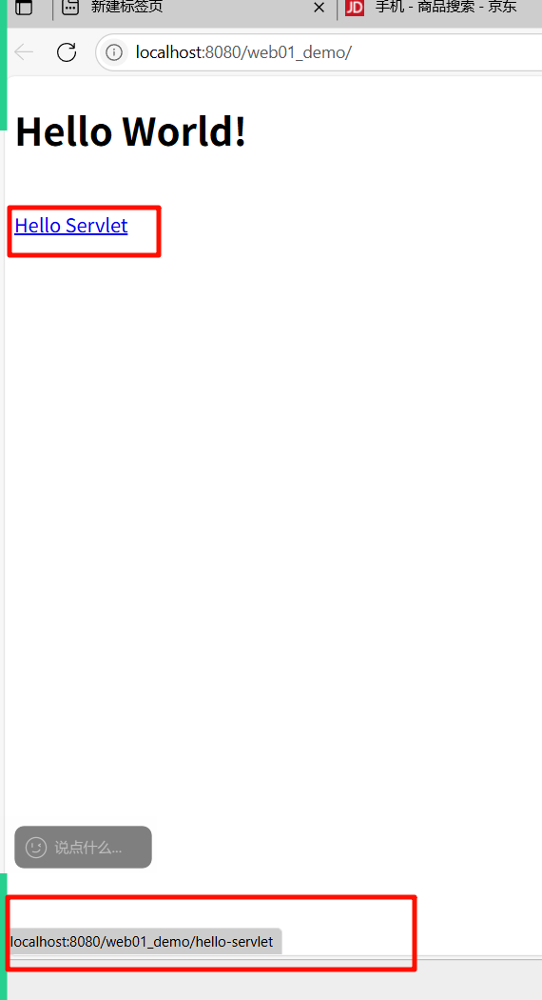

```java
package com.lfy.demo;

import java.io.*;

import jakarta.servlet.http.*;
import jakarta.servlet.annotation.*;

@WebServlet(name = "helloServlet", value = "/hello-servlet")
public class HelloServlet extends HttpServlet {
    private String message;

    public void init() {
        message = "Hello World!";
    }

    public void doGet(HttpServletRequest request, HttpServletResponse response) throws IOException {
        response.setContentType("text/html");

        // Hello
        PrintWriter out = response.getWriter();
        out.println("<html><body>");
        out.println("<h1>" + message + "</h1>");
        out.println("</body></html>");
    }

    public void destroy() {
    }
}
```

### 请求路径

> 还有很多种模糊匹配的写法，我们这里不去关注细节，因为后来是按照框架的模糊匹配约定来写项目的

注意：

1. **一个Servlet对应处理一个请求路径**：这种我们成为**路径映射**规则；当然一个Servlet也允许处理多个请求路径
2. 不同Servlet的路径不能一样。**路径全局唯一**
3. **Servlet的全类名**也要**全局唯一**

### 生命周期

> 什么叫**生命周期**：指的是一个对象从创建、到运行、到销毁的整个阶段；

- **理解Servlet生命周期**
  - **生命周期流程**：**构造器、初始化【第一次接收请求】**、运行doXxx【每次处理】、销毁【服务器停止】
  - **单例模式**：Tomcat只会给Servlet创建一个对象
  - **多线程模型**：为了让用户体验更好，**每个请求过来**，**Tomcat都会用一个线程**（有可能新开，有可能复用之前空闲线程）**去调用doXxx方法**
  - **安全问题**：由于是单例多线程，避免方法直接操作属性，产生资源竞争问题。一旦资源竞争就需要加锁，会导致性能低下

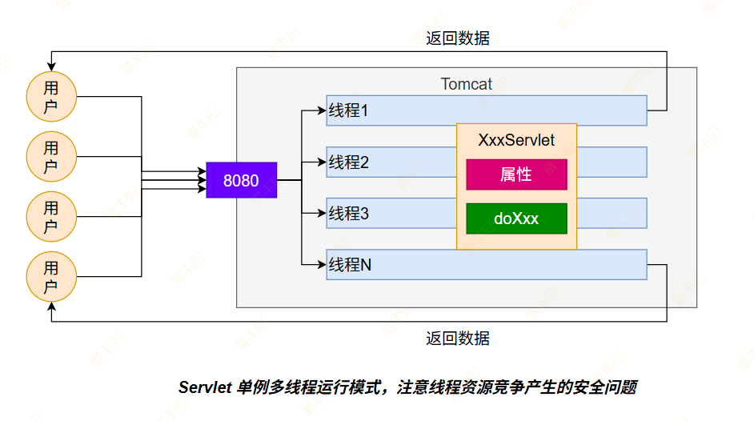

### doXxx方法

- 由于页面会发起各种 HTTP 请求方式 的请求；可以使用 doXxx 匹配对应的请求方式
- 可以在 doGet 中调用 doPost，然后在 doPost 中编写业务代码；这样就不区分请求方式；


## HttpServletRequest

> - HttpServletRequest 继承于 ServletRequest；它的实现由 Servlet 容器提供（比如Tomcat）
> - HttpServletRequest 封装了请求的所有信息，如果我们想要知道客户端发送了哪些数据，就必须从HttpServletRequest 中自行获取。

### 读取请求参数

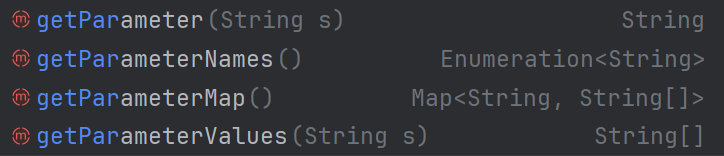

- **getParameter**： 获取某个请求参数的值；（如果有多个，返回第一个值）
- **getParameterNames**： 获取所有请求参数的名字
- **getParameterMap**：获取所有请求参数名字和值对应的Map
  - 注意：有些属性可能有多个值；比如多选框
- **getParameterValues**：获取某个参数的所有值

无论参数在查询字符串位置（url?后面）还是请求体中

### 读取请求头

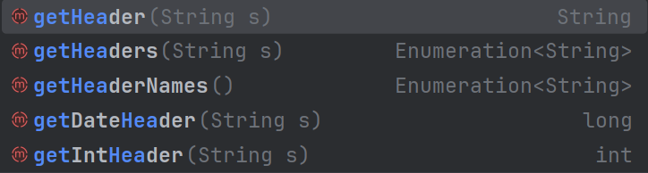

- getHeader：获取某个请求头的值，多个值则返回第一个
- getHeaders：获取某个请求头的所有值
- getHeaderNames：获取所有请求头名字
- getDateHeader：获取某个请求头的值，并解析为时间
- getIntHeader：获取某个请求头的值，并解析为整数

### 读取请求体

由于请求体的数据已经可以直接使用如下方法进行获取

- **getParameter**
- **getPart("文件项")**

所以要原始请求体暂时意义不大。但依然可以使用

- `request.getInputStream()`; 获取请求体的字节流数据，然后自己解析使用

### 文件上传注意

#### html表单

> Get请求做不了文件上传；
> 
> - 老版本的浏览器中。**URL长度有限制**；GET请求提交一堆数据都要放在url?后面；数据提交量不能过大

```xml
<form action="hello-form" method="post"  enctype="multipart/form-data">
    <input type="text" name="name"/>
    <input type="text" name="age"/>
    <!-- name=pic 指定文件项表单名字 -->
    <input type="file" name="pic">
    <ul>
        <li><input type="checkbox" name="hobby" value="篮球"/> 篮球</li>
        <li><input type="checkbox" name="hobby" value="足球"/> 足球</li>
        <li><input type="checkbox" name="hobby" value="乒乓球"/> 乒乓球</li>
    </ul>

    <button>提交</button>
</form>
```

#### 后台处理

```java
package com.lfy.demo222;

import java.io.*;
import java.util.Enumeration;

import jakarta.servlet.ServletException;
import jakarta.servlet.http.*;
import jakarta.servlet.annotation.*;

@MultipartConfig
@WebServlet(name = "helloServlet", value = {"/hello-servlet","/hello-form"})
public class HelloServlet extends HttpServlet {
    private String message;

    @Override
    public void init() {
        message = "Hello World!";
    }

    @Override
    protected void doPost(HttpServletRequest req, HttpServletResponse resp) throws ServletException, IOException {
        doGet(req, resp);

    }

    @Override
    public void doGet(HttpServletRequest request, HttpServletResponse response) throws IOException, ServletException {
        response.setContentType("text/html");


        // 获取表单文件项
        Part pic = request.getPart("pic");
        // 获取文件项字节流
        InputStream inputStream = pic.getInputStream();


        // Hello
        PrintWriter out = response.getWriter();
        out.println("<html><body>");
        out.println("<h1>" + message + "</h1>");
        out.println("</body></html>");
    }

    @Override
    public void destroy() {
    }
}
```

### 注意乱码问题

> 所有的乱码，都是由于字符集不一致导致的。我们要调整字符集
> 
> 1. 页面： <meta charset="UTF-8">
> 2. 项目： file-encoding： UTF-8
> 3. 配置文件：  xxx.xml 、 xxx.properties
> 4. ......

## HttpServletResponse

- response.getWriter()： 给页面写数据
- response.setHeader()： 设置响应头
- `response.sendRedirect()`：重定向
  - **原理**：本次给浏览器响应 302 状态码 + 响应头 **Location **字段指向新位置
  - **效果**：浏览器会再次发送请求去访问 Location 指定的位置

## 转发与重定向

> 规定页面的跳转规则；

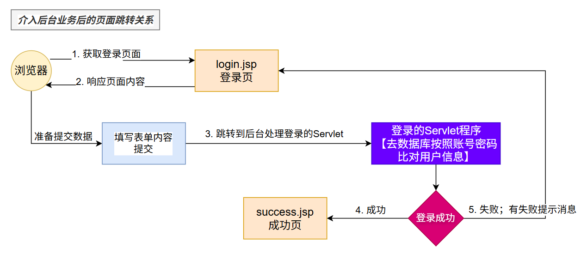

两种不同的跳转方式

1. **转发：**最后的url没有变，但是来到新页面； 服务器内部行为； 客户端只发了一次请求，

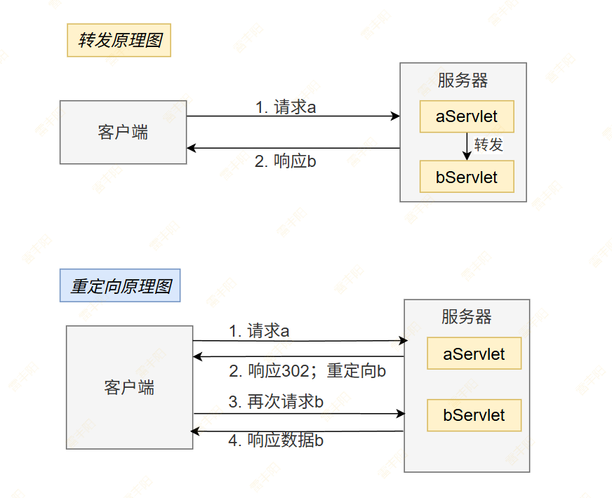

> **重定向**：不害怕**页面刷新**。页面刷新**不会导致重复提交**
> 
> **转发**：浏览器url不变，还是原来的请求，刷新会**导致重复提交**

## 路径问题

> 路径分为：
> 
> 1. **相对路径：****浏览器计算路径，参照当前路径（就是地址栏的当前url地址）**
>   1. **./**：代表在当前资源同路径下
>   2. **../**：代表在当前资源父路径
>   3. **/**：在web中，代表根路径（**注意：根路径在客户端和服务端是不一样的**）
> 2. **绝对路径**
>   1. 完全写全地址：https://www.baidu.com
> 3. 最佳实践：
>   1. 浏览器全部使用 `/项目路径` 这种写法；
>   2. 结合 base 标签指定基准url； 如：`<base href="/web03">`

**特别注意：**

- **/：在客户端解析**，以**服务器**路径为起始； http://localhost:8080/； 特别注意加上项目名
- **/：在服务端解析**，以当前**项目路径**为起始； http://localhost:8080/web01

# JSP(了解)

https://jakarta.ee/zh/specifications/tags/2.0/

https://jakarta.ee/specifications/tags/2.0/jakarta-tags-spec-2.0.html#multiple-tag-libraries

```xml
<dependency>
    <groupId>jakarta.servlet.jsp</groupId>
    <artifactId>jakarta.servlet.jsp-api</artifactId>
    <version>3.1.0</version>
    <scope>provided</scope>
</dependency>
<dependency>
    <groupId>jakarta.servlet.jsp.jstl</groupId>
    <artifactId>jakarta.servlet.jsp.jstl-api</artifactId>
    <version>3.0.2</version>
</dependency>
<dependency>
    <groupId>org.glassfish.web</groupId>
    <artifactId>jakarta.servlet.jsp.jstl</artifactId>
    <version>3.0.1</version>
</dependency>
```

## 页面动态取值

**${}**： 动态取出值

## 页面数据遍历/判断

`<%@ ``taglib ``prefix="c" uri="``http://java.sun.com/jsp/jstl/core``" %>` 放在第二行，重启项目

### c:if

```html
<c:if test="testCondition"
        [var="varName"] [scope="{page|request|session|application}"]>
    body content
</c:if>
```

### c:forEach

```sql
<c:forEach  [var="varName"] items="collection"
            [varStatus="varStatusName"]
            [begin="begin"] [end="end"] [step="step"]>
    body content
</c:forEach>
```

## 小练习

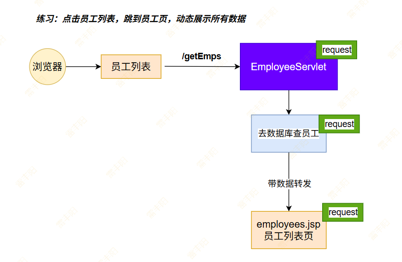

参考代码:

1. EmployeeServlet 

```java
package com.lfy.web01demo.servlet;

import com.lfy.web01demo.bean.Employee;
import jakarta.servlet.ServletException;
import jakarta.servlet.annotation.WebServlet;
import jakarta.servlet.http.HttpServlet;
import jakarta.servlet.http.HttpServletRequest;
import jakarta.servlet.http.HttpServletResponse;

import java.io.IOException;
import java.util.Arrays;
import java.util.List;


//@WebServlet(name = "employeeServlet",value = "/getEmps")
@WebServlet("/getEmps") //简写
public class EmployeeServlet extends HttpServlet {

    @Override
    protected void doGet(HttpServletRequest req, HttpServletResponse resp) throws ServletException, IOException {
        doPost(req, resp);
    }

    @Override
    protected void doPost(HttpServletRequest req, HttpServletResponse resp) throws ServletException, IOException {
        System.out.println("正在查询员工数据....");
        //1、查询所有员工数据；
        Employee emp1 = new Employee(1, "张三", 23, "男", "zhangsan@qq.com");
        Employee emp2 = new Employee(2, "李四", 13, "女", "lisi@qq.com");
        Employee emp3 =  new Employee(3,"王五",25,"男","wangwu@qq.com");
        Employee emp4 =  new Employee(4,"赵六",16,"女","zhaoliu@qq.com");


        //2、封装List
        List<Employee> list = Arrays.asList(emp1, emp2, emp3, emp4);


        // 给request 共享数据
        //3、把数据共享到当前 request域 中； request域就是一个【map】，可以保存k=v数据
        req.setAttribute("message","查询成功!!!哈哈");
        req.setAttribute("emps",list);

        //3、转发去页面； 可以取到之前req保存的内容
        req.getRequestDispatcher("/pages/view/employees.jsp").forward(req, resp);
    }
}
```

1. employees.jsp

```javascript
<%--
  Created by IntelliJ IDEA.
  User: 53409
  Date: 2025/7/1
  Time: 21:23
  To change this template use File | Settings | File Templates.

  JS： JavaScript
  JSP：Java Server Pages（Java服务器页面）
--%>
<%@ page contentType="text/html;charset=UTF-8" language="java" %>

<%-- jsp 支持的标签库 --%>
<%@ taglib prefix="c" uri="http://java.sun.com/jsp/jstl/core" %>
<html>
<head>
    <title>员工列表</title>
</head>
<body>
<h1>员工列表</h1>

<%-- 取出请求域中共享的内容 --%>
<h5>${message}</h5>
<table>
    <tr>
        <th>#</th>
        <th>姓名</th>
        <th>年龄</th>
        <th>是否成年</th>
        <th>性别</th>
        <th>邮箱</th>
    </tr>

<%--    动态展示所有员工：  pom.xml 是maven项目的工程管理配置文件--%>

<%--   c库: 动态标签库 --%>
<%--
items： 指定需要遍历的集合
var： 每次变量出来的对象，变量名叫什么

for(Employee emp:emps){
}

  --%>
    <c:forEach items="${emps}" var="emp">
        <tr>
            <td>${emp.id}</td>
            <td>${emp.empName}</td>
            <td>${emp.age}</td>
<%--            <td>${emp.age>18?"成年":"未成年"}</td>--%>


            <c:if test="${emp.age>18}">
                <td>成年</td>
            </c:if>
            <c:if test="${emp.age<=18}">
                <td>未成年</td>
            </c:if>

            <td>${emp.gender}</td>
            <td>${emp.email}</td>
        </tr>
    </c:forEach>
</table>

<%--${emps}--%>
</body>
</html>
```

1. 访问：http://localhost:8080/web01_demo/getEmps   查看效果

## 页面间数据共享

**放数据**：四大对象.setAttribute(key,value)

**取数据**：

- Java代码：四大对象.getAttribute(key)
- JSP页面： ${key}

> 访问不同页面，都能拿到共享的数据！
> 
> **四个域**：都是临时保存数据，方便跨页面，跨用户，跨时间周期共享；
> 
> **以上只讨论**：服务器控制页面跳转（前后不分离【服务端渲染】）
> 
> 如果是**前后分离开发模式**：页面需要什么数据，客户端发送请求，我们只需要查到数据给人家客户端；

四大内置对象，（**四大域**【共享数据的域】）

### request域共享数据

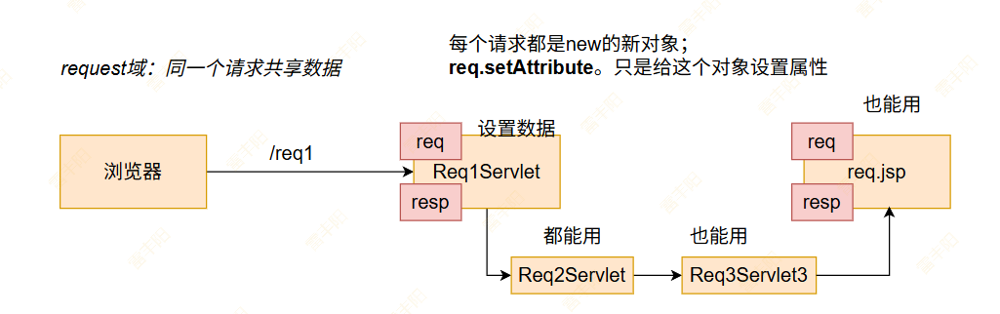

### session域共享数据

> 同一次会话，共享数据

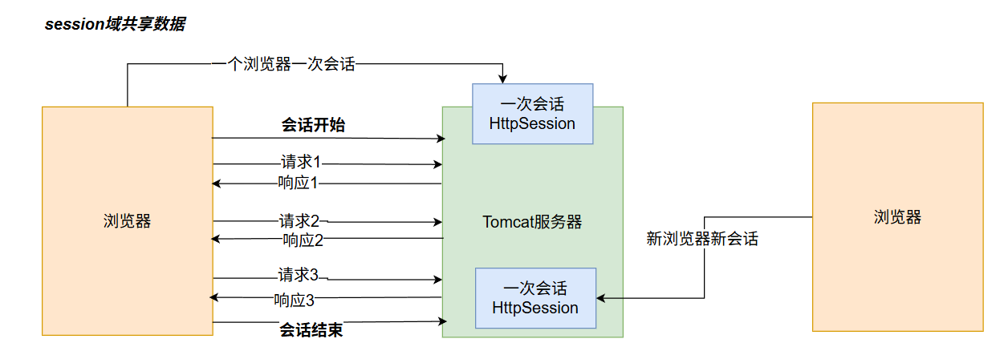

### application域共享数据

> 同一个应用共享；（只要Tomcat不停止或者卸载这个应用，数据就一直在）

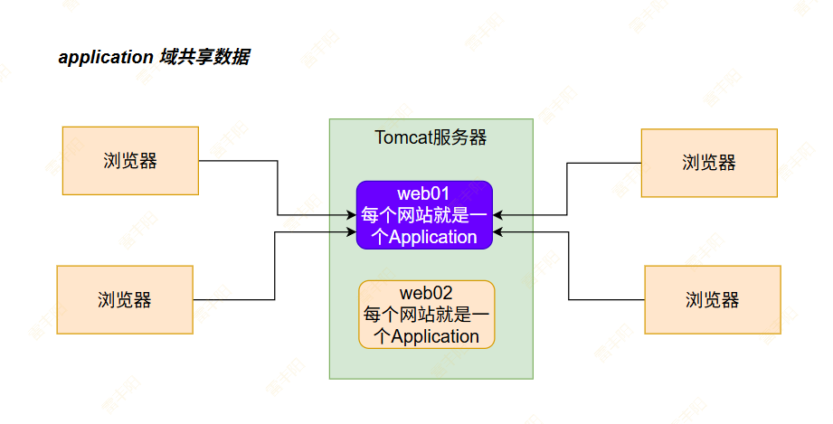

## JSP也是Servlet

> 查看Tomcat启动的工作目录，找到JSP编译后的.class 文件；

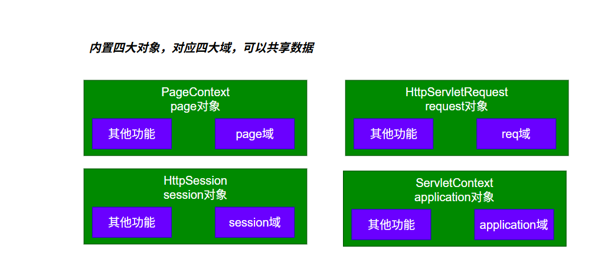

# Filter：过滤器

## 工作机制

> **Filter，即过滤器**，是JAVAEE技术规范之一，作为目标资源的请求进行过滤的一套技术规范，是Java Web项目中`最为实用的技术之一`。
> 
> - **Filter接口**定义了过滤器的开发规范，所有的过滤器都要实现该接口；
> - **Filter的工作位置**：
>   - **请求进来**，在目标方法执行之前进行过滤； **此时可以校验/修改请求数据等**
>   - **响应出去**，在抵达页面之前进行过滤；**此时可以校验/修改响应数据等**
> - Filter是GOF中**责任链模式**的典型案例；
> - **Filter的常用应用**包括但不限于：
>   - **登录权限检查**、解决网站乱码、过滤敏感字符、日志记录、性能分析... ...；

> **生活中的例子**： 公司前台，停车场安保，地铁验票闸机... ...

- 公司**前台对来访人员进行审核**，如果是游客则拒绝进入公司，如果是客户则放行 。客户离开时提醒客户不要遗忘物品；
- **停车场保安**对来访车辆进行控制，如果没有车位拒绝进入。如果有车位，发放停车卡并放行，车辆离开时收取请车费；
- **地铁验票闸机**在人员进入之前检查票，没票拒绝进入，有票验票后放行，人员离开时同样验票；

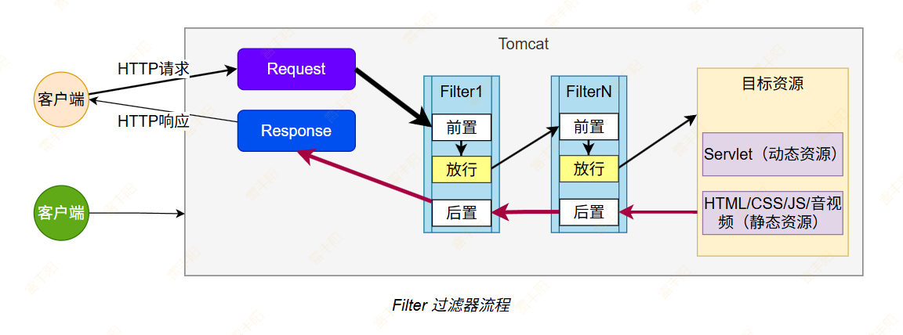

> 前置方法：用来做请求的过滤、校验、修改
> 
> 后置方法：用来做响应的过滤、校验、修改
> 
> 可以都用，也可以只用部分。

## 测试代码

> 编写一个请求性能统计的Filter；

1. 实现 Filter 接口
2. 使用 doFilter 放行目标方法

## 三大组件

Servlet、Filter、Listener 都是 **单例多线程模式**：

```java
//运行一次： 对象创建
Req1Servlet servlet = new Req1Servlet();

//每次请求进来 都要一个线程： 方法调用
new Thread(()->{servlet.doGet(req, resp)}).start();
new Thread(()->{servlet.doGet(req, resp)}).start();
new Thread(()->{servlet.doGet(req, resp)}).start();
new Thread(()->{servlet.doGet(req, resp)}).start();
```

# Listener

> **回调机制**：监听web应用活动；发生这些**事件**，就会调用我们提前**准备的方法**
> 
> **8大监听器**：
> 
> 1. **生命周期监听器**：（从创建到销毁过程）
>   - **ServletContext****Listener****：监听ServletContext（Application）整个应用的启动、销毁**
>     - contextInitialized：应用启动回调
>     - contextDestroyed：应用销毁回调
>   - **HttpSession****Listener****：监听Session对象的创建和销毁**
>     - sessionCreated：session对象创建；代表一个新浏览器开始和服务器产生会话
>     - sessionDestroyed：session对象销毁；代表一个会话结束（30min分钟过期、invalidate()）
>   - **ServletRequest****Listener****：监听request对象的创建和销毁**
>     - requestInitialized：request对象初始化； 代表浏览器发了一个请求进来
>     - requestDestroyed：request对象销毁； 响应结束，req就销毁
>   - 不监听Page对象
> 2. **域对象属性增减监听器**：域对象中只要设置了属性，修改属性，删除了属性就感知到了
>   - **ServletRequest****AttributeListener****：监听req对象中 set/removeAttribute 变化**
>     - attributeAdded()：属性增加； 说明有人给 req.setAtrribute()；
>     - attributeRemoved()：属性删除； 说明有人给 req.removeAtrribute()；
>     - attributeReplaced()：属性替换；说明有人 req.setAtrribute() 更改了属性
>   - **HttpSession****AttributeListener****：监听 session对象 set/removeAttribute 变化**
>     - **attributeAdded**()：属性增加； 说明有人给 session.setAtrribute()；
>     - **attributeRemoved**()：属性删除； 说明有人给 session.removeAtrribute()；
>     - **attributeReplaced**()：属性替换；说明有人 session.setAtrribute() 更改了属性
>   - **ServletContext****AttributeListener****：监听 application对象  set/removeAttribute 变化**
>     - attributeAdded()：属性增加； 说明有人给 appliaction.setAtrribute()；
>     - attributeRemoved()：属性删除； 说明有人给 appliaction.removeAtrribute()；
>     - attributeReplaced()：属性替换；说明有人 appliaction.setAtrribute() 更改了属性
> 3. 针对session又扩展两个：
>   - **HttpSessionActivationListener****：session激活监听器；**
>     - **sessionDidActivate：活化**：Tomcat重启后，把硬盘中的之前存的session数据重新加载进来。
>     - **sessionWillPassivate：钝化**：Tomcat运行时给session中保存了一堆数据；现在关机，啥都不管数据会丢失，Tomcat允许吧这些数据用序列化机制，写到硬盘；
>   - **HttpSessionBindingListener****： 监听session中一个特定对象的绑定和解绑**
>     - valueBound： 指定对象绑定到session中
>     - valueUnbound：指定对象从session中删除

## 监听器列表

## 触发时机

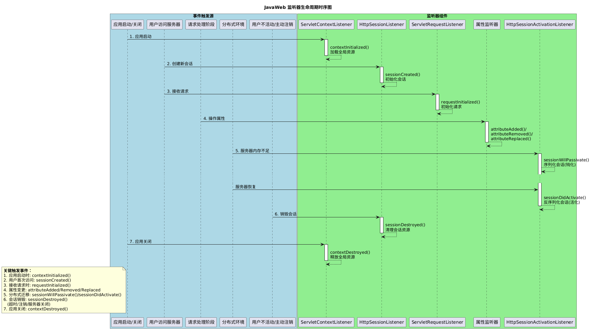

# 会话控制(Cookie、Session)

## Cookie

> 浏览器可以自己本地给很多地方保存数据；
> 
> - localStorage（本地存储）、sessionStorage（会话存储）
> - 浏览器内部也有小数据库写websql；IndexedDB
> - 特殊位置 cookie：和URL没关系；
> - **普通的数据 url? 后面，要么在请求体中，而cookie中存的k=v数据，每次访问服务器会放在****请求头中**

> **【Cookie】 **是 **浏览器**端**保存数据**的一种技术；会员卡机制
> 
> **特点：**
> 
> - **浏览器保存的Cookie，会在每次访问****指定网站地址****的时候都会自动带上cookie中的所有数据**
> - **限制**：
>   - 单个 Cookie ≤ 4KB；只允许k=v字符串
>   - 每域名 Cookie 数量 ≤ 20

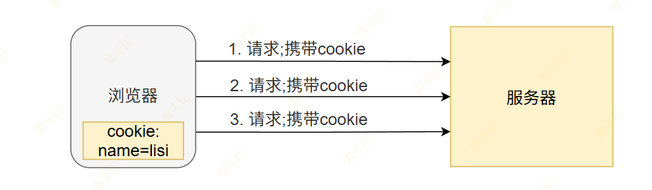

### Cookie操作

#### JavaScript

> **可以浏览器端直接使用JS代码操作cookie**

```javascript
// 1、基本用法； [;属性]代表可选； value不直接支持中文，需要进行编码
document.cookie = "name=value[;属性]";

// 2、完整设置; 详见Cookie组成
document.cookie = [
  "username=JohnDoe",       // 必填：名称和值
  "expires=" + expiryDate,  // 过期时间 (GMT格式)
  "path=/",                 // 作用路径
  "domain=.example.com",    // 作用域名
  "Secure",                 // 仅HTTPS传输
  "SameSite=Lax"            // 跨站策略
].join("; ");

// 3、读取所有cookie
const allCookies = document.cookie; // 返回 "name1=value1; name2=value2; ..."
// 4、读取指定cookie； 需要自己用 ; 分割字符串，然后获取
function getCookie(name) {
  const cookies = document.cookie.split(';');
  for (const cookie of cookies) {
    const [cookieName, cookieValue] = cookie.trim().split('=');
    if (cookieName === name) {
      return decodeURIComponent(cookieValue);
    }
  }
  return null;
}

// 使用示例
const theme = getCookie('theme'); // 返回 'dark'

// 5、删除 Cookie (设过期时间为过去)
document.cookie = "temp_data=; expires=Thu, 01 Jan 1970 00:00:00 GMT";
```

#### Servlet操作

> **也可以服务器命令浏览器保存Cookie**
> 
> 国外法律：私自给浏览器中存数据，需要征得同意才可以

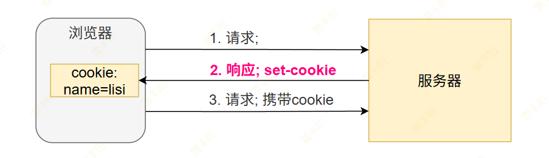

1. **创建Cookie**

```java
protected void doGet(HttpServletRequest request, HttpServletResponse response) 
        throws ServletException, IOException {
    
    // 1. 创建 Cookie（名称 + 值）
    Cookie userCookie = new Cookie("username", "john_doe");
    
    // 2. 设置 Cookie 属性（可选）
    userCookie.setMaxAge(60 * 60 * 24 * 7); // 过期时间：7天（单位：秒）
    userCookie.setPath("/");                // 作用路径
    userCookie.setDomain(".example.com");  // 作用域名
    userCookie.setSecure(true);            // 仅通过 HTTPS 传输
    userCookie.setHttpOnly(true);          // 禁止 JavaScript 访问
    
    // 3. 添加到响应头（Set-Cookie）
    response.addCookie(userCookie);
    
    // 4. 发送多个 Cookie
    Cookie langCookie = new Cookie("language", "zh_CN");
    response.addCookie(langCookie);
}
```

1. **读取Cookie**

```typescript
protected void doGet(HttpServletRequest request, HttpServletResponse response) 
        throws ServletException, IOException {
    
    // 1. 获取所有 Cookie
    Cookie[] cookies = request.getCookies();
    
    // 2. 处理结果（可能为 null）
    if (cookies != null) {
        for (Cookie cookie : cookies) {
            String name = cookie.getName();
            String value = cookie.getValue();
            
            // 查找特定 Cookie
            if ("username".equals(name)) {
                String username = value;
                // ... 业务逻辑
            }
        }
    }
}
```

1. **更新Cookie**

```java
// 原理：同名 Cookie 覆盖
Cookie updatedCookie = new Cookie("username", "new_john");
updatedCookie.setPath("/");
updatedCookie.setMaxAge(60 * 60 * 24); // 新过期时间
response.addCookie(updatedCookie);
```

1. **删除Cookie**

```java
// 原理：设置立即过期
Cookie deleteCookie = new Cookie("username", "");
deleteCookie.setPath("/");             // 必须与原始路径一致
deleteCookie.setMaxAge(0);             // 过期（单位：秒）
response.addCookie(deleteCookie);
```

### Cookie组成

一个 Cookie 不仅仅包含名字和值，创建时还可以设置一些重要的属性（通过 `Set-Cookie` 响应头指定）：

- **Name & Value**：​ 数据的键值对。
- **Domain**：​ 指定哪些域名可以接收此 Cookie。默认为设置 Cookie 的域名（不包括子域名）。如果设置了 `.``example.com`，则所有 `*.``example.com` 的子域名都可以访问。
- **Path**：​ 指定哪些 URL 路径可以接收此 Cookie（默认为 `/`，即该域名下的所有路径都可以访问）。
- **Expires / Max-Age**：​ 指定有效期。
  - `Expires` 是具体的过期日期/时间
  - `Max-Age` 是从现在开始的秒数。
  - 如果都不设置，就是会话 Cookie（浏览器关闭就会失效）。
- **Secure**：​ 标记为 `true` 时，​只通过 HTTPS 安全加密连接发送该 Cookie。防止数据在传输中被窃听。
- **HttpOnly**：​ 标记为 `true` 时，Cookie 不能被客户端的 JavaScript 脚本访问​（通过 `document.cookie`）。这是重要的安全措施，有助于**减轻跨站脚本攻击的风险**（阻止攻击者窃取 Cookie）。
- **SameSite**：​ 一个重要的安全属性，**控制 Cookie 是否随跨站点请求一起发送**。主要防止跨站请求伪造攻击。
  - **Strict**: **最严格**，浏览器只会在访问同一站点时发送 Cookie（从 A 站点的链接跳转到 B 站点时不会发送）。
  - **Lax**: (现代浏览器默认) 允许**一部分安全的跨站请求携带 Cookie**，如顶级导航（点击链接跳转）。但 `` 或 `<script>` 等标签的跨站请求不携带。
  - **None**: 允许跨站请求携带 Cookie（通常需要同时设置 `Secure`）。

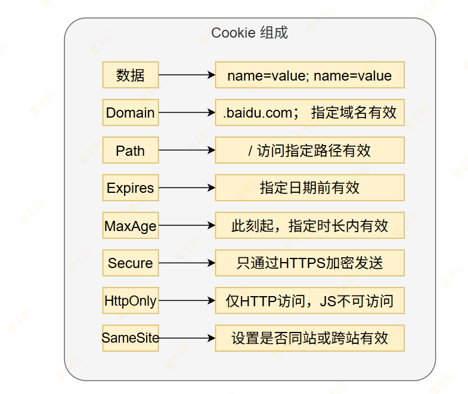

## Session

> **Session**是服务器端保存数据的一种技术； 同一次会话保存的数据，所有页面都能用到

### session获取

```javascript
// 获取现有 Session 或创建新 Session
HttpSession session = request.getSession(); 

// 仅获取现有 Session (若无则返回 null)
HttpSession session = request.getSession(false); 
```

### session存取

```java
// 存储对象 (实现 Serializable 接口)
User user = new User("john"); 
session.setAttribute("currentUser", user);

// 获取对象
User currentUser = (User) session.getAttribute("currentUser");

// 移除属性
session.removeAttribute("currentUser");

// 遍历所有属性
Enumeration<String> attrs = session.getAttributeNames();
while(attrs.hasMoreElements()) {
    String name = attrs.nextElement();
    Object value = session.getAttribute(name);
}
```

### session生命周期

```javascript
// 强制使 Session 失效（用户登出）
session.invalidate();

// 设置超时时间（单位：秒）
session.setMaxInactiveInterval(30 * 60); // 30分钟

// 获取超时时间
int timeout = session.getMaxInactiveInterval(); 
```

### session元信息

```java
// 获取 Session ID
String sessionId = session.getId();

// 创建时间戳
long created = session.getCreationTime(); 

// 最后访问时间
long lastAccessed = session.getLastAccessedTime(); 

// 是否新创建的 Session
boolean isNew = session.isNew(); 
```

## 会话控制原理

> **服务器如何知道每个浏览器客户端是代表哪个用户操作；利用 Cookie + Session**

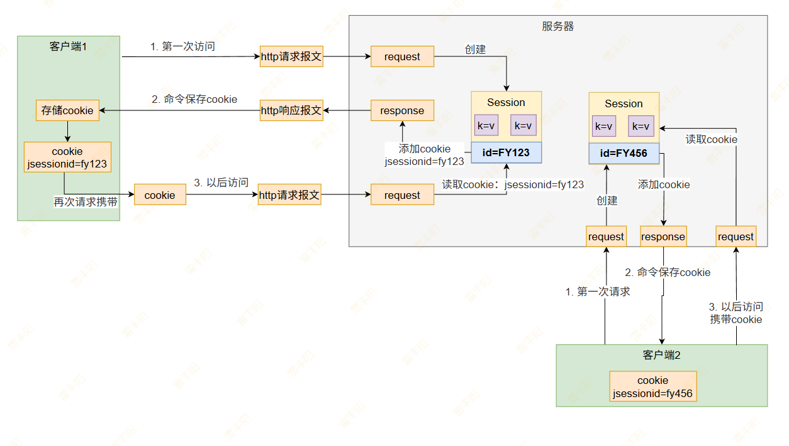

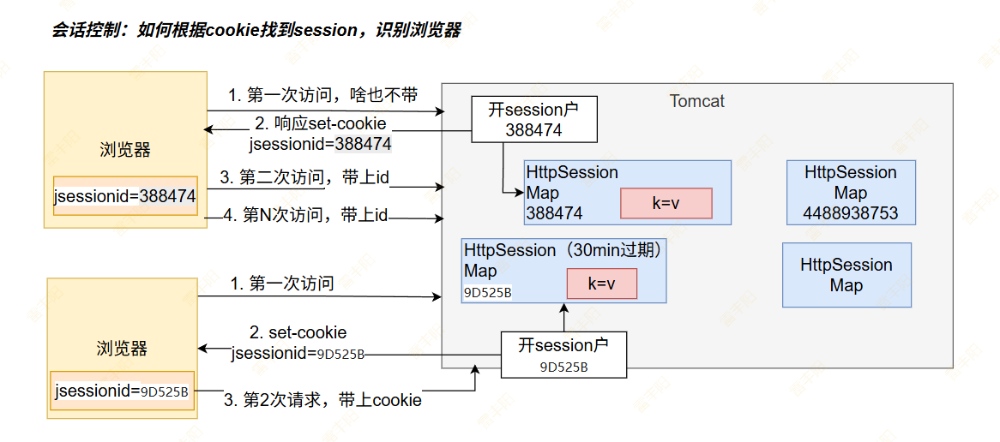

# AJAX

- **AJAX **=** Asynchronous JavaScript and XML**（异步的 JavaScript 和 **XML**）；一种异步局部数据刷新技术； 使用**异步的JS技术，推荐服务器返回xml/json/纯数据**，
- AJAX 最大的优点是在不重新加载整个页面的情况下，可以与服务器交换数据并更新部分网页内容；
- 使用 XMLHttpRequest 对象 可以实现 AJAX功能

## 原生方式

```javascript
  function loadAjaxData(){
    var xmlhttp=new XMLHttpRequest();
      // 设置回调函数处理响应结果
    xmlhttp.onreadystatechange=function(){
      if (xmlhttp.readyState==4 && xmlhttp.status==200)
      {
        document.getElementById("myDiv").innerHTML=xmlhttp.responseText;
      }
    }
      // 设置请求方式和请求的资源路径
    xmlhttp.open("GET","/try/ajax/ajax_info.txt",true);
      // 发送请求
    xmlhttp.send();
  }
```

## 使用Axios

官网：https://www.axios-http.cn/

使用：`<script src="``https://unpkg.com/axios/dist/axios.min.js``"></script>`