# 1. Linux

Linux命令大全：https://www.linuxcool.com/

# 文件目录

## 文件

> Linux 系统中一切皆文件。

## 目录

### 层级结构

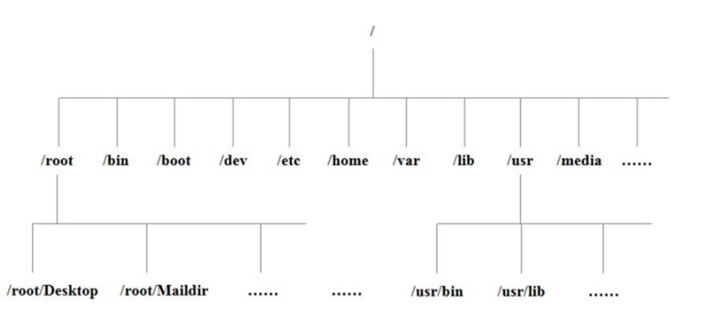

### 目录说明

*📊 在线表格（无数据）*

### 特别注意

1. **符号链接****（类似windows中的快捷方式）与合并趋势​**：
  - `/bin`, `/sbin`, `/lib`在新版发行版（如 Ubuntu, Fedora）中通常是 `/usr/bin`, `/usr/sbin`, `/usr/lib`的符号链接，目的在于简化结构（称为 *bin 合并*）。
  - `/sbin`-> `/usr/sbin`
  - `/lib`-> `/usr/lib`
  - `/lib64`-> `/usr/lib64`(若适用)
  - 使用 `ls -l /`可查看是否存在符号链接关系。
2. **虚拟文件系统**​：
  - `/proc`, `/sys`不占用**实际磁盘空间**，是内核提供的接口，用于访问系统信息（内存、进程、硬件等）。
3. **权限重要性**​：
  - `/`, `/bin`, `/sbin`, `/etc`, `/boot`, `/lib`等目录通常只允许 `root`用户修改，普通用户仅读取/执行权限。
  - `/home`, `/tmp`, `/var/tmp`用户通常有自己目录的写权限。

# VI/VIM编辑器（重点）

> **VI**是Unix操作系统和类Unix操作系统中**最通用的文本编辑器**。window的记事本 
> 
> **VIM**编辑器是从VI发展出来的一个性能更强大的**文本编辑器**。可以主动的以**字体颜色辨别语法**的正确性，方便程序设计。VIM与VI编辑器完全兼容。

## 准备数据

```shell
# 拷贝/etc/profile 数据到/root 目录下
cp /etc/profile /root
cd /root/
```

## 一般模式

> **以 vi 打开一个档案**就直接进入一般模式了（这是默认的模式）。在这个模式中， 你可以使用『上下左右』按键来移动光标，你可以使用『删除字符』或『删除整行』来处理档案内容， 也可以使用『复制、粘贴』来处理你的文件数据。

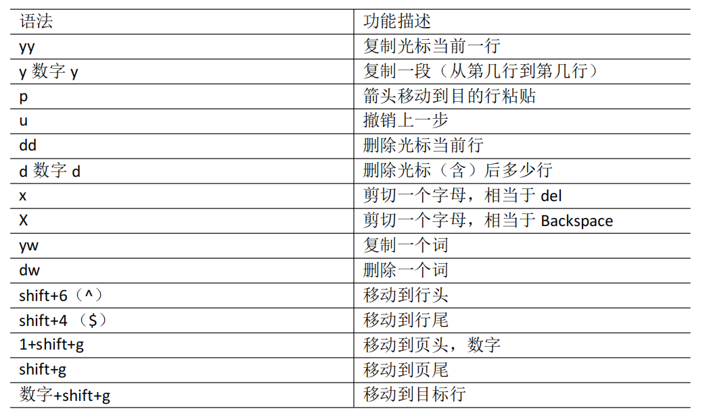

## **编辑模式**

> - 在**一般模式**中可以进行删除、复制、粘贴等的动作，但是却无法编辑文件内容的！要等到你**按下**『**i, I, o, O, a, A**』等任何一个字母之后才会**进入编辑模式**。 
> - 注意了！通常在Linux中，按下这些按键时，在画面的左下方会出现『INSERT或REPLACE』的字样，此时才可以进行编辑。而如果要回到一般模式时， 则必须要按下 『Esc』这个按键即可退出编辑模式。

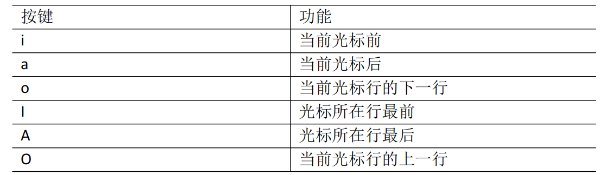

## 指令模式

> **注意**：因为 : 是和 ; 在同一个键位的，所以需要 **shift + :键**  才是冒号

> 在**一般模式**当中，**输入『 : / ?』**任何一个字母，就可以将光标移动到最底下那一行并接受指令
> 
> 在这个模式当中， 可以提供你『搜寻资料』的动作，而读取、存盘、大量取代字符、离开 vi 、显示行号等动作是在此模式中达成的！

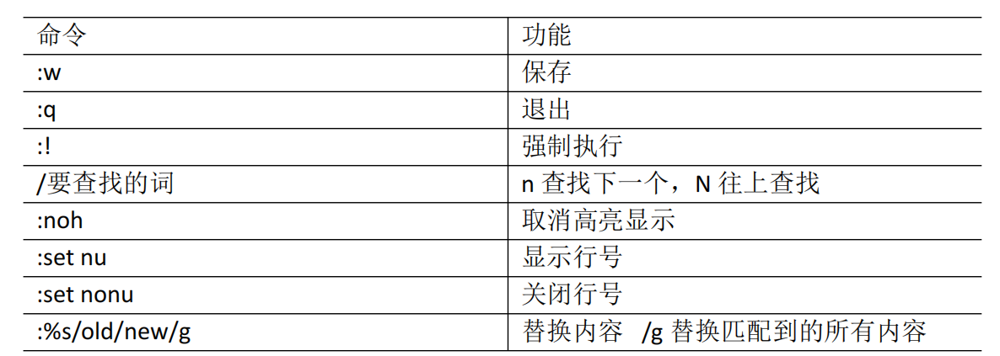

强制保存退出：`:wq!`

## 小结

### 模式转换

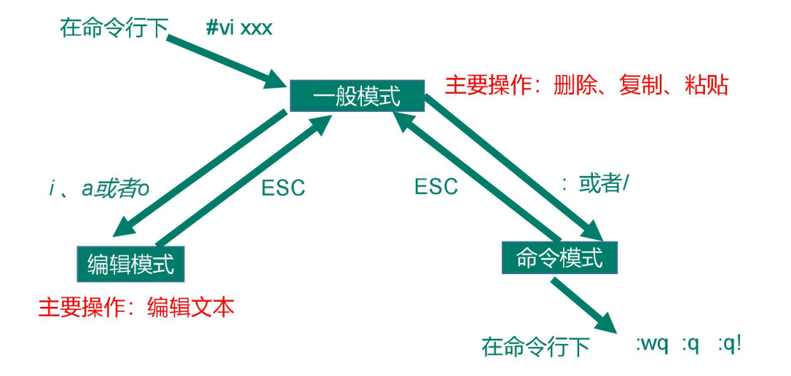

### 推荐参考

https://vim.rtorr.com/lang/zh_cn

https://gitee.com/gnsyxiang/vim-cheatsheet

### 键盘图

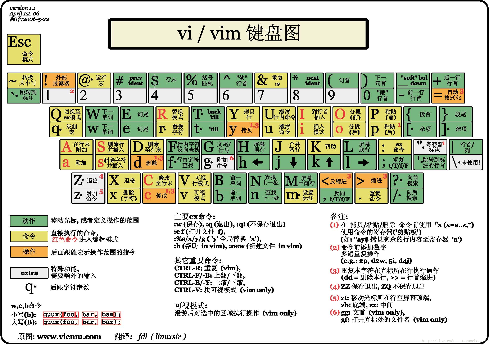

# 网络命令

```shell
# 1. 网络配置
ifconfig
ip addr

# 2. 连通性测试
ping baidu.com

# 3. 网卡地址修改
vim /etc/sysconfig/network-scripts/ifcfg-ens33

# 4. 重启网卡
service network restart

# 5. 主机名
hostname

# 6. 修改主机名
vi /etc/hostname
# 或者
hostnamectl set-hostname 新的主机名

# 切换用户，不指定就还是当前用户
su

# 7. 集群情况下，指定每一个主机名与对应ip地址；
vim /etc/hosts

# 内容如下
192.168.100.100 node01
192.168.100.101 node02
192.168.100.102 node03
192.168.100.103 node04
192.168.100.104 node05
192.168.100.105 node06

# 8. 下载文件
wget https://www.baidu.com

# 9. 访问url内容
curl https://www.baidu.com
```

> 网卡设置

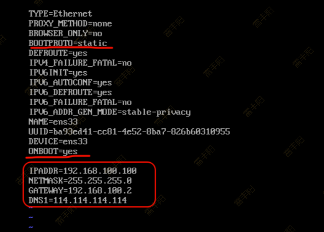

# 系统管理

## 进程和服务

计算机中，一个正在执行的程序或命令，被叫做**“进程”（process）**。 

启动之后**一直存在、常驻内存的进程**，一般被称作**“服务”（service）**。

## 服务管理

### centos6 - service/chkconfig

```shell
# 命令语法
service 服务名 start | stop |· restart | status

# 查看服务 /etc/init.d/服务名

# 命令实操
service network status
service network stop
service network start
service network restart


```

服务自启动配置：

```shell
chkconfig （功能描述：查看所有服务器自启配置） 
chkconfig 服务名 off （功能描述：关掉指定服务的自动启动） 
chkconfig 服务名 on （功能描述：开启指定服务的自动启动） 
chkconfig 服务名 --list （功能描述：查看服务开机启动状态）

# 开机自启
chkconfig network on
# 关闭开机自启
chkconfig network off
```

### centos7 - systemctl

基本语法：`systemctl start | stop | restart | status  服务名`

查看服务的方法：`/usr/lib/systemd/system`

实际常用：

```shell
# 1. 查看防火墙状态
systemctl status firewalld

# 2. 停止防火墙
systemctl stop firewalld

# 3. 启动防火墙服务
systemctl start firewalld

# 4. 重启防火墙服务
systemctl restart firewalld

# 5. 查看服务状态列表
systemctl list-unit-files

# 6. 开机启动
systemctl enable firewalld

# 7. 禁止 开机启动
systemctl disable firewalld
```

## 关机重启

```python
#（1）将数据由内存同步到硬盘中 
sync 
#（2）重启 
reboot
#（3）停机（不断电） 
halt 
#（4）计算机将在 1 分钟后关机，并且会显示在登录用户的当前屏幕中 
shutdown -h 1 'This server will shutdown after 1 mins'
#（5）立马关机（等同于 poweroff） 
shutdown -h now 
#（6）系统立马重启（等同于 reboot） 
shutdown -r now
```

# 常用命令（重点）

> Shell 可以看作是一个命令解释器，为我们提供了交互式的文本控制台界面。我们可以通过终端控制台来输入命令，由 shell 进行解释并最终交给内核执行。 本章就将分类介绍常用的基本 shell 命令。

## 帮助命令

### man

**基础语法**：`man [命令或配置文件]` （功能描述：获得帮助信息）

```shell
man ls
```

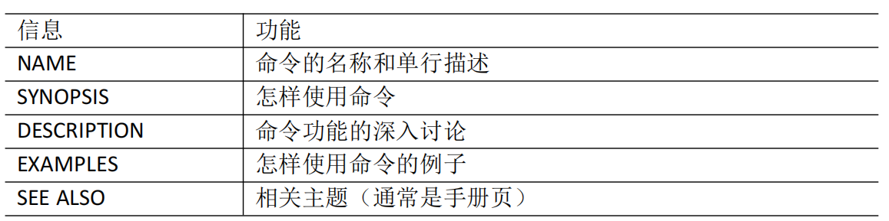

### help

一部分基础功能的系统命令是直接内嵌在 shell 中的，系统加载启动之后会随着 shell 一起加载，常驻系统内存中。这部分命令被称为**“内置（built-in）命令”**；相应的其它命令被称为**“外部命令”**

**基本语法**：`help 命令`（功能描述：获得 shell 内置命令的帮助信息）

如：`help cd`

### --help

如果知道具体命令，但不知道如何使用；用 `--help`

如： `ls --help`

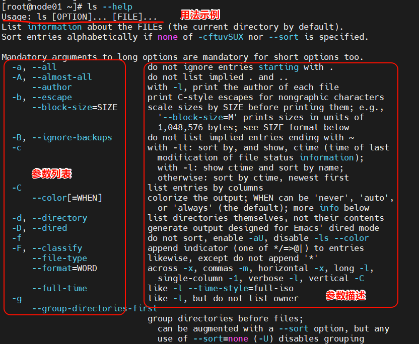

### 常用快捷键

`ctrl + c`： 停止进程

`ctrl + l`：清屏，等同于 clear；彻底清屏是：reset

`上下键`：查找执行过的命令

`tab 键`：命令补全或提示

## 文件目录类

### **pwd **

> **显示当前工作目录的绝对路径；pwd**: **print working directory** 打印工作目录

**1）基本语法**

pwd         （功能描述：显示当前工作目录的绝对路径）

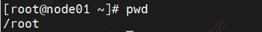

### **ls **

> **列出目录的内容；ls:list** 列出目录内容

**1）基本语法**

ls [选项] [目录或是文件]

**2）选项说明**

**3）显示说明**

每行列出的信息依次是： 

文件类型与权限 | 链接数 | 文件属主 | 文件属组 | 文件大小用byte 来表示 | 建立或最近修改的时间 | 名字

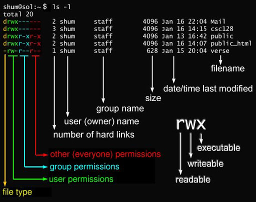

文件的第一个属性用 **d** 表示。**d** 在 Linux 中代表该文件是一个目录文件。

在 Linux 中第一个字符代表这个文件是目录、文件或链接文件等等。

- 当为 **d** 则是目录
- 当为 **-** 则是文件；
- 若是 **l** 则表示为链接文档(link file)；
- 若是 **b** 则表示为装置文件里面的可供储存的接口设备(可随机存取装置)；block（块设备）
- 若是 **c** 则表示为装置文件里面的串行端口设备，例如键盘、鼠标(一次性读取装置)。client（终端）

接下来的字符中，以三个为一组，且均为 **rwx** 的三个参数的组合。

其中， **r** 代表可读(read)、 **w** 代表可写(write)、 **x** 代表可执行(execute)。 

要注意的是，这三个权限的位置不会改变，如果没有权限，就会出现减号 **-** 而已。

### **cd **

> **切换目录；**cd: Change Directory 切换路径

**1）基本语法**

cd  [参数]

**2）参数说明**

### **mkdir **

> **创建一个新的目录；**mkdir:Make directory 建立目录

**1）基本语法**

mkdir [选项] 要创建的目录

**2）选项说明**

### ** rmdir **

> **删除一个空的目录；**rmdir:Remove directory 移除目录

**1）基本语法**

rmdir 要删除的空目录

> 文件夹必须为null

 

### **touch **

> **创建空文件**

**1）基本语法**

touch 文件名称

### **cp **

> **复制文件或目录; cp：copy**

**1）基本语法**

cp [选项] source dest         （功能描述：复制source文件到dest）

**2）选项说明**

**3）参数说明**

**4）经验技巧**

强制覆盖不提示的方法：\cp

### **rm **

> **删除文件或目录**

**1）基本语法**

rm [选项] deleteFile        功能描述：递归删除目录中所有内容）

**2）选项说明**

**3）经验技巧**

**一招干死Linux**：` rm -rf /`

### **mv **

> **移动文件与目录或重命名； mv： move**

**1）基本语法**

（1）mv oldNameFile newNameFile        （功能描述：重命名）

（2）mv /temp/movefile /targetFolder      （功能描述：移动文件）

### **cat **

> **查看文件内容； **从第一行开始显示。

**1）基本语法**

cat  [选项] 要查看的文件

**2）选项说明**

**3）经验技巧**

1. **一般查看比较小的文件**，一屏幕能显示全的。
2. tac：倒着看；最后一行变第一行

### **more**

> **文件内容分屏查看器**

more 指令是一个基于 VI 编辑器的文本过滤器，它以全屏幕的方式按页显示文本文件 的内容。more 指令中内置了若干快捷键，详见操作说明。

**1）基本语法**

more 要查看的文件

**2）操作说明**

 

### **less **

> **分屏显示文件内容**

less 指令用来分屏查看文件内容，它的功能与more 指令类似，但是比more 指令更加 强大，支持各种显示终端。less 指令在显示文件内容时，**并不是一次将整个文件加载之后才显示**，而是根据显示需要加载内容，对于显示大型文件具有较高的效率。

**1）基本语法**

less 要查看的文件

**2）操作说明**

### **echo**

> echo 输出内容到控制台

**1）基本语法**

echo [选项] [输出内容]

选项：-e： 支持反斜线控制的字符转换

 

### **head **

> **显示文件头部内容**

head 用于显示文件的开头部分内容，默认情况下 head 指令显示文件的前 10 行内容。

**1）基本语法**

head 文件       （功能描述：查看文件头10行内容）

head -n 5 文件   （功能描述：查看文件头5行内容，5可以是任意行数）

**2）选项说明**

### **tail **

> **输出文件尾部内容；**
> 
> tail 用于输出文件中尾部的内容，默认情况下tail 指令显示文件的后 10 行内容。

**1）** **基本语法**

（1）tail  文件            （功能描述：查看文件尾部10行内容）

（2）tail  -n  5 文件   （功能描述：查看文件尾部5行内容，5可以是任意行数）

（3）tail  -f 文件     （功能描述：实时追踪该文档的所有更新）

**2）** **选项说明**

### **> 输出重定向和** **>> 追加**

**1）基本语法**

>  > 会覆盖以前内容； >> 追加

（1）ls -l  > 文件     （功能描述：列表的内容写入文件 a.txt 中（**覆盖写**））

（2）ls -al  >> 文件       （功能描述：列表的内容**追加**到文件 aa.txt 的末尾）

（3）cat 文件 1 > 文件 2      （功能描述：将文件 1 的内容覆盖到文件 2）

（4）echo “内容” >> 文件

### **ln**

> **软链接：**也称为符号链接，类似于windows 里的快捷方式，有自己的数据块，主要存放了链接其他文件的路径。

**1）基本语法**

`ln -s [原文件或目录] [软链接名] `         （功能描述：给原文件创建一个软链接）

**2）经验技巧**

删除软链接： rm -rf 软链接名，而不是 rm -rf 软链接名/

**如果使用rm -rf 软链接名/  删除，会把软链接对应的真实目录下内容删掉**

查询：通过 ll 就可以查看，列表属性第 1 位是 l ，尾部会有位置指向。

### **history **

> **查看已经执行过历史命令**

**1）基本语法**

history                                               （功能描述：查看已经执行过历史命令）

## 时间日期类

### 基本用法

**1）基本语法**

date [OPTION]... [+FORMAT]

**2）选项说明**

**3）参数说明**

### **date 显示当前时间**

**1）基本语法**

（1）date          （功能描述：显示当前时间）

（2）date +%Y    （功能描述：显示当前年份）

（3）date +%m      （功能描述：显示当前月份）

（4）date +%d    （功能描述：显示当前是哪一天）

（5）date "+%Y-%m-%d %H:%M:%S"     （功能描述：显示年月日时分秒）

```shell
# 显示当前时间信息
date
# 显示当前时间年月日
date +%Y%m%d
# 显示当前时间年月日时分秒
date "+%Y-%m-%d %H:%M:%S"
```

### **date 显示非当前时间**

**1）基本语法**

（1）date -d ' 1 days ago'                        （功能描述：显示前一天时间）

（2）date -d '-1 days ago'                       （功能描述：显示明天时间）

### **date 设置系统时间**

**1）基本语法**

date -s 字符串时间

```shell
# 设置系统当前时间
date -s "2017-06-19 20:52:18"
```

### **cal 查看日历**

**1）基本语法**

cal [选项]                        （功能描述：不加选项，显示本月日历）

**2）选项说明**

```shell
# 查看当前月的日历
cal
# 查看 2025 年的日历
cal 2025
```

### ntpdate - 时间同步

> 有个麻烦操作：每天进系统得同步下时间
> 
> 同步网络上的时钟

`ntpdate ``ntp1.aliyun.com`

## **用户管理命令**

### **useradd 添加新用户**

**1）基本语法**

useradd 用户名           （功能描述：添加新用户）

useradd -g 组名 用户名 （功能描述：添加新用户到某个组）

`useradd zhangsan`：默认组名就是用户名

`useradd lisi -g dev`

### **passwd 设置用户密码**

**1）基本语法**

passwd 用户名   （功能描述：设置用户密码）

`passwd  zhangsan`

### **id 查看用户是否存在**

**1）基本语法**

id 用户名

`id zhangsan`

### **cat  /etc/passwd 查看创建了哪些用户**

### **su 切换用户**

`su: swith user` 切换用户

**1）基本语法**

su 用户名称 （功能描述：切换用户，只能获得用户的执行权限，不能获得环境变量）

su - 用户名称    （功能描述：切换到用户并获得该用户的环境变量及执行权限）

### **userdel 删除用户**

**1）基本语法**

（1）userdel  用户名  （功能描述：删除用户但保存用户主目录）

（2）userdel -r 用户名   （功能描述：用户和用户主目录，都删除）

**2）选项说明**

`userdel zhangsan`

### **who 查看登录用户信息**

**1）基本语法**

（1）whoami                 （功能描述：显示自身用户名称）

（2）who am i               （功能描述：显示登录用户的用户名以及登陆时间）

### **usermod 修改用户**

**1）基本语法**

usermod -g 用户组 用户名

**2）选项说明**

zhubajie 改到 root 组中

`usermod -g root zhubajie`

## 用户组管理命令

> **每个用户**都有一个**用户组**，系统可以对一个用户组中的所有用户进行集中管理。不同 Linux 系统对用户组的规定有所不同，如Linux下的用户属于与它同名的用户组，这个用户组在创建用户时同时创建。
> 
> 用户组的管理涉及用户组的添加、删除和修改。组的增加、删除和修改实际上就是对 /etc/group文件的更新。

**用户 **-> **组**： 1用户 对应 1个组； **1对1**

**组 **-> **用户**： 1个组 可能有 N个用户; **1对N**

### **groupadd 新增组**

**1）基本语法**

groupadd 组名

### **groupdel 删除组**

**1）基本语法**

groupdel 组名

### **groupmod 修改组**

**1）基本语法**

groupmod -n 新组名 老组名

**2）选项说明**

### **cat  /etc/group 查看创建了哪些组**

> 万物皆文件； **/etc/group 记录了所有的组名**

**一个组**：**文件夹**；

**组内用户**：**文件**

一个组内的所有人，基本上拥有相同权限

**一个用户**只能有一个**主组**，但是可以有**很多附属组**

## 文件权限类

### 文件属性

> Linux系统是一种典型的**多用户系统**，不同的用户处于不同的地位，**拥有不同的权限**。 为了保护系统的安全性，Linux系统对不同的用户访问同一文件（包括目录文件）的权限做 了不同的规定。在Linux中我们可以使用ll或者ls -l命令来显示一个文件的属性以及文件所属 的用户和组。

#### **从左到右的** **10 个字符表示：**


> 从左至右用 **0-9** 这些数字来表示。
> 
> 第 **0** 位确定文件类型
> 
> 第 **1-3** 位确定**属主（该文件的所有者）拥有该文件**的权限。**（主人）**
> 
> 第 **4-6 **位确定**属组**（所有者的同组用户）拥有该文件的权限**（主人的家人）**
> 
> 第 **7-9** 位确定**其他用户拥有该文件的权限**。（剩下其他人）
> 
> 第 **1、4、7** 位表示读权限，如果用 **r** 字符表示，则有读权限，如果用 **-** 字符表示，则没有读权限；
> 
> 第 **2、5、8** 位表示写权限，如果用 **w** 字符表示，则有写权限，如果用 **-** 字符表示没有写权限；
> 
> 第 **3、6、9** 位表示可执行权限，如果用 **x** 字符表示，则有执行权限，如果用 **-** 字符表示，则没有执行权限。

回顾：


#### **rwx 作用文件和目录的不同解释**

**（1）作用到文件**：

**[r]**代表可读(read): 可以**读取内容，查看内容**

**[w]**代表可写(write): 可以**修改内容**，但是**不代表可以删除该文件**，删除一个文件的前 提条件是**对该文件所在的目录有写权限**，才能删除该文件.

**[x]**代表可执行(execute):可以被系统执行

**（2）作用到目录**：

**[r]**代表可读(read): 可以**读取**，**ls查看目录里面的文件列表**

**[w]**代表可写(write): 可以**修改**， 目录内**创建**+**删除**+**重命名**目录

**[x]**代表可执行(execute): 可以进入该目录

**读**、**写**、**执行（特殊的读写操作）**

### **chmod 改变权限**

**1）基本语法**

change modify


**第一种**：字母方式变更权限：`chmod  [{ugoa}{+-=}{rwx}] 文件或目录 `

- u:所有者(user)   g:所有组(group)     o:其他人(other)    
- a:所有人(u 、g 、o 的总和)
- 如果我们需要将文件权限设置为 **-****rwx****r-x****r--** ，可以使用 `chmod u=rwx,g=rx,o=r 文件名` 来设定:
- `chmod a=rwx`:所有人可读可写可执行

**第二种**：数字方式变更权限：`chmod  [mode=421]  [文件或目录]`

- **r=4** **w=2** **x=1**
- 那如果要将权限变成 *-****rwx******r-x******r--*** 呢？那么权限的分数就成为 [4+2+1][4+0+1][4+0+0]=754。
- `chmod 777` = `chmod a=rwx`
- `chmod 755`：
  - 属主：具有rwx
  - 所在组：具有r-x
  - 其他人：具有r-x

**2）几种写法**

（1）修改文件使其所**属主用户具有执行权限**：`chmod u+x houge.txt`

（2）修改文件使其所**属组用户具有执行权限**：`chmod g+x houge.txt`

（3）修改文件所**属主用户无执行权限,并使其他用户具有执行权限**：`chmod u-x,o+x houge.txt`

（4）采用数字的方式，设置文件所有者、所属组、其他用户都具有可读可写可执行权 限。

`chmod 777 houge.txt`

（5）修改整个文件夹里面的所有文件的所有者、所属组、其他用户都具有可读可写可 执行权限。

`chmod -R 777 xiyou/`

### **chown 改变所有者**

**1）基本语法**

chown [选项] [最终用户] [文件或目录]    （功能描述：改变文件或者目录的所有者）

**2）选项说明**

改变文件所有者：`chown zhangsan houge.txt`

递归改变文件所有者和所有组：

- `chown -R zhangsan:zhangsan xiyou/`

### 对比 chmod & chown

在 Linux 中我们通常使用以下两个命令来修改文件或目录的所属用户与权限：

- chown (change owner) ： 修改所属用户与组。
- chmod (change mode) ： 修改用户的权限。

下图中通过 chown 来授权用户，通过 chmod 为用户设置可以开门的权限。


### **chgrp 改变所属组**

**1）基本语法**

chgrp [最终用户组] [文件或目录]       （功能描述：改变文件或者目录的所属组）

`chgrp root houge.txt`

 

**没有权限的两种办法**：

1. **让管理员给权限**；
2. **sudo**：使用超级管理员权限执行（**不一定好使**）
  1. root用户在 /etc/sudoers 里面配置
  2. 默认在 **root **组的人可以 sudo
  3. 默认在 **wheel **附属组的人可以 sudo

## 搜索查找类

### **find 查找文件或者目录**

**find 指令将从指定目录向下递归地遍历其各个子目录，将满足条件的文件显示在终端。**

**1）基本语法**

find [搜索范围] [选项]

**2）选项说明**

**3）案例实操**

（1）按文件名：根据名称查找/目录下的filename.txt文件。`find / -name "*.txt"`

（2）按拥有者：查找/opt目录下，用户名称为-user的文件：`find /opt -user zhangsan`

（3）按文件大小：在/home目录下查找大于200m的文件（+n 大于 -n小于 n等于）

`find /home -size +204800`

### **locate 快速定位文件路径**

locate 指令利用**事先建立的系统中所有文件名称及路径的locate 数据库实现快速定位给 定的文件**。Locate 指令无需遍历整个文件系统，**查询速度较快**。为了保证查询结果的准确 度，**管理员必须定期更新 locate 时刻**。

**1）基本语法**

locate 搜索文件

**2）经验技巧**

由于 locate 指令基于数据库进行查询，所以第一次运行前，必须使用 updatedb 指令创 建 locate 数据库。

```shell
# 每次找东西之前，
# 更新location数据库，或者用定时任务更新
updatedb
locate tmp
```

### **grep 过滤查找及“****|****”管道符**

> 管道符，“ |” ，表示将前一个命令的处理结果输出传递给后面的命令处理

**1）基本语法**

grep 选项 查找内容 源文件

**2）选项说明**

**3）案例实操**

（1）查找某文件在第几行：`ls | grep -n test`

### whereis

> whereis 命令：定位某个命令真实路径位置

## 压缩解压类

### **gzip/gunzip 压缩**

**1）基本语法**

`gzip 文件  `** ** （功能描述：压缩文件，只能将文件压缩为*.gz 文件）

`gunzip 文件.gz `      （功能描述：解压缩文件命令）

**2）经验技巧**

（1）**只能压缩文件不能压缩目录**

（2）**不保留原来的文件**

（3）**同时多个文件会产生多个压缩包**

**3）案例实操**

（1）gzip压缩： `gzip houge.txt`

（2）gunzip解压缩文件：`gunzip houge.txt.gz`

### **zip/unzip 压缩**

**1）基本语法**

zip  [选项] XXX.zip  将要压缩的内容        （功能描述：压缩文件和目录的命令）

unzip [选项] XXX.zip                             （功能描述：解压缩文件）

**2）选项说明**

| unzip 选项 | 功能 |
| --- | --- |
| -d<目录> | 指定解压后文件的存放目录 |

**3）**经验技巧

zip 压缩命令在windows/linux都通用，可以压缩目录且保留源文件

**4）**案例实操

（1）压缩 houge.txt 和bailongma.txt ，压缩后的名称为mypackage.zip：

`zip mypackage.zip houge.txt bailongma.txt`

（2）解压 mypackage.zip：`unzip mypackage.zip`

（3）解压mypackage.zip到指定目录-d：

- `unzip mypackage.zip ``-d`` /opt`

### **tar**** 打包**

**1）基本语法**

tar  [选项]  XXX.tar.gz  将要打包进去的内容      （功能描述： 打包目录，压缩后的文件格式.tar.gz）

**2）选项说明**

**3）案例实操**

（1）**压缩**多个文件：`tar -``zc``vf houma.tar.gz houge.txt bailongma.txt`

（2）**压缩**目录：`tar -``zc``vf xiyou.tar.gz xiyou/`

（3）解压到当前目录：`tar -``zx``vf houma.tar.gz`

（4）解压到指定目录：`tar -``zx``vf xiyou.tar.gz ``-C`` /opt`

## **磁盘查看和分区类**

### **du 查看文件和目录占用的磁盘空间**

**du: disk usage** 磁盘占用情况

**1）基本语法**

du   目录/文件 （功能描述：显示目录下每个子目录的磁盘使用情况）

**2）选项说明**

**3）案例实操**

（1）查看当前用户主目录占用的磁盘空间大小：`du -sh`

> **文件的实际大小** 和 **文件占用磁盘的大小**不一样

### **df 查看磁盘空间使用情况**

df: disk free 空余磁盘

**1）基本语法**

df 选项 （功能描述：列出文件系统的整体磁盘使用量，检查文件系统的磁盘空间占 用情况）

**2）选项说明**

**3）案例实操**

（1）查看磁盘使用情况：`df -h`

1000 =》 1024

40000000

### **lsblk 查看设备挂载情况**

**1）基本语法**

lsblk                （功能描述：查看设备挂载情况）

**block**：一块**硬盘**，称为一个 **块设备**

**2）选项说明**

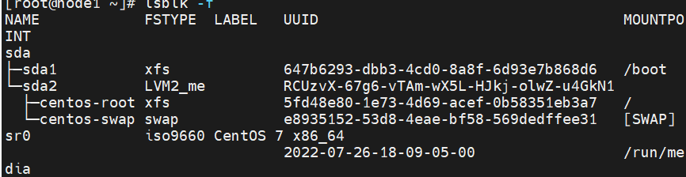

sda：一块硬盘； sdb、sdc；

### **mount/umount 挂载/卸载**

对于Linux用户来讲，**不论有几个分区**，分别分给哪一个目录使用，它总归就是一个根 目录、一个独立且唯一的文件结构。

Linux中**每个分区**都是用来组成整个**文件系统的一部分**，它在用一种叫做“挂载”的处理  方法，它整个文件系统中包含了一整套的文件和目录，并将**一个分区**和**一个目录**联系起来， 要载入的那个分区将使它的存储空间在这个目录下获得。

（一个**磁盘分区[1-N区]**关联一个**文件夹**【挂载】）

**1）挂载前准备（必须要有光盘或者已经连接镜像文件）**

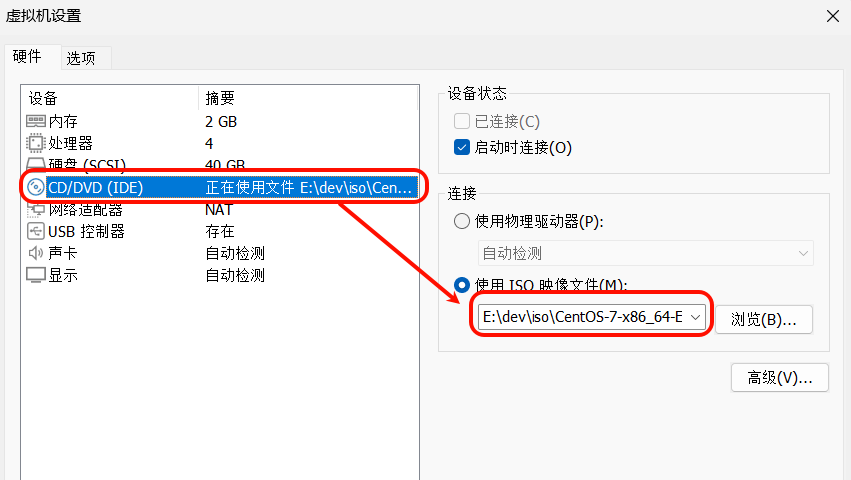

**2）基本语法**

`mount ``[-t vfstype] [-o options] device dir`       （功能描述：挂载设备）

`umount ``设备文件名或挂载点  `          （功能描述：卸载设备）

**3）参数说明**

**4）案例实操**

（1）挂载光盘镜像文件

> 如果 查看 **/dev/cdrom** ，发现，他不是文件夹；代表一个块设备
> 
> 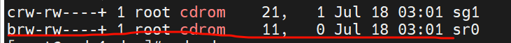
> 
> 把这个设备 挂载 到一个 文件夹上，才能进文件夹读取内容

```shell
mkdir /mnt/cdrom/                        #建立挂载点
mount -t iso9660 /dev/cdrom /mnt/cdrom/  # 设备/dev/cdrom 挂载到 挂载点 ：/mnt/cdrom 中
ll /mnt/cdrom/
```

（2）卸载光盘镜像文件

` umount /mnt/cdrom`

> 挂载机制

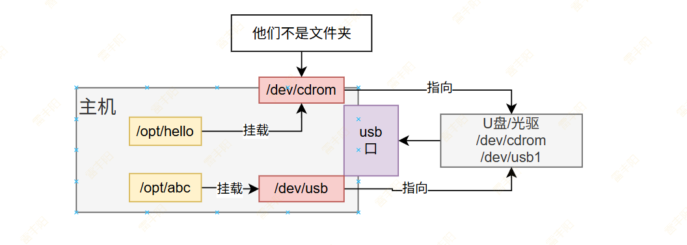

挂载仅档次有效

**5）设置开机自动挂载**

添加红框中内容，保存退出。

```shell
vi /etc/fstab
# file system table
```

 

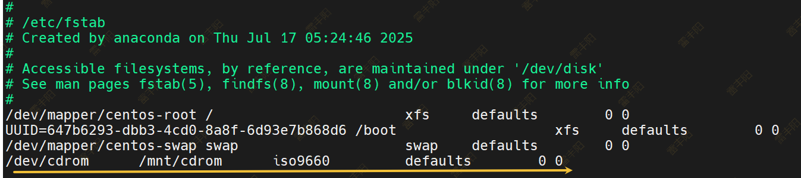

### **fdisk 分区**

**1）基本语法**

`fdisk -l `** **                   （功能描述：查看磁盘分区详情）

`fdisk 硬盘设备名`  （功能描述：对新增硬盘进行分区操作）

**2）选项说明**

**3）经验技巧**

该命令必须在 root用户下才能使用

**4）功能说明**

（1）Linux 分区

Device：分区序列

Boot：引导

Start：从X磁柱开始

End：到Y磁柱结束

Blocks：容量

Id：分区类型ID

System：分区类型

（2）分区操作按键说明

m：显示命令列表

p：显示当前磁盘分区

n：新增分区

w：写入分区信息并退出

q：不保存分区信息直接退出

**5）案例实操**

（1）查看系统分区情况：`fdisk -l `

## **进程管理类**

**进程**是**正在执行的一个程序或命令**，每一个进程都是一个运行的实体，都有自己的地址空间，并占用一定的系统资源。`进程id：PID`

### **ps 查看当前系统进程状态**

`ps:process status `进程状态

**1）基本语法  **

`ps aux | grep xxx  `           （功能描述：查看系统中所有进程）

`ps -ef  | grep xxx `            （功能描述：可以查看子父进程之间的关系）

**2）选项说明**

**3）功能说明**

（1）`ps aux` **显示信息说明**

**USER**：该进程是由哪个用户产生的

**PID**：进程的 ID 号

**%CPU**：该进程占用CPU 资源的百分比， 占用越高，进程越耗费资源；

**%MEM**：该进程占用物理内存的百分比， 占用越高，进程越耗费资源；

**VSZ**：该进程占用**虚拟内存**的大小，单位 KB；

**RSS**：该进程占用**实际物理内存**的大小，单位 KB；

**TTY**： 该进程是在哪个**终端**中运行的。对于 CentOS 来说，

- tty1 是图形化终端， 
- tty2-tty6 是本地的字符界面终端。
- pts/0-255 代表**虚拟终端**。

**STAT**：进程状态。常见的状态有：**R**：运行状态、**S**：睡眠状态、**T**：暂停状态、**Z**：僵尸状态、**s**：包含子进程、**l**：多线程、**+** ：前台显示 

**START**：该进程的启动时间

**TIME**：该进程占用CPU 的运算时间，注意不是系统时间

**COMMAND**：产生此进程的命令名

（2）`ps -ef` 显示信息说明

**UID**：用户 ID

**PID**：进程 ID

**PPID**：父进程 ID

**C**：CPU 用于计算执行优先级的因子。数值越大，表明进程是 CPU 密集型运算， 执行优先级会降低；数值越小，表明进程是 I/O 密集型运算，执行优先级会提高  STIME：进程启动的时间

**TTY**：完整的终端名称

**TIME**：CPU 时间

**CMD**：启动进程所用的命令和参数

**4）经验技巧**

如果想查看进程的 CPU **占用率和内存占用率**，可以使用 **aux**;

如果想查看进程的**父进程 ID** 可以使用** ef**;

### **kill 终止进程**

**1）基本语法**

kill  [选项]进程号    （功能描述：通过进程号杀死进程）

killall 进程名称           （功能描述：通过进程名称杀死进程，也支持通配符，这在系统因负载过大而变得很慢时很有用）

**2）选项说明**

**3）案例实操**

（1）杀死浏览器进程：`kill -9 5102`

（2）通过进程名称杀死进程：`killall firefox`

### **pstree 查看进程树**

**1）基本语法**

pstree [选项]

**2）**选项说明

 

### **top 实时监控系统进程状态**

**1）基本命令**

top [选项]

**2）选项说明**

  

**3）** **操作说明**

**4）查询结果字段解释**

第一行信息为任务队列信息

第二行为进程信息

第三行为 CPU 信息

**中断信号：通知机制；**

 

第四行为物理内存信息

第五行为交换分区（swap）信息

**5）案例实操**

```shell
top -d 1
top -i
top -p 2575
```

执行上述命令后，可以按 P 、M 、N 对查询出的进程结果进行排序。

### **netstat 显示网络状态和端口占用信息**

**1）基本语法**

netstat -anp | grep 进程号   （功能描述：查看该进程网络信息）

netstat –nlp | grep 端口号   （功能描述：查看网络端口号占用情况）

**2）选项说明**

**3）案例实操**

1. 通过进程号查看sshd进程的网络信息：`netstat -anp | grep sshd`
2. 查看某端口号是否被占用：`netstat -nltp | grep ``22`

> 具体场景会用到

## **定时任务**

### **crontab 服务管理**

重新启动 crond 服务

```shell
systemctl restart crond
systemctl enable crond
```

### **crontab 定时任务设置**

**1）基本语法**

**crontab **[选项]

**2）选项说明**

**3）**参数说明

`crontab -e`：进入 crontab 编辑界面。会打开 vim编辑你的工作。

语法编写：`* * * * * 执行的任务`：

所有星：任意时间任意分钟都执行一次

**8 18 7 6 ***：6月7号无论星期几18点08分； 执行一次这个任务

8,10,12 **18 7,8,9 6 *：6月7/8/9号无论星期几18点8/10/12这三个时刻执行**

**8-20 18 7 6 *：6月7号 18点8分到20分，每分钟执行一次**

8/3 **18 7 6 *：6月7号 18点8分开始执行，每3分钟执行一次**

*/3 **18 7 6 *：6月7号 18点任意时候开始，每3分钟执行一次**

（2）特殊符号

（3）特定时间执行命令

**4）案例实操**

（1）每隔 1 分钟，向/root/hello.txt 文件中添加一个 11 的数字：

`*/1 * * * * /bin/echo "11" >> /root/hello.txt`

> 时间同步：

```shell
* * * * * /usr/sbin/ntpdate ntp1.aliyun.com
```

# 软件包管理（RPM&YUM）

## RPM：离线安装

> 有一个下载好的软件包

> RPM（RedHat Package Manager），RedHat软件包管理工具，类似windows里面的setup.exe 是Linux这系列操作系统里面的打包安装工具，它虽然是RedHat的标志，但理念是通用的。
> 
> RPM包的名称格式：**Apache**-**1.3.23-11**.**i386**.**rpm    ****规则：软件包名-版本号.适配平台.rpm**

### 查询：rpm -qa

**1）基本语法**

`rpm -qa  `  :（功能描述：查询已经安装的所有 rpm软件包）

**2）经验技巧**

由于软件包比较多，一般都会采取过滤。rpm -qa | grep  软件包名

**3）案例实操**

（1）查询firefox软件安装情况：`rpm -qa |grep firefox`

### 卸载：rpm -e

**1）基本语法**

（1）**rpm -e  软件包**

（2）**rpm -e --nodeps 软件包**

**2）选项说明**

**3）案例实操**

卸载firefox软件：`rpm -e firefox`

### 安装：rpm -ivh

**1）基本语法**

`rpm -ivh  软件包全名`

**2）选项说明**

### rpm安装包去哪里下载

https://pkgs.org/

**安装 a.rpm，a依赖 b,c,d；必须把b,c,d先下载来，安装好，才能安装a**

## YUM：联网安装

> 应用商城：联网自动下

> **YUM**（全称为 **Y**ellow dog **U**pdater, **M**odified）是一个在 Fedora 和 RedHat 以及 CentOS 中的 Shell 前端软件包管理器。基于 RPM 包管理，能够从指定的服务器自动下载 RPM 包 并且安装，可以自动处理依赖性关系，并且一次安装所有依赖的软件包，无须繁琐地一次 次下载、安装

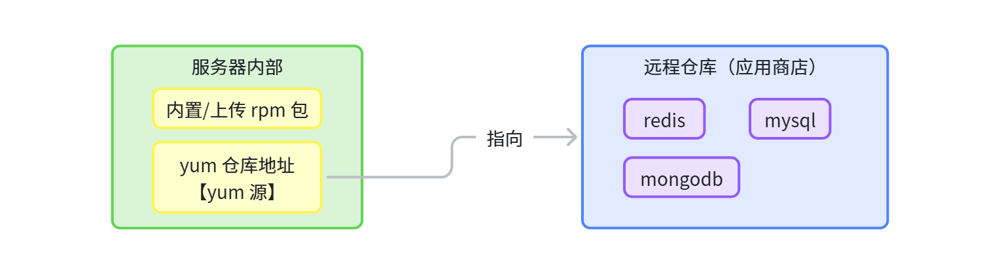

### 配置 国内 yum 源

> **CentOS停服后**，官方yum源用不了，所有软件都无法安装，可以修改为国内yum源镜像；

```bash
# 1. 备份
sudo cp /etc/yum.repos.d/CentOS-Base.repo /etc/yum.repos.d/CentOS-Base.repo.bak

# 2. 配置
sudo wget -O /etc/yum.repos.d/CentOS-Base.repo http://mirrors.aliyun.com/repo/Centos-7.repo

# 3. 清缓存
sudo yum clean all
sudo yum makecache

# 4. 验证
sudo yum repolist
sudo yum install -y vim
```

> 官方仓库软件数量有限；

### yum 常用命令

**1）基本语法**

yum [选项] [参数]

**2）选项说明**

**3）参数说明**

**4）案例实操实操**

1. 采用 yum 方式安装 nginx：` yum install -y nginx`

redis： 官网网站。公布了redis的yum地址；

## 编译源码安装

拿到项目源码，在linux 系统 编译 并 安装程序

## Docker

> **一键可以安装万物**；

# Shell编程入门

**Shell：壳子**；

## Shell介绍

> **shell**是一个运行在linux/UNIX环境下的**命令行解释器**。是介于操作系统内核和用户之间的一个“中介”，shell通过提供一个**交互式的输入输出环境**，可以解释和运行用户输入的命令，并将程序的运行结果输出给用户。

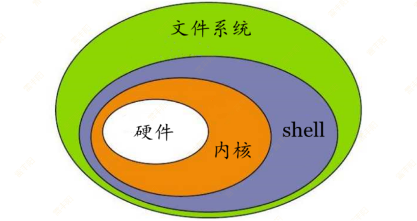

**Shell 脚本 = Shell 语法 + Linux命令**

> **自动化编排**linux命令；

**1）Linux 提供的** 【**Shell 解析器】有**

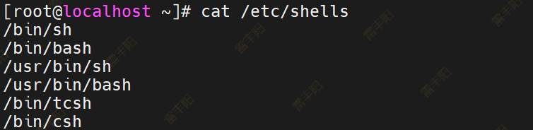

**2）bash 和** **sh 的关系：是同一个linux 的 shell解释器**

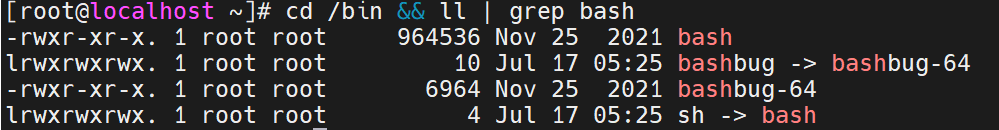

**3）Centos 默认的解析器是** **bash**


vim是修改文本文件的命令；

shell是vim命令的解释器；

**Linux操作系统**的**shell**和ls、vim、cd关系；**shell**是这些命令的**运行环境**；

## Shell脚本入门

### 编写脚本

脚本以#!/bin/bash 开头（指定解析器）

**第一个** **Shell 脚本：helloworld.sh**

```shell
[root@node01 shells]$ touch helloworld.sh
[root@node01 shells]$ vim helloworld.sh
# 在 helloworld.sh 中输入如下内容
#!/bin/bash
echo "helloworld"
```

### 运行脚本：三种方式

#### bash 或 sh+脚本的相对路径或绝对路径（不用赋予脚本+x 权限)

1. sh+脚本的相对路径：`sh`` ./helloworld.sh`
2. sh+脚本的绝对路径：`sh`` /home/root/shells/helloworld.sh`
3. bash+脚本的相对路径：`bash`` ./helloworld.sh`
4. bash+脚本的绝对路径：`bash`` /home/root/shells/helloworld.sh`

> 无需任何执行权限，就可以执行

#### 输入脚本的绝对路径或相对路径执行脚本（必须具有可执行权限+x）

```shell
# 赋予执行权限
chmod +x helloworld.sh

# 执行脚本：相对路径
./helloworld.sh

# 执行脚本：绝对路径
/root/shells/helloworld.sh
```

> 注意：第一种执行方法，本质是 bash 解析器帮你执行脚本，所以脚本本身不需要执行权限。第二种执行方法，本质是脚本需要自己执行，所以需要执行权限。

#### 在脚本的路径前加上“. ”或者 source（了解）

> 前面. 或者 source

```shell
# 有以下脚本
[root@node01 shells]$ cat test.sh                                 
#!/bin/bash
A=5
echo $A

# 分别使用 sh ，bash ，./  和 .   的方式来执行
```


## 一个案例讲解全部用法

> AI： 编写一个 `shell_demos.sh` 文件，在里面演示shell脚本的所有语法

> 1. 创建 `shell_demos.sh` 文件
> 2. 赋予执行权限：` chmod +x shell_demos.sh`
> 3. 执行文件：`./shell_demos.sh`

```bash
#!/bin/bash

###############################
#### 1. 变量基础用法
###############################
echo "==== 1. 变量示例 ===="
# 定义普通变量
name="Linux User"
age=30
pi=3.1415926

# 引用变量
echo "用户: $name, 年龄: ${age}岁"  # 花括号用于明确变量边界

# 只读变量
readonly greeting="Hello"
# greeting="Hi"  # 取消注释会报错: readonly variable

# 环境变量(当前Shell生效)
export PATH="$PATH:/home/user/bin"

# 特殊变量
echo "脚本名: $0"
echo "参数数量: $#"
echo "第一个参数: $1"
echo "所有参数: $*"
echo "命令执行结果: $?"
## $n  n 为数字，$0 代表该脚本名称，
## $1-$9 代表第一到第九个参数，
## 十以上的参数需要用大括号包含，如 ${10} ； 
## $？ ：最后一次执行的命令的返回状态。 0: 证明上一 个命令正确执行；
##      非 0（具体是哪个数，由命令自己来决定），则证明 上一个命令执行不正确了。
###############################
#### 2. 运算符大全
###############################
echo -e "\n==== 2. 运算符示例 ===="
a=10
b=3

# 算术运算(整数)
echo "算术运算:"
echo "加: $((a + b))"     # 13
echo "减: $((a - b))"     # 7
echo "乘: $((a * b))"     # 30
echo "除: $((a / b))"     # 3 (整除)
echo "模: $((a % b))"     # 1
echo "幂: $((a ** 2))"    # 100


# 关系运算(返回0/1)
[ $a -eq 10 ] && echo "a等于10"
[ $b -ne 10 ] && echo "b不等于10"
[ $a -gt $b ] && echo "a大于b"

# 逻辑运算
! false  && echo "非运算"
# -a -and  -o -or
[ $a -gt 5 -a $b -lt 5 ] && echo "与运算"
[ 10 -lt 8 -o $b -eq 3 ] && echo "或运算"

# 字符串运算
str1="hello"
str2="world"
[ "$str1" = "hello" ] && echo "字符串相等"
[ "apple" \< "banana" ] && echo "字典序比较"
[ -n "$str1" ] && echo "非空字符串"


###############################
#### 3. 流程控制结构
###############################
echo -e "\n==== 3. 流程控制示例 ===="
# 条件分支
score=85
if [ $score -ge 90 ]; then
  echo "优秀"
elif [ $score -ge 60 ]; then
  echo "及格"  # 执行此分支
else
  echo "不及格"
fi

# case多分支
fruit="apple"
case $fruit in
  "banana") echo "黄色水果";;
  "apple" | "cherry") echo "红色水果";;  # 匹配多项
  *) echo "未知水果";;                   # 默认匹配
esac

# 循环结构
echo "for循环:"
for i in {1..3}; do
  echo $i
done

echo "while循环:"
count=3
while [ $count -gt 0 ]; do
  echo $count
  ((count--))
done

echo "until循环:"
num=1
until [ $num -ge 3 ]; do
  echo $num
  ((num++))
done


###############################
#### 4. read读取控制台输入
###############################
echo -e "\n==== 4. read输入示例 ===="
# 基础输入
read -p "请输入用户名: " username
echo "用户输入: $username"

# 超时处理
read -t 5 -p "5秒内输入(超时跳过): " timeout_input || echo "时间到!"

# 限制输入长度
read -n 6 -p "最多输入6字符: " limit_input; echo

# 隐藏输入(密码)
read -s -p "输入密码: " password
echo -e "\n密码已接收"

# 从文件读取
# < 输入重定向；  
# >：输出重定向： echo 111 > 1.txt
echo "读取文件:"
while read line; do
  echo "行内容: $line"
done < /etc/passwd | head -n 3  # 只读前三行

# ||  ps -ef|grep "aaa"

###############################
#### 5. 函数定义与使用
###############################
echo -e "\n==== 5. 函数示例 ===="
# 定义函数
calculate() {
  local sum=$(( $1 + $2 ))  # local定义局部变量
  echo "计算结果: $sum"
  return $((sum % 256))     # 返回值范围0-255
}

# 调用函数
calculate 30 40
ret=$?
echo "函数返回值: $ret"

# 函数参数处理
show_args() {
  echo "第一个参数: $1"
  echo "参数总数: $#"
  echo "所有参数: $*"
}
show_args "apple" "banana" "cherry"


###############################
#### 6. 正则表达式应用
###############################
echo -e "\n==== 6. 正则表达式示例 ===="
text="Server: 192.168.1.1, Port: 8080, Host: example.com"

# 匹配IP地址(使用grep)
echo "IP地址匹配:"
echo $text | grep -Eo '[0-9]{1,3}\.[0-9]{1,3}\.[0-9]{1,3}\.[0-9]{1,3}'

# 邮箱验证(使用 =~ 运算符)
email="user@example.com"
regex="^[a-zA-Z0-9._%+-]+@[a-zA-Z0-9.-]+\.[a-zA-Z]{2,}$"
if [[ $email =~ $regex ]]; then
  echo "有效邮箱: ${BASH_REMATCH[0]}"
else
  echo "无效邮箱"
fi


###############################
#### 7. 文本处理工具三剑客
###############################
echo -e "\n==== 7. 文本处理工具示例 ===="
cat << EOF > data.txt
ID Name Age Score
1 Alice 20 85
2 Bob 22 92
3 Carol 19 78
4 David 23 88
EOF

# grep搜索
echo "grep示例:"
grep 'A' data.txt           # 包含A的行
grep -v 'Bob' data.txt      # 不包含Bob的行

# sed流编辑器
echo "sed示例:"
sed 's/22/25/g' data.txt    # 替换22为25
sed '3,4d' data.txt         # 删除3-4行

# awk文本分析
echo "awk示例:"
awk '$4>80 {print $2}' data.txt                # 分数>80的名字
awk '{sum+=$4} END {print "平均分:" sum/NR}' data.txt

echo "所有示例执行完毕!"
```

> 以后全靠AI生成Shell脚本

## awk（了解）

> **Awk 是 Linux 最强大的文本处理工具之一**，以其创始人 Alfred **A**ho、Peter **W**einberger 和 Brian **K**ernighan 的姓氏首字母命名。本文将全面介绍 Awk 的核心用法和实际应用。

### 核心概念

#### 基本语法结构

`awk '模式 { 操作 }' 文件`

- 模式​：决定何时执行操作（可省略）
- 操作​：在模式匹配时执行的命令
- 文件​：要处理的输入文件

#### 工作流程

1. 逐行读取输入文件
2. 分割每行为字段（默认空格分隔）
3. 检查模式是否匹配
4. 执行匹配的操作
5. 处理下一行

### 内置变量

### 基础用法

#### 字段提取

```shell
# 提取第一列和第三列
awk '{print $1, $3}' file.txt

# 提取最后一列
awk '{print $NF}' file.txt
```

#### 条件筛选

```shell
# 筛选第三列大于 50 的行
awk '$3 > 50' file.txt

# 文本匹配 (含 'error' 的行)
awk '/error/' logfile
```

#### 特殊模式

```shell
# BEGIN 块 - 处理前执行
awk 'BEGIN {print "Start Processing"} {print $0} END {print "End"}' file

# END 块 - 处理后执行
awk '{sum += $3} END {print "Total:", sum}' data.txt
```

### 高级用法

#### 数组处理

```shell
# 统计 IP 出现次数
awk '{ip[$1]++} END {for (i in ip) print i, ip[i]}' access.log

# 多维数组统计
awk '{count[$1,$2]++} END {for (i in count) print i, count[i]}' data
```

#### 字符串函数

```shell
# 字符串连接
awk '{print $1 "-" $2}' data

# 子字符串提取
awk '{print substr($1, 1, 3)}' data

# 字符串替换
awk '{gsub(/old/, "new"); print}' file
```

#### 数学运算

```shell
# 平均值计算
awk '{sum += $3} END {print "Average:", sum/NR}' data

# 最大值查找
awk 'NR==1 {max=$3} $3>max {max=$3} END {print "Max:", max}' data
```

#### 复杂条件组合

```shell
# 多条件筛选 (第3列>50 且第4列包含 'active')
awk '$3 > 50 && $4 ~ /active/' data.txt
```

#### 字段重计算

```shell
# 字段重排与计算
awk '{print $2, $1, $3*$4}' data.txt
```

#### 多文件处理

```shell
# 合并多个文件内容
awk '{print FILENAME, $0}' file1.txt file2.txt
```

#### 自定义输出格式

```shell
# 表格格式输出
awk 'BEGIN {printf "%-10s %-10s %-10s\n", "Name", "Age", "Score"}
     {printf "%-10s %-10d %-10.2f\n", $1, $2, $3}' data.txt
```

### 常用场景

#### 日志分析

```shell
# 统计 HTTP 状态码
awk '{codes[$9]++} END {for (c in codes) print c, codes[c]}' access.log

# 分析耗时最高的请求
awk '$NF > 1 {print $7, $NF}' access.log | sort -k2rn | head
```

#### 数据报表生成

```shell
# 生成 CSV 报表
awk 'BEGIN {FS=","; OFS=","; print "Name,Total"} NR>1 {print $1, $2+$3+$4}' data.csv
```

#### 文件转换

```shell
# TSV 转 CSV
awk 'BEGIN {FS="\t"; OFS=","} {$1=$1}1' data.tsv

# JSON 格式化处理（需安装 jq 但 Awk 可简化）
awk -F: '/"name"/ {gsub(/"/, "", $2); print "Name:", $2}' data.json
```