# 2. 公有云平台

# 云平台

> 本地平台；
> 
> 云平台厂商；

## 云平台优势

- 环境统一
- 按需付费 
- 即开即用 
- 稳定性强
- ......

国内常见云平台：

- [阿里云](https://promotion.aliyun.com/ntms/act/ambassador/sharetouser.html?userCode=50sid5bu&utm_source=50sid5bu)、百度云、[腾讯云](https://curl.qcloud.com/iyFTRSJb)、[华为云](https://activity.huaweicloud.com/discount_area_v5/index.html?fromacct=d1a6f32e-d6d0-4702-9213-eafe022a0708&utm_source=bGVpZmVuZ3lhbmc==&utm_medium=cps&utm_campaign=201905)、青云......

国外常见云平台：

- 亚马逊 **AWS**、微软 **Azure **...

## 公有云

> 购买云服务商提供的公共服务器；钞能力！！！
> 
> 你买的服务器还是私有的，自己的。但是整个云平台是公有的，大家都能买买买；

公有云是最常见的云计算部署类型。公有云资源（例如服务器和存储空间）由第三方云服务提供商拥有和运营，这些资源通过 Internet 提供。在公有云中，所有硬件、软件和其他支持性基础结构均为云提供商所拥有和管理。Microsoft Azure 是公有云的一个示例。

在公有云中，你与其他组织或云“租户”共享相同的硬件、存储和网络设备，并且你可以使用 Web 浏览器访问服务和管理帐户。公有云部署通常用于提供基于 Web 的电子邮件、网上办公应用、存储以及测试和开发环境。

公有云优势：

- **成本更低**：无需购买硬件或软件，仅对使用的服务付费。
- **无需维护**：维护由服务提供商提供。
- **近乎无限制的伸缩性**：提供按需资源，可满足业务需求。
- **高可靠性**：具备众多服务器，确保免受故障影响。

## 私有云

> **自己搭建云平台**，或者购买

私有云由专供一个企业或组织使用的云计算资源构成。私有云可在物理上位于组织的现场数据中心，也可由第三方服务提供商托管。但是，在私有云中，服务和基础结构始终在私有网络上进行维护，硬件和软件专供组织使用。

这样，私有云可使组织更加方便地自定义资源，从而满足特定的 IT 需求。私有云的使用对象通常为政府机构、金融机构以及其他具备业务关键性运营且希望对环境拥有更大控制权的中型到大型组织。

**私有云优势**：

- **安全性**：数据安全性要求高、自己买物理机、自己搭平台
- **灵活性更强**：组织可自定义云环境以满足特定业务需求。
- **控制力更强**：资源不与其他组织共享，因此能获得更高的控制力以及更高的隐私级别。
- **可伸缩性更强**：与本地基础结构相比，私有云通常具有更强的可伸缩性。

## 混合云

**公有云** + **私有云**

> **没有一种云计算类型适用于所有人。多种不同的云计算模型、类型和服务已得到发展，可以满足组织快速变化的技术需求。**
> 
> > 部署云计算资源有三种不同的方法：**公共云、私有云和混合云**。采用的部署方法取决于业务需求、数据中心预算以及企业运维能力等。

## IaaS、PaaS、SaaS

**云计算的服务模式**是分几层的，分别是：

- **IaaS：Infrastructure**-as-a-Service； **基础设施**即服务；只提供服务器
  - **便宜、麻烦**、自己开发；
- **PaaS：**Platform-as-a-Service；**平台**即服务；提供能运行软件的整个完整平台。
  - 贵一点。只需要我们部署软件。
- **SaaS：**Software-as-a-Service；**软件**即服务； 整个软件都提供，用户只需要使用即可；
  - **淘宝**；星程知道、小鹅通；

基础设施在最下端，平台在中间，软件在顶端。

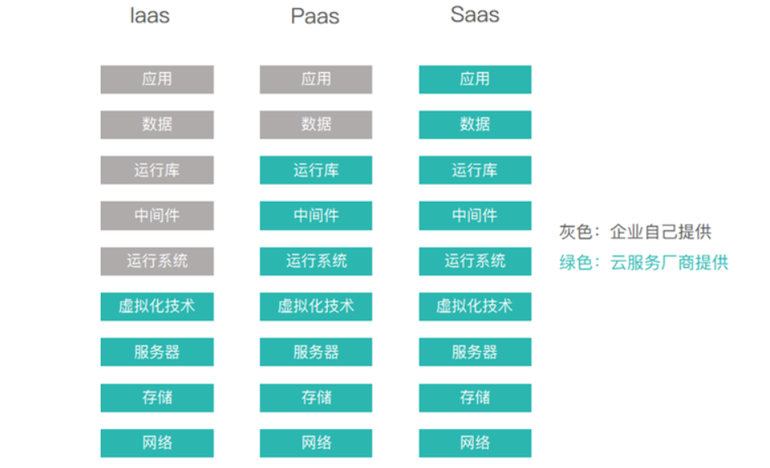

> 最近几年 **FaaS（Function As a Service）**也在兴起；函数即服务；

如何理解：

- 去云厂商买了服务器，自己安装数据库、Tomcat、部署Shop应用。此时**云厂商**是作为 **IaaS**； 例如云服务器
- 去云厂商买了集成环境（服务器、MySQL、Tomcat、Java...），自己部署Shop应用。此时云厂商作为 **PaaS**； 例如阿里云ACK平台
- 去云厂商直接买了**电商平台**，只需要上架自己商品就可售卖，此时云厂商作为 **SaaS**；例如保利威、飞书**、钉钉**等

## 云设施

> **计算、存储、网络、安全**；是计算机领域的四大核心。
> 
> 每家云厂商都提供了现成的核心资源，让我们能秒级开通和使用，像用水电一样方便。
> 
> 云未来将会成为水电一样的基础设施

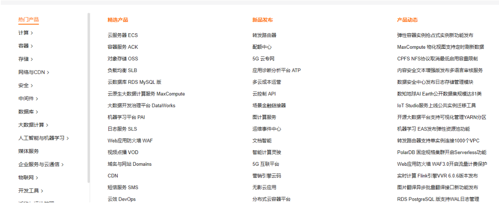

以下是常用的**云设施**。需要我们熟练掌握

- **ECS、CVM**：服务器，Linux主机
- **块存储、云盘**：硬盘
- 数据备份、镜像：备份、恢复
- **安全组**：防火墙
- **IP、域名**：IP地址绑定域名
- **VPC**：**私有网络**；组网；
  - 路由器 + 交换机 + 终端设备 = 组成一个网络（一个私域范围能用）
- NAT网关
- 可用区
- 计费方式：
  - **包年包月**：
  - **按量付费**：小时付费
  - **抢占式实例**：**拍卖模式**（小时付费）；便宜、不稳定。适合快速做一些简单实验
- 公有云
- 私有云
- ...

接下来我们开始实战学习这些云设施；每个资源都使用**按量付费**的方式，**用完需要自行销毁**，避免大量扣费。

# 云实战

## ECS

### 简介

> **云服务器ECS**（Elastic Compute Service）是阿里云提供的性能卓越、稳定可靠、弹性扩展的IaaS（Infrastructure as a Service）级别云计算服务。云服务器ECS免去了采购IT硬件的前期准备，让我们像使用水、电、天然气等公共资源一样便捷、高效地使用服务器，实现计算资源的即开即用和弹性伸缩。简而言之，**云服务器**就是把**固定配置**的服务器**升级**为**随时**可以**调整配置的云端服务器**。

### 概念

物理存在


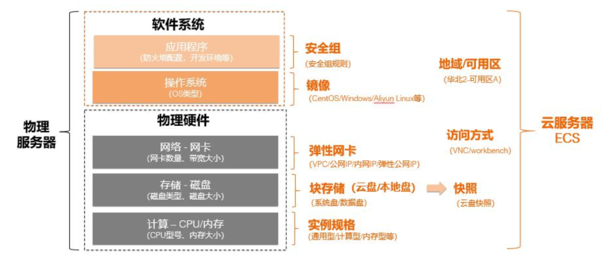

> 通俗解释：
> 
> - **实例**：一台云服务器
> - **块存储**：云上的硬盘
> - **快照**：系统、硬盘数据的备份
> - **弹性网卡**：云上服务器的网卡
> - [**VPC**](https://help.aliyun.com/product/27706.html)：专有网络VPC（Virtual Private Cloud）；组建**局域网**。需要用到交换机、内网IP
> - **内网IP**：也叫私有IP，如果用VPC进行组网，每一个ecs都有自己的内网IP，在同一个VPC内这些IP可以互相访问
> - **公网IP**：暴露给外界用的IP，可以在世界各地进行访问
> - **安全组**：Linux的防火墙规则
> - **访问方式**：如何登录进ecs进行操作。可以通过web控制台，也可以使用一些终端连接。
> - <u>***地域***</u><u>*：物理区，比如北京、上海、杭州。就是某个城市的机房。*</u><u>***不同地域不能互通***</u>
> - <u>***可用区***</u><u>*：某个城市不只会有一个机房。众多机房合起来可以划分很多可用区。*</u><u>***同一地域不同可用区可以互通***</u>

### 组件

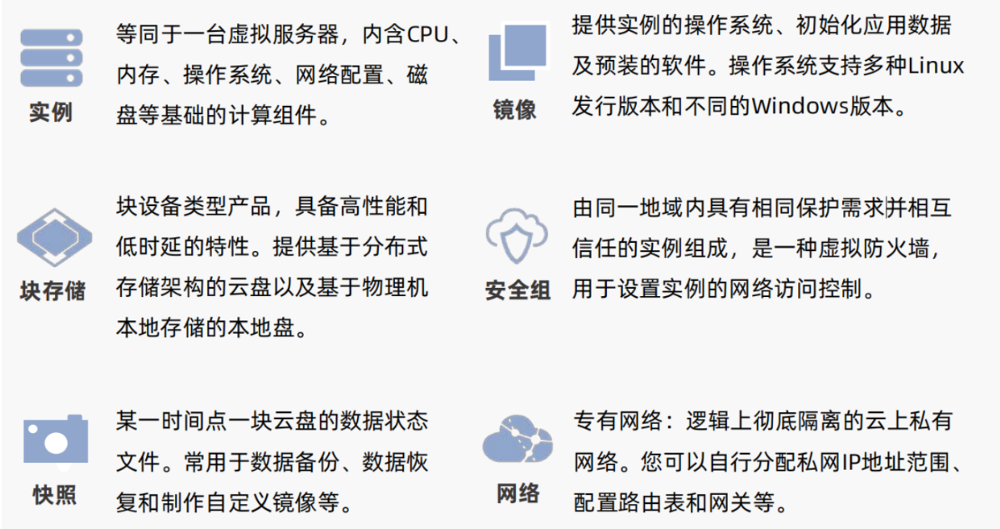

### 地域划分

> - **地域**：物理的数据中心。选择靠近客户的地域，可降低网络时延。
>   - **不同地域的ECS之间内网隔离**。**资源创建成功后不能更换地域**。
> - **可用区**：在**同一地域内**，**电力和网络互相独立**的物理区域。可用区主要**用于故障隔离**。
>   - **同一地域**不同可用区的ECS之间**内网互通**。

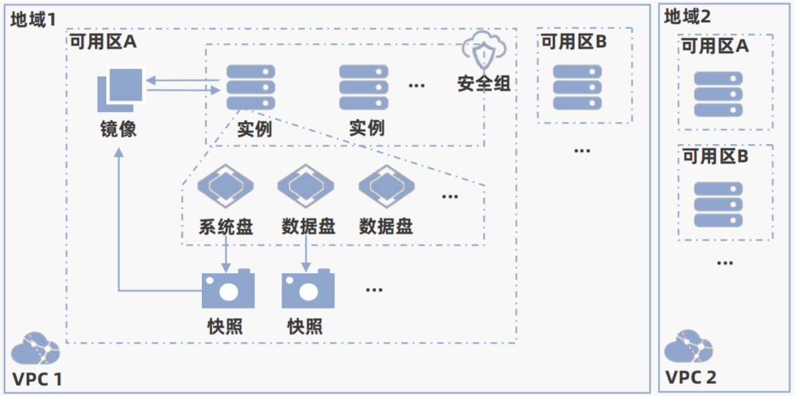

理解：

- 假设阿里云有**10万台服务器**，每个服务器都是一个**实例**
- 每个服务器开放哪些端口，需要通过**安全组**进行控制，这就是防火墙
- 每个实例的操作系统在**系统盘**安装着。系统盘是云上的一块硬盘，这个硬盘我们也叫做 **块存储**
- 每个实例的数据可以单独放在**数据盘**。
- 所有数据最好进行定期备份，这个机制我们成为**快照**。备份的数据，被我们封装为**镜像**，保存到阿里云专门的一些硬盘中；
- 10万台服务器不可能放在一个城市，所以阿里云会在上海、北京、杭州等各个地方建立机房。每个城市都称为一个**地域**；
- 就算在一个地域，比如**北京**，有3000台服务器，这些服务器可能不在同一个机房，或者同一个大楼里面。假设A、B、C三栋大楼都有机房。那么A栋楼可以称为一个**可用区A**，B栋称为**可用区B**，同一个可用区内的机器是可以互相访问的，同一个地域不同可用区的也是可以互相访问的。同一个地域的所有实例，可以通过**VPC自定义组网**策略。
- 不同地域之间默认不能互通，如果需要互通要开通**专线**。
- 可用区、地域都是为了物理隔离。比如A栋楼停电了，可以不影响B栋楼。A城市停电了，可以不影响B城市。**容灾机制**就是基于这种隔离实现的

### 规格

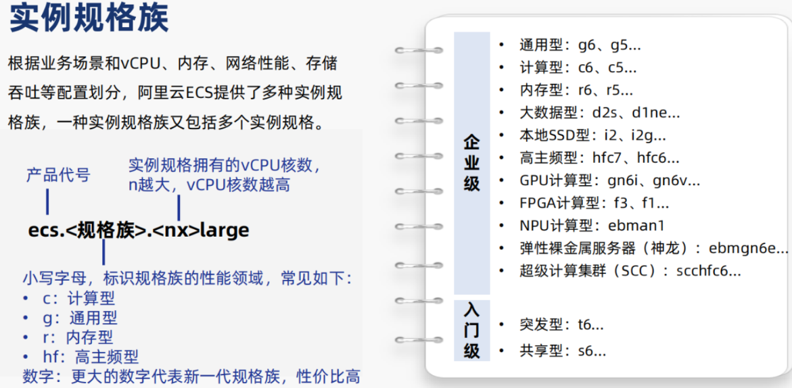

### 配置

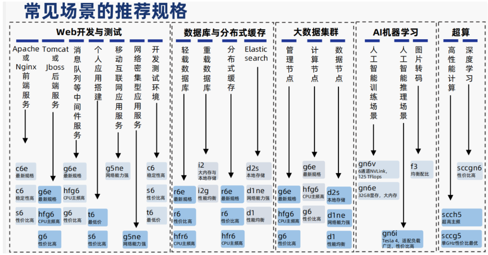

### 实战

> 由于阿里云有要求最低充值100，所以我们使用腾讯云

#### 开通服务器

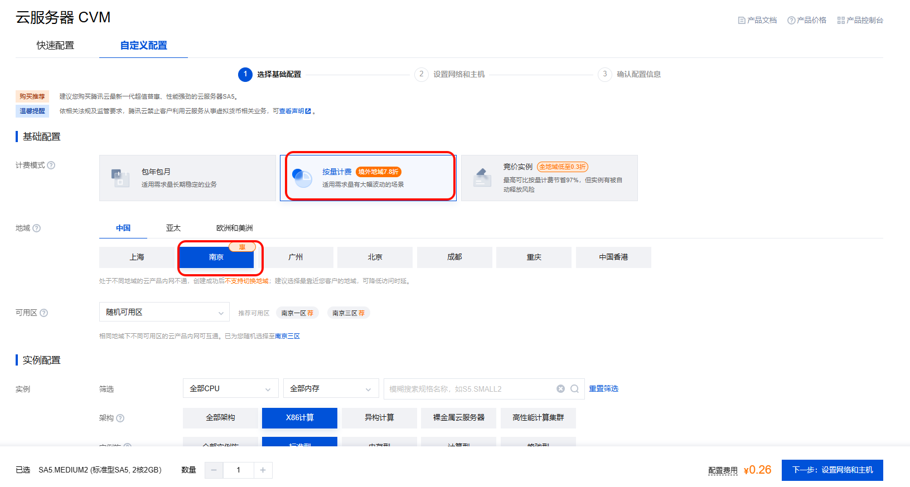

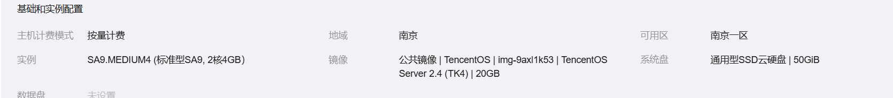

#### 远程连接

## VPC

### 概念

**专有**/**私有**网络VPC（Virtual Private Cloud）：[https://www.aliyun.com/product/vpc](https://www.aliyun.com/product/vpc)

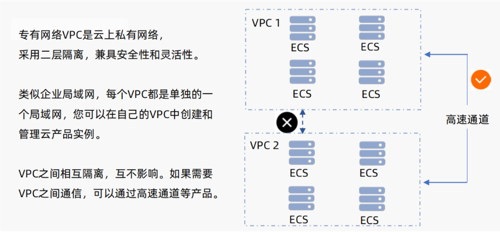

### 规划

> 一个私有网络； IP地址，一个.分割8位01;
> 
> - 192.168.0.0~ 192.168.255.255； 256*256 = 65536

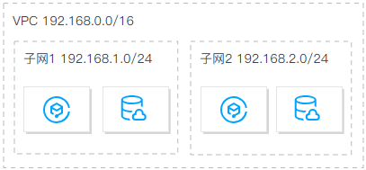

> 区分 各种环境，利用 VPC进行网络隔离，有效防止 数据乱窜

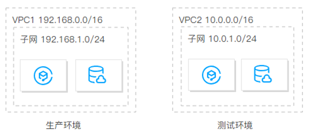

> 区分地域；私有网络之间默认不互通，如果不同私有网络间有互通需求，可以通过 [对等连接](https://cloud.tencent.com/document/product/553) 或 [云联网](https://cloud.tencent.com/document/product/877) 实现私有网络互通。

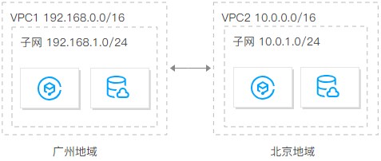

### 网段

> **无类别域间路由**（**Classless **Inter-Domain Routing, **CIDR**）

**192.168.0.0/16  CIDR表示法，表示一个网络范围。**

[ip地址在线计算器 (](https://tool.520101.com/wangluo/ipjisuan/)[520101.com](https://tool.520101.com/wangluo/ipjisuan/)[)](https://tool.520101.com/wangluo/ipjisuan/)

思考：132.26.0.0/14  网络范围有多大

### 实战

#### 创建VPC + 创建多个子网

#### 创建多个ECS实例：只保留私有IP即可

> 测试网络连通性

结论：跨VPC的机器不互通，同一个VPC下的机器即使跨可用区也互通。

**VPC做环境隔离；**

- 生产环境：创建生产VPC（177.16.xx.xx/16）
- 测试环境：创建测试VPC（188.11.xxx.xx/16）
- 物理网络层隔离，不怕删库

## 安全组

### 概念

> **安全组是实例维度的虚拟防火墙**，用于保护ECS实例的网络安全。
> 
> - 安全组就像一栋房子的门禁系统，ECS实例在房子中。房子内的ECS实例默认是内网互通的，但有来访者或者内部人员外出，都需要通过检查。
> - 如果来访者不符合访问规则，则阻止进入；
> - 如果来访者符合访问规则，则可以进入。 
> - 同理，内部人员不符合外出规则，则阻止外出；如果内部人员符合外出规则，则可以外出

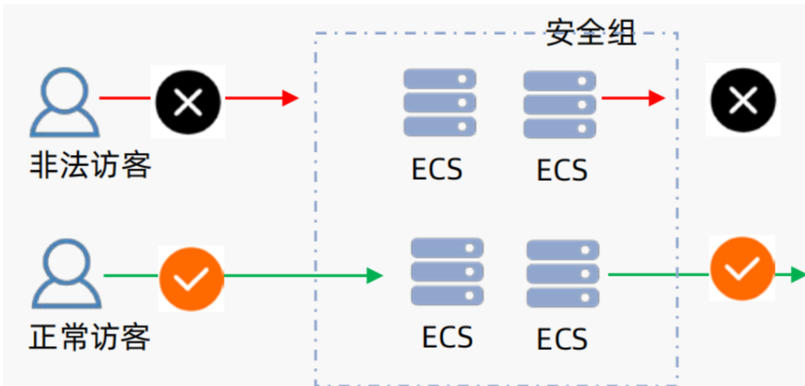

### 实战

#### 配置安全组

#### 安装Nginx - 访问测试

```shell
#安装Nginx
yum install nginx

#启动nginx
systemctl start nginx

#查看Nginx位置
whereis nginx
# 修改 /etc/nginx/nginx.conf 端口为8080
port 8080

# 重启nginx
nginx -s reload
```

## 云盘

### 简介

> - 云盘采用多副本的**分布式机制**，具有**低时延**、高性能、持久性、高可靠等性能，可以为云服务器提供安 全可靠，性能优越的块存储服务。
> - 根据存储的数据类型和云盘的创建方式，**云盘**可以作为**系统盘**和**数据盘**使用。

### 图解

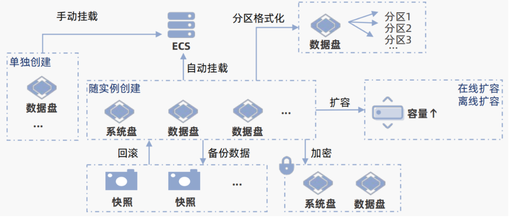

### 块存储

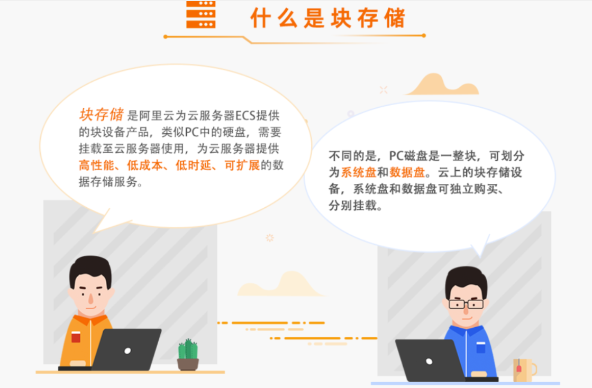

### 存储分类

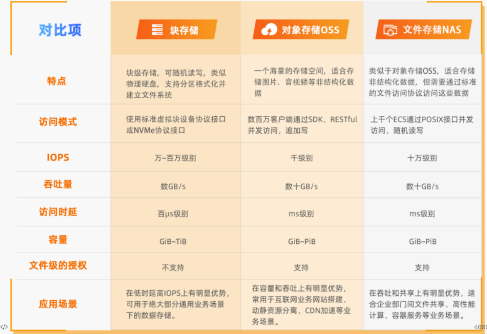

### 实战

#### 创建云盘

#### 查看状态

#### 挂载云盘

#### 卸载云盘

#### 删除云盘

## 备份

### 快照

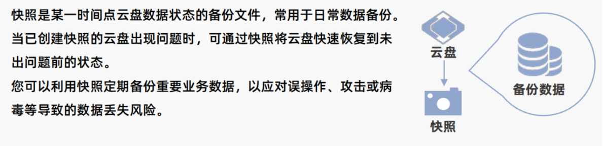

### 镜像

镜像提供了创建ECS实例所需的信息，包括实例的操作系统、初始化应用数据及预装的软件。**镜像文件相当于副本文件，包含了一块或多块云盘中的所有数据。**

### 实战

#### 创建镜像备份

#### 按照镜像备份恢复服务器

# 常见环境安装

## Java

> https://jdk.java.net/archive/

```bash
#下载jdk17
wget https://download.java.net/java/GA/jdk21/fd2272bbf8e04c3dbaee13770090416c/35/GPL/openjdk-21_linux-x64_bin.tar.gz


#解压
tar -xzvf jdk-17_linux-x64_bin.tar.gz

#移动到指定位置； 记住全路径： /usr/local/jdk-17.0.7
mv jdk-17.0.7 /opt/

#配置环境变量   /opt/jdk-17.0.2
vim /etc/profile

#在最后加入下面配置，注意修改 JAVA_HOME位置为你自己的位置
export JAVA_HOME=/opt/jdk-17.0.2
export PATH=$JAVA_HOME/bin:$PATH

#使环境变量生效
source /etc/profile

#验证安装成功
java -version
```

## Tomcat

```bash
# 下载二进制包
sudo yum install -y wget
wget https://dlcdn.apache.org/tomcat/tomcat-11/v11.0.9/bin/apache-tomcat-11.0.9.tar.gz
# 解压到/opt/tomcat目录
sudo tar xf apache-tomcat-9.0.80.tar.gz -C /opt/tomcat
```

> 制作开机启动服务

```shell
sudo vi /etc/systemd/system/tomcat.service

# 内容如下：注意修改Java HOME位置
[Unit]
Description=Tomcat 11 Servlet Container
After=network.target

[Service]
Type=forking


Environment="CATALINA_PID=/opt/tomcat/tomcat.pid"
Environment="JAVA_HOME=/usr/lib/jvm/jre"
Environment="CATALINA_HOME=/opt/tomcat"
Environment="CATALINA_BASE=/opt/tomcat"

ExecStart=/opt/tomcat/bin/startup.sh
ExecStop=/opt/tomcat/bin/shutdown.sh

RestartSec=10
Restart=always

[Install]
WantedBy=multi-user.target
```

> 设置开机启动

```shell
sudo systemctl daemon-reload
sudo systemctl start tomcat
sudo systemctl enable tomcat
sudo systemctl status tomcat  # 检查状态
```

## 1Panel

> 1Panel 是一个现代化、开源的 Linux 服务器运维管理面板。适合小型公司快速运维需求。

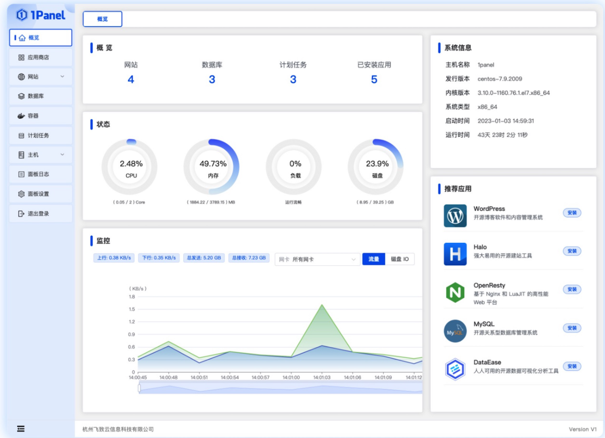

```shell
curl -sSL https://resource.fit2cloud.com/1panel/package/quick_start.sh -o quick_start.sh && sh quick_start.sh
```

# 单体项目部署架构

> www.zpro.com  ==> IP  ==> 【服务器（Web应用） ==> 服务器（数据库）在同一个私有网络里面，为了快】
> 
> 单体部署架构；

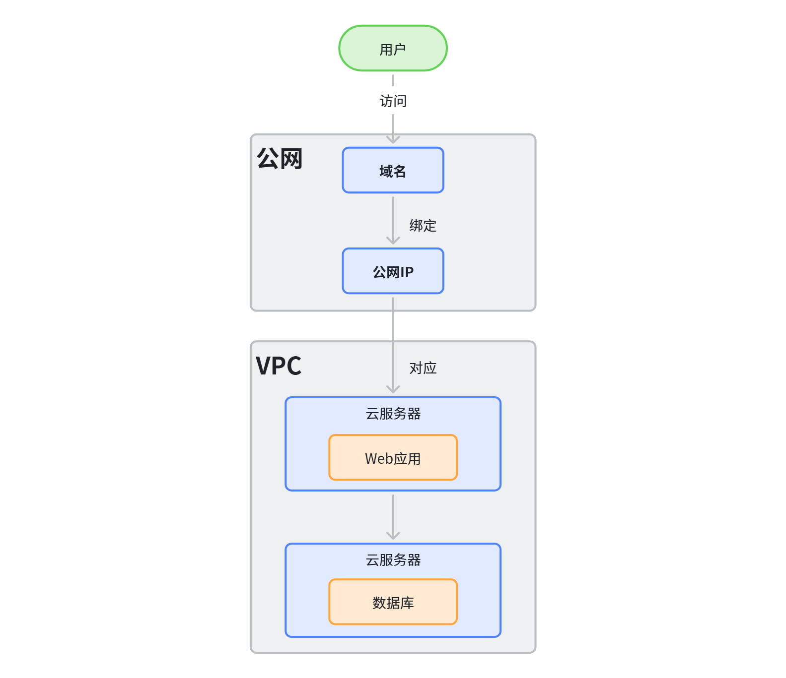

## 开通两个服务器

一个数据库服务器

一个web服务器

先让防火墙放开所有；

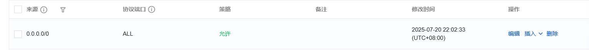

## 配置内网主机名访问

内网里面，用ip可以通，但是麻烦；

修改每个主机的 `/etc/hosts` 文件

10.206.0.8 webs 

10.206.0.12 dbs

## 安装1Panel

> 以后运维linux主机就会方便

> CIDR表示法；表示一个网络范围

> 安装以后要配置端口放行  0.0.0.0/0 

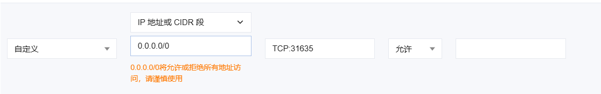

dbs：http://109.244.159.230:31635/48e9f606c3

- 账号：2808b804eb
- 密码：72cca7f411

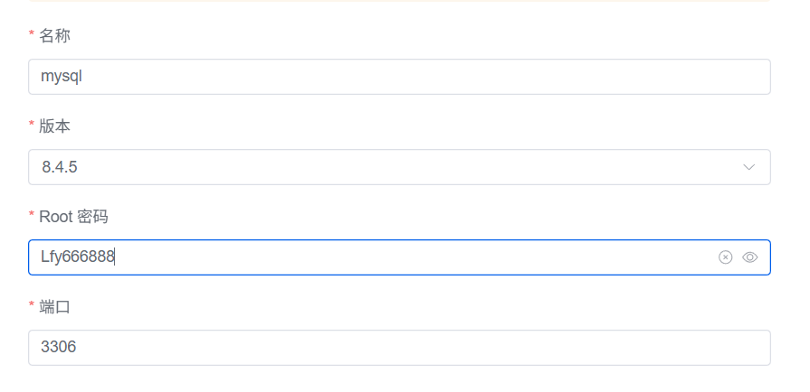

```java
[root@VM-0-12-tencentos ~]# systemctl disable firewalld
[root@VM-0-12-tencentos ~]# systemctl stop firewalld
[root@VM-0-12-tencentos ~]# # 重启 Docker 守护进程
[root@VM-0-12-tencentos ~]# sudo systemctl restart docker

```

## 数据库访问地址

> **109.244.159.230****:3306**
> 
> 账号:root  密码：Lfy666888

## Webserver

> 防火墙配置后，必须重启docker
> 
> `systemctl restart docker`

[1Panel 2025-07-20 22:17:29 install Log]: 请使用您的浏览器访问面板:

[1Panel 2025-07-20 22:17:29 install Log]: 外部地址:  http://129.211.208.74:23264/311d52f264

[1Panel 2025-07-20 22:17:29 install Log]: 内部地址:  http://10.206.0.8:23264/311d52f264

[1Panel 2025-07-20 22:17:29 install Log]: 面板用户:  99c6b14fa2

[1Panel 2025-07-20 22:17:29 install Log]: 面板密码:  cf7253c656

修改Tomcat不用80端口；

Java环境问题，缺少字体，验证码出来不了。

> 1Panel 的Tomcat有问题；

```java
docker rm -f $(docker ps -aq)
docker run -d -p 80:8080 --restart=always -v tomcat:/usr/local/tomcat tomcat:jdk21


cd /var/lib/docker/volumes/tomcat/_data/webapps
```

# 销毁服务器

> 按量付费用完记得销毁

[📎 PixPin_2025-07-20_23-35-27.mp4](<files/PixPin_2025-07-20_23-35-27.mp4>)