# 1. Maven

> 项目构建与依赖管理工具

# 安装

## 介绍

Maven 是意第绪语，意思 是 知识的积累者，最初是为了简化 Jakarta Turbine 项目中的构建过程。

随着发展，成为了Java项目的项目构建和依赖管理工具；

> **学习Maven就是学习他的以下两个核心功能**
> 
> 1. **项目构建**：包含的核心环节有
>   1. 项目**创建**、**编译**、**测试**、**打包**、**部署**、**运行**等过程
> 2. **依赖管理**：包含的核心功能有
>   1. 项目**关联jar包**的**下载**、**导入**、**冲突解决**、**依赖传递**等

## 下载

① 官网：https://maven.apache.org/

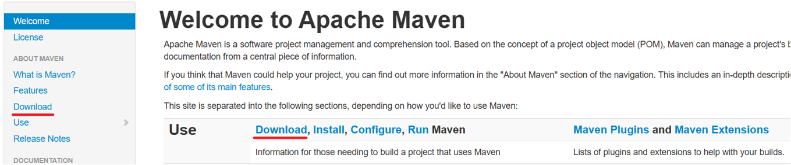

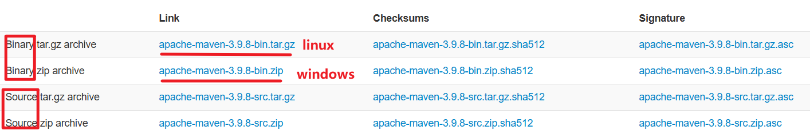

## 目录结构

> 下载好的Maven包含如下目录

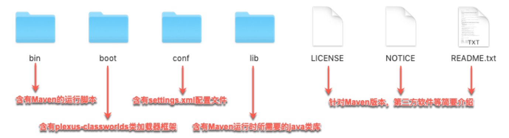

## 环境变量

> 主要为了在**控制台能输入 **`mvn `**命令**来执行maven对应功能

配置环境变量：MAVEN_HOME 和 PATH

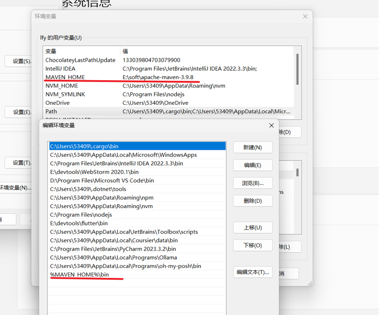

## 测试

> 控制台输入如下，代表成功

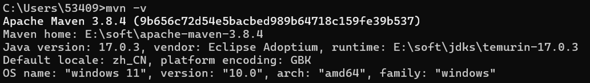

## 配置

> maven常用的配置如下

### 本地仓库

> maven **默认下载的jar包**会保存在**用户目录的 .m2 下**，**寻找不方便**，我们指定一个下载的保存位置
> 
> > 修改 `conf/settings.xml` ，搜索 `localRepository `标签，改为如下内容
> 
> **注意：默认 localRepository  是被注释的**

```xml
  <!-- localRepository
   | The path to the local repository maven will use to store artifacts.
   |
   | Default: ${user.home}/.m2/repository
  <localRepository>/path/to/local/repo</localRepository>
  
  把下载的所有jar包保存在 D:\Repository
  -->
  <localRepository>D:\Repository</localRepository>
```

### 镜像加速

> maven **默认会从中央仓库**下载项目依赖，比较慢，可以**配置为国内 aliyun 等镜像源**，方便快速下载
> 
> 修改 `conf/settings.xml `，搜索 `mirrors `标签，替换为如下内容

```xml
  <mirrors>
    <!-- 阿里云仓库 --> 
    <mirror>
      <id>alimaven</id>
      <mirrorOf>central,jcenter</mirrorOf>
      <name>aliyun maven</name>
      <url>https://maven.aliyun.com/repository/public</url>
    </mirror>
  </mirrors>
```

验证：使用命令：`mvn help:effective-settings`

# 基础

## 核心概念 - 生命周期


> 项目的生命周期是指项目构建的各个阶段；如：
> 
> - 项目**创建**、**编译**、**测试**、**打包**、**部署**、**运行**等过程

**默认项目生命周期包含以下阶段**

**validate**：验证项目是否正确并且所有必要的信息都可用

**compile**：编译项目的源代码

**test**：运行单元测试代码。测试代码不应该要求打包或部署

**package**：获取已编译的代码并将其打包成可分发的格式，例如 JAR。

**verify**：对集成测试的结果进行任何检查，以确保满足质量标准

**install**：将包安装到本地存储库中，作为本地其他项目的依赖项

**deploy**：将最终包复制到远程存储库以与其他开发人员和项目共享。

> 除了上面的默认列表之外，还有另外两个值得注意的 Maven 生命周期。他们是

**clean**：清理先前构建创建的工件

**site**：为此项目生成站点文档

## 核心概念 - GAV坐标

**GAV：项目的唯一坐标；GAV是三个字母组合，分别代表如下：**

- **G****roupId**：组织名；一般用公司域名反写。如: com.lfy、org.apache、io.spring 等
- **A****rtifactId**：模块名；也就是项目名。如：book-store、mall、order-service 等
- **V****ersion**：版本号；项目的版本。如：1.0.1、5.2.19.RELEASE、17-lts 等

**gav具有全球唯一性**，表示**某个公司的某个版本的某个项目**

**原理**：maven根据坐标去下载指定的jar包，保存到本地;

- **注意**：相同的jar包其实只有一份，就是在本地仓库保存着。每个项目只是引用这个包，如果这个包之前下载过了，别的项目再要引用，就不用下载了

**中央仓库：**https://mvnrepository.com/ ；中央仓库一般在国外，比较慢，所以我们需要配置国内镜像

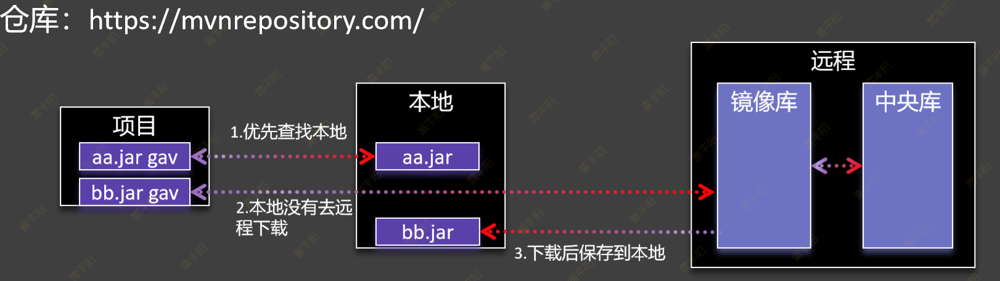

### 扩展：Version推荐的命名规范

> 版本号的格式为 **X.Y.Z **(又称** Major.Minor.Patch**)，递增的规则为
> 
> 1. **X 表示主版本号**，当 API 的兼容性变化时，X 需递增
> 2. **Y 表示次版本号**，当增加功能时(不影响 API 的兼容性)，Y 需递增
> 3. **Z 表示修订号**，当做 Bug 修复时(不影响 API 的兼容性)，Z 需递增

**还可以加入一些常见修饰词；如下**：

1. Alpha：内部版本
2. beta：测试版
3. SNAPSHOT：快照版
4. enhance：增强版
5. rc：即将作为正式版发布
6. GA：General Availability即正式版
7. lts：长期维护版本
8. release：发行版
9. final：最终定稿版
10. stable：稳定版
11. standard：标准版
12. ultimate：旗舰版
13. upgrade：升级版


**我们一般使用 GA、stable、release、lts、final 等这些稳定版本；**

## 核心概念 - POM

**POM全称：Project Object Model：项目对象模型**

**一个项目的信息被表示为一个 pom.xml 文件**

- 版本信息
- 开发者信息
- 贡献者信息
- 编译器信息
- 依赖信息
- 构建信息
- 插件信息
- ......

**如下是一个**` pom.xml `**的例子**

```xml
<?xml version="1.0" encoding="UTF-8"?>
<project xmlns="http://maven.apache.org/POM/4.0.0"
         xmlns:xsi="http://www.w3.org/2001/XMLSchema-instance"
         xsi:schemaLocation="http://maven.apache.org/POM/4.0.0 https://maven.apache.org/xsd/maven-4.0.0.xsd">
    <modelVersion>4.0.0</modelVersion>

    <groupId>com.lfy</groupId>
    <artifactId>zpro</artifactId>
    <version>1.0-SNAPSHOT</version>
    <name>z-project</name>
    <packaging>war</packaging>

    <properties>
        <project.build.sourceEncoding>UTF-8</project.build.sourceEncoding>
        <maven.compiler.target>11</maven.compiler.target>
        <maven.compiler.source>11</maven.compiler.source>
        <junit.version>5.9.2</junit.version>
    </properties>

    <dependencies>
        <dependency>
            <groupId>jakarta.servlet</groupId>
            <artifactId>jakarta.servlet-api</artifactId>
            <version>5.0.0</version>
            <scope>provided</scope>
        </dependency>
        <dependency>
            <groupId>org.junit.jupiter</groupId>
            <artifactId>junit-jupiter-api</artifactId>
            <version>${junit.version}</version>
            <scope>test</scope>
        </dependency>
        <dependency>
            <groupId>org.junit.jupiter</groupId>
            <artifactId>junit-jupiter-engine</artifactId>
            <version>${junit.version}</version>
            <scope>test</scope>
        </dependency>

        <!-- jsp基础功能；el表达式： ${}，jstl标签库：c:forEach -->
        <dependency>
            <groupId>jakarta.servlet.jsp</groupId>
            <artifactId>jakarta.servlet.jsp-api</artifactId>
            <version>3.1.0</version>
            <scope>provided</scope>
        </dependency>
        <dependency>
            <groupId>jakarta.servlet.jsp.jstl</groupId>
            <artifactId>jakarta.servlet.jsp.jstl-api</artifactId>
            <version>3.0.2</version>
        </dependency>
        <dependency>
            <groupId>org.glassfish.web</groupId>
            <artifactId>jakarta.servlet.jsp.jstl</artifactId>
            <version>3.0.1</version>
        </dependency>

        <!-- hutool工具类 -->
        <dependency>
            <groupId>cn.hutool</groupId>
            <artifactId>hutool-all</artifactId>
            <version>5.8.16</version>
        </dependency>

        <!-- lombok简化JavaBean开发 -->
        <dependency>
            <groupId>org.projectlombok</groupId>
            <artifactId>lombok</artifactId>
            <version>1.18.36</version>
            <scope>provided</scope>
        </dependency>

        <!-- 数据库驱动 -->
        <dependency>
            <groupId>com.mysql</groupId>
            <artifactId>mysql-connector-j</artifactId>
            <version>8.4.0</version>
        </dependency>

        <!-- 数据库连接池 -->
        <dependency>
            <groupId>com.alibaba</groupId>
            <artifactId>druid</artifactId>
            <version>1.2.25</version>
        </dependency>
    </dependencies>

    <build>
        <plugins>
            <plugin>
                <groupId>org.apache.maven.plugins</groupId>
                <artifactId>maven-war-plugin</artifactId>
                <version>3.3.2</version>
            </plugin>
        </plugins>
    </build>
</project>
```

## 实操

### IDEA 整合 Maven

> IDEA 其实有内置maven；如果网络好的情况下，我们可以不用给idea配置我们下载的Maven
> 
> IDEA 整合 maven，主要是使用我们下载好的maven的**配置文件**和**镜像仓库地址**

整合流程：`File --> New Projects Setup --> Settings For New Projects --> Build Tools`

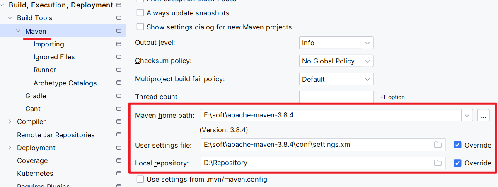

### 创建 Maven 项目

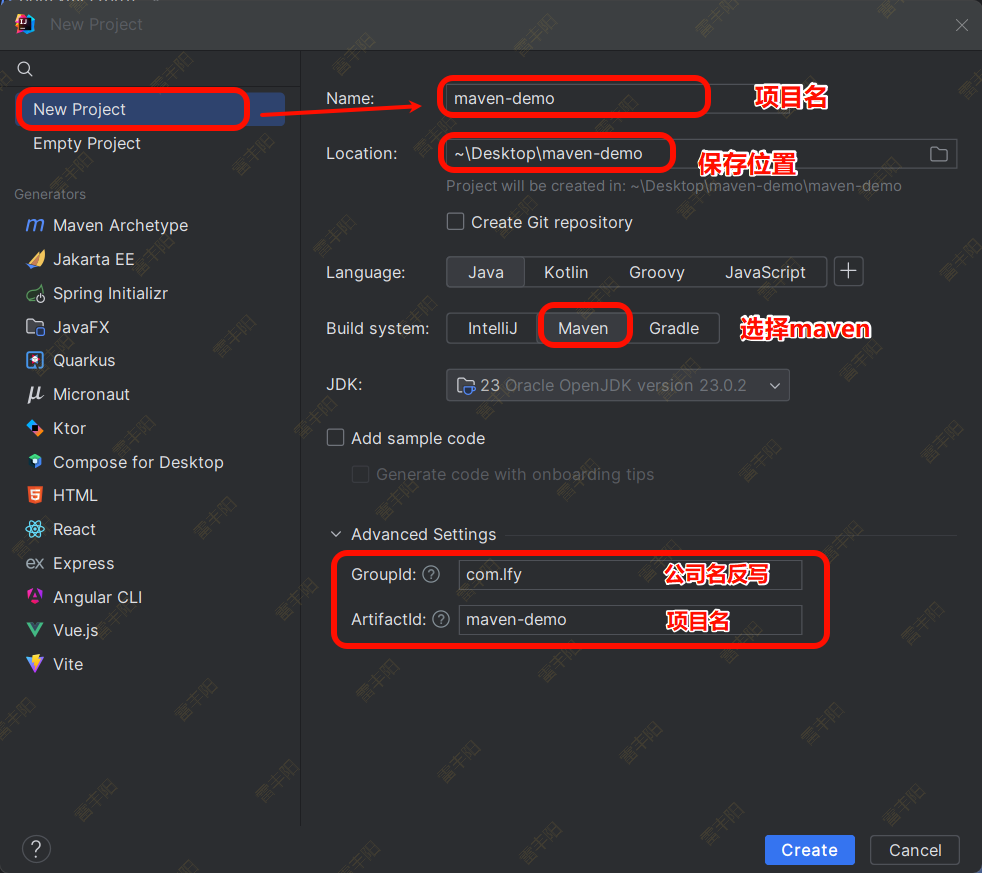

### maven项目结构

#### 普通项目结构

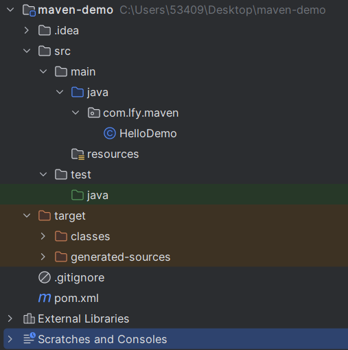

Maven - 普通项目结构

- **src**： 源码文件夹
  - **main**： 主程序文件夹
    - **java**：  java代码文件夹
    - **resources**：配置文件夹
  - **test**：测试程序文件夹
    - **java**：  java测试代码文件夹
    - **resources**：测试配置文件夹
- **target**：编译后文件夹
- **pom.xml**：Maven项目核心文件

#### web项目结构（了解）

> 比普通项目结构多了 webapp 目录

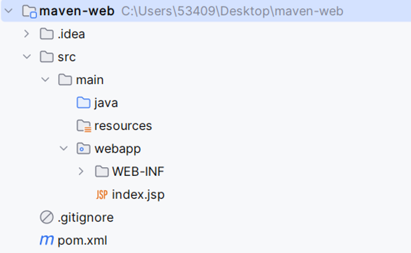

### pom.xml 解读

```shell
modelVersion：pom模型版本，固定写法；
groupId：组织名: 一把公司网址反写
artifactId：模块名：一般就是项目名
version：版本号：按照版本起名规范编写

name：项目显示名
description：项目描述
packaging：项目打包方式；pom、jar、war； 默认是 jar
properties：项目属性设置

......
```

# 依赖管理

**什么是依赖**：就是项目开发期间需要引入别人写好的项目功能，我们把这个称为**项目A依赖项目B**

## 依赖导入

项目中如果需要别的依赖，就需要在pom文件中导入别的依赖；具体操作流程如下：

1. 编写 dependencies 标签
2. 使用 dependency 标签
3. 填写依赖 GAV 坐标
  1. 第三方包：去 https://mvnrepository.com/ 搜索jar；复制gav坐标
  2. 自己写的包：写 gav 即可

> 当我们写好坐标依赖以后，需要点击刷新按钮

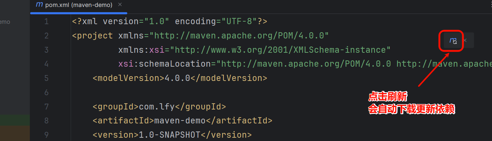

## 依赖传递

如果我们导入如下依赖；会发现项目中引入了一堆其他依赖；这个就叫依赖的传递

```xml
        <dependency>
            <groupId>org.springframework</groupId>
            <artifactId>spring-web</artifactId>
            <version>6.1.11</version>
        </dependency>
```

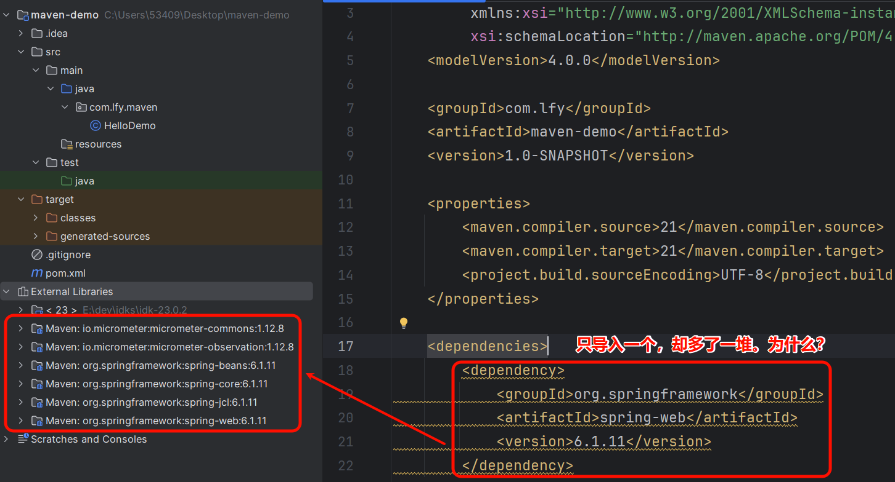

如果存在这样的引用关系：A -> B -> C；那么 A -> C

解释：项目引入某个依赖，这个依赖的依赖都会被全部引入

**创建多个maven工程，测试传递性**

- **路径不同**：**最短路径原则**（**就近原则**）
- **路径相同**：**先声明者优先**（**就近原则**）

## 依赖范围

我们可以通过设置依赖范围，从而实现让这个依赖只在指定范围内生效

> **maven项目依赖生效**分为**三个时期：编译期**、**测试期**、**运行期**；
> 
> **scope**控制依赖在**哪个时期**会**被加载和生效**，**默认取值为 compile（全时期）;**

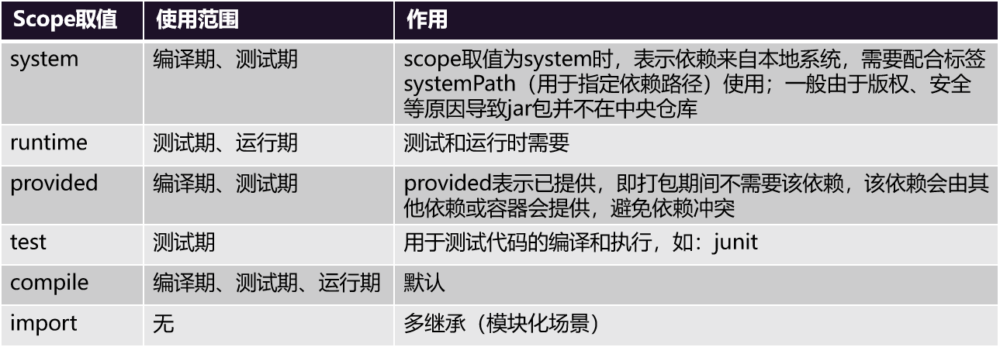

注意：

1. runtime 常用complie 代替，而compile是默认可以不用配置，也就是所一般只配test和provided；
2. 从中央仓库搜索并复制的依赖，无需管scope，默认设置好。比如(servlet-api、junit)

**特别注意：非 compile和runtime 的依赖不会传递**

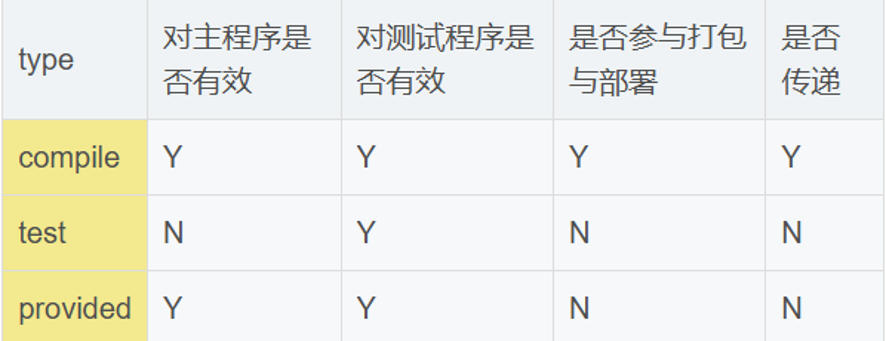

## 依赖排除

> 如果我们引入了依赖A，A又引入了B，但是我们不想要B，`就可以使用 exclusions 排除B；`；写法如下

```xml
<dependency>
    <groupId>org.springframework</groupId>
    <artifactId>spring-web</artifactId>
    <version>6.1.11</version>
    <exclusions>
        <exclusion>
            <groupId>io.micrometer</groupId>
            <artifactId>micrometer-observation</artifactId>
        </exclusion>
    </exclusions>
</dependency>

```

## 可选依赖

> 添加 optional 选项可以设置为可选的，主要用来禁用某个包的依赖传递特性。但他不是scope设置。

```xml
<!-- 可选依赖不具备传递性，如需使用，要手动再次引入 -->
<dependency>
    <groupId>com.atguigu</groupId>
    <artifactId>app1</artifactId>
    <version>1.0.0</version>            
    <optional>true</optional>
</dependency>
```

## 属性抽取

> 我们一般会把依赖的版本号，抽取成属性，然后进行统一管理；
> 
> **如下**：可以实现的效果是：修改一处版本号，凡是引用此属性的版本号都会一起修改。

```xml
<properties>
    <spring.version>6.1.11</spring.version>
</properties>

<dependencies>
    <dependency>
        <groupId>org.springframework</groupId>
        <artifactId>spring-web</artifactId>
        <version>${spring.version}</version>
    </dependency>
    <dependency>
        <groupId>org.springframework</groupId>
        <artifactId>spring-aop</artifactId>
        <version>${spring.version}</version>
    </dependency>
    <dependency>
        <groupId>org.springframework</groupId>
        <artifactId>spring-tx</artifactId>
        <version>${spring.version}</version>
    </dependency>
</dependencies>

```

# 项目构建

## 构建过程

> 一个项目常规的构建过程如下

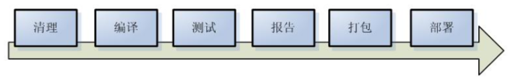

## 生命周期

> maven中定义的项目常用生命周期阶段如下；红色为关键大阶段，其余是更细节的小阶段（一般不用关注）

> **重点：执行任何一个生命周期阶段，之前的生命周期阶段都会被执行**

```shell
validate 验证项目是否正确，所有必要的信息可用
generate-sources
process-sources
generate-resources
process-resources 复制并处理资源文件，至目标目录，准备打包。
compile 编译项目的源代码。
process-classes
generate-test-sources
process-test-sources
generate-test-resources
process-test-resources 复制并处理资源文件，至目标测试目录。
test-compile 编译测试源代码。
process-test-classes
test 使用合适的单元测试框架运行测试。测试代码不会被打包或部署
prepare-package
package 接受编译好的代码，打包成可发布的格式，如JAR、WAR、zip
pre-integration-test
integration-test
post-integration-test
verify 对集成测试的结果执行任何检查，以确保满足质量标准
install 将包安装至本地仓库，以让其它项目依赖。
deploy 将最终的包复制到远程的仓库
```

## 构建命令

> 以下是maven中常用的各个阶段的项目构建命名；

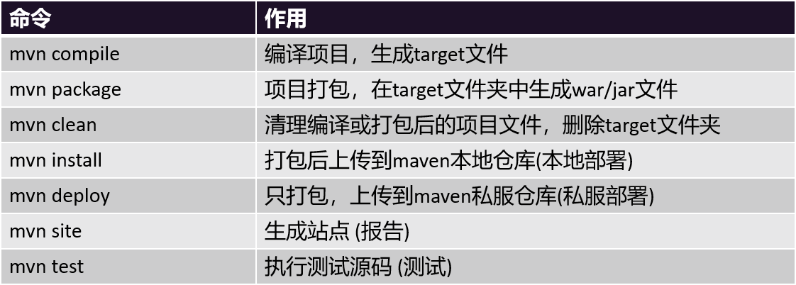

## 可视化

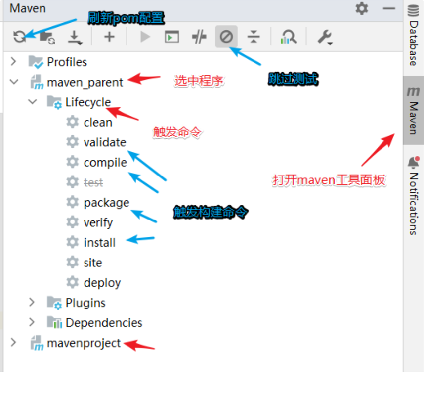

## 插件&目标

> **插件：生命周期与插件是相互绑定的。**
> 
> 执行生命周期命令时，需要通过插件来完成。compile 和test-compile 都通过同一个插件完成的。

> **目标：** 就是插件所需要做的事情，
> 
> 例如：
> 
> - maven-compiler-plugin 既可以执行compile，也可以执行testCompile 
> - compile和testCompile是maven-compiler-plugin插件的两个功能；
> - 当maven-compiler-plugin插件执行compile的时候，那么compile就是插件的一个最终目标；

官方常用插件：https://maven.apache.org/plugins/index.html； 如下插件例子；他可以把项目打成压缩包

```xml
<build>
    <plugins>
        <plugin>
            <groupId>org.apache.maven.plugins</groupId>
            <artifactId>maven-rar-plugin</artifactId>
            <version>3.0.0</version>
            <executions>
                <execution>
                    <id>test</id>
                    <goals>
                        <goal>rar</goal>
                    </goals>
                </execution>
            </executions>
        </plugin>
    </plugins>
</build>
```

# 模块化

## 继承

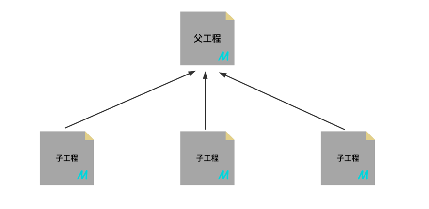

> maven的项目可以产生父子继承关系；如果A是B的子项目，则会产生如下的效果

1. **依赖继承**：子继承父依赖
2. **插件继承**：子继承父插件
3. **依赖管理**：父管理子依赖
4. **版本锁定**：父锁定版本
5. **属性继承**：子继承父属性
6. **多继承**：使用import，一个模块就可以继承更多的其他模块也行

## 聚合

> 子项目继承父项目，那么父项目就聚合了子项目；副项目可以统一管理所有的子项目

使用聚合；就得创建多个模块，然后在父项目中使用  modules 聚合多个模块；聚合后产生如下效果

1. 模块顺序：自动打包顺序
2. 统一编译
3. 统一打包

# 其他

1. Idea 安装** maven search **插件，这样就可以直接在idea中搜索依赖，不用去中央仓库
2. Idea 安装 **Maven-Helper **插件，可以解决常见的jar包冲突
3. `清理maven错误缓存.bat`； 可以帮我们删除未下载完成的文件，污染仓库的文件。脚本内容如下：

注意：把 `D:\repository` 改为自己本地仓库的位置

```bash
@echo off
rem 这里写你的仓库路径
set REPOSITORY_PATH=D:\repository
rem 正在搜索...
for /f "delims=" %%i in ('dir /b /s "%REPOSITORY_PATH%\*lastUpdated*"') do (
    del /s /q %%i
)
rem 搜索完毕
pause
```