# 2. Spring

# 简介

## 什么是Spring

> Spring是企业级一站式框架：
> 
> - **企业级**：经过企业实战使用。稳定性高、可靠性强、扩展性好
> - **一站式**：一个框架就可以提供企业开发期间的所有解决方案
> - **框架**：众多通用功能逻辑的封装集合

**广义的Spring**： spring.io 提供的所有框架集合。

我们称为`Spring系列技术栈`或`Spring全家桶`或`Spring生态`；如下

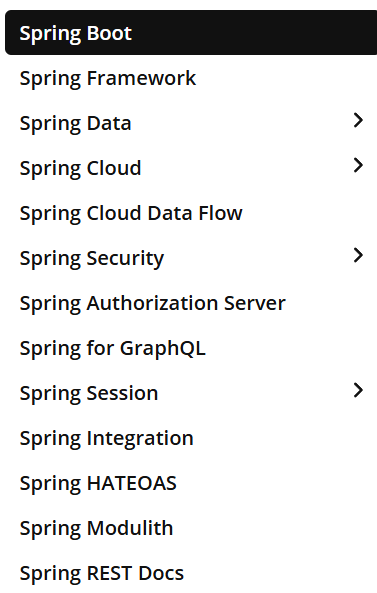

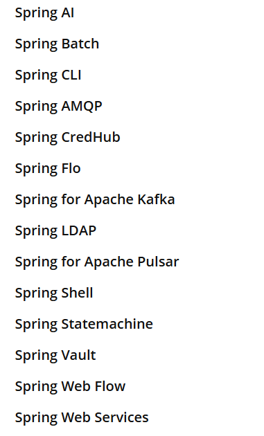

**狭义的Spring**：特指 `Spring Framework `

## 什么是框架

**框架（framework）**：

- **建筑学领域**：用于承载一个**系统必要功能**的**基础要素的集合**
- **计算机领域**：某**特定领域系统**的**一组约定**、**标准**、**代码库**以及**工具**的集合


> 框架与工具的区别：
> 
> 框架：提供某个领域一系列的解决方案
> 
> 工具：提供少量的常用小功能封装
> 
> 可以认为：`框架 = 基础功能 + N多工具`

## Spring Framework

Spring是一个** IOC(DI)** 和 **AOP 框架**

**Spring有很多优良特性**

1. **非侵入式**：基于Spring开发的应用中的对象可以不依赖于Spring的API
2. **依赖注入**：DI（Dependency Injection）是反转控制（IOC）最经典的实现
3. **面向切面编程**：Aspect Oriented Programming - AOP
4. **容器**：Spring是一个容器，包含并管理应用对象的生命周期
5. **组件化**：Spring通过将众多简单的组件配置组合成一个复杂应用。
6. **一站式**：Spring提供了一系列框架，解决了应用开发中的众多问题

## Spring 模块划分

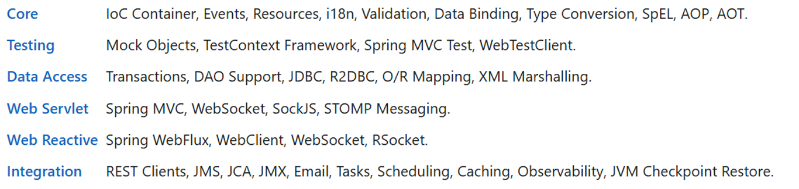

**Core（核心）**：IoC容器、事件、资源、国际化、数据校验、数据绑定、类型转换、SpEL、AOP、AOT

**Testing（测试）**：对象模拟、测试框架、SpringMVC测试、WebTestClient

**Data Access（数据访问）**：事务、DAO 支持、JDBC、R2DBC、对象关系映射、XML转换

**Web Servlet（Servlet式Web）**：SpringMVC、WebSocket、SockJS、STOMP 消息

Web Reactive（响应式Web）：Spring WebFlux、WebClient、WebSocket、RSocket

**Integration（整合）**：REST 客户端、Java消息服务、Java 缓存抽象、Java 管理扩展、邮件、任务、调度、缓存、可观测性、JVM 检查点恢复

学习重点如下：

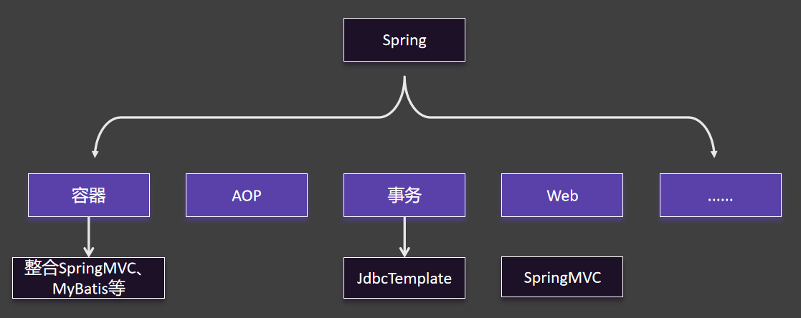

# 容器

## 基本概念

### 组件和容器

> 如何理解组件和容器概念

**组件：****具有一定功能的对象**；比如我们写过的Controller、Service、Dao都是组件，因为他们提供了一系列的方法（也就是具有功能）。一般认为entity不是组件（因为只有数据，没有功能）

**容器：****管理组件**（主要对组件进行创建、获取、保存、销毁等）


### 常见的容器和组件案例

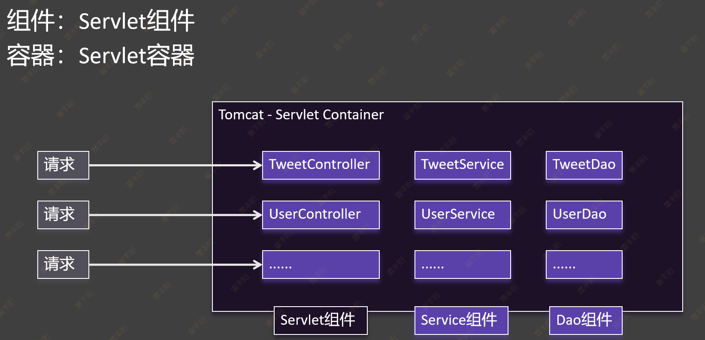

### IOC和DI

**IoC：Inversion of Control（控制反转）**

- **控制**：资源（也就是对象）的控制权（资源的创建、获取、销毁等）
- **反转**：和传统的方式不一样了；
  - **传统方式**：用啥，程序员自己new啥。
  - **反转方式**：Spring自动发现，缺啥，Spring自己new啥。
  - **不一样之处**：程序员主动new，然后程序用； 变为 程序主动new，然后程序自己用
- **娶媳妇例子**：
  - 传统方式：自己谈、自己找
  - 控制反转方式：**老许，你要老婆不要**

[📎 20250719_214437.mp4](<files/20250719_214437.mp4>)

**DI ：Dependency Injection（依赖注入）**

- **依赖**：组件的依赖关系(不是jar包依赖)，如 NewsController 依赖 NewsServices依赖dao
- **注入**：通过setter方法、构造器、反射等方式自动的注入,从而不需要自己new对象

控制反转是一种思想,实现的方式就是依赖注入。Spring是容器框架用来实现依赖注入;

因此**目前学习的主要目标**就是：`想办法把组件注入到spring容器中`，先让容器管理起来

### 创建项目

使用 Spring 初始化向导创建

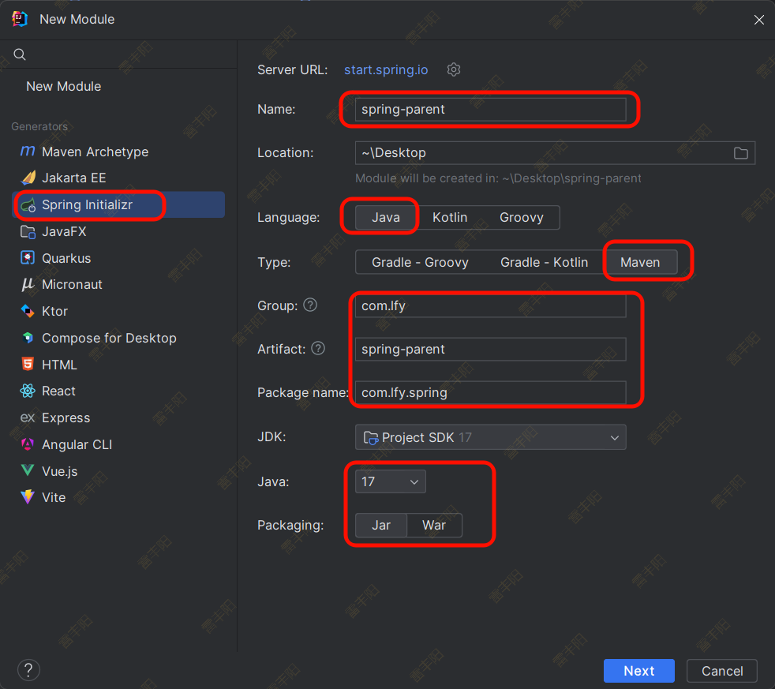

## 组件注册

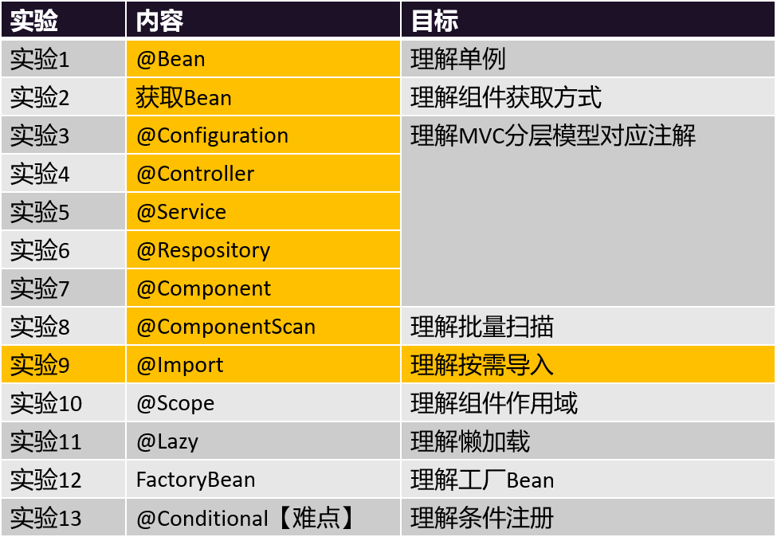

### 实验1：@Bean

#### 准备一个JavaBean

```java
@Data
public class Person {
    private String name;
    private int age;
    private String gender;
    public Person() {
    }
}
```

#### 注册容器中

> 在主程序类中，使用 @Bean 标准在某个方法上，这个方法返回的对象，就会注册到容器中

```typescript
/**
 * 主入口类,主程序类
 */
@SpringBootApplication
public class Spring01Application {

    //准备一个javabean,给容器中注册一个自己的组件,每个组件都有名字,方法名就是组件的名字 
    //可以通过改方法名或者@bean("这里写名字")
    @Bean  //如果组件名重复了,容器里只会有一个组件 按照方法的字母排序或者先                                                          后写的顺序排序
    public Person p() {
            Person person = new Person(); //可以下载插件GenerateAllsetter 直接alt回车生成所有的set
            person.setName("张三");
            person.setAge(23);
            person.setGender("女");
            return person;
    }
} //注册组件成功后,输出时会有p这个组件
```

#### 从容器中获取

> 编写main方法；代码如下

```typescript
/**
* 主入口类,主程序类
*/
@SpringBootApplication
public class Spring01Application {    
        public static void main(String[] args) {
                //继承自ApplicationContext:Spring应用上下文
                ConfigurableApplicationContext run = SpringApplication.run(Spring01Application.class, args);
                //这个run就是ioc容器
                System.out.println("run = " + run);

                //看容器中装了哪些组件
                String[] beanDefinitionNames = run.getBeanDefinitionNames();
                for (String beanDefinitionName : beanDefinitionNames) {
                        System.out.println(beanDefinitionName);//Spring的默认组件
                }
        }
}
```

### 实验2： 获取Bean

> 1. 组件创建时机：容器启动默认就创建好了。
> 2. 组件是单实例的。默认只创建一个
> 3. **从容器中获取组件的**规则：
>   1. 1）、组件不存在，抛异常：NoSuchBeanDefinitionException
>   2. 2）、组件不唯一，
>     -  按照类型只要一个：抛异常：NoUniqueBeanDefinitionException
>     - 按照名字只要一个：精确获取到指定对象
>     - 按照类型获取多个：返回所有组件的集合（Map）
>   3. 3）、组件唯一存在，正确返回。

```typescript
 public static void main(String[] args) {
        //1、跑起一个Spring的应用；  ApplicationContext：Spring应用上下文对象； IoC容器
        ConfigurableApplicationContext ioc = SpringApplication.run(Spring01IocApplication.class, args);
        System.out.println("ioc = " + ioc);

        System.out.println("=============================");
        //2、获取到容器中所有组件的名字；容器中装了哪些组件； Spring启动会有很多默认组件
//        String[] names = ioc.getBeanDefinitionNames();
//        for (String name : names) {
//            System.out.println("name = " + name);
//        }


        //4、获取容器中的组件对象；精确获取某个组件
        // 组件的四大特性：(名字、类型)、对象、作用域
        // 组件名字全局唯一；组件名重复了，一定只会给容器中放一个最先声明的哪个。

        //小结：
        //从容器中获取组件，
        //  1）、组件不存在，抛异常：NoSuchBeanDefinitionException
        //  2）、组件不唯一，
        //      按照类型只要一个：抛异常：NoUniqueBeanDefinitionException
        //      按照名字只要一个：精确获取到指定对象
        //      按照类型获取多个：返回所有组件的集合（Map）
        //  3）、组件唯一存在，正确返回。


        //4.1、按照组件的名字获取对象
        Person zhangsan = (Person) ioc.getBean("zhangsan");
        System.out.println("对象 = " + zhangsan);

        //4.2、按照组件类型获取对象
//        Person bean = ioc.getBean(Person.class);
//        System.out.println("bean = " + bean);
        
        //4.3、按照组件类型获取这种类型的所有对象
        Map<String, Person> type = ioc.getBeansOfType(Person.class);
        System.out.println("type = " + type);

        //4.4、按照类型+名字
        Person bean = ioc.getBean("zhangsan", Person.class);
        System.out.println("bean = " + bean);


        //5、组件是单实例的....

    }
```

### 实验3：@Configuration

> **组件**是框架的底层配置
> 
> Spring一般用**配置类**来**分类管理组件的配置 ; **配置类也属于一个组件**@Configuration**
> 
> > 注意：以后不把那些@bean放在main里, 而是放在一个个配置类里, Person类的组件都放在PersonConfig,xxx类的组件都放在xxxConfig
> 
> 包括@Import   @ComponentScan 等都放在配置类下

```java
package com.lfy.spring.ioc.config;

import com.lfy.spring.ioc.bean.Person;
import com.lfy.spring.ioc.condition.MacCondition;
import com.lfy.spring.ioc.condition.WindowsCondition;
import org.springframework.context.annotation.*;


@Configuration //告诉Spring容器，这是一个配置类
public class PersonConfig {

    @Bean
    public Person haha() {
        Person person = new Person();
        person.setName("张三2");
        person.setAge(20);
        person.setGender("男");
        return person;
    }
    //3、给容器中注册一个自己的组件； 容器中的每个组件都有自己的名字，方法名就是组件的名字
    @Bean("zhangsan")
    public Person zhangsan() {
        Person person = new Person();
        person.setName("张三1");
        person.setAge(20);
        person.setGender("男");
        return person;
    }
    @Bean("lisi")
    public Person lisi() {
        Person person = new Person();
        person.setName("李四");
        person.setAge(20);
        person.setGender("男");
        return person;
    }

}
```

### 实验4-7：mvc分层注解

> **各层标各自的注解**,这个注解是给人看的,都写@Component也行, 底层都是@Component 也包括@Configuration
> 
> @Controller： 标在控制器层
> 
> @Service：     服务层
> 
> @Repository：持久层
> 
> @Component：非mvc的其他地方
> 
> > 注意:分层注解起作用的前提是,这些组件必须在**主程序所在的包及其子包目录结构下**

```java
package com.lfy.spring.ioc.controller;


@Controller
public class UserController {

}
```

```java
package com.lfy.spring.ioc.service;


@Service
public class UserService {

}
```

```java
package com.lfy.spring.ioc.dao;


@Repository
public class UserDao {


}
```

> 注意：@Controller、@Service、@Repository 底层 都是 @Component；源码如下

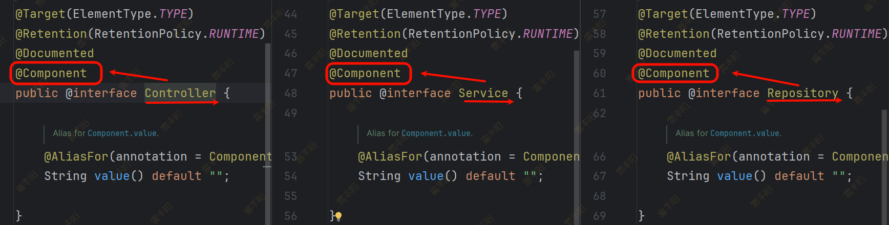

### 实验8：@ComponentScan

> 批量扫描：如果某个包下的一堆组件都不在main程序所在的包下，可以使用批量扫描导入

```java
@Configuration
//组件批量扫描； 只扫利用Spring相关注解注册到容器中的组件
@ComponentScan(basePackages = "com.lfy.spring") 
public class AppConfig {


}
```

### 实验9：@Import

> 导入第三方组件；因为引入别人的依赖，所以修改不了别人的代码，如果想注册别人包里面的组件，可以使用这个功能； 注意：`CoreConstants `不是Spring的，是`logback`的

```java
package com.lfy.spring.ioc.config;


import ch.qos.logback.core.CoreConstants;
import org.springframework.context.annotation.ComponentScan;
import org.springframework.context.annotation.Configuration;
import org.springframework.context.annotation.Import;


@Import({CoreConstants.class})
@Configuration
//组件批量扫描； 只扫利用Spring相关注解注册到容器中的组件
@ComponentScan(basePackages = "com.lfy.spring")
public class AppConfig {


}
```

### 实验10：@Scope

> @Scope：组件作用域

```typescript
    /**
     * @Scope 调整组件的作用域：
     * 1、@Scope("prototype")：非单实例:
     *      容器启动的时候不会创建非单实例组件的对象。
     *      什么时候获取，什么时候创建
     * 2、@Scope("singleton")：单实例： 默认值
     *      容器启动的时候会创建单实例组件的对象。
     *      容器启动完成之前就会创建好
     *    @Lazy：懒加载
     *      容器启动完成之前不会创建懒加载组件的对象
     *      什么时候获取，什么时候创建
     * 3、@Scope("request")：同一个请求单实例
     * 4、@Scope("session")：同一次会话单实例
     *
     * @return
     */
    public static void test04(String[] args) {
        // @Scope("singleton")
        ConfigurableApplicationContext ioc = SpringApplication.run(Spring01IocApplication.class, args);

        System.out.println("=================ioc容器创建完成===================");
        Object zhangsan1 = ioc.getBean("zhangsan");
        System.out.println("zhangsan1 = " + zhangsan1);
        Object zhangsan2 = ioc.getBean("zhangsan");
        System.out.println("zhangsan2 = " + zhangsan2);

        //容器创建的时候（完成之前）就把所有的单实例对象创建完成
        System.out.println(zhangsan1 == zhangsan2);

        System.out.println("=========================================");
//        Dog bean = ioc.getBean(Dog.class);
//        System.out.println("dog = " + bean);

    }
```

### 实验11：@Lazy

> **懒加载**：需要配合`@Scope("singleton")`*才能有用；*

```typescript
    /**
     * 2、@Scope("singleton")：单实例： 默认值
     *      容器启动的时候会创建单实例组件的对象。
     *      容器启动完成之前就会创建好
     *    @Lazy：懒加载
     *      容器启动完成之前不会创建懒加载组件的对象
     *      什么时候获取，什么时候创建
     *
     * @return
     */
package com.lfy.spring.ioc.config;

import com.lfy.spring.ioc.bean.Person;
import com.lfy.spring.ioc.condition.MacCondition;
import com.lfy.spring.ioc.condition.WindowsCondition;
import org.springframework.context.annotation.*;


@Configuration //告诉Spring容器，这是一个配置类
public class PersonConfig {

    @Lazy
    @Bean("zhangsan")
    public Person haha() {
        Person person = new Person();
        person.setName("张三2");
        person.setAge(20);
        person.setGender("男");
        return person;
    }

    @Bean("lisi")
    public Person lisi() {
        Person person = new Person();
        person.setName("李四");
        person.setAge(20);
        person.setGender("男");
        return person;
    }

}
```

### 实验12：FactoryBean

> **FactoryBean：工厂Bean**；Spring定义的一个接口，这个组件是一个工厂，他不产生自己类型的对象，而是制造别的对象

```java
package com.lfy.spring.ioc.factory;

import com.lfy.spring.ioc.bean.Car;
import org.springframework.beans.factory.FactoryBean;
import org.springframework.stereotype.Component;


// 场景：如果制造某些对象比较复杂的时候，利用工厂方法进行创建。
@Component
public class BYDFactory implements FactoryBean<Car> {


    /**
     * 调用此方法给容器中制造对象
     * @return
     * @throws Exception
     */
    @Override
    public Car getObject() throws Exception {
        System.out.println("BYDFactory 正在制造Car对象...");
        Car car = new Car();
        return car;
    }


    /**
     * 说明造的东西的类型
     * @return
     */
    @Override
    public Class<?> getObjectType() {
        return Car.class;
    }


    /**
     * 是单例？
     *    true：是单例的；
     *    false：不是单例的；
     * @return
     */
    @Override
    public boolean isSingleton() {
        return true;
    }
}
```

> 测试

```c++
// FactoryBean在容器中放的组件的类型，是接口中泛型指定的类型，组件的名字是 工厂自己的名字
public static void main(String[] args) {
    ConfigurableApplicationContext ioc = SpringApplication.run(Spring01IocApplication.class, args);
    System.out.println("=================ioc容器创建完成===================");


    Car bean1 = ioc.getBean(Car.class);
    Car bean2 = ioc.getBean(Car.class);
    System.out.println(bean1 == bean2);

    Map<String, Car> beansOfType = ioc.getBeansOfType(Car.class);
    System.out.println("beansOfType = " + beansOfType);
}
```

### 实验13：@Conditional【难点】

> 条件注册：只有符合某种条件，才会注册对应的Bean
> 
> 条件注册非常强大，他是SpringBoot的底层原理

#### 原生conditional

使用步骤：

1. 创建condition的实现，用来代表匹配某种条件
2. @Conditional注解指定好条件，标注在某个组件上。这个组件只有符合条件才会注册到容器中

##### 条件接口实现

```java
package com.lfy.spring.ioc.condition;

import org.springframework.context.annotation.Condition;
import org.springframework.context.annotation.ConditionContext;
import org.springframework.core.env.Environment;
import org.springframework.core.type.AnnotatedTypeMetadata;

public class WindowsCondition implements Condition {
    @Override
    public boolean matches(ConditionContext context, AnnotatedTypeMetadata metadata) {
        //判断环境变量中的OS 包含windows，就是windows系统
        Environment environment = context.getEnvironment();
        String property = environment.getProperty("OS");
        return property.contains("Windows");
    }
}
```

```java
package com.lfy.spring.ioc.condition;

import org.springframework.context.annotation.Condition;
import org.springframework.context.annotation.ConditionContext;
import org.springframework.core.env.Environment;
import org.springframework.core.type.AnnotatedTypeMetadata;

public class MacCondition implements Condition {
    @Override
    public boolean matches(ConditionContext context, AnnotatedTypeMetadata metadata) {
        Environment environment = context.getEnvironment();

        String property = environment.getProperty("OS");

        return property.contains("mac");
    }
}
```

##### 条件标注在组件上

```java
@Configuration //告诉Spring容器，这是一个配置类
public class PersonConfig {

    //场景：判断当前电脑的操作系统是windows还是mac
    //  windows 系统，容器中有 bill
    //  mac 系统，容器中有 joseph
    @Conditional(MacCondition.class)
    @Bean("joseph")
    public Person joseph(){
        Person person = new Person();
        person.setName("乔布斯");
        person.setAge(20);
        person.setGender("男");
        return person;
    }

    @Conditional(WindowsCondition.class)
    @Bean("bill")
    public Person bill(){
        Person person = new Person();
        person.setName("比尔盖茨");
        person.setAge(20);
        person.setGender("男");
        return person;
    }
 }
```

##### 测试条件是否生效

```typescript
/**
 * 条件注册
 * @param args
 */
public static void main(String[] args) {
    ConfigurableApplicationContext ioc = SpringApplication.run(Spring01IocApplication.class, args);

    Map<String, Person> beans = ioc.getBeansOfType(Person.class);
    System.out.println("beans = " + beans);


    //拿到环境变量
    ConfigurableEnvironment environment = ioc.getEnvironment();

    String property = environment.getProperty("OS");
    System.out.println("property = " + property);

    Map<String, Dog> beansOfType = ioc.getBeansOfType(Dog.class);
    System.out.println("dogs = " + beansOfType);

    Map<String, UserService> ofType = ioc.getBeansOfType(UserService.class);
    System.out.println("ofType = " + ofType);

}
```

> 可以修改程序运行时环境变量 OS；继续测试；

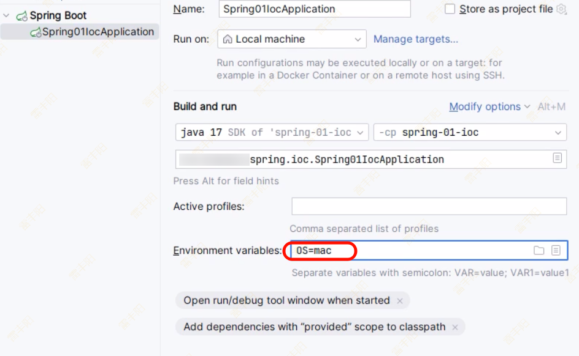

#### @Conditional 派生注解

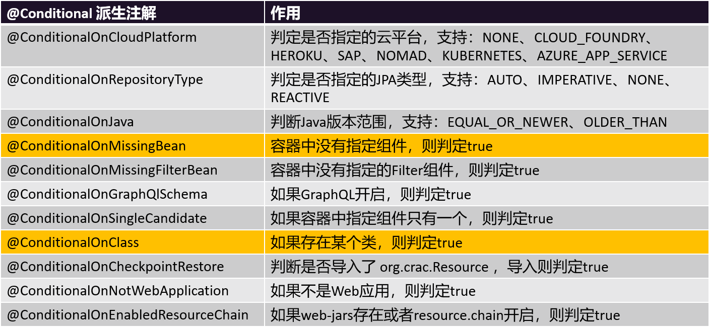

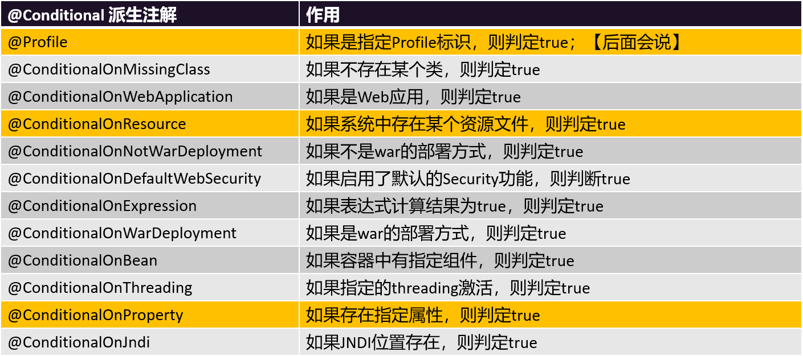

## 组件注入

> 组件注入，就是我们常说的依赖注入；

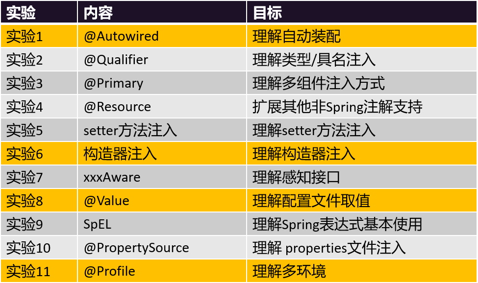

### 实验1：@Autowired

> 标注：@Autowired，可以让 Spring 把对应的组件自动赋值给这个属性；
> 
> 注入规则如下：

```typescript
@ToString
@Data
@Controller
public class UserController {

    /**
     * 自动装配流程（先按照类型，再按照名称）
     * 1、按照类型，找到这个组件；
     *      1.0、只有且找到一个，直接注入，名字无所谓
     *      1.1、如果找到多个，再按照名称去找; 变量名就是名字（新版）。
     *           1.1.1、如果找到： 直接注入。
     *           1.1.2、如果找不到，报错
     */
    @Autowired //自动装配； 原理：Spring 调用 容器.getBean
    UserService abc;

    @Autowired
    Person bill;

    @Autowired  //把这个类型的所有组件都拿来
    List<Person> personList;

    @Autowired  //key是组件名字，value是组件对象
    Map<String,Person> personMap;

    @Autowired //注入ioc容器自己
    ApplicationContext applicationContext;
}
```

### 实验2：@Qualifier

```java
package com.lfy.spring.ioc.service;


import com.lfy.spring.ioc.bean.Dog;
import com.lfy.spring.ioc.bean.Person;
import com.lfy.spring.ioc.dao.UserDao;
import jakarta.annotation.Resource;
import lombok.Data;
import lombok.ToString;
import org.springframework.beans.factory.annotation.Autowired;
import org.springframework.beans.factory.annotation.Qualifier;
import org.springframework.stereotype.Component;
import org.springframework.stereotype.Service;


@Data
@ToString
@Service
public class UserService {


    /**
     * Consider marking one of the beans as @Primary,
     * updating the consumer to accept multiple beans,
     * or using @Qualifier to identify the bean that should be consumed
     */
//    @Qualifier("bill") //精确指定：如果容器中这样的组件存在多个，则使用@Qualifier精确指定组件名

    @Qualifier("bill") //精确指定：如果容器中这样的组件存在多个，且有默认组件。我们可以使用 @Qualifier 切换别的组件。
    @Autowired
    Person atom; // @Primary 一旦存在，改属性名就不能实现组件切换了。


}
```

### 实验3：@Primary

> 同样类型的组件有多个，如果直接 自动注入 会报错。
> 
> 这时可以使用 @Primary 标注默认使用哪个组件。自动注入的就是指定的这个组件

```java
package com.lfy.spring.ioc.config;

import ch.qos.logback.core.CoreConstants;
import com.lfy.spring.ioc.bean.Person;
import com.lfy.spring.ioc.condition.MacCondition;
import com.lfy.spring.ioc.condition.WindowsCondition;
import org.springframework.boot.autoconfigure.AutoConfigureOrder;
import org.springframework.context.annotation.*;


@Configuration //告诉Spring容器，这是一个配置类
public class PersonConfig {


    @Primary //主组件：默认组件
    @Bean("haha")
    public Person haha() {
        Person person = new Person();
        person.setName("张三2");
        person.setAge(20);
        person.setGender("男");
        return person;
    }
    //3、给容器中注册一个自己的组件； 容器中的每个组件都有自己的名字，方法名就是组件的名字
    @Bean("zhangsan")
    public Person zhangsan() {
        Person person = new Person();
        person.setName("张三1");
        person.setAge(20);
        person.setGender("男");
        return person;
    }
    @Bean("lisi")
    public Person lisi() {
        Person person = new Person();
        person.setName("李四");
        person.setAge(20);
        person.setGender("男");
        return person;
    }

}
```

### 实验4：@Resource

```java
package com.lfy.spring.ioc.service;


import com.lfy.spring.ioc.bean.Dog;
import com.lfy.spring.ioc.bean.Person;
import com.lfy.spring.ioc.dao.UserDao;
import jakarta.annotation.Resource;
import lombok.Data;
import lombok.ToString;
import org.springframework.beans.factory.annotation.Autowired;
import org.springframework.beans.factory.annotation.Qualifier;
import org.springframework.stereotype.Component;
import org.springframework.stereotype.Service;


@Data
@ToString
@Service
public class UserService {


    //面试题：@Resource 和 @Autowired 区别？
    //1、@Autowired 和 @Resource 都是做bean的注入用的，都可以放在属性上
    //2、@Resource 具有更强的通用性
    @Resource
    UserDao userDao;

//    @Autowired(required = false)

//    @Resource
//    @Autowired(required = false)
//    Dog dog;


}
```

### 实验5：setter方法注入

> setter方法上标注 @Autowired ，Spring会在创建组个组件对象的时候，自动把setter方法中需要的所有参数值，全部自动注入进来。

```typescript
package com.lfy.spring.ioc.dao;


import com.lfy.spring.ioc.bean.Dog;
import lombok.ToString;
import org.springframework.beans.factory.annotation.Autowired;
import org.springframework.beans.factory.annotation.Qualifier;
import org.springframework.stereotype.Component;
import org.springframework.stereotype.Repository;


@ToString
@Repository
public class UserDao {


    Dog haha;

    @Autowired
    public void setDog(@Qualifier("dog02") Dog dog) {
        System.out.println("setDog..."+dog);
        this.haha = dog;
    }
}
```

### 实验6：构造器注入

> 如果一个类只有一个有参构造器，Spring在创建这个类对象的时候，会调用此有参构造器，那么，有参构造器需要的所有对象，Spring都会自动注入（从容器中找，然后赋值）

```java
package com.lfy.spring.ioc.dao;


import com.lfy.spring.ioc.bean.Dog;
import lombok.ToString;
import org.springframework.beans.factory.annotation.Autowired;
import org.springframework.beans.factory.annotation.Qualifier;
import org.springframework.stereotype.Component;
import org.springframework.stereotype.Repository;


@ToString
@Repository
public class UserDao {


    Dog haha;


    /**
     * 推荐：构造器注入
     * @param dog
     */
    //Spring 自动去容器中找到 构造器需要的所有参数的组件值。
    public UserDao(Dog dog){
        System.out.println("UserDao...有参构造器："+dog);
        this.haha = dog;
    }

}
```

### 实验7：xxxAware

> xxxAware是Spring提供的感知接口；实现这些接口的组件，Spring会自动把对应的 xxx 注入到组件内。
> 
> 注意：既要实现xxxAware接口，组件还要自己声明变量，保存这些xxxAware传入来的值；

```typescript
package com.lfy.spring.ioc.service;

import lombok.Data;
import lombok.Getter;
import lombok.ToString;
import org.springframework.beans.factory.BeanNameAware;
import org.springframework.context.EnvironmentAware;
import org.springframework.core.env.Environment;
import org.springframework.stereotype.Service;


@Getter
@ToString
@Service
public class HahaService implements EnvironmentAware, BeanNameAware {

    private Environment environment;
    private String myName;

    @Override
    public void setEnvironment(Environment environment) {
        this.environment = environment;
    }

    public String getOsType(){
       return environment.getProperty("OS");
    }

    @Override
    public void setBeanName(String name) {
        this.myName = name;
    }
}
```

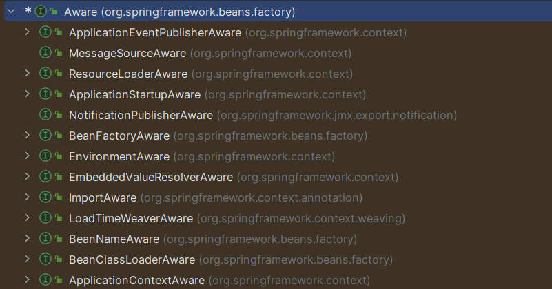

### 实验8：@Value

> @Value 可以标注在属性上，给属性指定值；
> 
> **@Value 三种用法**：
> 
> 1. ***@Value("字面值")****: 直接赋值；*
> 2. ***@Value("${key}")****：动态从配置文件中取出某一项的值。*
> 3. ***@Value("#{SpEL}")****：Spring Expression Language；Spring 表达式语言*
>   1. *更多写法：**https://docs.spring.io/spring-framework/reference/core/expressions.html*

```java
package com.lfy.spring.ioc.bean;


import lombok.Data;
import lombok.ToString;
import org.springframework.beans.factory.annotation.Autowired;
import org.springframework.beans.factory.annotation.Value;
import org.springframework.stereotype.Component;

import java.util.UUID;


@ToString
@Data
@Component
public class Dog {

//    @Autowired // 自动注入组件的。基本类型，自己搞。


    /**
     * 1、@Value("字面值"): 直接赋值
     * 2、@Value("${key}")：动态从配置文件中取出某一项的值。
     * 3、@Value("#{SpEL}")：Spring Expression Language；Spring 表达式语言
     *      更多写法：https://docs.spring.io/spring-framework/reference/core/expressions.html
     *
     */
    @Value("旺财")
    private String name;
    @Value("${dog.age}")
    private Integer age;

    //SpEL： 字面量与计算
    @Value("#{10*20}") 
    private String color;
    
    //SpEL： #{T(类名).方法()}；静态方法调用
    @Value("#{T(java.util.UUID).randomUUID().toString()}") 
    private String id;

    //SpEL： #{对象.方法()}；实例方法调用
    @Value("#{'Hello World!'.substring(0, 5)}")
    private String msg;

    //SpEL： #{new 对象().方法()}； 支持创建对象
    @Value("#{new String('haha').toUpperCase()}")
    private String flag;

    //SpEL： #{new int[] {1, 2, 3}}； 数组
    @Value("#{new int[] {1, 2, 3}}")
    private int[] hahaha;

    public Dog() {

        String string = UUID.randomUUID().toString();

        System.out.println("Dog构造器...");
    }
}
```

### 实验9：SpEL

> *SpEL：Spring Expression Language；Spring 表达式语言*
> *https://docs.spring.io/spring-framework/reference/core/expressions.html*

```java
    //SpEL： 字面量与计算
    @Value("#{10*20}") 
    private String color;
    
    //SpEL： #{T(类名).方法()}；静态方法调用
    @Value("#{T(java.util.UUID).randomUUID().toString()}") 
    private String id;

    //SpEL： #{对象.方法()}；实例方法调用
    @Value("#{'Hello World!'.substring(0, 5)}")
    private String msg;

    //SpEL： #{new 对象().方法()}； 支持创建对象
    @Value("#{new String('haha').toUpperCase()}")
    private String flag;

    //SpEL： #{new int[] {1, 2, 3}}； 数组
    @Value("#{new int[] {1, 2, 3}}")
    private int[] hahaha;
```

### 实验10：@PropertySource

> @PropertySource 用来导入 .properties 文件。这样就可以在任意位置使用 @Value 取出配置文件中的值;
> 
> 用法：`@PropertySource("classpath:conf/cat.properties")`
> 
> 支持的写法：
> 
> 1. `classpath:cat.properties`；从自己的项目类路径下找
> 2. `classpath*:Log4j-charsets.properties`；从所有包的类路径下找

```java
package com.lfy.spring.ioc.bean;


import lombok.Data;
import org.springframework.beans.factory.annotation.Value;
import org.springframework.context.annotation.PropertySource;
import org.springframework.stereotype.Component;


//说明属性来源： 把指定的文件导入容器中，供我们取值使用

// 1、classpath:cat.properties；从自己的项目类路径下找
// 2、classpath*:Log4j-charsets.properties；从所有包的类路径下找
@PropertySource("classpath:conf/cat.properties")
@Data
@Component
public class Cat {

    @Value("${cat.name:Tom}") // : 后面是取不到的时候的默认值；
    private String name;
    @Value("${cat.age:20}")
    private int age;

}
```

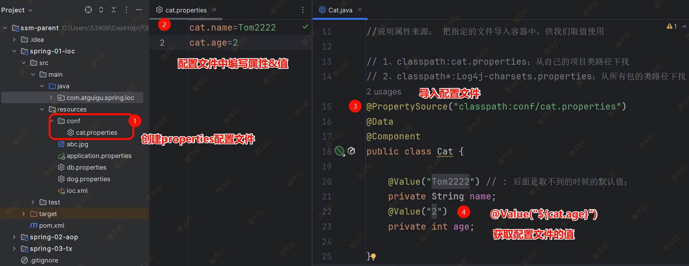

扩展：ResourceUtil：Spring提供的可以从类路径下获取资源的工具类；

```java
public static void main(String[] args) throws IOException {
    ConfigurableApplicationContext ioc = SpringApplication.run(Spring01IocApplication.class, args);
    System.out.println("=================ioc容器创建完成===================");

    Dog bean = ioc.getBean(Dog.class);
    System.out.println("bean = " + bean);

    Cat bean1 = ioc.getBean(Cat.class);
    System.out.println("cat = " + bean1);


    File file = ResourceUtils.getFile("classpath:abc.jpg");
    System.out.println("file = " + file);


    int available = new FileInputStream(file).available();
    System.out.println("available = " + available);

}
```

### 实验11：@Profile

> @Profile 是 @Conditional 的一种变体；用来支持多环境

实验场景：

1. 准备 MyDataSource 组件，用来封装数据源
2. 开发、测试、生产环境要有自己对应的数据源，他们的url、账号密码等都不一样
3. 可以激活某个环境，这个环境的数据源就会自动生效

> MyDataSource 组件

```typescript
@Data
public class MyDataSource {

    private String url;
    private String username;
    private String password;

}
```

> @Profile 指定环境标识

```java
package com.lfy.spring.ioc.config;


import com.lfy.spring.ioc.datasource.MyDataSource;
import org.springframework.context.annotation.Bean;
import org.springframework.context.annotation.Configuration;
import org.springframework.context.annotation.Profile;
//@Profile("dev") //整体激活
@Configuration
public class DataSourceConfig {

    //1、定义环境标识：自定义【dev、test、prod】； 默认【default】
    //2、激活环境标识：
    //      明确告诉Spring当前处于什么环境。
    //      你要不说是啥环境，就是 default 环境

    //利用条件注解，只在某种环境下激活一个组件。
    @Profile({"dev","default"})  //  @Profile("环境标识")。当这个环境被激活的时候，才会加入如下组件。
    @Bean
    public MyDataSource dev(){
        MyDataSource myDataSource = new MyDataSource();
        myDataSource.setUrl("jdbc:mysql://localhost:3306/dev");
        myDataSource.setUsername("dev_user");
        myDataSource.setPassword("dev_pwd");

        return myDataSource;
    }


    @Profile("test")
    @Bean
    public MyDataSource test(){
        MyDataSource myDataSource = new MyDataSource();
        myDataSource.setUrl("jdbc:mysql://localhost:3306/test");
        myDataSource.setUsername("test_user");
        myDataSource.setPassword("test_pwd");

        return myDataSource;
    }


    @Profile("prod")
    @Bean
    public MyDataSource prod(){
        MyDataSource myDataSource = new MyDataSource();
        myDataSource.setUrl("jdbc:mysql://localhost:3306/prod");
        myDataSource.setUsername("prod_user");
        myDataSource.setPassword("prod_pwd");

        return myDataSource;
    }
}
```

> 激活环境： 
> 
> 1. 修改 `application.properties`；
> 2. 指定配置：`spring.profiles.active=dev`

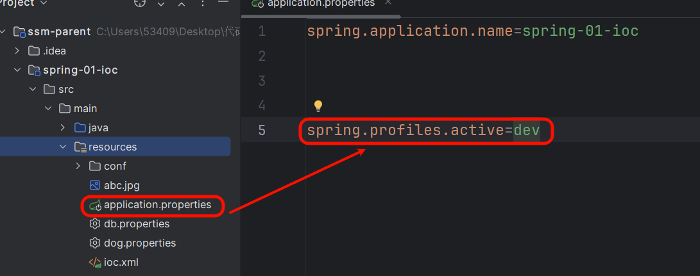

## 组件生命周期（了解）

> Spring容器中的组件**从创建**到**运行**到**销毁**，每个时机，Spring都提供了感知扩展回调方法。只需要按照Spring的规则编码，这样，这个组件生命周期到哪个阶段后，**Spring就会调用你的这个方法（回调机制）**

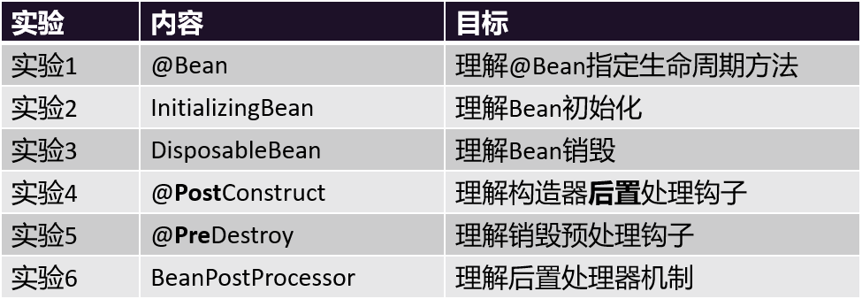

### 实验1：@Bean

> @Bean：可以设置两种生命周期回调
> 
> - **initMethod**：初始化方法；构造器创建好对象后，要对**对象进行初始化**（也就是各种属性默认赋值）
> - **destroyMethod**：销毁方法；容器删除组件时调用的方法

```typescript
package com.lfy.spring.ioc.config;


import com.lfy.spring.ioc.bean.User;
import org.springframework.context.annotation.Bean;
import org.springframework.context.annotation.Configuration;

@Configuration
public class UserConfig {


    @Bean(initMethod = "initUser",destroyMethod = "destoryUser")
    public User user(){
        return new User();
    }
}

@Data
public class User {
    private String username;
    private String password;

    public User(){
        System.out.println("【User】 ==> User 构造器...");
    }


    public void initUser(){
        System.out.println("【User】 ==> @Bean 初始化：initUser");
    }

    public void destoryUser(){
        System.out.println("【User】 ==> @Bean 销毁：destoryUser");
    }
 }
```

### 实验2-3：InitializingBean、DisposableBean

> `InitializingBean `接口，包含`afterPropertiesSet`方法（顾名思义：属性设置后）；
> 
> `DisposableBean `接口，包含 `destroy `方法（顾名思义：销毁）
> 
> 以上两个接口提供的生命周期回调方法，会在对应的时机，由Spring框架触发调用

```typescript
package com.lfy.spring.ioc.bean;


import jakarta.annotation.PostConstruct;
import jakarta.annotation.PreDestroy;
import lombok.Data;
import org.springframework.beans.factory.DisposableBean;
import org.springframework.beans.factory.InitializingBean;
import org.springframework.beans.factory.annotation.Autowired;


//BeanPostProcessor：Bean外挂修改器

@Data
public class User implements InitializingBean, DisposableBean {
    private String username;
    private String password;

    private Car car;


    @Autowired
    public void setCar(Car car) {
        System.out.println("【User】 ==> setter 自动注入：属性值："+car);
        this.car = car;
    }

    public User(){
        System.out.println("【User】 ==> User 构造器...");
    }


    public void initUser(){
        System.out.println("【User】 ==> @Bean 初始化：initUser");
    }

    public void destoryUser(){
        System.out.println("【User】 ==> @Bean 销毁：destoryUser");
    }


    /**
     * 属性设置之后进行调用： set赋值完成了
     * @throws Exception
     */
    @Override
    public void afterPropertiesSet() throws Exception {
        System.out.println("【User】 ==> 【InitializingBean】 ==== afterPropertiesSet....");
    }

    @Override
    public void destroy() throws Exception {
        System.out.println("【User】 ==> 【DisposableBean】 ==== destroy....");
    }
}
```

### 实验4-5：@PostConstruct、@PreDestroy

> @PostConstruct 注解（顾名思义：构造器后置方法），标注在某个方法上，构造器调用后，此方法会被回调
> 
> @PreDestroy 注解（顾名思义：销毁前），标注在某个方法上，组件销毁之前，此方法会被回调

```typescript
package com.lfy.spring.ioc.bean;

@Data
public class User implements InitializingBean, DisposableBean {
    private String username;
    private String password;

    private Car car;

    public User(){
        System.out.println("【User】 ==> User 构造器...");
    }


    @PostConstruct //构造器之后
    public void postConstruct(){
        System.out.println("【User】 ==> @PostConstruct....");
    }


    @PreDestroy
    public void preDestroy(){
        System.out.println("【User】 ==> @PreDestroy....");
    }


}
```

### 实验6：BeanPostProcessor

> BeanPostProcessor：Bean后置处理器； 会拦截所有Bean的创建过程，提供两个方法
> 
> 1. postProcessAfterInitialization：  初始化后的回调函数
> 2. postProcessBeforeInitialization： 初始化前的回调函数
> 
> **初始化前**：一般认为Bean的属性赋值还没有完成
> 
> **初始化后**：一般认为Bean的属性值就已经创建完成

```typescript
package com.lfy.spring.ioc.processor;

import com.lfy.spring.ioc.bean.User;
import org.springframework.beans.BeansException;
import org.springframework.beans.factory.config.BeanPostProcessor;
import org.springframework.stereotype.Component;


@Component //拦截所有Bean的后置处理器
public class MyTestBeanPostProcessor implements BeanPostProcessor {


    @Override
    public Object postProcessAfterInitialization(Object bean, String beanName) throws BeansException {
        System.out.println("【postProcessAfterInitialization】："+beanName);
        return bean;
    }

    @Override
    public Object postProcessBeforeInitialization(Object bean, String beanName) throws BeansException {
        System.out.println("【postProcessBeforeInitialization】："+beanName);

        if(bean instanceof User hello){
            hello.setUsername("张三测试");
        }
        return bean;
    }
}
```

### 完整生命周期流程

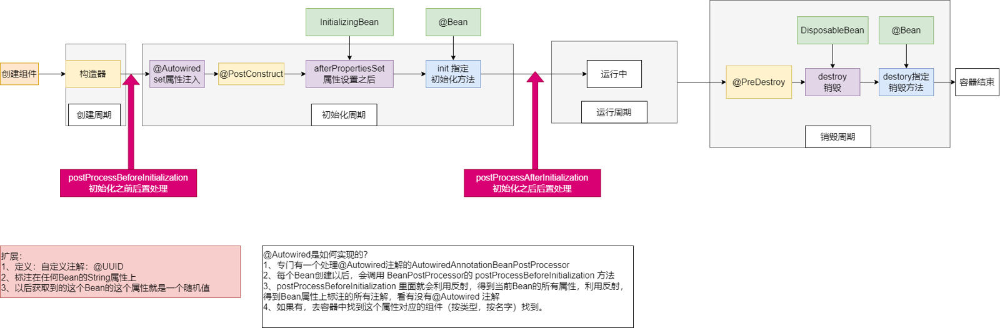

### 扩展：使用BeanPostProcessor，实现UUID赋值

> 1. 自定义注解 @UUID
> 2. 编写专门处理 UUID注解的后置处理器；
> 3. 找到组件所有标注了 @UUID  注解的

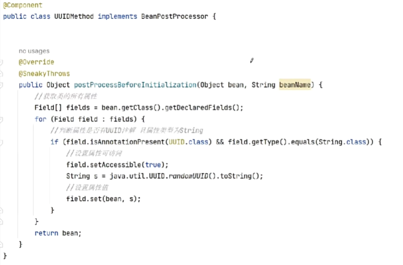

## 小结

> 1. **组件 放到 容器中**，以后才能有用
>   1. 使用之前实验的 组件注册 的各种方法，把组件放到容器中
> 2. 容器（Spring）能为他里面的所有组件提供各种强大功能，比如
>   1. **自动依赖注入：记住几个常用的**
>     - **@Value：配置文件取值**
>     - **@Autowired**：**自动注入**
>     - **构造器注入**
>     - **@Profile**：多环境适配
>   2. **声明式事务**（后来讲）
>   3. **AOP：面向切面编程**（后来讲）
> 3. 单元测试：
>   1. 以后单元测试类标注 `@SpringBootTest`
>   2. 这个测试类就可以放心大胆的` @Autowired `容器中的组件进行测试

```typescript
package com.lfy.spring.ioc;


import com.lfy.spring.ioc.bean.User;
import com.lfy.spring.ioc.dao.DeliveryDao;
import org.junit.jupiter.api.Test;
import org.springframework.beans.factory.annotation.Autowired;
import org.springframework.boot.test.context.SpringBootTest;

import java.util.UUID;

//SpringBoot 单元测试，可以直接测试Spring容器中的组件
@SpringBootTest
public class HelloTest {


    @Autowired
    User user;

    @Autowired
    DeliveryDao deliveryDao;


    @Test
    void test02(){
        String string = UUID.randomUUID().toString();
        System.out.println("string = " + string);
    }

    @Test
    void test01(){
//        System.out.println("user = " + user);
        deliveryDao.saveDelivery();
    }


}
```

# AOP

> **AOP：Aspect Oriented Programming（面向切面编程）**
> 
> **OOP：Object Oriented Programming（面向对象编程）**
> 
> 面向切面编程：一种可以在**程序运行过程中**，**动态加入**部分**代码逻辑**的技术

**场景设计**

1. 设计：编写一个计算器接口和实现类，提供加减乘除四则运算
2. 需求：在加减乘除运算的时候需要记录操作日志（运算前参数、运算后结果）
3. **实现：**
  1. 静态代理
  2. 动态代理
  3. AOP

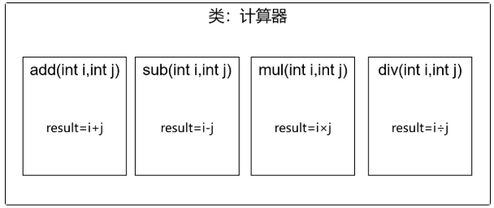

## 场景搭建

### MathCalculator 接口

```java
package com.lfy.spring.aop.calculator;

public interface MathCalculator {

    //定义 四则运算
    int add(int i,int j);

    //减法
    int sub(int i,int j);

    //乘法
    int mul(int i,int j) ;

    //除法
    int div(int i,int j);

}
```

### MathCalculatorImpl 实现类

```java
package com.lfy.spring.aop.calculator.impl;

import com.lfy.spring.aop.calculator.MathCalculator;
import org.springframework.stereotype.Component;


@Component
public class MathCalculatorImpl implements MathCalculator {
    @Override
    public int add(int i, int j) {
        int result = i + j;

        return result;
    }

    @Override
    public int sub(int i, int j) {

        int result = i - j;

        return result;
    }

    @Override
    public int mul(int i, int j) {

        int result = i * j;

        return result;
    }

    @Override
    public int div(int i, int j) {

        int result = i / j;

        return result;
    }
}
```

### 给计算方法加日志

> 
> * 添加日志的两种方式：*
> * 1、****硬编码****： 不推荐； 耦合：（通用逻辑 + 专用逻辑）希望不要耦合； 耦合太多就是维护地狱*
> * 2、****静态代理****：*
> *       定义：定义一个代理对象，包装这个组件。以后业务的执行，从代理开始，不直接调用组件；*
> *      特点：定义期间就指定好了互相代理关系*

```java
package com.lfy.spring.aop.calculator.impl;

import com.lfy.spring.aop.calculator.MathCalculator;
import org.springframework.stereotype.Component;


@Component
public class MathCalculatorImpl implements MathCalculator {
    @Override
    public int add(int i, int j) {
//        System.out.println("【日志】add 开始：参数："+i+","+j);
        int result = i + j;
        System.out.println("结果："+result);
//        System.out.println("【日志】add 返回：结果："+result);
        return result;
    }

    @Override
    public int sub(int i, int j) {

        int result = i - j;

        return result;
    }

    @Override
    public int mul(int i, int j) {

        int result = i * j;

        return result;
    }

    @Override
    public int div(int i, int j) {

        int result = i / j;

        return result;
    }
}
```

## 添加日志业务实现

### 静态代理实现添加日志

```java
package com.lfy.spring.aop.proxy.statics;

import com.lfy.spring.aop.calculator.MathCalculator;
import lombok.Data;
import org.springframework.stereotype.Component;


/**
 * 静态代理：   编码时期间就决定好了代理的关系
 *    定义：代理对象，是目标对象的接口的子类型，代理对象本身并不是目标对象，而是将目标对象作为自己的属性。
 *    优点：同一种类型的所有对象都能代理
 *    缺点：范围太小了，只能负责部分接口代理功能
 * 动态代理：   运行期间才决定好了代理关系（拦截器：拦截所有）
 *    定义：目标对象在执行期间会被动态拦截，插入指定逻辑
 *    优点：可以代理世间万物
 *    缺点：不好写
 *
 */
@Data
public class CalculatorStaticProxy implements MathCalculator {

    private MathCalculator target; //目标对象

    public CalculatorStaticProxy(MathCalculator mc){
        this.target = mc;
    }


    @Override
    public int add(int i, int j) {
        System.out.println("【日志】add 开始：参数："+i+","+j);
        int result = target.add(i, j);
        System.out.println("【日志】add 返回：结果："+result);
        return result;
    }

    @Override
    public int sub(int i, int j) {
        int result = target.sub(i,j);
        return result;
    }

    @Override
    public int mul(int i, int j) {
        int result = target.mul(i,j);
        return result;
    }

    @Override
    public int div(int i, int j) {
        int result = target.div(i,j);
        return result;
    }
}
```

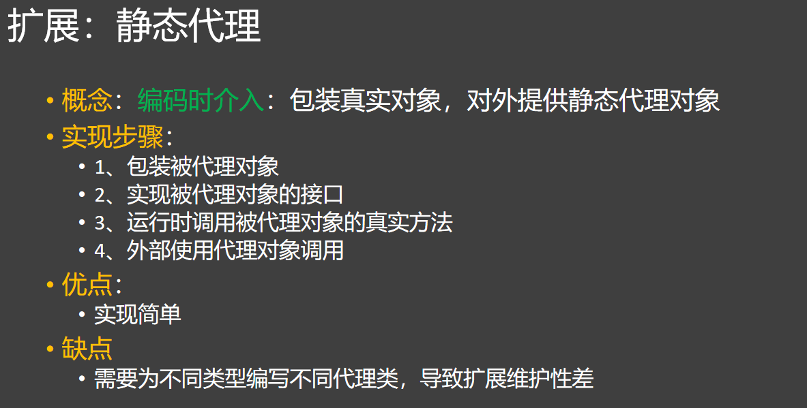

### 动态代理实现添加日志

> **动态代理：**是Java 反射包提供的功能。使用 `Proxy.``newProxyInstance() `*方法，可以获取一个对象的代理对象。*
> 
> **代理对象就是对原生对象的一种封装**，每次要执行原生对象方法的时候，代理对象就会拦截方法的执行。将方法的执行权交给代理对象。只有**代理对象调用** `method.invoke(target, args)`; 原生对象的方法才能被真正执行。
> 
> ***由于JDK提供的动态代理功能，必须要求写接口，写实现，才能创建动态代理，有点麻烦。所以我们后来会直接使用Spring AOP功能来替代动态代理***

```java
package com.lfy.spring.aop.proxy.dynamic;

import com.lfy.spring.aop.log.LogUtils;

import java.lang.reflect.Proxy;
import java.util.Arrays;


/**
 * 动态代理： JDK动态代理；
 * 强制要求，目标对象必有接口。代理的也只是接口规定的方法。
 *
 */
public class DynamicProxy {

    //获取目标对象的代理对象
    public static Object getProxyInstance(Object target) {
        return Proxy.newProxyInstance(target.getClass().getClassLoader(),
                target.getClass().getInterfaces(),
                (proxy, method, args) -> {
                    String name = method.getName();
                    //记录开始
                    LogUtils.logStart(name, args);
                    Object result = null;
                    try{
                        result = method.invoke(target, args);
                        //记录返回值
                        LogUtils.logReturn(name, result);
                    }catch (Exception e){
                        //记录异常
                        LogUtils.logException(name, e);
                    }finally {
                        //记录结束
                        LogUtils.logEnd(name);
                    }
                    return result;
                }
        );
    }
}
```

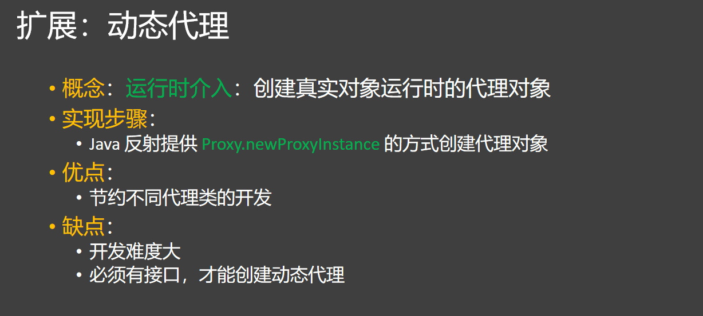

## AOP 实现

> Spring AOP 可以在目标方法 **执行之前、执行返回结果时、执行结束后、执行出异常时** 提供快速的拦截操作。到了指定时机，Spring就会回调对应的方法；

### 核心概念

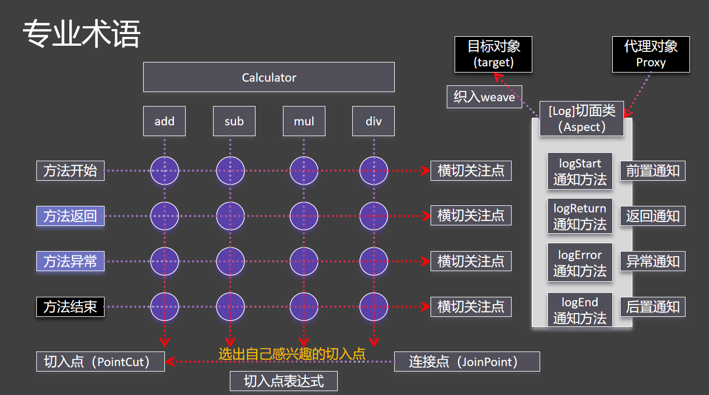

**目标对象****（target）**：就是原生的 `new MathCalculatorImpl() `对象；

**代理对象****（proxy）**：Spring会自动的为目标对象（也就是原生对象）

**横切关注点****：方法的几个执行时机**

1. **方法开始**：方法执行之前
2. **方法返回**：方法执行完成，没有异常得到了返回值后
3. **方法异常**：方法出现异常，导致中断，来到了catch逻辑
4. **方法结束**：方法无论执行成功或者失败，总是要结束，也就是 finally 里面逻辑

**通知方法**：在每个方法的执行时机，我们可能需要Spring回调一个方法。比如：加法执行前，需要调用记录日志方法。这个记录日志方法就称为通知方法；有五种通知

1. **前置通知**：在目标方法调用之前调用
2. **返回通知**：在目标方法执行得到返回值后调用
3. **异常通知**：在目标方法执行出现异常后调用
4. **后置通知**：在目标方法结束之后（无论正常还是异常）调用
5. **环绕通知**：完全自定义在目标方法执行的哪个位置调用。且可以拦截影响目标方法的执行

**切面类**：按照面向对象的封装原则，我们会把所有日志方法都封装到日志类中。这个日志类我们就叫切面类

**连接点**：每个横切关注点的位置，都是一个**连接点**，这个连接点未来会封装当前正在执行的方法的详细信息。

**切入点**：连接点有很多，但是我们真正感兴趣需要切入的，我们称为切入点。

**切入点表达式**：需要使用Spring规定的切入点表达式写法，从众多连接点中，找到我们需要切入的点。

### 实现步骤

> **步骤：**
> 
> 1、导入 AOP 依赖
> 
> 2、编写切面 Aspect
> 
> 3、编写通知方法
> 
> 4、指定切入点表达式
> 
> 5、测试 AOP 动态织入

#### 导入aop依赖

> pom.xml 文件中添加如下依赖；

```xml
<dependency>
    <groupId>org.springframework.boot</groupId>
    <artifactId>spring-boot-starter-aop</artifactId>
</dependency>
```

#### 编写切面

> 配合 @Aspect 注解

```java
@Component
@Aspect //告诉Spring这个组件是个切面。
public class LogAspect {


}
```

#### 编写通知方法

```java
package com.lfy.spring.aop.aspect;


import org.aspectj.lang.JoinPoint;
import org.aspectj.lang.annotation.*;
import org.aspectj.lang.reflect.MethodSignature;
import org.springframework.core.annotation.Order;
import org.springframework.stereotype.Component;

import java.util.Arrays;


@Component
@Aspect //告诉Spring这个组件是个切面。
public class LogAspect {
/**
 * 1、告诉Spring，以下通知何时何地运行？
 *      何时？
 *         @Before：方法执行之前运行。
 *         @AfterReturning：方法执行正常返回结果运行。
 *         @AfterThrowing：方法抛出异常运行。
 *         @After：方法执行之后运行
 *         @Around：环绕通知；可以控制目标方法是否执行，修改目标方法参数、执行结果等。
 */   
    @Before
    public void logStart(JoinPoint joinPoint){

    }

    @After
    public void logEnd(){

    }

    @AfterReturning
    public void logReturn(){

    }

    @AfterThrowing
    public void logException(){
        
    }


}
```

#### 切入点表达式

> 切入点表达式是来告诉Spring，通知方法应该在哪个时机执行

> *切入点表达式；*`execution(方法的全签名)`*；方法全签名可以支持通配符写法；如下*
> 
> 1. ***全写法****：*
> 
> `[public] int [com.lfy.spring.aop.calculator.MathCalculator].add(int,int) [throws ArithmeticException]`
> 
> 1. ***省略写法***：`int add(int i,int j)`
> 2. ***通配符****：*
>   1. `*`*：**表示任意字符*
>   2. `..`*：表示任意多个匹配*
>     - ***写在参数位置****：表示多个参数，任意类型*
>     - ***写在全类名位置***：*代表多个层级*
> 3. **完全模糊匹配写法**：`* *(..)`

```java
package com.lfy.spring.aop.aspect;


import org.aspectj.lang.JoinPoint;
import org.aspectj.lang.annotation.*;
import org.aspectj.lang.reflect.MethodSignature;
import org.springframework.core.annotation.Order;
import org.springframework.stereotype.Component;

import java.util.Arrays;


@Order(10000) //数字越小，优先级越高，数字越大，优先级越低; 数字越小，越先执行，就必须套到最外层
@Component
@Aspect //告诉Spring这个组件是个切面。
public class LogAspect {


    @Pointcut("execution(int com.lfy.spring.aop.calculator.MathCalculator.*(..))")
    public void pointCut(){};


    /**
     * 1、告诉Spring，以下通知何时何地运行？
     *      何时？
     *         @Before：方法执行之前运行。
     *         @AfterReturning：方法执行正常返回结果运行。
     *         @AfterThrowing：方法抛出异常运行。
     *         @After：方法执行之后运行
     *         @Around：环绕通知；可以控制目标方法是否执行，修改目标方法参数、执行结果等。
     *      何地？
     *         切入点表达式：
     *           execution(方法的全签名)：
     *             全写法：[public] int [com.lfy.spring.aop.calculator.MathCalculator].add(int,int) [throws ArithmeticException]
     *             省略写法：int add(int i,int j)
     *             通配符：
     *               *：表示任意字符
     *               ..：
     *                   1）、参数位置：表示多个参数，任意类型
     *                   2）、类型位置：代表多个层级
     *             最省略: * *(..)
     *
     * 2、通知方法的执行顺序：
     *      1、正常链路：  前置通知->目标方法->返回通知->后置通知
     *      2、异常链路：  前置通知->目标方法->异常通知->后置通知
     *
     * 3、JoinPoint： 包装了当前目标方法的所有信息
     */
    @Before("pointCut()")
    public void logStart(JoinPoint joinPoint){
        //1、拿到方法全签名
        MethodSignature signature = (MethodSignature) joinPoint.getSignature();

        //方法名
        String name = signature.getName();
        //目标方法传来的参数值
        Object[] args = joinPoint.getArgs();

        System.out.println("【切面 - 日志】【"+name+"】开始：参数列表：【"+ Arrays.toString(args) +"】");
    }

    @After("pointCut()")
    public void logEnd(JoinPoint joinPoint){
        MethodSignature signature = (MethodSignature) joinPoint.getSignature();
        String name = signature.getName();
        System.out.println("【切面 - 日志】【"+name+"】后置...");
    }


    @AfterReturning(value = "pointCut()",
                    returning = "result") //returning="result" 获取目标方法返回值
    public void logReturn(JoinPoint joinPoint,Object result){
        MethodSignature signature = (MethodSignature) joinPoint.getSignature();

        String name = signature.getName();

        System.out.println("【切面 - 日志】【"+name+"】返回：值："+result);
    }


    @AfterThrowing(
            value = "pointCut()",
            throwing = "e" //throwing="e" 获取目标方法抛出的异常
    )
    public void logException(JoinPoint joinPoint,Throwable e){
        MethodSignature signature = (MethodSignature) joinPoint.getSignature();
        String name = signature.getName();

        System.out.println("【切面 - 日志】【"+name+"】异常：错误信息：【"+e.getMessage()+"】");
    }


    //参数带什么就切
//    @Before("args(int,int)")
    public void haha(){
        System.out.println("【切面 - 日志】哈哈哈...");
    }

    //参数上有没有标注注解
//    @Before("@args(com.lfy.spring.aop.annotation.MyAn) && within(com.lfy.spring.aop.service.UserService)")
    public void hehehe(){
        System.out.println("【切面 - 日志】呵呵呵...");
    }

    //方法上
//    @Before("@annotation(com.lfy.spring.aop.annotation.MyAn)")
    public void test(){
        System.out.println("【切面 - 日志】MyAn测试...");
    }


}
```

#### AOP功能测试

```typescript
package com.lfy.spring.aop;


import com.lfy.spring.aop.annotation.MyAn;
import com.lfy.spring.aop.calculator.MathCalculator;
import com.lfy.spring.aop.service.UserService;
import org.junit.jupiter.api.Test;
import org.springframework.beans.factory.annotation.Autowired;
import org.springframework.boot.test.context.SpringBootTest;

@SpringBootTest
public class AopTest {


    @Autowired //容器中是它的代理对象
    MathCalculator mathCalculator;

    @Autowired
    UserService userService;


    @Test
    void test02() {
        mathCalculator.div(10, 0);
    }

    @Test
    void test01() {
//        System.out.println(mathCalculator.getClass()); //实现类
//

        mathCalculator.add(10, 2);
//        System.out.println("============");
//        mathCalculator.div(10, 2);

        userService.getUserHaha(1, 2);

        System.out.println("============");
        userService.updateUser();


    }
}
```

#### AOP原理

> `mathCalculator.add(10, 20);` 如何执行，并动态切入了通知方法
> **1. 增强器链：** 切面中的所有通知方法其实就是增强器。他们被组织成一个链路放到集合中。目标方法真正执行前后，会去增强器链中执行哪些需要提前执行的方法。
> **2. AOP 的底层原理**
> 1、Spring会为每个被切面切入的组件创建代理对象(Spring CGLIB 创建的代理对象，无视接口)。
> 2、代理对象中保存了切面类里面所有通知方法构成的增强器链。
> 3、目标方法执行时，会先去增强器链中拿到需要提前执行的通知方法，然后执行这个通知方法

## AOP 细节

### 通知方法执行顺序

通知方法的执行顺序

**正常：**前置通知 ==》目标方法 ==》返回通知 ==》后置通知

**异常：**前置通知 ==》目标方法 ==》异常通知 ==》后置通知

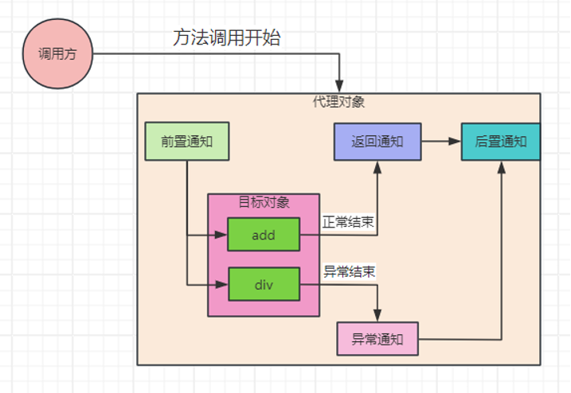

### 切入点表达式

> https://docs.spring.io/spring-framework/reference/core/aop/ataspectj/pointcuts.html

在 Spring AOP 中，切入点表达式（pointcut expressions）可以利用多种切点（pointcut）设计ator 来匹配连接点（Join point）。常见的切面表达式及其写法包括以下几种（可以通过逻辑运算符 &&、||、! 进行组合）：

1. **execution(...)**
• 用于匹配方法执行的连接点，是最常用的切点类型。
• 基本格式为：
`execution([修饰符模式] 返回值模式 [类全限定名模式].方法名模式(参数模式) [throws 异常模式])`
• 其中各部分都可以使用通配符(*)，如：*`execution(`` com.example.service.``.``(..))`
表示匹配 com.example.service 包下所有类的所有方法，方法的返回值不限制，参数不限制。
2. **within(...)**
• 用于匹配某个类型或者某些类型（类或接口）内部的所有方法。
• 基本格式为：`within(类型模式)`
• 例如：`within(com.example.service.*)`
表示匹配 com.example.service 包下所有类中的所有方法。
3. **this(...)**
• 用于匹配当前 AOP 代理对象（proxied object）的类型是否为指定类型（或其子类型）。
• 基本格式为：`this(类型表达式)`
• 例如：`this(com.example.service.MyService)`
表示在运行时检查代理对象是否是 MyService 类型（或其子类型）。
4. **target(...)**
• 用于匹配目标对象（目标类，而非代理类）的类型是否为指定类型（或其子类型）。
• 基本格式为：`target(类型表达式)`
• 例如：`target(com.example.service.MyService)`
5. **args(...)**
• 用于匹配连接点（方法）参数的类型是否与指定类型相匹配（或其子类型）。
• 基本格式为：`args(类型表达式列表)`
• 例如：`args(String, *)`
表示匹配第一个参数为 String 类型，第二个参数任意类型的方法。
6. **@target(...)**
• 用于匹配目标对象的类型上是否存在某个注解（annotation）。
• 基本格式为：`@target(注解类型)`
• 例如：`@target(org.springframework.stereotype.Service)`
7. **@within(...)**
• 用于匹配当前执行方法的类是否被某个注解标注（在类级别上）。
• 基本格式为：`@within(注解类型)`
• 例如：@within(org.springframework.stereotype.Component)
8. **@annotation(...)**
• 用于匹配当前执行的方法是否使用了某个注解。
• 基本格式为：`@annotation(注解类型)`
• 例如：`@annotation(org.springframework.transaction.annotation.Transactional)`
9. **@args(...)**
• 用于匹配执行方法的参数（运行时）所带有的注解类型。
• 基本格式为：`@args(注解类型列表)`
• 例如：`@args(org.springframework.web.bind.annotation.RequestParam)`
10. **bean(...)**
• 是 Spring AOP 特有的，用于匹配指定名称或符合名称模式的 Spring Bean。
• 基本格式为：`bean(beanName 或 beanNamePattern)`
• 例如：`bean(*Service)`
表示匹配所有名称以 Service 结尾的 Bean 中的方法。
11. **逻辑运算符**
• 可以利用 `&&`、`||` 及` ! `来组合和排除切入点表达式。
• 例如：`execution(* com.example..*(..)) && @annotation(org.springframework.transaction.annotation.Transactional)`
表示匹配 com.example 包及子包下所有方法，并且该方法上必须有 @Transactional 注解。

### Joinpoint 连接点

```java
package com.lfy.spring.aop.aspect;


import org.aspectj.lang.JoinPoint;
import org.aspectj.lang.annotation.*;
import org.aspectj.lang.reflect.MethodSignature;
import org.springframework.core.annotation.Order;
import org.springframework.stereotype.Component;

import java.util.Arrays;


@Order(10000) //数字越小，优先级越高，数字越大，优先级越低; 数字越小，越先执行，就必须套到最外层
@Component
@Aspect //告诉Spring这个组件是个切面。
public class LogAspect {


    @Pointcut("execution(int com.lfy.spring.aop.calculator.MathCalculator.*(..))")
    public void pointCut(){};


    /**
     */
    @Before("pointCut()")
    public void logStart(JoinPoint joinPoint){
        //1、拿到方法全签名
        MethodSignature signature = (MethodSignature) joinPoint.getSignature();

        //方法名
        String name = signature.getName();
        //目标方法传来的参数值
        Object[] args = joinPoint.getArgs();

        System.out.println("【切面 - 日志】【"+name+"】开始：参数列表：【"+ Arrays.toString(args) +"】");
    }

    @After("pointCut()")
    public void logEnd(JoinPoint joinPoint){
        MethodSignature signature = (MethodSignature) joinPoint.getSignature();
        String name = signature.getName();
        System.out.println("【切面 - 日志】【"+name+"】后置...");
    }


    @AfterReturning(value = "pointCut()",
                    returning = "result") //returning="result" 获取目标方法返回值
    public void logReturn(JoinPoint joinPoint,Object result){
        MethodSignature signature = (MethodSignature) joinPoint.getSignature();

        String name = signature.getName();

        System.out.println("【切面 - 日志】【"+name+"】返回：值："+result);
    }


    @AfterThrowing(
            value = "pointCut()",
            throwing = "e" //throwing="e" 获取目标方法抛出的异常
    )
    public void logException(JoinPoint joinPoint,Throwable e){
        MethodSignature signature = (MethodSignature) joinPoint.getSignature();
        String name = signature.getName();

        System.out.println("【切面 - 日志】【"+name+"】异常：错误信息：【"+e.getMessage()+"】");
    }

}
```

### @Pointcut 抽取切入点

```java
@Component
@Aspect //告诉Spring这个组件是个切面。
public class LogAspect {


    @Pointcut("execution(int com.lfy.spring.aop.calculator.MathCalculator.*(..))")
    public void pointCut(){};
    
}
```

### 多切面执行顺序

多切面同时切入同一个目标，则按照切面的优先级，优先级越高，越先执行，越是代理的最外层

> 使用 @Order 注解指定顺序：
> 
> - 数字越小，优先级越高，数字越大，优先级越低; 数字越小，越先执行，就必须套到最外层

```java
@Order(10000) //数字越小，优先级越高，数字越大，优先级越低; 数字越小，越先执行，就必须套到最外层
@Component
@Aspect //告诉Spring这个组件是个切面。
public class LogAspect {

}
```

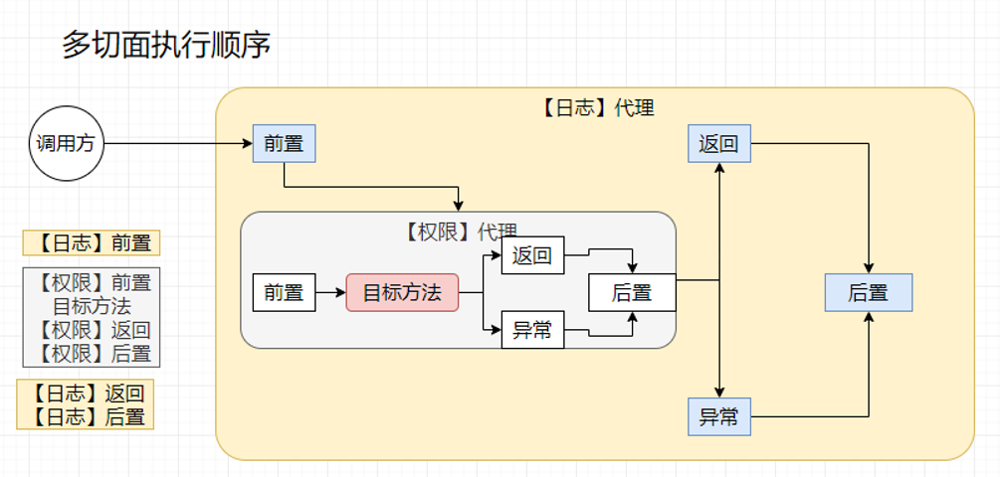

### @Around 环绕通知

```java
@Aspect
@Component
public class AroundAspect {
    @Pointcut("execution(int com.lfy.spring.aop.calculator.MathCalculator.*(..))")
    public void pointCut(){};

    /**
     * 环绕通知固定写法如下：
     * Object: 返回值
     * ProceedingJoinPoint: 可以继续推进的切点
     */

    @Around("pointCut()")
    public Object aroundAdvice(ProceedingJoinPoint pjp) throws Throwable {
        Object[] args = pjp.getArgs(); // 获取目标方法的参数

        // 前置
        System.out.println("环绕 - 前置通知：参数"+ Arrays.toString(args));
        Object proceed = null;
        try {
            //接受传入参数的 proceed ，实现修改目标方法执行用的参数
            proceed = pjp.proceed(args);// 继续执行目标方法; 反射 method.invoke()
            System.out.println("环绕 - 返回通知：返回值："+proceed);
        }catch (Throwable e){
            System.out.println("环绕 - 异常通知："+e.getMessage());
            throw e;  //让别人继续感知
        }finally {
            System.out.println("环绕 - 后置通知");
        }
        //修改返回值
        return proceed;
    }
}
```

### AOP使用场景

1. ***日志记录【√】****：在不修改业务代码的情况下，为方法调用添加日志记录功能。这有助于跟踪方法调用的时间、参数、返回值以及异常信息等。*

2. ***事务管理【√】****：在服务层或数据访问层的方法上应用事务管理，确保数据的一致性和完整性。通过AOP，可以自动地为需要事务支持的方法添加事务开始、提交或回滚的逻辑。*

3. ***权限检查【√】****：在用户访问某些资源或执行某些操作之前，进行权限检查。通过AOP，可以在不修改业务逻辑代码的情况下，为方法调用添加权限验证的逻辑。*

4. ***性能监控：****专业框架；对方法的执行时间进行监控，以评估系统的性能瓶颈。AOP 可以帮助在不修改业务代码的情况下，为方法调用添加性能监控的逻辑。*

5. ***异常处理【√】：**** 集中处理业务逻辑中可能抛出的异常，并进行统一的日志记录或错误处理。通过AOP，可以为方法调用添加异常捕获和处理的逻辑。*

6. ***缓存管理【√】：**** 在方法调用前后添加缓存逻辑，以提高系统的响应速度和吞吐量。AOP 可以帮助实现缓存的自动加载、更新和失效等逻辑。*

7. ***安全审计：****记录用户操作的历史记录，以便进行安全审计。通过AOP，可以在不修改业务逻辑代码的情况下，为方法调用添加安全审计的逻辑。*

8. ***自动化测试：****在测试阶段，通过AOP为方法调用添加模拟（mock）或桩（stub）对象，以便进行单元测试或集成测试。*

### AOP重点小结

1. 熟悉 切面与通知方法的编写，理解如下通知；
  1. 普通通知：前置、后置、返回、异常通知
  2. 环绕通知
2. 掌握两种常用 切入点表达式
  1. execution()
  2. @annotation()
3. 理解 切面执行流程
  1. **单切面**：
    - **正常**：前置 ==》目标 ==》返回 ==》后置
    - **异常**：前置 ==》目标 ==》异常 ==》后置
  2. **多切面**：按照切面优先级，@Order指定优先级，数字越小，优先级越高，越是代理最外层

# 声明式事务

> **声明式事务**：只需要告诉Spring框架，这个方法需要事务，框架会自动在运行方法时执行事务的流程控制逻辑。通过 Spring 的 @Transactional 注解，一键实现事务控制，不用编写任何代码

*【声明式】 vs 【编程式】*

> *** 声明式：通过声明业务需求，框架自动完成指定功能***
> *    优点：代码量小。*
> *    缺点：封装太多。排错不容易*
> *** 编程式：通过编写业务代码，程序员自行完成指定功能***
> *    优点：排错容易*
> *    缺点：代码量多*

## 环境准备

> 创建一个数据库 `spring_tx`，然后执行如下SQL

```sql
SET NAMES utf8mb4;
SET FOREIGN_KEY_CHECKS = 0;

-- ----------------------------
-- Table structure for account
-- ----------------------------
DROP TABLE IF EXISTS `account`;
CREATE TABLE `account`  (
  `id` int(0) NOT NULL AUTO_INCREMENT COMMENT '用户id',
  `username` varchar(255) CHARACTER SET utf8mb4 COLLATE utf8mb4_0900_ai_ci NULL DEFAULT NULL COMMENT '用户名',
  `age` int(0) NULL DEFAULT NULL COMMENT '年龄',
  `balance` decimal(10, 2)  NULL DEFAULT NULL COMMENT '余额',
  PRIMARY KEY (`id`) USING BTREE
) ENGINE = InnoDB AUTO_INCREMENT = 4 CHARACTER SET = utf8mb4 COLLATE = utf8mb4_0900_ai_ci ROW_FORMAT = Dynamic;

-- ----------------------------
-- Records of account
-- ----------------------------
INSERT INTO `account` VALUES (1, 'zhangsan', 18, 10000.00);
INSERT INTO `account` VALUES (2, 'lisi', 20, 10000.00);
INSERT INTO `account` VALUES (3, 'wangwu', 16, 10000.00);

-- ----------------------------
-- Table structure for book
-- ----------------------------
DROP TABLE IF EXISTS `book`;
CREATE TABLE `book`  (
  `id` int(0) NOT NULL AUTO_INCREMENT COMMENT '图书id',
  `bookName` varchar(255) CHARACTER SET utf8mb4 COLLATE utf8mb4_0900_ai_ci NULL DEFAULT NULL COMMENT '图书名',
  `price` decimal(10, 2) NULL DEFAULT NULL COMMENT '单价',
  `stock` int(0) NULL DEFAULT NULL COMMENT '库存量',
  PRIMARY KEY (`id`) USING BTREE
) ENGINE = InnoDB AUTO_INCREMENT = 4 CHARACTER SET = utf8mb4 COLLATE = utf8mb4_0900_ai_ci ROW_FORMAT = Dynamic;

-- ----------------------------
-- Records of book
-- ----------------------------
INSERT INTO `book` VALUES (1, '剑指Java', 100.00, 100);
INSERT INTO `book` VALUES (2, '剑指大数据', 100.00, 100);
INSERT INTO `book` VALUES (3, '剑指Offer', 100.00, 100);

SET FOREIGN_KEY_CHECKS = 1;

```

## JdbcTemplate（了解）

> Spring 内置了操作数据库的组件 `JdbcTemplate`；通过如下实验。了解用法；

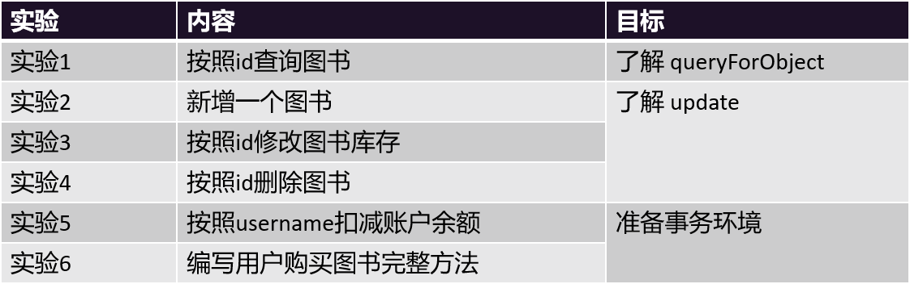

### 配置数据源

> pom.xml 中导入数据库场景

```xml
<dependency>
    <groupId>org.springframework.boot</groupId>
    <artifactId>spring-boot-starter-data-jdbc</artifactId>
</dependency>
<dependency>
    <groupId>com.mysql</groupId>
    <artifactId>mysql-connector-j</artifactId>
    <scope>runtime</scope>
</dependency>
<dependency>
    <groupId>org.projectlombok</groupId>
    <artifactId>lombok</artifactId>
    <scope>annotationProcessor</scope>
</dependency>
```

> application.properties 中配置数据源信息

```properties
spring.application.name=spring-03-tx

spring.datasource.url=jdbc:mysql://localhost:3306/spring_tx
spring.datasource.username=root
spring.datasource.password=123456
spring.datasource.driver-class-name=com.mysql.cj.jdbc.Driver
```

### 实验1：按照id查询图书

> 编写Book实体类

```java
@Data
public class Book {

    private Integer id;
    private String bookName;
    private BigDecimal price;
    private Integer stock;

}
```

> 编写 BookDao；
> 
> **核心方法:**
> 
> - `jdbcTemplate.queryForObject(sql, new BeanPropertyRowMapper<>(Book.class), id);`
> - `BeanPropertyRowMapper`: 将JavaBean的属性名和数据库的字段名做一一映射

```java
@Component
public class BookDao {

    @Autowired
    JdbcTemplate jdbcTemplate;


    /**
     * 按照id查询图书
     * @param id
     * @return
     */
    public Book getBookById(Integer id) {

        //1、查询图书SQL
        String sql = "select * from book where id  = ?";
        //2、执行查询
        Book book = jdbcTemplate.queryForObject(sql, new BeanPropertyRowMapper<>(Book.class), id);
        return book;
    }
}
```

> 单元测试

```java
package com.lfy.spring.tx;
import java.math.BigDecimal;

import com.atguigu.spring.tx.bean.Book;
import com.atguigu.spring.tx.dao.BookDao;
import org.junit.jupiter.api.Test;
import org.springframework.beans.factory.annotation.Autowired;
import org.springframework.boot.test.context.SpringBootTest;
import org.springframework.jdbc.core.JdbcTemplate;

import javax.sql.DataSource;
import java.sql.Connection;
import java.sql.SQLException;

@SpringBootTest
class Spring03TxApplicationTests {

    @Autowired
    DataSource dataSource;
    
    @Autowired
    BookDao bookDao;

    
    @Test
    void testQuery(){
        Book bookById = bookDao.getBookById(1);
        System.out.println("bookById = " + bookById);
    }

    @Test
    void contextLoads() throws SQLException {

        // HikariDataSource；
        // DruidDataSource；
        Connection connection = dataSource.getConnection();
        System.out.println(connection);

    }

}
```

### 实验2：新增一个图书

> 增删改方法都使用 ` jdbcTemplate.update(sql,参数...);`

```typescript
/**
 * 添加图书
 * @param book
 */
public void addBook(Book book){
    String sql = "insert into book(bookName,price,stock) values (?,?,?)";
    jdbcTemplate.update(sql,book.getBookName(),book.getPrice(),book.getStock());
}
```

### 实验3：按照id修改图书库存

```java
    /**
     * 按照图书id修改图书库存
     * @param bookId 图书id
     * @param num  要减几个
     */
    public void updateBookStock(Integer bookId,Integer num){
        String sql = "update book set stock=stock-? where id=?";
        jdbcTemplate.update(sql,num,bookId);
    }
```

### 实验4：按照id删除图书

```typescript
/**
 * 按照id删除图书
 * @param id
 */
public void deleteBook(Integer id){
    String sql = "delete from book where id=?";
    jdbcTemplate.update(sql,id);
}
```

### 实验5：按照username扣减账户余额

```java
package com.lfy.spring.tx.dao;


import org.springframework.beans.factory.annotation.Autowired;
import org.springframework.jdbc.core.JdbcTemplate;
import org.springframework.stereotype.Component;
import org.springframework.transaction.annotation.Propagation;
import org.springframework.transaction.annotation.Transactional;

import java.math.BigDecimal;

@Component
public class AccountDao {


    @Autowired
    JdbcTemplate jdbcTemplate;

    /**
     * 按照username扣减账户余额
     * @param username 用户名
     * @param delta 扣减的金额
     */
    public void updateBalanceByUsername(String username, BigDecimal delta) throws InterruptedException {
        String sql = "update account set balance = balance - ? where username = ?";
        // 执行SQL
        jdbcTemplate.update(sql, delta, username);
    }
}
```

### 实验6：结账

> 定义 userService 接口

```java
package com.lfy.spring.tx.service;

import java.io.FileNotFoundException;
import java.io.IOException;

public interface UserService {

    /**
     * 用户结账
     * @param username  用户名
     * @param bookId    图书id
     * @param buyNum    购买数量
     */
    void checkout(String username, Integer bookId, Integer buyNum) throws InterruptedException, IOException;
}
```

> 定义 UserService 实现

```java
package com.lfy.spring.tx.service.impl;


import com.atguigu.spring.tx.bean.Book;
import com.atguigu.spring.tx.dao.AccountDao;
import com.atguigu.spring.tx.dao.BookDao;
import com.atguigu.spring.tx.service.UserService;
import org.springframework.beans.factory.annotation.Autowired;
import org.springframework.stereotype.Service;
import org.springframework.transaction.annotation.Transactional;

import java.io.FileInputStream;
import java.io.FileNotFoundException;
import java.io.IOException;
import java.math.BigDecimal;

@Service
public class UserServiceImpl implements UserService {

    @Autowired
    BookDao bookDao;
    @Autowired
    AccountDao accountDao;

    /*
     *
     * @param username  用户名
     * @param bookId    图书id
     * @param buyNum    购买数量
     *
     */
    @Override
    public void checkout(String username, Integer bookId, Integer buyNum) throws InterruptedException, IOException {
        //1、查询图书信息
        Book book = bookDao.getBookById(bookId);
        BigDecimal price = book.getPrice();
        //2、计算扣减额度
        BigDecimal total = new BigDecimal(buyNum).multiply(price);
        //3、扣减余额 
        accountDao.updateBalanceByUsername(username,total);


        //4、扣减库存 
        bookDao.updateBookStock(bookId,buyNum);


    }
}
```

## @Transactional：事务控制

### 开启基于注解的声明式事务

```typescript
@EnableTransactionManagement // 开启基于注解的自动化事务管理
@SpringBootApplication
public class Spring03TxApplication {

    public static void main(String[] args) {
        SpringApplication.run(Spring03TxApplication.class, args);
    }

}
```

### 添加事务注解：模拟正常提交与异常回滚

> 1. 测试正常情况下数据提交
> 2. 模拟出现异常后，事务自动回滚。

```java
    @Transactional(timeout = 3)
    @Override
    public void checkout(String username, Integer bookId, Integer buyNum) throws InterruptedException, IOException {
        //1、查询图书信息
        Book book = bookDao.getBookById(bookId);
        BigDecimal price = book.getPrice();
        //2、计算扣减额度
        BigDecimal total = new BigDecimal(buyNum).multiply(price);
        //3、扣减余额  //REQUIRED
        accountDao.updateBalanceByUsername(username,total);


        //4、扣减库存 //REQUIRES_NEW
        bookDao.updateBookStock(bookId,buyNum);

        //5、抛出异常
//        int i = 10/0;


    }
```

## @Transactional：事务属性

### transactionManager：事务管理器

***transactionManager****：事务管理器; 控制事务的获取、提交、回滚。底层默认使用 JdbcTransactionManager；*
*原理：*

1. ***事务管理器****：****TransactionManager****； 控制提交和回滚*

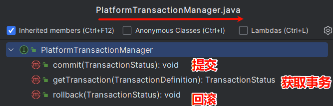

1. ***事务拦截器****：****TransactionInterceptor****： 控制何时提交和回滚*
  1. `completeTransactionAfterThrowing(txInfo, ex); `* 在这个时候回滚*
  2. `commitTransactionAfterReturning(txInfo); `* 在这个时候提交*
  3. 参考源码如下

```java
PlatformTransactionManager ptm = asPlatformTransactionManager(tm);
final String joinpointIdentification = methodIdentification(method, targetClass, txAttr);

if (txAttr == null || !(ptm instanceof CallbackPreferringPlatformTransactionManager cpptm)) {
    // 获取事务信息
    TransactionInfo txInfo = createTransactionIfNecessary(ptm, txAttr, joinpointIdentification);

    Object retVal;
    try {
       //执行目标方法
       retVal = invocation.proceedWithInvocation();
    }
    catch (Throwable ex) {
       // 出异常，进行回滚
       completeTransactionAfterThrowing(txInfo, ex);
       throw ex;
    }
    finally {
       cleanupTransactionInfo(txInfo);
    }

    if (retVal != null && txAttr != null) {
       TransactionStatus status = txInfo.getTransactionStatus();
       if (status != null) {
          if (retVal instanceof Future<?> future && future.isDone()) {
             try {
                future.get();
             }
             catch (ExecutionException ex) {
                if (txAttr.rollbackOn(ex.getCause())) {
                   status.setRollbackOnly();
                }
             }
             catch (InterruptedException ex) {
                Thread.currentThread().interrupt();
             }
          }
          else if (vavrPresent && VavrDelegate.isVavrTry(retVal)) {
             // Set rollback-only in case of Vavr failure matching our rollback rules...
             retVal = VavrDelegate.evaluateTryFailure(retVal, txAttr, status);
          }
       }
    }

    //一切正常进行提交
    commitTransactionAfterReturning(txInfo);
    return retVal;
}
```

### timeout：超时控制

*timeout（同 timeoutString）：超时时间； 事务超时，秒为单位；*

- *一旦超过约定时间，事务就会回滚。*
- *超时时间是指：从方法开始，到最后一次数据库操作结束的时间。*

```java
@Component
public class AccountDao {


    @Autowired
    JdbcTemplate jdbcTemplate;

    /**
     * 按照username扣减账户余额
     * @param username 用户名
     * @param delta 扣减的金额
     */
    @Transactional(propagation = Propagation.REQUIRED,timeout = 5)
    public void updateBalanceByUsername(String username, BigDecimal delta) throws InterruptedException {
        String sql = "update account set balance = balance - ? where username = ?";
        // 执行SQL
//        Thread.sleep(4000);
        jdbcTemplate.update(sql, delta, username);
        //在这里睡多久都测试不出来超时
    }
}
```

### readOnly：只读优化

> 事务中仅有读操作，可以开启只读优化

### 异常回滚机制：`rollbackFor `与 `noRollbackFor`

> - *rollbackFor（同rollbackForClassName）：指明哪些异常需要回滚。不是所有异常都一定引起事务回滚。*
> *     异常：*
> *          运行时异常（unchecked exception【非受检异常】）*
> *          编译时异常（checked exception【受检异常】）*
> *     【回滚的默认机制】*
> *          运行时异常：回滚*
> *          编译时异常：不回滚*
> 
> *    【可以指定哪些异常需要回滚】；*
> *    【回滚 = 运行时异常 + 指定回滚异常】*

> - *noRollbackFor（同 noRollbackForClassName）：指明哪些异常不需要回滚。*
> *    【不回滚 = 编译时异常 + 指定不回滚异常】*

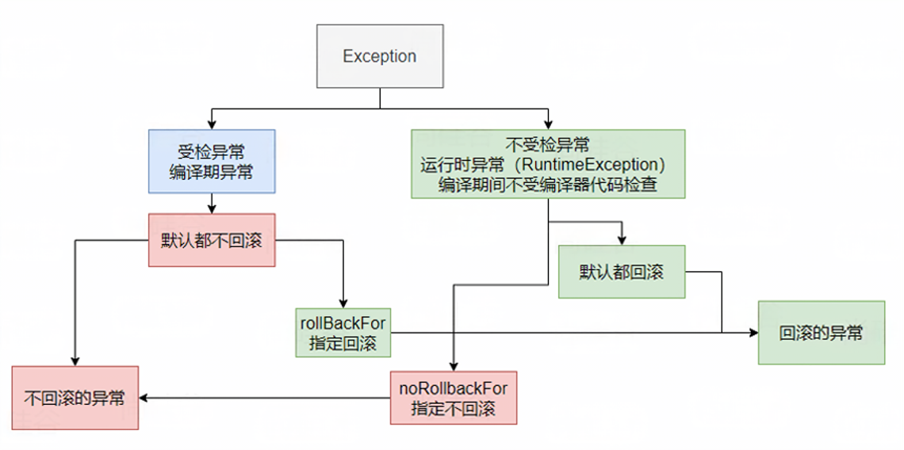

### 隔离级别

> **读未提交（Read Uncommitted）：**
> 
> - 事务可以读取未被提交的数据，易产生脏读、不可重复读和幻读等问题
> 
> **读已提交（Read Committed）**
> 
> - 事务只能读取已经提交的数据，可避免脏读，但可能引发不可重复读和幻读。
> 
> **可重复读（Repeatable Read）**
> 
> - 同一事务期间多次重复读取的数据相同。避免脏读和不可重复读，但仍有幻读的问题
> 
> **串行化（Serializable）**
> 
> 最高隔离级别，完全禁止了并发，只允许一个事务执行完毕之后才能执行另一个事务

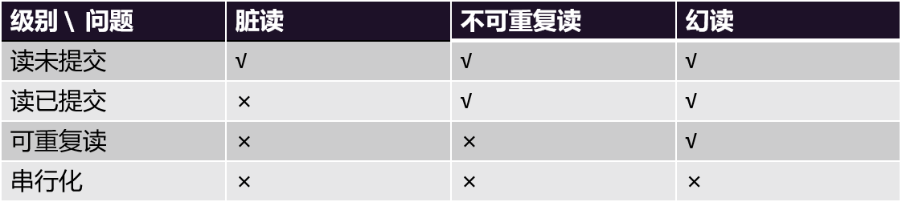

> BookDao中添加如下代码，修改隔离级别，尝试读取数据

```python
@Transactional(isolation = Isolation.REPEATABLE_READ)
public BigDecimal getBookPrice(Integer id){
    String sql = "select price from book where id=?";
    BigDecimal decimal1 = jdbcTemplate.queryForObject(sql, BigDecimal.class, id);

    BigDecimal decimal2 = jdbcTemplate.queryForObject(sql, BigDecimal.class, id);

    BigDecimal decimal3 = jdbcTemplate.queryForObject(sql, BigDecimal.class, id);

    BigDecimal decimal4 = jdbcTemplate.queryForObject(sql, BigDecimal.class, id);

    BigDecimal decimal5 = jdbcTemplate.queryForObject(sql, BigDecimal.class, id);

    return jdbcTemplate.queryForObject(sql,BigDecimal.class,id);
}
```

### 传播行为

> 定义：当事务产生嵌套，大事务中包含很多小事务的时候，小事务要不要和大事务共用一个事务设置；
> 
> 也就是事务如何传播下去；

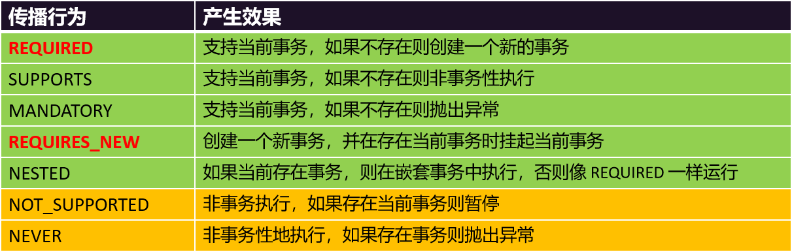

> * ****场景：用户结账，炸了以后，金额扣减回滚，库存不回滚。***
> *** 注意：【一定关注异常的传播链】***
> * 实现：*
> *    checkout(){*
> *        //自己的操作；*
> *        扣减金额： //REQUIRED*
> *        扣减库存： //REQUIRES_NEW*
> *    }*
> 
> 
> 
> **//思考如下情况：哪些事务会回滚，哪些不会回滚**
> *  A {*
> *      B(){  //REQUIRED*
> *          F();//REQUIRES_NEW*
> *          G();//REQUIRED*
> *          H();//REQUIRES_NEW*
> *      }*
> *      C(){  //REQUIRES_NEW*
> *         I();//REQUIRES_NEW*
> *         J();//REQUIRED*
> *      }*
> *      D(){   //REQUIRES_NEW*
> *          K();//REQUIRES_NEW*
> *          L();//REQUIRES_NEW //点位2： 10/0； K,F,H,C(i,j) = ok, E整个代码走不到，剩下炸*
> *      }*
> *      E(){   //REQUIRED*
> *          M();//REQUIRED*
> *          //点位3：10/0；  F,H,C(i,j),D(K,L)= ok*
> *          N();//REQUIRES_NEW*
> *      }*
> 
> *      int i = 10/0;  //点位1：C（I，J）,D(K，L) ，F，H,N= ok*
> *  }*
> 

# 源码分析

## 容器是什么

## 容器创建12大步

## 三级缓存与循环依赖