# 3. SpringMVC

# 入门

## 简介

> **SpringMVC**是**一站式的web框架**。他是Spring框架中的**web模块**；因为非常重要，所以我们一般独立出来称为 SpringMVC；
> 
> 1. 官网：https://docs.spring.io/spring-framework/reference/web/webmvc.html#mvc
> 2. SpringMVC 是 Spring 的 web 模块，用来开发Web应用
> 3. SprinMVC 应用最终作为 B/S、C/S 模式下的 Server 端
> 4. Web应用的核心就是** 处理HTTP请求响应**

## 开发模式

**回顾两种开发模式**：

1. **前后分离开发**
  SpringMVC提供常见注解：`@RestController`、`@RequestMapping`、`@ResponseBody`等

  1. 前端开发人员编写独立的前端项目

  2. 前端项目自己控制页面跳转逻辑

  3. 后端仅需返回前端需要的JSON数据

  4. 后端无需关心页面效果等问题

  优点：分工明确，快速协同，专注用户体验

  缺点：成本高，技术复杂，门槛高

1. **前后不分离开发**
  1. 后端开发人员要控制页面跳转逻辑（利用转发、重定向）

  2. 服务器要拿到业务数据，全部填充到页面，然后整体把页面返回给客户端

  3. 模版引擎作用：将数据填充到页面模板

  4. JSP其实就是一种模板引擎

  优点：弱前端、低成本、速度快

  缺点：不专业、体验差、效率低、易扯皮

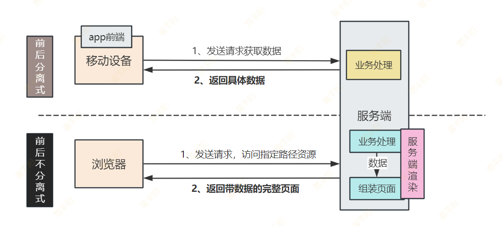

## SpringMVC功能

官网：https://docs.spring.io/spring-framework/reference/web/webmvc.html#mvc

**SpringMVC功能如下**：

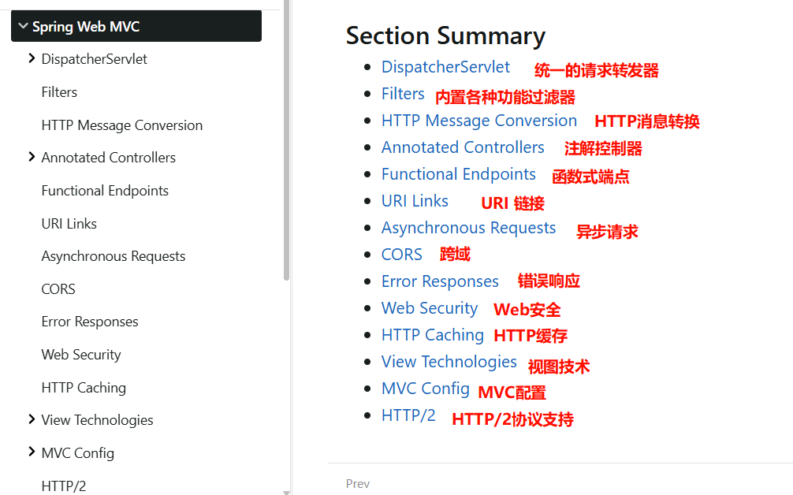

## HelloWorld

> 场景：浏览器发送`/hello` 请求，服务端响应 `Hello,SpringMVC!`

### 创建项目

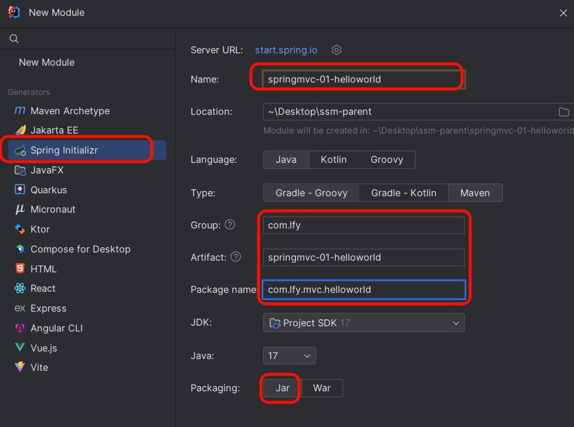

### 编写HelloController

```typescript
package com.lfy.springmvc.controller;


import org.springframework.stereotype.Controller;
import org.springframework.web.bind.annotation.RequestMapping;
import org.springframework.web.bind.annotation.ResponseBody;
import org.springframework.web.bind.annotation.RestController;


@RestController //前后分离开发就用这个
public class HelloController {


    @RequestMapping("/hello")
    public String handle() {
        System.out.println("handle()方法执行了!");
        //服务器给浏览器写出如下字符串
        return "Hello,Spring MVC! 你好!~~~";
    }
}
```

### 访问测试

1. 启动 `Springmvc01HelloworldApplication`
2. 浏览器访问 http://localhost:8080/hello
3. 收到服务器响应字符串：`Hello,Spring MVC! 你好!~~~`

### 细节

#### `@Controller` 与 `@RestController `

1. `@Controller`：用来开发前后不分离应用：方法的**返回值**代表一个**页面地址**
2. `@RestController `：用来开发前后分离应用：方法的**返回值**代表给浏览器**响应的内容**（**文本/JSON**）

#### 通配符

> * ****精确路径必须全局唯一***
> * ****路径位置通配符****： 如果SpringMVC发现请求路径多个方法都能匹配上，那就****精确优先****；*
> *      *`*`*: 匹配任意多个字符（0~N）； 不能匹配多个路径*
> *      *`**`*： 匹配任意多层路径*
> *      *`?`*: 匹配任意单个字符（1）*
> *** 精确程度****： *`完全匹配`* > *`? `*> *`*`* > *`**`

```typescript
//@ResponseBody
//@Controller
//告诉Spring这是一个控制器（处理请求的组件）
@RestController //前后分离开发就用这个
public class HelloController {


    /**
     *
     * 精确路径必须全局唯一
     * 路径位置通配符： 多个都能匹配上，那就精确优先
     *      *: 匹配任意多个字符（0~N）； 不能匹配多个路径
     *      **： 匹配任意多层路径
     *      ?: 匹配任意单个字符（1）
     *   精确程度： 完全匹配 > ? > * > **
     *
     * @return
     */
    @ResponseBody  //把返回值放到响应体中； 每次请求进来执行目标方法
    @RequestMapping("/hello")
    public String handle() {
        System.out.println("handle()方法执行了!");
        return "Hello,Spring MVC! 你好!~~~"; //默认认为返回值是跳到一个页面
    }


    @ResponseBody
    @RequestMapping("/he?ll")
    public String handle01() {
        System.out.println("handle01方法执行了!");
        return "handle01";
    }

    // /hellr


    @RequestMapping("/he*ll")
    public String handle02() {
        System.out.println("handle02方法执行了!");
        return "handle02";
    }


    @ResponseBody //
    @RequestMapping("/he/**")
    public String handle03() {
        System.out.println("handle03方法执行了!");
        return "handle03";
    }

}
```

# 请求处理

## 路径映射 - @RequestMapping

> - @**RequestMapping 注解是SpringMVC中进行请求映射的重要注解；**
> - **请求映射是指**：浏览器发送的请求路径，需要映射一个对应的Controller方法进行处理
> - **路径映射**
>   - **路径规则：**https://docs.spring.io/spring-framework/docs/6.1.11/javadoc-api/org/springframework/web/util/pattern/PathPattern.html
>   - **路径变量：**@PathVariable
> - **请求限定**
>   - 请求方式：method
>   - 请求参数：params
>   - 请求头：headers
>   - 请求内容类型：consumes
>   - 响应内容类型：produces

```typescript
package com.lfy.springmvc.controller;


import org.springframework.stereotype.Controller;
import org.springframework.web.bind.annotation.RequestMapping;
import org.springframework.web.bind.annotation.RequestMethod;
import org.springframework.web.bind.annotation.RestController;


/**
 * 测试请求限定
 */
@RestController
public class RequestMappingLimitController {


    /**
     * 请求方式：
     *      GET, HEAD, POST, PUT, PATCH, DELETE, OPTIONS, TRACE
     *  Postman
     * @return
     */
    @RequestMapping(value = "/test01",method = {RequestMethod.DELETE,RequestMethod.GET})
    public String test01(){
        return "hello world";
    }

    /**
     * 请求参数：params = {"username","age"}
     * 1）、username：  表示请求必须包含username参数
     * 2）、age=18：   表示请求参数中必须包含age=18的参数
     * 3）、gender!=1：  表示请求参数中不能包含gender=1的参数
     * @return
     */
    @RequestMapping(value = "/test02",params = {"age=18","username","gender!=1"})
    public String test02(){
        return "test02";
    }


    /**
     * 请求头：headers = {"haha"}
     * 1）、haha：  表示请求中必须包含名为haha的请求头
     * 2）、hehe!=1：  表示请求头中 的 hehe 不能是1；（hehe=0，不带hehe）
     * @return
     */
    @RequestMapping(value = "/test03",headers = "haha")
    public String test03(){
        return "test03";
    }


    /**
     * 请求内容类型：consumes = {"application/json"}; 消费什么数据；
     * Media Type：媒体类型
     * 1）、application/json：  表示浏览器必须携带 json 格式的数据。
     * @return
     */
    @RequestMapping(value = "/test04",consumes = "application/json")
    public String test04(){
        return "test04";
    }

    /**
     * 响应内容类型：produces = {"text/plain;charset=utf-8"}; 生产什么数据；
     * @return
     */
    @RequestMapping(value = "/test05",produces = "text/html;charset=utf-8")
    public String test05(){
        return "<h1>你好，张三</h1>";
    }
}
```

## 前置概念复习

### HTTP请求/响应

HTTP请求会带来各种数据；HTTP协议格式如下（也就是HTTP携带不同数据的几个位置）

- **请求首行**：(请求方式、请求路径、请求协议)
- **请求头**：(k: v   \n  k: v)
  - **请求头：** 有很多重要信息，SpringMVC 可以快速获取到
- **请求体**：(此次请求携带的其他数据)
  - **请求体 **携带大量数据，特别是POST请求，会把参数放在请求体中

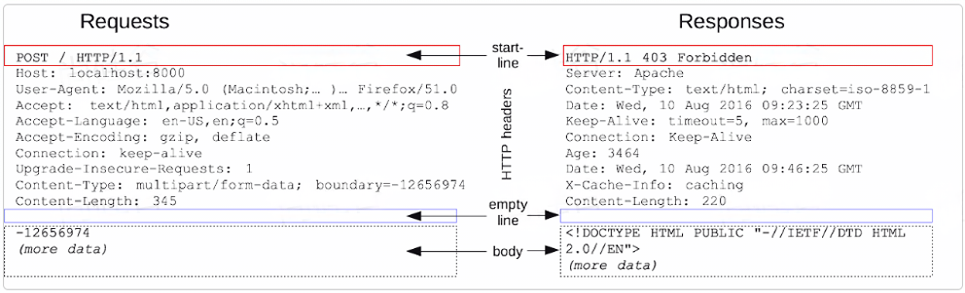

### URL

URL 也可以携带大量数据，特别是GET请求，会把参数放在URL上

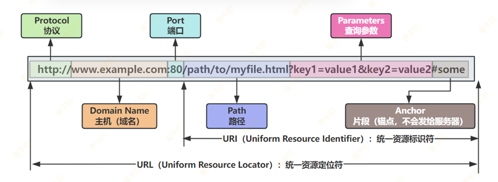

### JSON

JavaScript Object Notation(JavaScript 对象表示法)

- JSON用于将结构化数据表示为 JavaScript 对象的标准格式，通常用于在网站上表示和传输数据
- JSON 可以作为一个对象或者字符串存在

> 前者用于解读 JSON 中的数据，后者用于通过网络传输 JSON 数据。

JavaScript 提供一个全局的 可访问的 JSON 对象来对这两种数据进行转换。

**JSON 是一种纯数据格式，它只包含属性，没有方法**。如下JSON，如何获取指定位置的属性值

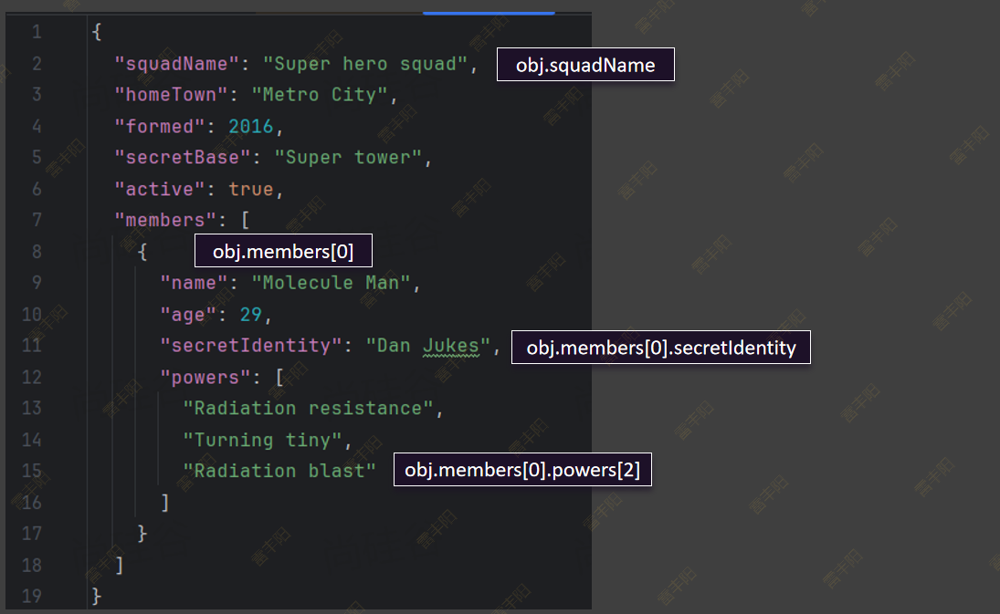

## 请求处理：实验

### 环境准备

> 通过如下实验，测试 `SpringMVC `如何获取各种数据

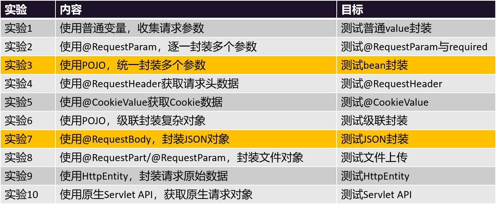

> 在项目 `static `下创建 `index.html` 文件。启动项目做以上实验；

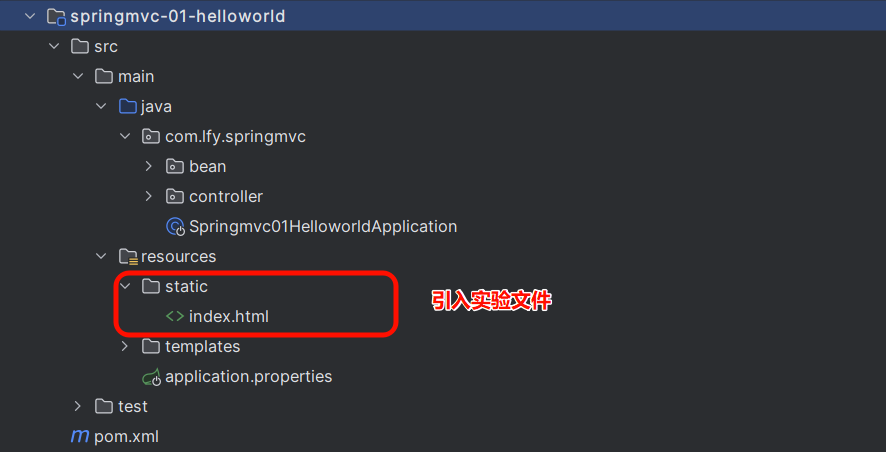

#### **index.html 文件内容如下**

```html
<!DOCTYPE html>
<html lang="en">
<head>
    <meta charset="UTF-8">
    <title>Title</title>
    <!--    本网页使用layui框架编写； layui官网：https://layui.dev/  -->
    <link href="https://cdn.bootcdn.net/ajax/libs/layui/2.9.15/css/layui.min.css" rel="stylesheet">
    <script src="https://cdn.bootcdn.net/ajax/libs/layui/2.9.15/layui.min.js"></script>


    <style>
        .layui-col-xs6 {
            padding: 10px;
        }
    </style>

</head>
<body>

<div class="layui-row">
    <div class="layui-col-xs6">
        <h1>SpringMVC - 请求测试</h1>
        <div class="layui-collapse">
            <div class="layui-colla-item">
                <div class="layui-colla-title">实验1：使用普通变量，收集请求参数</div>
                <div class="layui-colla-content" >
                    <div style="display: flex;justify-content: center">
                        <form class="layui-form" action="/handle01">
                            <div style="width: 250px;padding: 10px" >

                                <div class="layui-form-item">
                                    <div class="layui-input-wrap">
                                        <div class="layui-input-prefix">
                                            <i class="layui-icon layui-icon-username"></i>
                                        </div>
                                        <input type="text" name="username"  placeholder="用户名" class="layui-input">
                                    </div>
                                </div>
                                <div class="layui-form-item">
                                    <div class="layui-input-wrap">
                                        <div class="layui-input-prefix">
                                            <i class="layui-icon layui-icon-password"></i>
                                        </div>
                                        <input type="password" name="password" placeholder="密码"
                                               class="layui-input" lay-affix="eye">
                                    </div>
                                </div>
                                <div class="layui-form-item">
                                    <div class="layui-row">
                                        <div class="layui-col-xs12">
                                            <div class="layui-input-wrap">
                                                <div class="layui-input-prefix">
                                                    <i class="layui-icon layui-icon-cellphone"></i>
                                                </div>
                                                <input type="text" name="cellphone" placeholder="手机号" class="layui-input">
                                            </div>
                                        </div>
                                    </div>
                                </div>
                                <div class="layui-form-item">
                                    <input type="checkbox" name="agreement" title="同意">
                                    <a href="#terms" target="_blank" style="position: relative; top: 6px; left: -15px;">
                                        <ins>用户协议</ins>
                                    </a>
                                </div>
                                <div class="layui-form-item">
                                    <button class="layui-btn layui-btn-fluid" lay-submit>注册</button>
                                </div>
                            </div>
                        </form>
                    </div>
                </div>
            </div>
            <div class="layui-colla-item">
                <div class="layui-colla-title">实验2：使用@RequestParam，逐一封装多个参数</div>
                <div class="layui-colla-content">
                    <div style="display: flex;justify-content: center">
                        <form class="layui-form" action="/handle02">
                            <div style="width: 250px;padding: 10px" >

                                <div class="layui-form-item">
                                    <div class="layui-input-wrap">
                                        <div class="layui-input-prefix">
                                            <i class="layui-icon layui-icon-username"></i>
                                        </div>
                                        <input type="text" name="username"  placeholder="用户名" class="layui-input">
                                    </div>
                                </div>
                                <div class="layui-form-item">
                                    <div class="layui-input-wrap">
                                        <div class="layui-input-prefix">
                                            <i class="layui-icon layui-icon-password"></i>
                                        </div>
                                        <input type="password" name="password" placeholder="密码"
                                               class="layui-input" lay-affix="eye">
                                    </div>
                                </div>
                                <div class="layui-form-item">
                                    <div class="layui-row">
                                        <div class="layui-col-xs12">
                                            <div class="layui-input-wrap">
                                                <div class="layui-input-prefix">
                                                    <i class="layui-icon layui-icon-cellphone"></i>
                                                </div>
                                                <input type="text" name="cellphone" placeholder="手机号" class="layui-input">
                                            </div>
                                        </div>
                                    </div>
                                </div>
                                <div class="layui-form-item">
                                    <input type="checkbox" name="agreement" title="同意">
                                    <a href="#terms" target="_blank" style="position: relative; top: 6px; left: -15px;">
                                        <ins>用户协议</ins>
                                    </a>
                                </div>
                                <div class="layui-form-item">
                                    <button class="layui-btn layui-btn-fluid" lay-submit>注册</button>
                                </div>
                            </div>
                        </form>
                    </div>
                </div>
            </div>
            <div class="layui-colla-item">
                <div class="layui-colla-title">实验3：使用POJO，统一封装多个参数</div>
                <div class="layui-colla-content">
                    <div style="display: flex;justify-content: center">
                        <form class="layui-form" action="/handle03" method="post">
                            <div style="width: 250px;border: 5px solid black;padding: 10px" >

                                <div class="layui-form-item">
                                    <div class="layui-input-wrap">
                                        <div class="layui-input-prefix">
                                            <i class="layui-icon layui-icon-username"></i>
                                        </div>
                                        <input type="text" name="username"  placeholder="用户名" class="layui-input">
                                    </div>
                                </div>
                                <div class="layui-form-item">
                                    <div class="layui-input-wrap">
                                        <div class="layui-input-prefix">
                                            <i class="layui-icon layui-icon-password"></i>
                                        </div>
                                        <input type="password" name="password" placeholder="密码"
                                               class="layui-input" lay-affix="eye">
                                    </div>
                                </div>
                                <div class="layui-form-item">
                                    <div class="layui-row">
                                        <div class="layui-col-xs12">
                                            <div class="layui-input-wrap">
                                                <div class="layui-input-prefix">
                                                    <i class="layui-icon layui-icon-cellphone"></i>
                                                </div>
                                                <input type="text" name="cellphone" placeholder="手机号" class="layui-input">
                                            </div>
                                        </div>
                                    </div>
                                </div>
                                <div class="layui-form-item">
                                    <input type="checkbox" name="agreement" title="同意">
                                    <a href="#terms" target="_blank" style="position: relative; top: 6px; left: -15px;">
                                        <ins>用户协议</ins>
                                    </a>
                                </div>
                                <div class="layui-form-item">
                                    <button class="layui-btn layui-btn-fluid" lay-submit>注册</button>
                                </div>
                            </div>
                        </form>
                    </div>
                </div>
            </div>
            <div class="layui-colla-item">
                <div class="layui-colla-title">实验4：使用@RequestHeader获取请求头数据</div>
                <div class="layui-colla-content">
                    <a type="button" class="layui-btn" href="/handle04">随便发个请求</a>
                </div>
            </div>
            <div class="layui-colla-item">
                <div class="layui-colla-title">实验5：使用@CookieValue获取Cookie数据</div>
                <div class="layui-colla-content">
                    <a type="button" class="layui-btn" href="/handle05">随便又发个请求</a>
                </div>
            </div>
            <div class="layui-colla-item">
                <div class="layui-colla-title">实验6：使用POJO，级联封装复杂对象</div>
                <div class="layui-colla-content">
                    <div style="display: flex;justify-content: center">
                        <form class="layui-form layui-form-pane" action="/handle06">
                            <div style="width: 400px;padding: 10px" >

                                <div class="layui-form-item">
                                    <div class="layui-input-wrap">
                                        <div class="layui-input-prefix">
                                            <i class="layui-icon layui-icon-username"></i>
                                        </div>
                                        <input type="text" name="username"  placeholder="用户名" class="layui-input">
                                    </div>
                                </div>
                                <div class="layui-form-item">
                                    <div class="layui-input-wrap">
                                        <div class="layui-input-prefix">
                                            <i class="layui-icon layui-icon-password"></i>
                                        </div>
                                        <input type="password" name="password" placeholder="密码"
                                               class="layui-input" lay-affix="eye">
                                    </div>
                                </div>
                                <div class="layui-form-item">
                                    <div class="layui-row">
                                        <div class="layui-col-xs12">
                                            <div class="layui-input-wrap">
                                                <div class="layui-input-prefix">
                                                    <i class="layui-icon layui-icon-cellphone"></i>
                                                </div>
                                                <input type="text" name="cellphone" placeholder="手机号" class="layui-input">
                                            </div>
                                        </div>
                                    </div>
                                </div>

                                <div class="layui-form-item">
                                    <div class="layui-row">
                                        <div class="layui-col-xs4">
                                            <div class="layui-input-wrap">
                                                <div class="layui-input-prefix">
                                                    <i class="layui-icon layui-icon-website"></i>
                                                </div>
                                                <input type="text" name="address.province" placeholder="省" class="layui-input">
                                            </div>
                                        </div>
                                        <div class="layui-col-xs4">
                                            <div class="layui-input-wrap">
                                                <div class="layui-input-prefix">
                                                    <i class="layui-icon layui-icon-find-fill"></i>
                                                </div>
                                                <input type="text" name="address.city" placeholder="市" class="layui-input">
                                            </div>
                                        </div>
                                        <div class="layui-col-xs4">
                                            <div class="layui-input-wrap">
                                                <div class="layui-input-prefix">
                                                    <i class="layui-icon layui-icon-tree"></i>
                                                </div>
                                                <input type="text" name="address.area" placeholder="区" class="layui-input">
                                            </div>
                                        </div>
                                    </div>
                                </div>
                                <div class="layui-form-item">
                                    <div class="layui-form-item">
                                        <label class="layui-form-label">性别</label>
                                        <div class="layui-input-block">
                                            <input type="radio" name="sex" value="男" title="男">
                                            <input type="radio" name="sex" value="女" title="女">
                                        </div>
                                    </div>
                                </div>
                                <div class="layui-form-item">
                                    <div class="layui-form-item">
                                        <label class="layui-form-label">爱好</label>
                                        <div class="layui-input-block">
                                            <input type="checkbox" name="hobby" value="足球" title="足球">
                                            <input type="checkbox" name="hobby" value="篮球" title="篮球">
                                            <input type="checkbox" name="hobby" value="乒乓球" title="乒乓球">
                                        </div>
                                    </div>
                                </div>
                                <div class="layui-form-item">
                                    <div class="layui-form-item">
                                        <label class="layui-form-label">年级</label>
                                        <div class="layui-input-block">
                                            <select name="grade">
                                                <option value="一年级">一年级</option>
                                                <option value="二年级">二年级</option>
                                                <option value="三年级">三年级</option>
                                                <option value="四年级">四年级</option>
                                            </select>
                                        </div>
                                    </div>
                                </div>

                                <div class="layui-form-item">
                                    <input type="checkbox" name="agreement" title="同意">
                                    <a href="#terms" target="_blank" style="position: relative; top: 6px; left: -15px;">
                                        <ins>用户协议</ins>
                                    </a>
                                </div>
                                <div class="layui-form-item">
                                    <button class="layui-btn layui-btn-fluid" lay-submit>注册</button>
                                </div>
                            </div>
                        </form>
                    </div>
                </div>
            </div>
            <div class="layui-colla-item">
                <div class="layui-colla-title">实验7：使用@RequestBody，封装JSON对象</div>
                <div class="layui-colla-content">
                    <button type="button" class="layui-btn layui-bg-blue">去Postman测试，自己带上【实验6】中数据的json</button>
                </div>
            </div>
            <div class="layui-colla-item">
                <div class="layui-colla-title">实验8：使用@RequestPart/@RequestParam，封装文件，测试文件上传</div>
                <div class="layui-colla-content">
                    <div style="display: flex;justify-content: center">

                        <form class="layui-form layui-form-pane" action="/handle08" method="post" enctype="multipart/form-data">
                            <div style="width: 350px;padding: 10px" >
                                <div class="layui-form-item">
                                    <fieldset class="layui-elem-field" style="background-color: lemonchiffon">
                                        <legend>文件上传要求</legend>
                                        <div class="layui-field-box">
                                            <p>1. 表单：method=post</p>
                                            <p>2. enctype="multipart/form-data"</p>
                                            <p>3. 注意：SpringMVC对上传文件有大小限制（默认单文件最大：1MB；整个请求最大：10MB）</p>
                                        </div>
                                    </fieldset>
                                </div>

                                <div class="layui-form-item">
                                    <div class="layui-input-wrap">
                                        <div class="layui-input-prefix">
                                            <i class="layui-icon layui-icon-username"></i>
                                        </div>
                                        <input type="text" name="username"  placeholder="用户名" class="layui-input">
                                    </div>
                                </div>
                                <div class="layui-form-item">
                                    <div class="layui-input-wrap">
                                        <div class="layui-input-prefix">
                                            <i class="layui-icon layui-icon-password"></i>
                                        </div>
                                        <input type="password" name="password" placeholder="密码"
                                               class="layui-input" lay-affix="eye">
                                    </div>
                                </div>
                                <div class="layui-form-item">
                                    <div class="layui-row">
                                        <div class="layui-col-xs12">
                                            <div class="layui-input-wrap">
                                                <div class="layui-input-prefix">
                                                    <i class="layui-icon layui-icon-cellphone"></i>
                                                </div>
                                                <input type="text" name="cellphone" placeholder="手机号" class="layui-input">
                                            </div>
                                        </div>
                                    </div>
                                </div>
                                <div class="layui-form-item">
                                    <label class="layui-form-label">头像</label>
                                    <div class="layui-input-block">
                                        <input type="file" name="headerImg" class="layui-input">
                                    </div>
                                </div>
                                <div class="layui-form-item">
                                    <label class="layui-form-label">生活照</label>
                                    <div class="layui-input-block">
                                        <input type="file" name="lifeImg" multiple class="layui-input">
                                    </div>
                                </div>
                                <div class="layui-form-item">
                                    <input type="checkbox" name="agreement" title="同意">
                                    <a href="#terms" target="_blank" style="position: relative; top: 6px; left: -15px;">
                                        <ins>用户协议</ins>
                                    </a>
                                </div>
                                <div class="layui-form-item">
                                    <button class="layui-btn layui-btn-fluid" lay-submit>注册</button>
                                </div>
                            </div>
                        </form>
                    </div>
                </div>
            </div>
            <div class="layui-colla-item">
                <div class="layui-colla-title">实验9：使用HttpEntity，封装请求原始数据</div>
                <div class="layui-colla-content">
                    <a class="layui-btn layui-bg-blue" href="/handle09?user=admin&age=18">随便㕛发个请求</a>
                </div>
            </div>
            <div class="layui-colla-item">
                <div class="layui-colla-title">实验10：使用原生Servlet API，获取原生请求对象</div>
                <div class="layui-colla-content">
                    <a class="layui-btn layui-bg-blue" href="/handle09?user=admin&age=18">随便叒发个请求</a>
                </div>
            </div>
        </div>

    </div>
    <div class="layui-col-xs6">
        <h1>SpringMVC - 响应测试</h1>
        <div class="layui-collapse">
            <div class="layui-colla-item">
                <div class="layui-colla-title">实验1：返回json数据</div>
                <div class="layui-colla-content">
                    <a type="button" class="layui-btn" href="/resp01">给个JSON</a>
                </div>
            </div>
            <div class="layui-colla-item">
                <div class="layui-colla-title">实验2：文件下载测试</div>
                <div class="layui-colla-content">
                    <a type="button" class="layui-btn" href="/download">给个美女</a>
                </div>
            </div>
            <div class="layui-colla-item">
                <div class="layui-colla-title">实验3：使用Thymeleaf模版引擎，实现服务端渲染</div>
                <div class="layui-colla-content">
                    <fieldset class="layui-elem-field" style="background-color: lemonchiffon">
                        <legend>服务端渲染</legend>
                        <div class="layui-field-box">
                            <h3>现在服务端渲染的方式用的很少了；项目基本都是前后分离。</h3>
                            <h3>这样各端专注于自己的开发，快速协同分工</h3>
                            <fieldset class="layui-elem-field" style="background-color: lightcyan">
                                <legend>前后分离</legend>
                                <div class="layui-field-box">
                                    <h5>1. 前端开发人员编写独立的前端项目</h5>
                                    <h5>2. 前端项目自己控制页面跳转逻辑</h5>
                                    <h5>3. 后端仅需返回前端需要的JSON数据</h5>
                                    <h5>4. 后端无需关心页面效果等问题</h5>
                                    <h5>优点：分工明确，快速协同，专注用户体验</h5>
                                    <h5>缺点：成本高，技术复杂，门槛高</h5>
                                </div>
                            </fieldset>
                            <fieldset class="layui-elem-field" style="background-color: lightcyan">
                                <legend>前后不分离(服务端渲染)</legend>
                                <div class="layui-field-box">
                                    <h5>1. 后端开发人员要控制页面跳转逻辑（利用转发、重定向）</h5>
                                    <h5>2. 服务器要拿到业务数据，全部填充到页面，然后整体把页面返回给客户端</h5>
                                    <h5>3. 模版引擎作用：将数据填充到页面模板</h5>
                                    <h5>4. JSP其实就是一种模板引擎</h5>
                                    <h5>优点：弱前端、低成本、速度快</h5>
                                    <h5>缺点：不专业、体验差、效率低、易扯皮</h5>
                                </div>
                            </fieldset>
                        </div>
                    </fieldset>
                </div>
            </div>
        </div>
    </div>
</div>

</body>
<style>

</style>
</html>
```

### 实验1：使用普通变量，收集请求参数

1. **页面效果：**

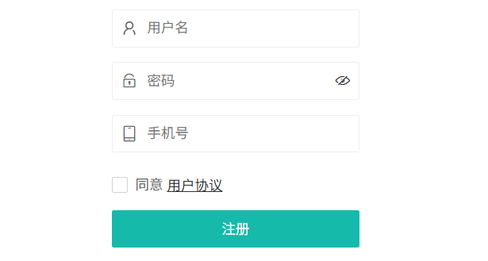

1. **发送请求：**http://localhost:8080/handle01?username=zhangsan&password=123456&cellphone=13333333333&agreement=on

1. **Controller代码**：

```java
/**
 * 请求参数：username=zhangsan&password=12345&cellphone=12345456&agreement=on
 * 要求：变量名和参数名保持一致
 * 1、没有携带：包装类型自动封装为null，基本类型封装为默认值
 * 2、携带：自动封装
 * @return
 */
@RequestMapping("/handle01")
public String handle01(String username,
                       String password,
                       String cellphone,
                       boolean agreement){
    System.out.println(username);
    System.out.println(password);
    System.out.println(cellphone);
    System.out.println(agreement);
    return "ok";
}
```

### 实验2：使用@RequestParam，逐一封装多个参数

**页面效果：**

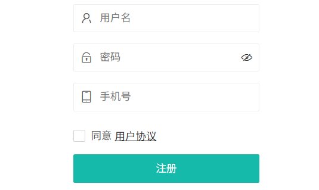

**发送请求**：http://localhost:8080/handle02?username=zhangsan&password=123456&cellphone=13333333333&agreement=on

**Controller代码：**

```typescript
/**
 * username=zhangsan&password=123456&cellphone=1234&agreement=on
 * @RequestParam: 取出某个参数的值，默认一定要携带。
 *      required = false：非必须携带；
 *      defaultValue = "123456"：默认值，参数可以不带。
 *
 * 无论请求参数带到了 请求体中还是 url? 后面，他们都是请求参数。都可以直接用@RequestParam或者同一个变量名获取到
 * @param name
 * @param pwd
 * @param phone
 * @param ok
 * @return
 */
@RequestMapping("/handle02")
public String handle02(@RequestParam("username") String name,
                       @RequestParam(value = "password",defaultValue = "123456") String pwd,
                       @RequestParam("cellphone") String phone,
                       @RequestParam(value = "agreement",required = false) boolean ok){
    System.out.println(name);
    System.out.println(pwd);
    System.out.println(phone);
    System.out.println(ok);

    return "ok";
}
```

### 实验3：使用POJO，统一封装多个参数

**页面效果：**

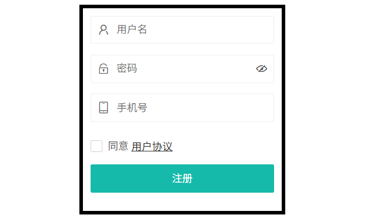

**发送请求：**请求体

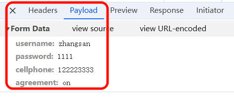

**Controller代码：**

```typescript
/**
 * 如果目标方法参数是一个 pojo；SpringMVC 会自动把请求参数 和 pojo 属性进行匹配；
 * 效果：
 *      1、pojo的所有属性值都是来自于请求参数
 *      2、如果请求参数没带，封装为null；
 * @param person
 * @return
 */
//请求体：username=zhangsan&password=111111&cellphone=222222&agreement=on
@RequestMapping("/handle03")
public String handle03(Person person){
    System.out.println(person);
    return "ok";
}
```

```typescript
@Data //JavaBean 定死的数据模型； 定不死的写Map
public class Person {
    // username=zhangsan&password=123456&cellphone=1234&agreement=on
    private String username = "zhangsan"; // request.getParameter("username")
    private String password; // request.getParameter("password")
    private String cellphone;
    private boolean agreement;
}
```

### 实验4：使用@RequestHeader获取请求头数据

**页面效果：**

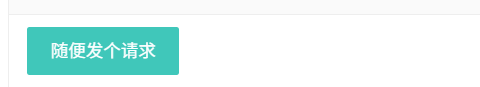

**发送请求：**请求头

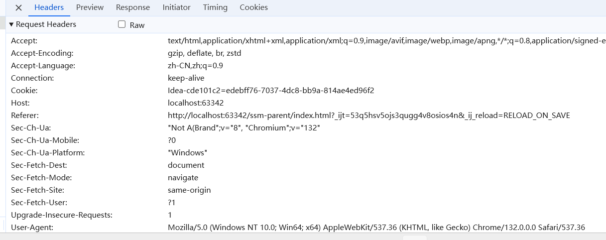

**Controller代码：**

```typescript
/**
 * @RequestHeader：获取请求头信息
 * @param host
 * @param ua
 * @return
 */
@RequestMapping("/handle04")
public String handle04(@RequestHeader(value = "host",defaultValue = "127.0.0.1") String host,
                       @RequestHeader("user-agent") String ua){
    System.out.println(host);
    System.out.println(ua);
    return "ok~"+host;
}
```

### 实验5：使用@CookieValue获取Cookie数据

**发送请求**：自己添加一个cookie，名为 haha，值为任意； 然后发送请求，尝试获取值

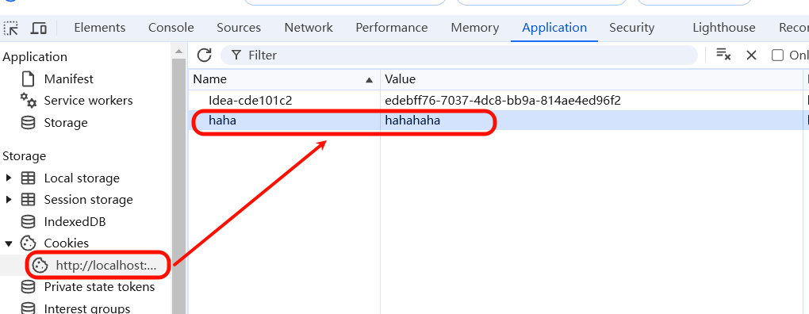

**Controller代码：**

```typescript
/**
 * @CookieValue：获取cookie值
 * @param haha
 * @return
 */
@RequestMapping("/handle05")
public String handle05(@CookieValue("haha") String haha){
    return "ok：cookie是：" + haha;
}
```

### 实验6：使用POJO，级联封装复杂对象

**页面效果：**

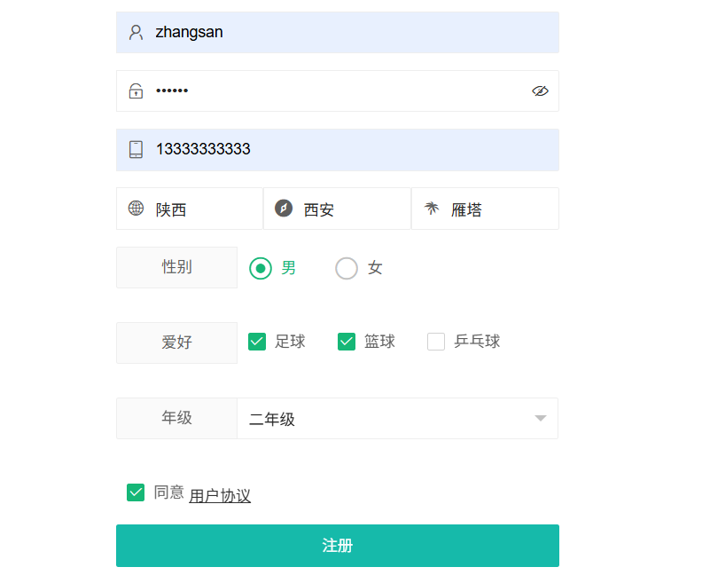

**发送请求：携带数据如下**

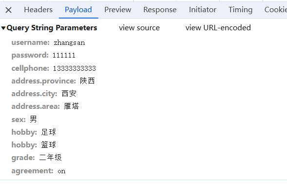

**Controller代码**

```typescript
/**
 * 使用pojo级联封装复杂属性
 * @param person
 * @return
 */
@RequestMapping("/handle06")
public String handle06(Person person){
    System.out.println(person);
    return "ok";
}
```

```typescript
/**
 * username=张三&password=111111&cellphone=122223334&agreement=on
 * &address.province=陕西&address.city=西安市&address.area=雁塔&
 * sex=男&hobby=足球&hobby=篮球&grade=二年级
 */
@Data //JavaBean 定死的数据模型； 定不死的写Map
public class Person {
    // username=zhangsan&password=123456&cellphone=1234&agreement=on
    private String username = "zhangsan"; // request.getParameter("username")
    private String password; // request.getParameter("password")
    private String cellphone;
    private boolean agreement;
    private Address address;
    private String sex;
    private String[] hobby; // request.getParameterValues("hobby")
    private String grade;
}


@Data
class Address {
    private String province;
    private String city;
    private String area;
}
```

### 实验7：使用@RequestBody，封装JSON对象

**Postman发送请求：注意红框位置设置**

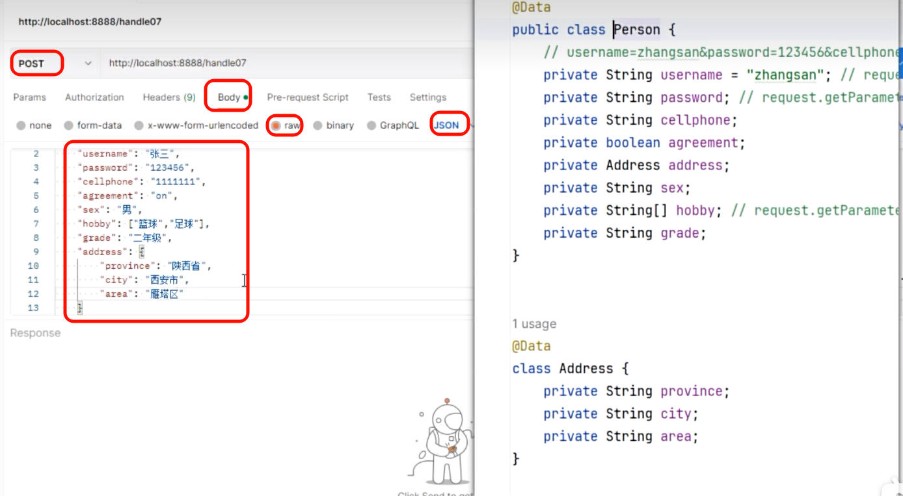

**Controller代码**

```typescript
/**
 * @RequestBody: 获取请求体json数据，自动转为person对象
 * 测试接受json数据
 * 1、发出：请求体中是json字符串，不是k=v
 * 2、接受：@RequestBody Person person
 *
 * @RequestBody Person person
 *      1、拿到请求体中的json字符串
 *      2、把json字符串转为person对象
 * @param person
 * @return
 */
@RequestMapping("/handle07")
public String handle07(@RequestBody Person person){
    System.out.println(person);
    //自己把字符串转为对象。
    return "ok";
}
```

### 实验8：使用@RequestPart/@RequestParam，封装文件，测试文件上传

**页面效果：**

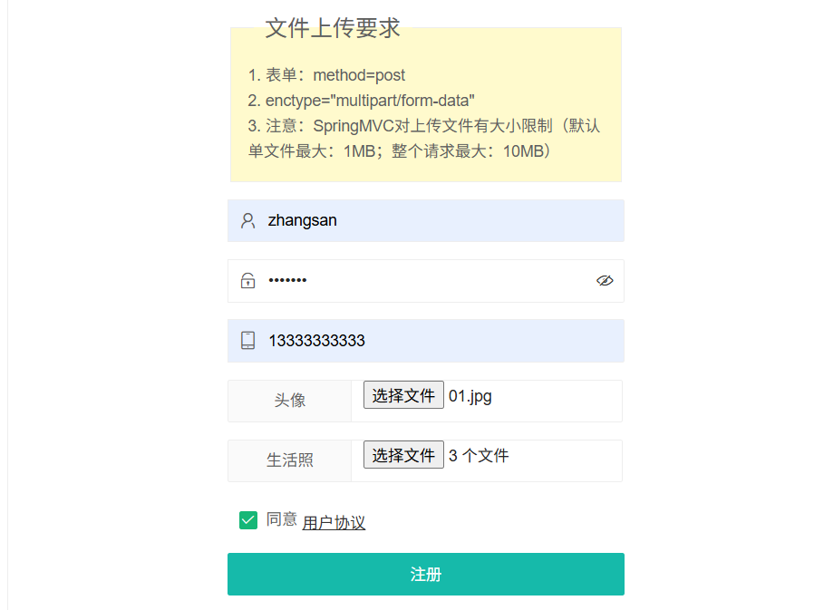

**请求数据**：

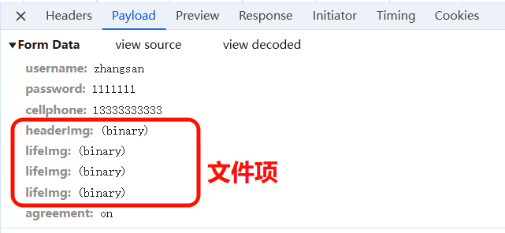

**Controller代码：**

```java
/**
 * 文件上传；
 * 1、@RequestParam 取出文件项，封装为MultipartFile，就可以拿到文件内容
 * @param person
 * @return
 */
@RequestMapping("/handle08")
public String handle08(Person person,
                       @RequestParam("headerImg") MultipartFile headerImgFile,
                       @RequestPart("lifeImg") MultipartFile[] lifeImgFiles) throws IOException {

    //1、获取原始文件名
    String originalFilename = headerImgFile.getOriginalFilename();
    //2、文件大小
    long size = headerImgFile.getSize();
    //3、获取文件流
    InputStream inputStream = headerImgFile.getInputStream();
    System.out.println(originalFilename + " ==> " + size);
    //4、文件保存
    headerImgFile.transferTo(new File("D:\\img\\" + originalFilename));
    System.out.println("===============以上处理了头像=================");
    if (lifeImgFiles.length > 0) {
        for (MultipartFile imgFile : lifeImgFiles) {
            imgFile.transferTo(new File("D:\\img\\" + imgFile.getOriginalFilename()));
        }
        System.out.println("=======生活照保存结束==========");
    }
    System.out.println(person);
    return "ok!!!";
}
```

### 实验9：使用HttpEntity，封装请求原始数据

> 实验7的请求再发送一遍

```java
/**
 * HttpEntity：封装请求头、请求体； 把整个请求拿过来
 *    泛型：<String>：请求体类型； 可以自动转化
 *
 *
 * @return
 */
@RequestMapping("/handle09")
public String handle09(HttpEntity<Person> entity){

    //1、拿到所有请求头
    HttpHeaders headers = entity.getHeaders();
    System.out.println("请求头："+headers);
    //2、拿到请求体
    Person body = entity.getBody();
    System.out.println("请求体："+body);
    return "Ok~~~";
}
```

### 实验10：使用原生Servlet API，获取原生请求对象

```java
/**
 * 接受原生 API
 * @param request
 * @param response
 */
@RequestMapping("/handle10")
public void handle10(HttpServletRequest request,
                       HttpServletResponse response,
                     HttpMethod method) throws IOException {
    System.out.println("请求方式："+method);
    String username = request.getParameter("username");
    System.out.println(username);
    response.getWriter().write("ok!!!"+username);
}
```

## 小结

> 常见接收三种数据的办法

### 接收普通参数

> > 无论是GET请求，还是POST请求，携带的 k=v&k=v数据；还是请求头的数据
> 
> **使用实验1-6的方式：**
> 
> 1. **直接写变量名**
> 2. **@RequestParam、@RequestHeader、@CookieValue** 注解
> 3. **POJO**

### 接收JSON数据

> JSON数据放在请求体中。使用 @ReqeustBody + 对象；直接获取数据并封装为对象

### 接收文件上传

> **@RequestParam/@RequestPart ** 可以获取普通项或者文件项；
> 
> **@RequestPart ("imgs")  MultipartFile[] files**

# 响应处理

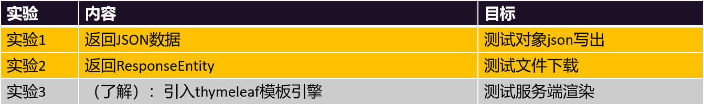

## 实验1：返回JSON数据

> 注意：SpringMVC 底层使用 HttpMessageConverter 处理json数据的序列化与反序列化

```typescript
    /**
     * 会自动的把返回的对象转为json格式
     *
     * @return
     */
    @ResponseBody //把返回的内容。写到响应体中
    @RequestMapping("/resp01")
    public Person resp01() {
        Person person = new Person();
        person.setUsername("张三");
        person.setPassword("1111");
        person.setCellphone("22222");
        person.setAgreement(false);
        person.setSex("男");
        person.setHobby(new String[]{"足球", "篮球"});
        person.setGrade("三年级");

        return person;
    }
```

## 实验2：文件下载

基本原理：

1. **写出的数据必须告诉浏览器数据类型**。文件下载需要两个
  1. `Content-Type：application/octet-stream `；内容类型：二进制流
  2. `Content-Disposition：attachment;filename=哈哈美女.jpg`；内容处置方式：附件；文件名=xx
    1. 注意：文件名有可能有中文，所以需要提前进行URL编码
2. **二进制流写出要小心OOM；**
  1. `InputStreamResource resource = new InputStreamResource(inputStream);`

```java
/**
     * 文件下载
     * HttpEntity：拿到整个请求数据
     * ResponseEntity：拿到整个响应数据（响应头、响应体、状态码）
     *
     * @return
     */
    @RequestMapping("/download")
    public ResponseEntity<InputStreamResource> download() throws IOException {

        //以上代码永远别改
        FileInputStream inputStream = new FileInputStream("C:\\Users\\53409\\Pictures\\Saved Pictures\\必应壁纸（1200张）\\AutumnNeuschwanstein_EN-AU10604288553_1920x1080.jpg");
        //一口气读会溢出
//        byte[] bytes = inputStream.readAllBytes();
        //1、文件名中文会乱码：解决：
        String encode = URLEncoder.encode("哈哈美女.jpg", "UTF-8");
        //以下代码永远别改
        //2、文件太大会oom（内存溢出）
        InputStreamResource resource = new InputStreamResource(inputStream);
        return ResponseEntity.ok()
                //内容类型：流
                .contentType(MediaType.APPLICATION_OCTET_STREAM)
                //内容大小
                .contentLength(inputStream.available())
                //  Content-Disposition ：内容处理方式
                .header("Content-Disposition", "attachment;filename="+encode)
                .body(resource);
    }
```

> 这种方式会OOM

```java
    @GetMapping("/download")
    public ResponseEntity<byte[]> handleDownload() throws IOException {
        byte[] bytes = Files.readAllBytes(Paths.get(new File("aaaa.png").toURI()));
        return ResponseEntity
                .ok()
                .header("Content-Disposition", "attachment; filename=aaaa.png")
                .contentType(MediaType.APPLICATION_OCTET_STREAM)
                .contentLength(bytes.length)
                .body(bytes);
    }

```

## 实验3：Thymeleaf 模板引擎

> JSP算是一个经典的模板引擎

> **SpringBoot **推荐使用 **Thymeleaf **作为 **SpringMVC **的模板引擎；
> 
> **SpringBoot **默认不支持 JSP
> 
> > 模板引擎使得我们能实现服务端渲染的需求

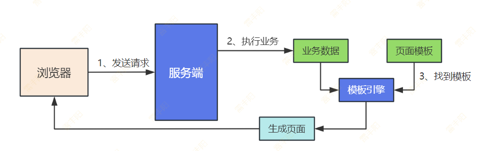

> 使用步骤：
> 
> 1. 引入 `spring-boot-starter-thymeleaf`
> 2. `static`：静态资源文件夹（保存css、js、image、video等）； 
> 3. `resources`：页面模板文件夹
> 4. `Model`：给页面共享数据
> 5. `Thymeleaf `语法，去页面取值

### pom.xml 引入依赖

```xml
<dependency>
    <groupId>org.springframework.boot</groupId>
    <artifactId>spring-boot-starter-thymeleaf</artifactId>
</dependency>
```

### resources 文件夹

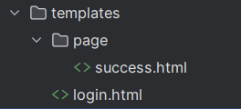

> login.html 如下

```html
<!DOCTYPE html>
<html lang="en">
<head>
    <meta charset="UTF-8">
    <title>登录</title>
</head>
<body>
<h1>登录页</h1>

<form action="login.mvc" method="post">

    用户名：<input type="text" name="username"> <br/>
    密码：<input type="password" name="password"> <br/>
    <input type="submit" value="登录"> <br/>
</form>
</body>
</html>
```

> success.html 如下

```html
<!DOCTYPE html>
<html lang="en" xmlns:th="http://www.thymeleaf.org">
<head>
    <meta charset="UTF-8">
    <title>成功</title>
</head>
<body>
<h1>恭喜，登录成功：</h1>
<!-- th:xx； 修改标签的任意属性 -->
<h2>用户名：<span th:text="${name}" th:id="${name}">张三</span> </h2>
<h2 >年龄：[[${age}]]  </h2>

<!-- 列表：今天的访客 -->
<table border="1px">
    <tr>
        <th>序号</th>
        <th>用户名</th>
        <th>年龄</th>
        <th>成年人吗</th>
    </tr>


    <tr th:each="user : ${users}">
        <td>[[${user.id}]]</td>
        <td th:text="${user.getName()}">张三</td>
        <td th:text="${user.age}">18</td>
<!--        <td th:if="${user.age >= 18}">是</td>-->
<!--        <td th:if="${user.age < 18}">否</td>-->

        <td th:text="${user.age >= 18? '是':'否'}">否</td>
    </tr>


</table>
</body>
</html>
```

### Controller代码

```typescript
package com.lfy.springmvc.controller;


import com.lfy.springmvc.bean.User;
import org.springframework.stereotype.Controller;
import org.springframework.ui.Model;
import org.springframework.web.bind.annotation.RequestMapping;

import java.util.Arrays;
import java.util.List;


/**
 * SpringBoot整合的SpringMVC默认不支持JSP
 * 1、引入 thymeleaf 作为模型引擎，渲染页面
 *         <dependency>
 *             <groupId>org.springframework.boot</groupId>
 *             <artifactId>spring-boot-starter-thymeleaf</artifactId>
 *         </dependency>
 * 2、默认规则
 *         页面：src/main/resources/templates
 *      静态资源：src/main/resources/static
 */
@Controller // 开发服务端渲染逻辑
public class PageTestController {

    //处理 / 请求，跳转到登录页

    @RequestMapping("/")
    public String index(){

        // thymeleaf 默认：去 classpath:/templates/ 找页面, 后缀为 .html
        // 页面地址 = classpath:/templates/ + 返回名字 + .html

        // return "redirect:index";
        // return "forward:index";
        return "login";  //返回值就是  页面名称（视图名）
    }

    @RequestMapping("/login.mvc")
    public String login(String username,
                        String password,
                        //模型就是页面要展示的所有数据
                        Model model){
        System.out.println("用户登录："+username+","+password);

        // 去数据库查到登录的用户信息

        // 去数据库查到访客列表

        List<User> list = Arrays.asList(
                new User(1L, "张三1", 18),
                new User(2L, "张三2", 19),
                new User(3L, "张三3", 16),
                new User(4L, "张三4", 12),
                new User(5L, "张三5", 17),
                new User(6L, "张三6", 28),
                new User(7L, "张三7", 11),
                new User(8L, "张三8", 38)
        );


        model.addAttribute("users",list);
        model.addAttribute("name",username);
        model.addAttribute("age",18);

        return "page/success";
    }
}
```

## Thymeleaf 语法（了解）

> 页面html标签如下：

```xml
<html lang="en" xmlns:th="http://www.thymeleaf.org">
```

1. **th:xxx**：
  1. 动态渲染指定的 html 标签属性值、或者th指令（遍历、判断等）
    - **th:text**：标签体内文本值渲染
    - **th:属性**：标签指定属性渲染
    - **th:attr**：标签任意属性渲染
    - **th:if、th:each**...：其他th指令
2. **取值**
  1. **${}**：变量取值
  2. **@{}**：url路径
  3. 其他：
    - **#{}**：国际化消息
    - **~{}**：片段引用
    - ***{}**：变量选择
3. **遍历**
  1. `th:each="元素名,迭代状态 : ${集合}"`
4. **判断**
  1. `th:if`
5. **行内写法: [[ ]]**

## 方法支持的返回值

> SpringMVC中，方法的返回值就是要响应的内容。SpringMVC支持如下返回值;
> 
> 黄色标记的部分，**需要重点关注**

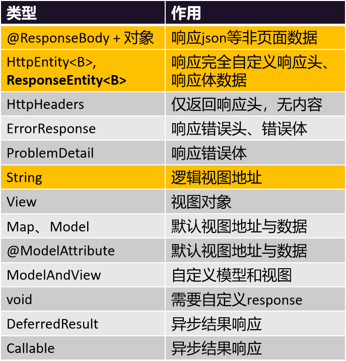

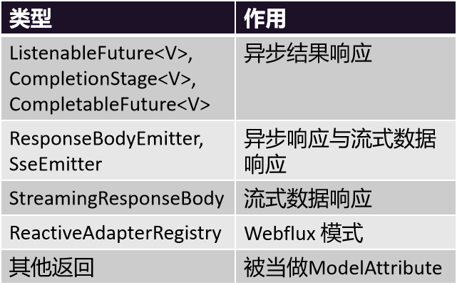

# RESTful - CRUD：案例

## RESTful

### 简介

**REST**（Representational State Transfer 表现层状态转移）是一种软件架构风格； 

> 官网：https://restfulapi.net/

**完整理解**：**Resource Representational State Transfer**

- **Resource**：资源
- **Representational**：表现形式：比如用JSON，XML，JPEG等
- **State Transfer**：状态变化：**通过HTTP的动词（GET、POST、PUT、DELETE）实现**

<u>***一句话：使用资源名作为URI，使用HTTP的请求方式表示对资源的操作***</u>

**满足REST 风格的系统，我们称为是 RESTful 系统**

### 设计

1. **RESTful API 以前，接口的设计可能是这样的**

- `/getEmployee?id=1`：查询员工  
- `/addEmployee?name=zhangsan&age=18`：新增员工
- `/updateEmployee?id=1&age=20`：修改员工
- `/deleteEmployee?id=1`：删除员工
- `/getEmployeeList`：获取所有员工

1. **符合REST风格的接口设计，应该是这样的：**

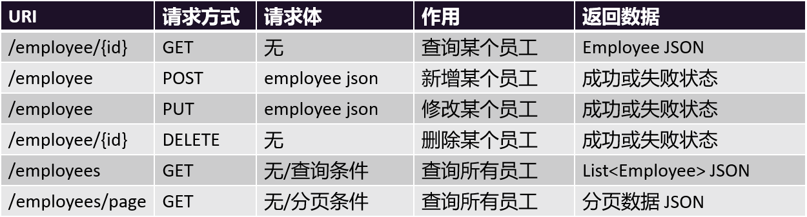

### 路径变量 - @PathVariable

> RESTful的接口中，经常路径的某些位置是动态的。比如` /employee/``{id}`；这个id 可能是6、7、8、9等；
> 
> 这时我们程序就需要能获取到这个动态的值。SpringMVC 提供了` @PathVariable` 注解获取路径变量的值；
> 
> 语法规则如下：

1. `/resources/{name}`：{} 中的值封装到 name 变量中
2. `/resources/{*path}`：{} 中的值封装到 path 变量中；可以获取多层路径
  1. `/resources/image.png`： path = /image.png
  2. `/resources/css/spring.css`：path = /css/spring.css
3. `/resources/{filename:\\w+}.dat`：{} 中的值封装到 filename 变量中; 
  1. filename 满足 \\w+ 正则要求 
  2. `/resources/{``filename``:``\\w+``}.dat`；如：/resources/xxx.dat：xxx是一个或多个字母

### 实验资源

> Nginx服务器

[📎 nginx.zip](<files/nginx.zip>)

> 前端代码

[📎 rest-crud-vue.zip](<files/rest-crud-vue.zip>)

## CRUD 案例

### 系统设计

**需求：设计一个RESTful的 员工管理系统**

1. 规划 RESTful 接口
2. 创建统一返回 R 对象
3. 实现简单的 CRUD，暂不考虑复杂查询与分页查询
4. 测试 CRUD 的功能
5. 前端联动测试 
  1. 找到 **资料** 中 **nginx.zip**，解压到** 非中文无空格** 目录下
  2. 运行 **nginx.exe**，访问** ****localhost** 即可访问前端项目
  3. 前端项目源码为 **rest-crud-vue.zip**，学完前端工程化，就可以二次开发

**注意：还要解决 跨域问题**

### 数据库

> 创建数据库：restful_crud

```sql
/*
 Navicat Premium Dump SQL

 Source Server         : localhost_3306
 Source Server Type    : MySQL
 Source Server Version : 80027 (8.0.27)
 Source Host           : localhost:3306
 Source Schema         : restful_crud

 Target Server Type    : MySQL
 Target Server Version : 80027 (8.0.27)
 File Encoding         : 65001

 Date: 20/08/2024 18:46:17
*/

SET NAMES utf8mb4;
SET FOREIGN_KEY_CHECKS = 0;

-- ----------------------------
-- Table structure for employee
-- ----------------------------
DROP TABLE IF EXISTS `employee`;
CREATE TABLE `employee`  (
  `id` bigint NOT NULL AUTO_INCREMENT COMMENT '主键',
  `name` varchar(255) CHARACTER SET utf8mb4 COLLATE utf8mb4_0900_ai_ci NULL DEFAULT NULL COMMENT '员工名字',
  `age` int NULL DEFAULT NULL COMMENT '年龄',
  `email` varchar(255) CHARACTER SET utf8mb4 COLLATE utf8mb4_0900_ai_ci NULL DEFAULT NULL COMMENT '邮箱',
  `gender` varchar(255) CHARACTER SET utf8mb4 COLLATE utf8mb4_0900_ai_ci NULL DEFAULT NULL COMMENT '性别',
  `address` varchar(255) CHARACTER SET utf8mb4 COLLATE utf8mb4_0900_ai_ci NULL DEFAULT NULL COMMENT '住址',
  `salary` decimal(10, 2) NULL DEFAULT NULL COMMENT '薪资',
  PRIMARY KEY (`id`) USING BTREE
) ENGINE = InnoDB AUTO_INCREMENT = 5 CHARACTER SET = utf8mb4 COLLATE = utf8mb4_0900_ai_ci ROW_FORMAT = Dynamic;

-- ----------------------------
-- Records of employee
-- ----------------------------
INSERT INTO `employee` VALUES (1, '张三', 11, 'aa@qq.com', '男', '西安', 9999.00);
INSERT INTO `employee` VALUES (4, 'leifengyang', 10, 'aaa', '男', 'sss', 100.00);

SET FOREIGN_KEY_CHECKS = 1;

```

### 统一返回R

```typescript
package com.lfy.practice.common;


import lombok.Data;

@Data
public class R<T> {
    private Integer code;
    private String msg;
    private T data;

    public static<T> R<T> ok(T data){
        R<T> tr = new R<>();
        tr.setCode(200);
        tr.setMsg("ok");
        tr.setData(data);
        return tr;
    }

    public static R ok(){
        R tr = new R<>();
        tr.setCode(200);
        tr.setMsg("ok");
        return tr;
    }

    public static R error(){
        R tr = new R<>();
        tr.setCode(500); //默认失败码
        tr.setMsg("error");
        return tr;
    }

    public static R error(Integer code,String msg){
        R tr = new R<>();
        tr.setCode(code); //默认失败码
        tr.setMsg(msg);
        return tr;
    }

    public static R error(Integer code,String msg,Object data){
        R tr = new R<>();
        tr.setCode(code); //默认失败码
        tr.setMsg(msg);
        tr.setData(data);
        return tr;
    }
}
```

### Employee - 模型

```typescript
package com.lfy.practice.bean;


import lombok.Data;

import java.math.BigDecimal;

@Data
public class Employee {

    private Long id;
    private String name;
    private Integer age;
    private String email;
    private String gender;
    private String address;
    private BigDecimal salary;

}
```

### Service - 业务层

#### service接口

```java
package com.lfy.practice.service.impl;


import com.lfy.practice.bean.Employee;
import com.lfy.practice.dao.EmployeeDao;
import com.lfy.practice.service.EmployeeService;
import org.springframework.beans.factory.annotation.Autowired;
import org.springframework.stereotype.Service;
import org.springframework.util.StringUtils;

import java.util.List;


@Service // 要求：controller只能调service
public class EmployeeServiceImpl implements EmployeeService {

    @Autowired
    EmployeeDao employeeDao; //包装一下

    @Override
    public Employee getEmp(Long id) {
        Employee empById = employeeDao.getEmpById(id);
        return empById;
    }

    @Override
    public void updateEmp(Employee employee) {

        //防null处理。考虑到service是被controller调用的；
        //controller层传过来的employee 的某些属性可能为null，所以先处理一下
        //怎么处理？
        Long id = employee.getId();
        if(id == null){ //页面没有带id
            return;
        }
        //1、去数据库查询employee原来的值
        Employee empById = employeeDao.getEmpById(id);

        //=======以下用页面值覆盖默认值=============
        //2、把页面带来的覆盖原来的值，页面没带的自然保持原装
        if(StringUtils.hasText(employee.getName())){ //判断name有值（不是null、不是空串、不是空白字符// ）
            //把数据库的值改为页面传来的值
            empById.setName(employee.getName());
        }

        if(StringUtils.hasText(employee.getEmail())){
            empById.setEmail(employee.getEmail());
        }

        if (StringUtils.hasText(employee.getAddress())){
            empById.setAddress(employee.getAddress());
        }

        if (StringUtils.hasText(employee.getGender())){
            empById.setGender(employee.getGender());
        }

        if(employee.getAge() != null){
            empById.setAge(employee.getAge());
        }

        if(employee.getSalary() != null){
            empById.setSalary(employee.getSalary());
        }

        //以上判断，把页面提交的值，赋值给数据库的记录
        employeeDao.updateEmp(empById);

    }

    @Override
    public void saveEmp(Employee employee) {
        employeeDao.addEmp(employee);
    }

    @Override
    public void deleteEmp(Long id) {
        employeeDao.deleteById(id);
    }

    @Override
    public List<Employee> getList() {


        return employeeDao.getList();
    }
}
```

#### service实现

```java
package com.lfy.practice.service.impl;


import com.lfy.practice.bean.Employee;
import com.lfy.practice.dao.EmployeeDao;
import com.lfy.practice.service.EmployeeService;
import org.springframework.beans.factory.annotation.Autowired;
import org.springframework.stereotype.Service;
import org.springframework.util.StringUtils;

import java.util.List;


@Service // 要求：controller只能调service
public class EmployeeServiceImpl implements EmployeeService {

    @Autowired
    EmployeeDao employeeDao; //包装一下

    @Override
    public Employee getEmp(Long id) {
        Employee empById = employeeDao.getEmpById(id);
        return empById;
    }

    @Override
    public void updateEmp(Employee employee) {

        //防null处理。考虑到service是被controller调用的；
        //controller层传过来的employee 的某些属性可能为null，所以先处理一下
        //怎么处理？
        Long id = employee.getId();
        if(id == null){ //页面没有带id
            return;
        }
        //1、去数据库查询employee原来的值
        Employee empById = employeeDao.getEmpById(id);

        //=======以下用页面值覆盖默认值=============
        //2、把页面带来的覆盖原来的值，页面没带的自然保持原装
        if(StringUtils.hasText(employee.getName())){ //判断name有值（不是null、不是空串、不是空白字符// ）
            //把数据库的值改为页面传来的值
            empById.setName(employee.getName());
        }

        if(StringUtils.hasText(employee.getEmail())){
            empById.setEmail(employee.getEmail());
        }

        if (StringUtils.hasText(employee.getAddress())){
            empById.setAddress(employee.getAddress());
        }

        if (StringUtils.hasText(employee.getGender())){
            empById.setGender(employee.getGender());
        }

        if(employee.getAge() != null){
            empById.setAge(employee.getAge());
        }

        if(employee.getSalary() != null){
            empById.setSalary(employee.getSalary());
        }

        //以上判断，把页面提交的值，赋值给数据库的记录
        employeeDao.updateEmp(empById);

    }

    @Override
    public void saveEmp(Employee employee) {
        employeeDao.addEmp(employee);
    }

    @Override
    public void deleteEmp(Long id) {
        employeeDao.deleteById(id);
    }

    @Override
    public List<Employee> getList() {


        return employeeDao.getList();
    }
}
```

### Dao - 数据访问层

#### Dao接口

```java
package com.lfy.practice.dao;


import com.lfy.practice.bean.Employee;

import java.util.List;

public interface EmployeeDao {


    /**
     * 根据id查询用户信息
     * @param id
     * @return
     */
    Employee getEmpById(Long id);

    /**
     * 新增员工
     * @param employee
     */
    void addEmp(Employee employee);

    /**
     * 修改员工
     * 注意：传入Employee全部的值，不改的传入原来值，如果不传代表改为null
     * @param employee
     */
    void updateEmp(Employee employee);

    /**
     * 按照id删除员工
     * @param id
     */
    void deleteById(Long id);

    /**
     * 查询所有
     * @return
     */
    List<Employee> getList();

}
```

#### Dao实现

```java
package com.lfy.practice.dao.impl;


import com.lfy.practice.bean.Employee;
import com.lfy.practice.dao.EmployeeDao;
import org.springframework.beans.factory.annotation.Autowired;
import org.springframework.jdbc.core.BeanPropertyRowMapper;
import org.springframework.jdbc.core.JdbcTemplate;
import org.springframework.stereotype.Component;

import java.util.List;


@Component
public class EmployeeDaoImpl implements EmployeeDao {


    @Autowired
    private JdbcTemplate jdbcTemplate;


    @Override
    public Employee getEmpById(Long id) {
        String sql = "select * from employee where id=?";
        Employee employee = jdbcTemplate.queryForObject(sql, new BeanPropertyRowMapper<>(Employee.class), id);
        return employee;
    }

    @Override
    public void addEmp(Employee employee) {
        String sql = "insert into employee(name,age,email,gender,address,salary) values (?,?,?,?,?,?)";
        int update = jdbcTemplate.update(sql,
                employee.getName(),
                employee.getAge(),
                employee.getEmail(),
                employee.getGender(),
                employee.getAddress(),
                employee.getSalary());
        System.out.println("新增成功，影响行数：" + update);
    }

    @Override
    public void updateEmp(Employee employee) {
        String sql = "update employee set name=?,age=?,email=?,gender=?,address=?,salary=? where id=?";
        int update = jdbcTemplate.update(sql,
                employee.getName(),
                employee.getAge(),
                employee.getEmail(),
                employee.getGender(),
                employee.getAddress(),
                employee.getSalary(),
                employee.getId());
        System.out.println("更新成功，影响行数：" + update);
    }

    @Override
    public void deleteById(Long id) {
        String sql = "delete from employee where id=?";
        int update = jdbcTemplate.update(sql, id);
    }

    @Override
    public List<Employee> getList() {

        String sql = "select * from employee";
        List<Employee> list = jdbcTemplate.query(sql, new BeanPropertyRowMapper<>(Employee.class));
        return list;
    }
}
```

### Controller - 控制器

```typescript
package com.lfy.practice.controller;


import com.lfy.practice.common.R;
import com.lfy.practice.bean.Employee;
import com.lfy.practice.service.EmployeeService;
import org.springframework.beans.factory.annotation.Autowired;
import org.springframework.web.bind.annotation.*;

import java.util.List;


/**
 * CORS policy：同源策略（限制ajax请求，图片，css，js）； 跨域问题
 * 跨源资源共享（CORS）（Cross-Origin Resource Sharing）
 *    浏览器为了安全，默认会遵循同源策略（请求要去的服务器和当前项目所在的服务器必须是同一个源[同一个服务器]），如果不是，请求就会被拦截
 *    复杂的跨域请求会发送2次：
 *    1、options 请求：预检请求。浏览器会先发送options请求，询问服务器是否允许当前域名进行跨域访问
 *    2、真正的请求：POST、DELETE、PUT等
 *
 *
 * 浏览器页面所在的：http://localhost   /employee/base
 * 页面上要发去的请求：http://localhost:8080   /api/v1/employees
 *  /以前的东西，必须完全一样，一个字母不一样都不行。浏览器才能把请求（ajax）发出去。
 *
 *  跨域问题：
 *    1、前端自己解决：
 *    2、后端解决：允许前端跨域即可
 *          原理：服务器给浏览器的响应头中添加字段：Access-Control-Allow-Origin = *
 *
 *
 */
@CrossOrigin  //允许跨域
@RequestMapping("/api/v1")
@RestController
public class EmployeeRestController {


    @Autowired
    EmployeeService employeeService;


    /**
     * code：业务的状态码，200是成功，剩下都是失败; 前后端将来会一起商定不同的业务状态码前端要显示不同效果。
     * msg：服务端返回给前端的提示消息
     * data： 服务器返回给前端的数据
     *   {
     *       "code": 300,
     *       "msg": "余额不足",
     *       "data": null
     *   }
     *
     *   前端统一处理:
     *      1、前端发送请求，接受服务器数据
     *      2、判断状态码，成功就显示数据，失败就显示提示消息（或者执行其他操作）。
     */

    /**
     * 按照id查询员工
     * @param id
     * @return
     *
     * /employee/1/2/3
     */

    @GetMapping("/employee/{id}")
    public R get(@PathVariable("id") Long id){
        Employee emp = employeeService.getEmp(id);
        return R.ok(emp);
    }


    /**
     * 新增员工；
     * 要求：前端发送请求把员工的json放在请求体中
     * @param employee
     * @return
     */
    @PostMapping("/employee")
    public R add(@RequestBody Employee employee){
        employeeService.saveEmp(employee);
        return R.ok();
    }

    /**
     * 修改员工
     * 要求：前端发送请求把员工的json放在请求体中； 必须携带id
     * @param employee
     * @return
     */
    @PutMapping("/employee")
    public R update(@RequestBody Employee employee){
        employeeService.updateEmp(employee);
        return R.ok();
    }

    /**
     *   @XxxMapping("/employee")：Rest 映射注解
     * @param id
     * @return
     */
    @DeleteMapping("/employee/{id}")
    public R delete(@PathVariable("id") Long id){
        employeeService.deleteEmp(id);
        return R.ok();
    }

    //语义化
    @GetMapping("/employees")
    public R all(){
       List<Employee> employees = employeeService.getList();
       return R.ok(employees);
    }

}
```

## 完整代码

[📎 springmvc-restful-crud.zip](<files/springmvc-restful-crud.zip>)

# 最佳实践

## 拦截器：HandlerInterceptor

### 简介

> **SpringMVC 内置拦截器机制** ，允许**在请求被目标方法处理的前后进行拦截**，执行一些额外操作；比如：权限验证、日志记录、数据共享等...
> 
> **使用步骤**
> 
> 1. 实现 HandlerInterceptor 接口的组件即可成为拦截器
> 2. 创建 WebMvcConfigurer 组件，并配置拦截器的拦截路径
> 3. 查看执行顺序效果：preHandle => 目标方法 => postHandle => afterCompletion

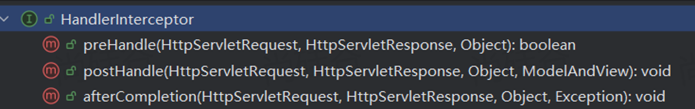

### 拦截器配置

> 拦截器代码

```java
package com.atguigu.practice.interceptor;

import jakarta.servlet.http.HttpServletRequest;
import jakarta.servlet.http.HttpServletResponse;
import org.springframework.stereotype.Component;
import org.springframework.web.servlet.HandlerInterceptor;
import org.springframework.web.servlet.ModelAndView;


@Component //拦截器还需要配置（告诉SpringMVC，这个拦截器主要拦截什么请求）
public class MyHandlerInterceptor0 implements HandlerInterceptor {

    @Override
    public boolean preHandle(HttpServletRequest request,
                             HttpServletResponse response, Object handler) throws Exception {
        System.out.println("MyHandlerInterceptor0...preHandle...");
        //放行； chain.doFilter(request,response);
        //String username = request.getParameter("username");
//        response.getWriter().write("No Permission!");
        return true;
    }

    @Override
    public void postHandle(HttpServletRequest request, HttpServletResponse response, Object handler, ModelAndView modelAndView) throws Exception {
        System.out.println("MyHandlerInterceptor0...postHandle...");
    }

    @Override
    public void afterCompletion(HttpServletRequest request, HttpServletResponse response, Object handler, Exception ex) throws Exception {
        System.out.println("MyHandlerInterceptor0...afterCompletion...");
    }
}
```

> 拦截器配置

```java
package com.atguigu.practice.config;


import com.atguigu.practice.interceptor.MyHandlerInterceptor0;
import com.atguigu.practice.interceptor.MyHandlerInterceptor1;
import com.atguigu.practice.interceptor.MyHandlerInterceptor2;
import org.springframework.beans.factory.annotation.Autowired;
import org.springframework.context.annotation.Configuration;
import org.springframework.web.servlet.config.annotation.InterceptorRegistry;
import org.springframework.web.servlet.config.annotation.WebMvcConfigurer;


/**
 * 1、容器中需要有这样一个组件：【WebMvcConfigurer】
 *     1)、@Bean 放一个 WebMvcConfigurer
 *     2)、配置类实现 WebMvcConfigurer
 */
@Configuration //专门对SpringMVC 底层做一些配置
public class MySpringMVCConfig  implements WebMvcConfigurer{

    @Autowired
    MyHandlerInterceptor0 myHandlerInterceptor0;


    @Autowired
    MyHandlerInterceptor1 myHandlerInterceptor1;


    @Autowired
    MyHandlerInterceptor2 myHandlerInterceptor2;
    //添加拦截器
    @Override
    public void addInterceptors(InterceptorRegistry registry) {
        registry.addInterceptor(myHandlerInterceptor0)
                .addPathPatterns("/**"); //拦截所有请求
        registry.addInterceptor(myHandlerInterceptor1)
                .addPathPatterns("/**"); //拦截所有请求

        registry.addInterceptor(myHandlerInterceptor2)
                .addPathPatterns("/**");
    }


    //    @Bean
//    WebMvcConfigurer webMvcConfigurer(){
//        return new WebMvcConfigurer() {
//            @Override
//            public void addInterceptors(InterceptorRegistry registry) {
//
//            }
//        };
//    }
}
```

### 拦截器执行顺序

**拦截器执行顺序**：`顺序preHandle`=>`目标方法`=>`倒序postHandle`=>`渲染`=>`倒序afterCompletion`

1. 只有执行成功的 `preHandle `会倒序执行 `afterCompletion`
2. `postHandle `、`afterCompletion `从哪里炸，倒序链路从哪里结束
3. `postHandle `失败不会影响 `afterCompletion  `执行

> 以下是多拦截器执行顺序流程图

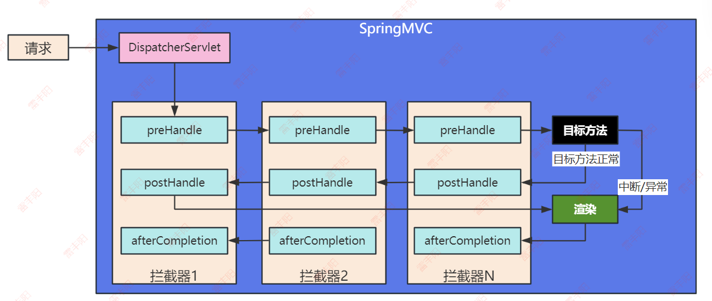

### 拦截器vs过滤器

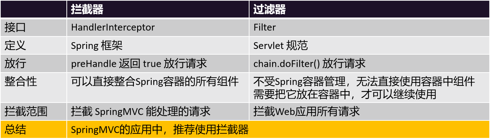

## 异常处理

> **SpringMVC 提供了非常方便的声明式异常处理**；

> 1. **编程式异常处理**：
> 
> `try - catch、throw、exception`
> 
> 1. **声明式异常处理：**
>   1. `SpringMVC`提供了 `@ExceptionHandler`、`@ControllerAdvice` 等便捷的声明式注解来进行快速的异常处理
>   2. `@ExceptionHandler`：可以处理指定类型异常
>   3. `@ControllerAdvice`：可以集中处理所有Controller的异常
>   4. `@ExceptionHandler` + `@ControllerAdvice`： 可以完成全局统一异常处理

### 通用逻辑

#### 统一返回：R对象

```typescript
package com.atguigu.practice.common;


import io.swagger.v3.oas.annotations.media.Schema;
import lombok.Data;


@Schema(description = "统一返回")
@Data
public class R<T> {

    @Schema(description = "状态码")
    private Integer code;

    @Schema(description = "提示信息")
    private String msg;

    @Schema(description = "数据")
    private T data;

    public static<T> R<T> ok(T data){
        R<T> tr = new R<>();
        tr.setCode(200);
        tr.setMsg("ok");
        tr.setData(data);
        return tr;
    }

    public static R ok(){
        R tr = new R<>();
        tr.setCode(200);
        tr.setMsg("ok");
        return tr;
    }

    public static R error(){
        R tr = new R<>();
        tr.setCode(500); //默认失败码
        tr.setMsg("error");
        return tr;
    }

    public static R error(Integer code,String msg){
        R tr = new R<>();
        tr.setCode(code); //默认失败码
        tr.setMsg(msg);
        return tr;
    }

    public static R error(Integer code,String msg,Object data){
        R tr = new R<>();
        tr.setCode(code); //默认失败码
        tr.setMsg(msg);
        tr.setData(data);
        return tr;
    }
}
```

#### 业务异常封装

```java
package com.atguigu.practice.exception;


import lombok.Data;

/**
 * 业务异常
 * 大型系统出现以下异常：异常处理文档，固化
 * 1、订单  1xxxx
 *      10001 订单已关闭
 *      10002 订单不存在
 *      10003 订单超时
 *      .....
 * 2、商品  2xxxx
 *       20001 商品已下架
 *       20002 商品已售完
 *       20003 商品库存不足
 *       ......
 * 3、用户
 *      30001 用户已注册
 *      30002 用户已登录
 *      30003 用户已注销
 *      30004 用户已过期
 *
 * 4、支付
 *      40001 支付失败
 *      40002 余额不足
 *      40003 支付渠道异常
 *      40004 支付超时
 *
 * 5、物流
 *      50001 物流状态错误
 *      50002 新疆得加钱
 *      50003 物流异常
 *      50004 物流超时
 *
 * 异常处理的最终方式：
 * 1、必须有业务异常类：BizException
 * 2、必须有异常枚举类：BizExceptionEnume  列举项目中每个模块将会出现的所有异常情况
 * 3、编写业务代码的时候，只需要编写正确逻辑，如果出现预期的问题，需要以抛异常的方式中断逻辑并通知上层。
 * 4、全局异常处理器：GlobalExceptionHandler；  处理所有异常，返回给前端约定的json数据与错误码
 */

@Data
public class BizException extends RuntimeException {

    private Integer code; //业务异常码
    private String msg; //业务异常信息
    public BizException(Integer code, String message) {
        super(message);
        this.code = code;
        this.msg = message;
    }

    public BizException(BizExceptionEnume exceptionEnume) {
        super(exceptionEnume.getMsg());
        this.code = exceptionEnume.getCode();
        this.msg = exceptionEnume.getMsg();
    }
}
```

#### 异常枚举

```java
package com.atguigu.practice.exception;

import lombok.Getter;

public enum BizExceptionEnume {


    // ORDER_xxx：订单模块相关异常
    // PRODUCT_xxx：商品模块相关异常

    // 动态扩充.....

    ORDER_CLOSED(10001, "订单已关闭"),
    ORDER_NOT_EXIST(10002, "订单不存在"),
    ORDER_TIMEOUT(10003, "订单超时"),
    PRODUCT_STOCK_NOT_ENOUGH(20003, "库存不足"),
    PRODUCT_HAS_SOLD(20002, "商品已售完"),
    PRODUCT_HAS_CLOSED(20001, "商品已下架");


    @Getter
    private Integer code;
    @Getter
    private String msg;


    private BizExceptionEnume(Integer code, String msg) {
        this.code = code;
        this.msg = msg;
    }

}
```

### @ExceptionHandler - 本类异常处理

```java
package com.atguigu.practice.controller;


import com.atguigu.practice.common.R;
import org.springframework.web.bind.annotation.*;

import java.io.FileInputStream;
import java.io.FileNotFoundException;


/**
 * 测试声明式异常处理
 */
@RestController
public class HelloController {


    //编程式的异常处理；
    //如果大量业务都需要加异常处理代码的话，会很麻烦
//        try {
//            //执行业务
//
//        }catch (Exception e){
//            return R.error(100,"执行异常");
//        }
    @GetMapping("/hello")
    public R hello(@RequestParam(value = "i",defaultValue = "0") Integer i) throws FileNotFoundException {
        int j = 10 / i;

//        FileInputStream inputStream = new FileInputStream("D:\\123.txt");
        String s = null;
        s.length();
        return R.ok(j);
    }


    /**
     * 1、如果Controller本类出现异常，会自动在本类中找有没有@ExceptionHandler标注的方法，
     *    如果有，执行这个方法，它的返回值，就是客户端收到的结果
     *  如果发生异常，多个都能处理，就精确优先
     * @return
     */
    @ResponseBody
    @ExceptionHandler(ArithmeticException.class)
    public R handleArithmeticException(ArithmeticException ex){
        System.out.println("【本类】 - ArithmeticException 异常处理");
        return R.error(100,"执行异常：" + ex.getMessage());
    }


    @ExceptionHandler(FileNotFoundException.class)
    public R handleException(FileNotFoundException ex){
        System.out.println("【本类】 - FileNotFoundException 异常处理");
        return R.error(300,"文件未找到异常：" + ex.getMessage());
    }


    @ExceptionHandler(Throwable.class)
    public R handleException02(Throwable ex){
        System.out.println("【本类】 - Throwable 异常处理");
        return R.error(500,"其他异常：" + ex.getMessage());
    }

}
```

### @ControllerAdvice - 全局异常处理

```java
package com.atguigu.practice.advice;


import com.atguigu.practice.common.R;
import com.atguigu.practice.exception.BizException;
import org.springframework.stereotype.Component;
import org.springframework.validation.BindingResult;
import org.springframework.validation.FieldError;
import org.springframework.web.bind.MethodArgumentNotValidException;
import org.springframework.web.bind.annotation.ControllerAdvice;
import org.springframework.web.bind.annotation.ExceptionHandler;
import org.springframework.web.bind.annotation.ResponseBody;
import org.springframework.web.bind.annotation.RestControllerAdvice;

import java.util.HashMap;
import java.util.List;
import java.util.Map;

// 全局异常处理器
//@ResponseBody
//@ControllerAdvice //告诉SpringMVC，这个组件是专门负责进行全局异常处理的
@RestControllerAdvice
public class GlobalExceptionHandler {


    /**
     * 如果出现了异常：本类和全局都不能处理，
     * SpringBoot底层对SpringMVC有兜底处理机制；自适应处理（浏览器响应页面、移动端会响应json）
     * 最佳实践：我们编写全局异常处理器，处理所有异常
     * <p>
     * 前端关心异常状态，后端正确业务流程。
     * 推荐：后端只编写正确的业务逻辑，如果出现业务问题，后端通过抛异常的方式提前中断业务逻辑。前端感知异常；
     * <p>
     * 异常处理：
     * 1、
     *
     * @param e
     * @return
     */
    @ExceptionHandler(ArithmeticException.class)
    public R error(ArithmeticException e) {
        System.out.println("【全局】 - ArithmeticException 处理");
        return R.error(500, e.getMessage()); //加@ResponseBody 配合 返回 对象，响应错误json
//        return "error"; //不加@ResponseBody 配合 返回String: 跳到错误页面
    }


    @ExceptionHandler(BizException.class)
    public R handleBizException(BizException e) {
        Integer code = e.getCode();
        String msg = e.getMsg();
        return R.error(code, msg);
    }

    @ExceptionHandler(value = MethodArgumentNotValidException.class)
    public R methodArgumentNotValidException(MethodArgumentNotValidException ex) {
        //1、result 中封装了所有错误信息
        BindingResult result = ex.getBindingResult();

        List<FieldError> errors = result.getFieldErrors();
        Map<String, String> map = new HashMap<>();
        for (FieldError error : errors) {
            String field = error.getField();
            String message = error.getDefaultMessage();
            map.put(field, message);
        }

        return R.error(500, "参数错误", map);
    }

    // 最终的兜底
    @ExceptionHandler(Throwable.class)
    public R error(Throwable e) {
        System.out.println("【全局】 - Exception处理" + e.getClass());
//        e.printStackTrace();
        return R.error(500, e.getMessage());
    }

}
```

### SpringBoot底层默认异常处理机制

1. **SpringBoot 依然 使用 SpringMVC 的异常处理机制；不过 SpringBoot 编写了一些默认的处理配置；**

**默认行为：自适应的异常处理；**

- <u>**浏览器发的请求，出现异常返回默认错误页面；**</u>
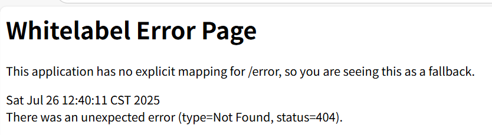
- <u>**移动端发的请求，出现异常返回默认json错误数据；**</u>
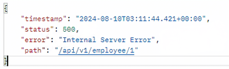

  
- <u>**项目开发的时候错误模型需要按照项目的标准走；**</u>
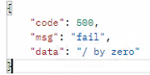

最佳实践：项目架构是一开始就决定好的（前后分离?）

## 数据校验

> **JSR 303 **是 Java 为 **Bean 数据合法性校验 **提供的**标准框架**，它已经包含在 **JavaEE 6.0 标准中**。JSR 303 通过在 Bean **属性上 标注** 类似于 @NotNull、@Max 等标准的**注解**指定校验规则，并**通过标准的验证接口**对**Bean进行验证**。

**数据校验使用流程**

1、引入校验依赖：spring-boot-starter-validation

2、定义封装数据的Bean

3、给Bean的字段标注校验注解，并指定校验错误消息提示

4、使用@Valid、@Validated开启校验

5、使用 BindingResult 封装校验结果

6、使用自定义校验注解 + 校验器(implements ConstraintValidator)  完成gender字段自定义校验规则

7、结合校验注解 message属性 与 i18n 文件，实现错误消息国际化

8、结合全局异常处理，统一处理数据校验错误

### 流程实现

#### 引入依赖

```xml
<dependency>
    <groupId>org.springframework.boot</groupId>
    <artifactId>spring-boot-starter-validation</artifactId>
</dependency>
```

#### 校验注解

```typescript
@Data
public class Employee {

    private Long id;
    @NotBlank(message = "姓名不能为空")
    private String name;

    @Min(value = 0, message = "年龄不能小于0岁")
    @Max(value = 150, message = "年龄不能大于150岁")
    @NotNull(message = "年龄不能为空")
    private Integer age;

    @Email(message = "邮箱格式不正确")
    private String email;
    private String gender;
    private String address;
    private BigDecimal salary;


    private Date birth;

}
```

常用校验注解如下：

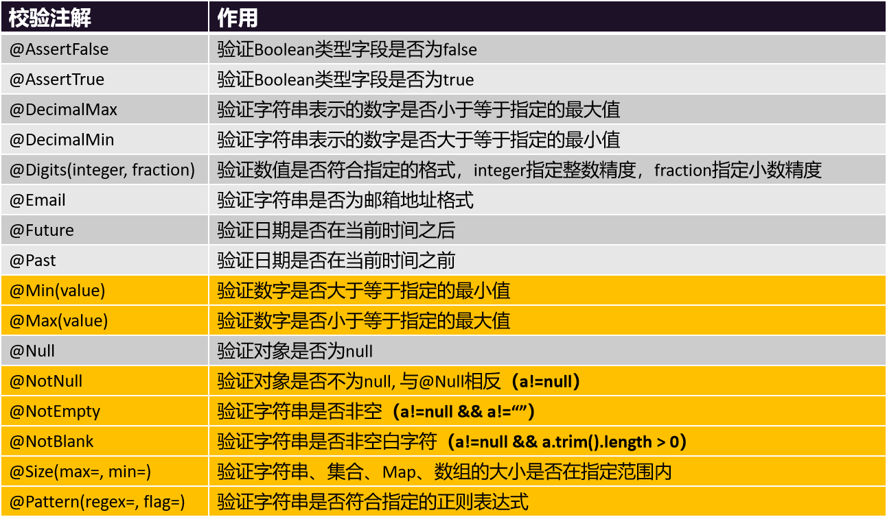

#### 开启校验：@Valid

```java
    @Operation(summary="新增员工")
    @PostMapping("/employee")
    public R add(@RequestBody @Valid Employee employee){

        employeeService.saveEmp(employee);
        return R.ok();

    }
```

#### BindingResult：获取校验结果

> BindingResult 要紧跟在 @Valid 标注的校验Bean上。

```java
    @Operation(summary="新增员工")
    @PostMapping("/employee")
    public R add(@RequestBody @Valid Employee employee,BindingResult result){

        if (!result.hasErrors()) {  //校验通过
        
        }
        // 说明校验错误； 拿到所有属性错误的信息
        Map<String, String> errorsMap = new HashMap<>();
        for (FieldError fieldError : result.getFieldErrors()) {
            //1、获取到属性名
            String field = fieldError.getField();
            //2、获取到错误信息
            String message = fieldError.getDefaultMessage();
            errorsMap.put(field, message);
        }
        return R.error(500, "校验失败", errorsMap);

    }
```

#### 自定义校验注解+自定义校验器

> 自定义校验注解

```java
@Documented
@Constraint(validatedBy = {GenderValidator.class})  //校验器去真正完成校验功能。
@Target({ FIELD })
@Retention(RUNTIME)
public @interface Gender {

    String message() default "性别不能为null";
    Class<?>[] groups() default { };
    Class<? extends Payload>[] payload() default { };

}
```

> 自定义校验器

```typescript
public class GenderValidator implements ConstraintValidator<Gender, String> {


    /**
     *
     * @param value 前端提交来的准备让我们进行校验的属性值
     * @param context 校验上下文
     *
     * @return
     */
    @Override
    public boolean isValid(String value, ConstraintValidatorContext context) {

        return "男".equals(value) || "女".equals(value);
    }
}
```

#### 错误消息国际化

> 多种语言环境下的错误消息配置文件。
> 
> 浏览器发送请求，改变语言环境，会自动展示对应的错误内容

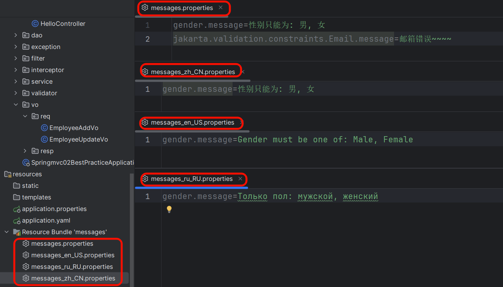

#### 全局校验错误，统一处理

```java
package com.atguigu.practice.advice;


import com.atguigu.practice.common.R;
import com.atguigu.practice.exception.BizException;
import org.springframework.stereotype.Component;
import org.springframework.validation.BindingResult;
import org.springframework.validation.FieldError;
import org.springframework.web.bind.MethodArgumentNotValidException;
import org.springframework.web.bind.annotation.ControllerAdvice;
import org.springframework.web.bind.annotation.ExceptionHandler;
import org.springframework.web.bind.annotation.ResponseBody;
import org.springframework.web.bind.annotation.RestControllerAdvice;

import java.util.HashMap;
import java.util.List;
import java.util.Map;

// 全局异常处理器
//@ResponseBody
//@ControllerAdvice //告诉SpringMVC，这个组件是专门负责进行全局异常处理的
@RestControllerAdvice
public class GlobalExceptionHandler {


    //数据校验错误处理器
    @ExceptionHandler(value = MethodArgumentNotValidException.class)
    public R methodArgumentNotValidException(MethodArgumentNotValidException ex) {
        //1、result 中封装了所有错误信息
        BindingResult result = ex.getBindingResult();

        List<FieldError> errors = result.getFieldErrors();
        Map<String, String> map = new HashMap<>();
        for (FieldError error : errors) {
            String field = error.getField();
            String message = error.getDefaultMessage();
            map.put(field, message);
        }

        return R.error(500, "参数错误", map);
    }

    // 最终的兜底
    @ExceptionHandler(Throwable.class)
    public R error(Throwable e) {
        System.out.println("【全局】 - Exception处理" + e.getClass());
//        e.printStackTrace();
        return R.error(500, e.getMessage());
    }

}
```

## VO分层

```markdown
/**
 * 设计模式：单一职责；
 * JavaBean也要分层，各种xxO：
 * Pojo：普通java类
 * Dao：Database Access Object ： 专门用来访问数据库的对象
 * DTO：Data Transfer Object： 专门用来传输数据的对象；
 * TO：transfer Object： 专门用来传输数据的对象；
 * BO：Business Object： 业务对象（Service），专门用来封装业务逻辑的对象；
 * VO：View/Value Object： 值对象，视图对象（专门用来封装前端数据的对象）
 *
 *
 * 新增员工；
 * 要求：前端发送请求把员工的json放在请求体中
 * 要求：如果校验出错，返回给前端。
 *   {
 *       "code": 500,
 *       "msg": "校验失败",
 *       "data": {
 *           "name": "姓名不能为空",  //这些就是为了让前端知道是哪些输入框错了，怎么错误，给用户要显示提示。
 *           "age": "年龄不能超过150"
 *       }
 *   }
 * @param vo
 * @return
 */
```

## 接口文档

> **后端会产生很多接口**（所有Controller暴露的请求，我们称为HTTP API，也叫**HTTP接口**）；前后分离开发模式下，前端需要参考这些接口的定义，才能知道给哪里发送请求，接收什么数据，能实现什么功能；**后端开发人员需要编写对应的接口文档**，可以使用以下技术：
> 
> 1. Swagger 可以快速生成实时接口文档，方便前后开发人员进行协调沟通。遵循 OpenAPI 规范。
> 2. Knife4j 是基于 Swagger之上的增强套件

### 版本适配

> Knife4j 和 Swagger的版本适配经常会出现问题。一定使用对应版本的。推荐如下

#### boot版本

```xml
<parent>
    <groupId>org.springframework.boot</groupId>
    <artifactId>spring-boot-starter-parent</artifactId>
    <!--    降版本！    -->
    <version>3.4.7</version>
    <relativePath/> <!-- lookup parent from repository -->
</parent>
```

#### knife4j版本

> knife4j 底层有 springdoc，springdoc和springboot的版本适配很重要，负责无法工作

```xml
<!--找合适的 knife4j 版本 -->
<dependency>
    <groupId>com.github.xiaoymin</groupId>
    <artifactId>knife4j-openapi3-jakarta-spring-boot-starter</artifactId>
    <version>4.5.0</version>
</dependency>
<!-- 如果有 springdoc-openapi 相关依赖，务必用2.x+ -->
<dependency>
    <groupId>org.springdoc</groupId>
    <artifactId>springdoc-openapi-starter-webmvc-ui</artifactId>
    <version>2.7.0</version>
</dependency>
```

#### springdoc版本

> 主要的是springdoc和springboot的适配；
> 
> knife4j 底层是依赖 springdoc 的

### 配置文件

> `springdoc.swagger-ui.path` 配置swagger的页面地址
> 
> `springdoc.api-docs.path`配置openapi文档地址
> 
> `springdoc.group-configs`配置分组

```yaml
springdoc:
  swagger-ui:
    path: /swagger-ui.html
    tags-sorter: alpha
  api-docs:
    path: /v3/api-docs
  group-configs:
    - group: 'default'
      display-name: '测试'
      paths-to-match: '/**'
      packages-to-scan: com.lfy.fyadmin.controller
  default-flat-param-object: true
```

### 访问测试

1. 访问：localhost:8080/doc.html ，可以看到knife4j的文档展示

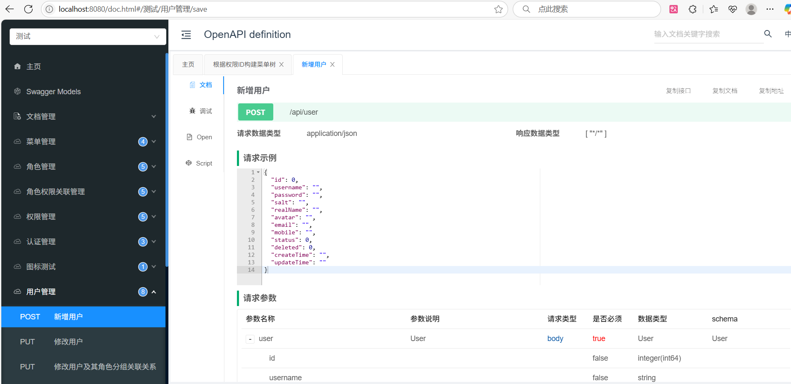

1. 访问：localhost:8080/swagger-ui.html，可以看到swagger的文档展示

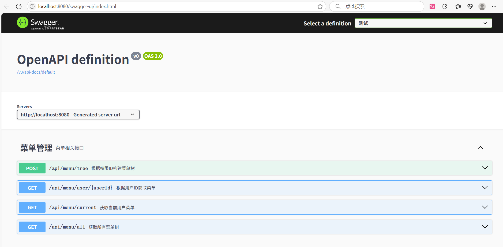

# 源码分析

## SpringMVC 九大组件

## DispatcherServlet 流程

## 运行流程图