# 4. MyBatis

# 入门

## 介绍


> - **官网**：https://mybatis.org/
> - `MyBatis`是一款优秀的持久层框架，它支持自定义 SQL、存储过程以及高级映射。 
> - `MyBatis`不像 `Hibernete`等这些全自动框架，它把关键的SQL部分交给程序员自己编写，而不是自动生成 

## HelloWorld

### 创建项目

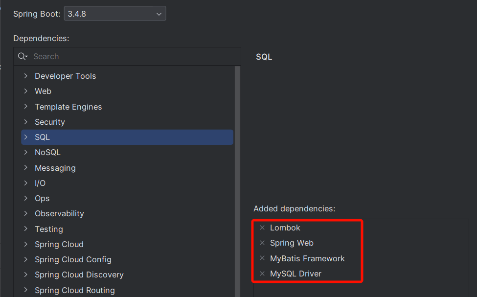

### 准备数据库环境（helloworld.sql）

```sql
CREATE DATABASE `mybatis-example`;

USE `mybatis-example`;

CREATE TABLE `t_emp`(
  id INT AUTO_INCREMENT,
  emp_name CHAR(100),
  age INT,
  emp_salary DOUBLE(10,5),
  PRIMARY KEY(id)
);

INSERT INTO `t_emp`(emp_name,age,emp_salary) VALUES("tom",18,200.33);
INSERT INTO `t_emp`(emp_name,age,emp_salary) VALUES("jerry",19,666.66);
INSERT INTO `t_emp`(emp_name,age,emp_salary) VALUES("andy",20,777.77);
```

### 编写dao接口（查询员工）

```java
@Mapper  //告诉Spring，这是MyBatis操作数据库用的接口; Mapper接口
public interface EmpMapper {

    //按照id查询
    Emp getEmpById(Integer id);

}
```

### 编写dao实现（dao.xml）

> 注意：
> 
> 1. `namespace`必须和接口名一致
> 2. `${}` 动态取出方法传参的值
> 3. xml文件名推荐和接口名一致：`EmpMapper.xml`
> 4. xml文件位置： `src/resources/mapper/EmpMapper.xml`

```xml
<?xml version="1.0" encoding="UTF-8" ?>
<!DOCTYPE mapper PUBLIC "-//mybatis.org//DTD Mapper 3.0//EN" "http://mybatis.org/dtd/mybatis-3-mapper.dtd" >
<mapper namespace="com.lfy.mybatis.mapper.EmpMapper">


    <select id="getEmpById" resultType="com.lfy.mybatis.bean.Emp">
        select id,emp_name empName,age,emp_salary empSalary
           from t_emp where id = ${id}
    </select>


</mapper>
```

### 配置xml扫描位置

> 修改：`application.properties`

```properties
# 告诉MyBatis， xml文件(Mapper文件) 都在哪里
mybatis.mapper-locations=classpath:mapper/**.xml
```

### 单元测试 

```java
@SpringBootTest
class Mybatis01HelloworldApplicationTests {

    @Autowired  //容器中是MyBatis为每个Mapper接口创建的代理对象
    EmpMapper empMapper;

    @Test
    void testValue(){
        //前端传来的参数最好做一个校验（SQL防注入校验）   or
        //SQL防注入工具类
        Emp tEmp = empMapper.getEmpById(1);
        System.out.println("tEmp = " + tEmp);
    }
}
```

### 开启SQL日志

```properties
logging.level.com.lfy.mybatis.mapper=debug
```

## 细节

1. 每个Dao 接口 对应一个 XML 实现文件
2. Dao 实现类 是一个由 MyBatis 自动创建出来的代理对象
3. XML 中 namespace 需要绑定 Dao 接口 的全类名
4. XML 中使用 select、update、insert、delete 标签来代表增删改查
5. 每个 CRUD 标签 的 id 必须为Dao接口的方法名
6. 每个 CRUD标签的 `resultType `是Dao接口的返回值类型全类名
7. 未来遇到复杂的返回结果封装，需要指定 `resultMap `规则
8. 以后 `xxxDao `我们将按照习惯命名为 `xxxMapper`，这样更明显的表示出 持久层是用 MyBatis 实现的

## CRUD 完整定义

### Mapper.xml 配置

```xml
<?xml version="1.0" encoding="UTF-8" ?>
<!DOCTYPE mapper
        PUBLIC "-//mybatis.org//DTD Mapper 3.0//EN"
        "https://mybatis.org/dtd/mybatis-3-mapper.dtd">
<mapper namespace="com.lfy.mapper.EmployeeMapper">
    <select id="getEmp" resultType="com.lfy.mybatis.entity.Employee">
        select * from `t_emp` where id = #{id}
    </select>
    <select id="getAllEmp" resultType="com.lfy.mybatis.entity.Employee">
        select * from `t_emp`
    </select>
    
    <insert id="saveEmp">
        insert into t_emp(emp_name,emp_salary) values(#{empName},#{empSalary})
    </insert>
    <update id="updateEmp">
        update t_emp set emp_salary=#{empSalary} where emp_id=#{empId}
    </update>
    <delete id="deleteEmp">
        delete from t_emp where id = #{id}
    </delete>
</mapper>

```

### Dao接口

```java
package com.lfy.mybatis.mapper;

import com.lfy.mybatis.bean.Emp;
import org.apache.ibatis.annotations.Mapper;

import java.util.List;


@Mapper  //告诉Spring，这是MyBatis操作数据库用的接口; Mapper接口
public interface EmpMapper {


    //按照id查询
    Emp getEmpById(Integer id);


    //查询所有员工
    List<Emp> getAll();


    //添加员工
    void addEmp(Emp emp);


    //更新员工
    void updateEmp(Emp emp);

    //删除员工
    void deleteEmpById(Integer id);

}
```

## 自增Id

> **插入标签中，指定如下属性**：
> 
> `useGeneratedKeys`：代表使用自增主键
> 
> `keyProperty`：指定主键在JavaBean中的属性名
> 
> 这样MyBatis在**新增完数据会回填数据的自增主键值到JavaBean指定的属性中**，方便后续使用

```xml
<insert id="insertEmployee" useGeneratedKeys="true" keyProperty="empId">
  insert into t_emp(emp_name,emp_salary)
  values(#{empName},#{empSalary})
</insert>
```

# MyBatis 参数传递

## #{} 与 ${}

`#{}：`底层使用 PreparedStatement 方式，SQL预编译后设置参数，**无SQL注入攻击风险**

`${}：`底层使用 Statement 方式，SQL无预编译，直接拼接参数，**有SQL注入攻击风险**

> 所有参数位置，都应该用 #{}

> 需要动态表名等，才用 ${}

最佳实践：

> **凡是使用了 ${}  的业务，一定要自己编写防SQL注入攻击代码**

```xml
<!--
#{}：参数位置动态取值，安全，无SQL注入问题
${}：JDBC层面 表名等位置 不支持预编译，只能用 ${}
  -->
    <select id="getEmpById02" resultType="com.lfy.mybatis.bean.Emp">
        select id,emp_name empName,age,emp_salary empSalary
        from ${tableName} where id = #{id}
    </select>
```

## 参数取值

> **最佳实践：即使只有一个参数，也用 @Param 指定参数名**

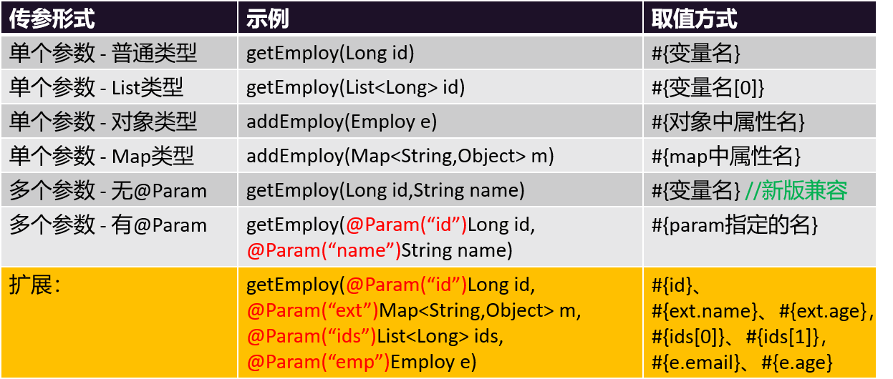

### 接口定义

```java
package com.lfy.mybatis.mapper;

import com.lfy.mybatis.bean.Emp;
import org.apache.ibatis.annotations.Mapper;
import org.apache.ibatis.annotations.Param;

import java.util.List;
import java.util.Map;


//单个参数：
//  1、#{参数名} 就可以取值。
//  2、Map和JavaBean，#{key/属性名} 都可以取值。
//多个参数：
//  用@Param指定参数名， #{参数名} 就可以取值。
@Mapper  //告诉Spring，这是MyBatis操作数据库用的接口; Mapper接口
public interface EmpParamMapper {

    Emp getEmploy(Long id);

    //    // 获取数组中第二个元素指定的用户
    Emp getEmploy02(List<Long> ids);
//

    // 对象属性取值，直接获取
    void addEmploy(Emp e);


    // map中的属性也是直接取值
    void addEmploy2(Map<String, Object> m);

    //==========以上是单个参数测试==============

    //以后多个参数，用@Param指定参数名， #{参数名} 就可以取值。
    Emp getEmployByIdAndName(@Param("id") Long id, @Param("empName") String name);


    // select * from emp where id = #{id} and emp_name = #{从map中取到的name} and age = #{ids的第三个参数值} and salary = #{e中的salary}
    Emp getEmployHaha(@Param("id") Long id,
                      @Param("m") Map<String,Object> m,
                      @Param("ids") List<Long> ids,
                      @Param("e") Emp e);


}
```

### xml定义

```xml
<?xml version="1.0" encoding="UTF-8" ?>
<!DOCTYPE mapper PUBLIC "-//mybatis.org//DTD Mapper 3.0//EN" "http://mybatis.org/dtd/mybatis-3-mapper.dtd" >
<mapper namespace="com.lfy.mybatis.mapper.EmpParamMapper">
    <insert id="addEmploy">
        insert into t_emp(emp_name,age) values (#{empName},#{age})
    </insert>
    <insert id="addEmploy2">
        insert into t_emp(emp_name,age) values (#{name},#{age})
    </insert>

    <select id="getEmploy" resultType="com.lfy.mybatis.bean.Emp">
        select * from t_emp where id = #{id}
    </select>

    <select id="getEmploy02" resultType="com.lfy.mybatis.bean.Emp">
        select * from t_emp where id = #{ids[1]}
    </select>

<!--
    新版 MyBatis支持多个参数情况下，直接用 #{参数名}
    老版 MyBatis不支持以上操作，需要用 @Param 注解指定参数名
-->
    <select id="getEmployByIdAndName" resultType="com.lfy.mybatis.bean.Emp">
        select * from t_emp where id = #{id} and emp_name = #{empName}
    </select>


    <select id="getEmployHaha" resultType="com.lfy.mybatis.bean.Emp">
        select * from t_emp where id = #{id}
                              and emp_name = #{m.name}
                              and age = #{ids[2]}
                              and emp_salary = #{e.empSalary}
    </select>
</mapper>
```

# MyBatis 结果封装

## 自动结果返回：ResultType

### 普通数据返回

> 返回**基本类型**、**普通对象** 都只需要在 `resultType `中声明返回值类型**全类名**即可
> 
> 对象封装**建议全局开启驼峰命名规则**：`mapUnderscoreToCamelCase = true`；
> 
> > `a_column `会被映射为bean的 `aColumn `属性

```xml
<select id="getEmp" resultType="com.lfy.mybatis.entity.Employee">
    select * from `t_emp` where id = #{id}
</select>
```

```xml
<select id="countEmp" resultType="java.lang.Long">
    select count(*) from `t_emp`
</select>
```

> **小提示**：MyBatis 为 java.lang 下的很多数据类型都起了**别名**，只需要用**Long**，**String**，**Double **等这些表示即可，不用写**全类名**

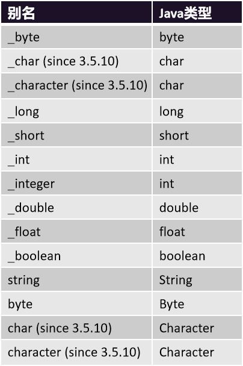

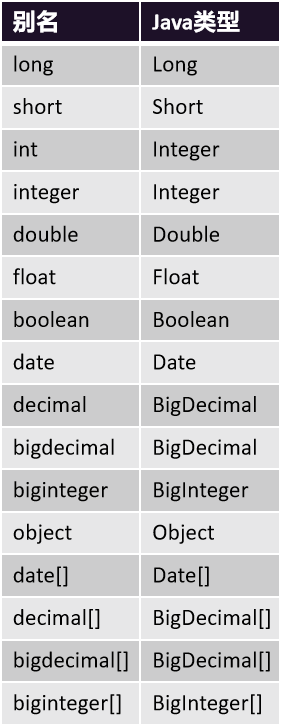

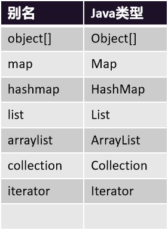

### 返回List、Map

> `List``：``resultType`** **为集合中的 **元素类型**
> 
> `Map``：``resultType`** **为 `map`，配合** **`@MapKey`** **指定哪一列的值作为`Map 的 key`，Map 的 Value 为这一行数据的完整信息；完整定义为：`Map<Key,Map>`

### 参考代码

```java
/**
 * 返回值结果：
 *   返回对象，普通：resultType="全类名"；
 *   返回集合：     resultType="集合中元素全类名"；
 * 最佳实践：
 *   1、开启驼峰命名
 *   2、1搞不定的，用自定义映射（ResultMap）
 */
@Mapper
public interface EmpReturnValueMapper {


    Long countEmp();

    BigDecimal getEmpSalaryById(Integer id);

    List<Emp> getAll();


    @MapKey("id")
    // 实际保存的不是 Emp，是 HashMap
    Map<Integer, Emp> getAllMap();


    Emp getEmpById(Integer id);

}
```

> **MapperXML文件**

```xml
<?xml version="1.0" encoding="UTF-8" ?>
<!DOCTYPE mapper PUBLIC "-//mybatis.org//DTD Mapper 3.0//EN" "http://mybatis.org/dtd/mybatis-3-mapper.dtd" >
<mapper namespace="com.lfy.mybatis.mapper.EmpReturnValueMapper">


    <!--   有别名，但不用 -->
    <select id="countEmp" resultType="long">
        select count(*)
        from t_emp
    </select>
    <select id="getEmpSalaryById" resultType="java.math.BigDecimal">
        select emp_salary
        from t_emp
        where id = #{id}
    </select>

    <!--   返回集合，写集合中元素类型 -->
    <select id="getAll" resultType="com.lfy.mybatis.bean.Emp">
        select *
        from t_emp
    </select>

    <!-- 返回map集合，  resultType 写map中value元素类型 -->
    <select id="getAllMap" resultType="com.lfy.mybatis.bean.Emp">
        select *
        from t_emp
    </select>

</mapper>
```

## 自定义结果集：ResultMap

### 基本用法

> 数据库的字段 如果和 **Bean的属性** 不能一一对应，有两种办法
> 
> 1、如果符合驼峰命名，则开启驼峰命名规则
> 
> 2、编写**自定义结果集（ResultMap）** 进行封装

```xml
<!--
    默认封装规则（resultType）：JavaBean 中的属性名 去数据库表中 找对应列名的值。一一映射封装。
    自定义结果集（resultMap）：我们来告诉MyBatis 如何把结果封装到Bean中;
         明确指定每一列如何封装到指定的Bean中
  -->
<resultMap id="EmpRM" type="com.lfy.mybatis.bean.Emp">
    <!--id：声明主键映射规则-->
    <id column="id" property="id"></id>
    <!--result：声明普通列映射规则-->
    <result column="emp_name" property="empName"></result>
    <result column="age" property="age"></result>
    <result column="emp_salary" property="empSalary"></result>
</resultMap>

<!-- resultMap：指定自定义映射规则   -->
<select id="getEmpById" resultMap="EmpRM">
    select *
    from t_emp
    where id = #{id}
</select>
```

### ResultMap - 重要属性

> **id 标签**：必须指定主键列映射规则
> 
> **result 标签**：指定普通列映射规则
> 
> **collection 标签**：指定自定义集合封装规则
> 
> **association 标签**：指定自定义对象封装规则

## 自定义结果集 - 1对1关联查询

### 复习：关联关系

- **1-1：一对一；**
  - 多表联查产生一对一关系，比如一个订单对应唯一一个下单客户；此时需要保存关系键到某个表中
- **1-N：一对多；**
  - 多表联查产生一对多关系，比如一个客户产生了多个订单记录；此时多的一端需要保存关系键到自己表中
- **N-N：多对多：**
  - 无论从哪端出发看，都是对多关系，这就是一个多对多的关系，比如 一个学生有多个老师、一个老师又教了多个学生；此时需要一个中间表记录学生和老师的关联关系

**图形表示：**

1. **1-1；1-N**

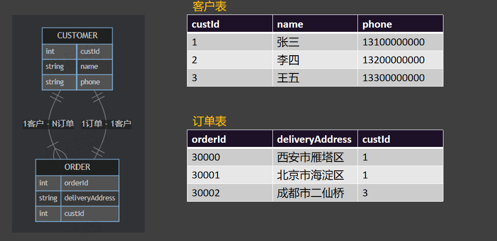

1. **N-N**

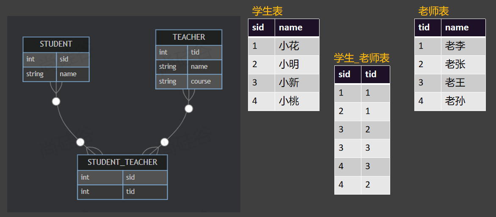

### association：一对一关联封装

> `association 标签`：指定自定义对象封装规则，一般用来做一对一关系的封装。比如一个用户对应一个订单
> 
> - `javaType`：指定关联的Bean的类型
> - `select`：指定分步查询调用的方法
> - `column`：指定分步查询传递的参数列

### association：案例 - 按照id查询订单以及下单的客户信息

> 创建基本测试数据

```sql
SET NAMES utf8mb4;
SET FOREIGN_KEY_CHECKS = 0;

-- ----------------------------
-- Table structure for t_customer
-- ----------------------------
DROP TABLE IF EXISTS `t_customer`;
CREATE TABLE `t_customer`  (
  `id` bigint NOT NULL AUTO_INCREMENT,
  `customer_name` varchar(255) CHARACTER SET utf8mb4 COLLATE utf8mb4_0900_ai_ci NULL DEFAULT NULL COMMENT '客户姓名',
  `phone` varchar(255) CHARACTER SET utf8mb4 COLLATE utf8mb4_0900_ai_ci NULL DEFAULT NULL COMMENT '手机号',
  PRIMARY KEY (`id`) USING BTREE
) ENGINE = InnoDB AUTO_INCREMENT = 4 CHARACTER SET = utf8mb4 COLLATE = utf8mb4_0900_ai_ci ROW_FORMAT = Dynamic;

-- ----------------------------
-- Records of t_customer
-- ----------------------------
INSERT INTO `t_customer` VALUES (1, '张三', '13100000000');
INSERT INTO `t_customer` VALUES (2, '李四', '13200000000');
INSERT INTO `t_customer` VALUES (3, '王五', '13300000000');

DROP TABLE IF EXISTS `t_order`;
CREATE TABLE `t_order`  (
  `id` bigint NOT NULL AUTO_INCREMENT COMMENT '订单id',
  `address` varchar(255) CHARACTER SET utf8mb4 COLLATE utf8mb4_0900_ai_ci NULL DEFAULT NULL COMMENT '派送地址',
  `amount` decimal(10, 2) NULL DEFAULT NULL COMMENT '订单金额',
  `customer_id` bigint NULL DEFAULT NULL COMMENT '客户id',
  PRIMARY KEY (`id`) USING BTREE
) ENGINE = InnoDB AUTO_INCREMENT = 4 CHARACTER SET = utf8mb4 COLLATE = utf8mb4_0900_ai_ci ROW_FORMAT = Dynamic;

-- ----------------------------
-- Records of t_order
-- ----------------------------
INSERT INTO `t_order` VALUES (1, '西安市雁塔区', 99.98, 1);
INSERT INTO `t_order` VALUES (2, '北京市', 199.00, 1);
INSERT INTO `t_order` VALUES (3, '深圳市', 299.00, 2);

SET FOREIGN_KEY_CHECKS = 1;

```

> OrderMapper 接口

```java
@Mapper
public interface OrderMapper {


    //按照id查询订单以及下单的客户信息
    Order getOrderByIdWithCustomer(Long id);

}
```

> OrderMapper.xml 定义

```xml
<?xml version="1.0" encoding="UTF-8" ?>
<!DOCTYPE mapper PUBLIC "-//mybatis.org//DTD Mapper 3.0//EN" "http://mybatis.org/dtd/mybatis-3-mapper.dtd" >
<mapper namespace="com.lfy.mybatis.mapper.OrderMapper">


    <!--   自定义结果集 -->
    <resultMap id="OrderRM" type="com.lfy.mybatis.bean.Order">
        <id column="id" property="id"></id>
        <result column="address" property="address"></result>
        <result column="amount" property="amount"></result>
        <result column="customer_id" property="customerId"></result>
        <!--      一对一关联封装  -->
        <association property="customer"
                     javaType="com.lfy.mybatis.bean.Customer">
            <id column="c_id" property="id"></id>
            <result column="customer_name" property="customerName"></result>
            <result column="phone" property="phone"></result>
        </association>
    </resultMap>


    <select id="getOrderByIdWithCustomer"
            resultMap="OrderRM">
        select o.*,
               c.id c_id,
               c.customer_name,
               c.phone
        from t_order o
                 left join t_customer c on o.customer_id = c.id
        where o.id = #{id}
    </select>
</mapper>
```

## 自定义结果集 - 1对多关联查询

### **collection：标签定义**

> **ResultMap 中定义了 collection 标签，可以进行查询多条数据 **

> `collection 标签`：指定自定义对象封装规则，一般用户联合查询一对一关系的封装。比如一个用户对应一个订单
> 
> - `ofType`：指定集合中每个元素的类型
> - `select`：指定分步查询调用的方法
> - `column`：指定分步查询传递的参数列

### **collection：**案例：按照id查询客户以及下的所有订单

> `CustomerMapper`接口定义

```java
@Mapper
public interface CustomerMapper {

    Customer getCustomerByIdWithOrders(Long id);

}
```

> `CustomerMapper.xml` 定义

```xml
<?xml version="1.0" encoding="UTF-8" ?>
<!DOCTYPE mapper PUBLIC "-//mybatis.org//DTD Mapper 3.0//EN" "http://mybatis.org/dtd/mybatis-3-mapper.dtd" >
<mapper namespace="com.lfy.mybatis.mapper.CustomerMapper">

    <resultMap id="CutomerRM" type="com.lfy.mybatis.bean.Customer">
        <id column="c_id" property="id"></id>
        <result column="customer_name" property="customerName"></result>
        <result column="phone" property="phone"></result>
<!--
collection：说明 一对N 的封装规则
ofType: 集合中元素的类型
-->
        <collection property="orders" ofType="com.lfy.mybatis.bean.Order">
            <id column="id" property="id"></id>
            <result column="address" property="address"></result>
            <result column="amount" property="amount"></result>
            <result column="c_id" property="customerId"></result>
        </collection>
    </resultMap>


    <select id="getCustomerByIdWithOrders" resultMap="CutomerRM">
        select c.id c_id,
               c.customer_name,
               c.phone,
               o.*
        from t_customer c
                 left join t_order o on c.id = o.customer_id
        where c.id = #{id}
    </select>

</mapper>
```

## 分步查询（了解）

> 在 `association `和 `collection `的封装过程中，可以使用 `select + column `指定**分步查询逻辑**
> 
> - `select`：指定分步查询调用的方法
> - `column`：指定分步查询传递的参数
> 
> **传递单个**：直接写列名，表示将这列的值作为参数传递给下一个查询
> 
> **传递多个**：`column="{prop1=col1,prop2=col2}"`，下一个查询使用`#{``prop1}`、`#{``prop2}`取值

### 【分步查询】案例1：按照id查询客户 以及 他下的所有订单

#### 接口定义两个方法

```java
@Mapper
public interface OrderCustomerStepMapper {

    //需求：按照id查询客户 以及 他下的所有订单
    //1. 查询客户
    Customer getCustomerById(Long id);

    //2. 查询订单
    List<Order> getOrdersByCustomerId(Long cId);
}    
```

#### Mapper定义方法实现

> **注意**：`resultMap`：指定自定义结果封装。 `resultType`：指定默认封装规则

```xml
<?xml version="1.0" encoding="UTF-8" ?>
<!DOCTYPE mapper PUBLIC "-//mybatis.org//DTD Mapper 3.0//EN" "http://mybatis.org/dtd/mybatis-3-mapper.dtd" >
<mapper namespace="com.lfy.mybatis.mapper.OrderCustomerStepMapper">


    <!--   按照id查询客户 -->
    <select id="getCustomerById" resultMap="CustomerOrdersStepRM">
        select *
        from t_customer
        where id = #{id}
    </select>

    <!--   按照客户id查询他的所有订单  resultType="com.lfy.mybatis.bean.Order" -->
    <select id="getOrdersByCustomerId" resultType="com.lfy.mybatis.bean.Order">
        select *
        from t_order
        where customer_id = #{cId}
    </select>
</mapper>
```

#### ResultMap定义结果集

> resultMap：指定 collection  封装的时候。使用 select 调用别的方法进行查询。
> 
> 这样就构成了分步查询

```xml
<!--   分步查询的自定义结果集： -->
<resultMap id="CustomerOrdersStepRM" type="com.lfy.mybatis.bean.Customer">
    <id column="id" property="id"></id>
    <result column="customer_name" property="customerName"></result>
    <result column="phone" property="phone"></result>
    <collection property="orders"
                select="com.lfy.mybatis.mapper.OrderCustomerStepMapper.getOrdersByCustomerId"
                column="id">
    </collection>
    <!--    告诉MyBatis，封装 orders 属性的时候，是一个集合，
            但是这个集合需要调用另一个 方法 进行查询；select：来指定我们要调用的另一个方法
            column：来指定我们要调用方法时，把哪一列的值作为传递的参数，交给这个方法
               1）、column="id"： 单传参：id传递给方法
               2）、column="{cid=id,name=customer_name}"：多传参（属性名=列名）；
                    cid=id：cid是属性名，它是id列的值
                    name=customer_name：name是属性名，它是customer_name列的值
    -->

</resultMap>
```

### 【分步查询】案例2：按照id查询订单 以及 下单的客户

#### 接口方法定义

```java
/**
 *
 * @param id 订单id
 * @return
 */
//4、分步查询：自动做两步 = 按照id查询订单 + 查询下单的客户
Order getOrderByIdAndCustomerStep(Long id);
```

#### mapper定义

```xml
<!--   分步查询：自定义结果集；封装订单的分步查询  -->
<resultMap id="OrderCustomerStepRM" type="com.lfy.mybatis.bean.Order">
    <id column="id" property="id"></id>
    <result column="address" property="address"></result>
    <result column="amount" property="amount"></result>
    <result column="customer_id" property="customerId"></result>
    <!--       customer属性关联一个对象，启动下一次查询，查询这个客户 -->
    <association property="customer"
                 select="com.lfy.mybatis.mapper.OrderCustomerStepMapper.getCustomerById"
                 column="customer_id">
    </association>
</resultMap>

<select id="getOrderByIdAndCustomerStep" resultMap="OrderCustomerStepRM">
    select *
    from t_order
    where id = #{id}
</select>
```

### 【超级分步】案例3：按照id查询订单 以及 下单的客户 以及 此客户的所有订单（小心stackoverflow）

> 注意，最后的一步查询用 `resultType `默认封装规则，来终结自定义封装逻辑。否则会 `StackOverFlow`

#### 接口定义

```java
// 【超级分步】案例3：按照id查询订单 以及 下单的客户 以及 此客户的所有订单
Order getOrderByIdAndCustomerAndOtherOrdersStep(Long id);
```

#### mapper定义

```xml
<!--   查询订单 + 下单的客户 + 客户的其他所有订单 -->
<select id="getOrderByIdAndCustomerAndOtherOrdersStep"
        resultMap="OrderCustomerStepRM">
    select * from t_order where id = #{id}
</select>
```

### 【延迟加载】

> **分步查询** 有时候**并不需要立即运行**，我们希望**在用到的时候再去查询**，可以**开启延迟加载**的功能
> 
> **全局配置**： 
> 
> - mybatis.configuration.lazy-loading-enabled=true
> - mybatis.configuration.aggressive-lazy-loading=false

# MyBatis 动态SQL

> `动态 SQL` 是 MyBatis 的强大特性之一。如果你使用过 JDBC 或其它类似的框架，你应该能`理解根据不同条件拼接 SQL 语句`有多痛苦，例如拼接时要确保不能忘记添加必要的空格，还要注意去掉列表最后一个列名的逗号。利用动态 SQL，可以彻底摆脱这种痛苦。

使用动态 SQL 并非一件易事，但借助可用于任何 SQL 映射语句中的强大的动态 SQL 语言，MyBatis 显著地提升了这一特性的易用性。

## if、where 标签

**需求**：按照 empName 和 empSalary 查询员工。

**注意**：前端不一定携带所有条件

> 接口方法定义如下：

```java
//1、按照 empName 和 empSalary 查询员工。
List<Emp> queryEmpByNameAndSalary(@Param("name") String name,
                                 @Param("salary") BigDecimal salary);
```

> Mapper.xml 实现如下：
> 
> **注意：**`<where>`** 标签也可以不用。直接写**`where`**关键字。但是多种条件下有可能出现条件之间多了或者少了and、or等连接符的**

```xml
<!-- where 版
 if标签：判断；
     test：判断条件； java代码怎么写，它怎么写
 where标签：解决 where 后面 语法错误问题（多and、or, 无任何条件多where）
 -->
<select id="queryEmpByNameAndSalary" resultType="com.lfy.mybatis.bean.Emp">
    select * from t_emp
    <where>
        <if test="name != null">
            emp_name= #{name}
        </if>
        <if test="salary != null">
            and emp_salary = #{salary};
        </if>
    </where>
</select>
```

## set 标签

> 用来在 update 的语句中，动态解决 set 多个条件之间，可能多了或者少了 逗号连接符、语法错误等问题。

> 接口方法定义如下：

```java
void updateEmp(Emp emp);
```

> mapper文件定义如下：

```xml
<!--  set：和where一样，解决语法错误问题。
   update t_emp where id=1
  -->
<update id="updateEmp">
    update t_emp
        <set>
            <if test="empName != null">
                emp_name = #{empName},
            </if>
            <if test="empSalary != null">
                emp_salary = #{empSalary},
            </if>
            <if test="age!=null">
                age = #{age}
            </if>
        </set>
    where id = #{id}
</update>
```

## trim 标签(了解)

> trim标签 用来实现自定义截串逻辑的

### trim 实现 where标签功能

```xml
<!-- trim版本实现where
    prefix：前缀 ; 如果标签体中有东西，就给它们拼一个前缀
    suffix：后缀
    prefixOverrides：前缀覆盖； 标签体中最终生成的字符串，如果以指定前缀开始，就覆盖成空串
    suffixOverrides：后缀覆盖

-->
    <select id="queryEmpByNameAndSalary" resultType="com.lfy.mybatis.bean.Emp">
        select * from t_emp
        <trim prefix="where" prefixOverrides="and || or">
            <if test="name != null">
                emp_name= #{name}
            </if>
            <if test="salary != null">
                and emp_salary = #{salary}
            </if>
        </trim>

    </select>
```

### trim 实现 set标签功能

```xml
<!--   trim： 版本实现 set
suffix="where id = #{id}"
-->
    <update id="updateEmp">
        update t_emp
            <trim prefix="set" suffixOverrides="," >
                <if test="empName != null">
                    emp_name = #{empName},
                </if>
                <if test="empSalary != null">
                    emp_salary < #{empSalary},
                </if>
                <if test="age!=null">
                    age = #{age}
                </if>
            </trim>
        where id = #{id}
    </update>
```

## choose/when/otherwise 标签

> 在多分支中选择一个

```xml
    <select id="selectEmployeeByConditionByChoose" 
                  resultType="com.lfy.mybatis.entity.Employee">
        select emp_id,emp_name,emp_salary from t_emp where
        <choose>
            <when test="empName != null">emp_name=#{empName}</when>
            <when test="empSalary < 3000">emp_salary < 3000</when>
            <otherwise>1=1</otherwise>
        </choose>
    </select>
```

## foreach 标签（重点）

> 用来遍历，循环；常用于批量插入场景；批量单个SQL；比如语法如下

```xml
<!--
    collection属性：要遍历的集合
    item属性：遍历集合的过程中能得到每一个具体对象，在item属性中设置一个名字，将来通过这个名字引用遍历出来的对象
    separator属性：指定当foreach标签的标签体重复拼接字符串时，各个标签体字符串之间的分隔符
    open属性：指定整个循环把字符串拼好后，字符串整体的前面要添加的字符串
    close属性：指定整个循环把字符串拼好后，字符串整体的后面要添加的字符串
    index属性：这里起一个名字，便于后面引用
        遍历List集合，这里能够得到List集合的索引值
        遍历Map集合，这里能够得到Map集合的key
 -->
<foreach collection="empList" item="emp" separator="," open="values" index="myIndex">
    (#{emp.empName},#{myIndex},#{emp.empSalary},#{emp.empGender})
</foreach>

```

### 集合查询

```xml
<!--  for(Integer id :ids)
foreach: 遍历List,Set,Map,数组
        collection：指定要遍历的集合名
        item：将当前遍历出的元素赋值给指定的变量
        separator：指定在每次遍历时，元素之间拼接的分隔符
        open：遍历开始前缀； 不开始遍历就不会有这个
        close：遍历结束后缀
-->

    <select id="getEmpsByIdIn" resultType="com.lfy.mybatis.bean.Emp">
        select
            <include refid="column_names"></include>
            from t_emp
            <if test="ids != null">
                <foreach collection="ids" item="id" separator="," open="where id IN (" close=")">
                    #{id}
                </foreach>
            </if>

    </select>
```

### 批量插入

```java
//批量插入一批员工
void addEmps(List<Emp> emps);
```

```xml
<insert id="addEmps">
    insert into t_emp(emp_name,age,emp_salary)
    values
    <foreach collection="emps" item="emp" separator=",">
        (#{emp.empName},#{emp.age},#{emp.empSalary})
    </foreach>
</insert>
```

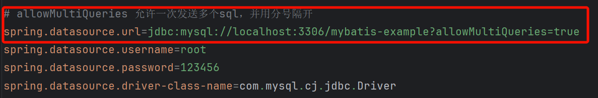

## sql 标签

> 用来抽取复用的片段

### 第一步：抽取公共片段

```xml
<!--
 sql：抽取可复用的sql片段
 include：引用sql片段，refid属性：sql片段的id
 -->
    <sql id="column_names">
        id,emp_name empName,age,emp_salary empSalary
    </sql>
```

### 第二步：其他位置引用公共片段

```xml
<select id="getEmpsByIdIn" resultType="com.lfy.mybatis.bean.Emp">
    select
        <include refid="column_names"></include>
        from t_emp
        <if test="ids != null">
            <foreach collection="ids" item="id" separator="," open="where id IN (" close=")">
                #{id}
            </foreach>
        </if>

</select>
```

## 特殊字符

以后在xml中，以下字符需要用转义字符，不能直接写

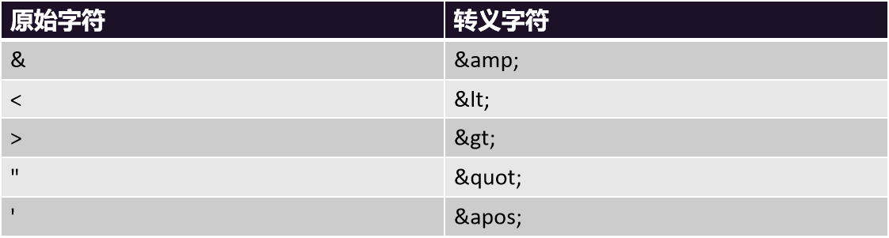

 

# MyBatis 扩展

## 缓存机制

> **MyBatis 拥有二级缓存机制**：
> 
> **一级缓存默认开启**； 事务级别：当前事务共享
> 
> **二级缓存需要手动配置开启**：所有事务共享 
> 
> 缓存中有就不用查数据库；

> **开启二级缓存**的办法很简单。在mapper.xml中编写cache标签就行了;
> 
> 引入缓存后的查询顺序是：
> 
> >** 先查询二级缓存**，如果没有**再查询一级缓存**，如果**再没有就查询数据库**；

```xml
<?xml version="1.0" encoding="UTF-8" ?>
<!DOCTYPE mapper PUBLIC "-//mybatis.org//DTD Mapper 3.0//EN" "http://mybatis.org/dtd/mybatis-3-mapper.dtd" >
<mapper namespace="com.atguigu.mybatis.mapper.EmpMapper">


<!--   cache功能开启：所有的查询都会共享到二级缓存 -->
<!--    redis：缓存中间件 -->
    <cache/>
</mapper>
```

> **L1~LN：N级缓存**
> 
> 数字越小离我越近，查的越快。存储越小，造价越高。
> 
> 数字越大离我越远，查的越慢。存储越大，造价越低。

## 插件机制（了解）

> `MyBatis `底层使用** 拦截器**机制**提供插件**功能，方便用户在SQL执行前后进行拦截增强。
> 
> 拦截器：`Interceptor`
> 
> 拦截器可以拦截 **四大对象** 的执行
> 
> 1. `ParameterHandler`：处理SQL的参数对象
> 2. `ResultSetHandler`：处理SQL的返回结果集
> 3. `StatementHandler`：数据库的处理对象，用于执行SQL语句
> 4. `Executor`：MyBatis的执行器，用于执行增删改查操作

## PageHelper - 分页插件

> PageHelper 是可以用在 MyBatis 中的一个强大的分页插件
> 
> 分页插件就是利用MyBatis 插件机制，在底层编写了 分页Interceptor，每次SQL查询之前会自动拼装分页数据

**分页底层SQL**：select * from emp limit  0,10

分页重点：

- 前端 **第1页**： limit  0,10
- 前端** 第2页**： limit  10,10
- 前端 **第3页**： limit  20,10
- 前端 **第N页**：limit `startIndex`,`pageSize`
- `startIndex`：开始的索引
- `pageSize`：每页大小

**计算规则**： pageNum = 1，  pageSize = 10

`startIndex = (pageNum - 1)*pageSize`

### 引入依赖

```xml
<dependency>
    <groupId>com.github.pagehelper</groupId>
    <artifactId>pagehelper</artifactId>
    <version>6.1.0</version>
</dependency>
```

### 分页测试

```java
@Test
void test02(){
    //后端收到前端传来的页码

    //响应前端需要的数据：
    //1、总页码、总记录数
    //2、当前页码
    //3、本页数据
    PageHelper.startPage(3,5);
    // 紧跟着 startPage 之后 的方法就会执行的 SQL 分页查询
    List<Emp> all = empService.getAll();
    System.out.println("============");

    //以后给前端返回它
    PageInfo<Emp> info = new PageInfo<>(all);

    //当前第几页
    System.out.println("当前页码："+info.getPageNum());
    //总页码
    System.out.println("总页码："+info.getPages());
    //总记录
    System.out.println("总记录数："+info.getTotal());
    //有没有下一页
    System.out.println("有没有下一页："+info.isHasNextPage());
    //有没有上一页
    System.out.println("有没有上一页："+info.isHasPreviousPage());
    //本页数据
    System.out.println("本页数据："+info.getList());

}
```

## MyBatisX - 逆向插件

### 插件安装

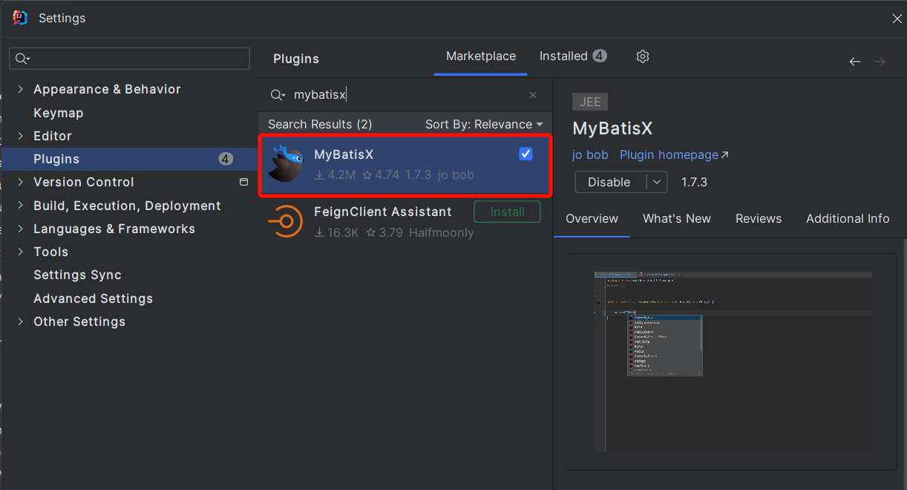

### 逆向生成

> 配置项目路径、包名、bean与表名映射规则：

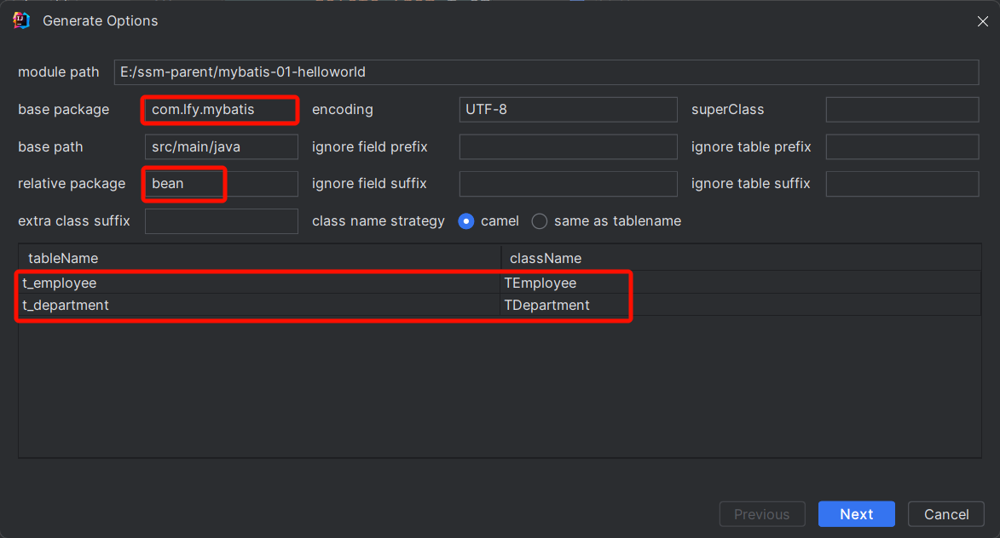

> 配置逆向生成的内容、规则、模版、路径位置等

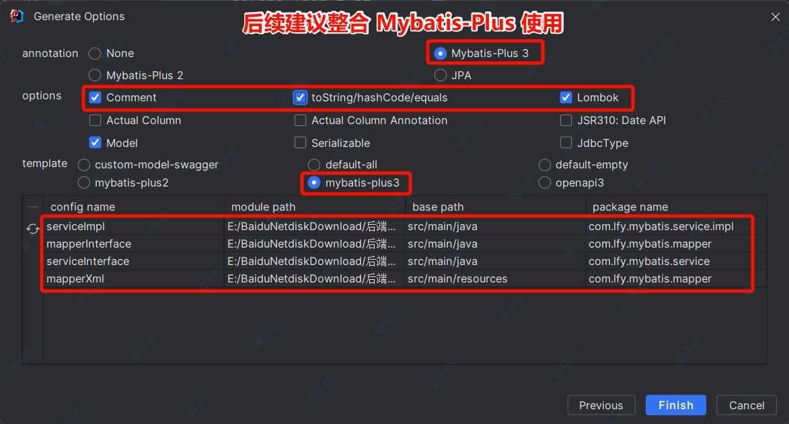