# 5. SpringBoot

> `SpringBoot `**允许我们用最简单的方式，快速整合所有技术栈；**
> 
> `SpringBoot`就像是我们以前SSM框架的框架。帮我们一键集成SSM等一系列框架的功能

# 快速入门

## 核心特性

SpringBoot 帮我们简单、快速地创建一个独立的、生产级别的 Spring 应用；

大多数 SpringBoot 应用只需要编写少量配置即可快速整合 Spring 平台以及第三方技术

特性：

1. 快速创建独立 Spring 应用
2. 直接嵌入Tomcat、Jetty or Undertow
3. 提供可选的 starter，简化应用整合
4. 按需自动配置 Spring 以及 第三方库 
5. 提供生产级特性：如 监控指标、健康检查、外部化配置等
6. 无代码生成、无xml； 都是基于自动配置技术

总结：

简化开发，简化配置，简化整合，简化部署，简化监控，简化运维

### 快速部署

> 1. pom.xml中引入打包插件

```xml
<build>
    <plugins>
        <plugin>
            <groupId>org.springframework.boot</groupId>
            <artifactId>spring-boot-maven-plugin</artifactId>
        </plugin>
    </plugins>
</build>
```

> 1. 项目打包

`mvn clean package`

> 1. 运行项目

`java -jar demo.jar`

### 场景启动器：starter

> `SpringBoot `使用 `场景启动器（starter）`封装当前场景对应的所有功能。我们只需要导入相关的场景启动器，整个项目就拥有相关的功能。

1. **默认支持的所有场景**：

https://docs.spring.io/spring-boot/docs/current/reference/html/using.html#using.build-systems.starters

1. **命名规范：**

**官方**提供的场景：命名为：`spring-boot-starter-*`**：如：spring-boot-starter-web**

**第三方**提供场景：命名为：`*-spring-boot-starter`**：如：mybatis-spring-boot-starter**

1. **官方starter参考列表**

### 依赖管理

1. 依赖管理机制

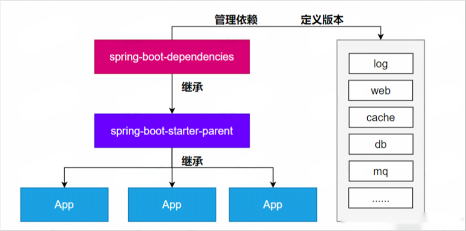

1. **思考**

- 为什么不用写版本号？ 
  - maven父子继承，父项目可以锁定版本
- 哪些需要写版本号？
  - 父不管的都需要写版本
- 如何修改默认版本号？
  - **就近原则**：引入依赖时使用 version 精确声明版本；
- 子覆盖父的属性设置：`mysql.version`

## 自动配置（重点）

> `SpringBoot`之所以让我们整个开发过程变的这么简单，不用配置以前的所有东西。得益于SpringBoot的自动配置机制。**只需要导入一个场景starter，对应的功能全部配置好**。按照约定大于配置，**很多参数配置项都有默认值**。即使我们想修改默认值，只需要在配置文件中简单修改即可

### 初步理解

1. **自动配置：**
  1. 导入场景，容器中就会自动配置好这个场景的核心组件。如 Tomcat、SpringMVC、DataSource 等
  2. 不喜欢的组件可以自行配置进行替换（使用排除依赖的方式）
2. **默认的包扫描规则**：SpringBoot只会扫描主程序所在的包及其下面的子包
3. **配置默认值**：
  1. 配置文件的所有配置项 是和 某个类的对象值进行一一绑定的。
  2. 很多配置即使不写都有默认值，如：端口号，字符编码等
4. **默认能写的所有配置项**：https://docs.spring.io/spring-boot/appendix/application-properties/index.html
5. **按需加载自动配置**：
  1. 导入的场景会导入全量自动配置包，但并不是都生效

### 完整流程

**核心流程总结：**

1. 导入 `starter`，就会导入`autoconfigure `包。
2. `autoconfigure `包里面 有一个文件 `META-INF/spring/org.springframework.boot.autoconfigure.AutoConfiguration.imports`,里面指定的所有启动要加载的自动配置类
3. `@EnableAutoConfiguration` 会自动的把上面文件里面写的所有自动配置类都导入进来。`xxxAutoConfiguration `是有条件注解进行按需加载
4. `xxxAutoConfiguration`给容器中导入一堆组件，组件都是从 `xxxProperties`中提取属性值
5. `xxxProperties `又是和**配置文件**进行了绑定

**效果**：`导入starter、修改配置文件，就能修改底层行为。`

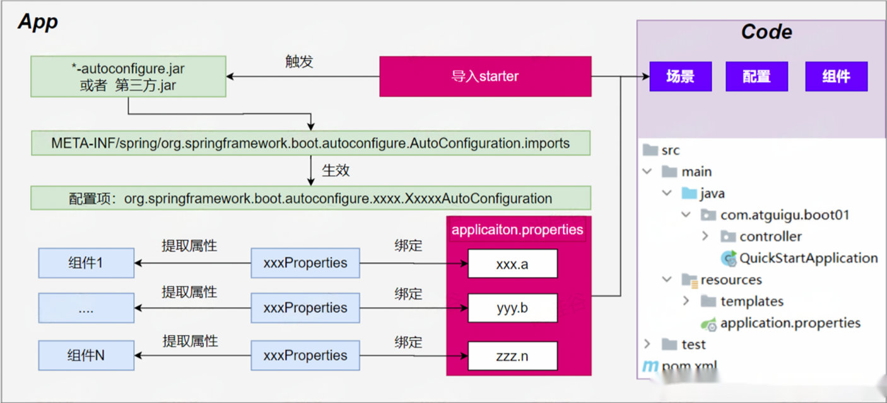

# 基础功能

## 属性绑定

**将容器中任意组件的属性值和配置文件的配置项的值进行绑定**

1. 给容器中注册组件（**@Component**、**@Bean**）
2. 使用 **@ConfigurationProperties** 声明组件和配置文件的哪些配置项进行绑定

```typescript
@ConfigurationProperties(prefix = "dog")
@Data
public class DogProperties {

    private String name;
    private Integer age;
    private String gender;
}
```

> application.properties 配置如下

```java
dog.name=小花
dog.age=3
```

## YAML文件

### 介绍

**痛点**：SpringBoot 集中化管理配置，`application.properties`

**问题**：配置多以后难阅读和修改，层级结构辨识度不高

**YAML**: **YAML Ain't Markup Language™**

- 设计目标，就是方便人类读写
- 层次分明，更适合做配置文件
- 使用.yaml或 .yml作为文件后缀

### 基本语法

1. 大小写敏感
2. 键值对写法 k: v，使用空格分割k,v
3. 使用缩进表示层级关系
  1. 缩进时不允许使用Tab键，只允许使用空格。换行
  2. 缩进的空格数目不重要，只要相同层级的元素左侧对齐即可
4. `#`表示注释，从这个字符一直到行尾，都会被解析器忽略。

**Value支持的写法**

1. **对象**：键值对的集合，如：映射（map）/ 哈希（hash） / 字典（dictionary）
2. **数组**：一组按次序排列的值，如：序列（sequence） / 列表（list）
3. **字面量**：单个的、不可再分的值，如：字符串、数字、bool、日期

### 案例

> 1. JavaBean 定义如下

```typescript
@Component
@ConfigurationProperties(prefix = "person")
@Data
public class Person {
    private String name;
    private Integer age;
    private Date birthDay;
    private Boolean like;
    private Child child;
    private List<Dog> dogs;
    private Map<String, Cat> cats;
}

@Data
class Dog {
    private String name;
    private Integer age;
}

@Data
class Child {
    private String name;
    private Integer age;
    private Date birthDay;
    private List<String> text;
}

@Data
class Cat {
    private String name;
    private Integer age;
}
```

> 1. 对应的 `application.properties` 写法为

```java
person.name=张三
person.age=18
person.birthDay=2010/10/12 12:12:12
person.like=true
person.child.name=李四
person.child.age=12
person.child.birthDay=2018/10/12
person.child.text[0]=abc
person.child.text[1]=def
person.dogs[0].name=小黑
person.dogs[0].age=3
person.dogs[1].name=小白
person.dogs[1].age=2
person.cats.c1.name=小蓝
person.cats.c1.age=3
person.cats.c2.name=小灰
person.cats.c2.age=2

```

> 1. 对应的 yaml 写法为

```yaml
# 如果yaml和properties 同时出现相同配置，则properties的优先级更高
person:
  name: 张三
  age: 20
  birth-day: 2019/03/04 12:00:00
  like: true
  child:
    name: 李四
    age: 18
    birth-day: 2019/03/04 12:00:00
    text: ["haa", "bbb", "ccc"]
  dogs:
    - name: 旺财
      age: 1
    - name: 旺财2
      age: 2
    - {name: 旺财3, age: 3}
  cats:
    bluecat:
      name: 蓝猫
      age: 1
    redcat:
      name: 红猫
      age: 2
    blackcat: {name: 黑猫, age: 3}
```

## SpringApplication

> `SpringApplication`是SpringBoot启动项目的入口类；`也可以用来定义boot应用的一些启动规则`。比如banner、主程序位置等

**自定义 **`banner`**：项目启动的时候可以有banner**

1. 类路径添加banner.txt或设置spring.banner.location就可以定制 banner
2. https://www.bootschool.net/ascii

**自定义 **`SpringApplication`

1. `new SpringApplication`
2. `new SpringApplicationBuilder`

## 日志系统

### 简介

> 编写方法的时候，我们习惯于给一些重要的位置，在控制台打印输出信息。这种就是日志；

**规范**：项目开发不要写**System.out.println()**，用**日志记录信息**

`SpringBoot `默认使用 `slf4j + logback`


### 日志格式

> 这是SpringBoot应用打印的日志的默认格式。

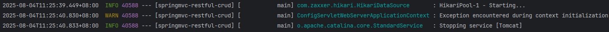

**默认输出格式**：

- `时间和日期`：毫秒级精度
- `日志级别`：ERROR, WARN, INFO, DEBUG, or TRACE.
- `进程 ID`
- `---`： 消息分割符
- `线程名`： 使用[]包含
- `Logger 名`： 通常是产生日志的类名
- `消息`： 日志记录的内容

### 日志级别

> 日志级别是标记**日志信息严重性**的标签，**按问题紧急性分级**，用于**快速筛选**和**定位系统问题**。

**注意： logback 没有FATAL级别，对应的是ERROR；SpringBoot定义了如下级别**

```java
public enum LogLevel {
    TRACE(Log::trace),
    DEBUG(Log::debug),
    INFO(Log::info),
    WARN(Log::warn),
    ERROR(Log::error),
    FATAL(Log::fatal),
    OFF(null);
 }
```

**日志级别由低到高**：`ALL,TRACE, DEBUG, INFO, WARN, ERROR,FATAL,OFF`；

**只会打印指定级别及以上级别的日志**

1. `ALL`：打印所有日志
2. `TRACE`：追踪框架详细流程日志，一般不使用
3. `DEBUG`：开发调试细节日志
4. `INFO`：关键、感兴趣信息日志
5. `WARN`：警告但不是错误的信息日志，比如：版本过时
6. `ERROR`：业务错误日志，比如出现各种异常
7. `FATAL`：致命错误日志，比如jvm系统崩溃
8. `OFF`：关闭所有日志记录

不指定级别的所有类，都使用 **root 指定的级别作为默认级别**

SpringBoot日志默认级别是 **INFO；SpringBoot 中通过如下配置修改类/包的日志级别**

```yaml
logging:
  level:
    com.example.mypackage: DEBUG
    root: WARN
```

### 日志分组

> 多个类或者包指定为一组，统一设置他们的日志规则。比如：sql组、web组

```properties
logging.group.tomcat=org.apache.catalina,org.apache.coyote,org.apache.tomcat
logging.level.tomcat=trace
```

**SpringBoot 预定义两个组**

> 如下场景

```properties
# 设置日志组
logging.group.biz=com.lfy.service,com.lfy.dao

# 整组批量设置日志级别； biz组（业务组）统一设置为 debug 级别
logging.level.biz=debug
```

### 文件输出

`SpringBoot`**默认只把日志写在控制台**，如果想额外记录到文件，可以在`application.properties`中添加 `logging.file.name` 或 `logging.file.path` 配置项。

- `logging.file.name`**：指定日志文件名字**
- `logging.file.path`**：指定日志文件位置，默认用 spring.log 作为文件名字**

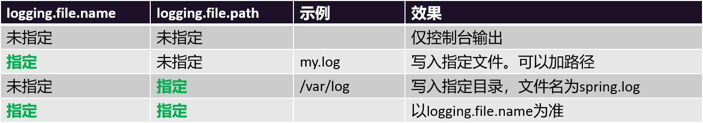

> 如下配置，生成 boot.log 文件。默认放在当前项目所在的文件夹根目录下

```properties
# 当前项目所在的根文件夹下生成一个 指定名字的 日志文件

# 两个都配置以文件名为准
logging.file.name=boot.log
```

### 归档与滚动切割

**归档**：每天的日志单独存到一个文档中。

**切割**：每个文件10MB，超过大小切割成另外一个文件。

**默认滚动切割与归档规则如下**：

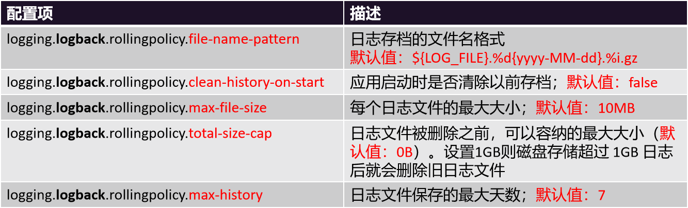

### 自定义配置

> 在没有SpringBoot之前，每个日志框架都有自己的配置文件。比如：`logback.xml`、`log4j.xml` 等。
> 
> 如果不使用SpringBoot整合的默认日志配置，想要完全自定义日志配置，SpringBoot也为这种需求提供了简单的方式：**直接把之前日志框架的配置文件放在项目的类路径根路径下即可；但是文件名要求如下**：

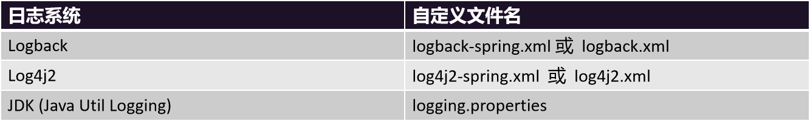

### 切换日志组合

> 排除默认的 `spring-boot-starter-logging`；引入新的 `spring-boot-starter-log4j2` 等

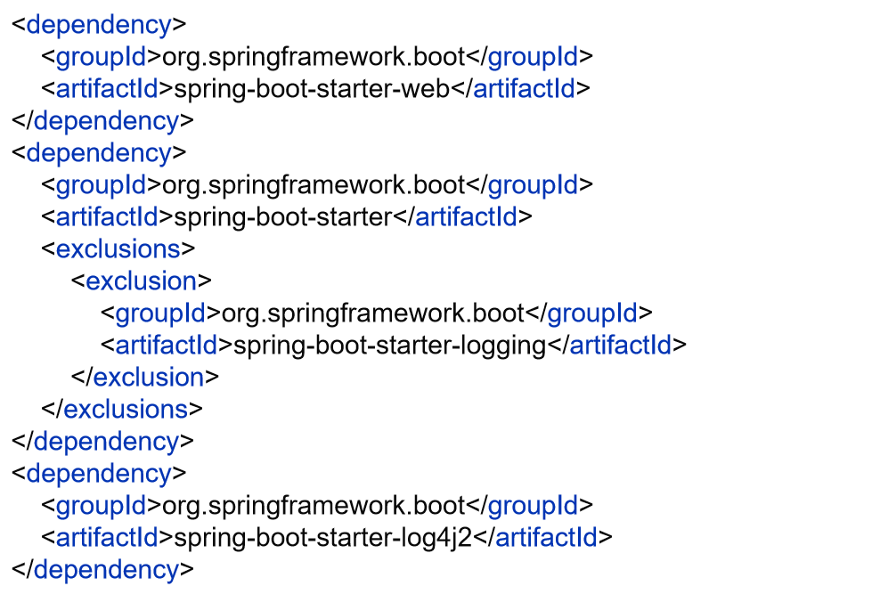

### 最佳实践

1. 导入任何第三方框架，先排除它的日志包，因为Boot底层控制好了日志
2. 修改 `application.properties` 配置文件，就可以调整日志的所有行为。如果不够，可以编写日志框架自己的配置文件放在类路径下就行，比如`logback-spring.xml`，`log4j2.xml`
3. 如需对接专业日志系统，也只需要把 logback 记录的日志灌倒 kafka之类的中间件，这和SpringBoot没关系，都是日志框架自己的配置，修改配置文件即可
4. 业务中使用slf4j-api记录日志。**不要再 sout 了**

# 进阶使用

## Profiles环境隔离（掌握）

### 基础用法

> **环境隔离能力：****快速切换****开发**、**测试**、**生产环境**

**步骤：**

1. **标识环境**：指定哪些组件、配置在哪个环境生效；
  1. `@Profile` 标记组件生效环境
2. **切换环境**：这个环境对应的所有组件和配置就应该生效
  - 激活环境：
    - **配置文件**：`spring.profiles.active=production,hsqldb`
    - **命令行**：`java -jar demo.jar --spring.profiles.active=dev,hsqldb`
  - 环境包含：
    - `spring.profiles.include[0]=common`
    - `spring.profiles.include[1]=local`
  - `生效的配置`` = ``默认环境配置`` + ``激活的环境``  + ``包含的环境配置`

**项目里面这么用**

1. 基础的配置mybatis、log、xxx：**写到包含环境中**
2. 需要动态切换变化的 db、redis：**写到激活的环境中**

> 比如某个组件：

```java
@Profile("dev") //基于环境标识进行判断，如果当前处于什么环境就配置什么组件、或者开启什么配置
//@Profile("prod")
@Component
@ConfigurationProperties(prefix = "person")
@Data
public class Person {
    private String name;
    private Integer age;
    private Date birthDay;
    private Boolean like;
    private Child child;
    private List<Dog> dogs;
    private Map<String, Cat> cats;
}
```

> 配置文件

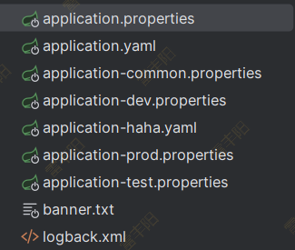

> 分组与激活这一组的配置：这样 `application-标识.properties/yaml` 对应的配置就生效了

```properties
spring.profiles.group.hahaha[0]=dev
spring.profiles.group.hahaha[1]=haha
spring.profiles.group.hahaha[2]=common

spring.profiles.active=hahaha
```

### 分组

**创建 prod 组，指定包含 db 和 mq 配置**

- `spring.profiles.group.prod[0]=db`
- `spring.profiles.group.prod[1]=mq`

使用` --spring.profiles.active=prod` ，激活`prod`，`db`，`mq`配置文件

### 配置文件

`application-``{profile}``.properties`` `可以作为指定环境的配置文件

激活这个环境，配置就会生效。最终生效的所有配置是

1. **application.properties**：主配置文件，任意时候都生效
2. **application-{profile}.properties**：指定环境配置文件，激活指定环境生效

**profile优先级 > application**

## 外部化配置

> 为了使线上应用修改配置方便：SpringBoot定制了外部化配置规则；
> 
> 1. 只需要在项目所在位置的目录，放一个application.properties/yaml配置文件，就能覆盖程序内部的配置
> 2. 外部配置优先于内部配置
> 3. 可以有非常多的外部位置，优先级如下图：总体来说，越外部的配置越生效

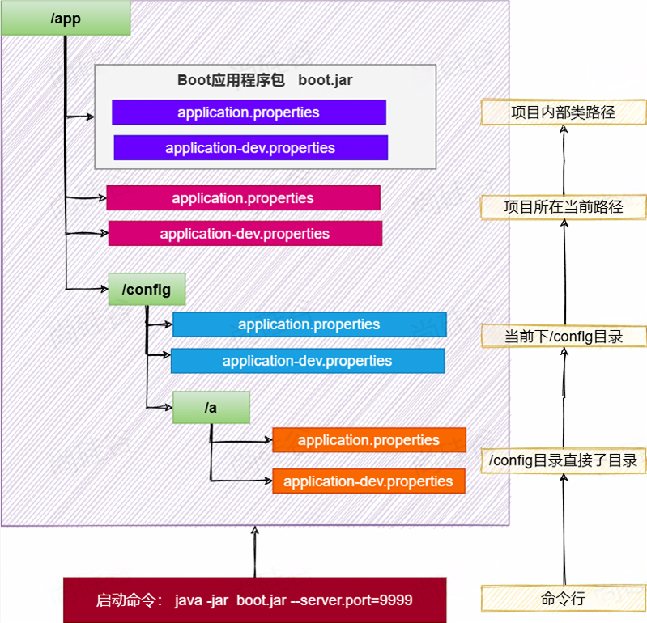

> 注意：如果内部的激活配置文件和外部的普通配置文件同时存在同样的配置，那么内部的激活优先级大于外部配置；总体规则为

`激活优先`` > ``外部优先 > 默认`

## 单元测试进阶

### 测试注解

```properties
@Test :表示方法是测试方法。
@ParameterizedTest :表示方法是参数化测试，下方会有详细介绍
@RepeatedTest :表示方法可重复执行，下方会有详细介绍
@DisplayName :为测试类或者测试方法设置展示名称
@BeforeEach :表示在每个单元测试之前执行
@AfterEach :表示在每个单元测试之后执行
@BeforeAll :表示在所有单元测试之前执行
@AfterAll :表示在所有单元测试之后执行
@Tag :表示单元测试类别，类似于JUnit4中的@Categories
@Disabled :表示测试类或测试方法不执行，类似于JUnit4中的@Ignore
@Timeout :表示测试方法运行如果超过了指定时间将会返回错误
@ExtendWith :为测试类或测试方法提供扩展类引用
```

### 断言机制

> 通过断言机制；断定某个方法运行后会怎么样，从而让maven等收集到单元测试的成功与失败信息

## 可观测性

### 介绍

**可观测性（Observability）：**指应用的运行数据，可以被线上进行观测、监控、预警等

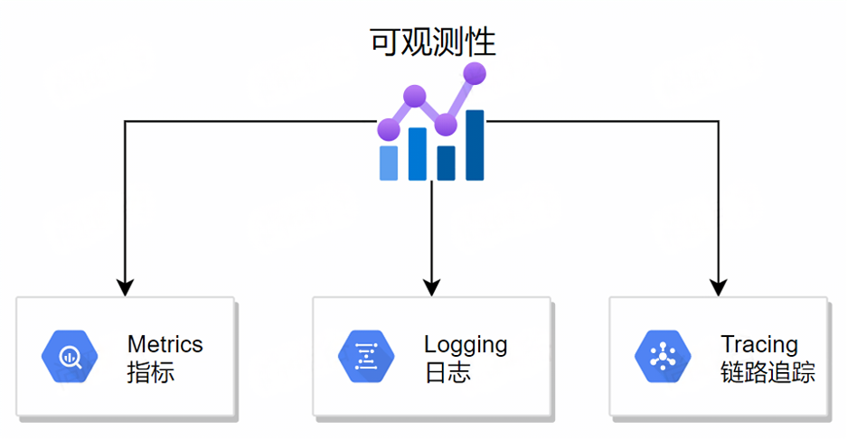

### 整合

SpringBoot 提供了 actuator 模块，可以快速暴露应用的所有指标

1. 导入： `spring-boot-starter-actuator`
2. 访问 http://localhost:8080/actuator；
3. 配置展示出所有可以用的监控端点


### endpoint：端点

# 核心原理

## 生命周期监听（了解）

### 基本用法

使用 `SpringApplicationRunListener `监听如下生命周期；需要在`META-INF/spring.factories`中配置

```properties
org.springframework.boot.SpringApplicationRunListener=com.lfy.boot.listener.MyListener

#org.springframework.boot.ApplicationListener=xxxx
```

```typescript
/**
 * 监听到SpringBoot启动的全生命周期
 */
@Slf4j
public class MyListener implements SpringApplicationRunListener {

    @Override
    public void starting(ConfigurableBootstrapContext bootstrapContext) {
        System.out.println("MyListener...starting...");
    }

    @Override
    public void started(ConfigurableApplicationContext context, Duration timeTaken) {
        log.info("MyListener...started...");
    }

    @Override
    public void ready(ConfigurableApplicationContext context, Duration timeTaken) {
        log.info("MyListener...ready...");
    }

    @Override
    public void failed(ConfigurableApplicationContext context, Throwable exception) {
        log.info("MyListener...failed...");
    }

    @Override
    public void environmentPrepared(ConfigurableBootstrapContext bootstrapContext, ConfigurableEnvironment environment) {
        log.info("MyListener...environmentPrepared...");
    }

    @Override
    public void contextLoaded(ConfigurableApplicationContext context) {
        log.info("MyListener...contextLoaded...");
    }

    @Override
    public void contextPrepared(ConfigurableApplicationContext context) {
        log.info("MyListener...contextPrepared...");
    }
}
```

### 生命周期流程

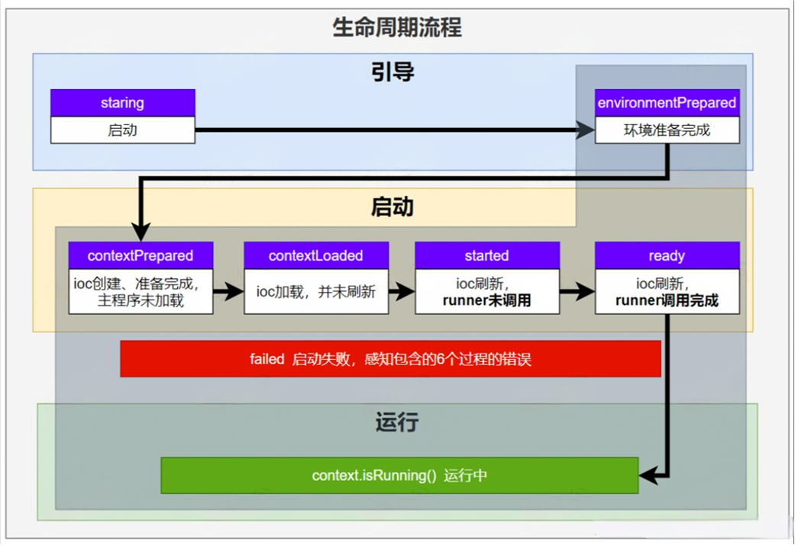

### 不同监听器能力&配置

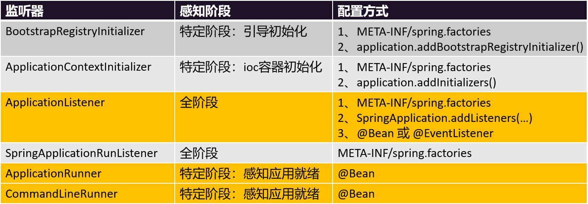

> 最佳实践：
> 
> 1. 应用启动后做事：ApplicationRunner、CommandLineRunner
> 2. 事件驱动开发：ApplicationListener

## 生命周期事件（了解）

> 每个事件发生的时机如下

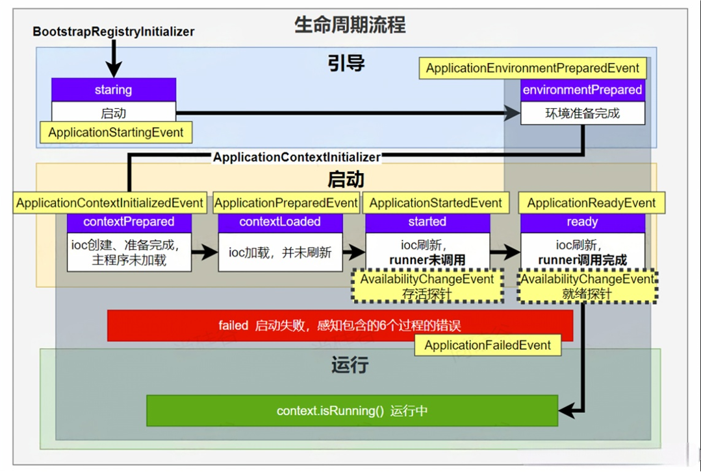

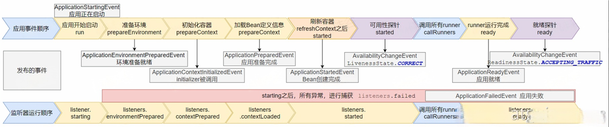

## 事件驱动开发（了解）

> 通过感知系统中发生的各个事件，来架构系统内部的业务流程

### 基本用法

**应用启动过程生命周期事件感知（9大事件）**

**应用运行中事件感知（无数种）**

**事件驱动开发步骤：**

1. 定义事件：
  1. **任意事件**：任意类可以作为事件类，建议命名 `xxxEvent`
  2. **系统事件**：继承 `ApplicationEvent`
2. 事件发布：
  1. 组件实现 `ApplicationEventPublisherAware`
  2. 自动注入 `ApplicationEventPublisher`
3. 事件监听：
  1. 组件 + 方法标注 `@EventListener`

### 案例

> **登录成功后**，感知到登录事件；账户服务/优惠服务 执行对应的代码

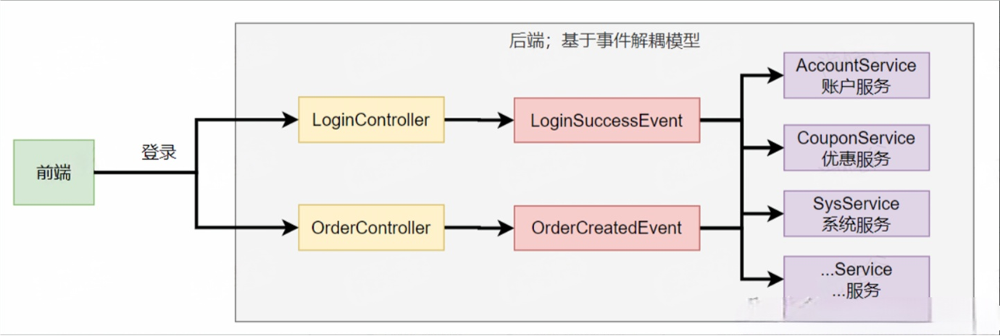

```java
@Data //定义一个事件
public class UserLoginSuccessEvent {

    private String username;

    public UserLoginSuccessEvent(String username) {
        this.username = username;
    }
}
```

> 定义登录控制器

```java
@Slf4j
@RestController
public class UserController {


    @Autowired
    CouponService couponService;

    @Autowired
    UserPointsService userPointsService;

    @Autowired
    ApplicationEventPublisher publisher;


    //同步阻塞式；

    //事件/消息驱动；


    @GetMapping("/login")
    public String login(String username, String password){
        //执行登录
        log.info("用户[{}]登录系统", username);
        //以前的方式：挨个调用；耦合太大
        //1、加积分
//        userPointsService.givePoints(username);
        //2、发优惠劵
//        couponService.giveCoupon(username);
        //做事；同步调用
        UserLoginSuccessEvent event = new UserLoginSuccessEvent(username);
        //现在的方式：发送事件
        publisher.publishEvent(event);

        return "登录成功";
    }
}
```

> Service感知事件并执行

```java
// 本地消息（事件）模式;
// 分布式消息（事件）模式;
@Slf4j
@Service // 优惠券服务
public class CouponService {


    @Async
    @EventListener(UserLoginSuccessEvent.class)
    public void listen(UserLoginSuccessEvent event){
        log.info("优惠券服务 = 监听到：UserLoginSuccessEvent 事件");
        String username = event.getUsername();
        //调用业务
        giveCoupon(username);
    }

    public void giveCoupon(String username) {
        log.info("发放给用户【{}】一张优惠券",username);
    }
}
```

```typescript
@Slf4j
@Service //用户积分服务
public class UserPointsService {


    @Async //异步
    @EventListener(UserLoginSuccessEvent.class)
    public void listen(UserLoginSuccessEvent event){
        log.info("用户积分服务 == 监听到 UserLoginSuccessEvent 事件");
        givePoints(event.getUsername());
    }

    public void givePoints(String username) {
        log.info("用户【{}】获得积分", username);
    }
}
```

## 自动配置原理（熟悉）

### 自动配置原理图

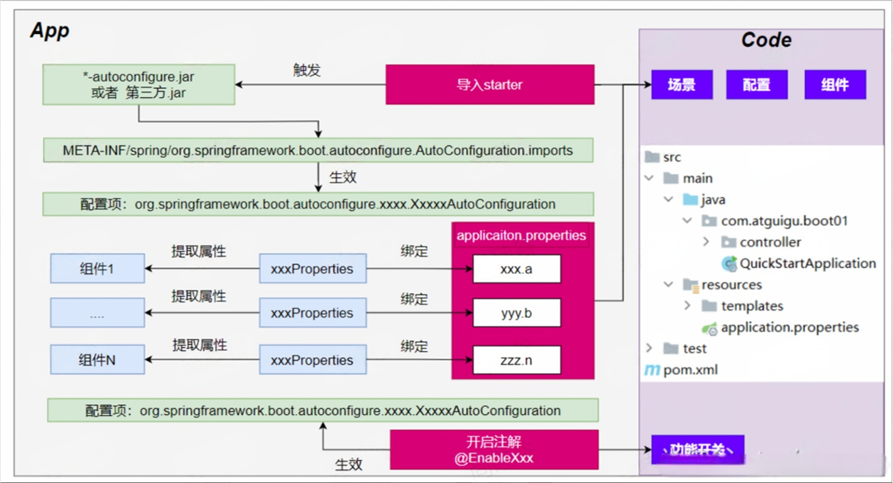

### SpringBoot完整启动流程

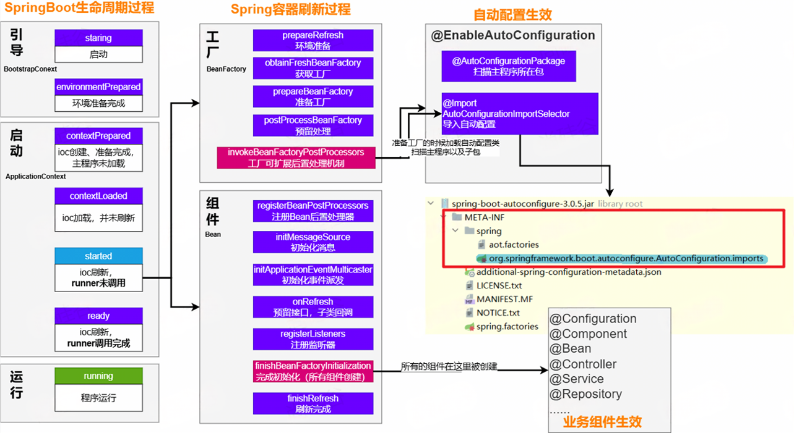

# 自定义starter

## 场景设计

> **场景：**抽取聊天机器人场景，它可以打招呼。
> 
> **效果：**任何项目导入此`starter`都具有打招呼功能，并且问候语中的人名需要可以在配置文件中修改

## 基础抽取

### 创建项目

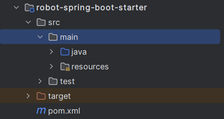

> 创建`自定义starter`项目，引入`spring-boot-starter` 基础依赖

```xml
<?xml version="1.0" encoding="UTF-8"?>
<project xmlns="http://maven.apache.org/POM/4.0.0" xmlns:xsi="http://www.w3.org/2001/XMLSchema-instance"
         xsi:schemaLocation="http://maven.apache.org/POM/4.0.0 https://maven.apache.org/xsd/maven-4.0.0.xsd">
    <modelVersion>4.0.0</modelVersion>
    <parent>
        <groupId>org.springframework.boot</groupId>
        <artifactId>spring-boot-starter-parent</artifactId>
        <version>3.3.3</version>
        <relativePath/> <!-- lookup parent from repository -->
    </parent>
    <groupId>com.atguigu</groupId>
    <artifactId>robot-spring-boot-starter</artifactId>
    <version>0.0.1-SNAPSHOT</version>
    <name>robot-spring-boot-starter</name>
    <description>robot-spring-boot-starter</description>
    <url/>
    <licenses>
        <license/>
    </licenses>
    <developers>
        <developer/>
    </developers>
    <scm>
        <connection/>
        <developerConnection/>
        <tag/>
        <url/>
    </scm>
    <properties>
        <java.version>17</java.version>
    </properties>
    <dependencies>

<!--
自定义starter
1、所有starter都需要依赖这个基础starter；spring-boot-starter
2、把所有要抽取的业务组件都抽取到这个starter中；
 -->
        <dependency>
            <groupId>org.springframework.boot</groupId>
            <artifactId>spring-boot-starter</artifactId>
        </dependency>

        <dependency>
            <groupId>org.springframework.boot</groupId>
            <artifactId>spring-boot-starter-web</artifactId>
        </dependency>

        <dependency>
            <groupId>org.projectlombok</groupId>
            <artifactId>lombok</artifactId>
            <optional>true</optional>
        </dependency>
        <dependency>
            <groupId>org.springframework.boot</groupId>
            <artifactId>spring-boot-starter-test</artifactId>
            <scope>test</scope>
        </dependency>
    </dependencies>

    <build>
        <plugins>
            <plugin>
                <groupId>org.springframework.boot</groupId>
                <artifactId>spring-boot-maven-plugin</artifactId>
                <configuration>
                    <excludes>
                        <exclude>
                            <groupId>org.projectlombok</groupId>
                            <artifactId>lombok</artifactId>
                        </exclude>
                    </excludes>
                </configuration>
            </plugin>
        </plugins>
    </build>

</project>
```

### 编写功能

> 编写模块功能，引入模块所有需要的依赖。

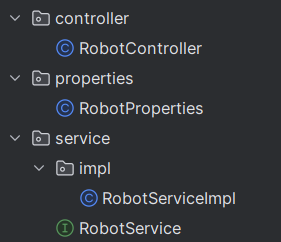

```java
@RestController
public class RobotController {


    @Autowired
    RobotService robotService;

    @GetMapping("/robot/hello")
    public String sayHello(){
        String msg = robotService.sayHello();
        return msg;
    }
}
```

```typescript
@Component
@ConfigurationProperties(prefix = "robot")
@Data
public class RobotProperties {

    private String name;
    private String model;
}
```

```typescript
@Component
@ConfigurationProperties(prefix = "robot")
@Data
public class RobotProperties {

    private String name;
    private String model;
}
```

```typescript
@Service
public class RobotServiceImpl implements RobotService {


    @Autowired
    RobotProperties robotProperties;

    @Override
    public String sayHello() {
        return "我是机器人【"+robotProperties.getName()+"】，使用底层大模型：【"+robotProperties.getModel()+"】；我们开始聊天吧";
    }
}
```

```java
public interface RobotService {

    String sayHello();
}
```

### 自动配置类

> 编写`xxxAutoConfiguration`自动配置类，帮其他项目导入这个模块需要的所有组件

```typescript
@EnableConfigurationProperties(RobotProperties.class)
@Configuration //把这个场景要用的所有组件导入到容器中
public class RobotAutoConfiguration {

    @Bean
    public RobotController robotController() {
        return new RobotController();
    }

    @Bean
    public RobotService  robotService() {
        return new RobotServiceImpl();
    }

}
```

## @EnableXx机制

> 抽取一个注解。别的项目导入依赖后，直接标注这个注解；就能让功能生效；
> 
> 基本原理就是：这个注解会导入我们的自动配置类，自动配置类又会导入所有组件

```java
@Target(ElementType.TYPE)
@Retention(RetentionPolicy.RUNTIME)
@Documented
@Import(RobotAutoConfiguration.class)
public @interface EnableRobot {


}
```

> 测试：
> 
> 1. 别人导入 starter 依赖
> 2. 编写 @EnableRobot  注解
> 3. 配置文件配置机器人信息
> 4. 测试：机器人打招呼自动生效

## 完全自动配置

1. 依赖 SpringBoot 的 SPI 机制
2. `META-INF/spring/org.springframework.boot.autoconfigure.AutoConfiguration.imports` 文件中编写好我们自动配置类的全类名即可
3. 项目启动，自动加载我们的自动配置类

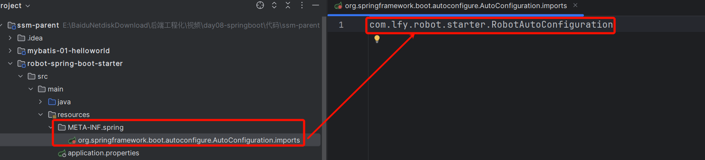