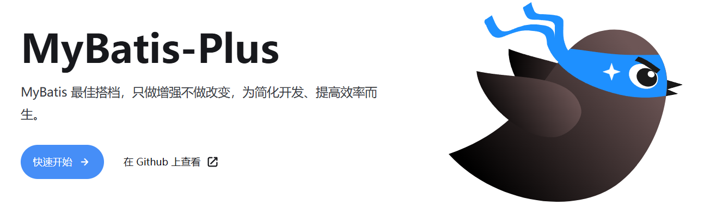
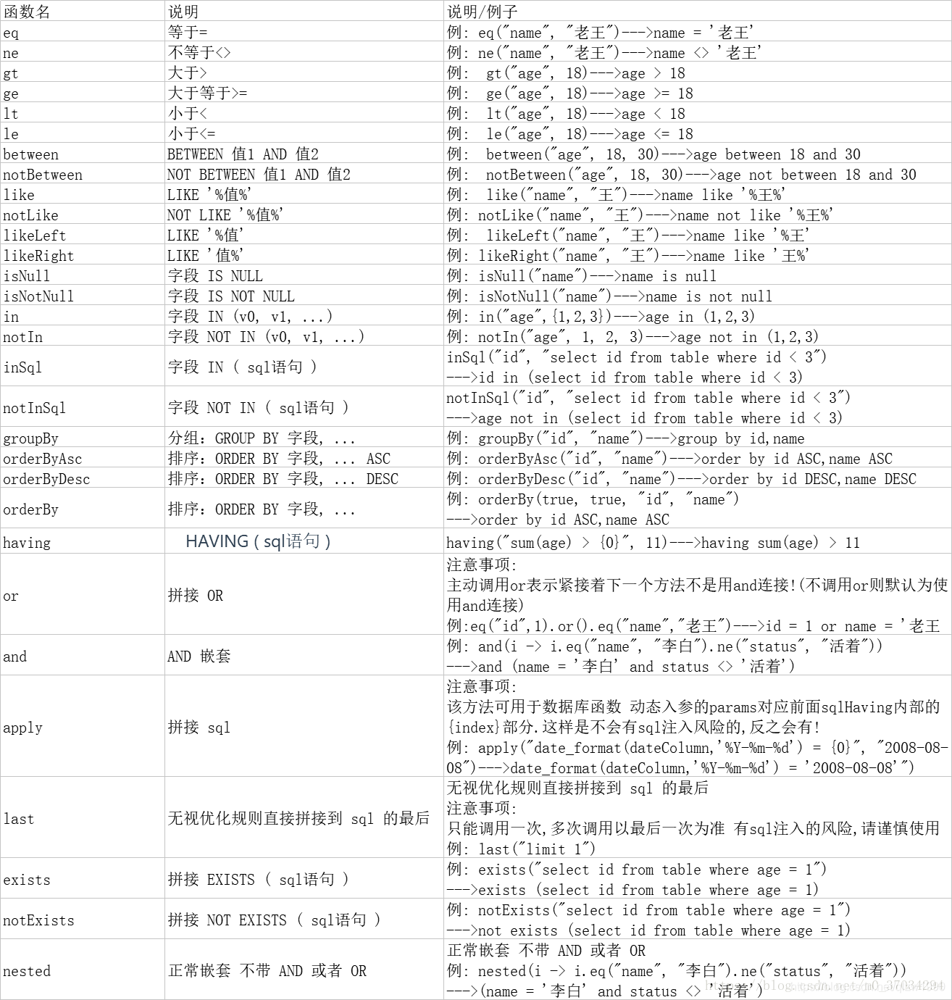

# 6. MyBatis-Plus

官网：https://baomidou.com/



> **MyBatis痛点**：
> 
> 1. **但凡有一个方法**，都必须写一个SQL；来回修改mapper接口和xml
> 2. 有很多公共的东西**都没有抽取**（按照id查询，按照id删除，按照id更新）
> 3. 整个环境搭建，逆向工程**不太强大**。
> 
> MyBatis-Plus**实现一个效果**：
> 
> 1. 只要有实体类，实体类对应的Mapper，自动拥有通用版的CRUD全部方法，**单表查询**，都可以不用写SQL。
> 
> 联表查询才需要写xml中的SQL；
> 
> 能不写SQL就不写，系统已经提供默认强大的方法支持

# 快速入门

## 环境准备

1. 创建好 SpringBoot + MyBatis 原生项目
2. 准备好一个数据库，及测试数据表；如 user 表

```sql
DROP TABLE IF EXISTS `user`;

CREATE TABLE `user`
(
    id BIGINT NOT NULL COMMENT '主键ID',
    name VARCHAR(30) NULL DEFAULT NULL COMMENT '姓名',
    age INT NULL DEFAULT NULL COMMENT '年龄',
    email VARCHAR(50) NULL DEFAULT NULL COMMENT '邮箱',
    PRIMARY KEY (id)
);
INSERT INTO `user` (id, name, age, email) VALUES
(1, 'Jone', 18, 'test1@baomidou.com'),
(2, 'Jack', 20, 'test2@baomidou.com'),
(3, 'Tom', 28, 'test3@baomidou.com'),
(4, 'Sandy', 21, 'test4@baomidou.com'),
(5, 'Billie', 24, 'test5@baomidou.com');
```

1. 配置好数据库连接、mybatis扫描器：`@MapperScan("com.lfy.mp.mapper")`
2. 编写好 实体类

```typescript
@Data
@TableName("`user`")
public class User {
    private Long id;
    private String name;
    private Integer age;
    private String email;
}
```

```bash
docker run -d --name code-server -p 8888:8080 -v "/root/vscode/.config:/home/coder/.config"   -v "/app/vscode/project:/home/coder/project" -v "/app/vscode/config.yaml:/root/.config/code-server/config.yaml"  -u "$(id -u):$(id -g)"   -e "DOCKER_USER=$USER"   codercom/code-server:latest
```

## 引入依赖

```xml
<dependency>
    <groupId>com.baomidou</groupId>
    <artifactId>mybatis-plus-spring-boot3-starter</artifactId>
    <version>3.5.12</version>
</dependency>
```

# 进阶

## 编写Mapper接口

> **BaseMapper **是 Mybatis-Plus 提供的一个通用 Mapper 接口，它**封装**了一系列常用的数据库操作方法，包括**增、删、改、查**等。通过`继承 BaseMapper`，开发者可以快速地对数据库进行操作，而无需编写繁琐的 SQL 语句。

### insert

```java
// 插入一条记录
int insert(T entity);
```

### delete

```java
// 根据 entity 条件，删除记录
int delete(@Param(Constants.WRAPPER) Wrapper<T> wrapper);
// 删除（根据ID 批量删除）
int deleteBatchIds(@Param(Constants.COLLECTION) Collection<? extends Serializable> idList);
// 根据 ID 删除
int deleteById(Serializable id);
// 根据 columnMap 条件，删除记录
int deleteByMap(@Param(Constants.COLUMN_MAP) Map<String, Object> columnMap);
```

### update

```java
// 根据 whereWrapper 条件，更新记录
int update(@Param(Constants.ENTITY) T updateEntity, @Param(Constants.WRAPPER) Wrapper<T> whereWrapper);
// 根据 ID 修改
int updateById(@Param(Constants.ENTITY) T entity);
```

### select

```java
// 根据 ID 查询
T selectById(Serializable id);
// 根据 entity 条件，查询一条记录
T selectOne(@Param(Constants.WRAPPER) Wrapper<T> queryWrapper);

// 查询（根据ID 批量查询）
List<T> selectBatchIds(@Param(Constants.COLLECTION) Collection<? extends Serializable> idList);
// 根据 entity 条件，查询全部记录
List<T> selectList(@Param(Constants.WRAPPER) Wrapper<T> queryWrapper);
// 查询（根据 columnMap 条件）
List<T> selectByMap(@Param(Constants.COLUMN_MAP) Map<String, Object> columnMap);
// 根据 Wrapper 条件，查询全部记录
List<Map<String, Object>> selectMaps(@Param(Constants.WRAPPER) Wrapper<T> queryWrapper);
// 根据 Wrapper 条件，查询全部记录。注意： 只返回第一个字段的值
List<Object> selectObjs(@Param(Constants.WRAPPER) Wrapper<T> queryWrapper);

// 根据 entity 条件，查询全部记录（并翻页）
IPage<T> selectPage(IPage<T> page, @Param(Constants.WRAPPER) Wrapper<T> queryWrapper);
// 根据 Wrapper 条件，查询全部记录（并翻页）
IPage<Map<String, Object>> selectMapsPage(IPage<T> page, @Param(Constants.WRAPPER) Wrapper<T> queryWrapper);
// 根据 Wrapper 条件，查询总记录数
Integer selectCount(@Param(Constants.WRAPPER) Wrapper<T> queryWrapper);
```

## 编写Service接口

> `IService`` `是 MyBatis-Plus 提供的一个**通用 Service 层接口**，它封装了常见的 **CRUD** 操作，包括插入、删除、查询和分页等。通过继承 IService 接口，可以快速实现对数据库的基本操作，同时保持代码的简洁性和可维护性。

- 泛型 `T` 为任意实体对象
- 对象 `Wrapper` 为 [条件构造器](https://baomidou.com/guides/wrapper)
- 用法和 `BaseMapper `基本一样

https://baomidou.com/guides/data-interface/#service-interface

## Wrapper：条件构造器

> 用来封装查询条件。可以来做条件更新、删除、查询

`MyBatis-Plus` 提供了一套强大的`条件构造器（Wrapper）`，用于构建复杂的数据库查询条件。`Wrapper 类`允许开发者以链式调用的方式构造查询条件，无需编写繁琐的 SQL 语句，从而提高开发效率并减少 SQL 注入的风险。

在 MyBatis-Plus 中，Wrapper 类是构建查询和更新条件的核心工具。以下是主要的 Wrapper 类及其功能：

- `AbstractWrapper`：这是一个抽象基类，提供了所有 Wrapper 类共有的方法和属性。它定义了条件构造的基本逻辑，包括字段（column）、值（value）、操作符（condition）等。所有的 QueryWrapper、UpdateWrapper、LambdaQueryWrapper 和 LambdaUpdateWrapper 都继承自 AbstractWrapper。
- `QueryWrapper`：专门用于构造查询条件，支持基本的等于、不等于、大于、小于等各种常见操作。它允许你以链式调用的方式添加多个查询条件，并且可以组合使用 `and` 和 `or` 逻辑。
- `UpdateWrapper`：用于构造更新条件，可以在更新数据时指定条件。与 QueryWrapper 类似，它也支持链式调用和逻辑组合。使用 `UpdateWrapper `可以在不创建实体对象的情况下，`直接设置更新字段和条件`。
- `LambdaQueryWrapper`：这是一个基于 Lambda 表达式的查询条件构造器，它通过 Lambda 表达式来引用实体类的属性，**从而避免了硬编码字段名**。这种方式提高了代码的可读性和可维护性，尤其是在字段名可能发生变化的情况下。
- `LambdaUpdateWrapper`：类似于 LambdaQueryWrapper，LambdaUpdateWrapper 是基于 Lambda 表达式的更新条件构造器。它允许你使用 Lambda 表达式来指定更新字段和条件，同样**避免了硬编码字段名**的问题。



> **最佳实践**：
> 
> - 简单SQL使用QueryWrapper，复杂SQL(多表联查、复杂条件更新)去Mapper.xml中编写SQL

## Wrappers：工具类

```java
// 创建 QueryWrapper
QueryWrapper<User> queryWrapper = Wrappers.query();
queryWrapper.eq("name", "张三");

// 创建 LambdaQueryWrapper
LambdaQueryWrapper<User> lambdaQueryWrapper = Wrappers.lambdaQuery();
lambdaQueryWrapper.eq(User::getName, "张三");

// 创建 UpdateWrapper
UpdateWrapper<User> updateWrapper = Wrappers.update();
updateWrapper.set("name", "李四");

// 创建 LambdaUpdateWrapper
LambdaUpdateWrapper<User> lambdaUpdateWrapper = Wrappers.lambdaUpdate();
lambdaUpdateWrapper.set(User::getName, "李四");
```

# 插件

## 插件主体

```java
@Configuration
@MapperScan("scan.your.mapper.package")
public class MybatisPlusConfig {

    /**
     * 添加分页插件
     */
    @Bean
    public MybatisPlusInterceptor mybatisPlusInterceptor() {
        MybatisPlusInterceptor interceptor = new MybatisPlusInterceptor();
        
        return interceptor;
    }
}
```

## 分页插件

> 于 `v3.5.9` 起，`PaginationInnerInterceptor` 已分离出来。如需使用，则需单独引入 `mybatis-plus-jsqlparser` 依赖 ， 具体请查看 [安装](https://baomidou.com/getting-started/install) 一章。

```xml
<dependency>
    <groupId>com.baomidou</groupId>
    <artifactId>mybatis-plus-jsqlparser</artifactId>
</dependency>
```

```java
@Configuration
@MapperScan("scan.your.mapper.package")
public class MybatisPlusConfig {

    /**
     * 添加分页插件
     */
    @Bean
    public MybatisPlusInterceptor mybatisPlusInterceptor() {
        MybatisPlusInterceptor interceptor = new MybatisPlusInterceptor();
        interceptor.addInnerInterceptor(new PaginationInnerInterceptor(DbType.MYSQL)); // 如果配置多个插件, 切记分页最后添加
        // 如果有多数据源可以不配具体类型, 否则都建议配上具体的 DbType
        return interceptor;
    }
}
```

`PaginationInnerInterceptor` 提供了以下属性来定制分页行为：

| 属性名 | 类型 | 默认值 | 描述 |
| --- | --- | --- | --- |
| overflow | boolean | FALSE | 溢出总页数后是否进行处理 |
| maxLimit | Long |   | 单页分页条数限制 |
| dbType | DbType |   | 数据库类型 |
| dialect | IDialect |   | 方言实现类 |

# 逆向工程

> 安装Mybatisx插件，选择MyBatis-Plus模板可以创建出完整的逆向代码