# 7. 前端工程化

> 先完成一个大练习：RESTful CRUD 数据库版；要求
> 
> 1. **SpringBoot + MyBatis-Plus + MySQL8**
> 2. **Swagger 接口文档**
> 3. **数据校验**
> 4. **解决跨域**
> 5. **全局异常处理**

> Docker 一键安装数据库命令

```java
docker run -d -p 6666:3306 --restart=always -e MYSQL_ROOT_PASSWORD=123456 --name mysql8 bitnami/mysql:8.4-debian-12
```

> 默认你已经掌握：HTML、CSS、JS；才可以继续学习此课程

# 理解前端

## 前端工程化

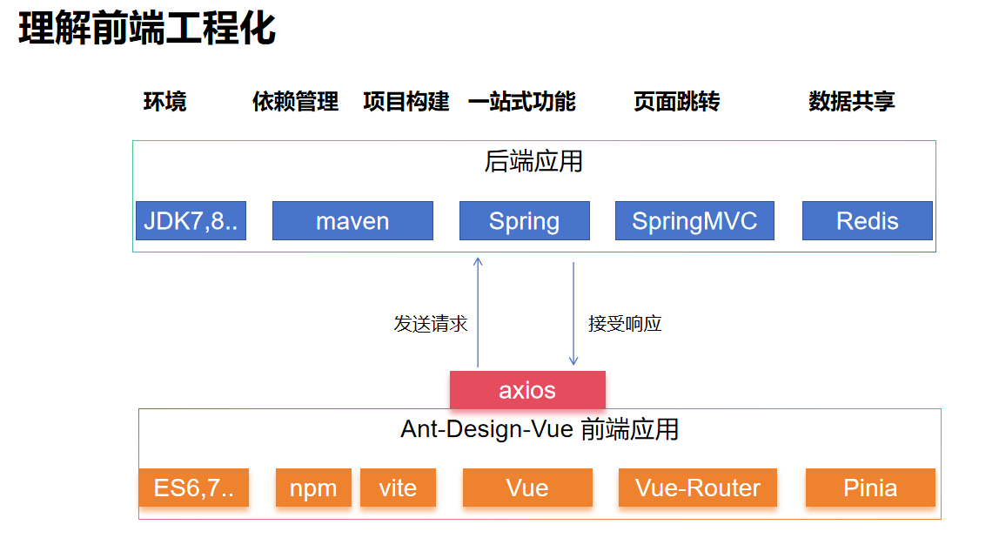

**前端技术选型**

> 哪怕只会这些框架里面提出的一些技术、概念、名次，就能精确的指挥AI


## 前后分离架构

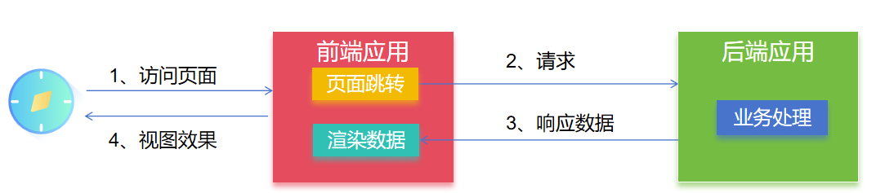

> AI永远只是替换最低层的；底层的数据搬运工（CRUD工程师）

# ES

> **ECMAScript（ES） 是****规范**、 **JavaScript **是 **ES **的实现 
> 
> **ES6** 的第⼀个版本 在** 2015** 年 6 ⽉发布，正式名称是《ECMAScript 2015 标准》（简称 ES2015） 
> 
> **ES6** 指是 5.1 版以后的 JavaScript 的下⼀代标准，涵盖了 **ES2015**、**ES2016**、**ES2017** 等等

## let 关键字

推荐使⽤** let 关键字**替代 **var 关键字**声明变量，因为 var 存在诸多问题，⽐如：

### 越域

```javascript
{ 
    var a = 1; 
    let b = 2; 
} 
console.log(a); // 1 
console.log(b); // ReferenceError: b is not defined
```

### 变量多次声明

```javascript
// var 可以声明多次 
// let 只能声明⼀次 
var m = 1 
var m = 2 
let n = 3 
// let n = 4 
console.log(m) // 2 
console.log(n) // Identifier 'n' has already been declared
```

### 变量提升

```javascript
// var 会变量提升 
// let 不存在变量提升 
console.log(x); // undefined 
var x = 10; 
console.log(y); //ReferenceError: y is not defined 
let y = 20;
```

## const 关键字

```javascript
// 1. 声明之后不允许改变 
// 2. ⼀但声明必须初始化，否则会报错 
const a = 1; 
a = 3; //Uncaught TypeError: Assignment to constant variable.
```

## 解构

### 数组解构

```javascript
let arr = [1, 2, 3]; 
//以前我们想获取其中的值，只能通过⻆标。ES6 可以这样： 
const [x, y, z] = arr;// x，y，z 将与 arr 中的每个位置对应来取值 
// 然后打印 
console.log(x, y, z);
```

### 对象解构

```javascript
const person = { 
    name: "jack", 
    age: 21, 
    language: ['java', 'js', 'css'] 
} 
// 解构表达式获取值，将 person ⾥⾯每⼀个属性和左边对应赋值 
const {name, age, language} = person; 
// 等价于下⾯ 
// const name = person.name; 
// const age = person.age; 
// const language = person.language; 
// 可以分别打印 
console.log(name); 
console.log(age); 
console.log(language); 
//扩展：如果想要将 name 的值赋值给其他变量，可以如下,nn 是新的变量名 
const {name: nn, age, language} = person; 
console.log(nn); 
console.log(age); 
console.log(language);
```

## 链判断

如果读取对象内部的某个属性，往往需要判断⼀下，属性的上层对象是否存在。 

⽐如，读取` message.body.user.firstName `这个属性，安全的写法是写成下⾯这样。

```javascript
let message = null; 
// 错误的写法 
const firstName = message.body.user.firstName || 'default'; 
// 正确的写法 
const firstName = (message 
&& message.body 
&& message.body.user 
&& message.body.user.firstName) || 'default'; 
console.log(firstName)
```

这样的层层判断⾮常麻烦，因此 ES2020 引⼊了“链判断运算符”（optional chaining operator）`?.`，简化上⾯的写法。

```javascript
const firstName = message?.body?.user?.firstName || 'default';
```

## 参数默认值

```javascript
//在 ES6 以前，我们⽆法给⼀个函数参数设置默认值，只能采⽤变通写法： 
function add(a, b) { 
 // 判断 b 是否为空，为空就给默认值 1 
 b = b || 1; 
 return a + b; 
} 
// 传⼀个参数 
console.log(add(10)); 
//现在可以这么写：直接给参数写上默认值，没传就会⾃动使⽤默认值 
function add2(a, b = 1) { 
 return a + b; 
} 
// 传⼀个参数 
console.log(add2(10));
```

## 箭头函数

```javascript
//以前声明⼀个⽅法 
// var print = function (obj) { 
// console.log(obj); 
// } 
// 可以简写为： 
let print = obj => console.log(obj); 
// 测试调⽤ 
print(100);
```

```javascript
// 两个参数的情况： 
let sum = function (a, b) { 
 return a + b; 
} 
// 简写为： 
//当只有⼀⾏语句，并且需要返回结果时，可以省略 {} , 结果会⾃动返回。 
let sum2 = (a, b) => a + b; 
//测试调⽤ 
console.log(sum2(10, 10));//20 
// 代码不⽌⼀⾏，可以⽤`{}`括起来 
let sum3 = (a, b) => { 
 c = a + b; 
 return c; 
}; 
//测试调⽤ 
console.log(sum3(10, 20));//30
```

## 模板字符串

```javascript
let info = "你好，我的名字是：【"+name+"】，年龄是：【"+age+"】，邮箱是：【】" 
console.log(info); 

//模板字符串的写法 
let info = `你好，我的名字是：${name}，年龄是：${person.age}，邮箱是：${person.email}` 
console.log(info);
```

## Promise

> 承诺；

代表 `异步对象`，类似Java中的 `CompletableFuture`

> 1. `fetch`是浏览器⽀持从远程获取数据的⼀个函数，这个函数返回的就是 `Promise`对象 
> 2. `Promise`是现代 JavaScript 中**异步编程的基础**，是⼀个由异步函数返回的可以向我们指示当前操作所处的状态的对象。在 `Promise`返回给调⽤者的时候，操作往往还没有完成，但 `Promise`对象可以让我们操作最终完成时对其进⾏处理（⽆论成功还是失败）

### fetch api

**fetch **是浏览器⽀持从远程获取数据的⼀个函数，这个函数返回的就是 Promise 对象

```javascript
const fetchPromise = fetch(
"https://mdn.github.io/learning-area/javascript/apis/fetching-data/can-store/products.json" 
); 
console.log(fetchPromise); 
fetchPromise.then((response) => { 
 console.log(`已收到响应：${response.status}`); 
}); 
console.log("已发送请求……");
```

通过 fetch() API 得到⼀个 Response 对象； 

1. `response.status`： 读取响应状态码 
2. `response.json()`：读取响应体json数据；（这也是个异步对象）

```javascript
const fetchPromise = fetch( 
 "https://mdn.github.io/learning-area/javascript/apis/fetching-data/can-store/products.json", 
); 
fetchPromise.then((response) => { 
    const jsonPromise = response.json(); 
    jsonPromise.then((json) => { 
        console.log(json[0].name); 
    }); 
});
```

### Promise 三个状态

⾸先，Promise 有三种状态： 

1. **待定（pending）**：初始状态，既没有被兑现，也没有被拒绝。这是调⽤ fetch() 返回 Promise 时的状态，此时请求还在进⾏中。 
2. **已兑现（fulfilled）**：意味着操作成功完成。当 Promise 完成时，它的` then() `处理函数被调⽤。 
3. **已拒绝（rejected）**：意味着操作失败。当⼀个 Promise 失败时，它的 `catch() `处理函数被调⽤。

### Promise 对象

```javascript
const promise = new Promise((resolve, reject) => { 
// 执⾏异步操作 
if (/* 异步操作成功 */) { 
 resolve(value);// 调⽤ resolve，代表 Promise 将返回成功的结果 
} else { 
reject(error);// 调⽤ reject，代表 Promise 会返回失败结果 
}
});
```

> Promise 与 Ajax 改造案例

```javascript
let get = function (url, data) {
    return new Promise((resolve, reject) => {
        $.ajax({
            url: url,
            type: "GET",
            data: data,
            success(result) {
                resolve(result);
            },
            error(error) {
                reject(error);
            }
        });
    })
}
```

## Async

> `async function` 声明创建⼀个绑定到给定名称的**新异步函数**。函数体内允许使⽤ `await `关键字， 
> 
> 这使得我们可以更`简洁地编写基于 promise 的异步代码`，并且`避免`了显式地配置` promise 链`的需要。

1. async 函数 是使⽤ async关键字声明的函数 。async 函数是 AsyncFunction 构造函数的实例，并且其中允许使⽤ await 关键字。 
2. async 和 await 关键字让我们可以⽤⼀种更简洁的⽅式写出基于 Promise 的异步⾏为，⽽⽆需刻意地链式调⽤ promise。 
3. async 函数 返回的还是 Promise对象

```javascript
async function myFunction() {
 // 这是⼀个异步函数
}
```

在异步函数中，你可以在调⽤⼀个返回 Promise 的函数之前使⽤ **await 关键字**。这使得代码在该点上等待，直到 Promise 被完成，这时 Promise 的响应被当作返回值，或者被拒绝的响应被作为错误抛出。

```javascript
async function fetchProducts() {
    try {
        // 在这⼀⾏之后，我们的函数将等待 `fetch()` 调⽤完成
        // 调⽤ `fetch()` 将返回⼀个“响应”或抛出⼀个错误
        const response = await fetch(
            "https://mdn.github.io/learning-area/javascript/apis/fetching-data/can-store/products.json",
        );
        if (!response.ok) {
            throw new Error(`HTTP 请求错误：${response.status}`);
        }
        // 在这⼀⾏之后，我们的函数将等待 `response.json()` 的调⽤完成
        // `response.json()` 调⽤将返回 JSON 对象或抛出⼀个错误
        const json = await response.json();
        console.log(json[0].name);
    } catch (error) {
        console.error(`⽆法获取产品列表：${error}`);
    }
}

//方法调用
fetchProducts();
```

## 模块化

> 将 JavaScript 程序拆分为`可按需导⼊的单独模块`的机制。Node.js 已经提供这个能⼒很⻓时间了，还有很多的 JavaScript 库和框架已经开始了模块的使⽤（例如，`CommonJS `和基于 AMD 的其他模块系统 如 `RequireJS`，以及最新的 `Webpack`和 `Babel`）。 

好消息是，最新的浏览器开始原⽣⽀持模块功能了。

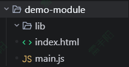

### index.html

```html
<!DOCTYPE html>
<html lang="en">
<head>
    <meta charset="UTF-8">
    <title>Title</title>
    <script src="main.js" type="module" />
</head>
<body>
    <h1>模块化测试</h1>
</body>
</html>
```

### user.js

放在 `libs/user.js`

```javascript
const user = {
    username: "张三",
    age: 18
}
const isAdult = (age) => {
    if (age > 18) {
        console.log("成年⼈")
    } else {
        console.log("未成年")
    }
}
export { user, isAdult }
// Java 怎么模块化；
// 1、 druid.jar
// 2、import 导⼊类
// JS 模块化；
// 1、 xxx.js
// 2、 xxx.js 暴露功能；
// 3、import 导⼊ xxx.js 的功能
//xxx.js 暴露的功能，别⼈才能导⼊
```

### main.js

```javascript
// 所有的功能不⽤写在⼀个JS中
import {user,isAdult} from './libs/user.js'
alert("当前⽤户："+user.username)
isAdult(user.age);
```

## 核心总结

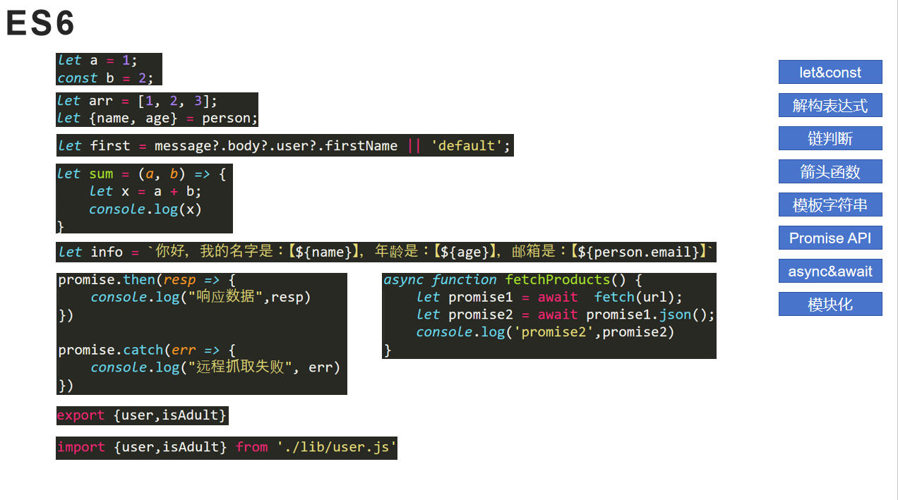

# Npm

npm 是 **nodejs **中进⾏ 包管理 的⼯具；安装 nodejs 就会自带npm

下载：https://nodejs.org/en

## 环境

- 安装 `Node.js`
- 配置 `npm`

```shell
npm config set registry https://registry.npmmirror.com #设置国内阿⾥云镜像源 
npm config get registry #查看镜像源
```

## 命令

1. `npm init`： 项⽬初始化； 
2. `npm init -y`：默认⼀路yes，不⽤挨个输⼊信息 
3. `npm install 包名`：安装js包到项⽬中（仅当前项⽬有效）。指定 包名，或者 包名@版本号 
4. `npm install -g`： 全局安装，所有都能⽤ 
5. 可以去 npm仓库 搜索第三⽅库 
6. `npm update 包名`：升级包到最新版本 
7. `npm uninstall 包名`：卸载包 
8. `npm run`：项⽬运⾏

npm仓库：https://www.npmjs.com/

使用流程：

以前Java项目配合Maven的流程

1. 项⽬创建：Java环境 ==》 maven 初始化 ==》 添加依赖 ==》运⾏项⽬ 
2. 项⽬迁移：Java环境 ==》 maven 下载依赖 ==》运⾏项⽬

现在前端项目配合npm的流程

1. 项⽬创建：node环境 ==》 npm 初始化 ==》 安装依赖 ==》运⾏项⽬ 
2. 项⽬迁移：node环境 ==》 npm 下载依赖 ==》运⾏项⽬

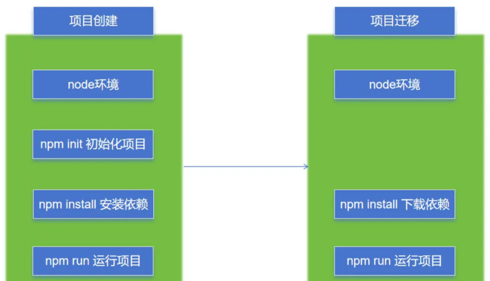

# Vite

## 简介

> > **快速创建前端项⽬脚⼿架 **
> 
> **统⼀的⼯程化规范**：⽬录结构、代码规范、git提交规范 等 
> 
> **⾃动化构建和部署**：前端脚⼿架可以⾃动进⾏代码打包、压缩、合并、编译等常⻅的构建⼯作，可以通过集成⾃动化部署脚本，⾃动将代码部署到测试、⽣产环境等；

官网：https://cn.vitejs.dev/


## 实战

### 创建项目

```shell
npm create vite #根据向导选择技术栈
```

### 安装依赖

```shell
npm install #安装项⽬所有依赖 
npm install axios #安装指定依赖到当前项⽬ 
npm install -g xxx # 全局安装
```

### 项目启动

```shell
npm run dev #启动项⽬
```

### 项目打包

```shell
npm run build #构建后 ⽣成 dist ⽂件夹
```

### 项目部署

**前后分离⽅式**：需要把` dist` ⽂件夹内容部署到如 `nginx `之类的服务器上。 
**前后不分离⽅式**：把 `dist `⽂件夹内容复制到 `SpringBoot `项⽬ `resources `下⾯

## 小结

> **玩好四大命令**
> 
> 1. 创建项目脚手架：`npm create vite`
> 2. 安装项目依赖：` npm install`
> 3. 启动运行项目：`npm run dev`
> 4. 项目打包：`npm run build`

# Vue3

> https://cn.vuejs.org/


> **我们使⽤ **`vite `**创建 **`vue项⽬脚⼿架`**，并测试Vue功能**

```shell
npm create vite #根据向导选择技术栈
```

## 组件化

**组件系统**是⼀个抽象的概念； 

- **组件**：⼩型、独⽴、可复⽤的单元 
- **组合**：通过组件之间的组合、包含关系构建出⼀个完整应⽤ 

> **⼏乎任意类型的应⽤界⾯都可以抽象为⼀个****组件树**；

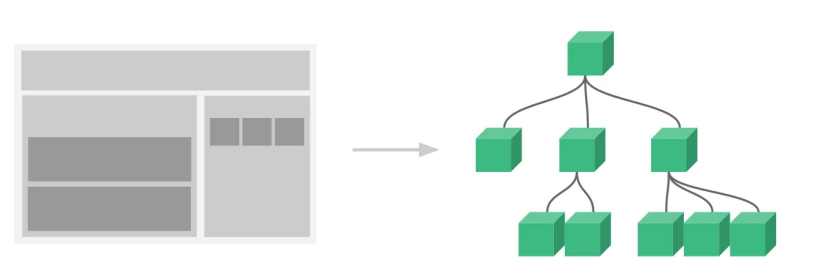

## SFC

> `Vue 的``单⽂件组件`** (即 *.vue ⽂件，英⽂ ****Single-File Component****，简称 SFC) 是⼀种特殊的⽂件格式， 使我们能够将⼀个 Vue 组件的模板、逻辑与样式封装在单个⽂件中.**

```html
<script setup> 
 
//编写脚本， js
</script> 

<template> 
 
//编写⻚⾯模板 ，html
</template> 

<style scoped> 
 //编写样式 ,css
</style>
```

> 文件 =》 首选项 =》 配置用户代码片段 =》 搜索 vue，选择**vue.json => 粘贴如下**

```sql
  "vue3": {
        "prefix": "vue3",
        "body": [
            "<template>",
            "",
            "</template>",
            "<script setup>",
            "",
            "",            
            "</script>",
            "<style scoped>",
            "",
            "",
            "</style>",
            ""
        ],
        "description": "快速创建vue3模板"
    }

```

## Vue工程

### 创建&运行

```shell
npm create vite # 按照提示选择Vue 
npm run dev #项⽬运⾏命令
```

### 启动原理

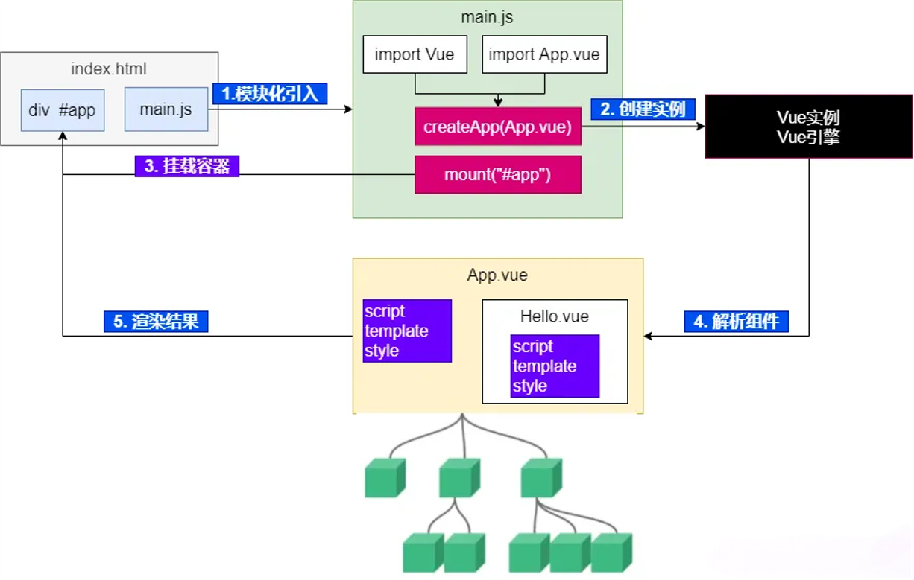

## 基本语法

### 插值

```xml
<script setup> 
    //基本数据 
    let name = "张三" 
    let age = 18 
    //对象数据 
    let car = { 
     brand: "奔驰", 
     price: 777 
    } 
</script> 
<template> 
    <p> name: {{name}} </p> 
    <p> age: {{age}} </p> 
    <div style="border: 3px solid red"> 
    <p>品牌：{{car.brand}}</p> 
    <p>价格：{{car.price}}</p> 
    </div> 
</template> 
<style scoped> 
</style>
```

### v-xx：指令

#### 事件绑定：v-on

> 使⽤ `v-on` 指令，可以为元素绑定事件。可以简写为 `@`

```xml
<script setup> 
//定义事件回调 
function buy(){ 
 alert("购买成功"); 
} 
</script> 
<template> 
<button v-on:click="buy">购买</button> 
<button @click="buy">购买</button> 
</template> 
<style scoped> 
</style>
```

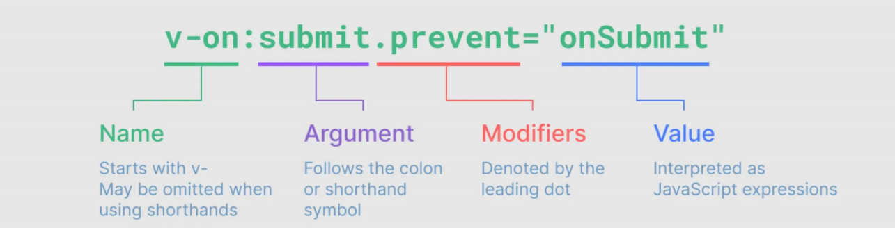

Modifiers：修饰符详情 

https://cn.vuejs.org/guide/essentials/event-handling.html

#### 条件判断：v-if

```xml
<script setup>
import { ref } from 'vue'

const awesome = ref(true)
</script>

<template>
  <button @click="awesome = !awesome">toggle</button>

  <h1 v-if="awesome">Vue is awesome!</h1>
  <h1 v-else>Oh no 😢</h1>
</template>
```

#### 循环：v-for

> 数组

```javascript
<script setup>
import { ref } from 'vue'

const items = ref([{ message: 'Foo' }, { message: 'Bar' }])
</script>

<template>
  <li v-for="item in items">
  {{ item.message }}
  </li>
  
  <li v-for="(item, index) in items">
     {{ index }} - {{ item.message }}
   </li>
   <!-- 使用解构 -->
   <li v-for="{ message } in items">
      {{ message }}
    </li>

    <!-- 有 index 索引时 -->
    <li v-for="({ message }, index) in items">
      {{ message }} {{ index }}
    </li>
</template>
```

> 对象

```javascript
const myObject = reactive({
  title: 'How to do lists in Vue',
  author: 'Jane Doe',
  publishedAt: '2016-04-10'
})

//遍历的顺序会基于对该对象调用 Object.values() 的返回值来决定。
<ul>
  <li v-for="value in myObject">
    {{ value }}
  </li>
</ul>

//可以通过提供第二个参数表示属性名 (例如 key)
<li v-for="(value, key) in myObject">
  {{ key }}: {{ value }}
</li>

//第三个参数表示位置索引
<li v-for="(value, key, index) in myObject">
  {{ index }}. {{ key }}: {{ value }}
</li>

//使用范围值;注意此处 n 的初值是从 1 开始而非 0。
<span v-for="n in 10">{{ n }}</span>
```

> `v-if` 与 `v-for`同时存在于一个节点上时，`v-if` 比 `v-for` 的优先级更高。
> 
> 这意味着 `v-if` 的条件将无法访问到 `v-for` 作用域内定义的变量别名：

```xml
<!--
 这会抛出一个错误，因为属性 todo 此时
 没有在该实例上定义
-->
<li v-for="todo in todos" v-if="!todo.isComplete">
  {{ todo.name }}
</li>


<!--在外先包装一层 <template> 再在其上使用 v-for 可以解决这个问题 (这也更加明显易读)：-->
<template v-for="todo in todos">
  <li v-if="!todo.isComplete">
    {{ todo.name }}
  </li>
</template>
```

#### 更多指令

https://cn.vuejs.org/api/built-in-directives.html；后期我们都会⽤到。

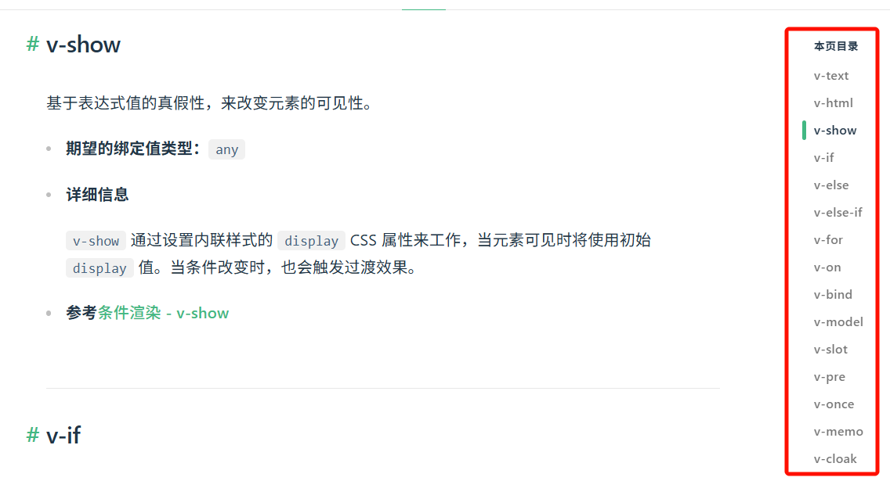

### v-bind：属性绑定

- 使⽤` v-bind:属性='xx' `语法，可以为标签的某个属性绑定值； 
- 可以简写为 `:属性='xx'`

```xml
<script setup> 
let url = "http://www.baidu.com" 
</script> 
<template> 
<a v-bind:href="url">go</a> 
<a :href="url">go</a> 
</template> 
<style scoped> 
</style>
```

> 注意：此时如果我们想修改变量的值，属性值并不会跟着修改。可以测试下。因为还没有响应式特性

### ref() ：响应式

> > 数据的动态变化需要反馈到⻚⾯； 
> 
> Vue通过 `ref()` 和 `reactive() `**包装数据**，将会⽣成⼀个**数据的代理对象**。vue内部的 **基于依赖追踪 **
> 
> **的响应式系统** 就会**追踪感知数据变化**，并**触发⻚⾯的重新渲染**。

#### 基本使用

> 1. 使⽤ `ref()` 包装**原始类型**、**对象类型数据**，⽣成 代理对象 
> 2. 任何⽅法、js代码中，使⽤ `代理对象.value` 的形式**读取**和**修改值 **
> 3. ⻚⾯组件中，直接使⽤ `代理对象`

> *注意：推荐使⽤ *`const（常量）`* 声明代理对象。代表代理对象不可变，但是内部值变化会被追踪*

```html
<script setup> 
import { ref } from 'vue' 
const count = ref(0) 
function increment() { 
    count.value++ 
} 
</script> 
<template> 
 
<button @click="increment"> 
{{ count }} 
</button> 
</template>
```

#### 深层响应特性

```javascript
import { ref } from 'vue' 
const obj = ref({ 
 nested: { count: 0 }, 
 arr: ['foo', 'bar'] 
}) 
function mutateDeeply() { 
 // 以下都会按照期望⼯作 
 obj.value.nested.count++ 
 obj.value.arr.push('baz') 
}
```

### reactive() ：响应式

1. 使⽤ `reactive()` 包装`对象类型数据`，⽣成 **代理对象 **
2. 任何⽅法、js代码中，使⽤ `代理对象.属性` 的形式**读取**和**修改值 **
3. ⻚⾯组件中，直接使⽤ `代理对象.属性`

```javascript
import { reactive } from 'vue' 
const state = reactive({ count: 0 }) 

<button @click="state.count++"> 
{{ state.count }} 
</button>
```

> > 最佳实践
> 
> 1. 基本类型⽤ `ref()`，对象类型⽤` reactive()`， 
> 2. ref 要⽤ `.value` ， reactive直接` . `。⻚⾯取值永不变。 
> 3. 也可以 `ref ⼀把梭`，⼤不了 `天天 .value`

### v-model：表单绑定

> 复制如下模板到组件，编写你的代码，实现表单数据绑定。

```html
<div style="display: flex;">
    <div style="border: 1px solid black;width: 300px">
        <form>
            <h1>表单绑定</h1>
            <p style="background-color: azure"><label>姓名(⽂本框)：</label><input /></p>
            <p style="background-color: azure"><label>同意协议(checkbox)：</label>
                <input type="checkbox" />
            </p>
            <p style="background-color: azure">
                <label>兴趣(多选框)：</label><br />
                <label><input type="checkbox" value="⾜球" />⾜球</label>
                <label><input type="checkbox" value="篮球" />篮球</label>
                <label><input type="checkbox" value="⽻⽑球" />⽻⽑球</label>
                <label><input type="checkbox" value="乒乓球" />乒乓球</label>
            </p>
            <p style="background-color: azure">
                <label>性别(单选框)：</label>
                <label><input type="radio" name="sex" value="男">男</label>
                <label><input type="radio" name="sex" value="⼥">⼥</label>
            </p>
            <p style="background-color: azure">
                <label>学历(单选下拉列表)：</label>
                <select>
                    <option disabled value="">选择学历</option>
                    <option>⼩学</option>
                    <option>初中</option>
                    <option>⾼中</option>
                    <option>⼤学</option>
                </select>
            </p>
            <p style="background-color: azure">
                <label>课程(多选下拉列表)：</label>
                <br />
                <select multiple>
                    <option disabled value="">选择课程</option>
                    <option>语⽂</option>
                    <option>数学</option>
                    <option>英语</option>
                    <option>道法</option>
                </select>
            </p>
        </form>
    </div>
    <div style="border: 1px solid blue;width: 200px">
        <h1>结果预览</h1>
        <p style="background-color: azure"><label>姓名：</label></p>
        <p style="background-color: azure"><label>同意协议：</label>
        </p>
        <p style="background-color: azure">
            <label>兴趣：</label>
        </p>
        <p style="background-color: azure">
            <label>性别：</label>
        </p>
        <p style="background-color: azure">
            <label>学历：</label>
        </p>
        <p style="background-color: azure">
            <label>课程：</label>
        </p>
    </div>
</div>
```

### computed()：计算属性

计算属性：根据已有数据计算出新数据

```html
<script setup>
    import { computed, reactive, toRef, toRefs } from "vue";
    //省略基础代码
    const totalPrice = computed(() => {
        return price.value * num.value - coupon.value * 100
    })
</script>
<template>
    <div class="car">
        <h2>优惠券：{{ car.coupon }} 张</h2>
        <h2>数量：{{ car.num }}</h2>
        <h2>单价：{{ car.price }}</h2>
        <h1>总价：{{totalPrice}}</h1>
        <button @click="getCoupon">获取优惠</button>
        <button @click="addNum">加量</button>
        <button @click="changePrice">加价</button>
    </div>
</template>
<style scoped>
</style>
```

### watch()：属性监听

```javascript
watch(num, (value, oldValue, onCleanup) => {
    console.log("newValue：" + value + "；oldValue:" + oldValue)
    onCleanup(() => {
        console.log("onCleanup....")
    })
})
```

### 生命周期

> 组件：从创建到运行到销毁的完整过程
> 
> 只有一个用处：生命周期进行到某个阶段，程序员想要感知到，并执行一个业务代码（回调【钩子函数 hook】）

每个 `Vue 组件实例`在创建时都需要经历⼀系列的`初始化步骤`，⽐如设置好数据侦听，编译模板，挂载实例到 DOM，以及在数据改变时更新 DOM。在此过程中，它也会运⾏被称为⽣命周期钩⼦的函数，让开发者有机会在特定阶段运⾏⾃⼰的代码。


⽣命周期整体分为**四个阶段**，分别是： `创建`、`挂载`、`更新`、`销毁 `，每个阶段都有两个钩⼦，⼀前⼀后。

**挂载：**第一次把html展示到页面； 触发一次

**更新：**局部更新某些html标签； 页面变化是触发页面更新逻辑；

常⽤的钩⼦：

- `onMounted`(挂载完毕) 
- `onUpdated`(更新完毕) 
- `onBeforeUnmount`(卸载之前)

```xml
<script setup>
    import { onBeforeMount, onBeforeUpdate, onMounted, onUpdated, ref } from "vue";
    const count = ref(0)
    const btn01 = ref()
    // ⽣命周期钩⼦
    onBeforeMount(() => {
        console.log('挂载之前', count.value, document.getElementById("btn01"))
    })
    onMounted(() => {
        console.log('挂载完毕', count.value, document.getElementById("btn01"))
    })
    onBeforeUpdate(() => {
        console.log('更新之前', count.value, btn01.value.innerHTML)
    })
    onUpdated(() => {
        console.log('更新完毕', count.value, btn01.value.innerHTML)
    })
</script>
<template>
    <button ref="btn01" @click="count++"> {{count}} </button>
</template>
<style scoped>
</style>
```

> 最佳实践：
> 
> **以后我们需要使用生命周期的 **`onBeforeMount`**在页面挂载之前，给后端发送请求，获取数据。**

## 组件传值

### 父传子 - Props

> *⽗组件给⼦组件传递值； *

**单向数据流效果**： 

- **⽗组件修改值**，⼦组件发⽣变化 
- **⼦组件修改值**，⽗组件不会感知到

```javascript
//⽗组件给⼦组件传递数据：使⽤属性绑定
<Son :books="data.books" :money = "data.money" />

//⼦组件定义接受⽗组件的属性
let props = defineProps({
    money: {
        type: Number,
        required: true,
        default: 200
    },
    books: Array
});
```

### 子传父 - Emit

> props ⽤来⽗传⼦，emit ⽤来⼦传⽗

```java
//⼦组件定义发⽣的事件
let emits = defineEmits(['buy']);
function buy(){
 // props.money -= 5;
 emits('buy',-5);
}

//⽗组件感知事件和接受事件值
 <Son :books="data.books" :money="data.money" @buy="moneyMinis"/>
```

> 思考：兄弟组件传值
> 
> 1. 父传子再传父
> 2. pinia共享数据
> 3. pub/sub等发布订阅功能的框架

## 插槽 - Slots

> ⼦组件可以使⽤插槽接受模板内容。

### 基本定义

```xml
<!-- 组件定义 -->
<button class="fancy-btn">
 <slot></slot> <!-- 插槽出⼝ -->
</button>
<!-- 组件使⽤ -->
<FancyButton>
 Click me! <!-- 插槽内容 -->
</FancyButton>
```

### 默认内容

```xml
<button type="submit"> 
    <slot> 
         Submit <!-- 默认内容 --> 
    </slot> 
</button>
```

### 具名插槽

定义

```xml
<div class="container">
    <header>
        <slot name="header"></slot>
    </header>
    <main>
        <slot></slot>
    </main>
    <footer>
        <slot name="footer"></slot>
    </footer>
</div>
```

**使⽤**：` v-slot` 可以简写为 `#`

```xml
<BaseLayout>
    <template v-slot:header>
    <!-- header 插槽的内容放这⾥ -->
    </template>
</BaseLayout>
```

## 小结

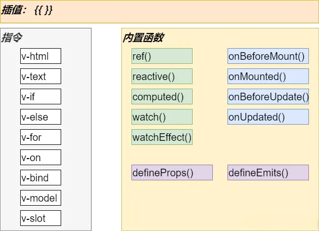

⼏个简写： 

`v-on = @ `

`v-bind = : `

`v-slot = #`

# Vue-Router

https://router.vuejs.org/zh/

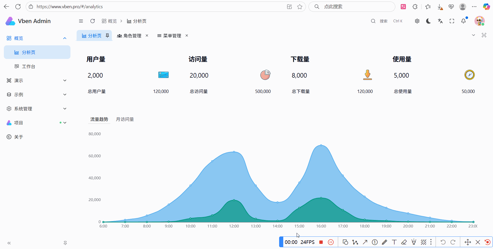

> **路由表：（路径地址 对应  Vue组件）**
> 
> 1. `/system/role`：=> `Role.vue` => `角色管理`
> 2. `/system/menu`：=> `Menu.vue` => `菜单管理`
> 3. `/system/dept`：=> `Dept.vue` => `部门管理`

## 入门

### 项目创建

```html
npm create vite
```

### 整合vue-router

> 参照官⽹即可

```html
npm install vue-router@4
```

> 编写 `src/router/index.js`

```javascript
import { createMemoryHistory, createRouter } from 'vue-router'

import HomeView from './HomeView.vue'
import AboutView from './AboutView.vue'

const routes = [
  { path: '/', component: HomeView },
  { path: '/about', component: AboutView },
]

const router = createRouter({
  history: createMemoryHistory(),
  routes,
})
```

> 编写 `main.js`

```javascript
const app = createApp(App)
app.use(router)
app.mount('#app')
```

> 页面使用

```html
<router-link/>
<router-view/>
```

### 常用API

> 在任意组件中：
> 
> 1. `useRouter()`：拿到路由器，可以控制页面跳转
> 2. `useRoute()`：拿到路由（也就是url地址），可以获取当前url数据
> 3. `<router-link/>`：替代a标签进行点击跳转
> 4. `<router-view/>`：动态组件区
> 
> 先了解。后面会有讲

```xml
<script setup>
import { computed } from 'vue'
import { useRoute, useRouter } from 'vue-router'

const router = useRouter()
const route = useRoute()
</script>
```

### 运行流程

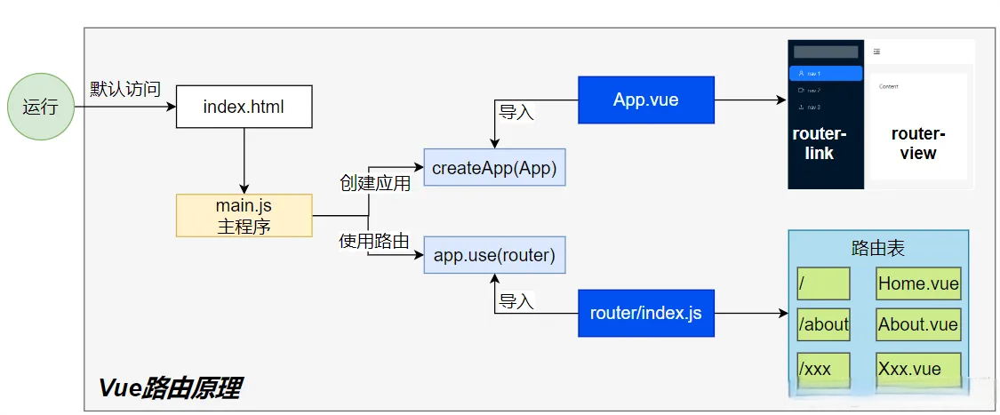

## 基础路由

### 路由配置

> 复习下之前的路由配置

编写⼀个新的组件，测试路由功能；步骤如下： 

1. 编写 router/index.js ⽂件 
2. 配置路由表信息 
3. 创建路由器并导出 
4. 在 main.js 中使⽤路由 
5. 在⻚⾯使⽤ router-link router-view 完成路由功能

### 路径参数

> 使⽤ `:变量名` 接受动态参数；这个称为 `路径参数`

```javascript
const routes = [
 // 匹配 /o/3549
 { path: '/o/:orderId' },
 // 匹配 /p/books
 { path: '/p/:productName' },
]
```

## 嵌套路由

> 1. `User `组件是用户页
> 2. 点击 `我的信息`  来到 `UserProfile` 页
> 3. 点击 `我的邮箱`  来到 `UserEmail` 页


```javascript
const routes = [
    {
        path: '/user/:id',
        component: User,
        children: [
            {
                // 当 /user/:id/profile 匹配成功
                // UserProfile 将被渲染到 User 的 <router-view> 内部
                path: 'profile',
                component: UserProfile,
            },
            {
                // 当 /user/:id/posts 匹配成功
                // UserPosts 将被渲染到 User 的 <router-view> 内部
                path: 'posts',
                component: UserPosts,
            },
        ],
    },
]
```

## 编程式

### useRoute：路由数据

> 路由传参跳转到指定⻚⾯后，⻚⾯需要取到传递过来的值，可以使⽤ `useRoute `⽅法； 
> 
> 拿到当前⻚路由数据；可以做
> 
> 1. 获取到当前路径 
> 2. 获取到组件名 
> 3. 获取到参数 
> 4. 获取到查询字符串

### useRouter：路由器

> 拿到路由器；可以控制跳转、回退等。

```javascript
import {useRoute, useRouter} from "vue-router";
const router = useRouter();
// 字符串路径
router.push('/users/eduardo')
// 带有路径的对象
router.push({ path: '/users/eduardo' })
// 命名的路由，并加上参数，让路由建⽴ url
router.push({ name: 'user', params: { username: 'eduardo' } })
// 带查询参数，结果是 /register?plan=private
router.push({ path: '/register', query: { plan: 'private' } })
// 带 hash，结果是 /about#team
router.push({ path: '/about', hash: '#team' })
//注意： `params` 不能与 `path` ⼀起使⽤
router.push({ path: '/user', params: { username } }) //错误⽤法 -> /user
```

## 路由传参

### params 参数

```xml
<!-- 跳转并携带params参数（to的字符串写法） -->
<RouterLink :to="`/news/detail/001/新闻001/内容001`">{{news.title}}</RouterLink>
<!-- 跳转并携带params参数（to的对象写法） -->
<RouterLink :to="{
                name:'xiang', //⽤name跳转，params情况下，不可⽤path
                params:{
                    id:news.id,
                    title:news.title,
                    content:news.title
                    }
                }">
    {{news.title}}
</RouterLink>
```

> 获取使用：
> 
> 1. `$route.params.xx`** **
> 2. `useRoute()` 的 `params.xx`

### query 参数

```xml
<!-- 跳转并携带query参数（to的字符串写法） -->
<router-link to="/news/detail?a=1&b=2&content=欢迎你">
    跳转
</router-link>
<!-- 跳转并携带query参数（to的对象写法） -->
<RouterLink :to="{
        //name:'xiang', //⽤name也可以跳转
        path:'/news/detail',
        query:{
            id:news.id,
            title:news.title,
            content:news.content
            }
        }">
    {{news.title}}
</RouterLink>
```

> 获取使用：
> 
> 1. `$route.query.xx`** **
> 2. `useRoute()` 的 `query.xx`

## 导航守卫

> 我们只演示**全局前置守卫**。后置钩⼦等内容参照官⽅⽂档

```javascript
import { createRouter, createWebHistory } from 'vue-router'
import HomeView from '../views/HomeView.vue'
const router = createRouter({
    history: createWebHistory(import.meta.env.BASE_URL),
    routes: [
        {
            path: '/',
            name: 'home',
            component: HomeView
        },
        {
            path: '/about',
            name: 'about',
            // route level code-splitting
            // this generates a separate chunk (About.[hash].js) for this
            // route
            // which is lazy-loaded when the route is visited.
            component: () => import('../views/AboutView.vue')
        },
        {
            path: '/user/:name',
            name: 'User',
            component: () => import('@/views/user/UserInfo.vue'),
            children: [
                {
                    path: 'profile',
                    component: () => import('@/views/user/Profile.vue')
                },
                {
                    path: 'posts',
                    component: () => import('@/views/user/Posts.vue')
                }
            ]
        }
    ]
})

router.beforeEach(async (to, from) => {
    console.log("守卫：to：", to)
    console.log("守卫：from：", from)
    if (to.fullPath === '/about') {
        return "/"
    }
})

export default router
```

## 小结

1. 路由配置：
  1. `routes`：路由表
  2. `createRouter()`：创建路由
2. 标签：
  1. `router-link`
  2. `router-view`
3. 函数：
  1. `useRoute()`：path、params、query、name
  2. `useRouter()`：push、go
4. 导航守卫：
  1. `router.beforeEach(async (to, from) => {})`

# Axios

> `Axios `是⼀个基于 `promise`的⽹络请求库

```javascript
npm install axios
```

```javascript
import axios from "axios" 
axios.get('/user') 
     .then(res => console.log(resp.data))
```

> 测试服务器：https://httpbin.org/

## 请求

### get请求

```javascript
// 向给定ID的⽤户发起请求
axios.get('/user?ID=12345')
    .then(function (response) {
        // 处理成功情况
        console.log(response);
    })
    .catch(function (error) {
        // 处理错误情况
        console.log(error);
    })
    .finally(function () {
        // 总是会执⾏
    });
```

> 携带请求参数

```javascript
// 上述请求也可以按以下⽅式完成（可选）
axios.get('/user', {
    params: {
        ID: 12345
    }
})
    .then(function (response) {
        console.log(response);
    })
    .catch(function (error) {
        console.log(error);
    })
    .finally(function () {
        // 总是会执⾏
    });
```

### post请求

> 默认` post请求体` 中的数据将会以 `json `⽅式提交

```javascript
axios.post('/user', {
    firstName: 'Fred',
    lastName: 'Flintstone'
})
    .then(function (response) {
        console.log(response);
    })
    .catch(function (error) {
        console.log(error);
    });
```

## 响应

> 响应的数据结构如下：

```json
{
     // `data` 由服务器提供的响应
     data: {},
     // `status` 来⾃服务器响应的 HTTP 状态码
     status: 200,
     // `statusText` 来⾃服务器响应的 HTTP 状态信息
     statusText: 'OK',
     // `headers` 是服务器响应头
     // 所有的 header 名称都是⼩写，⽽且可以使⽤⽅括号语法访问
     // 例如: `response.headers['content-type']`
     headers: {},
     // `config` 是 `axios` 请求的配置信息
     config: {},
     // `request` 是⽣成此响应的请求
     // 在node.js中它是最后⼀个ClientRequest实例 (in redirects)，
     // 在浏览器中则是 XMLHttpRequest 实例
     request: {}
}
```

## 配置

```javascript
const instance = axios.create({
    baseURL: 'https://some-domain.com/api/',
    timeout: 1000,
    headers: { 'X-Custom-Header': 'foobar' }
});
//可⽤的配置项如下：
{
    // `url` 是⽤于请求的服务器 URL
    url: '/user',
    // `method` 是创建请求时使⽤的⽅法
    method: 'get', // 默认值
    // `baseURL` 将⾃动加在 `url` 前⾯，除⾮ `url` 是⼀个绝对 URL。
    // 它可以通过设置⼀个 `baseURL` 便于为 axios 实例的⽅法传递相对 URL
    baseURL: 'https://some-domain.com/api/',
    // `transformRequest` 允许在向服务器发送前，修改请求数据
    // 它只能⽤于 'PUT', 'POST' 和 'PATCH' 这⼏个请求⽅法
    // 数组中最后⼀个函数必须返回⼀个字符串， ⼀个Buffer实例，ArrayBuffer，FormData，或 Stream
    // 你可以修改请求头。
    transformRequest: [function (data, headers) {
        // 对发送的 data 进⾏任意转换处理
        return data;
    }],
    // `transformResponse` 在传递给 then/catch 前，允许修改响应数据
    transformResponse: [function (data) {
        // 对接收的 data 进⾏任意转换处理
        return data;
    }],
    // ⾃定义请求头
    headers: { 'X-Requested-With': 'XMLHttpRequest' },
    // `params` 是与请求⼀起发送的 URL 参数
    // 必须是⼀个简单对象或 URLSearchParams 对象
    params: {
        ID: 12345
    },// `paramsSerializer`是可选⽅法，主要⽤于序列化`params`
    // (e.g. https://www.npmjs.com/package/qs, http://api.jquery.com/jquery.param/)
    paramsSerializer: function (params) {
        return Qs.stringify(params, { arrayFormat: 'brackets' })
    },
    // `data` 是作为请求体被发送的数据
    // 仅适⽤ 'PUT', 'POST', 'DELETE 和 'PATCH' 请求⽅法
    // 在没有设置 `transformRequest` 时，则必须是以下类型之⼀:
    // - string, plain object, ArrayBuffer, ArrayBufferView, URLSearchParams
    // - 浏览器专属: FormData, File, Blob
    // - Node 专属: Stream, Buffer
    data: {
        firstName: 'Fred'
    },

    // 发送请求体数据的可选语法
    // 请求⽅式 post
    // 只有 value 会被发送，key 则不会
    data: 'Country=Brasil&City=Belo Horizonte',
    // `timeout` 指定请求超时的毫秒数。
    // 如果请求时间超过 `timeout` 的值，则请求会被中断
    timeout: 1000, // 默认值是 `0` (永不超时)
    // `withCredentials` 表示跨域请求时是否需要使⽤凭证
    withCredentials: false, // default
    // `adapter` 允许⾃定义处理请求，这使测试更加容易。
    // 返回⼀个 promise 并提供⼀个有效的响应 （参⻅ lib/adapters/README.md）。
    adapter: function (config) {
        /* ... */
    },
    // `auth` HTTP Basic Auth
    auth: {
        username: 'janedoe',
            password: 's00pers3cret'
    },
    // `responseType` 表示浏览器将要响应的数据类型
    // 选项包括: 'arraybuffer', 'document', 'json', 'text', 'stream'
    // 浏览器专属：'blob'
    responseType: 'json', // 默认值
    // `responseEncoding` 表示⽤于解码响应的编码 (Node.js 专属)
    // 注意：忽略 `responseType` 的值为 'stream'，或者是客户端请求
    // Note: Ignored for `responseType` of 'stream' or client-side requests
    responseEncoding: 'utf8', // 默认值
    // `xsrfCookieName` 是 xsrf token 的值，被⽤作 cookie 的名称
    xsrfCookieName: 'XSRF-TOKEN', // 默认值
    // `xsrfHeaderName` 是带有 xsrf token 值的http 请求头名称
    xsrfHeaderName: 'X-XSRF-TOKEN', // 默认值
    // `onUploadProgress` 允许为上传处理进度事件
    // 浏览器专属
    onUploadProgress: function (progressEvent) {
        // 处理原⽣进度事件
    },
    // `onDownloadProgress` 允许为下载处理进度事件
    // 浏览器专属
    onDownloadProgress: function (progressEvent) {
        // 处理原⽣进度事件
    },
    // `maxContentLength` 定义了node.js中允许的HTTP响应内容的最⼤字节数
    maxContentLength: 2000,
    // `maxBodyLength`（仅Node）定义允许的http请求内容的最⼤字节数
    maxBodyLength: 2000,
    // `validateStatus` 定义了对于给定的 HTTP状态码是 resolve 还是 reject promise。
    // 如果 `validateStatus` 返回 `true` (或者设置为 `null` 或 `undefined`)，
    // 则promise 将会 resolved，否则是 rejected。
    validateStatus: function (status) {
        return status >= 200 && status < 300; // 默认值
    },
    // `maxRedirects` 定义了在node.js中要遵循的最⼤重定向数。
    // 如果设置为0，则不会进⾏重定向
    maxRedirects: 5, // 默认值
        // `socketPath` 定义了在node.js中使⽤的UNIX套接字。
        // e.g. '/var/run/docker.sock' 发送请求到 docker 守护进程。
        // 只能指定 `socketPath` 或 `proxy` 。
        // 若都指定，这使⽤ `socketPath` 。
    socketPath: null, // default
    // `httpAgent` and `httpsAgent` define a custom agent to be used when performing http
    // and https requests, respectively, in node.js. This allows options to be added like
    // `keepAlive` that are not enabled by default.
    httpAgent: new http.Agent({ keepAlive: true }),
    httpsAgent: new https.Agent({ keepAlive: true }),
    // `proxy` 定义了代理服务器的主机名，端⼝和协议。
    // 您可以使⽤常规的`http_proxy` 和 `https_proxy` 环境变量。
    // 使⽤ `false` 可以禁⽤代理功能，同时环境变量也会被忽略。
    // `auth`表示应使⽤HTTP Basic auth连接到代理，并且提供凭据。
    // 这将设置⼀个 `Proxy-Authorization` 请求头，它会覆盖 `headers` 中已存在的⾃定义 `Proxy-Authorization` 请求头。
    // 如果代理服务器使⽤ HTTPS，则必须设置 protocol 为`https`
    proxy: {
        protocol: 'https',
        host: '127.0.0.1',
        port: 9000,
        auth: {
            username: 'mikeymike',
            password: 'rapunz3l'
        }
    },
    // see https://axios-http.com/zh/docs/cancellation
    cancelToken: new CancelToken(function (cancel) {
    }),
    // `decompress` indicates whether or not the response body should be decompressed
    // automatically. If set to `true` will also remove the 'content-encoding' header
    // from the responses objects of all decompressed responses
    // - Node only (XHR cannot turn off decompression)
    decompress: true // 默认值
}
```

## 拦截器

```javascript
// 添加请求拦截器
axios.interceptors.request.use(function (config) {
    // 在发送请求之前做些什么
    return config;
}, function (error) {
    // 对请求错误做些什么
    return Promise.reject(error);
});
// 添加响应拦截器
axios.interceptors.response.use(function (response) {
    // 2xx 范围内的状态码都会触发该函数。
    // 对响应数据做点什么
    return response;
}, function (error) {
    // 超出 2xx 范围的状态码都会触发该函数。
    // 对响应错误做点什么
    return Promise.reject(error);
});
```

# Pinia

> Pinia 是 **Vue 的存储库**，它允许您**跨组件/⻚⾯共享状态(数据)**。 
> 
> **Pinia 三个核⼼概念**： 
> 
> 1. **State**：表示 Pinia Store 内部**保存的数据（data）** 
> 2. **Getter**：可以认为是 Store ⾥⾯数据的**计算属性（computed）** 
> 3. **Actions**：是暴露**修改数据**的⼏种⽅式。 
> 
> 读写分离的设计思想；
> 
> *虽然外部也可以直接读写Pinia Store 中保存的data，但是我们建议使⽤Actions暴露的⽅法操作数据更加安全*。

## 简介

### 为什么使用Pinia

> 跨组件共享数据，完成复杂的组件间通信

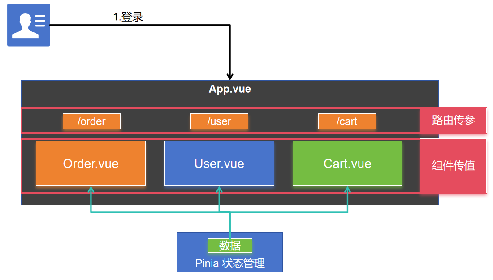

### 核心组件

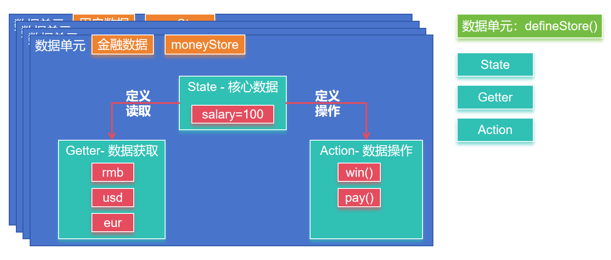

## 整合

```shell
npm install pinia
```

> main.js

```javascript
import { createApp } from 'vue'
import './style.css'
import App from './App.vue'
import { createPinia } from 'pinia'
const pinia = createPinia();
createApp(App)
    .use(pinia)
    .mount('#app')
```

## 案例

1. `stores/money.js` 编写内容；

```javascript
import { defineStore } from 'pinia'
//定义⼀个 money存储单元
export const useMoneyStore = defineStore('money', {
    state: () => ({ money: 100 }),
    getters: {
        rmb: (state) => state.money,
        usd: (state) => state.money * 0.14,
        eur: (state) => state.money * 0.13,
    },
    actions: {
        win(arg) {
            this.money += arg;
        },
        pay(arg) {
            this.money -= arg;
        }
    },
});
```

> App.vue

```xml
<script setup>
import Wallet from "./components/Wallet.vue";
import Game from "./components/Game.vue";
</script>
<template>
 <Wallet></Wallet>
 <Game/>
</template>
<style scoped>
</style>
```

> Wallet.vue

```xml
<script setup>
import {useMoneyStore} from '../stores/money.js'
let moneyStore = useMoneyStore();
</script>
<template>
<div>
 <h2>￥：{{moneyStore.rmb}}</h2>
 <h2>$：{{moneyStore.usd}}</h2>
 <h2>€：{{moneyStore.eur}}</h2>
</div>
</template>
<style scoped>
div {
 background-color: #f9f9f9;
}
</style>
```

> Game.vue

```xml
<script setup> 
import {useMoneyStore} from '../stores/money.js' 
let moneyStore = useMoneyStore(); 
function guaguale(){ 
    moneyStore.win(100); 
} 
function bangbang(){ 
    moneyStore.pay(5) 
} 
</script> 
<template> 
<button @click="guaguale">刮刮乐</button> 
<button @click="bangbang">买棒棒糖</button> 
</template> 
<style scoped> 
</style>
```

## setup写法

```javascript
export const useMoneyStore = defineStore('money', () => {
    const salary = ref(1000); // ref() 就是 state 属性
    const dollar = computed(() => salary.value * 0.14); // computed() 就是 getters
    const eur = computed(() => salary.value * 0.13); // computed() 就是 getters
    //function() 就是 actions
    const pay = () => {
        salary.value -= 100;
    }
    const win = () => {
        salary.value += 1000;
    }
    //重要：返回可⽤对象
    return { salary, dollar, eur, pay, win }
})
```

# 脚手架

```shell
npm create vite # 选择 使⽤ create-vue ⾃定义项⽬; 简单，就整合Vue
npm create vue@latest # 直接使⽤create-vue 创建项⽬；
vue-cli #已经过时
```

# UI框架

Element ui：https://element-plus.org/zh-CN/#/zh-CN

TDesign：https://tdesign.tencent.com/

Ant Design Vue：https://www.antdv.com/docs/vue/introduce-cn

Arco Design：https://arco.design/

## 掌握布局

`Layout：布局容器`，其下可嵌套 Header Sider Content Footer 或 Layout 本身，可以放在任何⽗容器中。 

`Header：顶部布局`，⾃带默认样式，其下可嵌套任何元素，只能放在 Layout 中。 

`Sider：侧边栏`，⾃带默认样式及基本功能，其下可嵌套任何元素，只能放在 Layout 中。 

`Content：内容部分`，⾃带默认样式，其下可嵌套任何元素，只能放在 Layout 中。 

`Footer：底部布局`，⾃带默认样式，其下可嵌套任何元素，只能放在 Layout 中。

## 掌握组件

# 里程碑

> 让AI 写前端。部署好前后分离架构的项目