# 8. ShardingSphere

https://shardingsphere.apache.org/

> **Apache ShardingSphere** 是一款**分布式**的**数据库**生态系统， **可以将任意数据库转换为分布式数据库**，并通过数据分片、弹性伸缩、加密等能力对原有数据库进行增强。

# 高性能数据库架构

## 读写分离

**读写分离原理：**读写分离的基本原理是将数据库读写操作分散到不同的节点上，下面是其基本架构图：

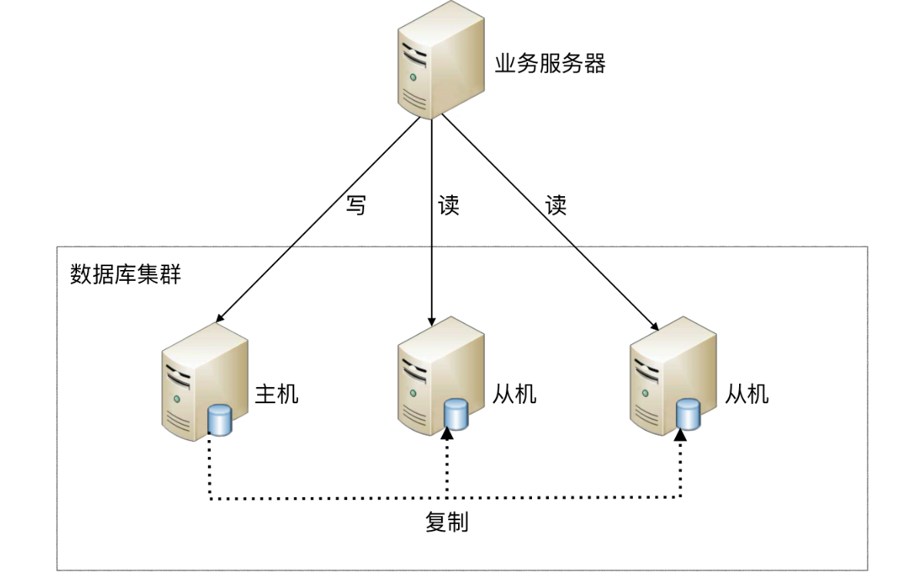

**读写分离的基本实现：**

- `主库负责处理事务性的增删改操作，从库负责处理查询操作`，能够有效的避免由数据更新导致的行锁，使得整个系统的查询性能得到极大的改善。
- 读写分离是`根据 SQL 语义的分析`，`将读操作和写操作分别路由至主库与从库`。
- 通过`一主多从`的配置方式，可以将查询请求均匀的分散到多个数据副本，能够进一步的提升系统的处理能力。 
- 使用`多主多从`的方式，不但能够提升系统的吞吐量，还能够提升系统的可用性，可以达到在任何一个数据库宕机，甚至磁盘物理损坏的情况下仍然不影响系统的正常运行。

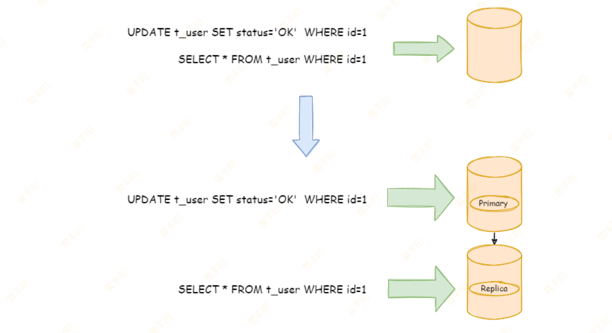

## 数据分片

### 垂直分片

**垂直分库：**`按照业务拆分的方式称为垂直分片，又称为``纵向拆分`，它的核心理念是专库专用。 在拆分之前，一个数据库由多个数据表构成，每个表对应着不同的业务。而拆分之后，则是按照业务将表进行归类，分布到不同的数据库中，从而将压力分散至不同的数据库。 

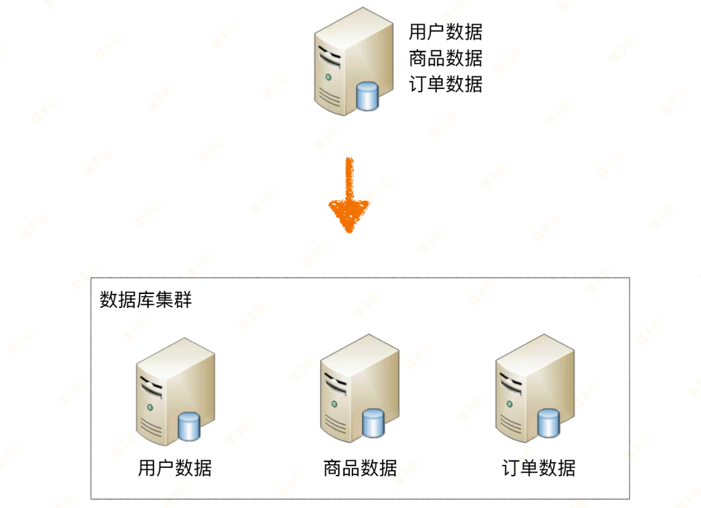

#### 垂直分库

> **微服务就是垂直分库模式！**
> 
> 比如：根据业务需要，将用户表和订单表垂直分片到不同的数据库

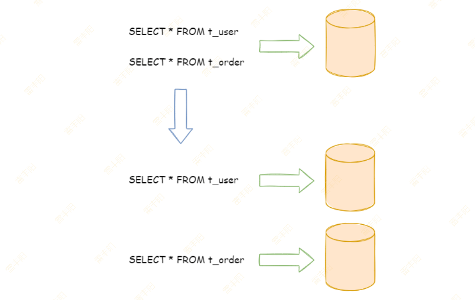

**垂直拆分可以缓解数据量和****访问量带来的问题****，但无法根治。**

`如果垂直拆分之后，表中的数据量依然超过单节点所能承载的阈值，则需要水平分片来进一步处理。`

#### 垂直分表

**垂直分表：**`垂直分表适合将表中某些不常用的列，或者是占了大量空间的列拆分出去。`

假设有一个**婚恋网站**，用户在筛选其他用户的时候，主要是用 **age **和 **sex **两个字段进行查询，而 nickname 和 description 两个字段主要用于展示，一般不会在业务查询中用到。description 本身又比较长，因此我们可以将这两个字段独立到另外一张表中，这样在查询 age 和 sex 时，就能带来一定的性能提升。

垂直分表引入的复杂性主要体现在表操作的数量要增加。例如，原来只要一次查询就可以获取 name、age、sex、nickname、description，现在需要两次查询，一次查询获取 name、age、sex，另外一次查询获取 nickname、description。

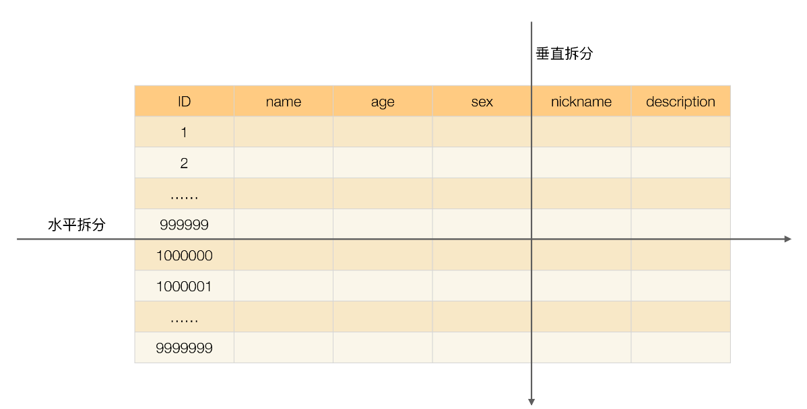

### 水平分片

`水平分片又称为横向拆分``。` 相对于垂直分片，它不再将数据根据业务逻辑分类，而是通过某个字段（或某几个字段），根据某种规则将数据分散至多个库或表中，每个分片仅包含数据的一部分。 例如：根据主键分片，偶数主键的记录放入 0 库（或表），奇数主键的记录放入 1 库（或表），如下图所示。

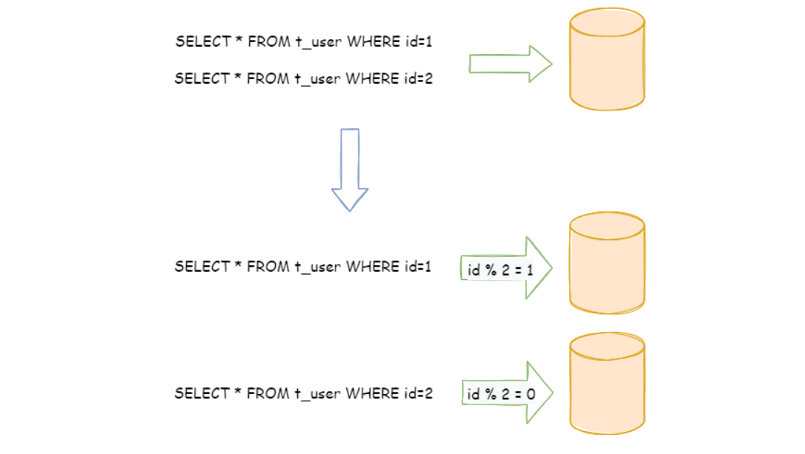

`单表进行切分后，是否将多个表分散在不同的数据库服务器中，可以根据实际的切分效果来确定。`

- **水平分表：**单表切分为多表后，新的表即使在同一个数据库服务器中，也可能带来可观的性能提升，如果性能能够满足业务要求，可以不拆分到多台数据库服务器，毕竟业务分库也会引入很多复杂性；
- **水平分库：**如果单表拆分为多表后，单台服务器依然无法满足性能要求，那就需要将多个表分散在不同的数据库服务器中。

> **阿里巴巴Java开发手册：**
> 
> 【推荐】**单表行数超过 500 万行或者单表容量超过 2GB**，才推荐进行**分库分表**。
> 
> 说明：如果预计三年后的数据量根本达不到这个级别，`请不要在创建表时就分库分表`。

# 简介

> **分片**：**数据分散存储**
> 
> 1. Kafka： 一个 topic 多个分区
> 2. Redis： hash槽。 
> 3. MySQL： 分库分表
> 4. ....

| 特性 | 定义 |
| --- | --- |
| 数据分片 | 数据分片，是应对海量数据存储与计算的有效手段。 ShardingSphere 基于底层数据库提供分布式数据库解决方案，可以水平扩展计算和存储。 |
| 分布式事务 | 事务能力，是保障数据库完整、安全的关键技术，也是数据库的核心技术。 基于 XA 和 BASE 的混合事务引擎，ShardingSphere 提供在独立数据库上的分布式事务功能， 保证跨数据源的数据安全。 |
| 读写分离 | 读写分离，是应对高压力业务访问的手段。基于对 SQL 语义理解及对底层数据库拓扑感知能力， ShardingSphere 提供灵活的读写流量拆分和读流量负载均衡。 |
| 数据迁移 | 数据迁移，是打通数据生态的关键能力。 ShardingSphere 提供跨数据源的数据迁移能力，并可支持重分片扩展。 |
| 联邦查询 | 联邦查询，是面对复杂数据环境下利用数据的有效手段。 ShardingSphere 提供跨数据源的复杂查询分析能力，实现跨源的数据关联与聚合。 |
| 数据加密 | 数据加密，是保证数据安全的基本手段。 ShardingSphere 提供完整、透明、安全、低成本的数据加密解决方案。 |
| 影子库 | 在全链路压测场景下，ShardingSphere 支持不同工作负载下的数据隔离，避免测试数据污染生产环境。 |

# 两种模式

## Sharding-JDBC 独立部署

`ShardingSphere-JDBC` 定位为**轻量级 Java 框架**，在 Java 的 JDBC 层提供的额外服务。 它使用客户端直连数据库，以 jar 包形式提供服务，无需额外部署和依赖，可理解为增强版的 JDBC 驱动，完全兼容 JDBC 和各种 ORM 框架。

- 适用于任何基于 JDBC 的 ORM 框架，如：JPA, Hibernate, Mybatis, Spring JDBC Template 或直接使用 JDBC；
- 支持任何第三方的数据库连接池，如：DBCP, C3P0, BoneCP, HikariCP 等；
- 支持任意实现 JDBC 规范的数据库，目前支持 MySQL，PostgreSQL，Oracle，SQLServer 以及任何可使用 JDBC 访问的数据库。

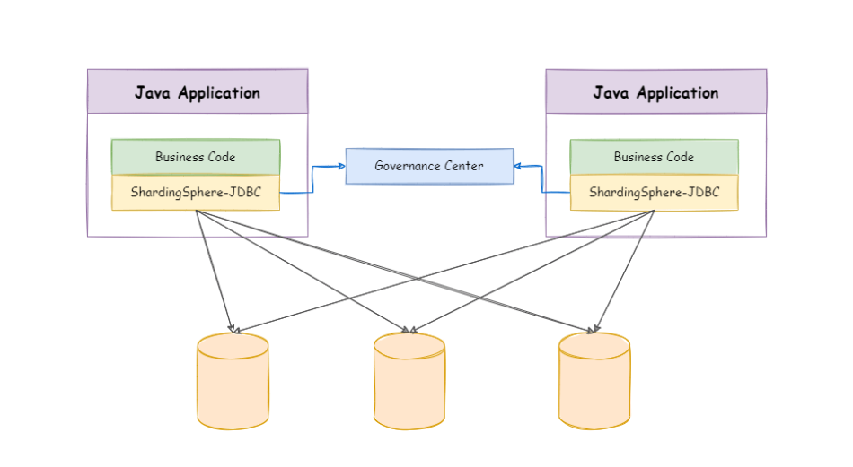

## Sharding-Proxy 独立部署

ShardingSphere-Proxy 定位为透明化的数据库代理端，通过实现数据库二进制协议，对异构语言提供支持。 目前提供 MySQL 和 PostgreSQL 协议，透明化数据库操作，对 DBA 更加友好。

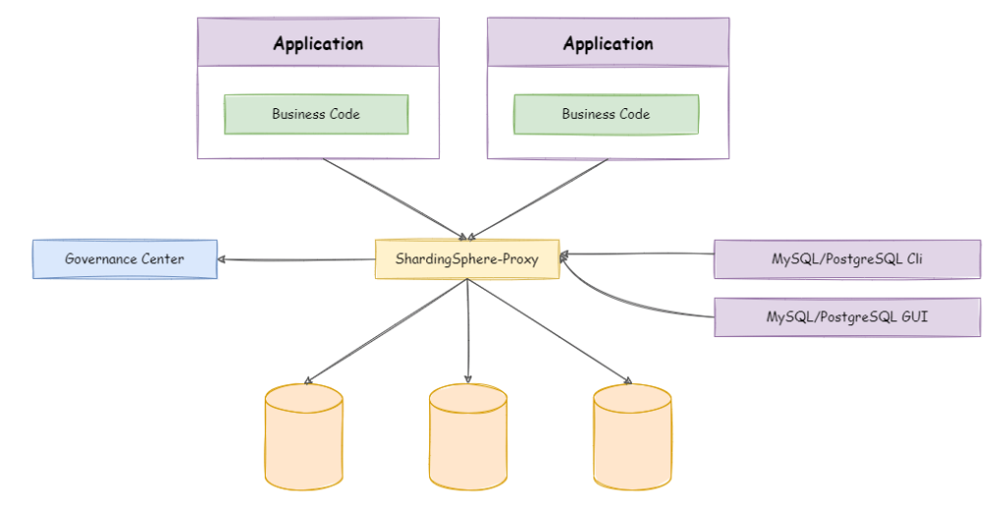

## 对比

|   | ShardingSphere-JDBC | ShardingSphere-Proxy |
| --- | --- | --- |
| 数据库 | 任意 | MySQL/PostgreSQL |
| 连接消耗数 | 高 | 低 |
| 异构语言 | 仅 Java | 任意 |
| 性能 | 损耗低 | 损耗略高 |
| 无中心化 | 是 | 否 |
| 静态入口 | 无 | 有 |

# MySQL 主从同步

## 主从原理

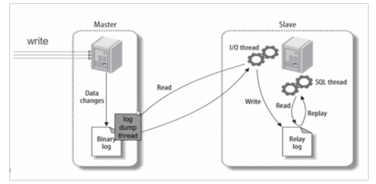

**基本原理：**

slave会从master读取binlog来进行数据同步

**具体步骤：**

1. master将数据改变记录到`二进制日志（binary log）`中。
2. slave 会创建一个 `IO 线程`用来连接master，请求 master 中的 binlog。
3. 当slave连接master时，master会创建一个 `log dump 线程`，用于发送 binlog 的内容。在读取 binlog 的内容的操作中，会对主节点上的 binlog 加锁，当读取完成并发送给从服务器后解锁。
4. IO 线程接收主节点 binlog dump 进程发来的更新之后，保存到 `中继日志（relay log）` 中。
5. slave的`SQL线程`，读取relay log日志，并解析成具体操作，进行重放，从而实现**主从操作一致**，最终数据一致。

## 主从搭建

### 准备三个MySQL

```yaml
services:
  mysql-master:
    image: mysql:8.0.42
    container_name: mysql-master
    environment:
      # 时区上海
      TZ: Asia/Shanghai
      # root 密码
      MYSQL_ROOT_PASSWORD: 123456
    ports:
      - "3606:3306"
    volumes:
      # 数据挂载
      - ./my01/mysql/data/:/var/lib/mysql/
      # 配置挂载
      - ./my01/mysql/conf/:/etc/mysql/conf.d/:ro
    command:
      # 将mysql8.0默认密码策略 修改为 原先 策略 (mysql8.0对其默认策略做了更改 会导致密码无法匹配)
      --default-authentication-plugin=mysql_native_password
      --character-set-server=utf8mb4
      --collation-server=utf8mb4_general_ci
      --explicit_defaults_for_timestamp=true
      --lower_case_table_names=1

  mysql-slave01:
    image: mysql:8.0.42
    container_name: mysql-slave01
    environment:
      # 时区上海
      TZ: Asia/Shanghai
      # root 密码
      MYSQL_ROOT_PASSWORD: 123456
    ports:
      - "3616:3306"
    volumes:
      # 数据挂载
      - ./my02/mysql/data/:/var/lib/mysql/
      # 配置挂载
      - ./my02/mysql/conf/:/etc/mysql/conf.d/:ro
    command:
      # 将mysql8.0默认密码策略 修改为 原先 策略 (mysql8.0对其默认策略做了更改 会导致密码无法匹配)
      --default-authentication-plugin=mysql_native_password
      --character-set-server=utf8mb4
      --collation-server=utf8mb4_general_ci
      --explicit_defaults_for_timestamp=true
      --lower_case_table_names=1
    
  mysql-slave02:
    image: mysql:8.0.42
    container_name: mysql-slave02
    environment:
        # 时区上海
        TZ: Asia/Shanghai
        # root 密码
        MYSQL_ROOT_PASSWORD: 123456
    ports:
        - "3626:3306"
    volumes:
        # 数据挂载
        - ./my03/mysql/data/:/var/lib/mysql/
        # 配置挂载
        - ./my03/mysql/conf/:/etc/mysql/conf.d/:ro
    command:
        # 将mysql8.0默认密码策略 修改为 原先 策略 (mysql8.0对其默认策略做了更改 会导致密码无法匹配)
        --default-authentication-plugin=mysql_native_password
        --character-set-server=utf8mb4
        --collation-server=utf8mb4_general_ci
        --explicit_defaults_for_timestamp=true
        --lower_case_table_names=1
```

启动后，停止掉。然后开始配置 1主 2从 规则

### 主机配置

> 默认情况下MySQL的 binlog日志是自动开启的，可以通过如下配置定义一些可选配置

#### 配置文件开启日志

创建 `master.cnf` 文件

```python
[mysqld]
# 服务器唯一id，默认值1； 集群每个人都必须不一样
server-id=1
# 设置日志格式，默认值ROW
binlog_format=STATEMENT
# 二进制日志名，默认binlog
# log-bin=binlog
# 设置需要复制的数据库，默认复制全部数据库
#binlog-do-db=mytestdb1
#binlog-do-db=mytestdb2
# 设置不需要复制的数据库
#binlog-ignore-db=mytestdb3
#binlog-ignore-db=mytestdb4
```

`binlog格式说明：`

- **binlog_format=STATEMENT**：**日志记录**的是主机数据库的`写指令`，**性能高**，但是 **now()** 之类的函数以及获取系统参数的操作会出现主从数据不同步的问题。
- **binlog_format=ROW**（默认）：日志记录的是主机数据库的`写后的数据`，批量操作时性能较差，解决now()或者  user()或者  @@hostname 等操作在主从机器上不一致的问题。
- **binlog_format=MIXED**：是以上两种level的混合使用，`有函数用ROW，没函数用STATEMENT`

#### 创建从机账号

```sql
-- 创建slave用户
CREATE USER 'my_slave'@'%';
-- 设置密码
ALTER USER 'my_slave'@'%' IDENTIFIED BY '123456';
-- 授予复制权限
GRANT REPLICATION SLAVE ON *.* TO 'my_slave'@'%';
-- 刷新权限
FLUSH PRIVILEGES;
```

#### 查询master状态

> 记住这个状态位置。从机从这个文件的这个位置开始同步

```java
SHOW MASTER STATUS;
```

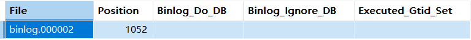

### 从机配置

> 无论多少从机，下面配置都是一样的

#### 配置文件

> 创建 my.cnf 文件

```java
[mysqld]
# 服务器唯一id，每台服务器的id必须不同，如果配置其他从机，注意修改id
server-id=2
# 中继日志名，默认xxxxxxxxxxxx-relay-bin
#relay-log=relay-bin
```

#### 指定主机位置

> 登录到从机，执行如下SQL

```java
CHANGE MASTER TO MASTER_HOST='mysql-master', 
MASTER_USER='my_slave',MASTER_PASSWORD='123456', MASTER_PORT=3306,
MASTER_LOG_FILE='binlog.000002',MASTER_LOG_POS=0; 
```

### 从机启动同步&查看状态

> 登录到从机，执行如下SQL

```sql
START SLAVE;
SHOW SLAVE STATUS;
```

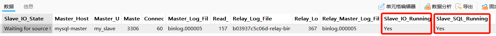

确保两个 线程RUNNING。 否则就看后面的错误原因：

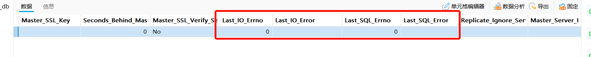

## 验证效果

只需要在主机创建数据库、创建表、CRUD数据，从库就能看到

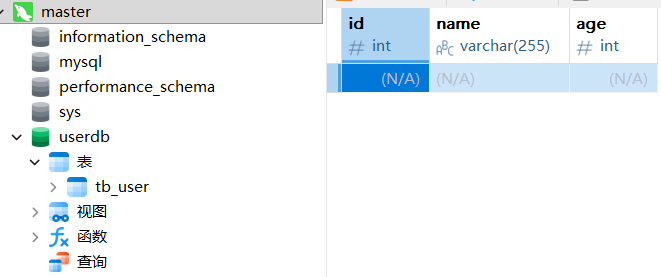

# 两个场景

## 读写分离

### 基本环境

1. 创建 userdb 库，以及 tb_user表。
2. mybatix 逆向生成 对应的代码

### 引入依赖

```xml
<dependency>
    <groupId>org.apache.shardingsphere</groupId>
    <artifactId>shardingsphere-jdbc</artifactId>
    <version>5.5.2</version>
</dependency>
```

### 配置文件

#### SpringBoot配置

```properties
# 配置 DataSource Driver
spring.datasource.driver-class-name=org.apache.shardingsphere.driver.ShardingSphereDriver
# 指定 YAML 配置文件
spring.datasource.url=jdbc:shardingsphere:classpath:shardingsphere.yaml
```

#### ShardingSphere.yml

```yaml
mode:
  type: Standalone
  repository:
    type: JDBC

dataSources:
  write_ds:
    dataSourceClassName: com.zaxxer.hikari.HikariDataSource
    driverClassName: com.mysql.cj.jdbc.Driver
    jdbcUrl: jdbc:mysql://localhost:3606/userdb
    username: root
    password: 123456
  read_ds_0:
    dataSourceClassName: com.zaxxer.hikari.HikariDataSource
    driverClassName: com.mysql.cj.jdbc.Driver
    jdbcUrl: jdbc:mysql://localhost:3616/userdb
    username: root
    password: 123456
  read_ds_1:
    dataSourceClassName: com.zaxxer.hikari.HikariDataSource
    driverClassName: com.mysql.cj.jdbc.Driver
    jdbcUrl: jdbc:mysql://localhost:3626/userdb
    username: root
    password: 123456

rules:
  - !READWRITE_SPLITTING
    dataSources:
      readwrite_ds:
        writeDataSourceName: write_ds
        readDataSourceNames:
          - read_ds_0
          - read_ds_1
        transactionalReadQueryStrategy: PRIMARY # 事务内读请求的路由策略，可选值：PRIMARY（路由至主库）、FIXED（同一事务内路由至固定数据源）、DYNAMIC（同一事务内路由至非固定数据源）。默认值：DYNAMIC
        loadBalancerName: random
    loadBalancers:
      random:
        type: RANDOM
  
 props:
  sql-show: true
```

### 测试

读写分离、负载均衡测试

```sql
    /**
     * 写入数据的测试
     */
    @Test
    public void testInsert(){

        User user = new User();
        user.setUname("张三丰");
        userMapper.insert(user);
    }
    
    /**
     * 负载均衡测试
     */
    @Test
    public void testSelect(){
    
        for (int i = 0; i < 100; i++) {
            User user1 = userMapper.selectById(1);
        }
    }
```

### 更多负载均衡算法

```yaml
rules:
  - !READWRITE_SPLITTING
    loadBalancers:
      random:
        type: RANDOM
      round_robin:
        type: ROUND_ROBIN
      weight:
        type: WEIGHT
        props:
          read_ds_0: 1
          read_ds_1: 2
```

## 分库分表

### 基本环境

> 把一下的库和表创建为两库两表； `db_order_0`、`db_order_1`、`t_order_0`、`t_order_1`

```sql
CREATE DATABASE db_order;
USE db_order;
CREATE TABLE t_order (
  id BIGINT,
  order_no VARCHAR(30),
  user_id BIGINT,
  total_amount INT,
  PRIMARY KEY(id) 
);

CREATE TABLE t_order_item (
  id BIGINT,
  order_no VARCHAR(30),
  user_id BIGINT,
  product_name VARCHAR(30),
  price INT,
  num INT,
  PRIMARY KEY(id) 
);
```

### 配置文件

> 核心注意：

```yaml
dataSources:
  ds_0:
    dataSourceClassName: com.zaxxer.hikari.HikariDataSource
    driverClassName: com.mysql.jdbc.Driver
    standardJdbcUrl: jdbc:mysql://localhost:3306/demo_ds_0
    username: root
    password: 123456
  ds_1:
    dataSourceClassName: com.zaxxer.hikari.HikariDataSource
    driverClassName: com.mysql.jdbc.Driver
    standardJdbcUrl: jdbc:mysql://localhost:3306/demo_ds_1
    username: root
    password: 123456

rules:
- !SHARDING
  tables:
    t_order: 
      actualDataNodes: ds_${0..1}.t_order_${0..1}
      tableStrategy: 
        standard:
          shardingColumn: order_id
          shardingAlgorithmName: t_order_inline
      keyGenerateStrategy:
        column: order_id
        keyGeneratorName: snowflake

    t_order_item:
      actualDataNodes: ds_${0..1}.t_order_item_${0..1}
      tableStrategy:
        standard:
          shardingColumn: order_id
          shardingAlgorithmName: t_order_item_inline
      keyGenerateStrategy:
        column: order_item_id
        keyGeneratorName: snowflake
  bindingTables:
    - t_order,t_order_item
  defaultDatabaseStrategy:
    standard:
      shardingColumn: user_id
      shardingAlgorithmName: database_inline
  defaultTableStrategy:
    none:
  
  shardingAlgorithms:
    database_inline:
      type: INLINE
      props:
        algorithm-expression: ds_${user_id % 2}
    t_order_inline:
      type: INLINE
      props:
        algorithm-expression: t_order_${order_id % 2}
    t_order_item_inline:
      type: INLINE
      props:
        algorithm-expression: t_order_item_${order_id % 2}
  keyGenerators:
    snowflake:
      type: SNOWFLAKE

- !BROADCAST
  tables:
    - t_address

props:
  sql-show: false

```

### 绑定表

`绑定表：`指分片规则一致的一组分片表。 **使用绑定表进行多表关联查询时，必须使用分片键进行关联**，否则会出现笛卡尔积关联或跨库关联，从而影响查询效率。

### 广播表

指所有的分片数据源中都存在的表，表结构及其数据在每个数据库中均完全一致。 适用于数据量不大且需要与海量数据的表进行关联查询的场景，例如：字典表。

广播具有以下特性：

（1）插入、更新操作会实时在所有节点上执行，保持各个分片的数据一致性

（2）查询操作，只从一个节点获取

（3）可以跟任何一个表进行 JOIN 操作