# 9. Camunda

官方文档：https://docs.camunda.org/manual/latest/

# Camunda 基础

## 流程引擎

> **流程引擎负责推进流程的执行**。写代码可以永远只查询当前要做什么即可。
> 
> 流程引擎记录流程的执行历史；

> 有些大业务流程很长； 但是每一步什么时候做不一定。谁来做也不一定，做的时候产生哪些数据也不一定。
> 
> 却具有一定的**大体流程**：  OA办公系统；请假；
> 
> 1. 员工提交请假申请表
> 2. 组长审核： 组长动态决定是否通过
>   1. 请假 1天以内； 组长通过即可
>   2. 请假 1-3天以内：再部门经理审批
>   3. 请假 3天以上：老板审批
> 3. HR进行入档，计算绩效考核
> 
> 下一步要进行上一步就结束

> 常规编码的业务流程，都是方法之间的互相调用。即时性。

a() ==> b() ==> c();

## 历史因素

> 简述 BPMN && CMMN && DMN 协议区别以及应用场景

他们的始祖其实都是JBPM，只不过在后期发展的时候从 activiti5 开始，由于各种原因，产生了 camunda 以及 flowable

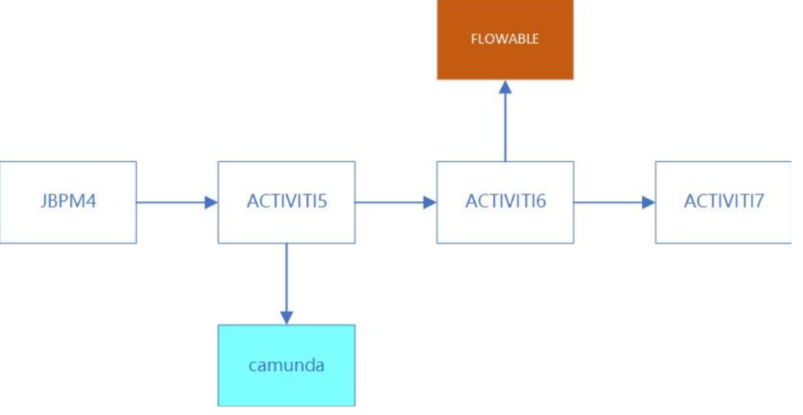

- **PVM** ：Process   Virtual   Machine ； **流程虚拟机**
- **BPMN**** **： Business Process Management And Notation 业务流程管理和符号；  **流程管理（流程引擎）**
- **CMMN **： Case Management Mode And Notation 案例管理模型和符号；  **案例管理**
- **DMN **： Decision Management And Notation 决策管理和符号； **业务决策管理（规则引擎 Drools）**

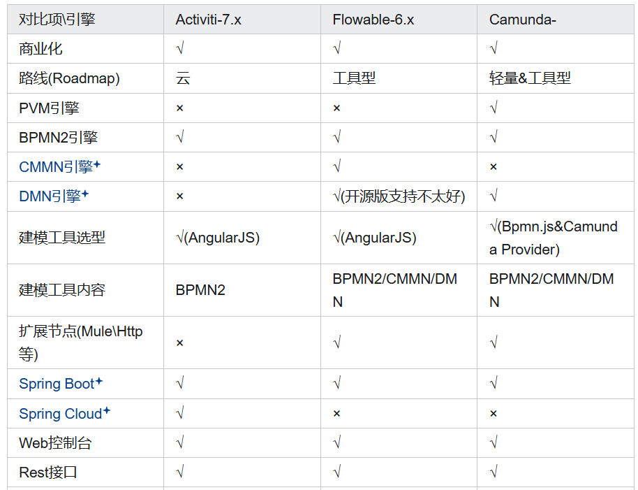

## Camunda 结构

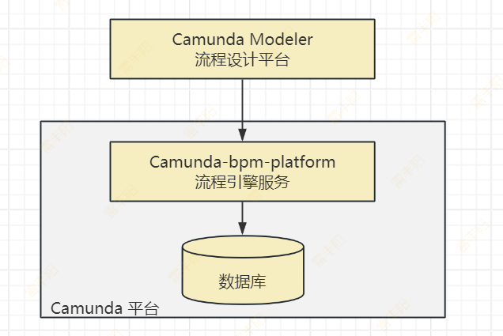

## 流程引擎架构

**Object Relation Mapping**：Hibernate框架是一个**ORM（全自动）**；（对象和数据库表进行绑定）

**MyBatis**：**SQL映射**框架；

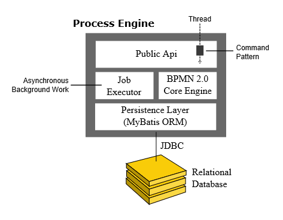

## 安装 Camunda

```yaml
services:
  camunda:
    image: camunda/camunda-bpm-platform:tomcat-7.23.0
    container_name: camunda
    ports:
      - "18080:8080"
      - "18000:8000"
      - "19404:9404"
```

## 访问 Camunda

快速入门：http://localhost:18080/camunda-welcome/

管理后台：http://localhost:18080/camunda    **demo/demo**

- **BPMN 引擎**：执行 BPMN 2.0 流程定义
- **DMN 引擎**：执行 DMN 决策表
- **CMMN 引擎**：执行 CMMN 案例模型
- **Workflow API**：可以用 Java 或 `REST API` 启动流程、完成任务等
  - 你的产品只要提供了 REST API（发HTTP请求），适配了所有语言；跨平台
- **Web 应用**
  - **Cockpit**：监控、管理运行时流程；

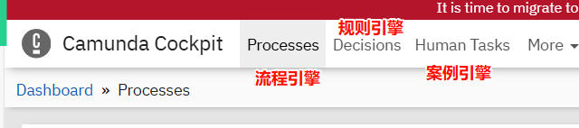

  

  - **Tasklist**：用户处理待办任务
  - **Admin**：用户与权限管理

## Camunda Modeler

> 流程设计器； 下载桌面端

https://docs.camunda.io/docs/components/modeler/desktop-modeler/

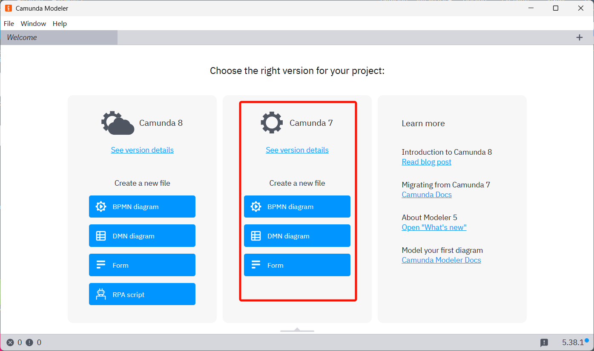

## 交互方式

> 一个流程定义，启动很多流程实例

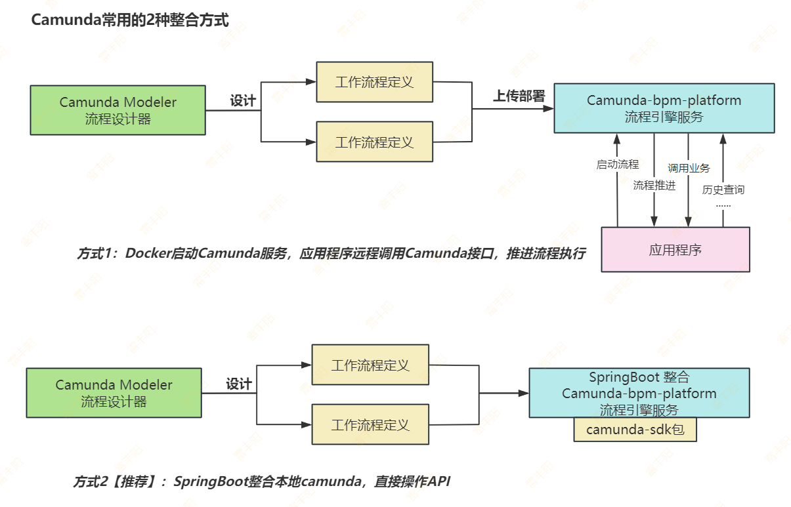

# 核心概念

## **概念**

- **流程（PROCESS）** : 通过工具建模最终生成的BPMN文件，里面有整个**流程的定义**
- **流程实例（Instance）** ：流程启动后的实例
- **流程变量（Variables）** ：**流程任务之间传递的参数**
- **任务（TASK）** ：流程中定义的每一个节点
  - 用户任务：人工审核
  - 系统任务：代码任务
- **流程部署** ：将之前流程定义的 `.bpmn文件` 部署到**工作流平台**

**流程定义文件** ===> 部署工作流平台 ===> 请假v-emp版本**部署** ===> v1部署一个**流程实例**

                                                    ===> 请假v-leader版本**部署 **===> v2部署一个**流程实例**

                                                    ===> 请假v-hr版本**部署** ===> v3部署一个**流程实例**

## **核心组件**

- **Process Engine** -流程引擎
- **Web Applicatons** - 基于web的管理页面
- **调用****流程引擎服务****有三种方式**：
  - 通过 Camunda Web 控制台界面
  - 通过官方 rest 接口操作 camunda 流程引擎，Camunda Platform REST API 官方说明文档：[<u>Camunda Platform REST API</u>](https://docs.camunda.org/rest/camunda-bpm-platform/7.19/)
  - `Java 代码调用 Camunda 提供的 Service 接口`（如：org.camunda.bpm.engine.RuntimeService、org.camunda.bpm.engine.TaskService 等等）

## API介绍

https://docs.camunda.org/manual/latest/

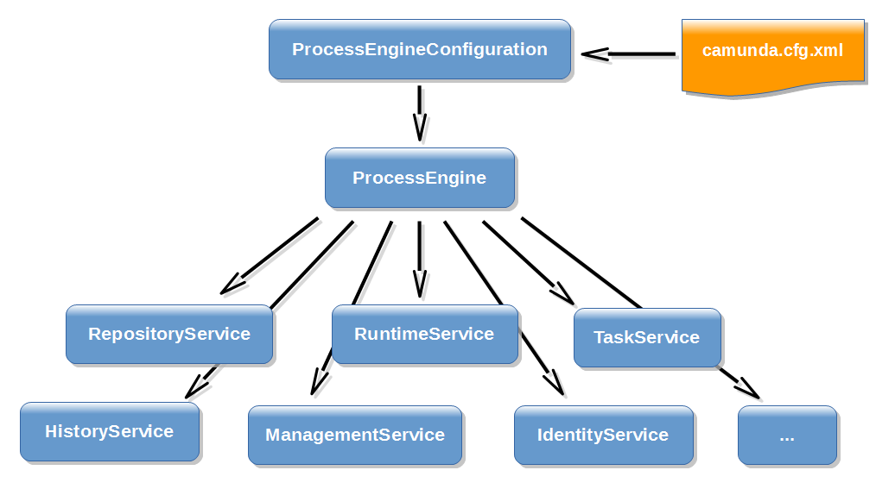

```java
//1、获取默认的流程引擎
ProcessEngine processEngine = ProcessEngines.getDefaultProcessEngine();

RepositoryService repositoryService = processEngine.getRepositoryService();
RuntimeService runtimeService = processEngine.getRuntimeService();
TaskService taskService = processEngine.getTaskService();
IdentityService identityService = processEngine.getIdentityService();
FormService formService = processEngine.getFormService();
HistoryService historyService = processEngine.getHistoryService();
ManagementService managementService = processEngine.getManagementService();
FilterService filterService = processEngine.getFilterService();
ExternalTaskService externalTaskService = processEngine.getExternalTaskService();
CaseService caseService = processEngine.getCaseService();
DecisionService decisionService = processEngine.getDecisionService();
```

### **Repository****Service**

> - 管理流程定义（BPMN）、部署、模板等静态资源（Definition 层）
> - 主要负责**部署流程、查询流程定义、读取模型文件**等。

```java
// 部署一个 BPMN 文件
Deployment deployment = repositoryService.createDeployment()
    .addClasspathResource("my-process.bpmn")
    .name("My Deployment")
    .deploy();

// 查询流程定义
ProcessDefinition procDef = repositoryService.createProcessDefinitionQuery()
    .processDefinitionKey("my_process_key")
    .latestVersion()
    .singleResult();
```

### **Runtime****Service**

> - **运行**时管理**流程实例**（Instance 层）
> - **启动流程**、**管理运行中的流程实例**和执行对象（Execution）
> - **设置与获取流程变量**（Process Variables）
> - 触发消息、信号、定时事件等。

```java
// 启动流程实例
ProcessInstance pi = runtimeService.startProcessInstanceByKey("my_process_key", variables);

// 根据条件查询运行中的实例
runtimeService.createProcessInstanceQuery()
    .processInstanceId(pi.getId())
    .singleResult();

// 设置变量
runtimeService.setVariable(pi.getId(), "amount", 2000);
```

### **Task****Service**

> - 管理**用户任务**（User Task）
> - 查询、拾取、完成任务，管理任务候选人、参与人等。

```java
// 查询任务（未拾取）
List<Task> tasks = taskService.createTaskQuery()
    .taskCandidateUser("demo") //查询分配给这个用户的任务
    .list();

// 拾取任务
taskService.claim(taskId, "demo");

// 完成任务
taskService.complete(taskId, variables);
```

### **Identity****Service**

> - 管理**用户、组**及其关系（身份管理）
> - 可用于 Task 权限分配（candidateUser、candidateGroup 等）
> - 如果不集成外部用户体系，可以直接用这个管理用户。

```sql
// 创建用户
User user = identityService.newUser("john");
user.setFirstName("John");
user.setLastName("Doe");
identityService.saveUser(user);

// 创建组并关联用户
Group group = identityService.newGroup("managers");
identityService.saveGroup(group);
identityService.createMembership("john", "managers");
```

### **Form****Service**

> - 提供与表单相关的 API
> - 获取启动表单、任务表单的元数据，并提交表单数据
> - 常与 TaskList 前端配合使用。

```java
// 获取任务表单 Key
String formKey = formService.getTaskFormKey(task.getProcessDefinitionId(), task.getTaskDefinitionKey());

// 提交启动表单
formService.submitStartForm(processDefinitionId, variables);

// 提交任务表单
formService.submitTaskForm(taskId, variables);
```

### **History****Service**

> - 查询历史流程实例、历史任务、历史变量等（已完成或进行中的都可能记录）
> - 用于 BI、统计、追溯功能。

```java
// 查询结束的流程实例
List<HistoricProcessInstance> historyList = historyService
    .createHistoricProcessInstanceQuery()
    .finished()
    .list();

// 查询历史变量
List<HistoricVariableInstance> vars = historyService
    .createHistoricVariableInstanceQuery()
    .processInstanceId(procInstId)
    .list();
```

### **Management****Service**

> - 管理引擎内部资源和任务，比如数据库作业（jobs）、自定义命令等
> - 通常用于**定时器、失败重试、异步任务的管理**。

```java
// 查询失败的作业
List<Job> failedJobs = managementService.createJobQuery().withException().list();

// 执行指定 Job（跳过等待时间）
managementService.executeJob(jobId);
```

### **Filter****Service**

> - 管理和执行**任务**过滤器（Filter）
> - Filter 是 TaskList 界面保存的任务查询条件，可复用。

```java
// 查询某个过滤器
Filter filter = filterService.getFilter(filterId);

// 执行过滤器查询
List<Task> tasks = filterService.list(filter.getId());
```

### **ExternalTask****Service**

> - 处理 **外部任务（External Task）**
> - 外部任务由外部 worker 轮询拉取并执行，不会阻塞引擎线程（适合微服务或跨语言调用）

```java
// 查询外部任务
List<ExternalTask> tasks = externalTaskService.createExternalTaskQuery().list();

// 完成外部任务
externalTaskService.complete(taskId, workerId, variables);
```

> **外部 Worker 通常用官方 Java/NodeJS 客户端去订阅 topic，然后调用 **`REST API`** 完成任务。**

### **Case****Service**

> - 管理 **CMMN**（Case Management Model and Notation）案例
> - 启动、执行、手动触发 CMMN 案例中的任务和阶段。

```java
// 启动一个 Case 实例
CaseInstance caseInstance = caseService.createCaseInstanceByKey("my_case_key");

// 完成一个 Case 任务
caseService.completeCaseExecution(caseExecutionId);
```

### DecisionService

**Camunda DMN 方式**

- 决策表（key=loan-approval）：

> - 执行 **DMN 决策表**，获取决策结果
> - 常用于业务规则判断，比如审批是否通过、计算费率等。

```java
// 根据 Key 评估决策表
DmnDecisionTableResult result = decisionService.evaluateDecisionTableByKey(
    "my_decision_key",
    Variables.createVariables().putValue("amount", 5000)
);
String decision = result.getSingleResult().getSingleEntry();
```

> **DMN 在 Camunda 中可以用作简单到中等复杂度的业务规则引擎，在某些场景下可以替代 ****Drools****，但它并不完全等同于 Drools 的功能。****Drools****支持复杂推理（forward/backward chaining），功能更强，但调试相对复杂**

## SpringBoot版本适配

> https://docs.camunda.org/manual/latest/user-guide/spring-boot-integration/version-compatibility/

# SpringBoot整合

官方初始化器：https://start.camunda.com/

## 创建项目

> 在已有的 `SpringBoot` 项目中进行测试

### 引入依赖

```xml
<dependency>
    <groupId>org.camunda.bpm.springboot</groupId>
    <artifactId>camunda-bpm-spring-boot-starter</artifactId>
    <version>7.23.0</version>
</dependency>

<!-- 如果是轻量级整合 camunda，则不用导入以下依赖 -->
<dependency>
    <groupId>org.camunda.bpm.springboot</groupId>
    <artifactId>camunda-bpm-spring-boot-starter-webapp</artifactId>
    <version>7.23.0</version>
</dependency>
<dependency>
    <groupId>org.camunda.bpm.springboot</groupId>
    <artifactId>camunda-bpm-spring-boot-starter-rest</artifactId>
    <version>7.23.0</version>
</dependency>

<!-- 以下两个如果项目中已经存在则不用引-->
<dependency>
    <groupId>org.springframework.boot</groupId>
    <artifactId>spring-boot-starter-jdbc</artifactId>
</dependency>
<dependency>
    <groupId>mysql</groupId>
    <artifactId>mysql-connector-java</artifactId>
</dependency>
```

### 配置文件

> 指定camunda连接上数据源，自动创建自己的数据库

```yaml
spring:
  datasource:
    url: jdbc:mysql://192.168.0.154:3306/camundatest?characterEncoding=UTF-8&useUnicode=true&useSSL=false&zeroDateTimeBehavior=convertToNull&serverTimezone=Asia/Shanghai
    username: root
    password: 123456
    driver-class-name: com.mysql.jdbc.Driver

camunda:
  bpm:
    database:
      type: mysql
      schema-update: true # 是否自动建表，但我测试为true时，创建表会出现，因此还是改成false由手工建表。
    auto-deployment-enabled: false # 自动部署 resources 下的 bpmn文件
    admin-user:
      id: admin
      password: 123456
server:
  port: 8080
```

此配置将导致以下结果：

1. 将创建具有提供的密码和名字的管理员用户 admin/123456。
2. 使用mysql数据库，启动时自动创建数据库。

### 启动应用

> SpringBoot 应用启动，数据库则自动创建。且可以访问应用端口

> 特别注意：Camunda要求数据库隔离级别必须是：`READ COMMITTED`
> 
> `SET GLOBAL TRANSACTION ISOLATION LEVEL READ COMMITTED;`

```sql
Caused by: org.camunda.bpm.engine.ProcessEngineException: ENGINE-12019 The transaction isolation level set for the database is 'REPEATABLE_READ' which differs from the recommended value. Please change the isolation level to 'READ_COMMITTED' or set property 'skipIsolationLevelCheck' to true. Please keep in mind that some levels are known to cause deadlocks and other unexpected behaviours.
        at org.camunda.bpm.engine.impl.cfg.ConfigurationLogger.invalidTransactionIsolationLevel(ConfigurationLogger.java:142)
        at org.camunda.bpm.engine.impl.cfg.ProcessEngineConfigurationImpl.checkTransactionIsolationLevel(ProcessEngineConfigurationImpl.java:1707)
        at org.camunda.bpm.engine.impl.cfg.ProcessEngineConfigurationImpl.initDataSource(ProcessEngineConfigurationImpl.java:1692)
        at org.camunda.bpm.engine.impl.cfg.ProcessEngineConfigurationImpl.init(ProcessEngineConfigurationImpl.java:1149)
        at org.camunda.bpm.engine.impl.cfg.ProcessEngineConfigurationImpl.buildProcessEngine(ProcessEngineConfigurationImpl.java:1120)
        at org.camunda.bpm.engine.spring.SpringTransactionsProcessEngineConfiguration.buildProcessEngine(SpringTransactionsProcessEngineConfiguration.java:65)
        at org.camunda.bpm.engine.spring.ProcessEngineFactoryBean.getObject(ProcessEngineFactoryBean.java:55)
        at org.camunda.bpm.engine.spring.ProcessEngineFactoryBean.getObject(ProcessEngineFactoryBean.java:34)
```

## 绘制流程

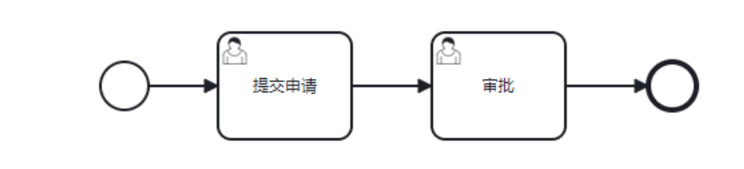

### **任务分类**

> 两种最常用的

#### **用户任务 （User Task）**

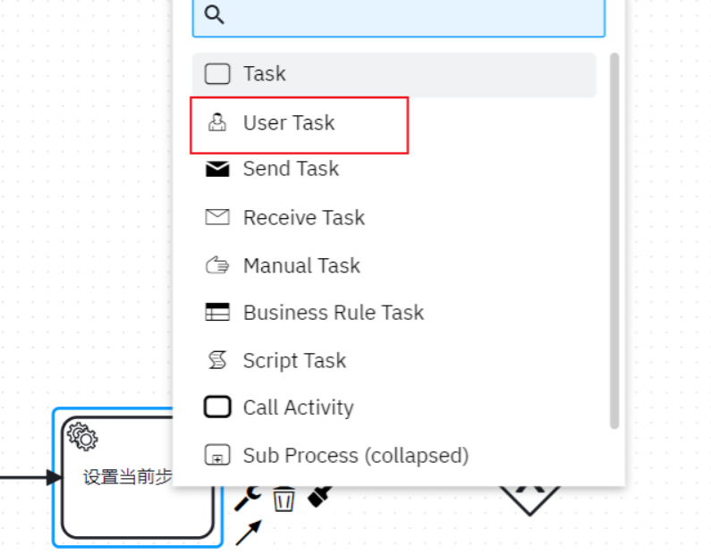

具体来说就是需要手动执行的任务，即需要我们写完业务代码后，调用代码

```java
taskService.complete(taskId, variables);
```

#### **系统任务（Service Task）**

系统会自动帮我们完成的任务

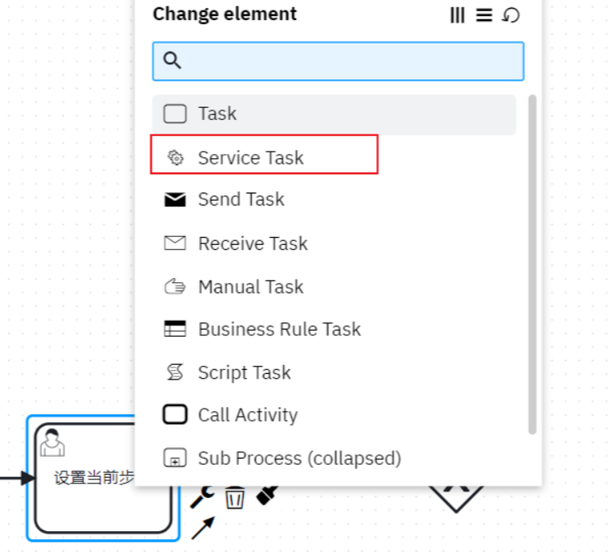

### 网关

分为这么几类，**会根据我们传入的流程变量及设定的条件走**

> - **排他网关（exclusive gateway）[走一个]：**这个网关**只会走一个**，我们走到这个网关时，会从上到下找第一个符合条件的任务往下走
> - **并行网关（Parallel Gateway）【全都走】：**这个网关不需要设置条件，**会走所有的**任务
> - **包含网关（Inclusive Gateway）【随便走】：**这个网关会**走一个或者多个符合条件**的任务

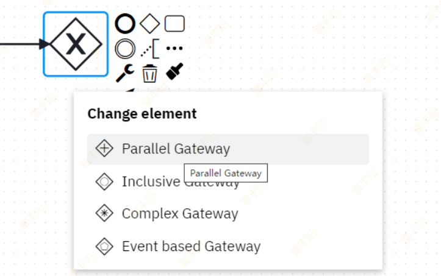

#### 示例

> 如图包含网关，需要在网关的连线初设置表达式 condition，参数来自于流程变量

两个参数：`switch2d `、 `switch3d`

- 如果 都为true，则走任务1，3
- 如果 switch2d 为true switch3d为false，则只走任务1
- 如果 switch3d 为true switch2d为false，则只走任务3
- 如果都为false，则直接走网关，然后结束

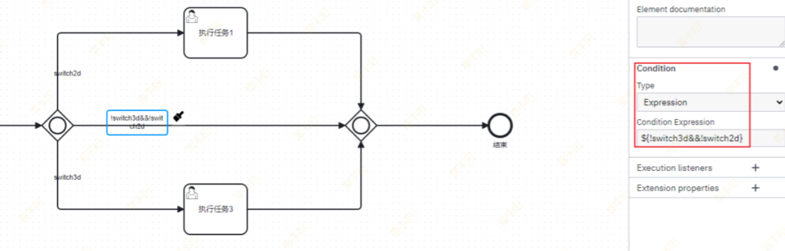

#### 测试

##### 排他网关

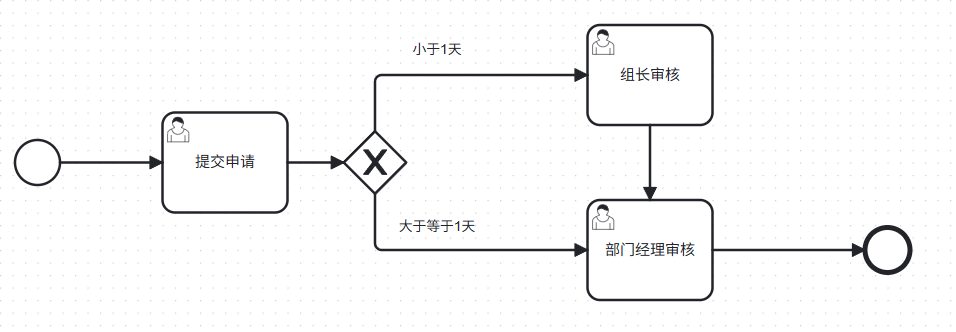

##### 并行网关

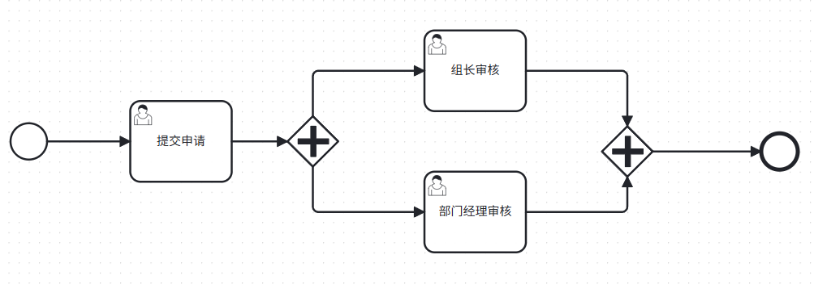

##### 包含网关

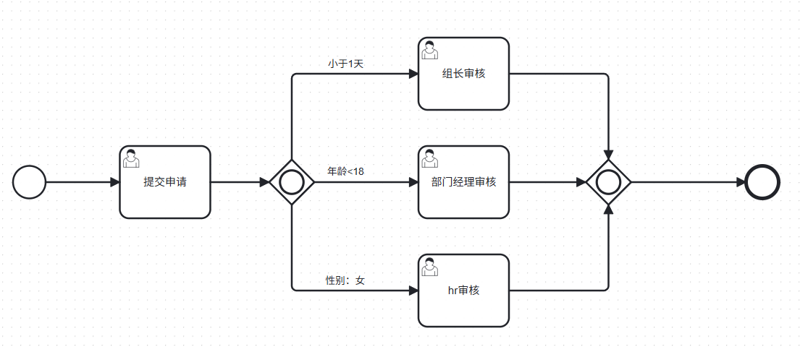

##### 测试代码

```java
package com.lfy.kcat.workflow;

import org.camunda.bpm.engine.RuntimeService;
import org.camunda.bpm.engine.TaskService;
import org.camunda.bpm.engine.runtime.ProcessInstance;
import org.camunda.bpm.engine.task.Task;
import org.junit.jupiter.api.Test;
import org.springframework.beans.factory.annotation.Autowired;
import org.springframework.boot.test.context.SpringBootTest;

import java.util.HashMap;
import java.util.List;
import java.util.Map;

/**
 * @author leifengyang
 * @version 1.0
 * @date 2025/9/8 16:08
 * @description:
 */
@SpringBootTest
public class GatewayTest {
    @Autowired
    RuntimeService runtimeService;

    @Autowired
    TaskService taskService;

    @Test
    void test01(){
       String id = "vocation:1:e029dadc-8c8a-11f0-ae0a-7c10c926b4b6";
        //1、启动流程
        ProcessInstance instance = runtimeService.startProcessInstanceById(id);
        System.out.println("流程实例ID："+instance.getId());

    }

    @Test
    void test02(){
        String processId = "d2e28a49-8c8b-11f0-8b36-7c10c926b4b6";
        Task task = taskService.createTaskQuery()
            .processInstanceId(processId)
            .singleResult();
        System.out.println("taskId："+task.getId());
        System.out.println("taskName："+task.getName());

        //领任务
        taskService.claim(task.getId(), "leifengyang");

        //完成任务
        Map<String, Object> variables = new HashMap<String, Object>();
        variables.put("day",0.5);
        taskService.complete(task.getId(),variables);
        System.out.println("完成任务");
    }


    @Test
    void test03(){
        String id = "vocation:2:a42280b0-8c8c-11f0-8678-7c10c926b4b6";
        //1、启动流程
        ProcessInstance instance = runtimeService.startProcessInstanceById(id);
        System.out.println("流程实例ID："+instance.getId());
    }


    @Test
    void test04(){
        String processId = "d33b15dc-8c8c-11f0-8c4d-7c10c926b4b6";
        Task task = taskService.createTaskQuery()
            .processInstanceId(processId)
            .singleResult();
        System.out.println("taskId："+task.getId());
        System.out.println("taskName："+task.getName());

        //领任务
        taskService.claim(task.getId(), "leifengyang");

        //完成任务
        taskService.complete(task.getId());
        System.out.println("完成任务");
    }


    @Test
    void test05(){
        String processId = "d33b15dc-8c8c-11f0-8c4d-7c10c926b4b6";
        List<Task> list = taskService.createTaskQuery()
            .processInstanceId(processId)
            .list();

        //必须所有任务全部结束，到汇聚点
        for (Task task : list) {
            System.out.println("taskId："+task.getId());
            System.out.println("taskName："+task.getName());
            taskService.complete(task.getId());
        }
    }


    //测试包含网关：vocation:3:0d57d5d3-8c8e-11f0-bb7f-7c10c926b4b6
    @Test
    void test06(){
        String id = "vocation:3:0d57d5d3-8c8e-11f0-bb7f-7c10c926b4b6";
        //1、启动流程
        ProcessInstance instance = runtimeService.startProcessInstanceById(id);
        System.out.println("流程实例ID："+instance.getId());
        //
    }

    @Test
    void test07(){
        String processId = "32339006-8c8e-11f0-87a3-7c10c926b4b6";
        Task task = taskService.createTaskQuery()
            .processInstanceId(processId)
            .singleResult();

        System.out.println("taskId："+task.getId());
        System.out.println("taskName："+task.getName());

        //领任务
//        taskService.claim(task.getId(), "leifengyang");

        //完成任务
        Map<String, Object> variables = new HashMap<String, Object>();
        variables.put("day",0.5);
        variables.put("age",15);
        variables.put("gender","男");
        taskService.complete(task.getId(),variables);
        System.out.println("完成任务");


    }

    @Test
    void test08(){
        String processId = "32339006-8c8e-11f0-87a3-7c10c926b4b6";
        List<Task> list = taskService.createTaskQuery()
            .processInstanceId(processId)
            .list();

        for (Task task : list) {
            System.out.println("taskId："+task.getId());
            System.out.println("taskName："+task.getName());
            taskService.complete(task.getId());
        }
    }
}
```

## 引入项目

### 引入流程定义

> 将画好的流程图保存文件为 test_1.bpmn，在刚才的springboot项目中resources新建一个bpmn文件夹，放进去

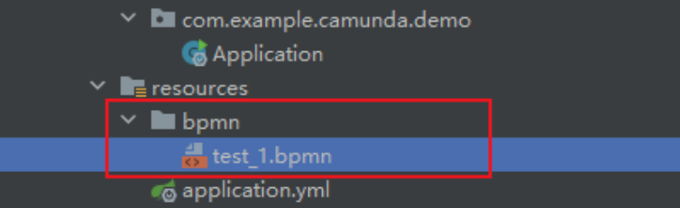

### demo开发

> 写个Controller

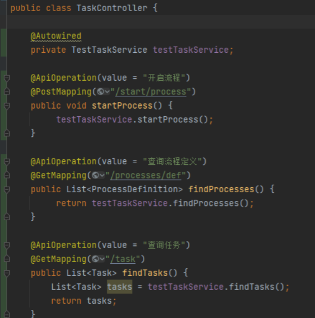

> 具体Service

```typescript
public void startProcess() {
    ProcessInstance instance = runtimeService.startProcessInstanceByKey("key");
    System.out.println(instance.toString());
}

public List<ProcessDefinition> findProcesses() {
    return repositoryService.createProcessDefinitionQuery().list();
}

public List<Task> findTasks() {
    return taskService.createTaskQuery().list();
}
```

## 业务集成及各种API

> 业务集成及各种API（变量传递、自动任务）的使用

> 流程框架工作原理

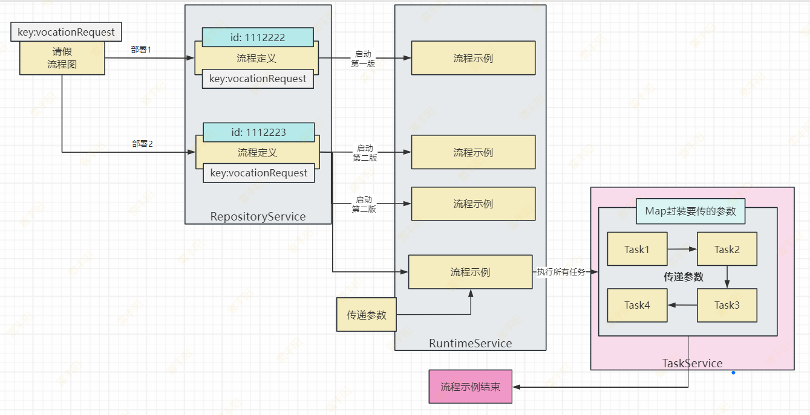

### 流程API

#### 创建流程

> 会同时创建第一个任务

```java
ProcessInstance instance = runtimeService.startProcessInstanceByKey(processKey, params);
```

#### 暂停流程

> 流程暂停后，再执行相关任务会报错，需要先重新激活任务

```java
runtimeService.suspendProcessInstanceById(instance.getId());
```

#### **重新激活流程**

```java
runtimeService.activateProcessInstanceById(instance.getId());
```

#### 删除流程

```java
runtimeService.deleteProcessInstance(instance.getId(), "手动删除");
```

以上都可以在流程历史表 `act_hi_procinst` 里查询

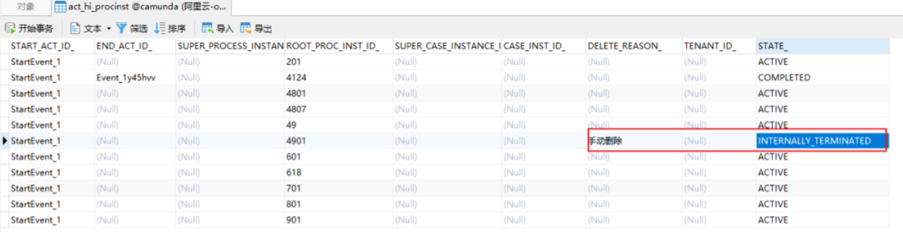

### 任务API

> 基于service的查询类，都可先构建一个 query，然后在附上查询条件

```java
List<ProcessDefinition> list = repositoryService.createProcessDefinitionQuery().list();
List<Task> list = taskService.createTaskQuery().taskAssignee("zhangsan").list();
List<ProcessInstance> instances = runtimeService.createProcessInstanceQuery().listPage(1, 10);
```

#### 查询历史任务

```java
List<HistoricProcessInstance> list = historyService.createHistoricProcessInstanceQuery().list();
```

#### **查询当前任务/分页**

```java
List<Task> list = taskService.createTaskQuery().orderByTaskCreateTime().desc().list();
```

#### 任务回退

大体思路是拿到当前的任务，及当前任务的上一个历史任务，然后重启

```java
 Task activeTask = taskService.createTaskQuery()
                .taskId(taskId)
                .active()
                .singleResult();
List<HistoricTaskInstance> historicTaskInstance = historyService
        .createHistoricTaskInstanceQuery()
        .processInstanceId(instanceId)
        .orderByHistoricActivityInstanceStartTime()
        .desc()
        .list();

List<HistoricTaskInstance> historicTaskInstances = historicTaskInstance.stream()
    .filter(v -> !v.getTaskDefinitionKey().equals(activeTask.getTaskDefinitionKey()))
    .toList();

Assert.notEmpty(historicTaskInstances, "当前已是初始任务！");
HistoricTaskInstance curr = historicTaskInstances.get(0);

runtimeService.createProcessInstanceModification(instanceId)
        .cancelAllForActivity(activeTask.getTaskDefinitionKey())
        .setAnnotation("重新执行")
        .startBeforeActivity(curr.getTaskDefinitionKey())
        .execute();
```

### 流程变量

包括流程中产生的变量信息，包括控制流程流转的变量，网关、业务表单中填写的流程需要用到的变量等。很多地方都要用到

#### **流程变量变量传递**

变量最终会存在 `act_ru_variable` 这个表里面

在绘制流程图的时候，如果是用户任务（userService） 可以设置变量，比如执行人，

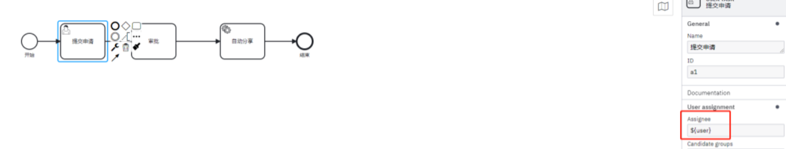

#### **几种写法**

- 写死，就比如 zhangsan
- 表达式，比如上面写的 `${user}`，这种需要传入参数，其实就是启动参数的时候传入，传入参数，可选值为一个`Map<String, Object>`，之后的流程可查看次参数，上面写的是 user， 所以map里面的key需要带着user，不然会报错。

> 关于扩展变量，可在流程图绘制这么设定，传递方式还是一样，流程图里面在下面写：

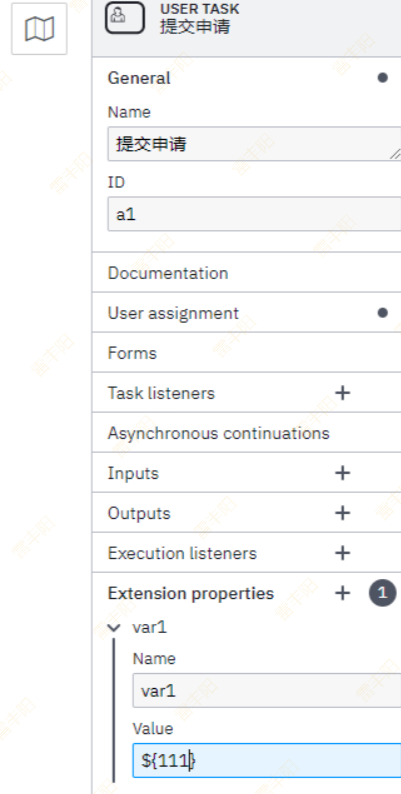

> 启动流程：传入变量

```java
ProcessInstance instance = runtimeService.startProcessInstanceByKey(key, new HashMap<>());
```

> 变量设置

```java
runtimeService.setVariable(instance.getId(), Constants.PATIENT_ID, relatedId);
```

> 变量查询

```java
 Object variable = runtimeService.getVariable(instance.getId(), Constants.GENERAL_ID);
```

> 历史变量查询

```java
HistoricVariableInstance variableInstance = historyService.createHistoricVariableInstanceQuery().processInstanceId(bo.getId().toString()).
            variableName(Constants.PATIENT_ID).singleResult();
//变量值
variableInstance.getValue();
//变量名称
variableInstance.getName();
```

### 两种任务

> 针对后端来说任务类型主要有两种。

> > **用户任务-userTask**
> > 
> > 即需要用户参与的任务，因为工作流执行过程中需要涉及到审批、过审之类的需要用户参与的任务，这个时候需要用户参与，然后调用接口完成任务。
> > 
> > **服务任务-serviceTask**
> > 
> > 即自动执行的任务，比如用户提交后，系统自动存储、修改状态等自动完成的任务。

#### **Type**

任务类型是关键，可根据配型配置实现调用 java的方法，spring 的bean方法等等。有这么几种类型

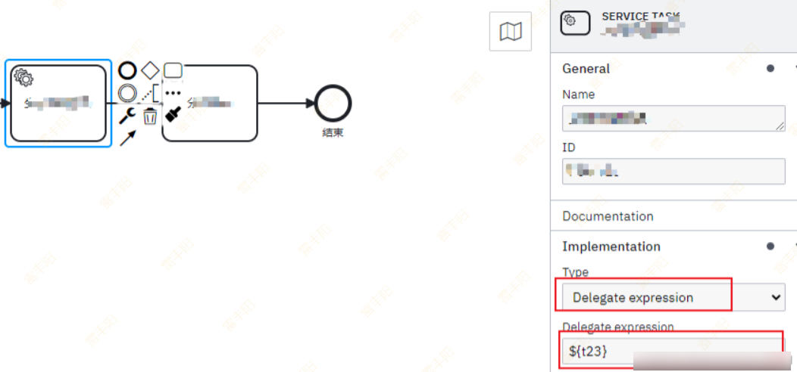

#### **推荐使用 – Delegate Expression !!!**

在系统任务中，因为是自动执行，所以实际应用中需要嵌入各种业务逻辑，可以在流程图设计中，按照下面方式调用java代码执行，在spring中配置同名的bean

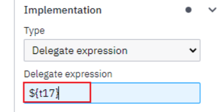

配置表达式，可以实现JavaDelegate接口使用类名配置

1. **快捷写法如下**，比较推荐下面这种，此种可灵活配置bean和spring结合使用，注入service等业务方法

```typescript
@Bean("t17")
JavaDelegate t17() {
    return execution -> {
        Map<String, Object> variables = execution.getVariables();
        Task task = taskService.createTaskQuery().processInstanceId(execution.getProcessInstanceId()).singleResult();
        //业务逻辑
        task.setOwner(String.valueOf(dentistId));
    };
}
```

1. **Java Class ：**配置java类名，需要实现JavaDelegate接口，注意是全路径名，不可以使用Spring的bean配置！！！

```typescript
@Component
public class T17Delegate implements JavaDelegate {
 
    @Override
    public void execute(DelegateExecution execution) throws Exception {
            String taskId = execution.getId();
            String instanceId = execution.getProcessInstanceId();
            Map<String, Object> variables = execution.getVariables();
    }
}
```

# 扩展： BPMN

> BPMN：**BPMN**是由BPMI(The Business Process Management Initiative)开发的一套标准叫**业务流程建模符号**，于2004年5月对外发布了**BPMN** 1.0 规范。后BPMI并入到**OMG组织**，OMG于2011年推出BPMN 2.0标准，对BPMN进行了重新定义(Business Process Model and Notation)。

https://www.processon.com/knowledge/bpmn

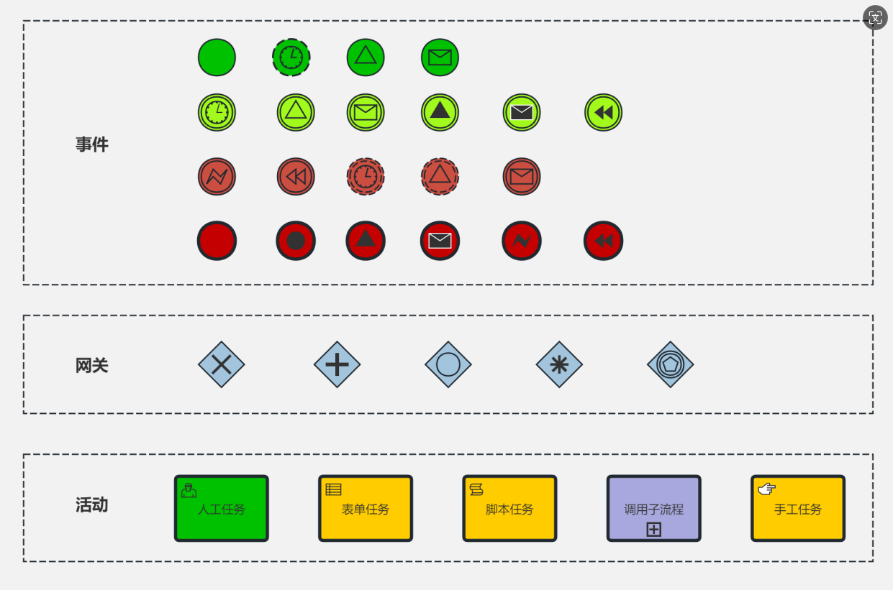

https://www.processon.com/knowledge/bpmn