# 10. Spring Cloud

[📎 SpringCloud.pptx](<files/SpringCloud.pptx>)

> 前置知识： 
> 
> 1. Java17、Maven 
> 
> 2. SpringBoot、SpringMVC、MyBatis 
> 
> 3. Linux、Docker 

# 架构升级过程

## 基础概念

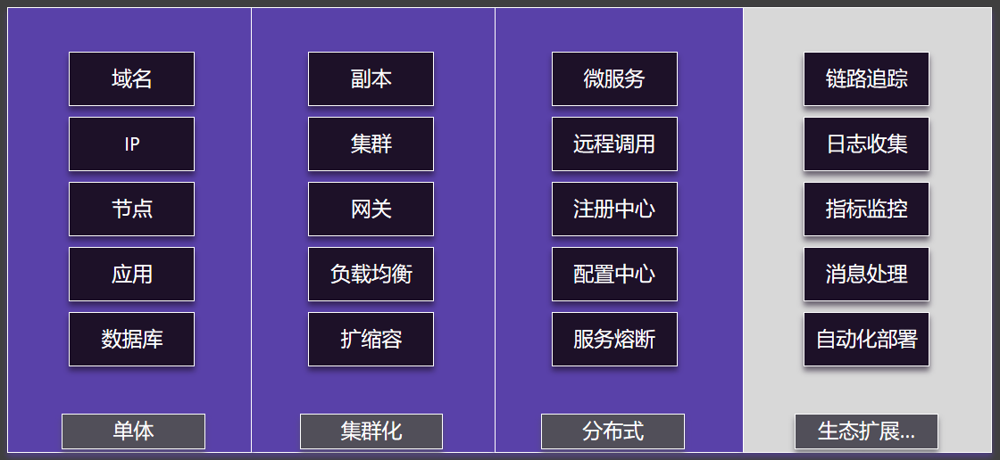

> https://www.bilibili.com/video/BV1UJc2ezEFU

# **分布式基础概念**

## **微服务 **

微服务架构风格，就像是把一个**单独的应用程序**开发为**一套小服务**，每个**小服务**运行在**自己**的**进程**中，并使用轻量级机制通信，通常是 HTTP API。这些服务围绕业务能力来构建，并通过完全自动化部署机制来独立部署。这些服务使用不同的编程语言书写，以及不同数据存储技术，并保持最低限度的集中式管理。 

***简而言之：拒绝大型单体应用，基于业务边界进行服务微化拆分，各个服务独立部署运行。***

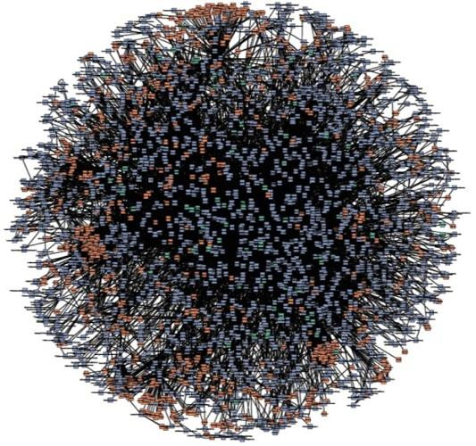

## **集群&分布式&节点**

集群是个物理形态，分布式是个工作方式。 

只要是一堆机器，就可以叫集群，他们是不是一起协作着干活，这个谁也不知道； 

> 《**分布式系统原理与范型**》定义： 
> 
> “分布式系统是若干独立计算机的集合，这些计算机对于用户来说就像单个相关系统” 
> 
> **分布式系统（distributed system）是建立在网络之上的软件系统。 **

**分布式**是指将不同的业务分布在不同的地方。 

**集群**指的是将几台服务器集中在一起，实现同一业务。 

> 例如：**京东是一个分布式系统，众多业务运行在不同的机器**，所有业务构成一个大型的**业务集群**。每一个小的业务，比如用户系统，访问压力大的时候一台服务器是不够的。我们就应该将用户系统部署到多个服务器，也就是**每一个业务系统也可以做集群化**； 

> ***分布式中的每一个节点，都可以做集群。 而集群并不一定就是分布式的。 ***
> 
> > ***节点：集群中的一个服务器***

## **远程调用 **

在分布式系统中，各个服务可能处于不同主机，但是服务之间不可避免的需要互相调用，我们称为远程调用。 

SpringCloud 中使用 HTTP+JSON 的方式完成远程调用

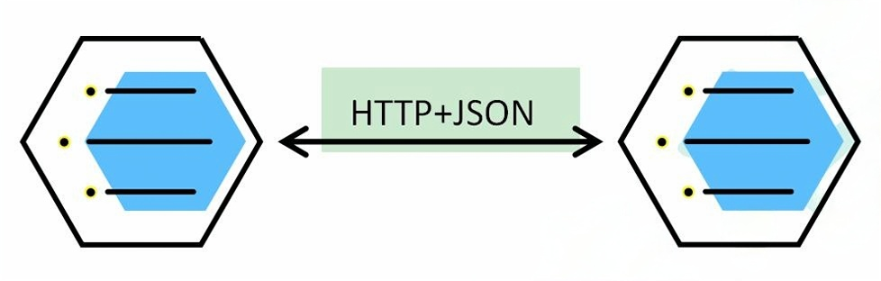

## 负载均衡

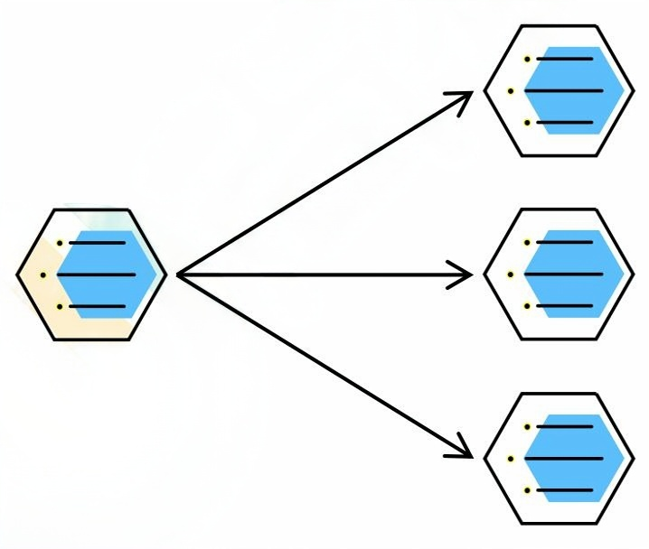

分布式系统中，A 服务需要调用 B 服务，B 服务在多台机器中都存在，A 调用任意一个服务器均可完成功能。 

为了使每一个服务器都不要太忙或者太闲，我们可以负载均衡的调用每一个服务器，提升网站的健壮性。 

> ***常见的负载均衡算法： ***
> 
> 1. **轮询：**为第一个请求选择健康池中的第一个后端服务器，然后按顺序往后依次选择，直到最后一个，然后循环。 
> 2. **最小连接：**优先选择连接数最少，也就是压力最小的后端服务器，在会话较长的情况下可以考虑采取这种方式。 
> 3. **ip_hash：**根据请求源的 IP 的hash来选择要转发的服务器。这种方式可以一定程度上保证特定用户能连接到相同的服务器。如果你的应用需要处理状态而要求用户能连接到和之前相同的服务器，可以考虑采取这种方式

## **服务注册/发现&注册中心**

A 服务调用 B 服务，A 服务并不知道 B 服务当前在哪几台服务器有，哪些正常的，哪些服务已经下线。解决这个问题可以引入注册中心；

如果某些服务下线，我们其他人可以实时的感知到其他服务的状态，从而避免调用不可用的服务

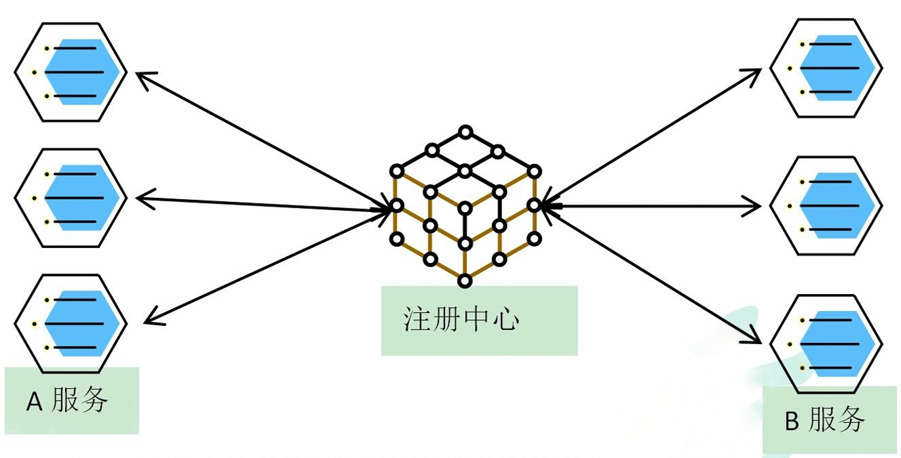

## 配置中心

每一个服务最终都有大量的配置，并且每个服务都可能部署在多台机器上。我们经常需要变更配置，我们可以让每个服务在配置中心获取自己的配置。 

***配置中心用来集中管理微服务的配置信息***

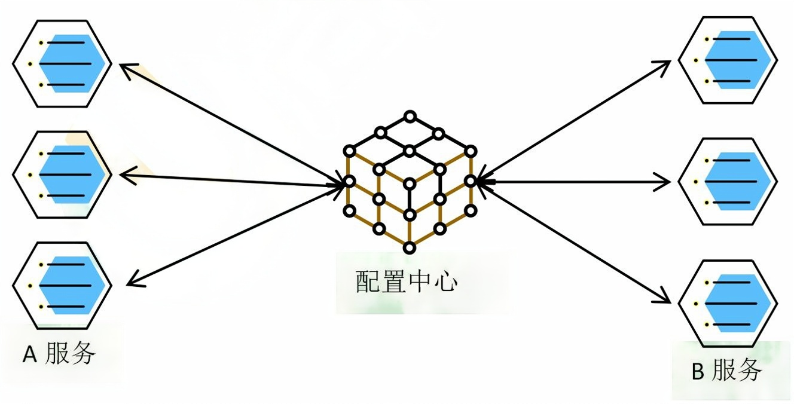

## **服务熔断&服务降级**

在微服务架构中，微服务之间通过网络进行通信，存在相互依赖，当其中一个服务不可用时，有可能会造成雪崩效应。要防止这样的情况，必须要有容错机制来保护服务。

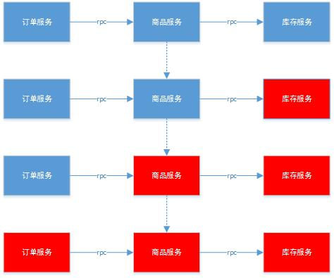

**1）、服务熔断 **

设置服务的超时，当被调用的服务经常失败到达某个阈值，我们可以开启断路保护机制，后来的请求不再去调用这个服务。本地直接返回默认的数据 

**2）、服务降级 **

在运维期间，当系统处于高峰期，系统资源紧张，我们可以让非核心业务降级运行。降级：某些服务不处理，或者简单处理【抛异常、返回 NULL、 调用 Mock 数据、调用 Fallback 处理逻辑】。

## API 网关

在微服务架构中，API Gateway 作为整体架构的重要组件，它***抽象了微服务中都需要的公共功能***，同时提供了客户端**负载均衡**，**服务自动熔断**，**灰度发布**，**统一认证**，**限流流控**，**日志统计**等丰富的功能，帮助我们解决很多 API 管理难题。

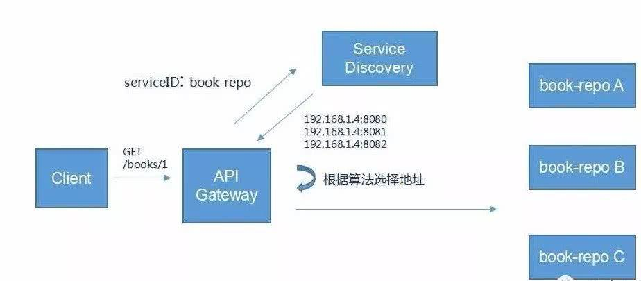

# Spring Cloud & Spring Cloud Alibaba

## 基础环境

### 技术搭配

> **Spring Cloud 系列：** 官⽹：https://spring.io/projects/spring-cloud 
> 
> 1. 远程调⽤：OpenFeign 
> 2. ⽹关：Gateway 

> **Spring Cloud Alibaba 系列： **官⽹：https://sca.aliyun.com/ 
> 
> 1. 注册中⼼/配置中⼼：Nacos 
> 2. 服务保护：Sentinel 
> 3. 分布式事务：Seata

### 版本方案

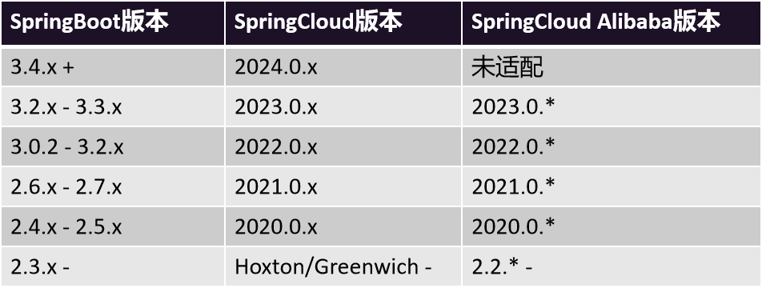

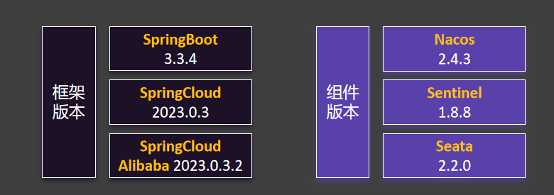

### 工程架构

#### pom.xml

> 创建⽗项⽬引⼊公共依赖

```xml
<?xml version="1.0" encoding="UTF-8"?>
<project xmlns="http://maven.apache.org/POM/4.0.0"
         xmlns:xsi="http://www.w3.org/2001/XMLSchema-instance"
         xsi:schemaLocation="http://maven.apache.org/POM/4.0.0 http://maven.apache.org/xsd/maven-4.0.0.xsd">
    
    <parent>
        <groupId>org.springframework.boot</groupId>
        <artifactId>spring-boot-starter-parent</artifactId>
        <version>3.3.4</version>
        <relativePath/> <!-- lookup parent from repository -->
    </parent>

    <modelVersion>4.0.0</modelVersion>
    
    <groupId>com.lfy</groupId>
    <artifactId>spring-cloud-demo</artifactId>
    <version>1.0</version>
    <packaging>pom</packaging>

    <properties>
        <maven.compiler.source>21</maven.compiler.source>
        <maven.compiler.target>21</maven.compiler.target>
        <project.build.sourceEncoding>UTF-8</project.build.sourceEncoding>
        <spring-cloud.version>2023.0.3</spring-cloud.version>
        <spring-cloud-alibaba.version>2023.0.3.2</spring-cloud-alibaba.version>
    </properties>

    <dependencyManagement>
        <dependencies>
            <dependency>
                <groupId>org.springframework.cloud</groupId>
                <artifactId>spring-cloud-dependencies</artifactId>
                <version>${spring-cloud.version}</version>
                <type>pom</type>
                <scope>import</scope>
            </dependency>
            <dependency>
                <groupId>com.alibaba.cloud</groupId>
                <artifactId>spring-cloud-alibaba-dependencies</artifactId>
                <version>${spring-cloud-alibaba.version}</version>
                <type>pom</type>
                <scope>import</scope>
            </dependency>
        </dependencies>
    </dependencyManagement>

</project>
```

#### 项目结构

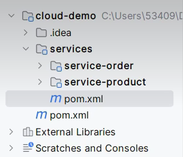

## Nacos：注册中心

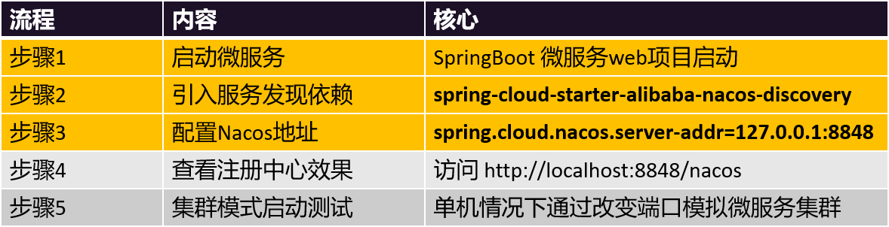

### 快速入门

#### 入门

官⽹：https://nacos.io/zh-cn/docs/v2/quickstart/quick-start.html 

Nacos /nɑ:kəʊs/ 是 Dynamic Naming and Configuration Service的⾸字⺟简称，⼀个更易于构建云原⽣应⽤的**动态服务发现**、**配置管理**和**服务管理**平台。

#### 安装

```java
docker run -d -p 8848:8848 -p 9848:9848 -e MODE=standalone --name nacos nacos/nacos-server:v2.4.3
```

#### 引入依赖

```xml
<dependency> 
     <groupId>com.alibaba.cloud</groupId> 
     <artifactId>spring-cloud-starter-alibaba-nacos-discovery</artifactId> 
</dependency>
```

#### 编写配置

> 在 `application.properties` 中编写

```properties
spring.cloud.nacos.discovery.server-addr=127.0.0.1:8848 
#暂未⽤到配置中⼼功能，需要关闭配置检查 
#spring.cloud.nacos.config.import-check.enabled=false
```

#### 开启注册发现功能

```javascript
@EnableDiscoveryClient //核⼼注解 
@SpringBootApplication 
public class OrderMainApplication { 
    public static void main(String[] args) { 
        SpringApplication.run(OrderMainApplication.class, args); 
    } 
}
```

### 服务注册

> 启动项目，访问：http://localhost:8848/nacos 可以看到服务已经注册上来；


#### 注册更多服务

1. 创建 service-product 服务 （注意：每个微服务端⼝不⼀样 ）
  1. 引⼊ nacos依赖 
  2. 配置 nacos地址信息；
2. 启动应⽤，查看是否注册成功

#### 单服务模拟集群

> 模拟某一种服务，以集群方式启动起来。由于都是在本机，就只能通过不同端口来区分微服务。如果是真实Linux服务器集群。每个微服务就可能拥有不同的地址

以 service-order 为例，启动 order 的三个服务。 

1. idea 搜索 `services `⾯板，添加 SpringBoot 项⽬。 
2. 复制 **OrderMainApplication **三份，每个启动命令重新指定端⼝

查看集群

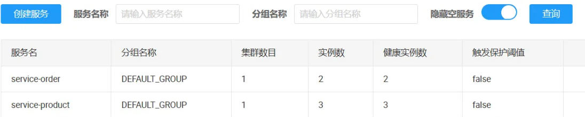

### 服务发现

#### DiscoveryClient

```java
@Autowired 
DiscoveryClient discoveryClient; 

@Test 
void discoveryClientTest(){ 
 
    for (String service : discoveryClient.getServices()) { 
        System.out.println("service = " + service); 
         //获取ip+port 
        List<ServiceInstance> instances = discoveryClient.getInstances(service); 
        for (ServiceInstance instance : instances) { 
            System.out.println("ip："+instance.getHost()+"；"+"port = " + instance.getPort()); 
        }
    }
}
```

#### NacosServiceDiscovery

```java
@Autowired 
NacosServiceDiscovery nacosServiceDiscovery; 

@Test 
void nacosServiceDiscoveryTest() throws NacosException { 
     for (String service : nacosServiceDiscovery.getServices()) { 
        System.out.println("service = " + service); 
        List<ServiceInstance> instances = nacosServiceDiscovery.getInstances(service); 
     
        for (ServiceInstance instance : instances) { 
         System.out.println("ip："+instance.getHost()+"；"+"port = " + instance.getPort()); 
        } 
    }
}
```

#### 模拟掉线

> 随机停掉一个微服务。你就会发现，DiscoveryClient 就只能获取到其他在线的微服务。

### 远程调用

#### 基本流程

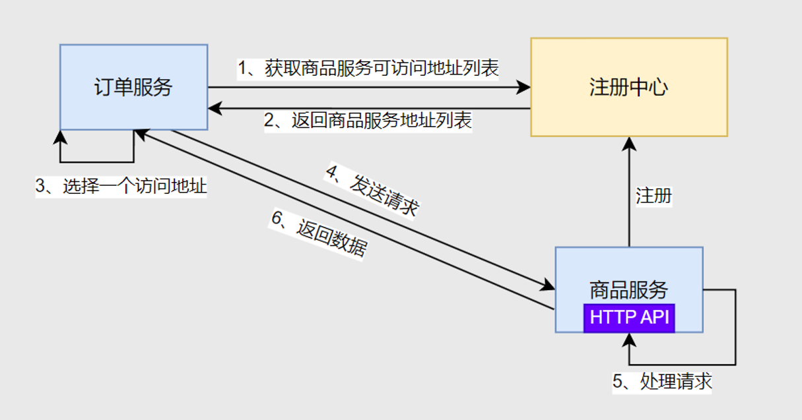

#### 场景搭建

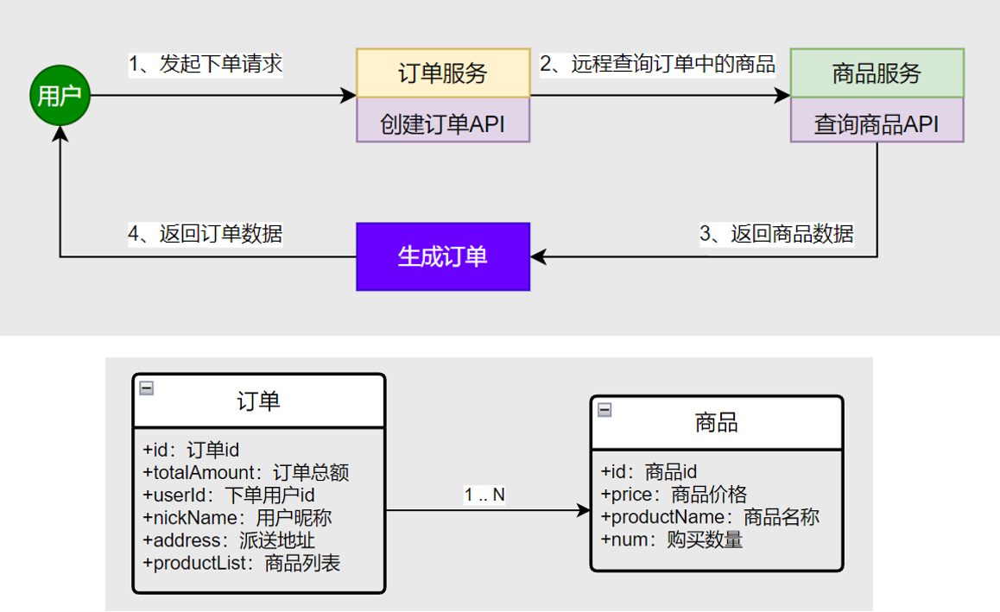

##### 创建 model 工程

> 里面包含所有的JavaBean类，后来我们每个微服务项目都会用到的公共类（封装数据的模型）

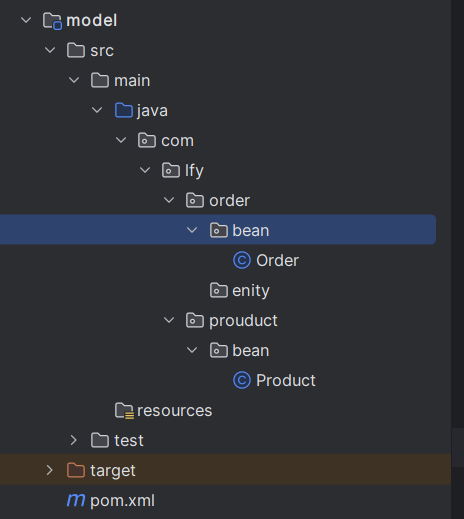

##### Services 引入 model

> Services 工程引入 model 后，每个微服务都能使用到了

```xml
<dependency>
    <groupId>com.lfy</groupId>
    <artifactId>model</artifactId>
    <version>1.0-SNAPSHOT</version>
</dependency>
```

#### 配置RestTemplate

> Spring 中提供了 RestTemplate 组件。这个组件可以给任何地方发送请求。自然也能给我们的微服务发送请求。我们提前给容器中创建一个 RestTemplate 组件。以后就可以 @Autowired 直接使用

```java
@Configuration 
public class AppConfiguration { 

     @Bean 
     RestTemplate restTemplate() { 
         return new RestTemplate();
     } 
}
```

#### 发送远程请求

```java
@Autowired 
RestTemplate restTemplate; 

@Test 
void testRestTemplate() { 
    String forObject = restTemplate.getForObject("http://localhost:8080/product/4", String.class); 
    System.out.println(forObject); 
    System.out.println("-----------------------------");
}
```

1. 使⽤ RestTemplate 可以获取到远程数据
2. 必须精确指定地址和端⼝ 
3. 如果远程宕机将不可⽤ 

> **期望：可以负载均衡调⽤，不⽤担⼼远程宕机**

### 负载均衡

#### 引入依赖

> Spring Cloud 提供了 loadbalancer，来实现负载均衡功能

```xml
<dependency> 
    <groupId>org.springframework.cloud</groupId> 
    <artifactId>spring-cloud-starter-loadbalancer</artifactId> 
</dependency>
```

#### 编程式负载均衡：

> 自动注入使用 `LoadBalancerClient`组件。

```java
// 进阶2：完成负载均衡发送请求 
private Product getProductFromRemoteWithLoadBalance(Long productId){ 
     //1、获取到商品服务所在的所有机器IP+port 
     ServiceInstance choose = loadBalancerClient.choose("service-product"); 
     
     //远程URL 
     String url = "http://"+choose.getHost() +":" +choose.getPort() +"/product/"+productId; 
     log.info("远程请求：{}",url); 
     
     //2、给远程发送请求 
     Product product = restTemplate.getForObject(url, Product.class); 
     return product; 
 
}
```

#### 注解式负载均衡

```typescript
@Configuration 
public class UserConfiguration { 
  
     @LoadBalanced 
     @Bean 
     RestTemplate restTemplate() { 
         return new RestTemplate(); 
     }
}
```

```java
// 进阶3：基于注解的负载均衡 
private Product getProductFromRemoteWithLoadBalanceAnnotation(Long productId){
    String url = "http://service-product/product/"+productId; 
    //2、给远程发送请求； service-product 会被动态替换 
    Product product = restTemplate.getForObject(url, Product.class); 
    return product; 
}
```

1. 负载均衡调⽤只需要传⼊ 服务名 
2. 请求发起之前会⾃动去注册中⼼确定微服务地址 
3. 如果微服务宕机，会⾃动剔除在线名单，请求将不会发过去

### 思考：

**经典面试题：如果注册中⼼宕机，远程调⽤是否可以成功？**

1. 从未调⽤过，如果注册中心宕机，调⽤会⽴即失败 
2. 调⽤过，如果注册中心宕机，因为会缓存名单，调⽤会成功 
3. 调⽤过，如果注册中⼼和对⽅服务都宕机，因为会缓存名单，调⽤会阻塞后失败（Connection 

Refused）

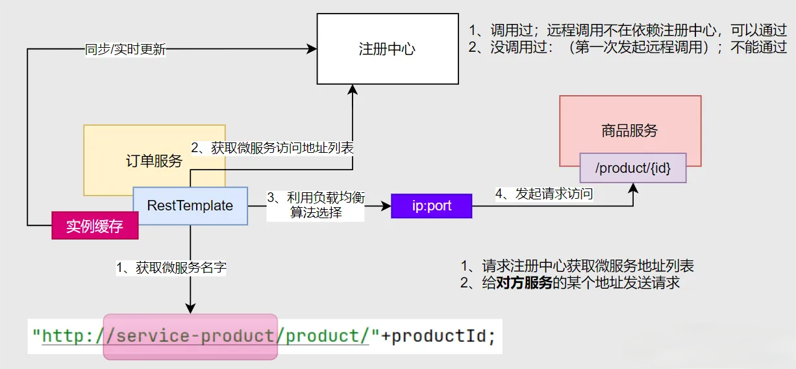

## Nacos：配置中心

**重要提示：**

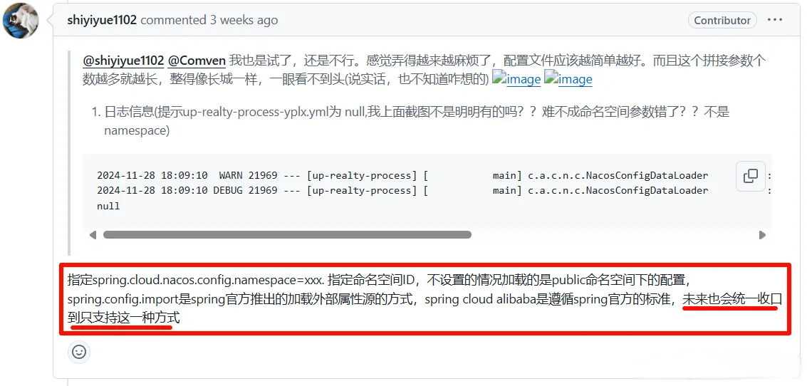

### 整合

#### 引入依赖

```xml
<dependency> 
     <groupId>com.alibaba.cloud</groupId> 
     <artifactId>spring-cloud-starter-alibaba-nacos-config</artifactId> 
</dependency>
```

#### 配置文件

> application.properties

```properties
# 指定配置中⼼地址 
spring.cloud.nacos.server-addr=localhost:8848 
spring.config.import=nacos:service-order.properties
```

#### 配置集 - dataId

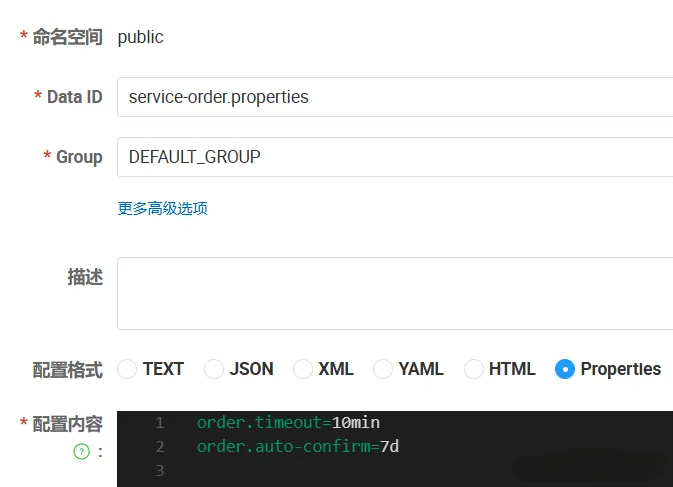

### 动态刷新

#### @RefreshScope

> 凡是 `@Value` 动态从配置文件中取到的值。都可以通过 `@RefreshScope` 实现自动刷新功能

```java
@RefreshScope // ⾃动刷新
@RestController
public class OrderController {

    //从配置文件或者配置中心拿
    @Value("${order.timeout}")
    String timeout;
    @Value("${order.auto-confirm}")
    String confirm;
    
    
    @GetMapping("/config")
    public String orderConfigInfo(){
        // 订单超时： order.timeout=30min
        return "订单超时：" +timeout +" , 订单自动确认：" + confirm;
        // 订单自动确认： order.auto-confirm=7d
    }
}
```

#### ConfigurationProperties

> 使用 `@ConfigurationProperties` 绑定配置文件的属性类。⽆需 @RefreshScope，就能动态更新

```typescript
@Component
//配置批量绑定，可以⽆需@RefreshScope就能实现⾃动刷新
@ConfigurationProperties(prefix = "order") 
@Data
public class OrderProperties {
 String timeout;
 String autoConfirm;
 String dbUrl;
}
```

#### NacosConfigManager

编程式监听某个属性文件的变化

```typescript
@Bean
ApplicationRunner applicationRunner(NacosConfigManager manager){
return args -> {
        ConfigService configService = manager.getConfigService();
        configService.addListener("service-order.properties", "DEFAULT_GROUP", 
             new Listener() {
                @Override
                public Executor getExecutor() {
                    return Executors.newFixedThreadPool(4);
                }
                @Override
                public void receiveConfigInfo(String configInfo) {
                    System.out.println("configInfo = " + configInfo);
                }
            });
    };
}
```

### **namespace、dataId、group**

#### namespace：名称空间

> 名称空间是用来**隔离数据的**。从而实现多环境隔离，如：开发、测试、预发、⽣产等

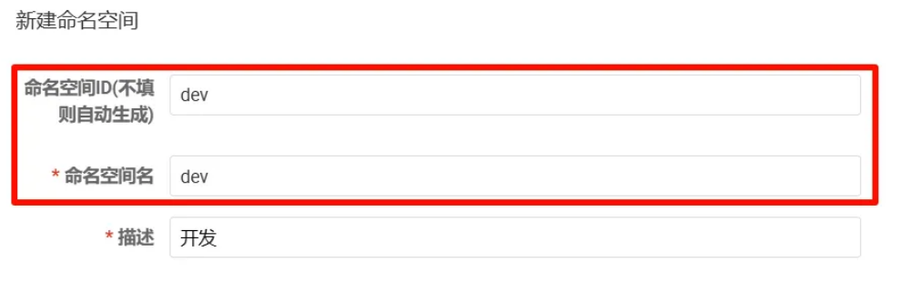

#### dataId：数据集id

**数据集id**：就是以前配置⽂件的名字。完整写法： `名字.后缀` 如：` common.properties`

#### groupId：分组id

**分组id：**⼀般可以⽤微服务的名字作为⾃⼰的组。

### 推荐⽤法

> **namespace**：**名称空间**，用来划分环境； 开发、测试、生产等
> 
> **group**：分组，用来划分微服务；组名就是**微服务**名字； 
> 
> **dataId**：**数据集，**分来划分不同配置；比如数据库配置、redis配置、通用配置等

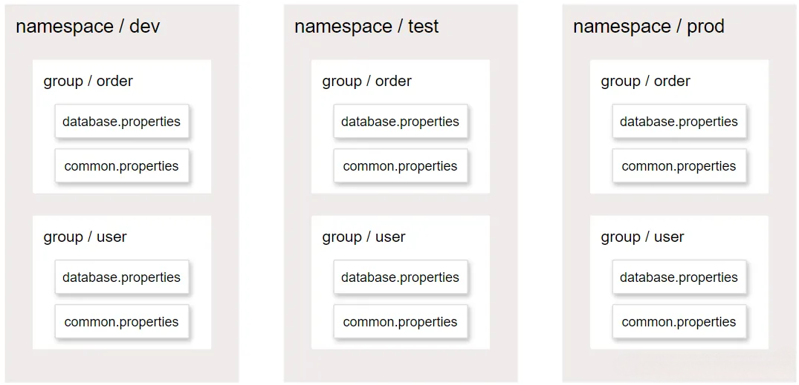

懒企业：

- **namespace **分离环境
  - **dev**： **order-application.properties**、**product-application.properties**
  - **prod**：order-application.properties、product-application.properties

> 好企业：（简单有效，禁用了group特性）
> 
> - **namespace **分离环境
>   - **dev**：**默认分组； 文件名区分配置**
>     - order-database.properties，order-common.properties，order-redis.properties
>     - user-database.properties，user-common.properties，user-redis.properties
>   - **prod**：**默认分组； 文件名区分配置**
>     - order-database.properties，order-common.properties，order-redis.properties
>     - user-database.properties，user-common.properties，user-redis.properties

规范化企业：

- namespace：分离环境
  - **dev**
    - 多个分组，分离微服务
    - order-group、user-group
      - 多个配置分开，不用卸
      - database.properties（order-group、user-group）
      - common.properties（order-group、user-group）
      - redis.properties（order-group、user-group）
  - **prod**
    - 多个分组，分离微服务
    - order-group、user-group
      - database.properties（order-group、user-group）
      - common.properties（order-group、user-group）
      - redis.properties（order-group、user-group）

## OpenFeign：远程调用

官⽹：https://docs.spring.io/spring-cloud-openfeign/reference/spring-cloud-openfeign.html#spring-cloud-feign

> **OpenFeign **是⼀个**声明式**远程调⽤客户端；

### 整合

#### 引入依赖

> 由于⼤型项⽬中，每个项⽬都可能需要使⽤远程调⽤。所以我们可以在⽗项⽬中统⼀引⼊

```xml
<dependency> 
     <groupId>org.springframework.cloud</groupId> 
     <artifactId>spring-cloud-starter-openfeign</artifactId> 
</dependency>
```

#### 开启功能

```java
@SpringBootApplication 
@EnableFeignClients 
public class Application { 
    public static void main(String[] args) { 
        SpringApplication.run(Application.class, args); 
    }
}
```

#### 远程调⽤

> 注意用法：
> 
> 1. `@EnableFeignClients`
> 2. `@EnableFeignClients(basePackages = "com.example.clients")`

```java
@FeignClient("stores")
public interface StoreClient {
    @RequestMapping(method = RequestMethod.GET, value = "/stores")
    List<Store> getStores();

    @GetMapping("/stores")
    Page<Store> getStores(Pageable pageable);

    @PostMapping(value = "/stores/{storeId}", consumes = "application/json", params = "mode=upsert")
    Store update(@PathVariable("storeId") Long storeId, Store store);

    @DeleteMapping("/stores/{storeId:\\d+}")
    void delete(@PathVariable Long storeId);
}
```

### 进阶配置

#### 开启日志

```properties
logging: 
  level: 
    com.lfy.order.feign: debug
```

```java
@Bean
Logger.Level feignLoggerLevel() {
    return Logger.Level.FULL;
}
```

#### 超时控制

> 精确控制某个feignClient；

```yaml
spring:
 cloud:
  openfeign:
    client:
      config:
        default:
          logger-level: full
          connect-timeout: 1000
          read-timeout: 2000
        service-product: 
          logger-level: full
          connect-timeout: 3000
          read-timeout: 5000
```

#### 重试机制

> 容器中只要有 Retryer  组件，就可以用到重试器；

```java
@Bean 
Retryer retryer(){ 
  return new Retryer.Default(); 
}
```

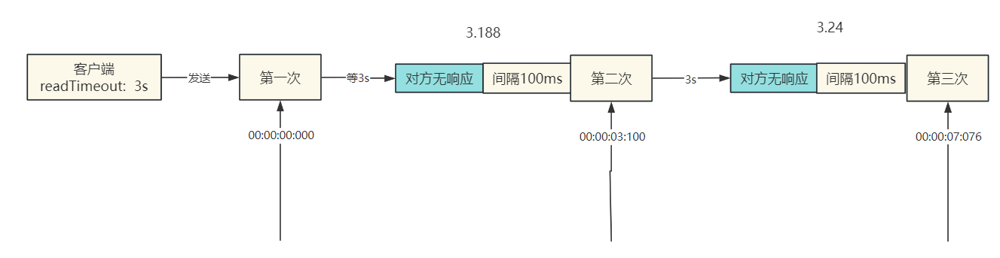

#### 重试机制：退避算法

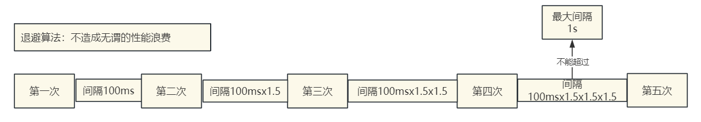

### fallback - 兜底返回

> 远程调用经常出现超时、断网等异常。我们可以触发兜底返回。保证能拿到数据，哪怕是默认数据，好让业务可以继续进行。

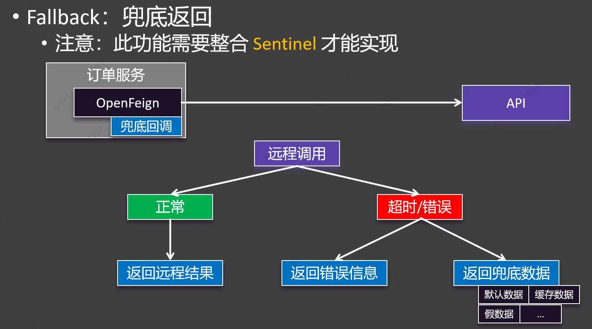

#### 引入 sentinel

```xml
<dependency>
    <groupId>com.alibaba.cloud</groupId>
    <artifactId>spring-cloud-starter-alibaba-sentinel</artifactId>
</dependency>
```

#### 开启熔断

```yaml
feign: 
  sentinel: 
    enabled: true
```

#### 指定兜底逻辑

```java
// feign客户端
@FeignClient(value = "service-product",fallback = ProductFeignClientFallback.class) 
public interface ProductFeignClient {
    //mvc注解的两套使⽤逻辑
    //1、标注在Controller上，是接受这样的请求
    //2、标注在FeignClient上，是发送这样的请求
    @GetMapping("/product/{id}")
    Product getProductById(@PathVariable("id") Long id);
}
```

```java
@Component
public class ProductFeignClientFallback implements ProductFeignClient {
    @Override
    public Product getProductById(Long id) {
        System.out.println("兜底回调....");
        Product product = new Product();
        product.setId(id);
        product.setPrice(new BigDecimal("0"));
        product.setProductName("未知商品");
        product.setNum(0);
        return product;
    }
}
```

> 有可能还需要导入

```python
@Import({ProductFeignClientFallback.class})
@EnableDiscoveryClient //功能开关
@EnableFeignClients(basePackages = "com.lfy.api.product")
@SpringBootApplication
public class StockMainApplication {
}
```

### 拦截器

> OpenFeign 支持请求和响应拦截。可以在远程发送请求之前，对请求数据进行定制修改。也可以在得到响应之后，对响应数据进行处理。
> 
> **注意：请求拦截器的使用场景非常多！比如远程调用链路传递用户信息数据等**

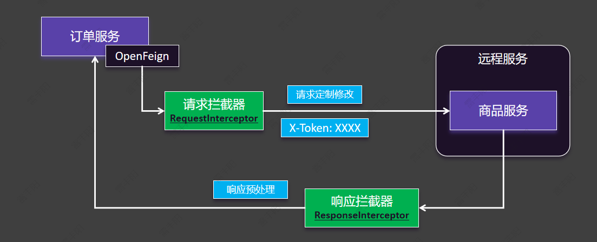

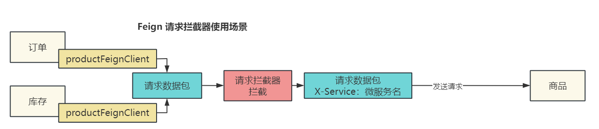

1. 写一个拦截器的实现类；必须实现 RequestInterceptor
2. 把这个实现类放到容器中，以后发请求就会自动启用；

```typescript
package com.lfy.stock.interceptor;

import feign.RequestInterceptor;
import feign.RequestTemplate;
import lombok.extern.slf4j.Slf4j;
import org.springframework.beans.factory.annotation.Value;
import org.springframework.stereotype.Component;
import org.springframework.stereotype.Service;

/**
 * @author leifengyang
 * @version 1.0
 * @date 2025/8/30 11:30
 * @description:
 */
@Slf4j
@Component
public class ServiceNameHeaderRequestInterceptor implements RequestInterceptor {

    //获取当前微服务的名字
    @Value("${spring.application.name}")
    String serviceName;

    @Override
    public void apply(RequestTemplate template) {
        log.info("feign拦截器准备添加服务名请求头");
        template.header("X-Service",serviceName);
    }
}
```

### 调用第三方API

> 以下是**墨迹天气API**接口：更多接口参考**阿里云API市场**；
> 
> **请求方式**：POST       http://aliv18.data.moji.com/whapi/json/alicityweather/condition
> 
> **请求头**：   Authorization=APPCODE 93b7e19861a24c519a7548b17dc16d75
> 
> **请求参数**： 
> 
> - token=50b53ff8dd7d9fa320d3d3ca32cf8ed1
> - cityId=2182

> 短信发送API

> 1. 去 阿里云 市场购买短信API：https://market.aliyun.com/detail/cmapi00037415#sku=yuncode31415000022
> 2. 去控制台，查看API详情
> 3. 调试API

### 面试题：客户端负载均衡与服务端负载均衡的区别

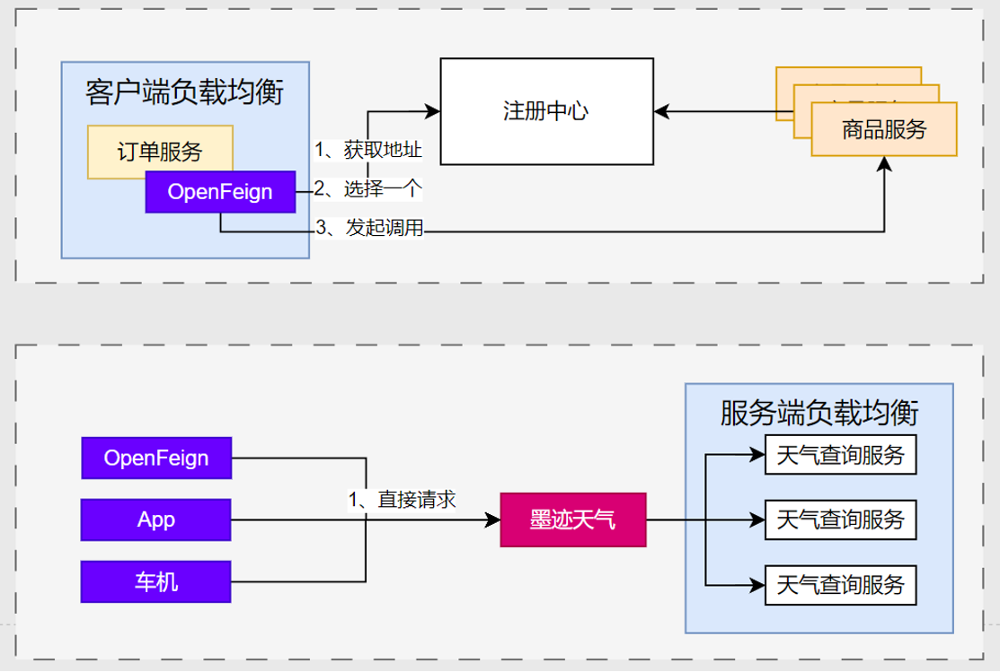

## Sentinel：流量保护

**官⽹：**https://sentinelguard.io/zh-cn/index.html 

**wiki：**https://github.com/alibaba/Sentinel/wiki 

随着微服务的流⾏，服务和服务之间的稳定性变得越来越重要。Sentinel 以流量为切⼊点，从流量控制、流量路由、熔断降级、系统⾃适应过载保护、热点流量防护等多个维度保护服务的稳定性。 

**Sentinel 具有以下特征**: 

**丰富的应⽤场景**：Sentinel 承接了阿⾥巴巴近 10 年的双⼗⼀⼤促流量的核⼼场景，例如秒杀 （即突发流量控制在系统容量可以承受的范围）、消息削峰填⾕、集群流量控制、实时熔断下游不可⽤应⽤等。 

**完备的实时监控**：Sentinel 同时提供实时的监控功能。您可以在控制台中看到接⼊应⽤的单台机器秒级数据，甚⾄ 500 台以下规模的集群的汇总运⾏情况。 

**⼴泛的开源⽣态**：Sentinel 提供开箱即⽤的与其它开源框架/库的整合模块，例如与 SpringCloud、Apache Dubbo、gRPC、Quarkus 的整合。您只需要引⼊相应的依赖并进⾏简单的配置即可快速地接⼊ Sentinel。同时 Sentinel 提供 Java/Go/C++ 等多语⾔的原⽣实现。 

**完善的 SPI 扩展机制：**Sentinel 提供简单易⽤、完善的 SPI 扩展接⼝。您可以通过实现扩展接⼝来快速地定制逻辑。例如定制规则管理、适配动态数据源等

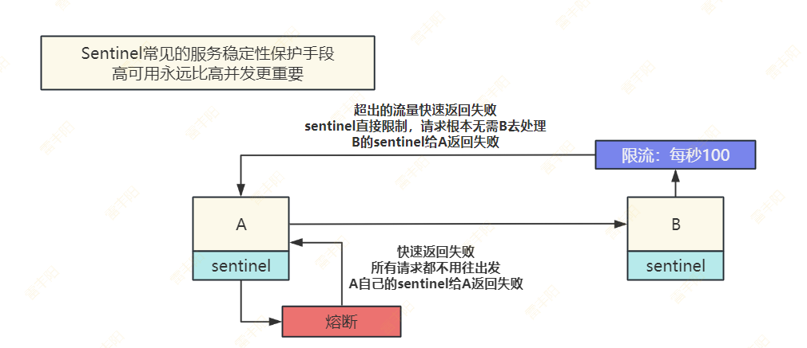

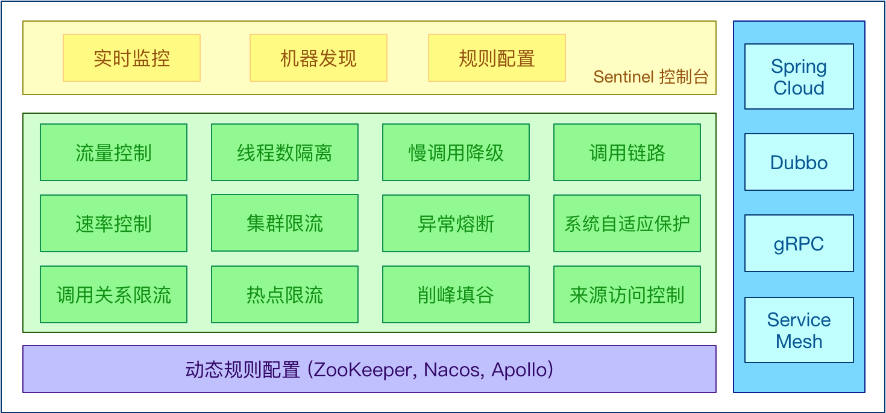

### 基础入门

#### 架构方式

Sentinel 分为两个部分:

- **核心库（Java 客户端）**不依赖任何框架/库，能够运行于所有 Java 运行时环境，同时对 Dubbo / Spring Cloud 等框架也有较好的支持。
- **控制台（Dashboard）**基于 Spring Boot 开发，打包后可以直接运行，不需要额外的 Tomcat 等应用容器。

[📎 sentinel-dashboard-1.8.6.jar](<files/sentinel-dashboard-1.8.6.jar>)

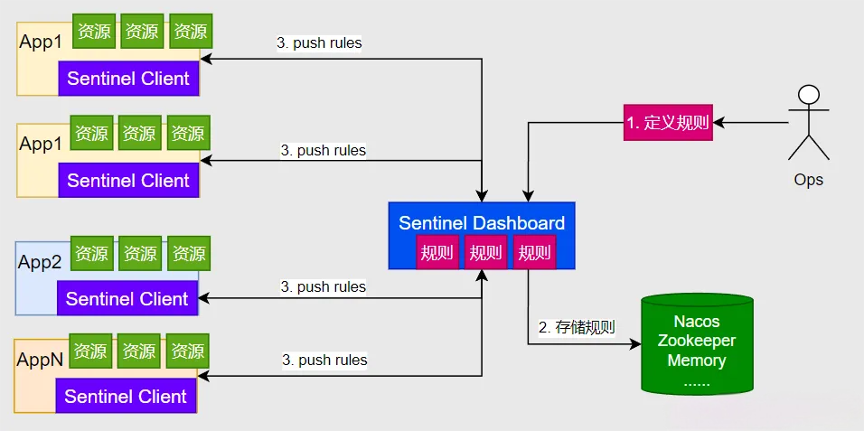

#### 核心概念

**定义资源：** 

1. **主流框架⾃动适配**：（Web Servlet、Dubbo、Spring Cloud、gRPC、Spring WebFlux、 Reactor）；
  1. 所有**Web接⼝**均为资源；
  2. 资源名是请求路径
2. **编程式**：SphU API 
  1. 资源名自己指定，比如：haha

```javascript
try(Entry entry = SphU.entry("haha");) {
    String str = "订单超时：" +timeout +" , 订单自动确认：" + confirm + " , 哈哈：" + haha;
    String plus = orderProperties.getTimeout() + "~~~" + orderProperties.getAutoConfirm();
    result = str + "\n" + plus;
} catch (BlockException e) {
    //sentinel如果不允许访问这个资源就会来到异常
    throw new RuntimeException(e);
}
```

1. **声明式：**@SentinelResource 
  1. 资源名自己指定，比如：product-rpc

```java
@SentinelResource("product-rpc")
public Product getProductFromRemoteV5(Long productId){
    Product product = productFeignClient.getProduct(productId);

    return product;
}
```

**定义规则： **

1. 流量控制规则 
2. 熔断降级规则 
3. 系统保护规则 
4. 来源访问控制规则 
5. 热点参数规则

#### 工作原理

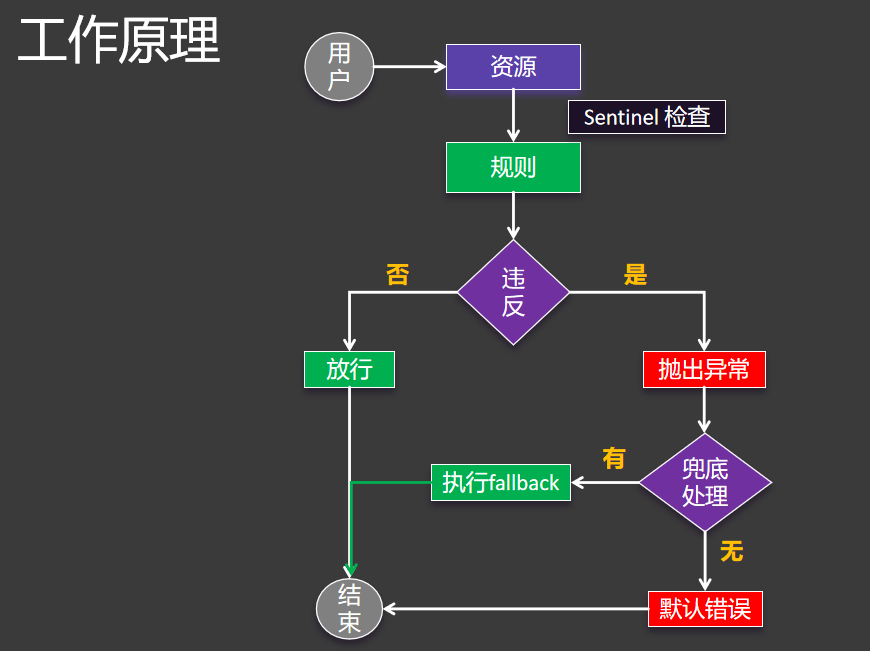

### 整合使用

#### 导入依赖

```xml
<dependency>
    <groupId>com.alibaba.cloud</groupId>
    <artifactId>spring-cloud-starter-alibaba-sentinel</artifactId> 
</dependency>
```

#### 启动控制台

`java -jar sentinel.jar`

#### 配置文件

```yaml
spring: 
  cloud: 
    sentinel: 
      transport: 
        dashboard: localhost:8080
```

### 异常处理

> 这些机制不是靠记忆的。可以通过分析源码得到！

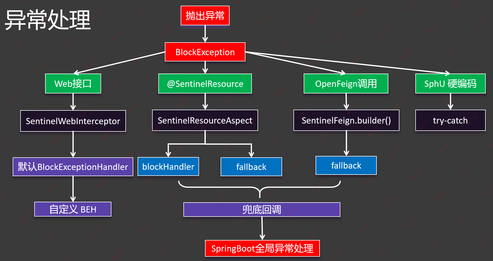

> 每种错误都有默认的处理方式，我们一般不用。我们需要自定义错误处理

#### web请求被控制住的错误：自定义 BlockExceptionHandler

默认返回：

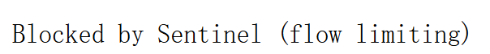

自定义返回：

```typescript
@Component
public class MyJsonBlockExceptionHandler implements BlockExceptionHandler {
    @Override
    public void handle(HttpServletRequest request,
                       HttpServletResponse response,
                       String resourceName,
                       BlockException e) throws Exception {
        response.setStatus(HttpStatus.SC_TOO_MANY_REQUESTS);

        response.setContentType("application/json; charset=utf-8");


        Map<String,Object> result = new HashMap<>();
        result.put("code","429");
        result.put("msg","请求太多，稍后再试：异常:"+e.getMessage());
        String json = JSON.toJSONString(result);

        response.getWriter().write(json);

    }
}
```

#### @SentinelResouce 注解标注的资源：

> 由 SentinelResourceAspect 处理这中资源被控制的异常

默认错误：Service 出错了，自己不处理，SpringBoot 返回了默认错误页

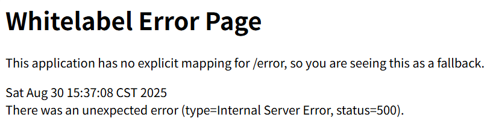

切面出现了两种异常方式：

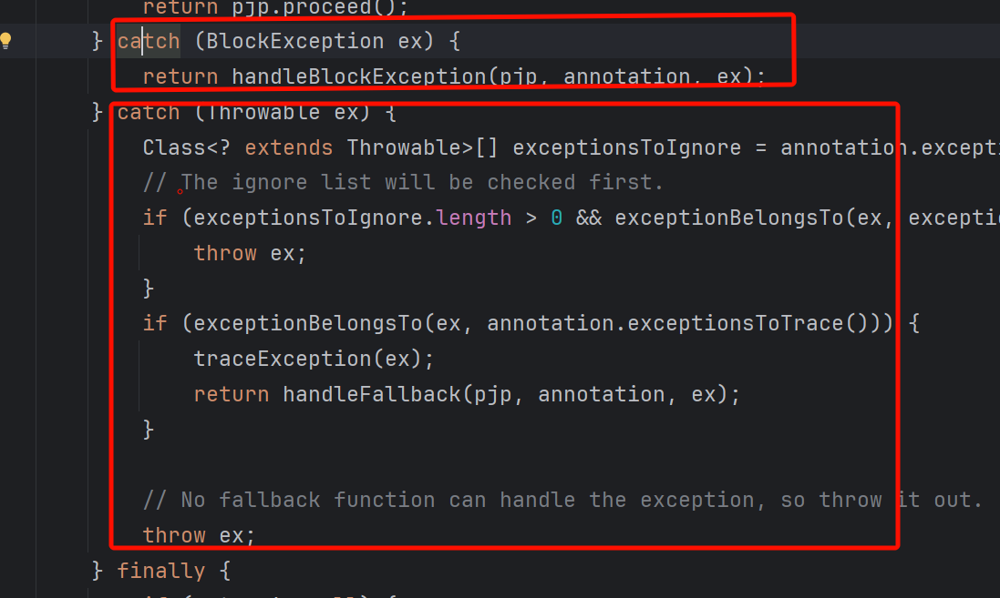

1. 如果是 **BlockException**（也就是Sentinel把你摁住了）；**去 @SentinelResource 注解中找 blockHandler 指定的方法名，作为异常处理的方式**
2. 如果是业务自己炸了；抛出的异常肯定 不是 **BlockException 旗下的。去 @SentinelResource 注解 中找 fallback 指定的方法处理异常；**

> **最佳实践：@SentinelResource标准的资源，都使用fallback 指定兜底回调逻辑，捕获所有异常**

```java
/**
     * V5： OpenFeign 版本；
     * Remote Procedure Call： 远程过程调用： RPC
     * QPS：Query Per Second： 每秒查询数/每秒请求数
     *
     *   blockHandler：指定的方法，是sentinel流控后调用的回调
     *   fallback： 指定的方法，是业务炸了以后得回调
     * @param productId
     * @return
     */
    @SentinelResource(value = "product-rpc",
               fallback = "productFallback")
    public Product getProductFromRemoteV5(Long productId){
        log.info("product-rpc 开始...");
        Product product = productFeignClient.getProduct(productId);
        int i = 10/0;
        return product;
    }

    /**
     * Sentinel 把上面业务摁住了，就会调用这个回调
     */
//    public Product productBlock(Long productId, BlockException exception){
//        log.info("product-rpc 被sentiel 流控了 {}",exception);
//        Product product = new Product(0L,new BigDecimal("0"),"xxx产品不存在",0);
//        return product;
//    }

    public Product productFallback(Long productId, Throwable exception){
        // 识别 exception 是sentinel的blockexception 还是业务的其他 exception

        if (BlockException.isBlockException(exception)){
            log.info("product-rpc 被sentiel 流控了 {}",exception);
            Product product = new Product(0L,new BigDecimal("0"),"xxx产品不存在",0);
            return product;
        }

        log.info("product-rpc 业务炸了 {}",exception);
        Product product = new Product(0L,new BigDecimal("0"),"xxx产品不存在",0);
        return product;
    }
```

### 流量控制规则：FlowRule

> https://github.com/alibaba/Sentinel/wiki/%E6%B5%81%E9%87%8F%E6%8E%A7%E5%88%B6

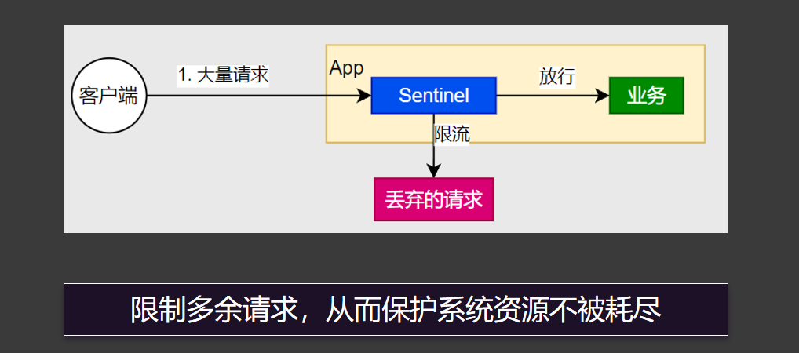

#### 流控规则

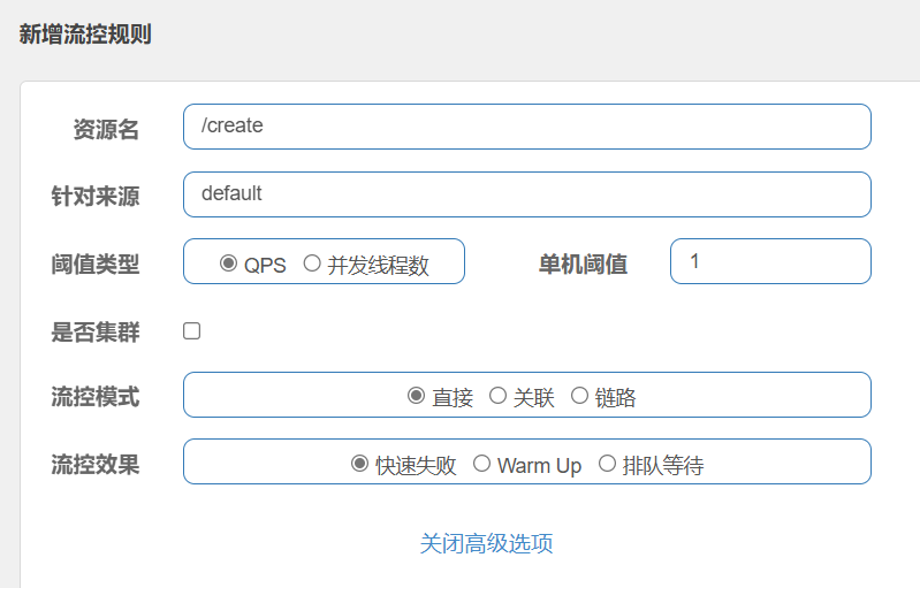

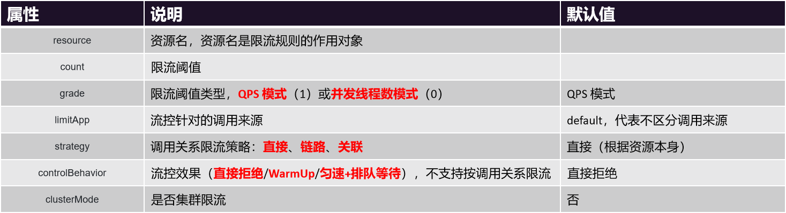

#### 阈值类型


**QPS**：Query Per Second：每秒查询数，也是每秒请求数量； 这个控制吞吐量；

**并发线程数**：某一刻并发访问的人； 这个控制同一时刻高并发

#### 流控模式


> 调用关系包括**调用方、被调用方**；
> 
> 一个方法又可能会调用其它方法，形成一个调用链路的层次关系；
> 
> 有了调用链路的统计信息，我们可以衍生出多种流量控制手段。

##### **直接：直接控制某个资源的访问量**

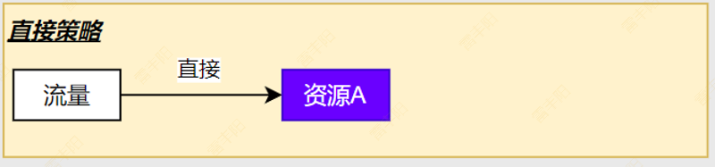

##### 链路：限制从某个链路过来的请求

> 如下：
> 
> 1. 如果是 **/create** 过来调用的 **/createOrder** 则不限流
> 2. 如果是 **/seckill** 过来调用的** /createOrder **则进行限流
> 
> **特别注意**：必须关闭统一web上下文。链路模式才能生效；
> 
>  `spring.cloud.sentinel.web-context-unify=false`

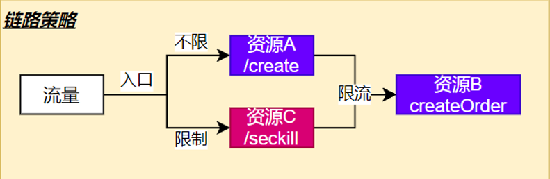

##### 关联：**A资源**关联绑定一个**B资源**，并给**A设置限流**。如果B资源没有访问，A则不限流，如果B资源访问，A则限流

> 形成一个关联绑定关系，并优先执行B逻辑的规则。B可以插队进来
> 
> 优先级关系：优先进行写，如果没有写，随便读（读的流量限制不生效）

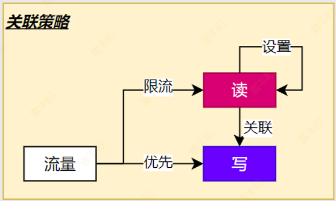

#### 流控效果


> 注意：只有**流控模式为直接**，才**支持流控效果的全部设置项**。其他模式只支持快速失败。

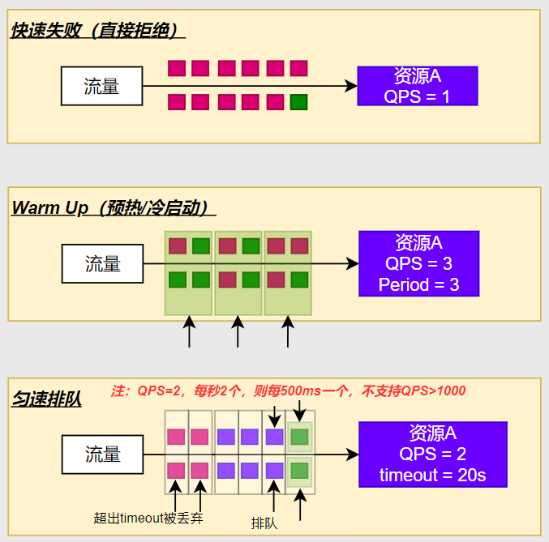

> Warm up 冷启动效果：给系统一个反应时间，经常不处理请求的系统，突然高并发过来，可能导致直接卡死。慢慢的冷启动，一段时间到达峰值

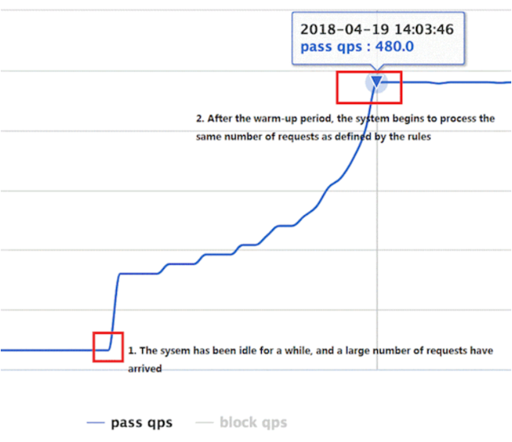

> 匀速排队效果

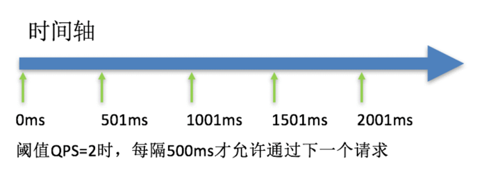

### 熔断降级规则：DegradeRule

https://github.com/alibaba/Sentinel/wiki/%E7%86%94%E6%96%AD%E9%99%8D%E7%BA%A7

#### 服务雪崩

> 除了流量控制以外，对**调用链路中不稳定的资源进行熔断降级也是保障高可用的重要措施之一**。一个服务常常会调用别的模块，可能是另外的一个远程服务、数据库，或者第三方 API 等。例如，支付的时候，可能需要远程调用银联提供的 API；查询某个商品的价格，可能需要进行数据库查询。然而，这个被依赖服务的稳定性是不能保证的。如果依赖的服务出现了不稳定的情况，请求的响应时间变长，那么调用服务的方法的响应时间也会变长，线程会产生堆积，最终可能耗尽业务自身的线程池，服务本身也变得不可用。

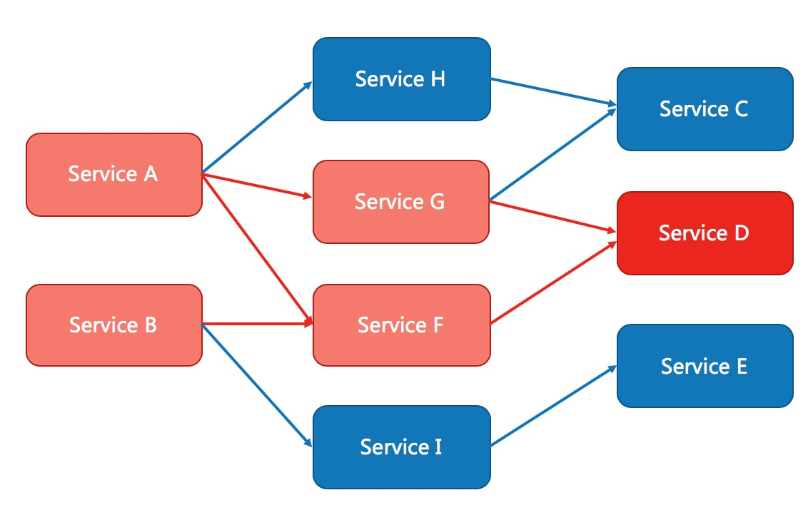

> **避免雪崩效应解决方案**：
> 
> 1. **切断不稳定调用**：对不稳定的服务不发起远程调用
> 2. **快速返回不积压**：**快速返回失败**或者兜底数据

#### 断路器状态

> **断路器三个状态**：关闭（Closed）、打开（Open）、半开（Half-Open）

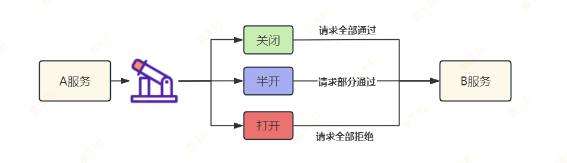

#### 断路器原理

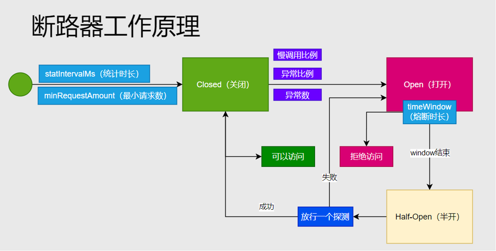

> 断路器一开；建议配置兜底回调。
> 
> RT：response time；最大响应时间；
> 
> **慢调用比例**：发了100个请求，80个都3s以后才**返回数据**，符合慢调用比例 80%
> 
> **异常比例**：发了100请求，80个都**返回错误**，**没有返回数据**；
> 
> **异常数：**10个都是错误

#### 熔断配置

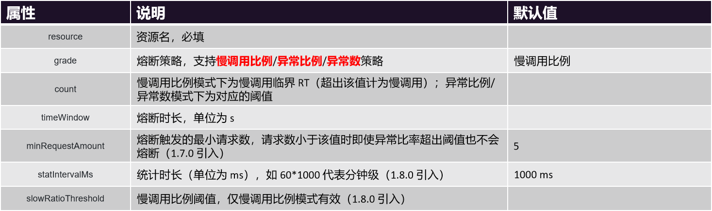

> **熔断：**被动行为； A-B；调用不通/慢/经常出错了。出于系统保护考虑，A切断了和B的联系；以后调用B，直接触发兜底回调；
> 
> **降级：**主动行为；线上并发量极高，手动的把某个微服务下线。（比如经常关闭注册通道......）

> `Serverless`**：分布式项目的基础设施**；**线上平台会把****基础设施下沉**；**以后只开发业务**。
> 
> 无服务器模式：无需购买服务器，无需部署任何中间，只需上传业务代码即可；

#### 兜底回调触发规则

> 熔断一旦发生，远程就不发请求了。这样才能是**快速失败**。
> 
> 如果只有兜底回调：其实还是发送请求的；
> 
> 最佳实践：`熔断 + 兜底` 一起配置

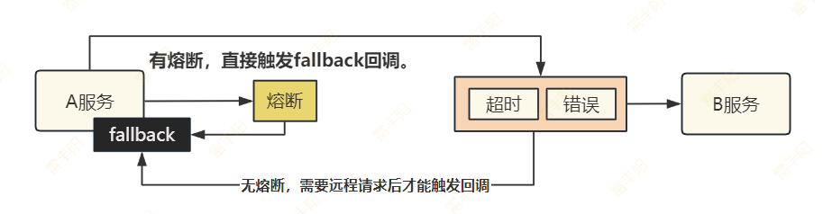

### 热点参数规则

#### 规则介绍

https://github.com/alibaba/Sentinel/wiki/%E7%83%AD%E7%82%B9%E5%8F%82%E6%95%B0%E9%99%90%E6%B5%81

**何为热点**？热点即经常访问的数据。很多时候我们希望统计某个热点数据中访问频次最高的 Top K 数据，并对其访问进行限制。比如：

- 商品 ID 为参数，统计一段时间内最常购买的商品 ID 并进行限制
- 用户 ID 为参数，针对一段时间内频繁访问的用户 ID 进行限制

热点参数限流会统计传入参数中的热点参数，并根据配置的限流阈值与模式，对包含热点参数的资源调用进行限流。热点参数限流可以看做是一种特殊的流量控制，仅对包含热点参数的资源调用生效。

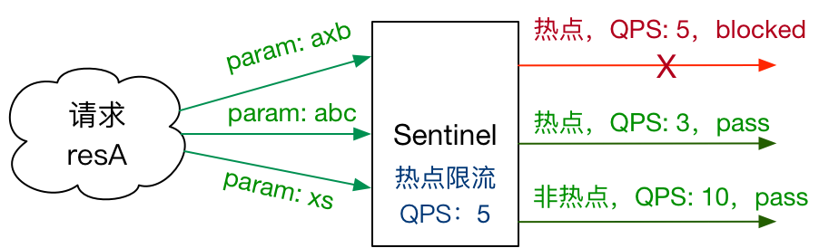

> **需求1：**每个用户秒杀 QPS 不得超过 1（秒杀下单 userId 级别）
> 
>      效果：携带此参数的参与流控，不携带不流控
> 
> **需求2：**6号用户是vvip，不限制QPS（例外情况）
> 
> **需求3：**666号是下架商品，不允许访问

> **注意：目前 Sentinel 自带的 adapter 仅 Dubbo 方法埋点带了热点参数，其它适配模块（如 Web）默认不支持热点规则，可通过****自定义埋点方式****指定新的资源名并传入希望的参数。注意自定义埋点的资源名不要和适配模块生成的资源名重复，否则会导致重复统计。**

```typescript
@SentinelResource("myMethod")
public Result doSomething(String uid, int type) {
  // some logic here...
}
```

#### 规则配置

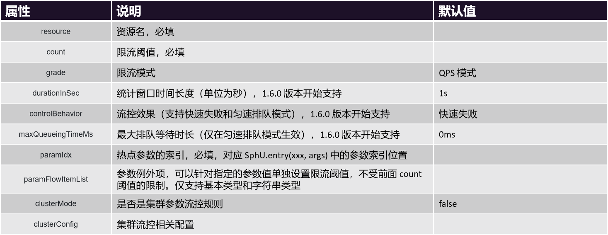

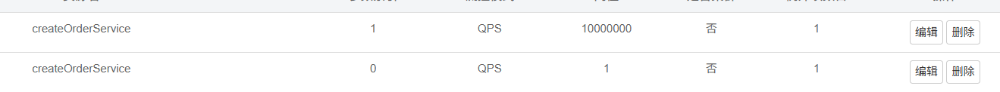

### 生产环境使用Sentinel

https://github.com/alibaba/Sentinel/wiki/%E5%9C%A8%E7%94%9F%E4%BA%A7%E7%8E%AF%E5%A2%83%E4%B8%AD%E4%BD%BF%E7%94%A8-Sentinel

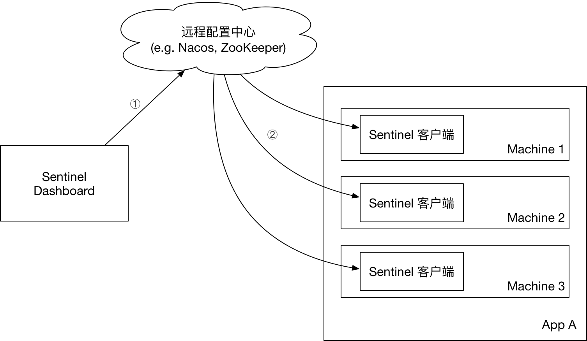

## Gateway：网关

> Nginx就可以做网关

https://docs.spring.io/spring-cloud-gateway/reference/4.2/spring-cloud-gateway/starter.html

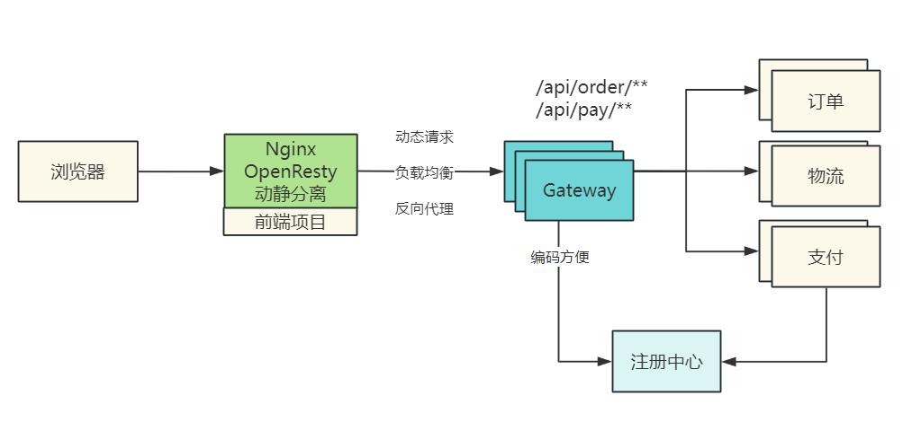

### 网关介绍

#### 功能介绍

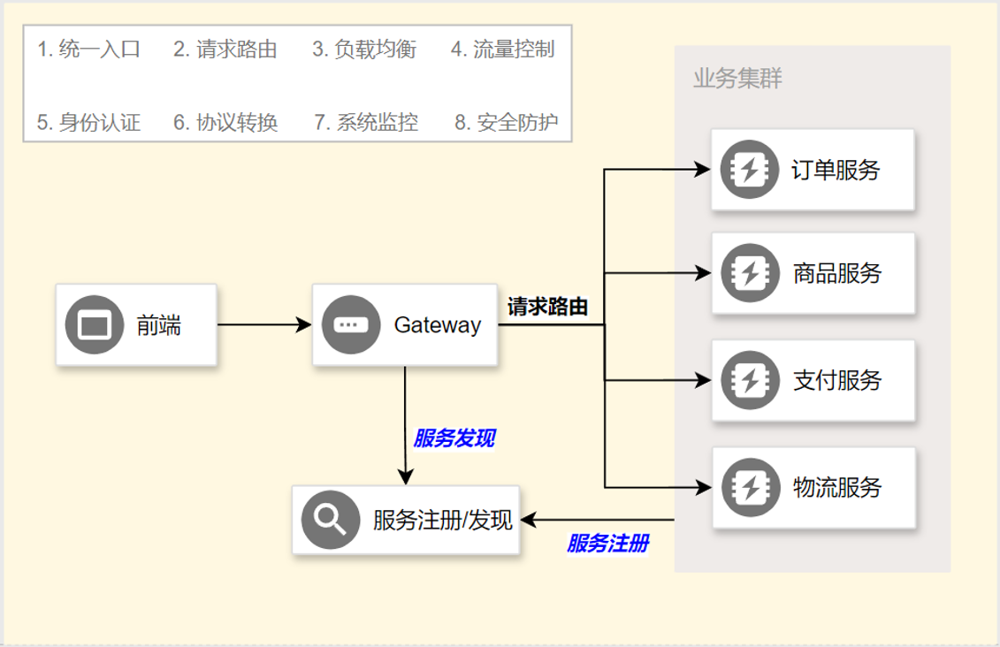

 

#### 技术体系

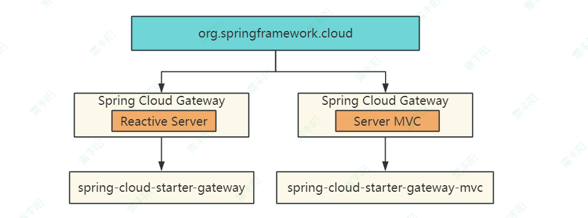

### 网关整合

#### 场景需求

> 1. 客户端发送 /api/order/** 转到 service-order
> 2. 客户端发送 /api/product/** 转到 service-product
> 3. 以上转发有负载均衡效果

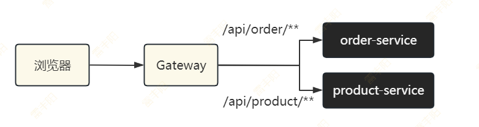

#### 创建网关

> 创建网关项目，引入网关依赖

```xml
<dependencies>
    <!--        说明当前项目是网关  -->
    <dependency>
        <groupId>org.springframework.cloud</groupId>
        <artifactId>spring-cloud-starter-gateway</artifactId>
    </dependency>
    <!--     注册中心   -->
    <dependency>
        <groupId>com.alibaba.cloud</groupId>
        <artifactId>spring-cloud-starter-alibaba-nacos-discovery</artifactId>
    </dependency>
    <!--     负载均衡   -->
    <dependency>
        <groupId>org.springframework.cloud</groupId>
        <artifactId>spring-cloud-starter-loadbalancer</artifactId>
    </dependency>
</dependencies>
```

#### 基本原理

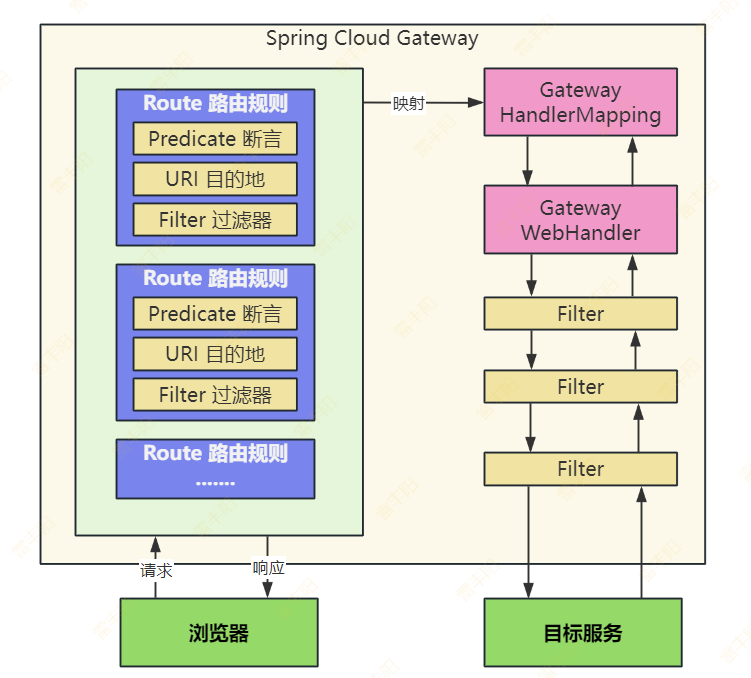

#### 网关配置

```yaml
spring:
  cloud:
    gateway:
      routes:  
      - id: order-route
        uri: lb://service-order
        predicates:
         - Path=/api/order/**
      - id:product-route
        uri: lb://service-product
        predicates:
         - Path=/api/product/**
```

### 断言：Predicate

https://docs.spring.io/spring-cloud-gateway/reference/4.2/spring-cloud-gateway/request-predicates-factories.html

#### 断言语法

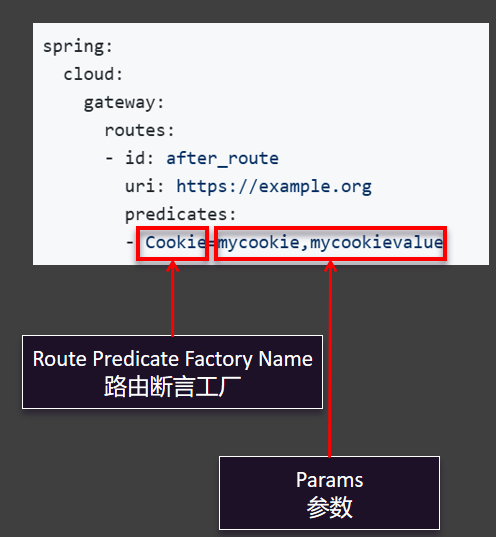

#### 系统断言工厂

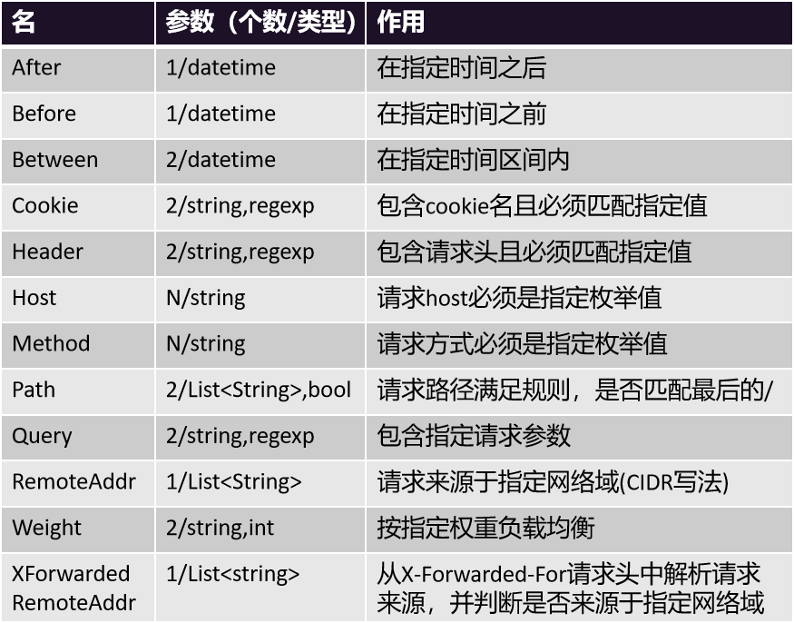

#### 自定义断言工厂

> 直接抄以前的。比如 Query；

### 过滤器：Filter

#### 工作原理

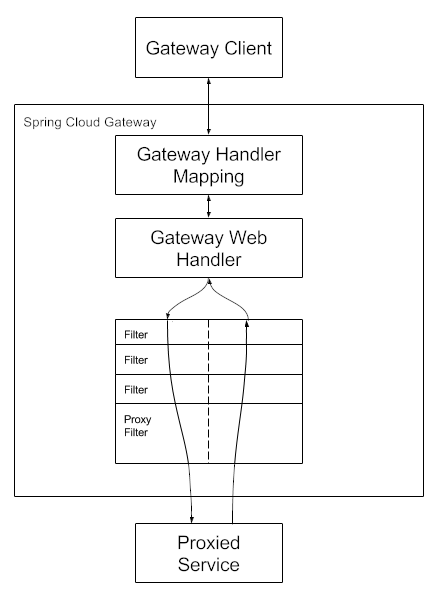

#### 配置语法

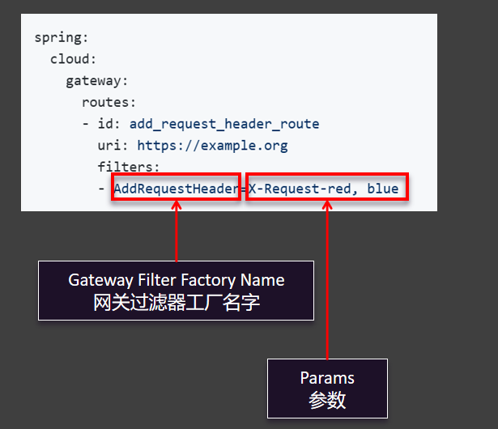

#### 过滤器工厂

https://docs.spring.io/spring-cloud-gateway/reference/4.2/spring-cloud-gateway/gatewayfilter-factories.html

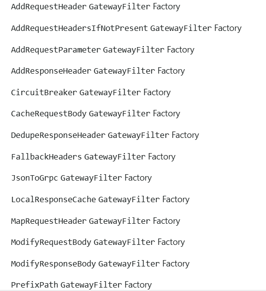

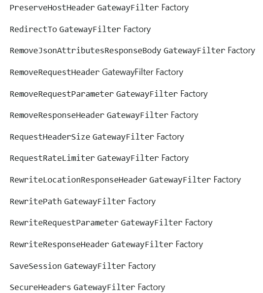

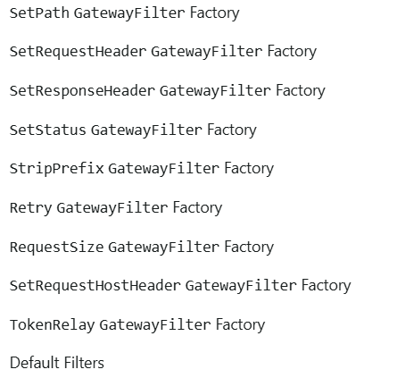

> 可以测试路径重写过滤器的功能

#### 全局过滤器：`GlobalFilter` 

```java
@Bean
public GlobalFilter customFilter() {
    return new CustomGlobalFilter();
}

public class CustomGlobalFilter implements GlobalFilter, Ordered {

    @Override
    public Mono<Void> filter(ServerWebExchange exchange, GatewayFilterChain chain) {
        log.info("custom global filter");
        return chain.filter(exchange);
    }

    @Override
    public int getOrder() {
        return -1;
    }
}
```

### 全局跨域

https://docs.spring.io/spring-cloud-gateway/reference/4.2/spring-cloud-gateway/cors-configuration.html

```yaml
spring:
  application:
    name: gateway
  cloud:
    nacos:
      server-addr: localhost:8848
    gateway:
      globalcors:
        cors-configurations:
          '[/**]':
            allowedOriginPatterns: "*"
            allowedMethods: "*"
            allowedHeaders: "*"
            allowCredentials: true
```

### 总结？

**面试题：微服务之间的调用经过网关吗？**

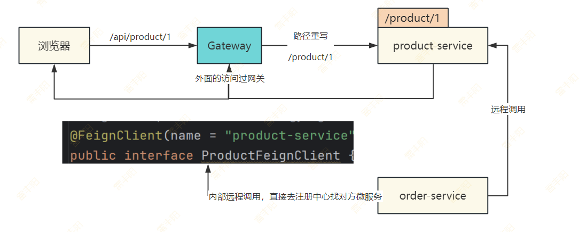

## Seata：分布式事务

**回顾分布式事务产生原因：**

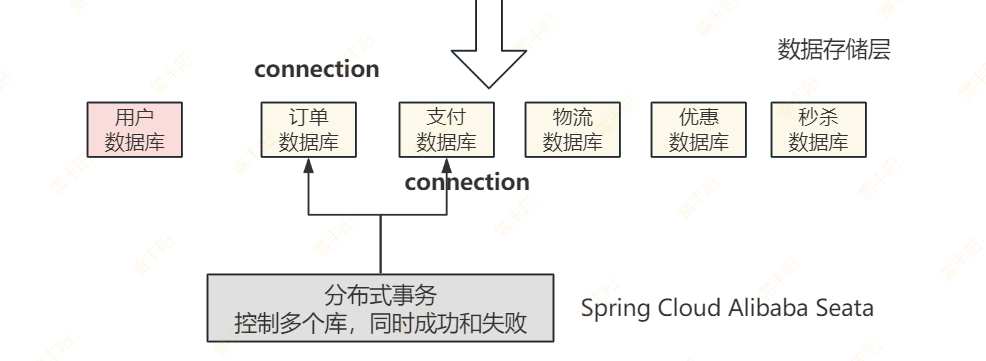

### 基本场景

#### 场景

用户购买商品的业务逻辑。整个业务逻辑由 3 个微服务提供支持：

- 仓储服务：对给定的商品扣除仓储数量。
- 订单服务：根据采购需求创建订单。
- 帐户服务：从用户帐户中扣除余额。

#### 架构图

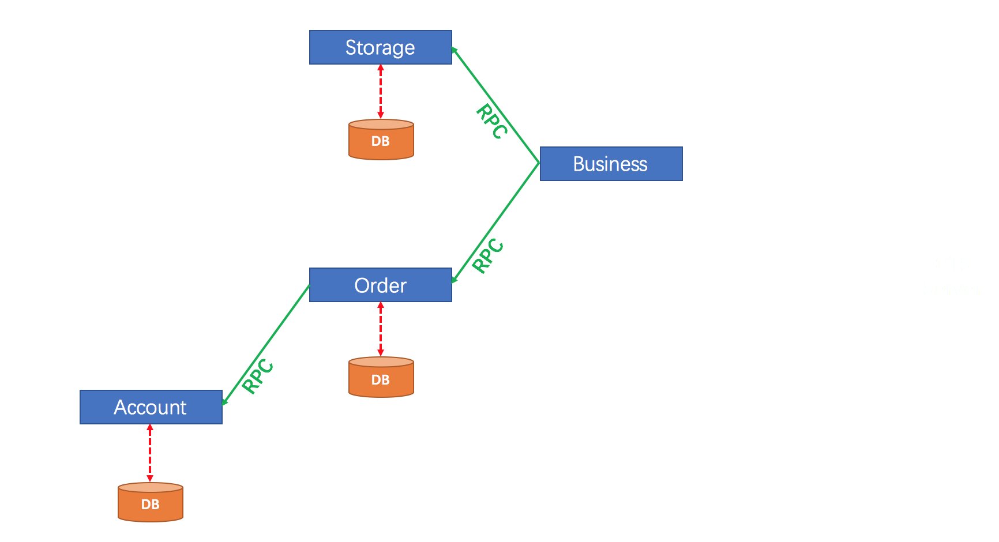

### 环境准备

#### 数据库文件

```sql
CREATE DATABASE IF NOT EXISTS `storage_db`;
USE  `storage_db`;
DROP TABLE IF EXISTS `storage_tbl`;
CREATE TABLE `storage_tbl` (
                               `id` int(11) NOT NULL AUTO_INCREMENT,
                               `commodity_code` varchar(255) DEFAULT NULL,
                               `count` int(11) DEFAULT 0,
                               PRIMARY KEY (`id`),
                               UNIQUE KEY (`commodity_code`)
) ENGINE=InnoDB DEFAULT CHARSET=utf8;
INSERT INTO storage_tbl (commodity_code, count) VALUES ('P0001', 100);
INSERT INTO storage_tbl (commodity_code, count) VALUES ('B1234', 10);

-- 注意此处0.3.0+ 增加唯一索引 ux_undo_log
DROP TABLE IF EXISTS `undo_log`;
CREATE TABLE `undo_log` (
                            `id` bigint(20) NOT NULL AUTO_INCREMENT,
                            `branch_id` bigint(20) NOT NULL,
                            `xid` varchar(100) NOT NULL,
                            `context` varchar(128) NOT NULL,
                            `rollback_info` longblob NOT NULL,
                            `log_status` int(11) NOT NULL,
                            `log_created` datetime NOT NULL,
                            `log_modified` datetime NOT NULL,
                            `ext` varchar(100) DEFAULT NULL,
                            PRIMARY KEY (`id`),
                            UNIQUE KEY `ux_undo_log` (`xid`,`branch_id`)
) ENGINE=InnoDB AUTO_INCREMENT=1 DEFAULT CHARSET=utf8;

CREATE DATABASE IF NOT EXISTS `order_db`;
USE  `order_db`;
DROP TABLE IF EXISTS `order_tbl`;
CREATE TABLE `order_tbl` (
                             `id` int(11) NOT NULL AUTO_INCREMENT,
                             `user_id` varchar(255) DEFAULT NULL,
                             `commodity_code` varchar(255) DEFAULT NULL,
                             `count` int(11) DEFAULT 0,
                             `money` int(11) DEFAULT 0,
                             PRIMARY KEY (`id`)
) ENGINE=InnoDB DEFAULT CHARSET=utf8;
-- 注意此处0.3.0+ 增加唯一索引 ux_undo_log
DROP TABLE IF EXISTS `undo_log`;
CREATE TABLE `undo_log` (
                            `id` bigint(20) NOT NULL AUTO_INCREMENT,
                            `branch_id` bigint(20) NOT NULL,
                            `xid` varchar(100) NOT NULL,
                            `context` varchar(128) NOT NULL,
                            `rollback_info` longblob NOT NULL,
                            `log_status` int(11) NOT NULL,
                            `log_created` datetime NOT NULL,
                            `log_modified` datetime NOT NULL,
                            `ext` varchar(100) DEFAULT NULL,
                            PRIMARY KEY (`id`),
                            UNIQUE KEY `ux_undo_log` (`xid`,`branch_id`)
) ENGINE=InnoDB AUTO_INCREMENT=1 DEFAULT CHARSET=utf8;

CREATE DATABASE IF NOT EXISTS `account_db`;
USE  `account_db`;
DROP TABLE IF EXISTS `account_tbl`;
CREATE TABLE `account_tbl` (
                               `id` int(11) NOT NULL AUTO_INCREMENT,
                               `user_id` varchar(255) DEFAULT NULL,
                               `money` int(11) DEFAULT 0,
                               PRIMARY KEY (`id`)
) ENGINE=InnoDB DEFAULT CHARSET=utf8;
INSERT INTO account_tbl (user_id, money) VALUES ('1', 10000);
-- 注意此处0.3.0+ 增加唯一索引 ux_undo_log
DROP TABLE IF EXISTS `undo_log`;
CREATE TABLE `undo_log` (
                            `id` bigint(20) NOT NULL AUTO_INCREMENT,
                            `branch_id` bigint(20) NOT NULL,
                            `xid` varchar(100) NOT NULL,
                            `context` varchar(128) NOT NULL,
                            `rollback_info` longblob NOT NULL,
                            `log_status` int(11) NOT NULL,
                            `log_created` datetime NOT NULL,
                            `log_modified` datetime NOT NULL,
                            `ext` varchar(100) DEFAULT NULL,
                            PRIMARY KEY (`id`),
                            UNIQUE KEY `ux_undo_log` (`xid`,`branch_id`)
) ENGINE=InnoDB AUTO_INCREMENT=1 DEFAULT CHARSET=utf8;
```

#### 工程文件

> 直接导入到项目中

[📎 services.zip](<files/services.zip>)

> 导入到 services 微服务工程中
> 
> **注意修改pom文件配置、数据库地址**

#### 测试本地事务

> 1. 配置每个微服务连接注册中心、整合spring默认的声明式事务
> 2. 测试每个微服务自己的接口，是否具有本地事务特性
> 3. 打通微服务的远程调用链路，测试成功与失败的数据库情况

### 整合Seata

#### 工作原理

> - **TC (Transaction Coordinator) - 事务协调者**：维护全局和分支事务的状态，驱动全局事务提交或回滚。
> - **TM (Transaction Manager) - 事务管理器**：定义全局事务的范围：开始全局事务、提交或回滚全局事务。
> - **RM (Resource Manager) - 资源管理器**：管理分支事务处理的资源，与TC交谈以注册分支事务和报告分支事务的状态，并驱动分支事务提交或回滚。

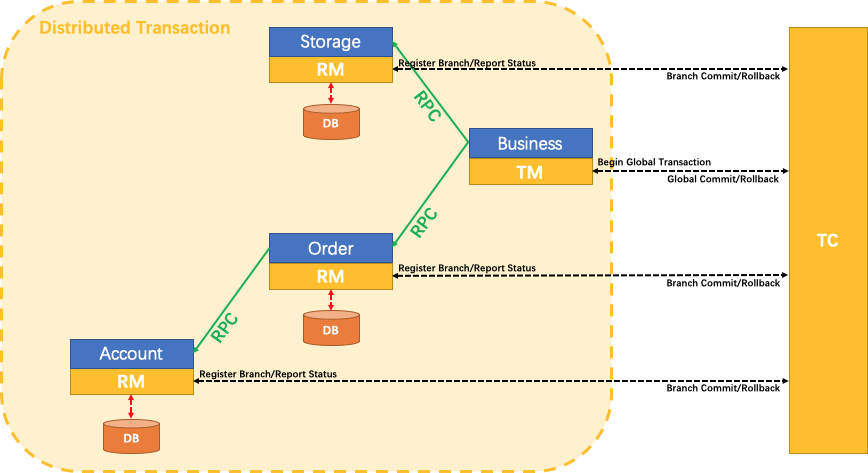

#### 启动 seata-server

> TC 服务器，监控所有事务的事务协调者

> https://seata.apache.org/zh-cn/download/seata-server/
> 
> **本次实验，下载 2.1.0 版本**；

解压并启动：` seata-server.bat`

```xml
docker run -d -p 8091:8091 -p 7091:7091 --name=seata-server --restart=always apache/seata-server:2.1.0
```

#### 导入依赖

> 每个微服务导入 seata 依赖

```xml
<dependency> 
 <groupId>com.alibaba.cloud</groupId> 
 <artifactId>spring-cloud-starter-alibaba-seata</artifactId> 
</dependency>
```

#### 配置

Seata要求每个微服务创建 `file.conf` ⽂件，完整内容如下； 【**微服务只需要复制 service 块 配置即可**】

> 内容取自：https://github.com/apache/incubator-seata/tree/develop/script/client/conf

```bash
#  Copyright 1999-2019 Seata.io Group.
#
#  Licensed under the Apache License, Version 2.0 (the "License");
#  you may not use this file except in compliance with the License.
#  You may obtain a copy of the License at
#
#  http://www.apache.org/licenses/LICENSE-2.0
#
#  Unless required by applicable law or agreed to in writing, software
#  distributed under the License is distributed on an "AS IS" BASIS,
#  WITHOUT WARRANTIES OR CONDITIONS OF ANY KIND, either express or implied.
#  See the License for the specific language governing permissions and
#  limitations under the License.

transport {
  # tcp, unix-domain-socket
  type = "TCP"
  #NIO, NATIVE
  server = "NIO"
  #enable heartbeat
  heartbeat = true
  # the tm client batch send request enable
  enableTmClientBatchSendRequest = false
  # the rm client batch send request enable
  enableRmClientBatchSendRequest = true
   # the rm client rpc request timeout
  rpcRmRequestTimeout = 2000
  # the tm client rpc request timeout
  rpcTmRequestTimeout = 30000
  # the rm client rpc request timeout
  rpcRmRequestTimeout = 15000
  #thread factory for netty
  threadFactory {
    bossThreadPrefix = "NettyBoss"
    workerThreadPrefix = "NettyServerNIOWorker"
    serverExecutorThread-prefix = "NettyServerBizHandler"
    shareBossWorker = false
    clientSelectorThreadPrefix = "NettyClientSelector"
    clientSelectorThreadSize = 1
    clientWorkerThreadPrefix = "NettyClientWorkerThread"
    # netty boss thread size
    bossThreadSize = 1
    #auto default pin or 8
    workerThreadSize = "default"
  }
  shutdown {
    # when destroy server, wait seconds
    wait = 3
  }
  serialization = "seata"
  compressor = "none"
}
service {
  #transaction service group mapping
  vgroupMapping.default_tx_group = "default"
  #only support when registry.type=file, please don't set multiple addresses
  default.grouplist = "127.0.0.1:8091"
  #degrade, current not support
  enableDegrade = false
  #disable seata
  disableGlobalTransaction = false
}

client {
  rm {
    asyncCommitBufferLimit = 10000
    lock {
      retryInterval = 10
      retryTimes = 30
      retryPolicyBranchRollbackOnConflict = true
    }
    reportRetryCount = 5
    tableMetaCheckEnable = false
    tableMetaCheckerInterval = 60000
    reportSuccessEnable = false
    sagaBranchRegisterEnable = false
    sagaJsonParser = "fastjson"
    sagaRetryPersistModeUpdate = false
    sagaCompensatePersistModeUpdate = false
    tccActionInterceptorOrder = -2147482648 #Ordered.HIGHEST_PRECEDENCE + 1000
    sqlParserType = "druid"
    branchExecutionTimeoutXA = 60000
    connectionTwoPhaseHoldTimeoutXA = 10000
  }
  tm {
    commitRetryCount = 5
    rollbackRetryCount = 5
    defaultGlobalTransactionTimeout = 60000
    degradeCheck = false
    degradeCheckPeriod = 2000
    degradeCheckAllowTimes = 10
    interceptorOrder = -2147482648 #Ordered.HIGHEST_PRECEDENCE + 1000
  }
  undo {
    dataValidation = true
    onlyCareUpdateColumns = true
    logSerialization = "jackson"
    logTable = "undo_log"
    compress {
      enable = true
      # allow zip, gzip, deflater, lz4, bzip2, zstd default is zip
      type = zip
      # if rollback info size > threshold, then will be compress
      # allow k m g t
      threshold = 64k
    }
  }
  loadBalance {
      type = "XID"
      virtualNodes = 10
  }
}
log {
  exceptionRate = 100
}
tcc {
  fence {
    # tcc fence log table name
    logTableName = tcc_fence_log
    # tcc fence log clean period
    cleanPeriod = 1h
  }
}
```

#### @GlobalTransactional

> 标注全局事务注解。就可以开启全局事务功能；测试回滚特性

```xml
serializer=jackson&compressorType=NONE
```

### Seata 二阶提交协议原理

#### 总体流程

https://seata.apache.org/zh-cn/docs/overview/what-is-seata

> **两阶段提交协议的演变**：
> 
> - **一阶段**：业务数据和回滚日志记录在同一个本地事务中**提交**，**释放本地锁和连接资源**。
> - **二阶段**：(速度极快)
>   - 提交异步化，非常快速地完成。
>   - 回滚通过一阶段的回滚日志进行反向补偿。

#### 详细流程

**一阶段过程****：**

1. **解析 SQL**：得到 SQL 的类型（UPDATE），表（product），条件（where name = 'xxx'）等相关的信息。
  1. update **storage_tbl **set count = count-2 **where id =?**
2. **查询前镜像**：根据解析得到的条件信息，生成查询语句，定位数据。保存到undo_log中
  1. select * from **storage_tbl  where id =?**
3. **执行业务 SQL**：更新这条记录
  1. 更新库存
4. **查询后镜像**：根据前镜像的结果，通过 **主键** 定位数据。
  1. 拿到后镜像：select * from **storage_tbl  where id =?**
5. **插入回滚日志**：把前后镜像数据以及业务 SQL 相关的信息组成一条回滚日志记录，插入到 `UNDO_LOG` 表中。
  1. 把知道的所有信息（前后镜像）插入undo_log
6. **提交前，向 TC 注册分支**：申请 `storage_tbl `** s**表中，主键值等于 1 的记录的 **全局锁** 。
7. **本地事务提交**：业务数据的更新和前面步骤中生成的 UNDO LOG 一并提交。
8. **将本地事务提交的结果上报给 TC**。

> 前镜像;数据没有修改之前的样式

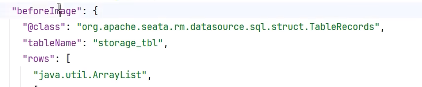

> 后镜像：数据修改之后的样子

> 想要回滚：按照前镜像修改回去

```json
{
    "@class": "org.apache.seata.rm.datasource.undo.BranchUndoLog",
    "xid": "172.17.0.4:8091:7161412682767847435",
    "branchId": 7161412682767847436,
    "sqlUndoLogs": [
        "java.util.ArrayList",
        [
            {
                "@class": "org.apache.seata.rm.datasource.undo.SQLUndoLog",
                "sqlType": "UPDATE",
                "tableName": "storage_tbl",
                "beforeImage": {
                    "@class": "org.apache.seata.rm.datasource.sql.struct.TableRecords",
                    "tableName": "storage_tbl",
                    "rows": [
                        "java.util.ArrayList",
                        [
                            {
                                "@class": "org.apache.seata.rm.datasource.sql.struct.Row",
                                "fields": [
                                    "java.util.ArrayList",
                                    [
                                        {
                                            "@class": "org.apache.seata.rm.datasource.sql.struct.Field",
                                            "name": "count",
                                            "keyType": "NULL",
                                            "type": 4,
                                            "value": 1000
                                        },
                                        {
                                            "@class": "org.apache.seata.rm.datasource.sql.struct.Field",
                                            "name": "id",
                                            "keyType": "PRIMARY_KEY",
                                            "type": 4,
                                            "value": 1
                                        }
                                    ]
                                ]
                            }
                        ]
                    ]
                },
                "afterImage": {
                    "@class": "org.apache.seata.rm.datasource.sql.struct.TableRecords",
                    "tableName": "storage_tbl",
                    "rows": [
                        "java.util.ArrayList",
                        [
                            {
                                "@class": "org.apache.seata.rm.datasource.sql.struct.Row",
                                "fields": [
                                    "java.util.ArrayList",
                                    [
                                        {
                                            "@class": "org.apache.seata.rm.datasource.sql.struct.Field",
                                            "name": "count",
                                            "keyType": "NULL",
                                            "type": 4,
                                            "value": 998
                                        },
                                        {
                                            "@class": "org.apache.seata.rm.datasource.sql.struct.Field",
                                            "name": "id",
                                            "keyType": "PRIMARY_KEY",
                                            "type": 4,
                                            "value": 1
                                        }
                                    ]
                                ]
                            }
                        ]
                    ]
                }
            }
        ]
    ]
}
```

> 原理查看70-72集
> 
> https://www.bilibili.com/video/BV1UJc2ezEFU

**二阶段：回滚****：**

1. 收到 **TC 的分支回滚请求**，开启一个本地事务，执行如下操作。
2. 通过 XID 和 Branch ID 查找到相应的** UNDO LOG 记录**。
3. **数据校验：**拿 UNDO LOG 中的后镜与当前数据进行比较，如果有不同，说明数据被当前全局事务之外的动作做了修改。这种情况，需要根据配置策略来做处理，详细的说明在另外的文档中介绍。
4. 根据** UNDO LOG 中的前镜像**和业务 SQL 的相关信息生成并执行**回滚的语句**；
5. **提交本地事务**。并把本地事务的执行结果（即分支事务回滚的结果）上报给 TC。

**二阶段：提交****：**

1. 收到 **TC 的分支提交请求**，把请求放入一个异步任务的队列中，马上返回提交成功的结果给 TC。
2. 异步任务阶段的分支提交请求将异步和批量地**删除相应 UNDO LOG **记录。

### 事务模式

> 我们最终都使用 `AT`和 `TCC`模式

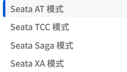

**AT**: Auto：二阶提交协议

**XA**：二阶提交协议；（性能很低下）。数据库原生支持

Saga：长事务：结合消息对队列；

**TCC**：全手动编程进行事务控制。

- 一个事务三个阶段：Try（尝试），Confirm（确认），Cancel（取消） 三个操作
- Try 阶段，预定操作资源（Prepare） 这一阶段所以执行的方法便是被 `@TwoPhaseBusinessAction` 所修饰的方法。如示例代码中的 `prepare` 方法。
- Confirm 阶段，执行主要业务逻辑（Commit） 这一阶段使用 `commitMethod` 属性所指向的方法，来执行Confirm 的工作。
- Cancel 阶段，事务回滚（Rollback） 这一阶段使用 `rollbackMethod` 属性所指向的方法，来执行 Cancel 的工作。

# Spring Cloud 总结