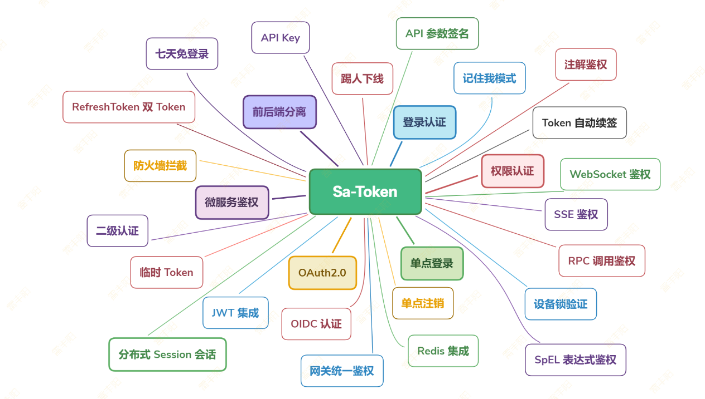
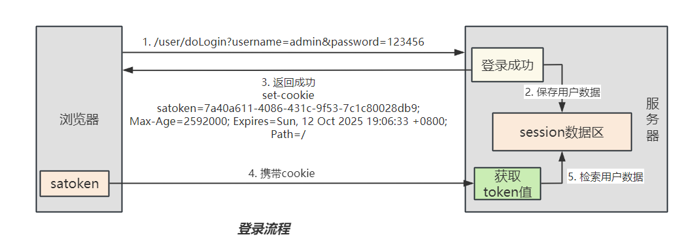
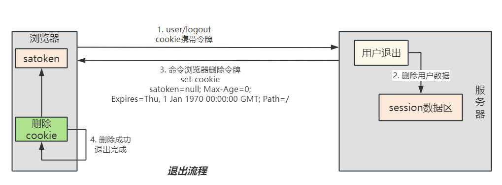
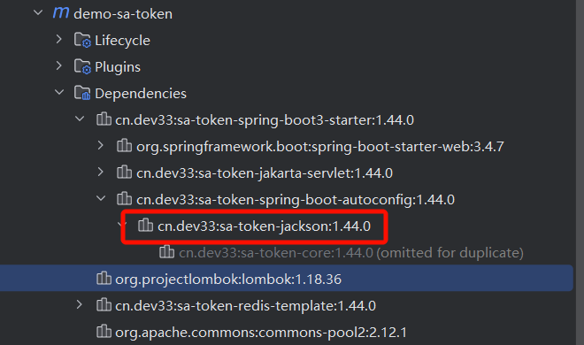
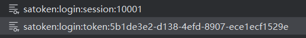
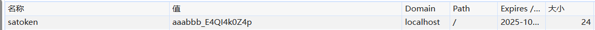
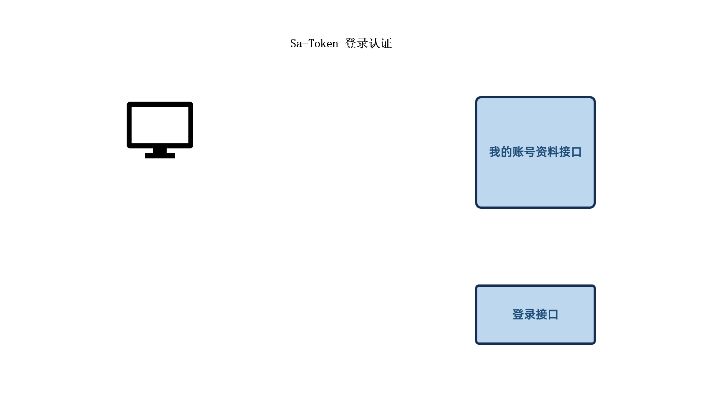
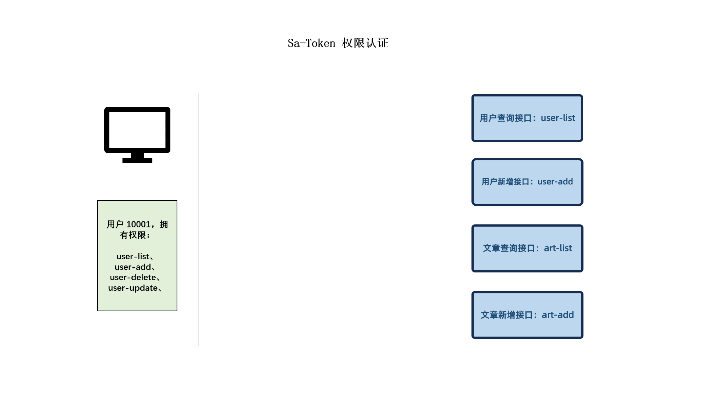

# 11. Sa-Token

> 官方文档：https://sa-token.cc/doc.html#/start/example

参照官方文档，做如下实验：

1. 整合SpringBoot3
2. 登录认证：
3. 权限认证：https://sa-token.cc/doc.html#/use/jur-auth
4. AOP注解权限：https://sa-token.cc/doc.html#/plugin/aop-at
5. 集成Redis：https://sa-token.cc/doc.html#/up/integ-redis
6. 前后分离：https://sa-token.cc/doc.html#/up/not-cookie
7. 自定义Token：https://sa-token.cc/doc.html#/up/token-style
8. 二级认证：https://sa-token.cc/doc.html#/up/safe-auth



# 快速入门

## 创建项目

> 创建SpringBoot项目。导入sa-token依赖

```xml
<dependency>
    <groupId>cn.dev33</groupId>
    <artifactId>sa-token-spring-boot3-starter</artifactId>
    <version>1.44.0</version>
</dependency>
```

## 配置文件

```yaml
server:
    # 端口
    port: 8080
    
############## Sa-Token 配置 (文档: https://sa-token.cc) ##############
sa-token: 
    # token 名称（同时也是 cookie 名称）
    token-name: satoken
    # token 有效期（单位：秒） 默认30天，-1 代表永久有效
    timeout: 2592000
    # token 最低活跃频率（单位：秒），如果 token 超过此时间没有访问系统就会被冻结，默认-1 代表不限制，永不冻结
    active-timeout: -1
    # 是否允许同一账号多地同时登录 （为 true 时允许一起登录, 为 false 时新登录挤掉旧登录）
    is-concurrent: true
    # 在多人登录同一账号时，是否共用一个 token （为 true 时所有登录共用一个 token, 为 false 时每次登录新建一个 token）
    is-share: false
    # token 风格（默认可取值：uuid、simple-uuid、random-32、random-64、random-128、tik）
    token-style: uuid
    # 是否输出操作日志 
    is-log: true
```

## 启动类

```typescript
@Slf4j
@SpringBootApplication
public class SaTokenMainApplication {

    public static void main(String[] args) {
        SpringApplication.run(SaTokenMainApplication.class, args);
        SaTokenConfig config = SaManager.getConfig();
        log.info("SaTokenMainApplication启动成功，配置：{}",config);
    }
}
```

## 测试Controller

> 编写两个模拟方法。暂时不用连数据库，简单测试功能即可
> 
> 1. **模拟登录**：只要是 **admin**/**123456 **就代表登录成功
> 2. **判断登录状态**：快速判断当前浏览器对应的用户是否是登录状态

```java
package com.lfy.satoken.controller;

import cn.dev33.satoken.stp.StpUtil;
import org.springframework.web.bind.annotation.RequestMapping;
import org.springframework.web.bind.annotation.RestController;

@RestController
@RequestMapping("/user/")
public class UserController {

    // 测试登录，浏览器访问： http://localhost:10008/user/doLogin?username=admin&password=123456
    @RequestMapping("doLogin")
    public String doLogin(String username, String password) {
        // 此处仅作模拟示例，真实项目需要从数据库中查询数据进行比对
        if("admin".equals(username) && "123456".equals(password)) {
            StpUtil.login(10001);
            return "登录成功";
        }
        return "登录失败";
    }

    // 查询登录状态，浏览器访问： http://localhost:10008/user/isLogin
    @RequestMapping("isLogin")
    public String isLogin() {
        return "当前会话是否登录：" + StpUtil.isLogin();
    }

    // 测试注销，浏览器访问： http://localhost:10008/user/logout
    @RequestMapping("logout")
    public String logout() {
        StpUtil.logout();
        return "用户已退出登录";
    }

}
```

## 原理





# 进阶实验：token

## 引入Redis，统一存储Session数据

> Sa-Token **默认将数据保存在内存中**，此模式**读写速度最快**，且避免了**序列化与反序列化**带来的性能消耗，但是此模式也有一些**缺点**，比如：
> 
> 1. **重启后数据会丢失**。
> 2. **无法在分布式环境中共享数据**。

### 引入依赖

```xml
<!-- Sa-Token 整合 RedisTemplate -->
<dependency>
    <groupId>cn.dev33</groupId>
    <artifactId>sa-token-redis-template</artifactId>
    <version>1.44.0</version>
</dependency>

<!-- 提供 Redis 连接池 -->
<dependency>
    <groupId>org.apache.commons</groupId>
    <artifactId>commons-pool2</artifactId>
</dependency>
```

### 序列化框架

> **默认使用 jackson**（SpringBoot 底层自带的 json转换框架）



> 可以导入fastjson2，作为替换；（fastjson第一版漏洞太多了）

```xml
<!-- Sa-Token 整合 Fastjson2 -->
<dependency>
    <groupId>cn.dev33</groupId>
    <artifactId>sa-token-fastjson2</artifactId>
    <version>1.44.0</version>
</dependency>
```

### Redis连接配置

> 修改application.yml

```yaml
spring:
  data:
    redis:
      host: localhost
      port: 6379
      password: ruoyi123
```

### 请求测试

1. 先测试：http://localhost:10008/user/isLogin 显示未登录
2. 再发送：http://localhost:10008/user/doLogin?username=admin&password=123456  显示登录成功
3. 再发送：http://localhost:10008/user/isLogin 显示已登录
4. 查看redis数据；且每个数据有过期时间



## 自定义token风格

### 内置风格

> Sa-Token 默认的 token 生成策略是 uuid 风格，其模样类似于：`623368f0-ae5e-4475-a53f-93e4225f16ae`。如果你对这种风格不太感冒，还可以将 token 生成设置为其他风格。

只需要在yml配置文件里设置 `sa-token.token-style=风格类型` 即可，其有多种取值：

```json
// 1. token-style=uuid    —— uuid风格 (默认风格)
"623368f0-ae5e-4475-a53f-93e4225f16ae"

// 2. token-style=simple-uuid    —— 同上，uuid风格, 只不过去掉了中划线
"6fd4221395024b5f87edd34bc3258ee8"

// 3. token-style=random-32    —— 随机32位字符串
"qEjyPsEA1Bkc9dr8YP6okFr5umCZNR6W"

// 4. token-style=random-64    —— 随机64位字符串
"v4ueNLEpPwMtmOPMBtOOeIQsvP8z9gkMgIVibTUVjkrNrlfra5CGwQkViDjO8jcc"

// 5. token-style=random-128    —— 随机128位字符串
"nojYPmcEtrFEaN0Otpssa8I8jpk8FO53UcMZkCP9qyoHaDbKS6dxoRPky9c6QlftQ0pdzxRGXsKZmUSrPeZBOD6kJFfmfgiRyUmYWcj4WU4SSP2ilakWN1HYnIuX0Olj"

// 6. token-style=tik    —— tik风格
"gr_SwoIN0MC1ewxHX_vfCW3BothWDZMMtx__"
```

### 自定义风格

只需要重写 `SaStrategy` 策略类的 `createToken` 算法即可;

```java
@Slf4j
@Configuration
public class SaTokenConfigure {

    /**
     * 重写 Sa-Token 框架内部算法策略
     */
    @PostConstruct
    public void rewriteSaStrategy() {
        // 重写 Token 生成策略
        SaStrategy.instance.createToken = (loginId, loginType) -> {
            log.info("loginId={}, loginType={}", loginId, loginType);
            return "aaabbb_"+SaFoxUtil.getRandomString(10);    // 随机60位长度字符串
        };
    }
}
```



## 集成jwt

### 引入依赖

> 1. 注意: sa-token-jwt 显式依赖 hutool-jwt 5.7.14 版本，保险起见：你的项目中要么不引入 hutool，要么引入版本 >= 5.7.14 的 hutool 版本。
> 2. hutool 5.8.13 和 5.8.14 版本下会出现类型转换问题

```xml
<!-- Sa-Token 整合 jwt -->
<dependency>
    <groupId>cn.dev33</groupId>
    <artifactId>sa-token-jwt</artifactId>
    <version>1.44.0</version>
</dependency>
```

### 配置密钥

```java
sa-token:
    # jwt秘钥 
    jwt-secret-key: asdasdasifhueuiwyurfewbfjsdafjk
```

### 注入jwt实现（三种模式）

#### Simple简单模式

```typescript
@Configuration
public class SaTokenConfigure {
    // Sa-Token 整合 jwt (Simple 简单模式)
    @Bean
    public StpLogic getStpLogicJwt() {
        return new StpLogicJwtForSimple();
    }
}
```

#### Mixin 混入模式

```typescript
@Configuration
public class SaTokenConfigure {
    // Sa-Token 整合 jwt (Mixin 混入模式)
    @Bean
    public StpLogic getStpLogicJwt() {
        return new StpLogicJwtForMixin();
    }
}
```

#### Stateless 模式

> 服务器完全无状态模式。

```typescript
@Configuration
public class SaTokenConfigure {
    // Sa-Token 整合 jwt (Stateless 无状态模式)
    @Bean
    public StpLogic getStpLogicJwt() {
        return new StpLogicJwtForStateless();
    }
}
```

### 登录时额外数据

> SaLoginParameter 的所有extra数据，会在生成jwt的时候带上

```java
SaLoginParameter loginParameter = new SaLoginParameter();
loginParameter.setExtra("username","admin");
loginParameter.setExtra("email","admin@qq.coom");
StpUtil.login(10001,loginParameter);
```

# 进阶实验：功能

## 登录认证



## StpUtil：常用方法

### 登录&注销

```java
// 会话登录：参数填写要登录的账号id，建议的数据类型：long | int | String， 
// 不可以传入复杂类型，如：User、Admin 等等
StpUtil.login(Object id);

// 当前会话注销登录
StpUtil.logout();

// 获取当前会话是否已经登录，返回true=已登录，false=未登录
StpUtil.isLogin();

// 检验当前会话是否已经登录, 如果未登录，则抛出异常：`NotLoginException`
StpUtil.checkLogin();
```

异常 `NotLoginException` 代表当前会话暂未登录，可能的原因有很多： 前端没有提交 token、前端提交的 token 是无效的、前端提交的 token 已经过期 …… 等等

### 会话查询

```json
// 获取当前会话账号id, 如果未登录，则抛出异常：`NotLoginException`
StpUtil.getLoginId();

// 类似查询API还有：
StpUtil.getLoginIdAsString();    // 获取当前会话账号id, 并转化为`String`类型
StpUtil.getLoginIdAsInt();       // 获取当前会话账号id, 并转化为`int`类型
StpUtil.getLoginIdAsLong();      // 获取当前会话账号id, 并转化为`long`类型

// ---------- 指定未登录情形下返回的默认值 ----------

// 获取当前会话账号id, 如果未登录，则返回 null 
StpUtil.getLoginIdDefaultNull();

// 获取当前会话账号id, 如果未登录，则返回默认值 （`defaultValue`可以为任意类型）
StpUtil.getLoginId(T defaultValue);
```

### token查询

```java
// 获取当前会话的 token 值
StpUtil.getTokenValue();

// 获取当前`StpLogic`的 token 名称
StpUtil.getTokenName();

// 获取指定 token 对应的账号id，如果未登录，则返回 null
StpUtil.getLoginIdByToken(String tokenValue);

// 获取当前会话剩余有效期（单位：s，返回-1代表永久有效）
StpUtil.getTokenTimeout();

// 获取当前会话的 token 信息参数
StpUtil.getTokenInfo();
```

## 权限认证

### 认证流程

> 所谓**权限认证**，核心逻辑就是**判断一个账号是否拥有指定权限**：
> 
> - 有，就让你通过。
> - 没有？那么禁止访问！
> 
> 深入到底层数据中，就是**每个账号**都会拥有一组**权限码**集合，框架来校验这个集合中是否包含指定的权限码。
> 
> 例如：**当前账号拥有权限码**集合 `["user-add", "user-delete", "user-get"]`，这时候我来校验权限 `"user-update"`，则其结果就是：验证失败，禁止访问。



所以现在**问题的核心就是两个**：

1. **如何获取一个账号**所拥有的**权限码集合**？
  1. 权限码的集合其实在数据库有对应表关系。
  2. 用户登录进来要自己去数据库查询
  3. 查询出的所有权限，sa-token将会拿到，将来用它们进行匹配
2. **本次操作需要验证的权限码是哪个**？
  1. 每个方法对应哪些权限码，是业务提前定死
  2. 每次请求进来，用方法的权限码，和用户的权限码列表进行匹配
  3. 匹配上则放行
  4. 将来每个方法上都会标注这个方法的权限码。每次请求进行匹配校验。
    @CheckPerssion("user:get:info")

### 获取用户权限码集合

> 用户登录以后，Sa-Token框架要有能力获取到用户所有的权限集合与角色列表。这样以后才能匹配

因为每个项目的需求不同，其权限设计也千变万化，因此 [ 获取当前账号权限码集合 ] 这一操作不可能内置到框架中， 所以 Sa-Token 将此操作以接口的方式暴露给你，以方便你根据自己的业务逻辑进行重写。

你需要做的就是新建一个类，实现 `StpInterface`接口，例如以下代码：

```typescript
/**
 * 自定义权限加载接口实现类
 */
@Component    // 保证此类被 SpringBoot 扫描，完成 Sa-Token 的自定义权限验证扩展 
public class StpInterfaceImpl implements StpInterface {

    /**
     * 返回一个账号所拥有的权限码集合 
     */
    @Override
    public List<String> getPermissionList(Object loginId, String loginType) {
        // 本 list 仅做模拟，实际项目中要根据具体业务逻辑来查询权限
        List<String> list = new ArrayList<String>();    
        list.add("101");
        list.add("user.add");
        list.add("user.update");
        list.add("user.get");
        // list.add("user.delete");
        list.add("art.*");
        return list;
    }

    /**
     * 返回一个账号所拥有的角色标识集合 (权限与角色可分开校验)
     */
    @Override
    public List<String> getRoleList(Object loginId, String loginType) {
        // 本 list 仅做模拟，实际项目中要根据具体业务逻辑来查询角色
        List<String> list = new ArrayList<String>();    
        list.add("admin");
        list.add("super-admin");
        return list;
    }

}
```

### 权限校验

```json
// 获取：当前账号所拥有的权限集合
StpUtil.getPermissionList();

// 判断：当前账号是否含有指定权限, 返回 true 或 false
StpUtil.hasPermission("user.add");        

// 校验：当前账号是否含有指定权限, 如果验证未通过，则抛出异常: NotPermissionException 
StpUtil.checkPermission("user.add");        

// 校验：当前账号是否含有指定权限 [指定多个，必须全部验证通过]
StpUtil.checkPermissionAnd("user.add", "user.delete", "user.get");        

// 校验：当前账号是否含有指定权限 [指定多个，只要其一验证通过即可]
StpUtil.checkPermissionOr("user.add", "user.delete", "user.get");   
```

### 角色校验

> 在 Sa-Token 中，角色和权限可以分开独立验证

```json
// 获取：当前账号所拥有的角色集合
StpUtil.getRoleList();

// 判断：当前账号是否拥有指定角色, 返回 true 或 false
StpUtil.hasRole("super-admin");        

// 校验：当前账号是否含有指定角色标识, 如果验证未通过，则抛出异常: NotRoleException
StpUtil.checkRole("super-admin");        

// 校验：当前账号是否含有指定角色标识 [指定多个，必须全部验证通过]
StpUtil.checkRoleAnd("super-admin", "shop-admin");

// 校验：当前账号是否含有指定角色标识 [指定多个，只要其一验证通过即可] 
StpUtil.checkRoleOr("super-admin", "shop-admin");
```

### 全局异常处理

有同学要问，鉴权失败，抛出异常，然后呢？要把异常显示给用户看吗？当然不可以！

你可以创建一个**全局异常拦截器**，统一返回给前端的格式，参考：

```typescript
@RestControllerAdvice
public class GlobalExceptionHandler {
    // 全局异常拦截 
    @ExceptionHandler
    public SaResult handlerException(Exception e) {
        e.printStackTrace(); 
        return SaResult.error(e.getMessage());
    }
}
```

### 权限通配符

Sa-Token允许你根据通配符指定泛权;

例如当一个账号拥有`art.*`的权限时，`art.add`、`art.delete`、`art.update`都将匹配通过

```json
// 当拥有 art.* 权限时
StpUtil.hasPermission("art.add");        // true
StpUtil.hasPermission("art.update");     // true
StpUtil.hasPermission("goods.add");      // false

// 当拥有 *.delete 权限时
StpUtil.hasPermission("art.delete");      // true
StpUtil.hasPermission("user.delete");     // true
StpUtil.hasPermission("user.update");     // false

// 当拥有 *.js 权限时
StpUtil.hasPermission("index.js");        // true
StpUtil.hasPermission("index.css");       // false
StpUtil.hasPermission("index.html");      // false
```

## 注解鉴权

### 常用注解

尽管使用代码鉴权非常方便，但是我仍希望把鉴权逻辑和业务逻辑分离开来，我可以使用注解鉴权吗？当然可以！**注解鉴权 —— 优雅的将鉴权与业务代码分离**！

- `@SaCheckLogin`: 登录校验 —— 只有登录之后才能进入该方法。
- `@SaCheckRole("admin")`: 角色校验 —— 必须具有指定角色标识才能进入该方法。
- `@SaCheckPermission("user:add")`: 权限校验 —— 必须具有指定权限才能进入该方法。
- `@SaCheckSafe`: 二级认证校验 —— 必须二级认证之后才能进入该方法。
- `@SaCheckHttpBasic`: HttpBasic校验 —— 只有通过 HttpBasic 认证后才能进入该方法。
- `@SaCheckHttpDigest`: HttpDigest校验 —— 只有通过 HttpDigest 认证后才能进入该方法。
- `@SaCheckDisable("comment")`：账号服务封禁校验 —— 校验当前账号指定服务是否被封禁。
- `@SaCheckSign`：API 签名校验 —— 用于跨系统的 API 签名参数校验。
- `@SaIgnore`：忽略校验 —— 表示被修饰的方法或类无需进行注解鉴权和路由拦截器鉴权。

> 以上的注解，只能标注在 Controller 方法上

### 配置拦截器

```typescript
@Configuration
public class SaTokenConfigure implements WebMvcConfigurer {
    // 注册 Sa-Token 拦截器，打开注解式鉴权功能 
    @Override
    public void addInterceptors(InterceptorRegistry registry) {
        // 注册 Sa-Token 拦截器，打开注解式鉴权功能 
        registry.addInterceptor(new SaInterceptor()).addPathPatterns("/**");    
    }
}
```

## 路由器鉴权：了解

> https://sa-token.cc/doc.html#/use/route-check

### 注册 Sa-Token 路由拦截器

**需求场景：**项目中所有接口均需要登录认证，只有 “登录接口” 本身对外开放；

怎么实现呢？给每个接口加上鉴权注解？手写全局拦截器？似乎都不是非常方便

```typescript
@Configuration
public class SaTokenConfigure implements WebMvcConfigurer {
    // 注册拦截器
    @Override
    public void addInterceptors(InterceptorRegistry registry) {
        // 注册 Sa-Token 拦截器，校验规则为 StpUtil.checkLogin() 登录校验。
        registry.addInterceptor(new SaInterceptor(handle -> StpUtil.checkLogin()))
                .addPathPatterns("/**")
                .excludePathPatterns("/user/doLogin"); 
    }
}
```

### 更完整的写法

```typescript
@Configuration
public class SaTokenConfigure implements WebMvcConfigurer {
    // 注册 Sa-Token 的拦截器
    @Override
    public void addInterceptors(InterceptorRegistry registry) {
        // 注册路由拦截器，自定义认证规则 
        registry.addInterceptor(new SaInterceptor(handler -> {
            
            // 登录校验 -- 拦截所有路由，并排除/user/doLogin 用于开放登录 
            SaRouter.match("/**", "/user/doLogin", r -> StpUtil.checkLogin());

            // 角色校验 -- 拦截以 admin 开头的路由，必须具备 admin 角色或者 super-admin 角色才可以通过认证 
            SaRouter.match("/admin/**", r -> StpUtil.checkRoleOr("admin", "super-admin"));

            // 权限校验 -- 不同模块校验不同权限 
            SaRouter.match("/user/**", r -> StpUtil.checkPermission("user"));
            SaRouter.match("/admin/**", r -> StpUtil.checkPermission("admin"));
            SaRouter.match("/goods/**", r -> StpUtil.checkPermission("goods"));
            SaRouter.match("/orders/**", r -> StpUtil.checkPermission("orders"));
            SaRouter.match("/notice/**", r -> StpUtil.checkPermission("notice"));
            SaRouter.match("/comment/**", r -> StpUtil.checkPermission("comment"));
            
            // 甚至你可以随意的写一个打印语句
            SaRouter.match("/**", r -> System.out.println("----啦啦啦----"));

            // 连缀写法
            SaRouter.match("/**").check(r -> System.out.println("----啦啦啦----"));
            
        })).addPathPatterns("/**");
    }
}
```

## AOP鉴权

在 [注解式鉴权](https://sa-token.cc/doc.html#/use/at-check) 章节，我们非常轻松的实现了注解鉴权， 但是**默认的拦截器模式却有一个缺点，那就是无法在**`Controller层`**以外的代码使用进行校验**

因此Sa-Token提供AOP插件，你只需在`pom.xml`里添加如下依赖，便可以在任意层级使用注解鉴权

```xml
<!-- Sa-Token 整合 SpringAOP 实现注解鉴权 -->
<dependency>
    <groupId>cn.dev33</groupId>
    <artifactId>sa-token-spring-aop</artifactId>
    <version>1.44.0</version>
</dependency>
```

> 注意点：
> 
> - 使用拦截器模式，只能把注解写在`Controller层`，使用AOP模式，可以**将注解写在任意层级**
> - 拦截器模式和AOP模式**不可同时集成**，否则会在`Controller层`发生一个注解校验两次的bug

## 网关统一鉴权：了解

### 引入依赖

> 注：Redis包是必须的，因为我们需要和各个服务通过Redis来同步数据

```xml
<!-- Sa-Token 权限认证（Reactor响应式集成）, 在线文档：https://sa-token.cc -->
<dependency>
    <groupId>cn.dev33</groupId>
    <artifactId>sa-token-reactor-spring-boot3-starter</artifactId>
    <version>1.44.0</version>
</dependency>

<!-- Sa-Token 整合 Redis （使用 jackson 序列化方式） -->
<dependency>
    <groupId>cn.dev33</groupId>
    <artifactId>sa-token-redis-jackson</artifactId>
    <version>1.44.0</version>
</dependency>
<dependency>
    <groupId>org.apache.commons</groupId>
    <artifactId>commons-pool2</artifactId>
</dependency>
```

### 实现鉴权接口

关于数据的获取，建议以下**方案三选一**：

1. 在网关处集成**SQL框架**，直接从**数据库查询数据**
2. 先从**Redis中获取数据**，获取不到时**走SQL框架查询数据库**
3. 先从**Redis中获取缓存数据**，获取不到时走**RPC调用子服务** (专门的权限**数据**提供服务) 获取

```typescript
/**
 * 自定义权限验证接口扩展 
 */
@Component   
public class StpInterfaceImpl implements StpInterface {

    @Override
    public List<String> getPermissionList(Object loginId, String loginType) {
        // 返回此 loginId 拥有的权限列表 
        return ...;
    }

    @Override
    public List<String> getRoleList(Object loginId, String loginType) {
        // 返回此 loginId 拥有的角色列表
        return ...;
    }

}
```

### 注册全局过滤器

```typescript
/**
 * [Sa-Token 权限认证] 配置类 
 * @author click33
 */
@Configuration
public class SaTokenConfigure {
    // 注册 Sa-Token全局过滤器 
    @Bean
    public SaReactorFilter getSaReactorFilter() {
        return new SaReactorFilter()
            // 拦截地址 
            .addInclude("/**")    /* 拦截全部path */
            // 开放地址 
            .addExclude("/favicon.ico")
            // 鉴权方法：每次访问进入 
            .setAuth(obj -> {
                // 登录校验 -- 拦截所有路由，并排除/user/doLogin 用于开放登录 
                SaRouter.match("/**", "/user/doLogin", r -> StpUtil.checkLogin());
                
                // 权限认证 -- 不同模块, 校验不同权限 
                SaRouter.match("/user/**", r -> StpUtil.checkPermission("user"));
                SaRouter.match("/admin/**", r -> StpUtil.checkPermission("admin"));
                SaRouter.match("/goods/**", r -> StpUtil.checkPermission("goods"));
                SaRouter.match("/orders/**", r -> StpUtil.checkPermission("orders"));
                
                // 更多匹配 ...  */
            })
            // 异常处理方法：每次setAuth函数出现异常时进入 
            .setError(e -> {
                return SaResult.error(e.getMessage());
            })
            ;
    }
}
```

# 常用类

## StpUtil：鉴权工具类

https://sa-token.cc/doc.html#/api/stp-util

## SaSession：会话对象

SaSession session = StpUtil.getSession();

https://sa-token.cc/doc.html#/api/sa-session

> 基本使用：https://sa-token.cc/doc.html#/use/session

## 全局类、方法

### SaManager

SaManager 负责管理 Sa-Token 所有全局组件。

```json
SaManager.getConfig();                 // 获取全局配置对象 
SaManager.getSaTokenDao();             // 获取数据持久化对象 
SaManager.getStpInterface();           // 获取权限认证对象 
SaManager.getSaTokenContext();         // 获取SaTokenContext上下文处理对象
SaManager.getSaTokenListener();        // 获取侦听器对象 
SaManager.getSaTemp();                 // 获取临时令牌认证模块对象 
SaManager.getSaJsonTemplate();         // 获取 JSON 转换器 Bean
SaManager.getSaSignTemplate();         // 获取参数签名 Bean 
SaManager.getStpLogic("type");         // 获取指定账号类型的StpLogic对象，获取不到时自动创建并返回 
SaManager.getStpLogic("type", false);  // 获取指定账号类型的StpLogic对象，获取不到时抛出异常 
SaManager.putStpLogic(stpLogic);       // 向全局集合中 put 一个 StpLogic 
```

### SaHolder

Sa-Token上下文持有类，通过此类快速获取当前环境的相关对象

```java
SaHolder.getContext();           // 获取当前请求的 SaTokenContext
SaHolder.getRequest();           // 获取当前请求的 [Request] 对象 
SaHolder.getResponse();          // 获取当前请求的 [Response] 对象 
SaHolder.getStorage();           // 获取当前请求的 [Storage] 对象
SaHolder.getApplication();       // 获取全局 SaApplication 对象
```