# 12. Spring AI

# 概念

> 生成式AI;

## 模型（Model）

**AI 模型**是旨在**处理和生成信息的算法**，通常模仿人类的认知功能。通过从大型数据集中学习模式和洞察，这些模型可以**进行预测**、**生成文本**、**图像**或**其他输出**，从而增强各个行业的各种应用。

AI 模型有许多不同的类型，每种类型都适合特定的用例。虽然 ChatGPT 及其生成式 AI 能力通过文本输入和输出来吸引用户，但许多模型和公司提供多样化的输入和输出。在 ChatGPT 之前，许多人对 Midjourney 和 Stable Diffusion 等文本到图像生成模型着迷。

> **模型**常见分类
> 
> 线性算法 + 梯度算法 = 傅里叶变换

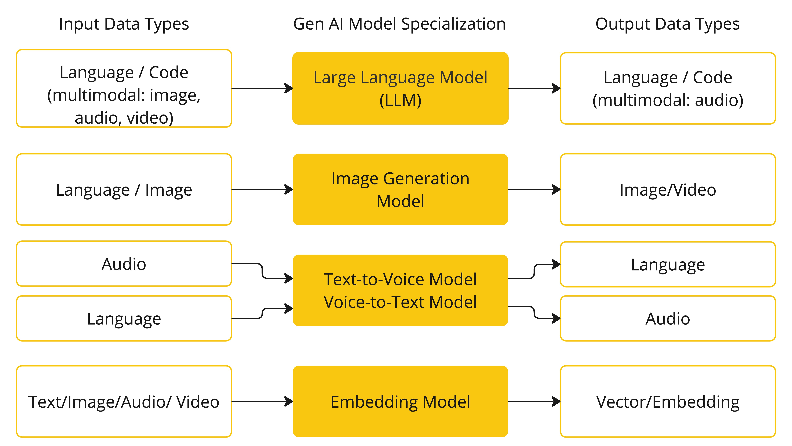

Spring AI 目前支持处理语言、图像和音频输入和输出的模型。上表中最后一行的模型接受文本作为输入并输出数字，这更常被称为文本嵌入，表示 AI 模型内部使用的数据结构。Spring AI 支持嵌入以支持更高级的用例。

像 GPT 这样的模型之所以与众不同，在于它们的预训练特性，GPT 中的 "P" 表示生成式预训练 Transformer (Generative Pre-trained Transformer)。这种预训练特性将 AI 转变为一种通用的开发工具，不再需要广泛的机器学习或模型训练背景。

## 提示词 (Prompts)

**提示词**是基于语言的输入的基础，用于引导 AI 模型产生特定的输出。对于熟悉 ChatGPT 的人来说，提示词可能看起来仅仅是输入到对话框中并发送到 API 的文本。然而，它包含的内容远不止于此。在许多 AI 模型中，提示词的文本不仅仅是一个简单的字符串。

ChatGPT 的 API 在一个提示词内有多个文本输入，每个文本输入都被分配了一个角色。例如，有系统角色，它告诉模型如何表现并设置交互的上下文。还有用户角色，这通常是用户的输入。

这种交互风格的重要性使得“**提示工程 (Prompt Engineering)**”成为了一门独立的学科。有一系列正在迅速发展的技术可以提高提示词的有效性。投入时间来设计一个提示词可以极大地改善产生的输出结果。

> **提示模板 (Prompt Templates)**

创建有效的提示词涉及建立请求的上下文，并用特定于用户输入的值替换请求的部分内容。

此过程使用传统的基于文本的模板引擎进行提示词创建和管理。Spring AI 使用 OSS 库 `StringTemplate`` `来实现此目的。

例如，考虑一个简单的提示模板

```java
Tell me a {adjective} joke about {content}.
```

在 Spring AI 中，提示模板可以类比于 Spring MVC 架构中的“视图 (View)”。提供一个模型对象（通常是一个 `java.util.Map`）来填充模板中的占位符。“渲染”后的字符串成为提供给 AI 模型的提示词内容。

发送给模型的提示词的具体数据格式存在相当大的差异。最初是简单的字符串，但提示词已经演变为包含多条消息，其中每条消息中的每个字符串都代表模型的一个不同角色。

## 嵌入 (Embeddings)

**嵌入Embeddings **是文本、图像或视频的**数值表示**，用于捕获输入之间的关系。

嵌入Embeddings 通过将文本、图像和视频转换为浮点数数组（称为向量）来工作。这些向量旨在捕获文本、图像和视频的含义。嵌入数组的长度称为向量的维度。

通过计算两段文本的向量表示之间的数值距离，应用程序可以确定用于生成嵌入向量的物体之间的相似性。

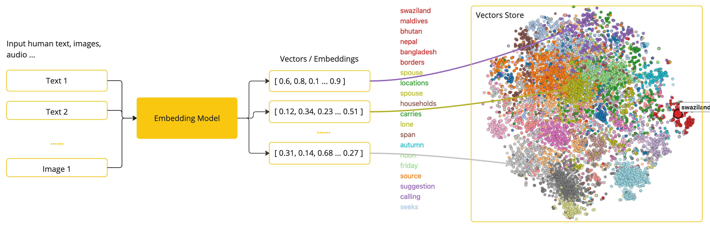

`嵌入Embeddings` 在实际应用中尤其重要，例如`检索增强生成（RAG）模式`。它们能够将数据表示为语义空间中的点，类似于欧几里得几何学中的二维空间，但在更高的维度中。这意味着就像欧几里得几何学中平面上的点根据其坐标可以接近或远离一样，在语义空间中，点的接近程度反映了意义上的相似性。关于相似主题的句子在这个多维空间中的位置更接近，就像图上相互靠近的点一样。这种接近性有助于执行文本分类、语义搜索甚至产品推荐等任务，因为它允许 AI 根据概念在这个扩展的语义景观中的“位置”来区分和分组相关的概念。

你可以将这个语义空间视为一个向量。

**监督学习**： 告诉大模型学的是什么

**无监督学习**：随便输入数据，大模型自己理解

## 词元 (Tokens)

词元是 AI 模型工作的**基础**构建块。在输入时，模型将**单词转换**为**词元**。在输出时，模型将**词元**转换**回单词**。

<u>**在英语中，一个词元大约相当于一个单词的 75%**</u>。作为参考，莎士比亚的全部作品总计约 900,000 个单词，转换为约 120 万个词元。


也许更重要的是，**词元 = 金钱**。在使用托管 AI 模型时，你的费用取决于所使用的词元数量。输入和输出都会计入总词元数。

> 此外，**模型受词元限制**，这限制了单次 API 调用中处理的文本量。这个阈值通常被称为“**上下文窗口 (context window)**”。**模型不会处理超过此限制的任何文本**。

例如，ChatGPT3 的词元限制为 4K，而 GPT4 提供不同的选项，如 **8K**、**16K** 和 32K。Anthropic 的 Claude AI 模型具有 100K 的词元限制，Meta 最近的研究也产生了一个 1M 词元限制的模型。

为了用 GPT4 总结莎士比亚的全部作品，你需要设计软件工程策略来分割数据，并在模型的上下文窗口限制内呈现数据。Spring AI 项目可以帮助你完成此任务。

## 结构化输出（Structured Output）

**AI 模型**的**输出传统**上是一个 `java.lang.String`，即使你要求以 **JSON 格式回复**。它可能是一个正确的 **JSON 字符串**，但它不是一个 JSON 数据结构。它只是一个字符串。此外，将“请求 JSON”作为提示词的一部分并不 100% 准确。

这**种复杂性导致了一个专门领域的出现**，即创建精心设计的提示词以产生预期的输出，然后将产生的简单字符串转换为可用于应用程序集成的可用数据结构。

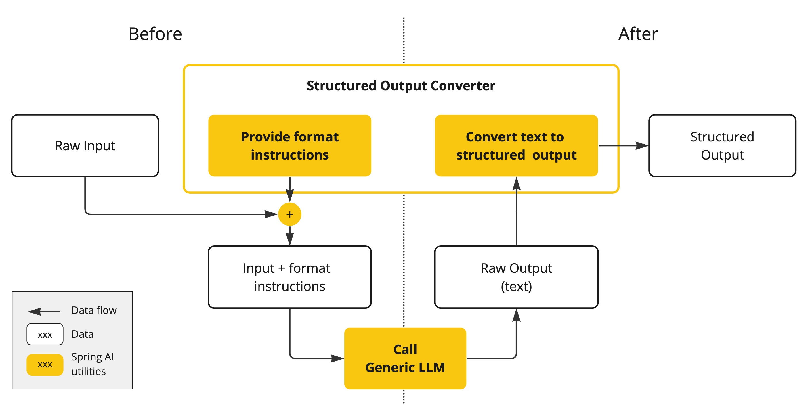

[结构化输出转换](https://docs.springframework.org.cn/spring-ai/reference/api/structured-output-converter.html#_structuredoutputconverter) 采用精心设计的提示词，通常需要与模型进行多次交互才能实现所需的格式。

## 带入自己的数据和工具进入模型

如何让 AI 模型获取它未训练过的信息？

> 请注意，GPT 3.5/4.0 的**数据集仅截至 2021 年 9 月**。因此，模型会回答说对于需要超出该日期知识的问题，它不知道答案。一个有趣的细节是，这个数据集大约有 650GB。

有**三种技术**可以定制 AI 模型以整合您的数据：

- `微调 (Fine Tuning)`：这是一种传统的机器学习技术，涉及调整模型并改变其内部权重。然而，对于机器学习专家来说，这是一个具有挑战性的过程，而且对于像 GPT 这样大小的模型来说，资源消耗非常大。此外，有些模型可能不提供此选项。
  - **Python来做**；把整个 **hugging face** 的任意模型都能训练
  - 准备数据集
  - 开始**训练**
  - 产出新模型
  - 使用新模型**预测**（发数据、回数据）
- `提示填充 (Prompt Stuffing)`：一种更实用的替代方法是将您的数据嵌入到提供给模型的提示词中。考虑到模型的词元限制，需要采用技术在模型的上下文窗口内呈现相关数据。这种方法俗称“填充提示词”。Spring AI 库可帮助您实现基于“填充提示词”技术的解决方案，也称为 [检索增强生成 (RAG)](https://docs.springframework.org.cn/spring-ai/reference/concepts.html#concept-rag)。
- [**工具调用 (Tool Calling)**](https://docs.springframework.org.cn/spring-ai/reference/concepts.html#concept-fc)：此技术允许注册工具（用户定义的服务），将大型语言模型连接到外部系统的 API。Spring AI 极大地简化了您编写以支持[工具调用](https://docs.springframework.org.cn/spring-ai/reference/api/tools.html)所需的代码。Function Call（函数调用）
- Dify\Coze：**模型工作流；（终极版）**
  - 提前规划好所有大模型的工作流（画图组装工作流）
  - 输入：生成一个介绍秦始皇视频
    - **第一步：ChatGTP**：生成一个介绍秦始皇文本，包含重要事件；限制500字以内；
    - **第二步**：拿到文本；调用生成5分钟剧本模型；根据上一步文本生成电影剧本；
      - **剧本中有几个角色**：秦始皇、李斯、赵高、其他几国将军
      - 角色说什么话，做什么事
    - **第三步**：拿到剧本；并发执行以下流程
      - **第四.1步**：根据每个人生成图片
      - **第四.2步**：每场战役的战场图片
    - **第五步**：
      - 5.1：拿到之前角色图片；让他动起来（根据说的话）
      - 5.2：让战场动起来
    - **第六步：**
      - 将所有短视频合成为一个长视频

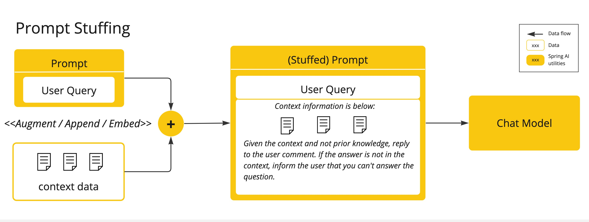

 


## 检索增强生成 (Retrieval Augmented Generation)

检索增强生成（RAG）用于解决将相关数据纳入提示词中以获得准确 AI 模型响应的挑战。

该方法采用批处理式编程模型，作业从您的**文档**中读取非结构化数据，进行转换，然后写入向量数据库。从高层次来看，这是一个 ETL（提取、转换和加载）管道。向量数据库用于 RAG 技术的检索部分。

在将非结构化数据加载到向量数据库时，最重要的转换之一是将原始文档分割成更小的片段。将原始文档分割成更小片段的过程有两个重要步骤：

1. 在保持内容语义边界的同时将文档分割成部分。例如，对于包含段落和表格的文档，应避免在段落或表格中间分割文档。对于代码，避免在方法的实现中间分割代码。
2. 将文档的部分进一步分割成大小占 AI 模型词元限制很小百分比的部分。

RAG 的下一阶段是处理用户输入。当需要 AI 模型回答用户的提问时，该问题以及所有“相似”的文档片段都会被放入发送给 AI 模型的提示词中。这就是使用向量数据库的原因。它非常善于查找相似的内容。

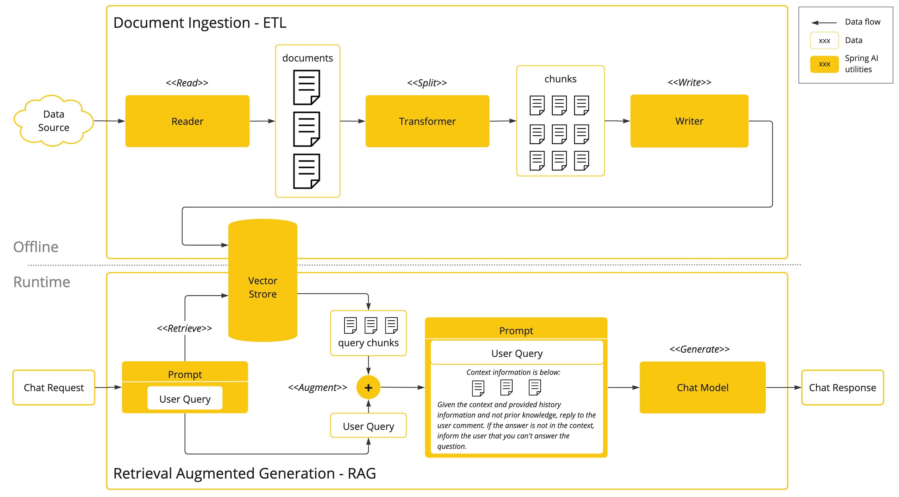

- [ETL 管道](https://docs.springframework.org.cn/spring-ai/reference/api/etl-pipeline.html) 提供了关于如何协调从数据源提取数据并将其存储在结构化向量存储中的更多信息，确保数据以最优格式存储，以便在将其传递给 AI 模型时进行检索。
- [ChatClient - RAG](https://docs.springframework.org.cn/spring-ai/reference/api/chatclient.html#_retrieval_augmented_generation) 解释了如何使用 `QuestionAnswerAdvisor` 在应用程序中启用 RAG 功能。

## 工具调用 (Tool Calling)

大型语言模型 (LLM) 在训练后是固定的，导致知识陈旧，并且无法访问或修改外部数据。

[工具调用](https://docs.springframework.org.cn/spring-ai/reference/api/tools.html) 机制解决了这些缺点。它允许您将自己的服务注册为工具，将大型语言模型连接到外部系统的 API。这些系统可以为 LLM 提供实时数据并代表它们执行数据处理操作。

Spring AI 极大地简化了您编写以支持工具调用所需的代码。它为您处理工具调用对话。您可以将您的工具作为带有 `@Tool` 注解的方法提供，并在您的提示选项中提供它，使其可供模型使用。此外，您可以在单个提示词中定义和引用多个工具。


1. 当我们要让模型可以使用某个工具时，我们将该工具的定义包含在聊天请求中。每个工具定义包括一个名称、一个描述以及输入参数的模式。
2. 当模型决定调用某个工具时，它会发送一个响应，其中包含工具名称和根据定义的模式建模的输入参数。
3. 应用程序负责使用工具名称识别并执行带有提供的输入参数的工具。
4. 工具调用的结果由应用程序处理。
5. 应用程序将工具调用结果发送回模型。
6. 模型使用工具调用结果作为附加上下文生成最终响应。

请参阅[工具调用](https://docs.springframework.org.cn/spring-ai/reference/api/tools.html)文档，了解如何在不同的 AI 模型中使用此功能的更多信息。

# 整合

> https://docs.springframework.org.cn/spring-ai/reference/concepts.html#concept-fc

## 引入依赖

```xml
<dependencyManagement>
    <dependencies>
        <dependency>
            <groupId>org.springframework.ai</groupId>
            <artifactId>spring-ai-bom</artifactId>
            <version>1.0.1</version>
            <type>pom</type>
            <scope>import</scope>
        </dependency>
    </dependencies>
</dependencyManagement>
```

# AI模型整合

> 我正在智谱大模型开放平台 BigModel.cn上打造AI应用，智谱新一代旗舰模型GLM-4.5已上线， 在推理、代码、智能体综合能力达到开源模型 SOTA 水平，通过我的邀请链接注册即可获得 2000万Tokens 大礼包，期待和你一起在BigModel上体验最新顶尖模型能力；链接：https://www.bigmodel.cn/invite?icode=I02TVoifCuOrucbw%2BELzfuZLO2QH3C0EBTSr%2BArzMw4%3D

## 聊天模型

### 模型比较

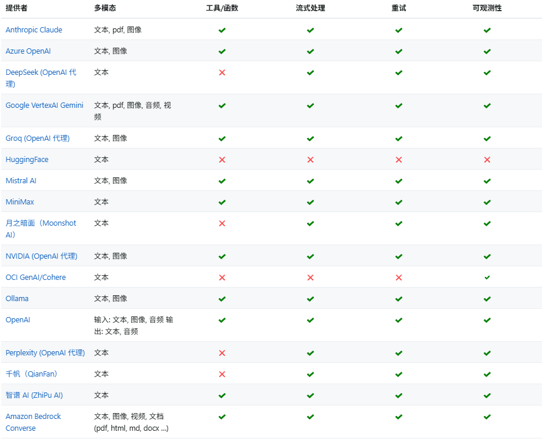

### DeepSeek

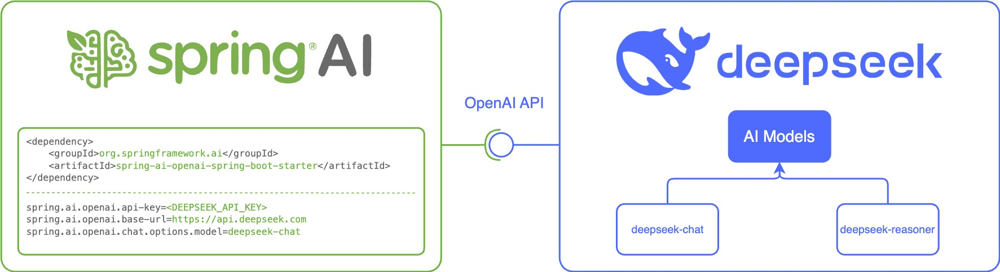

#### 导入依赖

```xml
<dependency>
    <groupId>org.springframework.ai</groupId>
    <artifactId>spring-ai-starter-model-deepseek</artifactId>
</dependency>
```

#### 核心配置

```yaml
spring:
  ai:
    deepseek:
      api-key: sk-4203ef00b5024ec5885eafb7ab3ddb45
      base-url: https://api.deepseek.com
```

#### 代码测试

```typescript
@RestController
public class ChatController {

    private final OpenAiChatModel chatModel;

    @Autowired
    public ChatController(OpenAiChatModel chatModel) {
        this.chatModel = chatModel;
    }

    @GetMapping("/ai/generate")
    public Map generate(@RequestParam(value = "message", defaultValue = "Tell me a joke") String message) {
        return Map.of("generation", this.chatModel.call(message));
    }

    @GetMapping("/ai/generateStream")
    public Flux<ChatResponse> generateStream(@RequestParam(value = "message", defaultValue = "Tell me a joke") String message) {
        Prompt prompt = new Prompt(new UserMessage(message));
        return this.chatModel.stream(prompt);
    }
}
```

### Ollama

- [下载并安装 Ollama](https://ollama.ac.cn/download) 到本地机器上。

可以从 [Ollama 模型库](https://ollama.ac.cn/library) 中拉取您想在应用程序中使用的模型

```shell
ollama pull <model-name>
```

还可以拉取成千上万个免费的 [GGUF Hugging Face 模型](https://hugging-face.cn/models?library=gguf&sort=trending) 中的任何一个

```shell
ollama pull hf.co/<username>/<model-repository>
ollama pull hf.co/Nikity/lille-130m-instruct
```

#### 导入依赖

```shell
<dependency>
   <groupId>org.springframework.ai</groupId>
   <artifactId>spring-ai-starter-model-ollama</artifactId>
</dependency>
```

#### 核心配置

```yaml
---
spring:
  ai:
    deepseek:
      api-key: sk-4203ef00b5024ec5885eafb7ab3ddb45
      base-url: https://api.deepseek.com
    ollama:
      base-url: http://localhost:11434
      chat:
        model: llama3.2
        options:
          temperature: 0.7
          # 温度设置影响大模型生成数据的随机程度
```

#### 代码测试

```typescript
@RequestMapping("/ollama")
@RestController
public class OllamaController {

    @Autowired  // xxxChatModel
    OllamaChatModel ollamaChatModel;

    @GetMapping("/chat")
    public Flux<String> chat(@RequestParam("msg") String msg){
       return ollamaChatModel.stream(msg);
    }
}
```

#### 自定义客户端

如果不想使用 Spring Boot 自动配置，可以在应用程序中手动配置 `OllamaChatModel`。 [OllamaChatModel](https://github.com/spring-projects/spring-ai/blob/main/models/spring-ai-ollama/src/main/java/org/springframework/ai/ollama/OllamaChatModel.java) 实现了 `ChatModel` 和 `StreamingChatModel` 接口，并使用[低级 OllamaApi 客户端](https://docs.springframework.org.cn/spring-ai/reference/api/chat/ollama-chat.html#low-level-api)连接到 Ollama 服务。

```java
var ollamaApi = OllamaApi.builder().build();

var chatModel = OllamaChatModel.builder()
                    .ollamaApi(ollamaApi)
                    .defaultOptions(
                        OllamaOptions.builder()
                            .model(OllamaModel.MISTRAL)
                            .temperature(0.9)
                            .build())
                    .build();

ChatResponse response = this.chatModel.call(
    new Prompt("Generate the names of 5 famous pirates."));

// Or with streaming responses
Flux<ChatResponse> response = this.chatModel.stream(
    new Prompt("Generate the names of 5 famous pirates."));
```

### 完全自定义客户端

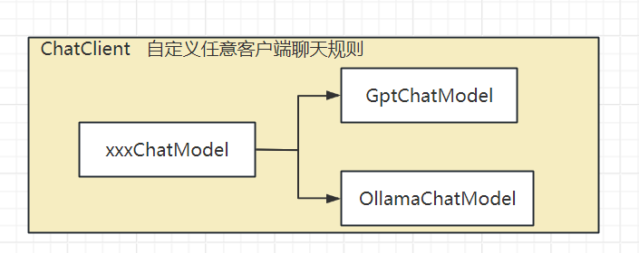

## 图像模型

使用 百炼平台的 qwen-image 测试

### 前置准备

在 [智谱 AI 注册页面](https://open.bigmodel.cn/login) 创建帐户，并在 [API 密钥页面](https://open.bigmodel.cn/usercenter/apikeys) 生成令牌。Spring AI 项目定义了一个名为 `spring.ai.zhipuai.api-key` 的配置属性，您应该将其设置为从 [API 密钥页面](https://open.bigmodel.cn/usercenter/apikeys) 获取的 `API Key` 的值。

### 导入依赖

```xml
<dependency>
    <groupId>com.alibaba</groupId>
    <artifactId>dashscope-sdk-java</artifactId>
    <!-- 请将 'the-latest-version' 替换为最新版本号：https://mvnrepository.com/artifact/com.alibaba/dashscope-sdk-java -->
    <version>2.21.6</version>
</dependency>
```

### 核心配置

> **图像生成属性**：
> 图像自动配置的启用和禁用现在通过带有前缀 spring.ai.model.image 的顶级属性进行配置。
> 要启用，设置 spring.ai.model.image=stabilityai（默认启用）
> 要禁用，设置 spring.ai.model.image=none（或任何与 stabilityai 不匹配的值）
> 此更改旨在允许配置多个模型。

前缀 `spring.ai.zhipuai.image` 是属性前缀，允许配置智谱AI的 `ImageModel` 实现。

```yaml
spring:
  ai:
    dashscope:
      base-url: https://dashscope.aliyuncs.com/compatible-mode/v1
      api-key: sk-b5e7330e99c141af94286fddb901d916
      chat:
        options:
          model: qwen-72b-instruct
          temperature: 0.7
      image:
        options:
          model: qwen-image
          n: 1
          width: 1920
          height: 1080
```

### 代码测试

```java
ImageResponse response = zhiPuAiImageModel.call(
        new ImagePrompt("A light cream colored mini golden doodle",
        ZhiPuAiImageOptions.builder()
                .quality("hd")
                .N(4)
                .height(1024)
                .width(1024).build())

);
```

## 音频模型

### 语音转文本：Transcription API（转录）

#### 引入依赖

```xml
<dependency>
    <groupId>org.springframework.ai</groupId>
    <artifactId>spring-ai-starter-model-openai</artifactId>
</dependency>
```

#### 核心配置

> 音频转录自动配置的启用和禁用现在通过前缀为 
> 
> `spring.ai.model.audio.transcription` 的顶层属性进行配置。
> 
> 要启用，请设置 spring.ai.model.audio.transcription=openai（默认已启用）
> 
> 要禁用，请设置 spring.ai.model.audio.transcription=none（或任何与 openai 不匹配的值）
> 
> 此更改是为了允许配置多个模型。

https://docs.spring.io/spring-ai/reference/api/audio/transcriptions/openai-transcriptions.html#_configuration_properties

#### 代码测试

`OpenAiAudioTranscriptionOptions` 类提供了进行转录时使用的选项。启动时，使用 `spring.ai.openai.audio.transcription` 指定的选项，但可以在运行时覆盖这些选项。

```java
OpenAiAudioApi.TranscriptResponseFormat responseFormat = OpenAiAudioApi.TranscriptResponseFormat.VTT;

OpenAiAudioTranscriptionOptions transcriptionOptions = OpenAiAudioTranscriptionOptions.builder()
    .language("en")
    .prompt("Ask not this, but ask that")
    .temperature(0f)
    .responseFormat(this.responseFormat)
    .build();
AudioTranscriptionPrompt transcriptionRequest = new AudioTranscriptionPrompt(audioFile, this.transcriptionOptions);
AudioTranscriptionResponse response = openAiTranscriptionModel.call(this.transcriptionRequest);
```

### 文本转语音：Text-To-Speech (TTS) API

#### 引入依赖

```xml
<dependency>
    <groupId>org.springframework.ai</groupId>
    <artifactId>spring-ai-starter-model-openai</artifactId>
</dependency>
```

#### 核心配置

> 音频语音自动配置的启用和禁用现在通过前缀为 
> 
> `spring.ai.model.audio.speech` 的顶级属性进行配置。
> 
> 要启用，设置 `spring.ai.model.audio.speech=openai` (默认启用)
> 
> 要禁用，设置 `spring.ai.model.audio.speech=none` (或任何不匹配 openai 的值)
> 
> 此更改是为了允许配置多个模型。

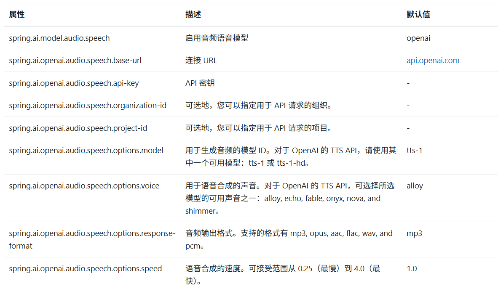

#### 代码测试

```java
OpenAiAudioSpeechOptions speechOptions = OpenAiAudioSpeechOptions.builder()
    .model("tts-1")
    .voice(OpenAiAudioApi.SpeechRequest.Voice.ALLOY)
    .responseFormat(OpenAiAudioApi.SpeechRequest.AudioResponseFormat.MP3)
    .speed(1.0f)
    .build();

SpeechPrompt speechPrompt = new SpeechPrompt("Hello, this is a text-to-speech example.", speechOptions);
SpeechResponse response = openAiAudioSpeechModel.call(speechPrompt);
```

> 实时音频流式传输

```java
var openAiAudioApi = new OpenAiAudioApi()
    .apiKey(System.getenv("OPENAI_API_KEY"))
    .build();

var openAiAudioSpeechModel = new OpenAiAudioSpeechModel(openAiAudioApi);

OpenAiAudioSpeechOptions speechOptions = OpenAiAudioSpeechOptions.builder()
    .voice(OpenAiAudioApi.SpeechRequest.Voice.ALLOY)
    .speed(1.0f)
    .responseFormat(OpenAiAudioApi.SpeechRequest.AudioResponseFormat.MP3)
    .model(OpenAiAudioApi.TtsModel.TTS_1.value)
    .build();

SpeechPrompt speechPrompt = new SpeechPrompt("Today is a wonderful day to build something people love!", speechOptions);

Flux<SpeechResponse> responseStream = openAiAudioSpeechModel.stream(speechPrompt);
```

#### 自己测试中文演讲模型

https://bailian.console.aliyun.com/?switchAgent=10881284&productCode=p_efm&switchUserType=3&tab=api#/api/?type=model&url=2881635

## 内容审核模型

> 二值模型：正向 0.8776、负面 0.1224
> 
> 多值模型：积极、普通、负面
> 
> 情感模型：欢乐、悲伤、抑郁、乐观、无奈

Spring AI 支持 OpenAI 的审核模型，该模型可用于检测文本中潜在有害或敏感的内容。

> 支持此模型的代理平台：https://xuedingmao.top/register?aff=di3K

### 引入依赖

```xml
<dependency>
    <groupId>org.springframework.ai</groupId>
    <artifactId>spring-ai-starter-model-openai</artifactId>
</dependency>
```

### 核心配置

> 现在可以通过带有前缀 `spring.ai.model.embedding` 的顶层属性来配置 embedding 自动配置的启用和禁用。
> 
> 要启用，请设置 `spring.ai.model.moderation=openai` (默认已启用)
> 
> 要禁用，请设置 `spring.ai.model.moderation=none` (或任何不匹配 `openai` 的值)
> 
> 进行此更改是为了允许配置多个模型。

前缀 `spring.ai.openai.moderation` 用作配置 OpenAI 审核模型的属性前缀。

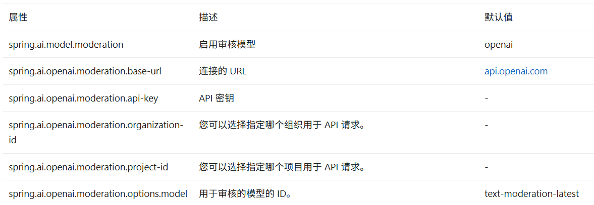

### 核心代码

```java
OpenAiModerationOptions moderationOptions = OpenAiModerationOptions.builder()
    .model("text-moderation-latest")
    .build();

ModerationPrompt moderationPrompt = new ModerationPrompt("Text to be moderated", this.moderationOptions);
ModerationResponse response = openAiModerationModel.call(this.moderationPrompt);

// Access the moderation results
Moderation moderation = moderationResponse.getResult().getOutput();

// Print general information
System.out.println("Moderation ID: " + moderation.getId());
System.out.println("Model used: " + moderation.getModel());

// Access the moderation results (there's usually only one, but it's a list)
for (ModerationResult result : moderation.getResults()) {
    System.out.println("\nModeration Result:");
    System.out.println("Flagged: " + result.isFlagged());

    // Access categories
    Categories categories = this.result.getCategories();
    System.out.println("\nCategories:");
    System.out.println("Sexual: " + categories.isSexual());
    System.out.println("Hate: " + categories.isHate());
    System.out.println("Harassment: " + categories.isHarassment());
    System.out.println("Self-Harm: " + categories.isSelfHarm());
    System.out.println("Sexual/Minors: " + categories.isSexualMinors());
    System.out.println("Hate/Threatening: " + categories.isHateThreatening());
    System.out.println("Violence/Graphic: " + categories.isViolenceGraphic());
    System.out.println("Self-Harm/Intent: " + categories.isSelfHarmIntent());
    System.out.println("Self-Harm/Instructions: " + categories.isSelfHarmInstructions());
    System.out.println("Harassment/Threatening: " + categories.isHarassmentThreatening());
    System.out.println("Violence: " + categories.isViolence());

    // Access category scores
    CategoryScores scores = this.result.getCategoryScores();
    System.out.println("\nCategory Scores:");
    System.out.println("Sexual: " + scores.getSexual());
    System.out.println("Hate: " + scores.getHate());
    System.out.println("Harassment: " + scores.getHarassment());
    System.out.println("Self-Harm: " + scores.getSelfHarm());
    System.out.println("Sexual/Minors: " + scores.getSexualMinors());
    System.out.println("Hate/Threatening: " + scores.getHateThreatening());
    System.out.println("Violence/Graphic: " + scores.getViolenceGraphic());
    System.out.println("Self-Harm/Intent: " + scores.getSelfHarmIntent());
    System.out.println("Self-Harm/Instructions: " + scores.getSelfHarmInstructions());
    System.out.println("Harassment/Threatening: " + scores.getHarassmentThreatening());
    System.out.println("Violence: " + scores.getViolence());
}
```

## Spring AI Ollama

当 Ollama 实例中不存在模型时，Spring AI Ollama 可以自动拉取模型。此功能对于开发、测试以及将应用程序部署到新环境特别有用。

> 也可以按名称拉取数千个免费的 [GGUF Hugging Face 模型](https://hugging-face.cn/models?library=gguf&sort=trending)中的任何一个。

拉取模型有三种策略：

- `always`（定义在 `PullModelStrategy.ALWAYS` 中）：总是拉取模型，即使模型已存在。有助于确保你使用的是模型的最新版本。
- `when_missing`（定义在 `PullModelStrategy.WHEN_MISSING` 中）：仅在模型不存在时拉取模型。这可能会导致使用模型的旧版本。
- `never`（定义在 `PullModelStrategy.NEVER` 中）：从不自动拉取模型。

> 由于下载模型时可能存在延迟，不建议在生产环境中使用自动拉取。相反，提前评估并预下载所需的模型

```yaml
spring:
  ai:
    ollama:
      init:
        pull-model-strategy: always
        timeout: 60s
        max-retries: 1
```

# Tools Call：工具调用

> 也就是 function call：

***工具调用*****（也称为*****函数调用*****）**是一种在 AI 应用中常见的模式，允许模型与一组 API（或*工具*）交互，从而增强其能力。

工具主要用于

- **信息检索。**此类工具可用于从外部来源检索信息，例如数据库、Web 服务、文件系统或 Web 搜索引擎。其目标是增强模型的知识，使其能够回答原本无法回答的问题。因此，它们可用于检索增强生成（RAG）场景。例如，工具可用于检索给定位置的当前天气、检索最新新闻文章或查询数据库以获取特定记录。
- **执行操作。**此类工具可用于在软件系统中执行操作，例如发送电子邮件、在数据库中创建新记录、提交表单或触发工作流。其目标是自动化原本需要人工干预或显式编程的任务。例如，工具可用于为与聊天机器人交互的客户预订航班、填写网页上的表单，或在代码生成场景中根据自动化测试 (TDD) 实现 Java 类。

尽管我们通常将*工具调用*称为模型的能力，但实际上是由客户端应用提供工具调用逻辑。模型只能请求工具调用并提供输入参数，而应用负责根据输入参数执行工具调用并返回结果。模型永远无法访问作为工具提供的任何 API，这是一个重要的安全考虑因素。

https://docs.springframework.org.cn/spring-ai/reference/api/chat/comparison.html

## 快速入门

### 信息检索

**AI 模型无法访问实时信息**。任何假设了解当前日期或天气预报等信息的问题，模型都无法回答。但是，我们可以提供一个能够检索这些信息的工具，并在需要访问实时信息时让模型调用此工具。

让我们在 `DateTimeTools` 类中实现一个**获取用户时区当前日期和时间的工具**。该工具将不接受任何参数。Spring Framework 中的 `LocaleContextHolder` 可以提供用户时区。该工具将被定义为一个使用 `@Tool` 注解的方法。为了帮助模型理解何时以及如何调用此工具，我们将提供该工具功能的详细描述。

> 1. 定义工具

```java
import java.time.LocalDateTime;
import org.springframework.ai.tool.annotation.Tool;
import org.springframework.context.i18n.LocaleContextHolder;

class DateTimeTools {

    @Tool(description = "Get the current date and time in the user's timezone")
    String getCurrentDateTime() {
        return LocalDateTime.now().atZone(LocaleContextHolder.getTimeZone().toZoneId()).toString();
    }

}
```

> 1. 构建聊天客户端

```java
ChatModel chatModel = ...

String response = ChatClient.create(chatModel)
        .prompt("What day is tomorrow?")
        .tools(new DateTimeTools())
        .call()
        .content();

System.out.println(response);
```

### 支持操作

AI 模型可用于生成实现某些目标的计划。例如，模型可以生成预订前往丹麦旅行的计划。但是，模型没有执行该计划的能力。这就是工具的作用所在：它们可用于执行模型生成的计划。

在上一个示例中，我们使用了工具来确定当前日期和时间。**在此示例中，我们将定义第二个工具，用于在特定时间设置闹钟。目标是设置一个从现在起 10 分钟后的闹钟，因此我们需要将这两个工具都提供给模型来完成此任务。**

> 1. 定义工具

```java
import java.time.LocalDateTime;
import java.time.format.DateTimeFormatter;
import org.springframework.ai.tool.annotation.Tool;
import org.springframework.context.i18n.LocaleContextHolder;

class DateTimeTools {

    @Tool(description = "Get the current date and time in the user's timezone")
    String getCurrentDateTime() {
        return LocalDateTime.now().atZone(LocaleContextHolder.getTimeZone().toZoneId()).toString();
    }

    @Tool(description = "Set a user alarm for the given time, provided in ISO-8601 format")
    void setAlarm(String time) {
        LocalDateTime alarmTime = LocalDateTime.parse(time, DateTimeFormatter.ISO_DATE_TIME);
        System.out.println("Alarm set for " + alarmTime);
    }

}
```

> 1. 构建聊天客户端

```java
ChatModel chatModel = ...

String response = ChatClient.create(chatModel)
        .prompt("Can you set an alarm 10 minutes from now?")
        .tools(new DateTimeTools())
        .call()
        .content();

System.out.println(response);
```

## 工作流程

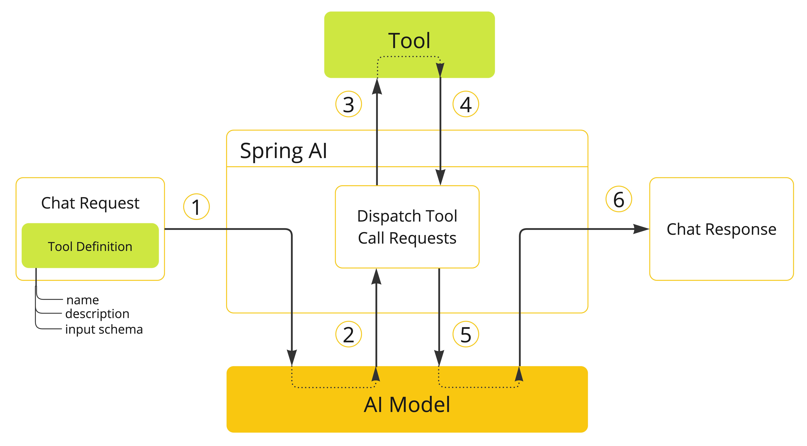

1. **当我们想让工具对模型可用时**，我们会将它的**定义包含在聊天请求中**。每个工具定义包括名称、描述和输入参数的模式。
2. **当模型决定调用工具时**，它会发送一个响应，**其中包含工具名称以及根据定义模式建模的输入参数**。
3. **应用负责使用工具名称来识别并执行带有提供输入参数的工具**。
4. **工具调用的结果由应用处理**。
5. 应用将**工具调用结果**发送**回模型**。
6. 模型使用工具调用结果作为附加上下文生成最终响应。

大模型做一个语言生成；

# MCP：模型上下文协议

https://modelcontextprotocol.io/docs/getting-started/intro

## 为什么使用

> 可以写一个所有ToolHub，中心。所有AI应用都去这个中心发现有哪些工具，然后再调用

MCP 存在的意义是它解决了大模型时代最关键的三个问题：**数据孤岛、开发低效和生态碎片化**等问题。

去市场中发现更多工具：https://mcpmarket.com/zh

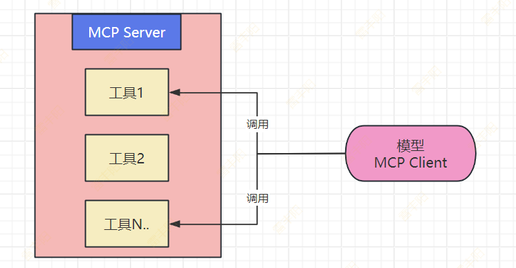

### **1.打破数据孤岛，让AI“连接万物”**

大模型本身无法直接访问实时数据或本地资源（如数据库、文件系统），传统方式需要手动复制粘贴或定制接口。MCP 通过标准化协议，让大模型像“插USB”一样直接调用外部工具和数据源，例如：

- 查天气时自动调用气象 API，无需手动输入数据。
- 分析企业数据时直接连接内部数据库，避免信息割裂。

### **2.降低开发成本，一次适配所有场景**

在之前每个大模型（如 DeepSeek、ChatGPT）需要为每个工具单独开发接口（Function Calling），导致重复劳动，MCP 通过统一协议：

- 开发者只需写一次 MCP 服务端，所有兼容 MCP 的模型都能调用。
- 用户无需关心技术细节，大模型可直接操作本地文件、设计软件等。

### **3.提升安全性与互操作性**

- **安全性**：MCP 内置权限控制和加密机制，比直接开放数据库更安全。
- **生态统一**：类似 USB 接口，MCP 让不同厂商的工具能“即插即用”，避免生态分裂。

### **4.推动AIAgent的进化**

MCP 让大模型从“被动应答”变为“主动调用工具”，例如：

- 自动抓取网页新闻补充实时知识。
- 打开 Idea 编写一个“Hello World”的代码。

MCP 的诞生，相当于为AI世界建立了“通用语言”，让模型、数据和工具能高效协作，最终释放大模型的全部潜力。

## 组成&执行流程

**MCP 架构分为以下 3 部分：**

- **客户端**：大模型应用（如 DeepSeek、ChatGPT）发起请求。
- **服务器**：中间层，连接具体工具（如数据库、设计软件）。
- **资源**：具体的数据或工具（如 Excel文件、网页 API）。

**运行流程**：

1. 用户提问。
2. 大模型通过 MCP 客户端发送请求。
3. MCP 服务器接收指令。
4. 调用对应工具（如数据库）执行。
5. 返回结果给大模型。
6. 生成最终回答。

## 核心机制

> 参考案例：
> 
> https://github.com/spring-projects/spring-ai-examples/tree/main/model-context-protocol/weather

### 基本流程

当前案例中，我们使用 MCP 实现一个天气查询小助手，其中包含的主要角色有：

- **MCP Server**：MCP 服务提供方，提供天气查询功能。
- **MCP Client**：MCP 客户端（大模型端）我们对接 DeepSeek LLM 实现对 MCP Server 的调用，从而实现天气预报的查询功能。

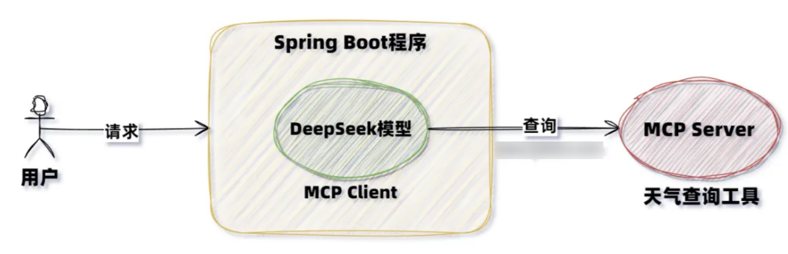

### MCP Server 流程

MCP Server 主要实现步骤如下：

1. 添加 MCP Server 依赖。
2. 设置 MCP 配置信息。
3. 编写 MCP Server 服务代码。
4. 将 MCP Server 进行暴露设置。

MCP Server 依赖有三种类型：

- **标准输入/输出 （STDIO）**：`spring-ai-starter-mcp-server`
  - 通过控制台交互
- **Spring MVC（服务器发送的事件）**：`spring-ai-starter-mcp-server-webmvc`
  - 通过请求响应交互
- **Spring WebFlux（响应式 SSE）**：`spring-ai-starter-mcp-server-webflux`
  - 通过流式请求响应交互；能有打字机效果

### MCP Client 流程

MCP Client 主要实现步骤如下：

1. 添加 MCP Client 相关依赖。
2. 设置配置信息。
3. 设置 ChatClient 对象（调用 MCP Server）。
4. 编写测试代码调用 MCP Server。

## MCP Server

### 添加依赖

```xml
<dependency>
    <groupId>org.springframework.ai</groupId>
    <artifactId>spring-ai-starter-mcp-server-webmvc</artifactId>
</dependency>
```

### 编写工具

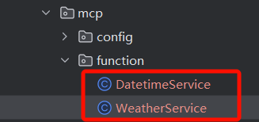

```typescript
@Service
public class DatetimeService {

    @Tool(description = "获取当前时间")
    String getCurrentDateTime() {
        System.out.println("实时调用工具...获取当前时间....");
        return LocalDateTime.now().atZone(LocaleContextHolder.getTimeZone().toZoneId()).toString();
    }
}
```

```java
@Service
public class WeatherService {
    @Tool(description = "获取当前天气")
    String getWeather(
        @ToolParam(required = false,description = "城市名字") String city
    ){

        System.out.println("实时调用工具...获取当前天气....");
        Map<String,String> map = new HashMap<>();
        map.put("西安","晴天");
        map.put("北京","阴天");
        map.put("上海","多云");

        String w = map.getOrDefault(city, "未查询到天气");
        return w;
    }
}
```

### 暴露工具

```typescript
@Configuration
public class McpServerConfig {

    @Autowired
    WeatherService weatherService;
    @Autowired
    DatetimeService datetimeService;

    @Bean
    public ToolCallbackProvider getToolCallbackProvider() {
        return MethodToolCallbackProvider.builder()
            .toolObjects(weatherService,datetimeService)
            .build();
    }
}
```

### 配置

```yaml
spring:
  ai:
    mcp:
      server:
        enabled: true
        sse-endpoint: /api/sse
        sse-message-endpoint: /api/mcp/message
        capabilities:
          tool: true
logging:
  level:
    io.modelcontextprotocol: trace
    org.springframework.ai.mcp: trace
```

### 集成测试

chatbox：https://chatboxai.app/zh/install?download=win64 

添加自定义 MCP Server；选择 http/sse

### MCP 协议规范

MCP：单次请求多次响应；SSE

https://modelcontextprotocol.io/specification/2025-06-18/basic/lifecycle

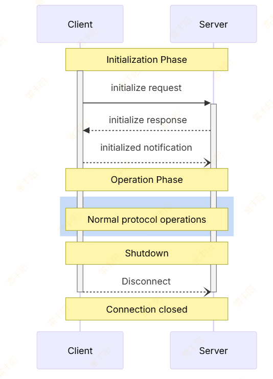

## MCP Client

### 添加依赖

```xml
<dependency>
    <groupId>org.springframework.ai</groupId>
    <artifactId>spring-ai-starter-mcp-client-webflux</artifactId>
</dependency>
```

### 配置文件

```yaml
spring:
  ai:
    mcp:
      client:
        sse:
          connections:
            server2:
              url: http://localhost:10001
              sse-endpoint: /api/sse
        toolcallback:
          enabled: true
```

### 代码测试

```typescript
@RestController
public class ChatClientController {


    private final ChatClient chatClient;

    public ChatClientController(ChatClient.Builder chatClientBuilder,
                                ToolCallbackProvider tools) {
        // 配置 llm 工具链； 注意这个操作只能做一次
        // 如果同样的工具被配置了多次，则会报错
        chatClient = chatClientBuilder
            .defaultToolCallbacks(tools.getToolCallbacks())
            .build();
    }

    @GetMapping(value = "/chat", produces = "text/html; charset=utf-8")
    public Flux<String> chat(@RequestParam("msg") String msg) {

        Flux<String> content = chatClient
            .prompt(msg)
            .stream().content();
        return content;
    }
}
```

# 扩展：HuggingFace

> 集合了全世界各种大模型，也是大模型的测试场

https://huggingface.co/


> 国内类似huggingface的社区：https://www.modelscope.cn/home

## 模型

### 多模态（Multimodal）

> 泛指能处理多种输入类型（如文本、图像、音频等）的通用模型，通常用于跨模态联合任务。

1. **Audio-Text-to-Text (音频-文本到文本)**
  - **功能**：将音频（如语音）和辅助文本结合作为输入，生成文本输出。例如：语音转录时结合上下文文本提升准确性。
2. **Image-Text-to-Text (图像-文本到文本)**
  - **功能**：结合图像和文本输入生成文本输出。例如：图像描述生成（输入图片+提示文本，输出详细描述）。
3. **Visual Question Answering (视觉问答，VQA)**
  - **功能**：对给定的图像和自然语言问题生成答案。例如：输入图片+“这是什么动物？”，输出“狗”。
4. **Document Question Answering (文档问答)**
  - **功能**：基于文档（如PDF、扫描件）中的文本或布局信息回答问题。例如：从发票中提取金额或日期。
5. **Video-Text-to-Text (视频-文本到文本)**
  - **功能**：结合视频帧序列和文本输入生成文本输出。例如：视频内容摘要或基于视频的对话生成。
6. **Visual Document Retrieval (视觉文档检索)**
  - **功能**：通过图像或文本查询搜索相关文档。例如：上传表格图片，检索数据库中的匹配文档。
7. **Any-to-Any (任意模态到任意模态)**
  - **功能**：支持任意输入和输出模态的通用模型。例如：输入音频+图片，输出文本；或输入文本，生成图片+语音。

### **计算机视觉（Computer Vision）**

> 广义的视觉任务总称，涵盖图像/视频处理、分析与生成等所有与视觉相关的技术。

> - **生成式任务**（如Text-to-X）：侧重内容创作（图像/视频/3D生成）。
> - **分析式任务**（如检测/分割/分类）：侧重理解与结构化视觉信息。
> - **零样本（Zero-Shot）**：依赖预训练模型的泛化能力，减少对特定数据的需求。

1. **Depth Estimation (深度估计)**
  - **功能**：从2D图像中预测场景中物体的距离（深度图），用于3D重建、自动驾驶等。
2. **Image Classification (图像分类)**
  - **功能**：将图像分类到预定义的类别中（如“猫”“狗”）。
3. **Object Detection (目标检测)**
  - **功能**：识别图像中的物体并标注其位置（ bounding box ）及类别。
4. **Image Segmentation (图像分割)**
  - **功能**：对图像中的每个像素进行分类（语义分割）或区分不同实例（实例分割）。
5. **Text-to-Image (文本生成图像)**
  - **功能**：根据文本描述生成对应图像（如Stable Diffusion）。
6. **Image-to-Text (图像转文本)**
  - **功能**：从图像生成描述性文本（如OCR、图像字幕生成）。
7. **Image-to-Image (图像到图像转换)**
  - **功能**：输入图像输出修改后的图像（如超分辨率、风格迁移、修复）。
8. **Image-to-Video (图像生成视频)**
  - **功能**：基于静态图像生成动态视频序列。
9. **Unconditional Image Generation (无条件图像生成)**
  - **功能**：无需输入条件，直接生成随机但合理的图像（如GAN生成的虚构人脸）。
10. **Video Classification (视频分类)**
  - **功能**：对视频内容进行分类（如“跑步”“跳舞”）。
11. **Text-to-Video (文本生成视频)**
  - **功能**：根据文本描述生成视频片段。
12. **Zero-Shot Image Classification (零样本图像分类)**
  - **功能**：无需训练数据，直接通过文本描述分类未见过的类别（如CLIP模型）。
13. **Mask Generation (掩码生成)**
  - **功能**：生成图像中特定区域的掩码（如分割蒙版）。
14. **Zero-Shot Object Detection (零样本目标检测)**
  - **功能**：检测图像中未在训练集中出现的物体类别（依靠文本描述泛化）。
15. **Text-to-3D (文本生成3D模型)**
  - **功能**：根据文本生成3D物体模型（如点云或网格）。
16. **Image-to-3D (图像生成3D模型)**
  - **功能**：从2D图像重建物体的3D模型。
17. **Image Feature Extraction (图像特征提取)**
  - **功能**：提取图像的嵌入向量（embedding），用于检索、聚类等任务。
18. **Keypoint Detection (关键点检测)**
  - **功能**：识别图像中物体的关键点（如人脸特征点、人体关节）。
19. **Video-to-Video (视频到视频转换)**
  - **功能**：输入视频并输出修改后的视频（如风格化、修复、分辨率增强）。

### 自然语言处理**（Natural Language Processing, NLP）**

> 泛指所有处理和理解人类语言的AI技术，涵盖文本分析、生成、翻译等任务。
> 
> - **理解任务**（如分类、问答）：侧重分析文本语义。
> - **生成任务**（如翻译、摘要）：侧重输出自然语言内容。
> - **语义相关任务**（如相似度、检索）：侧重衡量文本间关系。

1. **Text Classification（文本分类）**
  - **功能**：将文本归类到预定义的类别中（如情感分析、垃圾邮件检测）。
2. **Token Classification（标记分类）**
  - **功能**：对文本中的每个词或子词（token）进行分类，例如命名实体识别（NER）、词性标注（POS）。
3. **Table Question Answering（表格问答）**
  - **功能**：基于结构化表格数据回答问题（如从Excel表格中提取特定信息）。
4. **Question Answering（问答系统）**
  - **功能**：从给定文本中抽取或生成问题的答案（如阅读理解任务）。
5. **Zero-Shot Classification（零样本分类）**
  - **功能**：无需特定训练数据，直接根据文本描述分类新类别（如判断一段文本是否涉及“政治”或“体育”）。
6. **Translation（翻译）**
  - **功能**：将文本从一种语言自动翻译成另一种语言（如英译中）。
7. **Summarization（文本摘要）**
  - **功能**：生成输入文本的简短摘要（抽取式或生成式）。
8. **Feature Extraction（特征提取）**
  - **功能**：将文本转换为向量表示（嵌入向量），用于检索、聚类或下游任务。
9. **Text Generation（文本生成）**
  - **功能**：根据输入生成连贯文本（如故事续写、对话生成、代码生成）。
10. **Fill-Mask（掩码填充）**
  - **功能**：预测并填充句子中被遮蔽的词语（如`"巴黎是[MASK]的首都" → "法国"`）。
11. **Sentence Similarity（句子相似度）**
  - **功能**：计算两段文本的语义相似度（如用于检索或去重）。
12. **Text Ranking（文本排序）**
  - **功能**：根据相关性对文本列表进行排序（如搜索引擎结果排序）。

### 音频**（Audio）**

> 涵盖所有与 **语音和声音处理** 相关的AI任务，包括语音生成、识别、转换、分析等。
> 
> - **语音生成（Text-to-X）**：利用文本生成声音（TTS生成人声，Text-to-Audio生成其他声音）。
> - **语音理解（ASR、分类）**：解析语音内容或判断音频类别。
> - **语音信号处理（Audio-to-Audio）**：优化或转换原始音频。

1. **Text-to-Speech（文本转语音，TTS）**
  - **功能**：将 **文本转换为自然的人类语音**（如智能语音助手朗读文本）。
2. **Text-to-Audio（文本转音频）**
  - **功能**：根据文本描述生成 **非语音类声音**（如背景音乐、鸟叫声、警报声）。
3. **Automatic Speech Recognition（自动语音识别，ASR）**
  - **功能**：将 **语音转换成文本**（如语音输入转字幕、会议录音转文字）。
4. **Audio-to-Audio（音频到音频转换）**
  - **功能**：输入音频，处理后输出 **另一段音频**（如去噪、语音增强、变声）。
5. **Audio Classification（音频分类）**
  - **功能**：对音频片段进行分类，如 **音乐流派识别、环境声音分类（犬吠、警报等）**。
6. **Voice Activity Detection（语音活动检测，VAD）**
  - **功能**：检测 **音频中是否有语音**（排除静音或背景噪音），通常用于语音处理的预处理步骤。

### **结构化数据（Tabular）**

> 处理 **表格型数据（如Excel、数据库）** 的机器学习任务，主要针对结构化数据（行=样本，列=特征）的预测与分析。
> 
> - **数据依赖**：需清洗和特征工程（如归一化、处理缺失值）。
> - **应用场景**：金融风控、销售预测、工业设备监控等结构化数据场景。
> - **与NLP/CV的区别**：直接处理数值和类别型数据，而非文本或图像。

1. **Tabular Classification（表格分类）**
  - **功能**：输入表格数据，预测 **离散类别**（如用户是否会流失、邮件是否为垃圾邮件）。
  - **示例**：基于年龄、收入等特征预测客户购买意向（是/否）。
2. **Tabular Regression（表格回归）**
  - **功能**：输入表格数据，预测 **连续数值**（如房价、销售额）。
  - **示例**：根据房屋面积、地段预测价格。
3. **Time Series Forecasting（时间序列预测）**
  - **功能**：基于历史时间序列数据，预测 **未来趋势**（如股票价格、天气、用电量）。
  - **特点**：数据需包含时间戳，模型需捕捉时间依赖性（如LSTM、Prophet）。

### **强化学习（Reinforcement Learning, RL）**

> 通过 **与环境交互学习最优策略** 的机器学习范式，智能体（Agent）通过 **试错** 获得奖励（Reward）并逐步优化决策。
> 
> 1. **观察状态（State）**：智能体获取环境信息（如游戏画面、传感器数据）。
> 2. **执行动作（Action）**：根据策略选择行为（如移动、抓取）。
> 3. **获得奖励（Reward）**：环境反馈正/负奖励（如得分增加、碰撞惩罚）。
> 4. **策略优化（Policy Update）**：通过算法（如DQN、PPO）迭代改进策略。

1. **Reinforcement Learning（强化学习）**
  - **功能**：通用强化学习框架，涵盖 **算法训练、策略优化、多智能体系统** 等任务。
  - **核心组成**：
    - **智能体（Agent）**：学习和决策的主体。
    - **环境（Environment）**：智能体交互的场景（如游戏、机器人控制）。
    - **奖励（Reward）**：反馈信号，引导智能体向目标优化。
  - **应用场景**：游戏AI（如AlphaGo）、自动驾驶、资源调度等。
2. **Robotics（机器人学）**
  - **功能**：强化学习在 **物理机器人控制** 中的应用，如运动操控、抓取物体、导航避障等。
  - **特点**：需结合 **仿真环境（如MuJoCo）** 或真实硬件训练，处理传感器输入（视觉、力觉等）。
  - **示例**：训练机械臂抓取特定物体，或让双足机器人稳定行走。

## 测试

### 页面测试

> 有些大模型提供页面测试功能（一般都是大厂发布的大模型）

### Python代码

> 可以使用Python 对大模型进行微调、训练、预测

# Ollama

Ollama 可以直接访问所有 [GGUF Hugging Face](https://hugging-face.cn/models?library=gguf&sort=trending) 嵌入模型。你可以按名称拉取这些模型中的任何一个：`ollama pull hf.co/<username>/<model-repository>` 或配置自动拉取策略：[自动拉取模型](https://docs.springframework.org.cn/spring-ai/reference/api/embeddings/ollama-embeddings.html#auto-pulling-models)

## 常见命令

## 端口开放

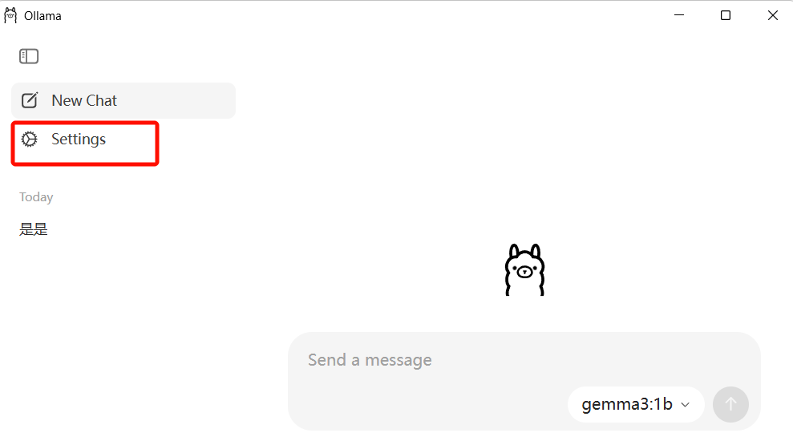

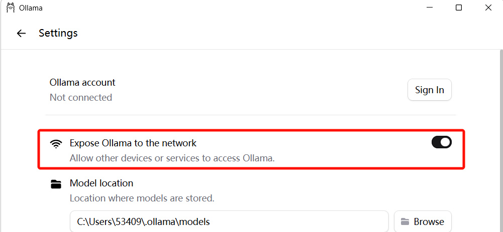

# 落地应用

> 在项目中，我们落地如下两个方向

## 文本分类（情感识别）

> 搜索模型 + 本地运行
> 
> https://huggingface.co/models?pipeline_tag=text-classification&library=gguf&p=1&sort=trending

`ollama run hf.co/DevQuasar/Llama-Guard-3-1B-GGUF`

> **Llama-Guard-3** 是 Meta 发布的一系列 **内容安全审核模型（content moderation model）**，专门用于 **LLM 输出安全检测** 和 **用户输入筛选**。
> 
> - **版本含义**
>   - `Llama-Guard-3` → 第三代内容安全（安全守卫）模型
>   - `1B` → 模型大小大约 1 Billion 参数（轻量级）
>   - `GGUF` → 已经转换成 **LLaMA.cpp** 格式，能在本地/Ollama 直接加载运行

主要作用；简单来说：**帮你的大模型“看门”**。

1. **检测用户输入是否合规**
  - 比如聊天机器人收到含有违法、色情、暴力、歧视等内容的提问时，先用 Llama-Guard 判断。
2. **审核大模型的输出**
  - 生成内容前，用它做安全检测，避免输出违规、敏感信息。
3. **分类内容类型**
  - 它会判断一段文本属于哪些安全类别，例如：
    - 暴力（Violence）
    - 色情（Sexual Content）
    - 威胁（Threats）
    - 政治敏感（Political）
    - 等等类别，并打标签。
4. **本地部署安全**
  - 不依赖云端审核（适合内网、隐私场景）
  - 即便没有公网，也能用 GGUF 模型在本地实现内容安全过滤

### 下载模型

https://huggingface.co/DevQuasar/Llama-Guard-3-1B-GGUF

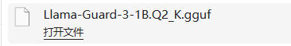

### 制作模型

```python
FROM ./llama-guard-3-1b.gguf

# 设置模型类型，1B 模型占用小，加载快
PARAMETER stop "\n"
PARAMETER temperature 0.7
PARAMETER top_p 1
PARAMETER num_ctx 2048

# 系统提示词（可选，如果你要固定成安全审查模式）
SYSTEM """
You are Llama Guard 3, a content moderation model.
You will output categories like [safe], [unsafe:violence], [unsafe:sexual], etc.
Analyze the following text and classify it.
"""

```

### 创建模型

`ollama create llama-guard-local -f Modelfile`

### 运行模型

`ollama run llama-guard-local`

### 其他模型

`ollama run hf.co/pyarn/bge-reranker-v2-m3-Q5_K_M-GGUF`

`ollama pull hf.co/mradermacher/emotion-analyzer-bert-GGUF`

`ollama pull hf.co/bazzaccosrl/twitter-roberta-large-emotion-gguf`

> https://www.modelscope.cn/docs/models/advanced-usage/ollama-integration

`ollama pull  ``modelscope.cn/gpustack/bce-reranker-base_v1-GGUF`

`ollama pull  ``modelscope.cn/pooka74/LLaMA3-8B-Chat-Chinese-GGUF`

### 百度模型

https://login.bce.baidu.com/

> 接下来我会给你发一段文本，需要你分析一下这个文本是正向还是负面的文本。直接返回一个json字符串，不要返回其他废话。比如 {"positive": "0.78","negative": "0.22"}，代表你觉得正反面的概率

## RAG（检索增强生成）

### 核心流程

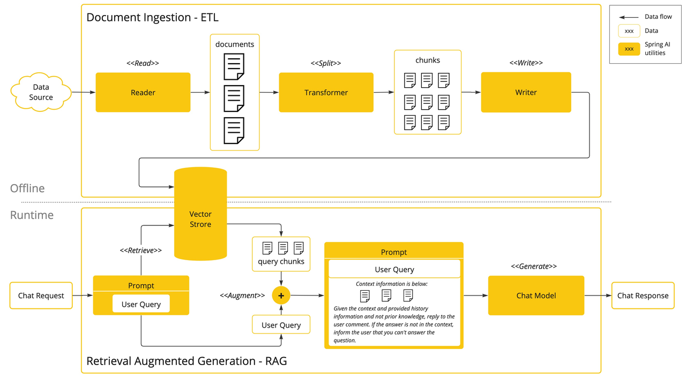

### ETL

将每种类型的实例串联起来，构建一个简单的 ETL 管道。

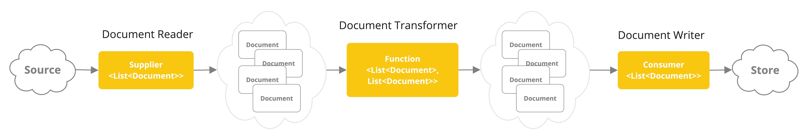

1. `PagePdfDocumentReader` 是 `DocumentReader` 的一个实现
2. `TokenTextSplitter` 是 `DocumentTransformer` 的一个实现
3. `VectorStore` 是 `DocumentWriter` 的一个实现

## RAGflow（自动化RAG工作流）