# 13. Xxl-Job

背景：

1. **定时任务**：每天晚上3:00 定时清理服务器临时数据、整天流水对账； 每隔30min做什么
2. **一次性任务**：临时做一件事。代码要写死的话，需要各种判断情况。给系统提交一些一次性，跑完即可

**之前**：**quartz**：定时任务框架、**Spring 整合**： 定时任务；一次性任务

1. 启用功能：@EnableScheduling
2. 指定执行时机：

```typescript
@Scheduled(cron = "*/2 * * * * *")
public void hello(){
    System.out.println("hello");
}
```

**缺点**：不太适配分布式系统（自己写代码适配）；

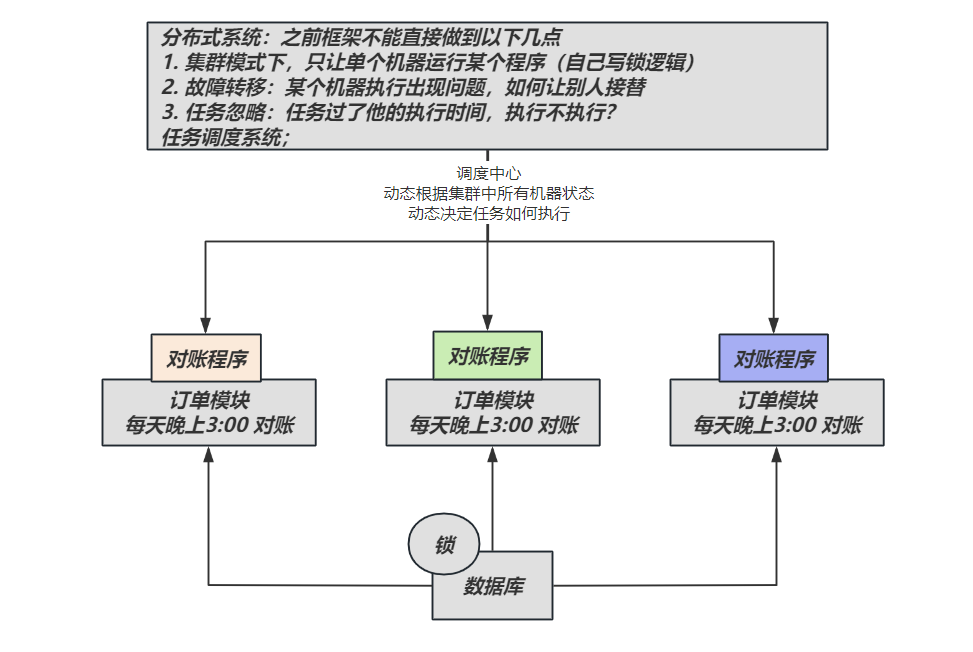

# 基础入门

## 简介

`XXL-JOB`是一个**分布式任务调度平台**，其核心设计目标是开发迅速、学习简单、轻量级、易扩展。现已开放源代码并接入多家公司线上产品线，开箱即用。

> **分布式系统**的标配

## 特性

1、**简单**：支持通过**Web页面**对任务进行CRUD操作，操作简单，一分钟上手；

2、**动态**：支持动态修改任务状态、启动/停止任务，以及终止运行中任务，即时生效；

3、**调度中心HA**（中心式）：调度采用中心式设计，“调度中心”自研调度组件并支持集群部署，可保证调度中心HA；High Available：高可用

4、**执行器HA**（分布式）：任务分布式执行，任务”执行器”支持集群部署，可保证任务执行HA；

5、**注册中心: **执行器会周期性自动注册任务, 调度中心将会自动发现注册的任务并触发执行。同时，也支持手动录入执行器地址；

6、**弹性扩容缩容**：一旦有新执行器机器上线或者下线，下次调度时将会重新分配任务；

7、**触发策略**：提供丰富的任务触发策略，包括：**Cron触发**、**固定间隔触发**、**固定延时触发**、API（事件）触发、**人工触发**、**父子任务触发**；

8、**调度过期策略**：调度中心错过调度时间的补偿处理策略，包括：忽略、立即补偿触发一次等；

9、阻塞处理策略：调度过于密集执行器来不及处理时的处理策略，策略包括：单机串行（默认）、丢弃后续调度、覆盖之前调度；

10、任务超时控制：支持自定义任务超时时间，任务运行超时将会主动中断任务；

11、任务失败重试：支持自定义任务失败重试次数，当任务失败时将会按照预设的失败重试次数主动进行重试；其中分片任务支持分片粒度的失败重试；

12、任务失败告警；默认提供邮件方式失败告警，同时预留扩展接口，可方便的扩展短信、钉钉等告警方式；

13、路由策略：执行器集群部署时提供丰富的路由策略，包括：第一个、最后一个、轮询、随机、一致性HASH、最不经常使用、最近最久未使用、故障转移、忙碌转移等；

14、分片广播任务：执行器集群部署时，任务路由策略选择”分片广播”情况下，一次任务调度将会广播触发集群中所有执行器执行一次任务，可根据分片参数开发分片任务；

15、动态分片：分片广播任务以执行器为维度进行分片，支持动态扩容执行器集群从而动态增加分片数量，协同进行业务处理；在进行大数据量业务操作时可显著提升任务处理能力和速度。

16、故障转移：任务路由策略选择”故障转移”情况下，如果执行器集群中某一台机器故障，将会自动Failover切换到一台正常的执行器发送调度请求。

17、任务进度监控：支持实时监控任务进度；

18、Rolling实时日志：支持在线查看调度结果，并且支持以Rolling方式实时查看执行器输出的完整的执行日志；

19、GLUE：提供Web IDE，支持在线开发任务逻辑代码，动态发布，实时编译生效，省略部署上线的过程。支持30个版本的历史版本回溯。

20、脚本任务：支持以GLUE模式开发和运行脚本任务，包括Shell、Python、NodeJS、PHP、PowerShell等类型脚本;

21、命令行任务：原生提供通用命令行任务Handler（Bean任务，”CommandJobHandler”）；业务方只需要提供命令行即可；

22、任务依赖：支持配置子任务依赖，当父任务执行结束且执行成功后将会主动触发一次子任务的执行, 多个子任务用逗号分隔；

23、一致性：“调度中心”通过DB锁保证集群分布式调度的一致性, 一次任务调度只会触发一次执行；

24、自定义任务参数：支持在线配置调度任务入参，即时生效；

25、调度线程池：调度系统多线程触发调度运行，确保调度精确执行，不被堵塞；

26、数据加密：调度中心和执行器之间的通讯进行数据加密，提升调度信息安全性；

27、邮件报警：任务失败时支持邮件报警，支持配置多邮件地址群发报警邮件；

28、推送maven中央仓库: 将会把最新稳定版推送到maven中央仓库, 方便用户接入和使用;

29、运行报表：支持实时查看运行数据，如任务数量、调度次数、执行器数量等；以及调度报表，如调度日期分布图，调度成功分布图等；

30、全异步：任务调度流程全异步化设计实现，如异步调度、异步运行、异步回调等，有效对密集调度进行流量削峰，理论上支持任意时长任务的运行；

31、跨语言/OpenAPI：调度中心与执行器提供语言无关的 OpenApi（RESTful 格式），第三方任意语言可据此对接调度中心或者实现执行器，实现多语言支持。除此之外，还提供了 “多任务模式”和“httpJobHandler”等其他跨语言方案；

32、国际化：调度中心支持国际化设置，提供中文、英文两种可选语言，默认为中文；

33、容器化：提供官方docker镜像，并实时更新推送dockerhub，进一步实现产品开箱即用；

34、线程池隔离：调度线程池进行隔离拆分，慢任务自动降级进入”Slow”线程池，避免耗尽调度线程，提高系统稳定性；

35、用户管理：支持在线管理系统用户，存在管理员、普通用户两种角色；

36、权限控制：执行器维度进行权限控制，管理员拥有全量权限，普通用户需要分配执行器权限后才允许相关操作；

37、**AI任务**：原生提供AI执行器，并内置多个AI任务Handler，与spring-ai、ollama、dify等集成打通，支持快速开发AI类任务。

## 源码

| 源码仓库地址 | Release Download |
| --- | --- |
| [https://github.com/xuxueli/xxl-job](https://github.com/xuxueli/xxl-job) | [Download](https://github.com/xuxueli/xxl-job/releases) |
| [http://gitee.com/xuxueli0323/xxl-job](http://gitee.com/xuxueli0323/xxl-job) | [Download](http://gitee.com/xuxueli0323/xxl-job/releases) |
| [https://gitcode.com/xuxueli/xxl-job](https://gitcode.com/xuxueli/xxl-job) | [Download](https://gitcode.com/xuxueli/xxl-job/tags) |

> 下载后的项目结构

```java
xxl-job-admin：调度中心
xxl-job-core：公共依赖
xxl-job-executor-samples：执行器Sample示例（选择合适的版本执行器，可直接使用，也可以参考其并将现有项目改造成执行器）
    ：xxl-job-executor-sample-springboot：Springboot版本，通过Springboot管理执行器，推荐这种方式；
    ：xxl-job-executor-sample-frameless：无框架版本；
```

## sql文件

> xxl-job 启动需要提前创建数据库； 数据库文件如下

```sql
#
# XXL-JOB
# Copyright (c) 2015-present, xuxueli.

CREATE database if NOT EXISTS `xxl_job` default character set utf8mb4 collate utf8mb4_unicode_ci;
use `xxl_job`;

SET NAMES utf8mb4;

## —————————————————————— job group and registry ——————————————————

CREATE TABLE `xxl_job_group`
(
    `id`           int(11)     NOT NULL AUTO_INCREMENT,
    `app_name`     varchar(64) NOT NULL COMMENT '执行器AppName',
    `title`        varchar(12) NOT NULL COMMENT '执行器名称',
    `address_type` tinyint(4)  NOT NULL DEFAULT '0' COMMENT '执行器地址类型：0=自动注册、1=手动录入',
    `address_list` text COMMENT '执行器地址列表，多地址逗号分隔',
    `update_time`  datetime             DEFAULT NULL,
    PRIMARY KEY (`id`)
) ENGINE = InnoDB
  DEFAULT CHARSET = utf8mb4;

CREATE TABLE `xxl_job_registry`
(
    `id`             int(11)      NOT NULL AUTO_INCREMENT,
    `registry_group` varchar(50)  NOT NULL,
    `registry_key`   varchar(255) NOT NULL,
    `registry_value` varchar(255) NOT NULL,
    `update_time`    datetime DEFAULT NULL,
    PRIMARY KEY (`id`),
    UNIQUE KEY `i_g_k_v` (`registry_group`, `registry_key`, `registry_value`) USING BTREE
) ENGINE = InnoDB
  DEFAULT CHARSET = utf8mb4;

## —————————————————————— job info ——————————————————

CREATE TABLE `xxl_job_info`
(
    `id`                        int(11)      NOT NULL AUTO_INCREMENT,
    `job_group`                 int(11)      NOT NULL COMMENT '执行器主键ID',
    `job_desc`                  varchar(255) NOT NULL,
    `add_time`                  datetime              DEFAULT NULL,
    `update_time`               datetime              DEFAULT NULL,
    `author`                    varchar(64)           DEFAULT NULL COMMENT '作者',
    `alarm_email`               varchar(255)          DEFAULT NULL COMMENT '报警邮件',
    `schedule_type`             varchar(50)  NOT NULL DEFAULT 'NONE' COMMENT '调度类型',
    `schedule_conf`             varchar(128)          DEFAULT NULL COMMENT '调度配置，值含义取决于调度类型',
    `misfire_strategy`          varchar(50)  NOT NULL DEFAULT 'DO_NOTHING' COMMENT '调度过期策略',
    `executor_route_strategy`   varchar(50)           DEFAULT NULL COMMENT '执行器路由策略',
    `executor_handler`          varchar(255)          DEFAULT NULL COMMENT '执行器任务handler',
    `executor_param`            varchar(512)          DEFAULT NULL COMMENT '执行器任务参数',
    `executor_block_strategy`   varchar(50)           DEFAULT NULL COMMENT '阻塞处理策略',
    `executor_timeout`          int(11)      NOT NULL DEFAULT '0' COMMENT '任务执行超时时间，单位秒',
    `executor_fail_retry_count` int(11)      NOT NULL DEFAULT '0' COMMENT '失败重试次数',
    `glue_type`                 varchar(50)  NOT NULL COMMENT 'GLUE类型',
    `glue_source`               mediumtext COMMENT 'GLUE源代码',
    `glue_remark`               varchar(128)          DEFAULT NULL COMMENT 'GLUE备注',
    `glue_updatetime`           datetime              DEFAULT NULL COMMENT 'GLUE更新时间',
    `child_jobid`               varchar(255)          DEFAULT NULL COMMENT '子任务ID，多个逗号分隔',
    `trigger_status`            tinyint(4)   NOT NULL DEFAULT '0' COMMENT '调度状态：0-停止，1-运行',
    `trigger_last_time`         bigint(13)   NOT NULL DEFAULT '0' COMMENT '上次调度时间',
    `trigger_next_time`         bigint(13)   NOT NULL DEFAULT '0' COMMENT '下次调度时间',
    PRIMARY KEY (`id`)
) ENGINE = InnoDB
  DEFAULT CHARSET = utf8mb4;

CREATE TABLE `xxl_job_logglue`
(
    `id`          int(11)      NOT NULL AUTO_INCREMENT,
    `job_id`      int(11)      NOT NULL COMMENT '任务，主键ID',
    `glue_type`   varchar(50) DEFAULT NULL COMMENT 'GLUE类型',
    `glue_source` mediumtext COMMENT 'GLUE源代码',
    `glue_remark` varchar(128) NOT NULL COMMENT 'GLUE备注',
    `add_time`    datetime    DEFAULT NULL,
    `update_time` datetime    DEFAULT NULL,
    PRIMARY KEY (`id`)
) ENGINE = InnoDB
  DEFAULT CHARSET = utf8mb4;

## —————————————————————— job log and report ——————————————————

CREATE TABLE `xxl_job_log`
(
    `id`                        bigint(20) NOT NULL AUTO_INCREMENT,
    `job_group`                 int(11)    NOT NULL COMMENT '执行器主键ID',
    `job_id`                    int(11)    NOT NULL COMMENT '任务，主键ID',
    `executor_address`          varchar(255)        DEFAULT NULL COMMENT '执行器地址，本次执行的地址',
    `executor_handler`          varchar(255)        DEFAULT NULL COMMENT '执行器任务handler',
    `executor_param`            varchar(512)        DEFAULT NULL COMMENT '执行器任务参数',
    `executor_sharding_param`   varchar(20)         DEFAULT NULL COMMENT '执行器任务分片参数，格式如 1/2',
    `executor_fail_retry_count` int(11)    NOT NULL DEFAULT '0' COMMENT '失败重试次数',
    `trigger_time`              datetime            DEFAULT NULL COMMENT '调度-时间',
    `trigger_code`              int(11)    NOT NULL COMMENT '调度-结果',
    `trigger_msg`               text COMMENT '调度-日志',
    `handle_time`               datetime            DEFAULT NULL COMMENT '执行-时间',
    `handle_code`               int(11)    NOT NULL COMMENT '执行-状态',
    `handle_msg`                text COMMENT '执行-日志',
    `alarm_status`              tinyint(4) NOT NULL DEFAULT '0' COMMENT '告警状态：0-默认、1-无需告警、2-告警成功、3-告警失败',
    PRIMARY KEY (`id`),
    KEY `I_trigger_time` (`trigger_time`),
    KEY `I_handle_code` (`handle_code`),
    KEY `I_jobid_jobgroup` (`job_id`,`job_group`),
    KEY `I_job_id` (`job_id`)
) ENGINE = InnoDB
  DEFAULT CHARSET = utf8mb4;

CREATE TABLE `xxl_job_log_report`
(
    `id`            int(11) NOT NULL AUTO_INCREMENT,
    `trigger_day`   datetime         DEFAULT NULL COMMENT '调度-时间',
    `running_count` int(11) NOT NULL DEFAULT '0' COMMENT '运行中-日志数量',
    `suc_count`     int(11) NOT NULL DEFAULT '0' COMMENT '执行成功-日志数量',
    `fail_count`    int(11) NOT NULL DEFAULT '0' COMMENT '执行失败-日志数量',
    `update_time`   datetime         DEFAULT NULL,
    PRIMARY KEY (`id`),
    UNIQUE KEY `i_trigger_day` (`trigger_day`) USING BTREE
) ENGINE = InnoDB
  DEFAULT CHARSET = utf8mb4;

## —————————————————————— lock ——————————————————

CREATE TABLE `xxl_job_lock`
(
    `lock_name` varchar(50) NOT NULL COMMENT '锁名称',
    PRIMARY KEY (`lock_name`)
) ENGINE = InnoDB
  DEFAULT CHARSET = utf8mb4;

## —————————————————————— user ——————————————————

CREATE TABLE `xxl_job_user`
(
    `id`         int(11)     NOT NULL AUTO_INCREMENT,
    `username`   varchar(50) NOT NULL COMMENT '账号',
    `password`   varchar(100) NOT NULL COMMENT '密码加密信息',
    `token`      varchar(100) DEFAULT NULL COMMENT '登录token',
    `role`       tinyint(4)  NOT NULL COMMENT '角色：0-普通用户、1-管理员',
    `permission` varchar(255) DEFAULT NULL COMMENT '权限：执行器ID列表，多个逗号分割',
    PRIMARY KEY (`id`),
    UNIQUE KEY `i_username` (`username`) USING BTREE
) ENGINE = InnoDB
  DEFAULT CHARSET = utf8mb4;


## —————————————————————— for default data ——————————————————

INSERT INTO `xxl_job_group`(`id`, `app_name`, `title`, `address_type`, `address_list`, `update_time`)
    VALUES (1, 'xxl-job-executor-sample', '通用执行器Sample', 0, NULL, now()),
           (2, 'xxl-job-executor-sample-ai', 'AI执行器Sample', 0, NULL, now());

INSERT INTO `xxl_job_info`(`id`, `job_group`, `job_desc`, `add_time`, `update_time`, `author`, `alarm_email`,
                           `schedule_type`, `schedule_conf`, `misfire_strategy`, `executor_route_strategy`,
                           `executor_handler`, `executor_param`, `executor_block_strategy`, `executor_timeout`,
                           `executor_fail_retry_count`, `glue_type`, `glue_source`, `glue_remark`, `glue_updatetime`,
                           `child_jobid`)
VALUES (1, 1, '示例任务01', now(), now(), 'XXL', '', 'CRON', '0 0 0 * * ? *',
        'DO_NOTHING', 'FIRST', 'demoJobHandler', '', 'SERIAL_EXECUTION', 0, 0, 'BEAN', '', 'GLUE代码初始化',
        now(), ''),
       (2, 2, 'Ollama示例任务01', now(), now(), 'XXL', '', 'NONE', '',
        'DO_NOTHING', 'FIRST', 'ollamaJobHandler', '{
    "input": "慢SQL问题分析思路",
    "prompt": "你是一个研发工程师，擅长解决技术类问题。",
    "model": "qwen3:0.6b"
}', 'SERIAL_EXECUTION', 0, 0, 'BEAN', '', 'GLUE代码初始化',
        now(), ''),
       (3, 2, 'Dify示例任务', now(), now(), 'XXL', '', 'NONE', '',
        'DO_NOTHING', 'FIRST', 'difyWorkflowJobHandler', '{
    "inputs":{
        "input":"查询班级各学科前三名"
    },
    "user": "xxl-job",
    "baseUrl": "http://localhost/v1",
    "apiKey": "app-OUVgNUOQRIMokfmuJvBJoUTN"
}', 'SERIAL_EXECUTION', 0, 0, 'BEAN', '', 'GLUE代码初始化',
        now(), '');

INSERT INTO `xxl_job_user`(`id`, `username`, `password`, `role`, `permission`)
VALUES (1, 'admin', '8d969eef6ecad3c29a3a629280e686cf0c3f5d5a86aff3ca12020c923adc6c92', 1, NULL);

INSERT INTO `xxl_job_lock` (`lock_name`)
VALUES ('schedule_lock');

commit;
```

## 安装

主要两种方式：

1. 下载源码，启动 `xxl-job-admin` 控制台。
2. Docker 启动 xxl-job-admin 容器； **调度中心**

### Docker启动

> https://hub.docker.com/r/xuxueli/xxl-job-admin/
> 
> compose文件如下。要求：提前准备好 xxl.sql 文件。保证数据库启动有执行对应sql

```yaml
services:
  xxl-mysql:
    image: mysql:8.0.42
    container_name: xxl-mysql
    environment:
      # 时区上海
      TZ: Asia/Shanghai
      MYSQL_ROOT_PASSWORD: 123456
    volumes:
      - ./xxl/xxl.sql:/docker-entrypoint-initdb.d/xxl.sql

  xxl-job:
    image: xuxueli/xxl-job-admin:3.2.0
    container_name: xxl-job
    ports:
      - "8080:8080"
    environment:
      PARAMS: "
        --spring.datasource.url=jdbc:mysql://xxl-mysql:3306/xxl_job?useUnicode=true&characterEncoding=UTF-8&autoReconnect=true&serverTimezone=Asia/Shanghai
        --spring.datasource.username=root
        --spring.datasource.password=123456
        --xxl.job.accessToken=abcdefghjklkkkjssssa
        --xxl.job.i18n=true"
      JAVA_OPTS: "-Xms256m -Xmx256m -Xmn192m"
    depends_on:
      - xxl-mysql
```

```java
spring.mail.host=smtp.qq.com
spring.mail.port=25
spring.mail.username=xxx@qq.com
spring.mail.from=xxx@qq.com
spring.mail.password=xxx
spring.mail.properties.mail.smtp.auth=true
spring.mail.properties.mail.smtp.starttls.enable=true
spring.mail.properties.mail.smtp.starttls.required=true
spring.mail.properties.mail.smtp.socketFactory.class=javax.net.ssl.SSLSocketFactory
```

### 源码启动

> 注意修改数据库地址即可

## 访问

http://localhost:8080/xxl-job-admin

账号密码： admin/123456

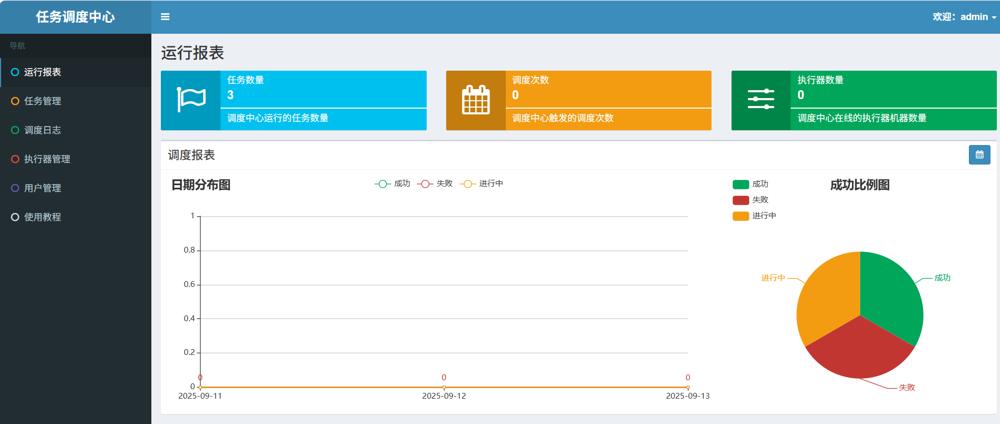

## 调度中心集群：了解

调度中心支持集群部署，提升调度系统容灾和可用性。

调度中心集群部署时，几点要求和建议：

- **DB配置保持一致**；
- **集群机器时钟保持一致**（单机集群忽视）；
- 建议：**推荐通过nginx为调度中心集群做负载均衡，分配域名。调度中心访问、执行器回调配置、调用API服务等操作均通过该域名进行。**

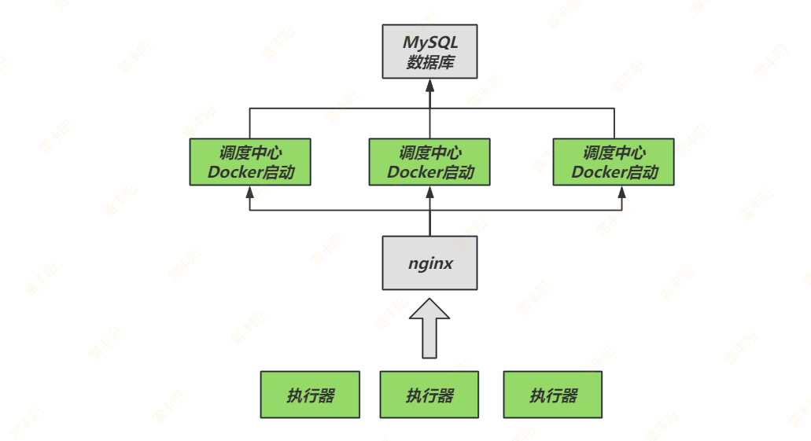

## 设计思想

### 常见组件

> `xxl-job` 中的几个**常见组件**：
> 
> 1. **调度中心**：将调度行为抽象形成“调度中心”公共平台，而平台自身并不承担业务逻辑，“调度中心”负责发起**调度请求**。
> 2. **JobHandler**：将**任务**抽象成分散的 `JobHandler`，交由“执行器”统一管理，
> 3. **执行器**：负责接收调度请求并执行对应的 `JobHandler`中业务逻辑。
> 
> > 因此，“**调度**”和“**任务**”两部分可以相互解耦，提高系统整体稳定性和扩展性；

### 设计思想

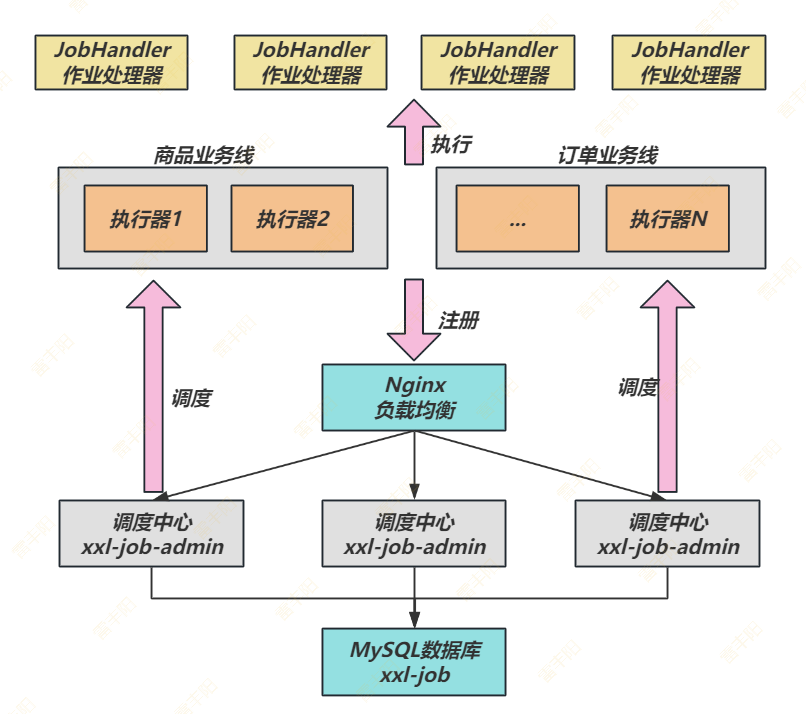

### 系统组成

- **调度模块（调度中心）**：
**负责管理调度信息，按照调度配置发出调度请求**，`自身不承担业务代码`。调度系统与任务解耦，提高了系统可用性和稳定性，同时调度系统性能不再受限于任务模块；
支持可视化、简单且动态的管理调度信息，包括任务新建，更新，删除，GLUE开发和任务报警等，所有上述操作都会实时生效，同时支持监控调度结果以及执行日志，支持执行器Failover。
- **执行模块（执行器）**：
**负责接收调度请求并执行任务逻辑**。任务模块专注于任务的执行等操作，开发和维护更加简单和高效；
接收“调度中心”的执行请求、终止请求和日志请求等。

### 架构图

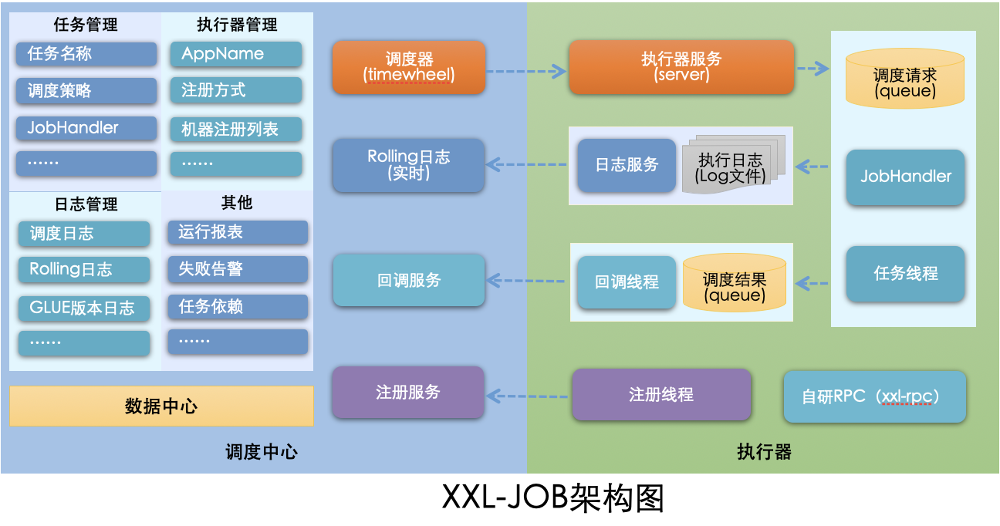

### 为什么不是 quartz

Quartz作为开源作业调度中的佼佼者，是作业调度的首选。但是存在以下问题：

- **问题一：**调用API的方式操作任务，不人性化；
- **问题二：**需要持久化业务 `QuartzJobBean`到底层数据表中，系统侵入性相当严重。
- **问题三：**调度逻辑和 `QuartzJobBean`耦合在同一个项目中，这将导致一个问题，在调度任务数量逐渐增多，同时调度任务逻辑逐渐加重的情况下，此时调度系统的性能将大大受限于业务；
- **问题四：**quartz底层以“抢占式”获取DB锁并由抢占成功节点负责运行任务，会导致节点负载悬殊非常大；而XXL-JOB通过执行器实现“协同分配式”运行任务，充分发挥集群优势，**负载各节点均衡**。

XXL-JOB弥补了quartz的上述不足之处。

## 配置执行器项目

1. `“执行器”项目``：xxl-job-executor-sample-springboot (提供多种版本执行器供选择，现以 springboot 版本为例，可直接使用，也可以参考其并将现有项目改造成执行器)`
2. `作用：负责接收“调度中心”的调度并执行；可直接部署执行器，也可以将执行器集成到现有业务项目中。`
3. 也就是说：**每个业务都可能成为任务的执行器，由调度中心统一调度**

### 引入依赖

```xml
<dependency>
    <groupId>com.xuxueli</groupId>
    <artifactId>xxl-job-core</artifactId>
    <version>3.2.0</version>
</dependency>
```

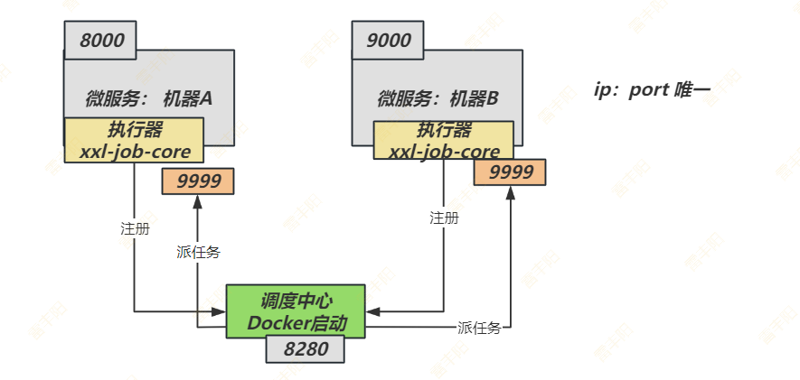

### 创建配置

```properties
### 调度中心部署根地址 [选填]：如调度中心集群部署存在多个地址则用逗号分隔。执行器将会使用该地址进行"执行器心跳注册"和"任务结果回调"；为空则关闭自动注册；
xxl.job.admin.addresses=http://127.0.0.1:8080/xxl-job-admin

### 调度中心通讯TOKEN [选填]：非空时启用； 注意：和xxl-job-admin中配置一致
xxl.job.admin.accessToken=abcdefghjklkkkjssssa

### 调度中心通讯超时时间[选填]，单位秒；默认3s；
xxl.job.admin.timeout=3

### 执行器AppName [选填]：执行器心跳注册分组依据；为空则关闭自动注册；一般是微服务名字
xxl.job.executor.appname=lfy-job-executor-demo
### 执行器注册 [选填]：优先使用该配置作为注册地址，为空时使用内嵌服务 ”IP:PORT“ 作为注册地址。从而更灵活的支持容器类型执行器动态IP和动态映射端口问题。
xxl.job.executor.address=
### 执行器IP [选填]：默认为空表示自动获取IP，多网卡时可手动设置指定IP，该IP不会绑定Host仅作为通讯使用；地址信息用于 "执行器注册" 和 "调度中心请求并触发任务"；
xxl.job.executor.ip=
### 执行器端口号 [选填]：小于等于0则自动获取；默认端口为9999，单机部署多个执行器时，注意要配置不同执行器端口；
xxl.job.executor.port=-1
### 执行器运行日志文件存储磁盘路径 [选填] ：需要对该路径拥有读写权限；为空则使用默认路径；
xxl.job.executor.logpath=/data/applogs/xxl-job/jobhandler
### 执行器日志文件保存天数 [选填] ： 过期日志自动清理, 限制值大于等于3时生效; 否则, 如-1, 关闭自动清理功能；
xxl.job.executor.logretentiondays=30
```

### 注入执行器组件

> 编写一个 `XxlJobConfig `配置类，内容如下

```typescript
package com.lfy.satoken.config;

import com.xxl.job.core.executor.impl.XxlJobSpringExecutor;
import lombok.Data;
import lombok.extern.slf4j.Slf4j;
import org.springframework.beans.factory.annotation.Value;
import org.springframework.boot.context.properties.ConfigurationProperties;
import org.springframework.context.annotation.Bean;
import org.springframework.context.annotation.Configuration;

/**
 * @author leifengyang
 * @version 1.0
 * @date 2025/9/13 22:34
 * @description:
 */
@Data
@Slf4j
@Configuration
public class XxlJobConfig {
    @Value("${xxl.job.admin.addresses}")
    private String adminAddresses;

    @Value("${xxl.job.admin.accessToken}")
    private String accessToken;

    @Value("${xxl.job.admin.timeout}")
    private int timeout;

    @Value("${xxl.job.executor.appname}")
    private String appname;

    @Value("${xxl.job.executor.address}")
    private String address;

    @Value("${xxl.job.executor.ip}")
    private String ip;

    @Value("${xxl.job.executor.port}")
    private int port;

    @Value("${xxl.job.executor.logpath}")
    private String logPath;

    @Value("${xxl.job.executor.logretentiondays}")
    private int logRetentionDays;

    @Bean
    public XxlJobSpringExecutor xxlJobExecutor() {
        log.info(">>>>>>>>>>> xxl-job config init.");
        XxlJobSpringExecutor xxlJobSpringExecutor = new XxlJobSpringExecutor();
        xxlJobSpringExecutor.setAdminAddresses(adminAddresses);
        xxlJobSpringExecutor.setAppname(appname);
        xxlJobSpringExecutor.setIp(ip);
        xxlJobSpringExecutor.setPort(port);
        xxlJobSpringExecutor.setAccessToken(accessToken);
        xxlJobSpringExecutor.setLogPath(logPath);
        xxlJobSpringExecutor.setLogRetentionDays(logRetentionDays);

        return xxlJobSpringExecutor;
    }
}
```

### 录入执行器

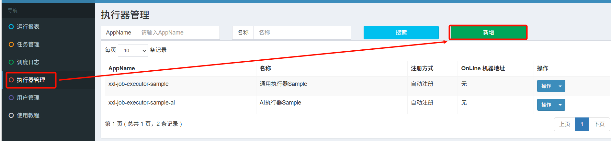

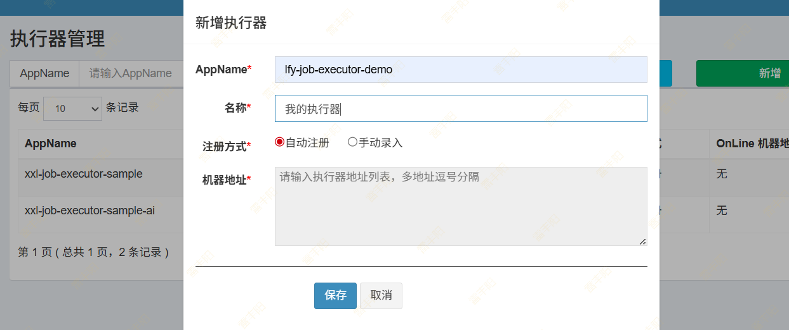

> 刷新，如果看不到机器列表。点击**操作==》编辑==》保存**即可

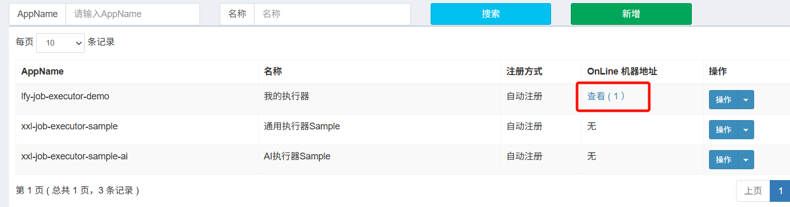

# 任务调度

## Bean模式

**Bean模式任务**，支持基于类的开发方式，每个任务对应一个Java类。

- 优点：不限制项目环境，兼容性好。即使是无框架项目，如main方法直接启动的项目也可以提供支持，可以参考示例项目 “xxl-job-executor-sample-frameless”；
- 缺点：
  - 每个任务需要占用一个Java类，造成类的浪费；
  - 不支持自动扫描任务并注入到执行器容器，需要手动注入。

### 开发步骤

1. **任务开发**：在Spring Bean实例中，开发Job方法；
2. **注解配置**：为Job方法添加注解 "`@XxlJob`(value="自定义jobhandler名称", init = "JobHandler初始化方法", destroy = "JobHandler销毁方法")"，注解value值对应的是调度中心新建任务的JobHandler属性的值。
3. **执行日志**：需要通过 "`XxlJobHelper.log`" 打印执行日志；
4. **任务结果**：默认任务结果为 "成功" 状态，不需要主动设置；如有诉求，比如设置任务结果为失败，可以通过 "`XxlJobHelper.handleFail`/`handleSuccess`" 自主设置任务结果；

### 示例代码

```java
@Service
public class SampleXxlJob {

    /**
     * 1、简单任务示例（Bean模式）
     */
    @XxlJob("demoJobHandler")
    public void demoJobHandler() throws Exception {
        // 执行日志记录； 这里的日志会打印到 xxl-job-admin 界面。
        // 普通 log.info 是打印到当前控制台的，不会连接到 xxl-job-admin
        XxlJobHelper.log("XXL-JOB, Hello World.");

        for (int i = 0; i < 5; i++) {
            XxlJobHelper.log("beat at:" + i);
            TimeUnit.SECONDS.sleep(2);
        }
        // default success：默认就是返回成功。如果想让 xxl-job-admin 感知任务失败
        // 通过：XxlJobHelper.handleFail/handleSuccess 设置任务结果
        
    }
}
```

### 新增任务

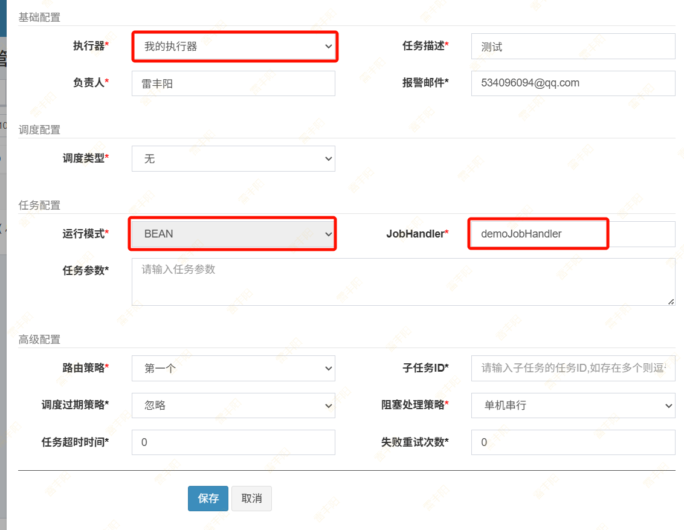

### 执行一次

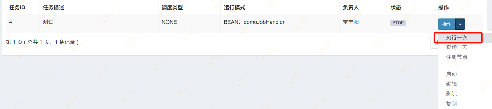

### 查看日志

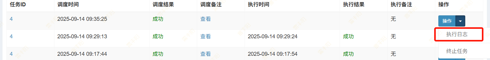

### 传递参数

> 改造 `demoJobHandler `任务，让其接收参数，可以指定次数和睡眠时间

#### 代码接收参数

```java
/**
 * 1、简单任务示例（Bean模式）
 */
@XxlJob("demoJobHandler")
public void demoJobHandler() throws Exception {
    int count = 5,timeout = 2;
    //获取任务的参数。这个参数是个字符串，用户根据自己的习惯，传入 string，json，xml等都可以
    String jobParam = XxlJobHelper.getJobParam();

    //如果参数有值
    if (StringUtils.hasText(jobParam) && jobParam.contains(",")) {
        //假设我们传入两个参数，且用逗号分割
        String[] split = jobParam.trim().split(",");
        count = Integer.parseInt(split[0]);
        timeout = Integer.parseInt(split[1]);
    }


    // 执行日志记录； 这里的日志会打印到 xxl-job-admin 界面。
    // 普通 log.info 是打印到当前控制台的，不会连接到 xxl-job-admin
    XxlJobHelper.log("XXL-JOB, Hello World.");

    for (int i = 0; i < count; i++) {
        XxlJobHelper.log("beat at:" + i);
        TimeUnit.SECONDS.sleep(timeout);
    }
    // default success：默认就是返回成功。如果想让 xxl-job-admin 感知任务失败
    // 通过：XxlJobHelper.handleFail/handleSuccess 设置任务结果

}
```

#### 执行传递参数

> 任务管理 ==> 选中任务 ==> 执行一次

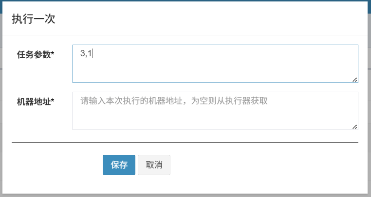

#### 运行效果

> 查看日志。每隔一秒执行一次，总计执行 3次


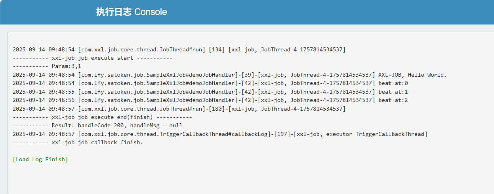

### 自定义任务结果

```typescript
/**
 * 转码
 * 如果这个任务需要参数：
 * 1. 人工触发执行的时候，会手写参数进去，调度中心调度这个任务的时候，会把参数交给执行器
 *    所有的参数，被封装到一个大文本中
 * 2. 获取到执行器传递过来的参数
 */
@XxlJob("vodTranslateJob")
public void translateVod(){
    //1、获取任务参数
    String jobParam = XxlJobHelper.getJobParam();

    //2、解析任务参数(根据业务规定)  1,掌上珠,60
    String[] split = jobParam.split(",");
    String videoId = split[0];
    String videoName = split[1];
    String time = split[2];
    XxlJobHelper.log("转码开始, {}",videoId);
    System.out.println("准备转码....");
    System.out.println("videoId = " + videoId);
    System.out.println("videoName = " + videoName);
    System.out.println("time = " + time);

    if(Long.parseLong(time) > 60){
        XxlJobHelper.log("视频时长超过60秒, 不允许转码");
        XxlJobHelper.handleFail("视频时长超过60秒, 不允许转码");
    }
    XxlJobHelper.log("转码完成");

}
```

## GLUE模式

> - **GLUE** 代表“`粘合`”或“胶水”之意（在英文中 glue = 胶水/粘合剂）。
> - 通过脚本代码**动态粘合/绑定**任务执行逻辑的方式，使调度器和执行器之间灵活耦合，任务逻辑可以热更新和动态加载。
> - **“GLUE模式(**`Java`**)”**的执行代码托管到调度中心在线维护，相比“**Bean模式任务**”需要在执行器项目开发部署上线，更加简便轻量）

“GLUE模式(Java)”的执行代码托管到调度中心在线维护，相比“Bean模式任务”需要在执行器项目开发部署上线，更加简便轻量

> *前提：请确认“调度中心”和“执行器”项目已经成功部署并启动；*

### 新建任务

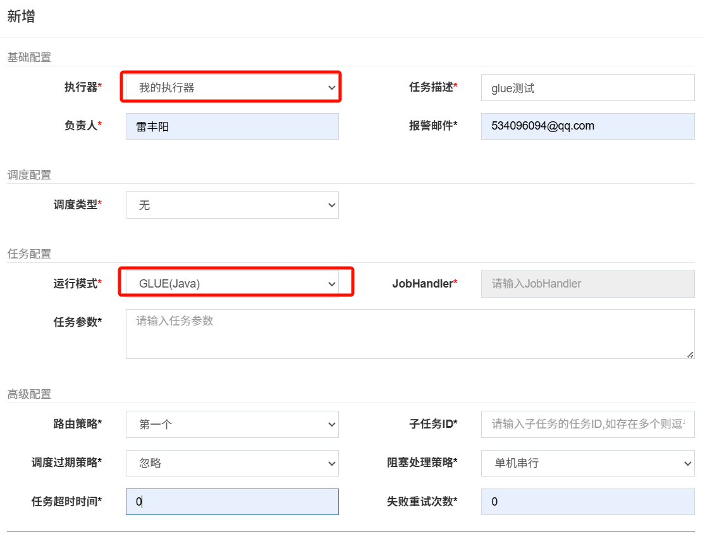

### 开发任务

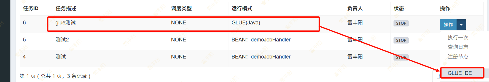

### 代码模板

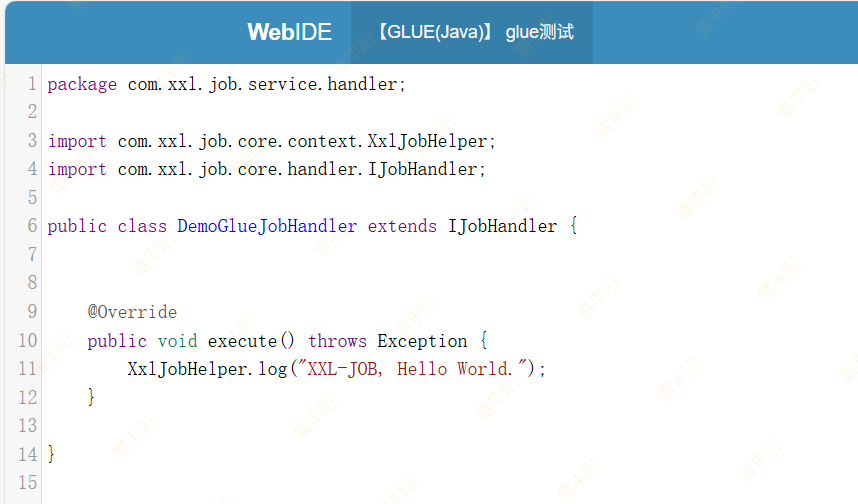

### 执行一次

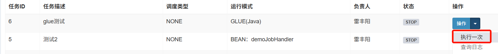

### 查看效果

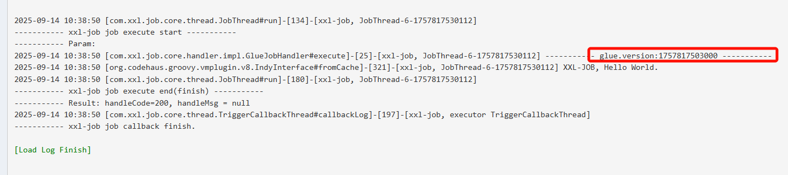

### 最佳实践

GLUE 默认如何调用 Spring组件

#### 准备组件

```typescript
@Service
public class HelloService {

    public void sayHello(){
        XxlJobHelper.log("hello world....");
    }
}
```

#### 编写代码

> 可以先在 idea 中编写

```java
import com.lfy.satoken.exception.HelloService;
import com.xxl.job.core.handler.IJobHandler;
import org.springframework.beans.factory.annotation.Autowired;


/**
 * @author leifengyang
 * @version 1.0
 * @date 2025/9/14 10:42
 * @description:
 */
public class DemoJobHandler extends IJobHandler {

    @Autowired
    HelloService helloService;

    @Override
    public void execute() throws Exception {
        helloService.sayHello();
    }
}
```

#### 上传代码

> 上传并保存代码到 GLUE IDE

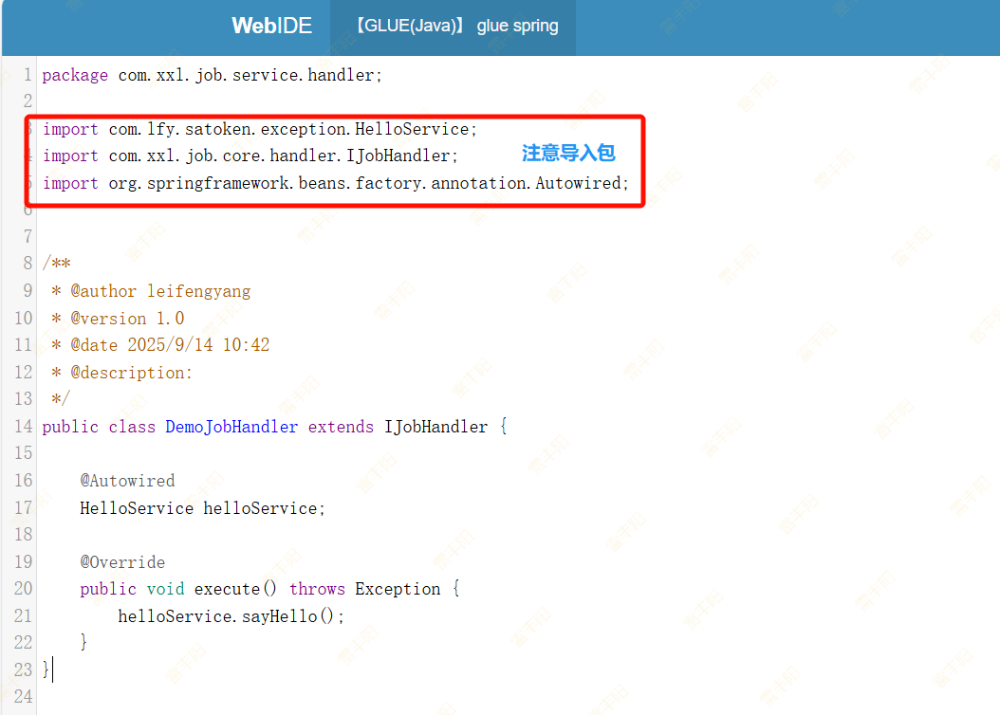

#### 执行测试

> 由于 IDEA 添加了代码，别忘了重启测试

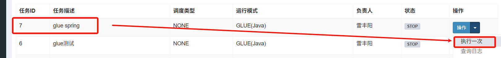

#### 查看效果


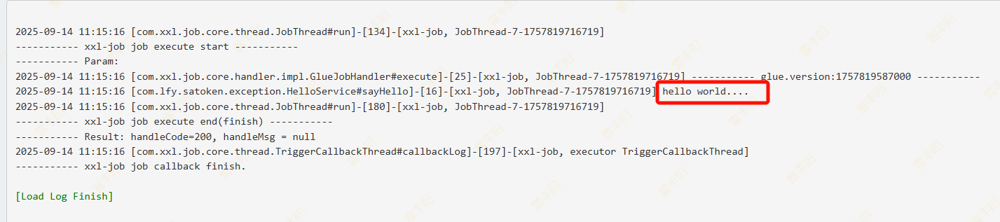

## 任务详解

### 基础配置


- **执行器**：任务的绑定的执行器，任务触发调度时将会自动发现注册成功的执行器, 实现任务自动发现功能; 另一方面也可以方便的进行任务分组。每个任务必须绑定一个执行器, 可在 "执行器管理" 进行设置;
- **任务描述**：任务的描述信息，便于任务管理；
- **负责人**：任务的负责人；
- **报警邮件**：任务调度失败时邮件通知的邮箱地址，支持配置多邮箱地址，配置多个邮箱地址时用逗号分隔；

### 触发配置


**触发配置**

1. **无**：该类型不会主动触发调度；
2. **CRON**：该类型将会通过CRON，触发任务调度；
3. **固定速度**：该类型将会以固定速度，触发任务调度；按照固定的间隔时间，周期性触发；

**cron可视化配置**：

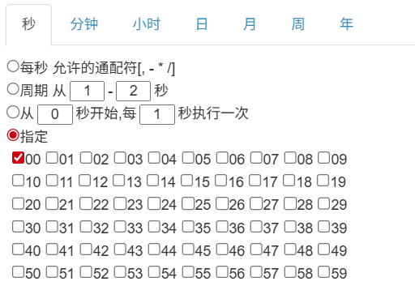

### 任务配置


#### 运行模式

- **BEAN模式**：任务以JobHandler方式维护在执行器端；需要结合 "JobHandler" 属性匹配执行器中任务；
- **GLUE模式(Java)**：任务以源码方式维护在调度中心；该模式的任务实际上是一段继承自IJobHandler的Java类代码并 "groovy" 源码方式维护，它在执行器项目中运行，可使用@Resource/@Autowire注入执行器里中的其他服务；
- **GLUE模式(Shell)**：任务以源码方式维护在调度中心；该模式的任务实际上是一段 "shell" 脚本；
- **GLUE模式(Python)**：任务以源码方式维护在调度中心；该模式的任务实际上是一段 "python" 脚本；
- **GLUE模式(PHP)**：任务以源码方式维护在调度中心；该模式的任务实际上是一段 "php" 脚本；
- **GLUE模式(NodeJS)**：任务以源码方式维护在调度中心；该模式的任务实际上是一段 "nodejs" 脚本；
- **GLUE模式(PowerShell)**：任务以源码方式维护在调度中心；该模式的任务实际上是一段 "PowerShell" 脚本；


####   JobHandler

**JobHandler**：运行模式为 "BEAN模式" 时生效，对应执行器中新开发的JobHandler类“@XxlJob”注解自定义的value值；

#### 执行参数

任务执行所需的参数； 

### 高级设置


#### 路由策略：

> 执行器集群部署时提供丰富的路由策略

**FIRST（第一个）**：固定选择第一个机器；

**LAST（最后一个）**：固定选择最后一个机器；

**ROUND（轮询）**：

**RANDOM（随机）**：随机选择在线的机器；

**CONSISTENT_HASH（一致性HASH）**：每个任务按照Hash算法固定选择某一台机器，且所有任务均匀散列在不同机器上。

**LEAST_FREQUENTLY_USED（最不经常使用）**：使用频率最低的机器优先被选举；

**LEAST_RECENTLY_USED（最近最久未使用）**：最久未使用的机器优先被选举；

**FAILOVER（故障转移）**：按照顺序依次进行心跳检测，第一个心跳检测成功的机器选定为目标执行器并发起调度；任务路由策略选择”故障转移”情况下，如果执行器集群中某一台机器故障，将会自动Failover切换到一台正常的执行器发送调度请求。

**BUSYOVER（忙碌转移）**：按照顺序依次进行空闲检测，**第一个空闲检测**成功的机器选定为目标执行器并发起调度；

**SHARDING_BROADCAST(分片广播)**：广播触发对应集群中**所有机器执行一次任务**，同时系统`自动传递分片参数`；可根据`分片参数开发分片任务`；

#### 子任务

> 每个任务都拥有一个唯一的任务ID(任务ID可以从任务列表获取)，当本任务执行结束并且执行成功时，将会触发子任务ID所对应的任务的一次主动调度。
> 

#### 调度过期策略

> 调度中心错过调度时间的`补偿处理策略`，包括：忽略、立即补偿触发一次等；
> 
> 任务类型：`cron 定时任务`；  每天`12`点触发

**忽略**：调度过期后，忽略过期的任务，从当前时间开始重新计算下次触发时间；

**立即执行一次（一定要做）**：调度过期后，立即执行一次，并从当前时间开始重新计算下次触发时间；

#### 阻塞处理策略

> 调度过于密集执行器来不及处理时的处理策略；

**单机串行（默认）**: 调度请求进入单机执行器后，调度请求进入FIFO队列并以串行方式运行；

**丢弃后续调度（拒绝接受新任务）**：调度请求进入单机执行器后，发现执行器存在运行的调度任务，本次请求将会被丢弃并标记为失败；

**覆盖之前调度（丢弃所有老任务）**：调度请求进入单机执行器后，发现执行器存在运行的调度任务，将会终止运行中的调度任务并`清空队列`，然后运行本地调度任务；

#### 任务超时时间

> 支持自定义任务超时时间，任务运行超时将会主动中断任务；

#### 失败重试次数

> 支持自定义任务失败重试次数，当任务失败时将会按照预设的失败重试次数主动进行重试；其中分片任务支持分片粒度的失败重试；

# REST API

XXL-JOB 目标是一种跨平台、跨语言的任务调度规范和协议。

针对Java应用，可以直接通过官方提供的调度中心与执行器，方便快速的接入和使用调度中心，可以参考上文 “快速入门” 章节。

针对非Java应用，可借助 XXL-JOB 的标准 OpenApi（RESTful API） 方便的实现多语言支持。

- **调度中心 RESTful API**：
  - **说明**：调度中心提供给执行器使用的API；不局限于官方执行器使用，第三方可使用该API来实现执行器；
  - **API列表**：`执行器注册`、`任务结果回调`等；
- **执行器 RESTful API** ：
  - **说明**：执行器提供给调度中心使用的API；官方执行器默认已实现，第三方执行器需要实现并对接提供给调度中心；
  - **API列表**：`任务触发`、`任务终止`、`任务日志查询`……等；

此处 RESTful API 主要用于非Java语言定制个性化执行器使用，实现跨语言。除此之外，如果有需要通过API操作调度中心，可以个性化扩展 “调度中心 RESTful API” 并使用。

https://www.xuxueli.com/xxl-job/#3.1%20BEAN%E6%A8%A1%E5%BC%8F%EF%BC%88%E7%B1%BB%E5%BD%A2%E5%BC%8F%EF%BC%89

# 项目整合

> 除了手动录入任务外，我们项目希望，在发生某件事情后，也触发一个任务。让 xxl-job 调度给执行器去执行；

> > 项目中使用：
> > 
> > **自定义执行器** + **Bean模式 + 无主动触发 + 动态参数传递 + 单机串行 + 最近最少使用 + 失败重试**

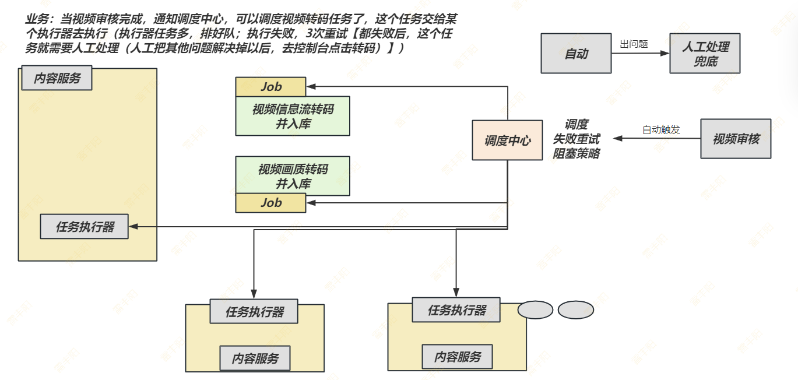

> 自动化任务实现步骤：
> 
> 1. 模拟 xxl-job 登录，获取到 Cookie 中的 访问令牌
> 2. 使用访问令牌，启动任务

## 登录 API

**请求路径**：`/auth/doLogin`

**请求方式**：POST

**请求参数**：**userName**=admin&**password**=123456

**返回值**：{code:200,msg:"",content:""}

> 注意：我们不需要返回值，需要响应头中的 Set-Cookie 的值；

```typescript
        @RequestMapping(value="/doLogin", method=RequestMethod.POST)
        @ResponseBody
        @XxlSso(login = false)
        public ReturnT<String> doLogin(HttpServletRequest request,
                                                                        HttpServletResponse response,
                                                                        @RequestParam("userName") String userName,
                                                                        @RequestParam("password") String password,
                                                                        @RequestParam(value = "ifRemember", required = false) String ifRemember){
```

```typescript
    @Test
    void testLoginAndGetAccessToken(){
        Map<String,Object> map = new HashMap<>();
        map.put("userName","admin");
        map.put("password","123456");
        try (HttpResponse response = HttpUtil.createPost(xxlJobConfig.getAdminAddresses() + "/auth/doLogin")
            .form(map)
            .execute()) {

            List<HttpCookie> cookies = response.getCookies();
            System.out.println("获取到响应数据："+cookies);
        }
    }
```

## 执行任务API

**请求路径**：`/jobinfo/trigger`

**请求方式**：POST

**请求参数**：id=xx&executorParam=xx&addressList=xx    注意：都是必传参数，没有的值传""

**返回值**：{code:200,msg:"",content:""}

> 需要执行1 进行登录，拿到 Cookie 数据；

```typescript
@Test
void testLoginAndGetAccessToken(){
    Map<String,Object> req = new HashMap<>();
    map.put("id",5);
    map.put("executorParam","");
    map.put("addressList","");
//        map.put("AccessToken",xxlJobConfig.getAccessToken());

    HttpResponse resp = HttpUtil.createPost(xxlJobConfig.getAdminAddresses() + "/jobinfo/trigger")
        .form(map)
        .cookie(cookies)
        .execute();
    System.out.println(resp);

}
```