# 1. Nginx

## 什么是 Nginx

Nginx（发音为"**engine-x**"）是一个高性能的 **HTTP** 和**反向代理服务器**，也是一个 **IMAP/POP3/SMTP** 服务器。它由**俄罗斯程序员 Igor Sysoev** 开发，于 2004 年首次公开发布。

> 1. http服务器：处理HTTP请求。http报文传输
> 2. **反向代理服务器：我去代理别人**

正向代理、反向代理

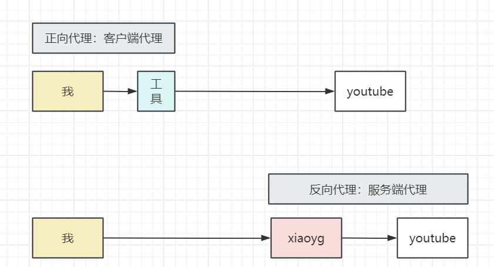

### 主要用途

- **Web 服务器**：提供**静态文件服务；前端部署**
- **反向代理**：将客户端请求转发到后端服务器
- **负载均衡器**：在多个后端服务器之间分配请求
- **HTTP 缓存**：缓存静态内容以提高性能
- **SSL 终端**：处理 SSL/TLS 加密； 安全HTTP； HTTPS；

### 核心特点

- **高并发**：能够处理数万个并发连接
- **低内存消耗**：相比 Apache 等服务器，内存占用更少
- **高稳定性**：运行稳定，很少出现宕机
- **模块化设计**：功能通过模块实现，可按需加载
- **配置简单**：配置文件语法简洁明了

### 性能优势

- **事件驱动架构**
- **异步非阻塞处理**
- **高效的内存管理**
- 优秀的静态文件处理能力

## 安装 Nginx

### Ubuntu/Debian 系统

```shell
# 更新包列表
sudo apt update

# 安装 Nginx
sudo apt install nginx

# 启动 Nginx
sudo systemctl start nginx

# 设置开机自启
sudo systemctl enable nginx

# 检查状态
sudo systemctl status nginx
```

### CentOS/RHEL 系统

```shell
# 安装 EPEL 仓库
sudo yum install epel-release

# 安装 Nginx
sudo yum install nginx

# 启动 Nginx
sudo systemctl start nginx

# 设置开机自启
sudo systemctl enable nginx
```

### Docker

```shell
docker run -d -p 80:80 --restart=always \
-v /app/nginx/conf:/etc/nginx/conf.d \
-v /app/nginx/html:/usr/share/nginx/html \
--name=nginx nginx:latest

# 规则：给容器内 /etc/nginx/conf.d 文件夹下放的有 xxx.conf 都是nginx配置文件
```

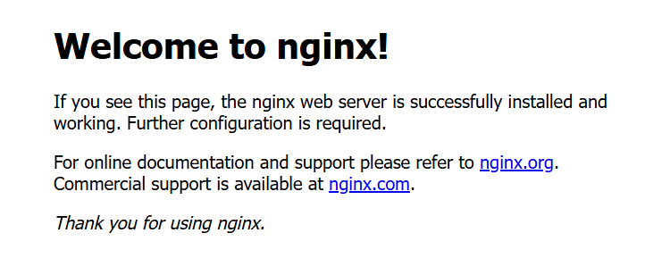

## Nginx 基本概念

### 进程模型

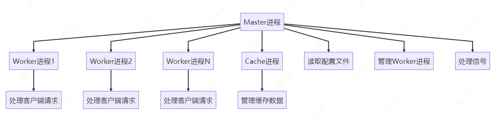

- **Master 进程**：管理 **Worker **进程，读取配置文件
  - 主进程：控制nginx启停、读配置文件
  - 工作进程：处理请求；主进程会开很多的工作进程； CPU的核心有几个，工作进程就有几个
- **Worker 进程**：处理实际的客户端请求
- **Cache 进程**：管理缓存相关操作

### 核心模块架构

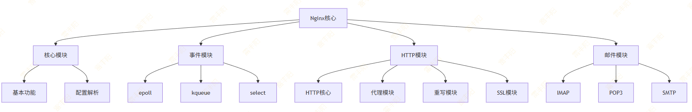

- **核心模块**：提供基本功能
- **事件模块**：处理网络事件
- **HTTP 模块**：处理 HTTP 请求
- **邮件模块**：处理邮件代理

### 配置文件

#### 文件位置

- Ubuntu/Debian: `/etc/nginx/nginx.conf`： apt-get
- CentOS/RHEL: `/etc/nginx/nginx.conf`: yum

> 默认nginx配置文件内容; nginx.conf 总配置文件

```properties

user  nginx;
worker_processes  auto;

error_log  /var/log/nginx/error.log notice;
pid        /run/nginx.pid;


events {
    worker_connections  1024;
}


# http 服务器功能配置
http {
    include       /etc/nginx/mime.types;
    default_type  application/octet-stream;

    # 日志配置
    log_format  main  '$remote_addr - $remote_user [$time_local] "$request" '
                      '$status $body_bytes_sent "$http_referer" '
                      '"$http_user_agent" "$http_x_forwarded_for"';

    access_log  /var/log/nginx/access.log  main;

    sendfile        on;
    #tcp_nopush     on;

    keepalive_timeout  65;

    #gzip  on;

    include /etc/nginx/conf.d/*.conf;
    # 服务器; 下面所有都是从 /etc/nginx/conf.d/*.conf; 粘贴进来的
    server {
        listen       80;
        listen  [::]:80;
        server_name  localhost;
    
        #access_log  /var/log/nginx/host.access.log  main;
        #位置： 路径：/ 
        location / {
            # 所有/开始的请求去 root 根目录找数据
            root   /usr/share/nginx/html;
            # 首页
            index  index.html index.htm;
        }
    
        #error_page  404              /404.html;
    
        # redirect server error pages to the static page /50x.html
        #
        error_page   500 502 503 504  /50x.html;
        location = /50x.html {
            root   /usr/share/nginx/html;
        }
    
        # proxy the PHP scripts to Apache listening on 127.0.0.1:80
        #
        #location ~ \.php$ {
        #    proxy_pass   http://127.0.0.1;
        #}
    
        # pass the PHP scripts to FastCGI server listening on 127.0.0.1:9000
        #
        #location ~ \.php$ {
        #    root           html;
        #    fastcgi_pass   127.0.0.1:9000;
        #    fastcgi_index  index.php;
        #    fastcgi_param  SCRIPT_FILENAME  /scripts$fastcgi_script_name;
        #    include        fastcgi_params;
        #}
    
        # deny access to .htaccess files, if Apache's document root
        # concurs with nginx's one
        #
        #location ~ /\.ht {
        #    deny  all;
        #}
    }


}

```

#### 示例配置

> 语法规则：
> 
> - 配置文件由指令和指令块组成
> - 每个指令以分号结尾
> - 指令块用大括号包围
> - 支持注释（以#开头）
> - 支持变量（以$开头）

```properties
# 全局配置
user nginx;
worker_processes auto;
error_log /var/log/nginx/error.log;
pid /run/nginx.pid;

# 事件配置
events {
    worker_connections 1024;
    use epoll;
}

# HTTP配置
http {
    # HTTP全局配置
    include /etc/nginx/mime.types;
    default_type application/octet-stream;

    # 日志格式
    log_format main '$remote_addr - $remote_user [$time_local] "$request" '
                    '$status $body_bytes_sent "$http_referer" '
                    '"$http_user_agent" "$http_x_forwarded_for"';

    access_log /var/log/nginx/access.log main;

    # 性能配置
    sendfile on;
    tcp_nopush on;
    tcp_nodelay on;
    keepalive_timeout 65;
    types_hash_max_size 2048;

    # 包含其他配置文件
    include /etc/nginx/conf.d/*.conf;
    include /etc/nginx/sites-enabled/*;

    # 默认服务器配置
    server {
        listen 80 default_server;
        listen [::]:80 default_server;
        server_name _;
        root /usr/share/nginx/html;

        location / {
            index index.html index.htm;
        }

        error_page 404 /404.html;
        error_page 500 502 503 504 /50x.html;
        location = /50x.html {
            root /usr/share/nginx/html;
        }
    }
    
    server {
        listen 99 default_server;
        location / {
        }
    }
}
```

nginx.conf

 --- events

 --- http

--- server

           --- location

#### 层次结构

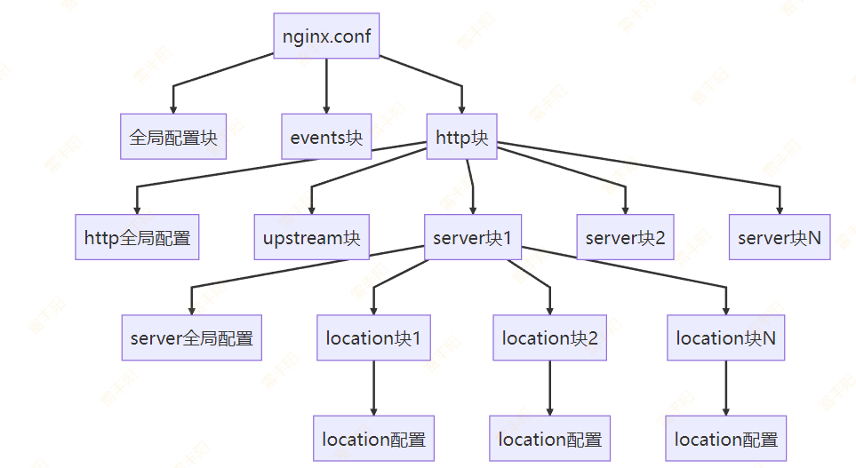

## Nginx 常见场景配置

### 简单的静态网站

```properties
server {
    listen 80;
    server_name example.com www.example.com;
    # 根目录
    root /var/www/html;
    index index.html index.htm;

    location / {
        try_files $uri $uri/ =404;
    }

    # 静态资源缓存; nginx 命令浏览器把这些规则的资源缓存一年
    location ~* \.(css|js|png|jpg|jpeg|gif|ico|svg)$ {
        expires 1y;
        add_header Cache-Control "public, immutable";
    }

    # 安全配置
    add_header X-Frame-Options "SAMEORIGIN" always;
    add_header X-XSS-Protection "1; mode=block" always;
    add_header X-Content-Type-Options "nosniff" always;
}
```

### 稍微复杂的静态配置

```properties
server {
    listen 80;
    server_name static.example.com;
    root /var/www/static;

    # 默认首页
    index index.html index.htm;

    # 静态文件处理 / 代表当前项目的所有请求
    location / {
        # 优先让其他  location  指定的规则
        try_files $uri $uri/ =404;
    }

    # 图片文件
    location ~* \.(png|jpg|jpeg|gif|ico|svg)$ {
        expires 30d;
        add_header Cache-Control "public, no-transform";
    }

    # CSS和JS文件
    location ~* \.(css|js)$ {
        expires 1y;
        add_header Cache-Control "public, immutable";
    }

    # 字体文件
    location ~* \.(woff|woff2|ttf|eot)$ {
        expires 1y;
        add_header Cache-Control "public, immutable";
        add_header Access-Control-Allow-Origin "*";
    }
}
```

### 多域名配置

> 不同域名不同的路径处理规则
> 
> 域名级别的负载均衡

```properties
# 主域名
server {
    listen 80;
    server_name jd.com www.example.com;
    root /var/www/example.com;
    index index.html;

    location / {
        try_files $uri $uri/ =404;
    }
}

# 子域名
server {
    listen 80;
    server_name list.jd.com;
    root /var/www/blog;
    index index.html;


    # 处理 / 下的所有请求。 /aa /bb /a/b/c
    location / {
        try_files $uri $uri/ =404;
    }
}

# API 子域名
server {
    listen 80;
    server_name item.example.com;

    location / {
        proxy_pass http://localhost:3000;
        proxy_set_header Host $host;
        proxy_set_header X-Real-IP $remote_addr;
    }
}
```

### 文件下载

```properties
server {
    listen 80;
    server_name download.example.com;
    root /var/www/downloads;

    # 禁止访问隐藏文件
    location ~ /\. {
        deny all;
    }

    # 下载目录
    location /files/ {
        autoindex on;
        autoindex_exact_size off;
        autoindex_localtime on;
    }

    # 大文件下载优化
    location ~* \.(zip|rar|7z|tar|gz)$ {
        # 加文件下载响应头
        add_header Content-Disposition "attachment";
        tcp_nopush off;
        tcp_nodelay on;
    }
}
```

### Location 路径配置

```properties
# 精确匹配根路径； 必须发送 域名/   
location = / {
   proxy_pass http://backend_server;
}
# 前缀匹配，匹配以 /static/ 开头的路径；   /static/aa  /aaa
location ^~ /static/ {
   root /var/www/static/;
}
# 正则匹配，区分大小写
location ~ \.(jpg|png|gif)$ {
   root /var/www/images/;
}
# 通用匹配，匹配所有未被其他规则捕获的路径； 兜底处理； 处理所有请求
location / {
   proxy_pass http://default_backend;
}
```

**优先级规则**：

1. **精确匹配 (*****=*****) **优先级最高。
2. **前缀匹配 (*****^~*****)** 次之。
3. **正则匹配 (*****~***** 或 *****~******) **再次之。
4. **通用匹配 (*****/*****) **优先级最低

> 一个请求过来，nginx会按照优先级挨个匹配location看哪个规则能处理，匹配上就处理，全部看一遍还没有人能处理就404

## 进阶配置：反向代理

### 反向代理工作原理

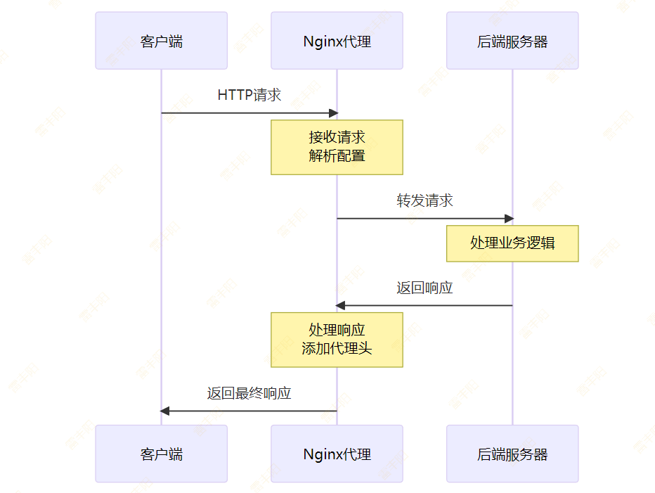

### 基本反向代理

```properties
server {
    listen 80;
    server_name app.example.com;

    location / {
        proxy_pass http://localhost:3000;
        proxy_set_header Host $host;
        proxy_set_header X-Real-IP $remote_addr;
        proxy_set_header X-Forwarded-For $proxy_add_x_forwarded_for;
        proxy_set_header X-Forwarded-Proto $scheme;
    }
}
```

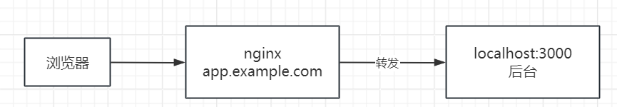

### 高级反向代理配置

> 以下做了动静分离
> 
> **静态请求**：html、css、js、图片  交给nginx处理。nginx自己找资源返回，并且要求浏览器缓存
> 
> **动态请求**：springmvc可以接到的crud的请求。动态请求nginx交给后端，自己不管。

```properties
# 上游服务器
upstream backend {
    server 127.0.0.1:3000;
    server 127.0.0.1:3001 backup;
}

server {
    listen 80;
    server_name app.example.com;

    location / {
        proxy_pass http://backend;

        # 代理头设置
        proxy_set_header Host $host;
        proxy_set_header X-Real-IP $remote_addr;
        proxy_set_header X-Forwarded-For $proxy_add_x_forwarded_for;
        proxy_set_header X-Forwarded-Proto $scheme;

        # 超时设置
        proxy_connect_timeout 30s;
        proxy_send_timeout 30s;
        proxy_read_timeout 30s;

        # 缓冲设置
        proxy_buffering on;
        proxy_buffer_size 4k;
        proxy_buffers 8 4k;

        # 错误处理
        proxy_next_upstream error timeout invalid_header http_500 http_502 http_503;
    }

    # 静态资源直接服务
    location ~* \.(css|js|png|jpg|jpeg|gif|ico)$ {
        root /var/www/static;
        expires 1y;
    }
}
```

## 进阶配置：负载均衡

### 负载均衡架构图

> 高性能的服务器权重设置大。

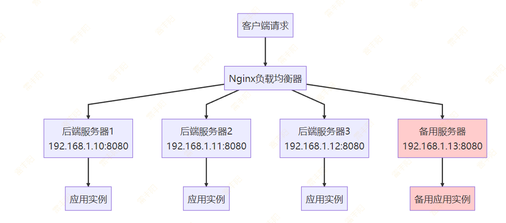

### 负载均衡算法对比

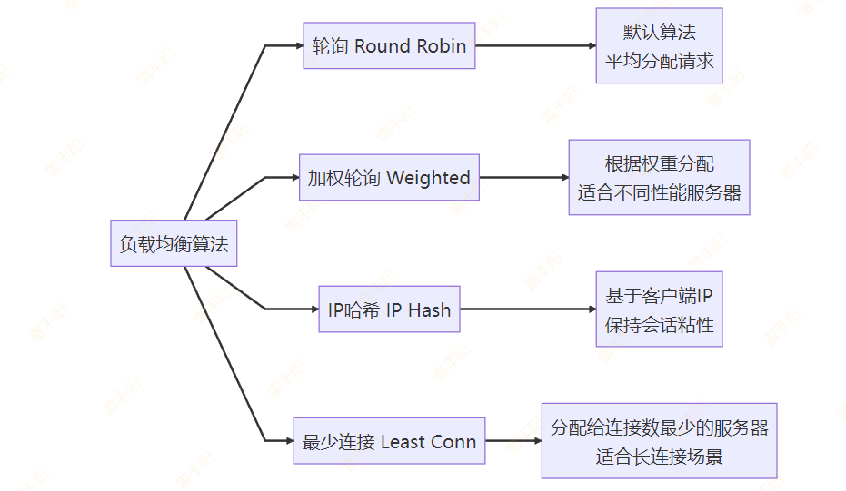

### 基本负载均衡配置

> 默认轮询方式的负载均衡； 

```properties
upstream backend_least_conn {
    least_conn;
    server 192.168.1.10:8080;
    server 192.168.1.11:8080;
    server 192.168.1.12:8080;
}

server {
    listen 80;
    server_name lb.example.com;

    location / {
        proxy_pass http://backend_least_conn;
        proxy_set_header Host $host;
        proxy_set_header X-Real-IP $remote_addr;
        proxy_set_header X-Forwarded-For $proxy_add_x_forwarded_for;
    }
}
```

### 负载均衡算法

```properties
# 轮询（默认）
upstream backend_round_robin {
    server 192.168.1.10:8080;
    server 192.168.1.11:8080;
    server 192.168.1.12:8080;
}

# 加权轮询  
upstream backend_weighted {
    server 192.168.1.10:8080 weight=3;
    server 192.168.1.11:8080 weight=2;
    server 192.168.1.12:8080 weight=1;
}

# IP哈希
upstream backend_ip_hash {
    ip_hash;
    server 192.168.1.10:8080;
    server 192.168.1.11:8080;
    server 192.168.1.12:8080;
}

# 最少连接
upstream backend_least_conn {
    least_conn;
    server 192.168.1.10:8080;
    server 192.168.1.11:8080;
    server 192.168.1.12:8080;
}
```

### 健康检查和故障转移配置

> **健康检查**：nginx会看主机还好着没。max_fails=3 
> 
> nginx会把超出最大错误重试次数的机器，踢出群组。不给他转发流量
> 
> fail_timeout=30s；

```properties
upstream backend {
    server 192.168.1.10:8080 max_fails=3 fail_timeout=30s;
    server 192.168.1.11:8080 max_fails=3 fail_timeout=30s;
    # backup 这是备机
    server 192.168.1.12:8080 backup;
    # down 已经下线了
    server 192.168.1.13:8080 down;
}

server {
    listen 80;
    server_name lb.example.com;

    location / {
        proxy_pass http://backend;
        proxy_next_upstream error timeout invalid_header http_500 http_502 http_503 http_504;
        proxy_connect_timeout 5s;
        proxy_send_timeout 10s;
        proxy_read_timeout 10s;
    }
}
```

### 故障转移流程

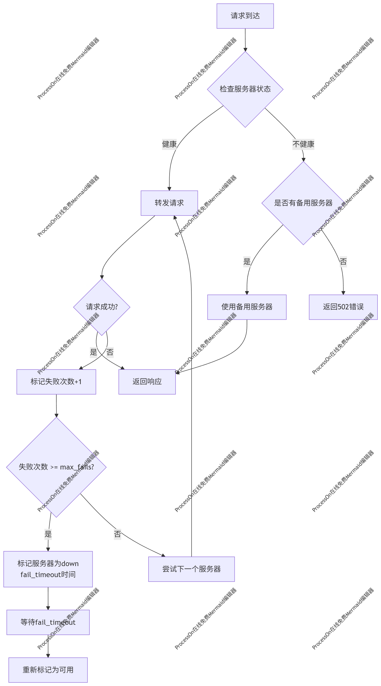

### Backup 服务器工作机制详解

**关键问题解答：**

**Q: backup 服务器会一直处理请求吗？**
**A: 不会！****backup 服务器只有在所有主服务器都不可用时才会激活。**

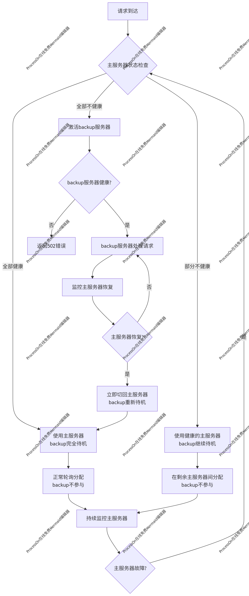

### Backup 服务器生效条件

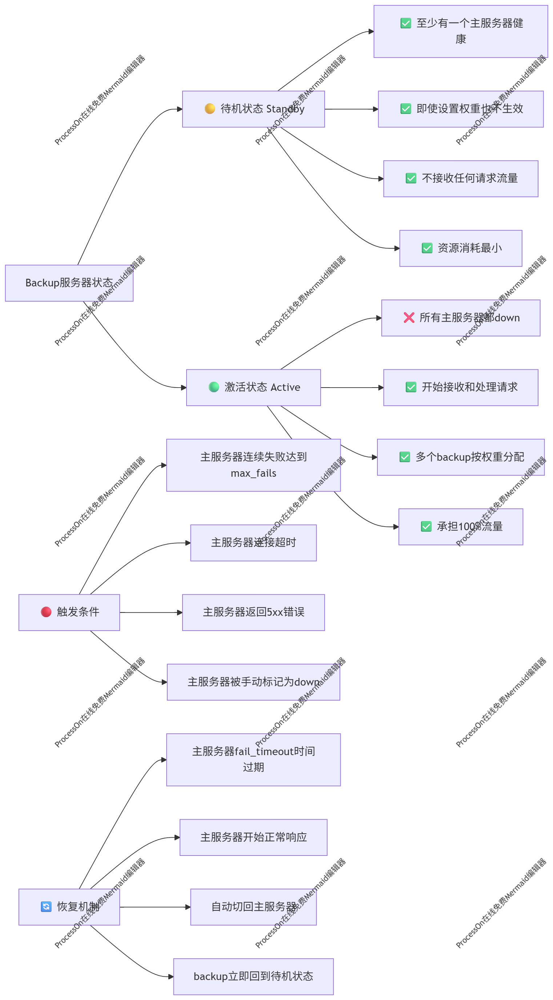

### 实际运行场景示例

**场景 1：正常运行（backup 待机）**

```properties
# 流量分配
主服务器1 (192.168.1.10) ✅ 健康 - 处理50%请求
主服务器2 (192.168.1.11) ✅ 健康 - 处理50%请求
backup服务器 (192.168.1.12) ⏸️ 待机 - 0%请求

# 此时backup服务器完全不工作，资源消耗最小
```

**场景 2：部分故障（backup 仍待机）**

```properties
# 流量分配
主服务器1 (192.168.1.10) ❌ 故障 - 0%请求
主服务器2 (192.168.1.11) ✅ 健康 - 100%请求
backup服务器 (192.168.1.12) ⏸️ 待机 - 0%请求

# 只要有一个主服务器健康，backup就不会激活
```

**场景 3：全部故障（backup 激活）**

```properties
# 流量分配
主服务器1 (192.168.1.10) ❌ 故障 - 0%请求
主服务器2 (192.168.1.11) ❌ 故障 - 0%请求
backup服务器 (192.168.1.12) ✅ 激活 - 100%请求

# 只有这种情况下backup才开始工作
```

**场景 4：主服务器恢复（backup 立即待机）**

```properties
# 流量分配
主服务器1 (192.168.1.10) ✅ 恢复 - 100%请求
主服务器2 (192.168.1.11) ❌ 仍故障 - 0%请求
backup服务器 (192.168.1.12) ⏸️ 立即待机 - 0%请求

# 只要有主服务器恢复，backup立即停止工作
```

### 高级 backup 配置

> Nginx 支持热启动: nginx 无需停机就可以应用最新配置：` nginx -s reload`
> 
> 冷启动：先停机，在开机
> 
> 热启动：直接让软件用最新配置工作。软件不用停

```properties
upstream backend {
    # 主服务器组 - 正常情况下处理所有请求
    server 192.168.1.10:8080 max_fails=3 fail_timeout=30s weight=3;
    server 192.168.1.11:8080 max_fails=3 fail_timeout=30s weight=2;
    server 192.168.1.12:8080 max_fails=3 fail_timeout=30s weight=1;

    # backup服务器组 - 只有主服务器全部down时才激活
    server 192.168.1.20:8080 backup weight=2;  # 高性能backup
    server 192.168.1.21:8080 backup weight=1;  # 低性能backup

    # 维护中的服务器 - 完全不参与负载均衡
    server 192.168.1.30:8080 down;
}

server {
    listen 80;
    server_name lb.example.com;

    location / {
        proxy_pass http://backend;

        # 故障转移配置
        proxy_next_upstream error timeout invalid_header http_500 http_502 http_503 http_504;
        proxy_next_upstream_tries 3;
        proxy_next_upstream_timeout 10s;

        # 超时配置
        proxy_connect_timeout 5s;
        proxy_send_timeout 10s;
        proxy_read_timeout 10s;

        # 添加状态头，便于调试
        add_header X-Upstream-Server $upstream_addr;
        add_header X-Upstream-Status $upstream_status;
    }
}
```

## 进阶配置：SSL/HTTPS 配置

### HTTP 流程

> HTTPS：
> 
> 1. **服务器**会给浏览器返回证书，证书里面包含公钥
> 2. **浏览器**拿到证书中包含的公钥，对一个**随机数**进行**公钥加密，传给服务器。黑客拦截到也解不掉**
> 3. **服务器拿到数据**进行私钥解密，得到**随机数**
> 4. ==== 以上 非对称加密流程 =====
> 5. 以后浏览器服务器都用这个随机数作为**对称加密**的钥匙进行网络传输；（传输数据用对称，速度快）

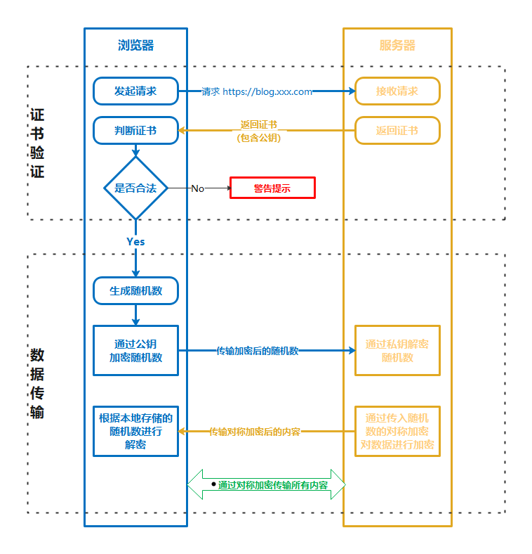

### SSL 证书类型和验证级别

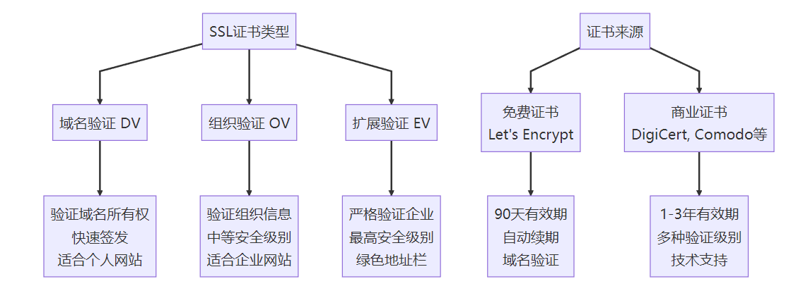

### 基本 SSL 配置

```properties
server {
    listen 443 ssl http2;
    server_name example.com www.example.com;

    # SSL 证书配置
    ssl_certificate /etc/nginx/ssl/example.com.crt;
    ssl_certificate_key /etc/nginx/ssl/example.com.key;

    # SSL 安全配置
    ssl_protocols TLSv1.2 TLSv1.3;
    ssl_ciphers ECDHE-RSA-AES128-GCM-SHA256:ECDHE-RSA-AES256-GCM-SHA384;
    ssl_prefer_server_ciphers on;

    # SSL 会话缓存
    ssl_session_cache shared:SSL:10m;
    ssl_session_timeout 10m;

    # HSTS
    add_header Strict-Transport-Security "max-age=31536000; includeSubDomains" always;

    root /var/www/html;
    index index.html;

    location / {
        try_files $uri $uri/ =404;
    }
}

# HTTP 重定向到 HTTPS
server {
    listen 80;
    server_name example.com www.example.com;
    return 301 https://$server_name$request_uri;
}
```

### Let's Encrypt 免费证书

https://letsencrypt.ylimhs.com/

```properties
# 安装 Certbot
sudo yum install certbot certbot-nginx
# 获取证书
sudo certbot --nginx -d example.com -d www.example.com

# 停机方式获取
sudo certbot certonly --standalone \
    -d crud.team \
    -d www.crud.team \
    --email 534096094@qq.com \
    --agree-tos \
    --no-eff-email

# 自动续期
sudo crontab -e
# 添加以下行
0 12 * * * /usr/bin/certbot renew --quiet
```

## 部署实战

> 部署架构图：
> 
> 单体：前端加后端加部署
> 
> 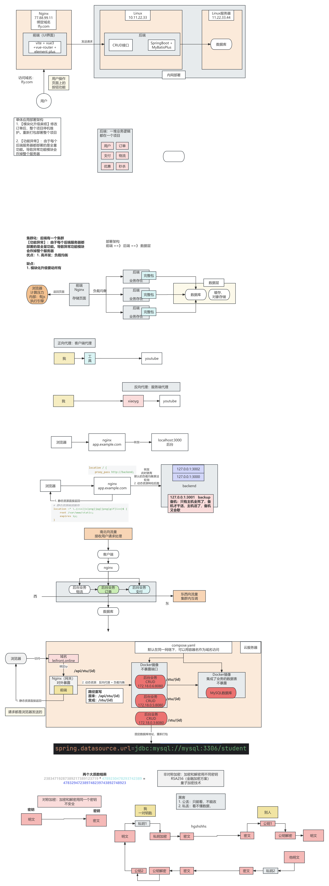

### Docker 打包数据库

/docker-entrypoint-initdb.d 目录下放sql文件，docker启动mysql，就会自动执行

> Dockerfile 写法

```properties
FROM bitnami/mysql:8.4-debian-12

COPY t_stu.sql /docker-entrypoint-initdb.d/
```

> 导出你的sql文件

```sql
CREATE DATABASE IF NOT EXISTS `student`;
USE `student`;

SET NAMES utf8mb4;
SET FOREIGN_KEY_CHECKS = 0;

-- ----------------------------
-- Table structure for t_stu
-- ----------------------------
DROP TABLE IF EXISTS `t_stu`;
CREATE TABLE `t_stu`  (
  `id` bigint NOT NULL AUTO_INCREMENT,
  `stu_name` varchar(255) CHARACTER SET utf8mb4 COLLATE utf8mb4_0900_ai_ci NOT NULL COMMENT '姓名',
  `gender` varchar(10) CHARACTER SET utf8mb4 COLLATE utf8mb4_0900_ai_ci NULL DEFAULT NULL COMMENT '性别',
  `age` int NULL DEFAULT NULL COMMENT '年龄',
  `id_card` char(18) CHARACTER SET utf8mb4 COLLATE utf8mb4_0900_ai_ci NULL DEFAULT NULL COMMENT '身份证号',
  `phone` char(11) CHARACTER SET utf8mb4 COLLATE utf8mb4_0900_ai_ci NULL DEFAULT NULL COMMENT '手机号',
  `create_at` datetime NULL DEFAULT NULL COMMENT '创建时间',
  `update_at` datetime NULL DEFAULT NULL COMMENT '修改时间',
  PRIMARY KEY (`id`) USING BTREE
) ENGINE = InnoDB AUTO_INCREMENT = 14 CHARACTER SET = utf8mb4 COLLATE = utf8mb4_0900_ai_ci ROW_FORMAT = Dynamic;

SET FOREIGN_KEY_CHECKS = 1;

```

> 命令

```properties
#进行打包
docker build -f Dockerfile-stu -t mysql:8-stu .
#改名
docker tag mysql:8-stu leifengyang/mysql:8-stu
#登录。输入用户名密码
docker login
#推送
docker push leifengyang/mysql:8-stu
```

> 启动运行

```properties
docker run -d --restart=always -e MYSQL_ROOT_PASSWORD=123456  --name=mysql leifengyang/mysql:8-stu
```

### Docker 打包Java后端

> 注意：区分开发环境和生产环境

```properties
docker run -d --restart=always leifengyang/bootapp:stu
```

### Nginx部署前端

前端以后所有的ajax后台请求都以 /api开始

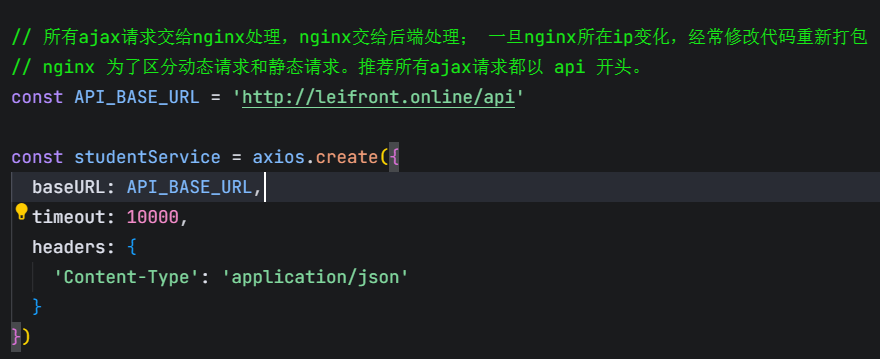

前端路由使用路径hash模式

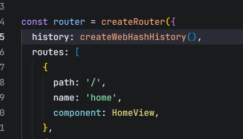

> 配置动静分离 + 负载均衡

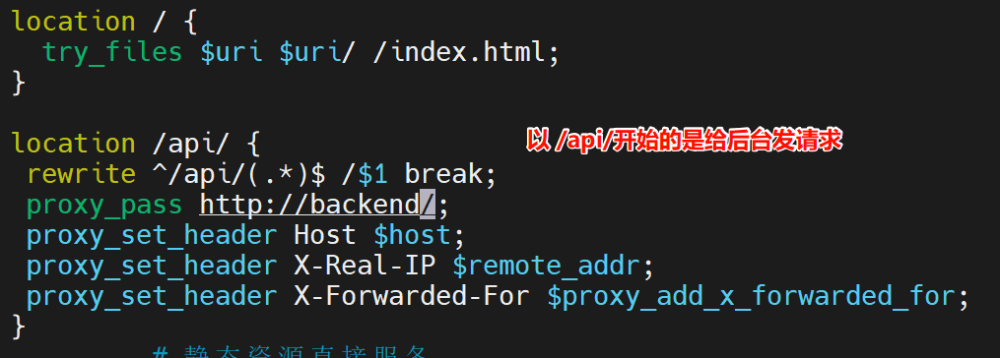

### Nginx配置负载均衡 + 动静分离

```bash
upstream backend {
    server 172.17.0.5:8080;
    server 172.17.0.4:8080;
    server 172.17.0.3:8080;
}

server {
        listen       80;
        listen       [::]:80;
        server_name  leifront.online,www.leifront.online;
        root         /usr/share/nginx/html;

        # Load configuration files for the default server block.
        include /etc/nginx/default.d/*.conf;

        error_page 404 /404.html;
        location = /404.html {
        }

        error_page 500 502 503 504 /50x.html;
        location = /50x.html {
        }
        
        location / {
          try_files $uri $uri/ /index.html;
        }
        
        location /api/ {
             # 路径重写，删除 /api 开头
             rewrite ^/api/(.*)$ /$1 break;
             proxy_pass http://backend/;
             proxy_set_header Host $host;
             proxy_set_header X-Real-IP $remote_addr;
             proxy_set_header X-Forwarded-For $proxy_add_x_forwarded_for;
        }
         # 静态资源直接服务
       location ~* \.(css|js|png|jpg|jpeg|gif|ico|html|svg)$ {
          expires 1y;
       }
}

```

### 绑定域名

购买域名，配置解析


### 错误排查

> 根据请求链路排查挨个日志

排查，定位问题、解决问题

**web问题定位**：跟着请求链路，请求流过的各个中间件查日志，排除。

**业务问题**：梳理业务流程；

```yaml
docker run -d --restart=always -e MYSQL_ROOT_PASSWORD=123456  --name=mysql leifengyang/mysql:8-stu
```

> 

```yaml
name: stuapp
services:
  stuapp:
    image: leifengyang/bootapp:stuv1
    restart: always
  mysql:
    image: leifengyang/mysql:8-stu
    restart: always
    environment:
      MYSQL_ROOT_PASSWORD: 123456

```

`docker compose -f compose.yaml scale stuapp=3`: 扩缩容命令；

扩容是为了高并发，缩容是为了腾资源；

### 配置HTTPS


**nginx服务器收到。nginx判断以 api 开头转给 backend。转之前删除 /api；后台收到 /stu 的POST请求；后台链接上数据库进行CRUD；**

> Https 最终配置

```bash
upstream backend {
    server 172.18.0.6:8080;
    server 172.18.0.5:8080;
    server 172.18.0.3:8080;
}
server {
    listen 443 ssl http2;
    server_name leifront.online;
    include /etc/nginx/default.d/*.conf;
    # SSL 证书配置
    ssl_certificate /etc/nginx/conf.d/certs/leifront_online.pem;
    ssl_certificate_key /etc/nginx/conf.d/certs/leifront_online.key;

    # SSL 安全配置
    ssl_protocols TLSv1.2 TLSv1.3;
    ssl_ciphers ECDHE-RSA-AES128-GCM-SHA256:ECDHE-RSA-AES256-GCM-SHA384;
    ssl_prefer_server_ciphers on;

    # SSL 会话缓存
    ssl_session_cache shared:SSL:10m;
    ssl_session_timeout 10m;

    # HSTS
    add_header Strict-Transport-Security "max-age=31536000; includeSubDomains" always;

    root /usr/share/nginx/html;
    index index.html;        
    
    location /api/ {
     rewrite ^/api/(.*)$ /$1 break;
     proxy_pass http://backend/;
     proxy_set_header Host $host;
     proxy_set_header X-Real-IP $remote_addr;
     proxy_set_header X-Forwarded-For $proxy_add_x_forwarded_for;
    }
     # 静态资源直接服务
     location ~* \.(css|js|png|jpg|jpeg|gif|ico|html|svg)$ {
        expires 1y;
     }

    location / {
        try_files $uri $uri/ =404;
    }
    
}

server {
        listen       80;
        listen       [::]:80;
        server_name  leifront.online;
        return 301 https://$server_name$request_uri;
}


```

#### 特别注意：

1. **配置完https，别忘了放行  443 端口**
2. **前端项目请求地址要修改** `const API_BASE_URL = '``https://leifront.online/api'`

部署流程：

1. **改代码 ==》 打包(打docker镜像、打压缩包) ==》上传/部署 ==》测试**
2. **常用linux**
  1. cd、ls、cat xxx.log、docker logs xx、docker inspect、docker build
  2. vim： 输入i进入插入、按esc退出，按 :wq 退出并保存
  3. ps -ef|grep nginx； docker ps