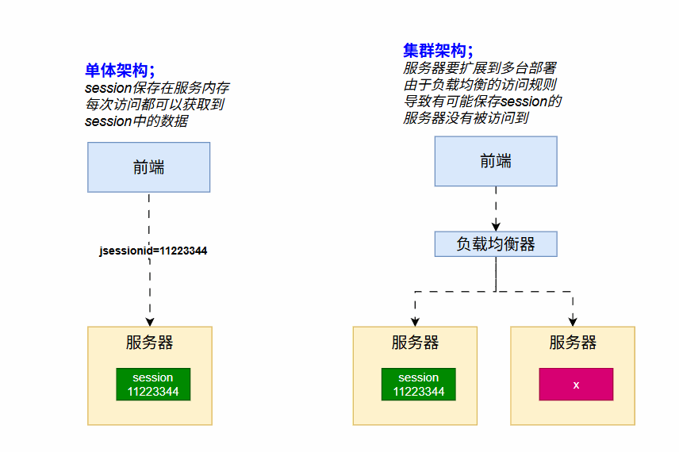
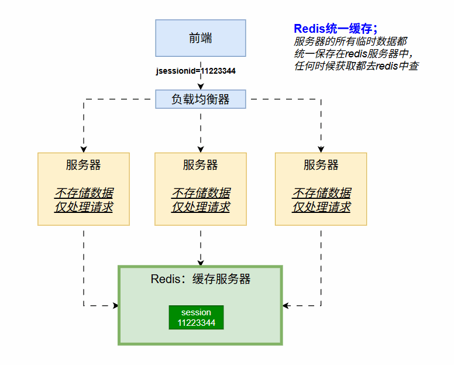
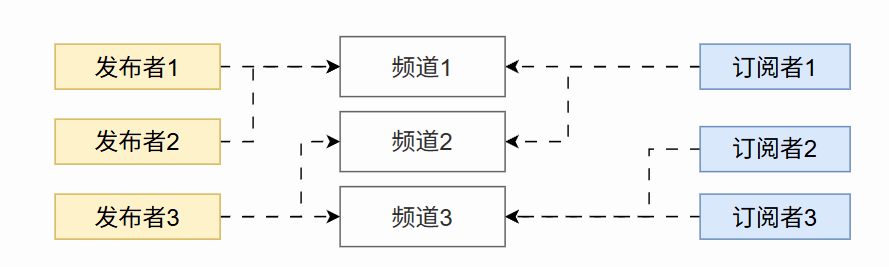
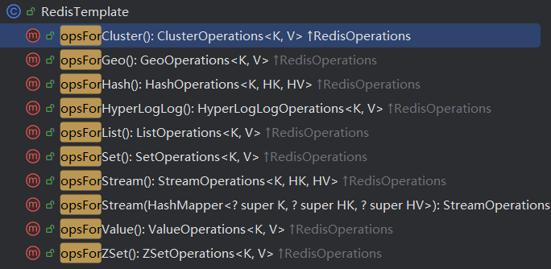
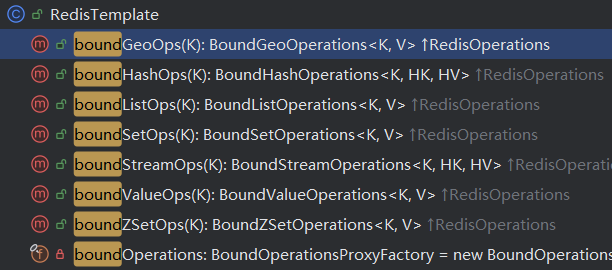
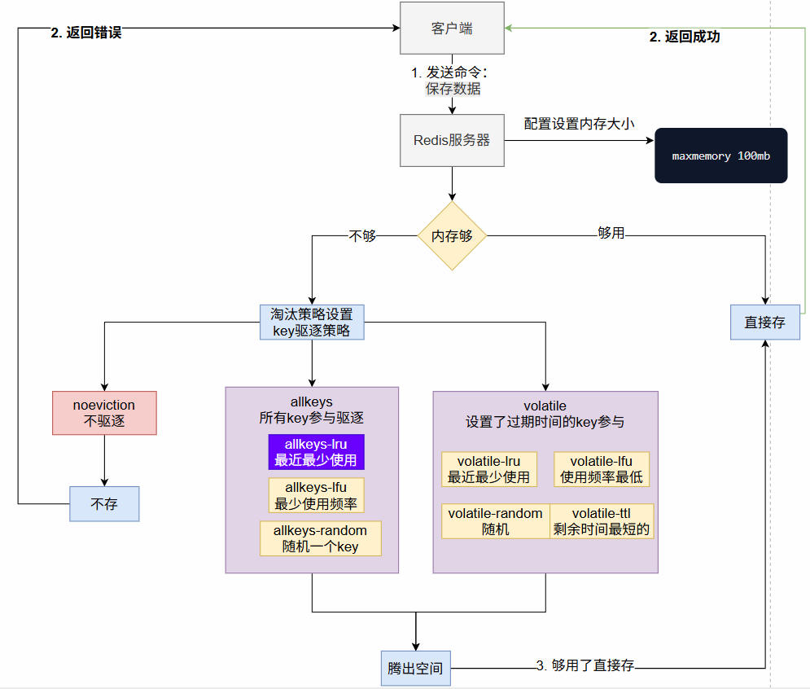
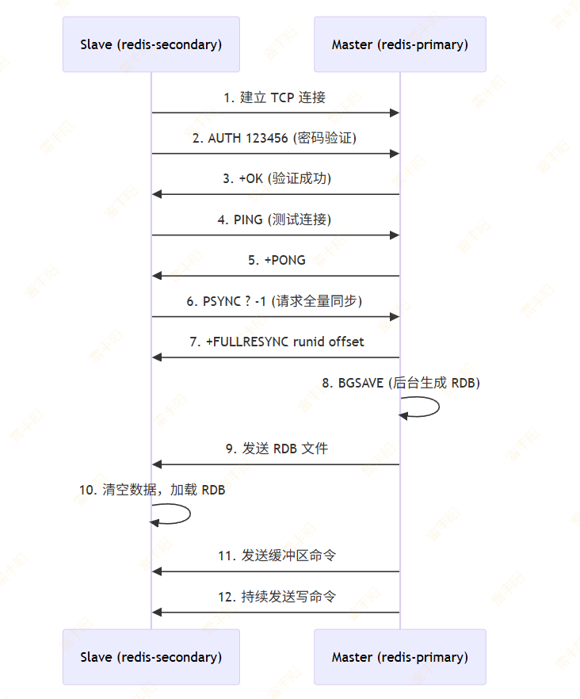
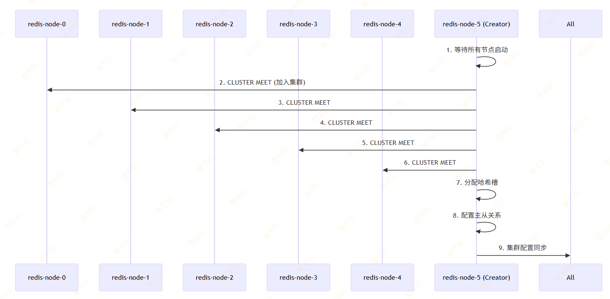

# 2. Redis

> **官方文档**：https://redis.io/docs/latest/develop/get-started/
> 
> 我们讲解 `Redis 8` 版本；

> **Redis** 可作为**缓存、非关系数据库**、**流处理引擎**、**消息代理**等多种用途中间件
> 
> > **中间件**：后端认为，所有的docker run 能跑起来为我们服务的软件都可以叫中间件
> > 
> > **中间件**：特指**数据库**[存数据的仓库]；(MySQL、Redis、MongoDB、ElasticSearch、RabbitMQ、Minio)


> **缓存：**是一种机制；加速系统数据访问；提前把数据放到离自己最近的地方
> 
> - `MySQL 也有缓存`； 
>   - mysql为了查数据快，查过的数据可以放到**内存中 buffer pool**，以后再用，不用查，去内存拿
> - `Docker Build 也有缓存`；公共的镜像层，之前下载了，拿来直接用，不用重新下载
>   - 放到磁盘文件
> - `CPU 也有缓存`；CPU 执行指令的时候，本来找内存要数据，但是太慢了，消息总线把数据提前放到CPU的缓存中，CPU直接用，不用找内存要
>   - 跟CPU焊在一起的寄存器
> - `快递也有缓存`：我们不能去商家那里提货吧，太远了。快递员把**快递**小区楼下，直接去驿站取；

# 为什么

> 为什么要用Redis；**参考session不一致问题**

## session 不一致问题



> 解决集群架构下的服务器session不一致问题（也就是内存中的数据不能同步）；常见三种解决方案
> 
> 1. **内存同步方案**；（配置Tomcat集群之间同步内存，**这种解决不了内存容量超出的问题**）
>   1. Tomcat 集群配置
> 2. **统一缓存方案**；（Tomcat中所有Session的数据保存在缓存服务器中，而不要保存在自己内存；**这种常用**）
>   1. Spring Session 框架
> 3. **iphash负载均衡方案**；（只要是同一个客户端的ip，都访问到同一个服务器，**这种解决不了服务器故障问题**）
>   1. Nginx 负载均衡策略设置

## 统一缓存方式



# 入门

## 安装

```shell
# Docker 快速安装
docker run -d -p 6379:6379 --restart=always --name redis redis:latest
```

> `compose.yaml` 安装

```yaml
services:
  redis:
    image: docker.io/bitnami/redis:8.2
    environment:
      # ALLOW_EMPTY_PASSWORD is recommended only for development.
      - ALLOW_EMPTY_PASSWORD=yes
      - REDIS_DISABLE_COMMANDS=FLUSHDB,FLUSHALL
    ports:
      - '6379:6379'
    volumes:
      - 'redis_data:/bitnami/redis/data'

volumes:
  redis_data:
    driver: local
```

> 原始安装参考；

https://redis.io/docs/latest/operate/oss_and_stack/install/install-stack/rpm/

## 客户端

> 官方：

[📎 RedisInsight-v2-win-installer.exe](<files/RedisInsight-v2-win-installer.exe>)

> 第三方：Another Redis Desktop Manager：https://goanother.com/cn/
> 
> 下载地址：https://gitee.com/qishibo/AnotherRedisDesktopManager/releases

> **推荐以后使用 **`DataGrip`** 连接所有数据库中间件**

## 基本概念

### 命令行

redis大多数的操作都可以由**命令行**实现。包括了数据的增删改查、服务器的安全、配置等。

> 每个命令都由一个**唯一名称标识**。相关的命令组往往遵循一致的命名规范。例如，所有**处理哈希**的命令都**以 **`H`** 前缀开头**。大多数命令接收一个或多个参数来指定要操作的数据。对于**数据类型命令**，**第一个参数通常**是标识目标数据对象的**key**。

**发出命令后，服务器会尝试处理并返回响应。**

1. 更新数据(增删改)的命令通常返回状态消息（如 `OK` ）或表示更改/更新项目数量的数字。
2. 检索数据的命令则返回请求的数据。
3. 执行失败的命令会返回描述问题的错误信息。

```shell
# 进入命令行终端
redis-cli -h localhost -p 6379
> set msg hello
ok
> get msg
hello
```

### 批量命令

虽然您可以逐个发送 Redis 命令，但将一系列相关命令批量处理成**管道（pipelining）**通常更为高效。管道将多个命令以单次通信形式发送至服务器，并以同样方式接收响应。有关该技术的完整说明请参阅[《管道技术》](https://redis.io/docs/latest/develop/using-commands/pipelining/)章节，客户端库的管道使用示例也可参考相关文档。

> **Redis 2.6 之后支持 ****脚本(script)****，能批量执行命令，所以管道技术就基本没用了。后面讲脚本**

## 基本操作

### Key 和 Value

> **存储在 Redis 数据库**中的**每个数据对象**都有其**唯一的key**。
> 
> **key**是一个**字符串**，通过将其传递给 Redis 命令可以检索对应的对象或修改其数据。
> 
> 与特定`key`相关联的数据对象称为`value`，两者合称为`键值对`**(*****key-value pair*****)**。

> **key**通常是数据模型中具有特定含义的**文本**名称。与编程语言中的变量名不同，**Redis 对key的格式几乎没有限制**，因此**包含空格**或**标点符号**的**键**大多**也是有效的**（例如"1st Attempt"或"% of price in $"）。

1. Redis 不支持键的**命名空间**或其他分类机制，因此必须注意避免名称冲突。
2. 不过存在一种**约定俗成的做法**，即使用**冒号**`":"`**将键划分为多个部分；**
3. （例如`"person:1"`、`"person:2"`、`"office:London"`、`"office:NewYork:1"`）。可以通过这种方式简单地将键归类组合。

> 尽管**key通常是文本形式**，但 Redis 实际上实现了`二进制安全的键`，因此您可以使用**任何字节序列**作为**有效键**，例如** JPEG 文件**或应用程序中的结构体值。空字符串在 Redis 中同样是一个有效的键。

关于键名还有几点需要注意：

1. `过长的键名并非明智之选`。例如，1024 字节的键名不仅在内存方面存在问题，还因为数据集中的键查找可能需要进行多次耗时的键值比较。即使当前任务是匹配大值的存在性，对其进行哈希处理（例如使用 SHA1）是更优方案，尤其从`内存`和`带宽`的角度考量。
2. `过短的键名通常不是个好主意`。与其用"u1000flw"作为键名，不如使用"user:1000:followers"——后者更具可读性，且相比键对象和值对象本身占用的空间，额外增加的字符空间微不足道。虽然短键名确实能节省少量内存，`但关键在于找到合适的平衡点`。
3. **尽量遵循固定格式**。例如采用`"对象类型:ID"`的形式就不错，比如"user:1000"。多词字段通常使用点号或连字符，例如"comment:4321:reply.to"或"comment:4321:reply-to"。
4. **允许的最大键大小为 512 MB**

> Redis中的单个字符串最多 **512 MB**

### Keyspace 操作

> exists：检查key是否存在
> 
> type：检查key存储的对应的值的类型
> 
> del：删除key

```shell
> set mykey hello
OK
> type mykey
string
> exists mykey
(integer) 1
> del mykey
(integer) 1
> exists mykey
(integer) 0
> type mykey
nono
```

### Key 过期

> **键过期是Redis 的一个重要特性**；无论存储何种类型的值都适用；
> 
> 1. 键过期允许您为键设置超时时间，也称为**"time to live"**或**"TTL"**。
> 2. 当**生存时间**到期时，键会**自动被销毁**。

注意：

1. key的过期时间是以**毫秒**为单位
2. Redis 会保存键的过期日期，这样即使Redis关机或者数据持久化到磁盘，也能完成自动销毁功能

设置过期时间可以使用以下命令

#### expire 命令

```sql
> set key some-value
OK
> expire key 5
(integer) 1
> get key (immediately)
"some-value"
> get key (after some time)
(nil)
```

#### set 命令

```shell
> set key 100 ex 10
OK
> ttl key
(integer) 9
```

### keys：所有key

> 使用 keys 命令，可以获取到redis中保存的所有key

```shell
# 批量设置多个 kv
redis> MSET firstname Jack lastname Stuntman age 35
"OK"

redis> KEYS *name*
1) "firstname"
2) "lastname"

redis> KEYS a??
1) "age"

# 查看所有 key
redis> KEYS *
1) "age"
2) "firstname"
3) "lastname"
redis> 

```

### Key 模式匹配

`KEYS pattern`：其中 pattern可以写如下规则：

- `h?llo` 匹配 `hello`, `hallo` 和`hxllo`
- `h*llo` 匹配 `hllo` 和`heeeello`
- `h[ae]llo` 匹配 `hello` 和`hallo,` 但不匹配`hillo`
- `h[^e]llo` 匹配 `hallo`, `hbllo`, ...但不匹配 `hello`
- `h[a-b]llo` 匹配 `hallo` 和`hbllo`

> **警告：**`KEYS` 仅用在开发环境。大型数据库执行此命令可能会严重影响性能。切勿在常规应用程序代码中使用 `KEYS` 。若需在键空间子集中查找键，建议改用 `SCAN` 或 `sets`。

# 数据类型

> **官网：****https://redis.io/docs/latest/develop/data-types/**
> 
> **Redis 是一个 key - value 存储的数据库，key都是string的，但是value可以支持很多种**

- **五大基本（必会）**：
  - [String](https://redis.io/docs/latest/develop/data-types/#strings)（字符串）、[Hash](https://redis.io/docs/latest/develop/data-types/#hashes)（哈希）、[List](https://redis.io/docs/latest/develop/data-types/#lists)（列表）、[Set](https://redis.io/docs/latest/develop/data-types/#sets)（集合）、[Sorted set](https://redis.io/docs/latest/develop/data-types/#sorted-sets)（有序集合）
- **八大高阶（了解）**：
  - [Vector set](https://redis.io/docs/latest/develop/data-types/#vector-sets)（向量集）、[Stream](https://redis.io/docs/latest/develop/data-types/#streams)（流）、[Bitmap](https://redis.io/docs/latest/develop/data-types/#bitmaps)（位图）、[Bitfield](https://redis.io/docs/latest/develop/data-types/#bitfields)（位属性）
  - [Geospatial](https://redis.io/docs/latest/develop/data-types/#geospatial-indexes)（地理空间）、[JSON](https://redis.io/docs/latest/develop/data-types/#json)（json文档）
  - [Probabilistic data types](https://redis.io/docs/latest/develop/data-types/#probabilistic-data-types)（概率数据类型）、[Time series](https://redis.io/docs/latest/develop/data-types/#time-series)（时序）

## string：字符串

> Redis 字符串是最基础的 Redis 数据类型，表示一个字节序列。
> 
> **注意：Redis的key总是字符串类型的，value也可以是字符串。但是底层要求**`任何字符串不能超过512MB`

> Redis 字符串用于**存储字节序列**，包括**文本**、**序列化对象**和**二进制数组**。因此，字符串是可与 Redis 键关联的最简单的值类型。它们常被用于缓存，但也支持额外功能，允许您实现计数器并执行位运算。

### set：保存kv

> `set key value`

```shell
    > SET bike:1 Deimos
    OK
    > GET bike:1
    "Deimos"
```

### set nx|xx

> `set ``nx`：如果不存在这个**key**，再设置这个key；nx（not exist）
> 
> `set xx`：如果存在这个key，再设置这个key；

```shell
    > set bike:1 bike nx
    (nil)
    > set bike:1 bike xx
    OK
```

### mset：批量设置 

> `mset ``key1 value1`` ``key2 value2`` ``key3 value3`

```shell
    > mset bike:1 "Deimos" bike:2 "Ares" bike:3 "Vanth"
    OK
    > mget bike:1 bike:2 bike:3
    1) "Deimos"
    2) "Ares"
    3) "Vanth"
```

### counters：计数器

> Redis支持**原子增**操作（无惧大并发，也能增正确）；比`i++`靠谱多了
> 
> `incr key`：给key的值原子+1
> 
> `incrby key 10`：给key的值原子+10
> 
> 其他类似命令：`DECR` 和 `DECRBY`； **原子减**

```shell
    > set total_crashes 0
    OK
    > incr total_crashes
    (integer) 1
    > incrby total_crashes 10
    (integer) 11
```

## list：列表

Redis 列表是由字符串值组成的**链表结构**。经常用来做 `栈` 或 `队列`的 数据操作；

**基本命令**：

- `LPUSH` 向列表头部添加新元素； `RPUSH` 向尾部添加。
- `LPOP` 从列表**头部移除并返回一个元素**； `RPOP` 从列表**尾部移除并返回一个元素**。
- `LLEN` 返回列表的长度
- `LMOVE` 以原子操作方式将元素从一个列表移动到另一个列表
- `LRANGE` 从列表中提取一系列元素
- `LTRIM` 将列表缩减至指定范围的元素

**列表支持多种阻塞式命令**：

- `BLPOP` 从列表头部移除并返回一个元素。如果列表为空，该命令会阻塞直到有元素可用或达到指定的超时时间。
- `BLMOVE` 以原子操作方式将元素从源列表移动到目标列表。如果源列表为空，该命令将阻塞直到有新元素可用

### 队列（先进先出 FIFO）

> 列表视为队列，模拟队列操作；
> 
> **队列：一端放另一端拿；在两端操作**

```shell
> LPUSH person zhangsan
(integer) 1
> LPUSH person lisi
(integer) 2
> LLEN person
2
> RPOP person
"zhangsan"
> RPOP person
"lisi"
> LLEN person
0
```

### 栈（先进后出 FILO）

> 列表视为栈，模拟栈操作
> 
> **栈：一端放还在这端拿；在一端操作**

```shell
> LPUSH ball 足球
(integer) 1
> LPUSH ball 篮球
(integer) 2
> LPOP ball
"篮球"
> LPOP ball
"足球"
```

### 其他操作

#### LRANGE：返回指定范围数据

> `LRANGE key start stop`: 从指定list中返回指定范围数据
> 
> - 偏移量 `start` 和 `stop` 是从零开始的索引
>   - 其中 `0` 表示列表的第一个元素（列表头部）， `1` 表示下一个元素
> - 偏移量也可以是**负数**，表示从列表末尾开始计算的偏移。
>   - `-1` 表示列表的**最后一个元素**， `-2` 表示**倒数第二个元素**，以此类推。

```sql
redis> RPUSH mylist "one"
(integer) 1
redis> RPUSH mylist "two"
(integer) 2
redis> RPUSH mylist "three"
(integer) 3
redis> LRANGE mylist 0 0
1) "one"
redis> LRANGE mylist -3 2
1) "one"
2) "two"
3) "three"
redis> LRANGE mylist -100 100
1) "one"
2) "two"
3) "three"
redis> LRANGE mylist 5 10
(empty array)
```

#### LMOVE：移动

> **原子化**地从列表中弹出一个元素并推入另一个列表

```sql
LPUSH list1 p1
LPUSH list1 p2
LPUSH list1 p3
LRANGE list1 0 -1
LMOVE list1 list2 LEFT LEFT
LRANGE list2 0 -1
```

#### LTRIM：列表修剪

> 对现有列表进行修剪，使其仅包含指定的元素范围。 `start` 和 `stop` 均为从零开始的索引，其中 `0` 表示列表的第一个元素（头部）， `1` 为下一个元素，依此类推（和LRANGE规则完全相同）；
> 
> 例如： `LTRIM foobar 0 2` 将修改存储在 `foobar` 的列表，使得仅保留列表的前三个元素。

```shell
redis> RPUSH mylist "one"
(integer) 1
redis> RPUSH mylist "two"
(integer) 2
redis> RPUSH mylist "three"
(integer) 3
redis> LTRIM mylist 1 -1
"OK"
redis> LRANGE mylist 0 -1
1) "two"
2) "three"
redis> 

```

## set：无序集合

> Redis Set 是一种**无序且元素不重复**（唯一）字符串集合。Redis还支持集合的`交集`、`并集`、`差集`运算

> **基本命令**：
> 
> - `SADD` 向集合中添加一个新成员。
> - `SREM` 从集合中移除指定成员
> - `SISMEMBER` 测试字符串是否为集合成员
> - `SINTER` 返回两个或多个集合共有的成员集合（即交集）。
> - `SCARD` 返回集合的大小（即基数）
> 
> **更多命令**：https://redis.io/docs/latest/commands/?group=set

### `SADD`：添加元素

```shell
> SADD svip zhangsan
(integer) 1
> SADD svip lisi
(integer) 1
> SADD svip wangwu zhaoliu
(integer) 2
> SADD svip tianqi tom
(integer) 2
> SADD vip lisi zhaoliu tianqi
(integer) 3
```

### `SISMEMBER`：判断是否是成员

```shell
> SISMEMBER svip zhaoliu
true
```

### `SMEMBERS`：查看所有成员

> 大多数集合操作（包括添加、删除和检查元素是否属于集合）的时间复杂度都是 O(1)，这意味着它们非常高效。但对于包含数十万甚至更多元素的大型集合，运行 `SMEMBERS` 命令时需谨慎，因为该命令的时间复杂度为 O(n)，会一次性返回整个集合。作为替代方案，**可以考虑使用 **`SSCAN`** 命令，它能以迭代方式获取集合中的所有元素**。（后面讲解`SCAN`命令）

```shell
> SMEMBERS svip
zhangsan
lisi
wangwu
zhaoliu
tianqi
tom
```

> 随机返回一个成员

```shell
> SRANDMEMBER svip
```

### `SCARD`：集合大小

```shell
> SCARD svip
6
```

### `SDIFF`：差集

```shell
> SDIFF svip vip
zhangsan
wangwu
tom
```

### `SINTER`：交集

```shell
> SINTER svip vip
lisi
zhaoliu
tianqi
```

### `SUNION`：并集

```shell
> SUNION svip vip
zhangsan
lisi
wangwu
zhaoliu
tianqi
tom
```

### 限制

> Redis 集合的最大容量为 2^32 - 1 个成员（即 4,294,967,295 个）。

## sorted set：有序集合  

> https://redis.io/docs/latest/develop/data-types/sorted-sets
> 
> Redis 有序集合是一种由**关联分数排序**的唯一字符串（成员）**集合。**`zset`
> 
> **常用场景：排行榜、限流器**

**虽然集合中的元素是无序的，但有序集合中的每个元素都与一个浮点数值相关联，这个数值称为分数。**

**有序集合中的元素是按顺序排列的：**

1. 若元素 B 与 A 的分数不同，当 `A.``score`** **大于 `B.``score`** **时，则 A > B。
2. 如果 B 和 A 的分数完全相同，那么当 A 字符串在字典序上大于 B 字符串时，A > B。
3. 由于有序集合中的元素具有唯一性，B 和 A 的字符串不可能相等。

### ZADD：添加元素

```sql
> ZADD racer_scores 10 "Norem"
(integer) 1
> ZADD racer_scores 12 "Castilla"
(integer) 1
> ZADD racer_scores 8 "Sam-Bodden" 10 "Royce" 6 "Ford" 14 "Prickett"
(integer) 4
```

**ZADD 支持一系列选项，这些选项需在键名之后、首个分数参数之前指定（了解）。**

- `XX`: 仅更新已存在的元素，不添加新元素。
- `NX`：仅添加新元素。不更新已存在的元素。
- `LT`：仅当新分数小于当前分数时更新现有元素。此标志不会阻止添加新元素。
- `GT`：仅当新分数大于当前分数时更新现有元素。此标志不会阻止添加新元素。
- `CH`：将返回值从新增元素数量修改为变更元素总数（**CH 是 changed **的缩写）。变更元素包括新增元素和已存在但分数被更新的元素。因此命令行中指定且分数与过去相同的元素不计入。注意：通常 `ZADD` 的返回值仅计算新增元素数量。
- `INCR`：指定此选项时， `ZADD` 的行为类似于 `ZINCRBY` 。在此模式下只能指定一个分数-元素对。

**注意：GT、LT 和 NX 选项互斥。**

### ZRANGE：按顺序查看

```json
> ZRANGE racer_scores 0 -1
1) "Ford"
2) "Sam-Bodden"
3) "Norem"
4) "Royce"
5) "Castilla"
6) "Prickett"
> ZREVRANGE racer_scores 0 -1
1) "Prickett"
2) "Castilla"
3) "Royce"
4) "Norem"
5) "Sam-Bodden"
6) "Ford"
```

**扩展用法**：

> 获取得分不超过10分的

```shell
> ZRANGE racer_scores -inf 10 BYSCORE WITHSCORES
1) "Ford"
2) "Sam-Bodden"
3) "Norem"
4) "Royce"
```

```shell
# 返回  1 < score <= 5
ZRANGE racer_scores (1 5 BYSCORE

# 返回  5 < score < 10 
ZRANGE racer_scores (5 (10 BYSCORE

# 带上分数
ZRANGE gifts (1 10 BYSCORE WITHSCORES

# 查看所有
ZRANGE gifts -inf +inf BYSCORE WITHSCORES LIMIT 0 -1
```

### `ZRANK`：排名

返回存储在 `key` 的有序集合中 `member` 的排名，**分数按从低到高排序**。排名（或索引）从 0 开始，这意味着分数最低的成员排名为 `0` 。可选的 `WITHSCORE` 参数会在命令返回元素时附带其分数值。

使用 `ZREVRANK` 获取元素在**按分数从高到低**排序时的排名。

```shell
redis> ZADD myzset 1 "one"
(integer) 1
redis> ZADD myzset 2 "two"
(integer) 1
redis> ZADD myzset 3 "three"
(integer) 1
redis> ZRANK myzset "three"
(integer) 2
redis> ZRANK myzset "four"
(nil)
redis> ZRANK myzset "three" WITHSCORE
1) (integer) 2
2) "3"
redis> ZRANK myzset "four" WITHSCORE
(nil)
redis> 

```

## hash：哈希

Redis 哈希结构为`键-值对`的集合；也就是Redis的Value值也可以像是Java里面的HashMap，有KV。

### **基本命令**

- `HSET` ：设置哈希中一个或多个字段的值。
- `HGET` ：返回给定字段的值
- `HGETALL`：返回所有字段及值
- `HMGET` ：返回一个或多个给定字段的值
- `HINCRBY` ：将指定字段的值按提供的整数递增

```bash
> HSET bike:1 model Deimos brand Ergonom type 'Enduro bikes' price 4972
(integer) 4
> HGET bike:1 model
"Deimos"
> HGET bike:1 price
"4972"
> HGETALL bike:1
1) "model"
2) "Deimos"
3) "brand"
4) "Ergonom"
5) "type"
6) "Enduro bikes"
7) "price"
8) "4972"
> HMGET bike:1 model price hello
1) "Deimos"
2) "4972"
3) (nil)
> HINCRBY bike:1 price 100
(integer) 5072
> HINCRBY bike:1 price -100
(integer) 4972
```

### 字段过期

> **Redis 开源版 7.4 新增功能**：可为单个哈希字段设置过期时间或生存时间(TTL)值。该功能与键过期机制类似，并包含一系列相似命令。

使用以下命令**为特定字段****设置****精确过期时间或 TTL 值**：

- `HEXPIRE` ：设置剩余的 TTL（生存时间），单位为秒。
- `HPEXPIRE` ：设置剩余的 TTL（毫秒）
- `HEXPIREAT` ：将过期时间设置为指定的秒级时间戳。
- `HPEXPIREAT` : 将过期时间设置为以毫秒为单位的时间戳

使用以下命令可**获取****特定字段过期时的确切时间或剩余生存时间(TTL)**：

- `HEXPIRETIME` : 以秒为单位的时间戳形式获取过期时间。
- `HPEXPIRETIME` ：获取以毫秒为单位的过期时间戳。
- `HTTL` ：获取剩余的 TTL（秒数）
- `HPTTL` : 获取剩余的 TTL（毫秒）

使用以下命令**移除****特定字段的过期时间**：

- `HPERSIST` : 移除过期时间

### 特别注意

**性能：**

1. 大多数 Redis 哈希命令的时间复杂度为 O(1)。
2. 少数命令，如 `HKEYS` 、 `HVALS` 、 `HGETALL` 以及大多数与过期相关的命令，其时间复杂度为 O(n)，其中 n 表示字段-值对的数量。

**限制：**

数字、字符串：最大 512MB 容量范围

1. 每个哈希最多可存储** 4,294,967,295（2^32 - 1）个字段-值对**。实际上，哈希的大小仅受限于托管 Redis 部署的虚拟机总内存容量。

## 扩展

### 其他操作

#### `SCAN`：大数据量下的高性能遍历

> **语法**：`scan cursor [MATCH pattern] [COUNT count] [TYPE type]`
> 
> - **cursor**：游标值（遍历开始的索引值）； 可以从 0 开始
> - `MATCH pattern`：匹配模式；参考 2.4.5 章节内容
> - `[COUNT count]`：数量，**默认 10**；
>   - **特别注意：**`COUNT` 参数是一个提示，而不是一个严格的限制。这意味着 Redis 可能会返回比指定数量更多的键，特别是在键的总数较少或键的分布不均匀的情况下
> - `[TYPE type]`：限定只扫描哪种类型数据；仅适用于整个数据库的 `SCAN` ，而不适用于 `HSCAN` 或 `ZSCAN` 等操作；Type可取值如下
>   - `string`、`list`、`set`、`zset`、`hash`；`stream`、`json`、`geo`、...

> 实验：

```shell
# 先保存所有 key
MSET key1 value1 key2 value2 key3 value3  key4 value4
MSET key5 value5 key6 value6 key7 value7 key8 value8
MSET key9 value9 key10 value10 key11 value11
MSET key12 value12 key13 value13 key14 value14
MSET key15 value15 key16 value16 key17 value17
```

> **实验1：最简单scan；**
> 
> 注意：scan 会返回一个新游标位置，以及当前所有元素，下次接着新的位置开始scan就行

```json
127.0.0.1:6379> scan 0
1) "17"
2)  1) "key11"
    2) "key12"
    3) "key17"
    4) "key14"
    5) "key16"
    6) "key4"
    7) "key13"
    8) "key6"
    9) "key8"
   10) "key5"
127.0.0.1:6379> scan 17
1) "0"
2) 1) "key7"
   2) "key10"
   3) "key9"
   4) "key1"
   5) "key3"
   6) "key15"
   7) "key2"
```

> **实验2：scan 指定 count 数量；**

```json
127.0.0.1:6379> scan 0 count 3
1) "28"
2) 1) "key11"
   2) "key12"
   3) "key17"
127.0.0.1:6379> scan 28 count 3
1) "6"
2) 1) "key14"
   2) "key16"
   3) "key4"
127.0.0.1:6379> scan 6 count 3
1) "17"
2) 1) "key13"
   2) "key6"
   3) "key8"
   4) "key5"
127.0.0.1:6379> scan 17 count 3
1) "27"
2) 1) "key7"
   2) "key10"
   3) "key9"
127.0.0.1:6379> scan 27 count 3
1) "23"
2) 1) "key1"
   2) "key3"
   3) "key15"
127.0.0.1:6379> scan 23 count 3
1) "0"
2) 1) "key2"
```

> **当游标为 17 时，**`SCAN`** 命令返回了四个键；这里发生了以下情况：**
> 
> - 由于 `COUNT` 参数设置为 3，您期望 Redis 返回最多 3 个键。
> - 但是，由于键的总数已经接近迭代结束，或者 Redis 内部的数据结构布局导致它更容易返回这四个键，因此 Redis 返回了四个键。
> - 这不是一个错误，而是 `SCAN` 命令的预期行为之一。`COUNT` 参数只是一个建议，Redis 可能会根据内部情况调整返回的键数。

> **实验3：scan 完整命令；**

```python
127.0.0.1:6379> scan 0 match * count 3 type string
1) "28"
2) 1) "key11"
   2) "key12"
   3) "key17"
127.0.0.1:6379> scan 28 match * count 3 type string
1) "6"
2) 1) "key14"
   2) "key16"
   3) "key4"
127.0.0.1:6379> scan 6 match * count 3 type string
1) "17"
2) 1) "key13"
   2) "key6"
   3) "key8"
   4) "key5"
127.0.0.1:6379> scan 17 match * count 3 type string
1) "27"
2) 1) "key7"
   2) "key10"
   3) "key9"
127.0.0.1:6379> scan 27 match * count 3 type string
1) "23"
2) 1) "key1"
   2) "key3"
   3) "key15"
127.0.0.1:6379> scan 23 match * count 3 type string
1) "0"
2) 1) "key2"
127.0.0.1:6379>
```

#### `SCAN `相关命令

`SCAN` 命令及与之密切相关的 `SSCAN` 、 `HSCAN` 和 `ZSCAN` 命令用于对元素集合进行增量迭代；

- `SCAN` 遍历当前所选 Redis 数据库中的键集合
- `SSCAN` 遍历 set 类型中的元素
- `HSCAN` 遍历 hash 类型的字段及其关联值。
- `ZSCAN` 遍历 zset 类型的元素及其关联分数

> 由于这些命令支持增量迭代，每次调用仅返回少量元素，因此可在生产环境中使用，而不会像 `KEYS` 或 `SMEMBERS` 这类命令那样存在弊端——当针对大型键集合或元素集合调用时，可能导致服务器长时间阻塞（甚至数秒）。虽然像 `SMEMBERS` 这样的阻塞命令能够提供给定时刻集合中的所有元素，但 SCAN 系列命令仅对返回元素提供有限保证，因为我们逐步迭代的集合在迭代过程中可能会发生变化
> 
> **总结：SCAN命令，类似数据库分页，性能高。但是scan的过程中如果有新增元素，有可能会产生不稳定返回**

> **实验1：**`SSCAN`**：set集合的scan，游标方式获取set集合中的所有元素值**

```shell
# 添加测试数据
127.0.0.1:6379> sadd person li1 li2 li3 li4 li5 li6 li7 li8 li9 li10
(integer) 10

127.0.0.1:6379> sadd person li11 li12 li13 li14 li15 li16 li17 li18 li19 li20
(integer) 10

127.0.0.1:6379> sadd person li21 li22 li23 li24 li25 li26 li27 li28 li29 li30
(integer) 10

# SSCAN 类似于 smembers
127.0.0.1:6379> sscan person 0 count 3
```

> **实验2：**`HSCAN`** ：hash的scan，遍历hash的所有元素，可以只获取key，也可以获取key和value**

```shell
# 添加测试数据
127.0.0.1:6379> hset info msg hello code 200 data aaaa  rank 7 name zhangsan age 18 email aaa@qq.com
(integer) 7

# HSCAN 类似于 hgetall
127.0.0.1:6379> hscan info 0 count 3
1) "0"
2)  1) "msg"
    2) "hello"
    3) "code"
    4) "200"
    5) "data"
    6) "aaaa"
    7) "rank"
    8) "7"
    9) "name"
   10) "zhangsan"
   11) "age"
   12) "18"
   13) "email"
   14) "aaa@qq.com"
127.0.0.1:6379> hscan info 0 count 3 novalues
1) "0"
2) 1) "msg"
   2) "code"
   3) "data"
   4) "rank"
   5) "name"
   6) "age"
   7) "email"
```

> **实验3：**`zscan`**：zset 的 scan；**

```shell
# 添加数据
127.0.0.1:6379> zadd user 10 admin1 11 admin2 9 admin3 7 admin4 5 admin5 11 admin6  18 admin7
(integer) 7

# zscan
127.0.0.1:6379> zscan user 0
1) "0"
2)  1) "admin5"
    2) "5"
    3) "admin4"
    4) "7"
    5) "admin3"
    6) "9"
    7) "admin1"
    8) "10"
    9) "admin2"
   10) "11"
   11) "admin6"
   12) "11"
   13) "admin7"
   14) "18"
```

### 扩展类型

#### geospatial：地理空间

> 地图类软件用的很多。

> **Redis 的 Geospatial 类型**允许存储地理位置信息，并可以基于这些位置执行各种地理相关的操作，如计算两点之间的距离、查找给定范围内的位置等。下面将详细介绍 Redis Geospatial 类型的使用方法。

##### 1. `GEOADD`：添加地理位置

要使用 Redis 的 Geospatial 类型，首先需要添加地理位置信息。这可以通过 `GEOADD` 命令来完成

```shell
GEOADD key longitude latitude member [longitude latitude member ...]
```

- `key` 是用于存储地理位置的键。
- `longitude` 和 `latitude` 分别表示经度和纬度。
- `member` 是与这个地理位置关联的成员名称。

```shell
GEOADD locations 13.361389 38.115556 "Palermo" 15.087269 37.502669 "Catania"
```

##### `GEOPOS`：获取地理位置

postion

```shell
GEOPOS locations "Palermo" "Catania"
```

##### `GEODIST`：计算距离

`DIST`：distance

```shell
# 用法
GEODIST key member1 member2 [unit]

GEODIST locations "Palermo" "Catania" km
```

- `unit` 是可选参数，用于指定返回距离的单位，可以是 `m`（米）、`km`（千米）、`mi`（英里）或 `ft`（英尺）。

##### 4. `GEORADIUS`：获取范围内的位置

> `RADIUS`

`GEORADIUS` 和 `GEORADIUSBYMEMBER` 命令用于查找指定范围内的地理位置。

```shell
127.0.0.1:6379> GEORADIUS locations 15 37 200 km WITHDIST
1) 1) "Palermo"
   2) "190.4424"
2) 1) "Catania"
   2) "56.4413"
```

返回距离 (15, 37) 200 千米范围内的所有地理位置及其距离。

#### JSON：json文档

> 替换值

```javascript
redis> JSON.SET doc $ '{"a":2}'
OK
redis> JSON.SET doc $.a '3'
OK
redis> JSON.GET doc $
"[{\"a\":3}]"
```

> 新增值

```javascript
redis> JSON.SET doc $ '{"a":2}'
OK
redis> JSON.SET doc $.b '8'
OK
redis> JSON.GET doc $
"[{\"a\":2,\"b\":8}]"
```

> 更新多路径

```shell
redis> JSON.SET doc $ '{"f1": {"a":1}, "f2":{"a":2}}'
OK
redis> JSON.SET doc $..a 3
OK
redis> JSON.GET doc
"{\"f1\":{\"a\":3},\"f2\":{\"a\":3}}"
```

#### bitmap：位图

> 后面项目中会用到；他是**布隆过滤器**的**底层原理**

# Pub/Sub

Redis 的 Pub/Sub（**发布/订阅**）是一种**消息传递模式**，允许发送者（发布者）发送消息，订阅者接收消息。这种模式常用于实现实时通知、聊天室等功能。

聊天： 点对点（p2p）； 群聊（群[频道]）

> `SUBSCRIBE` 、`UNSUBSCRIBE` 和 `PUBLISH` 实现了**发布/订阅消息传递范式。**
> 
> 1. **发布的消息**会被归类到**频道**中，而无需了解可能存在哪些（如果有的话）订阅者。
> 2. 订阅者对一个或多个频道表示兴趣，并且只接收感兴趣的消息，而无需了解存在哪些（如果有的话）发布者。
> 3. 这种发布者和订阅者的解耦允许更大的可扩展性和更动态的网络拓扑结构。



## 发布消息

使用 `PUBLISH` 命令可以发布消息到指定的频道。

语法：`PUBLISH channel message`

- `channel`: 频道名
- `message`: 消息内容

```shell
PUBLISH news "Hello, this is a news message!"
```

## 订阅频道

使用 `SUBSCRIBE` 命令可以订阅一个或多个频道;

语法：`SUBSCRIBE channel [channel ...]`

- `channel`：频道名

```shell
SUBSCRIBE news
```

## 取消订阅

使用 `UNSUBSCRIBE` 命令可以取消订阅一个或多个频道。

用法：`UNSUBSCRIBE [channel [channel ...]]`

- `channel`：频道名；如果不指定频道，则取消订阅所有频道。

```shell
UNSUBSCRIBE news
```

## 订阅模式

除了订阅频道外，Redis 还支持订阅模式。模式匹配允许客户端订阅符合特定模式的多个频道。

- 使用 `PSUBSCRIBE` 命令订阅模式。
- 使用 `PUNSUBSCRIBE` 命令取消订阅模式。

```shell
PSUBSCRIBE news.*
```

这条命令将客户端订阅所有以 `news.` 开头的频道。

## 客户端命令

**已订阅一个或多个频道的客户端不应再发布命令**，**但可以向其他频道 **`SUBSCRIBE`** 和 **`UNSUBSCRIBE` 。订阅与退订操作的回复会以消息形式发送，因此客户端只需读取连贯的消息流即可，其中首个元素会标明消息类型。在 RESP2 协议下，**已订阅客户端允许执行的命令包括**：

- `PING`
- `PSUBSCRIBE`
- `PUNSUBSCRIBE`
- `QUIT`
- `RESET`
- `SSUBSCRIBE`
- `SUBSCRIBE`
- `SUNSUBSCRIBE`
- `UNSUBSCRIBE`

# SpringBoot 整合

## 整合步骤

### 导入场景

```shell
<dependency>
    <groupId>org.springframework.boot</groupId>
    <artifactId>spring-boot-starter-data-redis</artifactId>
</dependency>
```

### 自动配置

`RedisProperties`：**封装Redis配置属性**

`RedisAutoConfiguration`**：封装Redis自动配置**

- `RedisTemplate<Object, Object>`：key-value是任意对象。Redis在底层会使用 `RedisSerializer` 把对象序列化为二进制安全的字符串进行保存
- `StringRedisTemplate`：key-value 都是字符串。自己在使用过程中需要把对象转为字符串。

```java
//
// Source code recreated from a .class file by IntelliJ IDEA
// (powered by FernFlower decompiler)
//

package org.springframework.boot.autoconfigure.data.redis;

import org.springframework.boot.autoconfigure.AutoConfiguration;
import org.springframework.boot.autoconfigure.condition.ConditionalOnClass;
import org.springframework.boot.autoconfigure.condition.ConditionalOnMissingBean;
import org.springframework.boot.autoconfigure.condition.ConditionalOnSingleCandidate;
import org.springframework.boot.context.properties.EnableConfigurationProperties;
import org.springframework.context.annotation.Bean;
import org.springframework.context.annotation.Import;
import org.springframework.data.redis.connection.RedisConnectionFactory;
import org.springframework.data.redis.core.RedisOperations;
import org.springframework.data.redis.core.RedisTemplate;
import org.springframework.data.redis.core.StringRedisTemplate;

@AutoConfiguration
@ConditionalOnClass({RedisOperations.class})
@EnableConfigurationProperties({RedisProperties.class})
@Import({LettuceConnectionConfiguration.class, JedisConnectionConfiguration.class})
public class RedisAutoConfiguration {
    @Bean
    @ConditionalOnMissingBean({RedisConnectionDetails.class})
    PropertiesRedisConnectionDetails redisConnectionDetails(RedisProperties properties) {
        return new PropertiesRedisConnectionDetails(properties);
    }

    @Bean
    @ConditionalOnMissingBean(
        name = {"redisTemplate"}
    )
    @ConditionalOnSingleCandidate(RedisConnectionFactory.class)
    public RedisTemplate<Object, Object> redisTemplate(RedisConnectionFactory redisConnectionFactory) {
        RedisTemplate<Object, Object> template = new RedisTemplate();
        template.setConnectionFactory(redisConnectionFactory);
        return template;
    }

    @Bean
    @ConditionalOnMissingBean
    @ConditionalOnSingleCandidate(RedisConnectionFactory.class)
    public StringRedisTemplate stringRedisTemplate(RedisConnectionFactory redisConnectionFactory) {
        return new StringRedisTemplate(redisConnectionFactory);
    }
}
```

### 可用组件

`StringRedisTemplate`

## RedisTemplate

### `opsFor`：操作指定数据类型



> `opsForValue`：String类型操作
> 
> `opsForList`：List类型操作
> 
> `opsForSet`：Set类型操作
> 
> `opsForZSet`：ZSet类型操作
> 
> `opsForHash`：Hash类型操作

### 功能测试

```java
package com.lfy.demoredis;

import org.junit.jupiter.api.Test;
import org.springframework.beans.factory.annotation.Autowired;
import org.springframework.boot.test.context.SpringBootTest;
import org.springframework.data.redis.core.ListOperations;
import org.springframework.data.redis.core.RedisTemplate;
import org.springframework.data.redis.core.StringRedisTemplate;
import org.springframework.data.redis.core.ValueOperations;

import java.util.List;
import java.util.concurrent.TimeUnit;

@SpringBootTest
class DemoRedisApplicationTests {

    @Autowired
    RedisTemplate redisTemplate;

    @Autowired
    StringRedisTemplate stringRedisTemplate;


    /**
     * 总结：如何用好 【stringRedisTemplate】
     * 1. 想好接下来操作哪种数据类型（string,list,set,zset,hash）；
     *      获取这类型的操作对象： opsForXxx()
     * 2. redis以前有啥命令，基本上 opsForXxx().啥命令对应的方法()
     * 3. 公共操作；template 直接 .
     *      删除一个key、判断此key是否存在，遍历所有key，过期时间，查看剩余时间
     *
     *
     *
     * 2. 测试 list
     */
    @Test
    public void listCRUD(){
        ListOperations<String, String> ops = stringRedisTemplate.opsForList();

        // SECONDS：秒
        // MINUTES：分
        // HOURS：小时
        // DAYS：天
        stringRedisTemplate.expire("leilist",365*3, TimeUnit.DAYS);

        //返回还有多少秒过期
        Long leilist1 = stringRedisTemplate.getExpire("leilist");

//        //添加
        ops.leftPush("leilist","雷1");
//        ops.leftPush("leilist","雷2");
//        ops.leftPush("leilist","雷3");
//        ops.leftPush("leilist","雷4");
//
//        //弹出
//        String leilist = ops.rightPop("leilist");
//        System.out.println(leilist);
//
//        String leilist1 = ops.leftPop("leilist");
//        System.out.println(leilist1);

        //获取 LRANGE
        List<String> all = ops.range("leilist", 0, -1);
        for (String s : all) {
            System.out.println("值："+s);
        }

        // 获取指定位置  LINDEX
        String leilist = ops.index("leilist", 3);
        System.out.println(leilist);


    }

    /**
     * 各种数据类型的CRUD；
     * Redis 5种常用类型；
     *      String、List、Set、Hash、ZSet
     * 1. 测试 string
     */
    @Test
    public void stringCRUD(){
        ValueOperations<String, String> ops = stringRedisTemplate.opsForValue();


        //保存
        ops.set("x1","x1111");

        //查询
        System.out.println(ops.get("x1"));

        Boolean x2 = stringRedisTemplate.hasKey("x1");
        System.out.println("redis中存在key？" + x2);
        //修改
        ops.set("x1","x2222");
        System.out.println(ops.get("x1"));

        //删除： 获取及删除
//        String x1 = ops.getAndDelete("x1");
        Boolean b = stringRedisTemplate.delete("x1");
        System.out.println("删除成功");

        //包含：确定redis中是否有这个key
        Boolean x1 = stringRedisTemplate.hasKey("x1");
        System.out.println("redis中存在key？" + x1);


    }


    /**
     * 测试两个Template 都去保存kv，有啥区别
     */

    @Test
    void stringRedisTemplateTest(){

        //链式调用

        stringRedisTemplate.opsForValue().set("leileilei","哈哈哈雷");

        stringRedisTemplate.opsForValue().set("雷哈哈","哈哈哈雷");


        System.out.println("成功。。。。。。");

        String lei1 = stringRedisTemplate.opsForValue().get("leileilei");

        String lei2 = stringRedisTemplate.opsForValue().get("雷哈哈");

        System.out.println(lei1);
        System.out.println(lei2);


    }

    @Test
    public void redistemplateTest(){
        // kv： v是字符串
        ValueOperations ops = redisTemplate.opsForValue();


        //jdk 对象转字符串。转后的字符串没法看，类型不精确
        ops.set("hahaha","hehehe");
        System.out.println("保存成功");

        Object hahaha = ops.get("hahaha");
        System.out.println("获取到的："+hahaha);
    }


    @Test
    void contextLoads() {

        System.out.println(redisTemplate);
        System.out.println(stringRedisTemplate);
    }

}
```

### `boundXxxOps`：绑定某种类型操作



# 底层原理

## 内存淘汰（key驱逐策略）

https://redis.io/docs/latest/develop/reference/eviction/

**什么叫内存淘汰**：淘汰掉以前的数据占用的内存，为新数据腾出空间。

1. Redis 保存 key value 的数据库
2. Redis 把数据默认全部保存到**内存**中。数据一直在（利用持久化机制把内存数据搬到硬盘）
3. 运维人员把Redis安装到一个机器中。redis可用的内存最多就这个机器内存这么大

**思考：放着放着内存不够了怎么办**？

1. **不存：**拒绝服务，直接说内存不够，返回错误
2. **存**：必须把以前的数据淘汰掉（清理掉）； 到底淘汰哪些数据，就有机制；



内存淘汰策略（8种）：

The following policies are available:

- `noeviction`: Keys are not evicted but the server will return an error when you try to execute commands that cache new data. If your database uses replication then this condition only applies to the primary database. Note that commands that only read existing data still work as normal.
- `allkeys-lru`: Evict the [<u>least recently used</u>](https://redis.io/docs/latest/develop/reference/eviction/#apx-lru) (LRU) keys.
- `allkeys-lfu`: Evict the [<u>least frequently used</u>](https://redis.io/docs/latest/develop/reference/eviction/#lfu-eviction) (LFU) keys.
- `allkeys-random`: Evict keys at random.
- `volatile-lru`: Evict the least recently used keys that have the `expire` field set to `true`.
- `volatile-lfu`: Evict the least frequently used keys that have the `expire` field set to `true`.
- `volatile-random`: Evict keys at random only if they have the `expire` field set to `true`.
- `volatile-ttl`: Evict keys with the `expire` field set to `true` that have the shortest remaining time-to-live (TTL) value.

**修改redis的配置文件**

```java
# 配置redis占用多大内存。超内存触发淘汰
maxmemory 100mb

# 配置淘汰策略； 官方建议的做法
maxmemory-policy allkeys-lru
```

## Key 过期删除

**触发时机： key 的 ttl（time to live） 到了，就要删除；**

**Redis如何发现了过期的key并删除**？

1. **主动巡检（内存采样）**：一直在后台运行
  1. redis会定期扫描某一小片区域，这次扫过以后，下次扫描另一片区域；发现过期的key直接删除
2. **被动检查**：等到命令过来，再一起判断
  1. 保存且有过期时间set(a,b,100s)；redis存数据的时候，会把他什么时候过期保存起来。
  2. 客户端查询的时候，redis自己判断数据是否过期了，
    - 过期了。直接删除，且给客户端返回 null
    - 没有过期。把数据的值返回给客户端

我们想的：

1. **定时任务**： 每秒扫描redis中的所有key，看谁过期就删除谁（ttl key）。 导致机器卡死，接不了新请求
2. **发布订阅**：给删除程序通知这个key过期；
3. .......

## 持久化机制

https://redis.io/docs/latest/operate/oss_and_stack/management/persistence/

> **持久化**是指**将数据写入持久性存储设备（如固态硬盘 SSD）的过程**。
> 
> Redis 提供了一系列持久化选项，包括：
> 
> - **无持久化**：您可以完全禁用持久化功能。这在**缓存场景**中有时会用到。
> - **RDB（Redis Database）**：RDB 持久化功能会按照**指定间隔**对数据集执行时间点快照。
> - **AOF（Append Only File）**：AOF 持久化会记录服务器接收到的每个写操作。这些操作可以在服务器启动时重新执行，从而重建原始数据集。命令以与 Redis 协议本身相同的格式进行记录。
> - **RDB + AOF**：您还可以在同一实例中同时使用 AOF 和 RDB 两种持久化方式。

### RDB

> 默认情况下，**Redis 会将数据集的快照以二进制文件形式保存到磁盘**，文件名为 `dump.rdb` 。
> 
> 可以配置 Redis，使其在数据集至少有 M 次更改时，或 每 N 秒保存一次数据集；
> 
> 也可以手动调用 `SAVE` 或 `BGSAVE` 命令来保存。
> 
> 这种策略就是大家熟悉的 **快照**；

**工作流程**：

1. 触发`BGSAVE`命令； background save； 后台保存
2. 子进程创建内存快照
3. **原子性**替换旧RDB文件（`dump.rdb`）

#### 配置

```shell
# Redis 在至少 1000 个键发生变化时，自动每 60 秒将数据集转储到磁盘一次
save 60 1000
```

**工作原理**：每当 Redis 需要将**数据集转储到磁盘**时，就会发生以下情况：

1. Redis 进行 fork 操作。现在我们有一个**子进程**和一个**父进程**。
2. **子进程**开始将数据集写入临时 `RDB`文件。
3. 当子进程完成新 `RDB `文件的写入后，会**替换旧文件**。

这是一种 `写时复制（``c``opy-``o``n-``w``rite）`技术 的体现；

需要写入文件的时候，把数据复制一份出来写。

#### 优点

1. RDB 是 Redis 数据的紧凑型**单文件时间点快照**。**RDB 文件非常适合备份场景**，例如您可以每小时**归档**一次 RDB 文件保留最近 24 小时记录，同时每天保存一个 RDB 快照持续 30 天。这种机制让您能在灾难发生时轻松恢复不同版本的数据集。
2. RDB 非常适合灾难恢复，它是一个**单独的紧凑文件**，可以**传输**到远程数据中心或亚马逊 S3（可能进行加密存储）。
3. **RDB 最大限度地提升了 Redis 的性能**，因为父进程持久化时只需 fork 一个子进程来完成剩余工作。父进程永远不会执行磁盘 I/O 等操作。
4. 与 AOF 相比，RDB 能在处理大型数据集**时实现更快的重启速度**。
5. 在副本节点上，RDB 支持重启和故障转移后的部分重新同步。

#### 缺点

1. **可能部分数据丢失**：如果需要在 Redis 停止工作时（例如断电后）尽量减少数据丢失的可能性，RDB 并不适用。您可以配置不同的保存点来生成 RDB（例如在至少五分钟内对数据集进行 100 次写入后，可以设置多个保存点）。但通常您会每隔五分钟或更长时间创建一次 RDB 快照，因此如果 Redis 因任何原因未正确关闭而停止工作，您应该**做好丢失最近几分钟数据的准备**。
2. **大数据集导致子进程卡顿**：RDB 需要频繁调用 fork()来通过子进程将数据持久化到磁盘。如果数据集很大，fork()操作可能耗时较长，当数据集非常庞大且 CPU 性能不佳时，甚至可能导致 Redis 停止服务客户端数毫秒乃至一秒。AOF 同样需要 fork()操作，但频率较低，且可以自由调整日志重写频率而不会影响持久性。

### AOF

> **快照方式（RDB）**并不十分持久。如果运行 Redis 的计算机停止工作、电源线路故障或您意外 `kill -9` 实例，最新写入 Redis 的数据将会丢失。虽然这对某些应用来说可能无关紧要，但有些场景需要完全持久性，仅靠 Redis 快照机制无法满足这类需求。

**AOF 工作流程**： `Append-Only File`：给文件中追加数据

1. 接收写命令
2. 追加到AOF缓冲区
3. 根据策略刷盘到文件（`appendonly.aof`）

#### 配置：AOF 开启

AOF 是 Redis 的另一种**完全持久化策略**。该功能自 1.1 版本起可用。

```shell
appendonly yes
```

从现在起，每当 Redis 接收到改变数据集的命令（例如 `SET` ）时，都会将其追加到 AOF 文件中。

当重启 Redis 时，系统会**重新执行（re-play：重放机制） AOF 文件来重建**状态。

> 自 Redis 7.0.0 版本起，**Redis 采用了多部分 AOF 机制**。即原本单一的 AOF 文件被拆分为**基础文件**（最多一个）和**增量文件**（可能有多个）。基础文件代表 AOF 重写时数据初始状态的快照（RDB 或 AOF 格式），增量文件则包含自上次基础 AOF 文件创建后的增量变更。所有这些文件被存放在独立目录中，并通过清单文件进行追踪管理。

#### 配置：fsync 策略（刷盘策略）

Redis 可配置磁盘数据 `fsync` 操作的执行频率，提供三种可选方案：

1. `appendfsync always` : `fsync` **每次有新命令追加到 AOF 文件时都会执行。速度非常非常慢，但非常安全**。请注意，命令是在执行完来自多个客户端的一批命令或管道操作后才追加到 AOF 的，这意味着每次只执行一次写入和一次 fsync（在发送回复之前）。
2. `appendfsync everysec`：**每秒同步一次。速度足够快**（自 2.4 版本起可能和快照一样快），如果发生灾难，您可能会丢失 1 秒的数据。
3. `appendfsync no` ：**从不 **`fsync` ，只是将数据交给操作系统处理。这种方法速度更快但安全性较低。通常在此配置下，**Linux 每 30 秒会刷新一次数据**，但这取决于内核的具体调优设置。

> **建议（也是默认）的策略是每秒执行一次 **`fsync`** **。这种方式既快速又相对安全。 `always` 策略在实际操作中非常缓慢，但它支持组提交，因此如果有多个并行写入操作，Redis 会尝试执行一次 `fsync` 操作。

#### `AOF`重写机制：日志重写

> **自动触发:**
> 
> - AOF 文件大小超过 `auto-aof-rewrite-min-size` (默认64MB)
> - AOF 文件大小比上次重写后增长超过 `auto-aof-rewrite-percentage` (默认100%)
> 
> **手动触发:**
> 
> - `BGREWRITEAOF` 命令

1. 随着写入操作的执行，AOF 文件会变得越来越大。例如，对一个计数器递增 100 次操作后，数据集中最终只会包含一个键值对记录最终结果，但 AOF 文件中却会产生 100 条记录。其中 99 条记录对于重建当前状态来说都是不必要的。
2. 重写过程是完全安全的。当 Redis 继续向旧文件追加数据时，会生成一个全新的文件，其中仅包含重建当前数据集所需的最少操作集合。一旦第二个文件准备就绪，Redis 就会切换这两个文件并开始向新文件追加数据。
3. Redis 支持一项有趣的功能：它能在不中断客户端服务的情况下，**在后台重建 AOF 文件**。每当执行 `BGREWRITEAOF` 命令时，Redis 会写入重建当前内存数据集所需的最短命令序列。如果您在 Redis 2.2 版本中使用 AOF，则需要定期运行 `BGREWRITEAOF` 命令。而自 Redis 2.4 起，系统已能自动触发日志重写（更多信息请参阅示例配置文件）。
4. 自 Redis 7.0.0 起，当 AOF 重写被调度时，Redis 父进程会打开一个新的增量 AOF 文件继续写入。子进程执行重写逻辑并生成新的基础 AOF 文件。Redis 将使用临时清单文件来跟踪新生成的基础文件和增量文件。当它们准备就绪时，Redis 会执行原子替换操作使该临时清单文件生效。为了避免在 AOF 重写反复失败和重试时创建过多增量文件的问题，Redis 引入了 AOF 重写限制机制，确保失败的重写操作会以越来越慢的速率进行重试。

**工作原理：**日志重写采用了与快照相同的写时复制（COW）技术。

1. Redis 会进行 fork 操作，此时我们便拥有了子进程和父进程。
2. 子进程开始将新的**基础 AOF** 写入临时文件。
3. 父进程会打开一个**新的增量 AOF 文件**继续写入更新。如果重写失败，旧的基文件与增量文件（如果有的话）加上这个新打开的增量文件，就代表了完整的更新后数据集，因此数据是安全的。
4. 当子进程完成重写基础文件后，父进程会收到信号，并使用新打开的增量文件及子进程生成的基础文件构建临时清单文件，然后将其持久化存储。
5. 大功告成！现在 Redis 会对**清单文件进行原子交换**，使这次 AOF 重写的结果生效。Redis 还会清理旧的基准文件和所有未使用的增量文件。

**重写流程**：

1. `fork 子进程`: 创建子进程执行重写，避免阻塞主进程
2. `遍历数据库`: 子进程遍历当前数据库状态
3. `生成最小命令集`: 为每个键生成最少的命令来重建数据

```shell
# 原始AOF可能有:
SET key value1
SET key value2  
SET key value3

# 重写后只需要:
SET key value3
```

1. `写入临时文件`: 生成 `temp-rewriteaof-bg-<pid>.aof`
2. `处理重写期间的新命令`: 主进程将重写期间的新命令保存到重写缓冲区
3. `原子替换`: 重写完成后，将新命令追加到新文件，然后原子性替换原文件

#### 优点

1. **使用 AOF 持久化时，Redis 的可靠性显著提升**：您可以选择不同的 fsync 策略——完全不执行 fsync、每秒执行一次 fsync 或每次都执行 fsync。采用默认的每秒 fsync 策略时，写入性能依然出色。fsync 操作由后台线程执行，且主线程会在没有 fsync 进行时全力处理写入请求，因此最多只会丢失一秒内的写入数据。
2. **AOF 日志是一种仅追加写入的日志，因此不存在寻址问题，即使发生断电也不会导致数据损坏**。即便由于某些原因（如磁盘空间不足或其他情况）导致日志末尾包含未完整写入的命令，redis-check-aof 工具也能轻松修复该问题。
3. **当 AOF 文件过大时，Redis 能够在后台自动重写 AOF 文件**。重写过程绝对安全，因为 Redis 会继续向旧文件追加数据，同时生成一个全新的文件，该文件仅包含重建当前数据集所需的最少操作集合。当新文件准备就绪后，Redis 会切换这两个文件并开始向新文件追加数据。
4. **AOF 文件以易于理解和解析的格式，按顺序记录所有操作日志**。您甚至可以轻松导出 AOF 文件。例如，即便您不小心使用 `FLUSHALL` 命令清空了所有数据，只要在此期间没有执行日志重写操作，您仍然可以通过停止服务器、删除最后一条命令并重新启动 Redis 来恢复数据集。

#### 缺点

1. AOF 文件通常比相同数据集的等效 RDB 文件更大。
2. 根据具体的 fsync 策略，AOF 可能比 RDB 慢。通常将 fsync 设置为每秒执行一次时，性能仍然非常高；而禁用 fsync 时，即使在高负载下，其速度也应与 RDB 完全相同。不过，即使在写入负载极大的情况下，RDB 仍能提供更可靠的最大延迟保证。

### **混合持久化**

在 Redis 7+ 中，可以启用 `aof-use-rdb-preamble yes`：

1. **重写时生成混合文件: **AOF 重写时，文件开头是 `RDB`格式的数据快照
2. **追加 AOF 命令**: RDB 数据后追加重写期间的 AOF 命令
3. **恢复优化**: 先快速加载 RDB 部分，再重放 AOF 命令部分
4. **兼顾性能和完整性**: 结合了 RDB 的快速恢复和 AOF 的数据完整性

**AOF的配置**

```yaml
############################## APPEND ONLY MODE ###############################
# 开启 aof 功能
appendonly yes

# aof文件名
appendfilename "appendonly.aof"

# aof位置
appenddirname "appendonlydir"

# 刷盘策略
# appendfsync always
appendfsync everysec
# appendfsync no

# aof文件重写
auto-aof-rewrite-percentage 100
auto-aof-rewrite-min-size 64mb


aof-load-truncated yes

# aof rdb 混合模式（rdb作为前序文件）
aof-use-rdb-preamble yes

# Redis supports recording timestamp annotations in the AOF to support restoring
# the data from a specific point-in-time. However, using this capability changes
# the AOF format in a way that may not be compatible with existing AOF parsers.
aof-timestamp-enabled no
```

## redis.conf：配置文件

https://redis.io/docs/latest/operate/oss_and_stack/management/config/

> 注意：
> 
> - Redis 8 以前的配置文件叫 `redis.conf`
> - Redis 8 以后的配置文件叫 `redis-full.conf`

**配置项格式：**`keyword argument1 argument2 ... argumentN`

redis底层使用redis.conf文件

```java
docker run -d -p 6379:6379 --restart=always -e REDIS_PASSWORD=123456  --name redis bitnami/redis:8.2
```

> **配置文件位置**
> 
> 1. redis.conf： /opt/bitnami/redis/etc/redis.conf
> 2. 数据位置： /bitnami/redis/data

## 工作方式

# 集群化

> 以下都使用 Docker 模拟集群;
> 
> 启动一堆的机器就是集群。集群是为了消除 **单点故障**

## 主从复制集群

https://redis.io/docs/latest/operate/oss_and_stack/management/replication/

### 集群配置

```yaml
services:
  redis-primary:
    image: docker.io/bitnami/redis:8.2
    ports:
      - '6379:6379'
    environment:
      - REDIS_REPLICATION_MODE=master
      - REDIS_PASSWORD=123456
      - REDIS_DISABLE_COMMANDS=FLUSHDB,FLUSHALL
    volumes:
      - 'redis_data:/bitnami/redis/data'

  redis-secondary:
    image: docker.io/bitnami/redis:8.2
    ports:
      - '6380:6379'
    depends_on:
      - redis-primary
    environment:
      - REDIS_REPLICATION_MODE=slave
      - REDIS_MASTER_HOST=redis-primary
      - REDIS_MASTER_PORT_NUMBER=6379
      - REDIS_MASTER_PASSWORD=123456
      - REDIS_PASSWORD=123456
      - REDIS_DISABLE_COMMANDS=FLUSHDB,FLUSHALL
  redis-third:
    image: docker.io/bitnami/redis:8.2
    ports:
      - '6381:6379'
    depends_on:
      - redis-primary
    environment:
      - REDIS_REPLICATION_MODE=slave
      - REDIS_MASTER_HOST=redis-primary
      - REDIS_MASTER_PORT_NUMBER=6379
      - REDIS_MASTER_PASSWORD=123456
      - REDIS_PASSWORD=123456
      - REDIS_DISABLE_COMMANDS=FLUSHDB,FLUSHALL
volumes:
  redis_data:
    driver: local
```

### 工作原理

#### **建立连接阶段**

1. Slave 启动时读取配置 REDIS_MASTER_HOST=redis-primary
2. Slave 向 Master 发起连接请求
3. Master 接受连接，建立 TCP 连接
4. Slave 发送 AUTH 命令进行密码验证

#### **数据同步阶段**

##### **全量同步 (Full Resynchronization)**

**第一次连接或数据差异过大时**：（**从机拉全量，建立好连接以后**）

1. Slave 发送 PSYNC ? -1 命令
2. Master 执行 `BGSAVE `生成 `RDB 快照`： 阻塞命令（其他增删改不执行）；
3. Master 将 `RDB 文件发送`给 `Slave`
4. Slave 清空本地数据，`加载 RDB 文件`
5. Master 将缓冲区中的写命令发送给 Slave

##### **增量同步 (Partial Resynchronization)**

**正常运行时的持续同步**：（**主机推增量**）

1. `Master 将写操作记录到复制缓冲区`
2. `Master 异步发送写命令给 Slave`
3. `Slave 执行收到的写命令`
4. 保持数据一致性

##### 心跳检测机制

1. Slave 每秒向 Master 发送 REPLCONF ACK 命令
2. 报告自己的复制偏移量
3. Master 检测 Slave 是否在线
4. 网络中断时自动重连

#### 启动过程详细流程



#### 运行时的增量同步

**Master 收到写命令时：**

1. 执行写命令
2. 将命令写入 AOF (如果启用)
3. 将命令发送给所有 Slave
4. 更新复制偏移量

**Slave 收到命令时：**

1. 执行写命令
2. 更新本地复制偏移量
3. 定期向 Master 报告偏移量

#### 数据一致性保证

1. **异步复制特性**

- Master 执行写命令后立即返回客户端
- 异步将命令发送给 Slave
- 可能存在短暂的数据不一致

1. **复制偏移量机制**

```bash
# Master 维护全局偏移量
master_repl_offset: 1000

# 每个 Slave 维护自己的偏移量  
slave_repl_offset: 998

# 偏移量差异表示数据延迟程度
```

1. **复制缓冲区**

- Master 维护固定大小的环形缓冲区
- 存储最近的写命令
- 用于 Slave 重连时的增量同步
- 缓冲区溢出时需要全量同步

#### 故障处理机制

1. **网络中断处理**

```bash
1. Slave 检测到连接断开
2. 尝试重新连接 Master
3. 发送 PSYNC runid offset 请求增量同步
4. 如果偏移量在缓冲区内，进行增量同步
5. 否则进行全量同步
```

1. **Master 故障处理**

- 当前配置下，Master 故障后服务不可用
- Slave 变为只读状态
- 需要手动提升 Slave 为 Master
- 或者配置 Sentinel 实现自动故障转移

#### 优势与缺点

**优势：**

✅ 读写分离：Master 处理写，Slave 处理读

✅ 数据备份：多个数据副本

✅ 负载分担：分散读请求压力

✅ 高可用性：Master 故障时可切换到 Slave

**缺点：**

❌ 异步复制：存在数据延迟

❌ 写操作瓶颈：所有写操作都在 Master

❌ 内存消耗：每个节点都存储完整数据

❌ 网络带宽：大量数据同步占用带宽

## 主从复制+哨兵集群

https://redis.io/docs/latest/operate/oss_and_stack/management/sentinel/

### 集群配置

> Sentinel 由于要实现动态IP变更，所以不适合域名模式，我们需要全部设置裸IP

```yaml
version: '3.8'

services:
  # Redis Master
  redis-master:
    image: docker.io/bitnami/redis:8.2
    container_name: redis-master
    environment:
      - REDIS_REPLICATION_MODE=master
      - REDIS_PASSWORD=myredispassword
      - REDIS_MASTER_PASSWORD=myredispassword
    ports:
      - "6379:6379"
    volumes:
      - redis_master_data:/bitnami/redis/data
    networks:
      redis-network:
        ipv4_address: 172.66.0.2

  # Redis Slave 1
  redis-slave-1:
    image: docker.io/bitnami/redis:8.2
    container_name: redis-slave-1
    environment:
      - REDIS_REPLICATION_MODE=slave
      - REDIS_MASTER_HOST=172.66.0.2
      - REDIS_MASTER_PASSWORD=myredispassword
      - REDIS_PASSWORD=myredispassword
    ports:
      - "6380:6379"
    depends_on:
      - redis-master
    volumes:
      - redis_slave1_data:/bitnami/redis/data
    networks:
      redis-network:
        ipv4_address: 172.66.0.3

  # Redis Slave 2
  redis-slave-2:
    image: docker.io/bitnami/redis:8.2
    container_name: redis-slave-2
    environment:
      - REDIS_REPLICATION_MODE=slave
      - REDIS_MASTER_HOST=172.66.0.2
      - REDIS_MASTER_PASSWORD=myredispassword
      - REDIS_PASSWORD=myredispassword
    ports:
      - "6381:6379"
    depends_on:
      - redis-master
    volumes:
      - redis_slave2_data:/bitnami/redis/data
    networks:
      redis-network:
        ipv4_address: 172.66.0.4

  # Redis Sentinel 1
  redis-sentinel-1:
    image: bitnami/redis-sentinel:8.2
    container_name: redis-sentinel-1
    environment:
      - REDIS_MASTER_HOST=172.66.0.2
      - REDIS_MASTER_PORT_NUMBER=6379
      - REDIS_MASTER_SET=mymaster
      - REDIS_MASTER_PASSWORD=myredispassword
      - REDIS_SENTINEL_QUORUM=2
      - REDIS_SENTINEL_DOWN_AFTER_MILLISECONDS=5000
      - REDIS_SENTINEL_FAILOVER_TIMEOUT=10000
      - REDIS_SENTINEL_ANNOUNCE_IP=172.66.0.5
      - REDIS_SENTINEL_ANNOUNCE_PORT=26379
    ports:
      - "26379:26379"
    depends_on:
      - redis-master
      - redis-slave-1
      - redis-slave-2
    networks:
      redis-network:
        ipv4_address: 172.66.0.5

  # Redis Sentinel 2
  redis-sentinel-2:
    image: bitnami/redis-sentinel:8.2
    container_name: redis-sentinel-2
    environment:
      - REDIS_MASTER_HOST=172.66.0.2
      - REDIS_MASTER_PORT_NUMBER=6379
      - REDIS_MASTER_SET=mymaster
      - REDIS_MASTER_PASSWORD=myredispassword
      - REDIS_SENTINEL_QUORUM=2
      - REDIS_SENTINEL_DOWN_AFTER_MILLISECONDS=5000
      - REDIS_SENTINEL_FAILOVER_TIMEOUT=10000
      - REDIS_SENTINEL_ANNOUNCE_IP=172.66.0.6
      - REDIS_SENTINEL_ANNOUNCE_PORT=26379
    ports:
      - "26380:26379"
    depends_on:
      - redis-master
      - redis-slave-1
      - redis-slave-2
    networks:
      redis-network:
        ipv4_address: 172.66.0.6

  # Redis Sentinel 3
  redis-sentinel-3:
    image: bitnami/redis-sentinel:8.2
    container_name: redis-sentinel-3
    environment:
      - REDIS_MASTER_HOST=172.66.0.2
      - REDIS_MASTER_PORT_NUMBER=6379
      - REDIS_MASTER_SET=mymaster
      - REDIS_MASTER_PASSWORD=myredispassword
      - REDIS_SENTINEL_QUORUM=2
      - REDIS_SENTINEL_DOWN_AFTER_MILLISECONDS=5000
      - REDIS_SENTINEL_FAILOVER_TIMEOUT=10000
      - REDIS_SENTINEL_ANNOUNCE_IP=172.66.0.7
      - REDIS_SENTINEL_ANNOUNCE_PORT=26379
    ports:
      - "26381:26379"
    depends_on:
      - redis-master
      - redis-slave-1
      - redis-slave-2
    networks:
      redis-network:
        ipv4_address: 172.66.0.7

volumes:
  redis_master_data:
  redis_slave1_data:
  redis_slave2_data:

networks:
  redis-network:
    driver: bridge
    ipam:
      config:
        - subnet: 172.66.0.0/16
```

> 状态检查

```bash
# 检查 Sentinel 状态
docker exec redis-sentinel-1 redis-cli -p 26379 sentinel masters

# 检查 Sentinel 是否能看到彼此
docker exec redis-sentinel-1 redis-cli -p 26379 sentinel sentinels mymaster

# 检查从节点
docker exec redis-sentinel-1 redis-cli -p 26379 sentinel slaves mymaster
```

> 如何操作

```bash
# 1. 先从 Sentinel 获取主节点地址
docker exec redis-sentinel-1 redis-cli -p 26379 SENTINEL get-master-addr-by-name mymaster

# 2. 根据返回的地址连接到主节点（假设返回 redis-slave-1 6379）
docker exec -it redis-slave-1 redis-cli -a myredispassword

# 3. 执行 Redis 命令
SET key1 "Hello World"
GET key1

```

### 工作原理

#### **Sentinel 如何发现和管理集群**

##### **自动发现机制**

**Sentinel 通过以下步骤发现整个 Redis 集群拓扑：**

1. Sentinel 连接到配置的 Master 节点
2. 执行 INFO replication 命令获取所有 Slave 信息
3. 通过 pub/sub 机制发现其他 Sentinel 节点
4. 定期更新集群拓扑信息

##### **发现过程示例**

```shell
# Sentinel 连接 Master 后执行
redis-master:6379> INFO replication
# 返回:
role:master
connected_slaves:2
slave0:ip=redis-slave-1,port=6379,state=online,offset=1234,lag=0
slave1:ip=redis-slave-2,port=6379,state=online,offset=1234,lag=0
```

##### **Sentinel 间的通信**

Sentinel 使用 pub/sub 机制互相发现和通信：

```shell
# 每个 Sentinel 会订阅和发布消息到特殊频道
__sentinel__:hello

消息格式包含:
- Sentinel 的 IP 和端口
- 运行 ID
- 当前配置纪元
- Master 信息
```

#### 故障转移过程

##### 故障检测

1. **主观下线 (SDOWN): **单个 Sentinel 认为 Master 下线
2. **客观下线 (ODOWN): **达到 quorum 数量的 Sentinel 都认为 Master 下线
3. 开始故障转移流程

##### **选择新的 Master**

Sentinel 按以下优先级**选择新的 Master**：

```plain text
1. 排除已下线的 Slave
2. 排除最近 5 秒内没有回复 INFO 命令的 Slave  
3. 排除与旧 Master 断开连接超过 (down-after-milliseconds * 10) + master_link_down_time 的 Slave
4. 按以下顺序排序:
   - replica-priority 值最小的 (默认 100)
   - 复制偏移量最大的 (数据最新)
   - 运行 ID 最小的
```

##### **故障转移步骤**

1. 选出新的 Master 候选者
2. 向候选 Slave 发送 SLAVEOF NO ONE 命令，使其成为 Master
3. 向其他 Slave 发送 SLAVEOF 命令，指向新 Master
4. 更新 Sentinel 配置，记录新的 Master 信息
5. 当旧 Master 重新上线时，将其配置为新 Master 的 Slave

##### 核心配置参数

> 下面参数一般直接写在配置文件中

```bash
# 监控配置
sentinel monitor mymaster redis-master 6379 2
# mymaster: 主服务器名称
# redis-master: 主服务器地址  
# 6379: 主服务器端口
# 2: 判断主服务器下线需要的 Sentinel 数量 (quorum)

# 下线判断时间
sentinel down-after-milliseconds mymaster 5000
# 5000ms 内无响应则认为下线

# 故障转移超时
sentinel failover-timeout mymaster 10000
# 故障转移操作的超时时间

# 并行同步数量
sentinel parallel-syncs mymaster 1
# 故障转移时，同时向新 Master 同步的 Slave 数量
```

#### 故障转移测试

##### 模拟master故障

```bash
# 停止 Master 容器
docker-compose stop redis-master

# 观察 Sentinel 日志
docker-compose logs -f redis-sentinel-1
```

##### 预期的日志输出

```yaml
# 主观下线
+sdown master mymaster redis-master 6379

# 客观下线  
+odown master mymaster redis-master 6379 #quorum 2/2

# 开始故障转移
+new-epoch 1
+try-failover master mymaster redis-master 6379

# 选举新 Master
+selected-slave slave redis-slave-1:6379 redis-slave-1 6379 @ mymaster redis-master 6379

# 故障转移完成
+promoted-slave slave redis-slave-1:6379 redis-slave-1 6379 @ mymaster redis-master 6379
+failover-end master mymaster redis-master 6379
```

##### 验证故障转移

```bash
# 连接 Sentinel 查看当前 Master
# 启动集群
docker-compose -f redis-sentinel.yaml up -d

# 检查 Sentinel 状态
docker exec redis-sentinel-1 redis-cli -p 26379 sentinel masters

# 模拟主节点故障
docker stop redis-master

# 检查新的主节点
docker exec redis-sentinel-1 redis-cli -p 26379 sentinel masters
```

#### 最佳实践

- 建议使用奇数个 Sentinel (3, 5, 7)
- 最少 3 个 Sentinel 才能保证高可用
- quorum 设置为 Sentinel 总数的一半加一（多数票原则）

## 分片+主从+哨兵集群：Redis-Cluster

https://redis.io/docs/latest/operate/oss_and_stack/management/scaling/x

### 集群配置

> **6个节点的 Redis Cluster**:
> 
> - redis-node-0 到 redis-node-5
> - REDIS_CLUSTER_REPLICAS=1 (每个主节点有1个从节点)
> - 密码: bitnami
> - redis-node-5 作为集群创建者 (REDIS_CLUSTER_CREATOR=yes)

```yaml
services:
  redis-node-0:
    image: docker.io/bitnami/redis-cluster:8.2
    ports:
      - '6379:6379'
    volumes:
      - redis-cluster_data-0:/bitnami/redis/data
    environment:
      - 'ALLOW_EMPTY_PASSWORD=yes'
      - 'REDIS_NODES=redis-node-0 redis-node-1 redis-node-2 redis-node-3 redis-node-4 redis-node-5'

  redis-node-1:
    image: docker.io/bitnami/redis-cluster:8.2
    ports:
      - '6380:6379'
    volumes:
      - redis-cluster_data-1:/bitnami/redis/data
    environment:
      - 'ALLOW_EMPTY_PASSWORD=yes'
      - 'REDIS_NODES=redis-node-0 redis-node-1 redis-node-2 redis-node-3 redis-node-4 redis-node-5'

  redis-node-2:
    image: docker.io/bitnami/redis-cluster:8.2
    ports:
      - '6381:6379'
    volumes:
      - redis-cluster_data-2:/bitnami/redis/data
    environment:
      - 'ALLOW_EMPTY_PASSWORD=yes'
      - 'REDIS_NODES=redis-node-0 redis-node-1 redis-node-2 redis-node-3 redis-node-4 redis-node-5'

  redis-node-3:
    image: docker.io/bitnami/redis-cluster:8.2
    ports:
      - '6382:6379'
    volumes:
      - redis-cluster_data-3:/bitnami/redis/data
    environment:
      - 'ALLOW_EMPTY_PASSWORD=yes'
      - 'REDIS_NODES=redis-node-0 redis-node-1 redis-node-2 redis-node-3 redis-node-4 redis-node-5'

  redis-node-4:
    image: docker.io/bitnami/redis-cluster:8.2
    ports:
      - '6383:6379'
    volumes:
      - redis-cluster_data-4:/bitnami/redis/data
    environment:
      - 'ALLOW_EMPTY_PASSWORD=yes'
      - 'REDIS_NODES=redis-node-0 redis-node-1 redis-node-2 redis-node-3 redis-node-4 redis-node-5'

  redis-node-5:
    image: docker.io/bitnami/redis-cluster:8.2
    ports:
      - '6384:6379'
    volumes:
      - redis-cluster_data-5:/bitnami/redis/data
    depends_on:
      - redis-node-0
      - redis-node-1
      - redis-node-2
      - redis-node-3
      - redis-node-4
    environment:
      - 'ALLOW_EMPTY_PASSWORD=yes'
      - 'REDIS_CLUSTER_REPLICAS=1'
      - 'REDIS_NODES=redis-node-0 redis-node-1 redis-node-2 redis-node-3 redis-node-4 redis-node-5'
      - 'REDIS_CLUSTER_CREATOR=yes'

volumes:
  redis-cluster_data-0:
    driver: local
  redis-cluster_data-1:
    driver: local
  redis-cluster_data-2:
    driver: local
  redis-cluster_data-3:
    driver: local
  redis-cluster_data-4:
    driver: local
  redis-cluster_data-5:
    driver: local
```

> 创建完成，打印的集群架构

```yaml
>>> Performing hash slots allocation on 6 nodes...
Master[0] -> Slots 0 - 5460
Master[1] -> Slots 5461 - 10922
Master[2] -> Slots 10923 - 16383
Adding replica 172.23.0.4:6379 to 172.23.0.2:6379
Adding replica 172.23.0.7:6379 to 172.23.0.5:6379
Adding replica 172.23.0.6:6379 to 172.23.0.3:6379
M: 4b65e441df9fb09960fd2986a4d1bf8323096380 172.23.0.2:6379
   slots:[0-5460] (5461 slots) master
M: 713b2d665464f2e6dfa5854768ec2cf26815e8ff 172.23.0.5:6379
   slots:[5461-10922] (5462 slots) master
M: e55c24397f116195e4cf4fdc620843d28bd6d6eb 172.23.0.3:6379
   slots:[10923-16383] (5461 slots) master
S: 3c5914c69ae6a1e3c60e822b20dab8ca611ff1dc 172.23.0.6:6379
   replicates e55c24397f116195e4cf4fdc620843d28bd6d6eb
S: 14e4df453eef2c95cd49a0cc35eb6fae5d1a2c22 172.23.0.4:6379
   replicates 4b65e441df9fb09960fd2986a4d1bf8323096380
S: ed2842649fbddb66fb24fc7b23b90aea82369615 172.23.0.7:6379
   replicates 713b2d665464f2e6dfa5854768ec2cf26815e8ff
>>> Nodes configuration updated
>>> Assign a different config epoch to each node
>>> Sending CLUSTER MEET messages to join the cluster
Waiting for the cluster to join

>>> Performing Cluster Check (using node 172.23.0.2:6379)
M: 4b65e441df9fb09960fd2986a4d1bf8323096380 172.23.0.2:6379
   slots:[0-5460] (5461 slots) master
   1 additional replica(s)
S: ed2842649fbddb66fb24fc7b23b90aea82369615 172.23.0.7:6379
   slots: (0 slots) slave
   replicates 713b2d665464f2e6dfa5854768ec2cf26815e8ff
S: 3c5914c69ae6a1e3c60e822b20dab8ca611ff1dc 172.23.0.6:6379
   slots: (0 slots) slave
   replicates e55c24397f116195e4cf4fdc620843d28bd6d6eb
M: 713b2d665464f2e6dfa5854768ec2cf26815e8ff 172.23.0.5:6379
   slots:[5461-10922] (5462 slots) master
   1 additional replica(s)
M: e55c24397f116195e4cf4fdc620843d28bd6d6eb 172.23.0.3:6379
   slots:[10923-16383] (5461 slots) master
   1 additional replica(s)
S: 14e4df453eef2c95cd49a0cc35eb6fae5d1a2c22 172.23.0.4:6379
   slots: (0 slots) slave
   replicates 4b65e441df9fb09960fd2986a4d1bf8323096380
```

### 工作原理

#### 集群拓扑结构

**集群配置: 3主3从 (REDIS_CLUSTER_REPLICAS=1)**

**Master 节点:**        **Slave 节点:**

redis-node-0  ←→ redis-node-3

redis-node-1  ←→ redis-node-4  

redis-node-2  ←→ redis-node-5

**每个 Master 负责** **16384/3 ≈ 5461** **个槽位**

```python
# 查看集群槽位分配
redis-cli -c -a bitnami --cluster nodes

# 典型输出:
# redis-node-0: 0-5460 slots (5461 slots) master
# redis-node-1: 5461-10922 slots (5462 slots) master  
# redis-node-2: 10923-16383 slots (5461 slots) master
# redis-node-3: slave of redis-node-0
# redis-node-4: slave of redis-node-1
# redis-node-5: slave of redis-node-2
```

#### **哈希槽 (Hash Slots) 机制**

Redis Cluster 使用 **16384 **个哈希槽来分布数据：

- **redis-node-0:** 槽位 0-5460     (5461个槽)
- **redis-node-1:** 槽位 5461-10922 (5462个槽)  
- **redis-node-2:** 槽位 10923-16383 (5461个槽)

数据分布算法:

`HASH_SLOT = CRC16(key) mod 16384`

#### 集群初始化流程



#### 核心机制

##### 数据路由

```python
def redis_cluster_get(key):
    # 1. 计算哈希槽
    slot = crc16(key) % 16384
    
    # 2. 查找负责该槽的节点
    if 0 <= slot <= 5460:
        node = "redis-node-0"
    elif 5461 <= slot <= 10922:
        node = "redis-node-1"  
    elif 10923 <= slot <= 16383:
        node = "redis-node-2"
    
    # 3. 直接连接对应节点
    return connect_to_node(node).get(key)
```

##### **重定向机制 (MOVED/ASK)**

```yaml
$ redis-cli -c
127.0.0.1:6379> set aaa bbb
-> Redirected to slot [10439] located at 172.23.0.6:6379
OK
172.23.0.6:6379> get aaa
"bbb"
172.23.0.6:6379> set bbb aaa
-> Redirected to slot [5287] located at 172.23.0.4:6379
OK
172.23.0.4:6379> get bbb
"aaa"
172.23.0.4:6379> set abc aaa
-> Redirected to slot [7638] located at 172.23.0.6:6379
OK
172.23.0.6:6379> get abc
"aaa"
```

##### 数据操作流程

```python
# 写操作示例
SET user:1001 "张三"

# 1. 计算哈希槽
slot = CRC16("user:1001") % 16384  # 假设结果是 1234

# 2. 确定目标节点 (假设槽 1234 在 redis-node-0)
target_node = "redis-node-0"

# 3. 在 Master 节点执行写操作
redis-node-0.set("user:1001", "张三")

# 4. 异步复制到 Slave 节点
redis-node-0 -> redis-node-3: REPLICATE SET user:1001 "张三"

# 读操作可以从 Master 或 Slave 读取
```

#### **故障检测与转移**

**故障检测机制**:

1. 节点间定期发送 PING 消息 (每秒)
2. 超过 cluster-node-timeout 无响应标记为 PFAIL
3. 超过半数节点认为 PFAIL 时标记为 FAIL
4. 自动进行故障转移

**故障转移过程:**

1. Slave 检测到 Master 故障
2. Slave 发起选举成为新 Master
3. 接管原 Master 的哈希槽
4. 通知集群更新拓扑信息

#### 集群扩容

> ***添加新节点到集群***

1. 启动新节点
2. CLUSTER MEET 加入集群
3. 重新分配哈希槽 (CLUSTER RESHARD)
4. 数据迁移到新节点
5. 更新集群拓扑

#### 高可用特性

1. **自动故障转移**

**场景: redis-node-0 (Master) 故障**

1. redis-node-3 (Slave) 检测到 Master 下线
2. 发起选举成为新的 Master
3. 接管槽位 0-5460
4. 其他节点更新路由表
5. 客户端自动重定向到新 Master

1. **数据一致性**

- 异步复制: Master 写入后立即返回
- 最终一致性: Slave 会最终同步 Master 数据
- 网络分区: 少数派节点变为只读状态

1. **集群健康检查**

```bash
# 检查集群状态
CLUSTER INFO

# 检查节点状态  
CLUSTER NODES

# 检查槽位分配
CLUSTER SLOTS
```

#### 优势与缺点

**优势：**

✅ 水平扩展: 可以动态添加节点

✅ 高可用性: 自动故障转移

✅ 数据分片: 突破单机内存限制

✅ 负载均衡: 数据和请求分布到多个节点

✅ 无单点故障: 没有中心化组件

**缺点：**

❌ 复杂性: 配置和运维复杂

❌ 网络开销: 节点间通信消耗

❌ 事务限制: 跨槽事务不支持

❌ 内存消耗: 每个节点需要维护集群状态

❌ 客户端要求: 需要支持集群协议的客户端