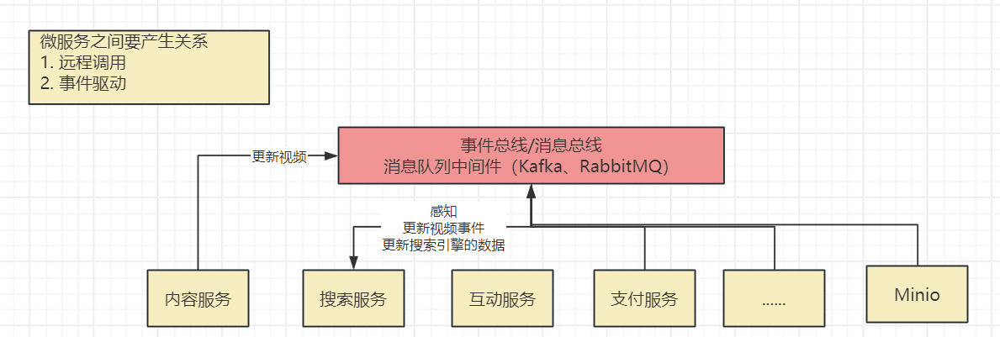
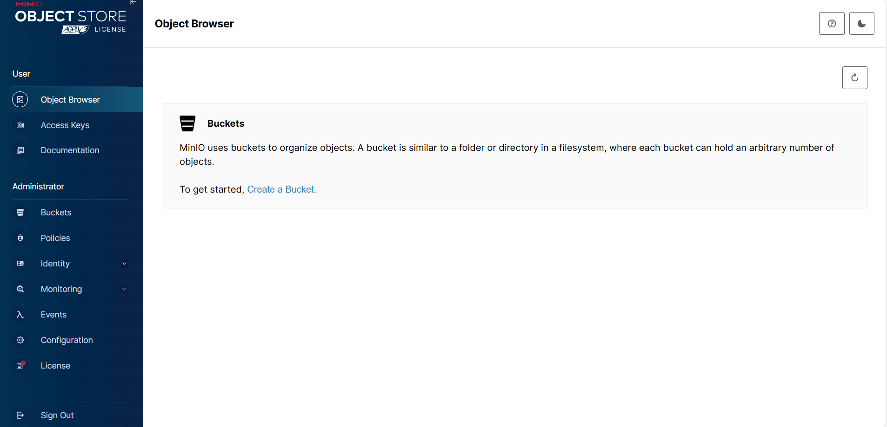
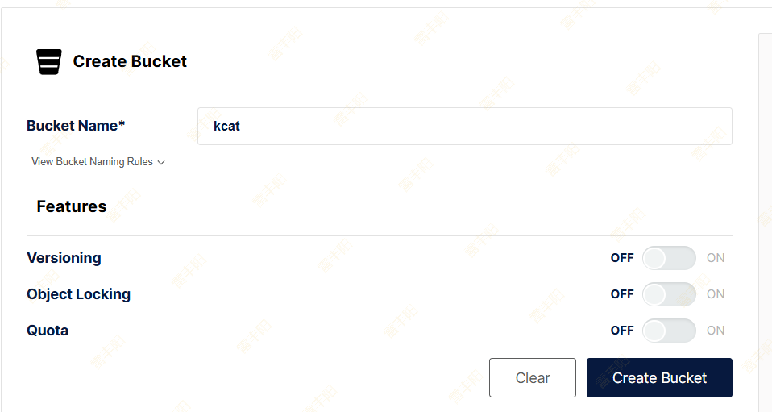
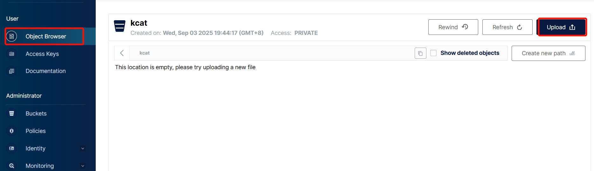
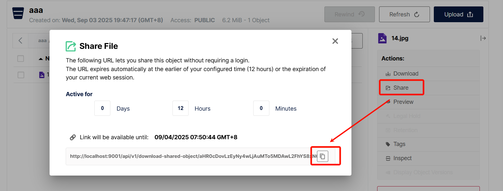
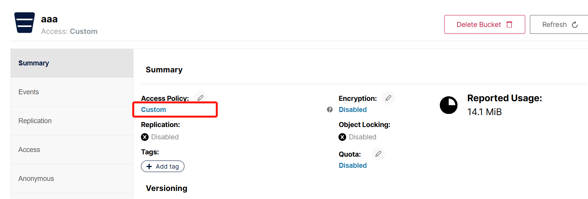

# 4. Minio

# 基础入门

## 介绍

> MinIO 是一个**高性能、开源的对象存储系统**，采用与 **Amazon S3 API 兼容**的接口；
> 
> 主要用于**存储非结构化数据**（如图片、视频、日志文件、备份数据、容器镜像、压缩包等）。文件存储（对象存储）
> 
> 存储：**结构化存储**（MySQL）、**非结构化存储**（Redis【kv存储】、Minio【对象】）
> 
> 它的设计目标是**简单、轻量、高性能、云原生**，能够在**本地部署**（裸机、虚拟机）、**容器环境**（如 Kubernetes）、以及边缘计算场景中使用。
> 
> **官方网站**：[https://min.io](https://min.io/)；
> 
> **中文文档**：https://min-io.cn/docs/minio/container/index.html

## 核心特性

### 1. **兼容**** S3 API**

- **MinIO **提供完整的 `Amazon S3 兼容 API`，大多数支持 S3 的工具和 SDK 都可以直接对接 MinIO。
- **Amazon Web Service**：云计算，抽取了整套的API规则；**S3** AWS做**对象存储**；
- 方便迁移已有 S3 应用，降低学习和改造成本。

### 2. **高性能**

- MinIO 使用 **Go **语言编写，具有**高效的 I/O 性能和低延迟**。
- 在标准硬件上能提供数**十到数百 GiB/s **的**吞吐量**，适合大规模数据存储和 AI、机器学习等需要高带宽的场景。

### 3. **分布式与可扩展**

- 支持**单节点**及**集群**模式。
- 分布式部署时可横向扩展容量与性能，节点之间数据自动均衡。
- 可以在任意时间**增加或替换存储节点**，扩展过程**不中断服务**。

### 4. **数据持久性与纠删码（Erasure Coding）**

- MinIO 使用**纠删码**来保护数据免于**硬件故障**（硬盘坏块、磁盘挂掉等）。
- 与传统 **RAID **相比，纠删码可以提供更高的存储效率和更好的容错能力。

> 你可以把纠删码想象成，比 RAID 更聪明的“数据备份”方法。
> 
> - RAID 常见做法：**直接把数据完整地再存几份**（比如 RAID 1 的镜像），**这样安全但浪费空间**。50%
> - **纠删码**：`把原始数据切成几份`，再用数学算法生成几个`冗余块`。
> 即使`部分原数据块`或`冗余块丢失`，也能用剩下的块`重新算出原始数据`。 75%。

### 5. `多租户`**与**`隔离`

- 通过 `Bucket`（存储桶）和 **IAM（身份访问管理）** 控制访问权限。
- 支持`用户`、`组`、`策略（policy）`细粒度权限控制。

### 6. **安全**

- 支持 **TLS/HTTPS** 加密传输。
- 提供 **端到端加密**（对象加密），支持服务端和客户端加密。
- 与外部身份系统集成（LDAP、OpenID Connect 等）。

### 7. **云原生 & 容器友好**

- 提供 Kubernetes Operator（MinIO Operator）方便在 K8s 中部署和管理。
- 原生支持多云架构，可以作为混合或多云对象存储的统一接口。

### 8. **事件与通知**

- webhook（发生一个事件调用一个钩子函数【callback == 给某个位置发请求（web  回调 就叫 webhook）；】）
  - 回调：
    - 函数回调：callback
    - web回调：webhook
- MinIO 可以将对象操作事件（PUT、DELETE 等）发送到消息队列或函数平台，如 Kafka、NATS、MQTT、Webhook、AWS Lambda 等，方便构建**事件驱动架构**。



### 9. **可观测性**

- 集成 **Prometheus** 监控指标。
- 暴露健康检查接口，方便运维和自动化管理。

## 安装

```yaml
services:
  minio:
    # minio 最后一个未阉割版本 不能再进行升级 在往上的版本功能被阉割
    image: minio/minio:RELEASE.2025-04-22T22-12-26Z
    container_name: minio
    ports:
      # api 端口
      - "9000:9000"
      # 控制台端口
      - "9001:9001"
    environment:
      # 时区上海
      TZ: Asia/Shanghai
      # 管理后台用户名
      MINIO_ROOT_USER: ruoyi
      # 管理后台密码，最小8个字符
      MINIO_ROOT_PASSWORD: ruoyi123
      # https需要指定域名
      #MINIO_SERVER_URL: "https://xxx.com:9000"
      #MINIO_BROWSER_REDIRECT_URL: "https://xxx.com:9001"
      # 开启压缩 on 开启 off 关闭
      MINIO_COMPRESS: "off"
      # 扩展名 .pdf,.doc 为空 所有类型均压缩
      MINIO_COMPRESS_EXTENSIONS: ""
      # mime 类型 application/pdf 为空 所有类型均压缩
      MINIO_COMPRESS_MIME_TYPES: ""
    volumes:
      # 映射当前目录下的data目录至容器内/data目录
      - ../docker/minio/data:/data
      # 映射配置目录
      - ../docker/minio/config:/root/.minio/
    command: server --address ':9000' --console-address ':9001' /data  # 指定容器中的目录 /data
    privileged: true
    # network_mode: "host"
```

## 登录

访问：localhost:9000；输入指定账号密码即可



## 使用

### 创建Bucket



**Versioning：**版本控制允许在同一键下保留同一对象的多个版本。

**Object Locking：**对象锁定功能可防止对象被删除，是支持保留策略和法律保留的必要条件。此功能只能在创建存储桶时启用。

**Quota：**配额限制存储桶中的数据量。

**Retention：**保留规则强制实施以防止对象在一段时间内被删除。必须启用版本控制才能设置存储桶保留策略。

| 模式 | 删除权限 | 是否可提前删除 | 常用场景 |
| --- | --- | --- | --- |
| Governance （治理） | 管理员可有条件绕过 | ✅ | 内部数据保护，有紧急删除需求 |
| Compliance （合规） | 任何人不可绕过 | ❌ | 受监管行业，法律要求数据不可改不可删 |

### 上传图片



### 获取图片

1. **分享：**复制分享链接



1. **预览：**右键审查元素，获取到预览API（前提，bucket必须是 public 权限）

http://localhost:9001/api/v1/buckets/aaa/objects/download?preview=true&prefix=14.jpg&version_id=null

# Java SDK

## 图片上传

```java
package com.lfy;

import io.minio.*;
import io.minio.http.Method;
import org.junit.jupiter.api.Test;
import org.springframework.boot.test.context.SpringBootTest;

import java.io.FileInputStream;

/**
 * @author leifengyang
 * @version 1.0
 * @date 2025/9/3 20:04
 * @description:
 */

public class MinioTest {

    @Test
    void testUpload(){
        // MinIO 连接配置
        String endpoint = "http://localhost:9000"; // MinIO 服务端地址
        String accessKey = "ruoyi";           // Access Key
        String secretKey = "ruoyi123";           // Secret Key
        String bucketName = "aaa";              // 桶名
        String objectName = "02.jpg";            // 对象名（存储到桶中的文件名）
        String filePath = "E:\\2022年必应壁纸365张全打包下载\\必应壁纸2022年2月\\02.jpg";      // 本地图片路径

        try {
            // 创建 MinioClient
            MinioClient minioClient = MinioClient.builder()
                .endpoint(endpoint)
                .credentials(accessKey, secretKey)
                .build();

            // 如果 Bucket 不存在，就先创建
            boolean found = minioClient.bucketExists(
                BucketExistsArgs.builder().bucket(bucketName).build()
            );
            if (!found) {
                minioClient.makeBucket(
                    MakeBucketArgs.builder().bucket(bucketName).build()
                );
                System.out.println("✅ 已创建桶: " + bucketName);
            }

            FileInputStream is = new FileInputStream(filePath);
            // 上传图片
            minioClient.putObject(
                PutObjectArgs.builder()
                    .bucket(bucketName)
                    .object(objectName)
                    .stream(is, is.available(), -1)
                    .contentType("image/jpeg")
                    .build()
            );
            System.out.println("✅ 上传成功: " + objectName);

            // 获取文件 URL（两种方式）

            // 方式1：临时签名 URL（建议私有桶使用）
            String presignedUrl = minioClient.getPresignedObjectUrl(
                GetPresignedObjectUrlArgs.builder()
                    .method(Method.GET)
                    .bucket(bucketName)
                    .object(objectName)
                    .expiry(60 * 60 * 24) // 有效期1天(单位:秒)
                    .build()
            );
            System.out.println("⏳ 临时访问URL: " + presignedUrl);

            // 方式2：如果 Bucket 设为公共（public），可直接拼接URL
            // 格式: http://<endpoint>/<bucket>/<object>
            String publicUrl = endpoint + "/" + bucketName + "/" + objectName;
            System.out.println("🌍 公共访问URL: " + publicUrl);

        } catch (Exception e) {
            e.printStackTrace();
        }
    }
}
```

## 图片访问地址

### 私有桶：临时访问地址

```java
String presignedUrl = minioClient.getPresignedObjectUrl(
    GetPresignedObjectUrlArgs.builder()
        .method(Method.GET)
        .bucket(bucketName)
        .object(objectName)
        .expiry(60 * 60 * 24) // 有效期1天(单位:秒)
        .build()
);
System.out.println("⏳ 临时访问URL: " + presignedUrl);
```

### 公有桶：直接拼接地址

```java
// 方式2：如果 Bucket 设为公共（public），可直接拼接URL
// 格式: http://<endpoint>/<bucket>/<object>
String publicUrl = endpoint + "/" + bucketName + "/" + objectName;
System.out.println("🌍 公共访问URL: " + publicUrl);
```

### 自定义桶权限

**企业需求：在 MinIO 中，设置某个 bucket**：

- 上传 / 删除 / 覆盖（增删改）**必须有权限**（受保护）
- 但对象（GET 读取）**任何人都可以访问**（匿名可读）

这在 **S3 / MinIO 里可以通过 Bucket Policy 配置** — 给匿名用户（`Principal: "*"`）赋予`s3:GetObject` 权限，同时不允许匿名执行 PUT / DELETE 等操作。

设置自定义权限：



内容如下：

```json
{
  "Version": "2012-10-17",
  "Statement": [
    {
      "Effect": "Allow",
      "Principal": "*",
      "Action": ["s3:GetObject"],
      "Resource": ["arn:aws:s3:::kcat/*"]
    }
  ]
}
```