# 5. Kafka

# 理解概念

## Event streaming：事件流

> 这个世界每时每刻都在发生各种事情，应用程序也一样。

> 可以从**数据库**、**传感器**、**移动设备**、**云服务**和**软件应用程序**等各处**获取事件流**。并**持久存储这些事件流**以供以后**检索**；还可以**实时**和**回顾性地操作**、**处理事件流**并对其做出反应；

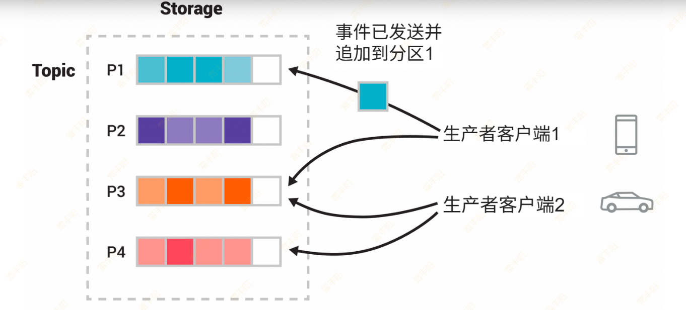

## Message Queue：消息队列(MQ)

**事件流****，最终构成了各种的****事件消息****。**

我们可以将各种事件消息保存到**消息队列**中，**队列的顺序就代表消息发生前后顺序**。方便我们**随时****发送**和**消费****消息**；

### 常用场景

#### 流量削峰

> **高峰流量缓冲到消息队列**。服务按照自己的消费能力处理消息

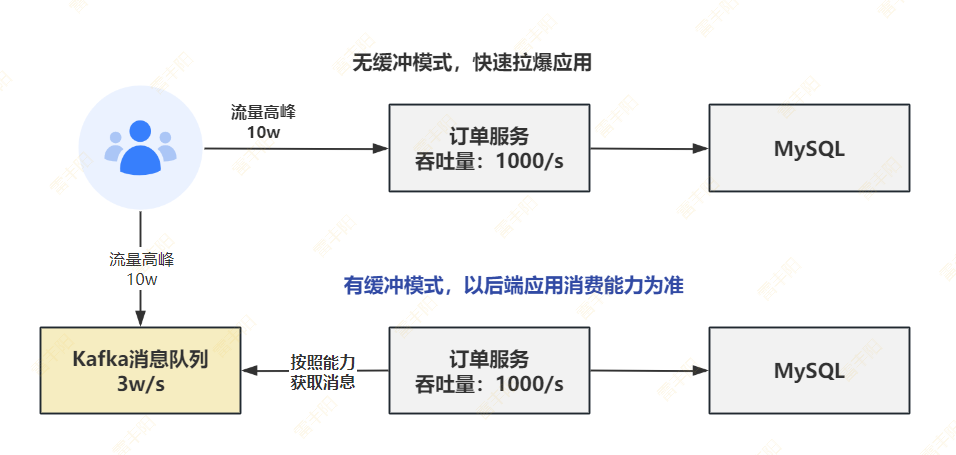

#### 服务解耦

> 微服务之间通过事件驱动。各自监听自己感兴趣的事件。无需远程调用这种强关联方式

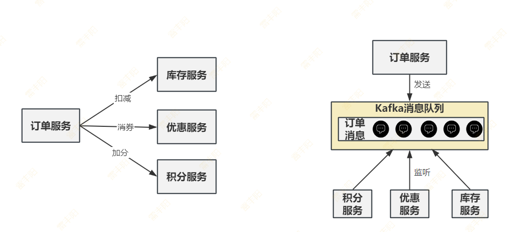

#### 异步并行

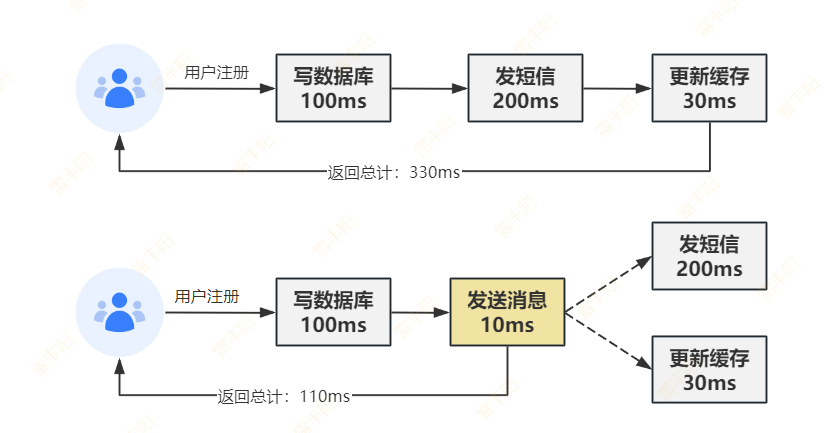

#### 分布式事务：最终一致性

> 核心思想：要做的事情先存起来，最终一定完成

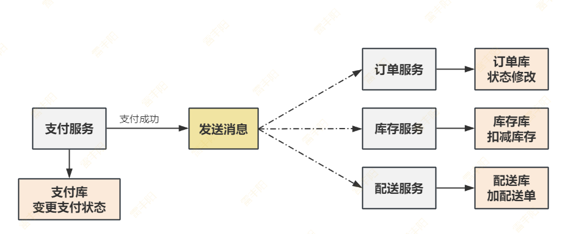

#### 大数据日志缓冲

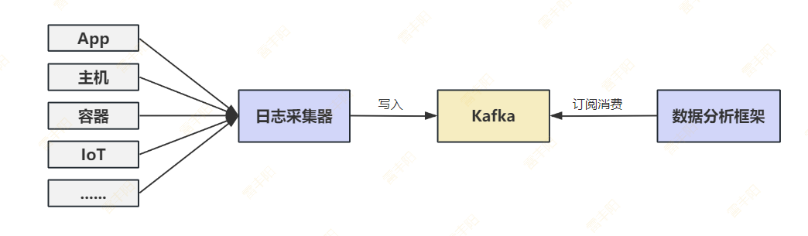

### 消息模式

#### 点对点（Peer To Peer）

> 单播模式：如果一个生产者生产的消息由一个消费者进行消费的话，那么这种模式就是点对点模式；**消息只有唯一的发送者和****接受者****，但并不是说只能有一个****接收者；**

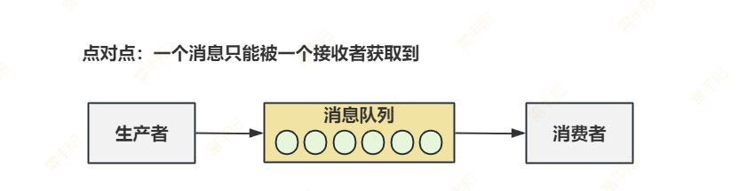

#### 发布订阅（PubSub）

> **广播模式：一个生产者或者多个生产者产生的消息能够被多个消费者同时消费的情况，这样的消息队列成为发布订阅模式的消息队列**

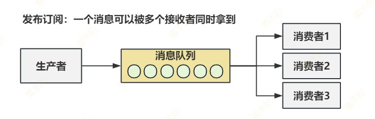

## Kafka 常用场景

### Messaging：消息传递

> Kafka 能够很好地**替代传统消息代理**。与大多数消息系统相比，Kafka 具有更高的吞吐量、内置分区、数据复制和容错机制，这使其成为大规模消息处理应用的理想解决方案。
> 
> 在这一领域，Kafka 可与 **ActiveMQ** 或 **RabbitMQ** 等传统消息系统相媲美。

**消息代理：Message Broker： 收发消息的服务器**

### Website Activity Tracking：网站活动追踪

> Kafka 最初的用例是构建一套实时发布-订阅消息流，用于重建用户活动追踪管道。这意味着网站活动（页面浏览、搜索或用户可能执行的其他操作）会被发布到中心主题，**每种活动类型对应一个主题**。这些消息流可供订阅以支持多种用例，包括实时处理、实时监控，以及导入 Hadoop 或离线数据仓库系统进行离线处理与报表生成。
> 
> **活动追踪****通常数据量巨大，因为每个用户页面浏览都会产生大量活动消息**。

### Metrics：指标

> Kafka 常用于操作**监控数据的处理**。它通过聚合来自分布式应用的统计数据，生成集中式的操作数据流。

### Log Aggregation：日志聚合

> 许多人将 Kafka 用作**日志聚合解决方案的替代品**。日志聚合通常**从服务器收集物理日志文件**，并将其置于中央位置（可能是文件服务器或 HDFS）进行处理。Kafka 抽象了文件的细节，提供了更清晰的日志或事件数据抽象，将其视为消息流。这使得延迟处理更低，并更易于支持多数据源和分布式数据消费。与以日志为中心的系统（如 Scribe 或 Flume）相比，Kafka 提供了同样出色的性能，由于复制机制而具有更强的持久性保证，以及更低的端到端延迟。

### Stream Processing：流处理

> 许多 Kafka 用户在处理管道中处理数据，这些管道由多个阶段组成**：原始输入数据从 Kafka 主题中消费，随后经过聚合、丰富或其他转换，生成新的主题以供进一步消费或后续处理**。例如，一个新闻推荐处理流程可能从 RSS 源抓取文章内容并发布到“文章”主题；后续处理可能对该内容进行标准化或去重，并将清洗后的文章内容发布到新主题；最终处理阶段可能会尝试向用户推荐这些内容。这类处理流程基于各个主题构建了实时数据流图。自 0.10.0.0 版本起，Apache Kafka 内置了名为 Kafka Streams 的轻量级但功能强大的流处理库，用于执行上述数据处理。除 **Kafka Streams **外，其他开源流处理工具还包括 Apache Storm 和 Apache Samza。

### Event Sourcing：事件溯源

> **事件溯源**是一种应用程序设计风格，其中状态变更被记录为按时间排序的记录序列。Kafka 对海量存储日志数据的支持，使其成为采用这种风格构建的应用程序的理想后端。

### **Commit Log ：提交日志**

> **Kafka 可作为分布式系统的一种外部提交日志**。该日志有助于在节点间复制数据，并充当故障节点的重新同步机制以恢复其数据。Kafka 的日志压缩功能有助于支持此用途。在此用途上，Kafka 与 Apache BookKeeper 项目类似。

`WAL`**：**`Write Ahead Log`**：预写日志**；

> 给世间万物都可以随时引入  MySQL 的 binlog； 
> 
> Kafka： 持久化、追踪回溯、多消费者

500mb/s： **顺序写**操作；

低密度价值；

# 快速上手

> **Kafka** 是由 `Linkedin` 公司开发的，它是一个**分布式**的，支持**多分区**、**多副本**的分布式消息流平台，它同时也是一款开源的**基于发布订阅模式的消息引擎系统**。现已捐献给Apache软件基金组织
> 
> **副本：备份、容灾顶上去。**
> 
> **主节点** 和 **副本**：将来一定要数据同步；

> `KRaft``（Kafka Raft）`是Kafka **3.3**版本引入的**一种**`共识协议`，用于**替代 **`ZooKeeper `进行元数据管理和集群的高可用性。在Kafka 2.8之前，Kafka依赖于ZooKeeper集群来管理元数据和实现高可用性。KRaft的引入简化了Kafka的架构，提高了分区的可伸缩性和弹性。

> 以前中间件集群所有的元数据（注册中心、配置中心）都放在zookeeper 中进行管理；现在好多都不用
> 
> 1. Zookeeper 慢
> 2. **摆脱依赖关系**

## 核心概念

### 代理（Brokers）

存储消息、收发消息的**服务器**，我们称为消息代理；

### **消息（Message）**

Kafka 中的数据单元被称为`消息`，也被称为**记录**，可以把它看作数据库表中某一行的记录。

### 批次（Batch）

为了提高效率， 消息会`分批次`写入 Kafka，批次就代指的是一组消息。

### 主题（Topic）

消息的种类称为 `主题`（Topic）,可以说一个**主题**代表了**一类消息**。相当于是对消息进行分类。**主题**就像是数据库中的表。

### 分区（Partition）

**一个****主题****可以被分为若干个分区（partition）**，同一个主题中的分区可以不在一个机器上，有可能会部署在多个机器上，由此来实现 kafka 的`伸缩性`，单一主题中的分区有序，但是无法保证主题中所有的分区有序

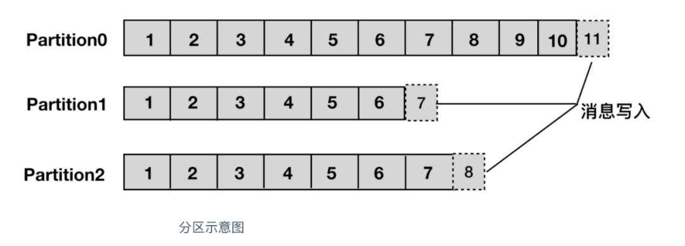

一直追加的**顺序写操作**；

### 同步副本（In Sync Replicas）

> **副本**：每个分区可以有多个副本，也就是数据的备份。这样即使分区数据错误，副本也可以恢复过来
> 
> **同步：**所有的消息必须发给主分区所在机器，副本分区同步主分区的数据

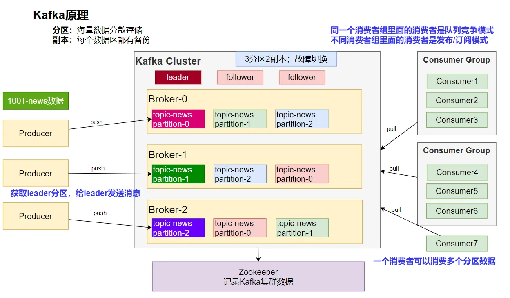

### 消费者&消费者组（Consumer & Consumer Group）

注意：**消费者可以分组**，一般一种微服务的所有消费者就是一组。

1. **同组的消费者**属于**竞争关系**，**消息只能被一个消费者拿到**；
2. **不同组的消费者**属于**发布订阅关系**。同一个主题的消息，**广播给不同组的消费者**。
3. **消费者**可以**订阅多种主题的消息**；

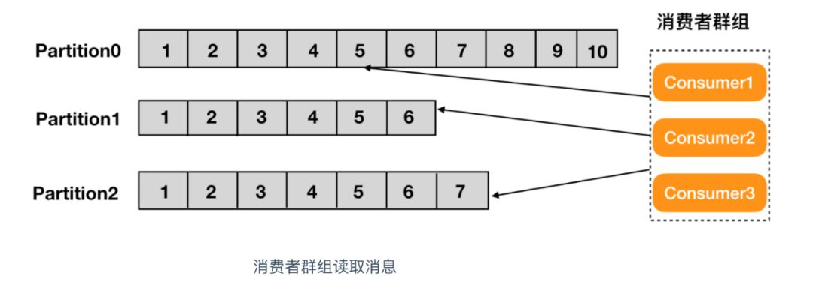

### 偏移量（Offset）

偏移量：`偏移量`（Consumer Offset）是一种元数据，它是一个不断递增的整数值，用来记录消费者发生重平衡时的位置，以便用来恢复数据。

## 安装

```yaml
services:  
  kafka:
    image: 'bitnami/kafka:3.6.2'
    container_name: kafka
    ports:
      - "9092:9092"
    environment:
      - TZ=Asia/Shanghai
        # KRaft settings
      - KAFKA_CFG_NODE_ID=0
      - KAFKA_CFG_PROCESS_ROLES=controller,broker
      - KAFKA_CFG_CONTROLLER_QUORUM_VOTERS=0@kafka:9093
      # Listeners
      - KAFKA_CFG_LISTENERS=PLAINTEXT://:9092,CONTROLLER://:9093
      # 实际访问ip 本地用 127 内网用 192 外网用 外网ip
      - KAFKA_CFG_ADVERTISED_LISTENERS=PLAINTEXT://192.168.3.79:9092
      - KAFKA_CFG_LISTENER_SECURITY_PROTOCOL_MAP=CONTROLLER:PLAINTEXT,PLAINTEXT:PLAINTEXT
      - KAFKA_CFG_CONTROLLER_LISTENER_NAMES=CONTROLLER
      - KAFKA_CFG_INTER_BROKER_LISTENER_NAME=PLAINTEXT
      - ALLOW_PLAINTEXT_LISTENER=yes
      # 更多变量 查看文档 https://github.com/bitnami/bitnami-docker-kafka/blob/master/README.md
#      KAFKA_BROKER_ID: 1
#      # 监听端口
#      KAFKA_CFG_LISTENERS: PLAINTEXT://:9092
#      # 实际访问ip 本地用 127 内网用 192 外网用 外网ip
#      KAFKA_CFG_ADVERTISED_LISTENERS: PLAINTEXT://192.168.3.79:9092
#      KAFKA_CFG_ZOOKEEPER_CONNECT: zookeeper:2181
#      ALLOW_PLAINTEXT_LISTENER: "yes"
    volumes:
      - ../docker/kafka/data:/bitnami/kafka/data

    # network_mode: "host"
  kafka-ui:
    container_name: kafka-ui
    image: provectuslabs/kafka-ui:latest
    restart: always
    ports:
      - 8666:8080
    environment:
      DYNAMIC_CONFIG_ENABLED: true
      KAFKA_CLUSTERS_0_NAME: kafka-dev
      KAFKA_CLUSTERS_0_BOOTSTRAPSERVERS: kafka:9092
    depends_on:
      - kafka
```

1. KAFKA_CFG_NODE_ID=0 - 设置Kafka broker的节点ID为0，用于在集群中唯一标识此broker
2. KAFKA_CFG_PROCESS_ROLES=controller,broker - 指定此节点同时担任controller和broker角色，controller负责集群管理，broker负责消息存储和传输
3. KAFKA_CFG_CONTROLLER_QUORUM_VOTERS=0@kafka:9093 - 定义controller仲裁投票者，格式为`节点ID@主机名:端口`，这里指定节点0在kafka:9093监听
4. KAFKA_CFG_LISTENERS=PLAINTEXT://:9092,CONTROLLER://:9093 - 配置监听器：
  - PLAINTEXT://:9092：用于客户端连接的未加密监听器
  - CONTROLLER://:9093：用于controller通信的专用监听器
5. KAFKA_CFG_ADVERTISED_LISTENERS=PLAINTEXT://192.168.3.79:9092 - 对外公布给客户端的监听地址，客户端将使用这个地址连接Kafka
6. KAFKA_CFG_LISTENER_SECURITY_PROTOCOL_MAP=CONTROLLER:PLAINTEXT,PLAINTEXT:PLAINTEXT - 映射监听器名称到安全协议，这里都使用PLAINTEXT（无加密）
7. KAFKA_CFG_CONTROLLER_LISTENER_NAMES=CONTROLLER - 指定用于controller通信的监听器名称
8. KAFKA_CFG_INTER_BROKER_LISTENER_NAME=PLAINTEXT - 设置broker间通信使用的监听器名称
9. ALLOW_PLAINTEXT_LISTENER=yes - 允许使用未加密的PLAINTEXT监听器，在生产环境中建议使用加密协议

## 创建主题

### 成功创建

> 1. **副本数量必须小于Broker数量**。
> 2. **分区数量无所谓**，根据你自己对数据的预估，分成N个区，如果Broker只有一个，所有分区的数据都在这一个机器，如果Broker有多个，分区可以被分散到其他机器。从而形成一个压力分担的效果；
> 
> **计算方式**： ** N Broker 最多允许 N 副本**；

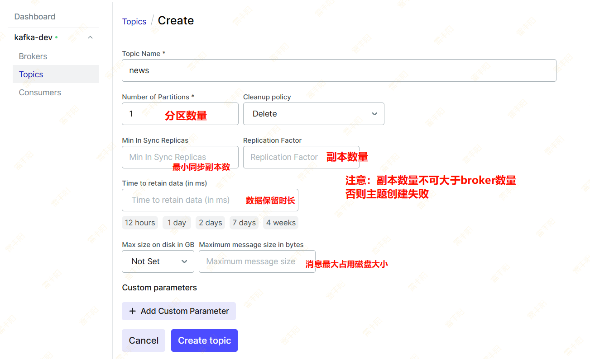

### 失败创建

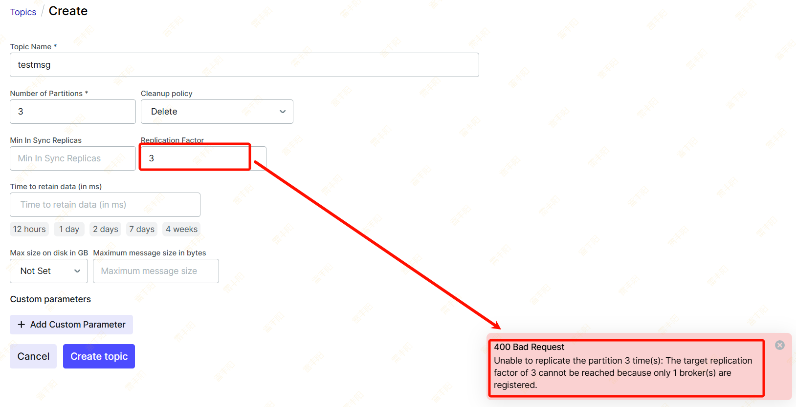


### 多分区主题

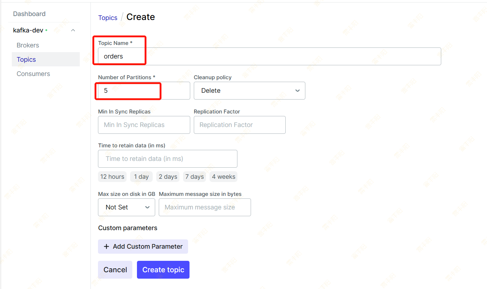

> 创建完成如下

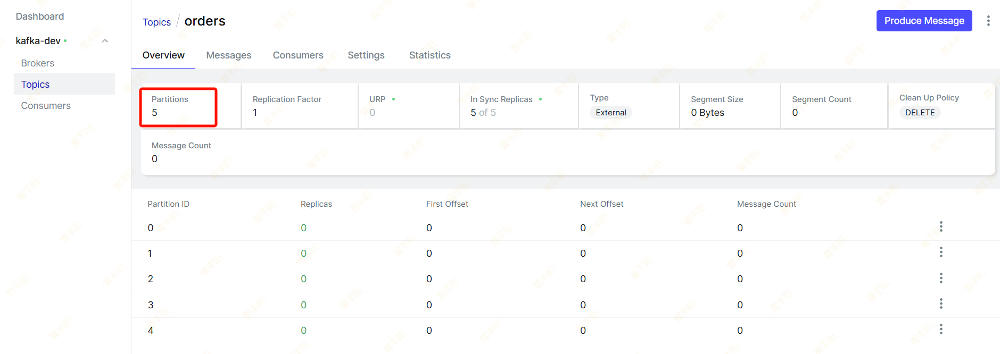

### 主题默认配置

Kafka 为新创建的主题提供了很多默认配置参数，下面就来一起认识一下这些参数

- `num.partitions`**：**指定新创建的主题需要包含多少个分区。如果启用了主题自动创建功能（该功能是默认启用的），主题分区的个数就是该参数指定的值。该参数的默认值是 1。要注意，**我们可以增加主题分区的个数，但不能减少分区的个数**。
- `default.replication.factor`：这个参数比较简单，它表示 kafka保存消息的副本数，如果一个副本失效了，另一个还可以继续提供服务。`default.replication.factor 的默认值为1`，这个参数在你启用了主题自动创建功能后有效。
- `log.retention.ms`：Kafka 通常根据时间来决定数据可以**保留多久**。默认使用 log.retention.hours 参数来配置时间，默认是 168 个小时，也就是一周。除此之外，还有两个参数 log.retention.minutes 和 log.retentiion.ms 。这三个参数作用是一样的，都是决定消息多久以后被删除，推荐使用 log.retention.ms。
- `log.retention.bytes`：另一种保留消息的方式是判断消息是否过期。它的值通过参数 `log.retention.bytes` 来指定，作用在每一个分区上。也就是说，如果有一个包含 8 个分区的主题，并且 log.retention.bytes 被设置为 1GB，那么这个主题最多可以保留 8GB 数据。所以，当主题的分区个数增加时，整个主题可以保留的数据也随之增加。
- `log.segment.bytes`：上述的日志都是作用在日志片段上，而不是作用在单个消息上。当消息到达 broker 时，它们被追加到分区的当前日志片段上，当日志片段大小到达 log.segment.bytes 指定上限（`默认为 1GB`）时，当前日志片段就会被关闭，一个新的日志片段被打开。如果一个日志片段被关闭，就开始等待过期。这个参数的值越小，就越会频繁的关闭和分配新文件，从而降低磁盘写入的整体效率。
- `log.segment.ms`：上面提到日志片段经关闭后需等待过期，那么 `log.segment.ms` 这个参数就是指定日志多长时间被关闭的参数和，log.segment.ms 和 log.retention.bytes 也不存在互斥问题。日志片段会在大小或时间到达上限时被关闭，就看哪个条件先得到满足。
- `message.max.bytes`：broker 通过设置 `message.max.bytes`参数来`限制单个消息的大小`，默认是 1000 000， 也就是** 1MB**，如果生产者尝试发送的消息超过这个大小，不仅消息不会被接收，还会收到 broker 返回的错误消息。跟其他与字节相关的配置参数一样，该参数指的是压缩后的消息大小，也就是说，只要压缩后的消息小于 mesage.max.bytes，那么消息的实际大小可以大于这个值；**这个值对性能有显著的影响。值越大，那么负责处理网络连接和请求的线程就需要花越多的时间来处理这些请求。它还会增加磁盘写入块的大小，从而影响 IO 吞吐量**。
- `retention.ms`：规定了该主题消息被保存的时常，默认是7天，即该主题只能保存7天的消息，一旦设置了这个值，它会覆盖掉 Broker 端的全局参数值。
- `retention.bytes`：规定了要为该 Topic 预留多大的磁盘空间。和全局参数作用相似，这个值通常在多租户的 Kafka 集群中会有用武之地。当前默认值是 -1，表示可以无限使用磁盘空间。

## 发送消息

### 界面操作

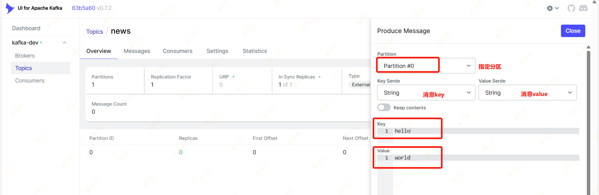

### JavaAPI

#### 依赖

```xml
<dependency>
   <groupId>org.apache.kafka</groupId>
   <artifactId>kafka-clients</artifactId>
   <version>3.6.2</version>
</dependency>
```

#### 测试

```java
@Test
void contextLoads() {

    Map<String, Object> configMap = new HashMap<>();

    configMap.put(ProducerConfig.BOOTSTRAP_SERVERS_CONFIG, "localhost:9092");

    configMap.put(
        ProducerConfig.KEY_SERIALIZER_CLASS_CONFIG,
        "org.apache.kafka.common.serialization.StringSerializer");
    configMap.put(
        ProducerConfig.VALUE_SERIALIZER_CLASS_CONFIG,
        "org.apache.kafka.common.serialization.StringSerializer");

    KafkaProducer<String, String> producer = new KafkaProducer<>(configMap);

    //给指定主题发送k,v 消息。如果主题不存在，自动创建
    ProducerRecord<String, String> record = new ProducerRecord<String, String>(
        "test", "key1", "value1"
    );
    producer.send(record);
    producer.close();
}
```

## 接收消息

### 界面操作

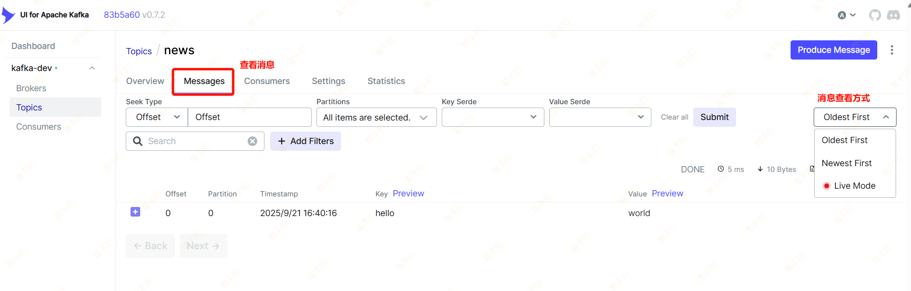

### Java API

```java
@Test
void testConsumer(){
    // TODO 配置属性集合
    Map<String, Object> configMap = new HashMap<String, Object>();

    // TODO 配置属性：Kafka集群地址
    configMap.put(ConsumerConfig.BOOTSTRAP_SERVERS_CONFIG, "localhost:9092");
    // TODO 配置属性: Kafka传输的数据为KV对，所以需要对获取的数据分别进行反序列化
    configMap.put(
        ConsumerConfig.KEY_DESERIALIZER_CLASS_CONFIG,
        "org.apache.kafka.common.serialization.StringDeserializer");
    configMap.put(
        ConsumerConfig.VALUE_DESERIALIZER_CLASS_CONFIG,
        "org.apache.kafka.common.serialization.StringDeserializer");
    // TODO 配置属性: 读取数据的位置 ，取值为 earliest（最早），latest（最晚）
    configMap.put(ConsumerConfig.AUTO_OFFSET_RESET_CONFIG,"earliest");
    configMap.put("group.id", "lfy");
    configMap.put("enable.auto.commit", "true");

    KafkaConsumer<String, String> consumer = new KafkaConsumer<String, String>(configMap);

    // TODO 消费者订阅指定主题的数据
    consumer.subscribe(Collections.singletonList("test"));

    while ( true ) {
        // TODO 每隔100毫秒，抓取一次数据
        ConsumerRecords<String, String> records =
            consumer.poll(Duration.ofMillis(100));
        // TODO 打印抓取的数据
        for (ConsumerRecord<String, String> record : records) {
            System.out.println("K = " + record.key() + ", V = " + record.value());
        }
    }
}
```

## 消费者组名一般是微服务名

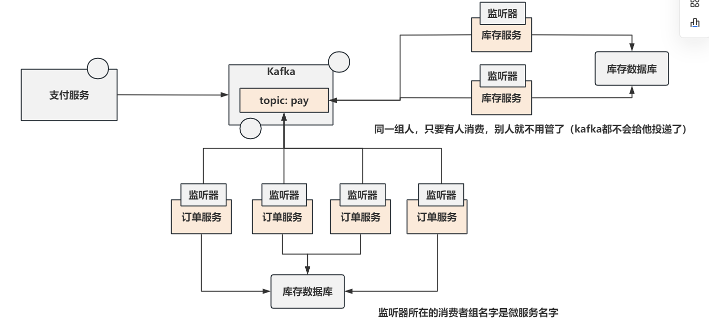

## BigDataTools

> IDEA安装 大数据工具 插件。可以测试消息发送与接收效果

### 发送消息

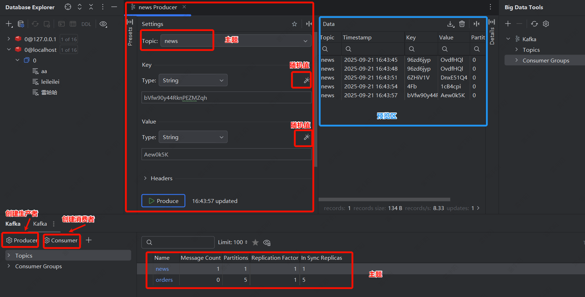

### 接收消息

[📎 PixPin_2025-09-21_16-50-18.mp4](<files/PixPin_2025-09-21_16-50-18.mp4>)

### 多分区主题

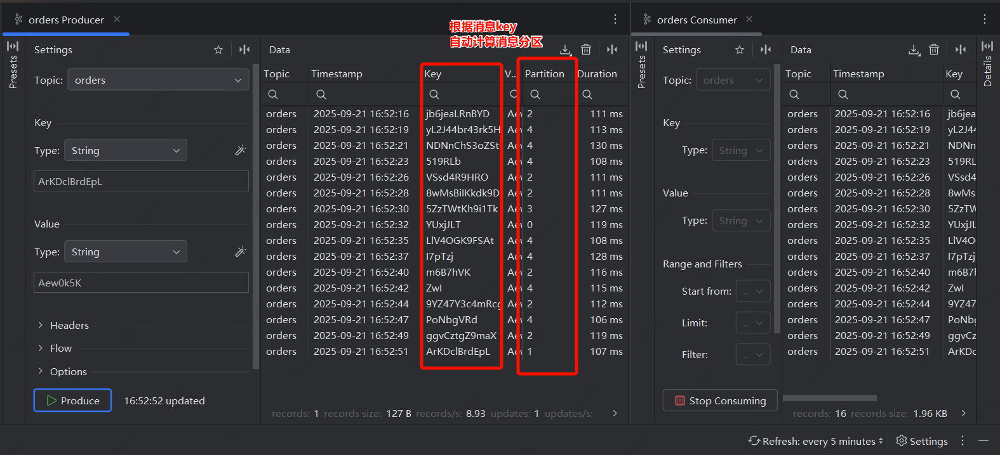

# SpringBoot整合

https://docs.spring.io/spring-kafka/reference/

## 快速入门

### 导入依赖

```properties
<dependency>
    <groupId>org.springframework.kafka</groupId>
    <artifactId>spring-kafka</artifactId>
</dependency>
```

### 创建主题

> 容器中放入的 NewTopic 会在第一次启动的时候自动创建

```java
@Configuration
public class KafkaConfig {

    @Bean
    public NewTopic topic() {
        return TopicBuilder.name("topic1")
            .partitions(10)
            .replicas(1)
            .build();
    }
}
```

### 发送消息

> 1. `KafkaTemplate<String, String>` 可以自动注入到容器中进行使用；
> 2. `send() 方法`：用来发送消息。是一个Future异步。我们可以等待异步完成并拿到结果

```java
@RestController
public class SendMsgController {

    @Autowired
    KafkaTemplate<String, String> kafkaTemplate;

    @GetMapping("/send")
    public String send() throws ExecutionException, InterruptedException {
        String string = UUID.randomUUID().toString();
        String[] split = string.split("-");
        String key = split[0];
        String value = split[1];
        CompletableFuture<SendResult<String, String>> send = kafkaTemplate.send("topic1", key, value);
        SendResult<String, String> sendResult = send.get();

        //注意：RecordMetadata 是发送成功的消息详情
        int partition = sendResult.getRecordMetadata().partition();


        return String.format("发送消息；分区 %d：内容：%s：%s", partition, key, value);
    }

}
```

### 消费消息

> 1. 配置文件：`spring.kafka.consumer.auto-offset-reset=earliest`
> 
> - 修改不同offset策略
> - 修改不同@KafkaListener的id，测试策略对消费的影响

```typescript
@Service
public class KafkaService {

    /**
     * id： 分组id
     * topics：指定主题
     * ConsumerRecord： 接收完整的消息信息
     */
    @KafkaListener(id = "demo-kafka",topics = "topic1")
    public void listen(ConsumerRecord<String,String> record) {
        System.out.println(record);
    }


}
```

## 高阶使用

> 如何自定义设置从哪里开始消费

```typescript
@KafkaListener(topicPartitions = {
    @TopicPartition(topic="topic2",
        partitionOffsets = {
           @PartitionOffset(partition = "0",initialOffset = "0"),
           @PartitionOffset(partition = "1",initialOffset = "0"),
           @PartitionOffset(partition = "2",initialOffset = "0")
        })
})
public void listen05(ConsumerRecord<String, String> msg){

    String format = String.format("主题：%s，分区：%d， " +
            "key：%s， " +
            "value：%s",
        msg.topic(), msg.partition(),
        msg.key(), msg.value());
    System.out.println(format);
}
```

# 核心原理

## 消息存储

### 组织结构

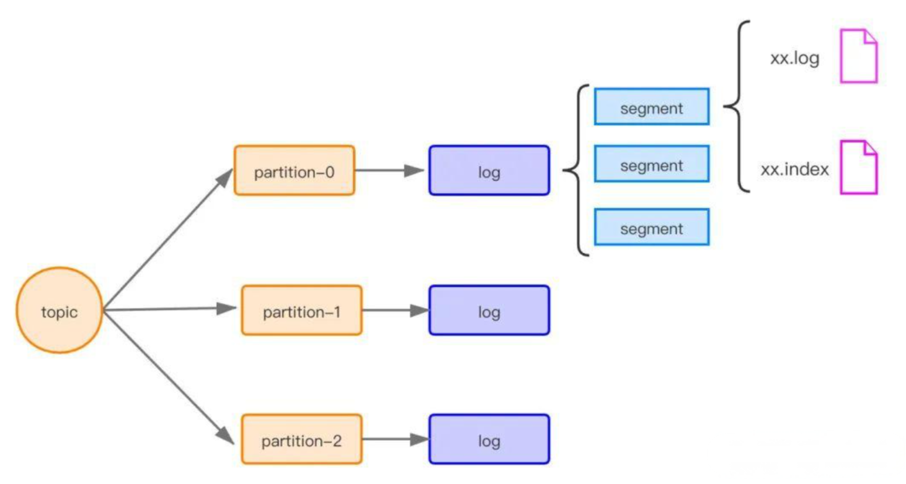

**topic 是逻辑上的概念，而 patition 是物理上的概念**，每个 patition 对应一个 log 文件，而 log 文件中存储的就是 [producer](https://zhida.zhihu.com/search?content_id=586136561&content_type=Answer&match_order=1&q=producer&zhida_source=entity) 生产的数据，patition 生产的数据会被不断的添加到 log 文件的末端，且每条数据都有自己的 [offset](https://zhida.zhihu.com/search?content_id=586136561&content_type=Answer&match_order=1&q=offset&zhida_source=entity)。

消费组中的每个消费者，都是实时记录自己消费到哪个 offset，以便出错恢复，从上次的位置继续消费。

### 分段数据

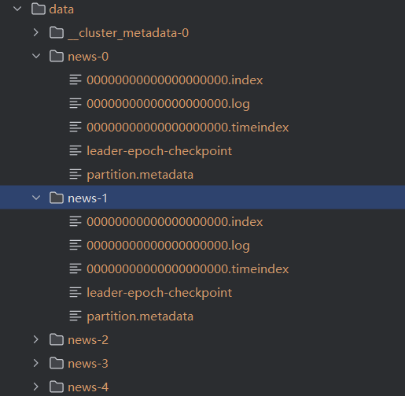

如果某个分区下有很多数据，那么 .log、.index、.timeindex 就会分为多个 segment 存储：

00000000000000000000.index

00000000000000000000.log

00000000000000000000.timeindex

.......................................

00000000000000000295.index

00000000000000000295.log

00000000000000000295.timeindex

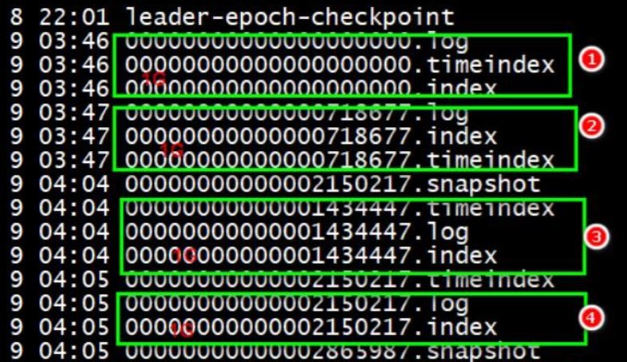

### 查找消息

> 消费者消费消息是按照偏移量开始消费的

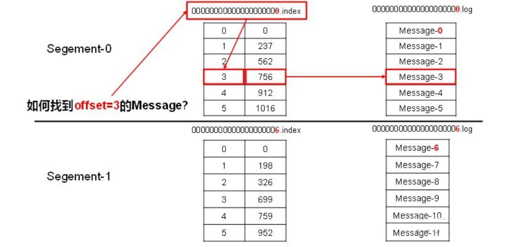

> 利用消息偏移量在所有的segment（段）之间，利用二分查找，快速定位那个段。来到这个段的 index 文件中确认这个偏移量对应真正物理文件的那个位置，基于这个位置，直接获取到文件指定字节以后的数据

## Kafka为何如此快

**Kafka 实现了**`零拷贝`**原理来快速移动数据**，避免了内核之间的切换。Kafka 可以将数据记录分批发送，从生产者到文件系统（Kafka 主题日志）到消费者，可以端到端的查看这些批次的数据。

批处理能够进行更有效的数据压缩并减少 I/O 延迟，Kafka 采取**顺序写入磁盘**的方式，避免了随机磁盘寻址的浪费；

总结一下其实就是四个要点

- **顺序写**
- **零拷贝**
- **消息压缩**
- **批处理**

### 顺序写

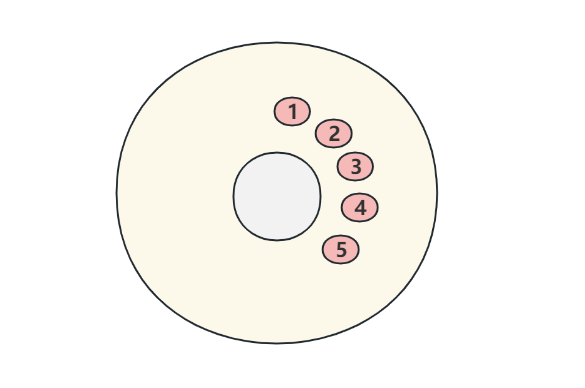

**append only 日志****末尾添加的机制**,也就是每次有数据写入kafka,它是将数据message 添加到消息文件的末尾，从而实现磁盘顺序写的机制，

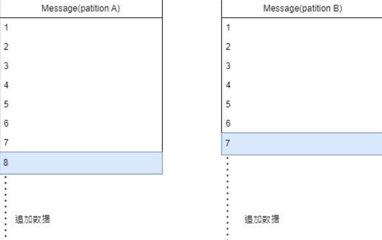

### 零拷贝

> **DMA(Direct Memory Access，直接存储器访问) **是所有现代电脑的重要特色，它允许不同速度的硬件装置来沟通，而不需要依赖于** CPU 的大量中断负载** 。通俗来讲，就是DMA 传输将数据从一个地址空间复制到另外一个地址空间，当CPU 初始化这个传输动作，传输动作本身是由 DMA 控制器来实行和完成，也就是两个硬件之间完成的，而没有CPU的参与，那么CPU就可以释放出来做别的事情，这样极大地提高了效率。

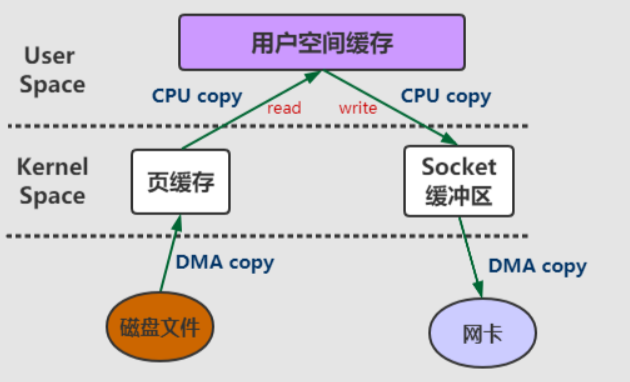

**传统拷贝**：

1. 我们可以清楚的看到共产生了4次copy，从磁盘文件到Kernal的相互读写是支持DMA copy的，但即使是这样，从Kernal到User没有硬件的支持所以不支持DMA，还有两次CPU copy。
2. Kafka只是把文件存放到磁盘之后通过网络发出去，中间并不需要修改什么数据，那read和write的两次CPU copy的操作完全是多余的。

**零拷贝：**

> **Linux2.1**内核开始引入了 `sendfile`** **函数 (mmap)，用于将文件通过socket传送。
> 
> **Linux2.4内核开始引入了 sendfile 函数; 零拷贝**

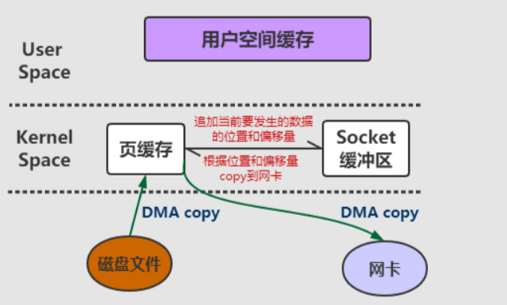

**操作系统** ==> JVM 提供零拷贝函数 ==> Kafka调用函数;

JVM 提供**零拷贝函数** : `NIO（New IO）`（Buffer、Selector、Channel）

file.transferTo(file2)：底层直接零拷贝

`IO`：Input Output；

### 消息压缩

> 压缩消息可以**节省网络带宽**。从而提高吞吐量

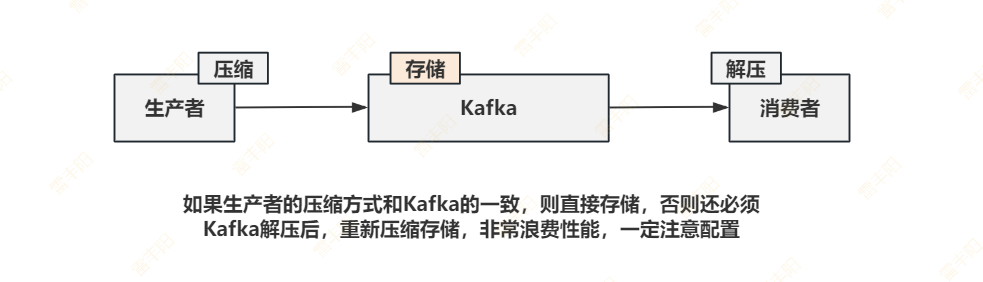

针对这几种压缩本身的性能，Zstd [GitHub 官方](https://github.com/facebook/zstd) 公布了压测对比结果如下，

### 批处理

> 导致丢消息

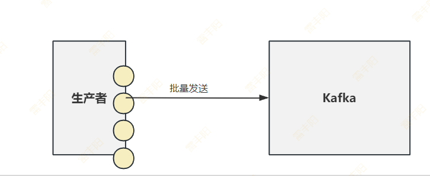

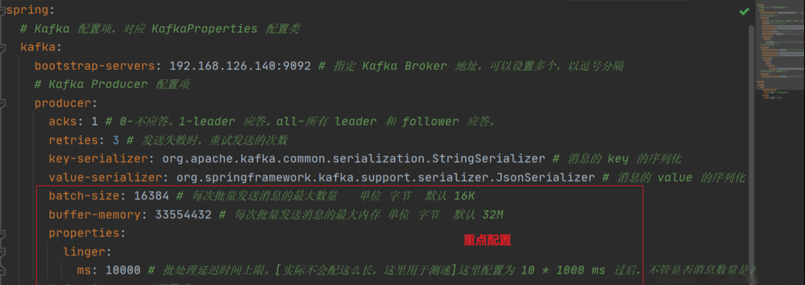

**消息达到最大数量、或者最大内存、或者最长时间，都会被全部发出去**

## 发送者

### 发送消息

在 Kafka 中，我们把产生消息的那一方称为`生产者`，比如我们经常回去淘宝购物，你打开淘宝的那一刻，你的登陆信息，登陆次数都会作为消息传输到 Kafka 后台，当你浏览购物的时候，你的浏览信息，你的搜索指数，你的购物爱好都会作为一个个消息传递给 Kafka 后台，然后淘宝会根据你的爱好做智能推荐，致使你的钱包从来都禁不住诱惑，那么这些生产者产生的`消息`是怎么传到 Kafka 应用程序的呢？发送过程是怎么样的呢？

尽管消息的产生非常简单，但是消息的发送过程还是比较复杂的，如图

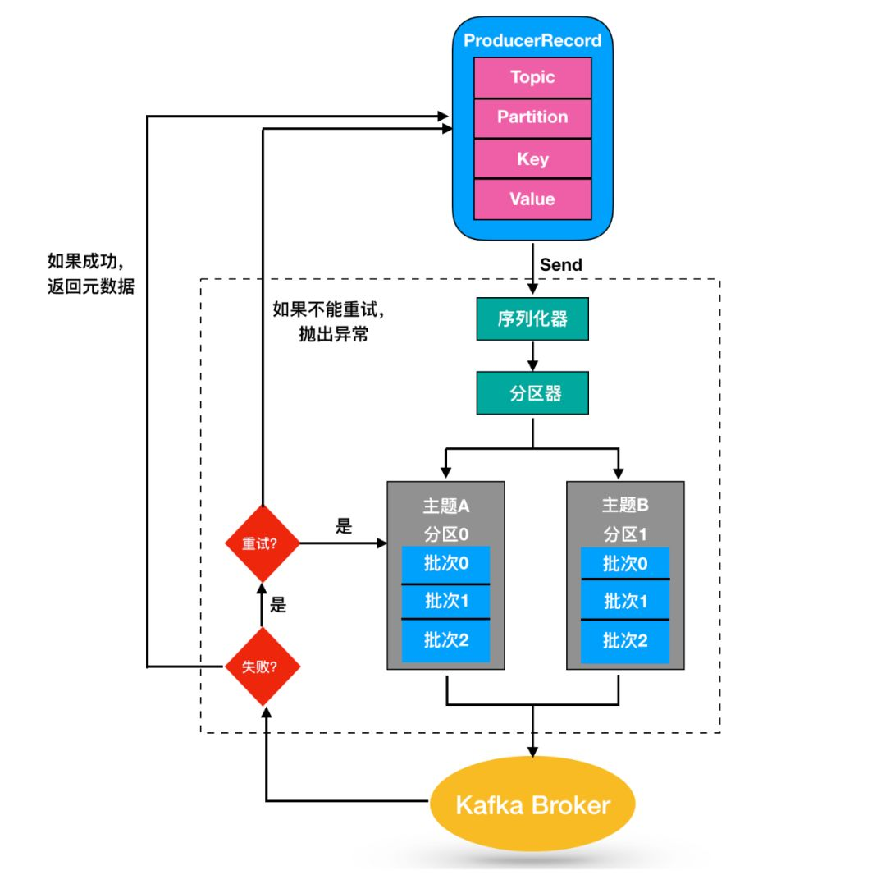

### 发送过程

1. 从创建一个`ProducerRecord` 对象开始，`ProducerRecord `是 Kafka 中的一个核心类，它代表了一组 Kafka 需要发送的 `key/value` 键值对，它由记录要发送到的主题名称（Topic Name），可选的分区号（Partition Number）以及可选的键值对构成。

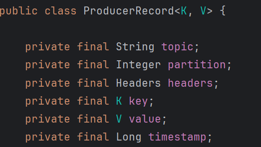

1. 在发送 ProducerRecord 时，我们需要将**键值对对象由序列化器转换为字节数组**，这样它们才能够在网络上传输。然后消息到达了分区器。
2. **如果发送过程中指定了有效的分区号，那么在发送记录时将使用该分区。如果发送过程中未指定分区，则将使用key 的 hash 函数映射指定一个分区**。如果发送的过程中没有分区号也没有key，则将以循环的方式分配一个分区。选好分区后，生产者就知道向哪个主题和分区发送数据了。
3. ProducerRecord 还有关联的时间戳，如果用户没有提供时间戳，那么生产者将会在记录中使用当前的时间作为时间戳。Kafka 最终使用的时间戳取决于 topic 主题配置的时间戳类型。
  - 如果将主题配置为使用 `CreateTime`，则生产者记录中的时间戳将由 broker 使用。
  - 如果将主题配置为使用`LogAppendTime`，则生产者记录中的时间戳在将消息添加到其日志中时，将由 broker 重写。
4. 然后，这条消息被存放在一个记录批次里，这个批次里的所有消息会被发送到相同的主题和分区上。由一个独立的线程负责把它们发到 Kafka Broker 上。
5. Kafka Broker 在收到消息时会返回一个响应，如果写入成功，会返回一个 RecordMetaData 对象，**它包含了主题和分区信息，以及记录在分区里的偏移量，上面两种的时间戳类型也会返回给用户**。如果写入失败，会返回一个错误。生产者在收到错误之后会尝试重新发送消息，几次之后如果还是失败的话，就返回错误消息。

### 大致流程

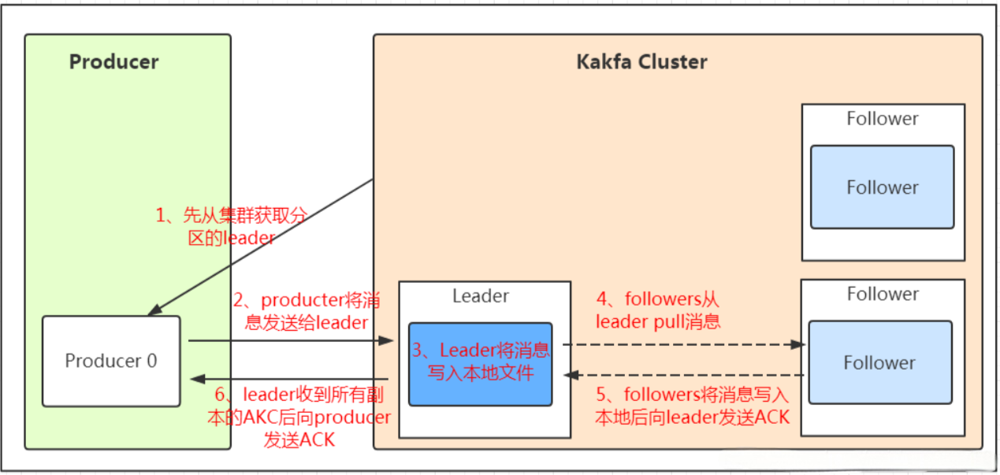

### 详细流程

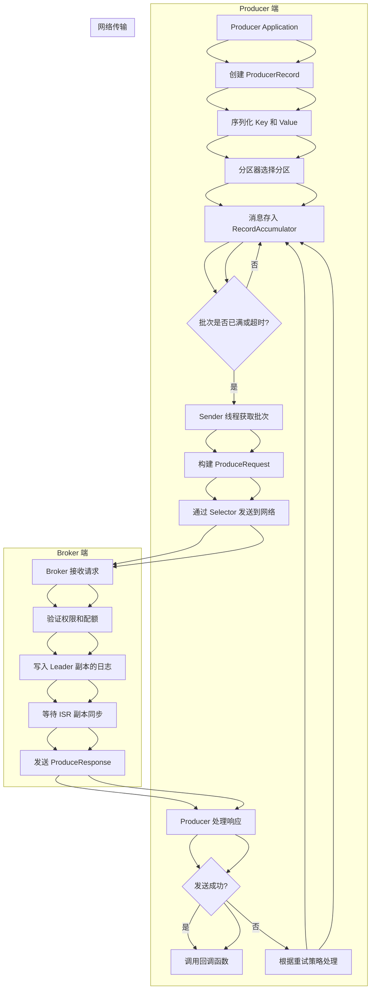
```mermaid
flowchart TD
    A[Producer Application] --> B[创建 ProducerRecord]
    B --> C[序列化 Key 和 Value]
    C --> D[分区器选择分区]
    D --> E[消息存入 RecordAccumulator]
    E --> F{批次是否已满或超时?}
    F -- 否 --> E
    F -- 是 --> G[Sender 线程获取批次]
    G --> H[构建 ProduceRequest]
    H --> I[通过 Selector 发送到网络]
    I --> J[Broker 接收请求]
    J --> K[验证权限和配额]
    K --> L[写入 Leader 副本的日志]
    L --> M[等待 ISR 副本同步]
    M --> N[发送 ProduceResponse]
    N --> O[Producer 处理响应]
    O --> P{发送成功?}
    P -- 是 --> Q[调用回调函数]
    P -- 否 --> R[根据重试策略处理]
    R --> E

    subgraph Producer 端
        A --> B --> C --> D --> E --> F
        G --> H --> I
        O --> P --> Q
        R --> E
    end

    subgraph Broker 端
        J --> K --> L --> M --> N
    end

    subgraph 网络传输
        I --> J
        N --> O
    end
```

## 消费者组

应用程序使用 `KafkaConsumer` 从 Kafka 中订阅主题并接收来自这些主题的消息，然后再把他们保存起来。应用程序首先需要创建一个 KafkaConsumer 对象，订阅主题并开始接受消息，验证消息并保存结果。一段时间后，生产者往主题写入的速度超过了应用程序验证数据的速度，这时候该如何处理？如果只使用单个消费者的话，应用程序会跟不上消息生成的速度，就像多个生产者像相同的主题写入消息一样，这时候就需要多个消费者共同参与消费主题中的消息，对消息进行分流处理。

Kafka 消费者从属于`消费者群组`。一个群组中的消费者订阅的都是`相同`的主题，每个消费者接收主题一部分分区的消息。下面是一个 Kafka 分区消费示意图

### 1个消费者，4个分区

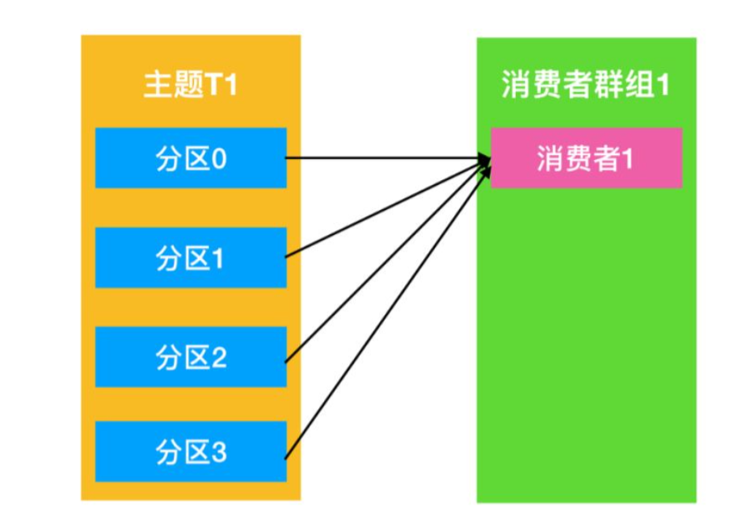

### 2个消费者，4个分区

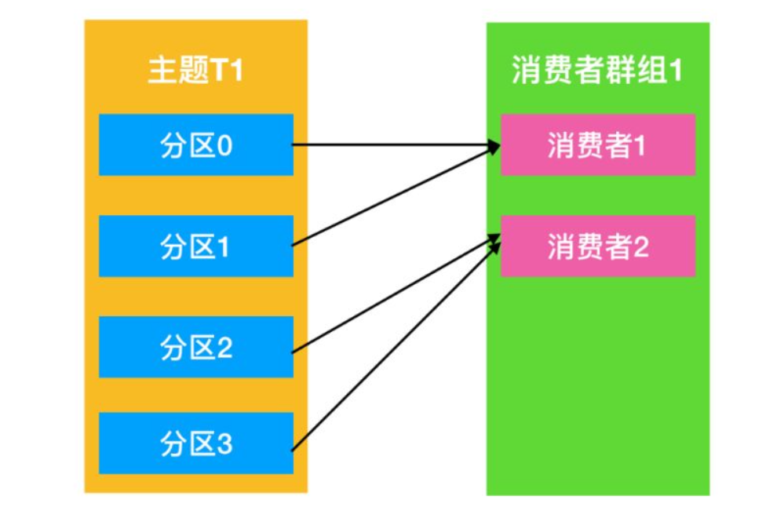

### 4个消费者，4个分区

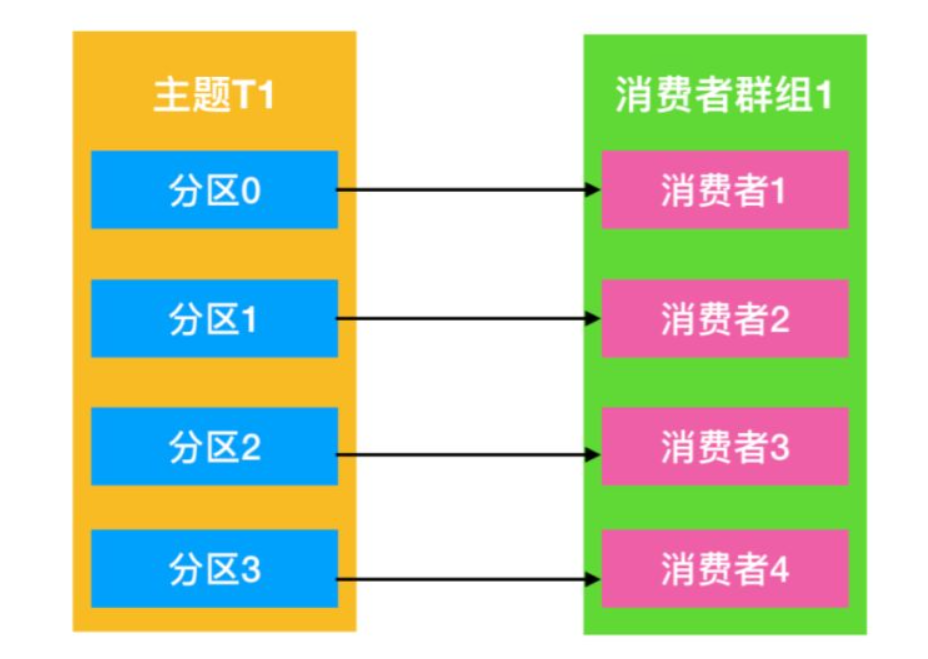

### 5个消费者，4个分区

每个分区所产生的消息能够被每个消费者群组中的消费者消费，如果向消费者群组中增加更多的消费者，那么多余的消费者将会闲置，

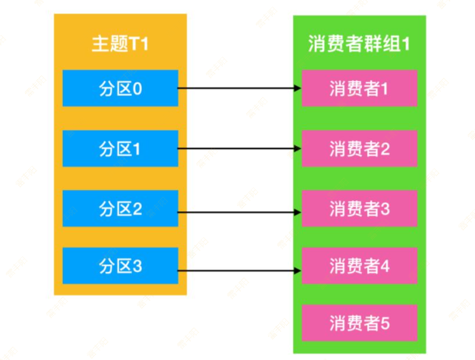

> 向群组中增加消费者是横向伸缩消费能力的主要方式。总而言之，我们可以通过增加消费组的消费者来进行`水平扩展提升消费能力`。**这也是为什么建议创建主题时使用比较多的分区数**，这样可以在消费负载高的情况下增加消费者来提升性能。另外，消费者的数量不应该比分区数多，因为多出来的消费者是空闲的，没有任何帮助。

### 多个消费者组

Kafka 一个很重要的特性就是，**只需写入一次消息，可以支持任意多的应用读取这个消息**。换句话说，**每个应用都可以读到全量的消息。**为了使得每个应用都能读到全量消息，应用需要有不同的消费组。对于上面的例子，假如我们新增了一个新的消费组 G2，而这个消费组有两个消费者，那么就演变为下图这样

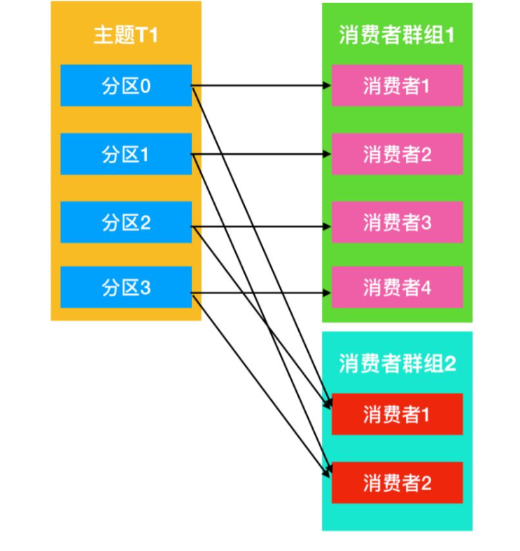

在这个场景中，消费组 G1 和消费组 G2 都能收到 T1 主题的全量消息，在逻辑意义上来说它们属于不同的应用。

**总结起来就是如果应用需要读取全量消息，那么请为该应用设置一个消费组；如果该应用消费能力不足，那么可以考虑在这个消费组里增加消费者**。

## **分区重平衡**

> 从上面的`消费者演变图`中可以知道这么一个过程：最初是一个消费者订阅一个主题并消费其全部分区的消息，后来有一个消费者加入群组，随后又有更多的消费者加入群组，而新加入的消费者实例`分摊`了最初消费者的部分消息，这种把分区的所有权通过一个消费者转到其他消费者的行为称为`重平衡`，英文名也叫做 `Rebalance` 。如下图所示

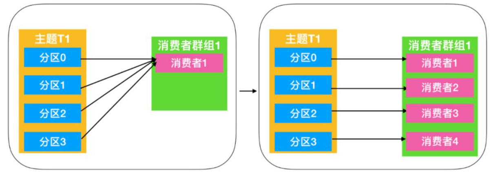

> 1. **重平衡是Kafka消费者组在成员发生变化时（消费者加入、离开或崩溃），重新分配分区给消费者的过程。**
> 2. **在重平衡期间，消费者组中的消费者实例都会停止消费，等待重平衡的完成。而且重平衡这个过程很慢。**

### 触发重平衡的条件

1. **消费者加入**：新消费者加入消费者组
2. **消费者离开**：消费者主动离开或崩溃
3. **订阅主题变化**：订阅的主题分区数发生变化
4. **心跳超时**：**消费者**未能按时发送心跳（默认五分钟）

消费者数量变化、主题变化

### 重平衡的具体过程

当Kafka 集群要触发重平衡机制时，大致的步骤如下:
**1.暂停消费:** 在重平衡开始之前，Kafka 会暂停所有消费者的拉取操作，以确保不会出现重平衡期间的消息丢失或重复消费。
**2.计算分区分配方案: **Kafka 集群会根据当前消费者组的消费者数量和主题分区数量，计算出每个消费者应该分配的分区列表，以实现分区的负载均衡。
**3.通知消费者: **一旦分区分配方案确定，Kafka 集群会将分配方案发送给每个消费者，告诉它们需要消费的分区列表，并请求它们重新加入消费者组。
**4.重新分配分区:** 在消费者重新加入消费者组后，Kafka 集群会将分区分配方案应用到实际的分区分配中，重新分配主题分区给各个消费者。
**5.恢复消费:** 最后，Kafka 会恢复所有消费者的拉取操作，允许它们消费分配给自己的分区。

消费者连接上以后，从这个分区之前偏移量以后的消息继续消费

### 重平衡的影响

1. **消费暂停**：在重平衡期间，整个消费者组会停止消费
2. **性能影响**：频繁重平衡会导致消费延迟和吞吐量下降
3. **重复消费**：可能因为offset提交时机导致消息重复消费

### 优化策略

1. 合理设置会话超时：

```properties
session.timeout.ms=30000  # 默认30秒
heartbeat.interval.ms=3000  # 心跳间隔
```

1. 使用静态组成员（Kafka 2.3+）

```properties
group.instance.id=consumer-1  # 静态成员ID
```

1. 增量重平衡（Kafka 2.4+）
  - 只重新分配受影响的分区
  - **减少整个组的停顿时间**
2. **避免频繁重启**：使用优雅关闭

## 可靠性

> 在如今的分布式环境时代，**任何一款中间件产品**，大多都有**一套机制去保证****高可用**的，Kafka 作为一个商业级消息中间件，消息可靠性的重要性可想而知。

### 生产者 ACK 机制

如果我们要往 Kafka 对应的主题发送消息，我们需要通过 Producer 完成。前面我们讲过 Kafka 主题对应了多个分区，每个分区下面又对应了多个副本；为了让用户设置数据可靠性， Kafka 在 Producer 里面提供了消息确认机制。把选项提供给用户自己去选择，我们可以通过配置来决定消息发送到对应分区的几个副本才算消息发送成功。可以在定义 Producer 时通过 acks 参数指定（在 0.8.2.X 版本之前是通过 `request.required.acks` 参数设置的，详见 KAFKA-3043）。

这个参数支持以下三种值：

- `acks = 0`：意味着如果**生产者能够通过网络把消息发送出去，那么就认为消息已成功写入 Kafka** 。在这种情况下还是有可能发生错误，比如发送的对象无能被序列化或者网卡发生故障，但如果是分区离线或整个集群长时间不可用，那就不会收到任何错误。在 acks=0 模式下的运行速度是非常快的（这就是为什么很多基准测试都是基于这个模式），你可以得到惊人的吞吐量和带宽利用率，不过如果选择了这种模式， 一定会丢失一些消息。
- `acks = 1`：意味着** Leader 在收到消息并把它写入到本地磁盘时会返回确认或错误响应**，不管其它的 Follower 副本有没有同步过这条消息。在这个模式下，如果发生正常的 Leader 选举，生产者会在选举时收到一个 LeaderNotAvailableException 异常，如果生产者能恰当地处理这个错误，它会重试发送消息，最终消息会安全到达新的 Leader 那里。不过在这个模式下仍然有可能丢失数据，比如消息已经成功写入 Leader，但在消息被复制到 Follower 副本之前 Leader发生崩溃。
- `acks = all`（这个和 `request.required.acks = -1` 含义一样）：意味着 Leader 在返回确认或错误响应之前，会等待所有同步副本都收到消息。如果和 `min.insync.replicas` 参数结合起来，就可以决定在返回确认前至少有多少个副本能够收到消息，生产者会一直重试直到消息被成功提交。不过这也是最慢的做法，因为生产者在继续发送其他消息之前需要等待所有副本都收到当前的消息。

根据实际的应用场景，我们设置不同的 acks，以此保证数据的可靠性。

另外**，Producer 发送消息还可以选择同步**（默认，通过 producer.type=sync 配置） 或者异步（producer.type=async）模式。如果设置成异步，虽然会极大的提高消息发送的性能，但是这样会增加丢失数据的风险。如果需要确保消息的可靠性，必须将 producer.type 设置为 sync。

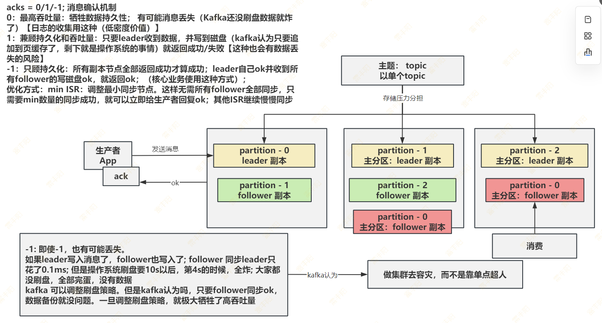

### 分区副本

在 Kafka 0.8.0 之前，Kafka 是没有**副本**的概念的，那时候人们只会用 Kafka 存储一些不重要的数据，因为**没有副本，数据很可能会丢失**。但是随着业务的发展，**支持副本的功能**越来越强烈，所以为了保证数据的可靠性，Kafka 从 0.8.0 版本开始引入了分区副本（详情请参见 KAFKA-50）。也就是说每个分区可以人为的配置几个副本（比如创建主题的时候指定 replication-factor，也可以在 Broker 级别进行配置 default.replication.factor），一般会设置为 3。

**Kafka 可以保证单个分区里的事件是有序的，分区可以在线（可用），也可以离线（不可用）**。**在众多的分区副本里面有一个副本是 Leader，其余的副本是 Follower，所有的读写操作都是经过 Leader 进行的**，**同时 Follower 会定期地去 Leader 上的复制数据。**当 Leader 挂了的时候，其中一个 Follower 会重新成为新的 Leader。通过分区副本，引入了数据冗余，同时也提供了 Kafka 的数据可靠性。

> **Kafka 的分区多副本架构是 Kafka 可靠性保证的核心，把消息写入多个副本可以使 Kafka 在发生崩溃时仍能保证消息的持久性。**

### leader选举

在介绍 Leader 选举之前，让我们先来回顾一下 ISR（in-sync replicas）列表。**每个分区的 Leader 会维护一个 ISR 列表，ISR 列表里面包括 Leader 副本和 Follower 副本的 Broker 编号，只有跟得上 Leader 的 Follower 副本才能加入到 ISR 里面，这个是通过 **`replica.lag.time.max.ms`** 参数配置的**，这个参数的含义是 Follower 副本能够落后 Leader 副本的最长时间间隔，默认值是 10 秒。这就是说，只要一个 Follower 副本落后 Leader 副本的时间不连续超过 10 秒，那么 Kafka 就认为该 Follower 副本与 Leader 是同步的，即使此时 Follower 副本中保存的消息明显少于 Leader 副本中的消息。

我们在前面说过，**Follower 副本唯一的工作就是不断地从 Leader 副本拉取消息，然后写入到自己的****提交日志****中。如果这个同步过程的速度持续慢于 Leader 副本的消息写入速度，那么在 replica.lag.time.max.ms 时间后，此 Follower 副本就会被认为是与 Leader 副本不同步的，****因此不能再放入 ISR 中****。此时，Kafka 会自动收缩 ISR 集合，将该副本“踢出”ISR**。

值得注意的是，倘若该副本后面慢慢地追上了 Leader 的进度，那么它是能够重新被加回 ISR 的。这也表明，ISR 是一个动态调整的集合，而非静态不变的。

所以当 Leader 挂掉了，而且 `unclean.leader.election.enable=false` 的情况下，Kafka 会从 ISR 列表中选择第一个 Follower 作为新的 Leader，因为这个分区拥有最新的已经 committed 的消息。通过这个可以保证已经 committed 的消息的数据可靠性。

## **kafka如何保证消息不丢失**

### **Producer端**

要保证消息不丢失，第一点要做的就是要保证消息从producer端发送到了kafka的broker中，并且broker把消息保存了下来。
由于在发送消息的过程中有可能会发生**网络故障，broker故障**等原因导致消息发送失败，因此在producer端有两种方式来避免消息丢失。

#### **接收发送消息回执**

我们在使用kafka发送消息的时候，通常是使用`producer.send(msg)`方法，但是这个方法其实是一种异步发送，调用此方法发送消息的时候，虽然会立即返回，但是并不代表消息真的发送成功了。
1、**所以可以使用同步发送消息，**`producer.send(msg).get()`**此方法会执行同步发生消息，并等待结果返回**。
2、**也可以使用带回调函数的异步方法，**`producer.send(msg,callback)`**，用回调函数来监听消息的发送结果，如果发送失败了，可以在回调函数里面进行重试。**

#### **producer参数配置**

producer也提供了一些配置参数来避免消息丢失。

```java
// 此配置表示，Leader和Follower全部成功接收消息后才确认收到消息，
// 可以最大限度保证消息不丢失，但是吞吐量会下降
acks = -1 
// producer 发送消息失败后，自动重试次数
retries = 3
// 发送消息失败后的重试时间间隔
retry.backoff.ms = 300
```

### **Broker端**

当消息发送到broker后，broker需要保证此消息不会丢失，我们都知道，kafka是会将消息持久化到磁盘中的。
但是kafka为了保持性能采用了，`页缓存+异步刷盘`<u> </u>的形式将消息持久化到磁盘的。也就是批量定时将消息持久化到磁盘。
**但是页缓存如果还没来的及将消息刷到磁盘，broker就挂了，还是会有消息丢失的风险，因此kafka又提供了partition的**`ISR（同步副本机制）`，即每一个patrtition都会有一个唯一的Leader和一到多个Follower，Leader专门处理一些事务类型的请求，Follower负责同步Leader的数据。当leader挂了后，会重新从Follower中选举出新的Leader，保证消息能够最终持久化。


另外，在producer中的配置参数`acks`,配置不同的值，broker也是会做不同的处理的。

> `acks=0`:表示Producer请求立即返回，不需要等待Leader的任何确认。这种方案有最高的吞吐率，但是不保证消息是否真的发送成功。
> `acks =-1`: 表示分区Leader必须等待消息被成功写入到所有的ISR副本(同步副本)中才认为Producer请求成功。这种方案提供最高的消息持久性保证，但是理论上吞吐率也是最差的。
> `acks=1`: 表示Leader副本必须应答此Producer请求并写入消息到本地日志，之后Producer请求被认为成功。如果此时Leader副本应答请求之后挂掉了，消息会丢失。这个方案，提供了不错的持久性保证和吞吐。

### **Consumer端**

**Consumer端，只要保证消息接收到不胡乱的提交offset就行**，kafka本身也是会记录每个pratition的偏移量，但是为了业务的可靠性，最好在确认消费消息后，提交偏移量；默认是拿到消息，就自动提交偏移量

为了避免消息丢失，建议使用**手动提交偏移量的方式，**防止消息的业务逻辑未处理完，提交偏移量后消费者挂了的问题。

```java
enable.auto.commit=false
```

## **kafka如何保证消息顺序消费**

`顺序发送`** + **`顺序存储`** + **`顺序消费`

### 顺序发送

具体实现顺序发送消息有两种方式：
**1、在使用kafka时，对需要保证顺序消费的topic，只创建一个partition，这样消息就都会顺序的存储到这****一个partition中****，也就能保证顺序消费了。**
**2、当一个topic有多个partition时，对需要保证顺序的消息，都****发到指定的partition即可****，这样也能保证顺序消费。**

### `顺序存储`

Kafka 会按照**消息发送顺序进行顺序存储**；但是一定是单发送者。

多发送者不能保证消息抵达Kafka的顺序

### 顺序消费

在消费端，要保证顺序消费，单线程处理消息即可

## **kafka如何保证消息不重复消费【****幂等性****】**

### **什么情况下会导致消息被重复消费呢？**

1. **生产者**，生产者可能重复推送了一条消息到kafka，例如：某接口未做幂等处理，接口中会发送kafka消息
2. **kafka：**在消费者消费完消息后，提交offset时，kafka突然挂了，导致kafka认为此消息还未消费，又重新推送了该条消息，导致了重复消费消息。
3. **消费者**，在消费者消费完消息后，提交offset时，Consumer突然宕机挂掉，这个时候，kafka未接收到已处理的offset值，当Consumer恢复后，**会重新消费此部分消息**。

========  **所有的都是消费端保证幂等性(消息执行的历史记录表)即可** ========

1. 还有一种情况，Kafka 存在 **Partition ReBalance** 机制，会将多个 Partition 均衡分配给多个消费者。若 **Consumer 在默认 5 分钟内未处理完一批消息**，会触发 Rebalance 机制，导致 offset 自动提交失败，重新 Rebalance 后，消费者会从之前未提交的 offset 位置开始消费，从而造成消息重复消费。（消费者数量变化等也会导致重平衡）

重平衡（有可能是**消费者慢**（假掉线），导致**重平衡，offset没来及提交，kafka会重复投递消息给别的消费者**）

### 如何避免重复消费

其实上面的`1、2、3、4`这些情况都可以用**幂等机制**来防止消息被重复消费。

**为消息生成 一个唯一标识，并保存到 mysql 或 redis 中，处理消息前先到 mysql 或 redis 中判断该消息是否已被消费过**。

但是**第4种**情况，前提是要先优化**消费端处理性能，**`避免触发 Rebalance`**。额外的方案**

例如：

1. `采用异步方式处理消息`
2. `缩短单个消息消费时长`
3. `调整消息处理超时时间`(5min、10min)
4. `减少一次性从 Broker 拉取的数据条数等。`  10000条

> 从0开始做；

## Kafka 集群原理

> **冗余备份、容灾转移**（选新领导顶上去）

### 分区副本机制

> 发送消息原理： 
> 
> 1. **消息 => 序列化 => 计算分区 => 攒批次 ==> 一起发 ==> 收到服务器ack**（看发送者的ack设置要求0/1/-1）


### 数据同步机制

> follower如何同步的数据

#### 基本概念

**AR****（Assigned Replicas）**：**分区中的所有副本统称为AR**。所有消息会先发送到leader副本，然后follower副本才能从leader中拉取消息进行同步。但是在同步期间，**follower对于leader而言会有一定程度的滞后**，这个时候follower和leader并非完全同步状态;  **AR = leader + follower**

**OSR****（Out Sync Replicas）**：follower副本与leader副本没有完全同步或滞后的副本集合

**ISR****（In Sync Replicas）**：AR中的一个子集，ISR中的副本都是与leader保持完全同步的副本，如果某个在ISR中的follower副本落后于leader副本太多，则会被从ISR中移除，否则如果完全同步，会从OSR中移至ISR集合。

在默认情况下，当leader副本发生故障时，只有在ISR集合中的follower副本才有资格被选举为新leader，而OSR中的副本没有机会（可以通过`unclean.leader.election.enable`进行配置）

> leader倒下，需要ISR顶上去

**HW****（High Watermark）**：**高水位**，它标识了一个特定的**消息偏移量（offset）**，消费者只能拉取到这个水位 offset 之前的消息

**LEO****（Log End Offset）**：标识当前日志文件中下一条待写入的消息的offset。在ISR集合中的每个副本都会维护自身的LEO，且`HW==LEO`。

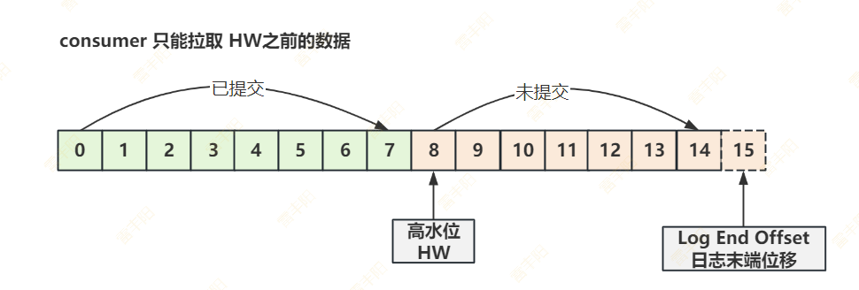

#### ISR、HW、LEO之间的关系

##### 原始状态

> Hw = 3; leo = 3；

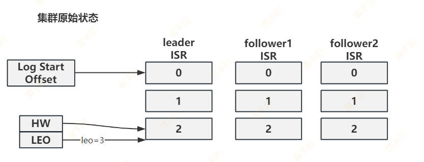

##### 写入消息

> 这个时候写入**两条消息**到leader，这个时候LEO变为5，然后follower开始同步leader数据

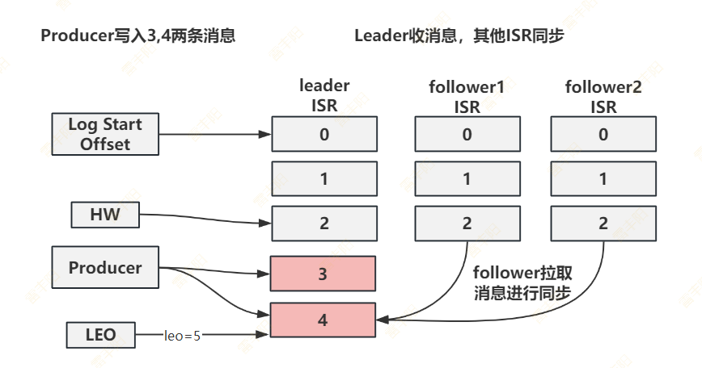

##### 开始同步

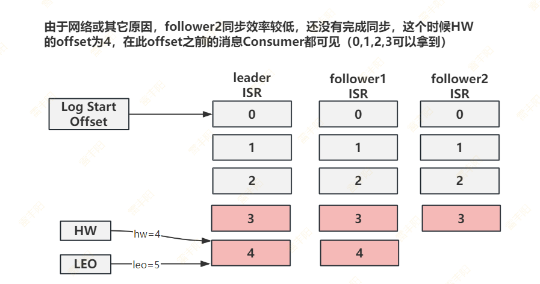

##### 同步完成

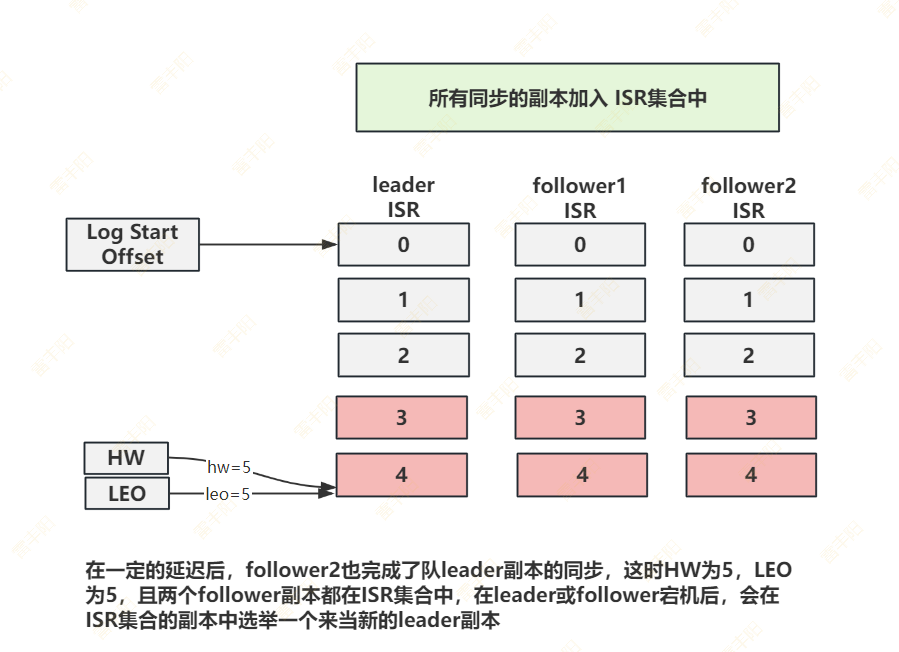

### 事务消息机制（了解）

> Kafka 支持事务的几个隔离级别：
> 
> **read_committed**
> 
> **read_uncommit**

> 事务保证了**一组消息**要么**全部成功发送**，要么**全部失败**，不会出现部分成功的情况；
> 
> > 最终业务认为，即使业务失败数据还是要有。不能当没发生过
> 
> **一般用于订单、支付等场景；(现在的用法，即使这种场景也不用)；**
> 
> **事务 ==> 数据一致性 ==> 最终一致性（反正所有的事情最终处理完，****数据库状态****一致就行）**
> 
> **从 消息发送 到 消息消费。要么全部成功，要么全部失败**

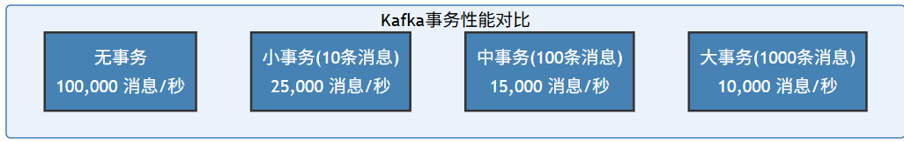

扩展阅读：https://blog.csdn.net/m0_74385041/article/details/151838631