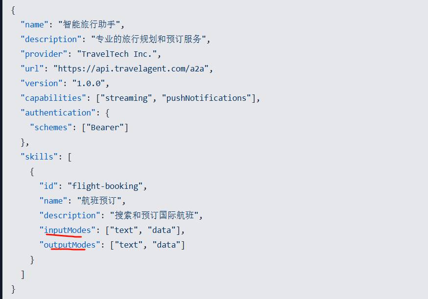
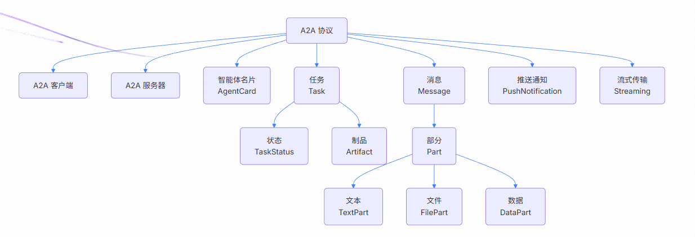
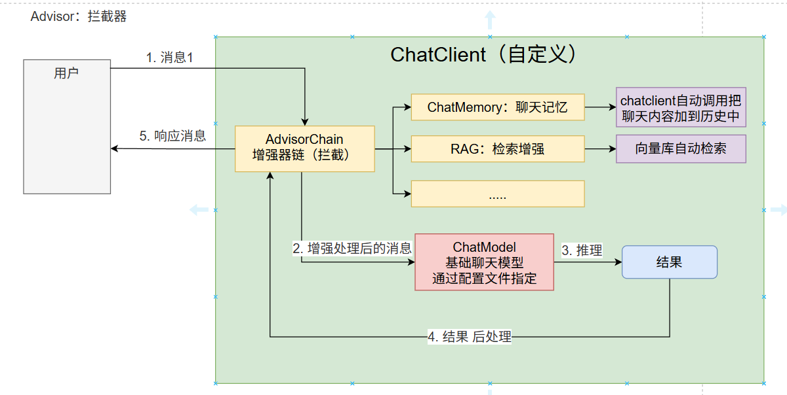
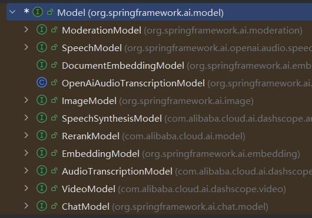
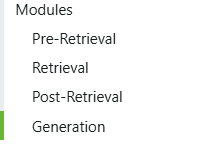
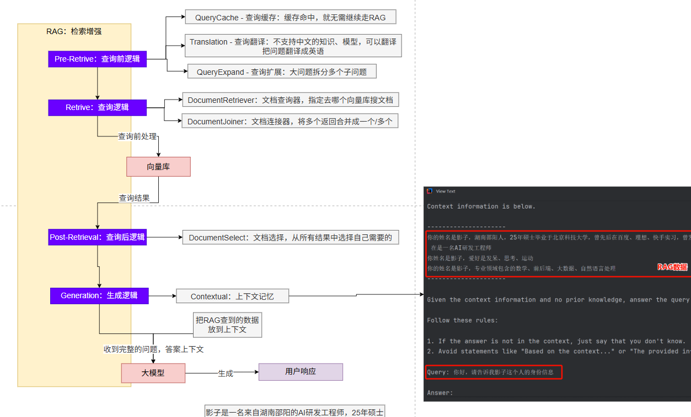
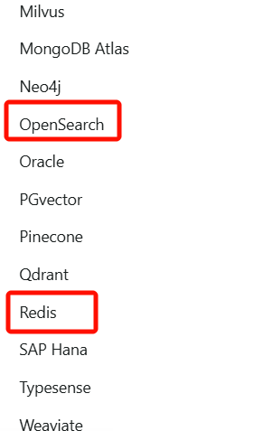
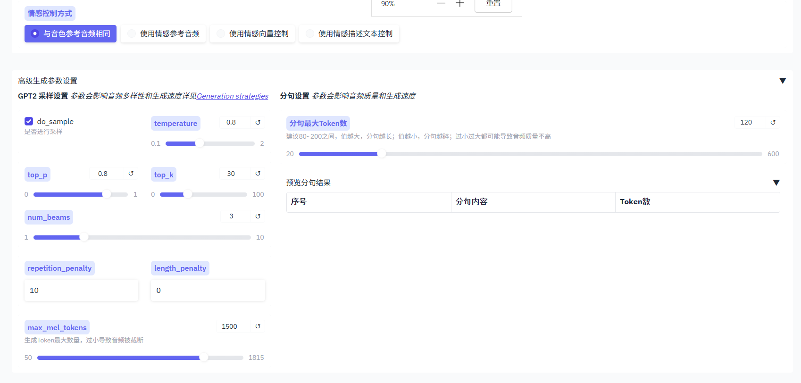
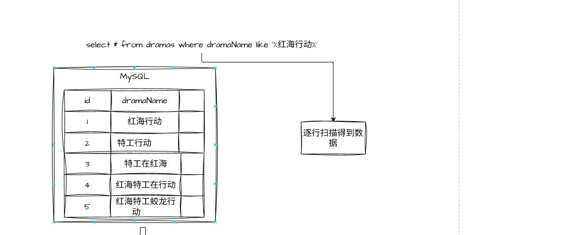
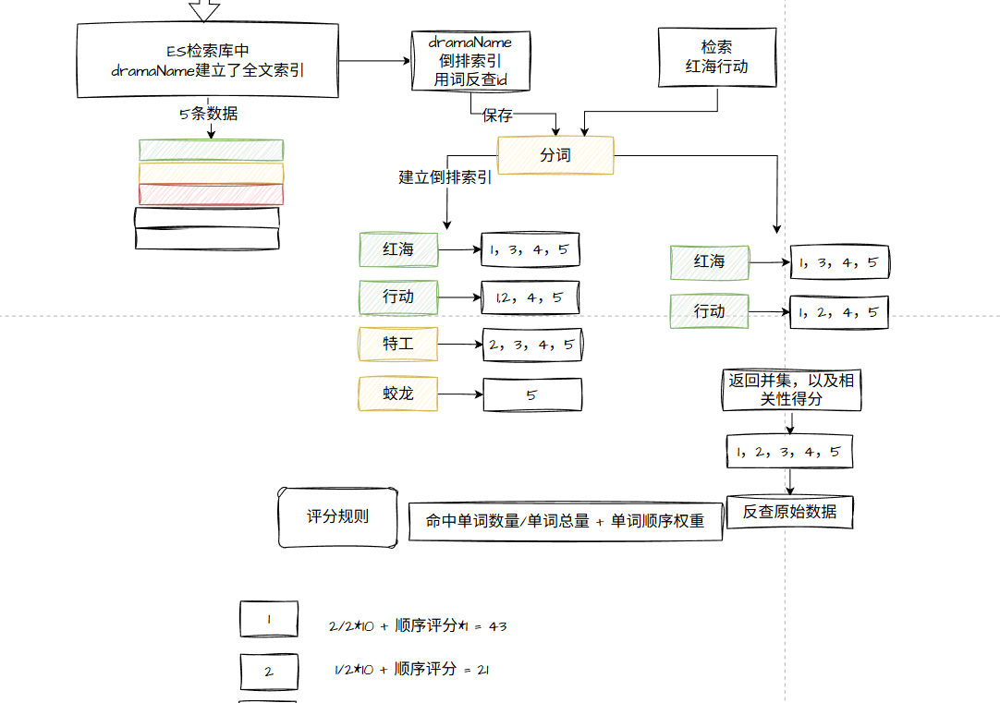

# Java - 企业真题

# 企业真题

## 北京地区

### *捷

> 1.自我介绍
> 
> 2.介绍一下最近的项目
> 
> 3.前公司在哪
> 
> 4.教育经历
> 
> 5.问个人基本情况
> 
> 6.说一下你对单例模式的理解
> 
> 7.怎么实现单例模式，写一个单例
> 
> 8.LinkedList与ArrayList的区别
> 
> 9.抽象类和关键字有什么区别
> 
> 10.juc全拼
> 
> 11.简单说一下jvm内存模型
> 
> 12.jvm内存调优的基本参数
> 
> 13.tomcat的默认端口，redis端口号，
> 
> 14.redis持久化方式
> 
> 15.nacos注册中心的端口号
> 
> 16.拼写一下elasticsearch
> 
> 17.数据库端口号
> 
> 18.介绍一下mysql索引
> 
> 19.docker会吗
> 
> 20.数据库设计的三大范式
> 
> 21.会前端吗
> 
> 22.写文档能力怎么样
> 
> 23.项目周期
> 
> 24.有女朋友吗
> 
> 25.有什么爱好吗
> 
> 26.未来规划

### 点**娱

> 1.自我介绍
> 
> 2.项目介绍,项目中的难题
> 
> 3.Mq在项目中怎么使用的
> 
> 4.介绍集合
> 
> 5.想要用一个安全的map,用什么方式实现
> 
> 6.Jvm的结构             
> 
> 7.垃圾回收的算法有哪些
> 
> 8.默认的垃圾收集器是什么
> 
> 9.介绍Ioc和aop
> 
> 10.SpringBoot start 启动流程
> 
> 11.使用SpringBoot装载Bean有哪几种方式
> 
> 12.Redis 集群
> 
> 13.Redis使用时常见的问题
> 
> 14.知道布谷鸟和布隆的区别吗,使用过布谷鸟吗
> 
> 15.Tcp链接流程
> 
> 16.用过netty框架吗

### 冬*教育

#### 一面

> 1.自我介绍
> 
> 2.索引优化
> 
> 3.数据量很大时如何优化
> 
> 4.子查询如何优化
> 
> 5.为什么使用redis
> 
> 6.canal
> 
> 7.项目亮点
> 
> 8.xxl-job
> 
> 9.aop
> 
> 10.IOC

#### 二面

> 1. 自我介绍
> 2. 项目介绍
> 3. 项目中的难点
> 4. 在项目中哪里用到了AOP，以及对AOP的理解
> 5. 怎么实现动态代理
> 6. 对继承的理解
> 7. 什么是多态
> 8. 什么是分布式锁
> 9. 什么是缓存击穿，为什么选择使用redisson
> 10. 为什么使用Redis存储，
> 11. 如果给一个全新模块，设计表中有哪些必备字段
> 12. 如果给一个项目，没有设计文档，你要怎么去熟悉项目，谈谈你的思路
> 13. 如果有千万级数据插入，怎么处理，什么情况下用到分库分表

### 福*汽车

> 1. 自我介绍
> 2. 介绍一下公司
> 3. 如何进行sql优化
> 4. 设计表需要注意什么(三大范式)
> 5. 如何选择字段的数据类型
> 6. 索引为什么失效,底层逻辑是什么?

### 恒**联

> 1. 自我介绍
> 2. 项目介绍
> 3. Mysql索引，索引优化
> 4. Redis四大问题
> 5. Juc线程 volatile 关键字
> 6. Jvm 运行时数据区，堆和栈的不同，存储数据
> 7. Linux查看端口占用进程
> 8. 分布式事务
> 9. Docker查看容器状态

### 逅*者

> 自我介绍
> 
> 介绍项目，主要负责功能，在开发中遇到什么问题？如何解决的。
> 
> java的基础数据类型                       
> 
> final关键字的作用
> 
> HashTable和HashMap有什么区别
> 
> HashSet实现原理
> 
> ArrayList和LinkedList的区别
> 
> 线程和进程的区别
> 
> 创建线程的方式
> 
> 如何防止线程死锁  
> 
> 线程之间是怎么通信的呢
> 
> sleep和wait有什么区别
> 
> Java中的事务机制有哪些
> 
> SpringBoot常用的注解有哪些
> 
> @Autowired和@Resource有什么区别
> 
> 什么是IOC
> 
> Sql的索引类型有哪些
> 
> Sql优化一般如何去优化呢

### *润

> 1.自我介绍
> 
> 2.介绍下订单模块
> 
> 3.你的第二个项目购物车怎么实现的
> 
> 4.介绍下集合、迭代器是什么
> 
> 5.Iterator可以直接遍历 List 集合吗, 你是用哪些方式遍历的 List 集合的
> 
> 6.项目中哪里用到了哪些集合, 具体使用场景
> 
> 7.HashMap JDK7和8的区别

### 佳*科技

> 1. 自我介绍
> 2. 垃圾回收
> 3. ArrayList和LinkedList区别
> 4. 如何保证线程安全 
> 5. 深拷贝和浅拷贝
> 6. redis的持久化机制
> 7. redis的主从复制和哨兵机制
> 8. java异常处理
> 9. java1.7之后除try-catch-finally之外还有什么方式处理异常
> 10. 如果有一个万人抢票的场景，你会如何设计，说一下思路和技术选型
> 11. 上一家公司什么时候离职的，如果入职什么时候能到公司
> 12. 期望工资是多少

### 凯*威

> 1. 自我介绍
> 2. 项目背景
> 3. 项目负责模块
> 4. 项目中的亮点
> 5. redis的数据类型
> 6. redis中list类型和set类型的区别
> 7. redis中的淘汰策略
> 8. redis中key过期删除策略
> 9. 索引的数据结构
> 10. b+树的特点
> 11. 索引优化
> 12. SpringBoot自动装配原理
> 13. 怎么保证线程安全

### 蓝*源

> 1. 自我介绍
> 2. Springboot核心配置
> 3. 如何防止死锁
> 4. 产生死锁原因
> 5. 索引是什么
> 6. ArrayList和LinkedList区别
> 7. Redisson分布式锁
> 8. 幂等性问题
> 9. Stream API
> 10. RabbitMQ可靠性
> 11. RabbitMQ和Kafka区别
> 12. 商品详情亮点

### 美*外包

#### 一面

> 1. 自我介绍
> 2. 项目中哪些工作点能体现出你的代码或技术能力
> 3. 自定义注解切的是哪个层次
> 4. 自定义注解定义是什么
> 5. AOP 是什么？什么是面向切面编程，通过什么方式实现？
> 6. 动态代理和静态代理的区别
> 7. 登陆模块具体流程
> 8. 为用户赠送余额上锁了吗，如何实现
> 9. 为什么使用 RabbitMQ，有哪些组件
> 10. 为什么使用 MQ 而不用线程池
> 11. 为什么使用 redis，redis 的多路复用是什么
> 12. canal 的机制，如何使用
> 13. 布隆过滤器如何进行分布式部署？

#### 二面

> 1. 自我介绍
> 2. 项目介绍
> 3. 如何创建线程
> 4. Runnable和Callable区别
> 5. 实现Runnable和继承Thread的区别
> 6. 线程池的核心参数 核心线程数如何设置
> 7. 线程池的工作原理
> 8. 事务的特性
> 9. MVCC原理
> 10. 算法题:盛最多水的容器
> 11. seata如何保证最终一致性的
> 12. 保证最终一致性的方案
> 13. AOP 在项目中的应用
> 14. 多个 AOP 是如何执行的
> 15. 写代码: map 转 list
> 16. Spring 事务什么时候会失效
> 17. this 自调用时如何失效的
> 18. 算法题: 有效的括号

### 普**科技

> 1. 自我介绍
> 2. 项目介绍
> 3. SpringBoot自动装配原理
> 4. MySQL事务隔离级别
> 5. Redis缓存四大问题解决方案
> 6. SQL优化与执行计划
> 7. 消息队列对比选型
> 8. 分库分表方案
> 9. 非技术面试问题

### 神*信息

> 1. 自我介绍
> 2. 项目介绍
> 3. xxl-job
> 4. mysql 优化
> 5. Redis aof持久化的rewrite模式
> 6. Canal 数据同步
> 7. Seata AT模式
> 8. 布隆过滤器
> 9. Nacos 集群部署
> 10. 索引失效场景
> 11. RabbitMQ消息模型
> 12. 消息可靠性保障
> 13. LinkedList vs ArrayList
> 14. 联合索引优化
> 15. Redis数据淘汰策略

### 盛*

#### 面试A

> 1. 自我介绍
> 2. 类的生命周期
> 3. 生命周期中的验证是验证什么
> 4. jvm的内存结构
> 5. 程序计数器的功能
> 6. 八大数据类型是什么对应的包装类型是什么
> 7. Java异常的分类
> 8. 编译时期异常和运行时期异常的区别
> 9. 描述常用的集合框架
> 10. arraylist可以存空值吗
> 11. 字节流和字符流读取什么文件
> 12. 线程的状态
> 13. 创建线程的方法
> 14. 项目的技术亮点
> 15. ioc的逻辑，由谁来管理
> 16. aop实现方式
> 17. springcloud用过哪些组件
> 18. gateway和nginx的区别

#### 面试B

> 1. 介绍项目
> 2. Gateway和Nginx的区别
> 3. AOP的原理以及模式
> 4. IOC
> 5. nacos功能
> 6. 项目中的幂等性处理
> 7. 创建线程池的方式
> 8. xxl-job
> 9. openfeign
> 10. 类的声明周期
> 11. int转byte超字节产生的问题
> 12. 异常的分类
> 13. springboot处理异常
> 14. 异常抛到框架如何处理
> 15. 线程创建方式
> 16. 线程生命周期

### 数**舞

> 1. 自我介绍
> 2. 项目介绍
> 3. 如何进行的优化
> 4. 数据不一致的解决方案
> 5. canal的底层原理
> 6. Redis的集群有几种，如何实现的
> 7. aop在项目中的运用
> 8. 策略模式和工厂模式在项目中如何使用的
> 9. 了解函数式编程吗？lamda表达式在项目中的使用
> 10. 为什么选用MongoDB而不选用Redis，Redis能不能做
> 11. 远程调用有哪些
> 12. 微服务如何进行注册的

### 云**财

> 1. 自我介绍
> 2. 上家公司什么时候离职的
> 3. 上家公司你的工资构成
> 4. 上家公司团队构成
> 5. 公寓项目你参与了哪些部分
> 6. 公寓空闲房间数怎么计算的
> 7. 电商项目你参与了哪些
> 8. 简单介绍一下你的电子旋律项目
> 9. mongodb和es都是用在哪些地方，怎么使用的
> 10. ==和equals区别
> 11. 死锁怎么产生的，解决措施是什么
> 12. 期望工资

### 智*达

> 1. 自我介绍
> 2. 项目介绍 
> 3. 三级缓存
> 4. mysql的索引优化
> 5. 用Redis来做什么，缓存击穿问题
> 6. 项目中遇到过什么问题
> 7. 了解过工作流吗
> 8. 登录流程
> 9. 怎么防止一个账号多地登录
> 10. 会前端，前端框架用的vue2还是vue3

### 中**创

> 1. 自我介绍
> 2. 登录
> 3. 分布式锁
> 4. sql优化
> 5. 项目上线
> 6. 离职原因
> 7. 高耦合与低耦合区别
> 8. 为什么redis使用持久化
> 9. 项目部署

### 中*软

> 1. 自我介绍
> 2. 项目做了多久
> 3. 项目上线了没
> 4. redis在项目怎么使用的
> 5. 项目中为什么使用redisson
> 6. docker的部署
> 7. 项目中使用了几台服务器
> 8. xxl-job在项目中如何使用,具体怎么做的
> 9. MySQL在项目使用的什么版本
> 10. 框架与MySQL在项目中做结合,有什么难点
> 11. mongoDB在项目中用来干嘛的
> 12. kafka与rabbitmq的区别
> 13. spring boot与springcloud在项目中怎么结合使用的
> 14. 使用了jmeter如何进行测试
> 15. 总共做了三个项目还是有其他项目
> 16. rabbitmq有什么重要组件
> 17. rabbitmq是怎么使用的
> 18. redis的淘汰机制
> 19. wait与sleep区别
> 20. 创建线程池有几种方式
> 21. 什么是死锁
> 22. 迭代器
> 23. Java中的实例变量与局部变量的区别
> 24. equals与==的区别
> 25. jdk jvm与jre的区别
> 26. hashset与treeset的区别
> 27. 什么是反射
> 28. 字符串有哪些类
> 29. 处理字符串的一些方法

## 西安地区

### 奥*软件

> 1、websocket你了解么
> 
> 2、dockerk8s使用了解情况
> 
> 3、你们的lua脚本在哪里使用了
> 
> 4、你们使用了mysql有没有考虑集群

### 博*

> 1、MySQL索引I-说一下聚簇索引/非聚簇索引
> 
> 2、B树和B+树的区别
> 
> 3、什么情况使用了索引但是无法使用？
> 
> 4、如何SQL优化
> 
> 5、Redis的常用数据结构及使用场景？
> 
> 6、说一下缓存穿透、缓存击穿、缓存雪崩及解决方案？
> 
> 7、什么是布隆过滤器？
> 
> 8、怎么保证消息的有序性？

### 地*智能

> 1、面向对象的特性
> 
> 2、介绍—下hashmap
> 
> 3、springBoo和spring的区别
> 
> 4、怎么保证多线程并发
> 
> 5、分布式事务的实现
> 
> 6、怎么解决缓存击穿
> 
> 7、springboot的自动装配怎么排除一些不需要的jar包
> 
> 8、JVM的内存模型
> 
> 9、冒泡排序

### 法*

> 1、MySQL的联表更新怎么更新，详细说说怎么实现？
> 
> 2、说说事务是什么？
> 
> 3、SpringBoot的常用注解？
> 
> 4、Spring框架中的IOC？依赖注入是什么？
> 
> 5、SpringCloud中的常用组件有哪些？

### 顾*智农

> 1、介绍一下购物商城项目
> 
> 2、抢购机制，十个商品用什么锁合适
> 
> 3、线程池参数
> 
> 4、AOP用来干什么了，问什么不直接用springmvc的拦截器或过滤器，aop怎么实现
> 
> 5、用过spring cloud的那些组件
> 
> 6、sql优化问题

### 汉*

> 1、SQL优化？
> 
> 2、描述一个你负责的项目模块
> 
> 3、程序结构和JVM方面的调优？
> 
> 4、数据库用了哪些？
> 
> 5、redis在项目中的的使用场景？
> 
> 6、你在项目中有没有遇到哪些问题？优化？
> 
> 7、springcloud的核心组件
> 
> 8、项目中高并发的场景有哪些？
> 
> 9、redis分布式锁的使用场景？
> 
> 10、feign调用的时候会有什么问题？
> 
> 11、MySQL主从了解吗？讲讲你的理解？
> 
> 12、k8s了解吗？
> 
> 13、常用的docker命令？

### 华*软

> 1.离职原因
> 
> 2.为什么要使用redis
> 
> 3.redis中有哪些库
> 
> 4.为什么要用elasticSearch
> 
> 5.怎么用的mongodb
> 
> 6.Mybatis中的分页查询怎么实现的
> 
> 7.数据库多表联查查询到千条数据，怎么在service层代码实现使前端能够展现出数据
> 
> 8.了解xxljob吗，怎么用的
> 
> 9.Minio是搭在什么服务器上的
> 
> 10.使用Minio前端点击页面选择上传文件，在后端代码具体怎么实现
> 
> 11.介绍一下登记模块
> 
> 12.为什么要使用AOP，是自己封装的吗，如何封装？
> 
> 13.为什么要用到消息队列，了解RabbitMQ吗
> 
> 14.为什么用kafka,里面的消息模型是什么，订阅者发布者都是干啥的
> 
> 15.#{}和${}的区别是什么？
> 
> 16.能熟练使用vue吗？介绍一下父子传参，父给子子给父怎么传
> 
> 17.Mounted是干啥的，计算属性是啥
> 
> 18.期望薪资

### 金**智

> 1、mybatis的SQL传参(${}和#{})
> 
> 2、如何避免表单重复提交
> 
> 3、JSON的序列化库、fastJson
> 
> 4、程序锁了解吗？(线程锁+底层原理)
> 
> 5、定义字符串有几种方式（String、StringBuilder、StringBuffer）
> 
> 6、直接String复制和newString再赋值是否一样
> 
> 7、MySQL会到什么程度。(主要是优化)
> 
> 8、表里字段多，索引多好还是索引少好？索引多会怎么样？
> 
> 9、异常处理有几种方式？(trythrows+自定义处理异常机制)
> 
> 10、项目部署会吗？docker
> 
> 11、前端会吗?Element ECharts

### 京*物流

> 1、JVM内存模型？请重点介绍一下堆的内存模型以及对应的调优策略；
> 
> 2、SpringIOC两种容器介绍一下？
> 
> 3、AOP介绍一下，它的底层原理？
> 
> 4、bean的生命周期？你利用bean的生命周期实现过什么功能？
> 
> 5、Hashmap的数据结构？jdk1.8之前和之后的区别？CucrrentHashmap线程安全如何实现的？1.8之前和之后的区别？
> 
> 6、RabbitMQ消息可靠投递和避免重复消费如何保证？高并发场景的应对（答：上集群，又问MQ集群出现了单节点岩机消息如何处理）？
> 
> 7、ES索引库保存数据的过程（底层实现）？ES索引库分片的概念？分片的类型、分配机制等？
> 
> 8、Mysql出现了慢查询日志你的处理方式？
> 
> 9、对于动态SQL你的优化思路？
> 
> 10、MySQL分库分表介绍一下？如何确定数据的位置？
> 
> 11、MySQL集群从节点与主节点数据同步的延迟会造成的问题？你如何解决？
> 
> 12、说说高并发场景下的优化思路。

### 科**飞

> 1.详细描述一下你是如何设计和实现这个登录功能的？
> 
> 2.你们是如何利用AOP实现登录拦截的？
> 
> 3.如果接口报错，你们服务内部是如何处理这种异常的？是否转换成标准格式返回给前端？
> 
> 4.OpenFeign的底层是用什么实现的？底层是如何实现远程调用的？
> 
> 5.在微服务架构中，如何实现服务间远程调用？
> 
> 6.你们使用Redis缓存数据以减轻数据库压力，主要存放在Redis中的数据有哪些？
> 
> 7.在Redis中，你们通常使用哪种数据结构较多？其具体实现是怎样的？
> 
> 8.Redis的底层数据结构是否会根据数据量变化而改变？
> 
> 9.AOF和RDB持久化方式各自的优缺点是什么？
> 
> 10.混合持久化的原理是什么，如何实现结合两者优点的混合持久化？
> 
> 11.AOF记录命令的日志文件过大时，是否有更换或优化方案？
> 
> 12.布隆过滤器的工作原理是什么，以及其优缺点是什么？
> 
> 13.在项目中如何使用布隆过滤器以优化数据库查询性能？
> 
> 14.项目用布隆过滤器的时候是怎么使用的？
> 
> 15.项目部署过程中的具体步骤和运维管理情况如何？
> 
> 16.开发环境的具体配置和镜像构建过程是怎样的？
> 
> 17.在项目中使用的设计模式是什么，它的核心思想是什么？项目中数据库设计和数据表添加、优化的主要依据是什么？
> 
> 18.策略模式的主要组成部分有哪些？你们在项目中如何具体应用策略模式的？
> 
> 19.你们项目中如何使用模板方法？
> 
> 20.数据库主从同步配置及如何实现指定库的同步控制？
> 
> 21.在MySQL中，如何配置只同步部分数据库，而不是全部？
> 
> 22.对于前端和后端都在一个服务器上的情况，你们是如何通过Nginx进行请求区分和配置的？
> 
> 23.动静分离功能如何判断并处理前端和后端请求？运维团队在服务器配置方面具体是如何操作的？
> 
> 24.哈希里面的它底层是用什么实现的？你了解不？
> 
> 25.你们镜像打包是用的什么？docker里面那个网络模式你了解吗
> 
> 26.讲下你在项目里面用的这个设计模式吧
> 
> 27.然后你说在我们在做一个新项目开发的时候，数据表的一些设计，还有自动索引的一些添加风险的话，这块事情的话你是怎么去考虑的，是根据什么去做？
> 
> 28.加索引的话，一般你会考虑哪些？

### 科*

#### 一面

> 1. (主要是小程序，单体架构，要求写代码快一个前端一个后端一个项目)
> 2. 线下：介绍你的项目
> 3. 你们使用的mongodb和mysql原因
> 4. 小程序的登录是怎么实现的
> 5. 你们使用过mybatisplus么你个人使用情况能够熟练使用吗
> 6. 你有独立的完成过一个项目么
> 7. 你们使用xxljob在哪里使用了(vip更新，排行榜的更新)
> 8. 使用其他的springtask之类的在分布式架构有什么问题
> 9. 有没使用过swaggerswagger的给方法的参数设置指定值用的什么
> 10. 给实体类对象的属性上使用的注解
> 11. 你的期望薪资

#### 二面

> 1、sql索引优化，什么时候会导致索引失效
> 
> 2、steam流的用法，一些api
> 
> 3、mp的条件查询的拼接
> 
> 4、乐观锁思想(就是在请求进来的时候对一个数据进行自增，提交的时候判断版本号是否一致)
> 
> 5、spring事务（事务失效也说了）
> 
> 6、为什么使用MongoDB，存储的声音是什么格式
> 
> 7、了解mybatis plus吗？问题：现有六个年级，查询一年级，二年级的学生，六年级年龄小于10岁的学生（用querywapper)
> 
> 8、购物车模块数据库涉及了哪些表？有做后台管理系统吗？是动态的还是？
> 
> 9、开发过小程序吗？开发流程
> 
> 10、悲观锁，乐观锁，具体怎么使用实现？

### 软**力

#### 面试一

> 1、常用集合
> 
> 2、线程池创建
> 
> 3、GC流程
> 
> 4、CAP理论
> 
> 5、redis集群采用的是CAP中的哪种模式？
> 
> 6、JVM垃圾回收机制
> 
> 7.==和Equals区别？
> 
> 8.ArrayList与LinkedList区别?
> 
> 9.HashMap与TreeMap区别?
> 
> 10.对集合的理解？
> 
> 11.Stream流常用哪些？终端操作是什么？
> 
> 12.Sql优化？
> 
> 13.线程池的创建方法？
> 
> 14.线程池的核心线程数怎么确定？

#### 面试二

> 1、介绍一下java集合？
> 
> 2、map集合如何在多线程下保证安全？
> 
> 3、List去重？
> 
> 4、Spring事务的失效场景？
> 
> 5、事务的底层原理？AOP的底层原理？
> 
> 6、事务的传播行为？(默认传播行为）
> 
> 7、Redisson在项目中如何实现分布式锁？
> 
> 8、线程池的参数和运行流程？
> 
> 9、责任链设计模式在目中如何实现有序性？

#### 面试三

> 项目契合度不是很高，我就直接问了？你是几年开发经验？
> 
> 1、ArrayList遍历过程中可以删除数据嘛？为什么？
> 
> 2、8之后HashMap进行了哪些升级？为什么要这样升级？
> 
> 3、Stream流使用过吗？转换map要怎么使用？传入几个参数？key冲突了怎么办？
> 
> 4、8之后的新特性有哪些？说一下怎么用的？
> 
> 5、侵略编程有没有经验？你有写过侵略编程嘛？
> 
> 6、索引失效有哪些场景？
> 
> 7、SQL优化有经验嘛？怎么写的？
> 
> 8、多线程有用过嘛？自定义一个线程池咋自定义的？阻塞队列用的啥？
> 
> 9、Linux命令有啥？查找用啥命令？
> 
> 10、你还有啥要问我的嘛？
> 
> 11、Java中的集合体系（底层原理、初始化、扩容机制等）
> 
> 12、MySQL调优策略（常见的索引I失效）
> 
> 13、项目介绍 (和公司项目的契合度，介绍简历中的项目时多向面试公司项目过渡)
> 
> 14、如何看待加班？(抗压能力)
> 
> 15、接受新技术的能力如何？(学习能力)

#### 面试四

> 1、MySQL数据库优化？SQL优化？
> 
> 2、索引失效？问实际场景
> 
> 3、怎么鉴权的？
> 
> 4、redis怎么保证数据不丢失/失效的？持久化？
> 
> 5、微服务之间用什么进行接口调用？
> 
> 6、分布式事务的场景题 (忘记怎么问的了)

### 神*信息

> 1、springboot自动装配
> 
> 2、常用的springcloud组件
> 
> 3、sentinel你们用的是限流还是熔断？熔断具体你们是怎么实现的？
> 
> 4、有做过限流嘛？
> 
> 5、分布式锁是怎么实现限流的？
> 
> 6、nacos注册中心的流程？
> 
> 7、有用过阿波罗嘛？
> 
> 8、springcloud服务之间的通信方式？
> 
> 9、openfeign调用第一次会很慢的原因？
> 
> 10、做过数据库国产化迁移？
> 
> 11、mysql里面的char和varchar?
> 
> 12、做过哪些sql优化嘛？
> 
> 13、事务失效的场景？
> 
> 14、mybatisplus用过嘛？和mybatis有什么区别？
> 
> 15、#{}、${}有什么区别？
> 
> 16、双亲委派机制说一下？
> 
> 17、jvm的垃圾回收器有哪些？
> 
> 18、youngGC和fullGC什么时候触发？
> 
> 19、说几个常用Linux命令？

### 数**力

> 1、你们商品是否有库存的限制？
> 
> 2、你们是使用Redis是分布式的还是单机的？
> 
> 3、开发的过程中你们是否做过压力测试吗？
> 
> 4、ES主要查询那部分数据的？
> 
> 5、怎么解决ES中的数据和数据库中的数据不一致的问题？
> 
> 6、怎么使用cancel解决这个问题的？
> 
> 7、在java里面如何保证多个线程的数据的一致性？都有哪些方法？你了解哪些？
> 
> 8、原子类和显式锁你们有用过吧？具体讲一下你们是怎么使用的？
> 
> 9、有那几种常见的垃圾回收算法你能描述一下嘛？
> 
> 10、标记清除和标记整理他们都有什么区别？
> 
> 11、讲一下你在项目中使用的哪些设计模式？他是做了什么功能？
> 
> 13、你平时有没有参与过数据库的独立设计？那你在设计的时候怎么考虑和实现这个事务的acid特性的？
> 
> 14、设计数据库的时候怎么确保数据的一致性了？
> 
> 15、在设计表的时候你们会设计外键和唯一索引嘛？
> 
> 16、你有优化一个复杂的sql语句嘛？说一下详细的优化过程？
> 
> 17、你们一般是怎么排查线上问题的？除了通过MYSQL慢查询日志功能你们还可以通过什么方式排查了？
> 
> 18、不同微服务之间是如何进行通讯的？
> 
> 19、你们是如何保证rabbitMQ消息没有送达和消息重复消费的？
> 
> 20、java中的泛型你们有使用到过嘛？那你说一下泛型的作用？泛型的功能？
> 
> 21、抽象类你们有用过嘛？是业务那一块使用过？
> 
> 22、多线程中wait()和sleep()的区别?
> 
> 23、缓存雪崩你是如何解决的？
> 
> 24、除了设计一个随机过期时间，还有哪些方法嘛，你能讲一下嘛？
> 
> 25、spring中的常用注解都有哪些你能讲一下嘛？
> 
> 26、@Autowired和@Resource 有什么区别？
> 
> 27、@SpringBootApplication这个注解，它就相当于那三个注解？
> 
> 28、平时有没有用过Liunx中的命令？
> 
> 29、top命令的作用？

### 顺*同城

> 1.重点介绍一下你做过的一个亮点项目，挑一部分说一下？
> 
> 2.一个人连续点击了两次，产生了两次请求，你有多少种办法来保证这个钱不扣两次？
> 
> 3.什么是乐观锁和悲观锁？
> 
> 4.假设现在有同一个商品两条扣钱的请求都到了数据库，你怎么与处理实现，要不要开事务，要用几条sql？
> 
> 5.Redis的setnx命令是悲观锁还是乐观锁？
> 
> 6.Java里面有哪些保证线程安全的机制？
> 
> 7.算法刷题刷的多吗，数据结构与算法了不了解？
> 
> 8.现在有一个数组是无序的，在数组里面找第十大的数，应该怎么着？有几种方式，复杂度是多少？排序是最慢的一种方式。简单地方法也都可以说一说。
> 
> 9.听说过堆排序吗？大顶堆小顶堆？
> 
> 10.Java里面的PriorityQueue听说过吗？
> 
> 11.HashMap底层的数据结构？为什么要转成红黑树？
> 
> 12.Redis的持久化机制了解吗？有哪些？有深入了解吗？比如说RDB是怎么做的？快照是怎么形成的？
> 
> 13.假设AOF开启，能保证一定不丢数据吗？
> 
> 14.了解过zookeeper吗？zookeeper的分布式锁和redis的分布式锁有什么区别？那个更快？
> 
> 15.Explain用过吗？有一个type链，里面有哪些值你记得吗？Re和index的区别是什么？
> 
> 16.Mysql有哪些场景会导致索引失效？
> 
> 17.场景题，给两条sql语句，判断索引用到了哪些？
> 
> 18.什么事索引覆盖?
> 
> 19.知道索引下推吗？
> 
> 20.你们用nginx来做什么？了解正向代理和反向代理吗？常见的正向代理、反向代理能举几个例子吗？
> 
> 21.Linux用的多吗？用过哪些命令？其他的有吗稍微多一点，看内存分部啥的？

### 索*

> 1、String 和 StringBuffer有什么区别？
> 
> 2、接口和抽象类的区别？
> 
> 3、什么是cookie？session和cookie有什么区别？
> 
> 4、sendRedirec和forward方法有什么区别？
> 
> 5、解释下MVC?
> 
> 6、解下kafka?
> 
> 7、Redis有哪些存储类型？
> 
> 8、解释下Redishash类型的原理？
> 
> 9、lis和map在项目那些地方用了？
> 
> 10、数组和list区别?
> 
> 11、想不起来了

### 拓*信创

#### 面试一

> 1、添加数据会对索引造成影响吗
> 
> 2、在项目中你认为有技术深度的点
> 
> 3、布隆过滤器的使用，保证了什么
> 
> 4、布隆过滤器不能删除，怎么解决
> 
> 5、延时队列用的什么实现的，了解其实现原理吗
> 
> 6、除了kafka你还会什么其他的消息处理工具
> 
> 7、介绍seata的使用
> 
> 8、卖多了怎么解决的
> 
> 9、mysql有哪些锁，什么情况下使用
> 
> 10、spring自动注入@autowire和@resource有什么区别
> 
> 11、项目中遇到哪些难点，怎么解决
> 
> 12、#{}和${}有什么区别
> 
> 13、怎么进行索引优化，你怎么操作的，还有一个项目怎么配置什么环境(没听懂)
> 
> 14、怎么看加班

#### 面试二

> 1、值传递和引用传递的区别？
> 
> 2、list和set集合的区别？
> 
> 3、arrayLis和LinkedList的区别？
> 
> 4、MySQL单表最多可以建立多少索引？
> 
> 5、SQL优化？
> 
> 6、线程池的创建方法？线程池的拒绝策略？
> 
> 7、Redis的优化？
> 
> 8、String、stringbuilder和stringbuffer的区别？

### 天*

#### 面试一

> 1.全局异常处理
> 
> 2.restFul风格
> 
> 3.接口幂等性
> 
> 4.Https
> 
> 5.怎么防止接口篡改
> 
> 6.SpringBoot常用的注解
> 
> 7.异常都有哪些

#### 面试二

> 1介绍项目，登陆模块
> 
> 2为啥不用网关过滤器呢，那个不是更方便吗
> 
> 3为啥用token呢，用cookie和session也可以达到效果啊
> 
> 4.穿行优化并行，异步
> 
> 5.专辑详情为啥不用es查询呢
> 
> 6.声音
> 
> 7.设计模式，策略，具体怎么做的，前后端咋处理，有点像工厂模式呀
> 
> 8.Seata咋实现的，AT具体tctmrm咋传输数据的
> 
> 9.为啥用xxljob做定时任务，直接写代码里不是更方便吗
> 
> 10.四张表，数据量多少不一，咋样查询快
> 
> 11.布隆过滤器大小咋设置
> 
> 12redission分布式锁，
> 
> 锁有限流的作用吗，你是具体是怎么做的
> 
> 13.spring有几种方式把实现类，注入到ioc容器里
> 
> 14项目用户量多大
> 
> 15.数据库索引，聚簇索引，非聚簇索引类型有哪几种
> 
> 16用组合索引引有那些需要注意的
> 
> 17期望薪资多少

### 万*

> 1、Nacos是干什么的
> 
> 2、Gateway是干什么的
> 
> 3、熔断保护用过没
> 
> 4、Nginx是用来干什么的
> 
> 5、轮询策略
> 
> 6、redis你都用来干什么
> 
> 7、docker指令
> 
> 8、linux指令
> 
> 9、安全问题，例如sql注入
> 
> 10、索引优化
> 
> 11、sql优化
> 
> 12、Ddos攻击
> 
> 13、xss攻击
> 
> 14、垃圾回收机制(问我的是如何判断是一个垃圾)

### 网*

> 1、登录模块怎么展示的
> 
> 2、登录有用到jw吗？优势
> 
> 3、MongoDB在哪有使用？
> 
> 4、ES在哪里引用？
> 
> 5、管理员什么表？哪些数据？
> 
> 6、Mysql到es怎么操作的？
> 
> 7、Seata介绍下？
> 
> 8、项目中Kafka在哪使用的？-消费者生产者是谁？
> 
> 9、Redis有哪些使用场景？Redis存哪些数据?Redis数据怎么保证和数据库一致?
> 
> 10、Canal保证了哪些数据的一致性？只用了一次吗？
> 
> 11、线程池的应用场景？解决什么问题？
> 
> 12、自己开发过整体模块吗？
> 
> 13、1000w条数据怎么快速入库？用什么mysql/es还是什么？

### 亦*

> 1.创建订单中的金额数据，是怎么传递的？是前端传递的还是通过后端自己取的？
> 
> 2.在创建订单的时候，会有大量的请求来提高系统的吞吐量，你们是通过什么手段解决的？(高并发)
> 
> 3.订单模块你们是怎么设计的？订单模块都有多少表？表中的核字段都哪些？交易号是怎么生成的？
> 
> 4.springcloud和springcloudalibaba都有什么区别？springcloudalibaba里面通过哪些组件来替换springcloud里面的原始组件？
> 
> 5.springcloud里面的熔断你能简单介绍一下嘛？
> 
> 6.springboot启动类上的核心注解你能简单介绍一下嘛？
> 
> 7.如何获取配置文件（yaml）中的信息，在代码中如何去使用？
> 
> 8.springboot来接受参数，无论是get还是post，那接收参数可以用那几种注解？
> 
> 9.java的io流，按类型和功能都有哪些区分？
> 
> 10.抽象类可不可以用final来进行修饰？
> 
> 11.hashMap和hashTable那个是线程安全的？那个可以进行存储key和value都null的？
> 
> 12.你们有没有了解过socket的相关机制？比如在实现的模拟中，会涉及到一些socket的定义？
> 
> 13.抽象类和接口的本质区别是什么？
> 
> 14.select*from表明whereidin（子查询）这个SQL语句如何优化？
> 
> 15.感觉代码写的不太好，需要进行优化，你会从那几个方面进行优化？
> 
> 16.介绍一下乐观锁和悲观锁有什么区别嘛？
> 
> 17.MYSQL和mangoDB有什么区别？

### 赢*胜

> 1、nacos当注册中心存放什么
> 
> 2、gateway和openfeign怎么使用
> 
> 3、工厂模式的原理
> 
> 4、单例懒汉式怎么保证安全性
> 
> 5、介绍seata的流程
> 
> 6、了解seata的TCC和saga吗
> 
> 7、两种动态代理的区别
> 
> 8、mybatis #{}和${}的区别

### 宇*

> 1、自我介绍
> 
> 2、springcloud核心组件？
> 
> 3、MySQL事务、说下SQL优化吧？
> 
> 4、锁？

### 云*

> 1.vue的生命周期
> 
> 2.父子传参
> 
> 3.spring的事务注解
> 
> 4.spring事务什么情况下失效
> 
> 其实重点是机试，让用若依框架实现增删改查，在使用Echarts做个饼状图

### 智**景

> 1、介绍一个项目
> 
> 2、为什么适使用Seata
> 
> 3、使用xxljob干什么了
> 
> 4、知道怎么保活吗？(进程被杀死后声音仍在后台播放)
> 
> 5、怎么部署项目
> 
> 6、解释下vue兄弟传参

### 邮*器材

> 1、、==和equals区别
> 
> 2、int类型的数据使用哪个进行比较
> 
> 3、项目中的异常处理机制
> 
> 4、线程状态有哪些
> 
> 5、项目中使用线程池的场景
> 
> 6、jvm调优
> 
> 7、MySQL调优
> 
> 8、MySQL事务的处理方式（隔离级别)
> 
> 9、假如说一个查询页面，有个数据查询慢的问题，你是考虑从SQL层面还是代码层面做优化？MySQL一到百万级别的话，特别影响查询效率，遇到这种情况，你是怎么用？
> 
> 10、Redis的两种快照方式(持久化机制)
> 
> 11、缓存穿透、击穿、雪崩这些问题，你是怎么处理的？
> 
> 12、说下spring的IOC和AOP
> 
> 13、项目中用到的多态
> 
> 14、设计模式
> 
> 15、代码的版本是怎么确定的？就是代码的迭代版本
> 
> 16、用到的项目管理工具
> 
> 17、测试那边测到bug是怎么传给你的

### 中*国际

#### 面试一

> 场景题
> 
> 1.项目并发量多少？
> 
> 2.项目上线做什么准备？
> 
> 3.出现bug和测试是怎么交流的？是怎么改的
> 
> 4.项目部署做过吗？
> 
> 5.项目中告警模块有哪些数据？
> 
> 面试题：
> 
> 1.kafka消息重复消息堆积怎么处理？
> 
> 2.Mysql的隔离级别是什么？
> 
> 3.高并发场景怎么处理？

#### 面试二

> 1、自我介绍
> 
> 2、项目介绍
> 
> 3、项目模块挑一个介绍
> 
> 4、项目中有遇到哪些问题，及优化点？
> 
> 5、Java中final?
> 
> 6、==和equals使用场景？
> 
> 7、数据库用一些数据库优化？
> 
> 8、sql优化
> 
> 9、平时有使用到哪些Java集合类？

#### 面试三

> 1、假如我现在给你一个需求，你是如何开展工作？
> 
> 2、比如说文件上传考虑什么点，上传一个大文件
> 
> 3、引进一个技术需要考虑什么,你的学习能力怎么样？
> 
> 4、JAVA缓存有哪些技术
> 
> 5、JAVA开源管理相关的要求
> 
> 6、分析类大数据的组件
> 
> 7、讲一个项目中的性能问题，难点，怎么解决的
> 
> 8、MySQL调优
> 
> 9、生产中怎么定位问题的
> 
> 10、华为加班情况怎么看

### 中*通

> 1、Java的三大特性
> 
> 2、==与equals
> 
> 3、IO流有哪几种，简单介绍
> 
> 4、深拷贝、浅拷贝的区别
> 
> 5、锁分为哪些
> 
> 6、Redis缓存和穿透、击穿、雪崩
> 
> 7、MySQL的优化
> 
> 8、500W+条数据统计，总量、昨日总量、今日总量（实时同步）展示到数据大屏，怎么实现查询
> 
> 9、独立部署项目
> 
> 10、BIO和NIO的区别
> 
> 11、Mongodb支持事务吗

# AI 面试题

RAG：https://datawhalechina.github.io/all-in-rag/#/chapter1/01_RAG_intro

## 大模型一般都能做哪些事情？你知道的常见大模型

> 一般大模型的四分类（多模态、计算机视觉、自然语言处理、音频处理）
> 
> 项目中用到 bert 的情感分类模型；
> 
> 还知道用哪些模型；
> 
> > 那怎么说AI审核流程，直接说bert模型替代了llama3在ollama里面的应用吗？
> 
> 1. AI审核 第一次用的是提示词模板 + Qwen 结构化返回一个要求的json，（0,1）
> 2. AI审核 后来 引入bert的专业情感分类模型。我主要写了Python加载bert模型进行推理的API

## 提示词是做什么用的？提示词模板和提示词有什么区别？

> 提示词就给AI模型发送的问题。
> 
> 提示词模板就是预设好的问题模板；给AI预设规则。比如：可以每次用户请求AI的时候，提示词模板可以预置角色扮演内容。让AI知道要回答什么方面的问题
> 
> **RAG应用中**，从向量中利用相似度检索到的数据。会填充到RAG提示词模板中。一起发给AI，让AI整理这次回答哪里；
> 
> RAG 优化：
> 
> 1. RAG提示词写好。 AI 按照要求输出输入或者调用工具等；

## 大模型中的token指的是什么？一个单词就是一个token吗？

token一般是单词分词后的单元。一个单词大约0.75个token。

token大模型用来计费。

> 大模型计费：用户发送的问题是多少token。大模型的回答答案记录token。请求上下文；
> 
> 如果是大模型敲代码，可能携带整个工程作为上下文。浪费token。
> 
> 优化：**精确写好提示词**。

## 结构化输出是什么

> 大模型输出文本（LLM），把文本转为对象或者json；

## 大模型怎么去学习我们额外的数据

> 1. 微调： 给数据集训练大模型（模型幻觉）
> 2. RAG（提示词填充）： 把额外数据保存到向量库，大模型回答之前搜索向量库。把答案交给大模型
> 3. Tool Calling（工具调用）：让大模型利用网络搜索工具、爬虫工具、数据库连接工具等获取数据

## RAG是什么，主要流程？（Spring AI 的 advisor 中有RAG功能的 advisor ）

> 1. **ETL流程**：从数据的 Extract（抽取）、到数据的 Transform 转换、到数据的 Load 保存；把数据存到向量库
>   1. **Embeding**（嵌入）：把文本数据转为向量，存进去
>   2. **Chunk**（分块）：大文档分成很多chunk块。每一块都是一个document。
>     1. https://datawhalechina.github.io/all-in-rag/#/chapter1/01_RAG_intro
>     2. 块太大了： 导致检索会携带出一些不太相关的数据。
>     3. 块太小了：导致数据产生不相关。检索精度就不高了。
> 2. **向量检索**： 大模型回答之前，先利用RAG工具进行检索。把结果提示词模板填充好后给大模型；
> 3. 大模型回答：

## Tool Calling 是什么。怎么做到。和MCP有啥区别

> 工具调用（自己工程的大模型调用自己工程中的工具）。大模型可以利用工具获取到一些数据，或者做一些事情；
> 
> 如何编码：  
> 
> 1. 给方法 标注  @Tool 
> 2. 大模型在查询之前，发现需要用到工具，就会自动调用

写一个 工具

```typescript
class DateTimeTools {

    @Tool(description = "Get the current date and time in the user's timezone")
    String getCurrentDateTime() {
        return LocalDateTime.now().atZone(LocaleContextHolder.getTimeZone().toZoneId()).toString();
    }

    @Tool(description = "Set a user alarm for the given time, provided in ISO-8601 format")
    void setAlarm(String time) {
        LocalDateTime alarmTime = LocalDateTime.parse(time, DateTimeFormatter.ISO_DATE_TIME);
        System.out.println("Alarm set for " + alarmTime);
    }

}
```

聊天的时候启用工具

```python
ChatModel chatModel = ...

String response = ChatClient.create(chatModel)
        .prompt("Can you set an alarm 10 minutes from now?")
        .tools(new DateTimeTools())
        .call()
        .content();

System.out.println(response);
```

## MCP：模型上下文协议

> 1. 所有的工具可以集中到一个地方。就是 MCP 服务器；

> 1. 每一种应用或者大模型就是 MCP client。他们之前一般利用 sse 这种web方式进行交互；

## MCP怎么做的？协议流程是什么

> 1. Spring AI 集成了 MCP 服务器。在MCP服务器中写一堆工具并进行注册；（MCP服务器集成了所有工具）
> 2. 应用引入 MCP client 依赖，配置MCP服务器的地址。 大模型在调用之前，会先从MCP服务器获取到能用的所有工具，然后看用哪个工具，再发送工具调用请求。调用的结果MCP服务器会返回给大模型
> 
> 
> 总结简单几步
> 
> 1. 客户端初始化sse连接
> 2. 客户端获取所有工具（tool/list）
> 3. 客户端发起工具调用（tool/call）、参入参数（工具方法名、参数列表等）
> 4. 客户端接收工具调用返回

> 每日答疑中 MCP 协议的流程；

## A2A协议和MCP协议

https://a2aprotocol.ai/blog/2025-full-guide-a2a-protocol-zh#a2a%E4%B8%8Emcp%E5%8D%8F%E8%AE%AE%E5%AF%B9%E6%AF%94

https://developers.googleblog.com/en/a2a-a-new-era-of-agent-interoperability/

https://a2a-protocol.org/latest/topics/what-is-a2a/#a2a-and-mcp

A2A 是 模型代理之间的调用。数据发送的时候，发送要求的JSON格式；注册中心（保存所有智能体信息）



MCP 是自己模型调用其他工具；



## 聊天模型的核心接口是什么

ChatClient：包含一个底层模型和增强器链（advisor）

> 像：ChatMemory、RAG 都是基于 Advisor 实现



## ChatClient API如何组装用户提示词和系统提示词

核心流程：用户提示词组装的消息和系统提示词组装的消息，组装成一个总提示词，一起发给AI

```typescript
@Override
public String moderation(String text){
    //1、用户消息；
    Message userMessage = new UserMessage(text);

    //2、系统提示词
    String systemText = """
        接下来我会给你发一段文本，需要你分析一下这个文本是正向还是负面的文本。1代表正向，0代表负面，直接给我返回0或者1，不要返回其他废话。
        """;
    SystemPromptTemplate systemPromptTemplate =
        new SystemPromptTemplate(systemText);

    //3、构造系统消息
    Message systemMessage = systemPromptTemplate.createMessage();


    //4、所有提示词 = 系统 + 用户提示词
    Prompt prompt = new Prompt(List.of(systemMessage,userMessage));

    //5、调用模型
    String json = ollamaChatModel.call(prompt)
        .getResult().getOutput().getText();
    return json;
}
```

## 结构化输出

1. 提示词让大模型一次性输出正确数据格式
2. 自己写 Converter 去实现转换逻辑；

```plain text
public interface StructuredOutputConverter<T> extends Converter<String, T>, FormatProvider {

}
```

## 流式输出怎么做？

1. **返回Flux<String>**
2. 设置好**响应 utf8 编码**

```java
@RestController
@RequestMapping("/chat")
public class ChatController {

    private final ChatClient chatClient;


    /**
     * 构造器接收 Spring AI 自动配置好的 ChatClient.Builder
     * @param builder
     */
    public ChatController(ChatClient.Builder builder) {
        this.chatClient = builder.build();
    }

    @GetMapping("/call")
    public String callChat(@RequestParam(value = "query", defaultValue = "你好，很高兴认识你，能简单介绍一下自己吗？")String query) {
        return chatClient
                .prompt(query) // 用户问题
                .call() // 发起大模型API调用
                .content(); // 拿到大模型答案
    }


    /**
     * 流式调用大模型API
     * @param query
     * @param response
     * @return
     */
    @GetMapping(value = "/stream", produces = MediaType.TEXT_EVENT_STREAM_VALUE)
    public Flux<String> streamChat(@RequestParam(value = "query",
            defaultValue = "你好，很高兴认识你，能简单介绍一下自己吗？")String query,
                                   HttpServletResponse response) {


        //设置响应编码 UTF-8
        response.setCharacterEncoding("UTF-8");
        return chatClient
                .prompt(query)
                .stream()
                .content();
    }
}
```

## 多模态模型是什么？

模态：数据的形态（文本、图片、音频、视频....）

多模态：大模型能同时兼容多种数据处理；

## 各种模型怎么调用

> 1. Java + Spring AI： Model接口下，有各种不同的Model，从而实现和各种不同的模型进行交互
> 
> 

> 1. Java 一般只能调用一些公共模型、基本不能调用私有部署的大模型； 我们项目中后来由于部署了 bert 情感分类模型。所以使用 Python 包装做的模型推理API； 

## Python 如何实现 调用大模型推理功能

> 1. 加载模型
>   1. 从 Modelscope/huggingface 自动下载
>   2. 从 文件位置 加载 离线模型文件
> 
>   
> 2. 获取推理函数
> 3. 调用推理

```python
from transformers import pipeline
from flask import request
import os
# 启动 flask

@app.route("/bert")
def bert_api():
    # 使用本地模型
    local_model_path = "./model_cache/finbert"
    userText = request.params
    if os.path.exists(local_model_path):
    
       # 加载本地模型
        classifier = pipeline(
            'sentiment-analysis',
            model=local_model_path,
            tokenizer=local_model_path,
            return_all_scores=True
        )
        
        # 运行推理函数; 传入用户问题
        result = classifier("I love using Hugging Face libraries!")
        print(result)
        return result
    else:
        print("本地模型不存在，请先下载模型")
```

## ChatMemory 如何实现

用户和大模型聊天的上下文可以保存到任何地方；

```typescript
package com.spring.ai.tutorial.advisor.memory.controller;

import com.alibaba.cloud.ai.memory.redis.RedissonRedisChatMemoryRepository;
import org.springframework.ai.chat.client.ChatClient;
import org.springframework.ai.chat.client.advisor.MessageChatMemoryAdvisor;
import org.springframework.ai.chat.memory.MessageWindowChatMemory;
import org.springframework.ai.chat.messages.Message;
import org.springframework.web.bind.annotation.GetMapping;
import org.springframework.web.bind.annotation.RequestMapping;
import org.springframework.web.bind.annotation.RequestParam;
import org.springframework.web.bind.annotation.RestController;

import java.util.List;

import static org.springframework.ai.chat.memory.ChatMemory.CONVERSATION_ID;

/**
 * @author yingzi
 * @date 2025/5/28 08:22
 */
@RestController
@RequestMapping("/advisor/memory/redis")
public class RedisMemoryController {

    private final ChatClient chatClient;
    private final int MAX_MESSAGES = 100;
    private final MessageWindowChatMemory messageWindowChatMemory;

    public RedisMemoryController(ChatClient.Builder builder, 
                                 
                                 RedissonRedisChatMemoryRepository redisChatMemoryRepository) {
        this.messageWindowChatMemory = MessageWindowChatMemory.builder()
                .chatMemoryRepository(redisChatMemoryRepository)
                .maxMessages(MAX_MESSAGES)
                .build();

        this.chatClient = builder
                .defaultAdvisors(
                        MessageChatMemoryAdvisor.builder(messageWindowChatMemory)
                                .build()
                )
                .build();
    }

    @GetMapping("/call")
    public String call(@RequestParam(value = "query", defaultValue = "你好，我的外号是影子，请记住呀") String query,
                       @RequestParam(value = "conversation_id", defaultValue = "yingzi") String conversationId
    ) {
        return chatClient.prompt(query)
                .advisors(
                        a -> a.param(CONVERSATION_ID, conversationId)
                )
                .call().content();
    }

    @GetMapping("/messages")
    public List<Message> messages(@RequestParam(value = "conversation_id", defaultValue = "yingzi") String conversationId) {
        return messageWindowChatMemory.get(conversationId);
    }
}
```

## RAG module

> RAG 检索前后可以做一些预处理; 以下四个阶段，可以扩展更多操作
> 
> 



## 模型评估

```java
@Test
void evaluateRelevancy() {
    String question = "Where does the adventure of Anacletus and Birba take place?";

    RetrievalAugmentationAdvisor ragAdvisor = RetrievalAugmentationAdvisor.builder()
        .documentRetriever(VectorStoreDocumentRetriever.builder()
            .vectorStore(pgVectorStore)
            .build())
        .build();

    ChatResponse chatResponse = ChatClient.builder(chatModel).build()
        .prompt(question)
        .advisors(ragAdvisor)
        .call()
        .chatResponse();

    EvaluationRequest evaluationRequest = new EvaluationRequest(
        // The original user question
        question,
        // The retrieved context from the RAG flow
        chatResponse.getMetadata().get(RetrievalAugmentationAdvisor.DOCUMENT_CONTEXT),
        // The AI model's response
        chatResponse.getResult().getOutput().getText()
    );

    RelevancyEvaluator evaluator = new RelevancyEvaluator(ChatClient.builder(chatModel));

    EvaluationResponse evaluationResponse = evaluator.evaluate(evaluationRequest);

    assertThat(evaluationResponse.isPass()).isTrue();
}
```

## 向量数据库

> 可以使用 各种支持向量存储与检索的中间件，作为向量库



核心方法：

1. 把pdf、txt等先利用ETL流程，得到 document
2. 把 documents 利用 embeddingModel 转为向量
3. 把向量存储向量库

```typescript
public void doAdd(List<Document> documents) {
    Objects.requireNonNull(documents, "Documents list cannot be null");
    if (documents.isEmpty()) {
        throw new IllegalArgumentException("Documents list cannot be empty");
    } else {
        for(Document document : documents) {
            logger.info("Calling EmbeddingModel for document id = {}", document.getId());
            float[] embedding = this.embeddingModel.embed(document);
            SimpleVectorStoreContent storeContent = new SimpleVectorStoreContent(document.getId(), document.getText(), document.getMetadata(), embedding);
            this.store.put(document.getId(), storeContent);
        }

    }
}
```

## AI生态（ComfyUI、数字人大模型、其他模型使用、推理函数、大模型部署）

模型部署：

1. 下载
2. 训练（下载来的基础模型 + 数据集）

得到模型文件 ==》 上传到 ubuntu 服务器（PyTorch、Python、cuda）环境 ==》编写Python代码加载模型 ==》 编写推理函数 ==》` python app.py`

## 神经网络

## 数字人 & RAG 整合项目

### 数字人整合

项目名： xx短剧 + 数字人广告系统/中心/模块

> 快猫里面有负责  数字人广告模块
> 
> 各个大模型能做什么？

一些短剧，比较热门。 得到演员授权，录制一些广告。

> 利用演员照片 ==> 生成数字人 ==> 广告文本生成数字人的几秒的广告视频

1. Java API： 演员照片模型库。演员音频模型库；（API、Minio）
2. Python RESTful API： 模型推理函数（IndexTTS2）
  1. 离线模型
  2. 在线模型
  3. Pytorch
3. Java 主要写和用户界面对接。Java收到请求调用 Python API进行推理。推理后的内容（合成的音频、合成视频）进行保存；  音频合成时候，界面有一堆的调参



> 大模型推理函数封装。 大模型部署 python app.py

### 短剧RAG知识库

> 不断的新发短剧。新短剧进向量库。所有的搜索走向量库相似度搜索；

1. **向量库**：只存短剧基本信息的（标题、介绍、演员名）
2. **向量库**：保存全量数据（基本数据 + 剧本脚本）

**基础的搜索：**直接走向量库搜索（Redis）、不走大模型

```java
package com.spring.ai.tutorial.vector.controller;

import org.slf4j.Logger;
import org.slf4j.LoggerFactory;
import org.springframework.ai.document.Document;
import org.springframework.ai.embedding.EmbeddingModel;
import org.springframework.ai.vectorstore.SearchRequest;
import org.springframework.ai.vectorstore.SimpleVectorStore;
import org.springframework.ai.vectorstore.filter.Filter;
import org.springframework.ai.vectorstore.filter.FilterExpressionBuilder;
import org.springframework.web.bind.annotation.GetMapping;
import org.springframework.web.bind.annotation.RequestMapping;
import org.springframework.web.bind.annotation.RestController;

import java.io.File;
import java.util.HashMap;
import java.util.List;
import java.util.Map;

/**
 * @author yingzi
 * @date 2025/5/26 20:26
 */
@RestController
@RequestMapping("/vector/simple")
public class VectorSimpleController {
    private static final Logger logger = LoggerFactory.getLogger(VectorSimpleController.class);

    // 相当于MyBatis的Mapper组件
    private final SimpleVectorStore simpleVectorStore;

    private final String SAVE_PATH = System.getProperty("user.dir") + "/vector/vector-simple/src/main/resources/save.json";

    /**
     * 向量存储组件，必须传递 EmbeddingModel（嵌入模型【实体编码为向量】）
     * @param embeddingModel
     */
    public VectorSimpleController(EmbeddingModel embeddingModel) {
        this.simpleVectorStore = SimpleVectorStore
                .builder(embeddingModel).build();
    }

    @GetMapping("/add")
    public void add() {
        logger.info("start add data");

        HashMap<String, Object> map = new HashMap<>();
        map.put("year", 2025); // 发布日期
        map.put("name", "yingzi"); // 发布作者
        // 传递 Document 对象，保存到向量库
        List<Document> documents = List.of(
                new Document("The World is Big and Salvation Lurks Around the Corner"),
                new Document("You walk forward facing the past and you turn back toward the future.", Map.of("year", 2024)),
                new Document("Spring AI rocks!! Spring AI rocks!! Spring AI rocks!! Spring AI rocks!! Spring AI rocks!!", map),
                new Document("1", "test content", map));
        simpleVectorStore.add(documents);
    }

    @GetMapping("/delete")
    public void delete() {
        logger.info("start delete data");
        simpleVectorStore.delete(List.of("1"));
    }

    @GetMapping("/save")
    public void save() {
        logger.info("start save data: {}", SAVE_PATH);
        File file = new File(SAVE_PATH);
        if (file.exists()) {
            file.delete();
        }
        simpleVectorStore.save(file);
    }

    @GetMapping("/load")
    public void load() {
        logger.info("start load data: {}", SAVE_PATH);
        File file = new File(SAVE_PATH);
        simpleVectorStore.load(file);
    }

    @GetMapping("/search")
    public List<Document> search() {
        logger.info("start search data");

        return simpleVectorStore.similaritySearch(SearchRequest
                .builder()
                .query("Spring")
                .topK(3) // 返回最相似的3个文档; 置信度
                .build());
    }

    @GetMapping("/search-filter")
    public List<Document> searchFilter() {
        logger.info("start search  filter data");
        FilterExpressionBuilder b = new FilterExpressionBuilder();
        Filter.Expression expression = b.and(
                b.in("year", 2025, 2024),
                b.eq("name", "yingzi")
        ).build();


        return simpleVectorStore.similaritySearch(SearchRequest
                .builder()
                .query("Spring")
                .topK(2)
                .filterExpression(expression).build());
    }
}
```

**智能聊天推荐走RAG**；向量库查询到后走大模型

## RAG 优化篇

### 文本分块怎么做的，用了哪些规则

https://datawhalechina.github.io/all-in-rag/#/chapter2/05_text_chunking

> 每个短剧信息就是一个文档；文档按照如下规则分块。

**固定分块大小**：2048； 快重叠设置； 文档 1w字；  RAG库中保存短剧基本信息（剧名、演员、简介）

```shell
text_splitter = CharacterTextSplitter(
    chunk_size=2048,    # 每个块的目标大小为200个字符
    chunk_overlap=10   # 每个块之间重叠10个字符，以缓解语义割裂
)
```

**基于文档结构分块**：md、html文档。按照结构分块即可。

**语义分块（Semantic Chunking）：**是一种更智能的方法，这种方法不依赖于固定的字符数或预设的分隔符，而是尝试根据文本的语义内涵来切分。其核心是：在语义主题发生显著变化的地方进行切分。这使得每个分块都具有高度的内部语义一致性。

### 向量库检索

```typescript
@GetMapping("/search")
public List<Document> search() {
    logger.info("start search data");
    return redisVectorStore.similaritySearch(SearchRequest
            .builder()
            .query("Spring")
            .topK(2)
            .build());
}
```

### 短剧搜索框，输入内容，搜索结果

> 前端提交检索条件，收到请求，调用 similaritySearch 搜索，搜索完成后， List<Document> 封装成短剧信息交给前端即可。
> 
> 向量库中保存这个结构json即可：短句id、短句简介、短句图片路径、短句演员列表

### 智能推荐助手

RAG 流程，搜索到相关数据后。大模型整理推荐给用户。还能记住聊天历史。

ES：倒排索引；





最终使用 **向量相似度检索**；

## 简历加两句

技能列中：

1. 熟悉 Spring AI/Alibaba AI系列组件，包含ChatClient、ChatMemory、ToolCalling、MCP、RAG等
2. 熟悉 Python AI生态，熟练使用 Python 进行模型推理
3. 熟悉 HuggingFace/ModelScope 中各种模型功能，多模态/计算机视觉/自然语言处理/音频处理的

项目中：

> 项目名： **xxx短剧 +（数字人广告平台 + 短剧智能推荐助手/短剧推荐智能体）**
> 
> 项目介绍： 多加：数字人广告业务、短剧RAG数据中心
> 
> 个人职责：
> 
> 1. 数字人广告业务：xxxxx
> 2. 短剧RAG；
>   1. 适配了多种 文档分块机制、增强了RAG数据召回精准率
>   2. 修改了提示词模板，减少模型幻觉与回答的输出格式

# 面试题总结

> 结合前面大量企业的面试真题，我们大致对面试分为三个模块：
> 
> 1. 介绍部分：个人介绍、项目介绍、团队介绍
> 2. 高频考点：绝大多数企业都会问到的，比如List/Map、锁等
> 3. 生产场景场景

> 1. 个人介绍/项目介绍
> 
> > 简要描述自己的工作经验和内容即可
> 
> **项目介绍：可以使用****STAR****法**
> 
> • **情境(Situation)**：日均百万订单的电商系统
> 
> • **任务(Task)**：订单超时自动取消功能改造
> 
> • **行动(Action)**：
> 
>   1. 使用Redisson延迟队列实现
>   2. 通过Sentinel进行流量控制
>   3. 采用分库分表方案
> 
> •** 结果(Result)**：QPS提升300%，99.9%订单在5秒内处理完毕

> 1. 高频考点：
> 
> - JUC、JVM、锁、List/Map原理
> - MySQL原理、索引优化、事务
> - Spring IOC、AOP、SpringBoot原理
> - Redis原理、持久化、缓存问题
> - Nacos、分布式事务、MQ

> 1. 业务场景
> 
> - 项目业务流程：理解业务流程图，系统交互关系
> - 生产环境配置：理解部署架构，项目架构，运维方法
> - 项目协同开发：描述清楚项目人员构成，模块划分，

**STAR：**

1. **S**：开发完整的短剧上传-审核-转码-发布流程
  1. **T**：**主要AI审核和对接腾讯云视频转码平台**
  2. **A**：
    1. **AI审核主要编写 python 调用 bert 情感分类模型的API**
      1. 本地部署ollama，使用专业的bert模型进行短剧标题，描述的情感分类判断。以作为后续的审核辅助
      2. 本地部署ollama，使用qwen基本模型，基于提示词模板，进行结构化输出指定的json
        1. json结构：二分类：{negative: 0.7, positive:0.3},  {sad: 0.666, happy: 0.217, xxx}
    2. 为了实**现稳定转码，和人工兜底处理**。引入了 xxl-job，将转码任务交给 xxl-job 调度给某个机器，并且设置失败重试规则。 这样的好处是，即使多次失败后，任务还在xxl-job中有保存。手动修复相关问题后还可以继续手工启动任务；（主要核心思路，xxl-job原生只支持在控制台提交定时任务。现在需要AI审核通过以后，自动提交转码任务。所以默认robot机器人账号登录xxl-job，触发一个一次性任务启动）
    3. 使用轮询机制，每3秒获取 vod 的转码结果消息。 只要看到转码成功的状态，提取信息流和画质流分别对应的转码结果，特别是画质流，要从结果中基于视频的 height 分辨出 各种分辨率视频对应的url地址
  3. **R**：（可观测出的指标都可以描述）
    1. 最终基于线上的Prometheus+Grafana的整个监控系统反应。视频转码任务的调度成功率（成功次数/总次数）保持在 90% 以上。基本上3次以内重试，保证99% 都能转码成功。可能网络或者云厂商系统故障导致的 需要人工介入的比例下降很多。

1. **S**：为了应对视频类应用的用户高频行为操作场景（主要是播放进度、点赞、收藏等一些用户行为）
  1. T：开发了首页的**信息流短剧推荐功能**。信息流主要特点就是** 低码率**（通过降低视频画质、降低视频采样率（60帧变为 25帧）等最终降低视频每秒传输的字节数）；
  2. A：
    1. 因为考虑到 播放进度需要前端每秒汇报一次，请求速率很高。并且记录用户的播放进度。引入kafka 进行，并设计用户事件（UserEvent extends BaseEvent [唯一id，发送事件，用户]）。 用户的所有行为请求进来，直接封装为事件。发送给kafka；（基本信息的封装由kafkaTemplate的拦截器进行统一设置。）
    2. 其他系统全部监听**kafka消息**，从而实现同步；
      1. **Redis数据缓存系统**：**缓存优先模式**（短剧信息、短剧点赞数量、短剧播放进度都直接查Redis，Redis没有再走回源逻辑即可）， 所有和用户对接的高频的增删改查，查redis即可； 
      2. 这些数据没有过期时间，考虑到 一旦数据过期要回源。MySQL由于自己同步速度慢，没有同步到数据，导致回源无数据，从而产生数据不一致问题。
      3. MySQL持久化系统：监听到消息以后。慢慢的进行数据保存；（Redis万一哪天没有数据，就回源MySQL查询）
  3. R：**用户高频操作的缓存命中率：几乎100%；基本不回源**。MySQL目前和Redis数据差异基本在秒级（由于目前量还没有太大）；Redis 的线上故障时间（目前除了手动停机，Redis自己没停机过）。Redis 是 8核 32G 机器。 主从复制。无哨兵

> QPS：如何回答？
> 
> - Query Per Second：每秒请求数：
>   - 峰值QPS： 1w/s
>   - 均值：  200/s
> 
> 2-8 原则：  1亿：用户 当天 活跃用户  2000w； 每个用户平均发送500个请求算； 
> 
> 全天要处理的请求数量为； 2亿 x 50 = 100亿
> 
> 2-8原则。80% 的请求，都是在 20% 的时间内处理的；
> 
>     80亿请求 在 4.8h 内处理完；每秒处理 46w 请求；
> 
>   
> 
> 目前小程序等各平台登录的用户数量有 100w+
> 
> 峰值能达到 4629/s 请求处理就可以负担 100w+请求； 单机上缓存轻松达到； 7000/s
> 
> 淘宝： 双11. 准备平时峰值的 10倍 机器量即可；
> 
> **面试题官提出质疑：就用2-8黄金计算原则，去来计算大数据的概率；**
> 真实不按2-8； 数据量越小越不按。
> 
> 京东真实用户量。每日活跃用户量； 
> 
> **多租户平台**；只提供短剧信息 + 小程序。各个公司可以入住。 自己把小程序做广告往出推，进行广告分成。 公司给我付费的是短剧流量费用。 **项目组： 15个人。**