# 1. 前置知识 - Java Swing

> Java Swing 是 Java 编程语言中的一个**图形用户界面**** (GUI【Graphical User Interface】) 库**。Swing 提供了丰富的组件（如按钮、文本框、表格等）来构建桌面应用程序的用户界面。Swing 是基于 AWT（Abstract Window Toolkit）之上的，它提供了更高层次的功能和更多的控件。  **AWT --> ****Swing ****--> JavaFX**
> 
> ### 特性
> 
> - **平台独立性**：Swing 是 Java 的一部分，具有与平台无关的特性，可以在任何支持 Java 的操作系统上运行。
> - **丰富的组件**：Swing 提供了大量的 GUI 控件，支持各种交互式功能。
> - **高度可定制**：Swing 允许开发者定制控件的外观和行为，甚至可以创建自定义的组件。
> - **双重缓冲**：Swing 使用双重缓冲技术来减少闪烁和提高性能。
> 
> **官方文档**：https://docs.oracle.com/javase/tutorial/uiswing/index.html

> 项目编译后： **src **文件夹就没有。 src下的所有程序直接在项目文件夹；
> 
> - src：**类路径**的开始； 类路径下的所有东西，编译后直接在 **项目的文件夹**根内部；
> - Idea中以后标记： src/main为主程序的类路径；  src/test：为测试程序路径

> **Eclipse RCP**（基于swing+awt重写的）；富客户端； 写好了组件样式、组建联动、客户端框架

# 快速上手

```typescript
import javax.swing.*;        

public class HelloWorldSwing {
    /**
     * Create the GUI and show it.  For thread safety,
     * this method should be invoked from the
     * event-dispatching thread.(EDT)
     */
    private static void createAndShowGUI() {
        //Create and set up the window.
        JFrame frame = new JFrame("HelloWorldSwing");
        frame.setDefaultCloseOperation(JFrame.EXIT_ON_CLOSE);

        //Add the ubiquitous "Hello World" label.
        JLabel label = new JLabel("Hello World");
        frame.getContentPane().add(label);

        //Display the window.
        frame.pack();
        frame.setVisible(true);
    }

    public static void main(String[] args) {
        //使用 EDT（event-dispatching thread）调度任务:
        //创建和显示应用界面.
        javax.swing.SwingUtilities.invokeLater(new Runnable() {
            public void run() {
                createAndShowGUI();
            }
        });
    }
}
```

# Swing组件

> 全部例子：https://docs.oracle.com/javase/tutorial/uiswing/examples/components/index.html

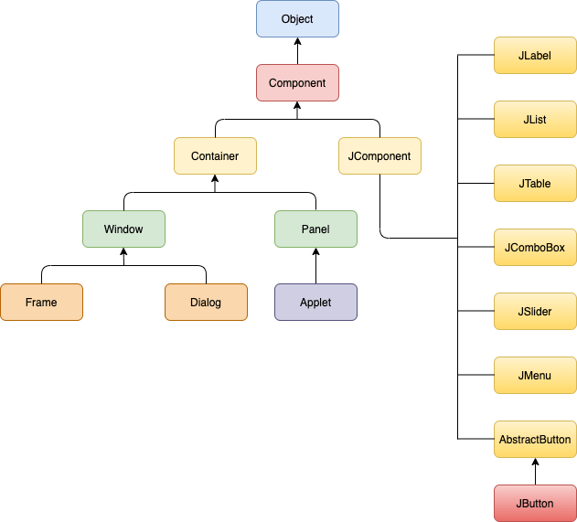

## 顶级容器

**Swing **提供了三个常用的**顶级容器**类： `JFrame`** **、 `JDialog`** **和 `JApplet`** **。使用这些类要牢记以下要点：

1. 要在屏幕上显示，每个 GUI 组件都必须是容器层次结构的一部分。容器层次结构是一棵以顶层容器为根的组件树。稍后我们将展示一个示例。
2. 每个 GUI 组件只能被包含一次。如果一个组件已经位于某个容器中，而您尝试将其添加到另一个容器，该组件会先从第一个容器中移除，然后被添加到第二个容器中。
3. 每个顶层容器都有一个内容窗格，通常来说，该窗格包含（直接或间接）该顶层容器图形用户界面中可见的组件。
4. 可以选择性地为顶层容器添加菜单栏。按照惯例，菜单栏位于顶层容器内，但在内容面板之外。某些外观风格（如 Mac OS 外观风格）允许您将菜单栏放置在更适合该外观风格的其他位置，例如屏幕顶部。

### 示例

```java
package com.lfy;

import java.awt.*;
import java.awt.event.*;
import javax.swing.*;

/* TopLevelDemo.java requires no other files. */
public class TopLevelDemo {
    /**
     * event-dispatching thread.
     */
    private static void createAndShowGUI() {
        //1、创建和设置 窗口
        JFrame frame = new JFrame("TopLevelDemo");
        frame.setDefaultCloseOperation(JFrame.EXIT_ON_CLOSE);

        //2、创建菜单栏。绿色背景
        JMenuBar greenMenuBar = new JMenuBar();
        greenMenuBar.setOpaque(true); //设置不透明
        greenMenuBar.setBackground(new Color(154, 165, 127));
        greenMenuBar.setPreferredSize(new Dimension(200, 20));

        //3、创建内容区
        JLabel yellowLabel = new JLabel();
        yellowLabel.setOpaque(true);
        yellowLabel.setBackground(new Color(248, 213, 131));
        yellowLabel.setPreferredSize(new Dimension(200, 180));

        //4、设置菜单栏，添加 lable 到内容区；
        frame.setJMenuBar(greenMenuBar);
        frame.getContentPane().add(yellowLabel, BorderLayout.CENTER);

        //5、展示窗口
        frame.pack();
        frame.setVisible(true);
    }

    public static void main(String[] args) {
        SwingUtilities.invokeLater(new Runnable() {
            public void run() {
                createAndShowGUI();
            }
        });
    }
}
```

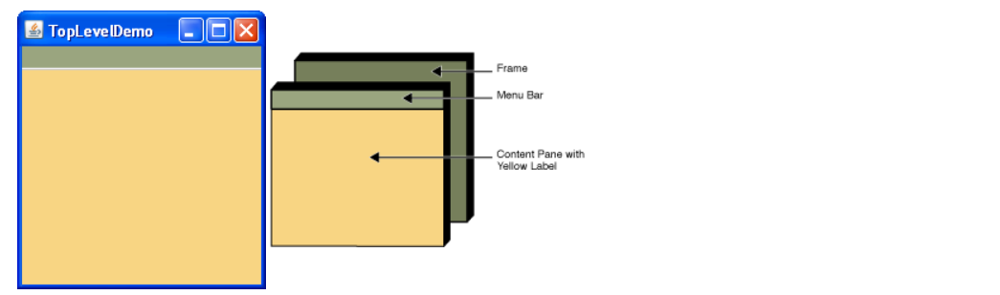

该示例 GUI 的容器层次结构：

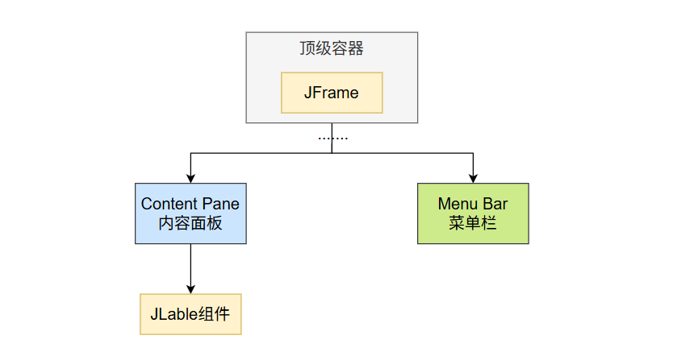

### **顶级容器与容器层次结构**

> - 每个使用 Swing 组件的程序都**至少有一个顶级容器**。这个顶级容器是包含层次结构的根节点——该层次结构包含了出现在顶级容器内的所有 Swing 组件。
> - 通常来说，基于 Swing 图形界面的独立应用程序**至少包含一个以 **`JFrame`** 为根的容器层级结构**。例如，若某应用程序拥有一个主窗口和两个对话框，则该程序包含三个容器层级结构，因而具有三个顶层容器。其中一个容器层级以 `JFrame` 为根，另外两个则分别以 `JDialog` 对象为根。

### **向内容面板添加组件**

```javascript
frame.getContentPane().add(yellowLabel, BorderLayout.CENTER);
```

常见方式：

1. 通过调用 `getContentPane` 方法可获取顶层容器的内容窗格。默认内容窗格是一个继承自 `JComponent` 的简单中间容器，它使用 `BorderLayout` 作为布局管理器。

1. `JPanel` 的默认布局管理器是 `FlowLayout` ；要将某个组件设为内容窗格，请使用顶层容器的 `setContentPane` 方法

```javascript
//Create a panel and add components to it.
JPanel contentPane = new JPanel(new BorderLayout());
contentPane.setBorder(someBorder);
contentPane.add(someComponent, BorderLayout.CENTER);
contentPane.add(anotherComponent, BorderLayout.PAGE_END);


topLevelContainer.setContentPane(contentPane);
```

### 添加菜单栏

理论上，所有顶层容器都能容纳菜单栏。但实际上，菜单栏通常仅出现在**框架**和**小程序**中。要为顶层容器添加菜单栏，需创建 `JMenuBar` 对象，用菜单填充它，然后调用 `setJMenuBar` 。 `TopLevelDemo` 通过以下代码将菜单栏添加到其框架中； 详见：[菜单栏](https://docs.oracle.com/javase/tutorial/uiswing/components/menu.html)

```javascript
frame.setJMenuBar(greenMenuBar);
```

### 根窗口

每个顶层容器都依赖于一个名为根窗格的隐蔽中间容器。根窗格负责管理内容窗格和菜单栏，以及另外几个容器。通常在使用 Swing 组件时无需了解根窗格。但若需要拦截鼠标点击或在多个组件上进行绘制时，则应当熟悉根窗格的相关知识。

以下是根窗格为frame（以及其他所有顶层容器）提供的组件列表：详见：[根窗口](https://docs.oracle.com/javase/tutorial/uiswing/components/rootpane.html)


## JComponent类

> 除顶层容器外，所有以"J"开头的 Swing 组件都继承自 `JComponent` 类。
> 
> - 例如 `JPanel` 、 `JScrollPane` 、 `JButton` 和 `JTable` 都继承自 `JComponent` 。
> - 但 `JFrame` 和 `JDialog` 例外，因为它们属于顶层容器实现。

`JComponent` 类继承自 `Container` 类，而 `Container` 类又继承自 `Component` 。 `Component` 类包含了从提供布局提示到支持绘制和事件处理的所有功能。 `Container` 类则支持向容器添加组件并进行布局。本节 API 表格总结了 `Component` 、 `Container` 以及 `JComponent` 中最常用的方法。

### JComponent功能

JComponent 类为其子类提供以下功能：

- [Tool tips ：工具提示](https://docs.oracle.com/javase/tutorial/uiswing/components/jcomponent.html#tooltips)
  - 通过使用 `setToolTipText` 方法指定字符串，您可以为组件的用户提供帮助。当光标悬停在组件上时，指定的字符串会显示在组件附近出现的小窗口中。
- [Painting and borders ：绘制与边框](https://docs.oracle.com/javase/tutorial/uiswing/components/jcomponent.html#borders)
  - `setBorder` 方法允许您指定组件边缘显示的边框样式。如需绘制组件内部区域，请重写 `paintComponent` 方法。
- [Application-wide pluggable look and feel：应用程序全局可插拔外观](https://docs.oracle.com/javase/tutorial/uiswing/components/jcomponent.html#plug)
  - 在幕后，每个 `JComponent` 对象都有一个对应的 `ComponentUI` 对象，负责为该 `JComponent` 执行所有绘图、事件处理、尺寸确定等操作。具体使用哪个 `ComponentUI` 对象取决于当前的外观风格，您可以通过 `UIManager.setLookAndFeel` 方法进行设置
- [Custom properties ：自定义属性](https://docs.oracle.com/javase/tutorial/uiswing/components/jcomponent.html#properties)
  - 可以为任何 `JComponent` 关联一个或多个属性（名称/对象对）。例如，布局管理器可能使用属性将约束对象与其管理的每个 `JComponent` 相关联。您可以通过 `putClientProperty` 和 `getClientProperty` 方法来设置和获取属性。有关属性的通用信息，请参阅 Properties。
- [Support for layout ：布局支持](https://docs.oracle.com/javase/tutorial/uiswing/components/jcomponent.html#layout)
  - 尽管 `Component` 类提供了诸如 `getPreferredSize` 和 `getAlignmentX` 等布局提示方法，但除非创建子类并重写这些方法，否则无法直接设置这些布局提示。为了提供另一种设置布局提示的方式， `JComponent` 类新增了设置方法—— `setMinimumSize` 、 `setMaximumSize` 、 `setAlignmentX` 和 `setAlignmentY` 。
- [Support for accessibility：辅助功能支持](https://docs.oracle.com/javase/tutorial/uiswing/components/jcomponent.html#access)
  - `JComponent` 类提供了 API 和基础功能，以帮助屏幕阅读器等辅助技术从 Swing 组件获取信息。有关无障碍功能的更多详情，请参阅《如何支持辅助技术》
- [Support for drag and drop：支持拖放功能](https://docs.oracle.com/javase/tutorial/uiswing/components/jcomponent.html#dnd)
  - `JComponent` 类提供了设置组件传输处理程序的 API，这是 Swing 拖放功能的基础。详情请参阅《拖放功能简介》。
- [Double buffering ：双缓冲](https://docs.oracle.com/javase/tutorial/uiswing/components/jcomponent.html#buffer)
  - 双缓冲技术能平滑屏幕绘制效果。详情请参阅执行自定义绘制。
- [Key bindings ：按键绑定](https://docs.oracle.com/javase/tutorial/uiswing/components/jcomponent.html#keyboardAction)
  - 该特性使得组件能够对用户键盘按键作出响应。例如，在多款外观风格中，当按钮获得焦点时，按下空格键等同于用鼠标点击该按钮。外观风格会自动建立空格键按下/释放与按钮效果之间的绑定关系。关于按键绑定的更多信息，请参阅《如何使用按键绑定》。

### JComponent API

`JComponent` 类提供了许多新方法，并从 `Component` 和 `Container` 继承了大量方法。以下表格汇总了我们最常用的方法。

- [Customizing Component Appearance：自定义组件外观](https://docs.oracle.com/javase/tutorial/uiswing/components/jcomponent.html#complookapi)
- [Setting and Getting Component State：设置与获取组件状态](https://docs.oracle.com/javase/tutorial/uiswing/components/jcomponent.html#stateapi)
- [Handling Events ：处理事件](https://docs.oracle.com/javase/tutorial/uiswing/components/jcomponent.html#eventapi)
- [Painting Components ：绘制组件](https://docs.oracle.com/javase/tutorial/uiswing/components/jcomponent.html#custompaintingapi)
- [Dealing with the Containment Hierarchy：处理容器层次结构](https://docs.oracle.com/javase/tutorial/uiswing/components/jcomponent.html#containmentapi)
- [Laying Out Components ：组件布局](https://docs.oracle.com/javase/tutorial/uiswing/components/jcomponent.html#layoutapi)
- [Getting Size and Position Information：获取尺寸和位置信息](https://docs.oracle.com/javase/tutorial/uiswing/components/jcomponent.html#sizeapi)
- [Specifying Absolute Size and Position：指定绝对大小和位置](https://docs.oracle.com/javase/tutorial/uiswing/components/jcomponent.html#absoluteapi)

#### **自定义组件外观**

*📊 在线表格（无数据）*

#### **设置与获取组件状态**

*📊 在线表格（无数据）*

#### 处理事件

参考：https://docs.oracle.com/javase/tutorial/uiswing/events/index.html

*📊 在线表格（无数据）*

#### 绘制组件

参考：https://docs.oracle.com/javase/tutorial/uiswing/painting/index.html

#### **处理容器层次结构**

参考：https://docs.oracle.com/javase/tutorial/uiswing/components/toplevel.html

*📊 在线表格（无数据）*

#### 组件布局

参考：https://docs.oracle.com/javase/tutorial/uiswing/layout/index.html

*📊 在线表格（无数据）*

#### **获取尺寸和位置信息**

*📊 在线表格（无数据）*

#### **绝对定位**

参考：https://docs.oracle.com/javase/tutorial/uiswing/layout/none.html

*📊 在线表格（无数据）*

## 各种组件

- [How to Make Applets](https://docs.oracle.com/javase/tutorial/uiswing/components/applet.html)
- [How to Use Buttons, Check Boxes, and Radio Buttons](https://docs.oracle.com/javase/tutorial/uiswing/components/button.html)
- [How to Use Color Choosers](https://docs.oracle.com/javase/tutorial/uiswing/components/colorchooser.html)
- [How to Use Combo Boxes](https://docs.oracle.com/javase/tutorial/uiswing/components/combobox.html)
- [How to Make Dialogs](https://docs.oracle.com/javase/tutorial/uiswing/components/dialog.html)
- [How to Use Editor Panes and Text Panes](https://docs.oracle.com/javase/tutorial/uiswing/components/editorpane.html)
- [How to Use File Choosers](https://docs.oracle.com/javase/tutorial/uiswing/components/filechooser.html)
- [How to Use Formatted Text Fields](https://docs.oracle.com/javase/tutorial/uiswing/components/formattedtextfield.html)
- [How to Make Frames (Main Windows)](https://docs.oracle.com/javase/tutorial/uiswing/components/frame.html)
- [How to Use Internal Frames](https://docs.oracle.com/javase/tutorial/uiswing/components/internalframe.html)
- [How to Use Labels](https://docs.oracle.com/javase/tutorial/uiswing/components/label.html)
- [How to Use Layered Panes](https://docs.oracle.com/javase/tutorial/uiswing/components/layeredpane.html)
- [How to Use Lists](https://docs.oracle.com/javase/tutorial/uiswing/components/list.html)
- [How to Use Menus](https://docs.oracle.com/javase/tutorial/uiswing/components/menu.html)
- [How to Use Panels](https://docs.oracle.com/javase/tutorial/uiswing/components/panel.html)
- [How to Use Password Fields](https://docs.oracle.com/javase/tutorial/uiswing/components/passwordfield.html)
- [How to Use Progress Bars](https://docs.oracle.com/javase/tutorial/uiswing/components/progress.html)
- [How to Use Root Panes](https://docs.oracle.com/javase/tutorial/uiswing/components/rootpane.html)
- [How to Use Scroll Panes](https://docs.oracle.com/javase/tutorial/uiswing/components/scrollpane.html)
- [How to Use Separators](https://docs.oracle.com/javase/tutorial/uiswing/components/separator.html)
- [How to Use Sliders](https://docs.oracle.com/javase/tutorial/uiswing/components/slider.html)
- [How to Use Spinners](https://docs.oracle.com/javase/tutorial/uiswing/components/spinner.html)
- [How to Use Split Panes](https://docs.oracle.com/javase/tutorial/uiswing/components/splitpane.html)
- [How to Use Tabbed Panes](https://docs.oracle.com/javase/tutorial/uiswing/components/tabbedpane.html)
- [How to Use Tables](https://docs.oracle.com/javase/tutorial/uiswing/components/table.html)
- [How to Use Text Areas](https://docs.oracle.com/javase/tutorial/uiswing/components/textarea.html)
- [How to Use Text Fields](https://docs.oracle.com/javase/tutorial/uiswing/components/textfield.html)
- [How to Use Tool Bars](https://docs.oracle.com/javase/tutorial/uiswing/components/toolbar.html)
- [How to Use Tool Tips](https://docs.oracle.com/javase/tutorial/uiswing/components/tooltip.html)
- [How to Use Trees](https://docs.oracle.com/javase/tutorial/uiswing/components/tree.html)

```java
package com.lfy;

import org.junit.Test;

import javax.swing.*;
import javax.swing.tree.DefaultMutableTreeNode;
import java.awt.*;
import java.awt.event.MouseAdapter;
import java.io.File;

public class SwingTest {


    @Test
    public void test02(){
        JFrame frame = new JFrame("测试");
        frame.setFont(new Font("宋体", Font.PLAIN, 12));

        frame.setSize(800, 600);
        //居中显示
        frame.setLocationRelativeTo(null);
        Container pane = frame.getContentPane();
        pane.setLayout(new FlowLayout());


        //测试组件
        addButton(pane);
        addCheckBox(pane);
        addComboBox(pane);
        addTextField(pane);
        addLabel(pane);
        addRadioButton(pane);
        addTextArea(pane);
        addPasswordField(pane);
        addScrollPane(pane);
        addPopupMenu(pane);
        addIcon(pane);
        addDialog(pane);
        addFileChooser(pane);
        addTabPane(pane);
        addToolBar(pane);
        addTable(pane);
        addTree(pane);


        frame.setVisible(true);
        sleep();
    }

    private void addIcon(Container pane) {
        ImageIcon icon = new ImageIcon("C:\\Users\\53409\\Downloads\\抖音视频.png");
        JLabel label = new JLabel(icon);
        pane.add(label);
    }

    private void addTree(Container pane) {
        JTree tree = new JTree(new Object[]{
                new DefaultMutableTreeNode("节点1"),
                new DefaultMutableTreeNode(new Object[]{"节点2", "节点3"})
        });
        pane.add(new JScrollPane(tree));
    }

    private void addTable(Container pane) {


        JTable table = new JTable(new Object[][]{
                {"张三", 20},
                {"李四", 30},
                {"王五", 40},
                {"赵六", 50}
        }, new String[]{"姓名", "年龄"});


        pane.add(new JScrollPane(table));
    }

    private void addToolBar(Container pane) {
        JToolBar toolBar = new JToolBar();

        JButton button = new JButton("按钮");
        toolBar.add(button);
        toolBar.addSeparator();
        toolBar.add(new JButton("按钮2"));
        pane.add(toolBar);

    }

    private void addTabPane(Container pane) {
        JTabbedPane tabbedPane = new JTabbedPane();
        JPanel panel1 = new JPanel();
        panel1.add(new JButton("按钮1"));
        tabbedPane.addTab("标签页1", panel1);


        JPanel panel2 = new JPanel();
        panel2.add(new JButton("按钮2"));
        tabbedPane.addTab("标签页2", panel2);

        JPanel panel3 = new JPanel();
        panel3.add(new JButton("按钮3"));
        tabbedPane.addTab("标签页3", panel3);

        pane.add(tabbedPane);
    }

    private void addFileChooser(Container pane) {
        JButton button = new JButton("文件选择器");
        button.addActionListener(e -> {
            JFileChooser fileChooser = new JFileChooser();
            fileChooser.setDialogTitle("选择文件");
            int result = fileChooser.showOpenDialog(pane);
            if (result == JFileChooser.APPROVE_OPTION) {
                File selectedFile = fileChooser.getSelectedFile();
                System.out.println("选择的文件是：" + selectedFile.getAbsolutePath());
            }
        });
        pane.add(button);
    }

    private void addDialog(Container pane) {
        JButton button = new JButton("对话框");

        button.addActionListener(e -> {
            JDialog dialog = new JDialog();
            dialog.setSize(300, 200);
            dialog.setLocationRelativeTo(null);
            Container dialogPane = dialog.getContentPane();
            JButton button1 = new JButton("确定");
            button1.addActionListener(e1 -> {
                System.out.println("点击了确定按钮");
                dialog.setVisible(false);
            });
            dialogPane.add(button1);

            dialog.setVisible(true);
        });

        pane.add(button);

    }

    private void addPopupMenu(Container pane) {
        JPopupMenu popupMenu = new JPopupMenu();

        JMenuItem menuItem = new JMenuItem("菜单项");
        popupMenu.add(menuItem);
        popupMenu.add(new JMenuItem("菜单项2"));


        JPanel panel = (JPanel) pane;
        //面板添加鼠标监听器，当鼠标右键点击时显示弹出菜单
        panel.addMouseListener(new MouseAdapter() {
            @Override
            public void mouseClicked(java.awt.event.MouseEvent e) {
                if (e.getButton() == java.awt.event.MouseEvent.BUTTON3) {
                    popupMenu.show(pane, e.getX(), e.getY());
                }
            }
        });

    }

    private void addScrollPane(Container pane) {
        JScrollPane scrollPane = new JScrollPane();
        JTextArea textArea = new JTextArea("文本域");
        scrollPane.setViewportView(textArea);
        pane.add(scrollPane);
    }

    private void addPasswordField(Container pane) {
        JPasswordField passwordField = new JPasswordField("密码框");
        passwordField.addActionListener(e -> {
            System.out.println("密码框被点击了"+ new String(passwordField.getPassword()));
        });
        pane.add(passwordField);
    }

    private void addTextArea(Container pane) {
        JTextArea textArea = new JTextArea("文本域");
        JButton button = new JButton("获取文本内容");
        button.addActionListener(e -> {
            System.out.println("文本域被点击了"+ textArea.getText());
        });
        pane.add(button);
        pane.add(textArea);
    }

    private void addRadioButton(Container pane) {
        //单选按钮组
        ButtonGroup group = new ButtonGroup();
        JRadioButton radioButton1 = new JRadioButton("单选按钮1");
        JRadioButton radioButton2 = new JRadioButton("单选按钮2");
        group.add(radioButton1);
        group.add(radioButton2);
        pane.add(radioButton1);


    }

    private void addLabel(Container pane) {
        JLabel label = new JLabel("标签");
        label.setText("标签");
        pane.add(label);
    }

    private void addTextField(Container pane) {
        JTextField textField = new JTextField("文本框");
        textField.addActionListener(e -> {
            System.out.println("文本框被点击了"+ textField.getText());
        });
        pane.add(textField);
    }

    private void addComboBox(Container pane) {
        JComboBox<String> comboBox = new JComboBox<>(new String[]{"选项1", "选项2"});

        comboBox.addActionListener(e -> {
            System.out.println("下拉框被点击了"+ comboBox.getSelectedItem());
        });
        pane.add(comboBox);
    }

    private void addCheckBox(Container pane) {
        JCheckBox checkBox = new JCheckBox("复选框");
        checkBox.addActionListener(e -> {
            System.out.println("复选框被点击了"+ checkBox.isSelected());
            if (checkBox.isSelected()){
                checkBox.setText("选中");
            }else {
                checkBox.setText("未选中");
            }

        });
        pane.add(checkBox);
    }

    private void addButton(Container pane) {
        JButton button = new JButton("按钮");
        button.addActionListener(e -> {
            System.out.println("按钮被点击了");
        });
        pane.add(button);
    }

    private static void sleep() {
        try {
            Thread.sleep(1000000);
        } catch (InterruptedException e) {
            throw new RuntimeException(e);
        }
    }


}
```

## 案例

```java
package com.lfy.component;

import javax.swing.*;
import java.awt.*;
import java.awt.event.MouseAdapter;
import java.awt.event.MouseEvent;

public class AllComponentDemo {

    public static void main(String[] args) {
        SwingUtilities.invokeLater(()->{
            JFrame frame = new JFrame("组件案例");
            frame.setDefaultCloseOperation(JFrame.EXIT_ON_CLOSE);
            frame.setSize(800, 600);

            buildAllComponents(frame);
            frame.setLocationRelativeTo(null);
            frame.setVisible(true);
        });
    }

    private static void buildAllComponents(JFrame frame) {
        JPanel panel = new JPanel(new GridLayout(0, 2, 10, 10));
        panel.setBorder(BorderFactory.createEmptyBorder(20, 20, 20, 20));

        // 按钮组件
        JButton button = new JButton("点击我");
        button.addActionListener(e -> JOptionPane.showMessageDialog(frame, "按钮被点击了!"));
        panel.add(button);

        // 复选框
        JCheckBox checkBox = new JCheckBox("选择我");
        checkBox.addItemListener(e -> {
            if (checkBox.isSelected()) {
                button.setText("已选择");
            } else {
                button.setText("点击我");
            }
        });
        panel.add(checkBox);

        // 单选按钮
        JRadioButton radio1 = new JRadioButton("选项1");
        JRadioButton radio2 = new JRadioButton("选项2");
        ButtonGroup radioGroup = new ButtonGroup();
        radioGroup.add(radio1);
        radioGroup.add(radio2);
        JPanel radioPanel = new JPanel(new FlowLayout());
        radioPanel.add(radio1);
        radioPanel.add(radio2);
        panel.add(radioPanel);

        // 文本框
        JTextField textField = new JTextField(15);
        textField.addActionListener(e -> JOptionPane.showMessageDialog(frame, "输入内容: " + textField.getText()));
        panel.add(new JLabel("输入文本:"));
        panel.add(textField);

        // 密码框
        JPasswordField passwordField = new JPasswordField(15);
        panel.add(new JLabel("输入密码:"));
        panel.add(passwordField);

        // 下拉框
        String[] options = {"选项1", "选项2", "选项3"};
        JComboBox<String> comboBox = new JComboBox<>(options);
        comboBox.addActionListener(e -> JOptionPane.showMessageDialog(frame, "选择了: " + comboBox.getSelectedItem()));
        panel.add(comboBox);

        // 列表
        String[] listData = {"项目1", "项目2", "项目3", "项目4"};
        JList<String> list = new JList<>(listData);
        list.addListSelectionListener(e -> {
            if (!e.getValueIsAdjusting()) {
                JOptionPane.showMessageDialog(frame, "选择了: " + list.getSelectedValue());
            }
        });
        panel.add(new JScrollPane(list));

        // 滑块
        JSlider slider = new JSlider(JSlider.HORIZONTAL, 0, 100, 50);
        slider.setMajorTickSpacing(20);
        slider.setPaintTicks(true);
        slider.setPaintLabels(true);
        panel.add(slider);

        // 进度条
        JProgressBar progressBar = new JProgressBar(0, 100);
        progressBar.setValue(30);
        progressBar.setStringPainted(true);
        panel.add(progressBar);

        // 文本区域
        JTextArea textArea = new JTextArea(5, 20);
        textArea.setLineWrap(true);
        panel.add(new JScrollPane(textArea));

        // 鼠标事件处理
        panel.addMouseListener(new MouseAdapter() {
            @Override
            public void mouseClicked(MouseEvent e) {
                JOptionPane.showMessageDialog(frame, "在面板上点击了鼠标");
            }
        });

        frame.add(panel);
    }
}
```

# 布局

> 常见布局
> 
> - `BorderLayout`
> - `BoxLayout`
> - `CardLayout`
> - `FlowLayout`
> - `GridBagLayout`
> - `GridLayout`
> - `GroupLayout`
> - `SpringLayout`

## 效果

### **BorderLayout - 边界布局**

每个内容面板默认使用 `BorderLayout` 进行布局。（如《使用顶层容器》所述，内容面板是所有框架、小程序和对话框中的主容器。） 

`BorderLayout` 将组件放置在最多五个区域：**顶部、底部、左侧、右侧和中央**。所有额外空间都位于中央区域。若希望实现工具栏的拖拽停靠功能，使用 JToolBar 创建的工具栏必须置于 `BorderLayout` 容器内。更多详细信息：https://docs.oracle.com/javase/tutorial/uiswing/layout/border.html

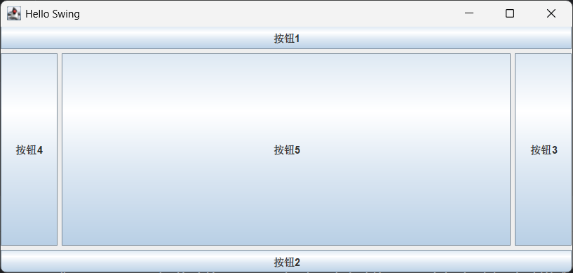

```java
public void test01() {
    JFrame frame = new JFrame("Hello Swing");
    frame.setVisible(true);
    frame.setSize(300, 300);
    //居中显示
    frame.setLocationRelativeTo(null);
    //关闭窗口时退出程序
    frame.setDefaultCloseOperation(JFrame.EXIT_ON_CLOSE);


    //设置布局
    frame.setLayout(new BorderLayout(5,5));
    JButton btn01 = new JButton("按钮1");
    JButton btn02 = new JButton("按钮2");
    JButton btn03 = new JButton("按钮3");
    JButton btn04 = new JButton("按钮4");
    JButton btn05 = new JButton("按钮5");
    frame.add(btn01,BorderLayout.NORTH);
    frame.add(btn02,BorderLayout.SOUTH);
    frame.add(btn03,BorderLayout.EAST);
    frame.add(btn04,BorderLayout.WEST);
    frame.add(btn05,BorderLayout.CENTER);
}
```

### BoxLayout  - 盒子布局

BoxLayout 类将组件**排列在单行或单列中**。它会考虑组件的最大尺寸请求，并允许你对齐组件。

更多详情：https://docs.oracle.com/javase/tutorial/uiswing/layout/box.html

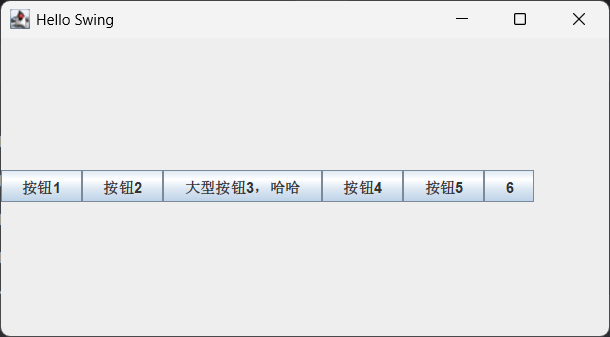

水平

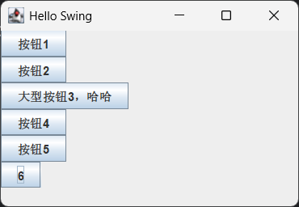

垂直

```java
@Test
public void test02() throws InterruptedException {
    JFrame frame = new JFrame("Hello Swing");
    frame.setVisible(true);
    frame.setSize(300, 300);
    //居中显示
    frame.setLocationRelativeTo(null);
    //关闭窗口时退出程序
    frame.setDefaultCloseOperation(JFrame.EXIT_ON_CLOSE);
    BoxLayout boxLayout = new BoxLayout(frame.getContentPane(), BoxLayout.Y_AXIS);
    frame.setLayout(boxLayout);

    JButton btn01 = new JButton("按钮1");
    JButton btn02 = new JButton("按钮2");
    JButton btn03 = new JButton("大型按钮3，哈哈");
    JButton btn04 = new JButton("按钮4");
    JButton btn05 = new JButton("按钮5");
    JButton btn06 = new JButton("6");
    frame.add(btn01);
    frame.add(btn02);
    frame.add(btn03);
    frame.add(btn04);
    frame.add(btn05);
    frame.add(btn06);


    Thread.sleep(100000);
}
```

### CardLayout - 卡片布局

**CardLayout **类允许您实现一个在不同时间显示不同组件的区域。

CardLayout 通常由组合框控制，组合框的状态决定了 CardLayout 显示哪个面板（组件组）。

使用 CardLayout 的替代方案是使用选项卡窗格，它提供类似功能但具有预定义的图形界面。更多：https://docs.oracle.com/javase/tutorial/uiswing/layout/card.html

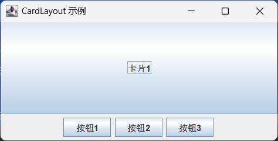

```java
@Test
public void card() throws InterruptedException {

    // 创建主框架
    JFrame frame = new JFrame("CardLayout 示例");
    frame.setSize(300, 200);
    frame.setDefaultCloseOperation(JFrame.EXIT_ON_CLOSE);
    frame.setLocationRelativeTo(null); // 居中显示


    //1、三个按钮放到底部
    JPanel bottomPanel = new JPanel();
    JButton btn01 = new JButton("按钮1");
    JButton btn02 = new JButton("按钮2");
    JButton btn03 = new JButton("按钮3");
    bottomPanel.add(btn01);
    bottomPanel.add(btn02);
    bottomPanel.add(btn03);
    frame.add(bottomPanel,BorderLayout.SOUTH);


    //2、卡片布局内容区准备切换
    // 创建面板并设置CardLayout布局管理器
    JPanel panel = new JPanel(new CardLayout());
    // 创建卡片
    JButton card1 = new JButton("卡片1");
    JButton card2 = new JButton("卡片2");
    JButton card3 = new JButton("卡片3");
    // 将卡片添加到面板中，并指定名称
    panel.add(card1, "卡片1");
    panel.add(card2, "卡片2");
    panel.add(card3, "卡片3");

    frame.add(panel, BorderLayout.CENTER);


    //3、卡片切换；给按钮绑定事件
    btn01.addActionListener(e -> ((CardLayout) panel.getLayout()).show(panel, "卡片1"));
    btn02.addActionListener(e -> ((CardLayout) panel.getLayout()).show(panel, "卡片2"));
    btn03.addActionListener(e -> ((CardLayout) panel.getLayout()).show(panel, "卡片3"));


    // 设置框架可见
    frame.setVisible(true);

    Thread.sleep(10000);
}
```

### FlowLayout - 流式布局

`FlowLayout` 是每个 `JPanel` 的**默认布局管理器**。它只是简单地将组件排列成单行，如果容器宽度不足则会另起新行。先前展示的 CardLayoutDemo 中的两个面板都使用了 `FlowLayout` 。

更多：https://docs.oracle.com/javase/tutorial/uiswing/layout/flow.html

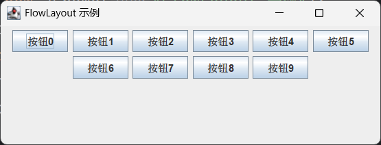

```java
@Test
public void flow() throws InterruptedException {
    JFrame frame = new JFrame("FlowLayout 示例");
    frame.setLayout(new FlowLayout());
    for (int i = 0; i < 10; i++) {
        JButton btn = new JButton("按钮" + i);
        frame.add(btn);
    }

    // 为了让窗口大小自适应，调用pack()方法
    frame.pack();
    // 设置窗口可见
    frame.setVisible(true);
    // 设置默认关闭操作（退出程序）
    frame.setDefaultCloseOperation(JFrame.EXIT_ON_CLOSE);


    Thread.sleep(10000);

}
```

### **GridBagLayout  ****- 网格包布局**

**GridBagLayout **是一种**复杂而灵活的布局管理器**。它通过将组件放置在**网格单元格中对齐组件**，允许**组件跨越多行多列**。网格中的行可以有不同的高度，列也可以有不同的宽度。

更多：https://docs.oracle.com/javase/tutorial/uiswing/layout/gridbag.html

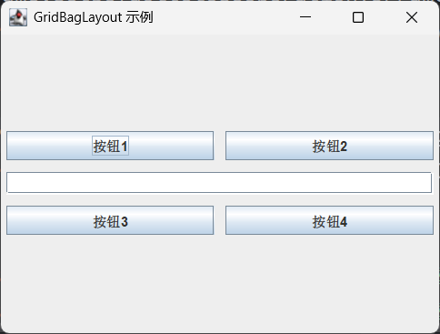

```java
@Test
public void gridBag() throws InterruptedException {
    // 创建主框架
    JFrame frame = new JFrame("GridBagLayout 示例");
    frame.setSize(400, 300);
    frame.setDefaultCloseOperation(JFrame.EXIT_ON_CLOSE);
    frame.setLocationRelativeTo(null); // 居中显示

    // 创建面板并设置GridBagLayout布局管理器
    JPanel panel = new JPanel(new GridBagLayout());
    GridBagConstraints gbc = new GridBagConstraints();

    // 创建一些组件
    JButton button1 = new JButton("按钮1");
    JButton button2 = new JButton("按钮2");
    JButton button3 = new JButton("按钮3");
    JButton button4 = new JButton("按钮4");
    JTextField textField = new JTextField(20);

    // 配置GridBagConstraints
    gbc.insets = new Insets(5, 5, 5, 5); // 设置组件之间的间距
    gbc.fill = GridBagConstraints.HORIZONTAL; // 横向填充
    gbc.weightx = 1.0; // 横向权重

    // 添加组件到面板
    gbc.gridx = 0; // 列索引
    gbc.gridy = 0; // 行索引
    panel.add(button1, gbc);

    gbc.gridx = 1;
    panel.add(button2, gbc);

    gbc.gridx = 0;
    gbc.gridy = 1;
    gbc.gridwidth = 2; // 跨两列
    panel.add(textField, gbc);

    gbc.gridwidth = 1; // 恢复为默认跨一列
    gbc.gridx = 0;
    gbc.gridy = 2;
    panel.add(button3, gbc);

    gbc.gridx = 1;
    panel.add(button4, gbc);

    // 将面板添加到框架的内容窗格中
    frame.getContentPane().add(panel);

    // 设置框架可见
    frame.setVisible(true);

    Thread.sleep(10000);
}
```

```java
// GridBagConstraints 主要属性说明
    public static void explainConstraints() {
        GridBagConstraints gbc = new GridBagConstraints();
        
        // 1. gridx, gridy - 组件在网格中的位置 (列, 行)
        gbc.gridx = 0;      // 第0列
        gbc.gridy = 0;      // 第0行
        
        // 2. gridwidth, gridheight - 组件跨越的列数和行数
        gbc.gridwidth = 1;   // 跨越1列
        gbc.gridheight = 1;  // 跨越1行
        gbc.gridwidth = GridBagConstraints.REMAINDER;  // 占据该行剩余所有列
        gbc.gridheight = GridBagConstraints.RELATIVE;  // 占据该列倒数第二个位置
        
        // 3. weightx, weighty - 权重，控制组件如何分配额外空间
        gbc.weightx = 1.0;   // 水平方向权重，0.0-1.0
        gbc.weighty = 1.0;   // 垂直方向权重，0.0-1.0
        
        // 4. fill - 当组件显示区域比组件大时，如何填充
        gbc.fill = GridBagConstraints.NONE;       // 不填充(默认)
        gbc.fill = GridBagConstraints.HORIZONTAL; // 水平填充
        gbc.fill = GridBagConstraints.VERTICAL;   // 垂直填充
        gbc.fill = GridBagConstraints.BOTH;       // 向两个方向填充
        
        // 5. anchor - 当组件小于显示区域时的对齐方式
        gbc.anchor = GridBagConstraints.CENTER;    // 居中(默认)
        gbc.anchor = GridBagConstraints.NORTH;     // 顶部居中
        gbc.anchor = GridBagConstraints.NORTHWEST; // 左上角
        gbc.anchor = GridBagConstraints.WEST;      // 左侧居中
        gbc.anchor = GridBagConstraints.SOUTHWEST; // 左下角
        gbc.anchor = GridBagConstraints.SOUTH;     // 底部居中
        gbc.anchor = GridBagConstraints.SOUTHEAST; // 右下角
        gbc.anchor = GridBagConstraints.EAST;      // 右侧居中
        gbc.anchor = GridBagConstraints.NORTHEAST; // 右上角
        
        // 6. ipadx, ipady - 内部填充，增加组件的最小尺寸
        gbc.ipadx = 10;  // 水平内部填充
        gbc.ipady = 5;   // 垂直内部填充
        
        // 7. insets - 外部填充，组件周围的空白
        gbc.insets = new Insets(5, 5, 5, 5);  // 上、左、下、右边距
    }
```

### GridLayout - 网格布局

GridLayout（网格布局）能够将**一组组件调整为相同尺寸**，并按指定**行列数**进行**排列，如果元素数量多，优先保证行数固定，每行的列数会重新计算**

更多：https://docs.oracle.com/javase/tutorial/uiswing/layout/grid.html

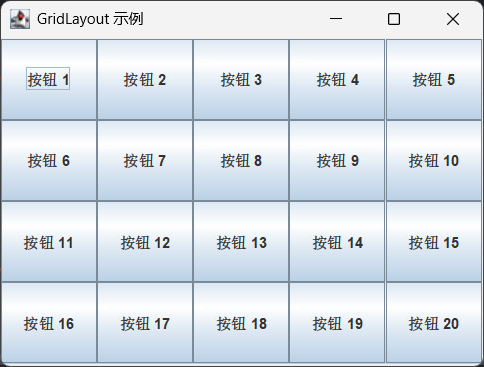

```java
@Test
public void grid() throws InterruptedException {
    // 创建主框架
    JFrame frame = new JFrame("GridLayout 示例");
    frame.setSize(400, 300);
    frame.setDefaultCloseOperation(JFrame.EXIT_ON_CLOSE);
    frame.setLocationRelativeTo(null); // 居中显示

    // 创建面板并设置GridLayout布局管理器，2行2列
    JPanel panel = new JPanel(new GridLayout(4, 5));

    // 创建一些按钮组件
    for (int i = 0; i < 20; i++) {
        panel.add(new JButton("按钮 " + (i + 1)));
    }

    // 将面板添加到框架的内容窗格中
    frame.getContentPane().add(panel);

    // 设置框架可见
    frame.setVisible(true);

    Thread.sleep(10000);
}
```

### GroupLayout - 分组布局

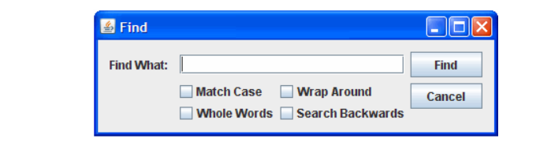

`GroupLayout` 是一种专为 GUI 构建工具开发的布局管理器，但也可手动使用。 `GroupLayout` 分别处理水平和垂直布局，每个维度的布局都是独立定义的。然而这也意味着每个组件需要在布局中定义两次。上文展示的查找窗口就是 `GroupLayout` 的实例；

更多：https://docs.oracle.com/javase/tutorial/uiswing/layout/group.html

### SpringLayout - 弹性布局

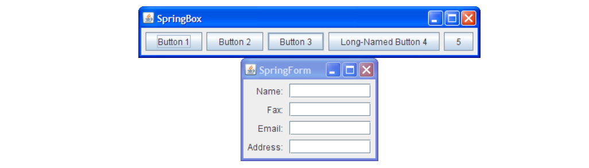

`SpringLayout` 是一种专为 GUI 构建工具设计的灵活布局管理器。它允许您**精确控制组件边缘之间的相对位置关系**。例如，您可以定义某个组件的左边缘与第二个组件右边缘保持特定距离（该距离可动态计算）。 `SpringLayout` 会根据一组约束条件来排列关联容器中的子组件；

更多：https://docs.oracle.com/javase/tutorial/uiswing/layout/spring.html

## 用法

### 设置LayoutManger

- 创建时设置：`JPanel panel = new JPanel(new BorderLayout());`
- 创建后设置：

```javascript
Container contentPane = frame.getContentPane();
contentPane.setLayout(new FlowLayout());
```

### 添加组件

当您向面板或内容窗格添加组件时，传递给 `add` 方法的参数取决于该面板或内容窗格所使用的布局管理器。实际上，某些布局管理器甚至不需要您显式添加组件；例如 `GroupLayout` 。以 `BorderLayout` 为例，它要求您通过类似这样的代码指定组件应添加到的区域（使用 `BorderLayout` 中定义的常量之一）：

```javascript
pane.add(aComponent, BorderLayout.PAGE_START);
```

# 并发

Swing 程序员需要处理以下几种线程：

- ***Initial threads*****, 初始线程**，即执行应用程序初始代码的线程。
- **The *****event dispatch thread*****, 事件分发线程（EDT**），所有事件处理代码都在此执行。与 Swing 框架交互的大部分代码也必须在此线程上运行。
- ***Worker threads*****, 工作线程**，也称为后台线程，用于执行耗时的后台任务。

## 初始线程

在 Swing 程序中，初始线程的任务并不繁重。它们最核心的工作是创建一个 `Runnable` 对象来初始化 GUI，并将该对象调度到事件分发线程上执行。一旦 GUI 创建完成，程序主要由 GUI 事件驱动，每个事件都会在事件分发线程上触发一个简短任务的执行。应用程序代码可以在事件分发线程上调度额外任务（前提是这些任务能快速完成，以免干扰事件处理），也可以将耗时任务交由工作线程处理。

> 初始线程通过调用 `javax.swing.SwingUtilities.invokeLater` 或 `javax.swing.SwingUtilities.invokeAndWait` 来调度 GUI 创建任务。这两个方法都接收一个参数：定义新任务的 `Runnable` 。它们的唯一区别体现在名称上： 
> 
> 1. `invokeLater` 仅调度任务并立即返回； 
> 2. `invokeAndWait` 会等待任务完成后再返回。

标准代码：

```javascript
SwingUtilities.invokeLater(new Runnable() {
    public void run() {
        createAndShowGUI();
    }
});
```

## EDT

Swing 事件处理代码运行在一个称为事件分发线程的特殊线程上。大多数调用 Swing 方法的代码也在此线程上运行。这是必要的，因为大多数 Swing 对象方法不具备"线程安全性"：从多个线程调用它们可能导致线程干扰或内存一致性错误。在 API 规范中，某些 Swing 组件方法被标注为"线程安全"；这些方法可以从任何线程安全地调用。所有其他 Swing 组件方法必须从事件分发线程调用。忽略此规则的程序可能在大多数情况下正常运行，但会面临难以复现的不可预测错误。

将运行在事件分发线程上的代码视为一系列短任务会很有帮助。大多数任务是事件处理方法的调用，例如 `ActionListener.actionPerformed` 。应用程序代码也可以使用 `invokeLater` 或 `invokeAndWait` 来调度其他任务。事件分发线程上的任务必须快速完成；否则未处理的事件会积压，导致用户界面失去响应。

如需判断代码是否在事件分派线程上运行，可调用 `javax.swing.SwingUtilities.isEventDispatchThread` 方法。

## Worker线程和Swing Worker

当 Swing 程序需要执行耗时任务时，通常会使用工作线程（也称为后台线程）。每个在工作线程上运行的任务都由 `javax.swing.SwingWorker` 的实例表示。 `SwingWorker` 本身是一个抽象类，必须定义子类才能创建 `SwingWorker` 对象；匿名内部类通常可用于创建非常简单的 `SwingWorker` 对象。

`SwingWorker` 提供了多种通信和控制功能：

1. `SwingWorker` 子类可以定义一个方法 `done` ，当后台任务完成时，该方法会在事件分派线程上自动调用。
2. `SwingWorker` 实现了 `java.util.concurrent.Future` 接口。该接口允许后台任务向其他线程提供返回值。接口中的其他方法可用于取消后台任务，以及检查后台任务是否已完成或被取消。
3. 后台任务可以通过调用 `SwingWorker.publish` 来提供中间结果，从而使得 `SwingWorker.process` 在事件分派线程中被调用。
4. 后台任务可以定义绑定属性。对这些属性的更改会触发事件，导致事件处理方法在事件分发线程上被调用。

### 简单后台任务

```java
SwingWorker worker = new SwingWorker<ImageIcon[], Void>() {
    @Override
    public ImageIcon[] doInBackground() {
        final ImageIcon[] innerImgs = new ImageIcon[nimgs];
        for (int i = 0; i < nimgs; i++) {
            innerImgs[i] = loadImage(i+1);
        }
        return innerImgs;
    }

    @Override
    public void done() {
        //Remove the "Loading images" label.
        animator.removeAll();
        loopslot = -1;
        try {
            imgs = get();
        } catch (InterruptedException ignore) {}
        catch (java.util.concurrent.ExecutionException e) {
            String why = null;
            Throwable cause = e.getCause();
            if (cause != null) {
                why = cause.getMessage();
            } else {
                why = e.getMessage();
            }
            System.err.println("Error retrieving file: " + why);
        }
    }
};
```

### 具有中间结果的任务

```java
private static class FlipPair {
    private final long heads, total;
    FlipPair(long heads, long total) {
        this.heads = heads;
        this.total = total;
    }
}
```

```javascript
private class FlipTask extends SwingWorker<Void, FlipPair> {
   
    @Override
    protected Void doInBackground() {
        long heads = 0;
        long total = 0;
        Random random = new Random();
        while (!isCancelled()) {
            total++;
            if (random.nextBoolean()) {
                heads++;
            }
            publish(new FlipPair(heads, total));
        }
        return null;
    }
    
    protected void process(List<FlipPair> pairs) {
        FlipPair pair = pairs.get(pairs.size() - 1);
        headsText.setText(String.format("%d", pair.heads));
        totalText.setText(String.format("%d", pair.total));
        devText.setText(String.format("%.10g", 
                ((double) pair.heads)/((double) pair.total) - 0.5));
    }

}
```

### 取消后台任务

要取消正在运行的后台任务，可调用 `SwingWorker.cancel` 。任务必须配合自身的取消操作，具体可通过以下两种方式实现：

1. 通过接收中断信号时终止任务。
2. 通过短时间间隔调用 `SwingWorker.isCancelled` 。如果已为此 `SwingWorker` 调用 `cancel` ，则此方法返回 `true` 。

# 事件监听

> 支持的所有事件监听分类
> 
> [**component listener**](https://docs.oracle.com/javase/tutorial/uiswing/events/componentlistener.html)
> 
> - Listens for changes in the component's size, position, or visibility.
> 
> [**focus listener**](https://docs.oracle.com/javase/tutorial/uiswing/events/focuslistener.html)
> 
> - Listens for whether the component gained or lost the keyboard focus.
> 
> [**key listener**](https://docs.oracle.com/javase/tutorial/uiswing/events/keylistener.html)
> 
> - Listens for key presses; key events are fired only by the component that has the current keyboard focus.
> 
> [**mouse listener**](https://docs.oracle.com/javase/tutorial/uiswing/events/mouselistener.html)
> 
> - Listens for mouse clicks, mouse presses, mouse releases and mouse movement into or out of the component's drawing area.
> 
> [**mouse-motion listener**](https://docs.oracle.com/javase/tutorial/uiswing/events/mousemotionlistener.html)
> 
> - Listens for changes in the mouse cursor's position over the component.
> 
> [**mouse-wheel listener**](https://docs.oracle.com/javase/tutorial/uiswing/events/mousewheellistener.html)
> 
> - Listens for mouse wheel movement over the component.
> 
> [**Hierarchy Listener**](https://docs.oracle.com/javase/8/docs/api/java/awt/event/HierarchyListener.html)
> 
> - Listens for changes to a component's containment hierarchy of changed events.
> 
> [**Hierarchy Bounds Listener**](https://docs.oracle.com/javase/8/docs/api/java/awt/event/HierarchyBoundsListener.html)
> 
> - Listens for changes to a component's containment hierarchy of moved and resized events.

- [How to Write an Action Listener](https://docs.oracle.com/javase/tutorial/uiswing/events/actionlistener.html)
- [How to Write a Caret Listener](https://docs.oracle.com/javase/tutorial/uiswing/events/caretlistener.html)
- [How to Write a Change Listener](https://docs.oracle.com/javase/tutorial/uiswing/events/changelistener.html)
- [How to Write a Component Listener](https://docs.oracle.com/javase/tutorial/uiswing/events/componentlistener.html)
- [How to Write a Container Listener](https://docs.oracle.com/javase/tutorial/uiswing/events/containerlistener.html)
- [How to Write a Document Listener](https://docs.oracle.com/javase/tutorial/uiswing/events/documentlistener.html)
- [How to Write a Focus Listener](https://docs.oracle.com/javase/tutorial/uiswing/events/focuslistener.html)
- [How to Write an Internal Frame Listener](https://docs.oracle.com/javase/tutorial/uiswing/events/internalframelistener.html)
- [How to Write an Item Listener](https://docs.oracle.com/javase/tutorial/uiswing/events/itemlistener.html)
- [How to Write a Key Listener](https://docs.oracle.com/javase/tutorial/uiswing/events/keylistener.html)
- [How to Write a List Data Listener](https://docs.oracle.com/javase/tutorial/uiswing/events/listdatalistener.html)
- [How to Write a List Selection Listener](https://docs.oracle.com/javase/tutorial/uiswing/events/listselectionlistener.html)
- [How to Write a Mouse Listener](https://docs.oracle.com/javase/tutorial/uiswing/events/mouselistener.html)
- [How to Write a Mouse-Motion Listener](https://docs.oracle.com/javase/tutorial/uiswing/events/mousemotionlistener.html)
- [How to Write a Mouse-Wheel Listener](https://docs.oracle.com/javase/tutorial/uiswing/events/mousewheellistener.html)
- [How to Write a Property Change Listener](https://docs.oracle.com/javase/tutorial/uiswing/events/propertychangelistener.html)
- [How to Write a Table Model Listener](https://docs.oracle.com/javase/tutorial/uiswing/events/tablemodellistener.html)
- [How to Write a Tree Expansion Listener](https://docs.oracle.com/javase/tutorial/uiswing/events/treeexpansionlistener.html)
- [How to Write a Tree Model Listener](https://docs.oracle.com/javase/tutorial/uiswing/events/treemodellistener.html)
- [How to Write a Tree Selection Listener](https://docs.oracle.com/javase/tutorial/uiswing/events/treeselectionlistener.html)
- [How to Write a Tree-Will-Expand Listener](https://docs.oracle.com/javase/tutorial/uiswing/events/treewillexpandlistener.html)
- [How to Write an Undoable Edit Listener](https://docs.oracle.com/javase/tutorial/uiswing/events/undoableeditlistener.html)
- [How to Write Window Listeners](https://docs.oracle.com/javase/tutorial/uiswing/events/windowlistener.html)

# 自定义绘制

## 第一步：正确创建应用

> 所有图形用户界面都需要某种主应用程序框架来显示内容。在 Swing 中，这个框架是 `javax.swing.JFrame` 类的实例。因此，我们的第一步就是实例化这个类并确保一切正常运行。需要注意的是，使用 Swing 编程时，GUI 创建代码应当放在事件分发线程（EDT）上执行，这样可以避免可能导致死锁的竞态条件。以下代码清单展示了具体实现方式。

```typescript
import javax.swing.SwingUtilities;
import javax.swing.JFrame;

public class SwingPaintDemo1 {
    
    public static void main(String[] args) {
        SwingUtilities.invokeLater(new Runnable() {
            public void run() {
                createAndShowGUI();
            }
        });
    }
    
    private static void createAndShowGUI() {
        System.out.println("Created GUI on EDT? "+
                SwingUtilities.isEventDispatchThread());
        JFrame f = new JFrame("Swing Paint Demo");
        f.setDefaultCloseOperation(JFrame.EXIT_ON_CLOSE);
        f.setSize(250,250);
        f.setVisible(true);
    }
}
```

## 第二步：绘制自定义面板

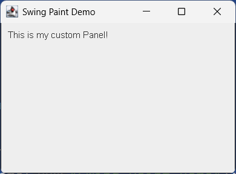

```java
package com.lfy.ch01;

import javax.swing.SwingUtilities;
import javax.swing.JFrame;
import javax.swing.JPanel;
import javax.swing.BorderFactory;
import java.awt.Color;
import java.awt.Dimension;
import java.awt.Graphics;

public class SwingPaintDemo2 {

    public static void main(String[] args) {
        SwingUtilities.invokeLater(new Runnable() {
            public void run() {
                createAndShowGUI();
            }
        });
    }

    private static void createAndShowGUI() {
        System.out.println("Created GUI on EDT? "+
                SwingUtilities.isEventDispatchThread());
        JFrame f = new JFrame("Swing Paint Demo");
        f.setDefaultCloseOperation(JFrame.EXIT_ON_CLOSE);
        f.add(new MyPanel());
        f.pack();
        f.setVisible(true);
    }
}

class MyPanel extends JPanel {

    public MyPanel() {
        setBorder(BorderFactory.createLineBorder(Color.black));
    }

    public Dimension getPreferredSize() {
        return new Dimension(250,200);
    }

    public void paintComponent(Graphics g) {
        super.paintComponent(g);

        // Draw Text
        g.drawString("This is my custom Panel! ",10,20);
    }
}
```

## 第三步：区域绘制

> 最后，我们将添加事件处理代码，以便在用户点击或拖动鼠标时以编程方式重新绘制组件。为了尽可能保持自定义绘制的高效性，我们将**追踪鼠标坐标**并仅**重绘屏幕上发生变化的区域**。这是一项推荐的最佳实践，可确保您的应用程序尽可能高效运行。

```java
import javax.swing.SwingUtilities;
import javax.swing.JFrame;
import javax.swing.JPanel;
import javax.swing.BorderFactory;
import java.awt.Color;
import java.awt.Dimension;
import java.awt.Graphics;
import java.awt.event.MouseEvent;
import java.awt.event.MouseListener;
import java.awt.event.MouseAdapter;
import java.awt.event.MouseMotionListener;
import java.awt.event.MouseMotionAdapter;

public class SwingPaintDemo3 {
    
    public static void main(String[] args) {
        SwingUtilities.invokeLater(new Runnable() {
            public void run() {
                createAndShowGUI(); 
            }
        });
    }

    private static void createAndShowGUI() {
        System.out.println("Created GUI on EDT? "+
        SwingUtilities.isEventDispatchThread());
        JFrame f = new JFrame("Swing Paint Demo");
        f.setDefaultCloseOperation(JFrame.EXIT_ON_CLOSE); 
        f.add(new MyPanel());
        f.pack();
        f.setVisible(true);
    } 
}

class MyPanel extends JPanel {

    private int squareX = 50;
    private int squareY = 50;
    private int squareW = 20;
    private int squareH = 20;

    public MyPanel() {

        setBorder(BorderFactory.createLineBorder(Color.black));

        addMouseListener(new MouseAdapter() {
            public void mousePressed(MouseEvent e) {
                moveSquare(e.getX(),e.getY());
            }
        });

        addMouseMotionListener(new MouseAdapter() {
            public void mouseDragged(MouseEvent e) {
                moveSquare(e.getX(),e.getY());
            }
        });
        
    }
    
    private void moveSquare(int x, int y) {
        int OFFSET = 1;
        if ((squareX!=x) || (squareY!=y)) {
            repaint(squareX,squareY,squareW+OFFSET,squareH+OFFSET);
            squareX=x;
            squareY=y;
            repaint(squareX,squareY,squareW+OFFSET,squareH+OFFSET);
        } 
    }
    

    public Dimension getPreferredSize() {
        return new Dimension(250,200);
    }
    
    protected void paintComponent(Graphics g) {
        super.paintComponent(g);       
        g.drawString("This is my custom Panel!",10,20);
        g.setColor(Color.RED);
        g.fillRect(squareX,squareY,squareW,squareH);
        g.setColor(Color.BLACK);
        g.drawRect(squareX,squareY,squareW,squareH);
    }  
}
```

## 重绘机制

所有绘制代码都应放置在 `paintComponent` 方法中。虽然确实会在需要绘制时调用该方法，但实际的绘制过程始于类层次结构中更高层级的 `paint` 方法（由 `java.awt.Component` 定义）。每当组件需要渲染时，绘制子系统就会执行该方法。其方法签名为：

- `public void paint(Graphics g)`

`javax.swing.JComponent` 扩展了此类，并将 `paint` 方法进一步分解为三个独立方法，这些方法按以下顺序调用：

- `protected void paintComponent(Graphics g)`
- `protected void paintBorder(Graphics g)`
- `protected void paintChildren(Graphics g)`