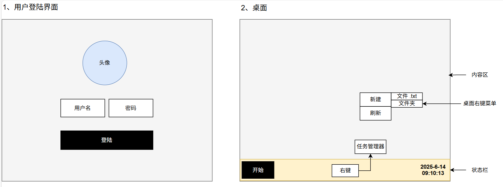
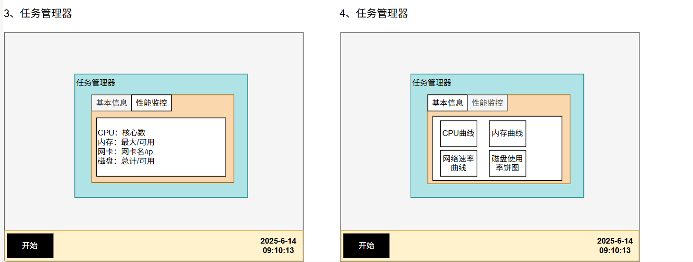
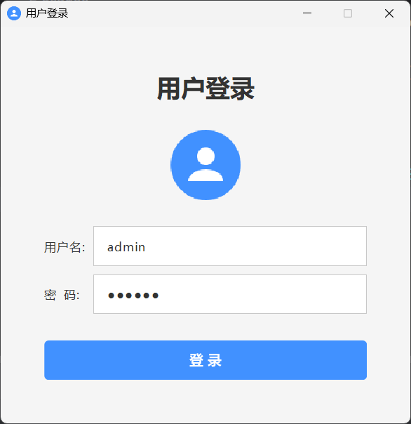
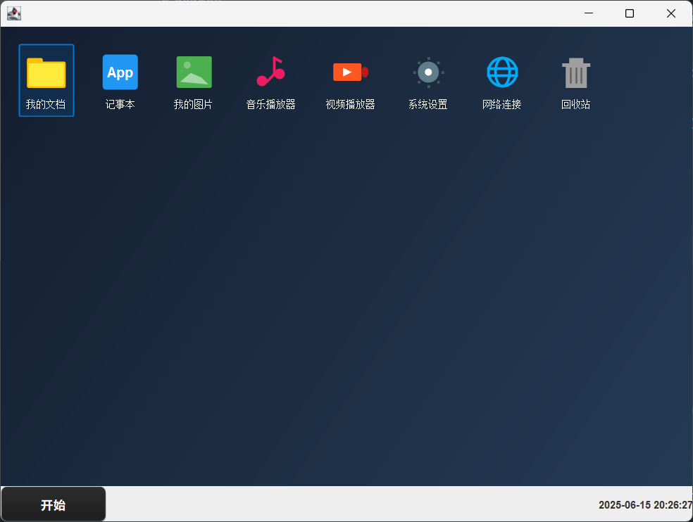

# 2. 项目 - MOSS-v1.0

> **MOSS **是一个用 Java Swing 编写的**操作系统**（当然功能还差很多）；项目主要练习
> 
> 1. **面向对象**的深度使用
> 2. **项目组织结构**与分包**分层开发**
> 3. 编写**项目文档**，**产品说明**，**业务流程**
> 4. 理解**可视化**

**人机配合**：（人走大流程，机器写小功能）

1. 人类：
  1. 想清楚敲哪些功能
  2. 抽取原子功能（这个一个单独的功能）
2. AI：
  1. 只写原子组件

## 项目说明

这是一个**模拟操作系统流程项目**；包含以下功能；

1. **用户登陆界面**（账号、密码、头像信息）
2. **桌面**
  1. 桌面图标区
  2. 底部状态栏（开始按钮、时间显示）
  3. 桌面右键菜单
3. **状态栏右键**，展示任务管理器（基础信息[CPU、网卡等]、性能监控）

## 产品原型





## 开发步骤

### 抽取公共组件

#### MordernButton：现代化按钮

> 用Java Swing写一个漂亮的按钮组件，现代化暗黑风格

```java
import javax.swing.*;
import java.awt.*;
import java.awt.event.MouseAdapter;
import java.awt.event.MouseEvent;
import java.awt.geom.RoundRectangle2D;

public class ModernButton extends JButton {

    // 颜色定义
    private static final Color BACKGROUND_COLOR = new Color(45, 45, 45);
    private static final Color HOVER_COLOR = new Color(65, 65, 65);
    private static final Color PRESSED_COLOR = new Color(35, 35, 35);
    private static final Color TEXT_COLOR = new Color(220, 220, 220);
    private static final Color BORDER_COLOR = new Color(80, 80, 80);
    private static final Color ACCENT_COLOR = new Color(0, 122, 255);

    // 状态变量
    private boolean isHovered = false;
    private boolean isPressed = false;
    private int cornerRadius = 8;
    private boolean isPrimary = false;

    public ModernButton(String text) {
        super(text);
        initButton();
    }

    public ModernButton(String text, boolean isPrimary) {
        super(text);
        this.isPrimary = isPrimary;
        initButton();
    }

    private void initButton() {
        // 基本设置
        setContentAreaFilled(false);
        setBorderPainted(false);
        setFocusPainted(false);
        setOpaque(false);

        // 字体设置
        setFont(new Font("微软雅黑", Font.PLAIN, 14));
        setForeground(TEXT_COLOR);

        // 大小设置
        setPreferredSize(new Dimension(120, 40));

        // 鼠标事件监听
        addMouseListener(new MouseAdapter() {
            @Override
            public void mouseEntered(MouseEvent e) {
                isHovered = true;
                setCursor(new Cursor(Cursor.HAND_CURSOR));
                repaint();
            }

            @Override
            public void mouseExited(MouseEvent e) {
                isHovered = false;
                setCursor(new Cursor(Cursor.DEFAULT_CURSOR));
                repaint();
            }

            @Override
            public void mousePressed(MouseEvent e) {
                isPressed = true;
                repaint();
            }

            @Override
            public void mouseReleased(MouseEvent e) {
                isPressed = false;
                repaint();
            }
        });
    }

    @Override
    protected void paintComponent(Graphics g) {
        Graphics2D g2d = (Graphics2D) g.create();

        // 抗锯齿
        g2d.setRenderingHint(RenderingHints.KEY_ANTIALIASING, RenderingHints.VALUE_ANTIALIAS_ON);
        g2d.setRenderingHint(RenderingHints.KEY_TEXT_ANTIALIASING, RenderingHints.VALUE_TEXT_ANTIALIAS_ON);

        // 获取按钮状态颜色
        Color bgColor = getBackgroundColor();

        // 绘制阴影（如果不是按下状态）
        if (!isPressed) {
            g2d.setColor(new Color(0, 0, 0, 30));
            g2d.fill(new RoundRectangle2D.Float(2, 3, getWidth() - 4, getHeight() - 4, cornerRadius, cornerRadius));
        }

        // 绘制按钮背景
        g2d.setColor(bgColor);
        g2d.fill(new RoundRectangle2D.Float(0, 0, getWidth() - 1, getHeight() - 1, cornerRadius, cornerRadius));

        // 绘制边框
        if (!isPrimary) {
            g2d.setColor(BORDER_COLOR);
            g2d.setStroke(new BasicStroke(1f));
            g2d.draw(new RoundRectangle2D.Float(0.5f, 0.5f, getWidth() - 2, getHeight() - 2, cornerRadius, cornerRadius));
        }

        // 绘制高光效果（悬停时）
        if (isHovered && !isPressed) {
            g2d.setColor(new Color(255, 255, 255, 10));
            g2d.fill(new RoundRectangle2D.Float(1, 1, getWidth() - 3, getHeight() / 2f, cornerRadius, cornerRadius));
        }

        // 绘制文本
        drawCenteredText(g2d);

        g2d.dispose();
    }

    private Color getBackgroundColor() {
        if (isPrimary) {
            if (isPressed) {
                return ACCENT_COLOR.darker();
            } else if (isHovered) {
                return ACCENT_COLOR.brighter();
            } else {
                return ACCENT_COLOR;
            }
        } else {
            if (isPressed) {
                return PRESSED_COLOR;
            } else if (isHovered) {
                return HOVER_COLOR;
            } else {
                return BACKGROUND_COLOR;
            }
        }
    }

    private void drawCenteredText(Graphics2D g2d) {
        FontMetrics fm = g2d.getFontMetrics();
        String text = getText();

        if (text != null && !text.isEmpty()) {
            int textWidth = fm.stringWidth(text);
            int textHeight = fm.getHeight();

            int x = (getWidth() - textWidth) / 2;
            int y = (getHeight() - textHeight) / 2 + fm.getAscent();

            // 文本阴影效果
            if (!isPrimary) {
                g2d.setColor(new Color(0, 0, 0, 100));
                g2d.drawString(text, x + 1, y + 1);
            }

            // 主文本
            g2d.setColor(isPrimary ? Color.WHITE : TEXT_COLOR);
            g2d.drawString(text, x, y);
        }
    }

    // Getter 和 Setter 方法
    public void setCornerRadius(int cornerRadius) {
        this.cornerRadius = cornerRadius;
        repaint();
    }

    public int getCornerRadius() {
        return cornerRadius;
    }

    public void setPrimary(boolean primary) {
        this.isPrimary = primary;
        repaint();
    }

    public boolean isPrimary() {
        return isPrimary;
    }
}
```

#### 

#### ModernTextField：现代化输入框

> Java Swing 编写一个漂亮的现代化风格的输入框，可以输入普通文本，密码等

```java
import javax.swing.*;
import javax.swing.border.EmptyBorder;
import java.awt.*;
import java.awt.event.*;
import java.awt.geom.RoundRectangle2D;

public class ModernTextField extends JPanel {

    // 输入框类型枚举
    public enum FieldType {
        TEXT, PASSWORD, EMAIL, NUMBER, SEARCH
    }

    // 颜色定义
    private static final Color BACKGROUND_COLOR = new Color(45, 45, 48);
    private static final Color BORDER_COLOR = new Color(80, 80, 80);
    private static final Color FOCUS_BORDER_COLOR = new Color(0, 122, 255);
    private static final Color ERROR_BORDER_COLOR = new Color(231, 76, 60);
    private static final Color SUCCESS_BORDER_COLOR = new Color(46, 204, 113);
    private static final Color TEXT_COLOR = new Color(220, 220, 220);
    private static final Color PLACEHOLDER_COLOR = new Color(140, 140, 140);
    private static final Color LABEL_COLOR = new Color(180, 180, 180);

    // 组件
    private JTextField textField;
    private JPasswordField passwordField;
    private JLabel labelText;
    private JLabel iconLabel;
    private JLabel suffixIconLabel;
    private JComponent activeField;

    // 属性
    private String placeholder = "";
    private String labelStr = "";
    private FieldType fieldType = FieldType.TEXT;
    private boolean isError = false;
    private boolean isSuccess = false;
    private boolean showPassword = false;
    private Icon prefixIcon;
    private Icon suffixIcon;
    private int cornerRadius = 8;
    private boolean animateLabel = true;

    // 动画相关
    private Timer focusTimer;
    private Timer errorShakeTimer;
    private float focusProgress = 0.0f;
    private boolean isFocused = false;
    private int shakeOffset = 0;

    public ModernTextField() {
        this(FieldType.TEXT);
    }

    public ModernTextField(FieldType type) {
        this.fieldType = type;
        initComponent();
    }

    private void initComponent() {
        setLayout(new BorderLayout());
        setOpaque(false);
        setPreferredSize(new Dimension(280, 60));

        // 创建主输入面板
        JPanel inputPanel = createInputPanel();
        add(inputPanel, BorderLayout.CENTER);

        // 设置字体
        Font font = getSupportedChineseFont(Font.PLAIN, 14);
        if (textField != null) textField.setFont(font);
        if (passwordField != null) passwordField.setFont(font);
    }

    private JPanel createInputPanel() {
        JPanel panel = new JPanel() {
            @Override
            protected void paintComponent(Graphics g) {
                paintBackground(g);
            }
        };
        panel.setLayout(new BorderLayout());
        panel.setOpaque(false);
        panel.setBorder(new EmptyBorder(8, 12, 8, 12));

        // 创建标签
        if (!labelStr.isEmpty()) {
            labelText = new JLabel(labelStr);
            labelText.setFont(getSupportedChineseFont(Font.PLAIN, 12));
            labelText.setForeground(LABEL_COLOR);
            panel.add(labelText, BorderLayout.NORTH);
        }

        // 创建输入区域
        JPanel inputArea = new JPanel(new BorderLayout(8, 0));
        inputArea.setOpaque(false);

        // 添加前缀图标
        if (prefixIcon != null) {
            iconLabel = new JLabel(prefixIcon);
            inputArea.add(iconLabel, BorderLayout.WEST);
        }

        // 创建输入字段
        createInputField();
        inputArea.add(activeField, BorderLayout.CENTER);

        // 添加后缀图标
        createSuffixIcon();
        if (suffixIconLabel != null) {
            inputArea.add(suffixIconLabel, BorderLayout.EAST);
        }

        panel.add(inputArea, BorderLayout.CENTER);
        return panel;
    }

    private void createInputField() {
        if (fieldType == FieldType.PASSWORD) {
            passwordField = new JPasswordField() {
                @Override
                protected void paintComponent(Graphics g) {
                    setOpaque(false);
                    super.paintComponent(g);
                }
            };
            setupField(passwordField);
            activeField = passwordField;
        } else {
            textField = new JTextField() {
                @Override
                protected void paintComponent(Graphics g) {
                    setOpaque(false);
                    super.paintComponent(g);
                }
            };
            setupField(textField);
            activeField = textField;
        }
    }

    private void setupField(JTextField field) {
        field.setOpaque(false);
        field.setBorder(null);
        field.setForeground(TEXT_COLOR);
        field.setCaretColor(FOCUS_BORDER_COLOR);
        field.setSelectionColor(FOCUS_BORDER_COLOR.darker());
        field.setSelectedTextColor(Color.WHITE);

        // 设置占位符
        setPlaceholder(field);

        // 添加事件监听器
        addFieldListeners(field);

        // 输入验证
        addInputValidation(field);
    }

    private void setPlaceholder(JTextField field) {
        if (!placeholder.isEmpty()) {
            field.putClientProperty("JTextField.placeholderText", placeholder);

            // 自定义占位符渲染（如果系统不支持）
            field.addFocusListener(new FocusAdapter() {
                @Override
                public void focusGained(FocusEvent e) {
                    if (field.getText().equals(placeholder)) {
                        field.setText("");
                        field.setForeground(TEXT_COLOR);
                    }
                }

                @Override
                public void focusLost(FocusEvent e) {
                    if (field.getText().isEmpty()) {
                        field.setForeground(PLACEHOLDER_COLOR);
                        field.setText(placeholder);
                    }
                }
            });

            if (field.getText().isEmpty()) {
                field.setForeground(PLACEHOLDER_COLOR);
                field.setText(placeholder);
            }
        }
    }

    private void addFieldListeners(JTextField field) {
        field.addFocusListener(new FocusAdapter() {
            @Override
            public void focusGained(FocusEvent e) {
                isFocused = true;
                isError = false;
                startFocusAnimation(true);
                animateLabelUp();
            }

            @Override
            public void focusLost(FocusEvent e) {
                isFocused = false;
                startFocusAnimation(false);
                if (field.getText().isEmpty() || field.getText().equals(placeholder)) {
                    animateLabelDown();
                }
            }
        });

        field.addKeyListener(new KeyAdapter() {
            @Override
            public void keyPressed(KeyEvent e) {
                if (e.getKeyCode() == KeyEvent.VK_ENTER) {
                    fireActionEvent();
                }
            }
        });

        // 文本变化监听
        field.getDocument().addDocumentListener(new javax.swing.event.DocumentListener() {
            @Override
            public void insertUpdate(javax.swing.event.DocumentEvent e) {
                validateInput();
            }

            @Override
            public void removeUpdate(javax.swing.event.DocumentEvent e) {
                validateInput();
            }

            @Override
            public void changedUpdate(javax.swing.event.DocumentEvent e) {
                validateInput();
            }
        });
    }

    private void addInputValidation(JTextField field) {
        switch (fieldType) {
            case EMAIL:
                // 邮箱验证逻辑
                break;
            case NUMBER:
                // 数字验证逻辑
                field.addKeyListener(new KeyAdapter() {
                    @Override
                    public void keyTyped(KeyEvent e) {
                        char c = e.getKeyChar();
                        if (!Character.isDigit(c) && c != '.' && c != '-' && c != KeyEvent.VK_BACK_SPACE) {
                            e.consume();
                        }
                    }
                });
                break;
        }
    }

    private void createSuffixIcon() {
        if (fieldType == FieldType.PASSWORD) {
            // 密码显示/隐藏图标
            suffixIconLabel = new JLabel(createEyeIcon(false));
            suffixIconLabel.setCursor(new Cursor(Cursor.HAND_CURSOR));
            suffixIconLabel.addMouseListener(new MouseAdapter() {
                @Override
                public void mouseClicked(MouseEvent e) {
                    togglePasswordVisibility();
                }

                @Override
                public void mouseEntered(MouseEvent e) {
                    suffixIconLabel.setIcon(createEyeIcon(showPassword, true));
                }

                @Override
                public void mouseExited(MouseEvent e) {
                    suffixIconLabel.setIcon(createEyeIcon(showPassword, false));
                }
            });
        } else if (fieldType == FieldType.SEARCH) {
            // 搜索图标
            suffixIconLabel = new JLabel(createSearchIcon());
        } else if (suffixIcon != null) {
            suffixIconLabel = new JLabel(suffixIcon);
        }
    }

    private void paintBackground(Graphics g) {
        Graphics2D g2d = (Graphics2D) g.create();
        g2d.setRenderingHint(RenderingHints.KEY_ANTIALIASING, RenderingHints.VALUE_ANTIALIAS_ON);

        int width = getWidth();
        int height = getHeight();

        // 应用震动效果
        if (shakeOffset != 0) {
            g2d.translate(shakeOffset, 0);
        }

        // 绘制背景
        g2d.setColor(BACKGROUND_COLOR);
        g2d.fill(new RoundRectangle2D.Float(0, 0, width, height, cornerRadius, cornerRadius));

        // 绘制边框
        Color borderColor = getBorderColor();
        float borderWidth = isFocused ? 2.0f : 1.0f;

        // 动画边框效果
        if (focusProgress > 0) {
            // 混合颜色
            float r = BORDER_COLOR.getRed() + (FOCUS_BORDER_COLOR.getRed() - BORDER_COLOR.getRed()) * focusProgress;
            float ga = BORDER_COLOR.getGreen() + (FOCUS_BORDER_COLOR.getGreen() - BORDER_COLOR.getGreen()) * focusProgress;
            float b = BORDER_COLOR.getBlue() + (FOCUS_BORDER_COLOR.getBlue() - BORDER_COLOR.getBlue()) * focusProgress;
            borderColor = new Color(Math.round(r), Math.round(ga), Math.round(b));
            borderWidth = 1.0f + focusProgress;
        }

        g2d.setColor(borderColor);
        g2d.setStroke(new BasicStroke(borderWidth));
        g2d.draw(new RoundRectangle2D.Float(borderWidth/2, borderWidth/2,
                width - borderWidth, height - borderWidth, cornerRadius, cornerRadius));

        g2d.dispose();
    }

    private Color getBorderColor() {
        if (isError) return ERROR_BORDER_COLOR;
        if (isSuccess) return SUCCESS_BORDER_COLOR;
        if (isFocused) return FOCUS_BORDER_COLOR;
        return BORDER_COLOR;
    }

    private void startFocusAnimation(boolean focusIn) {
        if (focusTimer != null && focusTimer.isRunning()) {
            focusTimer.stop();
        }

        focusTimer = new Timer(20, new ActionListener() {
            @Override
            public void actionPerformed(ActionEvent e) {
                if (focusIn) {
                    focusProgress += 0.1f;
                    if (focusProgress >= 1.0f) {
                        focusProgress = 1.0f;
                        focusTimer.stop();
                    }
                } else {
                    focusProgress -= 0.1f;
                    if (focusProgress <= 0.0f) {
                        focusProgress = 0.0f;
                        focusTimer.stop();
                    }
                }
                repaint();
            }
        });
        focusTimer.start();
    }

    private void animateLabelUp() {
        if (labelText != null && animateLabel) {
            labelText.setFont(getSupportedChineseFont(Font.PLAIN, 10));
            labelText.setForeground(FOCUS_BORDER_COLOR);
        }
    }

    private void animateLabelDown() {
        if (labelText != null && animateLabel) {
            labelText.setFont(getSupportedChineseFont(Font.PLAIN, 12));
            labelText.setForeground(LABEL_COLOR);
        }
    }

    private void startErrorShake() {
        if (errorShakeTimer != null && errorShakeTimer.isRunning()) {
            return;
        }

        final int[] shakePattern = {5, -5, 4, -4, 3, -3, 2, -2, 1, -1, 0};
        final int[] index = {0};

        errorShakeTimer = new Timer(50, new ActionListener() {
            @Override
            public void actionPerformed(ActionEvent e) {
                if (index[0] < shakePattern.length) {
                    shakeOffset = shakePattern[index[0]++];
                    repaint();
                } else {
                    shakeOffset = 0;
                    errorShakeTimer.stop();
                    repaint();
                }
            }
        });
        errorShakeTimer.start();
    }

    private void togglePasswordVisibility() {
        showPassword = !showPassword;
        if (passwordField != null) {
            passwordField.setEchoChar(showPassword ? (char) 0 : '•');
            suffixIconLabel.setIcon(createEyeIcon(showPassword));
        }
    }

    private void validateInput() {
        String text = getText();
        isError = false;
        isSuccess = false;

        switch (fieldType) {
            case EMAIL:
                if (!text.isEmpty()) {
                    isError = !isValidEmail(text);
                    isSuccess = !isError;
                }
                break;
            case PASSWORD:
                if (!text.isEmpty()) {
                    isSuccess = isValidPassword(text);
                    isError = !isSuccess;
                }
                break;
        }

        repaint();
    }

    private boolean isValidEmail(String email) {
        return email.matches("^[A-Za-z0-9+_.-]+@[A-Za-z0-9.-]+\\.[A-Za-z]{2,}$");
    }

    private boolean isValidPassword(String password) {
        // 简单密码验证：至少8位，包含字母和数字
        return password.length() >= 8 &&
                password.matches(".*[A-Za-z].*") &&
                password.matches(".*[0-9].*");
    }

    // 创建图标的方法
    private Icon createEyeIcon(boolean visible) {
        return createEyeIcon(visible, false);
    }

    private Icon createEyeIcon(boolean visible, boolean hover) {
        return new Icon() {
            @Override
            public void paintIcon(Component c, Graphics g, int x, int y) {
                Graphics2D g2d = (Graphics2D) g.create();
                g2d.setRenderingHint(RenderingHints.KEY_ANTIALIASING, RenderingHints.VALUE_ANTIALIAS_ON);

                Color color = hover ? FOCUS_BORDER_COLOR : PLACEHOLDER_COLOR;
                g2d.setColor(color);
                g2d.setStroke(new BasicStroke(1.5f));

                if (visible) {
                    // 睁开的眼睛
                    g2d.drawOval(x + 2, y + 6, 16, 8);
                    g2d.fillOval(x + 8, y + 8, 4, 4);
                } else {
                    // 闭合的眼睛
                    g2d.drawOval(x + 2, y + 6, 16, 8);
                    g2d.fillOval(x + 8, y + 8, 4, 4);
                    g2d.drawLine(x + 2, y + 2, x + 18, y + 18);
                }

                g2d.dispose();
            }

            @Override
            public int getIconWidth() { return 20; }

            @Override
            public int getIconHeight() { return 20; }
        };
    }

    private Icon createSearchIcon() {
        return new Icon() {
            @Override
            public void paintIcon(Component c, Graphics g, int x, int y) {
                Graphics2D g2d = (Graphics2D) g.create();
                g2d.setRenderingHint(RenderingHints.KEY_ANTIALIASING, RenderingHints.VALUE_ANTIALIAS_ON);

                g2d.setColor(PLACEHOLDER_COLOR);
                g2d.setStroke(new BasicStroke(2f));
                g2d.drawOval(x + 2, y + 2, 12, 12);
                g2d.drawLine(x + 12, y + 12, x + 17, y + 17);

                g2d.dispose();
            }

            @Override
            public int getIconWidth() { return 20; }

            @Override
            public int getIconHeight() { return 20; }
        };
    }

    private Font getSupportedChineseFont(int style, int size) {
        String[] fontNames = {
                "Microsoft YaHei", "SimHei", "SimSun", "Dialog", "SansSerif"
        };

        GraphicsEnvironment ge = GraphicsEnvironment.getLocalGraphicsEnvironment();
        String[] availableFonts = ge.getAvailableFontFamilyNames();

        for (String fontName : fontNames) {
            for (String availableFont : availableFonts) {
                if (availableFont.equals(fontName)) {
                    return new Font(fontName, style, size);
                }
            }
        }

        return new Font(Font.SANS_SERIF, style, size);
    }

    private void fireActionEvent() {
        ActionEvent event = new ActionEvent(this, ActionEvent.ACTION_PERFORMED, "textFieldAction");
        for (ActionListener listener : getActionListeners()) {
            listener.actionPerformed(event);
        }
    }

    // 公共方法
    public String getText() {
        if (activeField instanceof JPasswordField) {
            char[] password = ((JPasswordField) activeField).getPassword();
            return new String(password);
        } else if (activeField instanceof JTextField) {
            String text = ((JTextField) activeField).getText();
            return text.equals(placeholder) ? "" : text;
        }
        return "";
    }

    public void setText(String text) {
        if (activeField instanceof JTextField) {
            ((JTextField) activeField).setText(text);
            ((JTextField) activeField).setForeground(TEXT_COLOR);
        }
    }

    public void setPlaceholder(String placeholder) {
        this.placeholder = placeholder;
        if (activeField instanceof JTextField) {
            setPlaceholder((JTextField) activeField);
        }
    }

    public void setLabel(String label) {
        this.labelStr = label;
        if (labelText != null) {
            labelText.setText(label);
        }
    }

    public void setError(boolean error) {
        this.isError = error;
        if (error) {
            startErrorShake();
        }
        repaint();
    }

    public void setSuccess(boolean success) {
        this.isSuccess = success;
        this.isError = false;
        repaint();
    }

    public void setPrefixIcon(Icon icon) {
        this.prefixIcon = icon;
    }

    public void setSuffixIcon(Icon icon) {
        this.suffixIcon = icon;
    }

    public void setFieldType(FieldType type) {
        this.fieldType = type;
    }

    public void addActionListener(ActionListener listener) {
        listenerList.add(ActionListener.class, listener);
    }

    public void removeActionListener(ActionListener listener) {
        listenerList.remove(ActionListener.class, listener);
    }

    public ActionListener[] getActionListeners() {
        return listenerList.getListeners(ActionListener.class);
    }

    @Override
    public void setEnabled(boolean enabled) {
        super.setEnabled(enabled);
        if (activeField != null) {
            activeField.setEnabled(enabled);
        }
    }

    @Override
    public void requestFocus() {
        if (activeField != null) {
            activeField.requestFocus();
        }
    }
}
```

#### DesktopIcon：桌面图标

> Java Swing 编写一个组件，用来封装类似windows桌面图标，上面是图标，下面是文字

```java
import javax.swing.*;
import java.awt.*;
import java.awt.event.*;
import java.awt.geom.RoundRectangle2D;
import java.awt.image.BufferedImage;

public class DesktopIcon extends JComponent {

    // 属性
    private Icon icon;
    private String text;
    private boolean isSelected = false;
    private boolean isHovered = false;
    private boolean isPressed = false;
    private boolean isDoubleClicked = false;

    // 颜色定义
    private static final Color SELECTION_COLOR = new Color(0, 120, 215, 80);
    private static final Color HOVER_COLOR = new Color(255, 255, 255, 30);
    private static final Color TEXT_COLOR = Color.WHITE;
    private static final Color TEXT_SHADOW_COLOR = new Color(0, 0, 0, 150);
    private static final Color SELECTION_BORDER_COLOR = new Color(0, 120, 215);

    // 尺寸设置
    private int iconSize = 48;
    private int padding = 8;
    private int textPadding = 4;
    private int cornerRadius = 4;

    // 事件监听器
    private ActionListener actionListener;
    private ActionListener doubleClickListener;

    // 动画效果
    private Timer hoverTimer;
    private float hoverAlpha = 0.0f;

    public DesktopIcon(Icon icon, String text) {
        this.icon = icon;
        this.text = text;
        initComponent();
    }

    public DesktopIcon(String imagePath, String text) {
        this.icon = loadImageIcon(imagePath);
        this.text = text;
        initComponent();
    }

    private void initComponent() {
        setOpaque(false);
        setFocusable(true);

        // 计算组件大小
        Font font = getSupportedChineseFont();
        FontMetrics fm = getFontMetrics(font);
        int textWidth = fm.stringWidth(text);
        int textHeight = fm.getHeight();

        int width = Math.max(iconSize, textWidth) + padding * 2;
        int height = iconSize + textHeight + textPadding + padding * 2;

        setPreferredSize(new Dimension(width, height));
        setSize(new Dimension(width, height));

        // 设置字体
        setFont(getSupportedChineseFont());

        // 添加鼠标监听器
        addMouseListener(new MouseAdapter() {
            private long lastClickTime = 0;

            @Override
            public void mouseEntered(MouseEvent e) {
                isHovered = true;
                setCursor(new Cursor(Cursor.HAND_CURSOR));
                startHoverAnimation(true);
            }

            @Override
            public void mouseExited(MouseEvent e) {
                isHovered = false;
                setCursor(new Cursor(Cursor.DEFAULT_CURSOR));
                startHoverAnimation(false);
            }

            @Override
            public void mousePressed(MouseEvent e) {
                if (e.getButton() == MouseEvent.BUTTON1) {
                    isPressed = true;
                    requestFocusInWindow();
                    repaint();
                }
            }

            @Override
            public void mouseReleased(MouseEvent e) {
                if (isPressed && e.getButton() == MouseEvent.BUTTON1) {
                    isPressed = false;

                    // 检测双击
                    long currentTime = System.currentTimeMillis();
                    if (currentTime - lastClickTime < 500) {
                        // 双击事件
                        isDoubleClicked = true;
                        if (doubleClickListener != null) {
                            doubleClickListener.actionPerformed(new ActionEvent(this, ActionEvent.ACTION_PERFORMED, "doubleClick"));
                        }
                    } else {
                        // 单击事件
                        setSelected(true);
                        if (actionListener != null) {
                            actionListener.actionPerformed(new ActionEvent(this, ActionEvent.ACTION_PERFORMED, "click"));
                        }
                    }
                    lastClickTime = currentTime;
                    repaint();
                }
            }

            @Override
            public void mouseClicked(MouseEvent e) {
                if (e.getClickCount() == 2 && doubleClickListener != null) {
                    doubleClickListener.actionPerformed(new ActionEvent(this, ActionEvent.ACTION_PERFORMED, "doubleClick"));
                }
            }
        });

        // 键盘监听器
        addKeyListener(new KeyAdapter() {
            @Override
            public void keyPressed(KeyEvent e) {
                if (e.getKeyCode() == KeyEvent.VK_ENTER || e.getKeyCode() == KeyEvent.VK_SPACE) {
                    if (doubleClickListener != null) {
                        doubleClickListener.actionPerformed(new ActionEvent(this, ActionEvent.ACTION_PERFORMED, "enter"));
                    }
                }
            }
        });

        // 焦点监听器
        addFocusListener(new FocusAdapter() {
            @Override
            public void focusGained(FocusEvent e) {
                repaint();
            }

            @Override
            public void focusLost(FocusEvent e) {
                setSelected(false);
                repaint();
            }
        });
    }

    @Override
    protected void paintComponent(Graphics g) {
        super.paintComponent(g);

        Graphics2D g2d = (Graphics2D) g.create();
        g2d.setRenderingHint(RenderingHints.KEY_ANTIALIASING, RenderingHints.VALUE_ANTIALIAS_ON);
        g2d.setRenderingHint(RenderingHints.KEY_TEXT_ANTIALIASING, RenderingHints.VALUE_TEXT_ANTIALIAS_LCD_HRGB);

        int width = getWidth();
        int height = getHeight();

        // 绘制选中/悬停背景
        if (isSelected || isHovered || hasFocus()) {
            Color bgColor;
            if (isSelected || hasFocus()) {
                bgColor = new Color(SELECTION_COLOR.getRed(), SELECTION_COLOR.getGreen(),
                        SELECTION_COLOR.getBlue(), (int)(SELECTION_COLOR.getAlpha() * (0.5f + hoverAlpha * 0.5f)));
            } else {
                bgColor = new Color(HOVER_COLOR.getRed(), HOVER_COLOR.getGreen(),
                        HOVER_COLOR.getBlue(), (int)(HOVER_COLOR.getAlpha() * hoverAlpha));
            }

            g2d.setColor(bgColor);
            g2d.fill(new RoundRectangle2D.Float(0, 0, width, height, cornerRadius, cornerRadius));

            // 绘制选中边框
            if (isSelected || hasFocus()) {
                g2d.setColor(SELECTION_BORDER_COLOR);
                g2d.setStroke(new BasicStroke(1.5f));
                g2d.draw(new RoundRectangle2D.Float(1, 1, width - 2, height - 2, cornerRadius, cornerRadius));
            }
        }

        // 绘制按下效果
        if (isPressed) {
            g2d.setColor(new Color(0, 0, 0, 30));
            g2d.fill(new RoundRectangle2D.Float(0, 0, width, height, cornerRadius, cornerRadius));
        }

        // 计算图标位置
        int iconX = (width - iconSize) / 2;
        int iconY = padding;

        // 绘制图标
        if (icon != null) {
            // 如果按下，添加偏移效果
            int offsetX = isPressed ? 1 : 0;
            int offsetY = isPressed ? 1 : 0;

            // 缩放图标到指定大小
            Icon scaledIcon = scaleIcon(icon, iconSize, iconSize);
            scaledIcon.paintIcon(this, g2d, iconX + offsetX, iconY + offsetY);
        }

        // 绘制文本
        if (text != null && !text.isEmpty()) {
            FontMetrics fm = g2d.getFontMetrics();
            int textWidth = fm.stringWidth(text);
            int textHeight = fm.getHeight();

            int textX = (width - textWidth) / 2;
            int textY = iconY + iconSize + textPadding + fm.getAscent();

            // 如果按下，添加偏移效果
            int offsetX = isPressed ? 1 : 0;
            int offsetY = isPressed ? 1 : 0;

            // 绘制文本阴影
            g2d.setColor(TEXT_SHADOW_COLOR);
            g2d.drawString(text, textX + 1 + offsetX, textY + 1 + offsetY);

            // 绘制文本
            g2d.setColor(TEXT_COLOR);
            g2d.drawString(text, textX + offsetX, textY + offsetY);
        }

        g2d.dispose();
    }

    private Icon scaleIcon(Icon icon, int width, int height) {
        if (icon.getIconWidth() == width && icon.getIconHeight() == height) {
            return icon;
        }

        BufferedImage scaledImage = new BufferedImage(width, height, BufferedImage.TYPE_INT_ARGB);
        Graphics2D g2d = scaledImage.createGraphics();
        g2d.setRenderingHint(RenderingHints.KEY_INTERPOLATION, RenderingHints.VALUE_INTERPOLATION_BILINEAR);
        g2d.setRenderingHint(RenderingHints.KEY_ANTIALIASING, RenderingHints.VALUE_ANTIALIAS_ON);

        // 绘制原始图标到缓冲图像
        if (icon instanceof ImageIcon) {
            Image img = ((ImageIcon) icon).getImage();
            g2d.drawImage(img, 0, 0, width, height, null);
        } else {
            icon.paintIcon(null, g2d, 0, 0);
        }

        g2d.dispose();
        return new ImageIcon(scaledImage);
    }

    private Icon loadImageIcon(String imagePath) {
        try {
            ImageIcon originalIcon = new ImageIcon(imagePath);
            if (originalIcon.getIconWidth() <= 0) {
                // 如果图片加载失败，返回默认图标
                return createDefaultIcon();
            }
            return originalIcon;
        } catch (Exception e) {
            return createDefaultIcon();
        }
    }

    private Icon createDefaultIcon() {
        return new Icon() {
            @Override
            public void paintIcon(Component c, Graphics g, int x, int y) {
                Graphics2D g2d = (Graphics2D) g.create();
                g2d.setRenderingHint(RenderingHints.KEY_ANTIALIASING, RenderingHints.VALUE_ANTIALIAS_ON);

                // 绘制默认文件图标
                g2d.setColor(new Color(70, 130, 180));
                g2d.fillRoundRect(x + 4, y + 2, getIconWidth() - 8, getIconHeight() - 4, 4, 4);

                g2d.setColor(new Color(100, 160, 210));
                g2d.fillRoundRect(x + 6, y + 4, getIconWidth() - 12, 8, 2, 2);
                g2d.fillRoundRect(x + 6, y + 14, getIconWidth() - 12, 6, 2, 2);
                g2d.fillRoundRect(x + 6, y + 22, getIconWidth() - 12, 6, 2, 2);

                g2d.dispose();
            }

            @Override
            public int getIconWidth() {
                return iconSize;
            }

            @Override
            public int getIconHeight() {
                return iconSize;
            }
        };
    }

    private Font getSupportedChineseFont() {
        String[] fontNames = {
                "Microsoft YaHei",
                "SimHei",
                "SimSun",
                "Dialog",
                "SansSerif"
        };

        GraphicsEnvironment ge = GraphicsEnvironment.getLocalGraphicsEnvironment();
        String[] availableFonts = ge.getAvailableFontFamilyNames();

        for (String fontName : fontNames) {
            for (String availableFont : availableFonts) {
                if (availableFont.equals(fontName)) {
                    return new Font(fontName, Font.PLAIN, 11);
                }
            }
        }

        return new Font(Font.SANS_SERIF, Font.PLAIN, 11);
    }

    private void startHoverAnimation(boolean fadeIn) {
        if (hoverTimer != null && hoverTimer.isRunning()) {
            hoverTimer.stop();
        }

        hoverTimer = new Timer(20, new ActionListener() {
            @Override
            public void actionPerformed(ActionEvent e) {
                if (fadeIn) {
                    hoverAlpha += 0.1f;
                    if (hoverAlpha >= 1.0f) {
                        hoverAlpha = 1.0f;
                        hoverTimer.stop();
                    }
                } else {
                    hoverAlpha -= 0.1f;
                    if (hoverAlpha <= 0.0f) {
                        hoverAlpha = 0.0f;
                        hoverTimer.stop();
                    }
                }
                repaint();
            }
        });
        hoverTimer.start();
    }

    // 公共方法
    public void setSelected(boolean selected) {
        if (this.isSelected != selected) {
            this.isSelected = selected;
            repaint();
        }
    }

    public boolean isSelected() {
        return isSelected;
    }

    public void setText(String text) {
        this.text = text;
        repaint();
    }

    public String getText() {
        return text;
    }

    public void setIcon(Icon icon) {
        this.icon = icon;
        repaint();
    }

    public Icon getIcon() {
        return icon;
    }

    public void setIconSize(int iconSize) {
        this.iconSize = iconSize;
        revalidate();
        repaint();
    }

    public int getIconSize() {
        return iconSize;
    }

    // 事件监听器方法
    public void addActionListener(ActionListener listener) {
        this.actionListener = AWTEventMulticaster.add(this.actionListener, listener);
    }

    public void removeActionListener(ActionListener listener) {
        this.actionListener = AWTEventMulticaster.remove(this.actionListener, listener);
    }

    public void addDoubleClickListener(ActionListener listener) {
        this.doubleClickListener = AWTEventMulticaster.add(this.doubleClickListener, listener);
    }

    public void removeDoubleClickListener(ActionListener listener) {
        this.doubleClickListener = AWTEventMulticaster.remove(this.doubleClickListener, listener);
    }
    
    // 创建各种图标的方法
    private static Icon createFolderIcon() {
        return new Icon() {
            @Override
            public void paintIcon(Component c, Graphics g, int x, int y) {
                Graphics2D g2d = (Graphics2D) g.create();
                g2d.setRenderingHint(RenderingHints.KEY_ANTIALIASING, RenderingHints.VALUE_ANTIALIAS_ON);

                // 文件夹图标
                g2d.setColor(new Color(255, 193, 7));
                g2d.fillRoundRect(x + 2, y + 12, 44, 30, 4, 4);
                g2d.fillRoundRect(x + 2, y + 8, 18, 8, 4, 4);

                g2d.setColor(new Color(255, 235, 59));
                g2d.fillRoundRect(x + 4, y + 14, 40, 26, 3, 3);

                g2d.dispose();
            }

            @Override
            public int getIconWidth() { return 48; }

            @Override
            public int getIconHeight() { return 48; }
        };
    }

    private static Icon createAppIcon() {
        return new Icon() {
            @Override
            public void paintIcon(Component c, Graphics g, int x, int y) {
                Graphics2D g2d = (Graphics2D) g.create();
                g2d.setRenderingHint(RenderingHints.KEY_ANTIALIASING, RenderingHints.VALUE_ANTIALIAS_ON);

                // 应用程序图标
                g2d.setColor(new Color(33, 150, 243));
                g2d.fillRoundRect(x + 4, y + 4, 40, 40, 8, 8);

                g2d.setColor(Color.WHITE);
                g2d.setFont(new Font("Dialog", Font.BOLD, 16));
                FontMetrics fm = g2d.getFontMetrics();
                String text = "App";
                int textX = x + (48 - fm.stringWidth(text)) / 2;
                int textY = y + (48 - fm.getHeight()) / 2 + fm.getAscent();
                g2d.drawString(text, textX, textY);

                g2d.dispose();
            }

            @Override
            public int getIconWidth() { return 48; }

            @Override
            public int getIconHeight() { return 48; }
        };
    }

    private static Icon createImageIcon() {
        return new Icon() {
            @Override
            public void paintIcon(Component c, Graphics g, int x, int y) {
                Graphics2D g2d = (Graphics2D) g.create();
                g2d.setRenderingHint(RenderingHints.KEY_ANTIALIASING, RenderingHints.VALUE_ANTIALIAS_ON);

                // 图片图标
                g2d.setColor(new Color(76, 175, 80));
                g2d.fillRoundRect(x + 4, y + 6, 40, 36, 4, 4);

                g2d.setColor(new Color(129, 199, 132));
                g2d.fillOval(x + 12, y + 12, 8, 8);

                g2d.setColor(new Color(165, 214, 167));
                int[] xPoints = {x + 8, x + 20, x + 32, x + 40};
                int[] yPoints = {y + 35, y + 25, y + 30, y + 38};
                g2d.fillPolygon(xPoints, yPoints, 4);

                g2d.dispose();
            }

            @Override
            public int getIconWidth() { return 48; }

            @Override
            public int getIconHeight() { return 48; }
        };
    }

    private static Icon createMusicIcon() {
        return new Icon() {
            @Override
            public void paintIcon(Component c, Graphics g, int x, int y) {
                Graphics2D g2d = (Graphics2D) g.create();
                g2d.setRenderingHint(RenderingHints.KEY_ANTIALIASING, RenderingHints.VALUE_ANTIALIAS_ON);

                // 音乐图标
                g2d.setColor(new Color(233, 30, 99));
                g2d.fillOval(x + 8, y + 28, 12, 12);
                g2d.fillOval(x + 28, y + 20, 12, 12);

                g2d.setStroke(new BasicStroke(3));
                g2d.drawLine(x + 20, y + 34, x + 28, y + 26);
                g2d.drawLine(x + 28, y + 8, x + 28, y + 26);
                g2d.drawLine(x + 28, y + 8, x + 35, y + 12);

                g2d.dispose();
            }

            @Override
            public int getIconWidth() { return 48; }

            @Override
            public int getIconHeight() { return 48; }
        };
    }

    private static Icon createVideoIcon() {
        return new Icon() {
            @Override
            public void paintIcon(Component c, Graphics g, int x, int y) {
                Graphics2D g2d = (Graphics2D) g.create();
                g2d.setRenderingHint(RenderingHints.KEY_ANTIALIASING, RenderingHints.VALUE_ANTIALIAS_ON);

                // 视频图标
                g2d.setColor(new Color(255, 87, 34));
                g2d.fillRoundRect(x + 4, y + 14, 32, 20, 4, 4);

                g2d.setColor(Color.WHITE);
                int[] xPoints = {x + 15, x + 15, x + 25};
                int[] yPoints = {y + 19, y + 29, y + 24};
                g2d.fillPolygon(xPoints, yPoints, 3);

                // 摄像头
                g2d.setColor(new Color(183, 28, 28));
                g2d.fillOval(x + 36, y + 18, 8, 12);

                g2d.dispose();
            }

            @Override
            public int getIconWidth() { return 48; }

            @Override
            public int getIconHeight() { return 48; }
        };
    }

    private static Icon createSettingsIcon() {
        return new Icon() {
            @Override
            public void paintIcon(Component c, Graphics g, int x, int y) {
                Graphics2D g2d = (Graphics2D) g.create();
                g2d.setRenderingHint(RenderingHints.KEY_ANTIALIASING, RenderingHints.VALUE_ANTIALIAS_ON);

                // 设置图标（齿轮）
                g2d.setColor(new Color(96, 125, 139));
                g2d.fillOval(x + 12, y + 12, 24, 24);

                g2d.setColor(new Color(69, 90, 100));
                for (int i = 0; i < 8; i++) {
                    double angle = i * Math.PI / 4;
                    int rx = (int) (Math.cos(angle) * 16);
                    int ry = (int) (Math.sin(angle) * 16);
                    g2d.fillRect(x + 24 + rx - 1, y + 24 + ry - 1, 3, 3);
                }

                g2d.setColor(Color.WHITE);
                g2d.fillOval(x + 20, y + 20, 8, 8);

                g2d.dispose();
            }

            @Override
            public int getIconWidth() { return 48; }

            @Override
            public int getIconHeight() { return 48; }
        };
    }

    private static Icon createNetworkIcon() {
        return new Icon() {
            @Override
            public void paintIcon(Component c, Graphics g, int x, int y) {
                Graphics2D g2d = (Graphics2D) g.create();
                g2d.setRenderingHint(RenderingHints.KEY_ANTIALIASING, RenderingHints.VALUE_ANTIALIAS_ON);

                // 网络图标
                g2d.setColor(new Color(3, 169, 244));
                g2d.setStroke(new BasicStroke(3));

                // 绘制地球
                g2d.drawOval(x + 8, y + 8, 32, 32);
                g2d.drawOval(x + 16, y + 8, 16, 32);
                g2d.drawLine(x + 8, y + 20, x + 40, y + 20);
                g2d.drawLine(x + 8, y + 28, x + 40, y + 28);

                g2d.dispose();
            }

            @Override
            public int getIconWidth() { return 48; }

            @Override
            public int getIconHeight() { return 48; }
        };
    }

    private static Icon createTrashIcon() {
        return new Icon() {
            @Override
            public void paintIcon(Component c, Graphics g, int x, int y) {
                Graphics2D g2d = (Graphics2D) g.create();
                g2d.setRenderingHint(RenderingHints.KEY_ANTIALIASING, RenderingHints.VALUE_ANTIALIAS_ON);

                // 回收站图标
                g2d.setColor(new Color(158, 158, 158));
                g2d.fillRect(x + 12, y + 16, 24, 26);
                g2d.fillRect(x + 8, y + 14, 32, 4);
                g2d.fillRect(x + 16, y + 8, 16, 6);

                // 垃圾线条
                g2d.setColor(new Color(97, 97, 97));
                g2d.setStroke(new BasicStroke(2));
                g2d.drawLine(x + 18, y + 20, x + 18, y + 36);
                g2d.drawLine(x + 24, y + 20, x + 24, y + 36);
                g2d.drawLine(x + 30, y + 20, x + 30, y + 36);

                g2d.dispose();
            }

            @Override
            public int getIconWidth() { return 48; }

            @Override
            public int getIconHeight() { return 48; }
        };
    }
}
```

> 测试：

```java
package aaa.ccc;

import javax.swing.*;
import java.awt.*;
import java.awt.event.ActionEvent;
import java.awt.event.ActionListener;

public class DesktopIconDemo {

    public static void main(String[] args) {
        SwingUtilities.invokeLater(() -> {
            try {
            // UIManager.setLookAndFeel(UIManager.getSystemLookAndFeel());
            } catch (Exception e) {
                e.printStackTrace();
            }

            createAndShowGUI();
        });
    }

    private static void createAndShowGUI() {
        JFrame frame = new JFrame("桌面图标组件演示");
        frame.setDefaultCloseOperation(JFrame.EXIT_ON_CLOSE);
        frame.setSize(800, 600);
        frame.setLocationRelativeTo(null);

        // 设置深色背景模拟桌面
        JPanel backgroundPanel = new JPanel() {
            @Override
            protected void paintComponent(Graphics g) {
                super.paintComponent(g);
                // 绘制渐变背景
                Graphics2D g2d = (Graphics2D) g;
                GradientPaint gradient = new GradientPaint(
                        0, 0, new Color(20, 30, 48),
                        getWidth(), getHeight(), new Color(36, 59, 85)
                );
                g2d.setPaint(gradient);
                g2d.fillRect(0, 0, getWidth(), getHeight());
            }
        };
        backgroundPanel.setLayout(new FlowLayout(FlowLayout.LEFT, 20, 20));

        // 创建不同类型的图标
        createIcons(backgroundPanel);

        frame.add(new JScrollPane(backgroundPanel));
        frame.setVisible(true);
    }

    private static void createIcons(JPanel container) {
        // 文件夹图标
        DesktopIcon folderIcon = new DesktopIcon(createFolderIcon(), "我的文档");
        folderIcon.addDoubleClickListener(e ->
                JOptionPane.showMessageDialog(container, "双击了: " + folderIcon.getText()));

        // 应用程序图标
        DesktopIcon appIcon = new DesktopIcon(createAppIcon(), "记事本");
        appIcon.addDoubleClickListener(e ->
                JOptionPane.showMessageDialog(container, "启动应用程序: " + appIcon.getText()));

        // 图片图标
        DesktopIcon imageIcon = new DesktopIcon(createImageIcon(), "我的图片");
        imageIcon.addDoubleClickListener(e ->
                JOptionPane.showMessageDialog(container, "打开图片: " + imageIcon.getText()));

        // 音乐图标
        DesktopIcon musicIcon = new DesktopIcon(createMusicIcon(), "音乐播放器");
        musicIcon.addDoubleClickListener(e ->
                JOptionPane.showMessageDialog(container, "播放音乐: " + musicIcon.getText()));

        // 视频图标
        DesktopIcon videoIcon = new DesktopIcon(createVideoIcon(), "视频播放器");
        videoIcon.addDoubleClickListener(e ->
                JOptionPane.showMessageDialog(container, "播放视频: " + videoIcon.getText()));

        // 设置图标
        DesktopIcon settingsIcon = new DesktopIcon(createSettingsIcon(), "系统设置");
        settingsIcon.addDoubleClickListener(e ->
                JOptionPane.showMessageDialog(container, "打开设置: " + settingsIcon.getText()));

        // 网络图标
        DesktopIcon networkIcon = new DesktopIcon(createNetworkIcon(), "网络连接");
        networkIcon.addDoubleClickListener(e ->
                JOptionPane.showMessageDialog(container, "网络设置: " + networkIcon.getText()));

        // 回收站图标
        DesktopIcon trashIcon = new DesktopIcon(createTrashIcon(), "回收站");
        trashIcon.addDoubleClickListener(e ->
                JOptionPane.showMessageDialog(container, "打开回收站: " + trashIcon.getText()));

        // 添加到容器
        container.add(folderIcon);
        container.add(appIcon);
        container.add(imageIcon);
        container.add(musicIcon);
        container.add(videoIcon);
        container.add(settingsIcon);
        container.add(networkIcon);
        container.add(trashIcon);

        // 添加单击监听器（用于取消其他图标的选中状态）
        DesktopIcon[] icons = {folderIcon, appIcon, imageIcon, musicIcon,
                videoIcon, settingsIcon, networkIcon, trashIcon};

        for (DesktopIcon icon : icons) {
            icon.addActionListener(e -> {
                // 取消其他图标的选中状态
                for (DesktopIcon otherIcon : icons) {
                    if (otherIcon != e.getSource()) {
                        otherIcon.setSelected(false);
                    }
                }
            });
        }
    }
}
```

> 常见组合：
> 
> 1. **标签**: `anchor=EAST, insets=(5,5,5,5)`
> 2. **输入框**: `fill=HORIZONTAL, weightx=1.0, insets=(5,5,5,5)`
> 3. **文本区域**: `fill=BOTH, weightx=1.0, weighty=1.0`
> 4. **按钮**: `anchor=CENTER, insets=(10,10,10,10)`
> 5. **跨列组件**: `gridwidth=REMAINDER, fill=HORIZONTAL`

### 编写登陆界面

### 编写桌面

### 编写状态栏

### 编写步骤：

1. 让AI帮我们写好漂亮的基础组件（按钮、图标）
2. 主程序流程：
  1. 创建JFrame；JFrame分为上下两个位置
    1. 上 **桌面**
      1. **右键菜单**
      2. xxx
    2. 下 **状态栏**
      1. 开始按钮 在 左边
      2. 时间 在 右边

剩下步骤：

1. 展示登陆窗口
  1. 登陆成功以后，展示桌面

自己抽取：

1. 大：
  1. 登陆窗口
    1. 写一个登陆窗口，要布局漂亮
    2. **文本框、按钮**
    3. 按钮点击以后，判断登陆成功后要跳转 桌面
2. 大：
  1. 桌面
    1. 桌面面板
    2. 状态栏面板
      1. 开始按钮 在 左边
      2. 时间 在 右边

## 成品项目：

### 效果





### 代码

[📎 project-moss.zip](<files/project-moss.zip>)