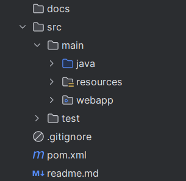
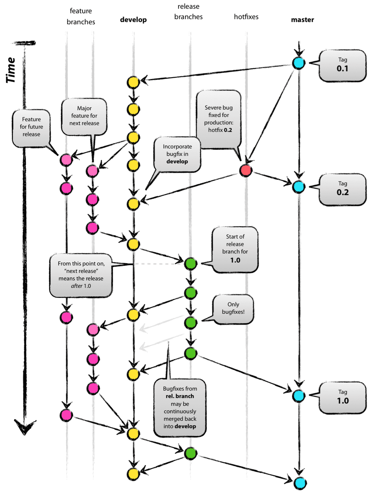
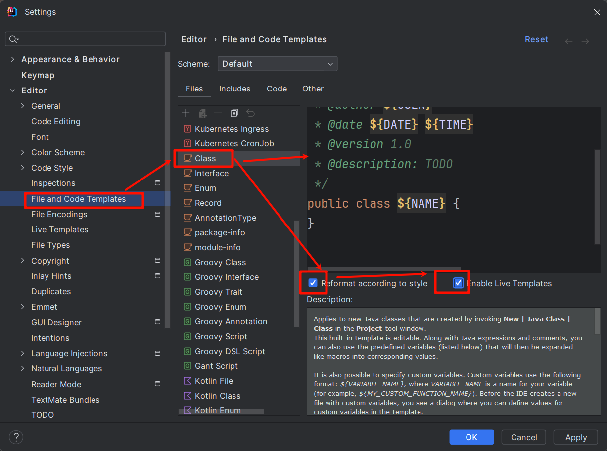
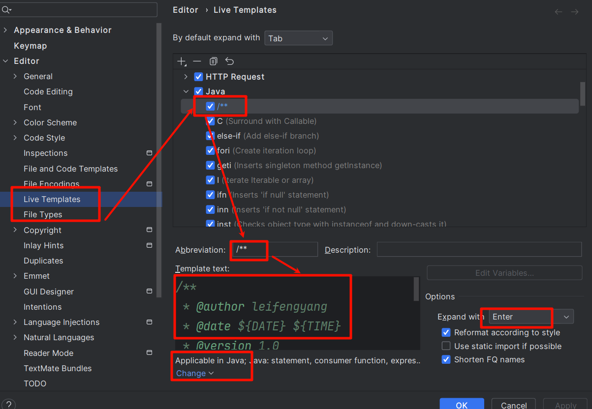
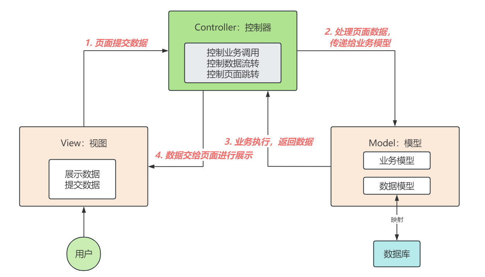
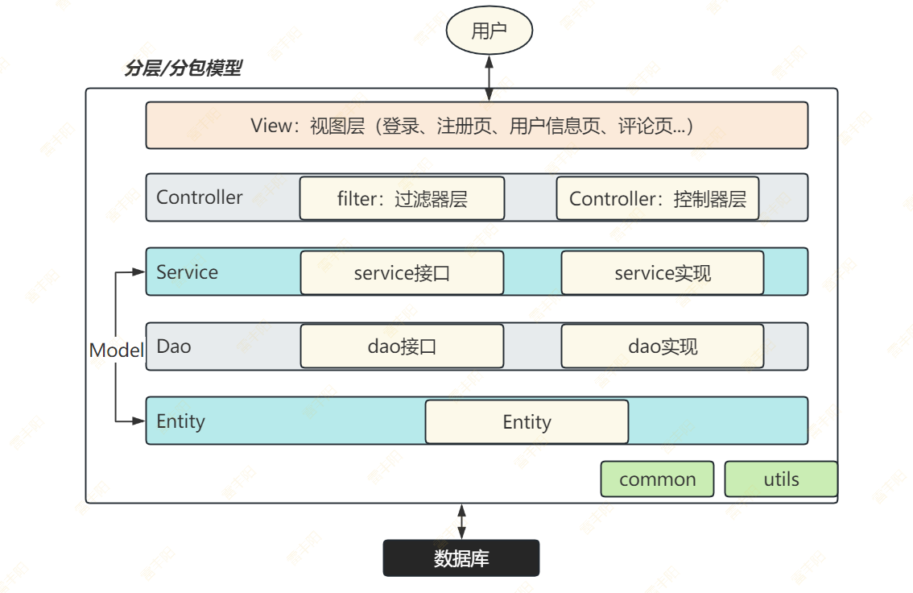
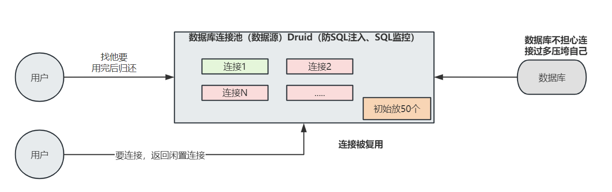

# 1. 项目开发规范

# 项目结构规范

## web工程结构规范



- **docs**：项目产生的文档；如：**需求规格说明书 (SRS）、系统架构设计文档、数据库设计文档、API 接口文档、技术设计文档 (DDD)、代码规范文档、部署指南、运维手册、项目计划文档、用户手册**
  - **需求规格说明书 (SRS)**：**明确系统功能和非功能需求。**

```shell
# 需求规格说明书  
## 1. 项目概述  
- 背景、目标和范围  
## 2. 功能需求  
- 用例描述、用户故事、功能列表（可表格化）  
## 3. 非功能需求  
- 性能、安全性、兼容性等  
## 4. 验收标准  
- 可量化的验收条件  
```

  - **系统架构设计文档**：描述系统整体架构和技术选型。

```shell
# 系统架构设计  
## 1. 架构图（逻辑/物理架构）  
## 2. 技术选型（框架、数据库、中间件等）  
## 3. 模块划分与交互  
## 4. 关键设计决策  
```

  - **数据库设计文档**：定义数据模型和存储结构

```shell
# 数据库设计  
## 1. ER 图  
## 2. 表结构（字段、类型、约束）  
## 3. 数据流说明  
```

  - **API 接口文档**：定义接口的请求、响应和参数。
    - 前后分离：前端来到页面给后台发请求要数据；

```python
# API 文档  
## 接口名称：`/api/user`  
## 方法：GET  
## 请求参数：  
- `userId` (类型: int, 必填)  
## 响应示例：  
```json
{ "id": 1, "name": "John" }
```

  - **技术设计文档 (DDD)**：细化模块实现细节。

```shell
# 技术设计文档  
## 1. 类图/时序图  
## 2. 算法设计（伪代码）  
## 3. 异常处理策略  
```

  - **代码规范文档**：统一团队编码风格。

```shell
# 代码规范  
## 1. 命名规则（变量、函数、类）  
## 2. 代码结构（分层、包命名）  
## 3. 注释要求  
```

  - **部署指南**：指导生产环境部署

```shell
# 部署指南  
## 1. 环境要求（OS、依赖）  
## 2. 部署步骤（脚本、命令）  
## 3. 回滚方案  
```

  - **运维手册**：提供系统监控和故障处理方法

```shell
# 运维手册  
## 1. 日志位置与分析方法  
## 2. 常见故障处理（步骤+命令）  
```

  - **项目计划文档**：规划时间、资源和里程碑。（一般由项目经理负责）； PingCode：项目管理软件

```shell
# 项目计划  
## 1. 甘特图  
## 2. 任务分解（WBS）  
## 3. 资源分配  
```

  - **用户手册**：（如果有的话），指导用户如何使用本系统

```shell
# 用户手册  
## 1. 快速入门  
## 2. 功能详解（分章节）  
## 3. FAQ  
```

## 分支开发模型

我们使用从下面标准模型中简化出的模型： **master/dev/feature**



分支要求：

- **master**：主分支（**有且仅有一个**）；第一次项目全部创建完后，主分支就固定下来，**不可以在主分支修改代码**，主分支只在发布时做代码合并；
  - gitee：master
  - github：main
- **dev**：开发分支（**有且仅有一个**）；可以修改代码；开发主要流程；如果开发期间涉及到一些其他小功能，可以独立出feature分支；
- **feature**：特性分支（**可以有很多**）；每开发一种功能，可以独立一个特性分支，**开发完成后合并到dev分支**；合并完后，这个特性分支就可以删除
  - User-feature
  - User-login-feature
  - User-login-yh-feature

> .gitignore

```bash
target/
!.mvn/wrapper/maven-wrapper.jar
!**/src/main/**/target/
!**/src/test/**/target/

### IntelliJ IDEA ###
.idea/modules.xml
.idea/jarRepositories.xml
.idea/compiler.xml
.idea/libraries/
*.iws
*.iml
*.ipr

### Eclipse ###
.apt_generated
.classpath
.factorypath
.project
.settings
.springBeans
.sts4-cache

### NetBeans ###
/nbproject/private/
/nbbuild/
/dist/
/nbdist/
/.nb-gradle/
build/
!**/src/main/**/build/
!**/src/test/**/build/

### VS Code ###
.vscode/

### Mac OS ###
.DS_Store
```

## 初始数据库导入

> 数据库导入

## 项目依赖

```xml
<!-- jsp基础功能；el表达式： ${}，jstl标签库：c:forEach -->
<dependency>
    <groupId>jakarta.servlet.jsp</groupId>
    <artifactId>jakarta.servlet.jsp-api</artifactId>
    <version>3.1.0</version>
    <scope>provided</scope>
</dependency>
<dependency>
    <groupId>jakarta.servlet.jsp.jstl</groupId>
    <artifactId>jakarta.servlet.jsp.jstl-api</artifactId>
    <version>3.0.2</version>
</dependency>
<dependency>
    <groupId>org.glassfish.web</groupId>
    <artifactId>jakarta.servlet.jsp.jstl</artifactId>
    <version>3.0.1</version>
</dependency>

<!-- hutool工具类 -->
<dependency>
    <groupId>cn.hutool</groupId>
    <artifactId>hutool-all</artifactId>
    <version>5.8.16</version>
</dependency>

<!-- lombok简化JavaBean开发 -->
<dependency>
    <groupId>org.projectlombok</groupId>
    <artifactId>lombok</artifactId>
    <version>1.18.36</version>
    <scope>provided</scope>
</dependency>

<!-- 数据库驱动 -->
<dependency>
    <groupId>com.mysql</groupId>
    <artifactId>mysql-connector-j</artifactId>
    <version>8.4.0</version>
</dependency>

<!-- 数据库连接池 -->
<dependency>
    <groupId>com.alibaba</groupId>
    <artifactId>druid</artifactId>
    <version>1.2.25</version>
</dependency>
```

hutool：https://www.hutool.cn/docs/#/

**lombok：**

数据库驱动：

**druid：数据库连接池**

## 类注释模板



```shell
/**
 * @author ${USER}
 * @date ${DATE} ${TIME}
 * @version 1.0
 * @description: TODO 
 */
```




# MVC架构

## 什么是MVC

**MVC，即 model-view-controller，其中每个组件的含义如下：**

- **模型（Model）**：后端，包含了所有数据逻辑
  - **业务模型**：业务逻辑组成
  - **数据模型**：一般指封装数据库的Bean类； 为数据准备JavaBean类
- **视图（View）**：前端界面或 GUI
  - Web网站：页面
  - 安卓、windows客户端：可视化界面
- **控制器（Controller）**：应用的大脑，控制数据如何展示



## 分包分层模型

**视图（View）层**：

- **webapp**：集合所有页面，需要登录才能访问的页面，需要放在 /WEB-INF 下

**控制器（Controller）层**：负责接收请求、响应数据；（重定向、转发）

- **com.lfy.zpro.controller**：controller包下，均是符合Servlet要求的控制器；
- **com.lfy.zpro.filter**：项目期间用到某些过滤器逻辑，放在这个包下

**模型（Model）层**：

- **com.lfy.zpro.service**：业务逻辑层，定义各种功能的方法，为了**抽象与实现分离**。这个包下只有接口
- **com.lfy.zpro.service.impl**：业务逻辑实现层，定义各种功能接口的实现；
- **com.lfy.zpro.entity**：实体数据层（**数据模型**），实体数据指和数据库表模型一一对应的数据；

**数据访问（Dao）层**：

- **Database Access Object**：数据访问对象（有一些对象专门访问数据做增删改查功能）
- **com.lfy.zpro.dao**：数据库访问层，定义各种数据库访问方法，为了**抽象与实现分离**。这个包下只有接口
- **com.lfy.zpro.dao.impl**：数据库访问实现层，定义各种数据库功能接口的实现；

**通用代码（Common）层**：

- **com.lfy.zpro.utils**：一些常用的工具类
- **com.lfy.zpro.common**：一些常用的数据模型； 常见枚举类



# 打通一个简单流程

> 连接数据库查询一个数据即可：

## Hutool

> JDBC编程； Hutool 简单封装

HUtoolDB：

1. 数据源 `DataSource`**：数据库连接池**



1. SQL执行器 `SqlExecutor`

> 去执行CRUD

1. CRUD的封装 `Db`、`SqlConnRunner` `SqlRunner`

> 

1. 支持事务的CRUD封装 `Session`

> `Session`** 类创建的对象可以做事务； **

1. 各种结果集处理类 `handler`
  1. **EntityListHandler**: 查到多条封装JavaBean
  2. **EntityHandler**：查到单条记录

1. 数据库的一些工具方法汇总 `DbUtil`