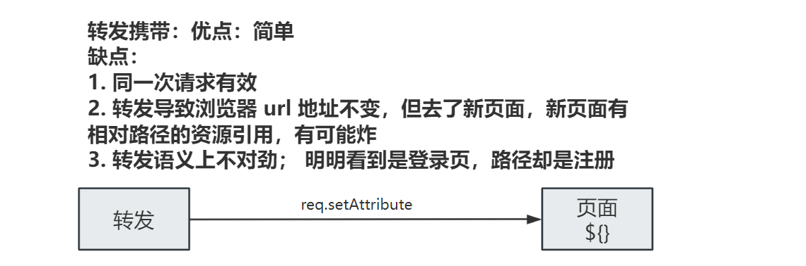
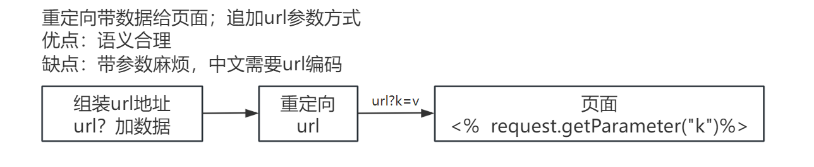
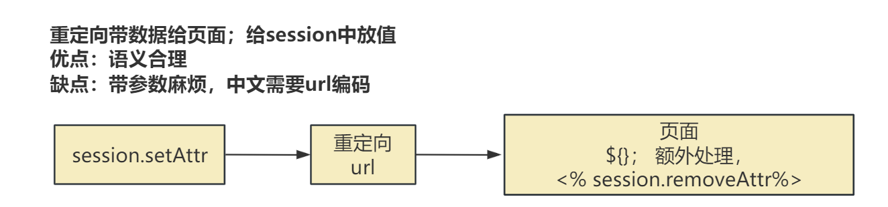
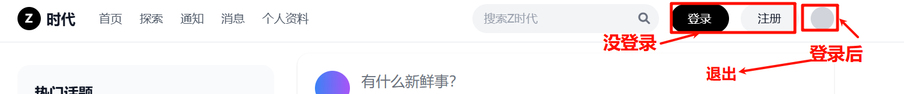
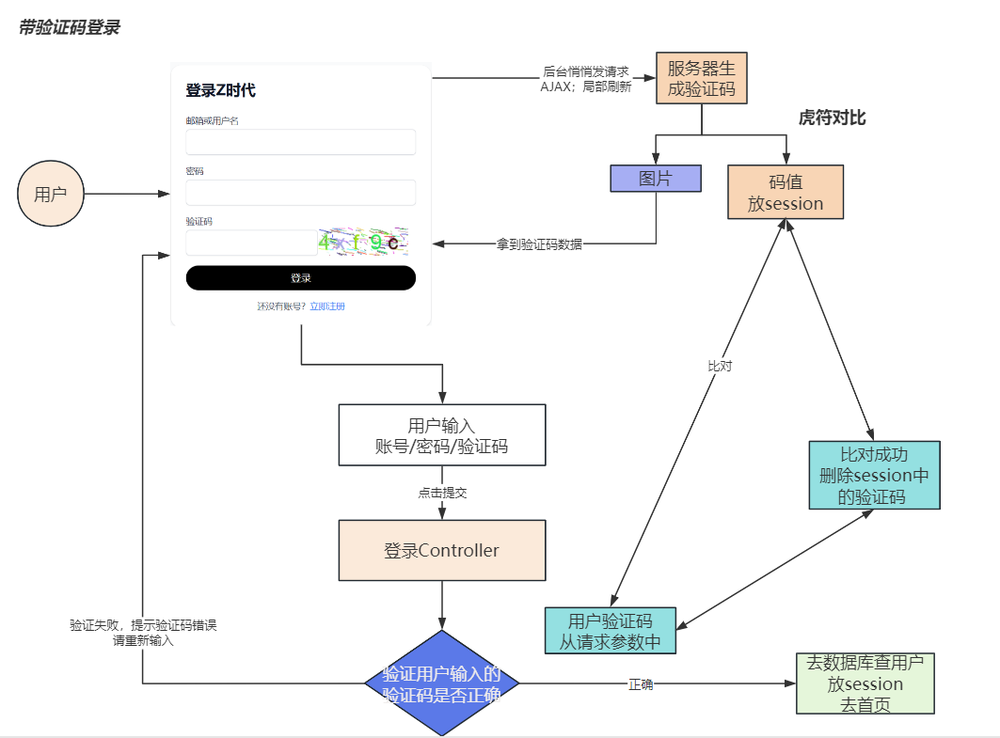

# 2. 用户功能

流程：

1. 打通页面显示，跳转逻辑
2. 页面提交数据给后台，后台收到后如何处理
  1. 保存数据库
  2. 跳转页面

规范：

1. URL的设计；   `模块名/功能名`
  1.  注册请求路径： 当前项目/user/register
  2.  登录请求路径： 当前项目/user/login
  3.  个人资料请求路径：当前项目/user/profile

**业务分层处理流程**


# 注册

## 基本信息保存

> Service =》 Dao

## 提示信息回显

```json
     //执行成功； 来到登录页  ${} 动态取值  c:forEach

            //带数据办法1：重定向去登录页
            //把要带的数据给 URL 后面追加 k=v 参数
            //问题：中文需要编码才能带； 页面取值比较复杂
            // 编码
//            String msg = URLEncodeUtil.encode("注册成功，请登录");
//            resp.sendRedirect("/zpro/login.jsp?msg="+msg);
<%--                        <%--%>
<%--                            if (request.getParameter("msg")!=null){--%>
<%--                                out.println(request.getParameter("msg"));--%>
<%--                            }--%>
<%--                        %>--%>


            //带数据办法2：给请求域中设置一个属性，告诉用户注册成功
            //注意：页面相对路问题； 页面如果以后都用 /项目名/资源路径  放心用
//            req.setAttribute("msg","注册成功，请登录");
//            req.getRequestDispatcher("/login.jsp").forward(req,resp);

            //带数据办法3：给域中放数据，重定向获取； 用session
            //好处：页面取值简单 ${}； 重定向从语义上好看
            //弊端： session中的提示消息，一直在，直到用户关闭浏览器
            //效果：session中只显示一次，就删除
```

### req转发携带数据并回显



### 重定向给url后面携带数据并回显（不推荐）



### 重定向给session中放数据并在页面回显



# 登录

## 基本登录逻辑

- 用户提交账号密码
- UserService将密码md5后，交给UserDao
- UserDao去数据库按照账号密码查询对应记录
- 查到记录：则登录成功；把用户放到session中
- 没有查到记录：则登录失败，回到登录页，提示账号密码错误

## 首页导航栏状态

> 根据登录情况显示不同效果
> 
> 抽取顶部导航




```javascript
<%@ taglib prefix="c" uri="http://java.sun.com/jsp/jstl/core" %>
<%@ page contentType="text/html; charset=UTF-8" pageEncoding="UTF-8" %>
<nav class="fixed top-0 left-0 right-0 bg-white/80 backdrop-blur-md border-b border-gray-200 z-50">
    <div class="max-w-6xl mx-auto px-4">
        <div class="flex items-center justify-between h-16">
            <div class="flex items-center space-x-8">
                <div class="flex items-center space-x-2">
                    <div
                            class="w-8 h-8 bg-black text-white rounded-full flex items-center justify-center font-bold">
                        Z</div>
                    <span class="text-xl font-bold">时代</span>
                </div>
                <div class="hidden md:flex space-x-6">
                    <a href="index.jsp" class="text-gray-600 hover:text-black transition-colors">首页</a>
                    <a href="explore.jsp" class="text-gray-600 hover:text-black transition-colors">探索</a>
                    <a href="notifications.jsp" class="text-gray-600 hover:text-black transition-colors">通知</a>
                    <a href="messages.jsp" class="text-gray-600 hover:text-black transition-colors">消息</a>
                    <c:if test="${not empty loginUser}">
                        <a href="profile.jsp" class="text-gray-600 hover:text-black transition-colors">个人资料</a>
                    </c:if>

                </div>
            </div>
            <div class="flex items-center space-x-4">
                <div class="relative">
                    <input type="text" placeholder="搜索Z时代"
                           class="w-64 px-4 py-2 bg-gray-100 rounded-full focus:outline-none focus:ring-2 focus:ring-blue-500">
                    <i class="fas fa-search absolute right-3 top-1/2 transform -translate-y-1/2 text-gray-500"></i>
                </div>
                <c:if test="${not empty loginUser}">
                    <a href="login.jsp"
                       class="bg-black text-white px-6 py-2 rounded-full hover:bg-gray-800 transition-colors">
                        退出
                    </a>
                    <a href="profile.jsp" class="w-8 h-8 bg-gray-300 rounded-full">

                    </a>
                    <span>${loginUser.username}</span>
                </c:if>
                <%--如果用户未登录，显示登录注册按钮--%>
                <c:if test="${empty loginUser}">
                    <a href="login.jsp"
                       class="bg-black text-white px-6 py-2 rounded-full hover:bg-gray-800 transition-colors">
                        登录
                    </a>
                    <a href="register.jsp"
                       class="bg-gray-100 text-gray-900 px-6 py-2 rounded-full hover:bg-gray-200 transition-colors">
                        注册
                    </a>
                </c:if>


            </div>
        </div>
    </div>
</nav>
```

> 别的页面引用

```shell
<jsp:include page="/WEB-INF/navbar.jsp" />
```

## 带验证码逻辑

https://www.hutool.cn/docs/#/captcha/%E6%A6%82%E8%BF%B0

Apache commons： 工具箱

- Math
- Io
- Image
- Security

# 验证码

