# JavaWeb项目 - Z时代 - 社交网站

> Web阶段，我们重点学习了如下知识：
> 
> 1. **前端开发部分**
>   1. **HTML**：编写页面结构
>   2. **CSS**：编写页面样式
>   3. **JavaScript**：编写页面脚本
>   4. **AJAX：**页面局部刷新
> 2. **后端开发部分**
>   1. **Tomcat**：Web服务器
>   2. **Servlet**：处理请求、响应的小程序
>   3. **Filter**：过滤请求、响应的过滤器
>   4. **Listener**：监听Web应用各种事件的监听器
>   5. **Cookie**：浏览器端临时保存数据的技术
>   6. **Session**：服务器端临时保存数据的技术
>   7. **会话控制**：Cookie配合Session，使得服务器可以识别当前是哪个用户会话
> 
> 由于，后来的企业级开发，并不会用到这些原生技术，所以我们仅用原生技术做一个简单点的项目即可

# 开发流程

## SDLC：**软件开发生命周期**

**软件开发生命周期**（Software Development Life Cycle，**SDLC**）是指软件开发从**提出、实现、使用维护到停止使用退役**的过程。这个过程包括多个阶段，每个阶段都有明确的目标和任务，以确保软件项目的成功完成。软件开发生命周期是一套标准化的流程，用于指导软件从概念化到最终交付的全过程。

**立项！**

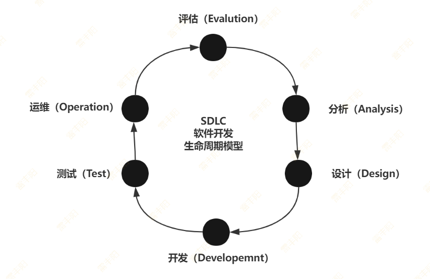

## 软件工程方法论

### 瀑布模型

**瀑布模型（Waterfall Model）** 是一个项目开发架构，开发过程是通过设计一系列阶段顺序展开的，从系统需求分析开始直到产品发布和维护，每个阶段都会产生循环反馈，因此，如果有信息未被覆盖或者发现了问题，那么最好 “返回”上一个阶段并进行适当的修改，项目开发进程从一个阶段“流动”到下一个阶段，这也是瀑布模型名称的由来。包括软件工程开发、企业项目开发、产品生产以及市场销售等构造瀑布模型。

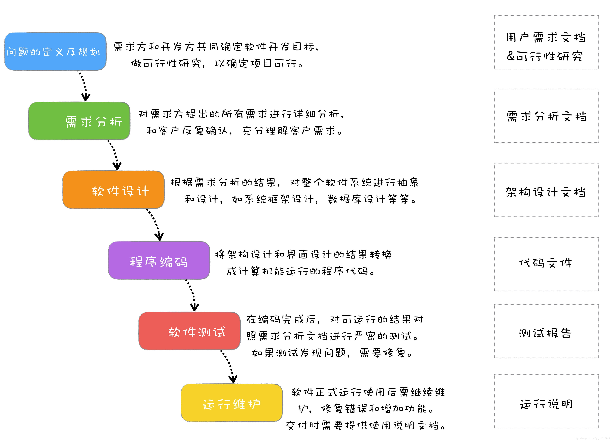

瀑布模型是一种**线性顺序的软件开发方法**，它将软件开发过程划分为一系列阶段性的活动，每个阶段完成后才能进入下一个阶段。这种方法的优点在于其结构清晰，但缺点是不够灵活，难以适应需求的快速变化。

### 敏捷开发

> **某一个小需求级别的迭代**；

敏捷开发以**用户的需求进化为核心**，采用**迭代**、**循序渐进**的方法进行软件开发。在敏捷开发中，软件项目在构建初期被**切分成多个子项目**，各个子项目的成果都经过测试，具备可视、可集成和可运行使用的特征；

敏捷开发是一种**以人为核心、迭代、****增量的软件开发方法论**。它强调团队协作、客户反馈和快速响应变化。敏捷开发的核心是人和交互，以及快速、灵活的响应变化的能力。它通常采用如**Scrum**或**Kanban**等**框架**来指导开发过程。

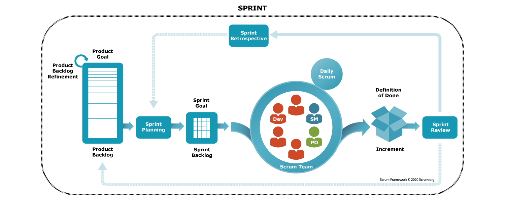

#### Scrum

> Scrum 官方指南

[📎 2020-Scrum-Guide-US.pdf](<files/2020-Scrum-Guide-US.pdf>)

#### 最佳阅读

敏捷开发软件：https://docs.pingcode.com/agile/scrum-manifesto

> 每天发任务，领任务，完成任务；项目追踪进度

#### **三大角色**

项目经理把需求，拆解成程序员的开发任务，然后下发出去；

- **产品负责人（Product Owner）**
主要负责确定产品的功能和达到要求的标准，制定软件的发布日期和交付的内容，同时有权利接收或拒绝开发团队的工作成功。负责和客户对接；挖掘需求
- **流程管理员（Scrum Master）**
 主要负责整个Scrum流程再项目中的顺利实施和进行，以及清除挡在客户和开发工作之间的沟通障碍，使得客户可以直接驱动开发。排期
- **开发团队（Scrum Team）**
 主要负责软件产品在Scrum规定流程下进行开发工作，人数控制在5-10人左右，每个成员可能负责不同的技术方面，但要求每个成员必须要有很强的自我管理能力。同时具有一定的表达能力；成员可以采用任何工作方式，只要能达到Sprint的目标。

#### **四个仪式**

- **Sprint计划会（Sprint Planning Meeting）****：**在每个Sprint开始时召开，由全体人员参加。这个会议主要有两件事情要确定。①确定当前Sprint的目标 ②选定当前Sprint要处理的最具价值的用户故事，创建Sprint Backlog（需求列表）
- **每日站会（Daily Scrum Meeting）****：**一般在15分钟以内。团队成员相互交流任务的进展，计划以及遇到的困难。
- **Sprint评审会（Sprint Review Meeting）****：**又叫Sprint演示会、Sprint展示会等，是团队用来展示当前Sprint开发成果的会议。
- **Sprint回顾会（Sprint Retrospective Meeting）****：**用来回顾在当前结束的Sprint中的工作、进行经验总结、反思，并拟定响应的改进措施。

#### 流程图

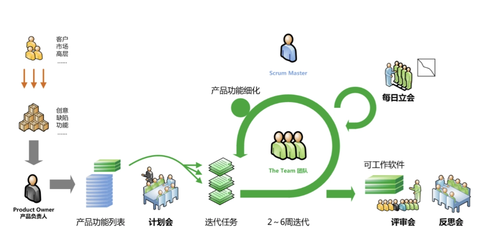

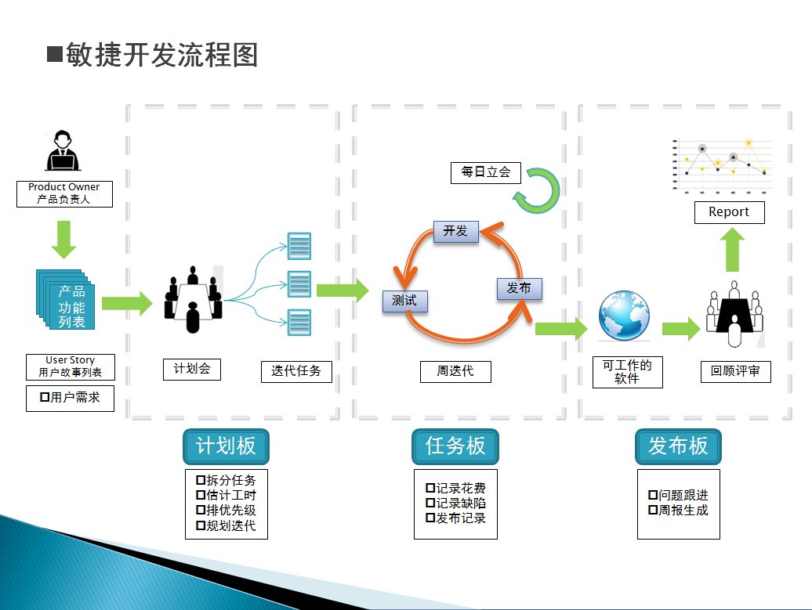

### 其他模型（了解）

## 团队角色

在软件开发过程中，**六类重要角色包括**[**产品经理**](https://docs.pingcode.com/blog/demand-management/34564.html)**、**[**项目经理**](https://docs.pingcode.com/blog/project-management/61672.html)**、开发工程师、质量保证工程师、UI/UX设计师、以及运维工程师**。每一种角色在项目中扮演着不同但又至关重要的职责，从想法的提出到产品的最终发布，再到后期的维护更新，每个角色的有效协作都是项目成功的关键。

### PM/O - 产品经理（Product Manager/Owner）

产品经理是确定产品方向和策略的关键角色。他们负责梳理市场需求，定义产品需求，与各方协商确定产品的功能和优先级，并负责产品的整体规划。产品经理需要具备强烈的市场洞察力、优秀的沟通能力和敏锐的用户体验感知。

任务涉及：

- 市场调研与分析，了解用户需求和竞争对手情况。
- 定义产品愿景、目标和关键结果（OKRs）。
- 编写产品需求文档（PRD），包括[用户故事](https://docs.pingcode.com/agile/project-management/user-stories)、使用案例等。
- 规划产品路线图，确定功能的优先级和[迭代计划](https://docs.pingcode.com/agile/scrum/sprint-planning)。

### PM - 项目经理（Project Manager）

项目经理负责规划、执行和监控软件开发项目，确保项目按时、按预算、按质量完成。项目经理需要具备出色的组织和协调能力、风险管理能力以及沟通协调能力。

任务包括：

- 制定[项目计划](https://docs.pingcode.com/blog/project-management/59535.html)，包括资源分配、时间表和预算。
- 监控项目进度，确保项目按计划进行。
- 管理项目风险和问题，采取措施以避免或解决。
- 协调团队成员和沟通项目相关方。

### Dev - 开发工程师（Developer）

开发工程师是软件开发的主力军，根据产品需求设计和编写代码。他们需要拥有扎实的编程技能、良好的问题解决能力和高效的工作效率。

任务涵盖：

- 设计软件架构和开发计划。
- 编写、测试和调试代码。
- 持续集成和持续部署（[CI/CD](https://docs.pingcode.com/blog/devops/52691.html)）。
- 参与[代码审查](https://docs.pingcode.com/code-review)，确保代码质量。

### QA - 质量保证工程师（QA- Quality Assurance Engineer）

质量保证工程师负责软件测试，确保产品质量符合预期。他们进行各种测试，包括单元测试、集成测试、系统测试和性能测试，以便及时发现并纠正缺陷。

任务包括：

- 制定和执行详细的测试计划。
- 自动化测试和手工测试。
- 编写测试用例，记录测试结果。
- 与开发团队合作，确保产品缺陷得到及时修复。

### UI/UX设计师(User Interface/User Experience Designer)

**UI/UX设计师负责产品的界面设计**和用户体验设计，确保产品界面美观、易用。他们需要具备良好的设计感、用户研究能力和原型设计能力。

任务涉及：

- 进行用户研究，了解用户需求和行为。
- 设计产品界面和交互流程。
- 创建**原型**和**设计**规范。
  - **原型**：产品原始模型，可能还是手绘图、草图
  - 原型通过各种设计：转成用户能看能用
- 与产品经理和开发团队密切合作，确保设计实现符合预期。

### Ops - 运维工程师（Operations Engineer）

运维工程师负责软件的部署、监控和维护，确保软件系统的稳定运行。他们需要熟悉云计算环境、自动化部署工具和系统监控工具。

任务包括：

- 部署软件到生产环境。
- 监控系统性能和健康状况。
- 处理运维相关的故障和性能优化。
- 管理软件配置和版本。

每个角色之间需要有良好的沟通和协作，共同推动软件从需求收集到设计，再到开发、测试和上线的全过程，这样才能确保软件项目的成功。

> **Java全栈工程师**；
> 
> **PHP全栈**；
> 
> **运维**：云上；（**专科**）
> 
> - **几十个开发**；==》 运维
> - **3000开发** =》 3-5牛逼运维
> 
> **运维开发**：
> 
> - Go
> - Go开发运维中间件： 有活路
> 
> **现今时代：****高端 + AI** = 无限个低端；

# 产品原型

[📎 web-z - 原型.zip](<files/web-z - 原型.zip>)

## 登录页

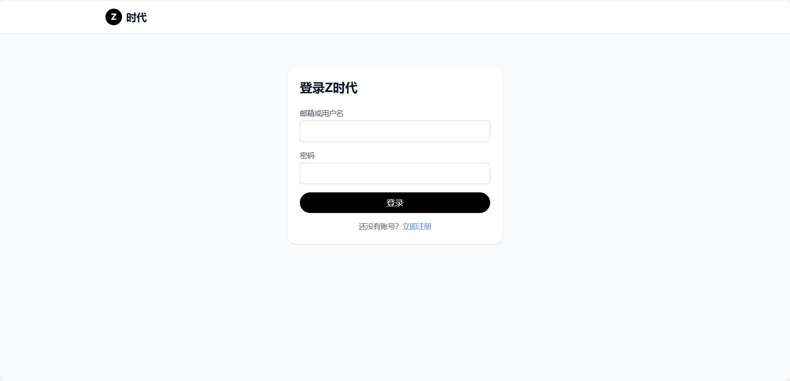

## 注册页

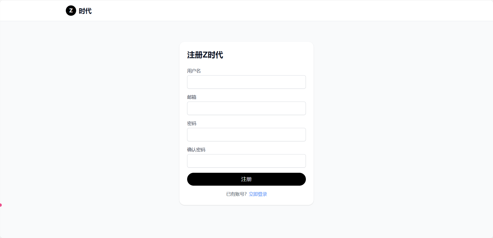

## 首页

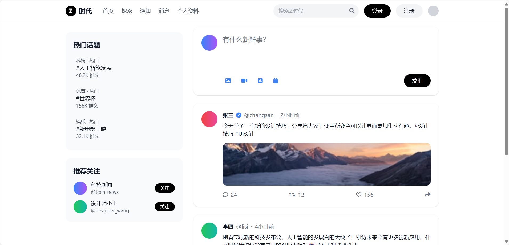

## 探索

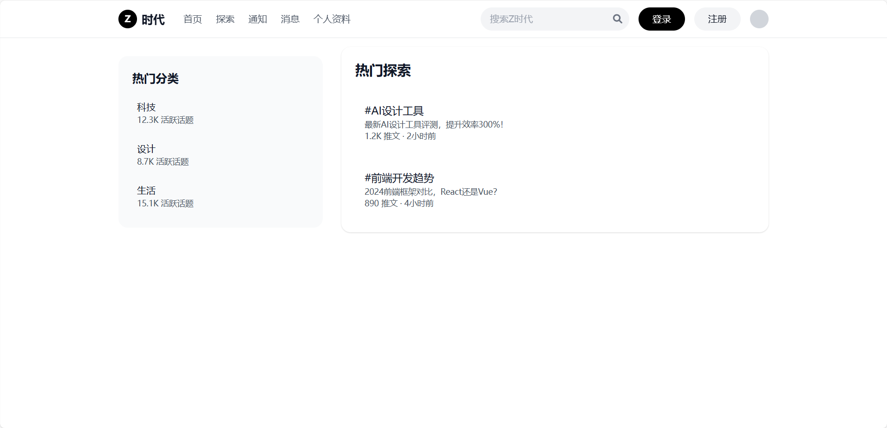

## 通知

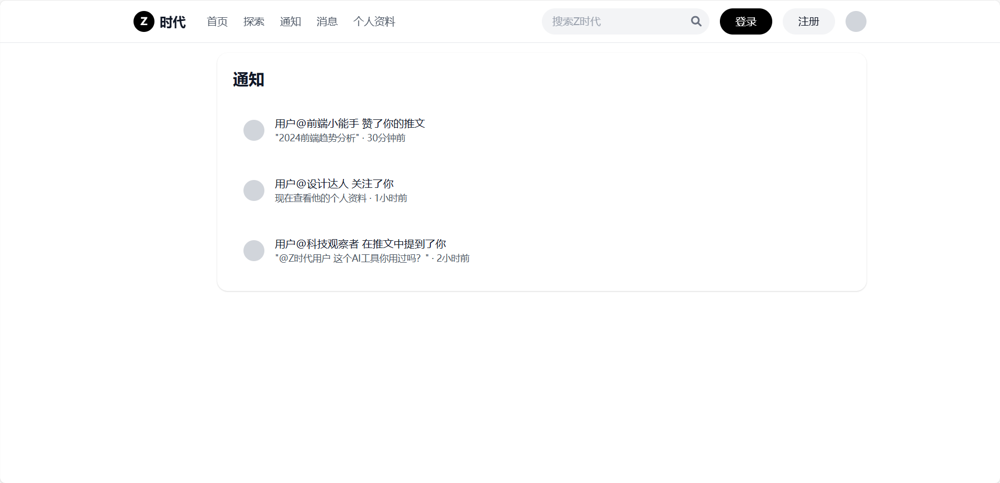

## 消息

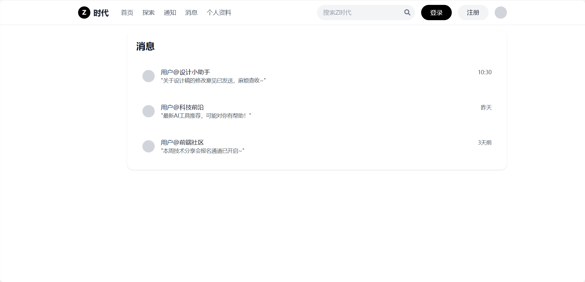

## 个人资料


# 数据库设计

> 

## 数据库文件

```sql
CREATE TABLE `user` (
    `id` bigint NOT NULL AUTO_INCREMENT COMMENT '用户ID（主键）',
    `username` varchar(50) NOT NULL UNIQUE COMMENT '用户名（唯一）',
    `email` varchar(100) NOT NULL UNIQUE COMMENT '邮箱（唯一）',
    `password` varchar(255) NOT NULL COMMENT '加密后的密码',
    `avatar_url` varchar(255) DEFAULT 'default_avatar.png' COMMENT '头像URL',
    `bio` varchar(200) DEFAULT '' COMMENT '个人简介',
    `created_at` datetime NOT NULL DEFAULT CURRENT_TIMESTAMP COMMENT '注册时间',
    PRIMARY KEY (`id`)
) ENGINE=InnoDB DEFAULT CHARSET=utf8mb4 COMMENT='用户基础信息表';

CREATE TABLE `tweet` (
    `id` bigint NOT NULL AUTO_INCREMENT COMMENT '推文ID（主键）',
    `user_id` bigint NOT NULL COMMENT '发布用户ID（外键关联user.id）',
    `content` text NOT NULL COMMENT '推文内容',
    `media_urls` varchar(1000) DEFAULT '' COMMENT '媒体资源URL（JSON数组格式）',
    `like_count` int NOT NULL DEFAULT 0 COMMENT '点赞数',
    `comment_count` int NOT NULL DEFAULT 0 COMMENT '评论数',
    `retweet_count` int NOT NULL DEFAULT 0 COMMENT '转发数',
    `created_at` datetime NOT NULL DEFAULT CURRENT_TIMESTAMP COMMENT '发布时间',
    PRIMARY KEY (`id`),
    FOREIGN KEY (`user_id`) REFERENCES `user`(`id`) ON DELETE CASCADE
) ENGINE=InnoDB DEFAULT CHARSET=utf8mb4 COMMENT='推文内容表';

CREATE TABLE `comments` (
    `id` bigint NOT NULL AUTO_INCREMENT COMMENT '评论ID（主键）',
    `tweet_id` bigint NOT NULL COMMENT '关联的推文ID（外键关联tweet.id）',
    `user_id` bigint NOT NULL COMMENT '评论用户ID（外键关联user.id）',
    `content` text NOT NULL COMMENT '评论内容',
    `parent_comment_id` bigint COMMENT '父评论ID（NULL表示顶级评论，外键关联comments.id）',
    `created_at` datetime NOT NULL DEFAULT CURRENT_TIMESTAMP COMMENT '评论时间',
    PRIMARY KEY (`id`),
    INDEX `idx_tweet_id` (`tweet_id`),
    INDEX `idx_parent_comment_id` (`parent_comment_id`),
    FOREIGN KEY (`tweet_id`) REFERENCES `tweet`(`id`) ON DELETE CASCADE,
    FOREIGN KEY (`user_id`) REFERENCES `user`(`id`) ON DELETE CASCADE,
    FOREIGN KEY (`parent_comment_id`) REFERENCES `comments`(`id`) ON DELETE CASCADE
) ENGINE=InnoDB DEFAULT CHARSET=utf8mb4 COMMENT='推文评论及回复表';

CREATE TABLE `notification` (
    `id` bigint NOT NULL AUTO_INCREMENT COMMENT '通知ID（主键）',
    `user_id` bigint NOT NULL COMMENT '接收通知的用户ID（外键关联user.id）',
    `type` enum('like','follow','mention') NOT NULL COMMENT '通知类型（点赞/关注/提及）',
    `source_user_id` bigint NOT NULL COMMENT '触发通知的用户ID（外键关联user.id）',
    `tweet_id` bigint DEFAULT NULL COMMENT '关联的推文ID（外键关联tweet.id）',
    `is_read` tinyint(1) NOT NULL DEFAULT 0 COMMENT '是否已读（0未读/1已读）',
    `created_at` datetime NOT NULL DEFAULT CURRENT_TIMESTAMP COMMENT '通知时间',
    PRIMARY KEY (`id`),
    FOREIGN KEY (`user_id`) REFERENCES `user`(`id`) ON DELETE CASCADE,
    FOREIGN KEY (`source_user_id`) REFERENCES `user`(`id`) ON DELETE CASCADE,
    FOREIGN KEY (`tweet_id`) REFERENCES `tweet`(`id`) ON DELETE CASCADE
) ENGINE=InnoDB DEFAULT CHARSET=utf8mb4 COMMENT='用户通知表';

CREATE TABLE `message` (
    `id` bigint NOT NULL AUTO_INCREMENT COMMENT '消息ID（主键）',
    `sender_id` bigint NOT NULL COMMENT '发送方用户ID（外键关联user.id）',
    `receiver_id` bigint NOT NULL COMMENT '接收方用户ID（外键关联user.id）',
    `content` text NOT NULL COMMENT '消息内容',
    `is_read` tinyint(1) NOT NULL DEFAULT 0 COMMENT '是否已读（0未读/1已读）',
    `created_at` datetime NOT NULL DEFAULT CURRENT_TIMESTAMP COMMENT '发送时间',
    PRIMARY KEY (`id`),
    FOREIGN KEY (`sender_id`) REFERENCES `user`(`id`) ON DELETE CASCADE,
    FOREIGN KEY (`receiver_id`) REFERENCES `user`(`id`) ON DELETE CASCADE
) ENGINE=InnoDB DEFAULT CHARSET=utf8mb4 COMMENT='用户私信表';


CREATE TABLE `topic` (
    `id` bigint NOT NULL AUTO_INCREMENT COMMENT '话题ID（主键）',
    `name` varchar(100) NOT NULL UNIQUE COMMENT '话题名称（如#AI设计工具）',
    `tweet_count` int NOT NULL DEFAULT 0 COMMENT '关联的推文数量',
    `hot_score` int NOT NULL DEFAULT 0 COMMENT '热度分数（用于排序）',
    `created_at` datetime NOT NULL DEFAULT CURRENT_TIMESTAMP COMMENT '首次出现时间',
    PRIMARY KEY (`id`)
) ENGINE=InnoDB DEFAULT CHARSET=utf8mb4 COMMENT='热门话题表';

-- 推文与话题关联表（多对多关系）
CREATE TABLE `tweet_topic` (
    `id` bigint NOT NULL AUTO_INCREMENT COMMENT '关联ID（主键）',
    `tweet_id` bigint NOT NULL COMMENT '推文ID（外键关联tweet.id）',
    `topic_id` bigint NOT NULL COMMENT '话题ID（外键关联topic.id）',
    PRIMARY KEY (`id`),
    INDEX `idx_tweet_id` (`tweet_id`),
    INDEX `idx_topic_id` (`topic_id`),
    FOREIGN KEY (`tweet_id`) REFERENCES `tweet`(`id`) ON DELETE CASCADE,
    FOREIGN KEY (`topic_id`) REFERENCES `topic`(`id`) ON DELETE CASCADE
) ENGINE=InnoDB DEFAULT CHARSET=utf8mb4 COMMENT='推文与话题关联表';

CREATE TABLE `follow` (
    `id` bigint NOT NULL AUTO_INCREMENT COMMENT '关注关系ID（主键）',
    `follower_id` bigint NOT NULL COMMENT '关注者ID（外键关联user.id）',
    `following_id` bigint NOT NULL COMMENT '被关注者ID（外键关联user.id）',
    `created_at` datetime NOT NULL DEFAULT CURRENT_TIMESTAMP COMMENT '关注时间',
    PRIMARY KEY (`id`),
    UNIQUE KEY `unique_follow` (`follower_id`, `following_id`),
    FOREIGN KEY (`follower_id`) REFERENCES `user`(`id`) ON DELETE CASCADE,
    FOREIGN KEY (`following_id`) REFERENCES `user`(`id`) ON DELETE CASCADE
) ENGINE=InnoDB DEFAULT CHARSET=utf8mb4 COMMENT='用户关注关系表';

```

## ER图

> **ER图（Entity-Relationship Diagram）**是数据库设计中用于描述**实体、属性及其关系**的可视化工具。它通过抽象现实世界的对象和交互，帮助设计者规划数据库结构，确保数据的一致性和完整性。

- **实体（Entity）**​
表示现实世界中的对象或概念（如“用户”“订单”），通常用**矩形**表示。
  - **属性（Attribute）**​​：实体的特征（如用户的“姓名”“邮箱”），用椭圆形标注在实体内。
- **关系（Relationship）​**
描述实体之间的交互（如“用户下订单”），用菱形表示。
  - **基数约束（Cardinality）**​​：定义关系的数量规则，如：
    - **一对一（1:1）**
    - **一对多（1:N）**
    - **多对多（M:N）**
- **主键（Primary Key）与外键（Foreign Key）**​：主键唯一标识实体，外键建立表之间的关联。

> https://generator.cengxuyuan.cn/sql2er：SQL转ER图工具

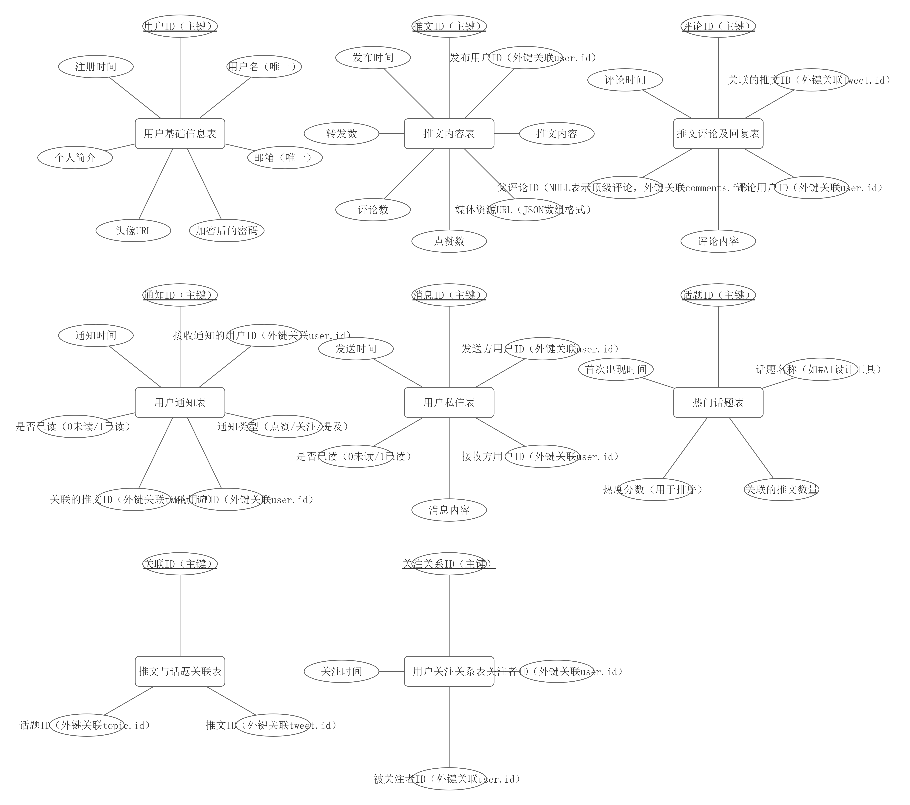

> https://mermaid.nodejs.cn/：根据sql绘制数据库表关系图（ER图）

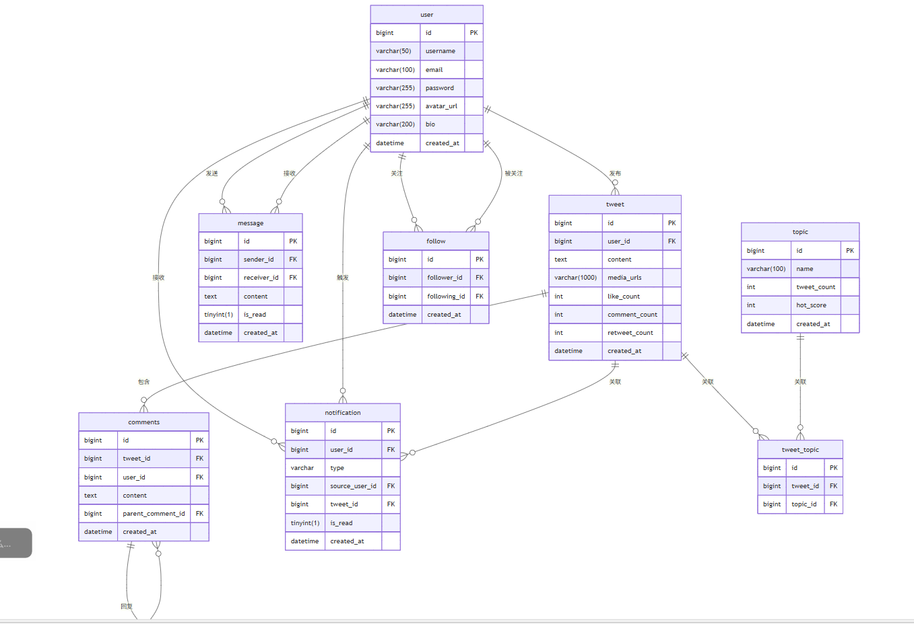

一个**推文**会关联很多主题（很多标签）：科技、**旅游**、二次元

一个**主题**会关联很多推文：

> 多对多需要中间表
> 
> 外键总是放在一端；

## UML

> 建议阅读：https://www.visual-paradigm.com/cn/guide/uml-unified-modeling-language/what-is-uml/

> [UML](https://zh.wikipedia.org/wiki/%E7%BB%9F%E4%B8%80%E5%BB%BA%E6%A8%A1%E8%AF%AD%E8%A8%80)（**Unified Modeling Language**） 是**统一建模语言**的简称，它是一种由**一整套图表组成的标准化建模语言**。UML用于帮助系统开发人员阐明，展示，构建和记录软件系统的产出。
> 
> UML代表了一系列在大型而复杂系统建模中被证明是成功的做法，是开发面向对象软件和软件开发过程中非常重要的一部分。
> 
> UML主要**使用图形符号来表示软件项目的设计**，使用UML可以帮助项目团队沟通、探索潜在的设计和验证软件的架构设计。

### 结构性图表：七种

- [类图 (Class Diagram)](https://www.visual-paradigm.com/cn/guide/uml-unified-modeling-language/what-is-uml/#class-diagram)
- [组件图 (Component Diagram)](https://www.visual-paradigm.com/cn/guide/uml-unified-modeling-language/what-is-uml/#component-diagram)
- [部署图 (Deployment Diagram)](https://www.visual-paradigm.com/cn/guide/uml-unified-modeling-language/what-is-uml/#deployment-diagram)
- [对象图 (Object Diagram)](https://www.visual-paradigm.com/cn/guide/uml-unified-modeling-language/what-is-uml/#object-diagram)
- [包图 (Package Diagram)](https://www.visual-paradigm.com/cn/guide/uml-unified-modeling-language/what-is-uml/#package-diagram)
- [复合结构图 (Composite Structure Diagram)](https://www.visual-paradigm.com/cn/guide/uml-unified-modeling-language/what-is-uml/#composite-structure-diagram)
- [轮廓图 (Profile Diagram)](https://www.visual-paradigm.com/cn/guide/uml-unified-modeling-language/what-is-uml/#profile-diagram)

### 行为性图表：七种

- [用例图 (Use Case Diagram)](https://www.visual-paradigm.com/cn/guide/uml-unified-modeling-language/what-is-uml/#use-case-diagram)
- [活动图 (Activity Diagram)](https://www.visual-paradigm.com/cn/guide/uml-unified-modeling-language/what-is-uml/#activity-diagram)
- [状态机图 (State Machine Diagram)](https://www.visual-paradigm.com/cn/guide/uml-unified-modeling-language/what-is-uml/#state-machine-diagram)
- [序列图 (Sequence Diagram)](https://www.visual-paradigm.com/cn/guide/uml-unified-modeling-language/what-is-uml/#sequence-diagram)
- [通訊圖 (Communication Diagram)](https://www.visual-paradigm.com/cn/guide/uml-unified-modeling-language/what-is-uml/#communication-diagram)
- [交互概述图 (Interaction Overview Diagram)](https://www.visual-paradigm.com/cn/guide/uml-unified-modeling-language/what-is-uml/#interaction-overview-diagram)
- [时序图 (Timing Diagram)](https://www.visual-paradigm.com/cn/guide/uml-unified-modeling-language/what-is-uml/#timing-diagram)

### 汇总

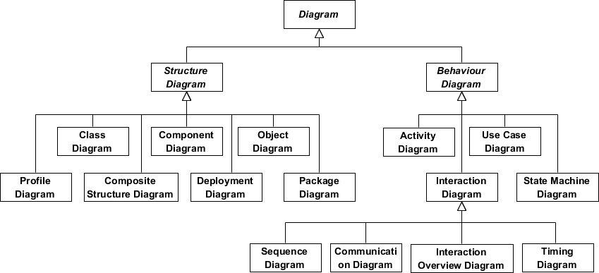

## 工具

> https://plantuml.com/zh/：文本绘图。可以使用AI生成文本，从而转成图片
> 
> 安装 PlantUML 插件；

> 以后生图：让AI利用语法，生成流程图

> **提示词：**根据xxx，使用mermaid语法，绘制出对应的xxx图

# 功能地图

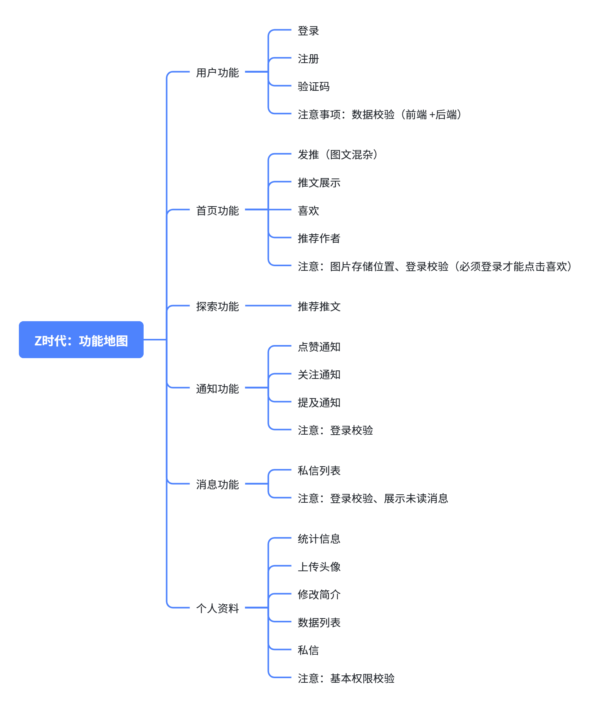