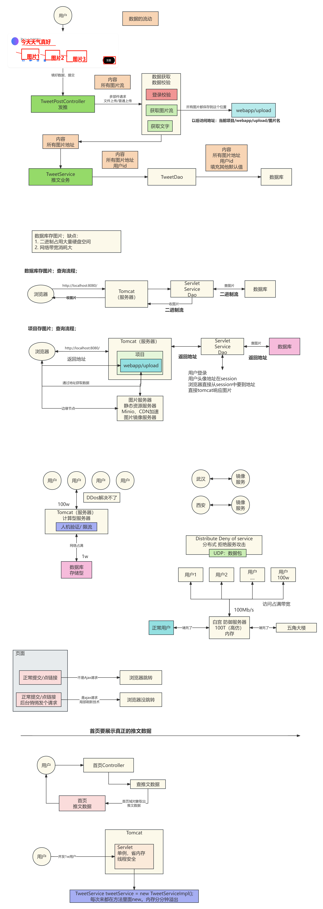
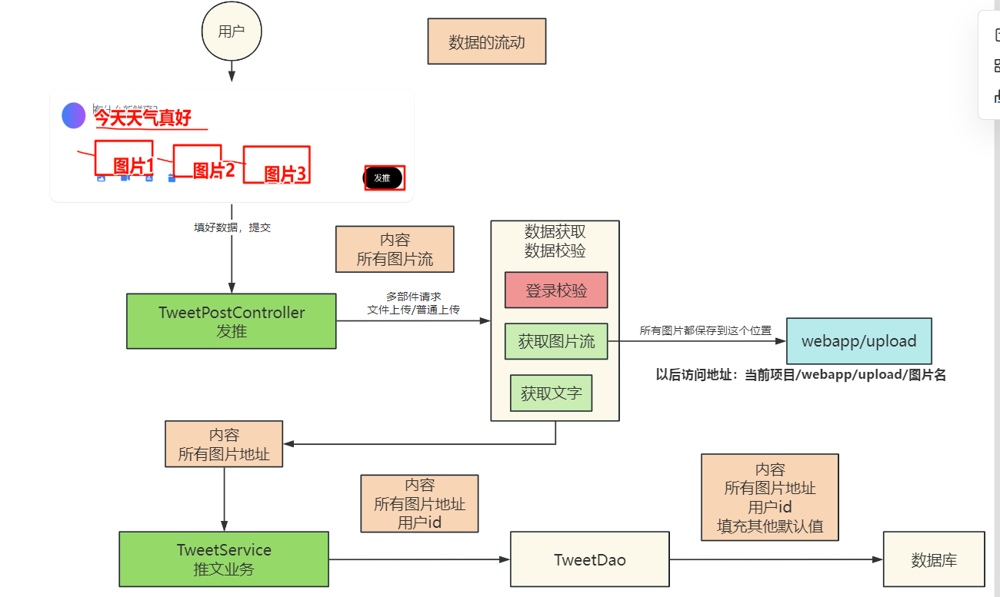
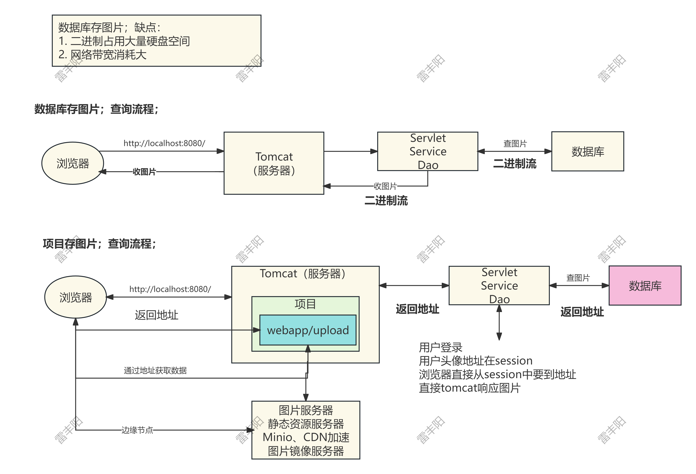
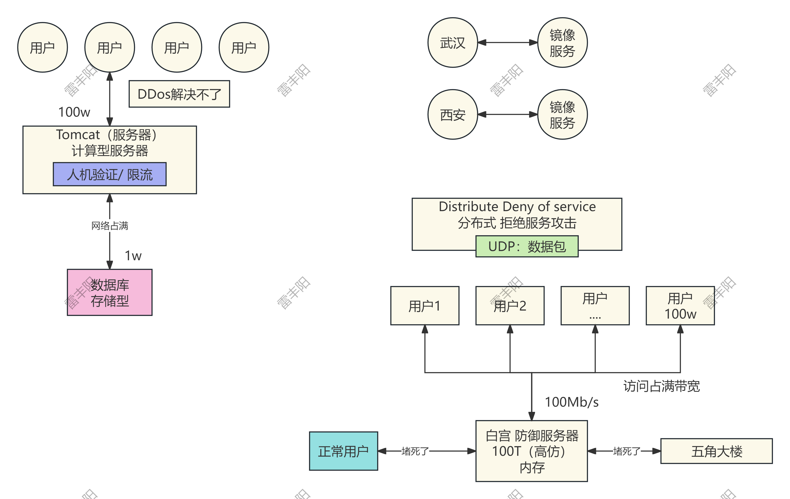
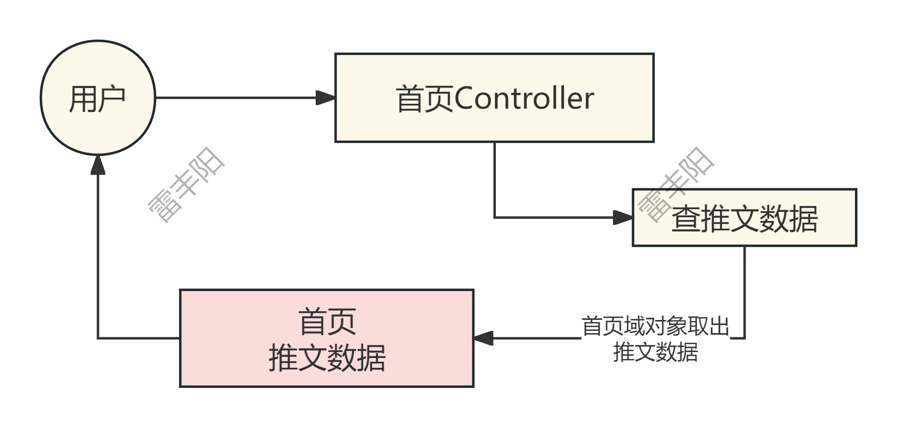
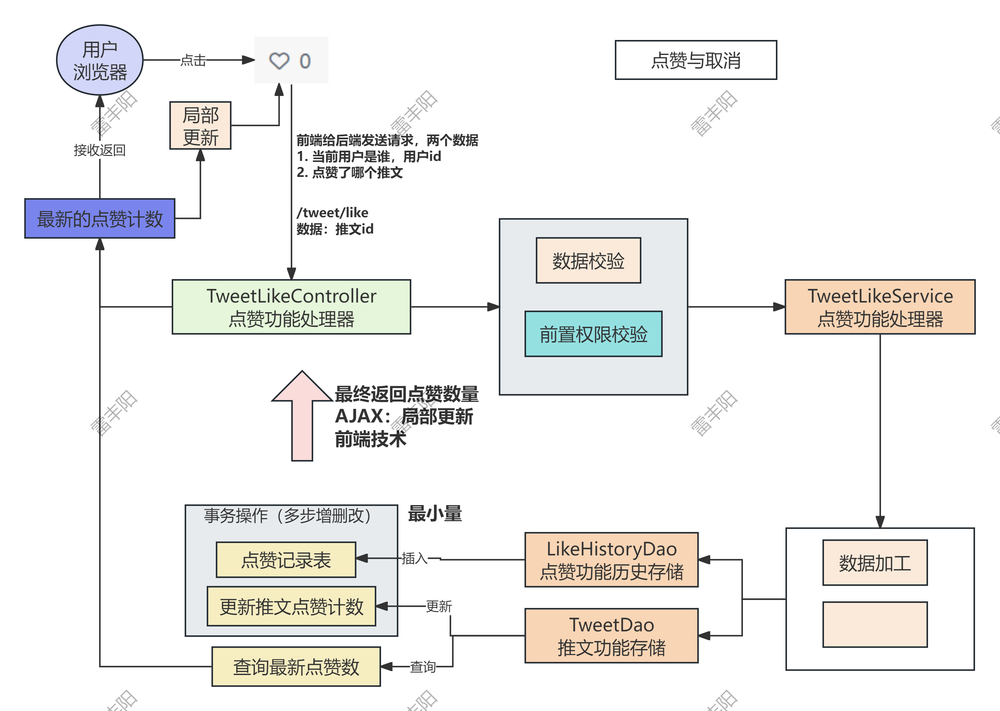
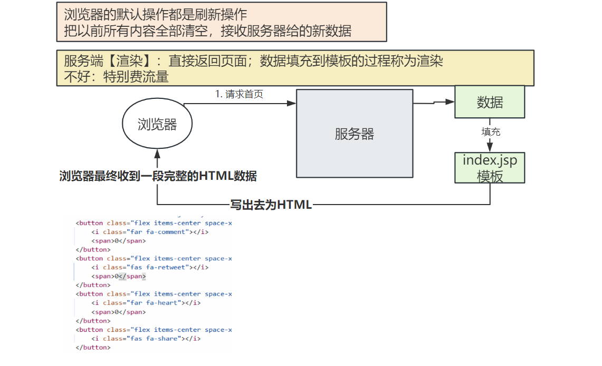
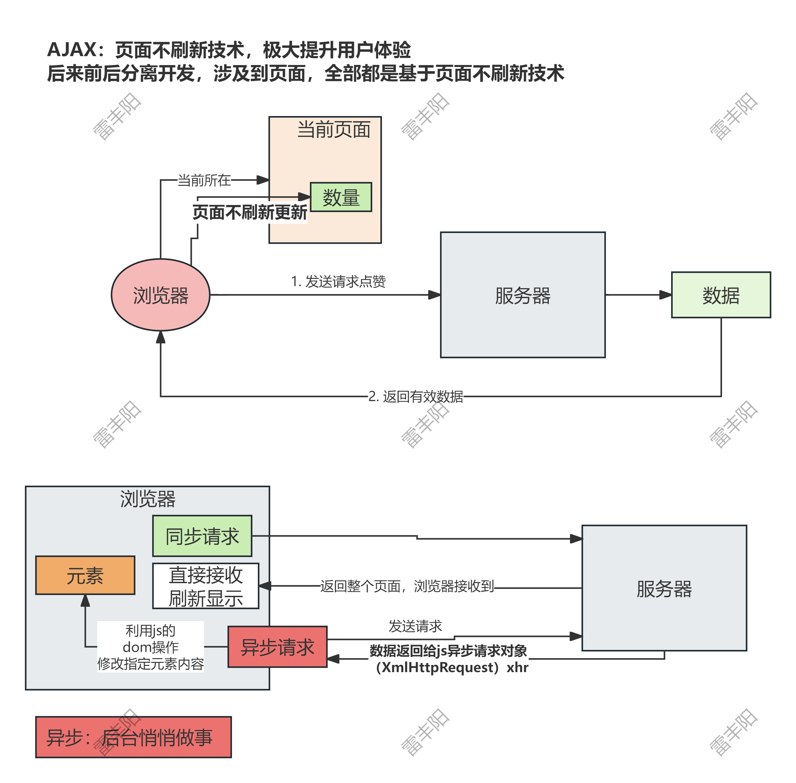
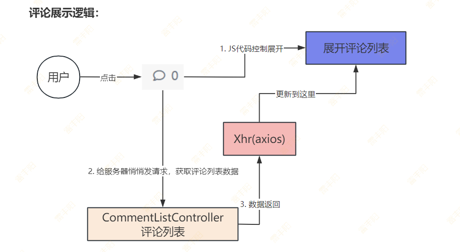
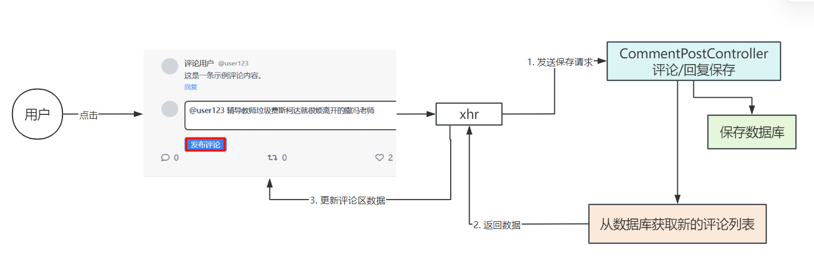

# 3. 推文功能

# 发推

Z时代 - 推文 - 图



## 业务流程



## 修改发推页

分析index.jsp，需要完善发推区域的内容。要求如下：

1. 发推区域，点击图片按钮，弹出图片选择框，最多可以选3张
2. 图片选中后，还能预览图片的样子，把样式布局都设置风格统一
3. 用户输入完内容后，点击发推按钮，整个表单提交；提交包含用户内容以及上传的所有图片
4. 表单提交的地址是 /tweet/post

## 推文页最终效果

```xml
<%@ taglib prefix="c" uri="http://java.sun.com/jsp/jstl/core" %>
<%@ page contentType="text/html; charset=UTF-8" pageEncoding="UTF-8" %>
<!DOCTYPE html>
<html lang="zh-CN">

<head>
    <meta charset="UTF-8">
    <meta name="viewport" content="width=device-width, initial-scale=1.0">
    <title>X中文版 - 连接世界的声音</title>
    <script src="/zpro/lib/tailwindcss.3.4.16.js"></script>
    <link href="https://cdnjs.cloudflare.com/ajax/libs/font-awesome/6.0.0/css/all.min.css" rel="stylesheet">
    <style>
        .custom-shadow {
            box-shadow: 0 1px 3px 0 rgba(0, 0, 0, 0.1), 0 1px 2px 0 rgba(0, 0, 0, 0.06);
        }

        .hover-bg {
            transition: background-color 0.2s ease;
        }

        .hover-bg:hover {
            background-color: rgba(15, 20, 25, 0.1);
        }

        .tweet-card {
            transition: all 0.2s ease;
        }

        .tweet-card:hover {
            background-color: rgba(0, 0, 0, 0.03);
        }
    </style>
</head>

<body class="bg-white text-gray-900 font-sans">
<!-- 顶部导航 -->
<jsp:include page="/WEB-INF/navbar.jsp"/>

<!-- 主要内容区域 -->
<div class="max-w-6xl mx-auto px-4 pt-20">
    <div class="grid grid-cols-1 lg:grid-cols-3 gap-8">
        <!-- 左侧边栏 -->
        <div class="hidden lg:block">
            <div class="sticky top-24">
                <div class="bg-gray-50 rounded-2xl p-6 mb-6">
                    <h3 class="text-xl font-bold mb-4">热门话题</h3>
                    <div class="space-y-3">
                        <div class="hover-bg p-2 rounded-lg cursor-pointer">
                            <p class="text-sm text-gray-600">科技 · 热门</p>
                            <p class="font-medium">#人工智能发展</p>
                            <p class="text-sm text-gray-600">48.2K 推文</p>
                        </div>
                        <div class="hover-bg p-2 rounded-lg cursor-pointer">
                            <p class="text-sm text-gray-600">体育 · 热门</p>
                            <p class="font-medium">#世界杯</p>
                            <p class="text-sm text-gray-600">156K 推文</p>
                        </div>
                        <div class="hover-bg p-2 rounded-lg cursor-pointer">
                            <p class="text-sm text-gray-600">娱乐 · 热门</p>
                            <p class="font-medium">#新电影上映</p>
                            <p class="text-sm text-gray-600">32.1K 推文</p>
                        </div>
                    </div>
                </div>

                <div class="bg-gray-50 rounded-2xl p-6">
                    <h3 class="text-xl font-bold mb-4">推荐关注</h3>
                    <div class="space-y-3">
                        <div class="flex items-center justify-between">
                            <div class="flex items-center space-x-3">
                                <div class="w-10 h-10 bg-gradient-to-r from-blue-500 to-purple-500 rounded-full">
                                </div>
                                <div>
                                    <p class="font-medium">科技新闻</p>
                                    <p class="text-sm text-gray-600">@tech_news</p>
                                </div>
                            </div>
                            <button
                                    class="bg-black text-white px-4 py-1 rounded-full text-sm hover:bg-gray-800 transition-colors">
                                关注
                            </button>
                        </div>
                        <div class="flex items-center justify-between">
                            <div class="flex items-center space-x-3">
                                <div class="w-10 h-10 bg-gradient-to-r from-green-500 to-teal-500 rounded-full">
                                </div>
                                <div>
                                    <p class="font-medium">设计师小王</p>
                                    <p class="text-sm text-gray-600">@designer_wang</p>
                                </div>
                            </div>
                            <button
                                    class="bg-black text-white px-4 py-1 rounded-full text-sm hover:bg-gray-800 transition-colors">
                                关注
                            </button>
                        </div>
                    </div>
                </div>
            </div>
        </div>

        <!-- 中间主要内容 -->
        <div class="lg:col-span-2">
            <!-- 发推区域 -->
            <div class="bg-white rounded-2xl custom-shadow mb-6 p-6">
                <div class="flex space-x-4">
                    <div class="w-12 h-12 bg-gradient-to-r from-blue-500 to-purple-500 rounded-full flex-shrink-0">
                    </div>
                    <div class="flex-1">
                            <textarea id="tweetContent" placeholder="有什么新鲜事？"
                                      class="w-full h-24 resize-none border-none outline-none text-xl placeholder-gray-500"></textarea>
                        <!-- 图片预览区域 -->
                        <div id="imagePreview" class="flex flex-wrap gap-2 my-2 hidden">
                            <!-- 预览框将在这里动态生成 -->
                        </div>
                        <div class="flex items-center justify-between mt-4">
                            <div class="flex space-x-4">
                                <button type="button" onclick="document.getElementById('imageInput').click()"
                                        class="text-blue-500 hover:bg-blue-50 p-2 rounded-full transition-colors">
                                    <i class="fas fa-image"></i>
                                    <input id="imageInput" type="file" accept="image/*" multiple style="display:none;"
                                           onchange="handleImageSelect(event)">
                                </button>
                                <button class="text-blue-500 hover:bg-blue-50 p-2 rounded-full transition-colors">
                                    <i class="fas fa-video"></i>
                                </button>
                                <button class="text-blue-500 hover:bg-blue-50 p-2 rounded-full transition-colors">
                                    <i class="fas fa-poll"></i>
                                </button>
                                <button class="text-blue-500 hover:bg-blue-50 p-2 rounded-full transition-colors">
                                    <i class="fas fa-calendar"></i>
                                </button>
                            </div>
                            <c:if test="${loginUser == null}">
                                <button type="button" onclick="alert('请先登录')"
                                        class="bg-black text-white px-6 py-2 rounded-full hover:bg-gray-800 transition-colors">
                                    发推不了
                                </button>
                            </c:if>
                            <c:if test="${loginUser != null}">
                                <button type="button" onclick="submitTweet()"
                                        class="bg-black text-white px-6 py-2 rounded-full hover:bg-gray-800 transition-colors">
                                    发推
                                </button>
                            </c:if>

                        </div>
                        <form id="tweetForm" action="/zpro/tweet/post" method="post" enctype="multipart/form-data" style="display:none;">
                            <input type="hidden" name="content" id="formContent">
                            <!-- 文件输入将在这里动态生成 -->
                        </form>
                    </div>
                </div>
            </div>

            <!-- 推文流 -->
            <div class="space-y-6">
                <!-- 推文卡片 1 -->
                <div class="bg-white rounded-2xl custom-shadow p-6 tweet-card">
                    <div class="flex space-x-4">
                        <div class="w-12 h-12 bg-gradient-to-r from-red-500 to-pink-500 rounded-full flex-shrink-0">
                        </div>
                        <div class="flex-1">
                            <div class="flex items-center space-x-2 mb-2">
                                <h3 class="font-bold">张三</h3>
                                <span class="text-blue-500"><i class="fas fa-check-circle"></i></span>
                                <span class="text-gray-500">@zhangsan</span>
                                <span class="text-gray-500">·</span>
                                <span class="text-gray-500">2小时前</span>
                            </div>
                            <p class="text-gray-900 mb-4">今天学了一个新的设计技巧，分享给大家！使用渐变色可以让界面更加生动有趣。#设计技巧
                                #UI设计</p>
                            <div class="mb-4">
                                
                            </div>
                            <div class="flex items-center justify-between text-gray-500">
                                <button class="flex items-center space-x-2 hover:text-blue-500 transition-colors">
                                    <i class="far fa-comment"></i>
                                    <span>24</span>
                                </button>
                                <button class="flex items-center space-x-2 hover:text-green-500 transition-colors">
                                    <i class="fas fa-retweet"></i>
                                    <span>12</span>
                                </button>
                                <button class="flex items-center space-x-2 hover:text-red-500 transition-colors">
                                    <i class="far fa-heart"></i>
                                    <span>156</span>
                                </button>
                                <button class="flex items-center space-x-2 hover:text-blue-500 transition-colors">
                                    <i class="fas fa-share"></i>
                                </button>
                            </div>
                        </div>
                    </div>
                </div>

                <!-- 推文卡片 2 -->
                <div class="bg-white rounded-2xl custom-shadow p-6 tweet-card">
                    <div class="flex space-x-4">
                        <div
                                class="w-12 h-12 bg-gradient-to-r from-green-500 to-teal-500 rounded-full flex-shrink-0">
                        </div>
                        <div class="flex-1">
                            <div class="flex items-center space-x-2 mb-2">
                                <h3 class="font-bold">李四</h3>
                                <span class="text-gray-500">@lisi</span>
                                <span class="text-gray-500">·</span>
                                <span class="text-gray-500">4小时前</span>
                            </div>
                            <p class="text-gray-900 mb-4">刚看完最新的科技发布会，人工智能的发展真的太快了！期待未来会有更多创新应用。什么时候我们也能有自己的AI助手呢？🤖
                                #人工智能 #科技</p>
                            <div class="flex items-center justify-between text-gray-500">
                                <button class="flex items-center space-x-2 hover:text-blue-500 transition-colors">
                                    <i class="far fa-comment"></i>
                                    <span>8</span>
                                </button>
                                <button class="flex items-center space-x-2 hover:text-green-500 transition-colors">
                                    <i class="fas fa-retweet"></i>
                                    <span>5</span>
                                </button>
                                <button class="flex items-center space-x-2 hover:text-red-500 transition-colors">
                                    <i class="far fa-heart"></i>
                                    <span>32</span>
                                </button>
                                <button class="flex items-center space-x-2 hover:text-blue-500 transition-colors">
                                    <i class="fas fa-share"></i>
                                </button>
                            </div>
                        </div>
                    </div>
                </div>

                <!-- 推文卡片 3 -->
                <div class="bg-white rounded-2xl custom-shadow p-6 tweet-card">
                    <div class="flex space-x-4">
                        <div
                                class="w-12 h-12 bg-gradient-to-r from-purple-500 to-indigo-500 rounded-full flex-shrink-0">
                        </div>
                        <div class="flex-1">
                            <div class="flex items-center space-x-2 mb-2">
                                <h3 class="font-bold">王五</h3>
                                <span class="text-blue-500"><i class="fas fa-check-circle"></i></span>
                                <span class="text-gray-500">@wangwu</span>
                                <span class="text-gray-500">·</span>
                                <span class="text-gray-500">6小时前</span>
                            </div>
                            <p class="text-gray-900 mb-4">
                                今天的夕阳特别美，忍不住分享一下。生活中的美好时刻总是能让人心情愉悦。大家今天过得怎么样？</p>
                            <div class="grid grid-cols-2 gap-2 mb-4">
                                
                                
                            </div>
                            <div class="flex items-center justify-between text-gray-500">
                                <button class="flex items-center space-x-2 hover:text-blue-500 transition-colors">
                                    <i class="far fa-comment"></i>
                                    <span>16</span>
                                </button>
                                <button class="flex items-center space-x-2 hover:text-green-500 transition-colors">
                                    <i class="fas fa-retweet"></i>
                                    <span>8</span>
                                </button>
                                <button class="flex items-center space-x-2 hover:text-red-500 transition-colors">
                                    <i class="far fa-heart"></i>
                                    <span>89</span>
                                </button>
                                <button class="flex items-center space-x-2 hover:text-blue-500 transition-colors">
                                    <i class="fas fa-share"></i>
                                </button>
                            </div>
                        </div>
                    </div>
                </div>
            </div>
        </div>
    </div>
</div>

<!-- 底部移动端导航 -->
<div class="fixed bottom-0 left-0 right-0 bg-white border-t border-gray-200 lg:hidden">
    <div class="flex items-center justify-around py-3">
        <a href="#" class="text-gray-600 hover:text-black transition-colors">
            <i class="fas fa-home text-xl"></i>
        </a>
        <a href="#" class="text-gray-600 hover:text-black transition-colors">
            <i class="fas fa-search text-xl"></i>
        </a>
        <a href="#" class="text-gray-600 hover:text-black transition-colors">
            <i class="fas fa-bell text-xl"></i>
        </a>
        <a href="#" class="text-gray-600 hover:text-black transition-colors">
            <i class="fas fa-envelope text-xl"></i>
        </a>
    </div>
</div>
<script>
    let selectedImages = [];

    function handleImageSelect(event) {
        const files = event.target.files;
        if (files.length > 3) {
            alert('最多只能选择3张图片');
            return;
        }

        selectedImages = Array.from(files).slice(0, files.length);
        updateImagePreviews();
    }

    function updateImagePreviews() {
        const previewContainer = document.getElementById('imagePreview');
        previewContainer.innerHTML = ''; // 清空预览区域

        if (selectedImages.length === 0) {
            previewContainer.classList.add('hidden');
            return;
        }

        previewContainer.classList.remove('hidden');

        // 动态生成预览框
        selectedImages.forEach((file, index) => {
            const previewWrapper = document.createElement('div');
            previewWrapper.className = 'relative';

            const previewImg = document.createElement('img');
            previewImg.className = 'w-32 h-32 object-cover rounded-lg';

            const removeBtn = document.createElement('button');
            removeBtn.className = 'absolute top-1 right-1 bg-gray-800 bg-opacity-50 text-white rounded-full w-6 h-6 flex items-center justify-center';
            removeBtn.innerHTML = '×';
            removeBtn.onclick = () => removeImage(index);

            const reader = new FileReader();
            reader.onload = function (e) {
                previewImg.src = e.target.result;
            };
            reader.readAsDataURL(file);

            previewWrapper.appendChild(previewImg);
            previewWrapper.appendChild(removeBtn);
            previewContainer.appendChild(previewWrapper);
        });
    }

    function removeImage(index) {
        selectedImages.splice(index, 1);
        updateImagePreviews();
    }

    function submitTweet() {
        const tweetContent = document.getElementById('tweetContent');
        if (!tweetContent) {
            console.error('找不到tweetContent元素');
            return;
        }

        const content = tweetContent.value;
        if (!content && selectedImages.length === 0) {
            alert('请输入内容或选择图片');
            return;
        }

        try {
            // 创建FormData对象
            const formData = new FormData();
            formData.append('content', content);

            // 添加图片文件
            selectedImages.forEach((file, index) => {
                formData.append('images', file);
            });
            const formContent = document.getElementById('formContent');
            const tweetForm = document.getElementById('tweetForm');

            if (!formContent || !tweetForm) {
                throw new Error('表单元素未找到');
            }

            // 设置表单内容
            formContent.value = content;

            // 清空表单中现有的文件输入
            const form = document.getElementById('tweetForm');
            const existingFileInputs = form.querySelectorAll('input[type="file"]');
            existingFileInputs.forEach(input => input.remove());

            // 动态创建文件输入元素
            selectedImages.forEach(file => {
                const input = document.createElement('input');
                input.type = 'file';
                input.name = 'images';
                input.style.display = 'none';

                const dataTransfer = new DataTransfer();
                dataTransfer.items.add(file);
                input.files = dataTransfer.files;

                form.appendChild(input);
            });

            // 提交表单
            tweetForm.submit();
        } catch (error) {
            console.error('提交失败:', error);
            alert('发布失败，请刷新页面后重试');
        }
    }
</script>
</body>

</html>
```

## 文件上传核心逻辑

> **注意事项**：
> 
> 1. @MultipartConfig 标注后，才能处理文件上传请求
> 2. req.getParts(); 才可以获取文件上传项的数据
> 3. 页面提交的文件流保存到当前项目下面的某个文件夹，如：/upload
> 4. 数据库保存的是文件的访问路径 如：/upload/1.jpg
> 5. 客户端上传的文件名可能重复，一定服务器存储的时候，做防重复处理
> 6. req.getServletContext().getRealPath(url)：根据文件访问路径获取到真实路径后，把文件流数据保存到真实路径里面

```java
package com.lfy.zpro.controller.tweet;

import cn.hutool.core.io.IoUtil;
import com.lfy.zpro.entity.UserEntity;
import com.lfy.zpro.service.TweetService;
import com.lfy.zpro.service.impl.TweetServiceImpl;
import com.lfy.zpro.utils.JspPageUtils;
import com.lfy.zpro.utils.UserUtils;
import jakarta.servlet.ServletContext;
import jakarta.servlet.ServletException;
import jakarta.servlet.annotation.MultipartConfig;
import jakarta.servlet.annotation.WebServlet;
import jakarta.servlet.http.*;

import java.io.FileOutputStream;
import java.io.IOException;
import java.io.InputStream;
import java.util.ArrayList;
import java.util.Collection;
import java.util.List;
import java.util.UUID;

/**
 * @author leifengyang
 * @version 1.0
 * @date 2025/7/11 20:21
 * @description:
 */
//多部件配置： 文件最多 100MB
@MultipartConfig(maxFileSize = 1024 * 1024 * 100)
@WebServlet("/tweet/post")
public class TweetPostController extends HttpServlet {

    @Override
    protected void doGet(HttpServletRequest req, HttpServletResponse resp) throws ServletException, IOException {
        doPost(req, resp);
    }
    @Override
    protected void doPost(HttpServletRequest req, HttpServletResponse resp) throws ServletException, IOException {
        //0、校验用户是否登录
        UserEntity loginUser = UserUtils.getLoginUser(req);
        if(loginUser == null){
            //等于null。说明没登录
            JspPageUtils
                    .forwardtoPageAndTipMsg(req,resp,
                            "errMsg","权限不足，请先登录",
                            "/login.jsp");
            return;
        }
        //1、接收请求数据【多部件表单】;  针对与文件上传请求; 能拿到每个表单项内容以及文件流
        Collection<Part> parts = req.getParts();

        //getParameter 拿到普通表单数据
        String content = req.getParameter("content");
        System.out.println("内容：" + content);


        //保存所有图片地址
        List<String> urls = new ArrayList<>();

        //遍历每一个部件; 只处理图片
        for (Part part : parts) {
            String name = part.getName();
            //说明当前是图片
            if("images".equalsIgnoreCase(name)){
                //拿到文件名 DJLJDL3894783hkfL_01.jpg
                String fileName = part.getSubmittedFileName();
                //文件名防重复
                fileName = UUID.randomUUID().toString() + "_" + fileName;
                //拿到文件流
                InputStream inputStream = part.getInputStream();
                //把文件流的内容写出到 webapp/upload
                //当前项目的完整磁盘路径
                ServletContext application = req.getServletContext();
                //网络访问路径； 图片如果同名被覆盖
                // /zpro/upload/2c837ac3-759f-4b68-a9db-bd6bc8953eca_02.JPG
                String url = "/upload/"+fileName;
                //url在磁盘中应该保存的位置
                String fileRealPath = application.getRealPath(url);

                System.out.println(fileRealPath);

                //写出文件
                try(FileOutputStream outputStream = new FileOutputStream(fileRealPath);){
                    IoUtil.copy(inputStream,outputStream);
                }


                long size = part.getSize();
                //后续的业务逻辑; 比如保存到磁盘上
                System.out.println("图片名称：" + fileName + "文件大小："+size);
                urls.add(url);
            }
        }

        //打印所有图片地址
        System.out.println(urls);
        // ============至此图片上传结束============

        TweetService tweetService = new TweetServiceImpl();
        tweetService.postTweet(loginUser.getId(),content,urls);


    }
}
```

## 数据库不要直接存图片



## 扩展：网络攻击 - 带宽被打满



## 推文保存

```sql
@Override
public void save(TweetEntity tweet) throws SQLException {
    int insert = Db.use()
            .insert(
                    Entity.create("tweet")
                            .set("user_id", tweet.getUserId())
                            .set("content", tweet.getContent())
                            .set("media_urls", tweet.getMediaUrls())
            );
}
```

## 推文列表



```java
try {
    List<TweetEntity> query = Db.use()
            .query("select t.*,u.avatar_url,u.username from tweet t  " +
                            "LEFT JOIN user u ON t.user_id = u.id " +
                            "order by t.created_at desc limit 5",
                    TweetEntity.class);
    return query;
} catch (SQLException e) {
    e.printStackTrace();
}
return null;
```

# 点赞

> Z时代 - 推文**AJAX** 图
> 
> https://kdocs.cn/l/cly1FivmVDZT

## 流程图



1. **点赞需要**：记录每个用户点了哪个推文的赞
  1. 防止刷赞
  2. 方便后续开发取消点赞
  3. 设计**数据表**：
    1. like_history
2. 开发一个功能的一整套操作
  1. 根据产品原型设计：**数据表**
  2. 编写对应的实体类：**XxxEntity**
  3. 编写对应的Dao：**XxxDao**
    - 每个dao的基本增删改查全部写了
    - **save(entity)**：保存数据
    - **update(entity)**：更新数据
    - **deleteById(Long id)**：按照id删除
    - **getById(Long id)**：精确查询一条记录
    - **getAll()**：查询所有记录，返回List
  4. 编写对应的Service：
    - 实际**根据业务功能**；定义方法名（**见名知意**）
  5. 编写Controller：接受前端请求；
    - 后台开发必须知道产品的功能，将来对数据库可能产生哪些变化
    - 基于数据库层面的思考，设计需要哪些接口哪些数据（前端按照要求传数据）
    - 后台产生【**接口文档（用word）】**；Java来写；自动生成；**Swagger**（自动生成后台接口文档的）
      - **某个功能**要**发生什么请求**（请求地址、请求方式、请求参数、请求头）
      - 此次响应数据是什么（给前端说明返回的数据是怎么用）
      - **返回一个统一JSON**（而不是瞎返回一堆）

```sql
{
   code: 000,      //业务状态码 000：一切OK  1xxx：订单问题   2xxx：支付xxx  3xxx：物流
   msg: "余额不足/无权限/库存不足",
   data: 返回的数据  
}

//前端使用这样数据的逻辑就是
//拿到数据，先判断是否 000；如果是代表成功。那就拿到 data 中的数据给页面显示
//                        如果不是代表失败。给用户提示msg中的错误消息原因
```

**几种项目**：

- **toB**（To **Bussiness**）：对**企业**
- **toC**（To **Customer**）：对**个人**
- **toG**（To **Goverment**）：对**政府**

## 页面刷新技术 原理



## 页面不刷新技术原理



# 评论

## 评论展示



## 发送评论/回复

> 发送完评论，还要评论展示

