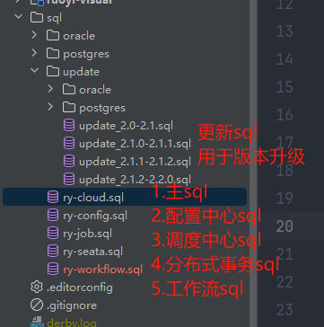
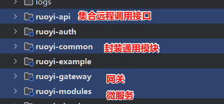
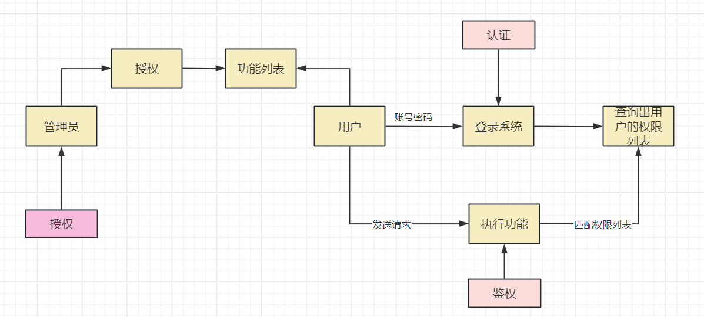
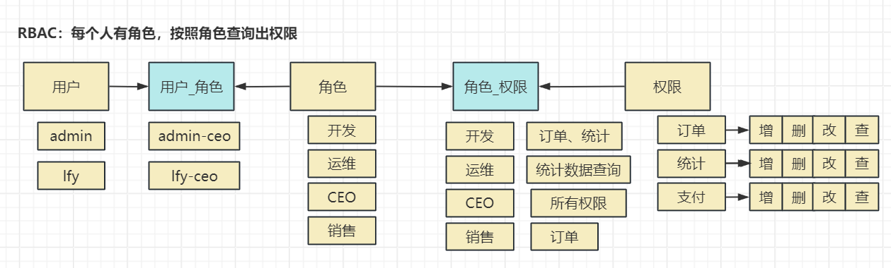
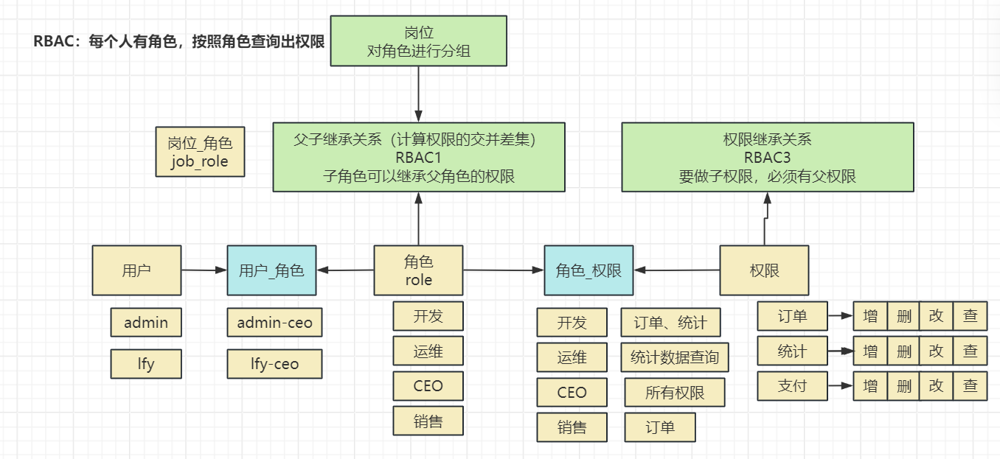
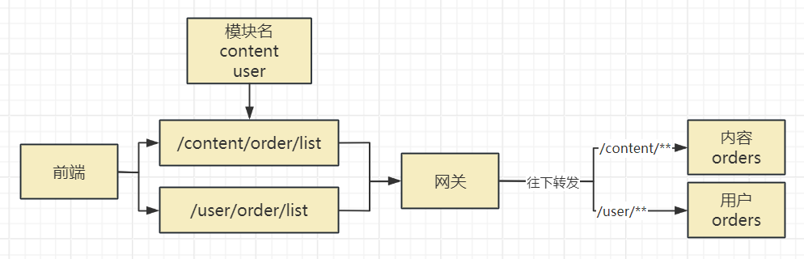
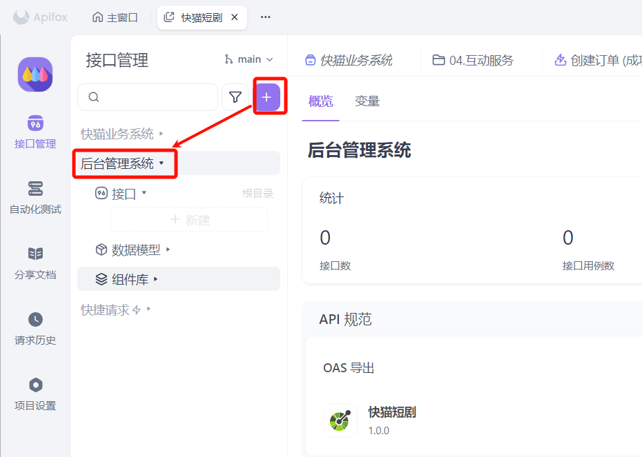
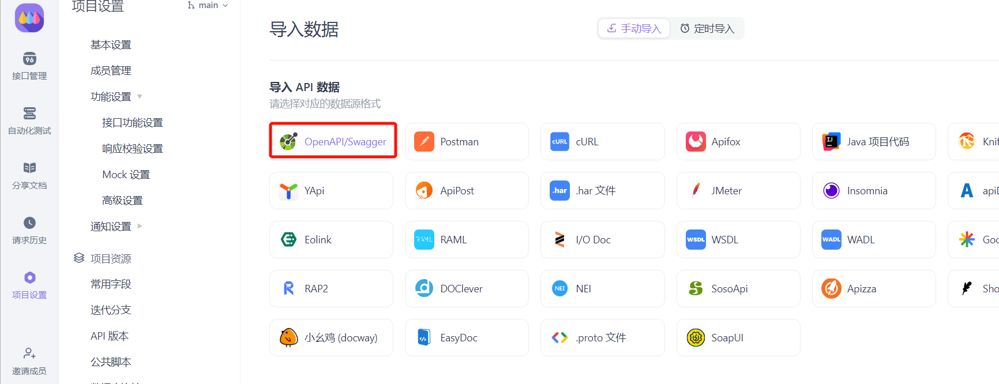
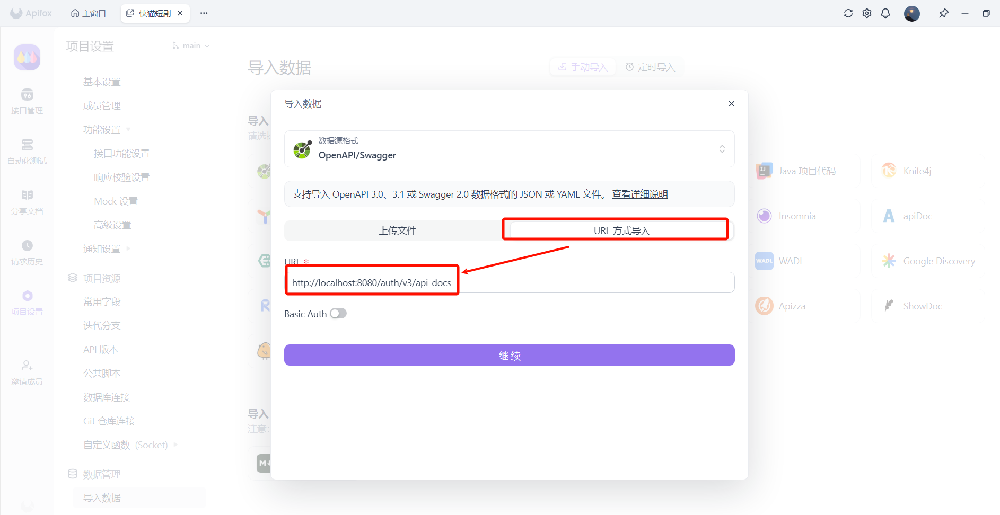
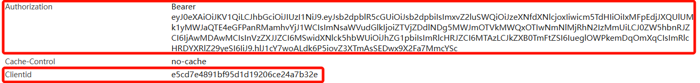

# 1. ruoyi：后台管理系统

ruoyi官网：https://doc.ruoyi.vip/ruoyi-vue/

# 为什么使用ruoyi

> **每个项目都有自己的后台管理系统；比如**：
> 
> 1. **商城**：需要有人登录后台录入商品数据等
> 2. **短剧**：需要有人登录后台短剧数据等
> 3. **银行**：需要有人登录后台进行业务审批等
> 4. **保险**：需要有人登录后台进行保单维护等
> 5. **汽车**：需要有人登录后台查看维保信息等
> 
> ......
> 
> **后台管理系统最基本需要具备如下功能**：
> 
> 1. **多用户：**允许公司不同用户登录进来，可以添加新用户，禁用、冻结用户等
> 2. **权限控制：**每个用户有自己能操作的权限功能，不能操作别人的
> 3. **组织架构：**用户属于哪个公司，哪个部门，上下级权限控制
> 4. **日志审计**：每个用户操作了哪些功能，何时操作，提交了哪些数据
> 
> .....
> 
> **这样的系统，每次开发每个软件都需要，所以我们不能每次都开发，企业要么有自己开发过的通用后台系统。要么可以使用开源方案。ruoyi是一个企业常用的开源后台管理系统**
> 
> 类似ruoyi的系统还有很多：`Jeesite、JeecgBoot、SmartAdmin、guns、renren-fast` 等

# 下载项目

> **原生若依：功能不多，简单易用，但代码架构比较乱。**
> 
> 后台：https://gitee.com/y_project/RuoYi-Vue/tree/springboot3
> 
> 前端：https://gitcode.com/yangzongzhuan/RuoYi-Vue3

> **社区魔改版若依：功能强大，上手难度略高，但代码架构合理**
> 
> 后台：https://gitee.com/dromara/RuoYi-Cloud-Plus/
> 
> 前端（**ElementPlus**）：https://gitee.com/JavaLionLi/plus-ui    
> 
> - **推荐使用，代码生成器默认生成的就是这个版本的代码**
> 
> 前端（Ant Design Vue）：https://gitee.com/dapppp/ruoyi-plus-vben5

# 启动后台管理系统

1. git拉取后台管理系统项目代码：

`git clone ``https://gitee.com/dromara/RuoYi-Cloud-Plus/`

1. 导入项目（注意maven配置文件）；配置项目 jdk17+； maven选中开发环境
2. **导入默认的sql文件； 先导入 **`ry-cloud.sql`**；**
  1. 用户、部门、角色、权限CRUD（权限管理对应的表）



1. 使用内置的nacos（**我们选择使用自建nacos**）；
2. 按照如下顺序启动为服务
  1. 必须启动基础建设（数据支撑层）: 
    - **mysql：数据库**
    - **redis：缓存**
    - **nacos：微服务注册中心、配置中心**
    - `docker compose -f .\docker-compose.yml up -d mysql nacos redis `
  2. 必须启动的微服务（业务逻辑层）：
    - **Gateway: 前端所有请求网关来接收并转发下去**
    - **auth：后台管理系统所有的登录、权限控制**
    - **system：后台管理系统其他功能；**

  - 其他可选启动的（用的时候再启动）
    - 基础建设: minio(影响文件上传) seata(影响分布式事务 默认开启) sentinel(影响熔断限流) monitor(影响监控) snailjob(影响定时任务)
    - 应用服务: **resource**(影响资源使用 websocket 文件上传 邮件 短信等) **workflow**(工作流) **gen**(代码生成) **job**(影响定时任务) **demo**(影响demo使用)

> **特别注意：每个微服务都从nacos中导入了几个配置； 这几个需要配置在nacos中**
> 
> 1. `application-common.yml`：通用配置
> 2. `datasource.yml`：数据源配置
> 3. 微服务名.yml



# 中间件访问地址

| 中间件 | 访问地址 | 端口 | 账号密码 |
| --- | --- | --- | --- |
| MySQL  | localhost | 3306 | root/ruoyi123 |
| Redis | localhost | 6379 | ruoyi123 |
| Nacos | localhost | 8848 |   |

# RBAC权限模型


如何控制住一个人的权限：

[认证 (authentication) 和授权 (authorization) ](https://www.cnblogs.com/xosg/p/10257792.html)

1. **认证**：你是谁；
  1. 用户按照账号密码或者其他手段登录；
  2. 用户登录进系统，去数据库查询自己的所有权限； 权限列表
2. **授权**：你能干什么； **授权一个用户对某个资源做什么动作**
  1. **授权**：授予用户什么权限； **管理员在后台添加权限（保存数据库）**
  2. 张三：  视频（获取、删除、修改）
  3. 你能删除？修改？
  4. **鉴权**：用户发送任何请求，执行任何操作；`/getOrder ===> 权限列表` 进行匹配。写一个`Filter`
    - 匹配成功，放行
    - 匹配失败，打回



**ABAC**：Attribute Based Access Controll：基于属性的访问控制

**RBAC**：Role Based Access Controll：基于角色的访问控制；

基础5张表

> 

https://www.jianshu.com/p/115938c6294e



**ACL**：Access Control List；把每个人能做什么所有的权限保存成一个列表；

- **数据冗余**； 很多人是同一个权限，数据库还要每个人都存储
- **张三**:  user:add, user:delete, user:get, user:update, order:get, order:delete
- 李四：user:add, user:delete, user:get, user:update, order:get, order:delete
- 王五：user:add, user:delete, user:get, user:update, order:get, order:delete

# ruoyi权限模型

ruoyi中，所有能操作的功能都在 `sys_menu`; 

- **M目录(可以展开)** ; 目录管理菜单
- **C菜单**(可以跳转到一个**Vue组件**)：菜单对应绑定一个页面（Vue组件）
  - 一个菜单最终打开的页面，能管理很多的按钮功能
- **F按钮**（对应一个API接口请求）；
  - 真正给后台发送请求；

## 菜单表（权限表）

ruoyi：支持手动进行菜单扩展；

1. 每个**菜单**和**按钮**都必须起一个名字；、
> ` 模块`（订单/支付）:`功能`（明细，日志）:`操作`（查询，删除，修改）

  1. system:user:list
  2. system:user:query
  3. monitor:online:list
  4. order:detail:query
2. 只要有功能，想要实现授权，把他添加到对应的菜单表中

## 用户的管理体系

用户：

- **部门id**： 会对应角色（sys_role_dept）
- 公司id（租户）
- 岗位id
- **角色id**：会对应角色（sys_user_role）

角色：

- 用户最终多个维度确定出所有角色

**角色——菜单关联表**：sys_role_menu

**菜单表**：sys_menu

根据角色找到所有菜单，拿到所有的菜单标识（权限标识）

**执行方法之前，利用AOP + 注解 快速检查，当前用户是否权限列表中有注解指定的权限**

```java
@SaCheckPermission("system:dept:list")
@GetMapping("/list")
public R<List<SysDeptVo>> list(SysDeptBo dept) {
    List<SysDeptVo> depts = deptService.selectDeptList(dept);
    return R.ok(depts);
}
```

用户 查询 岗位/公司/部门 ==> 角色 + 自己角色 ===> 直接查询菜单权限

**角色**：

1. **能操作哪些菜单**：添加角色的时候可以指定
2. **数据范围**：
  1. **CEO角色**指定数据权限范围：
    - **本部门权限**： 雷丰阳（**运维部**）、张三（开发部）、李四（市场部）
    - **本部门及以下权限：本部们 + 下属部门**
    - **仅本人**：仅自己的数据可以看
    - **自定义权限**：

> 回去：
> 
> 1. 拉取代码
> 2. 启动基本环境； 启动后台 + 前端
> 3. 测试后台管理系统功能

# 代码生成

> 后台管理系统最强大的功能就是基于数据库表结构，一键生成 前端+后端
> 
> 代码生成器默认规则：数据库每个表必须有 **5个公共字段**：

```sql
`create_by` bigint(20) DEFAULT NULL COMMENT '创建者ID',
`update_by` bigint(20) DEFAULT NULL COMMENT '更新者ID',
`create_dept` bigint(20) DEFAULT NULL COMMENT '操作者的部门ID',
`create_time` datetime NOT NULL DEFAULT CURRENT_TIMESTAMP COMMENT '创建时间',
`update_time` datetime NOT NULL DEFAULT CURRENT_TIMESTAMP ON UPDATE CURRENT_TIMESTAMP COMMENT '更新时间',
```

## 配置代码生成器

> 修改nacos 中 `ruoyi-gen.yml`
> 
> 1. 指定要逆向生成的数据库地址
> 2. 每个数据库都需要有：`gen_table`、`gen_table_column`这两个表，才能使用代码生成
> 3. 修改作者信息和包名

```yaml
spring:
  datasource:
    dynamic:
      # 设置默认的数据源或者数据源组,默认值即为 master
      primary: master
      seata: false
      datasource:
        # 主库数据源
        master:
          type: ${spring.datasource.type}
          driver-class-name: com.mysql.cj.jdbc.Driver
          url: jdbc:mysql://localhost:3306/content_service_db
          username: root
          password: ruoyi123
#        oracle:
#          type: ${spring.datasource.type}
#          driverClassName: oracle.jdbc.OracleDriver
#          url: ${datasource.system-oracle.url}
#          username: ${datasource.system-oracle.username}
#          password: ${datasource.system-oracle.password}
#        postgres:
#          type: ${spring.datasource.type}
#          driverClassName: org.postgresql.Driver
#          url: ${datasource.system-postgres.url}
#          username: ${datasource.system-postgres.username}
#          password: ${datasource.system-postgres.password}

# 代码生成
gen:
  # 作者
  author: leifengyang
  # 默认生成包路径 system 需改成自己的模块名称 如 system monitor tool
  packageName: com.lfy.kcat.content
  # 自动去除表前缀，默认是false
  autoRemovePre: false
  # 表前缀（生成类名不会包含表前缀，多个用逗号分隔）
  tablePrefix: sys_

```

## 启动代码生成器

> 先更新项目，用我的，然后再用代码生成器

> **前置**：生成代码之前：先创建好菜单目录，**以后生成的CRUD菜单都属于这个目录下**的操作

1. 7.1 步骤做完后，需要启动/重启 `ruoyi-gen` 项目
2. 使用 `admin/admin123` 登录后台管理系统；
3. 点击 `系统工具=> 代码生成`
4. 选择数据源，点击导入，**选中所有数据表**（选中需要生成代码的数据表）
5. 点击**预览**可以看到生成的代码
  1. 小插曲：当前版本的代码生成器【**必填**】字段逻辑是反的（已经修改）

## 创建&配置【内容微服务】项目

1. 创建 `内容服务` 项目
2. 复制生成的代码
3. 项目引入依赖

```xml
<dependency>
    <groupId>org.dromara</groupId>
    <artifactId>ruoyi-common-nacos</artifactId>
</dependency>

<dependency>
    <groupId>org.dromara</groupId>
    <artifactId>ruoyi-common-sentinel</artifactId>
</dependency>

<!-- RuoYi Common Log -->
<dependency>
    <groupId>org.dromara</groupId>
    <artifactId>ruoyi-common-log</artifactId>
</dependency>

<!-- RuoYi 接口文档 -->
<dependency>
    <groupId>org.dromara</groupId>
    <artifactId>ruoyi-common-doc</artifactId>
</dependency>

<dependency>
    <groupId>org.dromara</groupId>
    <artifactId>ruoyi-common-web</artifactId>
</dependency>

<dependency>
    <groupId>org.dromara</groupId>
    <artifactId>ruoyi-common-mybatis</artifactId>
</dependency>

<!-- RuoYi 幂等性 -->
<dependency>
    <groupId>org.dromara</groupId>
    <artifactId>ruoyi-common-idempotent</artifactId>
</dependency>
```

1. **修改 nacos 数据库文件**： `datasource.yml`
  1. 添加一个本微服务需要连接的数据库地址；如下

```yaml
datasource:
  system-master:
    # jdbc 所有参数配置参考 https://lionli.blog.csdn.net/article/details/122018562
    # rewriteBatchedStatements=true 批处理优化 大幅提升批量插入更新删除性能
    url: jdbc:mysql://localhost:3306/ry-cloud?useUnicode=true&characterEncoding=utf8&zeroDateTimeBehavior=convertToNull&useSSL=true&serverTimezone=GMT%2B8&rewriteBatchedStatements=true&allowPublicKeyRetrieval=true
    username: root
    password: ruoyi123
  gen:
    url: jdbc:mysql://localhost:3306/ry-cloud?useUnicode=true&characterEncoding=utf8&zeroDateTimeBehavior=convertToNull&useSSL=true&serverTimezone=GMT%2B8&rewriteBatchedStatements=true&allowPublicKeyRetrieval=true
    username: root
    password: ruoyi123
  job:
    url: jdbc:mysql://localhost:3306/ry-job?useUnicode=true&characterEncoding=utf8&zeroDateTimeBehavior=convertToNull&useSSL=true&serverTimezone=GMT%2B8&rewriteBatchedStatements=true&allowPublicKeyRetrieval=true
    username: root
    password: ruoyi123
  workflow:
    url: jdbc:mysql://localhost:3306/ry-workflow?useUnicode=true&characterEncoding=utf8&zeroDateTimeBehavior=convertToNull&useSSL=true&serverTimezone=GMT%2B8&rewriteBatchedStatements=true&allowPublicKeyRetrieval=true&nullCatalogMeansCurrent=true
    username: root
    password: ruoyi123
  content:
    url: jdbc:mysql://localhost:3306/content_service_db?useUnicode=true&characterEncoding=utf8&zeroDateTimeBehavior=convertToNull&useSSL=true&serverTimezone=GMT%2B8&rewriteBatchedStatements=true&allowPublicKeyRetrieval=true&nullCatalogMeansCurrent=true
    username: root
    password: ruoyi123


spring:
  datasource:
    type: com.zaxxer.hikari.HikariDataSource
    # 动态数据源文档 https://www.kancloud.cn/tracy5546/dynamic-datasource/content
    dynamic:
      # 主数据源
      primary: system-master
      # 性能分析插件(有性能损耗 不建议生产环境使用)
      p6spy: true
      # 开启seata代理，开启后默认每个数据源都代理，如果某个不需要代理可单独关闭
      seata: ${seata.enabled}
      # 严格模式 匹配不到数据源则报错
      strict: true
      hikari:
        # 最大连接池数量
        maxPoolSize: 20
        # 最小空闲线程数量
        minIdle: 10
        # 配置获取连接等待超时的时间
        connectionTimeout: 30000
        # 校验超时时间
        validationTimeout: 5000
        # 空闲连接存活最大时间，默认10分钟
        idleTimeout: 600000
        # 此属性控制池中连接的最长生命周期，值0表示无限生命周期，默认30分钟
        maxLifetime: 1800000
        # 多久检查一次连接的活性
        keepaliveTime: 30000

```

1. **给 nacos 中添加本微服务的配置文件**：`content-service.yml`; 内容如下

```yaml
spring:
  datasource:
    dynamic:
      # 设置默认的数据源或者数据源组,默认值即为 master
      primary: master
      datasource:
        # 主库数据源
        master:
          type: ${spring.datasource.type}
          driver-class-name: com.mysql.cj.jdbc.Driver
          url: ${datasource.content.url}
          username: ${datasource.content.username}
          password: ${datasource.content.password}
```

1. **项目启动报错**：没有扫描到 mapper 接口。统一修改nacos中的 `application-common.yml` 配置，修改mybatis-plus 配置。这样以后得所有内容都会扫描到

```java
mybatis-plus:
  # 自定义配置 是否全局开启逻辑删除 关闭后 所有逻辑删除功能将失效
  enableLogicDelete: true
  # 多包名使用 例如 org.dromara.**.mapper,org.xxx.**.mapper
  mapperPackage: org.dromara.**.mapper,com.lfy.**.mapper
```

1. **执行SQL与复制前端代码**

> 将前端代码复制过去，然后执行数据库菜单sql，保证后台管理系统有菜单

1. **配置&重启网关**

> 新增的微服务请求，必须通过网关往下转发；网关配置文件修改 `ruoyi-gateway.yml`，添加路由规则

```yaml
- id: content-service
  uri: lb://content-service
  predicates:
    - Path=/content/**
  filters:
    - StripPrefix=1
```



# Nvm

> 统一管理nodejs版本

```shell
nvm list # 查看当前系统能用的Node版本
nvm list available # 查看所有可以下载的
nvm install 22.13.4 # 下载指定版本

# 管理员运行如下命令
nvm use 24.7.0 # 使用指定的版本
```

# 接口文档

https://plus-doc.dromara.org/#/ruoyi-cloud-plus/framework/association/doc

> 脚手架默认使用 springdoc， 可以直接生成 符合 `openapi `规范的json。
> 
> 这样就可以导入到任何支持openapi的工具中

## 脚手架默认接口文档

根据项目内所有文档组完成所有数据源创建(拉取后端`openapi`结构体)
URL格式 `http://网关ip:端口/服务路径/v3/api-docs`
项目内所需:
`http://localhost:8080/demo/v3/api-docs` 演示服务
`http://localhost:8080/auth/v3/api-docs` 认证服务
`http://localhost:8080/resource/v3/api-docs` 资源服务
`http://localhost:8080/system/v3/api-docs` 系统服务
`http://localhost:8080/code/v3/api-docs` 代码生成服务

`http://localhost:8080/content/v3/api-docs` 内容服务

## 后台管理系统接口文档导入

### 创建模块：后台管理系统



### 导入接口文档


### 指定接口规范：OpenAPI



### 配置接口地址



### 导入其他更多接口文档

> 重复 1-4 步骤

## 实时调试接口

> 1. 我们经常需要用工具实时给后台发送请求，并查看响应数据
> 2. 如果配合前端，前端也需要发送请求，查看数据，然后再编写前端组件
> 3. **ruoyi脚手架要求**：发送请求必须携带请求头（这个请求头，登录后台，随便发送请求，浏览器f12查看当前请求的请求头对应字段即可）
> 
> 
> 
> Apifox 提供环境配置功能，可以配置开发环境、生产环境等如何发送请求，

> 接口文档地址：leifengyang.apifox.cn ； 密码:lfylfy
> 
> 加入项目：ForSum 在 Apifox 邀请你加入项目 快猫 https://app.apifox.com/invite/project?token=TOJD-D6p5pNbdoS2kolFl