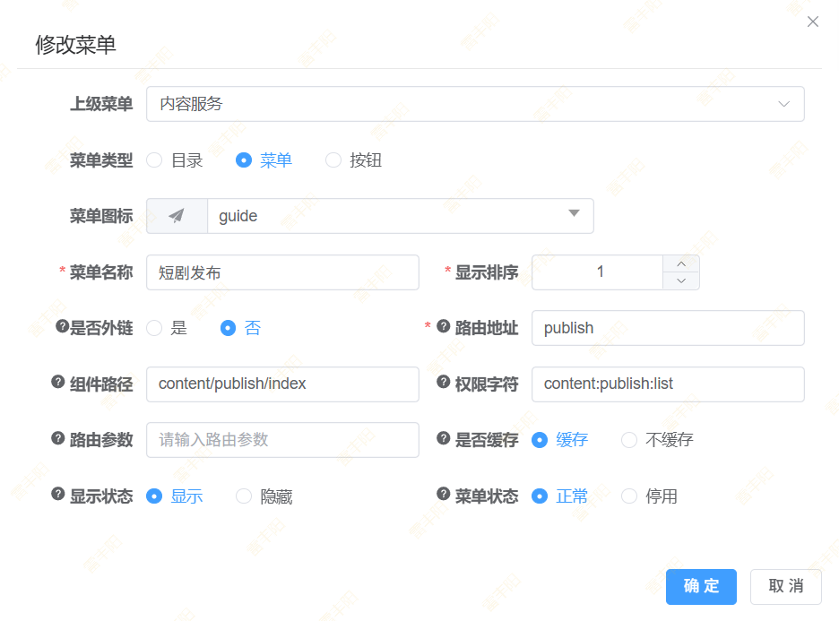
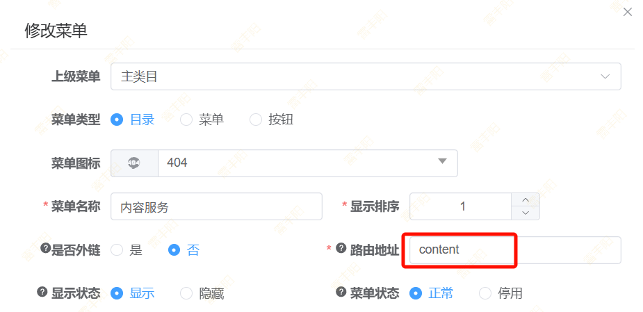
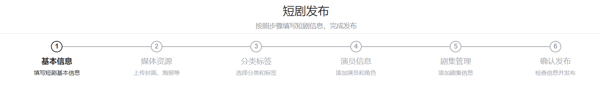
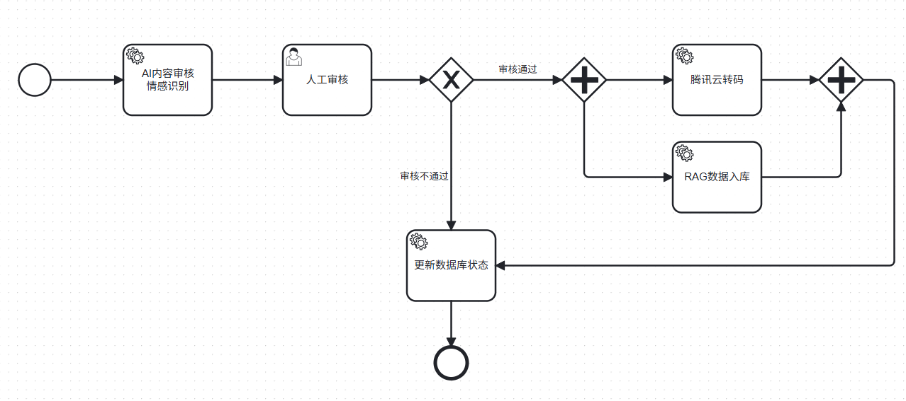

# 3. 内容服务

> 实现两个核心功能：
> 
> 1. Minio对象存储保存图片视频
> 2. 短剧信息保存
> 3. 短剧审核流程（使用Camunda流程引擎）
> 4. AI审核
> 5. 腾讯云点播与视频转码

# Minio

基础准备：[📄 4. Minio](https://shenma-docs.feishu.cn/wiki/BNOVwvWBEiDM7gkELlDcNwLDnhA)

编写 Minio 文件上传接口（在content-service内）

（接口地址`/content/upload`）。 要求：文件上传完后返回文件访问地址

# 短剧发布

## 配置发布页

### 新增菜单

> 新增 **短剧发布** 菜单； 短剧发布是一个菜单，对应的路由地址是publish。



### 菜单访问路径

> 实际的路由访问地址为： `上级目录地址`** + **`本菜单地址`
> 
> 其中：`上级目录`**：content  +  本菜单：publish = **`/content/publish`
> 
> 前端将会跳转到 `/content/publish`** 位置。就必须在 views 下面 **`/content/publish`** 位置放置一个 **`index.vue`



### 组件内容

[📎 短剧发布：前端.zip](<files/短剧发布：前端.zip>)

## 短剧发布流程



## 数据加载实际

1. **基本信息（步骤0）**：无需额外数据加载
2. **媒体资源（步骤1）**：无需额外数据加载
3. **分类标签（步骤2）**：
  - 标签数据：进入此步骤时加载
  - 分类数据：用户点击级联选择器时懒加载
4. **演员信息（步骤3）**：进入此步骤时加载初始演员列表
5. **剧集管理（步骤4）**：无需额外数据加载
6. **确认发布（步骤5）**：无需额外数据加载

## 需要编写接口

1. 文件上传：**/upload**； 返回 **R**；**data** 为文件地址
2. **获取所有标签数据**：(逆向已经生成)
3. **获取所有分类数据**：(逆向已经生成)
4. **短剧发布**：`/content/publish`； 

> 请求体发送以下数据

```json
{
  "drama": {
    "title": "掌上珠",
    "subTitle": "",
    "cover": "http://localhost:9000/kcat/2025/09/05/71a0ee96-f255-45b4-811c-aba17324dccf_img.jpg",
    "poster": "http://localhost:9000/kcat/2025/09/05/70e02dc5-b6d8-46d4-b605-7497a76c75cd_img.jpg",
    "trailerUrl": "",
    "description": "将军之女沈明珠母亲早逝，父兄战死沙场，她受刺激后失明。父亲的宗族们对她十分恶毒，设计陷害逼她嫁人。就在关键时刻，她遇到了行事狠戾，但同样带着一身伤痛的镇南王宇文枭。沈明珠决定铤而走险，以婚试爱。",
    "storyLine": "将军之女沈明珠母亲早逝，父兄战死沙场，她受刺激后失明。父亲的宗族们对她十分恶毒，设计陷害逼她嫁人。就在关键时刻，她遇到了行事狠戾，但同样带着一身伤痛的镇南王宇文枭。沈明珠决定铤而走险，以婚试爱。",
    "director": "张三,李四",
    "screenwriter": "王五,赵六",
    "productionCompany": "星光娱乐",
    "releaseDate": "2025-09-04T16:00:00.000Z",
    "totalEpisodes": 90,
    "language": "zh-CN",
    "region": "",
    "year": 2025,
    "quality": "HD",
    "ageRating": "G",
    "isFinished": 1,
    "isVip": 0,
    "isNew": 1,
    "isHot": 1,
    "isRecommended": 1,
    "status": 1,
    "auditStatus": 0
  },
  "categories": [
    10,
    12
  ],
  "tags": [
    "1963489654820843523",
    "1963489654820843526",
    "1963489654820843525",
    "1963489654820843527"
  ],
  "actors": [
    {
      "actorId": "1963584141639331843",
      "actorName": "雷丰阳",
      "roleName": "三皇子",
      "roleType": 1,
      "sortOrder": 0,
      "isNewActor": false
    },
    {
      "actorId": "",
      "actorName": "赵丽颖",
      "roleName": "三皇子的丫鬟",
      "roleType": 2,
      "sortOrder": 1,
      "isNewActor": true
    },
    {
      "actorId": "",
      "actorName": "刘亦菲",
      "roleName": "三皇子的2丫环",
      "roleType": 2,
      "sortOrder": 2,
      "isNewActor": true
    }
  ],
  "episodes": [
    {
      "episodeNumber": 1,
      "title": "掌上珠",
      "cover": "",
      "duration": 60,
      "description": "",
      "videoUrl": "http://localhost:9000/kcat/2025/09/05/862d0ec5-273a-484d-9e49-e779c7d0ee62_掌上珠01.dat",
      "isFree": 1,
      "coinPrice": 0
    },
    {
      "episodeNumber": 2,
      "title": "掌上珠",
      "cover": "",
      "duration": 60,
      "description": "",
      "videoUrl": "http://localhost:9000/kcat/2025/09/05/62701514-8e9b-4a5e-85a4-b86e166b95f5_掌上珠02.dat",
      "isFree": 1,
      "coinPrice": 0
    },
    {
      "episodeNumber": 3,
      "title": "掌上珠",
      "cover": "",
      "duration": 70,
      "description": "",
      "videoUrl": "http://localhost:9000/kcat/2025/09/05/ade57c70-444b-455e-8114-8530b8c1ba12_掌上珠03.dat",
      "isFree": 1,
      "coinPrice": 0
    }
  ]
}
```

# 短剧审核流程

