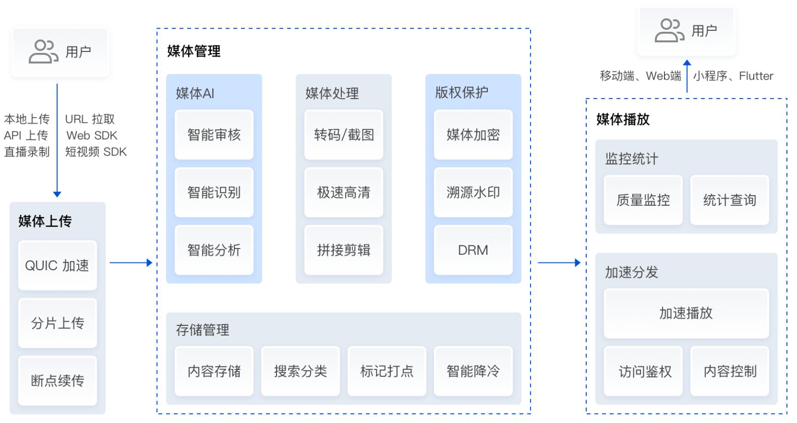
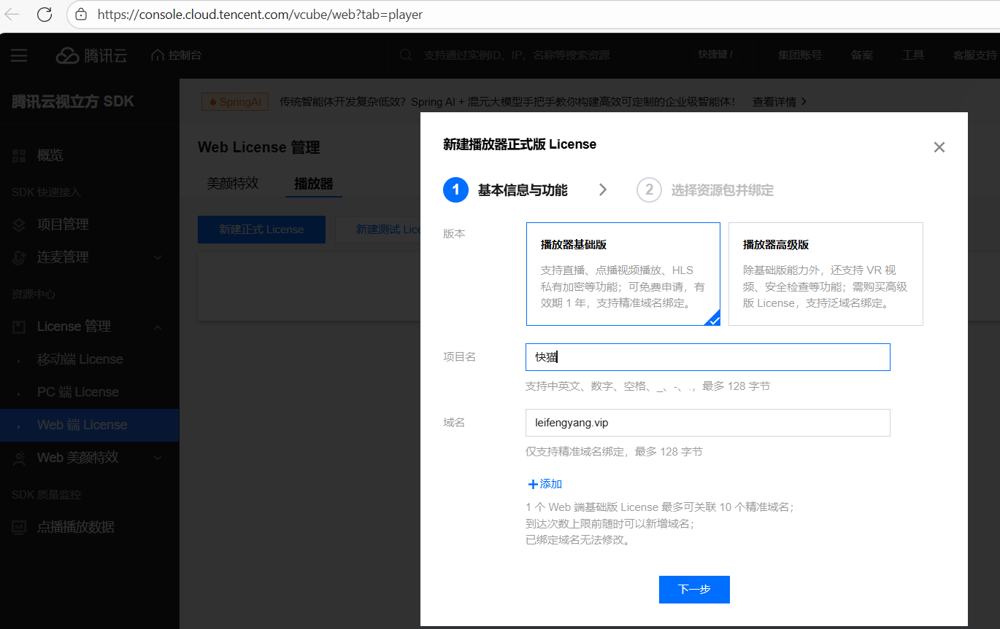
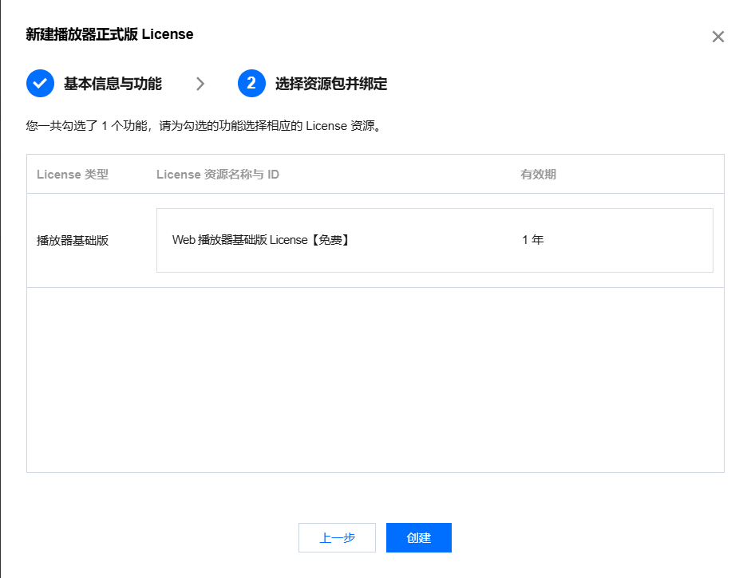
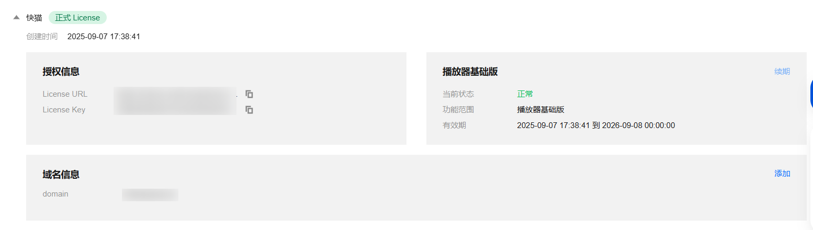
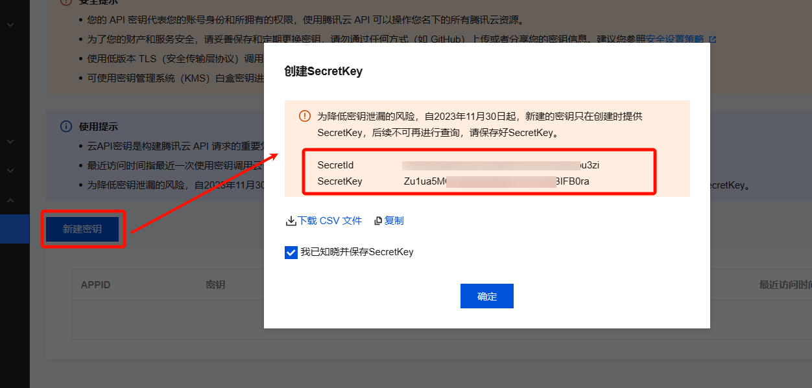
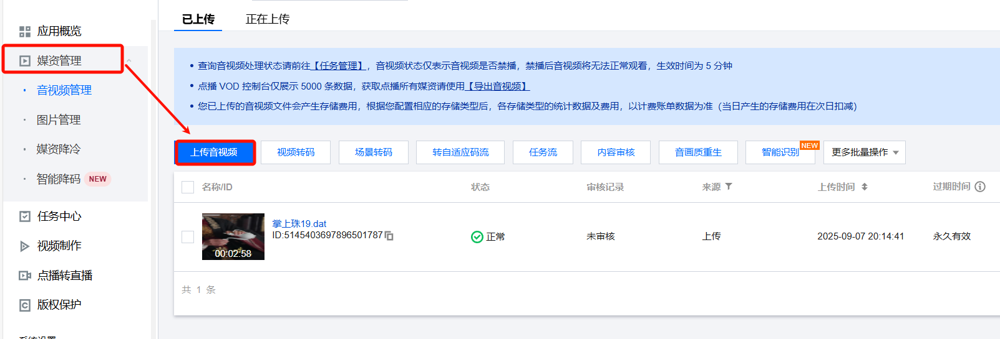
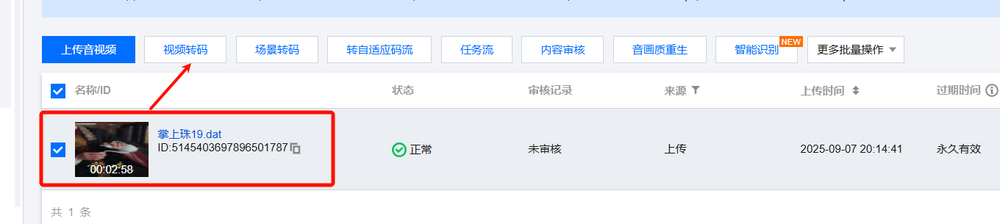
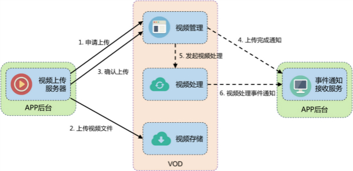
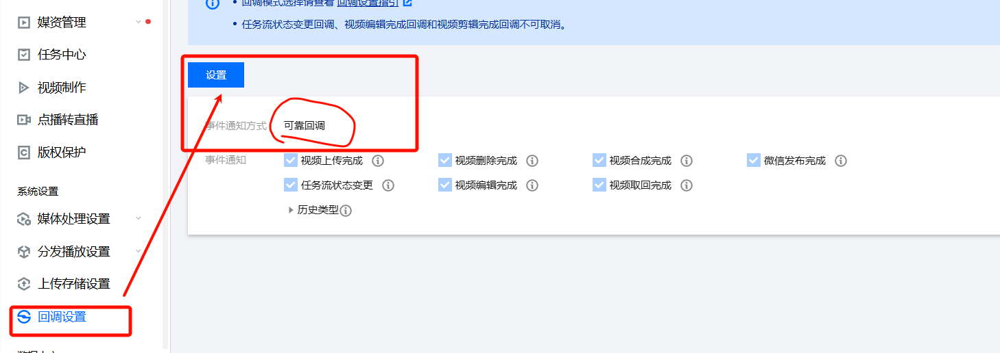

# 4. 腾讯云点播（VOD）

> 购买新客资源包。用于测试：https://cloud.tencent.com/product/vod
> 
> 视频处理方向：**FFmpeg**:  https://ffmpeg.org/
> 
> 1. Java方向底层使用 FFmpeg；
>   1. Jaffree
>   2. **Xuggle**
>   3. JCodec、
>   4. ....
> 
> 安装 **FFmpeg 环境；  **

# VOD 快速入门

## 简介

**ContentDeliveryNetword**：内容分发网络；指把我们的一个**资源**（静态资源）分发到**世界各地的服务器**上；

CDN技术一般称为 CDN加速

**效果**：任何地方的用户访问你这个资源都感觉比较**快**。

> 云点播（Video on Demand，VOD）面向音视频、图片等媒体，提供制作**上传**、**存储**、**转码**、**媒体处理**、**媒体 AI**、**加速分发播放**、版权保护等一体化高品质媒体服务。



## 功能特性

1. 提供本地上传、URL 拉取、API 上传、Web SDK、短视频 SDK、直播录制等多种上传方式，支持将视频上传存储至云端，提供99.9999999999%的数据持久性。
2. 可在云端对视频进行`普通转码、极速高清、多码率转码`、截图、视频加密、添加水印、智能识别等处理。
3. 处理完成的视频文件可通过腾讯云遍布`全球的 CDN 节点完成加速分发`。
4. 结合云点播提供的播放器 SDK 多终端能力，提供完整可靠的媒体播放服务、数据质量和监控平台。

> **功能详情**：https://cloud.tencent.com/document/product/266/78037

## 如何使用

### 场景转码

#### 短剧剧场模式

[📎 PixPin_2025-09-07_16-55-55.mp4](<files/PixPin_2025-09-07_16-55-55.mp4>)

#### 信息流模式

[📎 PixPin_2025-09-07_17-03-07.mp4](<files/PixPin_2025-09-07_17-03-07.mp4>)

#### 电商模式

[📎 PixPin_2025-09-07_17-03-54.mp4](<files/PixPin_2025-09-07_17-03-54.mp4>)

### 播放器SDK

> 前端开发人员需要集成腾讯云的播放器SDK包；（web端是js文件。其他端为对应的软件包）

https://cloud.tencent.com/document/product/881/30818

#### 申请Web SDK；

> `为了方便开发。腾讯云不会校验 localhost；127.0.0.1；这些本地地址。`





#### SDK信息确认



### 服务端API

https://cloud.tencent.com/document/product/266/31752

#### 开通云密钥

1. 在访问管理控制台中的 [云 API 密钥](https://console.cloud.tencent.com/cam/capi) 页面里获取 appid、secretid、secretkey 内容。



> 我的测试密钥（项目结束将会删除）

```java
SecretId:AKIDPcgbWyJRL3YpsiKisoY5OTLBxZ7bu3zi
SecretKey:Zu1ua5MQJzRgiX8WgeR1OXYNzBIFB0ra
```

#### API 与 SDK

https://cloud.tencent.com/document/api/266/31767

> 接口请求域名： vod.tencentcloudapi.com 。
> 
> - 我们强烈建议您使用云点播提供的 [服务端上传 SDK](https://cloud.tencent.com/document/product/266/9759#1.-.E5.8F.91.E8.B5.B7.E4.B8.8A.E4.BC.A0) 来上传文件。直接调用 API 进行上传的难度和工作量都显著大于使用 SDK。
> - 该接口用于申请媒体文件（和封面文件）的上传，获取文件上传到云点播的元信息（包括上传路径、上传签名等），用于后续上传接口。
> - 上传流程请参考 [服务端上传综述](https://cloud.tencent.com/document/product/266/9759)。

> 调用别人代码的两种方式

**API**：发web请求，调用接口，返回数据

**SDK：Soft Devlopment Kit**：软件开发工具包； 导入软件包，调用方法

# VOD 界面操作

> https://cloud.tencent.com/product/vod?Is=sdk-topnav

## 媒资管理

> 可以管理上传的视频、图片；



## 视频转码



> 了解下视频领域的几个专业名字；**码率（Bitrate）**、**帧率（Frame Rate / FPS）**、**分辨率（Resolution）**、**音频编码（Audio Codec）**；

### 码率（Bitrate / BPS）

> **码率**是指视频或音频每秒传输的数据量，常用单位是 **bps（比特每秒）**，视频中常用 **kbps（千比特每秒）** 或 **Mbps（兆比特每秒）**。  Bit per second  1000Mbps / 8 = 12mb/s

- **码率越高** → 每秒包含的数据量越多 → 画质或音质更好 → 文件体积更大。
- **码率越低** → 文件体积小 → 画质或音质可能下降。

在视频转码时可以选择 **固定码率（CBR）** 或 **可变码率（VBR）**：

- **CBR**：码率恒定，方便网络传输，质量可能波动
- **VBR**：码率随画面复杂度变化，质量更稳定，文件大小更接近设定目标

> 视频编码；
> 
> 1. **视频**很多帧画面的组成； 每帧画面就是一个图像。

### 帧率（Frame Rate / FPS）

> 帧率是视频**每秒**显示的**图片**帧数，常用单位 **fps（frames per second）**
> 
> **常见帧率**：
> 
> - **24 fps**（电影标准）
> - **25 fps**（PAL 制式电视）
> - **30 fps**（NTSC 制式电视）
> - **50/60** fps（高速、流畅、**游戏**/体育视频潜在使用）； 

- **帧率高** → **动作更流畅**，文件体积也会增加
- **帧率低** → 文件小，但容易感觉**卡顿**
- 转码时不一定要保留原帧率，可以下调以减小文件（例如 60fps → 30fps）

### 分辨率（Resolution）

> 视频画面的宽度和高度的像素数量，通常写成 “宽 × 高”。 最短边来算清晰度
> 
> **常见分辨率**：
> 
> - 3840×2160（**2K 超高清**）
> - 1920×1080（**1080p，全高清**）
> - 1280×720（**720p，高清**）
> - 640×360（**360p，低清**）

- **分辨率越高** → 画面细节越多 → **文件体积更大**，对设备和**带宽**要求更高
- 降低分辨率是视频转码中减少体积、适应低网络环境的常用方法

### 音频编码（Audio Codec）

> 指音频数据的压缩方式/格式，在视频文件中音频轨往往采用独立的编码方案。
> 
> **常见音频编码格式**：
> 
> - **AAC**（Advanced Audio Coding）：主流、高压缩比、音质较好
> - **MP3**：老牌、有很高的兼容性
> - **Opus**：适合流媒体，低码率效果好
> - **AC-3**（杜比数字）：常见于 DVD、**蓝光**

# VOD 代码操作

> 所有代码操作之前，必须执行 `服务端API`** **`=>`** **`开通云密钥`

## 核心配置

### 引入依赖

```xml
<dependency>
    <groupId>com.qcloud</groupId>
    <artifactId>vod_api</artifactId>
    <version>2.1.5</version>
</dependency>
```

### 配置客户端

```java
VodUploadClient client = new VodUploadClient("your secretId", "your secretKey");
```

### 抽取配置

> 配置类

```java
package com.lfy.kcat.content.vod.config;

import com.lfy.kcat.content.vod.properties.VodProperties;
import com.qcloud.vod.VodUploadClient;
import com.tencentcloudapi.common.Credential;
import com.tencentcloudapi.vod.v20180717.VodClient;
import org.springframework.beans.factory.annotation.Autowired;
import org.springframework.context.annotation.Bean;
import org.springframework.context.annotation.Configuration;

/**
 * @author leifengyang
 * @version 1.0
 * @date 2025/9/8 14:05
 * @description:
 */
@Configuration
public class VodConfig {
    @Autowired
    VodProperties vodProperties;

    @Bean //专业负责上传功能
    public VodUploadClient vodUploadClient(){
        return new VodUploadClient(vodProperties.getSecretId(),
            vodProperties.getSecretKey());
    }


    @Bean //对媒资平台的其他增删改查
    public VodClient vodClient(){
        Credential credential = new Credential(vodProperties.getSecretId(),
            vodProperties.getSecretKey());
        return new VodClient(credential,vodProperties.getRegion());
    }
}
```

> 属性类

```typescript
package com.lfy.kcat.content.vod.properties;

import lombok.Data;
import org.springframework.boot.context.properties.ConfigurationProperties;
import org.springframework.stereotype.Component;

/**
 * @author leifengyang
 * @version 1.0
 * @date 2025/9/8 14:03
 * @description:
 */
@Data
@ConfigurationProperties(prefix = "vod")
@Component
public class VodProperties {
    private String secretId;
    private String secretKey;
    private Long stuAppId;
    private String region;
//    private Boolean ignoreCheck;
//    private Integer retryTime;
}
```

> 配置文件

```shell
vod:
  secretId: AKIDjaIpAIsssoEUEoCRejigXE
  secretKey: Zw50iGbAgz71sss2PK4bw40jE
  stuAppId: 1500661618
  region: ap-chongqing
```

## 媒体上传

https://cloud.tencent.com/document/product/266/9759#1.-.E5.8F.91.E8.B5.B7.E4.B8.8A.E4.BC.A0

### API 传统方式上传

> 如果我们自己要发请求，完成上传，必须执行以下功能。而SDK都封装了



### SDK 一键上传

> 腾讯云支持上传完成后转码

https://cloud.tencent.com/document/product/266/10276#.E6.8C.87.E5.AE.9A.E4.BB.BB.E5.8A.A1.E6.B5.81

> 要用到账号密码，去 控制台 搜 访问密钥，开通一个

```java
SecretId：AKIDjaIpAIDxXv5EE4sVu52oEUEoCRejigXE
SecretKey：Zw50iGbAgz71hAQ0TwLacR2PK4bw40jE
```

## 媒体数据

```java
@Autowired
VodClient vodClient;
/**
 * 查询媒资
 */
@Test
void searchMedia(){
    SearchMediaRequest request = new SearchMediaRequest();
    request.setSubAppId(vodProperties.getStuAppId());
    request.setVid("5145403698105049553");
    request.setLimit(1000L);

    try {
        //查询这个应用下的所有媒体资源
        SearchMediaResponse response = vodClient.SearchMedia(request);
        System.out.println("查询成功:" +response);


        //获取有用信息
        MediaInfo[] mediaInfoSet = response.getMediaInfoSet();
        for (MediaInfo info : mediaInfoSet) {
            //1、基本信息
            MediaBasicInfo basicInfo = info.getBasicInfo();
            String name = basicInfo.getName();
            String vid = basicInfo.getVid();
            String mediaUrl = basicInfo.getMediaUrl();
            MediaMetaData metaData = info.getMetaData();
            Float duration = metaData.getDuration();
            System.out.println("视频名称:" +name);
            System.out.println("视频ID:" +vid);
            System.out.println("视频URL:" +mediaUrl);
            System.out.println("视频时长(ms):" +duration);

            System.out.println("=======转码后的数据=========");
            MediaTranscodeInfo transcodeInfo = info.getTranscodeInfo();
            MediaTranscodeItem[] transcodeSet = transcodeInfo.getTranscodeSet();
            for (MediaTranscodeItem transcodeItem : transcodeSet) {
                String url = transcodeItem.getUrl();
                Long width = transcodeItem.getWidth();
                Long bitrate = transcodeItem.getBitrate();
                System.out.println("码率：【"+bitrate+"】；清晰度：【"+width+"】 地址："+url);

            }

            System.out.println(">>>>>>>>>>>>>>>>>>>>>>>>>>>");

        }

    } catch (TencentCloudSDKException e) {
        throw new RuntimeException(e);
    }
}
```

## 事件感知

### 两种回调方式

#### 普通回调

普通回调是 App 服务被动接收事件通知的模式。配置回调 URL 并选择普通回调模式后，云点播会在事件完成后，向回调 URL 发起回调。

云点播发起的普通回调的形式是 HTTP 请求，请求体为 JSON 格式，内容为不含 EventHandle 参数的 [EventContent 结构](https://cloud.tencent.com/document/api/266/31773#EventContent)。
以 [任务状态变更通知](https://cloud.tencent.com/document/product/266/9636) 为例，回调中的 `EventType` 参数为 `ProcedureStateChanged`，信息由 `ProcedureStateChangeEvent` 参数表示（[ProcedureTask](https://cloud.tencent.com/document/api/266/31773#ProcedureTask) 结构）。

如果因为网络等原因，App 服务没有收到回调，腾讯云将连续重发回调。因为存在重发后 App 服务依然没有收到回调的可能，推荐使用可靠性更高的“可靠回调”模式。

#### 可靠回调

可靠回调是 App 服务主动向云点播拉取事件通知的模式。选择可靠回调模式后，云点播系统将把事件通知放入队列中，App 服务通过服务端 API 从队列中依次消费事件通知。
App 服务通过 [拉取事件通知](https://cloud.tencent.com/document/product/266/33433) API 获取消息后，需要调用 [确认事件通知](https://cloud.tencent.com/document/product/266/33434) API 进行确认。消息必须被确认之后，才会从云点播中的队列中删除，所以“可靠回调”的可靠性高于“普通回调”。**如果对事件通知的可靠性要求高，建议使用“可靠回调”模式**。

### 可靠回调

https://cloud.tencent.com/document/product/266/35579#.E7.A1.AE.E8.AE.A4.E5.8F.AF.E9.9D.A0.E5.9B.9E.E8.B0.83

> 配置可靠回调方式； 数据一致性要求高，就可靠回调；



> 获取所有事件

```java
@Test
void testGetEvent() throws TencentCloudSDKException {
    PullEventsRequest request = new PullEventsRequest();
    request.setSubAppId(vodProperties.getStuAppId());

    PullEventsResponse response = null;
    response = vodClient.PullEvents(request);
    if(response!=null && response.getEventSet()!=null){
        for (EventContent event : response.getEventSet()) {
            System.out.println(event);
        }
    }

}
```