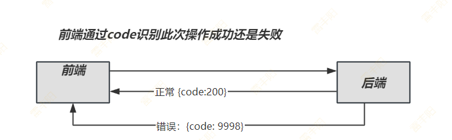
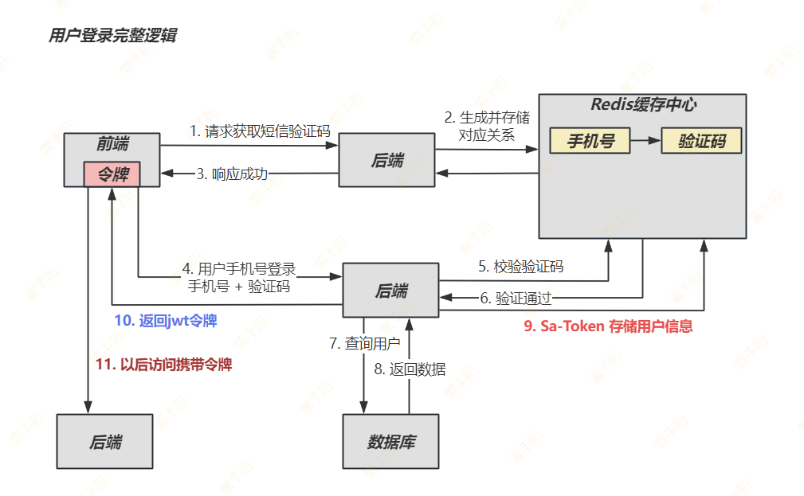

# 5. 用户服务



# 工程搭建

## 网关放行

> 所有 /api/** 所有路径，由 user-server 直接处理； 配置白名单

```bash
# 安全配置
security:
  # 不校验白名单
  ignore:
    whites:
      - /auth/code
      - /auth/logout
      - /auth/login
      - /auth/binding/*
      - /auth/register
      - /auth/tenant/list
      - /resource/sms/code
      - /resource/sse/close
      - /*/v3/api-docs
      - /*/error
      - /csrf
      - /warm-flow-ui/**
      - /api/**
```

## 创建服务

> 主要引入 Sa-Token 权限框架

```xml
<?xml version="1.0" encoding="UTF-8"?>
<project xmlns="http://maven.apache.org/POM/4.0.0"
         xmlns:xsi="http://www.w3.org/2001/XMLSchema-instance"
         xsi:schemaLocation="http://maven.apache.org/POM/4.0.0 http://maven.apache.org/xsd/maven-4.0.0.xsd">
    <modelVersion>4.0.0</modelVersion>
    <parent>
        <groupId>org.dromara</groupId>
        <artifactId>ruoyi-modules</artifactId>
        <version>${revision}</version>
    </parent>

    <groupId>com.lfy.kcat.user</groupId>
    <artifactId>user-service</artifactId>

    <properties>
        <maven.compiler.source>23</maven.compiler.source>
        <maven.compiler.target>23</maven.compiler.target>
        <project.build.sourceEncoding>UTF-8</project.build.sourceEncoding>
    </properties>

    <dependencies>
        <dependency>
            <groupId>org.dromara</groupId>
            <artifactId>ruoyi-common-nacos</artifactId>
        </dependency>

        <dependency>
            <groupId>org.dromara</groupId>
            <artifactId>ruoyi-common-sentinel</artifactId>
        </dependency>

        <!-- RuoYi Common Log -->
        <dependency>
            <groupId>org.dromara</groupId>
            <artifactId>ruoyi-common-log</artifactId>
        </dependency>

        <!-- RuoYi 接口文档 -->
        <dependency>
            <groupId>org.dromara</groupId>
            <artifactId>ruoyi-common-doc</artifactId>
        </dependency>

        <dependency>
            <groupId>org.dromara</groupId>
            <artifactId>ruoyi-common-web</artifactId>
        </dependency>

        <dependency>
            <groupId>org.dromara</groupId>
            <artifactId>ruoyi-common-mybatis</artifactId>
        </dependency>
        <!-- RuoYi 幂等性 -->
        <dependency>
            <groupId>org.dromara</groupId>
            <artifactId>ruoyi-common-idempotent</artifactId>
        </dependency>

        <dependency>
            <groupId>cn.dev33</groupId>
            <artifactId>sa-token-spring-boot3-starter</artifactId>
            <version>1.44.0</version>
        </dependency>
        <!-- Sa-Token 整合 RedisTemplate -->
        <dependency>
            <groupId>cn.dev33</groupId>
            <artifactId>sa-token-redis-template</artifactId>
            <version>1.44.0</version>
        </dependency>

        <!-- 提供 Redis 连接池 -->
        <dependency>
            <groupId>org.apache.commons</groupId>
            <artifactId>commons-pool2</artifactId>
        </dependency>

        <!-- Sa-Token 整合 Fastjson2 -->
        <dependency>
            <groupId>cn.dev33</groupId>
            <artifactId>sa-token-fastjson2</artifactId>
            <version>1.44.0</version>
        </dependency>

        <!-- Sa-Token 整合 jwt -->
        <dependency>
            <groupId>cn.dev33</groupId>
            <artifactId>sa-token-jwt</artifactId>
            <version>1.44.0</version>
        </dependency>

        <!-- Sa-Token 整合 SpringAOP 实现注解鉴权 -->
        <dependency>
            <groupId>cn.dev33</groupId>
            <artifactId>sa-token-spring-aop</artifactId>
            <version>1.44.0</version>
        </dependency>

        <dependency>
            <groupId>org.springframework.boot</groupId>
            <artifactId>spring-boot-starter-test</artifactId>
            <scope>test</scope>
        </dependency>
    </dependencies>

</project>
```

## 排除默认配置

> 1. 由于脚手架的 **Sa-Token** 和 我们**用户系统** 不共用一套权限。所以需要删除脚手架 默认 SaToken配置
> 2. 脚手架的 MyBatisPlus 引入了数据权限插件，也和我们不适配，所以需要移除

```typescript
@MapperScan(basePackages = "com.lfy.kcat.user.mapper")
@SpringBootApplication(exclude = {MybatisPlusConfiguration.class, SaTokenConfiguration.class})
public class UserMainApplication {

    public static void main(String[] args) {
        SpringApplication.run(UserMainApplication.class, args);
    }
}
```

## 引入我们配置

### SaTokenConfigure

```typescript
@Slf4j
@Configuration
public class SaTokenConfigure {

    /**
     * 给容器中配置 jwt 规则
     */
    @Bean
    StpLogic  stpLogic(){
        return new StpLogicJwtForSimple();
    }

}
```

### MyBatisPlusConfigure

```typescript
@Configuration
public class MyBatisPlusConfigure {
    @Bean
    public MybatisPlusInterceptor mybatisPlusInterceptor() {
        MybatisPlusInterceptor interceptor = new MybatisPlusInterceptor();

        // 分页插件
        interceptor.addInnerInterceptor(paginationInnerInterceptor());
        // 乐观锁插件
        interceptor.addInnerInterceptor(optimisticLockerInnerInterceptor());
        return interceptor;
    }

    /**
     * 分页插件，自动识别数据库类型
     */
    public PaginationInnerInterceptor paginationInnerInterceptor() {
        PaginationInnerInterceptor paginationInnerInterceptor = new PaginationInnerInterceptor();
        // 分页合理化
        paginationInnerInterceptor.setOverflow(true);
        return paginationInnerInterceptor;
    }

    /**
     * 乐观锁插件
     */
    public OptimisticLockerInnerInterceptor optimisticLockerInnerInterceptor() {
        return new OptimisticLockerInnerInterceptor();
    }

}
```

## 配置文件

```yaml

---
sa-token:
  # token 名称（同时也是 cookie 名称）
  token-name: satoken
  # token 有效期（单位：秒） 默认30天，-1 代表永久有效
  timeout: 2592000
  # token 最低活跃频率（单位：秒），如果 token 超过此时间没有访问系统就会被冻结，默认-1 代表不限制，永不冻结
  active-timeout: -1
  # 是否允许同一账号多地同时登录 （为 true 时允许一起登录, 为 false 时新登录挤掉旧登录）
  is-concurrent: true
  # 在多人登录同一账号时，是否共用一个 token （为 true 时所有登录共用一个 token, 为 false 时每次登录新建一个 token）
  is-share: false
  # token 风格（默认可取值：uuid、simple-uuid、random-32、random-64、random-128、tik）
  token-style: tik
  # 是否输出操作日志
  is-log: true
  jwt-secret-key: ijfedkljhjkfhjksdhfkhsjh

spring:
  data:
    redis:
      host: localhost
      port: 6379
      password: ruoyi123
      database: 1
```

## 启动测试

> 使用以前SaToken的Controller，测试基本逻辑

[📎 UserController.java](<files/UserController.java>)

# 用户接口

## 获取验证码

> **请求：POST **`/api/send-code`     `{phone: "18222222222"}`

**响应：**

```json
{
  "code": 200,
  "msg": "验证码发送成功",
  "data": {
    "phone": "13800138000",
    "expires": 300
  }
}
```

## 短信API

> 大家可以用我的APPCODE： `93b7e19861a24c519a7548b17dc16d75`

```typescript
//以精品服务打造精品API产品。
//vip优惠券，技术支持。请直接联系客服（vx同号）  18600814970。

        public static void main(String[] args) {
            String host = "https://dfsns.market.alicloudapi.com";
            String path = "/data/send_sms";
            String method = "POST";
            String appcode = "你自己的AppCode"; // 
            Map<String, String> headers = new HashMap<String, String>();
            //最后在header中的格式(中间是英文空格)为Authorization:APPCODE 83359fd73fe94948385f570e3c139105
            headers.put("Authorization", "APPCODE " + appcode);
            //根据API的要求，定义相对应的Content-Type
            headers.put("Content-Type", "application/x-www-form-urlencoded; charset=UTF-8");
            Map<String, String> querys = new HashMap<String, String>();
            Map<String, String> bodys = new HashMap<String, String>();
            bodys.put("content", "code:1234");
            bodys.put("template_id", "CST_ptdie100");  //注意，CST_ptdie100该模板ID仅为调试使用，调试结果为"status": "OK" ，即表示接口调用成功，然后联系客服报备自己的专属签名模板ID，以保证短信稳定下发
            bodys.put("phone_number", "156*****140");


            try {
                    HttpResponse response = HttpUtils.doPost(HOST, path, method, headers, querys, bodys);
                HttpEntity entity = response.getEntity();
                String result = EntityUtils.toString(entity,"UTF-8");
                System.out.println(result);
                    //获取response的body
                    //System.out.println(EntityUtils.toString(response.getEntity()));
            } catch (Exception e) {
                    e.printStackTrace();
            }
        }

```

## 用户登录

**请求**：`POST`  `/api/login`

```java
{
  "phone": "13800138000",
  "code": "123456"
}
```

**响应**：必须返回 jwt 令牌

```json
{
  "code": 200,
  "msg": "登录成功",
  "data": {
    "token": "eyJhbGciOiJIUzI1NiIsInR5cCI6IkpXVCJ9...",
    "expires": 1640995200000
  }
}
```



## 获取用户信息

**接口地址：** `GET /api/userinfo`

**请求头：** 需要携带Authorization token

**响应数据：**

```json
{
  "code": 200,
  "msg": "获取成功",
  "data": {
    "baseInfo": {
      "avatar": "https://example.com/avatar.jpg",
      "nickname": "用户昵称",
      "phone": "13800138000",
      "birthday": "1990-01-01",
      "signature": "个人签名"
    },
    "followCount": 100,
    "fansCount": 1000,
    "followingCount": 50,
    "historyCount": 200
  }
}
```

# Sa-Token设置

> Sa-Token前后分离模式：

https://sa-token.cc/doc.html#/up/not-cookie

1. 首先调用 `StpUtil.login(id)` 进行登录。
2. 调用 `StpUtil.getTokenInfo()` 返回当前会话的 token 详细参数。
  - 此方法返回一个对象，其有两个关键属性：`tokenName`和`tokenValue`（token 的名称和 token 的值）。
  - 将此对象传递到前台，让前端人员将这两个值保存到本地。

> 设置 token-name 和 prefix 以适配前端 `Authorization`: `Beare `jwttoken.....