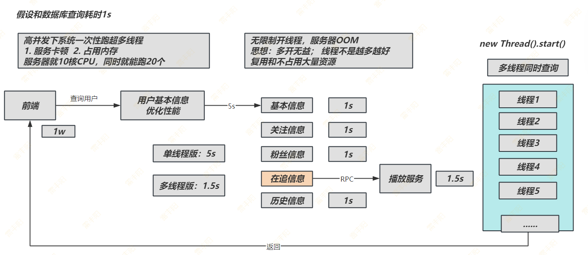
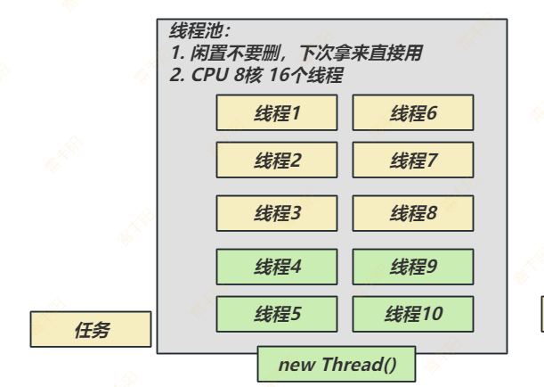
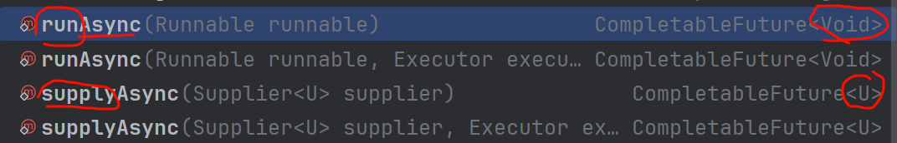

# 6. 线程池

> 业务需求；



## ThreadPool：线程池

### 为什么需要它？

#### 1. 什么是线程池？

**线程池**是一种`管理和复用线程`的机制。它会预先创建一组线程，并将它们存放在一个“池子”里。当有任务需要执行时，不是直接创建新线程，而是从池子中取一个空闲的线程来执行任务。任务执行完毕后，该线程并不会被销毁，而是返回池中，等待执行下一个任务。



> 非常多的池化思想：目的
> 
> 1. 复用和管理资源消耗

**一个形象的比喻：**

把线程池想象成一个`共享员工团队`。

- **没有线程池**：每次有**新工作（任务）**，你都得去人才市场招聘一个**新员工**（`new Thread()`)，工作完成后就把他解雇（线程销毁）。这个过程招聘和解雇的开销很大。
- **有了线程池**：你预先招聘了**一批固定员工（核心线程）**。有工作时，就派一个空闲的员工去做。如果所有员工都在忙，新工作就先排队（**任务队列**）。如果工作实在太多，队伍也排满了，你可能会临时再招一些“临时工”（最大线程）。工作不忙时，临时工会被解雇，但核心员工始终在岗。
  

#### 2. 为什么需要线程池？（核心优势）

1. **降低资源消耗**：通过重复利用已创建的线程，减少了线程创建和销毁带来的性能开销。
2. **提高响应速度**：当任务到达时，无需等待新线程的创建，可以直接从池中获取线程立即执行，从而缩短了响应时间。
3. **增强线程管理**：线程是稀缺资源，如果无限制地创建，不仅会消耗大量系统资源，还可能导致系统崩溃（OOM）。线程池可以对线程进行统一分配、调优和监控，防止资源耗尽。
4. **提供更多功能**：线程池可以提供定时执行、周期性执行、并发数控制等高级功能。
  

###  线程池的核心组件和工作原理

Java线程池的核心实现是 `java.util.concurrent.ThreadPoolExecutor`。理解它的构造函数参数，就能掌握其工作原理。

```java
public ThreadPoolExecutor(int corePoolSize,
                          int maximumPoolSize,
                          long keepAliveTime,
                          TimeUnit unit,
                          BlockingQueue<Runnable> workQueue,
                          ThreadFactory threadFactory,
                          RejectedExecutionHandler handler)
```

#### 核心参数解析：

1. `corePoolSize`** (核心线程数)**
  - 线程池中始终**保持存活的线程数量**，即使它们处于空闲状态。
  - 可以理解为“常驻员工”数量。
  - 调用 `prestartAllCoreThreads()` 方法可以**预先创建并启动所有核心线程**。
2. `maximumPoolSize`** (最大线程数)**
  - 线程池能够容纳同时执行的最大线程数。此值必须大于等于1。
  - 当工作队列满了，且当前线程数小于 `maximumPoolSize` 时，线程池会创建新线程来处理任务。
  - 可以理解为“**总员工**”数量（**常驻员工** + **临时工**）。
3. `keepAliveTime`** (线程空闲存活时间)**
  - 当线程数大于 `corePoolSize` 时，多余的**空闲线程（临时工）在被销毁前可以存活的时间**。
  - 如果 `keepAliveTime` 为0，表示多余的空闲线程会**立即被终止**。
4. `unit`** (时间单位)**
  - `keepAliveTime` 的时间单位，如 `TimeUnit.SECONDS` (秒)、`TimeUnit.MILLISECONDS` (毫秒)等。
5. `workQueue`** (工作队列)**
  - 用于保存等待执行的任务的阻塞队列。当所有核心线程都在忙时，新任务会被放入这个队列中。
  - 常见的队列类型：
    - `ArrayBlockingQueue`：基于数组的有界阻塞队列，按FIFO（先进先出）排序。
    - `LinkedBlockingQueue`：基于链表的**阻塞队列**，按**FIFO**排序。吞吐量通常高于 `ArrayBlockingQueue`。默认是无界的，可能导致内存溢出（OOM），因此建议指定容量。
    - `SynchronousQueue`：一个不存储元素的阻塞队列。每个插入操作必须等待一个相应的删除操作，反之亦然。它通常与无限大的 `maximumPoolSize` 配合使用（如`CachedThreadPool`）。
    - `PriorityBlockingQueue`：具有优先级的无界阻塞队列。
6. `threadFactory`** (线程工厂)**
  - 用于**创建新线程**的工厂。通过自定义 `ThreadFactory`，可以给线程设置有意义的名称、设置为守护线程、设置优先级等，便于问题排查。
7. `handler`** (拒绝策略)**
  - 当队列已满且线程数达到 `maximumPoolSize` 时，如何处理新提交的任务。
  - **JDK内置的拒绝策略**：
    - `ThreadPoolExecutor.``AbortPolicy` (默认)：**直接抛出** `RejectedExecutionException` **异常**，阻止系统正常运行。
    - `ThreadPoolExecutor.``CallerRunsPolicy`：“调用者运行”策略。既不抛弃任务，也不抛出异常，而是将任务回退给调用者（提交任务的线程）去执行。直接调用 Runnable 接口 的 run。直接让当前方法所在的线程自己跑
    - `ThreadPoolExecutor.``DiscardPolicy`：**直接丢弃任务**，**不予处理，也不抛出异常**。静默丢弃
    - `ThreadPoolExecutor.``DiscardOldestPolicy`：丢弃队列最前面的任务，然后重新尝试执行当前任务。 **丢弃老任务，执行新任务**

#### 工作流程：

1. 当一个新任务提交时，线程池首先判断**核心线程数 (**`corePoolSize`**)**是否已满。
  - 如果未满，则创建新的核心线程来执行任务。
  - 如果已满，则进入下一步。
2. 判断**工作队列 (**`workQueue`**)是否已满**。
  - 如果未满，则将任务放入工作队列中等待。
  - 如果已满，则进入下一步。
3. 判断**最大线程数 (**`maximumPoolSize`**)**是否已满。
  - 如果未满，则创建新的非核心线程（临时工）来执行任务。
  - 如果已满，则触发**拒绝策略 (**`handler`**)**。
    

### 如何创建和使用线程池

#### 方式一：使用 `Executors` 工厂类 (方便但不推荐在生产环境使用)

`java.util.concurrent.Executors` 提供了一些静态工厂方法，可以方便地创建几种常见的线程池。

1. `newFixedThreadPool(int nThreads)`**：固定大小的线程池**
  - 特点：`corePoolSize` 和 `maximumPoolSize` 相等，使用 `LinkedBlockingQueue`。
  - 适用场景：适用于负载比较平稳的场景，需要控制并发线程数量。
  - **风险**：工作队列是 `LinkedBlockingQueue`（默认容量为 `Integer.MAX_VALUE`），可能因任务堆积过多导致内存溢出（OOM）。

```java
ExecutorService fixedThreadPool = Executors.newFixedThreadPool(5);
```

  
2. `newSingleThreadExecutor()`**：单线程的线程池**
  - 特点：只有一个核心线程，保证所有任务按照指定顺序(FIFO)执行。
  - 适用场景：适用于需要保证任务顺序执行的场景。
  - **风险**：同 `newFixedThreadPool`，队列可能导致OOM。
    

```java
ExecutorService singleThreadExecutor = Executors.newSingleThreadExecutor();
```

  
3. `newCachedThreadPool()`**：可缓存的线程池**
  - 特点：`corePoolSize` 为0，`maximumPoolSize` 为 `Integer.MAX_VALUE`，使用 `SynchronousQueue`。来一个任务就创建一个线程，空闲线程会保留60秒。
  - 适用场景：适用于执行大量短期异步任务的小程序，或负载较轻的服务器。
  - **风险**：`maximumPoolSize` 是无限大的，可能因瞬间任务过多而创建大量线程，导致系统资源耗尽（OOM）。
    

```java
ExecutorService cachedThreadPool = Executors.newCachedThreadPool();
```

  
4. `newScheduledThreadPool(int corePoolSize)`**：支持定时及周期性任务的线程池**
  - 特点：`corePoolSize` 固定，`maximumPoolSize` 为 `Integer.MAX_VALUE`。
  - 适用场景：需要执行定时或周期性任务的场景。
    

```java
ScheduledExecutorService scheduledThreadPool = Executors.newScheduledThreadPool(5);
```

  

**【重要建议】**：阿里巴巴《Java开发手册》中强制规定，不允许使用 `Executors` 创建线程池，而是通过 `ThreadPoolExecutor` 的构造函数手动创建。这是因为 `Executors` 创建的线程池存在资源耗尽的风险。

#### 方式二：使用 `ThreadPoolExecutor` 手动创建 (生产环境推荐)

这是最灵活、最安全的方式，可以完全控制线程池的行为。

```java
import java.util.concurrent.*;

public class ThreadPoolUsage {

    public static void main(String[] args) {
        // 1. 手动创建线程池
        int corePoolSize = 2;
        int maximumPoolSize = 5;
        long keepAliveTime = 60L;
        TimeUnit unit = TimeUnit.SECONDS;
        BlockingQueue<Runnable> workQueue = new ArrayBlockingQueue<>(10); // 有界队列
        ThreadFactory threadFactory = new ThreadFactory() {
            private int count = 1;
            @Override
            public Thread newThread(Runnable r) {
                Thread t = new Thread(r, "MyThreadPool-" + count++);
                return t;
            }
        };
        RejectedExecutionHandler handler = new ThreadPoolExecutor.CallerRunsPolicy();

        ThreadPoolExecutor threadPool = new ThreadPoolExecutor(
                corePoolSize,
                maximumPoolSize,
                keepAliveTime,
                unit,
                workQueue,
                threadFactory,
                handler
        );

        // 2. 提交任务
        // 提交 Runnable 任务 (没有返回值)
        for (int i = 1; i <= 20; i++) {
            final int taskId = i;
            threadPool.execute(() -> {
                System.out.println(Thread.currentThread().getName() + " is executing task " + taskId);
                try {
                    Thread.sleep(500); // 模拟任务执行
                } catch (InterruptedException e) {
                    e.printStackTrace();
                }
            });
        }
        
        // 提交 Callable 任务 (有返回值)
        Future<String> future = threadPool.submit(() -> {
            System.out.println(Thread.currentThread().getName() + " is executing a callable task.");
            return "Callable Result";
        });

        try {
            // 3. 获取任务结果 (Future.get() 会阻塞，直到任务完成)
            String result = future.get();
            System.out.println("Result from callable: " + result);
        } catch (InterruptedException | ExecutionException e) {
            e.printStackTrace();
        }

        // 4. 关闭线程池
        // shutdown(): 不再接受新任务，但会等待已提交的任务执行完毕
        threadPool.shutdown(); 
        
        // shutdownNow(): 立即停止所有正在执行的任务，并返回等待执行的任务列表
        // List<Runnable> unfinishedTasks = threadPool.shutdownNow();

        // 推荐的关闭方式
        try {
            // 等待线程池在指定时间内终止
            if (!threadPool.awaitTermination(60, TimeUnit.SECONDS)) {
                System.err.println("Pool did not terminate");
                threadPool.shutdownNow();
            }
        } catch (InterruptedException ie) {
            threadPool.shutdownNow();
            Thread.currentThread().interrupt();
        }
        
        System.out.println("ThreadPool has been shut down.");
    }
}
```

### 线程池的关键方法

- `execute(Runnable command)`
  - 提交一个 `Runnable` 任务，没有返回值。
  - 如果提交失败（例如，触发了拒绝策略），可能会抛出异常。
- `submit(Runnable task)` / `submit(Callable<T> task)`
  - 提交任务，并返回一个 `Future` 对象。
  - `Future` 对象可以用来检查任务是否完成、取消任务、获取任务的执行结果（`Future.get()`）。
- `shutdown()`
  - 平滑关闭。线程池状态变为 `SHUTDOWN`，不再接受新任务，但会继续处理队列中已存在的任务。
- `shutdownNow()`
  - 强制关闭。线程池状态变为 `STOP`，尝试中断所有正在执行的线程，并返回队列中未执行的任务列表。
- `awaitTermination(long timeout, TimeUnit unit)`
  - 阻塞当前线程，直到线程池中所有任务都执行完毕，或者超时，或者当前线程被中断。通常与 `shutdown()` 配合使用，实现优雅停机。
    

### 如何合理配置线程池参数

合理配置线程池需要根据任务的特性来决定。

1. **任务类型**：
  - **CPU密集型任务**（如：大量计算、加密解密）：
    - 线程数不宜过多，通常设置为 `CPU核心数 + 1`。这样可以减少线程上下文切换的开销。
    - `int nThreads = Runtime.getRuntime().availableProcessors() + 1;`
  - **I/O密集型任务**（如：**数据库操作、文件读写、网络请求**）： 
    - 特点：CPU容易在等待数据期间，切出去执行别的线程
    - 大部分时间线程处于等待状态，CPU利用率不高。可以配置更多的线程，以提高CPU的利用率。
    - 一个经验公式：`线程数 = CPU核心数 * (1 + 平均等待时间 / 平均CPU计算时间)`。
      - 在实践中，通常会配置为 `CPU核心数 * 2` 或更大，具体需要通过压力测试来确定。

> 线程池的核心 core = `cpu核心数 * 2`；  
> 
> max = `cpu核心数` * 4；

1. **队列选择**：
  - 如果希望系统能处理尽可能多的请求，且对响应时间要求不苛刻，可以使用无界队列（如`LinkedBlockingQueue`），但要警惕OOM。
  - 如果希望系统在高负载下有明确的拒绝行为，防止资源耗尽，必须使用有界队列（如`ArrayBlockingQueue`）。
  - 3000个任务； 
    - 看内存； 1MB;  内存大小/每个任务占用内存（1MB）
    - 1G内存： 200 - 500 之间

    
2. **拒绝策略**：
  - 如果希望关键任务不被丢弃，`CallerRunsPolicy` 是一个不错的选择，它能起到“降级”和“限流”的作用。
  - 如果业务允许丢弃，`DiscardPolicy` 或 `DiscardOldestPolicy` 也很适用。
  - 默认的 `AbortPolicy` 会中断程序，适用于需要强反馈的场景。

所有东西都满了。生产环境一般使用 `CallerRunsPolicy` ： 慢一点任务会被执行

Java线程池是并发编程的基石。掌握其核心原理（`ThreadPoolExecutor` 的七大参数）、工作流程和正确的使用方法（手动创建、合理配置），能够极大地提升程序的性能、稳定性和可管理性。在实际开发中，务必避免使用 `Executors` 工厂类，并根据业务场景精心设计线程池的各项参数。

> 总结：调参用法
> 
> 1. **core**： cpu * 2
> 2. **max**： cpu * 4
> 3. **queue**： 根据服务器内存 200 ~  3000；队列大，吞吐量就大
> 4. **拒绝策略**：`CallerRunsPolicy` 保证任务一定运行，虽然慢一点

## CompletableFuture：异步编排

> Java 8中引入的重量级`异步编程利器`——`CompletableFuture`。

###  `CompletableFuture`介绍

#### 1. 传统 `Future` 的局限性

在Java 5中，我们有了 `Future` 接口，它代表一个异步计算的结果。但是，`Future` 的功能非常有限，存在以下主要问题：

- **阻塞式获取结果**：`future.get()` 方法是阻塞的，调用它会使当前线程等待，直到异步任务完成。这违背了异步编程的初衷。
- **无法链式调用**：你无法在一个 `Future` 完成后自动触发下一个任务。你必须手动调用 `get()`，然后再启动下一个任务，这会导致代码变得笨拙和低效。
- **没有统一的异常处理**：你必须在调用 `get()` 时使用 `try-catch` 块来捕获异常，无法以回调的方式优雅地处理。
- **无法组合多个 **`Future**`：你很难将多个 `Future` 的结果组合起来，比如“等待所有任务完成”或“等待任意一个任务完成”。
  

#### 2. `CompletableFuture` 的诞生

`CompletableFuture` (在 `java.util.concurrent` 包下) 是对 `Future` 的一个巨大增强。它实现了 `Future` 和 `CompletionStage` 接口。它的核心思想是**“回调”**和**“链式调用”**，让你能够以一种声明式、非阻塞的方式来组织异步任务流。

**核心优势：**

1. **非阻塞**：可以注册回调函数（如 `thenApply`, `thenAccept`），当异步任务完成时，这些回调函数会自动被执行，无需手动阻塞等待。
2. **函数式编程风格**：支持链式调用，代码可读性更高，逻辑更清晰，类似于 JavaScript 的 `Promise` 或 Stream API。
3. **强大的组合能力**：可以轻松地组合多个 `CompletableFuture`，实现 `AND` (`allOf`) 和 `OR` (`anyOf`) 等复杂逻辑。
4. **优雅的异常处理**：提供了专门的方法（如 `exceptionally`, `handle`）来处理异步执行过程中可能出现的异常。

### 如何创建 `CompletableFuture`

创建 `CompletableFuture` 通常使用它的**静态工厂方法**，并且可以指定线程池。



1. **执行一个没有返回值的异步任务 (**`Runnable`**)**
```java
// 使用默认的 ForkJoinPool.commonPool() 线程池
CompletableFuture<Void> future = CompletableFuture.runAsync(() -> {
    System.out.println("Running a task without return value...");
});

// 使用自定义的线程池
ExecutorService executor = Executors.newFixedThreadPool(2);
CompletableFuture<Void> futureWithExecutor = CompletableFuture.runAsync(() -> {
    System.out.println("Running with a custom executor...");
}, executor);
```

  
2. **执行一个有返回值的异步任务 (**`Supplier<U>`**)**
```java
// 使用默认线程池
CompletableFuture<String> future = CompletableFuture.supplyAsync(() -> {
    // 模拟一个耗时操作
    try {
        TimeUnit.SECONDS.sleep(1);
    } catch (InterruptedException e) {
        throw new IllegalStateException(e);
    }
    return "Hello, Async World!";
});

// 使用自定义线程池
CompletableFuture<String> futureWithExecutor = CompletableFuture.supplyAsync(() -> {
    return "Result from custom executor task";
}, executor);
```

> **【重要提示】**：默认情况下，`runAsync` 和 `supplyAsync` 使用 `ForkJoinPool.commonPool()`。对于I/O密集型任务，建议提供自定义的线程池，以避免阻塞 `ForkJoinPool` 中宝贵的计算线程。

### 核心用法：链式调用 (Callbacks)

这是 `CompletableFuture` 最强大的功能。当一个阶段（Stage）完成后，可以触发下一个阶段。

#### 1. 结果转换 (`thenApply`)

当上一个任务完成后，将其结果作为输入传递给下一个函数，并返回一个新的 `CompletableFuture`。类似于 Stream API 的 `map`。

```java
CompletableFuture<String> future = CompletableFuture.supplyAsync(() -> "Hello")
    .thenApply(s -> s + " World")
    .thenApply(String::toUpperCase);

// 阻塞并获取最终结果
System.out.println(future.join()); // 输出: HELLO WORLD
```

`join()` vs `get()**`:

- `join()`: 返回结果或抛出未经检查的异常 (`CompletionException`)。
- `get()`: 返回结果或抛出经检查的异常 (`InterruptedException`, `ExecutionException`)。在Lambda表达式中 `join()` 更方便。
  

#### 2. 结果消费 (`thenAccept`)

当上一个任务完成后，消费其结果，但不返回任何值。类似于 Stream API 的 `forEach`。

```java
CompletableFuture.supplyAsync(() -> "User's Name")
    .thenAccept(name -> {
        System.out.println("Received name: " + name);
    });
```

#### 3. 任务完成后执行动作 (`thenRun`)

不关心上一个任务的结果，只要它完成了，就执行一个 `Runnable`。

```java
CompletableFuture.supplyAsync(() -> "some result")
    .thenRun(() -> {
        System.out.println("The previous task is complete.");
    });
```

`...` vs `...Async`** 的区别**

上面的每个方法都有一个对应的 `...Async` 版本，例如 `thenApplyAsync`。

- `thenApply(fn)`：`fn` 可能`在上一个任务的线程`中执行，也可能在调用 `join()`/`get()` 的主线程中执行，取决于上一个任务是否已经完成。
- `thenApplyAsync(fn)`：`fn` 会被提交到默认的 `ForkJoinPool` 中执行，保证异步性。
- `thenApplyAsync(fn, executor)`：`fn` 会被提交到你指定的 `executor` 线程池中执行。
  

**经验法则**：如果回调函数是轻量级、非阻塞的，可以使用同步版本。如果回调函数是耗时的或者需要I/O操作，强烈建议使用 `Async` 版本。

### 组合多个 `CompletableFuture`

#### 1. 组合两个独立的 Future (`thenCombine`)

当两个`CompletableFuture` 都完成时，将它们的结果合并，并执行一个 `BiFunction`。

```java
CompletableFuture<String> getUserNameFuture = CompletableFuture.supplyAsync(() -> "Alice");
CompletableFuture<Integer> getUserAgeFuture = CompletableFuture.supplyAsync(() -> 25);

CompletableFuture<String> userInfoFuture = getUserNameFuture.thenCombine(getUserAgeFuture,
 (name, age) -> {
    return name + " is " + age + " years old.";
});

System.out.println(userInfoFuture.join()); // 输出: Alice is 25 years old.
```

还有一个 `thenAcceptBoth` (消费两个结果) 和 `runAfterBoth` (两个完成后执行Runnable)。

#### 2. 组合依赖的 Future (`thenCompose`)

当你需要用一个 `CompletableFuture` 的结果去启动下一个 `CompletableFuture` 时使用。这可以避免 `CompletableFuture<CompletableFuture<T>>` 这种嵌套地狱。类似于 Stream API 的 `flatMap`。

```java
// 错误示范：使用 thenApply 会导致嵌套
CompletableFuture<CompletableFuture<String>> nestedFuture = CompletableFuture
        .supplyAsync(() -> "userID123")
        .thenApply(userId -> getUserDetails(userId)); // getUserDetails 返回 CompletableFuture

// 正确示范：使用 thenCompose
CompletableFuture<String> flatFuture = 
   CompletableFuture
        .supplyAsync(() -> "userID123")
        .thenCompose(userId -> getUserDetails(userId)); // 结果是扁平化的

System.out.println(flatFuture.join());

// 模拟一个返回 CompletableFuture 的方法
public static CompletableFuture<String> getUserDetails(String userId) {
    return CompletableFuture.supplyAsync(() -> "Details for " + userId);
}
```

#### 3. 等待所有 Future 完成 (`allOf`)

`CompletableFuture.allOf()` 接收一个 `CompletableFuture` 数组，并返回一个 `CompletableFuture<Void>`。这个返回的 Future 会在所有输入的 Future 都完成时完成。

```java
CompletableFuture<String> f1 = CompletableFuture.supplyAsync(() -> "Result 1");
CompletableFuture<String> f2 = CompletableFuture.supplyAsync(() -> "Result 2");
CompletableFuture<String> f3 = CompletableFuture.supplyAsync(() -> "Result 3");

CompletableFuture<Void> allFutures = CompletableFuture.allOf(f1, f2, f3);

// 等待所有任务完成
allFutures.join();

// allOf 的一个缺点是它不返回组合结果，你需要手动获取
System.out.println(f1.get() + ", " + f2.get() + ", " + f3.get());
```

#### 4. 等待任意一个 Future 完成 (`anyOf`)

`CompletableFuture.anyOf()` 同样接收一个数组，但只要其中**任意一个** `CompletableFuture` 完成，它就会完成，并返回那个已完成任务的结果。

```java
CompletableFuture<String> f1 = CompletableFuture.supplyAsync(() -> {
    try { TimeUnit.SECONDS.sleep(2); } catch (Exception e) {}
    return "From service A";
});
CompletableFuture<String> f2 = CompletableFuture.supplyAsync(() -> {
    try { TimeUnit.SECONDS.sleep(1); } catch (Exception e) {}
    return "From service B";
});

CompletableFuture<Object> firstCompleted = CompletableFuture.anyOf(f1, f2);

System.out.println("The first result is: " + firstCompleted.join()); // 输出: The first result is: From service B
```

---

###  异常处理

`CompletableFuture` 提供了优雅的异常处理机制

#### 1. `exceptionally(fn)`

当异步链中任何一个环节出现异常时，`exceptionally` 可以捕获它，并提供一个备用结果。类似于 `try-catch` 中的 `catch` 块。

```java
CompletableFuture<String> future = CompletableFuture.supplyAsync(() -> {
    if (Math.random() > 0.5) {
        throw new RuntimeException("Something went wrong!");
    }
    return "Success";
}).exceptionally(ex -> {
    System.err.println("Caught exception: " + ex.getMessage());
    return "Default Value"; // 返回一个默认值作为结果
});

System.out.println(future.join()); // 可能输出 "Success" 或 "Default Value"
```

#### 2. `handle(biFn)`

`handle` 方法更加强大，无论是否发生异常，它都会被执行。它接收两个参数：`result` (正常结果) 和 `exception` (异常)。你可以根据这两个参数决定最终的返回值。类似于 `try-catch-finally` 中的 `finally` 功能。

```java
CompletableFuture<String> future = CompletableFuture.supplyAsync(() -> {
    if (Math.random() < 0.5) {
        throw new RuntimeException("Calculation failed!");
    }
    return "100";
}).handle((result, ex) -> { //
    if (ex != null) {
        System.err.println("An error occurred: " + ex.getMessage());
        return "ERROR"; // 异常情况下的返回值
    }
    return "Result is: " + result; // 正常情况下的返回值
});

System.out.println(future.join());
```

## 小结

> `CompletableFuture` 是Java现代并发编程的基石，它将我们从回调地狱和阻塞的 `Future.get()` 中解放出来。

- **创建**：使用 `supplyAsync` (有返回值) 或 `runAsync` (无返回值)。
- **链式处理**：
  - `thenApply`: 转换结果 (T -> U)。
  - `thenAccept`: 消费结果 (T -> Void)。
  - `thenRun`: 完成后执行动作 (Void -> Void)。
- **组合**：
  - `thenCompose`: 链式依赖的Future (T -> `CompletableFuture<U>`)。
  - `thenCombine`: 合并两个独立的Future。
  - `allOf`: 等待所有。
  - `anyOf`: 等待任意一个。
- **异常处理**：
  - `exceptionally`: 提供备用结果。
  - `handle`: 无论成功失败都进行处理。