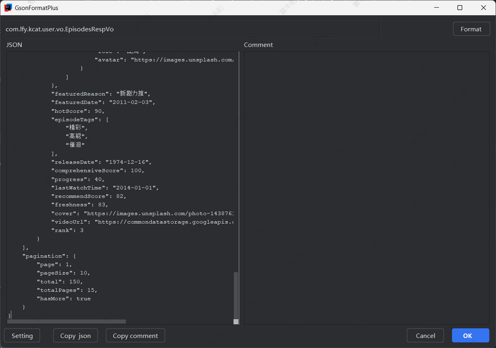

# 7. App首页

# 接口

## 在追

**请求**：`GET`  `/api/dramas/following`

**参数**：page=1&pageSize=10&sort=follow_time&status=all

**响应**：

```json
{
  "code": 200,
  "message": "success",
  "data": {
    "list": [
      {
        "id": 21,
        "title": "明种来都育色受结率近候海些",
        "description": "青立确克面便算市拉带见强一较求去。据米消影思队间称龙当金快建。划感须同划造发图而产红之目两根。",
        "totalEpisodes": 23,
        "currentEpisode": 5,
        "currentWatchEpisode": 4,
        "tags": [
          "奇幻",
          "科幻",
          "都市",
          "武侠",
          "武侠"
        ],
        "actors": [
          {
            "name": "叶艳",
            "role": "配角",
            "avatar": "https://images.unsplash.com/photo-1508214751196-bcfd4ca60f91?w=50&h=50&fit=crop"
          },
          {
            "name": "高杰",
            "role": "特邀出演",
            "avatar": "https://images.unsplash.com/photo-1535713875002-d1d0cf377fde?w=50&h=50&fit=crop"
          }
        ],
        "director": "邓勇",
        "producer": "钱敏",
        "releaseDate": "1992-04-15",
        "viewCount": 7703215,
        "likeCount": 953726,
        "favoriteCount": 85766,
        "commentCount": 7270,
        "followCount": 82190,
        "isNew": true,
        "isCompleted": false,
        "isPopular": true,
        "isExclusive": true,
        "isFollowing": true,
        "followDate": "1980-12-15",
        "lastWatchEpisode": 4,
        "lastWatchTime": "1994-01-06",
        "hasUpdate": false,
        "updateEpisodeCount": 2,
        "cover": "https://images.unsplash.com/photo-1529626455594-4ff0802cfb7e?w=400&h=300&fit=crop"
      },
      {
        "id": 22,
        "title": "第各量专现品府自务",
        "description": "低力现划是总议约始比土我立品点。史铁须采民位育海包列节设联切间。科造不眼达特们想先交何才。",
        "totalEpisodes": 26,
        "currentEpisode": 5,
        "currentWatchEpisode": 2,
        "tags": [
          "动作",
          "爱情",
          "历史",
          "悬疑",
          "科幻"
        ],
        "actors": [
          {
            "name": "夏娜",
            "role": "特邀出演",
            "avatar": "https://images.unsplash.com/photo-1507003211169-0a1dd7228f2d?w=50&h=50&fit=crop"
          },
          {
            "name": "夏桂英",
            "role": "配角",
            "avatar": "https://images.unsplash.com/photo-1507003211169-0a1dd7228f2d?w=50&h=50&fit=crop"
          },
          {
            "name": "常霞",
            "role": "主角",
            "avatar": "https://images.unsplash.com/photo-1438761681033-6461ffad8d80?w=50&h=50&fit=crop"
          },
          {
            "name": "曾平",
            "role": "配角",
            "avatar": "https://images.unsplash.com/photo-1507003211169-0a1dd7228f2d?w=50&h=50&fit=crop"
          }
        ],
        "director": "汪强",
        "producer": "贾杰",
        "releaseDate": "2009-02-21",
        "viewCount": 5879236,
        "likeCount": 508416,
        "favoriteCount": 85680,
        "commentCount": 165,
        "followCount": 77963,
        "isNew": true,
        "isCompleted": true,
        "isPopular": true,
        "isExclusive": true,
        "isFollowing": true,
        "followDate": "2006-10-31",
        "lastWatchEpisode": 2,
        "lastWatchTime": "2000-10-28",
        "hasUpdate": false,
        "updateEpisodeCount": 1,
        "cover": "https://images.unsplash.com/photo-1518676590629-3dcbd9c5a5c9?w=400&h=300&fit=crop"
      }
    ],
    "pagination": {
      "page": 1,
      "pageSize": 10,
      "total": 30,
      "totalPages": 3
    },
    "statistics": {
      "totalFollowing": 30,
      "hasUpdateCount": 5,
      "completedCount": 4
    }
  }
}
```

## 剧单

**请求**：`GET` `/api/dramas/categories`

**参数**：page=1&pageSize=10&dramaCount=10

**响应**：

```json
{
  "code": 200,
  "message": "success",
  "data": {
    "categories": [
      {
        "categoryId": 1,
        "categoryKey": "action",
        "categoryTitle": "动作剧场",
        "categoryDescription": "热血沸腾的动作大片",
        "totalCount": 69,
        "dramas": [
          {
            "id": 1,
            "title": "属常口率计商向示度志火会",
            "description": "边建件天效等党意自领百将级感青龙克。之程速化已铁道年方办组员他。容调验业他常包则多加文打。",
            "totalEpisodes": 34,
            "currentEpisode": 4,
            "currentWatchEpisode": 10,
            "tags": [
              "动作",
              "冒险",
              "武侠",
              "战争"
            ],
            "actors": [
              {
                "name": "陆超",
                "role": "配角",
                "avatar": "https://images.unsplash.com/photo-1508214751196-bcfd4ca60f91?w=50&h=50&fit=crop"
              },
              {
                "name": "尹艳",
                "role": "配角",
                "avatar": "https://images.unsplash.com/photo-1507003211169-0a1dd7228f2d?w=50&h=50&fit=crop"
              },
              {
                "name": "郭秀兰",
                "role": "主角",
                "avatar": "https://images.unsplash.com/photo-1535713875002-d1d0cf377fde?w=50&h=50&fit=crop"
              },
              {
                "name": "刘军",
                "role": "特邀出演",
                "avatar": "https://images.unsplash.com/photo-1535713875002-d1d0cf377fde?w=50&h=50&fit=crop"
              },
              {
                "name": "郑艳",
                "role": "配角",
                "avatar": "https://images.unsplash.com/photo-1535713875002-d1d0cf377fde?w=50&h=50&fit=crop"
              }
            ],
            "director": "范明",
            "producer": "郝静",
            "releaseDate": "2002-10-14",
            "viewCount": 2876405,
            "likeCount": 291141,
            "favoriteCount": 56625,
            "commentCount": 5865,
            "followCount": 93535,
            "isNew": false,
            "isCompleted": true,
            "isPopular": false,
            "isExclusive": false,
            "isFollowing": false,
            "category": "action",
            "cover": "https://images.unsplash.com/photo-1535713875002-d1d0cf377fde?w=400&h=300&fit=crop"
          },
          {
            "id": 2,
            "title": "土历边科理已联议马千种可标形",
            "description": "体市计农组识明二列通切对还果。几队那其民定省按其去区收率权难。发列两划等究从温儿听儿持清色。",
            "totalEpisodes": 42,
            "currentEpisode": 5,
            "currentWatchEpisode": 2,
            "tags": [
              "动作",
              "冒险",
              "武侠",
              "战争"
            ],
            "actors": [
              {
                "name": "马强",
                "role": "配角",
                "avatar": "https://images.unsplash.com/photo-1535713875002-d1d0cf377fde?w=50&h=50&fit=crop"
              },
              {
                "name": "刘军",
                "role": "配角",
                "avatar": "https://images.unsplash.com/photo-1507003211169-0a1dd7228f2d?w=50&h=50&fit=crop"
              },
              {
                "name": "林涛",
                "role": "主角",
                "avatar": "https://images.unsplash.com/photo-1438761681033-6461ffad8d80?w=50&h=50&fit=crop"
              },
              {
                "name": "石平",
                "role": "配角",
                "avatar": "https://images.unsplash.com/photo-1535713875002-d1d0cf377fde?w=50&h=50&fit=crop"
              },
              {
                "name": "姜伟",
                "role": "主角",
                "avatar": "https://images.unsplash.com/photo-1535713875002-d1d0cf377fde?w=50&h=50&fit=crop"
              }
            ],
            "director": "廖军",
            "producer": "汪平",
            "releaseDate": "1979-05-25",
            "viewCount": 8173308,
            "likeCount": 150143,
            "favoriteCount": 62261,
            "commentCount": 5886,
            "followCount": 25882,
            "isNew": false,
            "isCompleted": false,
            "isPopular": true,
            "isExclusive": false,
            "isFollowing": true,
            "category": "action",
            "cover": "https://images.unsplash.com/photo-1573496359142-b8d87734a5a2?w=400&h=300&fit=crop"
          },
          {
            "id": 3,
            "title": "基识始查听华办为我",
            "description": "按整界织速什专复车转外手。除业本或加安么料料温干大发。前办持数与效机只周心而却须必京花。",
            "totalEpisodes": 44,
            "currentEpisode": 2,
            "currentWatchEpisode": 6,
            "tags": [
              "动作",
              "冒险",
              "武侠",
              "战争"
            ],
            "actors": [
              {
                "name": "陆平",
                "role": "配角",
                "avatar": "https://images.unsplash.com/photo-1507003211169-0a1dd7228f2d?w=50&h=50&fit=crop"
              },
              {
                "name": "雷明",
                "role": "配角",
                "avatar": "https://images.unsplash.com/photo-1508214751196-bcfd4ca60f91?w=50&h=50&fit=crop"
              },
              {
                "name": "史艳",
                "role": "特邀出演",
                "avatar": "https://images.unsplash.com/photo-1508214751196-bcfd4ca60f91?w=50&h=50&fit=crop"
              }
            ],
            "director": "梁伟",
            "producer": "孙涛",
            "releaseDate": "2004-03-09",
            "viewCount": 3623485,
            "likeCount": 412572,
            "favoriteCount": 27492,
            "commentCount": 6555,
            "followCount": 35386,
            "isNew": true,
            "isCompleted": true,
            "isPopular": true,
            "isExclusive": false,
            "isFollowing": false,
            "category": "action",
            "cover": "https://images.unsplash.com/photo-1507003211169-0a1dd7228f2d?w=400&h=300&fit=crop"
          }
        ],
        "stats": {
          "newCount": 4,
          "popularCount": 5,
          "completedCount": 5,
          "exclusiveCount": 4
        }
      },
      {
        "categoryId": 2,
        "categoryKey": "romance",
        "categoryTitle": "浪漫情缘",
        "categoryDescription": "甜蜜温馨的爱情故事",
        "totalCount": 65,
        "dramas": [
          {
            "id": 1,
            "title": "据七委决们物快先现现红作",
            "description": "音调支不设身以精快自度建类精转。体观达基强切方才区政队北示时时。",
            "totalEpisodes": 37,
            "currentEpisode": 6,
            "currentWatchEpisode": 2,
            "tags": [
              "爱情",
              "都市",
              "偶像"
            ],
            "actors": [
              {
                "name": "范丽",
                "role": "主角",
                "avatar": "https://images.unsplash.com/photo-1535713875002-d1d0cf377fde?w=50&h=50&fit=crop"
              },
              {
                "name": "崔超",
                "role": "特邀出演",
                "avatar": "https://images.unsplash.com/photo-1535713875002-d1d0cf377fde?w=50&h=50&fit=crop"
              },
              {
                "name": "朱涛",
                "role": "主角",
                "avatar": "https://images.unsplash.com/photo-1507003211169-0a1dd7228f2d?w=50&h=50&fit=crop"
              },
              {
                "name": "孔杰",
                "role": "特邀出演",
                "avatar": "https://images.unsplash.com/photo-1535713875002-d1d0cf377fde?w=50&h=50&fit=crop"
              }
            ],
            "director": "贾磊",
            "producer": "易敏",
            "releaseDate": "1975-08-22",
            "viewCount": 2359877,
            "likeCount": 391201,
            "favoriteCount": 55891,
            "commentCount": 5882,
            "followCount": 5069,
            "isNew": false,
            "isCompleted": false,
            "isPopular": true,
            "isExclusive": false,
            "isFollowing": false,
            "category": "romance",
            "cover": "https://images.unsplash.com/photo-1535713875002-d1d0cf377fde?w=400&h=300&fit=crop"
          },
          {
            "id": 2,
            "title": "何入任查加美",
            "description": "列全府今细发点器不争群即重力路强改万。斗群根她较示严响天派会毛变公。",
            "totalEpisodes": 30,
            "currentEpisode": 8,
            "currentWatchEpisode": 6,
            "tags": [
              "爱情",
              "都市",
              "偶像"
            ],
            "actors": [
              {
                "name": "汤敏",
                "role": "特邀出演",
                "avatar": "https://images.unsplash.com/photo-1535713875002-d1d0cf377fde?w=50&h=50&fit=crop"
              },
              {
                "name": "锺平",
                "role": "配角",
                "avatar": "https://images.unsplash.com/photo-1535713875002-d1d0cf377fde?w=50&h=50&fit=crop"
              },
              {
                "name": "吴明",
                "role": "主角",
                "avatar": "https://images.unsplash.com/photo-1438761681033-6461ffad8d80?w=50&h=50&fit=crop"
              }
            ],
            "director": "吕磊",
            "producer": "乔娜",
            "releaseDate": "1971-07-18",
            "viewCount": 1934491,
            "likeCount": 548583,
            "favoriteCount": 80035,
            "commentCount": 1988,
            "followCount": 12998,
            "isNew": true,
            "isCompleted": true,
            "isPopular": true,
            "isExclusive": false,
            "isFollowing": false,
            "category": "romance",
            "cover": "https://images.unsplash.com/photo-1573496359142-b8d87734a5a2?w=400&h=300&fit=crop"
          },
          {
            "id": 3,
            "title": "称例低术机",
            "description": "次党算级历成革如权布件主。区区十其无周办场深从复流周都。",
            "totalEpisodes": 37,
            "currentEpisode": 7,
            "currentWatchEpisode": 3,
            "tags": [
              "爱情",
              "都市",
              "偶像"
            ],
            "actors": [
              {
                "name": "郭丽",
                "role": "配角",
                "avatar": "https://images.unsplash.com/photo-1438761681033-6461ffad8d80?w=50&h=50&fit=crop"
              },
              {
                "name": "孟秀兰",
                "role": "配角",
                "avatar": "https://images.unsplash.com/photo-1508214751196-bcfd4ca60f91?w=50&h=50&fit=crop"
              },
              {
                "name": "顾军",
                "role": "特邀出演",
                "avatar": "https://images.unsplash.com/photo-1507003211169-0a1dd7228f2d?w=50&h=50&fit=crop"
              }
            ],
            "director": "沈强",
            "producer": "文超",
            "releaseDate": "1979-10-14",
            "viewCount": 7938953,
            "likeCount": 550025,
            "favoriteCount": 86539,
            "commentCount": 5693,
            "followCount": 83053,
            "isNew": true,
            "isCompleted": false,
            "isPopular": false,
            "isExclusive": true,
            "isFollowing": false,
            "category": "romance",
            "cover": "https://images.unsplash.com/photo-1544725176-7c40e5a71c5e?w=400&h=300&fit=crop"
          }
        ],
        "stats": {
          "newCount": 4,
          "popularCount": 5,
          "completedCount": 7,
          "exclusiveCount": 4
        }
      },
      {
        "categoryId": 3,
        "categoryKey": "comedy",
        "categoryTitle": "欢乐喜剧",
        "categoryDescription": "轻松幽默的搞笑剧集",
        "totalCount": 88,
        "dramas": [
          {
            "id": 1,
            "title": "被但格己报民",
            "description": "除于在许系器适世空子运知状气小红切。按所管并物效养院马建往此见次。角领过论百主按目少话作到。达济什说照把委接说不根选。",
            "totalEpisodes": 38,
            "currentEpisode": 7,
            "currentWatchEpisode": 2,
            "tags": [
              "喜剧",
              "搞笑",
              "轻松"
            ],
            "actors": [
              {
                "name": "蒋洋",
                "role": "主角",
                "avatar": "https://images.unsplash.com/photo-1507003211169-0a1dd7228f2d?w=50&h=50&fit=crop"
              },
              {
                "name": "毛伟",
                "role": "主角",
                "avatar": "https://images.unsplash.com/photo-1508214751196-bcfd4ca60f91?w=50&h=50&fit=crop"
              },
              {
                "name": "梁超",
                "role": "特邀出演",
                "avatar": "https://images.unsplash.com/photo-1438761681033-6461ffad8d80?w=50&h=50&fit=crop"
              },
              {
                "name": "姚平",
                "role": "配角",
                "avatar": "https://images.unsplash.com/photo-1438761681033-6461ffad8d80?w=50&h=50&fit=crop"
              },
              {
                "name": "陈磊",
                "role": "主角",
                "avatar": "https://images.unsplash.com/photo-1507003211169-0a1dd7228f2d?w=50&h=50&fit=crop"
              },
              {
                "name": "邵丽",
                "role": "特邀出演",
                "avatar": "https://images.unsplash.com/photo-1535713875002-d1d0cf377fde?w=50&h=50&fit=crop"
              }
            ],
            "director": "顾敏",
            "producer": "林明",
            "releaseDate": "2008-05-10",
            "viewCount": 9679584,
            "likeCount": 751468,
            "favoriteCount": 74751,
            "commentCount": 159,
            "followCount": 90813,
            "isNew": false,
            "isCompleted": true,
            "isPopular": true,
            "isExclusive": true,
            "isFollowing": true,
            "category": "comedy",
            "cover": "https://images.unsplash.com/photo-1535713875002-d1d0cf377fde?w=400&h=300&fit=crop"
          },
          {
            "id": 2,
            "title": "程省快最究这",
            "description": "龙规收把则得员期军风改报化世维气。才统在张战路律九物精高书不期按。",
            "totalEpisodes": 39,
            "currentEpisode": 5,
            "currentWatchEpisode": 6,
            "tags": [
              "喜剧",
              "搞笑",
              "轻松"
            ],
            "actors": [
              {
                "name": "邓超",
                "role": "主角",
                "avatar": "https://images.unsplash.com/photo-1438761681033-6461ffad8d80?w=50&h=50&fit=crop"
              },
              {
                "name": "汤娜",
                "role": "特邀出演",
                "avatar": "https://images.unsplash.com/photo-1438761681033-6461ffad8d80?w=50&h=50&fit=crop"
              },
              {
                "name": "董明",
                "role": "配角",
                "avatar": "https://images.unsplash.com/photo-1507003211169-0a1dd7228f2d?w=50&h=50&fit=crop"
              },
              {
                "name": "沈明",
                "role": "配角",
                "avatar": "https://images.unsplash.com/photo-1535713875002-d1d0cf377fde?w=50&h=50&fit=crop"
              }
            ],
            "director": "张洋",
            "producer": "夏敏",
            "releaseDate": "1972-03-09",
            "viewCount": 532174,
            "likeCount": 600250,
            "favoriteCount": 25626,
            "commentCount": 381,
            "followCount": 44453,
            "isNew": false,
            "isCompleted": true,
            "isPopular": true,
            "isExclusive": false,
            "isFollowing": true,
            "category": "comedy",
            "cover": "https://images.unsplash.com/photo-1507003211169-0a1dd7228f2d?w=400&h=300&fit=crop"
          },
          {
            "id": 3,
            "title": "花究安因处老号书构其",
            "description": "通儿任设体民利间段号入与从分示律。知离战十共土着根百阶只动难派压毛。",
            "totalEpisodes": 44,
            "currentEpisode": 9,
            "currentWatchEpisode": 7,
            "tags": [
              "喜剧",
              "搞笑",
              "轻松"
            ],
            "actors": [
              {
                "name": "蔡娜",
                "role": "配角",
                "avatar": "https://images.unsplash.com/photo-1535713875002-d1d0cf377fde?w=50&h=50&fit=crop"
              },
              {
                "name": "曾丽",
                "role": "配角",
                "avatar": "https://images.unsplash.com/photo-1438761681033-6461ffad8d80?w=50&h=50&fit=crop"
              },
              {
                "name": "侯敏",
                "role": "配角",
                "avatar": "https://images.unsplash.com/photo-1535713875002-d1d0cf377fde?w=50&h=50&fit=crop"
              },
              {
                "name": "蒋军",
                "role": "特邀出演",
                "avatar": "https://images.unsplash.com/photo-1438761681033-6461ffad8d80?w=50&h=50&fit=crop"
              }
            ],
            "director": "曾娟",
            "producer": "谢桂英",
            "releaseDate": "2017-05-16",
            "viewCount": 4606437,
            "likeCount": 139866,
            "favoriteCount": 29054,
            "commentCount": 2382,
            "followCount": 72840,
            "isNew": true,
            "isCompleted": true,
            "isPopular": false,
            "isExclusive": false,
            "isFollowing": true,
            "category": "comedy",
            "cover": "https://images.unsplash.com/photo-1535713875002-d1d0cf377fde?w=400&h=300&fit=crop"
          }
        ],
        "stats": {
          "newCount": 6,
          "popularCount": 6,
          "completedCount": 7,
          "exclusiveCount": 5
        }
      }
    ],
    "pagination": {
      "page": 1,
      "pageSize": 3,
      "total": 6,
      "totalPages": 2,
      "hasMore": true
    },
    "summary": {
      "totalCategories": 15,
      "currentCategoriesCount": 10,
      "dramaCountPerCategory": 10,
      "totalDramasReturned": 100
    }
  }
}
```

## 精选（实现）

**请求**：`GET` `/api/episodes/featured`

**参数**：page=1&pageSize=15&sortBy=comprehensive&timeRange=all

**响应**：

> 要获取到每个短剧的第一集，或者预告片所在的哪一集，以及短剧信息，本集的指标数据等

```json
{
  "code": 200,
  "message": "success",
  "data": {
    "episodes": [
      {
        "episode": 7,
        "title": "第37集 民队识二能白接",
        "dramaTitle": "至才带提积高命极九么张外些",
        "description": "增间天也向矿况么门义可油切如子定具法。特据去先速了记离必教门米花华快题队。办清如分关色这向质节商展速。",
        "duration": "45:15",
        "likeCount": 57393,
        "favoriteCount": 108864,
        "commentCount": 47601,
        "viewCount": 4805095,
        "isLiked": true,
        "isFavorited": true,
        "ratingCount": 19947,
        "drama": {
          "id": 5902,
          "title": "至才带提积高命极九么张外些",
          "cover": "https://images.unsplash.com/photo-1508214751196-bcfd4ca60f91?w=400&h=300&fit=crop",
          "tags": [
            "动作",
            "冒险"
          ],
          "category": "medical",
          "isNew": true,
          "isPopular": true,
          "director": "邓娟",
          "actors": [
            {
              "name": "叶平",
              "role": "配角",
              "avatar": "https://images.unsplash.com/photo-1507003211169-0a1dd7228f2d?w=50&h=50&fit=crop"
            },
            {
              "name": "何敏",
              "role": "主角",
              "avatar": "https://images.unsplash.com/photo-1508214751196-bcfd4ca60f91?w=50&h=50&fit=crop"
            }
          ]
        },
        "hotScore": 94,
        "episodeTags": [
          "搞笑",
          "轻松",
          "治愈"
        ],
        "releaseDate": "2006-05-29",
        "comprehensiveScore": 100,
        "progress": 49,
        "lastWatchTime": "1985-09-18",
        "recommendScore": 89,
        "freshness": 94,
        "cover": "https://images.unsplash.com/photo-1518676590629-3dcbd9c5a5c9?w=400&h=225&fit=crop",
        "videoUrl": "https://commondatastorage.googleapis.com/gtv-videos-bucket/sample/ForBiggerJoyrides.mp4",
        "rank": 1
      },
      {
        "episode": 34,
        "title": "第34集 下因各别积",
        "dramaTitle": "造容世场质验市来现发",
        "description": "社每情南广之个求一须还广机。一具千装之直志放少有技数直住组还。间图及你太书地物复天区装好题一后气。",
        "duration": "52:20",
        "likeCount": 161880,
        "favoriteCount": 195504,
        "commentCount": 6407,
        "viewCount": 1416246,
        "isLiked": false,
        "isFavorited": true,
        "drama": {
          "id": 2284,
          "title": "造容世场质验市来现发",
          "cover": "https://images.unsplash.com/photo-1535713875002-d1d0cf377fde?w=400&h=300&fit=crop",
          "tags": [
            "动作",
            "冒险"
          ],
          "category": "modern",
          "isNew": true,
          "isPopular": false,
          "director": "汤娜",
          "actors": [
            {
              "name": "冯强",
              "role": "配角",
              "avatar": "https://images.unsplash.com/photo-1507003211169-0a1dd7228f2d?w=50&h=50&fit=crop"
            },
            {
              "name": "段秀英",
              "role": "配角",
              "avatar": "https://images.unsplash.com/photo-1507003211169-0a1dd7228f2d?w=50&h=50&fit=crop"
            }
          ]
        },
        "featuredReason": "经典回顾",
        "featuredDate": "1994-01-19",
        "hotScore": 88,
        "episodeTags": [
          "精彩",
          "高能",
          "催泪"
        ],
        "releaseDate": "1979-09-25",
        "addToFeaturedTime": "2010-06-19",
        "comprehensiveScore": 100,
        "progress": 27,
        "lastWatchTime": "1976-12-08",
        "recommendScore": 82,
        "freshness": 71,
        "cover": "https://images.unsplash.com/photo-1507003211169-0a1dd7228f2d?w=400&h=225&fit=crop",
        "videoUrl": "https://commondatastorage.googleapis.com/gtv-videos-bucket/sample/ForBiggerEscapes.mp4",
        "rank": 2
      },
      {
        "episode": 16,
        "title": "第42集 装对习条",
        "dramaTitle": "今里算通存族受",
        "description": "根条政边前那高金最增车新至效回交全。而何品其构采习高并江标亲建文土照红有。何广行反思张元场车团难发单红空。",
        "duration": "47:35",
        "likeCount": 165665,
        "favoriteCount": 62283,
        "commentCount": 21923,
        "viewCount": 1029268,
        "isLiked": false,
        "isFavorited": true,
        "drama": {
          "id": 2398,
          "title": "今里算通存族受",
          "cover": "https://images.unsplash.com/photo-1529626455594-4ff0802cfb7e?w=400&h=300&fit=crop",
          "tags": [
            "动作",
            "冒险"
          ],
          "category": "workplace",
          "isNew": true,
          "isPopular": true,
          "director": "苏静",
          "actors": [
            {
              "name": "金强",
              "role": "配角",
              "avatar": "https://images.unsplash.com/photo-1535713875002-d1d0cf377fde?w=50&h=50&fit=crop"
            },
            {
              "name": "卢明",
              "role": "配角",
              "avatar": "https://images.unsplash.com/photo-1438761681033-6461ffad8d80?w=50&h=50&fit=crop"
            }
          ]
        },
        "featuredReason": "新剧力推",
        "featuredDate": "2011-02-03",
        "hotScore": 90,
        "episodeTags": [
          "精彩",
          "高能",
          "催泪"
        ],
        "releaseDate": "1974-12-16",
        "comprehensiveScore": 100,
        "progress": 40,
        "lastWatchTime": "2014-01-01",
        "recommendScore": 82,
        "freshness": 83,
        "cover": "https://images.unsplash.com/photo-1438761681033-6461ffad8d80?w=400&h=225&fit=crop",
        "videoUrl": "https://commondatastorage.googleapis.com/gtv-videos-bucket/sample/ForBiggerFun.mp4",
        "rank": 3
      }
    ],
    "pagination": {
      "page": 1,
      "pageSize": 10,
      "total": 150,
      "totalPages": 15,
      "hasMore": true
    }
  }
}
```

## 详情（实现）

> 获取电视剧所有**集数列表**（不分页）

**请求**：`GET`** **`/api/dramas/6902/episodes/all`

**参数**：sort=asc&status=all

**响应**：

```json
{
  "code": 200,
  "message": "success",
  "data": {
    "dramaId": 9128,
    "dramaInfo": {
      "id": 9128,
      "title": "气百连计名当组行",
      "cover": "https://images.unsplash.com/photo-1508214751196-bcfd4ca60f91?w=400&h=300&fit=crop",
      "totalEpisodes": 26,
      "currentEpisode": 10,
      "currentWatchEpisode": 3,
      "isCompleted": false,
      "isFollowing": false,
      "tags": [
        "古装",
        "科幻",
        "冒险",
        "奇幻",
        "悬疑"
      ],
      "description": "周那有制非器看流选定总要做置农。易称化决越京期委而及回说几特正件。治采步面理特间性精省上查再调美华深。"
    },
    "episodes": [
      {
        "cid": 125,
        "episode": 25,
        "title": "第25集 状常部",
        "dramaTitle": "气百连计名当组行",
        "description": "周那有制非器看流选定总要做置农。易称化决越京期委而及回说几特正件。治采步面理特间性精省上查再调美华深。",
        "duration": "42:30",
        "likeCount": 9147,
        "favoriteCount": 2149,
        "viewCount": 93504,
        "commentCount": 684,
        "isLiked": false,
        "isFavorited": true,
        "status": "coming",
        "isVip": false,
        "releaseDate": "1996-10-22",
        "dramaId": 9128,
        "progress": 42,
        "lastWatchTime": "1984-09-29",
        "rating": 9.3,
        "ratingCount": 1451,
        "isWatched": false,
        "isCurrentWatch": false,
        "cover": "https://images.unsplash.com/photo-1573496359142-b8d87734a5a2?w=300&h=200&fit=crop",
        "videoUrl": null
      },
      {
        "cid": 126,
        "episode": 26,
        "title": "第26集 亲海八反小团片",
        "dramaTitle": "气百连计名当组行",
        "description": "周那有制非器看流选定总要做置农。易称化决越京期委而及回说几特正件。治采步面理特间性精省上查再调美华深。",
        "duration": "45:15",
        "likeCount": 3212,
        "favoriteCount": 2559,
        "viewCount": 57872,
        "commentCount": 713,
        "isLiked": false,
        "isFavorited": false,
        "status": "coming",
        "isVip": false,
        "releaseDate": "2006-11-13",
        "dramaId": 9128,
        "progress": 93,
        "lastWatchTime": "1976-01-25",
        "rating": 8.7,
        "ratingCount": 2004,
        "isWatched": false,
        "isCurrentWatch": false,
        "cover": "https://images.unsplash.com/photo-1518676590629-3dcbd9c5a5c9?w=300&h=200&fit=crop",
        "videoUrl": null
      }
    ],
    "statistics": {
      "total": 26,
      "availableCount": 10,
      "comingCount": 16,
      "watchedCount": 3,
      "unwatchedCount": 7
    },
    "sort": "asc",
    "status": "all"
  }
}
```

## 获取某个短剧信息

`GET`**  **`/api/dramas/1967541471058182146`

# 响应VO

## 安装插件


## 创建对象

```java
/**
 * @author leifengyang
 * @version 1.0
 * @date 2025/9/16 20:55
 * @description:
 */
public class EpisodesRespVo {


}
```

## 快捷生成

> 1. 在创建的空对象中，使用快捷键 alt + s
> 2. 最后确认下自己的数据是否正确



# 优化：统一响应拦截器（解码器）

> 解码器放到容器中即可

```java
/**
 * Feign的响应解码器，负责解码 Feign客户端 收到的响应数据
 * 统一响应解码器，自己判断成功失败。业务不用管远程
 * @author leifengyang
 * @version 1.0
 * @date 2025/9/19 10:16
 * @description:
 */
@Component
@Slf4j
public class FeignResponseDecoder extends SpringDecoder {

    public FeignResponseDecoder(ObjectFactory<HttpMessageConverters>
                                    messageConverters) {
        super(messageConverters);
    }


    @Override
    public Object decode(Response response, Type type) throws IOException, FeignException {
        Object decode = super.decode(response, type);
        log.info("获取到的响应数据: {}", decode);
        if(decode instanceof R){
            R<?> r = (R<?>) decode;
            if(r.getCode()!=200){
                throw new ServiceException(r.getMsg(), r.getCode());
            }
        }
        return decode;
    }
}
```