# 8. 缓存与分布式锁

# 压力测试

> 接口的性能怎么样？需要通过专业的压力测试软件

1. Apache `JMeter`： https://jmeter.apache.org/
2. **Apifox **等

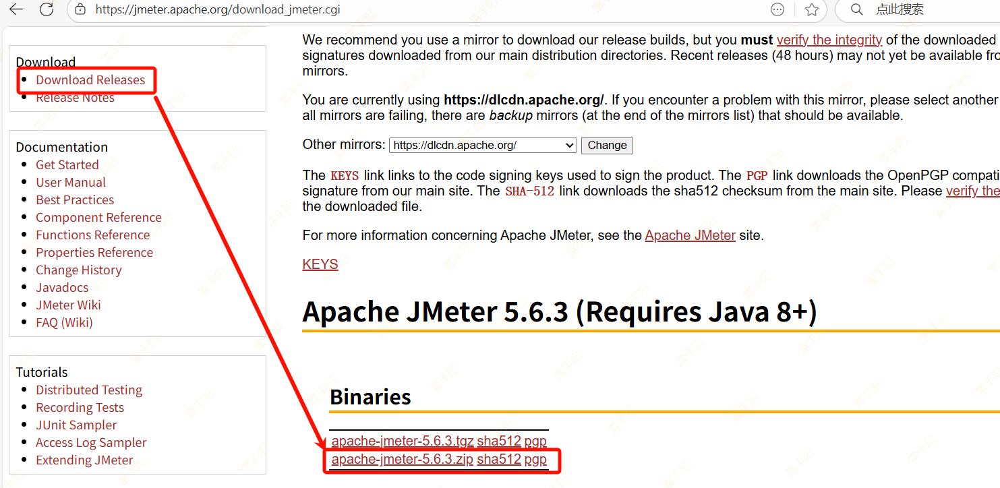

## 使用流程

1. 创建 测试计划
  1. 添加 **用户组**（线程组）模拟并发量
    1. 并发量：20
    2. 吞吐量：1w

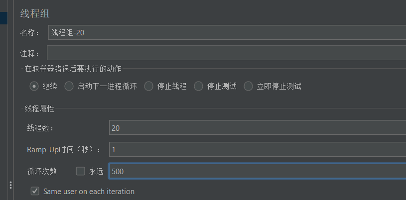

  1. 添加 取样器（测试哪些东西）

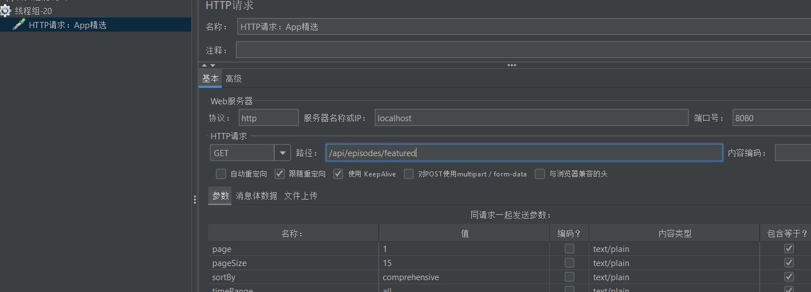

     c. 添加指标分析工具；（结果树、汇总报告、聚合报告）

### 给网关发请求，获取精选数据：

> 汇总报告： 吞吐量、异常比例

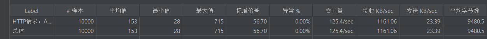

> 聚合报告: 百分比水位线（**百分位指标**）

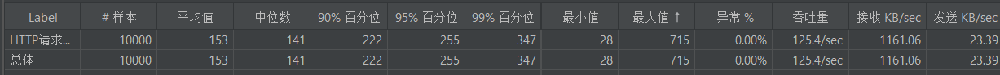

> 如何测试接口瓶颈：线程数 20 ~ 2w， 啥时候压崩；
> 
> > **控制变量法：**
> > 
> > 1. 配置：**CPU、内存**；
> >   1. 涨 用户数
> > 2. 配置：**CPU、内存**；
> >   1. 涨 用户数
> 
> **CPU、用户不变，涨内存**：可以评估出内存大小对接口性能影响

## 常见指标

| 指标 | 含义 | 重点说明 |
| --- | --- | --- |
| Samples | 一共发出的请求次数（样本数） | 如果并发 100 用户，循环 10 次，就是 100 × 10 = 1000 samples |
| Average | 平均响应时间（毫秒 ms） | 所有请求的平均值，波动大的话参考意义有限 |
| Median | 中位数响应时间 | 一半请求比它快，一半比它慢，抗极端值干扰 |
| 90% Line | 90% 的请求在这个时间内完成 | 重要的用户体验指标，比平均值更靠谱 |
| Min | 最快一次请求耗时（ms） | 一般没什么实际优化意义 |
| Max | 最慢一次请求耗时（ms） | 可用于发现极端慢请求，但别单独用它评价性能 |
| Error % | 失败请求占比 | 失败可来自 HTTP 状态码错误、断言失败、连接异常等 |
| Throughput | 吞吐量：每秒处理的请求数（req/sec） | 单位可能是 Requests/sec 或 Requests/min，越大系统越能扛压 |
| KB/sec | 每秒接收/发送数据量 | 网络带宽瓶颈排查可看 |
| Std. Dev. | 响应时间标准差（ms） | 数值越小，性能越稳定 |
| Latency | 从发起请求到收到第一个字节的时间（ms） | 不等于响应时间，排除传输耗时 |
| Connect Time | TCP 连接建立耗时 | 网络慢或频繁建连接时会变大 |

## 理解指标

**A. 响应时间相关**

- `Average` 只能做趋势参考，不能代表用户体验，因为它会被少数极端慢的请求拉高。
- `Median`（中位数） & `90% Line`（P90）更接近真实体验，常配合 P95、P99 查看。
- 响应时间稳定的系统，`Std.Dev.`（标准差）通常很小。

**B. 吞吐量相关**

- 吞吐量(Throughput) 越高，说明系统能在单位时间处理更多请求。
- 需要与响应时间结合看：吞吐升高时，响应时间是否急剧变慢？可能是到瓶颈了。

**C. 错误率相关**

- Error% 如果 >0，需要分析原因（HTTP 5xx？HTTP 4xx？超时？断言失败？）
- 压测时很多人只看 TPS（吞吐量），忽视了高并发下可能已经在大面积失败。

**D. 网络相关**

- KB/sec、Latency、Connect Time 提供了额外上下文——可能发现并不是应用慢，而是网络延迟或数据量大。

## 样例分析

| Label | # Samples | Average | Min | Max | Std.Dev | Error% | Throughput | Received KB/sec | Sent KB/sec |
| --- | --- | --- | --- | --- | --- | --- | --- | --- | --- |
| /api/login | 10000 | 250 | 120 | 2000 | 130 | 0.0012 | 500 | 150 | 10 |

解读：

- 共请求 `10000` 次。
- 平均耗时 `250ms`，但最大 2000ms，标准差 130ms → 偶尔会明显变慢。
- 0.12% 请求失败（约 12 次），要分析失败原因。
- 吞吐量 500 req/sec，说明被压到 500 QPS 时，接口还能工作但响应时间波动。
- 接收数据量 150 KB/sec，发送 10 KB/sec，可以估算带宽消耗

## 性能判断

- **Step 1:** 确定压测目标（比如 QPS = 1000，P95 < 200ms）
- **Step 2:** 从低并发逐步加压（阶梯形），观察 `Throughput` 和 `P90`/`Average` 的变化
- **Step 3:** 当 `Throughput` 增长趋缓，但 `响应时间` 急剧上升 & `Error%` 提高 → 达到拐点/瓶颈
- **Step 4:** 分析是 **CPU满** 还是 **数据库慢** 还是 **网络延迟**：
  - CPU 满 → 看系统监控（`top`, `jconsole`）
  - DB 慢 → 慢查询日志/监控
  - 网络延迟 → Latency & Connect Time 高

## **百分位指标 (Latency SLA 指标)**

- P50: 中位数
- P90: 90% 请求都小于此值
- P95: 95% 请求都小于此值
- P99: 极端尾部延迟

> 大型系统 SLA 设计常用：P95 / P99 约束比单看平均值更合理

## 最佳实践

> **看吞吐量(能扛多大并发)**
> 
> **盯延迟线(90%, 95%, 99%)**
> 
> **控错误率(可靠性)**
> 
> **查标准差(稳定性)**

# 缓存

## 基本用法

### 使用场景

为了系统性能的提升，我们一般都会将**部分数据放入缓存**中，加速访问。**而db承担****数据落盘****工作**。

***哪些数据适合放入******缓存******？***

- **即时性、数据一致性要求不高的**
- **访问量大且更新频率不高的数据（读多，写少）**

举例：

1. 电商类应用，商品分类，商品列表等不经常变化，**适合缓存**。
2. 视频类应用，视频一旦发布，除非删除、修改标题等，一般也不发生变化，**适合缓存**

> **注意：**在开发中，凡是放入**缓存中的数据**我们都应该指定【**过期时间】**，使其可以在系统即使没有主动更新数据也能自动触发数据加载进缓存的流程。避免业务崩溃导致的**数据永久不一致问题**。

### 使用流程

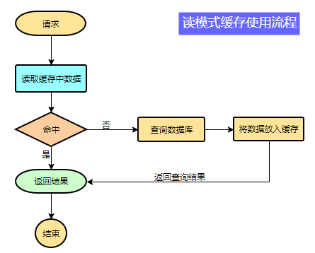

**伪代码：**

```java
data = cache.load(id);//从缓存加载数据
If(data == null){
  data = db.load(id);//从数据库加载数据
  cache.put(id,data);//保存到cache中
}
return data;
```

### 整合Redis作为缓存

**依赖导入**

```xml
<dependency>
     <groupId>org.springframework.boot</groupId>
     <artifactId>spring-boot-starter-data-redis</artifactId>
</dependency>
```

**配置文件**

```xml
spring:
  redis:
    host: 192.168.56.10
    port: 6379
```

**代码实现**

```typescript
@Autowired
StringRedisTemplate stringRedisTemplate;
@Test
public void testStringRedisTemplate(){
    ValueOperations<String, String> ops = stringRedisTemplate.opsForValue();
    ops.set("hello","world_"+ UUID.randomUUID().toString());
    String hello = ops.get("hello");
    System.out.println(hello);

}
```

### 改造代码

```java
//1、从redis中获取首页精选短剧数据； 值就是 HomeFeaturedDTO json数据
String cacheKey = "home:featured:1:15";
String json = redisTemplate.opsForValue().get(cacheKey);
if (StringUtils.isEmpty(json)) {
    //2、说明缓存没有， 需要 回源；
    log.info("缓存数据未命中... 准备回源...");
    HomeFeaturedDTO data = contentServiceFeignClient.feature(pageReqVo).getData();
    //3、回源数据写入缓存
    String jsonStr = JSONUtil.toJsonStr(data);
    log.info("回源完成, 数据写入缓存：{}", jsonStr);
    redisTemplate.opsForValue().set(cacheKey, jsonStr, 3, TimeUnit.DAYS);
    return data;
}


log.info("缓存命中直接返回....");
//4、缓存中有
HomeFeaturedDTO dto = JSONUtil.toBean(json, HomeFeaturedDTO.class);
return dto;
```

## 缓存失效：读问题

> 缓存未命中；

大并发读情况下的缓存失效问题；

### 缓存穿透

- **缓存穿透**是指**查询一个一定不存在的数据**，由于缓存是不命中，将去查询数据库，但是数据库也无此记录，我们没有将这次查询的null写入缓存，这将导致这个不存在的数据每次请求都要到存储层去查询，失去了缓存的意义。
- **在流量大时**，可能DB就挂掉了，要是有人利用不存在的key频繁攻击我们的应用，这就是漏洞。
- **解决：缓存空结果、并且设置短的过期时间；**** 使用布隆过滤器**

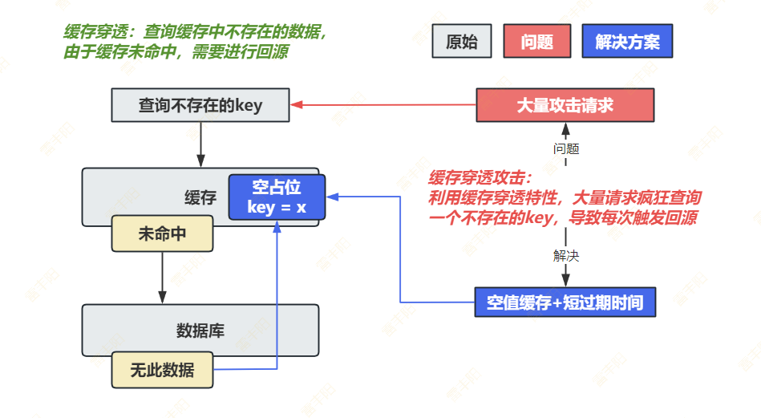

### 缓存击穿

- 对于一些设置了过期时间的key，如果这些key可能会在某些时间点被超高并发地访问，是一种非常“热点”的数据。
- 这个时候，需要考虑一个问题：如果这个key在大量请求同时进来前正好失效，那么所有对这个key的数据查询都落到db，我们称为**缓存击穿**。
- **解决：加锁**

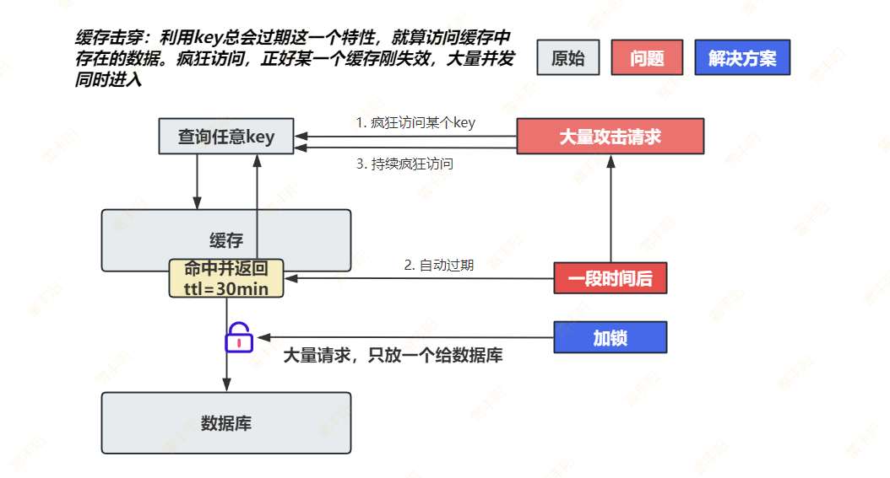

### 缓存雪崩

- 缓存雪崩是指在我们设置缓存时采用了相同的过期时间，导致缓存在某一时刻同时失效，请求全部转发到DB，DB瞬时压力过重雪崩。
- **解决：****原有的失效时间基础上增加一个随机值****，比如1-5分钟随机，这样每一个缓存的过期时间的重复率就会降低，就很难引发集体失效的事件。**

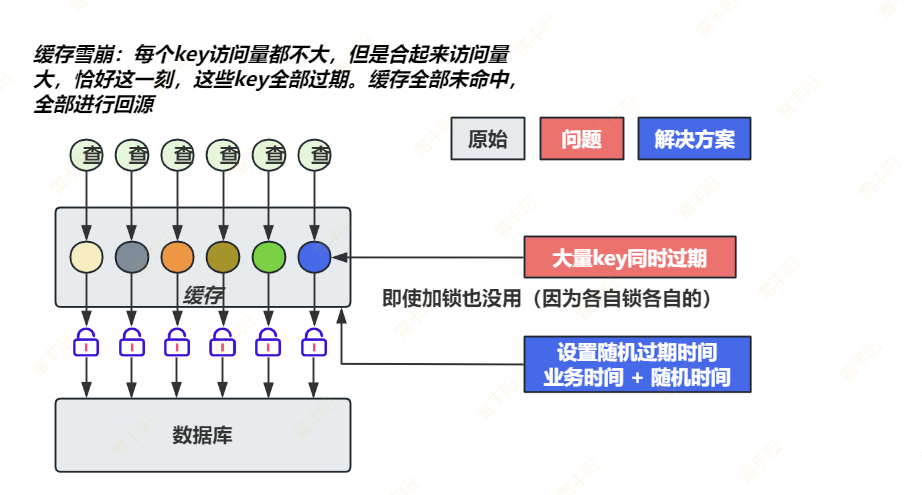

**生日问题**：https://zh.wikipedia.org/zh-cn/%E7%94%9F%E6%97%A5%E5%95%8F%E9%A1%8C

## 数据一致性：写问题

如何保证缓存中的数据和数据库的数据是一致的。

### 双写模式

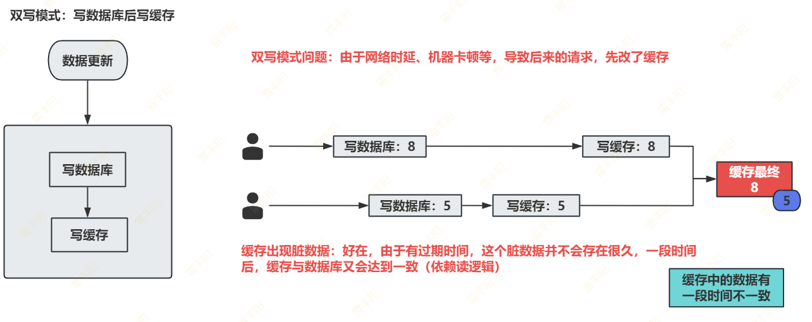

### 失效模式

> 删的太快了，更新太慢。

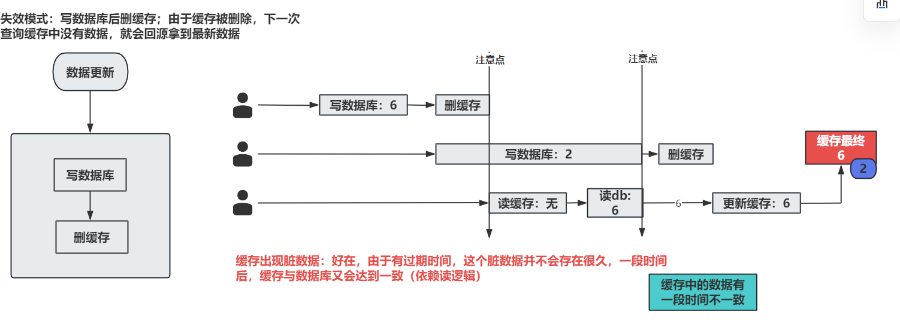

### 延迟双删：失效模式升级版

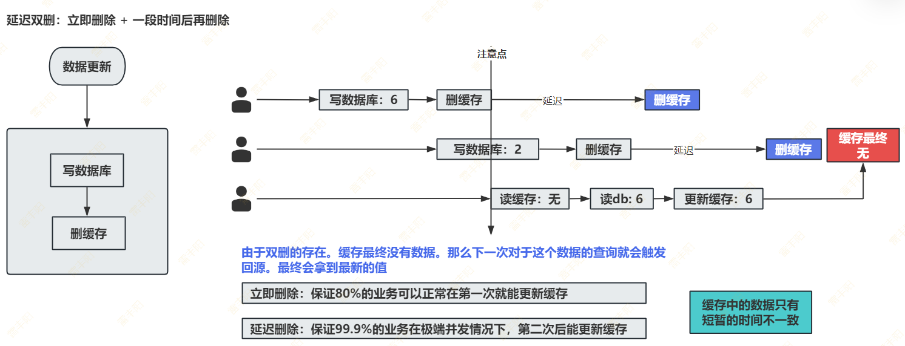

延迟双删代码实现如下：

```typescript
/**
 * 实现延迟双删
 * @param cacheKey
 */
public void deleteCache(String cacheKey) {
    //1、立即删
    redisTemplate.delete(cacheKey);

    //2、延迟删； 启动一个延迟任务（5~10s）再删除； 时间轮；
    //即使是双删，只要上次的读后更新缓存卡的够久（一定再删除后面）。双删那就没用


    // 1%； 后台系统有清缓存按钮。
    //最怕机器断电。
    scheduledPoolExecutor.schedule(()->{
        redisTemplate.delete(cacheKey);
    },10,TimeUnit.SECONDS);

}
```

没有**银弹**；

### Canal 同步

> 使用 Canal 这样的 CDC平台捕获数据变化，并更新缓存
> 
> **优点：**不侵入业务代码
> 
> **缺点：**CDC平台稳定性如果比较差，数据会经常不一致

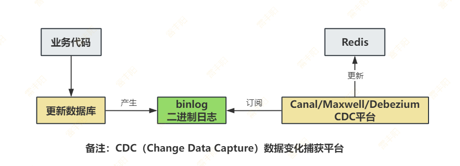

> **特别注意**：
> 
> 1. 缓存只适合哪些读多写少、数据一致性要求不高的数据
> 2. 如果数据经常被修改，且一致性要求高，就建议直接操作数据库，可以利用读写分离，分担数据库压力

> Canal的用法
> 
> 1. 直接指定数据库地址。
> 2. 写一个监听器，数据库有什么变化就监听到
> 3. 数据把变化的数据传入进来。 解析数据； 看需要更新什么缓存
> 
> https://github.com/alibaba/canal

# 分布式锁

## 本地锁的问题

> 本地锁。由于是jvm级别的锁，只能锁住自己所在的机器。分布式情况下，不能锁住别的机器

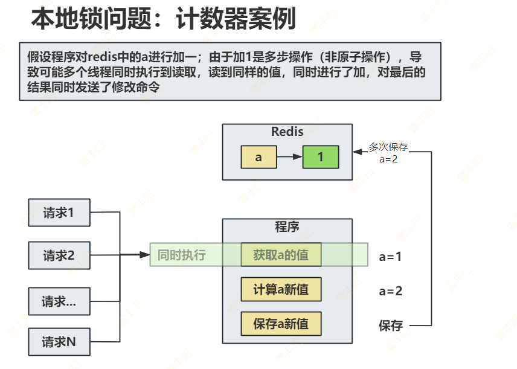

### 编写代码

```typescript
@RequestMapping("/api")
@RestController
public class IncrTestController {
    
    @Autowired
    StringRedisTemplate redisTemplate;
    
    @RequestMapping("/incr")
    public String incr(){
        //1、获取数据（提前在redis中设置好 test:incr=0）
        String incr = redisTemplate.opsForValue().get("test:incr");
        
        //2、执行+1
        int i = Integer.parseInt(incr);
        i++;
        
        //3、结果写入redis
        redisTemplate.opsForValue().set("test:incr",String.valueOf(i));

        return "ok";
    }
}
```

### 本地并发测试

> 使用 apifox 或者 jmeter 进行压力测试；

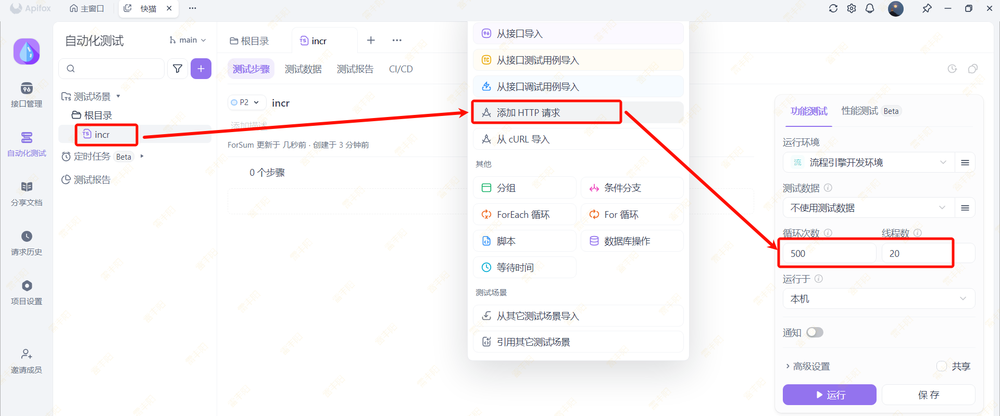

### 使用本地锁

```typescript
@RequestMapping("/api")
@RestController
public class IncrTestController {

    @Autowired
    StringRedisTemplate redisTemplate;

    @RequestMapping("/incr")
    public String incr(){
        synchronized (IncrTestController.class){
            //1、获取数据（提前在redis中设置好 test:incr=0）
            String incr = redisTemplate.opsForValue().get("test:incr");
            //2、执行+1
            int i = Integer.parseInt(incr);
            i++;
            //3、结果写入redis
            redisTemplate.opsForValue().set("test:incr",String.valueOf(i));
        }
        return "ok";
    }
}
```

> 继续测试：发现本地锁可以了，结果正确了。
> 
> 但是这只是在单机环境。在集群环境下，会出现什么问题？

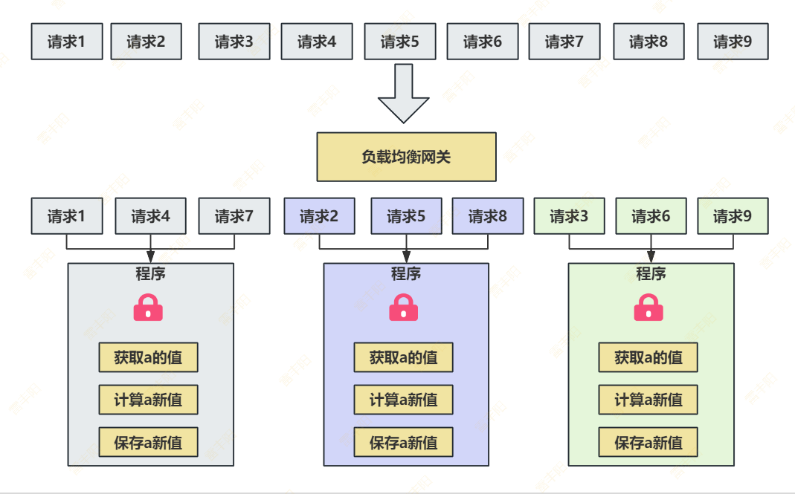

结论：由于本地锁，只对自己机器有用，也就是自己

### 测试分布式集群环境

> 1. 启动多份应用实例
> 2. 确认网关配置负载均衡
> 3. 压力测试查看最终结果： 分布式下，本地锁锁不住；

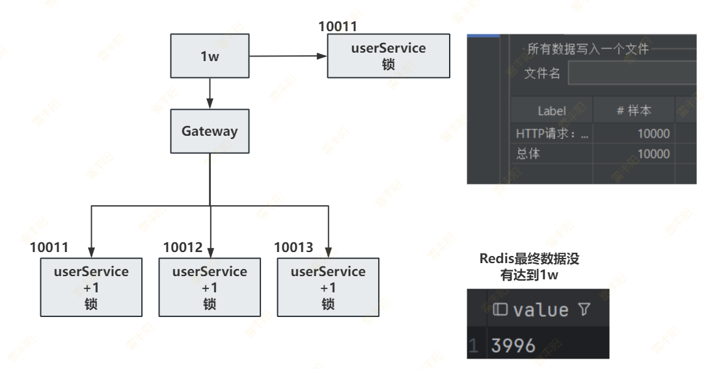

## 分布式锁实现

### 核心思想

> 去同一个地方抢位置就行，比如
> 
> 1. 去redis保存同一个kv，能保存成功的就算抢到锁
> 2. 去数据库修改同一个记录，能修改成功的就算抢到锁
> 3. ....

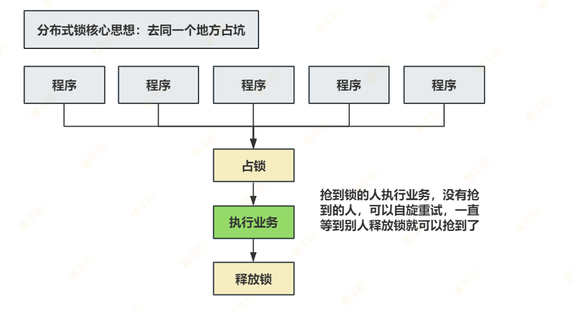

### 分布式锁：第一阶段

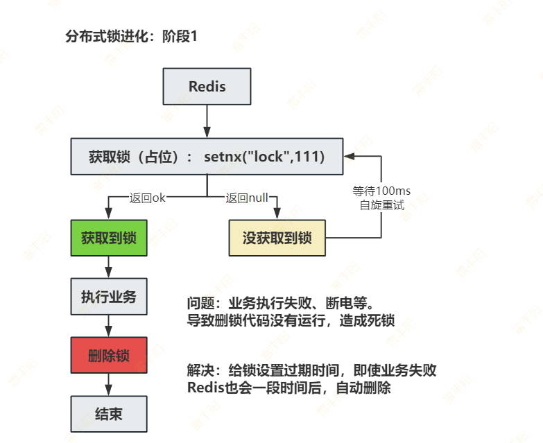

### 分布式锁：第二阶段

> set lock 1 nx ex 30;    原子命令 = 占坑 + 设置过期

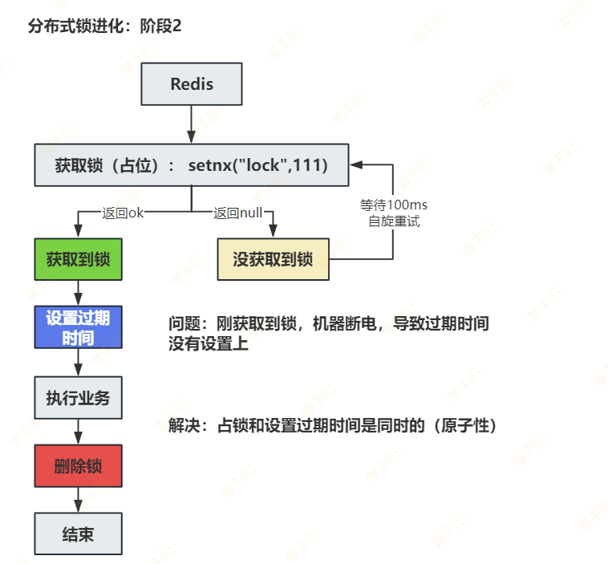

### 分布式锁：第三阶段

> set lock 1 nx ex 30;    原子命令 = 占坑 + 设置过期

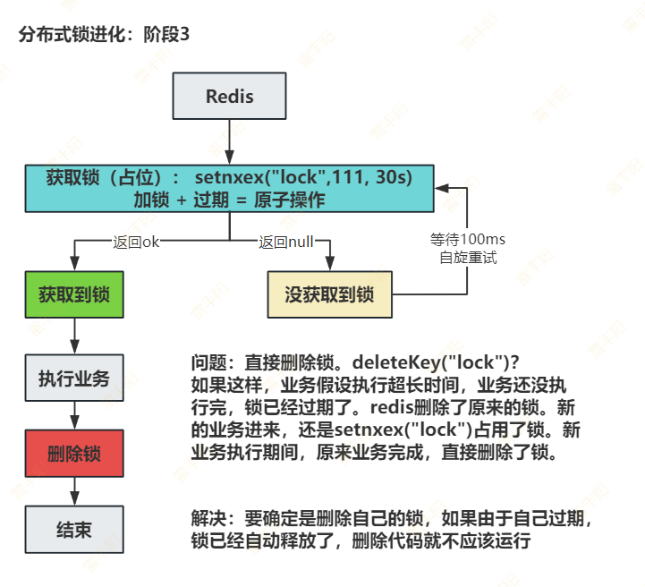

> 删锁问题演示

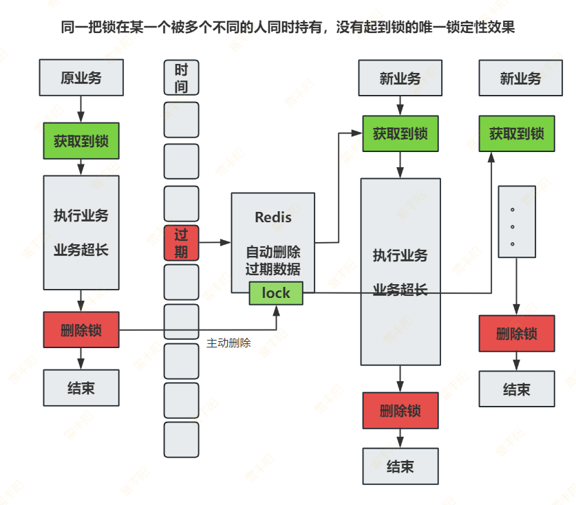

> 业务超长，锁自动过期。别人抢到执行业务，等你业务完删除锁，就删除的是别人；

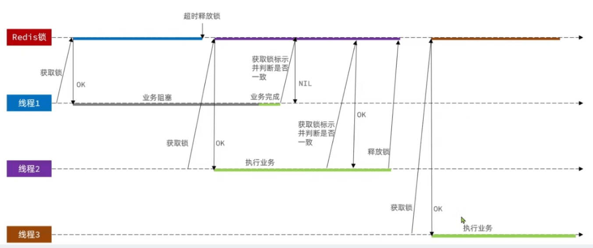

### 分布式锁：第四阶段

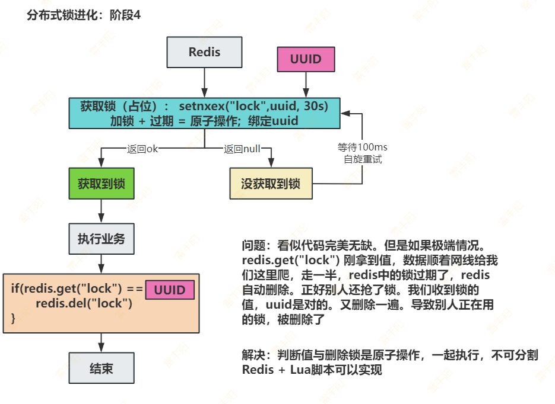

### 分布式锁：第五阶段

官方提供的一个解锁脚本：https://redis.io/docs/latest/commands/set/#patterns

```lua
if redis.call("get",KEYS[1]) == ARGV[1]
then
    return redis.call("del",KEYS[1])
else
    return 0
end
```

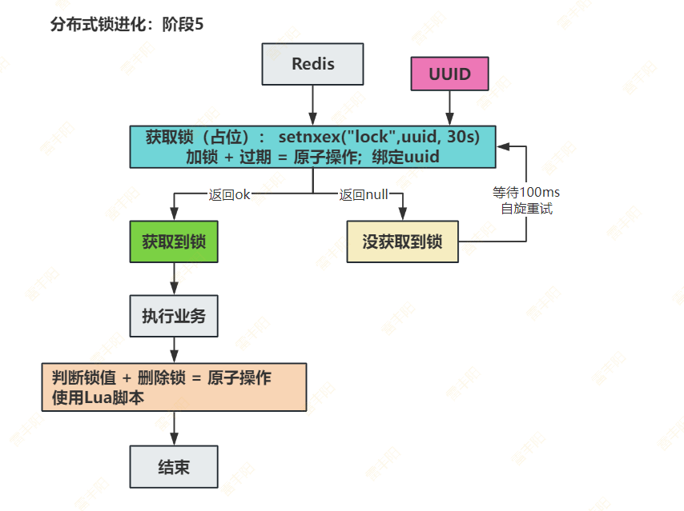

### 分布式锁核心小结：

**保证两个原子性即可**：

1. **加锁原子性**：占坑 + 设置uuid唯一值 + 过期时间
2. **解锁原子性**：对比锁值 + 删除锁

终极版：

1. 业务执行期间，锁会自动续期；

# Redisson

Redisson 是专为 Valkey 和 Redis 打造的 Java 客户端与实时数据平台。它提供了操作 Valkey 或 Redis 最便捷高效的方式。Redisson 对象在 Valkey/Redis 与 Java 代码之间构建了抽象层，使开发者能专注于数据建模与应用逻辑，显著降低 Java 开发者的学习门槛。

## 整合

### 依赖

```xml
<dependency>
   <groupId>org.redisson</groupId>
   <artifactId>redisson-spring-boot-starter</artifactId>
   <version>3.51.0</version>
</dependency>
```

### 配置

```yaml
spring:
  redis:
    database: 
    host:
    port:
    password:
    ssl: 
    timeout:
    connectTimeout:
    clientName:
    cluster:
      nodes:
    sentinel:
      master:
      nodes:
```

还可以单独配置redisson文件； ([single mode](https://redisson.pro/docs/configuration/#single-yaml-config-format), [replicated mode](https://redisson.pro/docs/configuration/#replicated-yaml-config-format), [cluster mode](https://redisson.pro/docs/configuration/#cluster-yaml-config-format), [sentinel mode](https://redisson.pro/docs/configuration/#sentinel-yaml-config-format), [proxy mode](https://redisson.pro/docs/configuration/#proxy-mode-yaml-config-format), [multi cluster mode](https://redisson.pro/docs/configuration/#multi-cluster-yaml-config-format), [multi sentinel mode](https://redisson.pro/docs/configuration/#multi-sentinel-yaml-config-format))

```yaml
spring:
  redis:
   redisson: 
      file: classpath:redisson.yaml
```

### 组件

> Redisson 给容器中自动配置了如下组件

- `RedissonClient`
- `RedissonRxClient`
- `RedissonReactiveClient`
- `RedisTemplate`
- `ReactiveRedisTemplate`
- `ReactiveRedisOperations`

```typescript
@SpringBootTest
public class RedissonTest {


    @Autowired
    RedissonClient redissonClient;

    @Test
    void redissonTest(){
        System.out.println(redissonClient.getConfig());
    }
}
```

## 分布式集合

> 本地集合：Map、List、Set；  都在JVM内存中。不能共享
> 
> **分布式集合**：RMap、RList、RSet； 存的数据都在redis中

Redisson提供 RMap 对象，并实现了 ConcurrentMap 接口，具备线程安全性。

```go
RMap<String, SomeObject> map = redisson.getMap("anyMap");
SomeObject prevObject = map.put("123", new SomeObject());
SomeObject currentObject = map.putIfAbsent("323", new SomeObject());
SomeObject obj = map.remove("123");
```

## 分布式限流（RateLimiter）

```java
RRateLimiter limiter = redisson.getRateLimiter("myLimiter");

// 5 permits per 2 seconds
limiter.trySetRate(RateType.OVERALL, 5, 2, RateIntervalUnit.SECONDS);
limiter.acquire(3);
```

## 分布式锁

> Redisson 提供的所有锁，都实现了 Java 对应的 Lock 相关接口。使得使用起来能无缝上手

### Lock：锁

```java
RLock lock = redisson.getLock("myLock");

//1. 传统加锁。一直阻塞式等待锁
lock.lock(); //自动续期

//2. 传统加锁。加锁成功，10s 自动解锁。加锁不成功就一直阻塞式等待锁
lock.lock(10, TimeUnit.SECONDS);

//3. 尝试加锁。限时等待锁，最多等100s，加锁成功后，10s以后自动解锁
boolean res = lock.tryLock(100, 10, TimeUnit.SECONDS);
//4. 尝试加锁会返回boolean值。返回true代表加速成功，可以执行业务逻辑
if (res) {
    try {
        // ...
    } finally {
        lock.unlock();
    }
}
```

### Fair Lock：公平锁

> 默认锁不是公平的。可能导致先抢锁的人，等待了很久，结果别人释放锁了，没有把锁权优先给他。

```java
RLock lock = redisson.getFairLock("myLock");

//1. 传统加锁
lock.lock();

//2. 10s自动解锁
lock.lock(10, TimeUnit.SECONDS);

//3. 尝试加锁，限时等待100s，加锁成功10s后自动解锁
boolean res = lock.tryLock(100, 10, TimeUnit.SECONDS);
if (res) {
   try {
     ...
   } finally {
       lock.unlock();
   }
}
```

### MultiLock：联锁

> 多个锁全部获取成功。才可以继续执行业务

```java
RLock lock1 = redisson1.getLock("lock1");
RLock lock2 = redisson2.getLock("lock2");
RLock lock3 = redisson3.getLock("lock3");

RLock multiLock = anyRedisson.getMultiLock(lock1, lock2, lock3);

// traditional lock method
multiLock.lock();

// or acquire lock and automatically unlock it after 10 seconds
multiLock.lock(10, TimeUnit.SECONDS);

// or wait for lock acquisition up to 100 seconds 
// and automatically unlock it after 10 seconds
boolean res = multiLock.tryLock(100, 10, TimeUnit.SECONDS);
if (res) {
   try {
     ...
   } finally {
       multiLock.unlock();
   }
}
```

### RedLock：红锁（这其实是错误的叫法）

> 全称 **Redisson Lock**；
> 
> 多数节点加锁成功才算成功； redis集群加锁机制；
> 
> Redis Cluter 集群自己有这个多数派复制机制


### ReadWriteLock：读写锁

> 读写场景。不用加 lock 锁

```java
RReadWriteLock rwlock = redisson.getReadWriteLock("myLock");

RLock lock = rwlock.readLock();
// or
RLock lock = rwlock.writeLock();

// traditional lock method
lock.lock();

// or acquire lock and automatically unlock it after 10 seconds
lock.lock(10, TimeUnit.SECONDS);

// or wait for lock acquisition up to 100 seconds 
// and automatically unlock it after 10 seconds
boolean res = lock.tryLock(100, 10, TimeUnit.SECONDS);
if (res) {
   try {
     ...
   } finally {
       lock.unlock();
   }
}
```

### Semaphore：信号量

```java
RSemaphore semaphore = redisson.getSemaphore("mySemaphore");

// acquire single permit
semaphore.acquire();

// or acquire 10 permits
semaphore.acquire(10);

// or try to acquire permit
boolean res = semaphore.tryAcquire();

// or try to acquire permit or wait up to 15 seconds
boolean res = semaphore.tryAcquire(15, TimeUnit.SECONDS);

// or try to acquire 10 permits
boolean res = semaphore.tryAcquire(10);

// or try to acquire 10 permits or wait up to 15 seconds
boolean res = semaphore.tryAcquire(10, 15, TimeUnit.SECONDS);
if (res) {
   try {
     ...
   } finally {
       semaphore.release();
   }
}
```

### CountDownLatch：闭锁

```c++
RCountDownLatch latch = redisson.getCountDownLatch("myCountDownLatch");

latch.trySetCount(1);
// await for count down
latch.await();

// in other thread or JVM
RCountDownLatch latch = redisson.getCountDownLatch("myCountDownLatch");
latch.countDown();
```

**JUC：锁：信号量和闭锁**；

# 布隆过滤器（BloomFilter）

## 简介

布隆过滤器（Bloom Filter）是一种**高效的概率型数据结构**，用于测试集合中是否存在某个元素。它可以迅速判断元素的“可能存在”或“肯定不存在”，但不能准确判断元素是否确实存在，因此有一定的误判率。布隆过滤器主要用于以下场景：

- **防止缓存穿透**：在缓存层判断某个请求的 key 是否存在，以避免频繁请求数据库。
- **垃圾邮件过滤**：快速判断邮箱是否属于垃圾邮件列表。
- **网络爬虫中的 URL 判重**：防止重复抓取同一 URL。
- **分布式系统中的去重**：在海量数据集合中进行快速去重检查。

## 工作原理

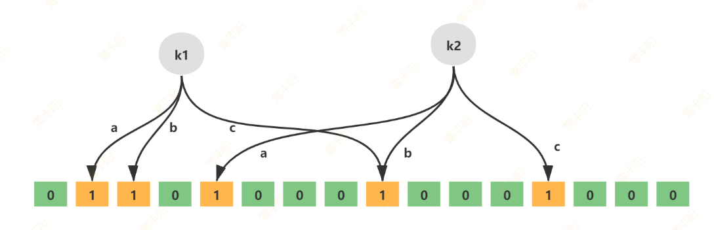

布隆过滤器是由一个位数组和几个哈希函数组成：

1. **位数组**：用于存储数据的二进制表示，初始时所有位置为 0。
2. **哈希函数**：多个不同的哈希函数用于对输入数据进行散列，通常可以使用两个哈希函数，然后通过双重哈希技术来模拟 k 个哈希函数。

### 添加元素

当一个新元素添加到布隆过滤器中时，执行以下步骤：

- 用 k 个哈希函数对元素进行哈希操作，得到 k 个哈希值。
- 根据这些哈希值，对位数组中对应的位置进行设置（置为 1）。

### 查询元素

要查询一个元素是否存在：

- 用同样的 k 个哈希函数对待查元素进行哈希，得到 k 个位置。
- 检查位数组中这些位置的值是否都为 1。
  - 如果所有位置均为 1，元素“可能存在”（可能有误判）。
  - 如果有任何一个位置为 0，元素“肯定不存在”。

### 优缺点

#### 优点

- **空间效率**：相比使用完整列表保存所有元素，布隆过滤器需要的存储空间非常少。
- **插入和查询效率**：操作时间复杂度为 O(k)，其中 k 是哈希函数数量。
- **兼容性**：任意字符串都可以使用

#### 缺点

- **误判率**：它能够判断元素肯定不存在，却不能判断元素确实存在。误判率与哈希函数数量和位数组大小有关。
- **不可删除**：传统布隆过滤器不支持删除操作，因为无法记录每一位被几次哈希命中。

# 位图（bitmap）

> 仅能适用于数字判断。布隆过滤器的底层就是位图。位图最大的优点就是支持删除

BitMap 原本的含义是用一个比特位来映射某个元素的状态。由于一个比特位只能表示 0 和 1 两种状态，所以 BitMap 能映射的状态有限，但是使用比特位的优势是能大量的节省内存空间。

在 Redis 中，可以把 Bitmaps 想象成一个以比特位为单位的数组，数组的每个单元只能存储0和1，数组的下标在 Bitmaps 中叫做偏移量。

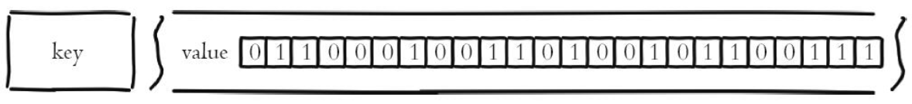

```sql
127.0.0.1:6379> setbit dramas 10000 1
(integer) 0
127.0.0.1:6379> setbit dramas 9000 1
(integer) 0
127.0.0.1:6379> setbit dramas 8000 1
(integer) 0
127.0.0.1:6379> getbit dramas 10000
(integer) 1
127.0.0.1:6379> getbit dramas 9999
(integer) 0
127.0.0.1:6379> getbit dramas 8000
(integer) 1
127.0.0.1:6379> setbit dramas 8000 0
(integer) 1
127.0.0.1:6379> getbit dramas 8000
```

# 缓存查询完整流程

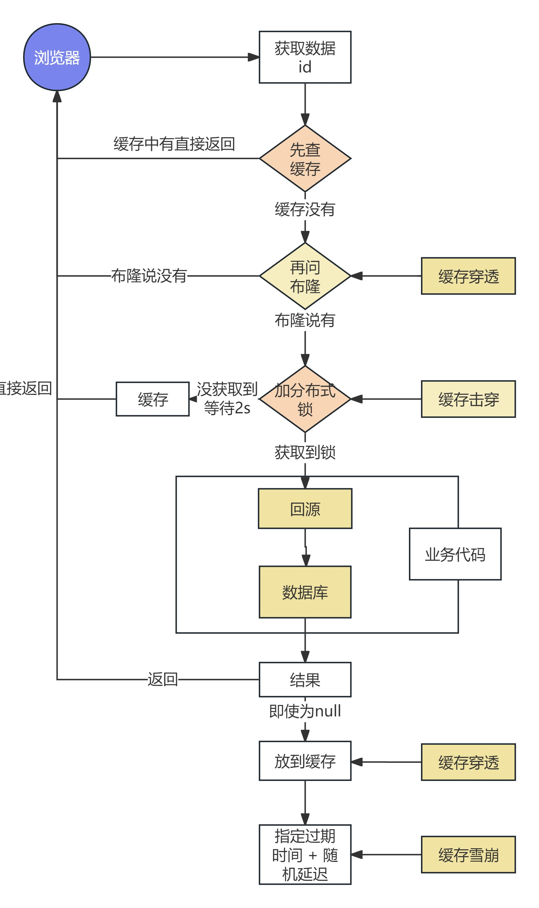

# 业务改造

## 获取短剧所有剧集

> **内容服务**，维护好布隆过滤器中的数据
> 
> **用户服务**，每次查询之前去布隆过滤器判断

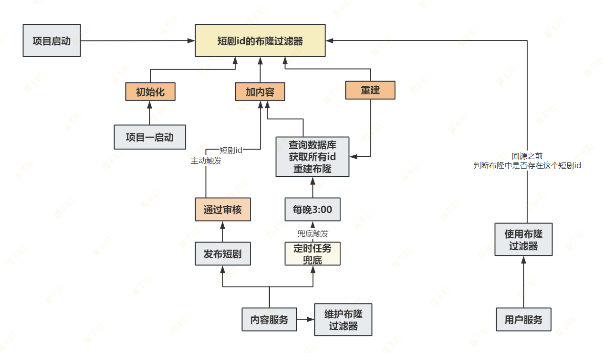

```properties
@Override
public HomeDramaEpisodesDTO getDramaEpisodesInfo(Long dramaId) {
    //1、查看缓存中有没有
    log.info("缓存中 ==> 获取短剧剧集数据：{}", dramaId);
    HomeDramaEpisodesDTO data = redisService.getData(RedisConst.HOME_DRAMA_EPISODES + dramaId, HomeDramaEpisodesDTO.class);
    if (data != null) {
        log.info("缓存数据命中...，直接返回");
        return data;
    }

    log.info("缓存数据未命中... 准备回源...");
    //2、缓存没有准备回源
    //2.1 先判断BF中是否存在； 防止缓存穿透
    if (!bfTemplate.containsDramaIdBloomFilter(dramaId)) {
        log.info("回源之前：布隆过滤器中不存在，直接返回null：{}", dramaId);
        //2.2 不存在，直接返回
        return null;
    }

    log.info("回源之前：布隆过滤器说有，但缓存没有，准备回源：{}", dramaId);
    //2.2 存在，继续回源; 加分布式锁，防止击穿； lock:dramas:
    RLock lock = redissonClient.getLock(RedisConst.HOME_DRAMA_LOCK + dramaId);
    //2.3 尝试加锁
    log.info("为了防止击穿，所有回源请求，尝试加锁：{}", dramaId);
    try {
        boolean b = lock.tryLock();
        if (b) {
            //加锁成功就回源
            log.info("加锁成功：准备远程获取短剧所有剧集数据：{}", dramaId);
            R<HomeDramaEpisodesDTO> r = contentServiceFeignClient.dramaEpisodesInfo(dramaId);
            HomeDramaEpisodesDTO dbData = r.getData();
            //写入缓存： 缓存null值（防止缓存穿透攻击） + 随机过期时间（防止缓存雪崩）
            //bf 虽然判断了。但是因为误判； 布隆说有，就去回源，数据库有可能没有。
            log.info("加锁成功：数据获取到，保存缓存中：{}", dramaId);
            redisService.saveData(RedisConst.HOME_DRAMA_EPISODES + dramaId,dbData);
            //2.5 释放锁
            lock.unlock();
            return dbData;
        } 
    }finally {
        //2.6 释放锁
        lock.unlock();
    }


    //2.4 没有拿到锁； 稍等一阵直接获取缓存
    log.info("加锁失败，准备稍等2s去缓存中看一看，之前回源的人会把数据放到缓存：{}", dramaId);
    try {
        Thread.sleep(2000);
    } catch (InterruptedException e) {
        throw new RuntimeException(e);
    }
    //2.5 最后获取缓存数据库
    data = redisService.getData(RedisConst.HOME_DRAMA_EPISODES + dramaId, HomeDramaEpisodesDTO.class);
    return data;
}
```

## 布隆重建

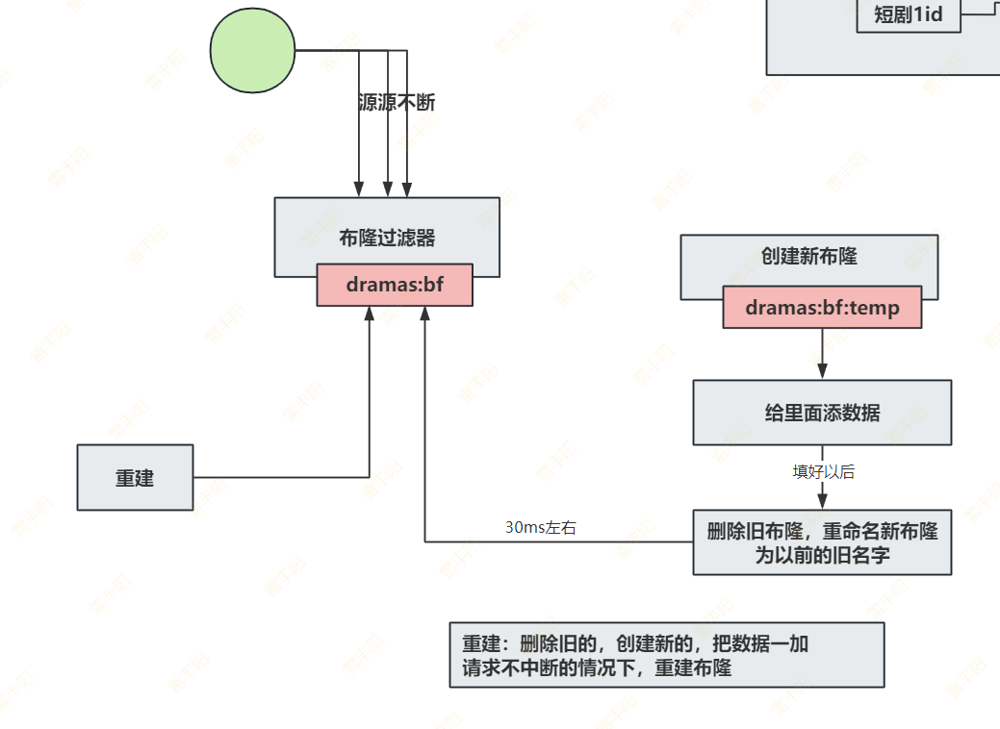

# 9、小结

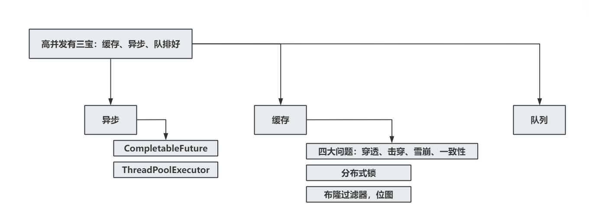