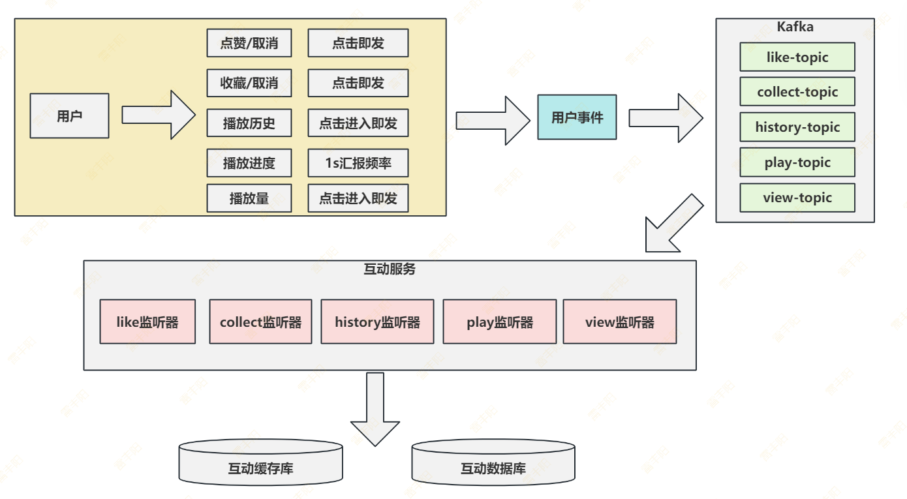
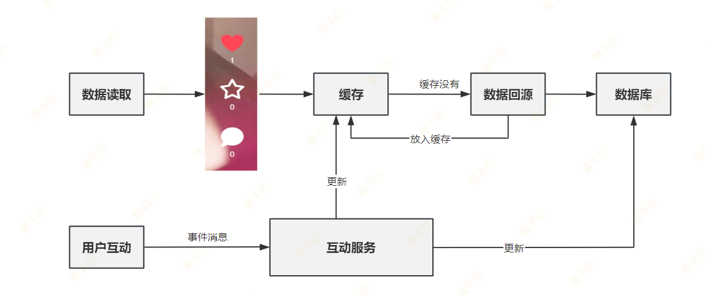
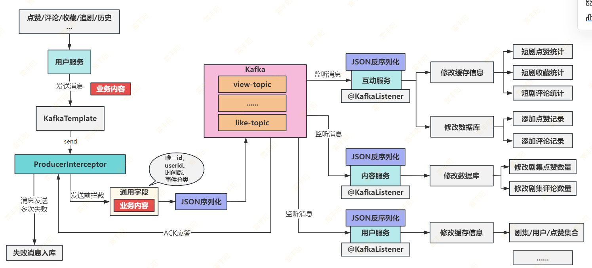
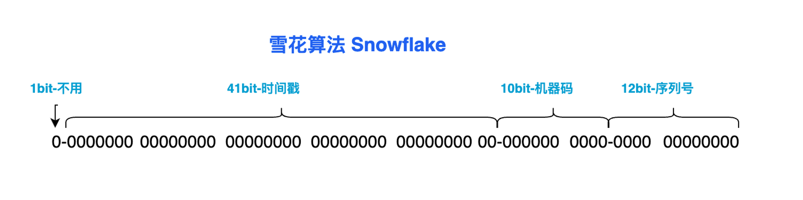
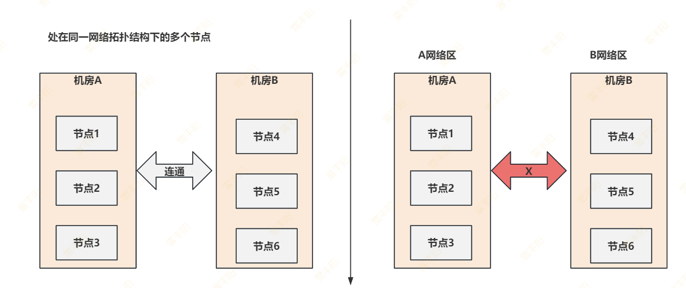
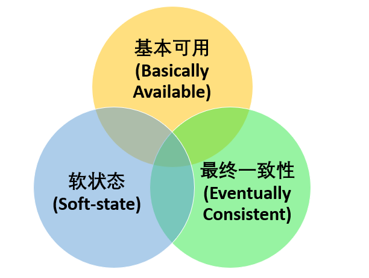
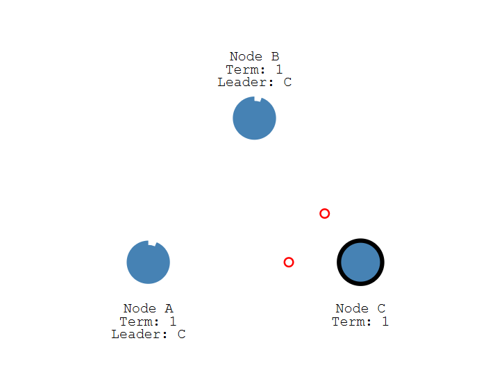
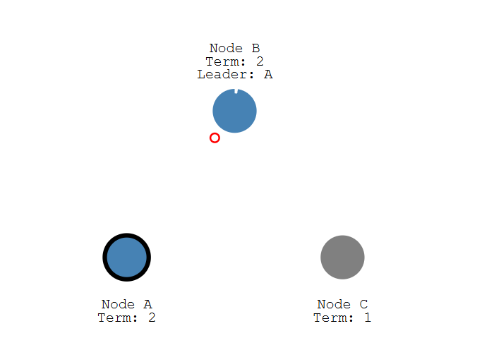
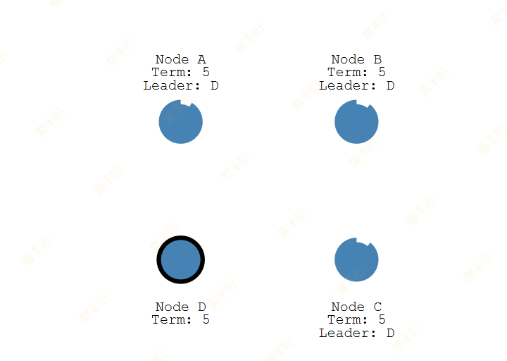
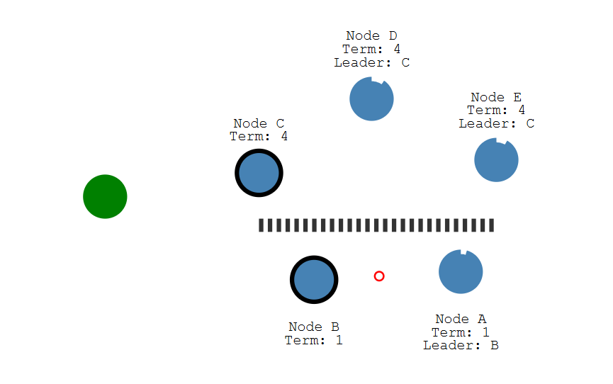

# 9. 互动服务

# 最终一致性

> 用户点赞、收藏、播放进度 ===> 互动服务 ===> 数据库

## 基于用户事件消息方案



## 视频互动数据读写一致性方案

> 用户通过 `消息缓冲` + `双写保证` = `实时感知数据变化`



# 接口API

> `点赞：user_id` ASC, `target_id` ASC, `target_type` ASC； 几个字段合起来是一个唯一约束

## 点赞/取消

`请求首行：POST`**  **`/api/episodes/1967494716564226050/like`

`请求体`：`{action: "like/unlike"}`

`响应内容`：

```json
{
  "code": 200,
  "message": "操作成功",
  "data": {
    "isLiked": true, // like, unlike
    "likeCount": 1001 //点赞数量
  }
}
```

## 收藏/取消

**请求首行**：`POST` `/api/episodes/1967494716564226050/favorite`

**请求体**：`{action: "favorite/unfavorite"}`

**响应内容**：

```java
{
  "code": 200,
  "message": "操作成功",
  "data": {
    "isFavorited": true,
    "favoriteCount": 501
  }
}
```

## 获取评论

**请求首行**：`GET`  `/api/episodes/1967494717021405185/comments`

**请求参数**：`page=1&pageSize=20&sort=newest&showSpoilers=false`

响应内容：

```json
{
  "code": 200,
  "message": "操作成功",
  "data": {
    "comments": [
      {"id": 1, "user": "张三", "timestamp": "", "content": "你好",
        "isLiked": true, "likeCount": 21}
    ]
  }
}
```

## 评论点赞

**请求方式**：`POST`  `/api/comments/${commentId}/like`

**请求体**： `{action: "like/unlike"}`

**响应内容**：

```java
{
  "code": 200,
  "message": "操作成功",
  "data": ""
}
```

## 发表评论

**请求方式**：`POST`  `/api/episodes/1967494717021405185/comments`

**请求体**： `{"content":"递四方速递"}`

**响应内容**：

```java
{
  "code": 200,
  "message": "操作成功",
  "data": ""
}
```

# 完整流程



# 雪花算法

> 场景：



- **1位符号位**：始终为0，确保生成正数。
- **41位时间戳**：记录与固定起始时间的**毫秒差**(1970年)，可支持约69年。
- **10位机器ID**：用于标识不同节点。
- **12位序列号**：在同一毫秒内生成多个ID时使用，最多支持每毫秒生成4096个ID。

**优点**：**高效率的ID生成、无需依赖数据库、****单调递增**

**局限性**：**系统时钟依赖性、数据中心和机器标识的限制、ID长度可能的限制、ID****连续性****的问题**

# CAP、BASE、Raft

本地中间件保存数据（MySQL）；

**ACID**： 原子性、一致性、隔离性、持久性；

## CAP

> CAP 也就是 **C****onsistency（一致性）**、**A****vailability（可用性）**、**P****artition Tolerance（分区容错性）** 这三个单词首字母组合。

在理论计算机科学中，`CAP 定理`（CAP theorem）指出对于一个**分布式系统**来说，当涉及**读写操作**时，只能同时满足以下**三点中的两个**：

- **一致性（Consistency）** : **所有节点访问同一份最新的数据副本**
- **可用性（Availability）**: **非故障的节点在合理的时间内返回合理的响应**（不是错误或者超时的响应）。
- **分区容错性（Partition Tolerance）** : 分布式系统出现网络分区的时候，仍然能够对外提供服务。
  - 出现网络分区错误； 网络故障导致大型局域网划分成几个小型局域网

### 分区容错性

出现网络分区？ 什么是网络分区



### 一致性

节点的所有数据都是一致的，无论读写谁都能得到正确结果

### 可用性

所有节点都是能用的。随便访问哪个节点，都可以处理请求**（注意：能处理不代表能正确处理！）**

### 3选2？错！是2选1

> 大家经常会说到，CAP不可同时满足。只能选两个。这是一种错误描述；
> 
> 因为：
> 
> 1. 在**分布式系统长久运行下**。**P一定会发生**。一旦发生 CA特性只能2 选 1
> 2. 在单机系统下。永远不存在P的问题。单机就是一个标准的CAP全满足系统系统

> 当你做的一个分布式中间件系统；发生网络分区故障后，你是要保证一致性还是要保证可用性。必须二选一

## Base

> **BASE** 是 **B**asically **A**vailable（基本可用）、**S**oft-state（**软**状态） 和 **E**ventually Consistent（最终一致性） 三个短语的缩写。BASE 理论是对 CAP 中一致性 C 和可用性 A 权衡的结果，其来源于对大规模互联网系统分布式实践的总结，是基于 CAP 定理逐步演化而来的，它大大降低了我们对系统的要求。



### 基本可用

基本可用是指分布式系统在出现不可预知故障的时候，**允许损失部分可用性**。但是，这绝不等价于系统不可用。

什么叫允许损失部分可用性呢？

- **响应时间上的损失**: 正常情况下，处理用户请求需要 0.5s 返回结果，但是由于系统出现故障，处理用户请求的时间变为 3 s。
- **系统功能上的损失**：正常情况下，用户可以使用系统的全部功能，但是由于系统访问量突然剧增，系统的部分非核心功能无法使用。

### 软状态

软状态指**允许系统中的数据存在中间状态**（CAP 理论中的数据不一致），并认为该**中间状态**的存在不会影响系统的**整体可用性**，即允许系统在不同节点的数据副本之间进行**数据同步的过程存在延时**。

### 最终一致性

**最终一致性**强调的是系统中**所有的数据副本**，**在经过一段时间的同步后，最终能够达到一个一致的状态**。因此，最终一致性的本质是需要系统保证最终数据能够达到一致，而**不需要实时保证系统数据的强一致性**。

> **业界比较推崇是最终一致性级别；**
> 
> **银行转账**是 **强一致**？**最终一致**？

分布式系统下强一致性才是**稳定性最差的**；

如何判断是强一致还是最终一致性？

> 请求  --  响应：最终一致性

> 最终一致性： 保存事件流**稳定性最高**；

不用强一致，中间流水出错，一个人发出去钱，一个人没收到，不就出问题了？

> 用强一致就不出错？出错就不用解决？解决起来会更简单？

总结几个标准：

1. 处理时间长（明显超过单机处理时长）
2. 涉及到分布式其他系统交互且数据跨中间件
3. 这次处理无法立即拿到结果（比如转账，还要等待**银行回执**）

> 所以：既然远程调用，能让别人做事。发送消息也能让别人做事？那什么时候用远程调用，什么时候发送消息？
> 
> **答：一个判定标准：立即要结果的，就远程调用。否则就可以用消息**

强一致唯一的场景： 中间件自己的集群要强一致的保证所有数据都是同步状态

## Raft

> 分布式系统如何做到一致性

动画中文版：http://www.kailing.pub/raft/index.html

动画原版：https://thesecretlivesofdata.com/raft/

Raft：

### *Leader Election： 领导选举*

1. 所有 `follower` 无领导，会有一个 follower 变成  candidate（候选人）
2. `candidate `要求其他 **follower  **给他投票，让他当 `leader`（领导）
3. 得到多数票会真正成为 leader；

分布式中间件系统，必须有一个leader

**系统的所有增删改必须通过leader**

### *Log Replication *日志复制

1. Leader 拿到 客户端要保存的数据。 把 `set 5` 这个日志保存(Append Only Log)； 
  1. 只是保存了一个日志； 但并未提交
2. Leader 将数据 复制给其他 follower， 其他follower收到后，也保存自己的日志 
  1. 只是保存了一个日志； 但并未提交
3. Leader 收到大多数 follower 的回复（大多follower  都保存了日志 ），就提交数据
  1. Leader 真正保存数据 5.
4. Leader 提交数据后，发送消息给所有 follower ，让其他人跟着提交
  1. 所有 follower  收到 leader 的提交要求就会跟着提交

### *领导选举的完整流程（多数票原则 + 超时控制机制）*

在Raft中，有**两个超时设置**可控制选举

1. **election timeout**： 选举超时（**越小，集群越不稳定【一般都比较大】**）
  1. Follower 一段时间收不到 leader的心跳，会认为 leader挂了，自己就跳出来准备当leader，先成为 candidate，候选人
  2. 一般在：150毫秒至300毫秒：  （K8s **5min**）
  3. 超出 election timeout 后。 某个 Follower  成为 candidate 并发起投票
  4. 并给其他节点发送投票请求。
  5. 收到多数票回复会成为领导者

1. **heartbeat timeout**： 心跳超时（**越小，感觉集群同步越快**）
  1. 心跳是一种保活机制
  2. 心跳超时时间后还监听不到领导的心跳，follower就会成为 candidate 





### 多个候选人竞争票

> 一般都是奇数个节点，容易一次性投票成功



### 日志复制

1. Leader 会 通过 心跳包 把数据全带出去。不会额外给follower发送命令
2. Leader 只要收到  大多数 follower 返回的 ok（follower只记录了日志，没有提交）， 就给客户端返回成功
3. 基本上需要两次心跳周期，follower 才能完全和 Leader 同步；
  1. 第一次心跳，follower  同步日志。 给 Leader 返回，Leader 才提交
  2. 第二次心跳，follower 同步 Leader的提交操作

### 网络分区发生如何保证一致

两个网络分区，出现两个领导（脑裂）

C：可以增删改成功。拥有多数票

B：不可以增删改成功。只有少数票



日志复制（随着心跳包发数据） + 领导选举（多数派）

中间件都自己实现自己的 Raft 机制； **KRaft**

Redis：**Gossip**

> 分布式系统的一致性