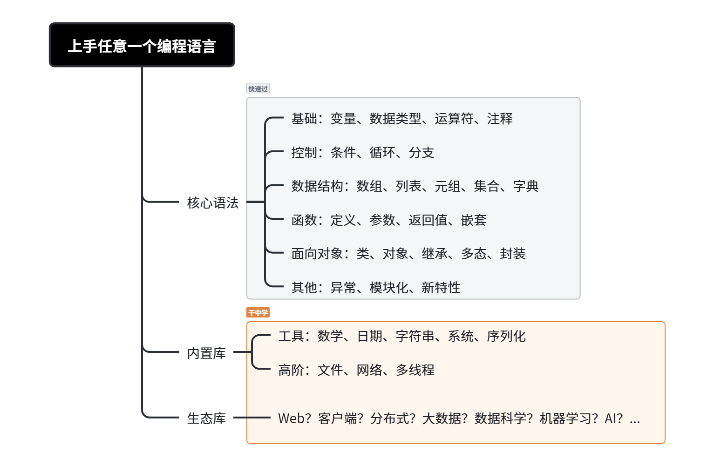
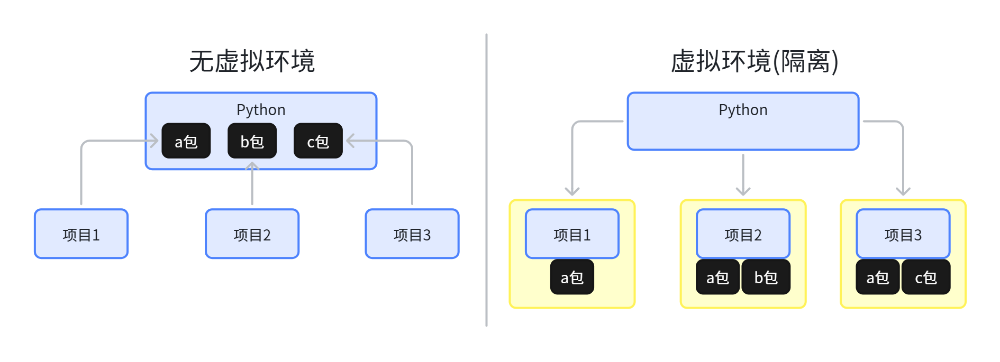

# 1. Python 快速通关

> Java：具有先天母语优势
> 
> 可以速通任何编程语言

# 速通编程



# 基础

> 安装Python环境：https://www.python.org/
> 
> 安装AI IDE：https://www.trae.com.cn/

## 变量与数据类型

> 提示词：
> 
> 1. 创建个 .py 文件，声明很多变量，并用到各种数据类型
> 2. 打印每个变量类型（数据结构章节再讲操作）
> 3. 编写几个类型转换案例

```python
# 1. 声明很多变量，并用到各种数据类型
# 整数
integer_variable = 42

# 浮点数
float_variable = 3.14

# 字符串
string_variable = "Hello, World!"

# 布尔值
boolean_variable = True

# 列表
list_variable = [1, 2, 3, 4, 5]

# 元组
tuple_variable = (1, "two", 3.0)

# 集合
set_variable = {1, 2, 3, 4, 5}

# 字典
dictionary_variable = {'name': 'John', 'age': 30}

# 2. 打印这些变量的类型
print(f"整数变量类型: {type(integer_variable)}")
print(f"浮点数变量类型: {type(float_variable)}")
print(f"字符串变量类型: {type(string_variable)}")
print(f"布尔值变量类型: {type(boolean_variable)}")
print(f"列表变量类型: {type(list_variable)}")
print(f"元组变量类型: {type(tuple_variable)}")
print(f"集合变量类型: {type(set_variable)}")
print(f"字典变量类型: {type(dictionary_variable)}")

# 3. 编写几个类型转换案例
# 整数转浮点数
int_to_float = float(integer_variable)
print(f"整数 {integer_variable} 转换为浮点数: {int_to_float}")

# 浮点数转整数（直接截断小数部分）
float_to_int = int(float_variable)
print(f"浮点数 {float_variable} 转换为整数: {float_to_int}")

# 字符串转整数
string_to_int = int("123")
print(f"字符串 '123' 转换为整数: {string_to_int}")

# 字符串转浮点数
string_to_float = float("3.14")
print(f"字符串 '3.14' 转换为浮点数: {string_to_float}")

# 列表转元组
list_to_tuple = tuple(list_variable)
print(f"列表 {list_variable} 转换为元组: {list_to_tuple}")

# 元组转列表
tuple_to_list = list(tuple_variable)
print(f"元组 {tuple_variable} 转换为列表: {tuple_to_list}")

# 列表转集合（自动去重）
list_to_set = set(list_variable)
print(f"列表 {list_variable} 转换为集合: {list_to_set}")

# 字典的键转列表
dict_keys_to_list = list(dictionary_variable.keys())
print(f"字典 {dictionary_variable} 的键转换为列表: {dict_keys_to_list}")

# 字典的值转列表
dict_values_to_list = list(dictionary_variable.values())
print(f"字典 {dictionary_variable} 的值转换为列表: {dict_values_to_list}")

# 布尔值转整数（True 为 1，False 为 0）
bool_to_int = int(boolean_variable)
print(f"布尔值 {boolean_variable} 转换为整数: {bool_to_int}")

```

## 运算符

> 提示词：
> 
> 1. 创建个 .py 文件，把所有运算符都用一遍

```python
# 算术运算符
a = 10
b = 3

# 加法
addition = a + b
print(f"加法结果: {addition}")

# 减法
subtraction = a - b
print(f"减法结果: {subtraction}")

# 乘法
multiplication = a * b
print(f"乘法结果: {multiplication}")

# 除法
division = a / b
print(f"除法结果: {division}")

# 取整除法
floor_division = a // b
print(f"取整除法结果: {floor_division}")

# 取模
modulus = a % b
print(f"取模结果: {modulus}")

# 幂运算
power = a ** b
print(f"幂运算结果: {power}")

# 比较运算符
print(f"等于比较: {a == b}")
print(f"不等于比较: {a != b}")
print(f"大于比较: {a > b}")
print(f"小于比较: {a < b}")
print(f"大于等于比较: {a >= b}")
print(f"小于等于比较: {a <= b}")

# 赋值运算符
c = 5
c += a  # 等同于 c = c + a
print(f"加法赋值后 c 的值: {c}")
c -= a  # 等同于 c = c - a
print(f"减法赋值后 c 的值: {c}")
c *= a  # 等同于 c = c * a
print(f"乘法赋值后 c 的值: {c}")
c /= a  # 等同于 c = c / a
print(f"除法赋值后 c 的值: {c}")
c //= a  # 等同于 c = c // a
print(f"取整除法赋值后 c 的值: {c}")
c %= a  # 等同于 c = c % a
print(f"取模赋值后 c 的值: {c}")
c **= a  # 等同于 c = c ** a
print(f"幂运算赋值后 c 的值: {c}")

# 逻辑运算符
x = True
y = False
print(f"逻辑与: {x and y}")
print(f"逻辑或: {x or y}")
print(f"逻辑非: {not x}")

# 位运算符
p = 5  # 二进制: 0101
q = 3  # 二进制: 0011
print(f"按位与: {p & q}")
print(f"按位或: {p | q}")
print(f"按位异或: {p ^ q}")
print(f"按位取反: {~p}")
print(f"左移: {p << 1}")
print(f"右移: {p >> 1}")

# 成员运算符
list_example = [1, 2, 3, 4, 5]
print(f"成员存在: {a in list_example}")
print(f"成员不存在: {b not in list_example}")

# 身份运算符
m = [1, 2, 3]
n = [1, 2, 3]
o = m
print(f"身份相同: {m is o}")
print(f"身份不同: {m is not n}")

```

## 控制结构

> 提示词：
> 
> 1. 创建个 .py 文件，把所有的控制结构都用一遍
> 2. 循环10次怎么写
> 3. range()还能怎么用

```python
# 1. if-elif-else 条件语句
x = 10
if x > 10:
    print("x 大于 10")
elif x == 10:
    print("x 等于 10")
else:
    print("x 小于 10")

# 2. for 循环
fruits = ["apple", "banana", "cherry"]
for fruit in fruits:
    print(fruit)

# 3. while 循环
count = 0
while count < 5:
    print(count)
    count += 1

# 4. break 语句
numbers = [1, 2, 3, 4, 5]
for num in numbers:
    if num == 3:
        break
    print(num)

# 5. continue 语句
for num in numbers:
    if num == 3:
        continue
    print(num)

# 6. pass 语句
for num in numbers:
    if num == 3:
        pass  # 占位语句，不做任何操作
    print(num)

# 7. try-except-else-finally 异常处理
try:
    result = 10 / 0
except ZeroDivisionError:
    print("除数不能为零")
else:
    print("没有发生异常，结果是:", result)
finally:
    print("无论是否发生异常，都会执行")

# 使用 for 循环实现循环 10 次
for i in range(10):
    print(f"这是第 {i + 1} 次循环")

# 使用 while 循环实现循环 10 次
count = 0
while count < 10:
    print(f"这是第 {count + 1} 次循环")
    count += 1

# range() 函数在 Python 中非常灵活，除了基本的使用方式，还有以下几种常见用法：

# 1. 指定起始值和结束值
# 从 5 开始，到 10 结束（不包含 10）
for i in range(5, 10):
    print(i)

# 2. 指定起始值、结束值和步长
# 从 0 开始，到 10 结束（不包含 10），步长为 2
for i in range(0, 10, 2):
    print(i)

# 3. 倒序遍历
# 从 10 开始，到 0 结束（不包含 0），步长为 -1
for i in range(10, 0, -1):
    print(i)

# 4. 与 len() 结合遍历列表索引
fruits = ["apple", "banana", "cherry"]
for i in range(len(fruits)):
    print(f"索引 {i} 对应的水果是: {fruits[i]}")

# 5. 创建列表
numbers = list(range(5))
print(numbers)  # 输出: [0, 1, 2, 3, 4]

```

## 函数

> 提示词：
> 
> 1. 创建个 .py 文件，演示下Python中的函数该怎么用
> 2. 函数中的参数都有哪些写法
> 3. 演示下匿名函数和闭包
> 4. 演示局部变量和全局变量

```python
# 以下是一个简单的Python函数示例

# 定义一个函数，用于计算两个数的和
def add_numbers(a, b):
    """
    计算两个数的和。

    :param a: 第一个数
    :param b: 第二个数
    :return: 两个数的和
    """
    return a + b

# 调用函数并打印结果
result = add_numbers(3, 5)
print(result)

# 定义一个函数，用于打印欢迎信息
# def greet(name):
#     """
#     打印欢迎信息。

#     :param name: 用户名
#     """
#     print(f"欢迎, {name}!")

# # 调用函数
# greet("张三")

# 在Python中，函数参数有多种写法，以下是常见的几种：

# 1. 位置参数（Positional Arguments）
# 这是最常见的参数类型，调用函数时，参数按照定义的顺序依次传递。
def add(a, b):
    return a + b

result = add(3, 5)
print(result)

# 2. 默认参数（Default Arguments）
# 可以为参数提供默认值，这样在调用函数时，如果没有传递该参数，就会使用默认值。
def greet(name, message="欢迎"):
    print(f"{message}, {name}!")

greet("张三")  # 使用默认消息
greet("李四", "你好")  # 提供自定义消息

# 3. 可变位置参数（Variable Positional Arguments）
# 使用 *args 来接收任意数量的位置参数，这些参数会被收集到一个元组中。
def sum_numbers(*args):
    print(f"type args is {type(args)}")
    return sum(args)

result = sum_numbers(1, 2, 3, 4, 5)
print(result)

# 4. 关键字参数（Keyword Arguments）
# 在调用函数时，可以使用参数名来指定参数的值，这样可以不按照定义的顺序传递参数。
def describe_person(name, age):
    print(f"{name} 今年 {age} 岁。")

describe_person(age=25, name="王五")

# 5. 可变关键字参数（Variable Keyword Arguments）
# 使用 **kwargs 来接收任意数量的关键字参数，这些参数会被收集到一个字典中。
def print_info(**kwargs):
    for key, value in kwargs.items():
        print(f"{key}: {value}")

print_info(name="赵六", age=30, city="北京")

# 6. 仅限位置参数（Positional-Only Arguments）
# 在Python 3.8及以后的版本中，可以使用 / 来指定仅限位置参数。
def add_positional(a, b, /):
    return a + b

result = add_positional(2, 3)
print(result)

# 7. 仅限关键字参数（Keyword-Only Arguments）
# 使用 * 来指定后面的参数为仅限关键字参数。
def greet_keyword(*, name, message="欢迎"):
    print(f"{message}, {name}!")

greet_keyword(name="孙七")

# 匿名函数示例
# 定义一个匿名函数，用于计算两个数的和
add = lambda a, b: a + b
# 调用匿名函数
result = add(3, 5)
print("匿名函数计算结果:", result)

# 闭包示例
def outer_function(x):
    """
    外部函数，用于创建闭包。

    :param x: 外部函数的参数
    :return: 内部函数
    """
    def inner_function(y):
        """
        内部函数，使用了外部函数的变量 x。

        :param y: 内部函数的参数
        :return: 两个数的和
        """
        return x + y
    return inner_function

# 创建一个闭包
closure = outer_function(10)
# 调用闭包
result = closure(5)
print("闭包计算结果:", result)

# 演示局部变量和全局变量

# 全局变量
global_variable = 10

def test_variables():
    # 局部变量
    local_variable = 20
    print(f"局部变量: {local_variable}")
    # 访问全局变量
    print(f"全局变量: {global_variable}")

# 调用函数
test_variables()

# 尝试访问局部变量（这会导致错误）
# print(local_variable)  

# 修改全局变量
def modify_global_variable():
    global global_variable
    global_variable = 30
    print(f"修改后的全局变量: {global_variable}")

# 调用修改全局变量的函数
modify_global_variable()

# 验证全局变量是否已被修改
print(f"全局变量现在的值: {global_variable}")
```

## 数据结构

> 提示词：
> 
> 1. 创建个 .py 文件，演示下Python中所有数据结构的用法和对他们的增删改查操作

```python
# 1. 列表 (List)
# 列表是一种可变的有序序列，可以包含不同类型的元素。

# 创建列表
my_list = [1, 2, 3, 4, 5]

# 查：访问列表元素
print("列表中索引为2的元素:", my_list[2])  # 输出: 3

# 增：添加元素
my_list.append(6)  # 在列表末尾添加元素
print("添加元素后的列表:", my_list)  # 输出: [1, 2, 3, 4, 5, 6]

# 改：修改元素
my_list[2] = 10  # 将索引为2的元素修改为10
print("修改元素后的列表:", my_list)  # 输出: [1, 2, 10, 4, 5, 6]

# 删：删除元素
del my_list[2]  # 删除索引为2的元素
print("删除元素后的列表:", my_list)  # 输出: [1, 2, 4, 5, 6]

# 2. 元组 (Tuple)
# 元组是一种不可变的有序序列，可以包含不同类型的元素。

# 创建元组
my_tuple = (1, 2, 3, 4, 5)

# 查：访问元组元素
print("元组中索引为2的元素:", my_tuple[2])  # 输出: 3

# 元组是不可变的，因此不能进行增、改、删操作

# 3. 集合 (Set)
# 集合是一种无序且唯一的数据结构，用于存储不重复的元素。

# 创建集合
my_set = {1, 2, 3, 4, 5}

# 查：检查元素是否存在
print("元素3是否在集合中:", 3 in my_set)  # 输出: True

# 增：添加元素
my_set.add(6)  # 添加元素6
print("添加元素后的集合:", my_set)  # 输出: {1, 2, 3, 4, 5, 6}

# 删：删除元素
my_set.remove(3)  # 删除元素3
print("删除元素后的集合:", my_set)  # 输出: {1, 2, 4, 5, 6}

# 4. 字典 (Dictionary)
# 字典是一种无序的键值对集合，键必须是唯一的。

# 创建字典
my_dict = {'name': 'John', 'age': 30, 'city': 'New York'}

# 查：访问字典元素
print("字典中键 'name' 对应的值:", my_dict['name'])  # 输出: John

# 增：添加键值对
my_dict['job'] = 'Engineer'  # 添加键值对
print("添加键值对后的字典:", my_dict)  # 输出: {'name': 'John', 'age': 30, 'city': 'New York', 'job': 'Engineer'}

# 改：修改键值对
my_dict['age'] = 31  # 修改键 'age' 对应的值
print("修改键值对后的字典:", my_dict)  # 输出: {'name': 'John', 'age': 31, 'city': 'New York', 'job': 'Engineer'}

# 删：删除键值对
del my_dict['city']  # 删除键 'city' 对应的键值对
print("删除键值对后的字典:", my_dict)  # 输出: {'name': 'John', 'age': 31, 'job': 'Engineer'}

```

## 异常处理

> 提示词：
> 
> 1. 创建个 .py 文件，演示Python的各种异常处理机制以及with用法

```python
# 示例1: 简单的try-except语句
try:
    # 尝试执行可能会抛出异常的代码
    result = 10 / 0
except ZeroDivisionError:
    # 当出现ZeroDivisionError异常时执行这里的代码
    print("Error: 除数不能为零。")

# 示例2: 捕获多个异常
try:
    # 尝试将字符串转换为整数
    num = int("abc")
except ValueError:
    # 当出现ValueError异常时执行这里的代码
    print("Error: 无法将字符串转换为整数。")
except TypeError:
    # 当出现TypeError异常时执行这里的代码
    print("Error: 类型错误。")

# 示例3: 使用else子句
try:
    # 尝试执行可能会抛出异常的代码
    result = 10 / 2
except ZeroDivisionError:
    # 当出现ZeroDivisionError异常时执行这里的代码
    print("Error: 除数不能为零。")
else:
    # 如果没有异常发生，则执行这里的代码
    print("结果是:", result)

# 示例4: 使用finally子句
try:
    # 尝试打开一个不存在的文件
    file = open("nonexistent_file.txt", "r")
except FileNotFoundError:
    # 当出现FileNotFoundError异常时执行这里的代码
    print("Error: 文件未找到。")
finally:
    # 无论是否发生异常，都会执行这里的代码
    print("清理操作完成。")

# 示例5: 自定义异常
class CustomError(Exception):
    # 自定义异常类，继承自Exception
    pass

try:
    # 抛出自定义异常
    raise CustomError("这是一个自定义异常。")
except CustomError as e:
    # 当出现CustomError异常时执行这里的代码
    print("CustomError:", e)

```

## 模块与包

> 提示词：
> 
> 1. 案例演示Python中的模块和包怎么使用
> 2. 什么是相对导入，怎么用？

### 1. 创建模块

首先，创建一个简单的模块，模块就是一个包含 Python 代码的`.py` 文件。我们创建一个名为`math_operations.py` 的文件，内容如下：

```shell
def add(a, b):
    return a + b
    

def sub(a, b):
    return a - b
```

### 2. 使用模块

在另一个 Python 文件中使用这个模块。创建一个名为`main.py` 的文件，内容如下：

```python
# main.py
import math_operations

result_add = math_operations.add(5, 3)
result_subtract = math_operations.subtract(5, 3)

print(f"加法结果: {result_add}")
print(f"减法结果: {result_subtract}")
```

### 3. 创建包

包是一个包含多个模块的目录，目录中必须包含一个`__init__.py` 文件（在 Python 3.3 及以后版本，这个文件不是必需的，但为了兼容性，建议保留）。创建一个名为`my_package` 的目录，在其中创建`__init__.py` 文件（可以为空），并将`math_operations.py` 文件移动到`my_package` 目录下。

### 4. 使用包

修改`main.py` 文件来使用包中的模块：

```python
# main.py
from my_package import math_operations

result_add = math_operations.add(5, 3)
result_subtract = math_operations.subtract(5, 3)

print(f"加法结果: {result_add}")
print(f"减法结果: {result_subtract}")
```

### 5. 从包中导入特定函数

还可以直接从包中的模块导入特定的函数：

```python
# main.py
from my_package.math_operations import add, subtract

result_add = add(5, 3)
result_subtract = subtract(5, 3)

print(f"加法结果: {result_add}")
print(f"减法结果: {result_subtract}")
```

## 面向对象

> 提示词：
> 
> 1. 创建个包，并编写案例，详细说明Python中面向对象的各种知识点和用法
> 2. 代码演示，什么是实例变量、类变量、实例方法、类方法和静态方法？
> 3. 什么是魔法方法？用代码演示一下

### 1. 类和对象的基本概念

类是对象的蓝图，对象是类的实例。下面是一个简单的类和对象的示例：

```python
class Person:
    def __init__(self, name, age):
        self.name = name
        self.age = age
    def introduce(self):
        print(f"我叫 {self.name}，今年 {self.age} 岁。")

# 创建对象
person1 = Person("张三", 25)
person1.introduce()
```

### 2. 封装

封装是指将数据和操作数据的方法绑定在一起，隐藏对象的内部实现细节。在 Python 中，通过访问控制来实现封装。以下是一个封装的示例：

```python
class BankAccount:
    def __init__(self, account_number, balance):
        self.__account_number = account_number
        self.__balance = balance
    def deposit(self, amount):
        if amount > 0:
            self.__balance += amount
            print(f"存入 {amount} 元，当前余额为 {self.__balance} 元。")
        else:
            print("存入金额必须大于 0。")
    def withdraw(self, amount):
        if amount > 0 and amount <= self.__balance:
            self.__balance -= amount
            print(f"取出 {amount} 元，当前余额为 {self.__balance} 元。")
        else:
            print("取出金额无效或余额不足。")

# 创建银行账户对象
account = BankAccount("123456789", 1000)
account.deposit(500)
account.withdraw(200)
```

### 3. 继承

继承是指一个类可以继承另一个类的属性和方法。被继承的类称为父类（基类），继承的类称为子类（派生类）。以下是一个继承的示例：

```python
class Animal:
    def __init__(self, name):
        self.name = name
    def speak(self):
        pass

class Dog(Animal):
    def speak(self):
        print(f"{self.name} 汪汪叫。")

class Cat(Animal):
    def speak(self):
        print(f"{self.name} 喵喵叫。")

# 创建对象
dog = Dog("旺财")
dog.speak()

cat = Cat("咪咪")
cat.speak()
```

### 4. 多态

多态是指不同的对象可以对同一消息做出不同的响应。在 Python 中，多态通过方法重写和接口实现。以下是一个多态的示例：

```python
class Shape:
    def area(self):
        pass

class Rectangle(Shape):
    def __init__(self, length, width):
        self.length = length
        self.width = width
    def area(self):
        return self.length * self.width

class Circle(Shape):
    def __init__(self, radius):
        self.radius = radius
    def area(self):
        return 3.14 * self.radius * self.radius

# 定义一个函数，接受一个 Shape 对象并调用其 area 方法
def print_area(shape):
    print(f"该图形的面积是 {shape.area()}。")

# 创建对象
rectangle = Rectangle(5, 3)
circle = Circle(2)

# 调用 print_area 函数
print_area(rectangle)
print_area(circle)
```

### 实例变量、类变量、实例方法、类方法和静态方法？

```python
class MyClass:
    # 类变量
    class_variable = 0
    def __init__(self, instance_variable):
        # 实例变量
        self.instance_variable = instance_variable
        MyClass.class_variable += 1
    # 实例方法
    def instance_method(self):
        return f'实例变量: {self.instance_variable}, 类变量: {MyClass.class_variable}'
    # 类方法
    @classmethod
    def class_method(cls):
        return f'类变量: {cls.class_variable}'
    # 静态方法
    @staticmethod
    def static_method(): 
        return '这是一个静态方法'
# 创建实例
obj1 = MyClass(1)
obj2 = MyClass(2)
# 调用实例方法
print(obj1.instance_method())
# 调用类方法
print(MyClass.class_method())
# 调用静态方法
print(MyClass.static_method())
```

#### 代码解释：

1. 实例变量 ：在`__init__` 方法中通过`self` 关键字定义的变量，每个实例对象都有自己独立的实例变量。
2. 类变量 ：在类中直接定义的变量，所有实例对象共享该变量。
3. 实例方法 ：第一个参数为`self` 的方法，用于操作实例对象的属性和方法。
4. 类方法 ：使用`@classmethod` 装饰器定义的方法，第一个参数为`cls` ，用于操作类变量。
5. 静态方法 ：使用`@staticmethod` 装饰器定义的方法，没有`self` 或`cls` 参数，通常用于执行与类相关的独立功能。

### 魔法方法

在Python中，魔法方法（Magic Methods）也被称为特殊方法（Special Methods），是一些具有特殊命名的方法，它们以双下划线开头和结尾，例如`__init__` 、`__str__` 等。这些方法会在特定的情况下被Python解释器自动调用。以下是一些常见魔法方法的代码示例：

```python
class Person:
    # 构造方法，在创建对象时自动调用
    def __init__(self, name, age):
        self.name = name
        self.age = age
    # 字符串表示方法，当使用str()或print()函数时调用
    def __str__(self):
        return f"Person(name='{self.name}', age={self.age})"
    # 长度方法，当使用len()函数时调用
    def __len__(self):
        return len(self.name)

# 创建一个Person对象
p = Person("Alice", 25)

# 调用__str__方法
print(p)  # 输出: Person(name='Alice', age=25)

# 调用__len__方法
print(len(p))  # 输出: 5
```

## 第三方库

> 提示词：
> 
> 1. Python 怎么导入第三方库？在哪里能获取到所有第三方库？
> 2. 导入 matplotlib 并编写一个简单案例
> 3. pip常见的使用方法

在Python中导入第三方库，通常使用`import` 语句。例如，如果你安装了`numpy` 库，可以使用`import numpy` 来导入它；若想使用别名，可以用`import numpy as np` 。如果只需要导入库中的特定函数或类，可以使用`from ... import ...` 语句，如`from numpy import array` 。

获取第三方库最常用的途径是Python Package Index（PyPI），你可以使用`pip` 工具从PyPI下载和安装库，命令格式为`pip install <库名>` 。另外，还有一些其他的资源，例如conda-forge（如果你使用Anaconda或Miniconda），可以使用`conda install <库名>` 来安装。

### pip常见的使用方法

以下是pip常见的使用方法：

1. 安装包：`pip install <包名>` ，例如`pip install numpy` ；若要指定版本，可使用`pip install <包名>==<版本号>` 。
2. 升级包：`pip install --upgrade <包名>` 。
3. 卸载包：`pip uninstall <包名>` 。
4. 查看已安装的包：`pip list` 。
5. 查看包的详细信息：`pip show <包名>` 。
6. 搜索包：`pip search <关键词>` 。
7. 导出项目依赖：`pip freeze > requirements.txt` ，可将当前环境中安装的所有包及其版本信息保存到`requirements.txt` 文件中；
8. 安装依赖文件中的包，使用`pip install -r requirements.txt` 。

## 创建Python项目

> 提示词：
> 
> 1. 如何创建一个Python项目
> 2. 为什么要使用虚拟环境



创建一个Python项目可以按照以下步骤进行：

1. 创建项目目录：为项目创建一个专门的文件夹，用于存放项目的所有文件。例如在命令行中使用`mkdir project_name` 命令创建项目文件夹。

2. 初始化虚拟环境：虚拟环境可以隔离项目的依赖，避免不同项目之间的依赖冲突。在项目目录下，使用`python -m venv venv` 命令创建一个虚拟环境，然后使用`source venv/bin/activate` （Linux/Mac）或`venv\Scripts\activate` （Windows）激活虚拟环境。

3. 安装依赖：根据项目需求，使用`pip install` 命令安装所需的第三方库。例如`pip install numpy` 。如果项目有很多依赖，可以将依赖信息记录在`requirements.txt` 文件中，然后使用`pip install -r requirements.txt` 一次性安装所有依赖。

4. 编写代码：在项目目录下创建Python文件，开始编写项目代码。例如创建一个`main.py` 文件作为项目的入口文件。

5. 运行项目：在激活的虚拟环境中，使用`python main.py` 命令运行项目。

```bash
# 创建虚拟环境
python -m venv myenv

# 激活虚拟环境（Windows）
myenv\Scripts\activate

# 激活虚拟环境（Linux/Mac）
source myenv/bin/activate

# 安装项目依赖
pip install django

# 导出项目依赖到requirements.txt
pip freeze > requirements.txt

# 停用虚拟环境
deactivate
```

## 新特性：类型提示

> 提示词：
> 
> Python有没有类型提示？怎么用？

类型提示是Python 3.5及以后版本引入的特性，它允许你在代码中为变量、函数参数、返回值等指定类型。类型提示不会影响代码的运行，因为Python仍然是一种动态类型语言，但它可以帮助开发者更好地理解代码，提高代码的可读性，并且很多集成开发环境（IDE）和静态代码分析工具可以利用这些类型提示来提供更好的代码补全、错误检查等功能。

### 变量类型提示

你可以在变量名后面使用冒号 : 来指定变量的类型。

```python
# 为变量指定类型
age: int = 25
name: str = "John"
is_student: bool = True
```

### 函数参数和返回值类型提示

在函数定义中，你可以为每个参数和返回值指定类型

```python
# 函数参数和返回值类型提示
def add_numbers(a: int, b: int) -> int:
    return a + b

# 调用函数
result = add_numbers(3, 5)
print(result)  # 输出: 8
```

### 复杂类型提示

Python 标准库中的 typing 模块提供了一些用于复杂类型提示的工具，例如 List 、 Tuple 、 Dict 等。

```python
from typing import List, Tuple, Dict

# 列表类型提示
numbers: List[int] = [1, 2, 3, 4, 5]

# 元组类型提示
person: Tuple[str, int] = ("John", 25)

# 字典类型提示
student: Dict[str, int] = {"age": 20, "score": 85}

# 函数参数和返回值使用复杂类型提示
def process_numbers(numbers: List[int]) -> List[int]:
    return [num * 2 for num in numbers]

result = process_numbers([1, 2, 3])
print(result)  # 输出: [2, 4, 6]
```

### 可选类型提示

如果你希望一个变量可以是某种类型或者 None ，可以使用 Optional 类型。

```python
from typing import Optional

def get_name() -> Optional[str]:
    # 模拟可能返回 None 的情况
    import random
    if random.random() > 0.5:
        return "John"
    return None

name = get_name()
if name is not None:
    print(f"Hello, {name}!")
else:
    print("No name available.")
```

### 更多特性

> Python还有哪些好用的新特性？

# 内置库

> 各种工具类（日期、数学、字符串）
> 
> 各种高阶操作（文件、网络、多线程）
> 
> # 该你了！