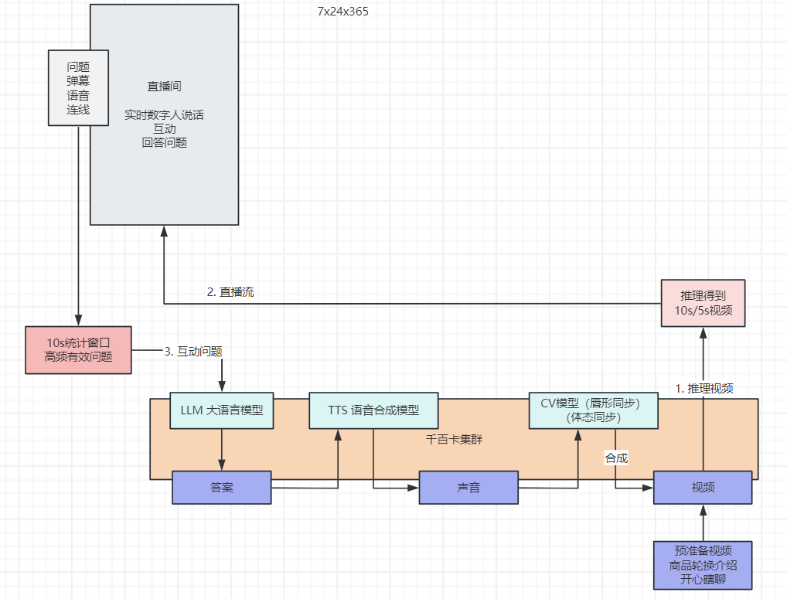
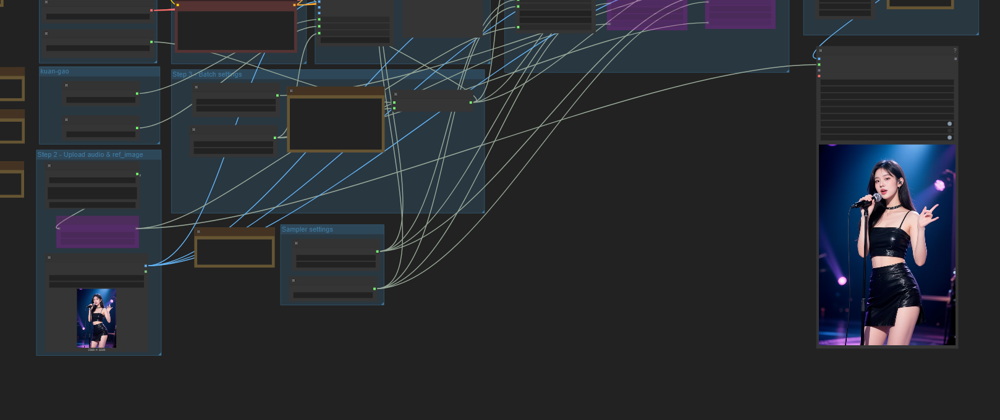
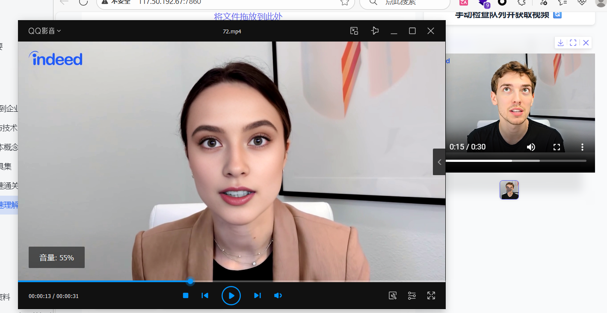
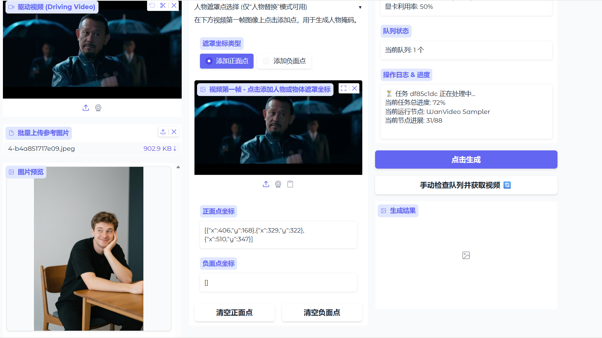
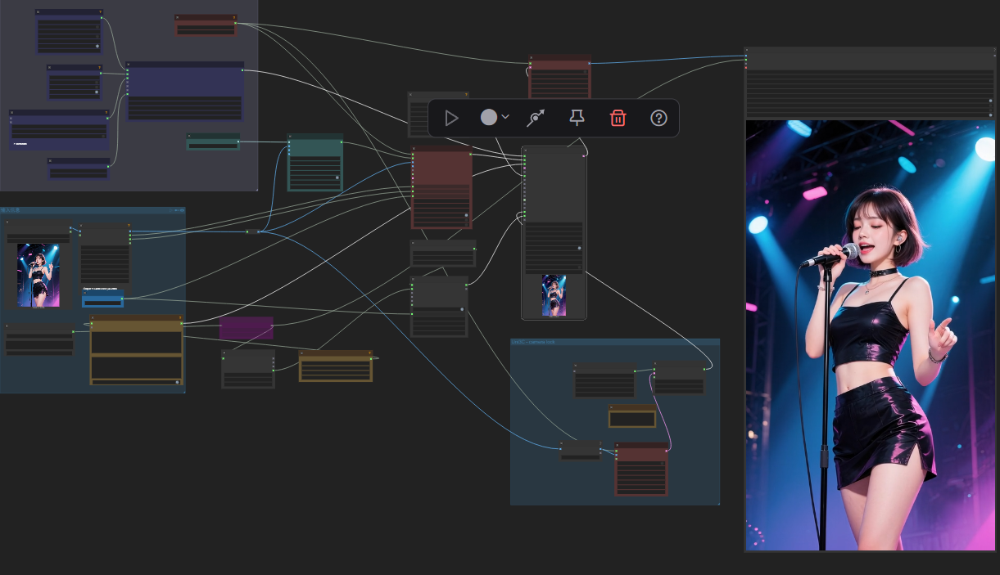
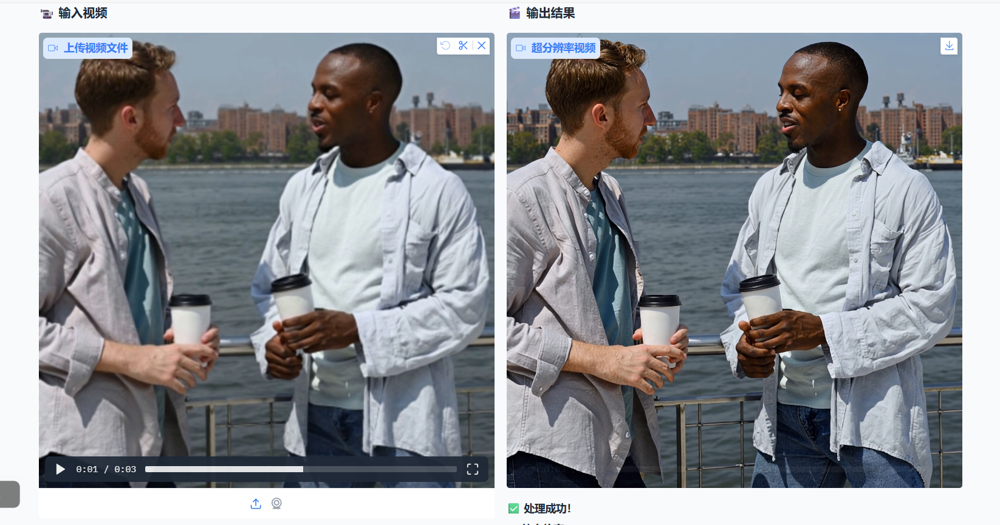
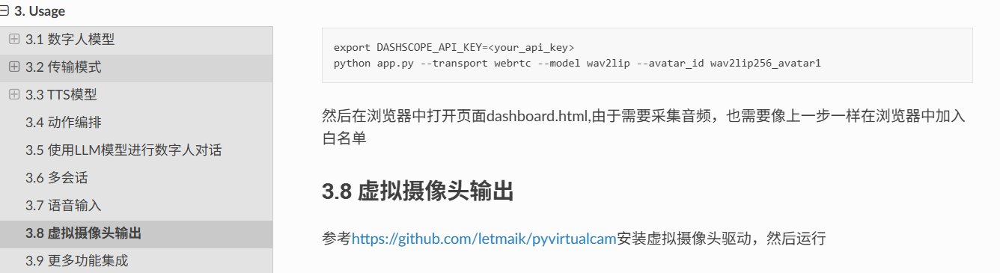

# 4. 快速理解 - 数字人 方案

**下载实验资料**：通过网盘分享的文件：AI数字人技术方案.zip

链接: https://pan.baidu.com/s/1QB6LsPUQ1bPs2vC4mDcbIg?pwd=mxv9 提取码: mxv9 

--来自百度网盘超级会员v9的分享

> 直播系统 + 数字人方案落地
> 
> 大量硬件； 根据文本合成语音==> 同步视频 ==> (每秒做出1帧) ==> (25帧) ==> 稳定输出 ==> 视频 ==> 直播流

直播数字人，是最难方案

# 场景篇

> 2025年6月15日， 罗永浩数字的首播吸引了超1300万人次观看，GMV突破5500万元，部分3C、食品等核心品类商品带货单量超罗永浩5月真人首秀同期数据，创下数字人直播带货新纪录。直播中，两位数字人在交互动作、内容生成和用户响应等方面高度拟真。这一事件不仅刷新了行业认知，也凸显了数字人作为新型内容生产力的巨大潜能。
> 
> https://mp.weixin.qq.com/s/sOLFAEFWU4fh_TGI84cB6Q

随着人工智能技术的不断演进，数字人不局限于直播带货场景，而是加速向更多领域渗透，呈现出多点开花的发展态势，其灵活的形象呈现方式、不断优化的交互能力以及持续在线的工作特性，使其成为各行业数字化转型的新载体。

## 政务服务

https://www.sohu.com/a/758342200_120912206

在政务服务与城市管理场景中，数字人被应用于智慧政务大厅、政策宣讲平台及导览系统中，通过可视化界面为群众提供政策讲解、业务引导和流程提示，有效缓解线下窗口压力，提升政务服务智能化水平。

## 教育培训

在教育培训领域，数字人正逐步替代传统录播课程角色，承担在线教学、答疑与情境互动等任务。其生动的形象和互动性为教育内容增添了趣味性与沉浸感，尤其在语言教学、职业培训等需要高频互动的课程中展现出明显优势。

## 文旅展示

在文旅展示中，数字人被打造为虚拟导游，可以提供路线规划、景点讲解等互动服务，根据游客的兴趣和时间，为其规划最佳的游览路线。在景点讲解方面，生动详细地介绍景点的历史文化和特色，提升景区的知名度和吸引力。

# 架构篇

> 要打造一套完整的 **数字人直播方案**（Digital Human / Virtual Live System），其实是一个融合了多种大模型技术、数字内容生成和实时交互系统的工程。我们可以把整个方案从技术架构上拆解为 **内容生成、语音合成、视觉驱动、行为控制、实时交互和系统集成** 六大部分

## 🧠 内容生成（语言模型核心）

**目标**：让数字人“**会说话、能互动、有逻辑、懂上下文**”。

**技术点：**

- **大语言模型（LargeLanguageModel）**：生成直播脚本、自我介绍、聊天内容、商品介绍、问答等。
  - 可用：GPT 系列、通义千问、百度 ERNIE、智谱 GLM、讯飞星火等。
- **对话管理与人设控制**：通过 prompt engineering、检索增强（RAG）、知识库接入，使数字人按设定角色持续输出符合语气和内容的语言。 会话管理（每个交互有会话唯一id）； 
- **检索增强（RAG）**：实现知识实时扩充；
- **语义理解与情感分析**：辅助判断观众评论/弹幕情绪，选择合适的回应风格。

## 🗣️ 语音生成（TTS / Voice Model）

**目标**：让数字人“拥有自然有情感的声音”，实现 **文本到语音（Text to Speech, TTS）**。

Text To Speech：按照文本合成人类讲话的

Text To Audio：按照文本生成音乐

**技术点：**

- 基于深度学习的多情感语音合成模型，例如 **VITS、FastSpeech2、Tacotron2**。
- 可结合 **语音风格控制（prosody control）**，实现语速、情绪切换（愉快、兴奋、平静等）。
- 若有定制声线需求，可用 **声纹克隆（Voice Cloning）** 技术，如基于 **Speaker Encoder + Synthesizer + Vocoder** 三阶段模型。
- IndexTTS2

## 🧍 视觉生成与驱动（Vision & Animation）

**目标**：生成数字人的 **外观、表情、口型及动作**。

**技术点：**

- **2D/3D 人物建模**：可通过生成模型（如 Stable Diffusion、Hunyuan Avatar、MetaHuman）创建数字人角色。
- **人脸与表情驱动**：
  - 表情驱动模型：Audio2Face（NVIDIA）、SadTalker、Wav2Lip、EMO等。
  - 实现从语音同步到嘴型/表情动画。
- **实时渲染**：
  - 使用 Unreal Engine、Unity 或 WebGL 实现动画实时驱动与背景合成。
- **手势与身体生成**：
  - 可结合动作捕捉或基于 GPT-4V/VideoCrafter 类的视频生成模型自动生成肢体动作。

## 🧍‍♀️行为控制与情绪管理

**目标**：实现不同场景下数字人自动调节语气、表情、姿态。

**技术点：**

- **多模态融合模型（Multimodal Fusion）**：
  - 输入：语音 + 文本 + 弹幕情绪；
  - 输出：合适的表情/动作参数。
- **情绪识别模型（Emotion Recognition）**：
  - 从文本语义或观众语气预测情绪；
  - 触发表情变化。
- **强化学习或行为规划模型**：
  - 让数字人根据实时反馈（观众互动）调整话题与节奏。

## 💬 实时交互与场控系统

**目标**：让数字人“听得懂问题、即时回答、保持连贯”。

**技术点：**

- **语音识别（ASR）**：将观众语音/评论转文本。
- **自然语言理解（NLU）** + **LLM回复生成**。
- **延迟优化（Low-latency pipeline）**：把语音识别、生成、合成、渲染拼接成低延时流。
- **场景脚本管理（Scenario Control）**：
  - 控制直播流程（开场 → 推介 → 互动 → 闭播）；
  - 可用规则 + LLM 规划相结合。

> 一套完整的数字人直播方案，本质是**多模态大模型（文本、语音、视觉）协同系统**。
> 核心技术支撑包括：
> 
> 1. **语言生成大模型（LLM）**
> 2. **语音合成与克隆模型（TTS）**
> 3. **语音驱动的数字人动画模型（Audio-to-Avatar）**
> 4. **情感与多模态融合模型**
> 5. **实时交互与系统调度管线**

# 模型篇

| 模块 | 技术/模型类型 | 国内可商用方案 | 国际/开源方案 |
| --- | --- | --- | --- |
| 语音识别 (ASR) | 自动语音识别 | 科大讯飞 AIUI、阿里云语音识别、百度 UNIT | Whisper (OpenAI)、Deepgram、Google Speech-to-Text |
| 内容生成 (NLP / LLM) | 大语言模型 | 通义千问 Qwen、智谱 GLM-4、百度文心ERNIEBot、讯飞星火 | GPT-4 / GPT-4o (OpenAI)、Claude 3 (Anthropic)、Gemini (Google) |
| 知识增强检索 (RAG) | 文档检索+Embedding | Milvus 向量数据库、阿里 PAI-RAG | FAISS、LangChain、LlamaIndex |
| 情绪与语义理解 | 情感识别/文本分类 | 百度 NLP 服务、腾讯 AI 情感分析 | HuggingFace 模型库(e.g. RoBERTa Sentiment) |
| 语音合成 (TTS) | 文本转语音 | 阿里云 DashScope TTS、讯飞开放平台 TTS、百度 UNIT 语音合成 | Microsoft Azure Speech、ElevenLabs、OpenAI TTS API、[Coqui.ai](http://Coqui.ai) |
| 声纹克隆 (Voice Cloning) | few-shot语音生成 | 听觉科技COSYVoice、ElevenLabs、VALL-E X研究版 | YourTTS、[Resemble.ai](http://Resemble.ai) |
| 表情驱动 / 口型同步 | Audio2Face, 视频合成 | FaceUnity SDK、腾讯智影虚拟形象、华人云数字人SDK | NVIDIA Audio2Face、Wav2Lip、SadTalker、EMO |
| 3D场景渲染 | 实时渲染引擎 | UE5+国产Avatar插件（多家虚拟人厂商的轻集成SDK） | Unreal Engine、Unity、Blender Real-time Engine |
| 多模态融合模型 | 文本 + 语音 + 视觉 | Qwen-VL、百度文心多模态、智谱CogVLM | CLIP、GPT-4V、BLIP-2 |
| 行为与情绪策略控制 | 状态机 + 规划模型 | 自研或基于LLM逻辑控制 | Reinforcement Learning Agent / LangChain Agentic Flow |
| 流媒体推送 / 实时互动 | WebRTC / RTMP 服务 | 金山云 KRTC、阿里云 RTC、腾讯云 TRTC | OBS + WebRTC、自建流媒体服务 |
| 系统整合层 (Pipeline) | 多模型编排 | 阿里PAI-EAS、百度Paddle Serving、ModelScope | HuggingFace Transformers、FastAPI（Flask） + LangChain |

## 智算平台

优云（贵）：https://passport.compshare.cn/register?referral_code=GmZoIcTZGzbG0k0S202Zov

仙宫云：https://www.xiangongyun.com/register/WAE8YM

## 视频合成：Wan2.2

### 基本介绍

深度学习：神经网络 + Tranformer

> Wan2.2 是**阿里巴巴通义万相**实验室推出的**开源视频生成模型**系列，它通过创新的 **MoE**（混合专家）架构和电影级美学控制，让生成高质量视频变得更加高效和灵活。

| 模型名称 | 核心功能 | 输入规格 | 输出规格（典型） | 适用场景与备注 |
| --- | --- | --- | --- | --- |
| Wan2.2-T2V-A14B | 文生视频 | 文本（≤512词） | 5秒，720P，30fps | 从文字描述直接生成视频，适合创意视觉化。 |
| Wan2.2-I2V-A14B | 图生视频 | 图像（≤1280x720） | 5秒，720P，30fps | 为静态图片添加动态效果。 |
| Wan2.2-TI2V-5B | 文/图生视频 | 文本和/或图像 | 5秒，704P，24fps | 消费级显卡可部署（约需22GB显存），灵活性高。 |
| Wan2.2-S2V-14B | 语音驱动视频 | 静态图片 + 音频 | 分钟级，720P | 生成数字人视频，支持长时长输出。 |
| Wan2.2-Animate-14B | 角色动画/替换 | 静态图片 + 参考视频 | 720P | 让图片角色模仿参考视频的动作与表情，适合角色动画创作。 |

**Text**：文本  Video：视频  Image：图片   **Speech：人类语音**  Audio：语音（音乐）

2: To

14Billion： 140 亿参数

S2V：数字人专用；

### S2V效果

> 给定音频 + 参考图片 = 动起来的任务；

### Wan-Animate

### 模型体验

来 优云智算⚡️，一键部署:最强视频编辑-阿里WanAnimate-Q8超高精度-合集

---

🔗https://www.compshare.cn/images/LnDwULYepeRG?referral_code=GmZoIcTZGzbG0k0S202Zov

> 其余体验：
> 
> 1. https://www.compshare.cn/images/VTMDQsZujovW?referral_code=GmZoIcTZGzbG0k0S202Zov
> 2. https://www.compshare.cn/images/xXbJSFCghD4x?referral_code=GmZoIcTZGzbG0k0S202Zov
> 3. (S2V)：https://www.compshare.cn/images/JbXwMsT2FezP?referral_code=GmZoIcTZGzbG0k0S202Zov

## 单/多人对口型：MultiTalk

### 基本介绍

> **美团推出了音频驱动**的多人对话视频生成框架MultiTalk，并在GitHub上开源，首创L-RoPE绑定技术，通过标签旋转位置编码精准解决多音频流与人物错位难题。该框架创新性地采用局部参数训练+多任务学习策略，在保留复杂动作指令跟随能力的同时，实现自适应动态人物定位。只需输入多人音频流、参考图像和文本提示，即可生成**口型精准同步**、**肢体自然的交互视频**，可支持影视制作、直播电商等场景的工具升级。
> 
> https://tech.meituan.com/2025/06/26/multitalk-github.html

### 模型体验

MultiTalk：https://www.compshare.cn/images/cn5h1qb8MarC

### 类似推荐

https://github.com/TMElyralab/MuseTalk

### 效果

## 唇形同步：wav2lip

> 最基本的用法

### 基本介绍

> Wav2Lip 是一种通过将音频与视频中的嘴唇动作同步的技术，旨在生成与音频内容高度匹配的口型动画。其主要应用是让视频中的人物嘴唇动作与配音或其他音频输入精确同步，这在电影配音、虚拟主持人、在线教学、影视后期处理等领域非常有用。

Wav2Lip 基于深度学习，特别是**生成对抗网络（GAN）**。它通过以下关键技术实现音视频的嘴唇同步：

- **生成对抗网络（GAN）**：Wav2Lip 使用了 GAN 框架，其中生成器负责根据输入的音频生成与嘴唇动作同步的图像，判别器则用于评估生成的图像是否与输入的音频匹配。生成器通过不断优化生成与音频匹配的嘴部动作，直到判别器无法区分真假。
- **音频特征提取**：通过卷积神经网络（CNN），从音频信号中提取出有助于判断嘴唇动作的特征。这些特征用于指导生成器生成与音频相符的嘴部动作。
- **视觉输入**：从原始视频帧中提取面部信息，结合音频特征，生成器对嘴唇部分进行调整，使其动作与输入音频相匹配。

通过这些技术和应用，Wav2Lip 为各种音频与视频同步需求提供了强大的解决方案。

- **影视后期配音**：Wav2Lip 能够帮助影视制作中配音演员的声音与演员口型完美匹配，极大减少了后期制作的工作量。
- **虚拟角色和动画**：在游戏、虚拟现实和动画领域，它可以让虚拟角色在实时对话中表现出高度自然的口型同步，提高用户体验的沉浸感。
- **多语言配音**：对于需要将视频配音为多语言的场景，Wav2Lip 可以使嘴型与多语言音频相匹配，提升多语言视频的自然度。
- **可访问性**：对于需要生成同步手语和口型的应用（如为聋哑人提供的工具），Wav2Lip 可以提高准确性和可用性。

### 模型体验

https://www.modelscope.cn/models/numz/wav2lip_studio

## 语音合成：IndexTTS-2

> 声纹克隆 + 语音合成

### 基本介绍

> IndexTTS2 是哔哩哔哩推出的开源语音生成大模型，相比于早期版本的IndexTTS，IndexTTS2在情感表达的细腻度与时长控制的精准性方面有了很大的提升。

### 模型体验

https://www.compshare.cn/images/mbu1nCYVfl9E?referral_code=GmZoIcTZGzbG0k0S202Zov

## 对口型：InfiniteTalk

### 基本介绍

 InfiniteTalk是美团开源，一种新颖的稀疏帧视频配音框架。给定输入视频和音频轨道，InfiniteTalk 合成一个新的视频，具有准确的唇形同步，同时将头部运动、身体姿势和面部表情与音频对齐。与仅关注嘴唇的传统配音方法不同，InfiniteTalk 支持无限长度的视频生成，并保持准确的唇形同步和一致的身份保留。此外，InfiniteTalk 还可以用作图像-音频到视频的模型，以图像和音频作为输入。

- 💬 稀疏帧视频配音 – 不仅同步嘴唇，还同步头部、身体和表情
- ⏱️ 无限长度生成 – 支持无限视频时长
- ✨ 稳定性 – 与 MultiTalk 相比减少了手部/身体的扭曲
- 🚀 唇形准确性 – 比 MultiTalk 实现了更优的唇形同步

https://github.com/MeiGen-AI/InfiniteTalk

### 模型体验

https://www.compshare.cn/images/ykfC7Q7YlzmH?referral_code=GmZoIcTZGzbG0k0S202Zov

## HeyGem（了解）

Heygem 是硅基智能推出的开源数字人模型，专为 Windows 系统设计。基于先进的AI技术，仅需 1 秒视频或 1 张照片，能在 30 秒内完成数字人形象和声音克隆，在 60 秒内合成 4K 超高清视频。Heygem支持多语言输出、多表情动作，具备 100% 口型匹配能力，在复杂光影或遮挡场景下能保持高度逼真的效果。Heygem 基于全离线运行模式，保护用户隐私，支持低配置硬件部署，极大地降低使用门槛，为内容创作、直播、教育等场景提供高效、低成本的数字人解决方案。

## 超分：FlashVSR

https://github.com/OpenImagingLab/FlashVSR

### 基本介绍

> 超分：就是我们说的超分辨率。将低分辨率视频转为1080、4k等高清视频

扩散模型近期在视频修复领域取得进展，但将其应用于现实世界视频超分辨率任务仍面临高延迟、计算成本过高以及对超高分辨率泛化能力不足的挑战。本研究旨在通过实现高效性、可扩展性和实时性能，使基于扩散模型的视频超分辨率技术走向实用化。为此，我们提出 FlashVSR——首个基于扩散模型的单步流式处理框架，致力于实现实时视频超分辨率。通过融合三项互补创新技术，FlashVSR 在单张 A100 GPU 上对 768×1408 分辨率视频可实现约 17 FPS 的处理速度：

1. 支持流式超分辨率训练的友好型三阶段蒸馏流程；
2. 通过局部约束稀疏注意力在弥合训练-测试分辨率差距的同时削减冗余计算；
3. 在不牺牲质量的前提下加速重建的微型条件解码器。

为支持大规模训练，我们还构建了包含 12 万条视频和 18 万张图像的 VSR-120K 数据集。 大量实验表明，FlashVSR 可稳定扩展至超高分辨率，并以比现有一步扩散 VSR 模型快约 12 倍的速度实现最先进的性能。

### 模型体验

https://www.compshare.cn/images/AZzIgukufeLN?referral_code=GmZoIcTZGzbG0k0S202Zov

### 效果

# LiveTalking方案

https://github.com/lipku/livetalking

整合了数字人全套方案； 数字人说话 + 对口型 + 视频推流 都写了；

数字人：

# 技术选型

数字人领域关注核心的几点：

1. **一致性**： 人物融入场景、色彩等合理
2. **超分**： 超分辩率； 离线数字人，数字人模板
3. **唇形同步**：保证说话自然，动作合理

**LLM**：**Deepseek**

**TTS**：**IndexTTS-2**

**S2V**：把语音转成视频，能对上口型

- **Infinitetalk**：有数字人的参考视频
- Wan-S2V：有其他功能；

**FlashVSR**：提升数字人模型的分辨率

# 部署篇

- **云服务组件**：
  - 模型推理（LLM / TTS / I2V）；
  - 流媒体推送（RTSP/RTMP）；
  - 弹幕输入与API接口；
  - GPU渲染集群。
- **性能与稳定性优化**：
  - 模型融合/压缩；
  - 流水线并行；
  - 缓存预生成脚本片段等。

# 附录：ComfyUI

> ComfyUI 是一种基于节点的用户界面设计工具，主要用于操作和管理 Stable Diffusion，通过图形化的工作流程来**创建和优化 AI 艺术生成图像**。它具有模块化和可定制的特点，允许用户自定义流程以实现更精确的工作。此外，ComfyUI 还支持一键加载其他创作者分享的工作流，提供高度的自由度和灵活性。

原文链接：https://blog.csdn.net/2401_84760322/article/details/141020338

> 离线版：自己部署
> 
> 云平台版：
> 宝子们，我发现一个AI图像视频宝藏产品 RunningHub！全球ComfyUI 开发者每天在此发布数百个超有趣超有用的AI应用，娱乐工作一网打尽。打开链接：https://www.runninghub.cn/?inviteCode=uwnbitek 注册领500RH币可以免费生成好多图片视频哦！

## 资源

### 文档

中文wiki：https://comfyui-wiki.com/zh

官方文档：https://docs.comfy.org/zh-CN

### 内置节点一览表

[📎 插件以及简介翻译.xlsx](<files/插件以及简介翻译.xlsx>)

## 教程