# 5. 快速上手 - ComfyUI 

[📎 资料.zip](<files/资料.zip>)

# 界面操作

## 拖拽界面

在空白区域，鼠标左键按住不动，此时可以拖拽显示工作流。

## 新建节点

鼠标左键双击空白区域，会自动弹出一个节点搜索框，在这里输入想要添加的节点名称将会自动创建。

## 常用快捷键

| 组合按键 | 功能 |
| --- | --- |
| Ctrl + Enter | 将当前图形排队以进行生成 |
| Ctrl + Shift + Enter | 将当前图形排队作为第一个生成 |
| Ctrl + Alt + Enter | 取消当前生成 |
| Ctrl + Z | 撤消 |
| Ctrl + Y | 重做 |
| Ctrl + S | 保存工作流 |
| Ctrl + O | 加载工作流 |
| Ctrl + A | 选择所有节点 |
| Alt + C | 折叠/取消折叠选定节点 |
| Ctrl + M | 静音/取消静音所选节点 |
| Ctrl + B | 绕过选定的节点 （就像从图表中删除了节点，并且连线重新连接了） |
| Delete/Backspace | 删除所选节点 |
| Ctrl + Backspace | 删除当前图表 |
| Space | 按住并移动光标时移动画布 |
| Ctrl/Shift + Click | 将单击的节点添加到选择 |
| Ctrl + C | 复制所选节点 |
| Ctrl + V | 粘贴所选节点 （不保持与未所选节点的输出的连接） |
| Ctrl + Shift + V | 粘贴所选节点 （保持从未选中节点的输出到粘贴节点的输入的连接） |
| Shift + Drag | 同时移动多个选定节点 |
| Ctrl + D | Load default 图表 |
| Alt + + | 画布放大 |
| Alt + - | 画布缩小 |
| Ctrl + Shift+ 双击鼠标左键 + 垂直拖动 | 画布放大/缩小 |
| P | 固定/取消固定选定节点 |
| Ctrl + G | 对所选节点进行分组 |
| Q | 切换队列的可见性 |
| H | 切换历史记录的可见性 |
| R | 刷新图表 |
| F | Show/Hide 菜单 |
| . | 使视图适合选择（未选择任何内容时，整个图形） |
| 双击鼠标左键 | 打开节点快速搜索面板 |
| Shift+ 鼠标拖动 | 一次移动多条连线 |
| Ctrl + Alt + 鼠标左键 | 断开所有连线与单击的插槽（需要点击连接点） |

# 基本流程

## 文生图

> 一打开默认界面就是文生图界面

> 1. 写好提示词（关键字用逗号分割）： 漂亮女孩，打篮球
>   1. 把文字转成机器理解的数学向量表示
> 2. 把提示词发给大模型，让大模型绘图
>   1. 输入向量
>   2. 神经网络计算
>   3. 输出向量
> 3. 大模型把绘制完成的图交给我们
>   1. 输出向量数字转为图片

实体（**文字**，**图片**，音频，视频） ==编码==  ** 向量 **===解码=== 实体（文字，**图片**，音频，视频）

## 图生图

> 注意降噪控制：
> 
> 设置1：代表图片全是噪声，都需要修改

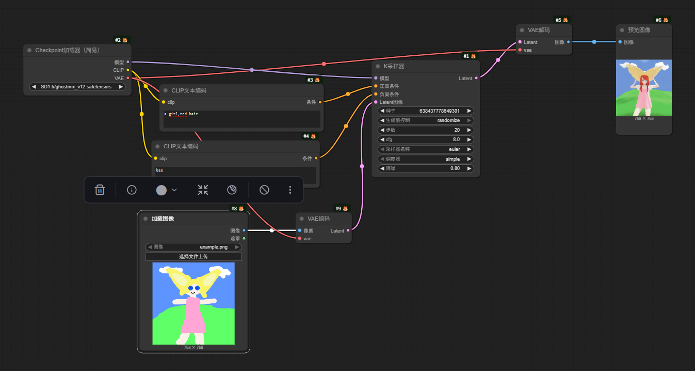

# 核心原理

## Diffusion 模型

> **扩散模型**：处理图像的核心思路就是把一个**全噪声图像**，**不断降噪**而生成**精确图像**

> 通过多步降噪处理。进行绘图

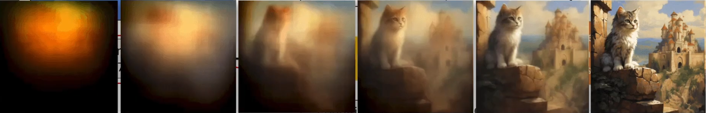

## 基础模型加载器

## CLIP文本编码

CLIP 是一种**计算机视觉模型**，主要用于**图像** 和 **文本** 的相互理解。

**提示词技巧**： **质量词汇** + **主体词汇** + **氛围词汇**

如：（**高质量**, **极致细节）**, （**一个女孩**, **双马尾**,**蓝色校服）**,   （**教室背景**, **动漫风格）**

## **VAE**

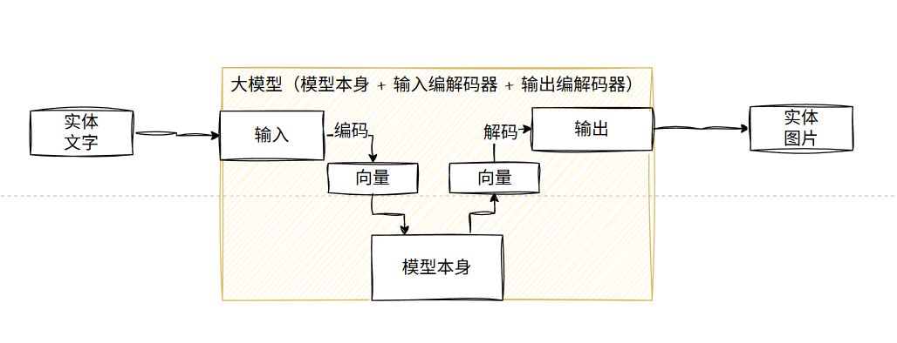

### 介绍

**VAE** = **Variational Autoencoder**（变分自编码器）

- 它本质上是一种**神经网络**结构，用来在**高维数据（图片）**和**低维潜空间（latent space）**之间进行编码（Encode）和解码（Decode）。
- 在 Stable Diffusion 里，VAE 是一个重要的“翻译器”——把**图片** ↔ **潜空间**互相转换。

https://zhuanlan.zhihu.com/p/682709613

### 作用

Stable Diffusion 的生成流程，其实不直接在 512×512 或更大的像素空间里“画”，而是在一个压缩的 **潜空间**中工作：

- **原始图片像素空间非常大（每张图几十万甚至上百万像素）。**
- **模型直接在这么大空间中计算会非常耗资源。**
- 所以训练时，先用 **VAE编码器** 把图片压缩成**潜空间**（比如 64×64×4 这样的紧凑张量）。
- 在生成时，模型完成绘制的是这个压缩后的潜向量，再用 **VAE解码器**把它还原成正常可视的图像。

**简单比喻**：

> VAE编码器 = 把高清图压缩成“绘画蓝图”
> Stable Diffusion模型 = 在蓝图上画（潜空间操作）
> VAE解码器 = 把蓝图变成高清成品。

降维、求导、线性、激活函数（压缩到合理空间）

### 用法

- 不同 VAE 有不同的训练过程，色彩、对比度、细节表现会有差异。
- 有的 VAE 解码更“锐利”，细节更丰富；有的色彩更准确；还有的为特定模型微调过。
- 在 ComfyUI 里，你可以用 **Load VAE** 节点加载自己喜欢的 VAE文件（.vae.safetensors / .pt），替换默认的模型内置 VAE。

1. **VAE Encode**
  - 把图像 → 潜空间
  - 用于图生图或做控制条件。
2. **VAE Decode**
  - 把潜空间 → 图像
  - 文生图最后一步常用。
3. **Load VAE**
  - 加载一个单独的 VAE 模型文件，然后连接到 Decode/Encode 节点。

### 问题

- **如果不用VAE能不能直接输出？**
不行。模型输出的是 latent 格式，不是直接的像素图；跳过解码你只能得到一堆矩阵数据。
- **为什么有时图片色彩不对？**
可能是 VAE 解码的差异。用匹配模型的 VAE 可以减少偏色或模糊。

> **VAE 是 Stable Diffusion 的图片“压缩/解压”器，把图像转换到潜空间，或把潜空间还原成图像，在 ComfyUI 里它是生成链路的关键“翻译节点”。**

## K采样器

### 种子

- **种子**可以理解为每一张图片的身份证号码，无论是通过什么样的方式来生成图像，都会有一个种子编号，这就是**图像的唯一标识**。
- 如果我们**想要生成与上一次生成的图像完全一致的新图像**，那么我们就需要当前设置内的所有参数和种子号码与**之前一致**，种子的影响是所有参数中影响最大的。
- 如果你想重复对同一张图片看一下各参数对这张图片的影响，那请一定要固定种子的ID。

种子还有一个配套的选项，那就是`control_after_generate`参数。

### 种子控制

`control_after_generate`翻译成中文就是`运行后操作`，也就是你每执行一次图片生成之后，种子参数要产生什么样的变化。

如果按照顺序来翻译，是以下这几种情况。

1. **固定**：无论怎么操作，种子都是不变的。
2. **增加**：每次生成图片之后，在之前的种子数值基础上加1。
3. **减少**：每次生成图片之后，在之前的种子数值基础上减1。
4. **随机**：不固定的随机生成一个种子ID。

### 步数

> 简而言之，你可以理解为要把这道菜在微波炉里面热多久？时间越长越好，但也可能会糊，所以需要自行尝试。专业点来讲，就是指在**生成每张图像时，应该绘制扩散多少次计算**。一般来说数值在**20-50**次之间即可。

- 采样步骤与采样方法息息相关，每次采样相当于对原始图像（噪声）进行了一次去噪。
- 最初的DDPM采样步数需要上千步才能获得高质量的图片，其消耗的算力和时间成本不可接受。在牺牲准确和多样性的情况下，我们选用了效率更高的采样方式**DDIM**，获得高质量的图片只需要**50到100**步。后来如**DPM++ 2M**之类的采样算法更是将采样步骤缩进至**20步**，**UniPC**更是只需要**10步**左右就能获取高质量的图片，与之带来的是采样的时间和算力消耗大幅下降，同样的时间内同样的设备能生成出的作品能够更多。
- 各种采样器生成出来的图片差距还是比较大的，请自行权衡。

下面是在同一个采样器模式下，不同步数的多样性绘制次结果比图表。我们可以清晰看每一步的变化过程，在第8步的时候就已经基本能看了，40步之后就显得不太真实了，过度绘制。

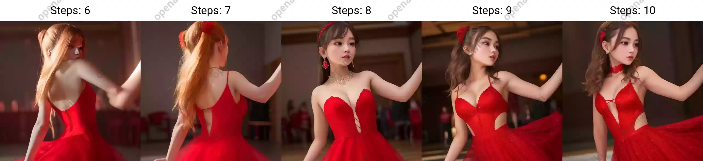

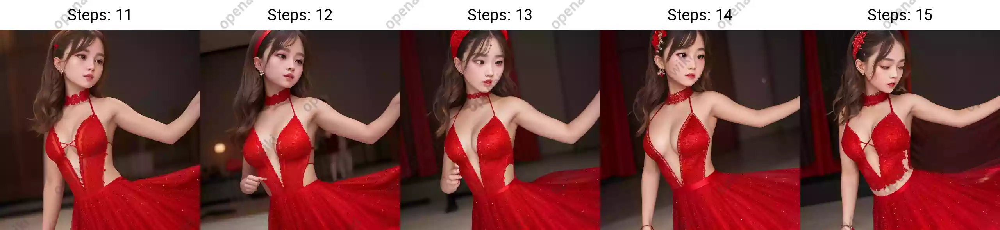

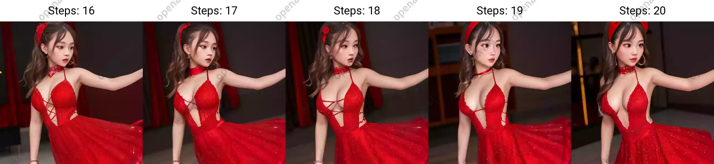

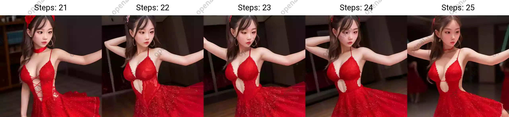

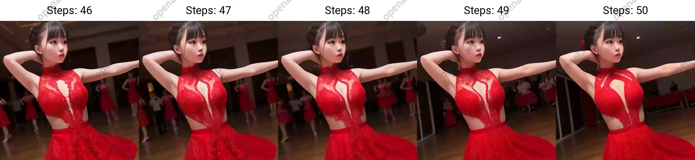

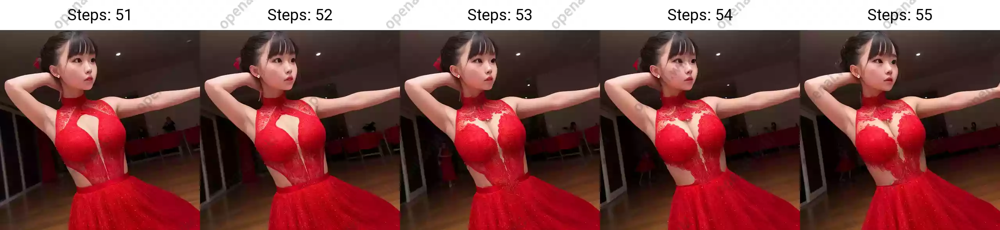

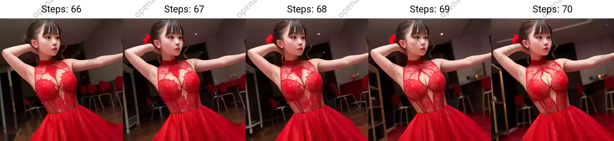

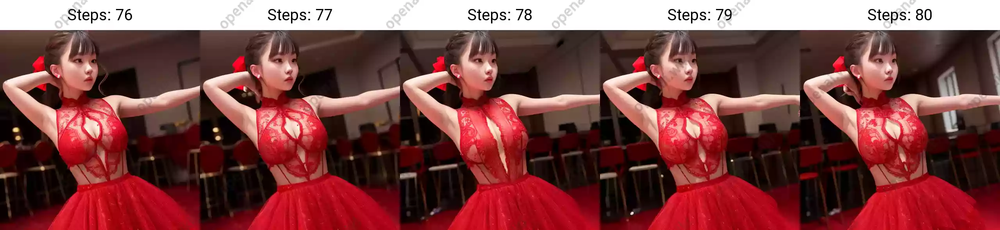

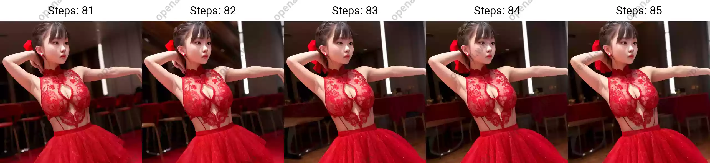

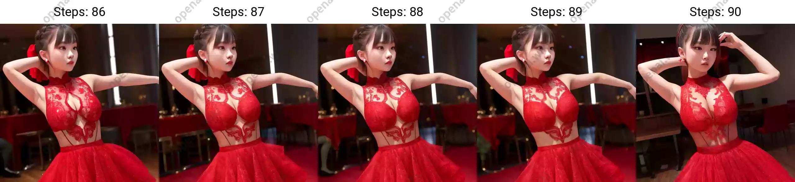

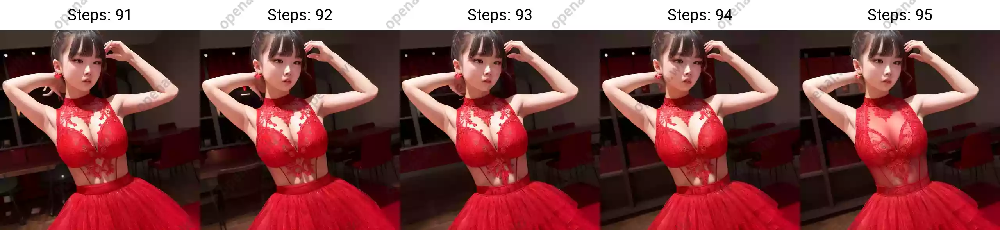

### CFG

> **Classifier-Free Guidance (CFG)** 是一种“提示词引导强度”技术，用于控制模型生成结果受 Prompt（提示词）影响的程度。CFG参数是指对Prompt提示词的权重影响，指定AI自由发挥的程度是多少。

- CFG的**数值越大**，则越按提示词引导生成的权重越大，**AI自由发挥程度越小**。
- CFG的**数值越小**，则越按提示词引导生成的权重越小，**AI自由发挥程度越大**。

通常认为CFG的数值选为7-10是一个非常平衡的区间，既有创意也有能遵循我们的文本提示：

- CFG处于2-6时会创意力（不可控性）提高。
- CFG处于10-15时，你的作品受到你的提示的良性影响。
- CFG处于16-20时，你得确定你的提示真的是你想要的，否则效果不会太好。
- CFG高于20时，可能会产生一些奇怪的现象。

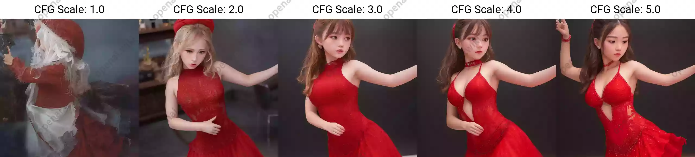

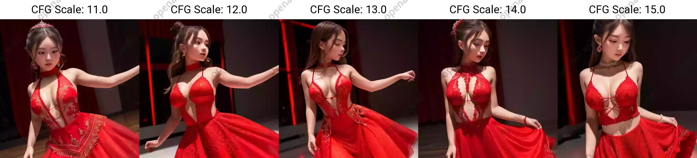

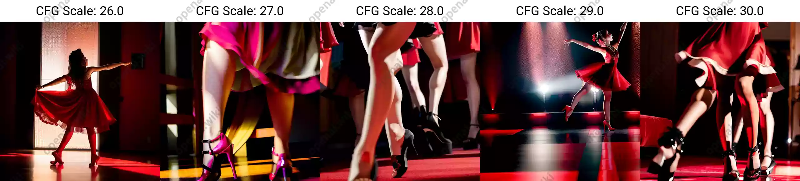

### 采样器名称

| 名称 | 描述 |
| --- | --- |
| Euler | 基于Karras论文，在K-diffusion实现，20-30steps就能生成效果不错的图片，采样器设置页面中的sigma noise、sigma tmin和sigma churn这三个属性会影响到它（后面会提这三个参数的作用）； |
| Euler a | 使用了祖先采样（Ancestral sampling）的Euler方法，受采样器设置中的eta参数影响（后面详细介绍eta）； |
| LMS | 线性多步调度器（Linear multistep scheduler）源于K-diffusion的项目实现； |
| heun | 基于Karras论文，在K-diffusion实现，受采样器设置页面中的 sigma参数影响； |
| DPM2 | 这个是Katherine Crowson在K-diffusion项目中自创的，灵感来源Karras论文中的DPM-Solver-2和算法2，受采样器设置页面中的 sigma参数影响； |
| DPM2 a | 使用了祖先采样（Ancestral sampling）的DPM2方法，受采样器设置中的ETA参数影响； |
| DPM++ 2S a | 在K-diffusion实现的2阶单步并使用了祖先采样（Ancestral sampling）的方法，受采样器设置中的eta参数影响；Cheng Lu的github中也提供已经实现的代码，并且可以自定义，1、2、3阶，和单步多步的选择，webui使用的是K-diffusion中已经固定好的版本。对细节感兴趣的小伙伴可以参考Cheng Lu的github和原论文。 |
| DPM++ 2M | 基于Cheng Lu等人的论文（改进后的版本），在K-diffusion实现的2阶多步采样方法，在Hagging face中Diffusers中被称作已知最强调度器，在速度和质量的平衡最好。这个代表M的多步比上面的S单步在采样时会参考更多步，而非当前步，所以能提供更好的质量。但也更复杂。 |
| DPM++ SDE | DPM++的SDE版本，即随机微分方程（stochastic differential equations），而DPM++原本是ODE的求解器即常微分方程（ordinary differential equations），在K-diffusion实现的版本，代码中调用了祖先采样（Ancestral sampling）方法，所以受采样器设置中的ETA参数影响； |
| DPM fast | 在K-diffusion实现的固定步长采样方法，用于steps小于20的情况，受采样器设置中的ETA参数影响； |
| DPM adaptive | 基于Cheng Lu等人的论文，在K-diffusion实现的自适应步长采样方法，DPM-Solver-12 和 23，受采样器设置中的ETA参数影响； |
| Karras后缀 | LMS Karras 基于Karras论文，运用了相关Karras的noise schedule的方法，可以算作是LMS使用Karras noise schedule的版本； |
|   | DPM2 Karras，DPM2 a Karras，DPM++ 2S a Karras，DPM++ 2M Karras，DPM++ SDE Karras这些含有Karras名字的采样方法和上面LMS Karras意思相同，都是相当于使用Karras noise schedule的版本； |
| DDIM | “官方采样器”随latent diffusion的最初repository一起出现， 基于Jiaming Song等人的论文，也是目前最容易被当作对比对象的采样方法，它在采样器设置界面有自己的ETA； |
| PLMS | 同样是元老，随latent diffusion的最初repository一起出现； |
| UniPC | 最新被添加到webui中的采样器，应该是目前最快最新的采样方法，10步就可以生成高质量结果；在采样器设置界面可以自定义的参数目前也比较多。 |

以下是任何设置全部都相同的情况下，仅更改采样器得到的对比结果图，以及所用的各项参数预设如下

A girl, dancing, red dress,best quality, ultra-detailed, masterpiece, finely detail, highres, 8k wallpaper
**Negative prompt**: lowres, bad anatomy, bad hands, text, error, missing fingers, extra digit, fewer digits, cropped, worst quality, low quality, normal quality, jpeg artifacts, signature, watermark, username, blurry

Steps: 20, Sampler: DPM++ 2S a Karras, CFG scale: 7, Seed: 3657492522, Size: 512x512, Model hash: 7234b76e42, Model: chilloutmix_Ni

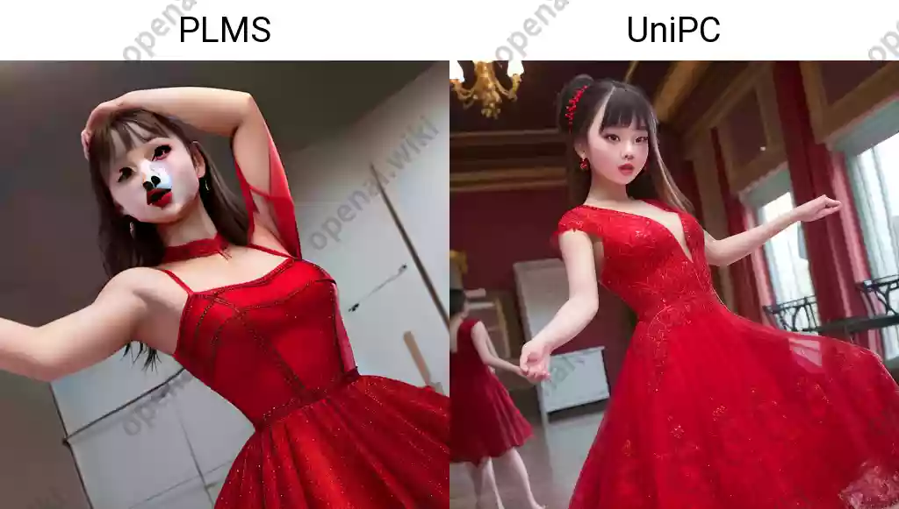

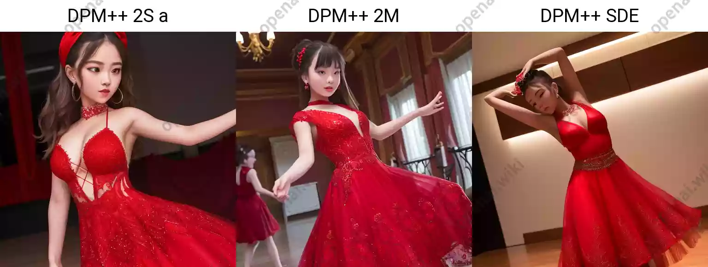

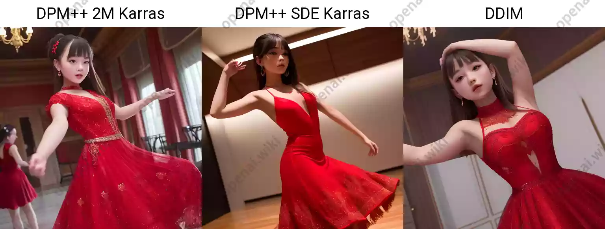

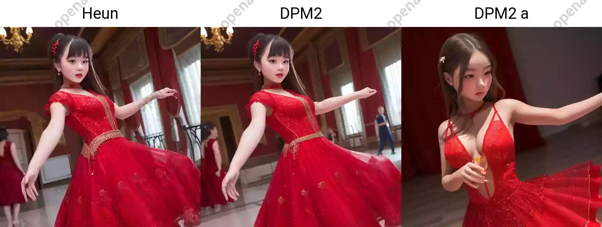

### 调度器

在 ComfUI 的 **K采样器（K-Sampler）** 中，**调度器（Scheduler）** 是一个关键参数，主要用于控制 **扩散模型（如 Stable Diffusion）生成图像时的去噪过程**。它的核心功能是决定 **如何调整噪声水平（或步长）** 随时间（或迭代步骤）的变化方式，从而影响生成**图像的质量、细节和速度**。

1. **噪声衰减策略**：
  - 扩散模型通过逐步去除噪声生成图像。调度器定义了每一步的噪声减少幅度（如从高噪声到低噪声的变化节奏）。
  - 例如，线性调度器可能均匀减少噪声，而其他调度器可能在早期大幅降噪、后期微调细节。
2. **速度与质量的平衡**：
  - **激进型调度器**（如 `DDIM`）：用较少的步骤完成生成，可能牺牲部分细节，适合快速生成。
  - **保守型调度器**（如 `Karras`）：用更多步骤精细调整，生成质量更高但耗时更长。
3. **稳定性和收敛性**：
  - 某些调度器能避免采样过程中的数值不稳定问题（如梯度爆炸），确保生成过程平稳。
4. **控制生成多样性**：
  - 不同调度器可能影响结果的随机性。例如，`Euler` 调度器确定性较强，而 `DPM++` 系列可能引入更多变化。

**常见调度器类型举例：**

- **线性调度器**（Linear）：噪声均匀减少，简单但可能不够高效。
- **Karras 调度器**：根据论文设计，在迭代后期减小步长，提升细节。
- **DDIM**：基于确定性过程，适合快速生成。
- **DPM-Solver**：针对扩散模型优化，平衡速度与质量。
- **Euler、Heun**：经典数值方法，前者快，后者更精确。

**实际使用建议：**

- **追求速度**：选择 `DDIM` 或 `Euler`，减少采样步数（如 20 步）。
- **追求质量**：使用 `DPM++ 2M Karras` 或 `UniPC`，增加步数（如 30-50 步）。
- **实验调整**：不同调度器对提示词（prompt）的响应可能不同，需结合具体场景测试。

通过调整调度器，用户可以灵活控制生成过程的效率与效果，是优化图像生成的重要参数之一。

### 降噪

在图像生成模型（如 Stable Diffusion 的扩散过程）中，降噪是一个关键控制参数，它直接影响生成过程中噪声的去除程度和图像生成的**自由度**。以下是它的核心作用：

1. **控制噪声去除的强度**：
  - 扩散模型通过逐步去除初始噪声（或输入图像的噪声）来生成图像。降噪参数决定了**每一步去噪的强度**，即模型在每一步多大程度上“信任”预测的去噪结果。
  - **值越高**：去噪越激进，生成的图像与初始噪声（或输入）的关联性越低，**自由度更高**，但可能导致细节丢失或结构失真。
  - **值越低**：去噪更保守，生成的图像会更接近初始噪声（或输入），**保留更多原始信息**，但可能残留噪声或缺乏创意性变化。
2. **平衡“生成自由度”与“稳定性”**：
  - 当降噪参数接近 `1.0` 时，模型几乎完全重新生成内容（适合完全从头创作）。
  - 当降噪参数接近 `0` 时，模型严格遵循输入内容（适合微调或修复现有图像）。
3. **影响图像生成的“可控性”**：
  - 在 **图生图（img2img）** 任务中，降噪参数决定了输入图像对生成结果的约束力：
    - **低值（如 0.2-0.5）**：输出与输入高度相似，适合局部修复或风格迁移。
    - **高值（如 0.7-1.0）**：输出可能完全脱离输入，生成全新内容。

---

**实际应用场景**

1. **文生图（text2img）**：
  - 降噪参数通常固定为 `1.0`（完全自由生成），模型从纯噪声开始逐步生成图像。
2. **图生图（img2img）**：
  - **修复/增强图像**：降噪参数设为 `0.3-0.6`，模型在保留原图结构的基础上优化细节。
  - **风格迁移/重绘**：设为 `0.5-0.8`，在保留大致构图的同时改变风格或内容。
  - **完全重新生成**：设为 `0.8-1.0`，忽略原图内容，仅根据提示词生成新图像。
3. **ControlNet 等控制工具**：
  - 降噪参数与 ControlNet 的权重配合，控制生成结果在遵循输入条件（如边缘、姿态）和自由发挥之间的平衡。

---

**与其他参数的关系**

- **采样步数（Steps）**：
  - 降噪参数高时，可能需要更多采样步数来保证生成稳定性。
- **提示词权重（Prompt Strength）**：
  - 高降噪参数下，提示词对生成结果的影响更显著。
- **调度器（Scheduler）**：
  - 不同调度器的噪声衰减策略会影响降噪参数的效果（例如，Karras 调度器可能在后期微调时更敏感）。

---

**调参建议**

- **默认值**：图生图任务通常从 `0.75` 开始尝试。
- **低噪图像修复**：设为 `0.3-0.5`，避免过度修改原图。
- **创意性生成**：设为 `0.7-0.95`，结合高权重提示词。
- **避免极端值**：
  - 高于 `1.0`：可能导致图像崩坏。
  - 低于 `0.2`：可能无法有效去噪，生成模糊或残留噪声。

---

**示例**

- 输入一张模糊的风景照片，设置降噪参数为 `0.4`：模型会轻微锐化细节，保留原图构图。
- 同一张照片，降噪参数设为 `0.8`：可能将风景彻底重绘为动漫风格，甚至改变季节或时间。

降噪参数本质是控制生成过程的“创造力阀门”，需根据任务目标（修复、重构、创新）动态调整。

## 步骤总结

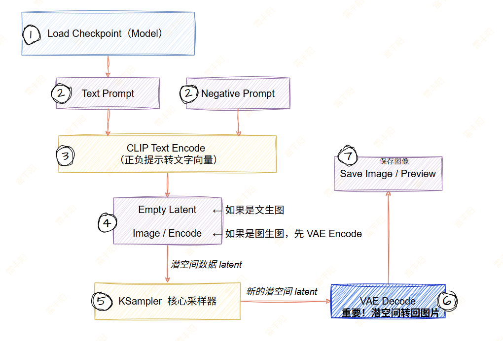

# 运行原理

## 文生图

### CLIP 模型（输入向量化处理）

> CLIP： 将文本或者图片转为之前预训练好的图片模型的向量范围数字；

**全称**：Convolutional(卷积) Language-Image Pre-training

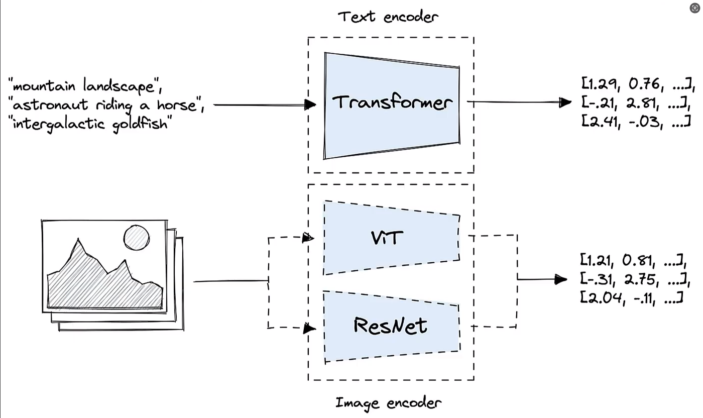

1. **CLIP模型**：
  1. 文本编码：输入文本，经过Transformer 转为特征向量
  2. 图像编码：训练集图像数据转为特征向量

### K采样器

高斯噪声、U形网络 都是属于 K采样器 的部分

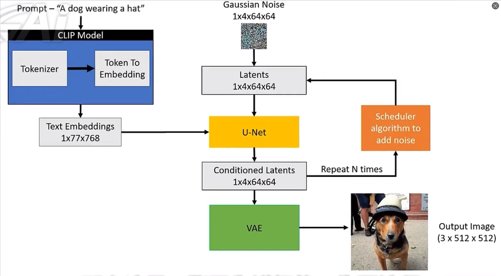

### 加载器

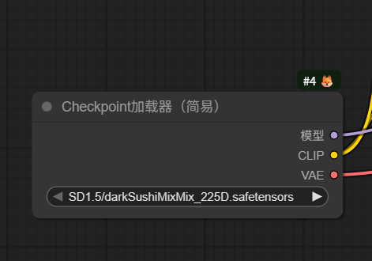

CLIP模型 + UNet模型 + VAE模型 一般都是由Diffusion大模型自己提供的；

模型：指的就是UNet模型

CLIP：CLIP模型

VAE：图像编解码器模型

## 图生图

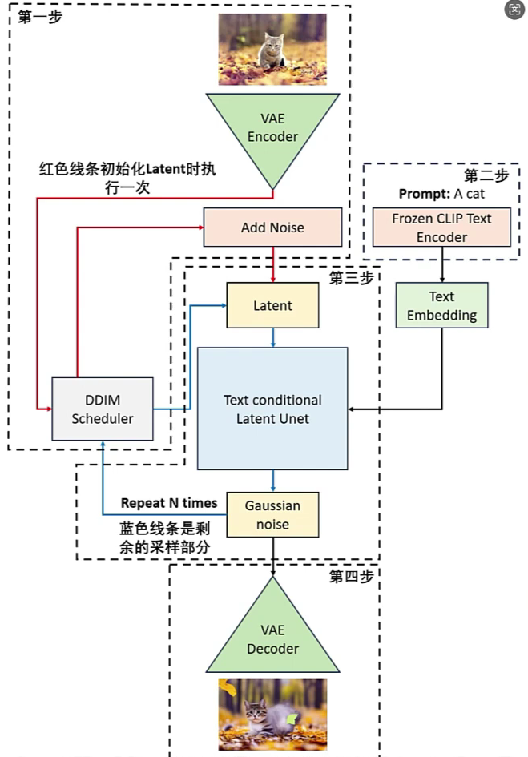

# 模型三部分

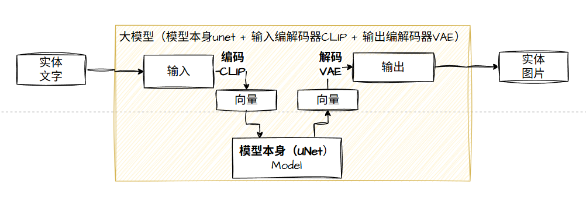